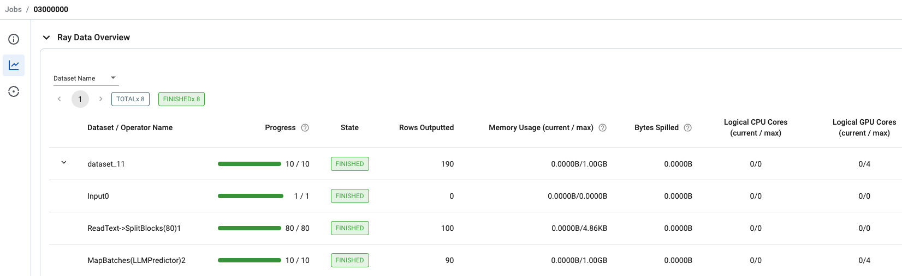

## LLM offline batch inference with Ray Data and vLLM

**⏱️ Time to complete**: 10 min

This template shows you how to:
1. Read in data from in-memory samples or files on cloud storage. 
2. Use Ray Data and vLLM to run batch inference of a LLM.
3. Write the inference outputs to cloud storage.

For a Python script version of the `.ipynb` notebook used for the workspace template, refer to `examples/main.py`.

**Note:** This tutorial is run within a workspace. Please overview the `Introduction to Workspaces` template first before this tutorial.

### How to decide between online vs offline inference for LLM
Online LLM inference (e.g. Anyscale Endpoint) should be used when you want to get real-time response for prompt or to interact with the LLM. Use online inference when you want to optimize latency of inference to be as quick as possible.

On the other hand, offline LLM inference should be used when you want to get reponses for a large number of prompts within some time frame, but not required to be real-time (minutes to hours granularity). Use offline inference when you want to:
1. Scale your workload to large-scale datasets
2. optimize inference throughput and resource usage (for example, maximizing GPU utilization).

### Step 1: Install Python dependencies
Install additional required dependencies using `pip`.


```python
!pip install -q vllm==0.3.3 && echo 'Install complete!'
```

Next, import the dependencies used in this template.


```python
import os
from typing import Dict

import numpy as np
import ray
from vllm import LLM, SamplingParams

from util.utils import generate_output_path
```

### Step 2: Set up model defaults
Set up default values that will be used in the batch inference workflow:
* Your [Hugging Face user access token](https://huggingface.co/docs/hub/en/security-tokens). This will be used to download the model.
* The model to use for inference ([the list of supported models](https://docs.vllm.ai/en/latest/models/supported_models.html)).
* The [sampling parameters object](https://github.com/vllm-project/vllm/blob/main/vllm/sampling_params.py) used by vLLM.
* The output path where results will be written as parquet files.


```python
# Set the Hugging Face token. Replace the following with your token.
HF_TOKEN = "<REPLACE_WITH_YOUR_HUGGING_FACE_USER_TOKEN>"
# Set to the model that you wish to use. Note that using the llama models will require a hugging face token to be set.
HF_MODEL = "meta-llama/Llama-2-7b-chat-hf"
# Create a sampling params object.
sampling_params = SamplingParams(temperature=0, max_tokens=2048)
# Output path to write output result. You can also change this to any cloud storage path, e.g. a specific S3 bucket.
output_path = generate_output_path(os.environ.get("ANYSCALE_ARTIFACT_STORAGE"), HF_MODEL)
```

Start up Ray, using the Hugging Face token as an environment variable so that it's made available to all nodes in the cluster.


```python
if ray.is_initialized():
    ray.shutdown()
ray.init(
    runtime_env={
        "env_vars": {"HF_TOKEN": HF_TOKEN},
    }
)
```

### Step 3: Read input data with Ray Data
Use Ray Data to read in your input data from some sample prompts.


```python
# Create some sample prompts, and use Ray Data to create a dataset for it.
prompts = [
"""
I always wanted to be a ...
""",
"""
The best way to learn a new language is ...
""",
"""
The biggest challenge facing our society today is ...
""",
"""
One thing I would change about my past is ...
""",
"""
The key to a happy life is ...
""",
]
ds = ray.data.from_items(prompts)

# View one row of the Dataset.
ds.take(1)
```

### Scaling to a larger dataset
In the cell above, we created a Ray Dataset with 5 example prompts. Next, let's explore how to scale to a larger dataset based on files stored in cloud storage.

Run the following cell to create a Dataset from a text file stored on S3. This Dataset has 100 rows, with each row containing a single prompt in the `text` column.


```python
# Specify 4 blocks to ensure that each of the 4 GPUs in this workspace get data to process, maximizing GPU utilization.
ds = ray.data.read_text("s3://anonymous@air-example-data/prompts_100.txt", override_num_blocks=4)
ds.take_all()
```

### Step 4: Run Batch Inference with vLLM

Create a class to define batch inference logic.


```python
class LLMPredictor:
    def __init__(self):
        # Create an LLM.
        self.llm = LLM(model=HF_MODEL)

    def __call__(self, batch: Dict[str, np.ndarray]) -> Dict[str, list]:
        # Generate texts from the prompts.
        # The output is a list of RequestOutput objects that contain the prompt,
        # generated text, and other information.
        outputs = self.llm.generate(batch["text"], sampling_params)
        prompt = []
        generated_text = []
        for output in outputs:
            prompt.append(output.prompt)
            generated_text.append(' '.join([o.text for o in output.outputs]))
        return {
            "prompt": prompt,
            "generated_text": generated_text,
        }
```

### Scaling with GPUs

Apply batch inference for all input data with the Ray Data [`map_batches`](https://docs.ray.io/en/latest/data/api/doc/ray.data.Dataset.map_batches.html) method. Here, you can easily configure Ray Data to scale the number of LLM instances and compute (number of GPUs to use).


```python
ds = ds.map_batches(
    LLMPredictor,
    # Set the concurrency to the number of LLM instances.
    concurrency=4,
    # Specify the number of GPUs required per LLM instance.
    num_gpus=1,
    # Specify the batch size for inference. Set the batch size to as large possible without running out of memory.
    # If you encounter CUDA out-of-memory errors, decreasing batch_size may help.
    batch_size=10,
)
```

To use GPUs for inference in the Workspace, we specify `num_gpus=1` in the `ds.map_batches()` call above to indicate that each LLM instance should use 1 GPU. With `concurrency=4`, we have 4 LLM instances, each using 1 GPU, so we need 4 GPUs total.

Finally, make sure to either enable *Auto-select worker nodes* or configure your workspace cluster to have GPU worker nodes:


Time to execute and view the results!


```python
ds.take_all()
```

In the Ray Dashboard tab, navigate to the Job page and open the "Ray Data Overview" section to view the details of the batch inference execution:


Finally, write the inference output data out to Parquet files on S3.


```python
ds.write_parquet(output_path)
print(f"Batch inference result is written into {output_path}.")
```

We can also use Ray Data to read back the output files to ensure the results are as expected.


```python
ds_output = ray.data.read_parquet(output_path)
ds_output.take(5)
```

### Summary

This notebook:
- Read in data from in-memory samples or input files from cloud storage. 
- Used Ray Data and vLLM to run offline batch inference of a LLM.
- Wrote the inference outputs to cloud storage.


