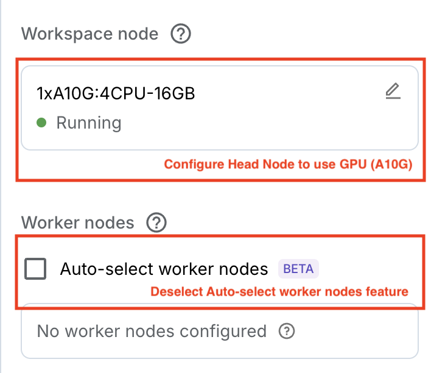
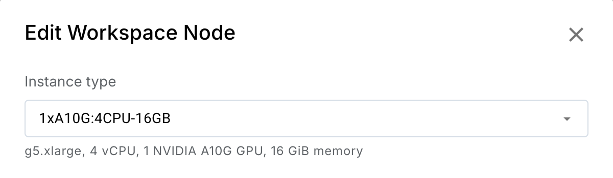

# LLM offline batch inference with RayLLMBatch APIs

**⏱️ Time to complete**: 10 min


<!-- TODO: add a link for the RayLLMBatch API reference -->
This template shows you how to run batch inference for LLMs using RayLLMBatch.

For a Python script version of the code in this workspace template, refer to `main.py`.

**Note:** This tutorial runs within a workspace. Review the `Introduction to Workspaces` template before this tutorial.

## Prerequisites

This tutorial requires a workspace with A10G GPU, to configure the workspace with A10G GPU, please configure the head node type to have an A10G GPU:





### How to decide between online vs offline inference for LLM
Online LLM inference (e.g. Anyscale Endpoint) should be used when you want to get real-time response for prompt or to interact with the LLM. Use online inference when you want to optimize latency of inference to be as quick as possible.

On the other hand, offline LLM inference (also referred to as batch inference) should be used when you want to get reponses for a large number of prompts within some time frame, but not required to be real-time (minutes to hours granularity). Use offline inference when you want to:
1. Scale your workload to large-scale datasets
2. Optimize inference throughput and resource usage (for example, maximizing GPU utilization).

In this tutorial, we will focus on the latter, using offline LLM inference for a summarization task using real-world news articles.


## Step 1: Set up the workload

RayBatchLLM is a library for running batch inference for LLMs using Ray Data for data processing, and defines an easy and flexible interface for the user to define their own workload. In this tutorial, we will implement a workload based on the [`CNNDailyMail`](https://huggingface.co/datasets/abisee/cnn_dailymail) dataset, which is a collection of news articles. And we will summarize each article with our batch inferencing pipeline.

```python

from rayllm_batch.workload import ChatWorkloadBase
from typing import Optional, Dict, Any
import ray 
from ray.data.dataset import Dataset
from dataclasses import dataclass, field


@dataclass
class CNNDailySummary(ChatWorkloadBase):
    """The CNN/DailyMail summarization workload."""

    # We directly load the dataset from Hugging Face.
    dataset_file: Optional[str] = None
    # We will load only a portion of the dataset to run inference faster for the tutorial.
    dataset_fraction: float = 0.0003 # 0.03% of the 300K entries.
    # The sampling params for the LLM inference workload.
    sampling_params: Dict[str, Any] = field(default_factory=lambda: {"max_tokens": 150})

    def load_dataset(self) -> Dataset:
        # Load the dataset from Hugging Face into Ray Data.
        import datasets  # type: ignore

        df = datasets.load_dataset("cnn_dailymail", "3.0.0")
        return ray.data.from_huggingface(df["train"])

    def parse_row(self, row: dict[str, Any]) -> dict[str, Any]:
        # Parse the row into the format expected by the model.
        # We will use the article as the user prompt, and ask the model to 
        # generate a summary with the system prompt.
        return {
            "messages": [
                {
                    "role": "system",
                    "content": "You are a commentator. Your task is to "
                    "summarize highlights from article.",
                },
                {
                    "role": "user",
                    "content": f"# Article:\n{row['article']}\n\n"
                    "#Instructions:\nIn clear and concise language, "
                    "summarize the highlights presented in the article.",
                },
            ]
        }


workload = CNNDailySummary()
sample_data = workload.load_dataset().take(1)
print(sample_data)
```

We will cover more details on how to customize the workload in the later sections.

## Step 2: Define the model configs

We will also need to define the model configs for the LLM engine, which configures the model and compute resources needed for inference. 

Some models will require you to input your [Hugging Face user access token](https://huggingface.co/docs/hub/en/security-tokens). This will be used to authenticate/download the model and **is required for official LLaMA, Mistral, and Gemma models**. You can use one of the other models which don't require a token if you don't have access to this model (for example, `mlabonne/NeuralHermes-2.5-Mistral-7B`).

Run the following cell to start the authentication flow. A VS Code overlay will appear and prompt you to enter your Hugging Face token if your selected model requires authentication. If you are using a model that does not require a token, you can skip this step. For this example, we will be using the `meta-llama/Meta-Llama-3.1-8B-Instruct` model, which requires a token.

```python
# Prompts the user for Hugging Face token if required by the model.
from util.utils import prompt_for_hugging_face_token
HF_TOKEN = prompt_for_hugging_face_token("meta-llama/Meta-Llama-3.1-8B-Instruct")
```


In this example, we will be using the `meta-llama/Meta-Llama-3.1-8B-Instruct` model, 
We will also need to define a model yaml associated with the model we want to use to configure the compute resources, engine arguments and other inference engine specific parameters. For more details on the the model configs, see the [API doc](https://docs.anyscale.com/llms/serving/guides/bring_any_model/) on bringing your own models.

```python

from rayllm_batch import init_engine_from_config
# Read the model configs from the path.
model_config_path = "configs/llama-3.1-8b-a10g.yaml"

# One could potentially override the engine configs by passing in a dictionary here.
override = {"runtime_env": {"env_vars": {"HF_TOKEN": HF_TOKEN}}} # Override Ray's runtime env to include the Hugging Face token. Ray is being used under the hood to orchestrate the inference pipeline.
engine_config = init_engine_from_config(config=model_config_path, override=override)

```


## Step 3: Run the batch inference through RayLLMBatch


With the workload and model configs defined, we can now run the batch inference through RayLLMBatch.

```python

from rayllm_batch import RayLLMBatch

batch = RayLLMBatch(
    engine_config=engine_config,
    workload=workload,
    # Specify the batch size for inference. Set the batch size to as large as possible without running out of memory.
    # If you encounter out-of-memory errors, decreasing batch_size may help. 
    batch_size=None,
    # Set the number of replicas to use for the inference. Each replica will run one instance of inference pipeline.
    num_replicas=1,
)


# This will runs until completion.
ds = batch.run()


# Read the results
gen_texts = [r["generated_text"] for r in ds.take_all()]
print(gen_texts)
```

### Customizing your LLM inference workload

As shown in the example above, one can easily customize the workload by overriding the `load_dataset` and `parse_row` methods. The workload class is defined with the below APIs that one can override:

```python
@dataclass
class MyChatWorkload(ChatWorkloadBase):
    """My chat workload."""

    # Path to the dataset file.
    dataset_file: Optional[str] = "/path/to/dataset.jsonl"

    # Sampling parameters such as max_tokens, temperature, etc.
    sampling_params: Dict[str, Any] = field(
        default_factory=lambda: {"max_tokens": 150, "ignore_eos": False}
    )

    # Other workload parameters
    # ...

    def load_dataset(self) -> Dataset:
      """Load dataset using Ray Data APIs."""
      pass

    def parse_row(self, row: Dict[str, Any]) -> Dict[str, Any]:
      """Parse each row in the dataset to make them compatible with
      OpenAI chat API messages. Specifically, the output row should only
      include a single key "messages" with type List[Dict[str, Union[str, List[Dict]]]].      
      """
      pass
```


### Monitoring the execution

RayLLMBatch uses Ray Data to implement the execution of the batch inference pipeline, and one can use the Ray Dashboard to monitor the execution. In the Ray Dashboard tab, navigate to the Job page and open the "Ray Data Overview" section. Click on the link for the running job, and open the "Ray Data Overview" section to view the details of the batch inference execution:


### Handling GPU out-of-memory failures
If you run into CUDA out of memory, your batch size is likely too large. Set an explicit small batch size or use a smaller model (or a larger GPU).

## Summary

This notebook:
- Created a custom workload for the CNN/DailyMail summarization task.
- Defined the model configs for the Meta Llama 3.1 8B model.
- Ran the batch inference through RayLLMBatch and monitored the execution.
