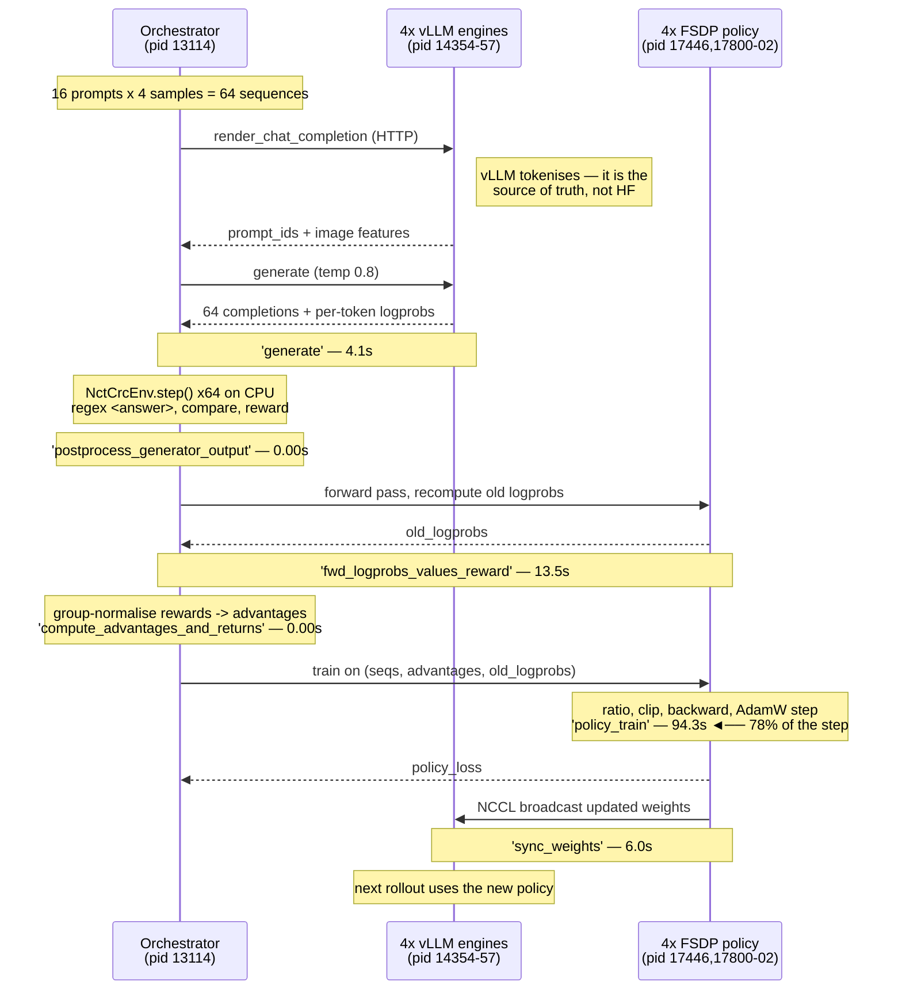

# What SkyRL actually does on the Ray cluster

Drawn from the live `pathvlm_2b` run, not from the docs — every process ID, node
IP and timing below was read out of `logs/pathvlm_run.log` and `ray list actors`
while the job was running on 4x A10G.

The single most important thing to internalise:

> **You launch on the head node. Essentially nothing runs there.**

That one fact explains three of the four sharp edges in `RUNSHEET.md`.

---

## 1. Physical layout

```
┌─ HEAD NODE ──────────────────────────────── m5.2xlarge, CPU-only, 10.0.108.64 ┐
│                                                                              │
│   your shell:  bash run_pathvlm.sh                                           │
│        └── uv run --isolated --extra fsdp python pathvlm_entrypoint.py       │
│                                                                              │
│            main()                                                            │
│              ├── SkyRLTrainConfig.from_cli_overrides()                       │
│              ├── validate_cfg()                                              │
│              ├── initialize_ray()  ──► ray.init(runtime_env={...})           │
│              └── ray.get(pathvlm_entrypoint.remote(cfg, env))                │
│                       │                                                      │
│                       │  ...and then it just BLOCKS here for hours.          │
│                       │  No model, no GPU, no env, no data.                  │
└───────────────────────┼──────────────────────────────────────────────────────┘
                        │  Ray ships: working_dir (the SkyRL repo)
                        │             py_executable ("uv run --isolated ...")
                        ▼
┌─ GPU WORKER ────────────────────────── g5.12xlarge, 4x A10G 24GB, 10.0.104.69 ┐
│                                                                              │
│  ┌────────────────────────────────────────────────────────────────────────┐  │
│  │ ORCHESTRATOR  —  pathvlm_entrypoint  pid 13114   (num_cpus=1, NO GPU)   │  │
│  │                                                                        │  │
│  │   register("nct_crc") ──► BasePPOExp.run()                             │  │
│  │      ├── RayPPOTrainer          the step loop                          │  │
│  │      ├── SkyRLVLMGymGenerator   rollout driver (asyncio)               │  │
│  │      ├── PromptDataset          reads train.parquet                    │  │
│  │      └── NctCrcEnv x N          ◄── YOUR env.py runs HERE, in-process, │  │
│  │                                     one object per trajectory, on CPU  │  │
│  └───────────┬──────────────────────────────────────┬─────────────────────┘  │
│              │ HTTP (render + generate)             │ Ray actor calls        │
│              ▼                                      ▼                        │
│  ┌───────────────────────────┐        ┌───────────────────────────────────┐  │
│  │ ROLLOUT  4x VLLMServerActor        │ TRAINING  4x FSDPPolicyWorkerBase │  │
│  │   pid 14354 14355 14356 14357      │   pid 17446 17800 17801 17802     │  │
│  │     └─ EngineCore                  │                                   │  │
│  │         pid 14884 14894 14901 14908│   Qwen3-VL-2B, FSDP-sharded       │  │
│  │           └─ RayWorkerProc         │   bf16 + grad checkpointing       │  │
│  │               pid 15441..15444     │   AdamW                           │  │
│  │                 └─ model shard     │                                   │  │
│  └───────────────────────────┘        └───────────────────────────────────┘  │
│                     ▲                                  │                     │
│                     └────── NCCL weight broadcast ─────┘                     │
│                             ("sync_weights", ~6s)                            │
│                                                                              │
│         GPU 0        GPU 1        GPU 2        GPU 3                         │
│      ┌─────────┐  ┌─────────┐  ┌─────────┐  ┌─────────┐                      │
│      │engine+  │  │engine+  │  │engine+  │  │engine+  │  colocate_all=true:  │
│      │ policy  │  │ policy  │  │ policy  │  │ policy  │  BOTH share each GPU │
│      └─────────┘  └─────────┘  └─────────┘  └─────────┘                      │
│                                                                              │
│  plus: RegistryActor pid 12890  (named actor, from sync_registries())        │
└──────────────────────────────────────────────────────────────────────────────┘
```

## 2. Process inventory (what `ray list actors` showed)

| Component | Count | GPU | Role |
|---|---|---|---|
| `pathvlm_entrypoint` task | 1 | no | Orchestrator. Trainer + generator + **your envs** |
| `VLLMServerActor` | 4 | 1 each | HTTP server wrapping a vLLM engine |
| └ `EngineCore` → `RayWorkerProc` | 4 → 4 | — | Child procs holding the actual model |
| `FSDPPolicyWorkerBase` | 4 | 1 each | The trainable policy, FSDP-sharded |
| `RegistryActor` | 1 | no | Cluster-wide registry sync |
| `FSDPRefWorkerBase` | **0** | — | **Not created** — see below |
| Critic / value worker | **0** | — | **Not created** — see below |

### What is *absent* is the interesting part

`context/grpo-step-anatomy.md` sketches four GPU tenants (vLLM, policy, frozen
reference, reward model). **This run has two.** Why:

- **No critic / value model.** That is the whole point of GRPO — advantages come
  from normalising rewards *within a group* of samples for the same prompt, so
  there is no value network to train. That is the "GR" in GRPO.
- **No frozen reference model.** The KL penalty needs a second, never-updated
  copy of the policy. We run `trainer.algorithm.use_kl_loss=false`, so SkyRL
  never instantiates it. Turn KL on and a third tenant appears on every GPU —
  budget for it before you do that on 24GB cards.
- **No reward model.** Reward is currently a rule (a regex and a string compare)
  running on CPU inside the orchestrator. Phase 3 changes exactly this box.

So the "four workloads, one shared pool" scheduling story is real, but it is a
story about the *general* case. Our GRPO + rule-reward config is the cheap corner
of it.

## 3. One training step (~120s, measured)



Measured breakdown, steady state:

| phase | time | share |
|---|---|---|
| `generate` | 4.1s | 3% |
| `fwd_logprobs_values_reward` | 13.5s | 11% |
| `policy_train` | **94.3s** | **78%** |
| `sync_weights` | 6.0s | 5% |
| everything else | ~0s | — |
| **total** | **~120s** | |

Training dominates because `micro_train_batch_size_per_gpu=1` with gradient
checkpointing — the conservative choice for 24GB cards. On bigger GPUs raise the
micro-batch first; it is the highest-leverage knob by a wide margin.

## 4. Where memory goes (colocation)

`trainer.placement.colocate_all=true` means the rollout engines and the trainer
share the same four physical GPUs rather than splitting the node. They cannot
both be resident at full size, so vLLM is started with **sleep mode** enabled
(SkyRL sets `enable_sleep_mode` whenever `colocate_all` is on):

```
generate phase │ vLLM engine AWAKE, KV cache resident │ policy offloaded
   train phase │ vLLM engine ASLEEP, memory released  │ policy + optimizer resident
    sync phase │ vLLM wakes, receives NCCL broadcast  │ policy still resident
```

This is the thing SkyRL owns and plain Ray Train has nothing for: an inference
engine living *inside* the training loop, with weight sync between them.

The KV-cache budget is why `max_model_len` has to be capped explicitly — see
`RUNSHEET.md` finding 4.

## 5. How code and dependencies reach the worker

There is no pre-baked image with SkyRL in it. The base conda env on both nodes
has **no torch, no vLLM, no skyrl**. Instead:

```
RAY_RUNTIME_ENV_HOOK=ray._private.runtime_env.uv_runtime_env_hook.hook
        │
        ├─ working_dir  = os.getcwd()   ──►  the SkyRL repo, uploaded to Ray
        └─ py_executable = "uv run --isolated --extra fsdp"
                 │
                 ▼
   every worker process re-runs uv against the uploaded working_dir
   "Installed 266 packages in 703ms"   (uv cache is warm after the first time)
```

Two consequences you have to design around:

1. **The worker's `sys.path` never contains your template directory**, so a
   plain `import env` there raises `ModuleNotFoundError`. Rather than copy the
   sources into the SkyRL checkout, `pathvlm_entrypoint.py` calls
   `ray.cloudpickle.register_pickle_by_value()` on the env module and registers
   the **class object**, so the definition is serialised into the task closure
   and never looked up by name on the worker.
2. **The hook validates that `pyproject.toml` is inside the working_dir**, so the
   launch CWD is forced to be the SkyRL repo root.

## 6. Where data must live

```
/mnt/cluster_storage   NFS, every node sees it   ◄── parquet, ckpts, exports,
                                                     tensorboard, trainer logs
/home/ray/default      node-LOCAL overlay fs     ◄── your editor, source of truth,
                                                     NOT visible to the worker
/tmp/ray/session_*/    ephemeral, per-node       ◄── Ray's copy of working_dir,
                                                     deleted when the job ends
```

Every path the *trainer* touches has to be on `/mnt/cluster_storage`. The failure
modes for getting this wrong are all different and only one of them is loud:

| what you got wrong | how it fails |
|---|---|
| `data.train_data` on `/home/ray` | `FileNotFoundError`, immediate and obvious |
| `HF_TOKEN` not forwarded | a warning, then rate limits or a 401 on gated models |
| `TENSORBOARD_DIR` not forwarded | **silent** — writes into the ephemeral Ray dir, all metrics lost |

## 7. Mapping this back to PathAI

| Box above | The PathAI question it answers |
|---|---|
| 4x vLLM engines running Qwen3-VL | VLM in the rollout path, image tensors through generation |
| 4x FSDP policy workers | vision tower + LLM through the *training* side |
| NCCL `sync_weights` | the thing that must keep working when LoRA adapters are added (Phase 4) |
| `NctCrcEnv` in the orchestrator | where an in-house reward model gets called (Phase 3, step 1) |
| A new GPU actor, not yet present | where a reward model goes when it needs its own GPU (Phase 3, step 2) |
| Absent ref worker | reappears if they want a KL penalty — costs a third resident copy |
