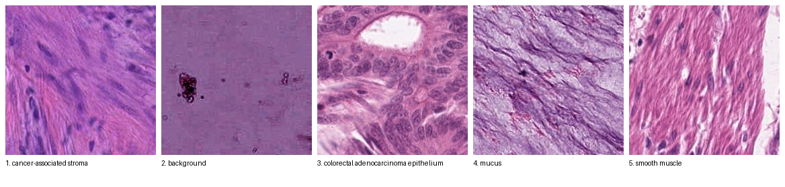

# Biotech VLM GRPO — TRL arm (+ TRL SFT skeleton)

The PathAI-baseline counterpart to `../biotech_vlm_grpo`: the **same** NCT-CRC-HE
patches, prompt, and rule reward, but run through **vanilla Hugging Face TRL**
instead of SkyRL.

- `GRPOTrainer` with `use_vllm=False`: rollouts come from HF `model.generate`
  inside the trainer, on the weights being trained. No inference engine, no
  weight sync.
- DDP via accelerate, LoRA via peft, launched through `ray.train.torch.TorchTrainer`
  (the "OSS Ray arm"). The training function body is plain TRL; Ray only starts the
  processes.
- One extra line, `instrument_grpo_trainer(trainer)`, breaks every optimizer step
  into rollout / sync-wait / reward / forward / backward / optimizer and logs it
  next to TRL's own metrics. That stacked bar is the argument for a faster rollout
  engine later (vLLM inside TRL, or SkyRL).

Also in here, because the POV's Workload 1 starts with SFT: `train_sft_trl.py`, a
TRL `SFTTrainer` + Ray Train skeleton (LLM or VLM) on fake slide-tile QA data, so
there is runnable code before PathAI's data or JSON shape arrives.

## Data

- Dataset: `1aurent/NCT-CRC-HE` on Hugging Face. 224x224 H&E colorectal tissue patches, 9 classes, public.
- Split used: `CRC-VAL-HE-7K` (7,180 patches). Sampled 1,998 train / 198 val, class-balanced (222 / 22 per class), disjoint.
- Script: `../biotech_vlm_grpo/nct_crc_dataset.py`. Output: `/mnt/cluster_storage/data/nct_crc/{train,val}.parquet`. Same files the SkyRL arm trains on.

## Preprocessing

`to_trl_rows()` in `train_grpo_trl.py`, one parquet row in, one TRL row out:

| parquet | TRL row |
|---|---|
| base64 JPEG inside the prompt | PIL image in an `images` column |
| system + user message text | same text; user turn gets an `{"type": "image"}` slot that TRL fills at rollout time |
| `reward_spec.ground_truth` (class name) | `ground_truth` column, passed to the reward functions |

## Input

One image plus this prompt, identical for every row:

```
system: You are a pathology assistant. Examine the tissue patch and reason step by
        step before answering.
user:   <image> What tissue type is shown? Choose one of: [adipose, background,
        debris, lymphocytes, mucus, smooth muscle, normal colon mucosa,
        cancer-associated stroma, colorectal adenocarcinoma epithelium]. Think step
        by step, then give your final answer as <answer>class_name</answer>.
```

~166 tokens after the Qwen3-VL processor, 64 of them image tokens.

First 5 train rows (`results/grpo_train_samples.png`):



| # | ground_truth |
|---|---|
| 1 | cancer-associated stroma |
| 2 | background |
| 3 | colorectal adenocarcinoma epithelium |
| 4 | mucus |
| 5 | smooth muscle |

## Output

Per prompt: 4 completions, temperature 0.8, max 384 new tokens, HF `model.generate`.
Expected shape: reasoning, then `<answer>class_name</answer>`.

One group for training row 1 (the cancer-associated stroma patch, #1 above). The four
completions below are illustrative, written to show the four ways a rollout scores; the
reward and advantage arithmetic is exact.

**Completion 1** (reward 1.2, advantage +0.86)

> 1. The patch is dominated by pink, fibrillar material with elongated, wavy collagen bundles. 2. Scattered within it are spindle-shaped cells with elongated dark nuclei, consistent with fibroblasts. 3. There are no glands, no goblet cells and no crypt architecture, so this is not normal mucosa or adenocarcinoma epithelium. 4. The fibres are irregular and loosely arranged rather than in the tight parallel fascicles of smooth muscle. 5. Loose, cellular fibrous tissue adjacent to a tumour is desmoplastic stroma. `<answer>cancer-associated stroma</answer>`

**Completion 2** (reward 1.2, advantage +0.86)

> The tissue shows a fibrous background with spindle nuclei and no epithelial structures. The collagen is disorganised, which argues against muscle and for reactive connective tissue. `<answer>stroma</answer>`

**Completion 3** (reward 0.2, advantage −0.70)

> 1. The image shows elongated eosinophilic fibres with cigar-shaped nuclei arranged roughly in parallel. 2. There are no glands or epithelial cells. 3. Parallel eosinophilic fibres with elongated nuclei are characteristic of muscle. 4. This is most consistent with the muscularis propria. `<answer>smooth muscle</answer>`

**Completion 4** (reward 0.0, advantage −1.01)

> To classify this patch, I will go through the candidate classes one by one. **Adipose**: no clear lipid vacuoles are present, so adipose is unlikely. **Background**: the field is filled with tissue, so it is not background. **Debris**: the material is structured and cellular, not amorphous, so debris is unlikely. **Lymphocytes**: there is no dense population of small round dark cells. **Mucus**: the material is fibrillar rather than pale and homogeneous. **Smooth muscle**: the fibres are eosinophilic and elongated, which is compatible, but the arrangement is loose. **Normal colon mucosa**: there are no crypts or goblet cells. **Cancer-associated stroma**: the loose fibrous matrix with

*(hit the 384-token cap before emitting an answer tag)*

| # | parsed answer | label_reward | format_reward | reward | advantage |
|---|---|---|---|---|---|
| 1 | cancer-associated stroma | 1.0 | 0.2 | 1.2 | +0.86 |
| 2 | stroma → alias → cancer-associated stroma | 1.0 | 0.2 | 1.2 | +0.86 |
| 3 | smooth muscle | 0.0 | 0.2 | 0.2 | −0.70 |
| 4 | none | 0.0 | 0.0 | 0.0 | −1.01 |

Group mean 0.65, std 0.64. Advantage = (reward − 0.65) / (0.64 + 1e-4). Every token of
completion 1 and 2 is pushed up by 0.86, every token of 4 is pushed down by 1.01.

Real completions from the smoke run are in `results/grpo_sample_completions.md`. Mean
completion length there ~230 tokens; 0 to 6% hit the cap (`completions/clipped_ratio`).

## Reward

`rewards.py`, two functions, TRL sums them. Same scoring as the SkyRL arm's `env.py`.

| function | value | rule |
|---|---|---|
| `label_reward` | 1.0 or 0.0 | text of the last `<answer>…</answer>` block equals `ground_truth`. Case, whitespace and punctuation ignored. Aliases accepted (`LYM` → lymphocytes, `tumor` → colorectal adenocarcinoma epithelium, ...) |
| `format_reward` | 0.2 or 0.0 | a non-empty `<answer>` block exists, right or wrong |

Totals: 1.2 correct, 0.2 wrong, 0.0 no tag.

Advantage per completion = (reward − mean of its group of 4) / std of the group, applied
to every token of that completion. All 4 equal → advantage 0 → no gradient from that
group (`frac_reward_zero_std`). No reward model, no reference model, no KL (`beta=0`).
Only LoRA weights update.

## Throughput units

- Headline: tokens/s per GPU (`rollout/tokens_per_s`) and completions per GPU-hour
  (`rollout/samples_per_gpu_hour`). Smoke run: ~65 tok/s per A10G at batch 4.
- Diagnostic: `timing/generate/ms_per_decode_step`, ms for one decode step of the whole
  batch (62 ms at batch 4). Not per-sequence latency. Stays flat as batch grows, which
  is why tok/s grows with batch and why a batching engine (vLLM, SkyRL) wins.

## SFT data

`make_sft_data.py`: the same 198 val patches → PNG tiles + JSONL.

```json
{"image": "tiles/nctcrc_000123.png",
 "conversations": [{"from": "human", "value": "<image>\nWhat tissue type is shown in this tile?"},
                   {"from": "gpt",   "value": "This tile shows lymphocytes: densely packed small round cells ..."}],
 "metadata": {"label": "lymphocytes"}}
```

Questions and answers are templated from the label. Text-only twin: the image is replaced
by the templated description in the question. Fake QA on real tissue; it tests the
pipeline, not the model. Real data: change `record_to_trl()` in `train_sft_trl.py`.

## Run it

```bash
bash run_trl.sh                                          # GRPO smoke test: configs/grpo_smoke.yaml
bash run_trl.sh --max_steps 30 --num_gpus 2 --max_completion_length 512   # override any key
bash run_sft.sh                                          # SFT, VLM: configs/sft_vlm_smoke.yaml
bash run_sft.sh --config configs/sft_llm_smoke.yaml      # SFT, text-only twin
```

Both scripts source `~/.workspacerc` for `HF_TOKEN`, set Ray's uv runtime-env hook,
default `--config` if you did not pass one, and `exec` the Python script with `--ray`.
Outputs land next to `output_dir` on shared storage (`<run_root>` = its parent):

| what | where |
|---|---|
| per-step metrics (HF log stream, incl. `timing/*`) | `<run_root>/log_history.jsonl` |
| what every rank passed to `ray.train.report` | `<run_root>/ray_reported_metrics.jsonl` |
| TensorBoard | `tensorboard --logdir <run_root>/tensorboard` |
| sampled completions per step (TRL `log_completions`) | `<run_root>/out/completions/*.parquet` |
| torch.profiler traces (`--profile_every N`, rank 0) | `<run_root>/traces/grpo_step<N>_rank0.json` |
| Ray Train run state / worker logs | `<run_root>/../ray_results/<run_name>` and the Ray dashboard → Train |

For the smoke configs `<run_root>` is `/mnt/cluster_storage/trl_grpo/pathvlm_2b_trl`
and `/mnt/cluster_storage/trl_sft/sft_{vlm,llm}_fake`.

## Configuration: two layers, both existing standards

**What trains** is TRL's own convention, the same one `trl/scripts/grpo.py` and
`trl/scripts/sft.py` use: `TrlParser` over three dataclasses, filled from a YAML via
`--config` with CLI flags overriding.

| dataclass | owns | examples |
|---|---|---|
| `ScriptArguments` (ours, in each script) | data + launcher | `data_dir`, `train_rows`, `profile_every`, `ray`, `num_gpus`; SFT: `mode`, `sample_after_train` |
| `trl.GRPOConfig` / `trl.SFTConfig` | every training knob | `num_generations`, `max_completion_length`, `learning_rate`, `max_steps`, `bf16`, `report_to`, `output_dir` |
| `trl.ModelConfig` | model + LoRA | `model_name_or_path`, `model_revision`, `dtype`, `use_peft`, `lora_r`, `lora_target_modules` |

`configs/grpo_smoke.yaml`, `configs/sft_vlm_smoke.yaml`, `configs/sft_llm_smoke.yaml`
are the recorded runs. Every key in them is a flag: `--max_steps 30` on the CLI beats
the YAML. A YAML `env:` block is applied by `TrlParser` in every process before
training starts (used for `TOKENIZERS_PARALLELISM`). Under `--ray` the driver forwards
argv to each worker and each worker parses it, exactly as `accelerate launch` starts N
processes that each parse the same argv; `GRPOConfig` has to be built inside the worker
because it initialises the distributed state.

**How the job runs** is the Anyscale job YAML (`job_grpo.yaml`, `job_sft.yaml`): name,
entrypoint, `working_dir`, `excludes`, `env_vars`, retries, and outside a workspace the
image and compute config. Training overrides go on the entrypoint line. The only
training-adjacent env var left is `HF_HOME`, because it has to be in the process
environment before `transformers` is imported; it is set in the run scripts and the job
YAML `env_vars`, not in the training config.

Not used, on purpose: Pydantic (nothing in TRL, HF or Ray Train uses it; it would be a
third config system) and Hydra/OmegaConf (what the SkyRL arm uses; `TrlParser` already
does the job on the TRL side).

## Submit it as a job instead of running the script

`bash run_trl.sh` runs as a bare Ray driver attached to the workspace: no entry in the
Workloads tab, and it dies with your terminal. Two launchers give you a proper job; the
entrypoint is the same `bash run_trl.sh --config ...` either way.

**On this workspace's cluster** (`ray job submit`; verified with a 3-step run and the
text-only SFT run after the config refactor). Same cluster, so `/mnt/cluster_storage`
and the data are already there. The `excludes` matter: `.venv` is 7 GB.

```bash
cd ~/default/templates/templates/biotech_vlm_grpo_trl
ray job submit --no-wait --submission-id pathvlm-trl-grpo \
  --runtime-env-json '{"working_dir": ".", "excludes": [".venv", "results", "__pycache__", "*.png"]}' \
  -- bash run_trl.sh --config configs/grpo_smoke.yaml
ray job logs -f pathvlm-trl-grpo        # or: ray job status / ray job stop
```

Swap in `run_sft.sh --config configs/sft_vlm_smoke.yaml` (or `sft_llm_smoke.yaml`) for
the SFT skeleton. Overrides go after the config: `-- bash run_trl.sh --config
configs/grpo_smoke.yaml --max_steps 30`.

**As an Anyscale Job on its own cluster** (`anyscale job submit -f job_grpo.yaml`; from
inside a workspace it inherits the workspace's image and compute config). Not verified
end to end here. A job cluster starts with an **empty** `/mnt/cluster_storage`, so the
job YAMLs point every path at `/mnt/user_storage` (persists across clusters); copy the
data there once:

```bash
mkdir -p /mnt/user_storage/data
cp -r /mnt/cluster_storage/data/nct_crc /mnt/cluster_storage/data/pathai_sft_fake /mnt/user_storage/data/
anyscale job submit -f job_grpo.yaml      # or job_sft.yaml
```

One assumption to check on first use: `uv` must be on the job cluster's PATH (it is at
`/home/ray/.local/bin/uv` on this workspace; confirm it comes from the image and not from
the workspace's persisted home).

## Seeing the metrics

Three views of the same per-step numbers, cheapest first:

1. **The stacked bar** — `results/step_breakdown.png` for the recorded run; open it in
   the workspace file browser. Regenerate for any run with:


   ```bash
   uv run --frozen python plot_step_breakdown.py /mnt/cluster_storage/trl_grpo/pathvlm_2b_trl/log_history.jsonl step_breakdown.png
   ```

2. **The per-step table in the driver log** — printed after `trainer.fit()` returns
   (columns: step_s, gen_s, wait_s, rwd_s, fwd_s, bwd_s, opt_s, reward, len, pad%,
   spread). With `ray job submit` it is at the end of `ray job logs <id>`. The same
   numbers, all ranks, are in `<RUN_ROOT>/ray_reported_metrics.jsonl`.

3. **TensorBoard**, for curves across a longer run. Everything under `timing/`,
   `rollout/`, `gpu/` sits next to TRL's `reward`, `completions/*`:

   ```bash
   uv run --frozen tensorboard --logdir /mnt/cluster_storage/trl_grpo/pathvlm_2b_trl/tensorboard --port 6006
   ```

   then open port 6006 from the workspace's Ports panel (or VS Code's port forward).


## Smoke run results (2026-09-11, 4x A10G, `bash run_trl.sh` defaults)

10 optimizer steps, 4 GPUs x 4 completions = 16 completions (4 prompts x 4 generations)
per step, `max_completion_length=384`, LoRA r=16 (17.4M trainable params, 0.81% of
2.14B). Wall clock from launch to first step on a warm worker: ~3 min (uv env 10 s,
model load, 50 s to decode 1,998 base64 images into a HF dataset on each rank).

Rank 0's `timing/*` per step (seconds), plus TRL's own reward columns:

| step | step | generate | sync_wait | reward | fwd | bwd | opt | ms/step | reward | zero-std groups | mean len | pad waste | gen spread |
|---:|---:|---:|---:|---:|---:|---:|---:|---:|---:|---:|---:|---:|---:|
| 1 | 26.7 | 19.0 | 6.4 | 0.001 | 0.37 | 0.78 | 0.05 | 63 | 0.51 | 50% | 235 | 16% | 8.3 |
| 2 | 25.4 | 12.8 | 11.3 | 0.001 | 0.39 | 0.75 | 0.00 | 62 | 0.81 | 25% | 228 | 12% | 11.9 |
| 3 | 25.5 | 15.5 | 8.7 | 0.006 | 0.39 | 0.75 | 0.00 | 63 | 0.56 | 25% | 260 | 19% | 9.3 |
| 4 | 25.2 | 16.5 | 7.5 | 0.001 | 0.39 | 0.75 | 0.00 | 63 | 0.50 | 50% | 246 | 11% | 9.1 |
| 5* | 34.5 | 30.3 | 3.1 | 0.001 | 0.36 | 0.64 | 0.00 | 107 | 0.51 | 75% | 260 | 11% | 5.2 |
| 6 | 29.9 | 21.9 | 6.9 | 0.006 | 0.36 | 0.73 | 0.00 | 77 | 0.58 | 50% | 233 | 16% | 13.6 |
| 7 | 25.9 | 24.3 | 0.5 | 0.010 | 0.34 | 0.66 | 0.00 | 77 | 0.51 | 75% | 238 | 28% | 6.4 |
| 8 | 26.4 | 22.9 | 2.4 | 0.001 | 0.34 | 0.66 | 0.00 | 76 | 0.45 | 100% | 239 | 23% | 7.5 |
| 9 | 30.9 | 16.8 | 12.8 | 0.001 | 0.40 | 0.75 | 0.00 | 77 | 1.06 | 75% | 221 | 13% | 13.3 |
| 10* | 42.1 | 23.6 | 17.2 | 0.001 | 0.41 | 0.76 | 0.00 | 106 | 0.69 | 25% | 222 | 15% | 17.7 |

`*` = torch.profiler was capturing (the run used `profile_every: 5`; it is now opt-in and rank 0 only).

What the numbers say:

- **Mean step 29.3 s. HF generate is 20.4 s (70%) and waiting for the slowest rank's
  generate is another 7.7 s (26%). Rollout + waiting = 96% of the step.** Forward,
  backward and optimizer together are 1.1 s. This is the stacked bar
  (`results/step_breakdown.png`) and the whole argument for a rollout engine.
- **The straggler is always the rank whose longest completion hit the 384 cap.**
  Per-rank rows in `results/grpo_ray_reported_metrics.jsonl`: every step, the rank
  with `sync_wait ~ 0` has `completion_len_max = 384` (or the step's global max), and
  the others wait 5 to 17 s for it. Batched HF generate runs the whole batch to its
  longest sequence; DDP then runs the whole step to its slowest rank. Two levels of
  the same tail problem.
- **Decode is ~62 ms per whole-batch step on an A10G for a 2B model at batch 4** (steps 1 to 4),
  i.e. ~65 tokens/s per GPU. Prefill including the ViT forward is 0.1 s once the
  CUDA graphs are warm (1.4 s on step 1). `padding_waste_frac` 11 to 28%: that share
  of decode steps produces padding for sequences that already finished.
- **GPU SM utilization: ~30% during generate, 70 to 96% in forward, 99% in backward.**
  Peak memory 4.8 GB during generate, 6.2 GB in backward, on 24 GB cards. There is
  room to raise `per_device_train_batch_size` to 16; it would mostly make generate slower.
- Reward functions cost ~1 ms; TRL's cross-rank gather inside the reward stage is
  invisible because the barrier before it already absorbed the skew.
- `frac_reward_zero_std` 25 to 100%: with only 4 prompts per step, many groups of 4
  agree on the reward and contribute zero advantage (step 8 had loss 0 and grad norm
  0). Use more prompts per step for signal; this run was sized for timing, not
  learning. Mean reward 0.51 to 0.69 over 10 steps is noise at n=16.
- The SkyRL arm's steady state on the same GPUs was ~120 s/step for 64 completions
  (vLLM generate ~5 s, FSDP full-parameter train ~95 s). Different batch, different
  trainer, different knobs: do not read the two as a throughput comparison. Read them
  as "where does the time go": generation here, training there.

The recorded JSONL files in `results/` predate the rename of `timing/generate/ms_per_token`
to `timing/generate/ms_per_decode_step` (same quantity: milliseconds per whole-batch decode
step); new runs use the new key.

Evidence in `results/`: `grpo_log_history.jsonl` (all 11 records rank 0 logged),
`grpo_ray_reported_metrics.jsonl` (all 4 ranks per step), `grpo_step2_log_record.json`
(one full record, 67 keys), `grpo_sample_completions.md` (steps 1, 5, 10 with rewards
and advantages), `step_breakdown.png`. One 1.5 GB profiler trace remains at
`/mnt/cluster_storage/trl_grpo/pathvlm_2b_trl/traces/grpo_step10_rank0.json`.

### SFT skeleton smoke run (`bash run_sft.sh`, configs/sft_vlm_smoke.yaml)

Qwen3-VL-2B + LoRA on 179 fake tile-QA records, 4 GPUs, 20 steps, eval every 10:

| | step 1 | step 10 | step 20 |
|---|---:|---:|---:|
| train loss | 2.52 | 1.41 | 0.79 |
| train token accuracy | 0.48 | 0.71 | 0.82 |
| eval loss | | 1.29 | 0.88 |
| eval token accuracy | | 0.73 | 0.79 |

1.4 s/step. TRL inferred `completion_only_loss=True` and used its vision collator.
Post-training greedy sample on a held-out tile, question "Is tumor epithelium present
in this tile?": *"No. The tile shows uniform purple background with no cellular
detail, consistent with background stain."* (reference: *"No. The tile shows empty
glass with no tissue ... consistent with background."*). Templated data, so this shows
the pipeline learns the format and the label, nothing more. Full log in
`results/sft_vlm_log_history.jsonl`.

`configs/sft_llm_smoke.yaml` (Qwen2.5-0.5B-Instruct on the text-only twin, 8.8M LoRA params): loss 1.29 →
0.04, eval loss 0.21 at step 10 → 0.08 at step 20, eval token accuracy 0.98. The greedy
sample reproduces the reference answer verbatim, which on templated data is expected
memorisation. Log in `results/sft_llm_log_history.jsonl`. Note the two modes need
different row shapes: VLM rows use content-part lists (the processor's chat template
renders the image slot), text-only rows use plain-string `content` (Qwen2.5's template
concatenates it as a string). `record_to_trl()` handles both.

## Files

| File | What |
|---|---|
| `train_grpo_trl.py` | the GRPO script. `TrlParser` config, reads the SkyRL parquet, reshapes rows for TRL, `GRPOTrainer` + LoRA, `--ray` wraps the same body in `TorchTrainer` |
| `rewards.py` | `label_reward` (1.0) and `format_reward` (0.2), same scoring as `../biotech_vlm_grpo/env.py`; self-test with `python rewards.py` |
| `grpo_step_timing.py` | the instrumentation. Monkeypatches the trainer instance; returns a dict of what it managed to wrap |
| `plot_step_breakdown.py` | stacked bar from `log_history.jsonl` |
| `train_sft_trl.py` | `SFTTrainer` + LoRA, `--mode vlm\|llm`, `--ray`; `record_to_trl()` is the one function that knows the JSON shape |
| `configs/*.yaml` | the training configs (TrlParser: ScriptArguments + GRPOConfig/SFTConfig + ModelConfig) for the recorded runs |
| `job_grpo.yaml`, `job_sft.yaml` | Anyscale job configs for `anyscale job submit -f` |
| `make_sft_data.py` | fake LLaVA-style JSONL: real 224px H&E tiles from the NCT-CRC val split + templated QA; text-only twin |
| `run_trl.sh`, `run_sft.sh` | launchers: default `--config`, dataset bootstrap, `exec ... --ray` |
| `pyproject.toml`, `uv.lock` | the environment (ray 2.56.0, torch 2.11.0+cu128, trl 1.13.0, transformers 5.17.0, peft 0.20.0) |
| `results/` | distilled evidence from the smoke run (see below) |

## How the environment reaches the GPU worker

Same cluster facts as the SkyRL arm (`../biotech_vlm_grpo/ARCHITECTURE.md`): the head
node is CPU-only and its base conda has no torch; the 4x A10G worker autoscales on
demand. So this is a uv project, and `RAY_RUNTIME_ENV_HOOK=...uv_runtime_env_hook.hook`
makes `ray.init()` ship this directory as `working_dir` and `uv run --frozen` as the
workers' `py_executable`. Every Ray Train worker rebuilds the locked environment
(seconds when uv's cache is warm, a few minutes from cold). Everything the workers read
or write is on `/mnt/cluster_storage`; the model is pre-fetched into
`/mnt/cluster_storage/hf_cache` by the driver so four workers do not race the Hub.

## What the instrumentation wraps (TRL 1.13, `use_vllm=False`)

| metric | wrapped call | note |
|---|---|---|
| `timing/tokenize_s` | `_tokenize_prompts` | chat template + image preprocessing, CPU |
| `timing/generate_s` | `_generate_single_turn` | the pure HF `generate`. Not `_generate`: that one also runs a cross-rank `gather`, which would hide straggler wait inside generate time |
| `timing/generate/{prefill,decode}_s`, `ms_per_decode_step` | a `LogitsProcessor` injected into `model.generate` | first decode step marks the end of prefill (incl. the ViT forward) |
| `timing/sync_wait_s` | `dist.barrier()` right after this rank's generate returns | how long fast ranks wait for the slowest rollout, measured *before* TRL's first gather |
| `timing/reward_s`, `timing/reward/<fn>_s` | `_calculate_rewards`, each reward func | includes TRL's gather of rewards across ranks |
| `timing/forward_s`, `timing/backward_s` | `compute_loss`, `accelerator.backward` | DDP all-reduce is inside backward |
| `timing/optimizer_s` | `optimizer.step` | wrapped lazily on the first step (the Trainer builds the optimizer inside `train()`) |
| `rollout/*` | completion ids seen by the reward stage | `padding_waste_frac` = share of decode work spent on padding shorter sequences up to the longest |
| `gpu/util_pct/<phase>`, `gpu/mem_peak_gb/<phase>` | NVML sampler thread + `torch.cuda.max_memory_allocated` | tagged by whichever phase is active |

Metrics are injected by wrapping `trainer.log`, so they reach TensorBoard/W&B and
`log_history` together with TRL's `reward`, `completions/mean_length`, etc. Inside a Ray
Train worker every rank also calls `ray.train.report(...)` with the same dict (Ray Train
V2 makes `report` a barrier, so it must be all ranks or none). A `UserCallback` on the
driver prints a one-line summary per step and appends every rank's dict to
`ray_reported_metrics.jsonl`.

**Ray Train dashboard caveat.** Ray 2.56's Train dashboard shows run and worker state,
logs, and system metrics (GPU util per worker). Its run schema has no field for
user-reported metrics, so `timing/*` does *not* appear as charts there; use
TensorBoard or the JSONL. `ray.train.report` is still the right hook for anything
driver-side (checkpoint bookkeeping, `Result.metrics`).

TRL has its own coarse timers (`profiling/Time taken: GRPOTrainer.<method>`), but they
log straight to W&B/MLflow/Trackio, not into the HF log stream, so with TensorBoard
you never see them. The keys above are a superset of what they cover.

## Known limits and choices

- **Not TRL's vLLM mode.** `use_vllm=True` (server or colocate) is the next arm; this
  one is deliberately the PathAI baseline shape.
- `beta=0`: no reference model, no KL, matching the SkyRL arm's `use_kl_loss=false`.
  `num_iterations=1`, so old log-probs are not recomputed; the step is generate →
  reward → one forward/backward.
- LoRA targets the language model's projections only; Qwen3-VL's vision tower uses
  different module names and stays frozen.
- `max_completion_length: 384` vs. SkyRL's 1024: HF `generate` runs every sequence to the
  longest, so a long cap is paid on every step. The SkyRL run's mean completion was
  ~230 tokens; 384 truncates the tail and the `format_reward` teaches conciseness.
- Eval is not wired into the GRPO script (HF `generate` over 198 val rows × 4 GPUs is
  slow); the SFT script does eval every `eval_steps`.
- Not a registered Anyscale template (no `BUILD.yaml` entry, compute configs, depset
  lock, or test block). Use the `/template` skill if that is wanted.

## SFT skeleton notes

- Data shape is a *guess* (LLaVA-style `conversations` + `image` path + `metadata`),
  chosen because it is the most common VLM-SFT JSON in the wild. `record_to_trl()` is
  the only code that touches it.
- The TRL row format is conversational **prompt/completion** + `images`, so TRL infers
  `completion_only_loss=True` and uses its vision collator. (`assistant_only_loss` is
  not supported for vision datasets in TRL 1.13.)
- Tiles are real H&E from the NCT-CRC val split; the QA text is templated from the
  label. It proves the plumbing, not the model.
- `make_sft_data.py --source tcga` is a stub: real whole-slide images need
  `gdc-client` to fetch SVS files and `openslide-python` to tile them; neither is in
  this environment.
