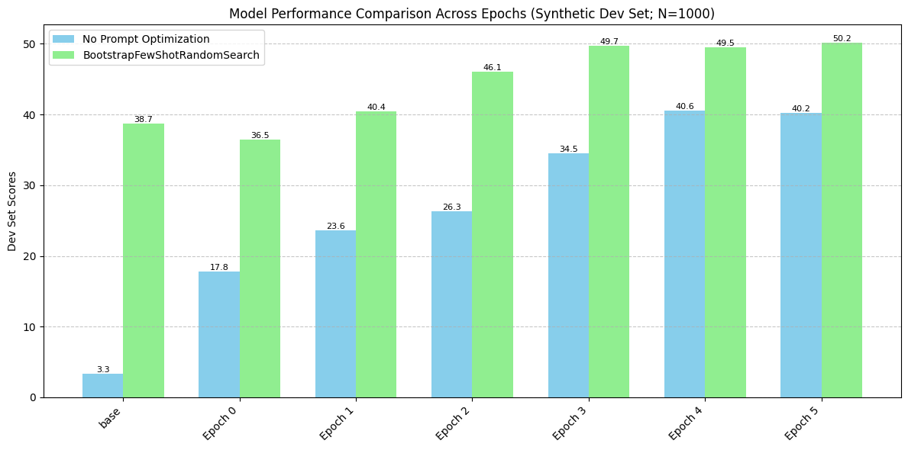
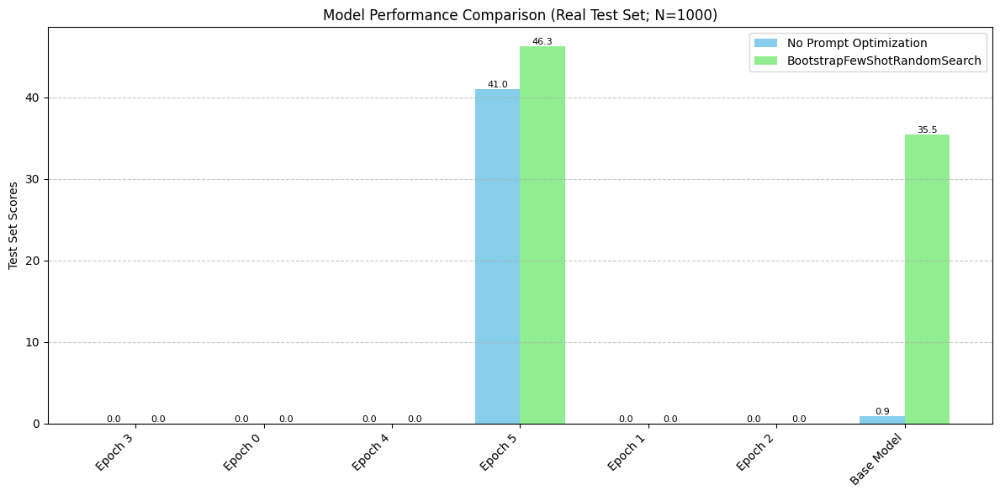

# End-to-end DSPy Workflows Guide 

Time to complete: X Hours

## Problem

You are a bank, and you want to categorize customer support queries into one of 25 categories. You have hand labeled 100 examples and have collected 4,000 unlabeled examples.

You want to use an LLM to solve this problem, because you don't have enough labeled data to train a traditional classifier.

You also don't want to spend a lot of money on inference. 

## Motivation

You decide to use DSPy to solve this problem because the following flow is fairly difficult to orchestrate manually:
Data Collection/Labeling -> Fine-tuning -> Prompt Optimization -> Evaluation -> Deployment

By using DSPy on Anyscale, you can easily orchestrate this flow and solve the problem.

## Solution

You don't want pay to host a 70B model, so you will instead finetune a 1B model, which you can host and serve at a low cost using Anyscale's RayLLM offering.

In order to help the 1B model understand the reasoning behind why the 70B model makes certain classifications, you will use Chains of Thought to distill knowledge from the 70B model.

So what will this look like?

1. Collect 4,000 unlabeled examples
2. Label all of them with your 70B oracle model running locally
3. Use the new DSPy finetuning tools to finetune a 1B model
- This takes about 20 minutes on 4xA100-80GB GPUs, and uses Anyscale's LLMForge in the background to finetune the model
4. Evaluate and prompt optimize your 1B model checkpoints against the labeled dataset
5. Take the best performing 1B checkpoint and compare it to the un-finetuned 1B model on the true test set
6. Deploy the optimized 1B model/DSPy pipeline to production using Anyscale's RayLLM # TODO

Note(isaac): we arent doing anything with the 100 labeled examples yet

# Table of Contents

## Set Up
1. Installing DSPy
2. Setting up the environment
3. Loading the dataset
4. Setting up the program, metric, and evaluator

## Data Collection

1. Collect 4,000 unlabeled examples
2. Label all of them with your 70B oracle model running locally

## Fine-tuning

1. Use the new DSPy finetuning tools to finetune a 1B model
- This takes about 20 minutes on 4xA100-80GB GPUs, and uses Anyscale's LLMForge in the background to finetune the model

## Evaluation
1. Evaluate and prompt optimize your 1B model checkpoints against the labeled dataset
2. Find the best performing 1B checkpoint and compare it to the un-finetuned 1B model on the true test set

## Serving
1. Deploy the optimized 1B model/DSPy pipeline to production using Anyscale's RayLLM # TODO

## Future Work and Open Questions
- Efficient batch inference with a DSPy pipeline
- Exploring different fine-tuning methods and hyperparameter sweeps

This guide aims to provide a comprehensive overview of building, optimizing, and deploying LLM pipelines using DSPy and Anyscale.

## Set up

Node Set up:

We will be running everything on a head node that uses 4xA100-80GB GPUs. I find that L4s are usually available and suitable for this usecase. You can also use any more powerful node.

To change to use A100 GPUs, click the "1 active node" in the top right corner, then for workspace node, click the pencil icon and navigate to the A100 tab and select the 4xA100 option. If you do not see A100 in the list of GPUs, they may not be available on your cloud.


```python
%load_ext autoreload
%autoreload 2
```


```python
import importlib.util

if importlib.util.find_spec("dspy") is None:
    !git clone -b dev_finetune https://github.com/stanfordnlp/dspy.git
    !cd dspy && pip install -e .
else:
    print("dspy is already installed")

# !pip install -e dspy
```


```python
import dspy
dspy.settings.configure(experimental=True)

import ujson

from dotenv import load_dotenv
load_dotenv()

from src import set_dspy_cache_location
set_dspy_cache_location("/home/ray/default/dspy/cache")
```

In order to run this notebook, you need to have the following environment variables set:
- HF_TOKEN
- HF_HOME=/mnt/local_storage/huggingface
- (optional) WANDB_API_KEY

You can get a HF_TOKEN [here](https://huggingface.co/settings/tokens).

You can get a WANDB_API_KEY [here](https://wandb.ai/authorize).


```python
from src import check_env_vars
check_env_vars()
```


```python
from src import init_ray
init_ray()
```

    2024-10-16 01:58:27,436	INFO worker.py:1601 -- Connecting to existing Ray cluster at address: 10.0.0.20:6379...
    2024-10-16 01:58:27,445	INFO worker.py:1777 -- Connected to Ray cluster. View the dashboard at https://session-fkvdirx4bzefi53sjl55m7asad.i.anyscaleuserdata.com 
    2024-10-16 01:58:27,507	INFO packaging.py:359 -- Pushing file package 'gcs://_ray_pkg_30b520a260d6a0c79d3c8a1e4706d5a1c709a492.zip' (10.01MiB) to Ray cluster...
    2024-10-16 01:58:27,624	INFO packaging.py:372 -- Successfully pushed file package 'gcs://_ray_pkg_30b520a260d6a0c79d3c8a1e4706d5a1c709a492.zip'.


    (autoscaler +22s) Tip: use `ray status` to view detailed cluster status. To disable these messages, set RAY_SCHEDULER_EVENTS=0.


We will make use of a random number generator in this notebook. We are creating a Random object here to ensure that our notebook is reproducible.


```python
from src import set_random_seed
rng = set_random_seed()
```

We will be using the PolyAI/banking77 dataset for this tutorial. We use the built in dspy DataLoader to load the dataset from Huggingface as a list of dspy.Example objects.


```python
# Prepare the dataset
from src import load_data_from_huggingface
full_trainset, full_testset = load_data_from_huggingface()
```


```python
from src import preprocess_data
full_trainset_processed, full_testset_processed = preprocess_data(full_trainset, full_testset)

print("Example training set: ", full_trainset_processed[0])
```

    Example training set:  Example({'label': 'card_arrival', 'text': 'I am still waiting on my card?'}) (input_keys={'text'})


The dataset is originally called "banking77" because there are 77 labels. We will be reducing this to the top 25 most frequent labels.


```python
from src import filter_to_top_n_labels
full_trainset_filtered, full_testset_filtered, top_25_labels = filter_to_top_n_labels(full_trainset_processed, full_testset_processed, n=25)

print(f"Dataset filtered to top 25 labels. New sizes:")
print(f"Training set size: {len(full_trainset_filtered)}; Test set size: {len(full_testset_filtered)}")
print(f"Top 25 labels: {', '.join(str(label) for label in top_25_labels)}")
print(f"Example training set: {full_trainset_filtered[0]}")
print(f"Example test set: {full_testset_filtered[0]}")

```

    Dataset filtered to top 25 labels. New sizes:
    Training set size: 4171; Test set size: 1000
    Top 25 labels: card_payment_fee_charged, direct_debit_payment_not_recognised, balance_not_updated_after_cheque_or_cash_deposit, wrong_amount_of_cash_received, cash_withdrawal_charge, transaction_charged_twice, declined_cash_withdrawal, transfer_fee_charged, balance_not_updated_after_bank_transfer, transfer_not_received_by_recipient, request_refund, card_payment_not_recognised, card_payment_wrong_exchange_rate, extra_charge_on_statement, wrong_exchange_rate_for_cash_withdrawal, refund_not_showing_up, reverted_card_payment, cash_withdrawal_not_recognised, activate_my_card, pending_card_payment, cancel_transfer, beneficiary_not_allowed, card_arrival, declined_card_payment, pending_top_up
    Example training set: Example({'label': 'card_arrival', 'text': 'I am still waiting on my card?'}) (input_keys={'text'})
    Example test set: Example({'label': 'card_arrival', 'text': 'How do I locate my card?'}) (input_keys={'text'})


We need to pass the labels to the LLM somehow.

In DSPy, we can do this by either including it in the docstring of the program or by adding it as an input field to the Signature.

Here, we will add it to the docstring, because the set of labels is fixed.


```python
labels_in_use = top_25_labels
print(labels_in_use)
```

    ['card_payment_fee_charged', 'direct_debit_payment_not_recognised', 'balance_not_updated_after_cheque_or_cash_deposit', 'wrong_amount_of_cash_received', 'cash_withdrawal_charge', 'transaction_charged_twice', 'declined_cash_withdrawal', 'transfer_fee_charged', 'balance_not_updated_after_bank_transfer', 'transfer_not_received_by_recipient', 'request_refund', 'card_payment_not_recognised', 'card_payment_wrong_exchange_rate', 'extra_charge_on_statement', 'wrong_exchange_rate_for_cash_withdrawal', 'refund_not_showing_up', 'reverted_card_payment', 'cash_withdrawal_not_recognised', 'activate_my_card', 'pending_card_payment', 'cancel_transfer', 'beneficiary_not_allowed', 'card_arrival', 'declined_card_payment', 'pending_top_up']


Now we will shuffle our training set and split it into a training and labeled set.

The scenario we are emulating is that we only have 100 labeled examples to train on. We are saying that we have 4K (length of the training set) unlabeled examples we can then label using an oracle model, and then distill the knowledge from the oracle model into our 1B model.


```python
from src import common_kwargs

shuffled_trainset = [d for d in full_trainset_filtered]
rng.shuffle(shuffled_trainset)

# The devset shouldn't overlap
ft_trainset = shuffled_trainset[:-100]
labeled_trainset = shuffled_trainset[-100:]

testset = full_testset_filtered
evaluate_testset = dspy.Evaluate(devset=testset, **common_kwargs)
```

This is a simple, 1 step Chain of Thought program.

In DSPy, you define a Signature to show your inputs and outputs. You define a module to run the different steps of your program.

Our signature has a note at the top containing a simple prompt along with the list of valid outputs.

We then have an `intent` field which is the input to the program.

Finally we have a `label` field which is the output of the program.

We give both of these fields a short description.


```python
# We are setting the experimental flag to True to make use of the fine-tuning
# features that are still in development.
dspy.settings.configure(experimental=True)
import inspect
from src import IntentClassification, IntentClassificationModule

print(inspect.getsource(IntentClassification))
```

    class IntentClassification(dspy.Signature):
        """As a part of a banking issue traiging system, classify the intent of a natural language query into one of the 25 labels.
        The intent should exactly match one of the following:
        ['card_payment_fee_charged', 'direct_debit_payment_not_recognised', 'balance_not_updated_after_cheque_or_cash_deposit', 'wrong_amount_of_cash_received', 'cash_withdrawal_charge', 'transaction_charged_twice', 'declined_cash_withdrawal', 'transfer_fee_charged', 'balance_not_updated_after_bank_transfer', 'transfer_not_received_by_recipient', 'request_refund', 'card_payment_not_recognised', 'card_payment_wrong_exchange_rate', 'extra_charge_on_statement', 'wrong_exchange_rate_for_cash_withdrawal', 'refund_not_showing_up', 'reverted_card_payment', 'cash_withdrawal_not_recognised', 'activate_my_card', 'pending_card_payment', 'cancel_transfer', 'beneficiary_not_allowed', 'card_arrival', 'declined_card_payment', 'pending_top_up']
        """
    
        intent = dspy.InputField(desc="Intent of the query")
        label = dspy.OutputField(desc="Type of the intent; Should just be one of the 25 labels with no other text")
    


For the module, we create a dspy.Module class that contains the Chain of Thought predictor using the signature we defined above.
We also pass in the valid labels to the module.

Inside the forward method, we pass the text to the predictor, do a little cleaning, and return the prediction.


```python
print(inspect.getsource(IntentClassificationModule))
```

    class IntentClassificationModule(dspy.Module):
        def __init__(self, labels_in_use):
            self.intent_classifier = dspy.ChainOfThought(IntentClassification)
            self.valid_labels = set(labels_in_use)
    
        def forward(self, text):
            prediction = self.intent_classifier(intent=text)
            sanitized_prediction = dspy.Prediction(label=prediction.label.lower().strip().replace(" ", "_"), reasoning=prediction.reasoning)
            return sanitized_prediction
    


Lastly, we set up some the vanilla program we will use throughout the notebook.


```python
from src import MODEL_PARAMETERS, LOCAL_API_PARAMETERS
vanilla_program = IntentClassificationModule(labels_in_use)
```


```python
# Note: Run above this to do all setup without launching any models
# This is useful if you have already collected data and want to start from finetuning or from evaluation
```

We will be using a local VLLM instance to run the initial benchmarks and data collection.

# Gathering training data and running the 70B Model


## Preparation

Before running the 70B model:
1. Remember to set your HF_TOKEN and HF_HOME environment variables
2. Use the following command to start the 70B server:

   ```
   vllm serve meta-llama/Meta-Llama-3.1-70B-Instruct --port 8000 --pipeline_parallel_size 2 --enable_prefix_caching --tensor_parallel_size 2
   ```

## Parallelism Configuration

We've chosen pipeline parallelism and tensor parallelism of 2 for the 70B model based on our current setup. Here's the reasoning:

1. Model size: The 70B model has 30 parts of ~5 GB each (based on [HuggingFace documentation](https://huggingface.co/meta-llama/Meta-Llama-3.1-70B-Instruct/tree/main)).
   - Total size: 30 * 5 GB = 150 GB

2. Available VRAM:
   - Our GPUs: 80 GB VRAM x 4 = 320 GB
   - Tensor parallelism: floor(320/150) = 2
   - Pipeline parallelism: floor(num_gpus/2) = 2
   - To use all 4 GPUs efficiently:
     - Pipeline parallel size: 2
     - Tensor parallelism: 2

3. Alternative setup (8x24GB GPUs):
   - Pipeline parallel size: 1
   - Tensor parallelism: ceil(150/24) = 7

This configuration allows us to run the 70B model efficiently across our available GPU resources.

Note that on Anyscale, you CANNOT download a 70B model without changing HF_HOME on most machines. The folder `/mnt/local_storage/' has enough space for a model download. It is not persisted across cluster restarts, but that is fine for model weights we don't need to save.


```python
# Command for easy copying: 
# `export HF_HOME=/mnt/local_storage/huggingface; vllm serve meta-llama/Meta-Llama-3.1-70B-Instruct --port 8000 --pipeline_parallel_size 2 --enable_prefix_caching --tensor_parallel_size 2`
input("Press Enter once you have the vllm server running...")
```


```python
llama_70b = dspy.LM(model="openai/meta-llama/Meta-Llama-3.1-70B-Instruct", **MODEL_PARAMETERS, **LOCAL_API_PARAMETERS)
```


```python
from src import sanity_check_program

sanity_check_program(llama_70b, vanilla_program, ft_trainset[0])
```

    Program input: Example({'label': 'extra_charge_on_statement', 'text': 'I still have not received an answer as to why I was charged $1.00 in a transaction?'}) (input_keys={'text'})
    Program output label: extra_charge_on_statement


### Bootstrap Data


In this section, we bootstrap data for fine-tuning. In the code block below, we are deciding which program should be used to collect the bootstraps. We are setting this to the prompt optimized program, but one could also set this to the vanilla program, though doing so would lead to lower quality bootstraps.


```python
from dspy.teleprompt.finetune_teleprompter import bootstrap_data, convert_to_module_level_message_data
from src import delete_labels, NUM_THREADS, write_jsonl

# For realism of this scenario, we are going to delete all our labels except for our test set(which is cheating and we wouldn't have in production) and our 100 true labeled examples
ft_trainset_to_label = delete_labels(ft_trainset)

with dspy.context(lm=llama_70b):
    collected_data = bootstrap_data(vanilla_program, ft_trainset_to_label, num_threads=NUM_THREADS, max_errors=10000)
    # Make sure to only include the labels we are actively using or that arent hallucinated by the oracle
    collected_data_filtered = [x for x in collected_data if x["prediction"]["label"] in labels_in_use]
    
    dataset = convert_to_module_level_message_data(collected_data_filtered, program=vanilla_program, exclude_demos=True)

    dataset_formatted = [{"messages": item} for item in dataset]

print(dataset[0])
print(len(dataset))
```

    Average Metric: 4071 / 4071  (100.0): 100%|██████████| 4071/4071 [04:43<00:00, 14.36it/s]


    [{'role': 'system', 'content': "Your input fields are:\n1. `intent` (str): Intent of the query\n\nYour output fields are:\n1. `reasoning` (str): ${produce the output fields}. We ...\n2. `label` (str): Type of the intent; Should just be one of the 25 labels with no other text\n\nAll interactions will be structured in the following way, with the appropriate values filled in.\n\n[[ ## intent ## ]]\n{intent}\n\n[[ ## reasoning ## ]]\n{reasoning}\n\n[[ ## label ## ]]\n{label}\n\n[[ ## completed ## ]]\n\nIn adhering to this structure, your objective is: \n        As a part of a banking issue traiging system, classify the intent of a natural language query into one of the 25 labels.\n        The intent should exactly match one of the following:\n        ['card_payment_fee_charged', 'direct_debit_payment_not_recognised', 'balance_not_updated_after_cheque_or_cash_deposit', 'wrong_amount_of_cash_received', 'cash_withdrawal_charge', 'transaction_charged_twice', 'declined_cash_withdrawal', 'transfer_fee_charged', 'balance_not_updated_after_bank_transfer', 'transfer_not_received_by_recipient', 'request_refund', 'card_payment_not_recognised', 'card_payment_wrong_exchange_rate', 'extra_charge_on_statement', 'wrong_exchange_rate_for_cash_withdrawal', 'refund_not_showing_up', 'reverted_card_payment', 'cash_withdrawal_not_recognised', 'activate_my_card', 'pending_card_payment', 'cancel_transfer', 'beneficiary_not_allowed', 'card_arrival', 'declined_card_payment', 'pending_top_up']"}, {'role': 'user', 'content': '[[ ## intent ## ]]\nI still have not received an answer as to why I was charged $1.00 in a transaction?\n\nRespond with the corresponding output fields using the proper format of [[ ## <field_name> ## ]] followed by the field value. Start with the field `[[ ## reasoning ## ]]`, then `[[ ## label ## ]]`, and then ending with the marker for `completed`.'}, {'role': 'assistant', 'content': '[[ ## reasoning ## ]]\nThe user is inquiring about a transaction charge of $1.00, indicating they are seeking clarification on an extra fee associated with a transaction.\n\n[[ ## label ## ]]\nextra_charge_on_statement\n\n[[ ## completed ## ]]'}]
    4065


```python
# Nice utility to save the data in case you do not run the notebook all the way through
if True:
    with open("collected_data_filtered.jsonl", "w") as f:
        for item in collected_data_filtered:
            f.write(ujson.dumps({"example": item["example"], "prediction": item["prediction"]}) + "\n")
else:
    with open("collected_data_filtered.jsonl", "r") as f:
        collected_data_filtered = [ujson.loads(line) for line in f]

```

# Fine-tuning

We will use LLM Forge to fine-tune the 1B model.

In order to do this, we need to format our data into the correct format (Follows OpenAI messaging format).

We can let DSPy do the rest, where it will properly generate the config and run the finetuning.

Be sure to checkout the fine-tuning documentation for the latest on how to use our [API](https://docs.anyscale.com/llms/finetuning/intro) and additional [capabilities](https://docs.anyscale.com/category/fine-tuning-beta/).

We'll fine-tune our LLM by choosing a set of configurations. We have created recipes for different LLMs in the [`training configs`](configs/training/lora/llama-3-8b.yaml) folder which can be used as is or modified for experiments. These configurations provide flexibility over a broad range of parameters such as model, data paths, compute to use for training, number of training epochs, how often to save checkpoints, padding, loss, etc. We also include several [DeepSpeed](https://github.com/microsoft/DeepSpeed) [configurations](configs/deepspeed/zero_3_offload_optim+param.json) to choose from for further optimizations around data/model parallelism, mixed precision, checkpointing, etc.

We also have recipes for [LoRA](https://arxiv.org/abs/2106.09685) (where we train a set of small low ranked matrices instead of the original attention and feed forward layers) or full parameter fine-tuning. We recommend starting with LoRA as it's less resource intensive and quicker to train.


```python
from dspy.clients.lm import TrainingMethod
from src import finetuning_kwargs

train_data = dataset_formatted
method = TrainingMethod.SFT

finetuneable_lm = dspy.LM(model="meta-llama/Llama-3.2-1B-Instruct")
finetuning_job = await finetuneable_lm.finetune(method, train_data, eval_data=None, provider="anyscale", train_kwargs=finetuning_kwargs)
model_names = []
async for model_name in finetuning_job:
    model_names.append(model_name)
```

    Copying file://trainset_data_banking.jsonl to gs://storage-bucket-cld-tffbxe9ia5phqr1unxhz4f7e1e/org_4snvy99zwbmh4gbtk64jfqggmj/cld_tffbxe9ia5phqr1unxhz4f7e1e/artifact_storage/trainset_data_banking.jsonl
      
    .
    (anyscale +17m6.8s) Uploading local dir '.' to cloud storage.
    (anyscale +17m8.7s) Job 'dspy-llmforge-fine-tuning-job' submitted, ID: 'prodjob_4r32smmaflsuradjiv1qd9fqx3'.
    (anyscale +17m8.7s) View the job in the UI: https://console.anyscale.com/jobs/prodjob_4r32smmaflsuradjiv1qd9fqx3
    (anyscale +17m8.9s) Waiting for job 'prodjob_4r32smmaflsuradjiv1qd9fqx3' to reach target state SUCCEEDED, currently in state: STARTING
    (anyscale +31m11.2s) Job 'prodjob_4r32smmaflsuradjiv1qd9fqx3' transitioned from STARTING to RUNNING
    (anyscale +41m21.6s) Job 'prodjob_4r32smmaflsuradjiv1qd9fqx3' transitioned from RUNNING to SUCCEEDED
    (anyscale +41m21.6s) Job 'prodjob_4r32smmaflsuradjiv1qd9fqx3' reached target state, exiting


# Evaluation

Throughout this section, anything using 8B model (or technically 70B too) should use the new evaluate with ray data batch offline(or technically online) inference.

Probably worth testing offline with 8x8 threads vs just 64 threads to see if it makes a meaningful difference.

## Performance comparisons

Synthetic Devset:
- 1B Non-finetuned
- 1B Non-finetuned + Prompt Optimization
- 1B Finetuned (all checkpoints)
- 1B Finetuned (all checkpoints) + Prompt Optimization

Note that for this task, where the eval loss of a checkpoint isn't necessarily informative of the downstream performance of the program, because there are chains of though inside output, we need to test all possible checkpoints to see which one performs best.


```python
print(model_names)
```

    ['meta-llama/Llama-3.2-1B-Instruct:epochs-3-total-trained-steps-128', 'meta-llama/Llama-3.2-1B-Instruct:epochs-0-total-trained-steps-32', 'meta-llama/Llama-3.2-1B-Instruct:epochs-4-total-trained-steps-160', 'meta-llama/Llama-3.2-1B-Instruct:epochs-5-total-trained-steps-192', 'meta-llama/Llama-3.2-1B-Instruct:epochs-1-total-trained-steps-64', 'meta-llama/Llama-3.2-1B-Instruct:epochs-2-total-trained-steps-96']


We will run a local RayLLM instance that serves the model.

Provided with this template is are two files, `serve_1B.yaml` and `\model_configs\meta-llama--Llama-3_2-1B-Instruct.yaml`. 

The first file, `serve_1B.yaml`, contains the serve configuration to load the model with RayLLM.

The second file, `\model_configs\meta-llama--Llama-3_2-1B-Instruct.yaml`, contains the necessary configurations to run the 1B model.

The important part of the second file is the "dynamic_lora_loading_path" field. This is the path to the folder where the LoRA weights are stored.

DSPy will automatically save the LoRA weights to a folder in your cloud environment at $ANYSCALE_

Make sure to set your HF_TOKEN and HF_HOME environment variables, and run the following command to start the server:

```bash
serve run serve_1B.yaml
```


```python
# Command for easy copying: 
# `serve run serve_1B.yaml`
input("Press Enter once you have the RayLLM server running...")
```


```python
from src import get_llama_lms_from_model_names

all_llamas = get_llama_lms_from_model_names(model_names)
```


```python
# Sanity check that the finetuned models are working
finetuned_llama = list(all_llamas.values())[0]
sanity_check_program(finetuned_llama, vanilla_program, ft_trainset[0])
```

    Program input: Example({'text': 'I still have not received an answer as to why I was charged $1.00 in a transaction?'}) (input_keys={'text'})


    Program output label: balance_not_updated_after_cheque_or_cash_deposit


Now let's try optimizing the program with the finetuned model

Now we know how well the base pipeline performs, let's run prompt optimization on the pipeline in order to juice up the performance.

Let's go over what the hyperparameters mean:
- max_bootstrapped_demos: DSPy will "bootstrap" the program by collecting examples at each step that are successful and reusing those in the pipeline. This means that it will automatically collect and add chains of thought to the pipeline.
- max_labeled_demos: DSPy will also insert some labeled demonstrations from the training set. These would be unmodified examples from the training set that are just using the gold answer.
- num_candidate_programs: This is the number of candidate programs that the optimizer will generate. The actual number of programs that are created is this plus three, as DSPy will also try a program with no examples, a program with just the labeled demonstrations, and a bootstrapped program with the first few examples.
- optimizer_num_train and optimizer_num_val: These are the number of examples that the optimizer will use for training and validation. Note that we will be taking the all of these examples from our synthetic devset.


```python
from src import bootstrap_fewshot_random_search_parameters, metric

print("Parameters:")
for k, v in bootstrap_fewshot_random_search_parameters.items():
    print(f"{k}: {v}")
```

    Parameters:
    max_bootstrapped_demos: 3
    max_labeled_demos: 3
    num_candidate_programs: 6


```python
from src import split_into_devset_and_optimizer_sets

def collected_data_to_example(data):
    return dspy.Example(text=data["example"]["text"], label=data["prediction"]["label"]).with_inputs("text")

collected_data_examples = [collected_data_to_example(x) for x in collected_data_filtered]

devset_synthetic, ft_optimizer_trainset, ft_optimizer_devset = split_into_devset_and_optimizer_sets(collected_data_examples, dev_size=1000, optimizer_num_val=300)
print("Lengths:")
print("Synthetic Devset: ", len(devset_synthetic))
print("Optimizer Trainset: ", len(ft_optimizer_trainset))
print("Optimizer Devset: ", len(ft_optimizer_devset))
print("Example from synthetic devset:")
print(devset_synthetic[0])
```

    1000 2765 300
    Example({'text': 'I still have not received an answer as to why I was charged $1.00 in a transaction?', 'label': 'extra_charge_on_statement'}) (input_keys={'text'})


```python
%%capture
COMPILE_PROGRAM = True

from src import evaluate_and_prompt_optimize

evaluation_kwargs = {
    "models": all_llamas,
    "program": vanilla_program,
    "optimizer_trainset": ft_optimizer_trainset,
    "optimizer_valset": ft_optimizer_devset,
    "devset": devset_synthetic,
    "metric": metric,
    "labels_in_use": labels_in_use
}

ft_results = evaluate_and_prompt_optimize(**evaluation_kwargs)
```

    Going to sample between 1 and 3 traces per predictor.
    Will attempt to bootstrap 6 candidate sets.
    Evaluating openai/meta-llama/Llama-3.2-1B-Instruct:epochs-3-total-trained-steps-128


    Average Metric: 345 / 1000  (34.5): 100%|██████████| 1000/1000 [00:00<00:00, 1159.82it/s]
    Average Metric: 3 / 6  (50.0):   2%|▏         | 5/300 [00:00<00:00, 522.59it/s]linenomeasoning', 'label'] but got dict_keys(['label']). Set `provide_traceback=True` to see the stack trace. [dspy.evaluate.evaluate] =evaluate.py =198
    Average Metric: 113.0 / 300  (37.7): 100%|██████████| 300/300 [00:00<00:00, 1219.77it/s]


    New best score: 37.67 for seed -3
    Scores so far: [37.67]
    Best score so far: 37.67


    Average Metric: 2 / 6  (33.3):   2%|▏         | 5/300 [00:00<00:00, 652.28it/s]evaluate.pyate', 'label'] but got dict_keys(['label']). Set `provide_traceback=True` to see the stack trace. [] filename= lineno=198
    Average Metric: 113.0 / 300  (37.7): 100%|██████████| 300/300 [00:00<00:00, 1165.62it/s]


    Scores so far: [37.67, 37.67]
    Best score so far: 37.67


      0%|          | 3/2765 [00:00<00:01, 2002.37it/s]


    Bootstrapped 3 full traces after 4 examples in round 0.


    2024-10-16T02:54:33.721609Z [error    ] Error for example in dev set: 		 Expected ['reasoning', 'label'] but got dict_keys([]). Set `provide_traceback=True` to see the stack trace. [dspy.evaluate.evaluate] filename=evaluate.py lineno=198
    Average Metric: 1 / 2  (50.0):   0%|          | 1/300 [00:00<00:00, 495.43it/s]ed ['reasoning', 'label'] but got dict_keys([]). Set `provide_traceback=True` to see the stack trace. [dspy.evaluate.evaluate] filenameevaluate.py lineno=198
    Average Metric: 4 / 11  (36.4):   3%|▎         | 10/300 [00:00<00:00, 573.63it/s]lename 6T02:54:33.728874Z [] Error for example in dev set: 		 Expected ['reasoning', 'label'] but got dict_keys([]). Set `provide_traceback=True` to see the stack trace.dspy.evaluate.evaluate] =evaluate.py lineno=198
    Average Metric: 6 / 18  (33.3):   6%|▌         | 17/300 [00:00<00:00, 518.25it/s]= error    Error for example in dev set: 		 Expected ['reasoning', 'label'] but got dict_keys([]). Set `provide_traceback=True` to see the stack trace. [dspy.evaluate.evaluate] filenameevaluate.py lineno=198
    Average Metric: 10 / 26  (38.5):   8%|▊         | 25/300 [00:00<00:00, 571.50it/s]=ror for example in dev set: 		 Expected ['reasoning', 'label'] but got dict_keys([]). Set `provide_traceback=True` to see the stack trace. [dspy.evaluate.evaluate] filenameevaluate.py lineno=198
    Average Metric: 14 / 37  (37.8):  12%|█▏        | 36/300 [00:00<00:00, 582.57it/s]dspy.evaluate.evaluate5410Zerror    Error for example in dev set: 		 Expected ['reasoning', 'label'] but got dict_keys([]). Set `provide_traceback=True` to see the stack trace. [] filename=evaluate.py lineno=198
    Average Metric: 20 / 47  (42.6):  15%|█▌        | 46/300 [00:00<00:00, 598.35it/s] [24-10-16T02:54:33.757255Zerror    ] Error for example in dev set: 		 Expected ['reasoning', 'label'] but got dict_keys([]). Set `provide_traceback=True` to see the stack trace. [dspy.evaluate.evaluate] filename=evaluate.py lineno=198
    Average Metric: 24 / 55  (43.6):  18%|█▊        | 54/300 [00:00<00:00, 584.20it/s]filename 6T02:54:33.769271Z [] Error for example in dev set: 		 Expected ['reasoning', 'label'] but got dict_keys([]). Set `provide_traceback=True` to see the stack trace. [dspy.evaluate.evaluate =evaluate.py lineno=198
    Average Metric: 27 / 63  (42.9):  21%|██        | 62/300 [00:00<00:00, 583.58it/s]198enamer example in dev set: 		 Expected ['reasoning', 'label'] but got dict_keys([]). Set `provide_traceback=True` to see the stack trace. [dspy.evaluate.evaluate] =evaluate.py lineno=
    Average Metric: 32 / 71  (45.1):  23%|██▎       | 70/300 [00:00<00:00, 583.58it/s]linenome16T02:54:33.774956Zerror    Error for example in dev set: 		 Expected ['reasoning', 'label'] but got dict_keys([]). Set `provide_traceback=True` to see the stack trace. [dspy.evaluate.evaluate =evaluate.py =198
    Average Metric: 36 / 79  (45.6):  26%|██▌       | 78/300 [00:00<00:00, 583.58it/s]198ename16T02:54:33.775222Zerror    ] Error for example in dev set: 		 Expected ['reasoning', 'label'] but got dict_keys([]). Set `provide_traceback=True` to see the stack trace. [dspy.evaluate.evaluate] =evaluate.py lineno=
    Average Metric: 43.0 / 88  (48.9):  29%|██▉       | 87/300 [00:00<00:00, 583.58it/s]=or    6T02:54:33.778719Z [] Error for example in dev set: 		 Expected ['reasoning', 'label'] but got dict_keys([]). Set `provide_traceback=True` to see the stack trace. [dspy.evaluate.evaluate filename=evaluate.py lineno198
    Average Metric: 46.0 / 99  (46.5):  33%|███▎      | 98/300 [00:00<00:00, 583.58it/s] 024-10-16T02:54:33.782773Z [error    ] Error for example in dev set: 		 Expected ['reasoning', 'label'] but got dict_keys([]). Set `provide_traceback=True` to see the stack trace. [dspy.evaluate.evaluate]filenameevaluate.pylineno=198
    Average Metric: 51.0 / 109  (46.8):  36%|███▌      | 108/300 [00:00<00:00, 583.58it/s]=spy.evaluate.evaluate8437Z [error    Error for example in dev set: 		 Expected ['reasoning', 'label'] but got dict_keys([]). Set `provide_traceback=True` to see the stack trace. [] filenameevaluate.py lineno=198
    Average Metric: 58.0 / 119  (48.7):  39%|███▉      | 118/300 [00:00<00:00, 583.58it/s]=spy.evaluate.evaluateev set: 		 Expected ['reasoning', 'label'] but got dict_keys([]). Set `provide_traceback=True` to see the stack trace. [] filename=evaluate.py lineno198
    Average Metric: 61.0 / 126  (48.4):  42%|████▏     | 125/300 [00:00<00:00, 592.65it/s] 024-10-16T02:54:33.792285Z [error    ] Error for example in dev set: 		 Expected ['reasoning', 'label'] but got dict_keys([]). Set `provide_traceback=True` to see the stack trace. [dspy.evaluate.evaluate]filename=evaluate.py lineno=198
    Average Metric: 66.0 / 134  (49.3):  44%|████▍     | 133/300 [00:00<00:00, 592.65it/s]evaluate.py02:54:33.797759Zerror    Error for example in dev set: 		 Expected ['reasoning', 'label'] but got dict_keys([]). Set `provide_traceback=True` to see the stack trace.dspy.evaluate.evaluate = lineno=198
    Average Metric: 68.0 / 143  (47.6):  47%|████▋     | 142/300 [00:00<00:00, 592.65it/s]198enote.py02:54:33.799172Z [error    ] Error for example in dev set: 		 Expected ['reasoning', 'label'] but got dict_keys([]). Set `provide_traceback=True` to see the stack trace. [dspy.evaluate.evaluate] filename= =
    Average Metric: 76.0 / 153  (49.7):  51%|█████     | 152/300 [00:00<00:00, 592.65it/s]=ilename16T02:54:33.801503Zerror    ] Error for example in dev set: 		 Expected ['reasoning', 'label'] but got dict_keys([]). Set `provide_traceback=True` to see the stack trace. [dspy.evaluate.evaluate] =evaluate.pylineno198
    Average Metric: 79.0 / 161  (49.1):  53%|█████▎    | 160/300 [00:00<00:00, 592.65it/s]filename16T02:54:33.808400Zerror    Error for example in dev set: 		 Expected ['reasoning', 'label'] but got dict_keys([]). Set `provide_traceback=True` to see the stack trace. [dspy.evaluate.evaluate] =evaluate.py lineno=198
    Average Metric: 85.0 / 170  (50.0):  56%|█████▋    | 169/300 [00:00<00:00, 592.65it/s]198eno   6T02:54:33.808960Z [] Error for example in dev set: 		 Expected ['reasoning', 'label'] but got dict_keys([]). Set `provide_traceback=True` to see the stack trace.dspy.evaluate.evaluate filename=evaluate.py =
    Average Metric: 91.0 / 181  (50.3):  60%|██████    | 180/300 [00:00<00:00, 587.15it/s]1984-10-16T02:54:33.811994Z [error    ] Error for example in dev set: 		 Expected ['reasoning', 'label'] but got dict_keys([]). Set `provide_traceback=True` to see the stack trace. [dspy.evaluate.evaluate filename=evaluate.py lineno=
    Average Metric: 95.0 / 189  (50.3):  63%|██████▎   | 188/300 [00:00<00:00, 587.15it/s]198y.evaluate.evaluate0246Zerror    ] Error for example in dev set: 		 Expected ['reasoning', 'label'] but got dict_keys([]). Set `provide_traceback=True` to see the stack trace. []filenameevaluate.py lineno=
    Average Metric: 102.0 / 199  (51.3):  66%|██████▌   | 198/300 [00:00<00:00, 587.15it/s]spy.evaluate.evaluate2938Z [] Error for example in dev set: 		 Expected ['reasoning', 'label'] but got dict_keys([]). Set `provide_traceback=True` to see the stack trace. []filename=evaluate.py lineno=198
    Average Metric: 106.0 / 206  (51.5):  68%|██████▊   | 205/300 [00:00<00:00, 587.15it/s]evaluate.py02:54:33.826056Z [error    ] Error for example in dev set: 		 Expected ['reasoning', 'label'] but got dict_keys([]). Set `provide_traceback=True` to see the stack trace. [dspy.evaluate.evaluate filename= lineno=198
    Average Metric: 109.0 / 214  (50.9):  71%|███████   | 213/300 [00:00<00:00, 587.15it/s]linenote.pyte.evaluateev set: 		 Expected ['reasoning', 'label'] but got dict_keys([]). Set `provide_traceback=True` to see the stack trace. [] filename= =198
    Average Metric: 114.0 / 221  (51.6):  73%|███████▎  | 220/300 [00:00<00:00, 587.15it/s] spy.evaluate.evaluate5385Zerror    ] Error for example in dev set: 		 Expected ['reasoning', 'label'] but got dict_keys([]). Set `provide_traceback=True` to see the stack trace. []filename=evaluate.py lineno=198
    Average Metric: 119.0 / 229  (52.0):  76%|███████▌  | 228/300 [00:00<00:00, 587.15it/s]lineno0-16T02:54:33.855546Z [error    Error for example in dev set: 		 Expected ['reasoning', 'label'] but got dict_keys([]). Set `provide_traceback=True` to see the stack trace. [dspy.evaluate.evaluate]filenameevaluate.py =198
    Average Metric: 122.0 / 238  (51.3):  79%|███████▉  | 237/300 [00:00<00:00, 587.15it/s]linenote.py02:54:33.857232Z [error    Error for example in dev set: 		 Expected ['reasoning', 'label'] but got dict_keys([]). Set `provide_traceback=True` to see the stack trace. [dspy.evaluate.evaluate filename= =198
    Average Metric: 126.0 / 246  (51.2):  82%|████████▏ | 245/300 [00:00<00:00, 587.42it/s]198y.evaluate.evaluate8193Z [] Error for example in dev set: 		 Expected ['reasoning', 'label'] but got dict_keys([]). Set `provide_traceback=True` to see the stack trace. [] filename=evaluate.py lineno=
    Average Metric: 128.0 / 255  (50.2):  85%|████████▍ | 254/300 [00:00<00:00, 587.42it/s]Error for example in dev set: 		 Expected ['reasoning', 'label'] but got dict_keys([]). Set `provide_traceback=True` to see the stack trace. [dspy.evaluate.evaluate] filename=evaluate.py lineno=198
    Average Metric: 132.0 / 264  (50.0):  88%|████████▊ | 263/300 [00:00<00:00, 587.42it/s]=inenote.pyte.evaluateev set: 		 Expected ['reasoning', 'label'] but got dict_keys([]). Set `provide_traceback=True` to see the stack trace. [] filename= 198
    Average Metric: 134.0 / 273  (49.1):  91%|█████████ | 272/300 [00:00<00:00, 587.42it/s]error    6T02:54:33.876103Z [] Error for example in dev set: 		 Expected ['reasoning', 'label'] but got dict_keys([]). Set `provide_traceback=True` to see the stack trace. [dspy.evaluate.evaluate] filename=evaluate.py lineno=198
    Average Metric: 134.0 / 284  (47.2):  94%|█████████▍| 283/300 [00:00<00:00, 587.42it/s]1984-10-16T02:54:33.879929Z [error    ] Error for example in dev set: 		 Expected ['reasoning', 'label'] but got dict_keys([]). Set `provide_traceback=True` to see the stack trace. [dspy.evaluate.evaluate]filenameevaluate.py lineno=
    Average Metric: 134.0 / 300  (44.7): 100%|██████████| 300/300 [00:00<00:00, 600.92it/s]


    New best score: 44.67 for seed -1
    Scores so far: [37.67, 37.67, 44.67]
    Best score so far: 44.67


      0%|          | 6/2765 [00:02<20:00,  2.30it/s]


    Bootstrapped 2 full traces after 7 examples in round 0.


    2024-10-16T02:54:38.679582Z [error    ] Error for example in dev set: 		 Expected ['reasoning', 'label'] but got dict_keys([]). Set `provide_traceback=True` to see the stack trace. [dspy.evaluate.evaluate] filename=evaluate.py lineno=198
    2024-10-16T02:54:39.489623Z [error    ] Error for example in dev set: 		 Expected ['reasoning', 'label'] but got dict_keys([]). Set `provide_traceback=True` to see the stack trace. [dspy.evaluate.evaluate] filename=evaluate.py lineno=198
    2024-10-16T02:54:40.136710Z [error    ] Error for example in dev set: 		 Expected ['reasoning', 'label'] but got dict_keys([]). Set `provide_traceback=True` to see the stack trace. [dspy.evaluate.evaluate] filename=evaluate.py lineno=198
    2024-10-16T02:54:41.127650Z [error    ] Error for example in dev set: 		 Expected ['reasoning', 'label'] but got dict_keys([]). Set `provide_traceback=True` to see the stack trace. [dspy.evaluate.evaluate] filename=evaluate.py lineno=198
    Average Metric: 0.0 / 7  (0.0):   2%|▏         | 6/300 [00:00<00:14, 19.92it/s]=		 Expected ['reasoning', 'label'] but got dict_keys([]). Set `provide_traceback=True` to see the stack trace. [dspy.evaluate.evaluatefilenameevaluate.py lineno=198
    Average Metric: 1.0 / 15  (6.7):   5%|▍         | 14/300 [00:00<00:14, 19.92it/s]=or    ] Error for example in dev set: 		 Expected ['reasoning', 'label'] but got dict_keys([]). Set `provide_traceback=True` to see the stack trace. [dspy.evaluate.evaluate]filenameevaluate.pylineno198
    Average Metric: 1.0 / 16  (6.2):   5%|▌         | 16/300 [00:00<00:05, 48.32it/s]] error    Error for example in dev set: 		 Expected ['reasoning', 'label'] but got dict_keys([]). Set `provide_traceback=True` to see the stack trace. [dspy.evaluate.evaluate] filename=evaluate.py lineno=198
    Average Metric: 1.0 / 17  (5.9):   5%|▌         | 16/300 [00:00<00:05, 48.32it/s] [error    ] Error for example in dev set: 		 Expected ['reasoning', 'label'] but got dict_keys([]). Set `provide_traceback=True` to see the stack trace. [dspy.evaluate.evaluate] filename=evaluate.py lineno=198
    Average Metric: 1.0 / 18  (5.6):   6%|▌         | 17/300 [00:00<00:05, 48.32it/s] [error    ] Error for example in dev set: 		 Expected ['reasoning', 'label'] but got dict_keys([]). Set `provide_traceback=True` to see the stack trace. [dspy.evaluate.evaluate] filename=evaluate.py lineno=198
    Average Metric: 1.0 / 19  (5.3):   6%|▌         | 18/300 [00:00<00:05, 48.32it/s] [error    ] Error for example in dev set: 		 Expected ['reasoning', 'label'] but got dict_keys([]). Set `provide_traceback=True` to see the stack trace. [dspy.evaluate.evaluate] filename=evaluate.py lineno=198
    Average Metric: 1.0 / 20  (5.0):   6%|▋         | 19/300 [00:00<00:05, 48.32it/s] [error    ] Error for example in dev set: 		 Expected ['reasoning', 'label'] but got dict_keys([]). Set `provide_traceback=True` to see the stack trace. [dspy.evaluate.evaluate] filename=evaluate.py lineno=198
    Average Metric: 1.0 / 21  (4.8):   7%|▋         | 20/300 [00:00<00:05, 48.32it/s] [error    ] Error for example in dev set: 		 Expected ['reasoning', 'label'] but got dict_keys([]). Set `provide_traceback=True` to see the stack trace. [dspy.evaluate.evaluate] filename=evaluate.py lineno=198
    Average Metric: 1.0 / 22  (4.5):   7%|▋         | 21/300 [00:00<00:05, 48.32it/s]2024-10-16T02:54:42.176649Z [error    ] Error for example in dev set: 		 Expected ['reasoning', 'label'] but got dict_keys([]). Set `provide_traceback=True` to see the stack trace. [dspy.evaluate.evaluate] filename=evaluate.py lineno=198
    Average Metric: 3.0 / 25  (12.0):   8%|▊         | 24/300 [00:00<00:05, 51.18it/s]2024-10-16T02:54:42.374397Z [error    ] Error for example in dev set: 		 Expected ['reasoning', 'label'] but got dict_keys([]). Set `provide_traceback=True` to see the stack trace. [dspy.evaluate.evaluate] filename=evaluate.py lineno=198
    Average Metric: 3.0 / 27  (11.1):   9%|▊         | 26/300 [00:00<00:05, 51.18it/s]error    ] Error for example in dev set: 		 Expected ['reasoning', 'label'] but got dict_keys([]). Set `provide_traceback=True` to see the stack trace. [dspy.evaluate.evaluate] filename=evaluate.py lineno=198
    Average Metric: 5.0 / 30  (16.7):  10%|▉         | 29/300 [00:00<00:07, 38.11it/s] [24-10-16T02:54:42.406284Z [error    ] Error for example in dev set: 		 Expected ['reasoning', 'label'] but got dict_keys([]). Set `provide_traceback=True` to see the stack trace.dspy.evaluate.evaluate] filename=evaluate.py lineno=198
    Average Metric: 6.0 / 33  (18.2):  11%|█         | 32/300 [00:00<00:07, 38.11it/s]2024-10-16T02:54:42.446556Z [error    ] Error for example in dev set: 		 Expected ['reasoning', 'label'] but got dict_keys([]). Set `provide_traceback=True` to see the stack trace. [dspy.evaluate.evaluate] filename=evaluate.py lineno=198
    Average Metric: 8.0 / 36  (22.2):  12%|█▏        | 35/300 [00:00<00:06, 38.11it/s]2024-10-16T02:54:42.473115Z [error    ] Error for example in dev set: 		 Expected ['reasoning', 'label'] but got dict_keys([]). Set `provide_traceback=True` to see the stack trace. [dspy.evaluate.evaluate] filename=evaluate.py lineno=198
    Average Metric: 109.0 / 241  (45.2):  80%|████████  | 240/300 [00:02<00:00, 165.25it/s]2024-10-16T02:54:44.357181Z [error    ] Error for example in dev set: 		 Expected ['reasoning', 'label'] but got dict_keys(['label']). Set `provide_traceback=True` to see the stack trace. [dspy.evaluate.evaluate] filename=evaluate.py lineno=198
    Average Metric: 133.0 / 300  (44.3): 100%|██████████| 300/300 [00:03<00:00, 96.03it/s] 


    Scores so far: [37.67, 37.67, 44.67, 44.33]
    Best score so far: 44.67


      0%|          | 1/2765 [00:00<16:47,  2.74it/s]


    Bootstrapped 1 full traces after 2 examples in round 0.


    2024-10-16T02:54:48.412854Z [error    ] Error for example in dev set: 		 Expected ['reasoning', 'label'] but got dict_keys([]). Set `provide_traceback=True` to see the stack trace. [dspy.evaluate.evaluate] filename=evaluate.py lineno=198
    Average Metric: 147.0 / 300  (49.0): 100%|██████████| 300/300 [00:02<00:00, 101.45it/s]


    New best score: 49.0 for seed 1
    Scores so far: [37.67, 37.67, 44.67, 44.33, 49.0]
    Best score so far: 49.0


      0%|          | 3/2765 [00:01<22:32,  2.04it/s]


    Bootstrapped 1 full traces after 4 examples in round 0.


    Average Metric: 17 / 27  (63.0):   9%|▊         | 26/300 [00:00<00:05, 54.72it/s]2024-10-16T02:54:57.635221Z [error    ] Error for example in dev set: 		 Expected ['reasoning', 'label'] but got dict_keys([]). Set `provide_traceback=True` to see the stack trace. [dspy.evaluate.evaluate] filename=evaluate.py lineno=198
    Average Metric: 156.0 / 300  (52.0): 100%|██████████| 300/300 [00:02<00:00, 113.38it/s]


    New best score: 52.0 for seed 2
    Scores so far: [37.67, 37.67, 44.67, 44.33, 49.0, 52.0]
    Best score so far: 52.0


      0%|          | 7/2765 [00:03<24:43,  1.86it/s]


    Bootstrapped 1 full traces after 8 examples in round 0.


    Average Metric: 131 / 300  (43.7): 100%|██████████| 300/300 [00:02<00:00, 130.46it/s]


    Scores so far: [37.67, 37.67, 44.67, 44.33, 49.0, 52.0, 43.67]
    Best score so far: 52.0


      0%|          | 11/2765 [00:04<20:38,  2.22it/s]


    Bootstrapped 1 full traces after 12 examples in round 0.


    2024-10-16T02:55:17.138897Z [error    ] Error for example in dev set: 		 Expected ['reasoning', 'label'] but got dict_keys([]). Set `provide_traceback=True` to see the stack trace. [dspy.evaluate.evaluate] filename=evaluate.py lineno=198
    Average Metric: 159.0 / 300  (53.0): 100%|██████████| 300/300 [00:06<00:00, 47.67it/s] 


    New best score: 53.0 for seed 4
    Scores so far: [37.67, 37.67, 44.67, 44.33, 49.0, 52.0, 43.67, 53.0]
    Best score so far: 53.0


      0%|          | 6/2765 [00:02<20:00,  2.30it/s]


    Bootstrapped 3 full traces after 7 examples in round 0.


    2024-10-16T02:55:29.312155Z [error    ] Error for example in dev set: 		 Expected ['reasoning', 'label'] but got dict_keys([]). Set `provide_traceback=True` to see the stack trace. [dspy.evaluate.evaluate] filename=evaluate.py lineno=198
    2024-10-16T02:55:29.514088Z [error    ] Error for example in dev set: 		 Expected ['reasoning', 'label'] but got dict_keys([]). Set `provide_traceback=True` to see the stack trace. [dspy.evaluate.evaluate] filename=evaluate.py lineno=198
    2024-10-16T02:55:29.735561Z [error    ] Error for example in dev set: 		 Expected ['reasoning', 'label'] but got dict_keys([]). Set `provide_traceback=True` to see the stack trace. [dspy.evaluate.evaluate] filename=evaluate.py lineno=198
    2024-10-16T02:55:30.147060Z [error    ] Error for example in dev set: 		 Expected ['reasoning', 'label'] but got dict_keys([]). Set `provide_traceback=True` to see the stack trace. [dspy.evaluate.evaluate] filename=evaluate.py lineno=198
    2024-10-16T02:55:30.344598Z [error    ] Error for example in dev set: 		 Expected ['reasoning', 'label'] but got dict_keys([]). Set `provide_traceback=True` to see the stack trace. [dspy.evaluate.evaluate] filename=evaluate.py lineno=198
    Average Metric: 2.0 / 6  (33.3):   2%|▏         | 6/300 [00:00<00:14, 19.63it/s]=ilenameluate.evaluateev set: 		 Expected ['reasoning', 'label'] but got dict_keys([]). Set `provide_traceback=True` to see the stack trace. [] =evaluate.py lineno198
    Average Metric: 4.0 / 15  (26.7):   5%|▍         | 14/300 [00:00<00:14, 19.63it/s]198enomeexample in dev set: 		 Expected ['reasoning', 'label'] but got dict_keys([]). Set `provide_traceback=True` to see the stack trace. [dspy.evaluate.evaluate] =evaluate.py =
    Average Metric: 5.0 / 20  (25.0):   6%|▋         | 19/300 [00:00<00:06, 46.54it/s]dspy.evaluate.evaluateev set: 		 Expected ['reasoning', 'label'] but got dict_keys([]). Set `provide_traceback=True` to see the stack trace. [] filename=evaluate.py lineno=198
    Average Metric: 7.0 / 24  (29.2):   8%|▊         | 23/300 [00:00<00:05, 46.54it/s] [24-10-16T02:55:31.536288Zerror    ] Error for example in dev set: 		 Expected ['reasoning', 'label'] but got dict_keys([]). Set `provide_traceback=True` to see the stack trace. [dspy.evaluate.evaluate] filename=evaluate.py lineno=198
    Average Metric: 8.0 / 27  (29.6):   9%|▊         | 26/300 [00:00<00:04, 60.48it/s]error    6T02:55:32.168246Z [] Error for example in dev set: 		 Expected ['reasoning', 'label'] but got dict_keys([]). Set `provide_traceback=True` to see the stack trace. [dspy.evaluate.evaluate] filename=evaluate.py lineno=198
    Average Metric: 17.0 / 53  (32.1):  17%|█▋        | 52/300 [00:00<00:02, 120.69it/s]2024-10-16T02:55:33.274017Z [error    ] Error for example in dev set: 		 Expected ['reasoning', 'label'] but got dict_keys([]). Set `provide_traceback=True` to see the stack trace. [dspy.evaluate.evaluate] filename=evaluate.py lineno=198
    Average Metric: 22.0 / 66  (33.3):  22%|██▏       | 65/300 [00:00<00:01, 128.71it/s]lineno0-16T02:55:33.359638Z [error    ] Error for example in dev set: 		 Expected ['reasoning', 'label'] but got dict_keys([]). Set `provide_traceback=True` to see the stack trace. [dspy.evaluate.evaluate] filename=evaluate.py =198
    Average Metric: 27.0 / 74  (36.5):  24%|██▍       | 73/300 [00:00<00:01, 128.71it/s]2024-10-16T02:55:33.409922Z [error    ] Error for example in dev set: 		 Expected ['reasoning', 'label'] but got dict_keys([]). Set `provide_traceback=True` to see the stack trace. [dspy.evaluate.evaluate] filename=evaluate.py lineno=198
    Average Metric: 34.0 / 96  (35.4):  32%|███▏      | 95/300 [00:00<00:01, 146.24it/s]2024-10-16T02:55:33.527281Z [error    ] Error for example in dev set: 		 Expected ['reasoning', 'label'] but got dict_keys([]). Set `provide_traceback=True` to see the stack trace. [dspy.evaluate.evaluate] filename=evaluate.py lineno=198
    Average Metric: 38.0 / 110  (34.5):  36%|███▋      | 109/300 [00:01<00:01, 155.99it/s]2024-10-16T02:55:33.617985Z [error    ] Error for example in dev set: 		 Expected ['reasoning', 'label'] but got dict_keys([]). Set `provide_traceback=True` to see the stack trace. [dspy.evaluate.evaluate] filename=evaluate.py lineno=198
    Average Metric: 44.0 / 124  (35.5):  41%|████      | 123/300 [00:01<00:01, 144.20it/s]lineno0-16T02:55:33.725373Z [error    ] Error for example in dev set: 		 Expected ['reasoning', 'label'] but got dict_keys([]). Set `provide_traceback=True` to see the stack trace. [dspy.evaluate.evaluate] filename=evaluate.py =198
    Average Metric: 47.0 / 133  (35.3):  44%|████▍     | 132/300 [00:01<00:01, 144.20it/s]2024-10-16T02:55:33.771472Z [error    ] Error for example in dev set: 		 Expected ['reasoning', 'label'] but got dict_keys([]). Set `provide_traceback=True` to see the stack trace. [dspy.evaluate.evaluate] filename=evaluate.py lineno=198
    Average Metric: 47.0 / 135  (34.8):  45%|████▍     | 134/300 [00:01<00:01, 144.20it/s]=[error    ] Error for example in dev set: 		 Expected ['reasoning', 'label'] but got dict_keys([]). Set `provide_traceback=True` to see the stack trace. [dspy.evaluate.evaluate] filenameevaluate.py lineno=198
    Average Metric: 50.0 / 143  (35.0):  47%|████▋     | 142/300 [00:01<00:01, 151.37it/s]2024-10-16T02:55:33.844194Z [error    ] Error for example in dev set: 		 Expected ['reasoning', 'label'] but got dict_keys([]). Set `provide_traceback=True` to see the stack trace. [dspy.evaluate.evaluate] filename=evaluate.py lineno=198
    Average Metric: 55.0 / 156  (35.3):  52%|█████▏    | 155/300 [00:01<00:00, 158.26it/s]filename16T02:55:33.922958Z [error    ] Error for example in dev set: 		 Expected ['reasoning', 'label'] but got dict_keys([]). Set `provide_traceback=True` to see the stack trace. [dspy.evaluate.evaluate] =evaluate.py lineno=198
    Average Metric: 56.0 / 160  (35.0):  53%|█████▎    | 159/300 [00:01<00:00, 158.26it/s]2024-10-16T02:55:33.931751Z [error    ] Error for example in dev set: 		 Expected ['reasoning', 'label'] but got dict_keys([]). Set `provide_traceback=True` to see the stack trace. [dspy.evaluate.evaluate] filename=evaluate.py lineno=198
    Average Metric: 78.0 / 197  (39.6):  65%|██████▌   | 196/300 [00:01<00:00, 141.14it/s]2024-10-16T02:55:34.245231Z [error    ] Error for example in dev set: 		 Expected ['reasoning', 'label'] but got dict_keys([]). Set `provide_traceback=True` to see the stack trace. [dspy.evaluate.evaluate] filename=evaluate.py lineno=198
    Average Metric: 80.0 / 201  (39.8):  67%|██████▋   | 200/300 [00:01<00:00, 141.14it/s] 024-10-16T02:55:34.277279Z [error    ] Error for example in dev set: 		 Expected ['reasoning', 'label'] but got dict_keys([]). Set `provide_traceback=True` to see the stack trace. [dspy.evaluate.evaluate]filename=evaluate.py lineno=198
    Average Metric: 91.0 / 228  (39.9):  76%|███████▌  | 227/300 [00:02<00:00, 87.07it/s] 2024-10-16T02:55:34.652007Z [error    ] Error for example in dev set: 		 Expected ['reasoning', 'label'] but got dict_keys([]). Set `provide_traceback=True` to see the stack trace. [dspy.evaluate.evaluate] filename=evaluate.py lineno=198
    Average Metric: 96.0 / 241  (39.8):  80%|████████  | 240/300 [00:02<00:00, 120.98it/s]2024-10-16T02:55:34.708467Z [error    ] Error for example in dev set: 		 Expected ['reasoning', 'label'] but got dict_keys([]). Set `provide_traceback=True` to see the stack trace. [dspy.evaluate.evaluate] filename=evaluate.py lineno=198
    Average Metric: 99.0 / 249  (39.8):  83%|████████▎ | 248/300 [00:02<00:00, 120.98it/s]2024-10-16T02:55:34.743921Z [error    ] Error for example in dev set: 		 Expected ['reasoning', 'label'] but got dict_keys([]). Set `provide_traceback=True` to see the stack trace. [dspy.evaluate.evaluate] filename=evaluate.py lineno=198
    Average Metric: 99.0 / 251  (39.4):  83%|████████▎ | 250/300 [00:02<00:00, 120.98it/s]2024-10-16T02:55:34.765589Z [error    ] Error for example in dev set: 		 Expected ['reasoning', 'label'] but got dict_keys([]). Set `provide_traceback=True` to see the stack trace. [dspy.evaluate.evaluate] filename=evaluate.py lineno=198
    Average Metric: 103.0 / 260  (39.6):  86%|████████▋ | 259/300 [00:02<00:00, 136.50it/s]2024-10-16T02:55:34.809555Z [error    ] Error for example in dev set: 		 Expected ['reasoning', 'label'] but got dict_keys([]). Set `provide_traceback=True` to see the stack trace. [dspy.evaluate.evaluate] filename=evaluate.py lineno=198
    Average Metric: 114.0 / 285  (40.0):  95%|█████████▍| 284/300 [00:02<00:00, 152.69it/s]evaluate.py02:55:34.959762Z [error    ] Error for example in dev set: 		 Expected ['reasoning', 'label'] but got dict_keys([]). Set `provide_traceback=True` to see the stack trace. [dspy.evaluate.evaluate] filename= lineno=198
    Average Metric: 121.0 / 300  (40.3): 100%|██████████| 300/300 [00:06<00:00, 46.05it/s] 


    Scores so far: [37.67, 37.67, 44.67, 44.33, 49.0, 52.0, 43.67, 53.0, 40.33]
    Best score so far: 53.0
    9 candidate programs found.


    2024-10-16T02:55:41.406075Z [error    ] Error for example in dev set: 		 Expected ['reasoning', 'label'] but got dict_keys([]). Set `provide_traceback=True` to see the stack trace. [dspy.evaluate.evaluate] filename=evaluate.py lineno=198
    Average Metric: 3.0 / 11  (27.3):   1%|          | 10/1000 [00:00<01:07, 14.59it/s]198e.py02:55:43.937020Z [error    Error for example in dev set: 		 Expected ['reasoning', 'label'] but got dict_keys([]). Set `provide_traceback=True` to see the stack trace. [dspy.evaluate.evaluate] = lineno=
    Average Metric: 242.0 / 507  (47.7):  51%|█████     | 506/1000 [00:10<00:07, 63.59it/s]Error for example in dev set: 		 Expected ['reasoning', 'label'] but got dict_keys([]). Set `provide_traceback=True` to see the stack trace. [dspy.evaluate.evaluate] filename=evaluate.py lineno=198
    Average Metric: 497.0 / 1000  (49.7): 100%|██████████| 1000/1000 [00:15<00:00, 63.89it/s]


    result for meta-llama/Llama-3.2-1B-Instruct:epochs-3-total-trained-steps-128: 49.7, None, None
    Evaluating openai/meta-llama/Llama-3.2-1B-Instruct:epochs-0-total-trained-steps-32


      0%|          | 0/1000 [00:00<?, ?it/s]2024-10-16T02:56:04.075203Z [error    ] Error for example in dev set: 		 Expected ['reasoning', 'label'] but got dict_keys(['reasoning']). Set `provide_traceback=True` to see the stack trace. [dspy.evaluate.evaluate] filename=evaluate.py lineno=198
    Average Metric: 1.0 / 2  (50.0):   0%|          | 1/1000 [00:02<35:13,  2.12s/it]2024-10-16T02:56:04.126557Z [error    ] Error for example in dev set: 		 Expected ['reasoning', 'label'] but got dict_keys(['reasoning']). Set `provide_traceback=True` to see the stack trace. [dspy.evaluate.evaluate] filename=evaluate.py lineno=198
    Average Metric: 1.0 / 3  (33.3):   0%|          | 2/1000 [00:02<35:11,  2.12s/it] [error    ] Error for example in dev set: 		 Expected ['reasoning', 'label'] but got dict_keys(['reasoning']). Set `provide_traceback=True` to see the stack trace. [dspy.evaluate.evaluate] filename=evaluate.py lineno=198
    Average Metric: 1.0 / 8  (12.5):   1%|          | 7/1000 [00:02<04:28,  3.70it/s]1984-10-16T02:56:04.520244Z [error    ] Error for example in dev set: 		 Expected ['reasoning', 'label'] but got dict_keys(['reasoning']). Set `provide_traceback=True` to see the stack trace. [dspy.evaluate.evaluate] filename=evaluate.py lineno=
    Average Metric: 8.0 / 43  (18.6):   4%|▍         | 42/1000 [00:04<00:46, 20.69it/s]2024-10-16T02:56:05.995001Z [error    ] Error for example in dev set: 		 Expected ['reasoning', 'label'] but got dict_keys(['reasoning']). Set `provide_traceback=True` to see the stack trace. [dspy.evaluate.evaluate] filename=evaluate.py lineno=198
    Average Metric: 8.0 / 47  (17.0):   5%|▍         | 46/1000 [00:04<00:50, 18.74it/s]2024-10-16T02:56:06.108516Z [error    ] Error for example in dev set: 		 Expected ['reasoning', 'label'] but got dict_keys(['reasoning']). Set `provide_traceback=True` to see the stack trace. [dspy.evaluate.evaluate] filename=evaluate.py lineno=198
    Average Metric: 9.0 / 57  (15.8):   6%|▌         | 57/1000 [00:04<00:29, 31.79it/s]2024-10-16T02:56:06.284721Z [error    ] Error for example in dev set: 		 Expected ['reasoning', 'label'] but got dict_keys(['reasoning']). Set `provide_traceback=True` to see the stack trace. [dspy.evaluate.evaluate] filename=evaluate.py lineno=198
    Average Metric: 13.0 / 77  (16.9):   8%|▊         | 76/1000 [00:04<00:21, 42.97it/s]2024-10-16T02:56:06.657019Z [error    ] Error for example in dev set: 		 Expected ['reasoning', 'label'] but got dict_keys(['reasoning']). Set `provide_traceback=True` to see the stack trace. [dspy.evaluate.evaluate] filename=evaluate.py lineno=198
    Average Metric: 13.0 / 82  (15.9):   8%|▊         | 82/1000 [00:04<00:26, 34.19it/s]=024-10-16T02:56:06.884959Z [error    ] Error for example in dev set: 		 Expected ['reasoning', 'label'] but got dict_keys(['reasoning']). Set `provide_traceback=True` to see the stack trace. [dspy.evaluate.evaluate] filename=evaluate.py lineno198
    Average Metric: 13.0 / 96  (13.5):  10%|▉         | 95/1000 [00:05<00:20, 44.38it/s]2024-10-16T02:56:07.150954Z [error    ] Error for example in dev set: 		 Expected ['reasoning', 'label'] but got dict_keys(['reasoning']). Set `provide_traceback=True` to see the stack trace. [dspy.evaluate.evaluate] filename=evaluate.py lineno=198
    Average Metric: 16.0 / 111  (14.4):  11%|█         | 110/1000 [00:05<00:22, 38.82it/s]2024-10-16T02:56:07.544175Z [error    ] Error for example in dev set: 		 Expected ['reasoning', 'label'] but got dict_keys(['reasoning']). Set `provide_traceback=True` to see the stack trace. [dspy.evaluate.evaluate] filename=evaluate.py lineno=198
    Average Metric: 23.0 / 137  (16.8):  14%|█▎        | 136/1000 [00:06<00:16, 51.08it/s]2024-10-16T02:56:08.050380Z [error    ] Error for example in dev set: 		 Expected ['reasoning', 'label'] but got dict_keys(['reasoning']). Set `provide_traceback=True` to see the stack trace. [dspy.evaluate.evaluate] filename=evaluate.py lineno=198
    Average Metric: 25.0 / 144  (17.4):  14%|█▍        | 143/1000 [00:06<00:16, 53.14it/s]lineno0-16T02:56:08.141774Z [error    ] Error for example in dev set: 		 Expected ['reasoning', 'label'] but got dict_keys(['reasoning']). Set `provide_traceback=True` to see the stack trace. [dspy.evaluate.evaluate] filename=evaluate.py =198
    Average Metric: 28.0 / 155  (18.1):  16%|█▌        | 155/1000 [00:06<00:14, 57.81it/s]=024-10-16T02:56:08.330716Z [error    ] Error for example in dev set: 		 Expected ['reasoning', 'label'] but got dict_keys(['reasoning']). Set `provide_traceback=True` to see the stack trace. [dspy.evaluate.evaluate] filenameevaluate.py lineno=198
    Average Metric: 30.0 / 166  (18.1):  16%|█▋        | 165/1000 [00:07<00:43, 19.26it/s]2024-10-16T02:56:09.221787Z [error    ] Error for example in dev set: 		 Expected ['reasoning', 'label'] but got dict_keys(['reasoning']). Set `provide_traceback=True` to see the stack trace. [dspy.evaluate.evaluate] filename=evaluate.py lineno=198
    Average Metric: 30.0 / 167  (18.0):  17%|█▋        | 166/1000 [00:07<00:41, 20.18it/s]2024-10-16T02:56:09.410094Z [error    ] Error for example in dev set: 		 Expected ['reasoning', 'label'] but got dict_keys(['reasoning']). Set `provide_traceback=True` to see the stack trace. [dspy.evaluate.evaluate] filename=evaluate.py lineno=198
    Average Metric: 31.0 / 171  (18.1):  17%|█▋        | 171/1000 [00:07<00:35, 23.43it/s]2024-10-16T02:56:09.419881Z [error    ] Error for example in dev set: 		 Expected ['reasoning', 'label'] but got dict_keys(['reasoning']). Set `provide_traceback=True` to see the stack trace. [dspy.evaluate.evaluate] filename=evaluate.py lineno=198
    Average Metric: 35.0 / 194  (18.0):  19%|█▉        | 193/1000 [00:07<00:20, 38.54it/s]2024-10-16T02:56:09.837348Z [error    ] Error for example in dev set: 		 Expected ['reasoning', 'label'] but got dict_keys(['reasoning']). Set `provide_traceback=True` to see the stack trace. [dspy.evaluate.evaluate] filename=evaluate.py lineno=198
    Average Metric: 39.0 / 211  (18.5):  21%|██        | 211/1000 [00:08<00:15, 50.31it/s]2024-10-16T02:56:10.126413Z [error    ] Error for example in dev set: 		 Expected ['reasoning', 'label'] but got dict_keys(['reasoning']). Set `provide_traceback=True` to see the stack trace. [dspy.evaluate.evaluate] filename=evaluate.py lineno=198
    Average Metric: 42.0 / 240  (17.5):  24%|██▍       | 239/1000 [00:08<00:15, 50.67it/s]2024-10-16T02:56:10.744203Z [error    ] Error for example in dev set: 		 Expected ['reasoning', 'label'] but got dict_keys(['reasoning']). Set `provide_traceback=True` to see the stack trace. [dspy.evaluate.evaluate] filename=evaluate.py lineno=198
    Average Metric: 44.0 / 254  (17.3):  25%|██▌       | 253/1000 [00:08<00:12, 59.90it/s]2024-10-16T02:56:10.951842Z [error    ] Error for example in dev set: 		 Expected ['reasoning', 'label'] but got dict_keys(['reasoning']). Set `provide_traceback=True` to see the stack trace. [dspy.evaluate.evaluate] filename=evaluate.py lineno=198
    Average Metric: 45.0 / 262  (17.2):  26%|██▌       | 261/1000 [00:09<00:11, 65.10it/s]2024-10-16T02:56:11.043725Z [error    ] Error for example in dev set: 		 Expected ['reasoning', 'label'] but got dict_keys(['reasoning']). Set `provide_traceback=True` to see the stack trace. [dspy.evaluate.evaluate] filename=evaluate.py lineno=198
    Average Metric: 49.0 / 298  (16.4):  30%|██▉       | 297/1000 [00:09<00:09, 77.42it/s]2024-10-16T02:56:11.535759Z [error    ] Error for example in dev set: 		 Expected ['reasoning', 'label'] but got dict_keys(['reasoning']). Set `provide_traceback=True` to see the stack trace. [dspy.evaluate.evaluate] filename=evaluate.py lineno=198
    Average Metric: 50.0 / 308  (16.2):  31%|███       | 307/1000 [00:09<00:09, 72.13it/s]2024-10-16T02:56:11.664055Z [error    ] Error for example in dev set: 		 Expected ['reasoning', 'label'] but got dict_keys(['reasoning']). Set `provide_traceback=True` to see the stack trace. [dspy.evaluate.evaluate] filename=evaluate.py lineno=198
    Average Metric: 50.0 / 313  (16.0):  31%|███       | 312/1000 [00:09<00:09, 71.05it/s] [24-10-16T02:56:11.732674Zerror    ] Error for example in dev set: 		 Expected ['reasoning', 'label'] but got dict_keys(['reasoning']). Set `provide_traceback=True` to see the stack trace. [dspy.evaluate.evaluate] filename=evaluate.py lineno=198
    Average Metric: 50.0 / 315  (15.9):  31%|███▏      | 314/1000 [00:09<00:09, 71.05it/s]error    ] Error for example in dev set: 		 Expected ['reasoning', 'label'] but got dict_keys(['reasoning']). Set `provide_traceback=True` to see the stack trace. [dspy.evaluate.evaluate] filename=evaluate.py lineno=198
    Average Metric: 50.0 / 318  (15.7):  32%|███▏      | 317/1000 [00:09<00:10, 67.19it/s] [24-10-16T02:56:11.780740Zerror    ] Error for example in dev set: 		 Expected ['reasoning', 'label'] but got dict_keys(['reasoning']). Set `provide_traceback=True` to see the stack trace. [dspy.evaluate.evaluate] filename=evaluate.py lineno=198
    Average Metric: 51.0 / 322  (15.8):  32%|███▏      | 321/1000 [00:09<00:10, 67.19it/s]1984-10-16T02:56:11.856392Z [error    ] Error for example in dev set: 		 Expected ['reasoning', 'label'] but got dict_keys(['reasoning']). Set `provide_traceback=True` to see the stack trace. [dspy.evaluate.evaluate] filename=evaluate.py lineno=
    Average Metric: 52.0 / 329  (15.8):  33%|███▎      | 328/1000 [00:10<00:09, 67.58it/s]2024-10-16T02:56:12.012822Z [error    ] Error for example in dev set: 		 Expected ['reasoning', 'label'] but got dict_keys(['reasoning']). Set `provide_traceback=True` to see the stack trace. [dspy.evaluate.evaluate] filename=evaluate.py lineno=198
    Average Metric: 56.0 / 345  (16.2):  34%|███▍      | 344/1000 [00:10<00:09, 65.87it/s]2024-10-16T02:56:12.249404Z [error    ] Error for example in dev set: 		 Expected ['reasoning', 'label'] but got dict_keys(['reasoning']). Set `provide_traceback=True` to see the stack trace. [dspy.evaluate.evaluate] filename=evaluate.py lineno=198
    Average Metric: 56.0 / 348  (16.1):  35%|███▍      | 347/1000 [00:10<00:09, 65.31it/s] [24-10-16T02:56:12.289746Z [error    ] Error for example in dev set: 		 Expected ['reasoning', 'label'] but got dict_keys(['reasoning']). Set `provide_traceback=True` to see the stack trace.dspy.evaluate.evaluate filename=evaluate.pylineno=198
    Average Metric: 57.0 / 351  (16.2):  35%|███▌      | 350/1000 [00:10<00:09, 65.31it/s]evaluate.py02:56:12.321839Zerror    ] Error for example in dev set: 		 Expected ['reasoning', 'label'] but got dict_keys(['reasoning']). Set `provide_traceback=True` to see the stack trace. [dspy.evaluate.evaluate] filename= lineno=198
    Average Metric: 64.0 / 381  (16.8):  38%|███▊      | 380/1000 [00:10<00:08, 71.62it/s]linenofor example in dev set: 		 Expected ['reasoning', 'label'] but got dict_keys(['reasoning']). Set `provide_traceback=True` to see the stack trace. [dspy.evaluate.evaluate] filename=evaluate.py =198
    Average Metric: 65.0 / 384  (16.9):  38%|███▊      | 383/1000 [00:10<00:08, 71.62it/s]2024-10-16T02:56:12.803796Z [error    ] Error for example in dev set: 		 Expected ['reasoning', 'label'] but got dict_keys(['reasoning']). Set `provide_traceback=True` to see the stack trace. [dspy.evaluate.evaluate] filename=evaluate.py lineno=198
    Average Metric: 65.0 / 389  (16.7):  39%|███▉      | 388/1000 [00:10<00:09, 63.77it/s] [24-10-16T02:56:12.878010Zerror    ] Error for example in dev set: 		 Expected ['reasoning', 'label'] but got dict_keys(['reasoning']). Set `provide_traceback=True` to see the stack trace. [dspy.evaluate.evaluate] filename=evaluate.py lineno=198
    Average Metric: 66.0 / 393  (16.8):  39%|███▉      | 392/1000 [00:11<00:09, 61.13it/s]dspy.evaluate.evaluate1697Z [error    Error for example in dev set: 		 Expected ['reasoning', 'label'] but got dict_keys(['reasoning']). Set `provide_traceback=True` to see the stack trace. [] filename=evaluate.py lineno=198
    Average Metric: 68.0 / 415  (16.4):  41%|████▏     | 414/1000 [00:11<00:11, 49.68it/s]]024-10-16T02:56:13.530551Z [error    ] Error for example in dev set: 		 Expected ['reasoning', 'label'] but got dict_keys(['reasoning']). Set `provide_traceback=True` to see the stack trace. [dspy.evaluate.evaluate filename=evaluate.py lineno=198
    Average Metric: 74.0 / 435  (17.0):  43%|████▎     | 434/1000 [00:11<00:11, 49.81it/s]2024-10-16T02:56:13.901969Z [error    ] Error for example in dev set: 		 Expected ['reasoning', 'label'] but got dict_keys(['reasoning']). Set `provide_traceback=True` to see the stack trace. [dspy.evaluate.evaluate] filename=evaluate.py lineno=198
    Average Metric: 74.0 / 438  (16.9):  44%|████▍     | 438/1000 [00:12<00:10, 53.35it/s]198rror    ] Error for example in dev set: 		 Expected ['reasoning', 'label'] but got dict_keys(['reasoning']). Set `provide_traceback=True` to see the stack trace. [dspy.evaluate.evaluate] filename=evaluate.py lineno=
    Average Metric: 78.0 / 460  (17.0):  46%|████▌     | 459/1000 [00:12<00:08, 66.91it/s]Error for example in dev set: 		 Expected ['reasoning', 'label'] but got dict_keys(['reasoning']). Set `provide_traceback=True` to see the stack trace. [dspy.evaluate.evaluate] filename=evaluate.py lineno=198
    Average Metric: 78.0 / 463  (16.8):  46%|████▌     | 462/1000 [00:12<00:08, 66.91it/s]2024-10-16T02:56:14.262493Z [error    ] Error for example in dev set: 		 Expected ['reasoning', 'label'] but got dict_keys(['reasoning']). Set `provide_traceback=True` to see the stack trace. [dspy.evaluate.evaluate] filename=evaluate.py lineno=198
    Average Metric: 79.0 / 468  (16.9):  47%|████▋     | 467/1000 [00:12<00:08, 63.28it/s]] 24-10-16T02:56:14.325020Zerror    Error for example in dev set: 		 Expected ['reasoning', 'label'] but got dict_keys(['reasoning']). Set `provide_traceback=True` to see the stack trace. [dspy.evaluate.evaluate] filename=evaluate.py lineno=198
    Average Metric: 81.0 / 473  (17.1):  47%|████▋     | 472/1000 [00:12<00:08, 60.73it/s]1984-10-16T02:56:14.378464Z [error    Error for example in dev set: 		 Expected ['reasoning', 'label'] but got dict_keys(['reasoning']). Set `provide_traceback=True` to see the stack trace. [dspy.evaluate.evaluate] filename=evaluate.py lineno=
    Average Metric: 81.0 / 478  (16.9):  48%|████▊     | 477/1000 [00:12<00:08, 61.02it/s]=rror for example in dev set: 		 Expected ['reasoning', 'label'] but got dict_keys(['reasoning']). Set `provide_traceback=True` to see the stack trace. [dspy.evaluate.evaluate] filename=evaluate.pylineno198
    Average Metric: 82.0 / 489  (16.8):  49%|████▉     | 488/1000 [00:12<00:08, 60.67it/s]2024-10-16T02:56:14.737460Z [error    ] Error for example in dev set: 		 Expected ['reasoning', 'label'] but got dict_keys(['reasoning']). Set `provide_traceback=True` to see the stack trace. [dspy.evaluate.evaluate] filename=evaluate.py lineno=198
    Average Metric: 86.0 / 503  (17.1):  50%|█████     | 502/1000 [00:12<00:07, 67.19it/s]2024-10-16T02:56:14.942815Z [error    ] Error for example in dev set: 		 Expected ['reasoning', 'label'] but got dict_keys(['reasoning']). Set `provide_traceback=True` to see the stack trace. [dspy.evaluate.evaluate] filename=evaluate.py lineno=198
    Average Metric: 87.0 / 511  (17.0):  51%|█████     | 510/1000 [00:13<00:07, 69.70it/s]] 24-10-16T02:56:15.061034Z [error    Error for example in dev set: 		 Expected ['reasoning', 'label'] but got dict_keys(['reasoning']). Set `provide_traceback=True` to see the stack trace. [dspy.evaluate.evaluate] filename=evaluate.py lineno=198
    Average Metric: 89.0 / 517  (17.2):  52%|█████▏    | 516/1000 [00:13<00:07, 67.38it/s]lineno0-16T02:56:15.127508Z [error    ] Error for example in dev set: 		 Expected ['reasoning', 'label'] but got dict_keys(['reasoning']). Set `provide_traceback=True` to see the stack trace. [dspy.evaluate.evaluate] filename=evaluate.py =198
    Average Metric: 94.0 / 540  (17.4):  54%|█████▍    | 539/1000 [00:13<00:06, 66.49it/s]2024-10-16T02:56:15.468138Z [error    ] Error for example in dev set: 		 Expected ['reasoning', 'label'] but got dict_keys(['reasoning']). Set `provide_traceback=True` to see the stack trace. [dspy.evaluate.evaluate] filename=evaluate.py lineno=198
    Average Metric: 97.0 / 574  (16.9):  57%|█████▋    | 574/1000 [00:13<00:05, 71.56it/s]2024-10-16T02:56:15.923020Z [error    ] Error for example in dev set: 		 Expected ['reasoning', 'label'] but got dict_keys(['reasoning']). Set `provide_traceback=True` to see the stack trace. [dspy.evaluate.evaluate] filename=evaluate.py lineno=198
    Average Metric: 97.0 / 579  (16.8):  58%|█████▊    | 578/1000 [00:14<00:05, 71.56it/s] 024-10-16T02:56:15.953150Z [error    ] Error for example in dev set: 		 Expected ['reasoning', 'label'] but got dict_keys(['reasoning']). Set `provide_traceback=True` to see the stack trace. [dspy.evaluate.evaluate]filename=evaluate.py lineno=198
    Average Metric: 98.0 / 589  (16.6):  59%|█████▉    | 588/1000 [00:14<00:05, 72.62it/s]2024-10-16T02:56:16.149611Z [error    ] Error for example in dev set: 		 Expected ['reasoning', 'label'] but got dict_keys(['reasoning']). Set `provide_traceback=True` to see the stack trace. [dspy.evaluate.evaluate] filename=evaluate.py lineno=198
    Average Metric: 100.0 / 594  (16.8):  59%|█████▉    | 593/1000 [00:14<00:06, 65.75it/s]spy.evaluate.evaluate6080Z [error    Error for example in dev set: 		 Expected ['reasoning', 'label'] but got dict_keys(['reasoning']). Set `provide_traceback=True` to see the stack trace. [] filename=evaluate.py lineno=198
    Average Metric: 103.0 / 604  (17.1):  60%|██████    | 603/1000 [00:14<00:06, 58.09it/s]2024-10-16T02:56:16.526815Z [error    ] Error for example in dev set: 		 Expected ['reasoning', 'label'] but got dict_keys(['reasoning']). Set `provide_traceback=True` to see the stack trace. [dspy.evaluate.evaluate] filename=evaluate.py lineno=198
    Average Metric: 105.0 / 609  (17.2):  61%|██████    | 608/1000 [00:14<00:08, 44.26it/s]  24-10-16T02:56:16.639871Z [error    Error for example in dev set: 		 Expected ['reasoning', 'label'] but got dict_keys(['reasoning']). Set `provide_traceback=True` to see the stack trace. [dspy.evaluate.evaluate filename=evaluate.pylineno=198
    Average Metric: 109.0 / 620  (17.6):  62%|██████▏   | 620/1000 [00:14<00:06, 55.67it/s]2024-10-16T02:56:16.828695Z [error    ] Error for example in dev set: 		 Expected ['reasoning', 'label'] but got dict_keys(['reasoning']). Set `provide_traceback=True` to see the stack trace. [dspy.evaluate.evaluate] filename=evaluate.py lineno=198
    Average Metric: 110.0 / 625  (17.6):  62%|██████▏   | 624/1000 [00:14<00:06, 55.67it/s]error    6T02:56:16.865852Z [] Error for example in dev set: 		 Expected ['reasoning', 'label'] but got dict_keys(['reasoning']). Set `provide_traceback=True` to see the stack trace. [dspy.evaluate.evaluate] filename=evaluate.py lineno=198
    Average Metric: 114.0 / 641  (17.8):  64%|██████▍   | 640/1000 [00:15<00:05, 63.73it/s]2024-10-16T02:56:17.146973Z [error    ] Error for example in dev set: 		 Expected ['reasoning', 'label'] but got dict_keys(['reasoning']). Set `provide_traceback=True` to see the stack trace. [dspy.evaluate.evaluate] filename=evaluate.py lineno=198
    Average Metric: 114.0 / 645  (17.7):  64%|██████▍   | 644/1000 [00:15<00:05, 62.66it/s]2024-10-16T02:56:17.198929Z [error    ] Error for example in dev set: 		 Expected ['reasoning', 'label'] but got dict_keys(['reasoning']). Set `provide_traceback=True` to see the stack trace. [dspy.evaluate.evaluate] filename=evaluate.py lineno=198
    Average Metric: 114.0 / 650  (17.5):  65%|██████▍   | 649/1000 [00:15<00:05, 61.65it/s]=024-10-16T02:56:17.259416Z [error    ] Error for example in dev set: 		 Expected ['reasoning', 'label'] but got dict_keys(['reasoning']). Set `provide_traceback=True` to see the stack trace. [dspy.evaluate.evaluate] filename=evaluate.py lineno198
    Average Metric: 116.0 / 665  (17.4):  66%|██████▋   | 664/1000 [00:15<00:05, 67.17it/s]2024-10-16T02:56:17.477659Z [error    ] Error for example in dev set: 		 Expected ['reasoning', 'label'] but got dict_keys(['reasoning']). Set `provide_traceback=True` to see the stack trace. [dspy.evaluate.evaluate] filename=evaluate.py lineno=198
    Average Metric: 120.0 / 678  (17.7):  68%|██████▊   | 677/1000 [00:15<00:04, 71.84it/s]2024-10-16T02:56:17.639508Z [error    ] Error for example in dev set: 		 Expected ['reasoning', 'label'] but got dict_keys(['reasoning']). Set `provide_traceback=True` to see the stack trace. [dspy.evaluate.evaluate] filename=evaluate.py lineno=198
    Average Metric: 124.0 / 699  (17.7):  70%|██████▉   | 698/1000 [00:15<00:04, 71.64it/s]2024-10-16T02:56:17.912048Z [error    ] Error for example in dev set: 		 Expected ['reasoning', 'label'] but got dict_keys(['reasoning']). Set `provide_traceback=True` to see the stack trace. [dspy.evaluate.evaluate] filename=evaluate.py lineno=198
    Average Metric: 124.0 / 704  (17.6):  70%|███████   | 703/1000 [00:16<00:04, 69.53it/s]2024-10-16T02:56:17.998268Z [error    ] Error for example in dev set: 		 Expected ['reasoning', 'label'] but got dict_keys(['reasoning']). Set `provide_traceback=True` to see the stack trace. [dspy.evaluate.evaluate] filename=evaluate.py lineno=198
    Average Metric: 128.0 / 718  (17.8):  72%|███████▏  | 717/1000 [00:16<00:04, 69.53it/s]2024-10-16T02:56:18.066968Z [error    ] Error for example in dev set: 		 Expected ['reasoning', 'label'] but got dict_keys(['reasoning']). Set `provide_traceback=True` to see the stack trace. [dspy.evaluate.evaluate] filename=evaluate.py lineno=198
    Average Metric: 128.0 / 721  (17.8):  72%|███████▏  | 720/1000 [00:16<00:02, 101.34it/s]error    T02:56:18.091968Z [] Error for example in dev set: 		 Expected ['reasoning', 'label'] but got dict_keys(['reasoning']). Set `provide_traceback=True` to see the stack trace. [dspy.evaluate.evaluate] filename=evaluate.py lineno=198
    Average Metric: 129.0 / 727  (17.7):  73%|███████▎  | 726/1000 [00:16<00:02, 101.34it/s]2024-10-16T02:56:18.136305Z [error    ] Error for example in dev set: 		 Expected ['reasoning', 'label'] but got dict_keys(['reasoning']). Set `provide_traceback=True` to see the stack trace. [dspy.evaluate.evaluate] filename=evaluate.py lineno=198
    Average Metric: 131.0 / 746  (17.6):  74%|███████▍  | 745/1000 [00:16<00:02, 118.84it/s]=024-10-16T02:56:18.262861Z [error    ] Error for example in dev set: 		 Expected ['reasoning', 'label'] but got dict_keys(['reasoning']). Set `provide_traceback=True` to see the stack trace. [dspy.evaluate.evaluate] filenameevaluate.py lineno=198
    Average Metric: 136.0 / 768  (17.7):  77%|███████▋  | 768/1000 [00:16<00:01, 134.62it/s]=024-10-16T02:56:18.403479Z [error    ] Error for example in dev set: 		 Expected ['reasoning', 'label'] but got dict_keys(['reasoning']). Set `provide_traceback=True` to see the stack trace. [dspy.evaluate.evaluate] filename=evaluate.py lineno198
    Average Metric: 141.0 / 778  (18.1):  78%|███████▊  | 777/1000 [00:16<00:01, 134.62it/s] [24-10-16T02:56:18.515928Zerror    ] Error for example in dev set: 		 Expected ['reasoning', 'label'] but got dict_keys(['reasoning']). Set `provide_traceback=True` to see the stack trace. [dspy.evaluate.evaluate]filename=evaluate.py lineno=198
    Average Metric: 150.0 / 802  (18.7):  80%|████████  | 801/1000 [00:17<00:01, 107.11it/s]filename16T02:56:18.808062Z [error    ] Error for example in dev set: 		 Expected ['reasoning', 'label'] but got dict_keys(['reasoning']). Set `provide_traceback=True` to see the stack trace. [dspy.evaluate.evaluate] =evaluate.py lineno=198
    Average Metric: 152.0 / 810  (18.8):  81%|████████  | 809/1000 [00:17<00:03, 55.07it/s]linenomeor example in dev set: 		 Expected ['reasoning', 'label'] but got dict_keys(['reasoning']). Set `provide_traceback=True` to see the stack trace. [dspy.evaluate.evaluate =evaluate.py =198
    Average Metric: 154.0 / 825  (18.7):  82%|████████▏ | 824/1000 [00:17<00:03, 55.07it/s]198ename16T02:56:19.303180Z [error    ] Error for example in dev set: 		 Expected ['reasoning', 'label'] but got dict_keys(['reasoning']). Set `provide_traceback=True` to see the stack trace. [dspy.evaluate.evaluate] =evaluate.py lineno=
    Average Metric: 159.0 / 848  (18.8):  85%|████████▍ | 847/1000 [00:17<00:01, 79.72it/s]1984-10-16T02:56:19.400218Z [error    Error for example in dev set: 		 Expected ['reasoning', 'label'] but got dict_keys(['reasoning']). Set `provide_traceback=True` to see the stack trace. [dspy.evaluate.evaluate] filename=evaluate.pylineno=
    Average Metric: 160.0 / 864  (18.5):  86%|████████▋ | 863/1000 [00:17<00:01, 109.50it/s] 024-10-16T02:56:19.468964Z [error    ] Error for example in dev set: 		 Expected ['reasoning', 'label'] but got dict_keys(['reasoning']). Set `provide_traceback=True` to see the stack trace. [dspy.evaluate.evaluate]filename=evaluate.py lineno=198
    Average Metric: 165.0 / 892  (18.5):  89%|████████▉ | 891/1000 [00:17<00:00, 137.45it/s]2024-10-16T02:56:19.582459Z [error    ] Error for example in dev set: 		 Expected ['reasoning', 'label'] but got dict_keys(['reasoning']). Set `provide_traceback=True` to see the stack trace. [dspy.evaluate.evaluate] filename=evaluate.py lineno=198
    Average Metric: 166.0 / 897  (18.5):  90%|████████▉ | 896/1000 [00:17<00:00, 137.45it/s]dspy.evaluate.evaluate example in dev set: 		 Expected ['reasoning', 'label'] but got dict_keys(['reasoning']). Set `provide_traceback=True` to see the stack trace. [] filename=evaluate.py lineno=198
    Average Metric: 167.0 / 912  (18.3):  91%|█████████ | 911/1000 [00:17<00:00, 151.19it/s]198y.evaluate.evaluate1046Z [error    ] Error for example in dev set: 		 Expected ['reasoning', 'label'] but got dict_keys(['reasoning']). Set `provide_traceback=True` to see the stack trace. [] filename=evaluate.py lineno=
    Average Metric: 167.0 / 916  (18.2):  92%|█████████▏| 915/1000 [00:17<00:00, 151.19it/s]2024-10-16T02:56:19.714273Z [error    ] Error for example in dev set: 		 Expected ['reasoning', 'label'] but got dict_keys(['reasoning']). Set `provide_traceback=True` to see the stack trace. [dspy.evaluate.evaluate] filename=evaluate.py lineno=198
    Average Metric: 167.0 / 922  (18.1):  92%|█████████▏| 921/1000 [00:17<00:00, 167.29it/s]2024-10-16T02:56:19.743981Z [error    ] Error for example in dev set: 		 Expected ['reasoning', 'label'] but got dict_keys(['reasoning']). Set `provide_traceback=True` to see the stack trace. [dspy.evaluate.evaluate] filename=evaluate.py lineno=198
    Average Metric: 169.0 / 930  (18.2):  93%|█████████▎| 929/1000 [00:17<00:00, 167.29it/s]2024-10-16T02:56:19.783407Z [error    ] Error for example in dev set: 		 Expected ['reasoning', 'label'] but got dict_keys(['reasoning']). Set `provide_traceback=True` to see the stack trace. [dspy.evaluate.evaluate] filename=evaluate.py lineno=198
    Average Metric: 171.0 / 944  (18.1):  94%|█████████▍| 943/1000 [00:17<00:00, 180.35it/s]2024-10-16T02:56:19.845533Z [error    ] Error for example in dev set: 		 Expected ['reasoning', 'label'] but got dict_keys(['reasoning']). Set `provide_traceback=True` to see the stack trace. [dspy.evaluate.evaluate] filename=evaluate.py lineno=198
    Average Metric: 171.0 / 946  (18.1):  94%|█████████▍| 945/1000 [00:17<00:00, 180.35it/s]2024-10-16T02:56:19.867204Z [error    ] Error for example in dev set: 		 Expected ['reasoning', 'label'] but got dict_keys(['reasoning']). Set `provide_traceback=True` to see the stack trace. [dspy.evaluate.evaluate] filename=evaluate.py lineno=198
    Average Metric: 171.0 / 948  (18.0):  95%|█████████▍| 947/1000 [00:17<00:00, 180.35it/s]2024-10-16T02:56:19.884991Z [error    ] Error for example in dev set: 		 Expected ['reasoning', 'label'] but got dict_keys(['reasoning']). Set `provide_traceback=True` to see the stack trace. [dspy.evaluate.evaluate] filename=evaluate.py lineno=198
    Average Metric: 173.0 / 957  (18.1):  96%|█████████▌| 956/1000 [00:17<00:00, 180.35it/s]2024-10-16T02:56:19.921174Z [error    ] Error for example in dev set: 		 Expected ['reasoning', 'label'] but got dict_keys(['reasoning']). Set `provide_traceback=True` to see the stack trace. [dspy.evaluate.evaluate] filename=evaluate.py lineno=198
    Average Metric: 177.0 / 985  (18.0):  98%|█████████▊| 984/1000 [00:18<00:00, 159.03it/s]2024-10-16T02:56:20.148847Z [error    ] Error for example in dev set: 		 Expected ['reasoning', 'label'] but got dict_keys(['reasoning']). Set `provide_traceback=True` to see the stack trace. [dspy.evaluate.evaluate] filename=evaluate.py lineno=198
    Average Metric: 178.0 / 992  (17.9):  99%|█████████▉| 991/1000 [00:18<00:00, 159.03it/s]2024-10-16T02:56:21.756086Z [error    ] Error for example in dev set: 		 Expected ['reasoning', 'label'] but got dict_keys(['reasoning']). Set `provide_traceback=True` to see the stack trace. [dspy.evaluate.evaluate] filename=evaluate.py lineno=198
    Average Metric: 178.0 / 993  (17.9):  99%|█████████▉| 992/1000 [00:19<00:00, 159.03it/s] [error    ] Error for example in dev set: 		 Expected ['reasoning', 'label'] but got dict_keys(['reasoning']). Set `provide_traceback=True` to see the stack trace. [dspy.evaluate.evaluate] filename=evaluate.py lineno=198
    Average Metric: 178.0 / 995  (17.9):  99%|█████████▉| 994/1000 [00:19<00:00, 159.03it/s]2024-10-16T02:56:22.689450Z [error    ] Error for example in dev set: 		 Expected ['reasoning', 'label'] but got dict_keys(['reasoning']). Set `provide_traceback=True` to see the stack trace. [dspy.evaluate.evaluate] filename=evaluate.py lineno=198
    Average Metric: 178.0 / 996  (17.9): 100%|█████████▉| 995/1000 [00:20<00:00, 159.03it/s]2024-10-16T02:56:23.220686Z [error    ] Error for example in dev set: 		 Expected ['reasoning', 'label'] but got dict_keys(['reasoning']). Set `provide_traceback=True` to see the stack trace. [dspy.evaluate.evaluate] filename=evaluate.py lineno=198
    Average Metric: 178.0 / 997  (17.9): 100%|█████████▉| 996/1000 [00:21<00:00, 159.03it/s]2024-10-16T02:56:23.860534Z [error    ] Error for example in dev set: 		 Expected ['reasoning', 'label'] but got dict_keys(['reasoning']). Set `provide_traceback=True` to see the stack trace. [dspy.evaluate.evaluate] filename=evaluate.py lineno=198
    Average Metric: 178.0 / 999  (17.8): 100%|█████████▉| 998/1000 [00:22<00:00, 159.03it/s]2024-10-16T02:56:24.345055Z [error    ] Error for example in dev set: 		 Expected ['reasoning', 'label'] but got dict_keys(['reasoning']). Set `provide_traceback=True` to see the stack trace. [dspy.evaluate.evaluate] filename=evaluate.py lineno=198
    Average Metric: 178.0 / 1000  (17.8): 100%|██████████| 1000/1000 [00:22<00:00, 44.69it/s]
    2024-10-16T02:56:25.367762Z [error    ] Error for example in dev set: 		 Expected ['reasoning', 'label'] but got dict_keys(['reasoning']). Set `provide_traceback=True` to see the stack trace. [dspy.evaluate.evaluate] filename=evaluate.py lineno=198
    2024-10-16T02:56:26.017944Z [error    ] Error for example in dev set: 		 Expected ['reasoning', 'label'] but got dict_keys(['reasoning']). Set `provide_traceback=True` to see the stack trace. [dspy.evaluate.evaluate] filename=evaluate.py lineno=198
    Average Metric: 3.0 / 8  (37.5):   2%|▏         | 7/300 [00:00<00:12, 23.01it/s]1984-10-16T02:56:27.185047Z [error    ] Error for example in dev set: 		 Expected ['reasoning', 'label'] but got dict_keys(['reasoning']). Set `provide_traceback=True` to see the stack trace. [dspy.evaluate.evaluate filename=evaluate.py lineno=
    Average Metric: 4.0 / 15  (26.7):   5%|▍         | 14/300 [00:00<00:12, 23.01it/s]2024-10-16T02:56:27.481423Z [error    ] Error for example in dev set: 		 Expected ['reasoning', 'label'] but got dict_keys(['reasoning']). Set `provide_traceback=True` to see the stack trace. [dspy.evaluate.evaluate] filename=evaluate.py lineno=198
    Average Metric: 4.0 / 17  (23.5):   5%|▌         | 16/300 [00:00<00:12, 23.01it/s]2024-10-16T02:56:27.527827Z [error    ] Error for example in dev set: 		 Expected ['reasoning', 'label'] but got dict_keys(['reasoning']). Set `provide_traceback=True` to see the stack trace. [dspy.evaluate.evaluate] filename=evaluate.py lineno=198
    Average Metric: 4.0 / 26  (15.4):   8%|▊         | 25/300 [00:00<00:05, 54.18it/s]2024-10-16T02:56:27.709138Z [error    ] Error for example in dev set: 		 Expected ['reasoning', 'label'] but got dict_keys(['reasoning']). Set `provide_traceback=True` to see the stack trace. [dspy.evaluate.evaluate] filename=evaluate.py lineno=198
    Average Metric: 5.0 / 28  (17.9):   9%|▉         | 27/300 [00:00<00:05, 52.43it/s]=024-10-16T02:56:27.738076Z [error    ] Error for example in dev set: 		 Expected ['reasoning', 'label'] but got dict_keys(['reasoning']). Set `provide_traceback=True` to see the stack trace. [dspy.evaluate.evaluate] filenameevaluate.py lineno=198
    Average Metric: 14.0 / 82  (17.1):  27%|██▋       | 81/300 [00:01<00:03, 64.99it/s]=024-10-16T02:56:28.531685Z [error    ] Error for example in dev set: 		 Expected ['reasoning', 'label'] but got dict_keys(['reasoning']). Set `provide_traceback=True` to see the stack trace. [dspy.evaluate.evaluate] filenameevaluate.py lineno=198
    Average Metric: 17.0 / 107  (15.9):  35%|███▌      | 106/300 [00:02<00:05, 32.98it/s]2024-10-16T02:56:29.189552Z [error    ] Error for example in dev set: 		 Expected ['reasoning', 'label'] but got dict_keys(['reasoning']). Set `provide_traceback=True` to see the stack trace. [dspy.evaluate.evaluate] filename=evaluate.py lineno=198
    Average Metric: 19.0 / 119  (16.0):  39%|███▉      | 118/300 [00:02<00:02, 63.08it/s]evaluate.py02:56:29.232875Z [error    ] Error for example in dev set: 		 Expected ['reasoning', 'label'] but got dict_keys(['reasoning']). Set `provide_traceback=True` to see the stack trace. [dspy.evaluate.evaluate filename= lineno=198
    Average Metric: 20.0 / 128  (15.6):  42%|████▏     | 127/300 [00:02<00:02, 63.08it/s]2024-10-16T02:56:29.281043Z [error    ] Error for example in dev set: 		 Expected ['reasoning', 'label'] but got dict_keys(['reasoning']). Set `provide_traceback=True` to see the stack trace. [dspy.evaluate.evaluate] filename=evaluate.py lineno=198
    Average Metric: 25.0 / 140  (17.9):  46%|████▋     | 139/300 [00:02<00:02, 63.08it/s]=024-10-16T02:56:29.328521Z [error    ] Error for example in dev set: 		 Expected ['reasoning', 'label'] but got dict_keys(['reasoning']). Set `provide_traceback=True` to see the stack trace. [dspy.evaluate.evaluate] filenameevaluate.py lineno=198
    Average Metric: 28.0 / 152  (18.4):  50%|█████     | 151/300 [00:02<00:01, 91.62it/s]2024-10-16T02:56:29.375145Z [error    ] Error for example in dev set: 		 Expected ['reasoning', 'label'] but got dict_keys(['reasoning']). Set `provide_traceback=True` to see the stack trace. [dspy.evaluate.evaluate] filename=evaluate.py lineno=198
    Average Metric: 35.0 / 178  (19.7):  59%|█████▉    | 177/300 [00:02<00:00, 129.28it/s]2024-10-16T02:56:29.468181Z [error    ] Error for example in dev set: 		 Expected ['reasoning', 'label'] but got dict_keys(['reasoning']). Set `provide_traceback=True` to see the stack trace. [dspy.evaluate.evaluate] filename=evaluate.py lineno=198
    Average Metric: 35.0 / 183  (19.1):  61%|██████    | 182/300 [00:02<00:00, 129.28it/s]2024-10-16T02:56:29.498892Z [error    ] Error for example in dev set: 		 Expected ['reasoning', 'label'] but got dict_keys(['reasoning']). Set `provide_traceback=True` to see the stack trace. [dspy.evaluate.evaluate] filename=evaluate.py lineno=198
    Average Metric: 38.0 / 200  (19.0):  66%|██████▋   | 199/300 [00:02<00:00, 152.70it/s]2024-10-16T02:56:29.569149Z [error    ] Error for example in dev set: 		 Expected ['reasoning', 'label'] but got dict_keys(['reasoning']). Set `provide_traceback=True` to see the stack trace. [dspy.evaluate.evaluate] filename=evaluate.py lineno=198
    Average Metric: 39.0 / 211  (18.5):  70%|███████   | 210/300 [00:02<00:00, 152.70it/s]2024-10-16T02:56:29.628176Z [error    ] Error for example in dev set: 		 Expected ['reasoning', 'label'] but got dict_keys(['reasoning']). Set `provide_traceback=True` to see the stack trace. [dspy.evaluate.evaluate] filename=evaluate.py lineno=198
    Average Metric: 39.0 / 214  (18.2):  71%|███████   | 213/300 [00:02<00:00, 152.70it/s] [error    ] Error for example in dev set: 		 Expected ['reasoning', 'label'] but got dict_keys(['reasoning']). Set `provide_traceback=True` to see the stack trace. [dspy.evaluate.evaluate] filename=evaluate.py lineno=198
    Average Metric: 39.0 / 216  (18.1):  72%|███████▏  | 215/300 [00:02<00:00, 160.08it/s]error    6T02:56:29.638974Z [] Error for example in dev set: 		 Expected ['reasoning', 'label'] but got dict_keys(['reasoning']). Set `provide_traceback=True` to see the stack trace. [dspy.evaluate.evaluate] filename=evaluate.py lineno=198
    Average Metric: 39.0 / 220  (17.7):  73%|███████▎  | 219/300 [00:02<00:00, 160.08it/s] 024-10-16T02:56:29.643744Z [error    ] Error for example in dev set: 		 Expected ['reasoning', 'label'] but got dict_keys(['reasoning']). Set `provide_traceback=True` to see the stack trace. [dspy.evaluate.evaluate] filename=evaluate.pylineno=198
    Average Metric: 41.0 / 229  (17.9):  76%|███████▌  | 228/300 [00:02<00:00, 160.08it/s]=valuate.py02:56:29.725436Z [error    ] Error for example in dev set: 		 Expected ['reasoning', 'label'] but got dict_keys(['reasoning']). Set `provide_traceback=True` to see the stack trace. [dspy.evaluate.evaluate] filename= lineno198
    Average Metric: 42.0 / 246  (17.1):  82%|████████▏ | 245/300 [00:02<00:00, 167.32it/s]2024-10-16T02:56:29.805470Z [error    ] Error for example in dev set: 		 Expected ['reasoning', 'label'] but got dict_keys(['reasoning']). Set `provide_traceback=True` to see the stack trace. [dspy.evaluate.evaluate] filename=evaluate.py lineno=198
    Average Metric: 42.0 / 250  (16.8):  83%|████████▎ | 249/300 [00:02<00:00, 167.32it/s]]024-10-16T02:56:29.825095Z [error    ] Error for example in dev set: 		 Expected ['reasoning', 'label'] but got dict_keys(['reasoning']). Set `provide_traceback=True` to see the stack trace. [dspy.evaluate.evaluate filename=evaluate.py lineno=198
    Average Metric: 43.0 / 274  (15.7):  91%|█████████ | 273/300 [00:02<00:00, 178.63it/s]lineno0-16T02:56:29.930549Z [error    ] Error for example in dev set: 		 Expected ['reasoning', 'label'] but got dict_keys(['reasoning']). Set `provide_traceback=True` to see the stack trace. [dspy.evaluate.evaluate] filename=evaluate.py =198
    Average Metric: 49.0 / 300  (16.3): 100%|██████████| 300/300 [00:03<00:00, 96.75it/s] 


    New best score: 16.33 for seed -3
    Scores so far: [16.33]
    Best score so far: 16.33


    2024-10-16T02:56:30.370889Z [error    ] Error for example in dev set: 		 Expected ['reasoning', 'label'] but got dict_keys(['reasoning']). Set `provide_traceback=True` to see the stack trace. [dspy.evaluate.evaluate] filename=evaluate.py lineno=198
    Average Metric: 0 / 4  (0.0):   1%|          | 3/300 [00:00<00:00, 512.71it/s]198 ['reasoning', 'label'] but got dict_keys(['reasoning']). Set `provide_traceback=True` to see the stack trace. [dspy.evaluate.evaluate] filename=evaluate.py lineno=
    Average Metric: 0 / 13  (0.0):   4%|▍         | 12/300 [00:00<00:00, 599.62it/s]lineno16T02:56:30.393659Z [error    ] Error for example in dev set: 		 Expected ['reasoning', 'label'] but got dict_keys(['reasoning']). Set `provide_traceback=True` to see the stack trace.dspy.evaluate.evaluate] filename=evaluate.py =198
    Average Metric: 2 / 22  (9.1):   7%|▋         | 21/300 [00:00<00:00, 594.56it/s] =24-10-16T02:56:30.396502Z [error    ] Error for example in dev set: 		 Expected ['reasoning', 'label'] but got dict_keys(['reasoning']). Set `provide_traceback=True` to see the stack trace. [dspy.evaluate.evaluate] filename=evaluate.py lineno198
    Average Metric: 3 / 35  (8.6):  11%|█▏        | 34/300 [00:00<00:00, 492.34it/s]19824-10-16T02:56:30.401988Zerror    ] Error for example in dev set: 		 Expected ['reasoning', 'label'] but got dict_keys(['reasoning']). Set `provide_traceback=True` to see the stack trace. [dspy.evaluate.evaluate filenameevaluate.pylineno
    Average Metric: 4 / 45  (8.9):  15%|█▍        | 44/300 [00:00<00:00, 514.32it/s] rror for example in dev set: 		 Expected ['reasoning', 'label'] but got dict_keys(['reasoning']). Set `provide_traceback=True` to see the stack trace. [dspy.evaluate.evaluate] filenameevaluate.pylineno=198
    Average Metric: 6 / 52  (11.5):  17%|█▋        | 51/300 [00:00<00:00, 525.53it/s]198enofor example in dev set: 		 Expected ['reasoning', 'label'] but got dict_keys(['reasoning']). Set `provide_traceback=True` to see the stack trace. [dspy.evaluate.evaluate] filename=evaluate.py =
    Average Metric: 7 / 59  (11.9):  19%|█▉        | 58/300 [00:00<00:00, 535.20it/s] 024-10-16T02:56:30.428121Z [error    ] Error for example in dev set: 		 Expected ['reasoning', 'label'] but got dict_keys(['reasoning']). Set `provide_traceback=True` to see the stack trace. [dspy.evaluate.evaluate] filenameevaluate.pylineno=198
    Average Metric: 8 / 69  (11.6):  23%|██▎       | 68/300 [00:00<00:00, 535.20it/s]=spy.evaluate.evaluateev set: 		 Expected ['reasoning', 'label'] but got dict_keys(['reasoning']). Set `provide_traceback=True` to see the stack trace. []filenameevaluate.pylineno198
    Average Metric: 12 / 80  (15.0):  26%|██▋       | 79/300 [00:00<00:00, 535.20it/s]lineno   T02:56:30.446803Z [] Error for example in dev set: 		 Expected ['reasoning', 'label'] but got dict_keys(['reasoning']). Set `provide_traceback=True` to see the stack trace.dspy.evaluate.evaluatefilenameevaluate.py =198
    Average Metric: 13 / 88  (14.8):  29%|██▉       | 87/300 [00:00<00:00, 535.20it/s]1984-10-16T02:56:30.453815Zerror    Error for example in dev set: 		 Expected ['reasoning', 'label'] but got dict_keys(['reasoning']). Set `provide_traceback=True` to see the stack trace.dspy.evaluate.evaluate filenameevaluate.py lineno=
    Average Metric: 14 / 100  (14.0):  33%|███▎      | 99/300 [00:00<00:00, 535.20it/s]inenofor example in dev set: 		 Expected ['reasoning', 'label'] but got dict_keys(['reasoning']). Set `provide_traceback=True` to see the stack trace. [dspy.evaluate.evaluate]filename=evaluate.py =198
    Average Metric: 15 / 107  (14.0):  35%|███▌      | 106/300 [00:00<00:00, 535.20it/s]lineno0-16T02:56:30.463637Z [error    ] Error for example in dev set: 		 Expected ['reasoning', 'label'] but got dict_keys(['reasoning']). Set `provide_traceback=True` to see the stack trace. [dspy.evaluate.evaluate] filename=evaluate.py =198
    Average Metric: 20 / 118  (16.9):  39%|███▉      | 117/300 [00:00<00:00, 572.80it/s]=rror for example in dev set: 		 Expected ['reasoning', 'label'] but got dict_keys(['reasoning']). Set `provide_traceback=True` to see the stack trace. [dspy.evaluate.evaluate] filenameevaluate.pylineno198
    Average Metric: 22 / 126  (17.5):  42%|████▏     | 125/300 [00:00<00:00, 572.80it/s]=ilename16T02:56:30.488067Z [error    ] Error for example in dev set: 		 Expected ['reasoning', 'label'] but got dict_keys(['reasoning']). Set `provide_traceback=True` to see the stack trace. [dspy.evaluate.evaluate] =evaluate.py lineno198
    Average Metric: 24 / 134  (17.9):  44%|████▍     | 133/300 [00:00<00:00, 572.80it/s]=ilename16T02:56:30.490420Z [error    ] Error for example in dev set: 		 Expected ['reasoning', 'label'] but got dict_keys(['reasoning']). Set `provide_traceback=True` to see the stack trace.dspy.evaluate.evaluate =evaluate.pylineno198
    Average Metric: 28 / 142  (19.7):  47%|████▋     | 141/300 [00:00<00:00, 572.80it/s]dspy.evaluate.evaluate5752Z [] Error for example in dev set: 		 Expected ['reasoning', 'label'] but got dict_keys(['reasoning']). Set `provide_traceback=True` to see the stack trace. [] filename=evaluate.py lineno=198
    Average Metric: 28 / 150  (18.7):  50%|████▉     | 149/300 [00:00<00:00, 572.80it/s]1984-10-16T02:56:30.497486Z [error    ] Error for example in dev set: 		 Expected ['reasoning', 'label'] but got dict_keys(['reasoning']). Set `provide_traceback=True` to see the stack trace. [dspy.evaluate.evaluate] filenameevaluate.pylineno=
    Average Metric: 29.0 / 159  (18.2):  53%|█████▎    | 158/300 [00:00<00:00, 572.80it/s]=spy.evaluate.evaluate54Zerror    ] Error for example in dev set: 		 Expected ['reasoning', 'label'] but got dict_keys(['reasoning']). Set `provide_traceback=True` to see the stack trace. [] filename=evaluate.pylineno198
    Average Metric: 31.0 / 168  (18.5):  56%|█████▌    | 167/300 [00:00<00:00, 572.80it/s]=024-10-16T02:56:30.501406Z [error    ] Error for example in dev set: 		 Expected ['reasoning', 'label'] but got dict_keys(['reasoning']). Set `provide_traceback=True` to see the stack trace. [dspy.evaluate.evaluate] filenameevaluate.py lineno=198
    Average Metric: 34.0 / 176  (19.3):  58%|█████▊    | 175/300 [00:00<00:00, 569.00it/s]evaluate.py] Error for example in dev set: 		 Expected ['reasoning', 'label'] but got dict_keys(['reasoning']). Set `provide_traceback=True` to see the stack trace. [dspy.evaluate.evaluate] filename= lineno=198
    Average Metric: 35.0 / 187  (18.7):  62%|██████▏   | 186/300 [00:00<00:00, 569.00it/s]linenovaluate.evaluateev set: 		 Expected ['reasoning', 'label'] but got dict_keys(['reasoning']). Set `provide_traceback=True` to see the stack trace. []filename=evaluate.py =198
    Average Metric: 37.0 / 196  (18.9):  65%|██████▌   | 195/300 [00:00<00:00, 569.00it/s]evaluate.pyte.evaluate3720Zerror    ] Error for example in dev set: 		 Expected ['reasoning', 'label'] but got dict_keys(['reasoning']). Set `provide_traceback=True` to see the stack trace. [] filename= lineno=198
    Average Metric: 37.0 / 206  (18.0):  68%|██████▊   | 205/300 [00:00<00:00, 569.00it/s]evaluate.pyte.evaluateev set: 		 Expected ['reasoning', 'label'] but got dict_keys(['reasoning']). Set `provide_traceback=True` to see the stack trace. [] filename= lineno=198
    Average Metric: 49.0 / 300  (16.3): 100%|██████████| 300/300 [00:00<00:00, 685.12it/s]


    Scores so far: [16.33, 16.33]
    Best score so far: 16.33


      0%|          | 12/2765 [00:04<17:33,  2.61it/s]


    Bootstrapped 3 full traces after 13 examples in round 0.


    2024-10-16T02:56:36.189222Z [error    ] Error for example in dev set: 		 Expected ['reasoning', 'label'] but got dict_keys([]). Set `provide_traceback=True` to see the stack trace. [dspy.evaluate.evaluate] filename=evaluate.py lineno=198
    2024-10-16T02:56:36.571017Z [error    ] Error for example in dev set: 		 Expected ['reasoning', 'label'] but got dict_keys([]). Set `provide_traceback=True` to see the stack trace. [dspy.evaluate.evaluate] filename=evaluate.py lineno=198
    2024-10-16T02:56:37.181701Z [error    ] Error for example in dev set: 		 Expected ['reasoning', 'label'] but got dict_keys([]). Set `provide_traceback=True` to see the stack trace. [dspy.evaluate.evaluate] filename=evaluate.py lineno=198
    2024-10-16T02:56:37.433503Z [error    ] Error for example in dev set: 		 Expected ['reasoning', 'label'] but got dict_keys([]). Set `provide_traceback=True` to see the stack trace. [dspy.evaluate.evaluate] filename=evaluate.py lineno=198
    2024-10-16T02:56:38.723213Z [error    ] Error for example in dev set: 		 Expected ['reasoning', 'label'] but got dict_keys(['reasoning']). Set `provide_traceback=True` to see the stack trace. [dspy.evaluate.evaluate] filename=evaluate.py lineno=198
    2024-10-16T02:56:39.600110Z [error    ] Error for example in dev set: 		 Expected ['reasoning', 'label'] but got dict_keys(['reasoning']). Set `provide_traceback=True` to see the stack trace. [dspy.evaluate.evaluate] filename=evaluate.py lineno=198
    Average Metric: 0 / 3  (0.0):   1%|          | 2/300 [00:00<00:38,  7.84it/s]=ted ['reasoning', 'label'] but got dict_keys([]). Set `provide_traceback=True` to see the stack trace. [dspy.evaluate.evaluate] filenameevaluate.py lineno=198
    Average Metric: 5.0 / 14  (35.7):   4%|▍         | 13/300 [00:00<00:13, 20.59it/s]lineno16T02:56:41.235696Z [error    ] Error for example in dev set: 		 Expected ['reasoning', 'label'] but got dict_keys([]). Set `provide_traceback=True` to see the stack trace. [dspy.evaluate.evaluate] filename=evaluate.py =198
    Average Metric: 6.0 / 23  (26.1):   7%|▋         | 22/300 [00:00<00:07, 35.10it/s] spy.evaluate.evaluate1386Zerror    Error for example in dev set: 		 Expected ['reasoning', 'label'] but got dict_keys([]). Set `provide_traceback=True` to see the stack trace. []filename=evaluate.py lineno=198
    Average Metric: 17.0 / 51  (33.3):  17%|█▋        | 51/300 [00:00<00:02, 118.36it/s]024-10-16T02:56:41.563410Z [error    ] Error for example in dev set: 		 Expected ['reasoning', 'label'] but got dict_keys([]). Set `provide_traceback=True` to see the stack trace. [dspy.evaluate.evaluate] filename=evaluate.py lineno=198
    Average Metric: 31.0 / 83  (37.3):  27%|██▋       | 82/300 [00:01<00:01, 152.73it/s]2024-10-16T02:56:41.716390Z [error    ] Error for example in dev set: 		 Expected ['reasoning', 'label'] but got dict_keys([]). Set `provide_traceback=True` to see the stack trace. [dspy.evaluate.evaluate] filename=evaluate.py lineno=198
    Average Metric: 32.0 / 86  (37.2):  28%|██▊       | 85/300 [00:01<00:01, 152.73it/s]2024-10-16T02:56:41.742812Z [error    ] Error for example in dev set: 		 Expected ['reasoning', 'label'] but got dict_keys(['reasoning']). Set `provide_traceback=True` to see the stack trace. [dspy.evaluate.evaluate] filename=evaluate.py lineno=198
    Average Metric: 38.0 / 94  (40.4):  31%|███       | 93/300 [00:01<00:01, 119.16it/s]2024-10-16T02:56:41.886646Z [error    ] Error for example in dev set: 		 Expected ['reasoning', 'label'] but got dict_keys([]). Set `provide_traceback=True` to see the stack trace. [dspy.evaluate.evaluate] filename=evaluate.py lineno=198
    Average Metric: 38.0 / 96  (39.6):  32%|███▏      | 95/300 [00:01<00:01, 119.16it/s]2024-10-16T02:56:41.923451Z [error    ] Error for example in dev set: 		 Expected ['reasoning', 'label'] but got dict_keys([]). Set `provide_traceback=True` to see the stack trace. [dspy.evaluate.evaluate] filename=evaluate.py lineno=198
    Average Metric: 40.0 / 102  (39.2):  34%|███▎      | 101/300 [00:01<00:01, 119.16it/s]024-10-16T02:56:41.973286Z [error    ] Error for example in dev set: 		 Expected ['reasoning', 'label'] but got dict_keys([]). Set `provide_traceback=True` to see the stack trace. [dspy.evaluate.evaluate] filename=evaluate.py lineno=198
    Average Metric: 43.0 / 113  (38.1):  37%|███▋      | 112/300 [00:01<00:01, 99.48it/s] 2024-10-16T02:56:42.240751Z [error    ] Error for example in dev set: 		 Expected ['reasoning', 'label'] but got dict_keys([]). Set `provide_traceback=True` to see the stack trace. [dspy.evaluate.evaluate] filename=evaluate.py lineno=198
    Average Metric: 53.0 / 130  (40.8):  43%|████▎     | 129/300 [00:01<00:02, 85.43it/s]2024-10-16T02:56:42.325608Z [error    ] Error for example in dev set: 		 Expected ['reasoning', 'label'] but got dict_keys([]). Set `provide_traceback=True` to see the stack trace. [dspy.evaluate.evaluate] filename=evaluate.py lineno=198
    Average Metric: 54.0 / 136  (39.7):  45%|████▌     | 135/300 [00:01<00:01, 85.43it/s]=024-10-16T02:56:42.351760Z [error    ] Error for example in dev set: 		 Expected ['reasoning', 'label'] but got dict_keys([]). Set `provide_traceback=True` to see the stack trace. [dspy.evaluate.evaluate] filename=evaluate.py lineno198
    Average Metric: 60.0 / 153  (39.2):  51%|█████     | 152/300 [00:01<00:01, 116.03it/s]2024-10-16T02:56:42.424663Z [error    ] Error for example in dev set: 		 Expected ['reasoning', 'label'] but got dict_keys([]). Set `provide_traceback=True` to see the stack trace. [dspy.evaluate.evaluate] filename=evaluate.py lineno=198
    Average Metric: 89.0 / 225  (39.6):  75%|███████▍  | 224/300 [00:01<00:00, 183.30it/s]2024-10-16T02:56:42.683192Z [error    ] Error for example in dev set: 		 Expected ['reasoning', 'label'] but got dict_keys(['reasoning']). Set `provide_traceback=True` to see the stack trace. [dspy.evaluate.evaluate] filename=evaluate.py lineno=198
    Average Metric: 90.0 / 229  (39.3):  76%|███████▌  | 228/300 [00:02<00:00, 202.08it/s] [24-10-16T02:56:42.690071Zerror    ] Error for example in dev set: 		 Expected ['reasoning', 'label'] but got dict_keys([]). Set `provide_traceback=True` to see the stack trace. [dspy.evaluate.evaluate] filename=evaluate.py lineno=198
    Average Metric: 92.0 / 233  (39.5):  77%|███████▋  | 232/300 [00:02<00:00, 202.08it/s]2024-10-16T02:56:42.728378Z [error    ] Error for example in dev set: 		 Expected ['reasoning', 'label'] but got dict_keys(['reasoning']). Set `provide_traceback=True` to see the stack trace. [dspy.evaluate.evaluate] filename=evaluate.py lineno=198
    Average Metric: 93.0 / 236  (39.4):  78%|███████▊  | 235/300 [00:02<00:00, 202.08it/s]2024-10-16T02:56:42.750917Z [error    ] Error for example in dev set: 		 Expected ['reasoning', 'label'] but got dict_keys([]). Set `provide_traceback=True` to see the stack trace. [dspy.evaluate.evaluate] filename=evaluate.py lineno=198
    Average Metric: 93.0 / 238  (39.1):  79%|███████▉  | 237/300 [00:02<00:00, 202.08it/s]=024-10-16T02:56:42.760143Z [error    ] Error for example in dev set: 		 Expected ['reasoning', 'label'] but got dict_keys(['reasoning']). Set `provide_traceback=True` to see the stack trace. [dspy.evaluate.evaluate] filename=evaluate.py lineno198
    Average Metric: 93.0 / 240  (38.8):  80%|███████▉  | 239/300 [00:02<00:00, 202.08it/s]2024-10-16T02:56:42.766808Z [error    ] Error for example in dev set: 		 Expected ['reasoning', 'label'] but got dict_keys([]). Set `provide_traceback=True` to see the stack trace. [dspy.evaluate.evaluate] filename=evaluate.py lineno=198
    Average Metric: 95.0 / 245  (38.8):  81%|████████▏ | 244/300 [00:02<00:00, 202.08it/s]]024-10-16T02:56:42.811233Z [error    ] Error for example in dev set: 		 Expected ['reasoning', 'label'] but got dict_keys([]). Set `provide_traceback=True` to see the stack trace. [dspy.evaluate.evaluate filename=evaluate.py lineno=198
    Average Metric: 98.0 / 253  (38.7):  84%|████████▍ | 252/300 [00:02<00:00, 193.00it/s]2024-10-16T02:56:42.851822Z [error    ] Error for example in dev set: 		 Expected ['reasoning', 'label'] but got dict_keys([]). Set `provide_traceback=True` to see the stack trace. [dspy.evaluate.evaluate] filename=evaluate.py lineno=198
    Average Metric: 100.0 / 261  (38.3):  87%|████████▋ | 260/300 [00:02<00:00, 193.00it/s]024-10-16T02:56:42.891848Z [error    ] Error for example in dev set: 		 Expected ['reasoning', 'label'] but got dict_keys([]). Set `provide_traceback=True` to see the stack trace. [dspy.evaluate.evaluate] filename=evaluate.py lineno=198
    Average Metric: 103.0 / 267  (38.6):  89%|████████▊ | 266/300 [00:02<00:00, 193.00it/s]2024-10-16T02:56:42.925145Z [error    ] Error for example in dev set: 		 Expected ['reasoning', 'label'] but got dict_keys([]). Set `provide_traceback=True` to see the stack trace. [dspy.evaluate.evaluate] filename=evaluate.py lineno=198
    Average Metric: 108.0 / 282  (38.3):  94%|█████████▎| 281/300 [00:02<00:00, 192.07it/s]2024-10-16T02:56:43.034641Z [error    ] Error for example in dev set: 		 Expected ['reasoning', 'label'] but got dict_keys([]). Set `provide_traceback=True` to see the stack trace. [dspy.evaluate.evaluate] filename=evaluate.py lineno=198
    Average Metric: 108.0 / 284  (38.0):  94%|█████████▍| 283/300 [00:02<00:00, 192.07it/s] 024-10-16T02:56:43.047848Z [error    ] Error for example in dev set: 		 Expected ['reasoning', 'label'] but got dict_keys([]). Set `provide_traceback=True` to see the stack trace. [dspy.evaluate.evaluate] filename=evaluate.pylineno=198
    Average Metric: 112.0 / 299  (37.5):  99%|█████████▉| 298/300 [00:02<00:00, 158.52it/s]2024-10-16T02:56:43.434508Z [error    ] Error for example in dev set: 		 Expected ['reasoning', 'label'] but got dict_keys([]). Set `provide_traceback=True` to see the stack trace. [dspy.evaluate.evaluate] filename=evaluate.py lineno=198
    Average Metric: 112.0 / 300  (37.3): 100%|██████████| 300/300 [00:02<00:00, 109.16it/s]


    New best score: 37.33 for seed -1
    Scores so far: [16.33, 16.33, 37.33]
    Best score so far: 37.33


      0%|          | 5/2765 [00:01<16:34,  2.77it/s]2024-10-16T02:56:45.833800Z [error    ] Failed to run or to evaluate example Example({'text': 'How did the extra charge on my card come in effect?', 'label': 'extra_charge_on_statement', 'answer': 'extra_charge_on_statement'}) (input_keys={'text'}) with <function adjusted_exact_match at 0x704564ba7940> due to Expected ['reasoning', 'label'] but got dict_keys(['reasoning']). [dspy.teleprompt.bootstrap] filename=bootstrap.py lineno=211
      0%|          | 8/2765 [00:02<16:27,  2.79it/s]2024-10-16T02:56:46.801501Z [error    ] Failed to run or to evaluate example Example({'text': 'Why was I charged for a cash withdrawal at the ATM?', 'label': 'cash_withdrawal_charge'}) (input_keys={'text'}) with <function adjusted_exact_match at 0x704564ba7940> due to Expected ['reasoning', 'label'] but got dict_keys(['reasoning']). [dspy.teleprompt.bootstrap] filename=bootstrap.py lineno=211
      0%|          | 10/2765 [00:03<16:07,  2.85it/s]2024-10-16T02:56:47.442875Z [error    ] Failed to run or to evaluate example Example({'text': 'Where is the card I ordered 2 weeks ago?', 'label': 'card_arrival'}) (input_keys={'text'}) with <function adjusted_exact_match at 0x704564ba7940> due to Expected ['reasoning', 'label'] but got dict_keys(['reasoning']). [dspy.teleprompt.bootstrap] filename=bootstrap.py lineno=211
      1%|          | 23/2765 [00:13<26:14,  1.74it/s]  


    Bootstrapped 2 full traces after 24 examples in round 0.


    2024-10-16T02:57:00.004207Z [error    ] Error for example in dev set: 		 Expected ['reasoning', 'label'] but got dict_keys([]). Set `provide_traceback=True` to see the stack trace. [dspy.evaluate.evaluate] filename=evaluate.py lineno=198
    2024-10-16T02:57:00.329922Z [error    ] Error for example in dev set: 		 Expected ['reasoning', 'label'] but got dict_keys([]). Set `provide_traceback=True` to see the stack trace. [dspy.evaluate.evaluate] filename=evaluate.py lineno=198
    Average Metric: 0.0 / 3  (0.0):   1%|          | 2/300 [00:00<00:13, 21.83it/s]=d ['reasoning', 'label'] but got dict_keys([]). Set `provide_traceback=True` to see the stack trace. [dspy.evaluate.evaluate] filenameevaluate.py lineno198
    Average Metric: 3.0 / 11  (27.3):   3%|▎         | 10/300 [00:00<00:15, 18.39it/s]4-10-16T02:57:01.447089Zerror    ] Error for example in dev set: 		 Expected ['reasoning', 'label'] but got dict_keys([]). Set `provide_traceback=True` to see the stack trace. [dspy.evaluate.evaluatefilenameevaluate.py lineno=198
    Average Metric: 8.0 / 20  (40.0):   6%|▋         | 19/300 [00:00<00:15, 18.39it/s]]024-10-16T02:57:01.534346Z [error    ] Error for example in dev set: 		 Expected ['reasoning', 'label'] but got dict_keys([]). Set `provide_traceback=True` to see the stack trace. [dspy.evaluate.evaluate filename=evaluate.py lineno=198
    Average Metric: 8.0 / 25  (32.0):   8%|▊         | 24/300 [00:00<00:04, 59.70it/s]]rror for example in dev set: 		 Expected ['reasoning', 'label'] but got dict_keys([]). Set `provide_traceback=True` to see the stack trace. [dspy.evaluate.evaluate filename=evaluate.py lineno=198
    Average Metric: 9.0 / 29  (31.0):   9%|▉         | 28/300 [00:00<00:04, 59.70it/s]2024-10-16T02:57:01.914633Z [error    ] Error for example in dev set: 		 Expected ['reasoning', 'label'] but got dict_keys([]). Set `provide_traceback=True` to see the stack trace. [dspy.evaluate.evaluate] filename=evaluate.py lineno=198
    Average Metric: 10.0 / 33  (30.3):  11%|█         | 32/300 [00:00<00:04, 59.70it/s]024-10-16T02:57:01.936816Z [error    ] Error for example in dev set: 		 Expected ['reasoning', 'label'] but got dict_keys([]). Set `provide_traceback=True` to see the stack trace. [dspy.evaluate.evaluate] filename=evaluate.py lineno=198
    Average Metric: 13.0 / 39  (33.3):  13%|█▎        | 38/300 [00:00<00:04, 59.70it/s]2024-10-16T02:57:02.041803Z [error    ] Error for example in dev set: 		 Expected ['reasoning', 'label'] but got dict_keys([]). Set `provide_traceback=True` to see the stack trace. [dspy.evaluate.evaluate] filename=evaluate.py lineno=198
    Average Metric: 14.0 / 45  (31.1):  15%|█▍        | 44/300 [00:00<00:02, 102.28it/s]2024-10-16T02:57:02.089022Z [error    ] Error for example in dev set: 		 Expected ['reasoning', 'label'] but got dict_keys([]). Set `provide_traceback=True` to see the stack trace. [dspy.evaluate.evaluate] filename=evaluate.py lineno=198
    Average Metric: 16.0 / 51  (31.4):  17%|█▋        | 50/300 [00:00<00:02, 102.28it/s]]024-10-16T02:57:02.128051Z [error    ] Error for example in dev set: 		 Expected ['reasoning', 'label'] but got dict_keys([]). Set `provide_traceback=True` to see the stack trace. [dspy.evaluate.evaluate filename=evaluate.py lineno=198
    Average Metric: 19.0 / 60  (31.7):  20%|█▉        | 59/300 [00:00<00:02, 101.34it/s]2024-10-16T02:57:02.227786Z [error    ] Error for example in dev set: 		 Expected ['reasoning', 'label'] but got dict_keys([]). Set `provide_traceback=True` to see the stack trace. [dspy.evaluate.evaluate] filename=evaluate.py lineno=198
    Average Metric: 20.0 / 64  (31.2):  21%|██▏       | 64/300 [00:00<00:02, 101.27it/s]=024-10-16T02:57:02.271743Z [error    ] Error for example in dev set: 		 Expected ['reasoning', 'label'] but got dict_keys([]). Set `provide_traceback=True` to see the stack trace. [dspy.evaluate.evaluate filenameevaluate.py lineno=198
    Average Metric: 21.0 / 68  (30.9):  22%|██▏       | 67/300 [00:00<00:02, 101.27it/s]evaluate.py02:57:02.312803Z [error    Error for example in dev set: 		 Expected ['reasoning', 'label'] but got dict_keys([]). Set `provide_traceback=True` to see the stack trace. [dspy.evaluate.evaluate] filename= lineno=198
    Average Metric: 22.0 / 72  (30.6):  24%|██▎       | 71/300 [00:00<00:02, 101.27it/s]2024-10-16T02:57:02.330433Z [error    ] Error for example in dev set: 		 Expected ['reasoning', 'label'] but got dict_keys([]). Set `provide_traceback=True` to see the stack trace. [dspy.evaluate.evaluate] filename=evaluate.py lineno=198
    Average Metric: 22.0 / 76  (28.9):  25%|██▌       | 75/300 [00:00<00:02, 92.73it/s] filename16T02:57:02.410232Z [error    ] Error for example in dev set: 		 Expected ['reasoning', 'label'] but got dict_keys([]). Set `provide_traceback=True` to see the stack trace. [dspy.evaluate.evaluate] =evaluate.py lineno=198
    Average Metric: 24.0 / 83  (28.9):  27%|██▋       | 82/300 [00:00<00:02, 92.73it/s]evaluate.py02:57:02.480963Z [error    ] Error for example in dev set: 		 Expected ['reasoning', 'label'] but got dict_keys([]). Set `provide_traceback=True` to see the stack trace. [dspy.evaluate.evaluate] filename= lineno=198
    Average Metric: 24.0 / 86  (27.9):  28%|██▊       | 85/300 [00:01<00:02, 92.73it/s]evaluate.py] Error for example in dev set: 		 Expected ['reasoning', 'label'] but got dict_keys([]). Set `provide_traceback=True` to see the stack trace. [dspy.evaluate.evaluate] filename= lineno=198
    Average Metric: 24.0 / 89  (27.0):  29%|██▉       | 88/300 [00:01<00:02, 96.46it/s]2024-10-16T02:57:02.514547Z [error    ] Error for example in dev set: 		 Expected ['reasoning', 'label'] but got dict_keys([]). Set `provide_traceback=True` to see the stack trace. [dspy.evaluate.evaluate] filename=evaluate.py lineno=198
    Average Metric: 39.0 / 141  (27.7):  47%|████▋     | 140/300 [00:01<00:03, 43.49it/s]filename16T02:57:03.407259Z [error    ] Error for example in dev set: 		 Expected ['reasoning', 'label'] but got dict_keys([]). Set `provide_traceback=True` to see the stack trace.dspy.evaluate.evaluate] =evaluate.py lineno=198
    Average Metric: 58.0 / 202  (28.7):  67%|██████▋   | 201/300 [00:02<00:00, 149.71it/s]2024-10-16T02:57:03.649368Z [error    ] Error for example in dev set: 		 Expected ['reasoning', 'label'] but got dict_keys([]). Set `provide_traceback=True` to see the stack trace. [dspy.evaluate.evaluate] filename=evaluate.py lineno=198
    Average Metric: 78.0 / 247  (31.6):  82%|████████▏ | 247/300 [00:02<00:00, 186.14it/s]2024-10-16T02:57:03.824768Z [error    ] Error for example in dev set: 		 Expected ['reasoning', 'label'] but got dict_keys([]). Set `provide_traceback=True` to see the stack trace. [dspy.evaluate.evaluate] filename=evaluate.py lineno=198
    Average Metric: 94.0 / 293  (32.1):  97%|█████████▋| 292/300 [00:02<00:00, 201.71it/s]2024-10-16T02:57:04.117869Z [error    ] Error for example in dev set: 		 Expected ['reasoning', 'label'] but got dict_keys([]). Set `provide_traceback=True` to see the stack trace. [dspy.evaluate.evaluate] filename=evaluate.py lineno=198
    Average Metric: 97.0 / 300  (32.3): 100%|██████████| 300/300 [00:02<00:00, 107.26it/s]


    Scores so far: [16.33, 16.33, 37.33, 32.33]
    Best score so far: 37.33


      0%|          | 3/2765 [00:01<15:52,  2.90it/s]2024-10-16T02:57:05.726630Z [error    ] Failed to run or to evaluate example Example({'text': 'I transferred money from one account to another account and I charged a fee for it. Why is that?', 'label': 'transfer_fee_charged'}) (input_keys={'text'}) with <function adjusted_exact_match at 0x704564ba7940> due to Expected ['reasoning', 'label'] but got dict_keys(['reasoning']). [dspy.teleprompt.bootstrap] filename=bootstrap.py lineno=211
      0%|          | 5/2765 [00:01<14:32,  3.16it/s]


    Bootstrapped 1 full traces after 6 examples in round 0.


    2024-10-16T02:57:06.990976Z [error    ] Error for example in dev set: 		 Expected ['reasoning', 'label'] but got dict_keys([]). Set `provide_traceback=True` to see the stack trace. [dspy.evaluate.evaluate] filename=evaluate.py lineno=198
    Average Metric: 8.0 / 25  (32.0):   8%|▊         | 24/300 [00:00<00:09, 28.78it/s]2024-10-16T02:57:10.218191Z [error    ] Error for example in dev set: 		 Expected ['reasoning', 'label'] but got dict_keys([]). Set `provide_traceback=True` to see the stack trace. [dspy.evaluate.evaluate] filename=evaluate.py lineno=198
    Average Metric: 42.0 / 170  (24.7):  56%|█████▋    | 169/300 [00:01<00:01, 130.71it/s]1984-10-16T02:57:11.455255Z [error    ] Error for example in dev set: 		 Expected ['reasoning', 'label'] but got dict_keys([]). Set `provide_traceback=True` to see the stack trace. [dspy.evaluate.evaluate] filename=evaluate.py lineno=
    Average Metric: 48.0 / 203  (23.6):  67%|██████▋   | 202/300 [00:01<00:00, 159.71it/s]2024-10-16T02:57:11.579115Z [error    ] Error for example in dev set: 		 Expected ['reasoning', 'label'] but got dict_keys([]). Set `provide_traceback=True` to see the stack trace. [dspy.evaluate.evaluate] filename=evaluate.py lineno=198
    Average Metric: 53.0 / 220  (24.1):  73%|███████▎  | 219/300 [00:01<00:00, 186.98it/s]2024-10-16T02:57:11.646036Z [error    ] Error for example in dev set: 		 Expected ['reasoning', 'label'] but got dict_keys([]). Set `provide_traceback=True` to see the stack trace. [dspy.evaluate.evaluate] filename=evaluate.py lineno=198
    Average Metric: 75.0 / 300  (25.0): 100%|██████████| 300/300 [00:02<00:00, 117.13it/s]


    Scores so far: [16.33, 16.33, 37.33, 32.33, 25.0]
    Best score so far: 37.33


      0%|          | 0/2765 [00:00<?, ?it/s]2024-10-16T02:57:12.732431Z [error    ] Failed to run or to evaluate example Example({'text': 'Why is there a charged fee for debit or credit card payment?', 'label': 'card_payment_fee_charged', 'answer': 'card_payment_fee_charged'}) (input_keys={'text'}) with <function adjusted_exact_match at 0x704564ba7940> due to Expected ['reasoning', 'label'] but got dict_keys(['reasoning']). [dspy.teleprompt.bootstrap] filename=bootstrap.py lineno=211
      0%|          | 6/2765 [00:02<20:01,  2.30it/s]


    Bootstrapped 1 full traces after 7 examples in round 0.


    2024-10-16T02:57:16.310628Z [error    ] Error for example in dev set: 		 Expected ['reasoning', 'label'] but got dict_keys([]). Set `provide_traceback=True` to see the stack trace. [dspy.evaluate.evaluate] filename=evaluate.py lineno=198
    2024-10-16T02:57:17.086125Z [error    ] Error for example in dev set: 		 Expected ['reasoning', 'label'] but got dict_keys([]). Set `provide_traceback=True` to see the stack trace. [dspy.evaluate.evaluate] filename=evaluate.py lineno=198
    Average Metric: 69.0 / 300  (23.0): 100%|██████████| 300/300 [00:02<00:00, 127.06it/s]


    Scores so far: [16.33, 16.33, 37.33, 32.33, 25.0, 23.0]
    Best score so far: 37.33


      0%|          | 2/2765 [00:00<13:03,  3.53it/s]2024-10-16T02:57:22.178619Z [error    ] Failed to run or to evaluate example Example({'text': 'Why did I get charged a fee for my card payment?', 'label': 'card_payment_fee_charged', 'answer': 'card_payment_fee_charged'}) (input_keys={'text'}) with <function adjusted_exact_match at 0x704564ba7940> due to Expected ['reasoning', 'label'] but got dict_keys(['reasoning']). [dspy.teleprompt.bootstrap] filename=bootstrap.py lineno=211
      0%|          | 5/2765 [00:01<15:33,  2.96it/s]2024-10-16T02:57:23.527603Z [error    ] Failed to run or to evaluate example Example({'text': "How do I see what fees I am supposed to be charged on my account? I've noticed fees on some transactions, but not on others. This is very confusing and I cannot find a pattern to what I am being charged?", 'label': 'extra_charge_on_statement', 'answer': 'extra_charge_on_statement'}) (input_keys={'text'}) with <function adjusted_exact_match at 0x704564ba7940> due to Expected ['reasoning', 'label'] but got dict_keys(['reasoning']). [dspy.teleprompt.bootstrap] filename=bootstrap.py lineno=211
      0%|          | 7/2765 [00:02<17:12,  2.67it/s]


    Bootstrapped 1 full traces after 8 examples in round 0.


    2024-10-16T02:57:25.139273Z [error    ] Error for example in dev set: 		 Expected ['reasoning', 'label'] but got dict_keys([]). Set `provide_traceback=True` to see the stack trace. [dspy.evaluate.evaluate] filename=evaluate.py lineno=198
    2024-10-16T02:57:25.268752Z [error    ] Error for example in dev set: 		 Expected ['reasoning', 'label'] but got dict_keys([]). Set `provide_traceback=True` to see the stack trace. [dspy.evaluate.evaluate] filename=evaluate.py lineno=198
    Average Metric: 18.0 / 46  (39.1):  15%|█▌        | 45/300 [00:00<00:02, 103.97it/s]2024-10-16T02:57:28.119555Z [error    ] Error for example in dev set: 		 Expected ['reasoning', 'label'] but got dict_keys([]). Set `provide_traceback=True` to see the stack trace. [dspy.evaluate.evaluate] filename=evaluate.py lineno=198
    Average Metric: 22.0 / 62  (35.5):  20%|██        | 61/300 [00:00<00:01, 141.23it/s]2024-10-16T02:57:28.196357Z [error    ] Error for example in dev set: 		 Expected ['reasoning', 'label'] but got dict_keys([]). Set `provide_traceback=True` to see the stack trace. [dspy.evaluate.evaluate] filename=evaluate.py lineno=198
    Average Metric: 26.0 / 73  (35.6):  24%|██▍       | 72/300 [00:00<00:01, 141.23it/s]lineno0-16T02:57:28.262125Z [error    ] Error for example in dev set: 		 Expected ['reasoning', 'label'] but got dict_keys([]). Set `provide_traceback=True` to see the stack trace. [dspy.evaluate.evaluate] filename=evaluate.py =198
    Average Metric: 37.0 / 101  (36.6):  33%|███▎      | 100/300 [00:00<00:01, 143.83it/s]rror for example in dev set: 		 Expected ['reasoning', 'label'] but got dict_keys([]). Set `provide_traceback=True` to see the stack trace. [dspy.evaluate.evaluate] filename=evaluate.py lineno=198
    Average Metric: 95.0 / 271  (35.1):  90%|█████████ | 270/300 [00:02<00:00, 183.53it/s]2024-10-16T02:57:29.793929Z [error    ] Error for example in dev set: 		 Expected ['reasoning', 'label'] but got dict_keys([]). Set `provide_traceback=True` to see the stack trace. [dspy.evaluate.evaluate] filename=evaluate.py lineno=198
    Average Metric: 97.0 / 279  (34.8):  93%|█████████▎| 278/300 [00:02<00:00, 183.53it/s]2024-10-16T02:57:29.870769Z [error    ] Error for example in dev set: 		 Expected ['reasoning', 'label'] but got dict_keys([]). Set `provide_traceback=True` to see the stack trace. [dspy.evaluate.evaluate] filename=evaluate.py lineno=198
    Average Metric: 104.0 / 300  (34.7): 100%|██████████| 300/300 [00:02<00:00, 119.37it/s]


    Scores so far: [16.33, 16.33, 37.33, 32.33, 25.0, 23.0, 34.67]
    Best score so far: 37.33


      0%|          | 1/2765 [00:00<13:05,  3.52it/s]


    Bootstrapped 1 full traces after 2 examples in round 0.


    2024-10-16T02:57:32.521958Z [error    ] Error for example in dev set: 		 Expected ['reasoning', 'label'] but got dict_keys([]). Set `provide_traceback=True` to see the stack trace. [dspy.evaluate.evaluate] filename=evaluate.py lineno=198
    2024-10-16T02:57:33.198506Z [error    ] Error for example in dev set: 		 Expected ['reasoning', 'label'] but got dict_keys([]). Set `provide_traceback=True` to see the stack trace. [dspy.evaluate.evaluate] filename=evaluate.py lineno=198
    Average Metric: 84.0 / 300  (28.0): 100%|██████████| 300/300 [00:02<00:00, 120.33it/s]


    Scores so far: [16.33, 16.33, 37.33, 32.33, 25.0, 23.0, 34.67, 28.0]
    Best score so far: 37.33


      0%|          | 13/2765 [00:04<16:46,  2.73it/s]2024-10-16T02:57:42.902628Z [error    ] Failed to run or to evaluate example Example({'text': 'I did a transfer.  What is the extra fee?', 'label': 'transfer_fee_charged'}) (input_keys={'text'}) with <function adjusted_exact_match at 0x704564ba7940> due to Expected ['reasoning', 'label'] but got dict_keys(['reasoning']). [dspy.teleprompt.bootstrap] filename=bootstrap.py lineno=211
      1%|          | 20/2765 [00:07<15:27,  2.96it/s]2024-10-16T02:57:45.709500Z [error    ] Failed to run or to evaluate example Example({'text': "Why didn't my transfer to a beneficiary go through?", 'label': 'transfer_not_received_by_recipient'}) (input_keys={'text'}) with <function adjusted_exact_match at 0x704564ba7940> due to Expected ['reasoning', 'label'] but got dict_keys(['reasoning']). [dspy.teleprompt.bootstrap] filename=bootstrap.py lineno=211
      1%|          | 24/2765 [00:09<17:33,  2.60it/s]


    Bootstrapped 3 full traces after 25 examples in round 0.


    2024-10-16T02:57:48.282240Z [error    ] Error for example in dev set: 		 Expected ['reasoning', 'label'] but got dict_keys([]). Set `provide_traceback=True` to see the stack trace. [dspy.evaluate.evaluate] filename=evaluate.py lineno=198
    2024-10-16T02:57:48.447464Z [error    ] Error for example in dev set: 		 Expected ['reasoning', 'label'] but got dict_keys([]). Set `provide_traceback=True` to see the stack trace. [dspy.evaluate.evaluate] filename=evaluate.py lineno=198
    2024-10-16T02:57:48.568027Z [error    ] Error for example in dev set: 		 Expected ['reasoning', 'label'] but got dict_keys([]). Set `provide_traceback=True` to see the stack trace. [dspy.evaluate.evaluate] filename=evaluate.py lineno=198
    2024-10-16T02:57:49.776201Z [error    ] Error for example in dev set: 		 Expected ['reasoning', 'label'] but got dict_keys([]). Set `provide_traceback=True` to see the stack trace. [dspy.evaluate.evaluate] filename=evaluate.py lineno=198
    2024-10-16T02:57:50.026107Z [error    ] Error for example in dev set: 		 Expected ['reasoning', 'label'] but got dict_keys([]). Set `provide_traceback=True` to see the stack trace. [dspy.evaluate.evaluate] filename=evaluate.py lineno=198
    2024-10-16T02:57:50.229786Z [error    ] Error for example in dev set: 		 Expected ['reasoning', 'label'] but got dict_keys([]). Set `provide_traceback=True` to see the stack trace. [dspy.evaluate.evaluate] filename=evaluate.py lineno=198
    Average Metric: 11.0 / 35  (31.4):  11%|█▏        | 34/300 [00:00<00:03, 69.55it/s] 024-10-16T02:57:52.479934Z [error    ] Error for example in dev set: 		 Expected ['reasoning', 'label'] but got dict_keys([]). Set `provide_traceback=True` to see the stack trace. [dspy.evaluate.evaluate filename=evaluate.pylineno=198
    Average Metric: 14.0 / 42  (33.3):  14%|█▎        | 41/300 [00:00<00:03, 69.55it/s]2024-10-16T02:57:52.522911Z [error    ] Error for example in dev set: 		 Expected ['reasoning', 'label'] but got dict_keys([]). Set `provide_traceback=True` to see the stack trace. [dspy.evaluate.evaluate] filename=evaluate.py lineno=198
    Average Metric: 16.0 / 46  (34.8):  15%|█▌        | 45/300 [00:00<00:02, 92.01it/s]evaluate.py02:57:52.530107Z [error    Error for example in dev set: 		 Expected ['reasoning', 'label'] but got dict_keys([]). Set `provide_traceback=True` to see the stack trace. [dspy.evaluate.evaluate] filename= lineno=198
    Average Metric: 18.0 / 50  (36.0):  16%|█▋        | 49/300 [00:00<00:02, 92.01it/s]lineno0-16T02:57:52.538482Z [error    ] Error for example in dev set: 		 Expected ['reasoning', 'label'] but got dict_keys([]). Set `provide_traceback=True` to see the stack trace. [dspy.evaluate.evaluate]filename=evaluate.py =198
    Average Metric: 19.0 / 57  (33.3):  19%|█▊        | 56/300 [00:00<00:02, 92.01it/s]2024-10-16T02:57:52.600473Z [error    ] Error for example in dev set: 		 Expected ['reasoning', 'label'] but got dict_keys([]). Set `provide_traceback=True` to see the stack trace. [dspy.evaluate.evaluate] filename=evaluate.py lineno=198
    Average Metric: 19.0 / 60  (31.7):  20%|█▉        | 59/300 [00:00<00:02, 92.01it/s]evaluate.py02:57:52.629604Z [error    ] Error for example in dev set: 		 Expected ['reasoning', 'label'] but got dict_keys([]). Set `provide_traceback=True` to see the stack trace. [dspy.evaluate.evaluate] filename= lineno=198
    Average Metric: 24.0 / 69  (34.8):  23%|██▎       | 68/300 [00:00<00:02, 111.06it/s]2024-10-16T02:57:52.688121Z [error    ] Error for example in dev set: 		 Expected ['reasoning', 'label'] but got dict_keys([]). Set `provide_traceback=True` to see the stack trace. [dspy.evaluate.evaluate] filename=evaluate.py lineno=198
    Average Metric: 25.0 / 73  (34.2):  24%|██▍       | 72/300 [00:00<00:02, 111.06it/s]2024-10-16T02:57:52.694591Z [error    ] Error for example in dev set: 		 Expected ['reasoning', 'label'] but got dict_keys([]). Set `provide_traceback=True` to see the stack trace. [dspy.evaluate.evaluate] filename=evaluate.py lineno=198
    Average Metric: 26.0 / 76  (34.2):  25%|██▌       | 75/300 [00:00<00:01, 119.02it/s]2024-10-16T02:57:52.703810Z [error    ] Error for example in dev set: 		 Expected ['reasoning', 'label'] but got dict_keys([]). Set `provide_traceback=True` to see the stack trace. [dspy.evaluate.evaluate] filename=evaluate.py lineno=198
    Average Metric: 26.0 / 79  (32.9):  26%|██▌       | 78/300 [00:00<00:01, 119.02it/s]Error for example in dev set: 		 Expected ['reasoning', 'label'] but got dict_keys([]). Set `provide_traceback=True` to see the stack trace. [dspy.evaluate.evaluate] filename=evaluate.py lineno=198
    Average Metric: 28.0 / 82  (34.1):  27%|██▋       | 81/300 [00:00<00:01, 119.02it/s]2024-10-16T02:57:52.787564Z [error    ] Error for example in dev set: 		 Expected ['reasoning', 'label'] but got dict_keys([]). Set `provide_traceback=True` to see the stack trace. [dspy.evaluate.evaluate] filename=evaluate.py lineno=198
    Average Metric: 28.0 / 89  (31.5):  29%|██▉       | 88/300 [00:00<00:01, 119.02it/s]2024-10-16T02:57:52.826408Z [error    ] Error for example in dev set: 		 Expected ['reasoning', 'label'] but got dict_keys([]). Set `provide_traceback=True` to see the stack trace. [dspy.evaluate.evaluate] filename=evaluate.py lineno=198
    Average Metric: 34.0 / 101  (33.7):  33%|███▎      | 100/300 [00:01<00:01, 139.10it/s]24-10-16T02:57:52.879396Z [error    ] Error for example in dev set: 		 Expected ['reasoning', 'label'] but got dict_keys([]). Set `provide_traceback=True` to see the stack trace. [dspy.evaluate.evaluate] filename=evaluate.py lineno=198
    Average Metric: 35.0 / 104  (33.7):  34%|███▍      | 103/300 [00:01<00:01, 139.10it/s]198rror    Error for example in dev set: 		 Expected ['reasoning', 'label'] but got dict_keys([]). Set `provide_traceback=True` to see the stack trace. [dspy.evaluate.evaluate] filename=evaluate.py lineno=
    Average Metric: 35.0 / 106  (33.0):  35%|███▌      | 105/300 [00:01<00:01, 139.10it/s]2024-10-16T02:57:52.921362Z [error    ] Error for example in dev set: 		 Expected ['reasoning', 'label'] but got dict_keys([]). Set `provide_traceback=True` to see the stack trace. [dspy.evaluate.evaluate] filename=evaluate.py lineno=198
    Average Metric: 35.0 / 109  (32.1):  36%|███▌      | 108/300 [00:01<00:01, 139.10it/s]2024-10-16T02:57:52.955452Z [error    ] Error for example in dev set: 		 Expected ['reasoning', 'label'] but got dict_keys([]). Set `provide_traceback=True` to see the stack trace. [dspy.evaluate.evaluate] filename=evaluate.py lineno=198
    Average Metric: 36.0 / 115  (31.3):  38%|███▊      | 114/300 [00:01<00:01, 135.57it/s]] 24-10-16T02:57:52.997392Z [error    Error for example in dev set: 		 Expected ['reasoning', 'label'] but got dict_keys([]). Set `provide_traceback=True` to see the stack trace. [dspy.evaluate.evaluate] filename=evaluate.py lineno=198
    Average Metric: 36.0 / 117  (30.8):  39%|███▊      | 116/300 [00:01<00:01, 135.57it/s]2024-10-16T02:57:53.014930Z [error    ] Error for example in dev set: 		 Expected ['reasoning', 'label'] but got dict_keys([]). Set `provide_traceback=True` to see the stack trace. [dspy.evaluate.evaluate] filename=evaluate.py lineno=198
    Average Metric: 37.0 / 120  (30.8):  40%|███▉      | 119/300 [00:01<00:01, 135.57it/s]error    ] Error for example in dev set: 		 Expected ['reasoning', 'label'] but got dict_keys([]). Set `provide_traceback=True` to see the stack trace. [dspy.evaluate.evaluate] filename=evaluate.py lineno=198
    Average Metric: 39.0 / 128  (30.5):  43%|████▎     | 128/300 [00:01<00:01, 150.56it/s]2024-10-16T02:57:53.080654Z [error    ] Error for example in dev set: 		 Expected ['reasoning', 'label'] but got dict_keys([]). Set `provide_traceback=True` to see the stack trace. [dspy.evaluate.evaluate] filename=evaluate.py lineno=198
    Average Metric: 42.0 / 133  (31.6):  44%|████▍     | 132/300 [00:01<00:01, 150.56it/s]2024-10-16T02:57:53.104507Z [error    ] Error for example in dev set: 		 Expected ['reasoning', 'label'] but got dict_keys([]). Set `provide_traceback=True` to see the stack trace. [dspy.evaluate.evaluate] filename=evaluate.py lineno=198
    Average Metric: 46.0 / 145  (31.7):  48%|████▊     | 145/300 [00:01<00:01, 152.26it/s]filename16T02:57:53.179762Z [error    ] Error for example in dev set: 		 Expected ['reasoning', 'label'] but got dict_keys([]). Set `provide_traceback=True` to see the stack trace. [dspy.evaluate.evaluate] =evaluate.py lineno=198
    Average Metric: 46.0 / 156  (29.5):  52%|█████▏    | 155/300 [00:01<00:00, 152.26it/s]2024-10-16T02:57:53.271714Z [error    ] Error for example in dev set: 		 Expected ['reasoning', 'label'] but got dict_keys([]). Set `provide_traceback=True` to see the stack trace. [dspy.evaluate.evaluate] filename=evaluate.py lineno=198
    Average Metric: 51.0 / 172  (29.7):  57%|█████▋    | 171/300 [00:01<00:00, 133.41it/s]2024-10-16T02:57:53.399311Z [error    ] Error for example in dev set: 		 Expected ['reasoning', 'label'] but got dict_keys([]). Set `provide_traceback=True` to see the stack trace. [dspy.evaluate.evaluate] filename=evaluate.py lineno=198
    Average Metric: 51.0 / 174  (29.3):  58%|█████▊    | 173/300 [00:01<00:00, 133.41it/s]2024-10-16T02:57:53.438142Z [error    ] Error for example in dev set: 		 Expected ['reasoning', 'label'] but got dict_keys([]). Set `provide_traceback=True` to see the stack trace. [dspy.evaluate.evaluate] filename=evaluate.py lineno=198
    Average Metric: 54.0 / 185  (29.2):  61%|██████▏   | 184/300 [00:01<00:00, 126.87it/s]2024-10-16T02:57:53.518246Z [error    ] Error for example in dev set: 		 Expected ['reasoning', 'label'] but got dict_keys([]). Set `provide_traceback=True` to see the stack trace. [dspy.evaluate.evaluate] filename=evaluate.py lineno=198
    Average Metric: 87.0 / 291  (29.9):  97%|█████████▋| 290/300 [00:02<00:00, 128.00it/s]]024-10-16T02:57:54.481456Z [error    ] Error for example in dev set: 		 Expected ['reasoning', 'label'] but got dict_keys([]). Set `provide_traceback=True` to see the stack trace. [dspy.evaluate.evaluate filename=evaluate.py lineno=198
    Average Metric: 89.0 / 300  (29.7): 100%|██████████| 300/300 [00:02<00:00, 103.98it/s]


    Scores so far: [16.33, 16.33, 37.33, 32.33, 25.0, 23.0, 34.67, 28.0, 29.67]
    Best score so far: 37.33
    9 candidate programs found.


    2024-10-16T02:57:57.760047Z [error    ] Error for example in dev set: 		 Expected ['reasoning', 'label'] but got dict_keys([]). Set `provide_traceback=True` to see the stack trace. [dspy.evaluate.evaluate] filename=evaluate.py lineno=198
    2024-10-16T02:57:57.883800Z [error    ] Error for example in dev set: 		 Expected ['reasoning', 'label'] but got dict_keys([]). Set `provide_traceback=True` to see the stack trace. [dspy.evaluate.evaluate] filename=evaluate.py lineno=198
    2024-10-16T02:57:58.000624Z [error    ] Error for example in dev set: 		 Expected ['reasoning', 'label'] but got dict_keys([]). Set `provide_traceback=True` to see the stack trace. [dspy.evaluate.evaluate] filename=evaluate.py lineno=198
    Average Metric: 1.0 / 5  (20.0):   0%|          | 4/1000 [00:00<00:41, 24.14it/s]filenamesoning', 'label'] but got dict_keys([]). Set `provide_traceback=True` to see the stack trace. [dspy.evaluate.evaluate]=evaluate.py lineno=198
    Average Metric: 1.0 / 11  (9.1):   1%|          | 10/1000 [00:00<01:06, 14.97it/s]198eno-16T02:57:58.409690Zerror    ] Error for example in dev set: 		 Expected ['reasoning', 'label'] but got dict_keys([]). Set `provide_traceback=True` to see the stack trace. [dspy.evaluate.evaluate] filename=evaluate.py =
    Average Metric: 2.0 / 16  (12.5):   2%|▏         | 15/1000 [00:00<00:43, 22.64it/s]024-10-16T02:57:58.570685Z [error    ] Error for example in dev set: 		 Expected ['reasoning', 'label'] but got dict_keys(['reasoning']). Set `provide_traceback=True` to see the stack trace. [dspy.evaluate.evaluate] filename=evaluate.py lineno=198
    Average Metric: 3.0 / 18  (16.7):   2%|▏         | 18/1000 [00:00<00:38, 25.74it/s]2024-10-16T02:57:58.880882Z [error    ] Error for example in dev set: 		 Expected ['reasoning', 'label'] but got dict_keys([]). Set `provide_traceback=True` to see the stack trace. [dspy.evaluate.evaluate] filename=evaluate.py lineno=198
    Average Metric: 3.0 / 21  (14.3):   2%|▏         | 20/1000 [00:00<00:38, 25.74it/s] [error    ] Error for example in dev set: 		 Expected ['reasoning', 'label'] but got dict_keys([]). Set `provide_traceback=True` to see the stack trace. [dspy.evaluate.evaluate] filename=evaluate.py lineno=198
    Average Metric: 3.0 / 26  (11.5):   2%|▎         | 25/1000 [00:00<00:31, 31.41it/s]=[24-10-16T02:58:00.971308Z [error    ] Error for example in dev set: 		 Expected ['reasoning', 'label'] but got dict_keys(['reasoning']). Set `provide_traceback=True` to see the stack trace.dspy.evaluate.evaluate] filenameevaluate.py lineno=198
    Average Metric: 8.0 / 34  (23.5):   3%|▎         | 33/1000 [00:01<00:25, 38.27it/s]2024-10-16T02:58:01.166100Z [error    ] Error for example in dev set: 		 Expected ['reasoning', 'label'] but got dict_keys([]). Set `provide_traceback=True` to see the stack trace. [dspy.evaluate.evaluate] filename=evaluate.py lineno=198
    Average Metric: 12.0 / 41  (29.3):   4%|▍         | 40/1000 [00:01<00:23, 40.83it/s]2024-10-16T02:58:01.289050Z [error    ] Error for example in dev set: 		 Expected ['reasoning', 'label'] but got dict_keys([]). Set `provide_traceback=True` to see the stack trace. [dspy.evaluate.evaluate] filename=evaluate.py lineno=198
    Average Metric: 13.0 / 43  (30.2):   4%|▍         | 43/1000 [00:01<00:24, 39.81it/s]2024-10-16T02:58:01.352361Z [error    ] Error for example in dev set: 		 Expected ['reasoning', 'label'] but got dict_keys([]). Set `provide_traceback=True` to see the stack trace. [dspy.evaluate.evaluate] filename=evaluate.py lineno=198
    Average Metric: 16.0 / 54  (29.6):   5%|▌         | 54/1000 [00:01<00:23, 40.73it/s]2024-10-16T02:58:01.612195Z [error    ] Error for example in dev set: 		 Expected ['reasoning', 'label'] but got dict_keys([]). Set `provide_traceback=True` to see the stack trace. [dspy.evaluate.evaluate] filename=evaluate.py lineno=198
    Average Metric: 17.0 / 63  (27.0):   6%|▌         | 62/1000 [00:01<00:22, 41.71it/s]filename16T02:58:01.846812Z [error    ] Error for example in dev set: 		 Expected ['reasoning', 'label'] but got dict_keys([]). Set `provide_traceback=True` to see the stack trace. [dspy.evaluate.evaluate] =evaluate.py lineno=198
    Average Metric: 20.0 / 73  (27.4):   7%|▋         | 72/1000 [00:02<00:21, 42.92it/s]=024-10-16T02:58:02.059469Z [error    ] Error for example in dev set: 		 Expected ['reasoning', 'label'] but got dict_keys([]). Set `provide_traceback=True` to see the stack trace. [dspy.evaluate.evaluate] filename=evaluate.py lineno198
    Average Metric: 20.0 / 76  (26.3):   8%|▊         | 76/1000 [00:02<00:22, 41.90it/s]2024-10-16T02:58:02.148028Z [error    ] Error for example in dev set: 		 Expected ['reasoning', 'label'] but got dict_keys(['reasoning']). Set `provide_traceback=True` to see the stack trace. [dspy.evaluate.evaluate] filename=evaluate.py lineno=198
    Average Metric: 22.0 / 80  (27.5):   8%|▊         | 79/1000 [00:02<00:21, 41.90it/s]dspy.evaluate.evaluate example in dev set: 		 Expected ['reasoning', 'label'] but got dict_keys([]). Set `provide_traceback=True` to see the stack trace. [] filename=evaluate.py lineno=198
    Average Metric: 22.0 / 83  (26.5):   8%|▊         | 82/1000 [00:02<00:24, 37.21it/s]dspy.evaluate.evaluate7141Z [] Error for example in dev set: 		 Expected ['reasoning', 'label'] but got dict_keys(['reasoning']). Set `provide_traceback=True` to see the stack trace. [] filename=evaluate.py lineno=198
    Average Metric: 24.0 / 88  (27.3):   9%|▊         | 87/1000 [00:02<00:23, 38.80it/s]2024-10-16T02:58:02.466816Z [error    ] Error for example in dev set: 		 Expected ['reasoning', 'label'] but got dict_keys(['reasoning']). Set `provide_traceback=True` to see the stack trace. [dspy.evaluate.evaluate] filename=evaluate.py lineno=198
    Average Metric: 24.0 / 91  (26.4):   9%|▉         | 91/1000 [00:02<00:24, 37.41it/s]=[error    ] Error for example in dev set: 		 Expected ['reasoning', 'label'] but got dict_keys([]). Set `provide_traceback=True` to see the stack trace. [dspy.evaluate.evaluate] filename=evaluate.py lineno198
    Average Metric: 25.0 / 93  (26.9):   9%|▉         | 92/1000 [00:02<00:24, 37.41it/s]error    ] Error for example in dev set: 		 Expected ['reasoning', 'label'] but got dict_keys([]). Set `provide_traceback=True` to see the stack trace. [dspy.evaluate.evaluate] filename=evaluate.py lineno=198
    Average Metric: 26.0 / 96  (27.1):  10%|▉         | 95/1000 [00:02<00:25, 36.00it/s]2024-10-16T02:58:02.720642Z [error    ] Error for example in dev set: 		 Expected ['reasoning', 'label'] but got dict_keys(['reasoning']). Set `provide_traceback=True` to see the stack trace. [dspy.evaluate.evaluate] filename=evaluate.py lineno=198
    Average Metric: 27.0 / 99  (27.3):  10%|▉         | 98/1000 [00:02<00:25, 36.00it/s]2024-10-16T02:58:02.779099Z [error    ] Error for example in dev set: 		 Expected ['reasoning', 'label'] but got dict_keys([]). Set `provide_traceback=True` to see the stack trace. [dspy.evaluate.evaluate] filename=evaluate.py lineno=198
    Average Metric: 38.0 / 120  (31.7):  12%|█▏        | 119/1000 [00:03<00:20, 42.05it/s] 024-10-16T02:58:03.278875Z [error    ] Error for example in dev set: 		 Expected ['reasoning', 'label'] but got dict_keys(['reasoning']). Set `provide_traceback=True` to see the stack trace. [dspy.evaluate.evaluate]filename=evaluate.py lineno=198
    Average Metric: 43.0 / 130  (33.1):  13%|█▎        | 129/1000 [00:03<00:19, 45.29it/s]=024-10-16T02:58:03.519077Z [error    ] Error for example in dev set: 		 Expected ['reasoning', 'label'] but got dict_keys([]). Set `provide_traceback=True` to see the stack trace. [dspy.evaluate.evaluate] filenameevaluate.py lineno=198
    Average Metric: 44.0 / 134  (32.8):  13%|█▎        | 133/1000 [00:03<00:21, 41.16it/s] 024-10-16T02:58:03.618990Z [error    ] Error for example in dev set: 		 Expected ['reasoning', 'label'] but got dict_keys([]). Set `provide_traceback=True` to see the stack trace. [dspy.evaluate.evaluate]filename=evaluate.py lineno=198
    Average Metric: 48.0 / 142  (33.8):  14%|█▍        | 142/1000 [00:03<00:19, 43.41it/s]=024-10-16T02:58:03.757510Z [error    ] Error for example in dev set: 		 Expected ['reasoning', 'label'] but got dict_keys([]). Set `provide_traceback=True` to see the stack trace. [dspy.evaluate.evaluate]filename=evaluate.pylineno198
    Average Metric: 50.0 / 158  (31.6):  16%|█▌        | 157/1000 [00:04<00:19, 43.34it/s]2024-10-16T02:58:04.187994Z [error    ] Error for example in dev set: 		 Expected ['reasoning', 'label'] but got dict_keys([]). Set `provide_traceback=True` to see the stack trace. [dspy.evaluate.evaluate] filename=evaluate.py lineno=198
    Average Metric: 51.0 / 164  (31.1):  16%|█▋        | 163/1000 [00:04<00:18, 44.96it/s] [24-10-16T02:58:04.270982Z [error    ] Error for example in dev set: 		 Expected ['reasoning', 'label'] but got dict_keys([]). Set `provide_traceback=True` to see the stack trace.dspy.evaluate.evaluate] filename=evaluate.py lineno=198
    Average Metric: 58.0 / 182  (31.9):  18%|█▊        | 181/1000 [00:04<00:18, 43.26it/s]dspy.evaluate.evaluate9454Z [error    Error for example in dev set: 		 Expected ['reasoning', 'label'] but got dict_keys([]). Set `provide_traceback=True` to see the stack trace. [] filename=evaluate.py lineno=198
    Average Metric: 66.0 / 213  (31.0):  21%|██        | 212/1000 [00:05<00:16, 46.54it/s]2024-10-16T02:58:05.397441Z [error    ] Error for example in dev set: 		 Expected ['reasoning', 'label'] but got dict_keys([]). Set `provide_traceback=True` to see the stack trace. [dspy.evaluate.evaluate] filename=evaluate.py lineno=198
    Average Metric: 67.0 / 217  (30.9):  22%|██▏       | 216/1000 [00:05<00:19, 40.48it/s]2024-10-16T02:58:05.412542Z [error    ] Error for example in dev set: 		 Expected ['reasoning', 'label'] but got dict_keys([]). Set `provide_traceback=True` to see the stack trace. [dspy.evaluate.evaluate] filename=evaluate.py lineno=198
    Average Metric: 68.0 / 224  (30.4):  22%|██▏       | 223/1000 [00:05<00:18, 42.22it/s]=024-10-16T02:58:05.625596Z [error    ] Error for example in dev set: 		 Expected ['reasoning', 'label'] but got dict_keys([]). Set `provide_traceback=True` to see the stack trace. [dspy.evaluate.evaluate] filename=evaluate.py lineno198
    Average Metric: 71.0 / 233  (30.5):  23%|██▎       | 232/1000 [00:05<00:17, 43.48it/s]2024-10-16T02:58:05.874301Z [error    ] Error for example in dev set: 		 Expected ['reasoning', 'label'] but got dict_keys([]). Set `provide_traceback=True` to see the stack trace. [dspy.evaluate.evaluate] filename=evaluate.py lineno=198
    Average Metric: 78.0 / 250  (31.2):  25%|██▍       | 249/1000 [00:07<00:53, 14.09it/s]2024-10-16T02:58:07.054809Z [error    ] Error for example in dev set: 		 Expected ['reasoning', 'label'] but got dict_keys([]). Set `provide_traceback=True` to see the stack trace. [dspy.evaluate.evaluate] filename=evaluate.py lineno=198
    Average Metric: 90.0 / 273  (33.0):  27%|██▋       | 272/1000 [00:07<00:23, 31.11it/s] 024-10-16T02:58:07.556444Z [error    ] Error for example in dev set: 		 Expected ['reasoning', 'label'] but got dict_keys([]). Set `provide_traceback=True` to see the stack trace. [dspy.evaluate.evaluate] filename=evaluate.pylineno=198
    Average Metric: 101.0 / 306  (33.0):  30%|███       | 305/1000 [00:08<00:16, 43.42it/s]] 4-10-16T02:58:08.318458Zerror    Error for example in dev set: 		 Expected ['reasoning', 'label'] but got dict_keys([]). Set `provide_traceback=True` to see the stack trace. [dspy.evaluate.evaluate] filename=evaluate.py lineno=198
    Average Metric: 104.0 / 313  (33.2):  31%|███       | 312/1000 [00:08<00:16, 40.52it/s]lineno0-16T02:58:08.516206Z [error    ] Error for example in dev set: 		 Expected ['reasoning', 'label'] but got dict_keys(['reasoning']). Set `provide_traceback=True` to see the stack trace. [dspy.evaluate.evaluate] filename=evaluate.py =198
    Average Metric: 105.0 / 316  (33.2):  32%|███▏      | 315/1000 [00:08<00:16, 42.62it/s] 024-10-16T02:58:08.549608Z [error    ] Error for example in dev set: 		 Expected ['reasoning', 'label'] but got dict_keys([]). Set `provide_traceback=True` to see the stack trace. [dspy.evaluate.evaluate]filename=evaluate.py lineno=198
    Average Metric: 107.0 / 319  (33.5):  32%|███▏      | 318/1000 [00:08<00:16, 42.62it/s]2024-10-16T02:58:08.620365Z [error    ] Error for example in dev set: 		 Expected ['reasoning', 'label'] but got dict_keys([]). Set `provide_traceback=True` to see the stack trace. [dspy.evaluate.evaluate] filename=evaluate.py lineno=198
    Average Metric: 111.0 / 333  (33.3):  33%|███▎      | 332/1000 [00:08<00:15, 43.41it/s]2024-10-16T02:58:08.997533Z [error    ] Error for example in dev set: 		 Expected ['reasoning', 'label'] but got dict_keys([]). Set `provide_traceback=True` to see the stack trace. [dspy.evaluate.evaluate] filename=evaluate.py lineno=198
    Average Metric: 112.0 / 336  (33.3):  34%|███▎      | 335/1000 [00:09<00:15, 43.41it/s]=[ror    ] Error for example in dev set: 		 Expected ['reasoning', 'label'] but got dict_keys(['reasoning']). Set `provide_traceback=True` to see the stack trace.dspy.evaluate.evaluate] filename=evaluate.py lineno198
    Average Metric: 120.0 / 352  (34.1):  35%|███▌      | 351/1000 [00:09<00:15, 42.93it/s]linenovaluate.evaluate3114Z [error    ] Error for example in dev set: 		 Expected ['reasoning', 'label'] but got dict_keys([]). Set `provide_traceback=True` to see the stack trace. [] filename=evaluate.py =198
    Average Metric: 133.0 / 379  (35.1):  38%|███▊      | 378/1000 [00:10<00:14, 44.25it/s]2024-10-16T02:58:10.063844Z [error    ] Error for example in dev set: 		 Expected ['reasoning', 'label'] but got dict_keys([]). Set `provide_traceback=True` to see the stack trace. [dspy.evaluate.evaluate] filename=evaluate.py lineno=198
    Average Metric: 133.0 / 382  (34.8):  38%|███▊      | 382/1000 [00:10<00:15, 40.87it/s]lineno0-16T02:58:10.095470Z [error    ] Error for example in dev set: 		 Expected ['reasoning', 'label'] but got dict_keys([]). Set `provide_traceback=True` to see the stack trace. [dspy.evaluate.evaluate] filename=evaluate.py =198
    Average Metric: 139.0 / 403  (34.5):  40%|████      | 402/1000 [00:10<00:13, 45.00it/s] 024-10-16T02:58:10.573683Z [error    ] Error for example in dev set: 		 Expected ['reasoning', 'label'] but got dict_keys([]). Set `provide_traceback=True` to see the stack trace. [dspy.evaluate.evaluate]filename=evaluate.py lineno=198
    Average Metric: 140.0 / 406  (34.5):  40%|████      | 405/1000 [00:10<00:13, 45.00it/s]2024-10-16T02:58:10.682060Z [error    ] Error for example in dev set: 		 Expected ['reasoning', 'label'] but got dict_keys([]). Set `provide_traceback=True` to see the stack trace. [dspy.evaluate.evaluate] filename=evaluate.py lineno=198
    Average Metric: 141.0 / 411  (34.3):  41%|████      | 410/1000 [00:10<00:14, 41.29it/s]dspy.evaluate.evaluateev set: 		 Expected ['reasoning', 'label'] but got dict_keys([]). Set `provide_traceback=True` to see the stack trace. [] filename=evaluate.py lineno=198
    Average Metric: 147.0 / 432  (34.0):  43%|████▎     | 432/1000 [00:11<00:14, 40.23it/s]2024-10-16T02:58:11.325616Z [error    ] Error for example in dev set: 		 Expected ['reasoning', 'label'] but got dict_keys([]). Set `provide_traceback=True` to see the stack trace. [dspy.evaluate.evaluate] filename=evaluate.py lineno=198
    Average Metric: 149.0 / 437  (34.1):  44%|████▎     | 436/1000 [00:11<00:14, 40.23it/s]1984-10-16T02:58:11.432975Z [error    ] Error for example in dev set: 		 Expected ['reasoning', 'label'] but got dict_keys([]). Set `provide_traceback=True` to see the stack trace. [dspy.evaluate.evaluate] filename=evaluate.py lineno=
    Average Metric: 152.0 / 449  (33.9):  45%|████▍     | 448/1000 [00:11<00:13, 41.11it/s]2024-10-16T02:58:11.687960Z [error    ] Error for example in dev set: 		 Expected ['reasoning', 'label'] but got dict_keys([]). Set `provide_traceback=True` to see the stack trace. [dspy.evaluate.evaluate] filename=evaluate.py lineno=198
    Average Metric: 154.0 / 452  (34.1):  45%|████▌     | 451/1000 [00:11<00:13, 41.11it/s]Error for example in dev set: 		 Expected ['reasoning', 'label'] but got dict_keys([]). Set `provide_traceback=True` to see the stack trace. [dspy.evaluate.evaluate] filename=evaluate.py lineno=198
    Average Metric: 157.0 / 460  (34.1):  46%|████▌     | 459/1000 [00:11<00:12, 44.99it/s]evaluate.pyxample in dev set: 		 Expected ['reasoning', 'label'] but got dict_keys([]). Set `provide_traceback=True` to see the stack trace. [dspy.evaluate.evaluate] filename= lineno=198
    Average Metric: 160.0 / 466  (34.3):  46%|████▋     | 465/1000 [00:12<00:12, 41.93it/s]]024-10-16T02:58:12.126149Z [error    ] Error for example in dev set: 		 Expected ['reasoning', 'label'] but got dict_keys([]). Set `provide_traceback=True` to see the stack trace. [dspy.evaluate.evaluate filename=evaluate.py lineno=198
    Average Metric: 168.0 / 488  (34.4):  49%|████▊     | 487/1000 [00:12<00:11, 46.35it/s]filename16T02:58:12.631686Z [error    ] Error for example in dev set: 		 Expected ['reasoning', 'label'] but got dict_keys([]). Set `provide_traceback=True` to see the stack trace. [dspy.evaluate.evaluate] =evaluate.py lineno=198
    Average Metric: 170.0 / 492  (34.6):  49%|████▉     | 491/1000 [00:12<00:11, 44.30it/s]] 24-10-16T02:58:12.664170Z [error    Error for example in dev set: 		 Expected ['reasoning', 'label'] but got dict_keys(['reasoning']). Set `provide_traceback=True` to see the stack trace. [dspy.evaluate.evaluate] filename=evaluate.py lineno=198
    Average Metric: 173.0 / 504  (34.3):  50%|█████     | 503/1000 [00:13<00:11, 43.25it/s]2024-10-16T02:58:12.988982Z [error    ] Error for example in dev set: 		 Expected ['reasoning', 'label'] but got dict_keys([]). Set `provide_traceback=True` to see the stack trace. [dspy.evaluate.evaluate] filename=evaluate.py lineno=198
    Average Metric: 175.0 / 510  (34.3):  51%|█████     | 509/1000 [00:13<00:11, 41.08it/s]filenamer example in dev set: 		 Expected ['reasoning', 'label'] but got dict_keys(['reasoning']). Set `provide_traceback=True` to see the stack trace. [dspy.evaluate.evaluate] =evaluate.py lineno=198
    Average Metric: 185.0 / 541  (34.2):  54%|█████▍    | 540/1000 [00:13<00:10, 43.49it/s]=024-10-16T02:58:13.880596Z [error    ] Error for example in dev set: 		 Expected ['reasoning', 'label'] but got dict_keys(['reasoning']). Set `provide_traceback=True` to see the stack trace. [dspy.evaluate.evaluate] filename=evaluate.py lineno198
    Average Metric: 189.0 / 547  (34.6):  55%|█████▍    | 546/1000 [00:14<00:10, 41.72it/s]evaluate.py02:58:13.887244Z [error    ] Error for example in dev set: 		 Expected ['reasoning', 'label'] but got dict_keys([]). Set `provide_traceback=True` to see the stack trace. [dspy.evaluate.evaluate filename= lineno=198
    Average Metric: 192.0 / 555  (34.6):  55%|█████▌    | 554/1000 [00:14<00:12, 36.98it/s]lineno0-16T02:58:14.257744Z [error    ] Error for example in dev set: 		 Expected ['reasoning', 'label'] but got dict_keys([]). Set `provide_traceback=True` to see the stack trace. [dspy.evaluate.evaluate] filename=evaluate.py =198
    Average Metric: 200.0 / 568  (35.2):  57%|█████▋    | 567/1000 [00:14<00:10, 42.69it/s]] 24-10-16T02:58:14.533053Z [error    Error for example in dev set: 		 Expected ['reasoning', 'label'] but got dict_keys([]). Set `provide_traceback=True` to see the stack trace. [dspy.evaluate.evaluate] filename=evaluate.py lineno=198
    Average Metric: 204.0 / 583  (35.0):  58%|█████▊    | 583/1000 [00:14<00:10, 40.61it/s] 024-10-16T02:58:14.868950Z [error    ] Error for example in dev set: 		 Expected ['reasoning', 'label'] but got dict_keys([]). Set `provide_traceback=True` to see the stack trace. [dspy.evaluate.evaluate] filename=evaluate.pylineno=198
    Average Metric: 205.0 / 586  (35.0):  58%|█████▊    | 585/1000 [00:15<00:10, 40.61it/s]dspy.evaluate.evaluate example in dev set: 		 Expected ['reasoning', 'label'] but got dict_keys([]). Set `provide_traceback=True` to see the stack trace. [] filename=evaluate.py lineno=198
    Average Metric: 208.0 / 590  (35.3):  59%|█████▉    | 589/1000 [00:15<00:10, 38.64it/s] 024-10-16T02:58:14.980525Z [error    ] Error for example in dev set: 		 Expected ['reasoning', 'label'] but got dict_keys([]). Set `provide_traceback=True` to see the stack trace. [dspy.evaluate.evaluate]filename=evaluate.py lineno=198
    Average Metric: 212.0 / 595  (35.6):  59%|█████▉    | 594/1000 [00:15<00:12, 32.46it/s]evaluate.pyxample in dev set: 		 Expected ['reasoning', 'label'] but got dict_keys([]). Set `provide_traceback=True` to see the stack trace. [dspy.evaluate.evaluate] filename= lineno=198
    Average Metric: 217.0 / 609  (35.6):  61%|██████    | 608/1000 [00:15<00:09, 39.49it/s]2024-10-16T02:58:15.649374Z [error    ] Error for example in dev set: 		 Expected ['reasoning', 'label'] but got dict_keys([]). Set `provide_traceback=True` to see the stack trace. [dspy.evaluate.evaluate] filename=evaluate.py lineno=198
    Average Metric: 218.0 / 613  (35.6):  61%|██████    | 612/1000 [00:15<00:10, 38.62it/s]evaluate.pyError for example in dev set: 		 Expected ['reasoning', 'label'] but got dict_keys([]). Set `provide_traceback=True` to see the stack trace. [dspy.evaluate.evaluate] filename= lineno=198
    Average Metric: 220.0 / 619  (35.5):  62%|██████▏   | 618/1000 [00:15<00:10, 37.08it/s]dspy.evaluate.evaluatexample in dev set: 		 Expected ['reasoning', 'label'] but got dict_keys([]). Set `provide_traceback=True` to see the stack trace. [] filename=evaluate.py lineno=198
    Average Metric: 221.0 / 623  (35.5):  62%|██████▏   | 622/1000 [00:16<00:09, 40.34it/s]evaluate.pyte.evaluate3387Z [error    ] Error for example in dev set: 		 Expected ['reasoning', 'label'] but got dict_keys([]). Set `provide_traceback=True` to see the stack trace. [] filename= lineno=198
    Average Metric: 231.0 / 646  (35.8):  64%|██████▍   | 645/1000 [00:16<00:08, 40.60it/s]= 24-10-16T02:58:16.460046Z [error    Error for example in dev set: 		 Expected ['reasoning', 'label'] but got dict_keys([]). Set `provide_traceback=True` to see the stack trace. [dspy.evaluate.evaluate filename=evaluate.py lineno198
    Average Metric: 235.0 / 653  (36.0):  65%|██████▌   | 653/1000 [00:16<00:08, 40.85it/s]1984-10-16T02:58:16.699225Z [error    ] Error for example in dev set: 		 Expected ['reasoning', 'label'] but got dict_keys(['reasoning']). Set `provide_traceback=True` to see the stack trace. [dspy.evaluate.evaluate] filename=evaluate.py lineno=
    Average Metric: 239.0 / 664  (36.0):  66%|██████▋   | 663/1000 [00:17<00:08, 38.50it/s]1984-10-16T02:58:16.989976Z [error    ] Error for example in dev set: 		 Expected ['reasoning', 'label'] but got dict_keys([]). Set `provide_traceback=True` to see the stack trace. [dspy.evaluate.evaluate]filename=evaluate.py lineno=
    Average Metric: 241.0 / 669  (36.0):  67%|██████▋   | 668/1000 [00:17<00:08, 38.16it/s]] ror    Error for example in dev set: 		 Expected ['reasoning', 'label'] but got dict_keys([]). Set `provide_traceback=True` to see the stack trace. [dspy.evaluate.evaluate] filename=evaluate.py lineno=198
    Average Metric: 242.0 / 673  (36.0):  67%|██████▋   | 672/1000 [00:17<00:08, 40.64it/s]2024-10-16T02:58:17.253390Z [error    ] Error for example in dev set: 		 Expected ['reasoning', 'label'] but got dict_keys(['reasoning']). Set `provide_traceback=True` to see the stack trace. [dspy.evaluate.evaluate] filename=evaluate.py lineno=198
    Average Metric: 242.0 / 678  (35.7):  68%|██████▊   | 677/1000 [00:17<00:08, 39.81it/s]2024-10-16T02:58:17.357141Z [error    ] Error for example in dev set: 		 Expected ['reasoning', 'label'] but got dict_keys([]). Set `provide_traceback=True` to see the stack trace. [dspy.evaluate.evaluate] filename=evaluate.py lineno=198
    Average Metric: 252.0 / 700  (36.0):  70%|██████▉   | 699/1000 [00:17<00:07, 42.50it/s] 024-10-16T02:58:17.860710Z [error    ] Error for example in dev set: 		 Expected ['reasoning', 'label'] but got dict_keys([]). Set `provide_traceback=True` to see the stack trace. [dspy.evaluate.evaluate] filename=evaluate.pylineno=198
    Average Metric: 264.0 / 724  (36.5):  72%|███████▏  | 723/1000 [00:18<00:03, 76.30it/s]2024-10-16T02:58:18.077922Z [error    ] Error for example in dev set: 		 Expected ['reasoning', 'label'] but got dict_keys([]). Set `provide_traceback=True` to see the stack trace. [dspy.evaluate.evaluate] filename=evaluate.py lineno=198
    Average Metric: 265.0 / 728  (36.4):  73%|███████▎  | 727/1000 [00:18<00:03, 76.30it/s]2024-10-16T02:58:18.107986Z [error    ] Error for example in dev set: 		 Expected ['reasoning', 'label'] but got dict_keys([]). Set `provide_traceback=True` to see the stack trace. [dspy.evaluate.evaluate] filename=evaluate.py lineno=198
    Average Metric: 272.0 / 744  (36.6):  74%|███████▍  | 743/1000 [00:18<00:02, 93.42it/s]2024-10-16T02:58:18.238269Z [error    ] Error for example in dev set: 		 Expected ['reasoning', 'label'] but got dict_keys([]). Set `provide_traceback=True` to see the stack trace. [dspy.evaluate.evaluate] filename=evaluate.py lineno=198
    Average Metric: 273.0 / 749  (36.4):  75%|███████▍  | 748/1000 [00:18<00:02, 108.51it/s]2024-10-16T02:58:18.274827Z [error    ] Error for example in dev set: 		 Expected ['reasoning', 'label'] but got dict_keys([]). Set `provide_traceback=True` to see the stack trace. [dspy.evaluate.evaluate] filename=evaluate.py lineno=198
    Average Metric: 275.0 / 759  (36.2):  76%|███████▌  | 759/1000 [00:18<00:02, 106.86it/s]=024-10-16T02:58:18.363432Z [error    ] Error for example in dev set: 		 Expected ['reasoning', 'label'] but got dict_keys([]). Set `provide_traceback=True` to see the stack trace. [dspy.evaluate.evaluate] filenameevaluate.py lineno=198
    Average Metric: 276.0 / 765  (36.1):  76%|███████▋  | 764/1000 [00:18<00:02, 106.86it/s]2024-10-16T02:58:18.425204Z [error    ] Error for example in dev set: 		 Expected ['reasoning', 'label'] but got dict_keys([]). Set `provide_traceback=True` to see the stack trace. [dspy.evaluate.evaluate] filename=evaluate.py lineno=198
    Average Metric: 276.0 / 766  (36.0):  76%|███████▋  | 765/1000 [00:18<00:02, 106.86it/s]2024-10-16T02:58:18.435042Z [error    ] Error for example in dev set: 		 Expected ['reasoning', 'label'] but got dict_keys([]). Set `provide_traceback=True` to see the stack trace. [dspy.evaluate.evaluate] filename=evaluate.py lineno=198
    Average Metric: 282.0 / 781  (36.1):  78%|███████▊  | 781/1000 [00:18<00:03, 60.43it/s] 2024-10-16T02:58:18.749880Z [error    ] Error for example in dev set: 		 Expected ['reasoning', 'label'] but got dict_keys([]). Set `provide_traceback=True` to see the stack trace. [dspy.evaluate.evaluate] filename=evaluate.py lineno=198
    Average Metric: 288.0 / 798  (36.1):  80%|███████▉  | 797/1000 [00:18<00:02, 76.77it/s]=024-10-16T02:58:18.944482Z [error    ] Error for example in dev set: 		 Expected ['reasoning', 'label'] but got dict_keys([]). Set `provide_traceback=True` to see the stack trace. [dspy.evaluate.evaluate]filename=evaluate.py lineno198
    Average Metric: 303.0 / 833  (36.4):  83%|████████▎ | 832/1000 [00:19<00:01, 116.77it/s]2024-10-16T02:58:19.177216Z [error    ] Error for example in dev set: 		 Expected ['reasoning', 'label'] but got dict_keys([]). Set `provide_traceback=True` to see the stack trace. [dspy.evaluate.evaluate] filename=evaluate.py lineno=198
    Average Metric: 310.0 / 846  (36.6):  84%|████████▍ | 845/1000 [00:19<00:01, 116.77it/s]Error for example in dev set: 		 Expected ['reasoning', 'label'] but got dict_keys(['reasoning']). Set `provide_traceback=True` to see the stack trace. [dspy.evaluate.evaluate] filename=evaluate.py lineno=198
    Average Metric: 313.0 / 855  (36.6):  85%|████████▌ | 854/1000 [00:19<00:01, 100.77it/s]2024-10-16T02:58:19.935815Z [error    ] Error for example in dev set: 		 Expected ['reasoning', 'label'] but got dict_keys([]). Set `provide_traceback=True` to see the stack trace. [dspy.evaluate.evaluate] filename=evaluate.py lineno=198
    Average Metric: 314.0 / 859  (36.6):  86%|████████▌ | 858/1000 [00:19<00:01, 100.77it/s] [error    ] Error for example in dev set: 		 Expected ['reasoning', 'label'] but got dict_keys([]). Set `provide_traceback=True` to see the stack trace. [dspy.evaluate.evaluate] filename=evaluate.py lineno=198
    Average Metric: 314.0 / 860  (36.5):  86%|████████▌ | 860/1000 [00:19<00:02, 49.37it/s] ] Error for example in dev set: 		 Expected ['reasoning', 'label'] but got dict_keys(['reasoning']). Set `provide_traceback=True` to see the stack trace. [dspy.evaluate.evaluate] filename=evaluate.py lineno=198
    Average Metric: 315.0 / 863  (36.5):  86%|████████▌ | 862/1000 [00:19<00:02, 49.37it/s]error    6T02:58:19.994125Z [] Error for example in dev set: 		 Expected ['reasoning', 'label'] but got dict_keys(['reasoning']). Set `provide_traceback=True` to see the stack trace. [dspy.evaluate.evaluate] filename=evaluate.py lineno=198
    Average Metric: 317.0 / 869  (36.5):  87%|████████▋ | 868/1000 [00:20<00:02, 49.37it/s]2024-10-16T02:58:20.113224Z [error    ] Error for example in dev set: 		 Expected ['reasoning', 'label'] but got dict_keys(['reasoning']). Set `provide_traceback=True` to see the stack trace. [dspy.evaluate.evaluate] filename=evaluate.py lineno=198
    Average Metric: 319.0 / 877  (36.4):  88%|████████▊ | 876/1000 [00:20<00:02, 53.58it/s]2024-10-16T02:58:20.172234Z [error    ] Error for example in dev set: 		 Expected ['reasoning', 'label'] but got dict_keys([]). Set `provide_traceback=True` to see the stack trace. [dspy.evaluate.evaluate] filename=evaluate.py lineno=198
    Average Metric: 322.0 / 887  (36.3):  89%|████████▊ | 886/1000 [00:20<00:01, 66.13it/s]2024-10-16T02:58:20.284120Z [error    ] Error for example in dev set: 		 Expected ['reasoning', 'label'] but got dict_keys(['reasoning']). Set `provide_traceback=True` to see the stack trace. [dspy.evaluate.evaluate] filename=evaluate.py lineno=198
    Average Metric: 324.0 / 894  (36.2):  89%|████████▉ | 893/1000 [00:20<00:01, 66.13it/s]2024-10-16T02:58:20.359199Z [error    ] Error for example in dev set: 		 Expected ['reasoning', 'label'] but got dict_keys([]). Set `provide_traceback=True` to see the stack trace. [dspy.evaluate.evaluate] filename=evaluate.py lineno=198
    Average Metric: 330.0 / 911  (36.2):  91%|█████████ | 910/1000 [00:20<00:01, 59.55it/s] [24-10-16T02:58:20.675910Z [error    ] Error for example in dev set: 		 Expected ['reasoning', 'label'] but got dict_keys([]). Set `provide_traceback=True` to see the stack trace.dspy.evaluate.evaluate] filename=evaluate.py lineno=198
    Average Metric: 338.0 / 931  (36.3):  93%|█████████▎| 931/1000 [00:20<00:01, 61.31it/s]lineno0-16T02:58:20.916418Z [error    ] Error for example in dev set: 		 Expected ['reasoning', 'label'] but got dict_keys([]). Set `provide_traceback=True` to see the stack trace. [dspy.evaluate.evaluate] filename=evaluate.py =198
    Average Metric: 341.0 / 937  (36.4):  94%|█████████▎| 936/1000 [00:21<00:01, 61.31it/s]filename16T02:58:20.960680Z [error    ] Error for example in dev set: 		 Expected ['reasoning', 'label'] but got dict_keys(['reasoning']). Set `provide_traceback=True` to see the stack trace. [dspy.evaluate.evaluate] =evaluate.py lineno=198
    Average Metric: 344.0 / 943  (36.5):  94%|█████████▍| 943/1000 [00:21<00:00, 72.87it/s]2024-10-16T02:58:21.081573Z [error    ] Error for example in dev set: 		 Expected ['reasoning', 'label'] but got dict_keys([]). Set `provide_traceback=True` to see the stack trace. [dspy.evaluate.evaluate] filename=evaluate.py lineno=198
    Average Metric: 347.0 / 953  (36.4):  95%|█████████▌| 952/1000 [00:21<00:00, 72.87it/s]dspy.evaluate.evaluate9662Z [error    ] Error for example in dev set: 		 Expected ['reasoning', 'label'] but got dict_keys([]). Set `provide_traceback=True` to see the stack trace. [] filename=evaluate.py lineno=198
    Average Metric: 365.0 / 999  (36.5): 100%|█████████▉| 998/1000 [00:21<00:00, 84.53it/s]2024-10-16T02:58:25.504838Z [error    ] Error for example in dev set: 		 Expected ['reasoning', 'label'] but got dict_keys(['reasoning']). Set `provide_traceback=True` to see the stack trace. [dspy.evaluate.evaluate] filename=evaluate.py lineno=198
    Average Metric: 365.0 / 1000  (36.5): 100%|██████████| 1000/1000 [00:25<00:00, 39.22it/s]


    result for meta-llama/Llama-3.2-1B-Instruct:epochs-0-total-trained-steps-32: 36.5, None, None
    Evaluating openai/meta-llama/Llama-3.2-1B-Instruct:epochs-4-total-trained-steps-160


    Average Metric: 8 / 23  (34.8):   2%|▏         | 22/1000 [00:02<00:56, 17.17it/s]2024-10-16T02:58:31.499421Z [error    ] Error for example in dev set: 		 Expected ['reasoning', 'label'] but got dict_keys(['label']). Set `provide_traceback=True` to see the stack trace. [dspy.evaluate.evaluate] filename=evaluate.py lineno=198
    Average Metric: 73.0 / 165  (44.2):  16%|█▋        | 164/1000 [00:06<00:18, 45.26it/s]2024-10-16T02:58:35.483018Z [error    ] Error for example in dev set: 		 Expected ['reasoning', 'label'] but got dict_keys(['label']). Set `provide_traceback=True` to see the stack trace. [dspy.evaluate.evaluate] filename=evaluate.py lineno=198
    Average Metric: 261.0 / 642  (40.7):  64%|██████▍   | 641/1000 [00:19<00:06, 57.98it/s]lineno0-16T02:58:48.119320Z [error    ] Error for example in dev set: 		 Expected ['reasoning', 'label'] but got dict_keys(['label']). Set `provide_traceback=True` to see the stack trace. [dspy.evaluate.evaluate] filename=evaluate.py =198
    Average Metric: 319.0 / 784  (40.7):  78%|███████▊  | 783/1000 [00:22<00:02, 76.47it/s] 024-10-16T02:58:51.316830Z [error    ] Error for example in dev set: 		 Expected ['reasoning', 'label'] but got dict_keys(['label']). Set `provide_traceback=True` to see the stack trace. [dspy.evaluate.evaluate] filename=evaluate.pylineno=198
    Average Metric: 406.0 / 1000  (40.6): 100%|██████████| 1000/1000 [00:25<00:00, 39.42it/s]
    Average Metric: 49 / 116  (42.2):  38%|███▊      | 115/300 [00:01<00:04, 43.89it/s]=024-10-16T02:58:59.722119Z [error    ] Error for example in dev set: 		 Expected ['reasoning', 'label'] but got dict_keys([]). Set `provide_traceback=True` to see the stack trace. [dspy.evaluate.evaluate] filenameevaluate.py lineno=198
    Average Metric: 135.0 / 300  (45.0): 100%|██████████| 300/300 [00:02<00:00, 101.64it/s]


    New best score: 45.0 for seed -3
    Scores so far: [45.0]
    Best score so far: 45.0


    Average Metric: 0 / 5  (0.0):   1%|▏         | 4/300 [00:00<00:00, 719.74it/s]uate.evaluateing', 'label'] but got dict_keys([]). Set `provide_traceback=True` to see the stack trace. [] filename=evaluate.py lineno=198
    Average Metric: 135.0 / 300  (45.0): 100%|██████████| 300/300 [00:00<00:00, 1189.62it/s]


    Scores so far: [45.0, 45.0]
    Best score so far: 45.0


      0%|          | 3/2765 [00:01<20:10,  2.28it/s]


    Bootstrapped 3 full traces after 4 examples in round 0.


    2024-10-16T02:59:03.678726Z [error    ] Error for example in dev set: 		 Expected ['reasoning', 'label'] but got dict_keys([]). Set `provide_traceback=True` to see the stack trace. [dspy.evaluate.evaluate] filename=evaluate.py lineno=198
    2024-10-16T02:59:04.138602Z [error    ] Error for example in dev set: 		 Expected ['reasoning', 'label'] but got dict_keys([]). Set `provide_traceback=True` to see the stack trace. [dspy.evaluate.evaluate] filename=evaluate.py lineno=198
    2024-10-16T02:59:04.442058Z [error    ] Error for example in dev set: 		 Expected ['reasoning', 'label'] but got dict_keys([]). Set `provide_traceback=True` to see the stack trace. [dspy.evaluate.evaluate] filename=evaluate.py lineno=198
    2024-10-16T02:59:04.674963Z [error    ] Error for example in dev set: 		 Expected ['reasoning', 'label'] but got dict_keys([]). Set `provide_traceback=True` to see the stack trace. [dspy.evaluate.evaluate] filename=evaluate.py lineno=198
    2024-10-16T02:59:04.856738Z [error    ] Error for example in dev set: 		 Expected ['reasoning', 'label'] but got dict_keys([]). Set `provide_traceback=True` to see the stack trace. [dspy.evaluate.evaluate] filename=evaluate.py lineno=198
    2024-10-16T02:59:05.025522Z [error    ] Error for example in dev set: 		 Expected ['reasoning', 'label'] but got dict_keys([]). Set `provide_traceback=True` to see the stack trace. [dspy.evaluate.evaluate] filename=evaluate.py lineno=198
    Average Metric: 1.0 / 5  (20.0):   2%|▏         | 5/300 [00:00<00:24, 12.04it/s]198 for example in dev set: 		 Expected ['reasoning', 'label'] but got dict_keys([]). Set `provide_traceback=True` to see the stack trace. [dspy.evaluate.evaluate] filename=evaluate.py lineno=
    Average Metric: 1.0 / 12  (8.3):   4%|▎         | 11/300 [00:00<00:15, 18.53it/s] ilename  ] Error for example in dev set: 		 Expected ['reasoning', 'label'] but got dict_keys([]). Set `provide_traceback=True` to see the stack trace. [dspy.evaluate.evaluate] =evaluate.py lineno=198
    Average Metric: 4.0 / 20  (20.0):   6%|▋         | 19/300 [00:00<00:11, 24.91it/s]=024-10-16T02:59:07.401135Z [error    ] Error for example in dev set: 		 Expected ['reasoning', 'label'] but got dict_keys([]). Set `provide_traceback=True` to see the stack trace. [dspy.evaluate.evaluate]filename=evaluate.py lineno198
    Average Metric: 6.0 / 26  (23.1):   8%|▊         | 25/300 [00:01<00:09, 28.86it/s]198or for example in dev set: 		 Expected ['reasoning', 'label'] but got dict_keys([]). Set `provide_traceback=True` to see the stack trace. [dspy.evaluate.evaluate filename=evaluate.pylineno=
    Average Metric: 28.0 / 57  (49.1):  19%|█▊        | 56/300 [00:01<00:04, 59.15it/s] 024-10-16T02:59:09.575981Z [error    ] Error for example in dev set: 		 Expected ['reasoning', 'label'] but got dict_keys([]). Set `provide_traceback=True` to see the stack trace. [dspy.evaluate.evaluate]filename=evaluate.py lineno=198
    Average Metric: 29.0 / 60  (48.3):  20%|█▉        | 59/300 [00:01<00:04, 59.15it/s]evaluate.py] Error for example in dev set: 		 Expected ['reasoning', 'label'] but got dict_keys([]). Set `provide_traceback=True` to see the stack trace. [dspy.evaluate.evaluate] filename= lineno=198
    Average Metric: 35.0 / 71  (49.3):  23%|██▎       | 70/300 [00:01<00:02, 106.81it/s]024-10-16T02:59:09.640880Z [error    ] Error for example in dev set: 		 Expected ['reasoning', 'label'] but got dict_keys([]). Set `provide_traceback=True` to see the stack trace. [dspy.evaluate.evaluate] filename=evaluate.py lineno=198
    Average Metric: 40.0 / 82  (48.8):  27%|██▋       | 81/300 [00:01<00:02, 106.81it/s]=[24-10-16T02:59:09.684926Z [error    ] Error for example in dev set: 		 Expected ['reasoning', 'label'] but got dict_keys([]). Set `provide_traceback=True` to see the stack trace.dspy.evaluate.evaluate] filenameevaluate.py lineno198
    Average Metric: 44.0 / 96  (45.8):  32%|███▏      | 95/300 [00:01<00:01, 140.77it/s]2024-10-16T02:59:09.773003Z [error    ] Error for example in dev set: 		 Expected ['reasoning', 'label'] but got dict_keys([]). Set `provide_traceback=True` to see the stack trace. [dspy.evaluate.evaluate] filename=evaluate.py lineno=198
    Average Metric: 44.0 / 98  (44.9):  32%|███▏      | 97/300 [00:01<00:01, 140.77it/s]2024-10-16T02:59:09.796532Z [error    ] Error for example in dev set: 		 Expected ['reasoning', 'label'] but got dict_keys([]). Set `provide_traceback=True` to see the stack trace. [dspy.evaluate.evaluate] filename=evaluate.py lineno=198
    Average Metric: 46.0 / 101  (45.5):  33%|███▎      | 100/300 [00:01<00:01, 140.77it/s]024-10-16T02:59:09.798618Z [error    ] Error for example in dev set: 		 Expected ['reasoning', 'label'] but got dict_keys([]). Set `provide_traceback=True` to see the stack trace. [dspy.evaluate.evaluate] filename=evaluate.py lineno=198
    Average Metric: 47.0 / 104  (45.2):  34%|███▍      | 103/300 [00:01<00:01, 140.77it/s]error    ] Error for example in dev set: 		 Expected ['reasoning', 'label'] but got dict_keys([]). Set `provide_traceback=True` to see the stack trace. [dspy.evaluate.evaluate] filename=evaluate.py lineno=198
    Average Metric: 49.0 / 109  (45.0):  36%|███▌      | 108/300 [00:01<00:01, 129.70it/s]2024-10-16T02:59:09.867167Z [error    ] Error for example in dev set: 		 Expected ['reasoning', 'label'] but got dict_keys([]). Set `provide_traceback=True` to see the stack trace. [dspy.evaluate.evaluate] filename=evaluate.py lineno=198
    Average Metric: 50.0 / 111  (45.0):  37%|███▋      | 110/300 [00:01<00:01, 129.70it/s]2024-10-16T02:59:09.897499Z [error    ] Error for example in dev set: 		 Expected ['reasoning', 'label'] but got dict_keys([]). Set `provide_traceback=True` to see the stack trace. [dspy.evaluate.evaluate] filename=evaluate.py lineno=198
    Average Metric: 50.0 / 117  (42.7):  39%|███▊      | 116/300 [00:01<00:01, 129.70it/s]error    6T02:59:09.929798Z [] Error for example in dev set: 		 Expected ['reasoning', 'label'] but got dict_keys([]). Set `provide_traceback=True` to see the stack trace. [dspy.evaluate.evaluate] filename=evaluate.py lineno=198
    Average Metric: 51.0 / 121  (42.1):  40%|████      | 120/300 [00:01<00:01, 129.70it/s]2024-10-16T02:59:09.959172Z [error    ] Error for example in dev set: 		 Expected ['reasoning', 'label'] but got dict_keys([]). Set `provide_traceback=True` to see the stack trace. [dspy.evaluate.evaluate] filename=evaluate.py lineno=198
    Average Metric: 52.0 / 126  (41.3):  42%|████▏     | 125/300 [00:01<00:01, 136.29it/s]lineno0-16T02:59:09.962963Zerror    ] Error for example in dev set: 		 Expected ['reasoning', 'label'] but got dict_keys([]). Set `provide_traceback=True` to see the stack trace. [dspy.evaluate.evaluate] filename=evaluate.py =198
    Average Metric: 53.0 / 131  (40.5):  43%|████▎     | 130/300 [00:01<00:01, 136.29it/s]2024-10-16T02:59:10.015596Z [error    ] Error for example in dev set: 		 Expected ['reasoning', 'label'] but got dict_keys([]). Set `provide_traceback=True` to see the stack trace. [dspy.evaluate.evaluate] filename=evaluate.py lineno=198
    Average Metric: 55.0 / 136  (40.4):  45%|████▌     | 135/300 [00:01<00:01, 136.29it/s]2024-10-16T02:59:10.046658Z [error    ] Error for example in dev set: 		 Expected ['reasoning', 'label'] but got dict_keys([]). Set `provide_traceback=True` to see the stack trace. [dspy.evaluate.evaluate] filename=evaluate.py lineno=198
    Average Metric: 69.0 / 167  (41.3):  55%|█████▌    | 166/300 [00:02<00:01, 78.87it/s] 2024-10-16T02:59:10.554294Z [error    ] Error for example in dev set: 		 Expected ['reasoning', 'label'] but got dict_keys([]). Set `provide_traceback=True` to see the stack trace. [dspy.evaluate.evaluate] filename=evaluate.py lineno=198
    Average Metric: 77.0 / 184  (41.8):  61%|██████▏   | 184/300 [00:02<00:01, 108.11it/s]024-10-16T02:59:10.618208Z [error    ] Error for example in dev set: 		 Expected ['reasoning', 'label'] but got dict_keys([]). Set `provide_traceback=True` to see the stack trace. [dspy.evaluate.evaluate] filename=evaluate.py lineno=198
    Average Metric: 80.0 / 193  (41.5):  64%|██████▍   | 192/300 [00:02<00:00, 108.11it/s]=024-10-16T02:59:10.658491Z [error    ] Error for example in dev set: 		 Expected ['reasoning', 'label'] but got dict_keys([]). Set `provide_traceback=True` to see the stack trace. [dspy.evaluate.evaluate] filename=evaluate.py lineno198
    Average Metric: 88.0 / 206  (42.7):  68%|██████▊   | 205/300 [00:02<00:00, 108.11it/s]2024-10-16T02:59:10.710842Z [error    ] Error for example in dev set: 		 Expected ['reasoning', 'label'] but got dict_keys([]). Set `provide_traceback=True` to see the stack trace. [dspy.evaluate.evaluate] filename=evaluate.py lineno=198
    Average Metric: 96.0 / 229  (41.9):  76%|███████▌  | 228/300 [00:02<00:00, 133.65it/s]2024-10-16T02:59:10.797396Z [error    ] Error for example in dev set: 		 Expected ['reasoning', 'label'] but got dict_keys([]). Set `provide_traceback=True` to see the stack trace. [dspy.evaluate.evaluate] filename=evaluate.py lineno=198
    Average Metric: 99.0 / 233  (42.5):  77%|███████▋  | 232/300 [00:02<00:00, 156.90it/s] [error    ] Error for example in dev set: 		 Expected ['reasoning', 'label'] but got dict_keys([]). Set `provide_traceback=True` to see the stack trace.dspy.evaluate.evaluate] filename=evaluate.py lineno=198
    Average Metric: 111.0 / 255  (43.5):  85%|████████▍ | 254/300 [00:02<00:00, 156.90it/s]2024-10-16T02:59:10.930210Z [error    ] Error for example in dev set: 		 Expected ['reasoning', 'label'] but got dict_keys([]). Set `provide_traceback=True` to see the stack trace. [dspy.evaluate.evaluate] filename=evaluate.py lineno=198
    Average Metric: 115.0 / 260  (44.2):  86%|████████▋ | 259/300 [00:02<00:00, 172.26it/s]filename16T02:59:10.964406Z [error    ] Error for example in dev set: 		 Expected ['reasoning', 'label'] but got dict_keys([]). Set `provide_traceback=True` to see the stack trace. [dspy.evaluate.evaluate] =evaluate.py lineno=198
    Average Metric: 116.0 / 263  (44.1):  87%|████████▋ | 262/300 [00:02<00:00, 172.26it/s]2024-10-16T02:59:10.987052Z [error    ] Error for example in dev set: 		 Expected ['reasoning', 'label'] but got dict_keys([]). Set `provide_traceback=True` to see the stack trace. [dspy.evaluate.evaluate] filename=evaluate.py lineno=198
    Average Metric: 116.0 / 265  (43.8):  88%|████████▊ | 264/300 [00:02<00:00, 172.26it/s]2024-10-16T02:59:10.995100Z [error    ] Error for example in dev set: 		 Expected ['reasoning', 'label'] but got dict_keys([]). Set `provide_traceback=True` to see the stack trace. [dspy.evaluate.evaluate] filename=evaluate.py lineno=198
    Average Metric: 116.0 / 267  (43.4):  89%|████████▊ | 266/300 [00:02<00:00, 172.26it/s] [error    ] Error for example in dev set: 		 Expected ['reasoning', 'label'] but got dict_keys([]). Set `provide_traceback=True` to see the stack trace. [dspy.evaluate.evaluate] filename=evaluate.py lineno=198
    Average Metric: 117.0 / 269  (43.5):  89%|████████▉ | 268/300 [00:02<00:00, 172.26it/s]2024-10-16T02:59:11.016262Z [error    ] Error for example in dev set: 		 Expected ['reasoning', 'label'] but got dict_keys([]). Set `provide_traceback=True` to see the stack trace. [dspy.evaluate.evaluate] filename=evaluate.py lineno=198
    Average Metric: 119.0 / 272  (43.8):  90%|█████████ | 271/300 [00:02<00:00, 172.26it/s]2024-10-16T02:59:11.053886Z [error    ] Error for example in dev set: 		 Expected ['reasoning', 'label'] but got dict_keys([]). Set `provide_traceback=True` to see the stack trace. [dspy.evaluate.evaluate] filename=evaluate.py lineno=198
    Average Metric: 137.0 / 300  (45.7): 100%|██████████| 300/300 [00:03<00:00, 94.06it/s] 


    New best score: 45.67 for seed -1
    Scores so far: [45.0, 45.0, 45.67]
    Best score so far: 45.67


      0%|          | 7/2765 [00:03<20:07,  2.28it/s]


    Bootstrapped 2 full traces after 8 examples in round 0.


    2024-10-16T02:59:15.753350Z [error    ] Error for example in dev set: 		 Expected ['reasoning', 'label'] but got dict_keys([]). Set `provide_traceback=True` to see the stack trace. [dspy.evaluate.evaluate] filename=evaluate.py lineno=198
    Average Metric: 14.0 / 33  (42.4):  11%|█         | 32/300 [00:00<00:03, 75.67it/s]2024-10-16T02:59:19.193154Z [error    ] Error for example in dev set: 		 Expected ['reasoning', 'label'] but got dict_keys([]). Set `provide_traceback=True` to see the stack trace. [dspy.evaluate.evaluate] filename=evaluate.py lineno=198
    Average Metric: 18.0 / 41  (43.9):  13%|█▎        | 40/300 [00:00<00:03, 75.67it/s]lineno0-16T02:59:19.231205Z [error    ] Error for example in dev set: 		 Expected ['reasoning', 'label'] but got dict_keys([]). Set `provide_traceback=True` to see the stack trace. [dspy.evaluate.evaluate] filename=evaluate.py =198
    Average Metric: 22.0 / 48  (45.8):  16%|█▌        | 48/300 [00:00<00:02, 108.15it/s]198no0-16T02:59:19.273414Z [error    ] Error for example in dev set: 		 Expected ['reasoning', 'label'] but got dict_keys([]). Set `provide_traceback=True` to see the stack trace. [dspy.evaluate.evaluate] filename=evaluate.py =
    Average Metric: 23.0 / 50  (46.0):  16%|█▋        | 49/300 [00:00<00:02, 108.15it/s]] 24-10-16T02:59:19.281215Z [error    Error for example in dev set: 		 Expected ['reasoning', 'label'] but got dict_keys([]). Set `provide_traceback=True` to see the stack trace. [dspy.evaluate.evaluate] filename=evaluate.py lineno=198
    Average Metric: 26.0 / 55  (47.3):  18%|█▊        | 54/300 [00:00<00:02, 108.15it/s]2024-10-16T02:59:19.301593Z [error    ] Error for example in dev set: 		 Expected ['reasoning', 'label'] but got dict_keys([]). Set `provide_traceback=True` to see the stack trace. [dspy.evaluate.evaluate] filename=evaluate.py lineno=198
    Average Metric: 29.0 / 60  (48.3):  20%|█▉        | 59/300 [00:00<00:02, 108.15it/s]=024-10-16T02:59:19.306747Z [error    ] Error for example in dev set: 		 Expected ['reasoning', 'label'] but got dict_keys([]). Set `provide_traceback=True` to see the stack trace. [dspy.evaluate.evaluate] filename=evaluate.py lineno198
    Average Metric: 51.0 / 109  (46.8):  36%|███▌      | 108/300 [00:01<00:01, 111.35it/s]2024-10-16T02:59:19.805427Z [error    ] Error for example in dev set: 		 Expected ['reasoning', 'label'] but got dict_keys([]). Set `provide_traceback=True` to see the stack trace. [dspy.evaluate.evaluate] filename=evaluate.py lineno=198
    Average Metric: 61.0 / 139  (43.9):  46%|████▌     | 138/300 [00:01<00:03, 51.74it/s]=2024-10-16T02:59:20.410908Z [error    ] Error for example in dev set: 		 Expected ['reasoning', 'label'] but got dict_keys([]). Set `provide_traceback=True` to see the stack trace. [dspy.evaluate.evaluate] filenameevaluate.py lineno=198
    Average Metric: 81.0 / 174  (46.6):  58%|█████▊    | 173/300 [00:01<00:01, 117.35it/s]=024-10-16T02:59:20.544782Z [error    ] Error for example in dev set: 		 Expected ['reasoning', 'label'] but got dict_keys([]). Set `provide_traceback=True` to see the stack trace. [dspy.evaluate.evaluate] filename=evaluate.py lineno198
    Average Metric: 85.0 / 181  (47.0):  60%|██████    | 180/300 [00:01<00:01, 117.35it/s]lineno0-16T02:59:20.586946Z [error    ] Error for example in dev set: 		 Expected ['reasoning', 'label'] but got dict_keys([]). Set `provide_traceback=True` to see the stack trace. [dspy.evaluate.evaluate] filename=evaluate.py =198
    Average Metric: 107.0 / 222  (48.2):  74%|███████▎  | 221/300 [00:02<00:00, 165.37it/s]2024-10-16T02:59:20.747003Z [error    ] Error for example in dev set: 		 Expected ['reasoning', 'label'] but got dict_keys([]). Set `provide_traceback=True` to see the stack trace. [dspy.evaluate.evaluate] filename=evaluate.py lineno=198
    Average Metric: 107.0 / 225  (47.6):  75%|███████▍  | 224/300 [00:02<00:00, 165.37it/s] [error    ] Error for example in dev set: 		 Expected ['reasoning', 'label'] but got dict_keys([]). Set `provide_traceback=True` to see the stack trace. [dspy.evaluate.evaluate] filename=evaluate.py lineno=198
    Average Metric: 115.0 / 242  (47.5):  80%|████████  | 241/300 [00:02<00:00, 165.37it/s]2024-10-16T02:59:20.842767Z [error    ] Error for example in dev set: 		 Expected ['reasoning', 'label'] but got dict_keys([]). Set `provide_traceback=True` to see the stack trace. [dspy.evaluate.evaluate] filename=evaluate.py lineno=198
    Average Metric: 137.0 / 287  (47.7):  95%|█████████▌| 286/300 [00:02<00:00, 197.13it/s]2024-10-16T02:59:21.100752Z [error    ] Error for example in dev set: 		 Expected ['reasoning', 'label'] but got dict_keys([]). Set `provide_traceback=True` to see the stack trace. [dspy.evaluate.evaluate] filename=evaluate.py lineno=198
    Average Metric: 143.0 / 300  (47.7): 100%|██████████| 300/300 [00:02<00:00, 111.04it/s]


    New best score: 47.67 for seed 0
    Scores so far: [45.0, 45.0, 45.67, 47.67]
    Best score so far: 47.67


      0%|          | 1/2765 [00:00<20:17,  2.27it/s]


    Bootstrapped 1 full traces after 2 examples in round 0.


    2024-10-16T02:59:23.212528Z [error    ] Error for example in dev set: 		 Expected ['reasoning', 'label'] but got dict_keys([]). Set `provide_traceback=True` to see the stack trace. [dspy.evaluate.evaluate] filename=evaluate.py lineno=198
    Average Metric: 151.0 / 300  (50.3): 100%|██████████| 300/300 [00:03<00:00, 91.71it/s] 


    New best score: 50.33 for seed 1
    Scores so far: [45.0, 45.0, 45.67, 47.67, 50.33]
    Best score so far: 50.33


      0%|          | 3/2765 [00:01<20:21,  2.26it/s]


    Bootstrapped 1 full traces after 4 examples in round 0.


    2024-10-16T02:59:32.834077Z [error    ] Error for example in dev set: 		 Expected ['reasoning', 'label'] but got dict_keys([]). Set `provide_traceback=True` to see the stack trace. [dspy.evaluate.evaluate] filename=evaluate.py lineno=198
    Average Metric: 159.0 / 300  (53.0): 100%|██████████| 300/300 [00:02<00:00, 106.07it/s]


    New best score: 53.0 for seed 2
    Scores so far: [45.0, 45.0, 45.67, 47.67, 50.33, 53.0]
    Best score so far: 53.0


      0%|          | 5/2765 [00:02<23:00,  2.00it/s]


    Bootstrapped 1 full traces after 6 examples in round 0.


    Average Metric: 156 / 300  (52.0): 100%|██████████| 300/300 [00:02<00:00, 114.79it/s]


    Scores so far: [45.0, 45.0, 45.67, 47.67, 50.33, 53.0, 52.0]
    Best score so far: 53.0


      0%|          | 2/2765 [00:00<17:31,  2.63it/s]


    Bootstrapped 1 full traces after 3 examples in round 0.


    2024-10-16T02:59:49.217609Z [error    ] Error for example in dev set: 		 Expected ['reasoning', 'label'] but got dict_keys([]). Set `provide_traceback=True` to see the stack trace. [dspy.evaluate.evaluate] filename=evaluate.py lineno=198
    Average Metric: 144.0 / 300  (48.0): 100%|██████████| 300/300 [00:02<00:00, 110.96it/s]


    Scores so far: [45.0, 45.0, 45.67, 47.67, 50.33, 53.0, 52.0, 48.0]
    Best score so far: 53.0


      0%|          | 6/2765 [00:02<19:57,  2.30it/s]


    Bootstrapped 3 full traces after 7 examples in round 0.


    2024-10-16T02:59:57.343750Z [error    ] Error for example in dev set: 		 Expected ['reasoning', 'label'] but got dict_keys([]). Set `provide_traceback=True` to see the stack trace. [dspy.evaluate.evaluate] filename=evaluate.py lineno=198
    2024-10-16T02:59:57.789242Z [error    ] Error for example in dev set: 		 Expected ['reasoning', 'label'] but got dict_keys([]). Set `provide_traceback=True` to see the stack trace. [dspy.evaluate.evaluate] filename=evaluate.py lineno=198
    2024-10-16T02:59:58.052822Z [error    ] Error for example in dev set: 		 Expected ['reasoning', 'label'] but got dict_keys([]). Set `provide_traceback=True` to see the stack trace. [dspy.evaluate.evaluate] filename=evaluate.py lineno=198
    2024-10-16T02:59:58.135737Z [error    ] Error for example in dev set: 		 Expected ['reasoning', 'label'] but got dict_keys([]). Set `provide_traceback=True` to see the stack trace. [dspy.evaluate.evaluate] filename=evaluate.py lineno=198
    2024-10-16T02:59:59.704895Z [error    ] Error for example in dev set: 		 Expected ['reasoning', 'label'] but got dict_keys([]). Set `provide_traceback=True` to see the stack trace. [dspy.evaluate.evaluate] filename=evaluate.py lineno=198
    2024-10-16T02:59:59.897585Z [error    ] Error for example in dev set: 		 Expected ['reasoning', 'label'] but got dict_keys([]). Set `provide_traceback=True` to see the stack trace. [dspy.evaluate.evaluate] filename=evaluate.py lineno=198
      0%|          | 0/300 [00:00<?, ?it/s] Error for example in dev set: 		 Expected ['reasoning', 'label'] but got dict_keys([]). Set `provide_traceback=True` to see the stack trace. [dspy.evaluate.evaluate] filename=evaluate.py lineno=198
    Average Metric: 5.0 / 17  (29.4):   5%|▌         | 16/300 [00:00<00:18, 15.01it/s]evaluate.pyte.evaluateev set: 		 Expected ['reasoning', 'label'] but got dict_keys([]). Set `provide_traceback=True` to see the stack trace. []filename= lineno=198
    Average Metric: 8.0 / 24  (33.3):   8%|▊         | 23/300 [00:00<00:04, 57.68it/s]dspy.evaluate.evaluate3747Z [error    ] Error for example in dev set: 		 Expected ['reasoning', 'label'] but got dict_keys([]). Set `provide_traceback=True` to see the stack trace. [] filename=evaluate.py lineno=198
    Average Metric: 16.0 / 39  (41.0):  13%|█▎        | 38/300 [00:00<00:04, 57.68it/s]2024-10-16T03:00:02.189206Z [error    ] Error for example in dev set: 		 Expected ['reasoning', 'label'] but got dict_keys([]). Set `provide_traceback=True` to see the stack trace. [dspy.evaluate.evaluate] filename=evaluate.py lineno=198
    Average Metric: 19.0 / 46  (41.3):  15%|█▌        | 45/300 [00:00<00:02, 96.88it/s]2024-10-16T03:00:02.239647Z [error    ] Error for example in dev set: 		 Expected ['reasoning', 'label'] but got dict_keys([]). Set `provide_traceback=True` to see the stack trace. [dspy.evaluate.evaluate] filename=evaluate.py lineno=198
    Average Metric: 26.0 / 60  (43.3):  20%|█▉        | 59/300 [00:00<00:02, 117.78it/s]lineno-16T03:00:02.313089Z [error    ] Error for example in dev set: 		 Expected ['reasoning', 'label'] but got dict_keys([]). Set `provide_traceback=True` to see the stack trace. [dspy.evaluate.evaluate] filenameevaluate.py =198
    Average Metric: 27.0 / 64  (42.2):  21%|██        | 63/300 [00:00<00:02, 117.78it/s]Error for example in dev set: 		 Expected ['reasoning', 'label'] but got dict_keys([]). Set `provide_traceback=True` to see the stack trace. [dspy.evaluate.evaluate] filename=evaluate.py lineno=198
    Average Metric: 27.0 / 66  (40.9):  22%|██▏       | 65/300 [00:00<00:01, 117.78it/s]filename ] Error for example in dev set: 		 Expected ['reasoning', 'label'] but got dict_keys([]). Set `provide_traceback=True` to see the stack trace. [dspy.evaluate.evaluate] =evaluate.py lineno=198
    Average Metric: 33.0 / 80  (41.2):  26%|██▋       | 79/300 [00:00<00:01, 127.02it/s]2024-10-16T03:00:02.451197Z [error    ] Error for example in dev set: 		 Expected ['reasoning', 'label'] but got dict_keys([]). Set `provide_traceback=True` to see the stack trace. [dspy.evaluate.evaluate] filename=evaluate.py lineno=198
    Average Metric: 33.0 / 82  (40.2):  27%|██▋       | 81/300 [00:00<00:01, 127.02it/s]2024-10-16T03:00:02.458106Z [error    ] Error for example in dev set: 		 Expected ['reasoning', 'label'] but got dict_keys([]). Set `provide_traceback=True` to see the stack trace. [dspy.evaluate.evaluate] filename=evaluate.py lineno=198
    Average Metric: 34.0 / 85  (40.0):  28%|██▊       | 84/300 [00:00<00:01, 127.02it/s]2024-10-16T03:00:02.477615Z [error    ] Error for example in dev set: 		 Expected ['reasoning', 'label'] but got dict_keys([]). Set `provide_traceback=True` to see the stack trace. [dspy.evaluate.evaluate] filename=evaluate.py lineno=198
    Average Metric: 35.0 / 88  (39.8):  29%|██▉       | 87/300 [00:00<00:01, 127.02it/s]error    ] Error for example in dev set: 		 Expected ['reasoning', 'label'] but got dict_keys([]). Set `provide_traceback=True` to see the stack trace. [dspy.evaluate.evaluate] filename=evaluate.py lineno=198
    Average Metric: 35.0 / 92  (38.0):  30%|███       | 91/300 [00:00<00:01, 120.90it/s] [error    ] Error for example in dev set: 		 Expected ['reasoning', 'label'] but got dict_keys([]). Set `provide_traceback=True` to see the stack trace.dspy.evaluate.evaluate] filename=evaluate.py lineno=198
    Average Metric: 36.0 / 96  (37.5):  32%|███▏      | 95/300 [00:00<00:01, 120.90it/s]error    ] Error for example in dev set: 		 Expected ['reasoning', 'label'] but got dict_keys([]). Set `provide_traceback=True` to see the stack trace. [dspy.evaluate.evaluate] filename=evaluate.py lineno=198
    Average Metric: 41.0 / 113  (36.3):  37%|███▋      | 112/300 [00:01<00:01, 138.12it/s]1984-10-16T03:00:02.688187Z [error    ] Error for example in dev set: 		 Expected ['reasoning', 'label'] but got dict_keys([]). Set `provide_traceback=True` to see the stack trace. [dspy.evaluate.evaluate] filename=evaluate.py lineno=
    Average Metric: 42.0 / 115  (36.5):  38%|███▊      | 114/300 [00:01<00:01, 138.12it/s]error    ] Error for example in dev set: 		 Expected ['reasoning', 'label'] but got dict_keys([]). Set `provide_traceback=True` to see the stack trace. [dspy.evaluate.evaluate] filename=evaluate.py lineno=198
    Average Metric: 60.0 / 152  (39.5):  50%|█████     | 151/300 [00:01<00:02, 73.31it/s]error    16T03:00:03.363617Z [] Error for example in dev set: 		 Expected ['reasoning', 'label'] but got dict_keys([]). Set `provide_traceback=True` to see the stack trace. [dspy.evaluate.evaluate] filename=evaluate.py lineno=198
    Average Metric: 69.0 / 176  (39.2):  58%|█████▊    | 175/300 [00:01<00:01, 105.16it/s]2024-10-16T03:00:03.462761Z [error    ] Error for example in dev set: 		 Expected ['reasoning', 'label'] but got dict_keys([]). Set `provide_traceback=True` to see the stack trace. [dspy.evaluate.evaluate] filename=evaluate.py lineno=198
    Average Metric: 76.0 / 193  (39.4):  64%|██████▍   | 192/300 [00:01<00:01, 105.16it/s]2024-10-16T03:00:03.533488Z [error    ] Error for example in dev set: 		 Expected ['reasoning', 'label'] but got dict_keys([]). Set `provide_traceback=True` to see the stack trace. [dspy.evaluate.evaluate] filename=evaluate.py lineno=198
    Average Metric: 82.0 / 203  (40.4):  67%|██████▋   | 202/300 [00:01<00:00, 130.81it/s]2024-10-16T03:00:03.579060Z [error    ] Error for example in dev set: 		 Expected ['reasoning', 'label'] but got dict_keys([]). Set `provide_traceback=True` to see the stack trace. [dspy.evaluate.evaluate] filename=evaluate.py lineno=198
    Average Metric: 83.0 / 207  (40.1):  69%|██████▊   | 206/300 [00:01<00:00, 130.81it/s]2024-10-16T03:00:03.598923Z [error    ] Error for example in dev set: 		 Expected ['reasoning', 'label'] but got dict_keys([]). Set `provide_traceback=True` to see the stack trace. [dspy.evaluate.evaluate] filename=evaluate.py lineno=198
    Average Metric: 83.0 / 209  (39.7):  69%|██████▉   | 208/300 [00:01<00:00, 130.81it/s]2024-10-16T03:00:03.619643Z [error    ] Error for example in dev set: 		 Expected ['reasoning', 'label'] but got dict_keys([]). Set `provide_traceback=True` to see the stack trace. [dspy.evaluate.evaluate] filename=evaluate.py lineno=198
    Average Metric: 84.0 / 214  (39.3):  71%|███████   | 213/300 [00:02<00:00, 130.81it/s]2024-10-16T03:00:03.642319Z [error    ] Error for example in dev set: 		 Expected ['reasoning', 'label'] but got dict_keys([]). Set `provide_traceback=True` to see the stack trace. [dspy.evaluate.evaluate] filename=evaluate.py lineno=198
    Average Metric: 89.0 / 224  (39.7):  74%|███████▍  | 223/300 [00:02<00:00, 141.92it/s]2024-10-16T03:00:03.692963Z [error    ] Error for example in dev set: 		 Expected ['reasoning', 'label'] but got dict_keys([]). Set `provide_traceback=True` to see the stack trace. [dspy.evaluate.evaluate] filename=evaluate.py lineno=198
    Average Metric: 94.0 / 238  (39.5):  79%|███████▉  | 237/300 [00:02<00:00, 141.92it/s]2024-10-16T03:00:03.755826Z [error    ] Error for example in dev set: 		 Expected ['reasoning', 'label'] but got dict_keys([]). Set `provide_traceback=True` to see the stack trace. [dspy.evaluate.evaluate] filename=evaluate.py lineno=198
    Average Metric: 124.0 / 300  (41.3): 100%|██████████| 300/300 [00:05<00:00, 54.79it/s] 


    Scores so far: [45.0, 45.0, 45.67, 47.67, 50.33, 53.0, 52.0, 48.0, 41.33]
    Best score so far: 53.0
    9 candidate programs found.


    2024-10-16T03:00:08.337466Z [error    ] Error for example in dev set: 		 Expected ['reasoning', 'label'] but got dict_keys([]). Set `provide_traceback=True` to see the stack trace. [dspy.evaluate.evaluate] filename=evaluate.py lineno=198
    Average Metric: 321.0 / 667  (48.1):  67%|██████▋   | 667/1000 [00:11<00:05, 63.57it/s]evaluate.py03:00:23.541740Z [error    Error for example in dev set: 		 Expected ['reasoning', 'label'] but got dict_keys([]). Set `provide_traceback=True` to see the stack trace. [dspy.evaluate.evaluate] filename= lineno=198
    Average Metric: 334.0 / 690  (48.4):  69%|██████▉   | 689/1000 [00:12<00:04, 63.06it/s]2024-10-16T03:00:23.962868Z [error    ] Error for example in dev set: 		 Expected ['reasoning', 'label'] but got dict_keys([]). Set `provide_traceback=True` to see the stack trace. [dspy.evaluate.evaluate] filename=evaluate.py lineno=198
    Average Metric: 336.0 / 695  (48.3):  70%|██████▉   | 695/1000 [00:12<00:05, 60.19it/s]=024-10-16T03:00:23.991251Z [error    ] Error for example in dev set: 		 Expected ['reasoning', 'label'] but got dict_keys([]). Set `provide_traceback=True` to see the stack trace. [dspy.evaluate.evaluate] filename=evaluate.py lineno198
    Average Metric: 359.0 / 732  (49.0):  73%|███████▎  | 731/1000 [00:12<00:03, 87.53it/s]2024-10-16T03:00:24.421321Z [error    ] Error for example in dev set: 		 Expected ['reasoning', 'label'] but got dict_keys([]). Set `provide_traceback=True` to see the stack trace. [dspy.evaluate.evaluate] filename=evaluate.py lineno=198
    Average Metric: 473.0 / 962  (49.2):  96%|█████████▌| 961/1000 [00:14<00:00, 210.45it/s]2024-10-16T03:00:26.205149Z [error    ] Error for example in dev set: 		 Expected ['reasoning', 'label'] but got dict_keys([]). Set `provide_traceback=True` to see the stack trace. [dspy.evaluate.evaluate] filename=evaluate.py lineno=198
    Average Metric: 495.0 / 1000  (49.5): 100%|██████████| 1000/1000 [00:14<00:00, 67.04it/s]


    result for meta-llama/Llama-3.2-1B-Instruct:epochs-4-total-trained-steps-160: 49.5, None, None
    Evaluating openai/meta-llama/Llama-3.2-1B-Instruct:epochs-5-total-trained-steps-192


    Average Metric: 122 / 292  (41.8):  29%|██▉       | 291/1000 [00:10<00:20, 34.77it/s]=024-10-16T03:00:39.876351Z [error    ] Error for example in dev set: 		 Expected ['reasoning', 'label'] but got dict_keys(['label']). Set `provide_traceback=True` to see the stack trace. [dspy.evaluate.evaluate] filenameevaluate.py lineno=198
    Average Metric: 278.0 / 682  (40.8):  68%|██████▊   | 681/1000 [00:16<00:04, 74.33it/s]2024-10-16T03:00:46.326948Z [error    ] Error for example in dev set: 		 Expected ['reasoning', 'label'] but got dict_keys(['label']). Set `provide_traceback=True` to see the stack trace. [dspy.evaluate.evaluate] filename=evaluate.py lineno=198
    Average Metric: 402.0 / 1000  (40.2): 100%|██████████| 1000/1000 [00:19<00:00, 52.38it/s]
    Average Metric: 96 / 192  (50.0):  64%|██████▎   | 191/300 [00:02<00:01, 72.79it/s]evaluate.py03:00:54.785023Z [error    ] Error for example in dev set: 		 Expected ['reasoning', 'label'] but got dict_keys([]). Set `provide_traceback=True` to see the stack trace. [dspy.evaluate.evaluate] filename= lineno=198
    Average Metric: 100.0 / 209  (47.8):  69%|██████▉   | 208/300 [00:02<00:00, 97.45it/s]2024-10-16T03:00:54.865716Z [error    ] Error for example in dev set: 		 Expected ['reasoning', 'label'] but got dict_keys(['label']). Set `provide_traceback=True` to see the stack trace. [dspy.evaluate.evaluate] filename=evaluate.py lineno=198
    Average Metric: 137.0 / 300  (45.7): 100%|██████████| 300/300 [00:03<00:00, 85.26it/s] 


    New best score: 45.67 for seed -3
    Scores so far: [45.67]
    Best score so far: 45.67


    Average Metric: 1 / 4  (25.0):   1%|          | 3/300 [00:00<00:00, 474.88it/s]=d ['reasoning', 'label'] but got dict_keys(['label']). Set `provide_traceback=True` to see the stack trace. []filenameevaluate.py lineno198
    Average Metric: 5 / 12  (41.7):   4%|▎         | 11/300 [00:00<00:00, 628.80it/s]lineno16T03:00:55.704797Z [error    ] Error for example in dev set: 		 Expected ['reasoning', 'label'] but got dict_keys([]). Set `provide_traceback=True` to see the stack trace. [dspy.evaluate.evaluate]filenameevaluate.py =198
    Average Metric: 137.0 / 300  (45.7): 100%|██████████| 300/300 [00:00<00:00, 1137.92it/s]


    Scores so far: [45.67, 45.67]
    Best score so far: 45.67


      0%|          | 3/2765 [00:01<19:18,  2.38it/s]


    Bootstrapped 3 full traces after 4 examples in round 0.


    2024-10-16T03:00:58.900718Z [error    ] Error for example in dev set: 		 Expected ['reasoning', 'label'] but got dict_keys([]). Set `provide_traceback=True` to see the stack trace. [dspy.evaluate.evaluate] filename=evaluate.py lineno=198
    2024-10-16T03:00:58.950544Z [error    ] Error for example in dev set: 		 Expected ['reasoning', 'label'] but got dict_keys([]). Set `provide_traceback=True` to see the stack trace. [dspy.evaluate.evaluate] filename=evaluate.py lineno=198
    2024-10-16T03:00:59.099551Z [error    ] Error for example in dev set: 		 Expected ['reasoning', 'label'] but got dict_keys([]). Set `provide_traceback=True` to see the stack trace. [dspy.evaluate.evaluate] filename=evaluate.py lineno=198
    2024-10-16T03:00:59.327186Z [error    ] Error for example in dev set: 		 Expected ['reasoning', 'label'] but got dict_keys([]). Set `provide_traceback=True` to see the stack trace. [dspy.evaluate.evaluate] filename=evaluate.py lineno=198
    2024-10-16T03:00:59.468505Z [error    ] Error for example in dev set: 		 Expected ['reasoning', 'label'] but got dict_keys([]). Set `provide_traceback=True` to see the stack trace. [dspy.evaluate.evaluate] filename=evaluate.py lineno=198
    2024-10-16T03:00:59.803014Z [error    ] Error for example in dev set: 		 Expected ['reasoning', 'label'] but got dict_keys([]). Set `provide_traceback=True` to see the stack trace. [dspy.evaluate.evaluate] filename=evaluate.py lineno=198
    2024-10-16T03:01:00.215101Z [error    ] Error for example in dev set: 		 Expected ['reasoning', 'label'] but got dict_keys([]). Set `provide_traceback=True` to see the stack trace. [dspy.evaluate.evaluate] filename=evaluate.py lineno=198
    Average Metric: 0.0 / 6  (0.0):   2%|▏         | 5/300 [00:00<00:11, 26.47it/s]=inenomeasoning', 'label'] but got dict_keys([]). Set `provide_traceback=True` to see the stack trace. [dspy.evaluate.evaluate =evaluate.py 198
    Average Metric: 6.0 / 17  (35.3):   5%|▌         | 16/300 [00:00<00:08, 35.40it/s]=rror for example in dev set: 		 Expected ['reasoning', 'label'] but got dict_keys([]). Set `provide_traceback=True` to see the stack trace. [dspy.evaluate.evaluate filename=evaluate.py lineno198
    Average Metric: 7.0 / 21  (33.3):   7%|▋         | 20/300 [00:00<00:07, 35.40it/s] [24-10-16T03:01:01.702130Zerror    ] Error for example in dev set: 		 Expected ['reasoning', 'label'] but got dict_keys([]). Set `provide_traceback=True` to see the stack trace.dspy.evaluate.evaluate]filename=evaluate.py lineno=198
    Average Metric: 9.0 / 26  (34.6):   8%|▊         | 25/300 [00:00<00:05, 52.77it/s]] error    Error for example in dev set: 		 Expected ['reasoning', 'label'] but got dict_keys([]). Set `provide_traceback=True` to see the stack trace. [dspy.evaluate.evaluate filename=evaluate.py lineno=198
    Average Metric: 17.0 / 38  (44.7):  12%|█▏        | 37/300 [00:00<00:04, 52.77it/s]2024-10-16T03:01:03.104407Z [error    ] Error for example in dev set: 		 Expected ['reasoning', 'label'] but got dict_keys([]). Set `provide_traceback=True` to see the stack trace. [dspy.evaluate.evaluate] filename=evaluate.py lineno=198
    Average Metric: 19.0 / 41  (46.3):  13%|█▎        | 40/300 [00:00<00:04, 52.77it/s]2024-10-16T03:01:03.109823Z [error    ] Error for example in dev set: 		 Expected ['reasoning', 'label'] but got dict_keys([]). Set `provide_traceback=True` to see the stack trace. [dspy.evaluate.evaluate] filename=evaluate.py lineno=198
    Average Metric: 20.0 / 44  (45.5):  14%|█▍        | 43/300 [00:00<00:02, 89.02it/s]=024-10-16T03:01:03.126964Z [error    ] Error for example in dev set: 		 Expected ['reasoning', 'label'] but got dict_keys([]). Set `provide_traceback=True` to see the stack trace. [dspy.evaluate.evaluate] filenameevaluate.py lineno=198
    Average Metric: 20.0 / 48  (41.7):  16%|█▌        | 47/300 [00:00<00:02, 89.02it/s]2024-10-16T03:01:03.170166Z [error    ] Error for example in dev set: 		 Expected ['reasoning', 'label'] but got dict_keys([]). Set `provide_traceback=True` to see the stack trace. [dspy.evaluate.evaluate] filename=evaluate.py lineno=198
    Average Metric: 30.0 / 70  (42.9):  23%|██▎       | 69/300 [00:00<00:01, 142.85it/s]2024-10-16T03:01:03.264180Z [error    ] Error for example in dev set: 		 Expected ['reasoning', 'label'] but got dict_keys([]). Set `provide_traceback=True` to see the stack trace. [dspy.evaluate.evaluate] filename=evaluate.py lineno=198
    Average Metric: 33.0 / 75  (44.0):  25%|██▍       | 74/300 [00:00<00:01, 142.85it/s]Error for example in dev set: 		 Expected ['reasoning', 'label'] but got dict_keys([]). Set `provide_traceback=True` to see the stack trace. [dspy.evaluate.evaluate] filename=evaluate.py lineno=198
    Average Metric: 35.0 / 78  (44.9):  26%|██▌       | 77/300 [00:00<00:01, 142.85it/s]=024-10-16T03:01:03.306555Z [error    ] Error for example in dev set: 		 Expected ['reasoning', 'label'] but got dict_keys([]). Set `provide_traceback=True` to see the stack trace. [dspy.evaluate.evaluate] filenameevaluate.py lineno=198
    Average Metric: 47.0 / 96  (49.0):  32%|███▏      | 95/300 [00:00<00:01, 149.74it/s]filename16T03:01:03.408800Z [error    ] Error for example in dev set: 		 Expected ['reasoning', 'label'] but got dict_keys([]). Set `provide_traceback=True` to see the stack trace. [dspy.evaluate.evaluate] =evaluate.py lineno=198
    Average Metric: 47.0 / 102  (46.1):  34%|███▍      | 102/300 [00:01<00:01, 148.52it/s]evaluate.py3:01:03.447074Z [error    ] Error for example in dev set: 		 Expected ['reasoning', 'label'] but got dict_keys([]). Set `provide_traceback=True` to see the stack trace. [dspy.evaluate.evaluate] filename= lineno=198
    Average Metric: 51.0 / 111  (45.9):  37%|███▋      | 110/300 [00:01<00:01, 148.52it/s]2024-10-16T03:01:03.520659Z [error    ] Error for example in dev set: 		 Expected ['reasoning', 'label'] but got dict_keys([]). Set `provide_traceback=True` to see the stack trace. [dspy.evaluate.evaluate] filename=evaluate.py lineno=198
    Average Metric: 53.0 / 115  (46.1):  38%|███▊      | 114/300 [00:01<00:01, 148.52it/s]2024-10-16T03:01:03.576474Z [error    ] Error for example in dev set: 		 Expected ['reasoning', 'label'] but got dict_keys([]). Set `provide_traceback=True` to see the stack trace. [dspy.evaluate.evaluate] filename=evaluate.py lineno=198
    Average Metric: 61.0 / 132  (46.2):  44%|████▎     | 131/300 [00:01<00:01, 127.68it/s]=024-10-16T03:01:03.741812Z [error    ] Error for example in dev set: 		 Expected ['reasoning', 'label'] but got dict_keys([]). Set `provide_traceback=True` to see the stack trace. [dspy.evaluate.evaluate] filename=evaluate.py lineno198
    Average Metric: 67.0 / 145  (46.2):  48%|████▊     | 144/300 [00:01<00:01, 123.14it/s]evaluate.py03:01:03.825441Z [error    ] Error for example in dev set: 		 Expected ['reasoning', 'label'] but got dict_keys([]). Set `provide_traceback=True` to see the stack trace. [dspy.evaluate.evaluate] filename= lineno=198
    Average Metric: 68.0 / 150  (45.3):  50%|████▉     | 149/300 [00:01<00:01, 130.65it/s]2024-10-16T03:01:03.865239Z [error    ] Error for example in dev set: 		 Expected ['reasoning', 'label'] but got dict_keys([]). Set `provide_traceback=True` to see the stack trace. [dspy.evaluate.evaluate] filename=evaluate.py lineno=198
    Average Metric: 70.0 / 155  (45.2):  51%|█████▏    | 154/300 [00:01<00:01, 130.65it/s]2024-10-16T03:01:03.908223Z [error    ] Error for example in dev set: 		 Expected ['reasoning', 'label'] but got dict_keys([]). Set `provide_traceback=True` to see the stack trace. [dspy.evaluate.evaluate] filename=evaluate.py lineno=198
    Average Metric: 83.0 / 180  (46.1):  60%|█████▉    | 179/300 [00:01<00:01, 108.07it/s]2024-10-16T03:01:04.193632Z [error    ] Error for example in dev set: 		 Expected ['reasoning', 'label'] but got dict_keys([]). Set `provide_traceback=True` to see the stack trace. [dspy.evaluate.evaluate] filename=evaluate.py lineno=198
    Average Metric: 88.0 / 192  (45.8):  64%|██████▍   | 192/300 [00:01<00:00, 120.56it/s]2024-10-16T03:01:04.259637Z [error    ] Error for example in dev set: 		 Expected ['reasoning', 'label'] but got dict_keys([]). Set `provide_traceback=True` to see the stack trace. [dspy.evaluate.evaluate] filename=evaluate.py lineno=198
    Average Metric: 92.0 / 203  (45.3):  67%|██████▋   | 202/300 [00:01<00:00, 120.56it/s]2024-10-16T03:01:04.312610Z [error    ] Error for example in dev set: 		 Expected ['reasoning', 'label'] but got dict_keys([]). Set `provide_traceback=True` to see the stack trace. [dspy.evaluate.evaluate] filename=evaluate.py lineno=198
    Average Metric: 95.0 / 215  (44.2):  71%|███████▏  | 214/300 [00:01<00:00, 145.04it/s]2024-10-16T03:01:04.369030Z [error    ] Error for example in dev set: 		 Expected ['reasoning', 'label'] but got dict_keys([]). Set `provide_traceback=True` to see the stack trace. [dspy.evaluate.evaluate] filename=evaluate.py lineno=198
    Average Metric: 101.0 / 229  (44.1):  76%|███████▌  | 228/300 [00:02<00:00, 145.04it/s]2024-10-16T03:01:04.443274Z [error    ] Error for example in dev set: 		 Expected ['reasoning', 'label'] but got dict_keys([]). Set `provide_traceback=True` to see the stack trace. [dspy.evaluate.evaluate] filename=evaluate.py lineno=198
    Average Metric: 142.0 / 295  (48.1):  98%|█████████▊| 294/300 [00:02<00:00, 147.08it/s]2024-10-16T03:01:05.044970Z [error    ] Error for example in dev set: 		 Expected ['reasoning', 'label'] but got dict_keys([]). Set `provide_traceback=True` to see the stack trace. [dspy.evaluate.evaluate] filename=evaluate.py lineno=198
    Average Metric: 145.0 / 300  (48.3): 100%|██████████| 300/300 [00:02<00:00, 111.46it/s]


    New best score: 48.33 for seed -1
    Scores so far: [45.67, 45.67, 48.33]
    Best score so far: 48.33


      0%|          | 6/2765 [00:02<21:35,  2.13it/s]


    Bootstrapped 2 full traces after 7 examples in round 0.


    2024-10-16T03:01:09.252497Z [error    ] Error for example in dev set: 		 Expected ['reasoning', 'label'] but got dict_keys([]). Set `provide_traceback=True` to see the stack trace. [dspy.evaluate.evaluate] filename=evaluate.py lineno=198
    2024-10-16T03:01:10.612143Z [error    ] Error for example in dev set: 		 Expected ['reasoning', 'label'] but got dict_keys([]). Set `provide_traceback=True` to see the stack trace. [dspy.evaluate.evaluate] filename=evaluate.py lineno=198
    2024-10-16T03:01:10.800711Z [error    ] Error for example in dev set: 		 Expected ['reasoning', 'label'] but got dict_keys([]). Set `provide_traceback=True` to see the stack trace. [dspy.evaluate.evaluate] filename=evaluate.py lineno=198
    2024-10-16T03:01:10.957395Z [error    ] Error for example in dev set: 		 Expected ['reasoning', 'label'] but got dict_keys([]). Set `provide_traceback=True` to see the stack trace. [dspy.evaluate.evaluate] filename=evaluate.py lineno=198
      0%|          | 0/300 [00:00<?, ?it/s]198ror for example in dev set: 		 Expected ['reasoning', 'label'] but got dict_keys([]). Set `provide_traceback=True` to see the stack trace. [dspy.evaluate.evaluate] filename=evaluate.py lineno=
    Average Metric: 1.0 / 7  (14.3):   2%|▏         | 6/300 [00:00<00:25, 11.42it/s] 24-10-16T03:01:12.307843Z [error    Error for example in dev set: 		 Expected ['reasoning', 'label'] but got dict_keys([]). Set `provide_traceback=True` to see the stack trace. [dspy.evaluate.evaluate] filename=evaluate.py lineno=198
    Average Metric: 8.0 / 21  (38.1):   7%|▋         | 20/300 [00:00<00:08, 31.19it/s]lineno0-16T03:01:13.095065Z [error    ] Error for example in dev set: 		 Expected ['reasoning', 'label'] but got dict_keys([]). Set `provide_traceback=True` to see the stack trace. [dspy.evaluate.evaluate] filename=evaluate.py =198
    Average Metric: 16.0 / 49  (32.7):  16%|█▌        | 48/300 [00:00<00:02, 102.01it/s]024-10-16T03:01:13.255023Z [error    ] Error for example in dev set: 		 Expected ['reasoning', 'label'] but got dict_keys([]). Set `provide_traceback=True` to see the stack trace. [dspy.evaluate.evaluate] filename=evaluate.py lineno=198
    Average Metric: 29.0 / 78  (37.2):  26%|██▌       | 77/300 [00:00<00:01, 141.19it/s]2024-10-16T03:01:13.404294Z [error    ] Error for example in dev set: 		 Expected ['reasoning', 'label'] but got dict_keys([]). Set `provide_traceback=True` to see the stack trace. [dspy.evaluate.evaluate] filename=evaluate.py lineno=198
    Average Metric: 31.0 / 82  (37.8):  27%|██▋       | 81/300 [00:00<00:01, 141.19it/s]2024-10-16T03:01:13.416598Z [error    ] Error for example in dev set: 		 Expected ['reasoning', 'label'] but got dict_keys([]). Set `provide_traceback=True` to see the stack trace. [dspy.evaluate.evaluate] filename=evaluate.py lineno=198
    Average Metric: 31.0 / 84  (36.9):  28%|██▊       | 83/300 [00:00<00:01, 141.19it/s]evaluate.py] Error for example in dev set: 		 Expected ['reasoning', 'label'] but got dict_keys([]). Set `provide_traceback=True` to see the stack trace. [dspy.evaluate.evaluate] filename= lineno=198
    Average Metric: 35.0 / 94  (37.2):  31%|███       | 93/300 [00:01<00:01, 137.91it/s]2024-10-16T03:01:13.512576Z [error    ] Error for example in dev set: 		 Expected ['reasoning', 'label'] but got dict_keys([]). Set `provide_traceback=True` to see the stack trace. [dspy.evaluate.evaluate] filename=evaluate.py lineno=198
    Average Metric: 38.0 / 102  (37.3):  34%|███▎      | 101/300 [00:01<00:01, 137.91it/s]024-10-16T03:01:13.564124Z [error    ] Error for example in dev set: 		 Expected ['reasoning', 'label'] but got dict_keys([]). Set `provide_traceback=True` to see the stack trace. [dspy.evaluate.evaluate] filename=evaluate.py lineno=198
    Average Metric: 53.0 / 132  (40.2):  44%|████▎     | 131/300 [00:01<00:01, 149.47it/s]2024-10-16T03:01:13.748511Z [error    ] Error for example in dev set: 		 Expected ['reasoning', 'label'] but got dict_keys([]). Set `provide_traceback=True` to see the stack trace. [dspy.evaluate.evaluate] filename=evaluate.py lineno=198
    Average Metric: 62.0 / 146  (42.5):  48%|████▊     | 145/300 [00:01<00:01, 147.40it/s]2024-10-16T03:01:13.863548Z [error    ] Error for example in dev set: 		 Expected ['reasoning', 'label'] but got dict_keys([]). Set `provide_traceback=True` to see the stack trace. [dspy.evaluate.evaluate] filename=evaluate.py lineno=198
    Average Metric: 71.0 / 165  (43.0):  55%|█████▍    | 164/300 [00:01<00:00, 150.98it/s]2024-10-16T03:01:13.962874Z [error    ] Error for example in dev set: 		 Expected ['reasoning', 'label'] but got dict_keys([]). Set `provide_traceback=True` to see the stack trace. [dspy.evaluate.evaluate] filename=evaluate.py lineno=198
    Average Metric: 76.0 / 177  (42.9):  59%|█████▊    | 176/300 [00:01<00:00, 134.76it/s]2024-10-16T03:01:14.112115Z [error    ] Error for example in dev set: 		 Expected ['reasoning', 'label'] but got dict_keys(['label']). Set `provide_traceback=True` to see the stack trace. [dspy.evaluate.evaluate] filename=evaluate.py lineno=198
    Average Metric: 84.0 / 192  (43.8):  64%|██████▎   | 191/300 [00:02<00:01, 70.37it/s]lineno10-16T03:01:14.609320Z [error    ] Error for example in dev set: 		 Expected ['reasoning', 'label'] but got dict_keys([]). Set `provide_traceback=True` to see the stack trace. [dspy.evaluate.evaluate] filename=evaluate.py =198
    Average Metric: 87.0 / 201  (43.3):  67%|██████▋   | 200/300 [00:02<00:01, 76.05it/s]2024-10-16T03:01:14.645688Z [error    ] Error for example in dev set: 		 Expected ['reasoning', 'label'] but got dict_keys([]). Set `provide_traceback=True` to see the stack trace. [dspy.evaluate.evaluate] filename=evaluate.py lineno=198
    Average Metric: 140.0 / 300  (46.7): 100%|██████████| 300/300 [00:02<00:00, 107.21it/s]


    Scores so far: [45.67, 45.67, 48.33, 46.67]
    Best score so far: 48.33


      0%|          | 1/2765 [00:00<16:49,  2.74it/s]


    Bootstrapped 1 full traces after 2 examples in round 0.


    2024-10-16T03:01:17.834204Z [error    ] Error for example in dev set: 		 Expected ['reasoning', 'label'] but got dict_keys([]). Set `provide_traceback=True` to see the stack trace. [dspy.evaluate.evaluate] filename=evaluate.py lineno=198
    Average Metric: 151.0 / 300  (50.3): 100%|██████████| 300/300 [00:02<00:00, 118.60it/s]


    New best score: 50.33 for seed 1
    Scores so far: [45.67, 45.67, 48.33, 46.67, 50.33]
    Best score so far: 50.33


      0%|          | 3/2765 [00:01<20:30,  2.24it/s]


    Bootstrapped 1 full traces after 4 examples in round 0.


    2024-10-16T03:01:26.004573Z [error    ] Error for example in dev set: 		 Expected ['reasoning', 'label'] but got dict_keys([]). Set `provide_traceback=True` to see the stack trace. [dspy.evaluate.evaluate] filename=evaluate.py lineno=198
    Average Metric: 161.0 / 300  (53.7): 100%|██████████| 300/300 [00:02<00:00, 120.83it/s]


    New best score: 53.67 for seed 2
    Scores so far: [45.67, 45.67, 48.33, 46.67, 50.33, 53.67]
    Best score so far: 53.67


      0%|          | 5/2765 [00:02<21:00,  2.19it/s]


    Bootstrapped 1 full traces after 6 examples in round 0.


    Average Metric: 154 / 300  (51.3): 100%|██████████| 300/300 [00:03<00:00, 94.91it/s] 


    Scores so far: [45.67, 45.67, 48.33, 46.67, 50.33, 53.67, 51.33]
    Best score so far: 53.67


      0%|          | 2/2765 [00:00<18:18,  2.51it/s]


    Bootstrapped 1 full traces after 3 examples in round 0.


    2024-10-16T03:01:43.528959Z [error    ] Error for example in dev set: 		 Expected ['reasoning', 'label'] but got dict_keys([]). Set `provide_traceback=True` to see the stack trace. [dspy.evaluate.evaluate] filename=evaluate.py lineno=198
    Average Metric: 147.0 / 300  (49.0): 100%|██████████| 300/300 [00:02<00:00, 118.36it/s]


    Scores so far: [45.67, 45.67, 48.33, 46.67, 50.33, 53.67, 51.33, 49.0]
    Best score so far: 53.67


      0%|          | 5/2765 [00:02<20:32,  2.24it/s]


    Bootstrapped 3 full traces after 6 examples in round 0.


    2024-10-16T03:01:51.874878Z [error    ] Error for example in dev set: 		 Expected ['reasoning', 'label'] but got dict_keys([]). Set `provide_traceback=True` to see the stack trace. [dspy.evaluate.evaluate] filename=evaluate.py lineno=198
    2024-10-16T03:01:52.140392Z [error    ] Error for example in dev set: 		 Expected ['reasoning', 'label'] but got dict_keys([]). Set `provide_traceback=True` to see the stack trace. [dspy.evaluate.evaluate] filename=evaluate.py lineno=198
    2024-10-16T03:01:52.397417Z [error    ] Error for example in dev set: 		 Expected ['reasoning', 'label'] but got dict_keys([]). Set `provide_traceback=True` to see the stack trace. [dspy.evaluate.evaluate] filename=evaluate.py lineno=198
    2024-10-16T03:01:53.566236Z [error    ] Error for example in dev set: 		 Expected ['reasoning', 'label'] but got dict_keys([]). Set `provide_traceback=True` to see the stack trace. [dspy.evaluate.evaluate] filename=evaluate.py lineno=198
    Average Metric: 0.0 / 2  (0.0):   0%|          | 1/300 [00:00<00:25, 11.93it/s]ed ['reasoning', 'label'] but got dict_keys([]). Set `provide_traceback=True` to see the stack trace. [dspy.evaluate.evaluate] filename=evaluate.py lineno=198
    Average Metric: 1.0 / 9  (11.1):   3%|▎         | 8/300 [00:00<00:36,  7.98it/s]lineno0-16T03:01:54.358677Z [error    ] Error for example in dev set: 		 Expected ['reasoning', 'label'] but got dict_keys([]). Set `provide_traceback=True` to see the stack trace. [dspy.evaluate.evaluate] filenameevaluate.py =198
    Average Metric: 3.0 / 16  (18.8):   5%|▌         | 15/300 [00:01<00:17, 16.26it/s] spy.evaluate.evaluate5405Zerror    ] Error for example in dev set: 		 Expected ['reasoning', 'label'] but got dict_keys([]). Set `provide_traceback=True` to see the stack trace. [] filename=evaluate.pylineno=198
    Average Metric: 9.0 / 26  (34.6):   8%|▊         | 25/300 [00:01<00:17, 15.49it/s] [24-10-16T03:01:57.381348Z [error    ] Error for example in dev set: 		 Expected ['reasoning', 'label'] but got dict_keys([]). Set `provide_traceback=True` to see the stack trace.dspy.evaluate.evaluate] filename=evaluate.py lineno=198
    Average Metric: 11.0 / 33  (33.3):  11%|█         | 32/300 [00:01<00:17, 15.49it/s]2024-10-16T03:01:57.420577Z [error    ] Error for example in dev set: 		 Expected ['reasoning', 'label'] but got dict_keys([]). Set `provide_traceback=True` to see the stack trace. [dspy.evaluate.evaluate] filename=evaluate.py lineno=198
    Average Metric: 12.0 / 36  (33.3):  12%|█▏        | 35/300 [00:01<00:17, 15.49it/s]2024-10-16T03:01:57.443049Z [error    ] Error for example in dev set: 		 Expected ['reasoning', 'label'] but got dict_keys([]). Set `provide_traceback=True` to see the stack trace. [dspy.evaluate.evaluate] filename=evaluate.py lineno=198
    Average Metric: 15.0 / 41  (36.6):  13%|█▎        | 40/300 [00:01<00:04, 52.08it/s]2024-10-16T03:01:57.478397Z [error    ] Error for example in dev set: 		 Expected ['reasoning', 'label'] but got dict_keys([]). Set `provide_traceback=True` to see the stack trace. [dspy.evaluate.evaluate] filename=evaluate.py lineno=198
    Average Metric: 16.0 / 45  (35.6):  15%|█▍        | 44/300 [00:01<00:04, 52.08it/s]2024-10-16T03:01:57.498140Z [error    ] Error for example in dev set: 		 Expected ['reasoning', 'label'] but got dict_keys([]). Set `provide_traceback=True` to see the stack trace. [dspy.evaluate.evaluate] filename=evaluate.py lineno=198
    Average Metric: 18.0 / 55  (32.7):  18%|█▊        | 54/300 [00:01<00:04, 52.08it/s]2024-10-16T03:01:57.544224Z [error    ] Error for example in dev set: 		 Expected ['reasoning', 'label'] but got dict_keys([]). Set `provide_traceback=True` to see the stack trace. [dspy.evaluate.evaluate] filename=evaluate.py lineno=198
    Average Metric: 19.0 / 58  (32.8):  19%|█▉        | 58/300 [00:01<00:02, 84.21it/s]=[error    ] Error for example in dev set: 		 Expected ['reasoning', 'label'] but got dict_keys([]). Set `provide_traceback=True` to see the stack trace. [dspy.evaluate.evaluate] filenameevaluate.py lineno=198
    Average Metric: 20.0 / 61  (32.8):  20%|██        | 60/300 [00:01<00:02, 84.21it/s]2024-10-16T03:01:57.592906Z [error    ] Error for example in dev set: 		 Expected ['reasoning', 'label'] but got dict_keys([]). Set `provide_traceback=True` to see the stack trace. [dspy.evaluate.evaluate] filename=evaluate.py lineno=198
    Average Metric: 21.0 / 65  (32.3):  21%|██▏       | 64/300 [00:01<00:02, 84.21it/s]2024-10-16T03:01:57.593636Z [error    ] Error for example in dev set: 		 Expected ['reasoning', 'label'] but got dict_keys([]). Set `provide_traceback=True` to see the stack trace. [dspy.evaluate.evaluate] filename=evaluate.py lineno=198
    Average Metric: 22.0 / 68  (32.4):  22%|██▏       | 67/300 [00:01<00:02, 84.21it/s]2024-10-16T03:01:57.603889Z [error    ] Error for example in dev set: 		 Expected ['reasoning', 'label'] but got dict_keys([]). Set `provide_traceback=True` to see the stack trace. [dspy.evaluate.evaluate] filename=evaluate.py lineno=198
    Average Metric: 23.0 / 73  (31.5):  24%|██▍       | 72/300 [00:01<00:02, 97.33it/s]1984-10-16T03:01:57.665030Z [error    ] Error for example in dev set: 		 Expected ['reasoning', 'label'] but got dict_keys([]). Set `provide_traceback=True` to see the stack trace. [dspy.evaluate.evaluate] filename=evaluate.py lineno=
    Average Metric: 24.0 / 76  (31.6):  25%|██▌       | 75/300 [00:01<00:02, 97.33it/s]2024-10-16T03:01:57.694124Z [error    ] Error for example in dev set: 		 Expected ['reasoning', 'label'] but got dict_keys([]). Set `provide_traceback=True` to see the stack trace. [dspy.evaluate.evaluate] filename=evaluate.py lineno=198
    Average Metric: 25.0 / 82  (30.5):  27%|██▋       | 81/300 [00:01<00:02, 97.33it/s]1984-10-16T03:01:57.741615Z [error    ] Error for example in dev set: 		 Expected ['reasoning', 'label'] but got dict_keys([]). Set `provide_traceback=True` to see the stack trace. [dspy.evaluate.evaluate] filename=evaluate.py lineno=
    Average Metric: 26.0 / 86  (30.2):  28%|██▊       | 85/300 [00:01<00:02, 97.33it/s]2024-10-16T03:01:57.778034Z [error    ] Error for example in dev set: 		 Expected ['reasoning', 'label'] but got dict_keys([]). Set `provide_traceback=True` to see the stack trace. [dspy.evaluate.evaluate] filename=evaluate.py lineno=198
    Average Metric: 28.0 / 92  (30.4):  30%|███       | 91/300 [00:02<00:01, 108.26it/s]2024-10-16T03:01:57.814255Z [error    ] Error for example in dev set: 		 Expected ['reasoning', 'label'] but got dict_keys([]). Set `provide_traceback=True` to see the stack trace. [dspy.evaluate.evaluate] filename=evaluate.py lineno=198
    Average Metric: 30.0 / 95  (31.6):  31%|███▏      | 94/300 [00:02<00:01, 108.26it/s]2024-10-16T03:01:57.844968Z [error    ] Error for example in dev set: 		 Expected ['reasoning', 'label'] but got dict_keys([]). Set `provide_traceback=True` to see the stack trace. [dspy.evaluate.evaluate] filename=evaluate.py lineno=198
    Average Metric: 32.0 / 98  (32.7):  32%|███▏      | 97/300 [00:02<00:01, 108.26it/s] ilename   ] Error for example in dev set: 		 Expected ['reasoning', 'label'] but got dict_keys([]). Set `provide_traceback=True` to see the stack trace. [dspy.evaluate.evaluate] =evaluate.pylineno=198
    Average Metric: 32.0 / 101  (31.7):  34%|███▎      | 101/300 [00:02<00:01, 116.23it/s]rror    T03:01:57.856054Z [] Error for example in dev set: 		 Expected ['reasoning', 'label'] but got dict_keys([]). Set `provide_traceback=True` to see the stack trace. [dspy.evaluate.evaluate] filename=evaluate.py lineno=198
    Average Metric: 35.0 / 108  (32.4):  36%|███▌      | 107/300 [00:02<00:01, 116.23it/s]1984-10-16T03:01:57.923983Z [error    ] Error for example in dev set: 		 Expected ['reasoning', 'label'] but got dict_keys([]). Set `provide_traceback=True` to see the stack trace. [dspy.evaluate.evaluate] filename=evaluate.py lineno=
    Average Metric: 37.0 / 113  (32.7):  37%|███▋      | 112/300 [00:02<00:01, 116.23it/s]2024-10-16T03:01:57.958490Z [error    ] Error for example in dev set: 		 Expected ['reasoning', 'label'] but got dict_keys([]). Set `provide_traceback=True` to see the stack trace. [dspy.evaluate.evaluate] filename=evaluate.py lineno=198
    Average Metric: 41.0 / 121  (33.9):  40%|████      | 120/300 [00:02<00:01, 124.44it/s] [24-10-16T03:01:57.996876Z [error    ] Error for example in dev set: 		 Expected ['reasoning', 'label'] but got dict_keys([]). Set `provide_traceback=True` to see the stack trace.dspy.evaluate.evaluate] filename=evaluate.py lineno=198
    Average Metric: 42.0 / 125  (33.6):  41%|████▏     | 124/300 [00:02<00:01, 124.44it/s]2024-10-16T03:01:58.229277Z [error    ] Error for example in dev set: 		 Expected ['reasoning', 'label'] but got dict_keys([]). Set `provide_traceback=True` to see the stack trace. [dspy.evaluate.evaluate] filename=evaluate.py lineno=198
    Average Metric: 44.0 / 129  (34.1):  43%|████▎     | 128/300 [00:02<00:01, 124.44it/s]=rror    ] Error for example in dev set: 		 Expected ['reasoning', 'label'] but got dict_keys([]). Set `provide_traceback=True` to see the stack trace. [dspy.evaluate.evaluate] filenameevaluate.py lineno=198
    Average Metric: 60.0 / 170  (35.3):  56%|█████▋    | 169/300 [00:02<00:01, 106.24it/s]1984-10-16T03:01:58.459546Z [error    ] Error for example in dev set: 		 Expected ['reasoning', 'label'] but got dict_keys([]). Set `provide_traceback=True` to see the stack trace. [dspy.evaluate.evaluate] filename=evaluate.py lineno=
    Average Metric: 61.0 / 175  (34.9):  58%|█████▊    | 175/300 [00:02<00:00, 135.86it/s]evaluate.py03:01:58.492388Z [error    ] Error for example in dev set: 		 Expected ['reasoning', 'label'] but got dict_keys([]). Set `provide_traceback=True` to see the stack trace. [dspy.evaluate.evaluate] filename= lineno=198
    Average Metric: 61.0 / 177  (34.5):  59%|█████▊    | 176/300 [00:02<00:00, 135.86it/s]2024-10-16T03:01:58.507584Z [error    ] Error for example in dev set: 		 Expected ['reasoning', 'label'] but got dict_keys([]). Set `provide_traceback=True` to see the stack trace. [dspy.evaluate.evaluate] filename=evaluate.py lineno=198
    Average Metric: 62.0 / 181  (34.3):  60%|██████    | 180/300 [00:02<00:00, 135.86it/s]lineno0-16T03:01:58.532388Z [error    ] Error for example in dev set: 		 Expected ['reasoning', 'label'] but got dict_keys([]). Set `provide_traceback=True` to see the stack trace. [dspy.evaluate.evaluate] filename=evaluate.py =198
    Average Metric: 63.0 / 183  (34.4):  61%|██████    | 182/300 [00:02<00:00, 135.86it/s]2024-10-16T03:01:58.549075Z [error    ] Error for example in dev set: 		 Expected ['reasoning', 'label'] but got dict_keys([]). Set `provide_traceback=True` to see the stack trace. [dspy.evaluate.evaluate] filename=evaluate.py lineno=198
    Average Metric: 63.0 / 186  (33.9):  62%|██████▏   | 185/300 [00:02<00:00, 135.86it/s] 024-10-16T03:01:58.555416Z [error    ] Error for example in dev set: 		 Expected ['reasoning', 'label'] but got dict_keys([]). Set `provide_traceback=True` to see the stack trace. [dspy.evaluate.evaluate filename=evaluate.pylineno=198
    Average Metric: 64.0 / 191  (33.5):  64%|██████▎   | 191/300 [00:02<00:00, 139.14it/s] [24-10-16T03:01:58.597789Z [error    ] Error for example in dev set: 		 Expected ['reasoning', 'label'] but got dict_keys([]). Set `provide_traceback=True` to see the stack trace.dspy.evaluate.evaluate] filename=evaluate.pylineno=198
    Average Metric: 65.0 / 196  (33.2):  65%|██████▌   | 195/300 [00:02<00:00, 139.14it/s]2024-10-16T03:01:58.628618Z [error    ] Error for example in dev set: 		 Expected ['reasoning', 'label'] but got dict_keys([]). Set `provide_traceback=True` to see the stack trace. [dspy.evaluate.evaluate] filename=evaluate.py lineno=198
    Average Metric: 66.0 / 199  (33.2):  66%|██████▌   | 198/300 [00:02<00:00, 139.14it/s]2024-10-16T03:01:58.652104Z [error    ] Error for example in dev set: 		 Expected ['reasoning', 'label'] but got dict_keys([]). Set `provide_traceback=True` to see the stack trace. [dspy.evaluate.evaluate] filename=evaluate.py lineno=198
    Average Metric: 66.0 / 202  (32.7):  67%|██████▋   | 201/300 [00:02<00:00, 139.14it/s]lineno0-16T03:01:58.664955Z [error    ] Error for example in dev set: 		 Expected ['reasoning', 'label'] but got dict_keys([]). Set `provide_traceback=True` to see the stack trace. [dspy.evaluate.evaluate] filename=evaluate.py =198
    Average Metric: 66.0 / 204  (32.4):  68%|██████▊   | 203/300 [00:02<00:00, 139.14it/s]2024-10-16T03:01:58.678880Z [error    ] Error for example in dev set: 		 Expected ['reasoning', 'label'] but got dict_keys([]). Set `provide_traceback=True` to see the stack trace. [dspy.evaluate.evaluate] filename=evaluate.py lineno=198
    Average Metric: 71.0 / 215  (33.0):  71%|███████▏  | 214/300 [00:02<00:00, 143.54it/s]2024-10-16T03:01:58.746789Z [error    ] Error for example in dev set: 		 Expected ['reasoning', 'label'] but got dict_keys([]). Set `provide_traceback=True` to see the stack trace. [dspy.evaluate.evaluate] filename=evaluate.py lineno=198
    Average Metric: 76.0 / 226  (33.6):  75%|███████▌  | 225/300 [00:03<00:00, 143.54it/s] 024-10-16T03:01:58.801506Z [error    ] Error for example in dev set: 		 Expected ['reasoning', 'label'] but got dict_keys([]). Set `provide_traceback=True` to see the stack trace. [dspy.evaluate.evaluate]filename=evaluate.py lineno=198
    Average Metric: 82.0 / 238  (34.5):  79%|███████▉  | 237/300 [00:03<00:00, 153.02it/s]2024-10-16T03:01:58.865004Z [error    ] Error for example in dev set: 		 Expected ['reasoning', 'label'] but got dict_keys([]). Set `provide_traceback=True` to see the stack trace. [dspy.evaluate.evaluate] filename=evaluate.py lineno=198
    Average Metric: 82.0 / 240  (34.2):  80%|███████▉  | 239/300 [00:03<00:00, 153.02it/s]2024-10-16T03:01:58.879851Z [error    ] Error for example in dev set: 		 Expected ['reasoning', 'label'] but got dict_keys([]). Set `provide_traceback=True` to see the stack trace. [dspy.evaluate.evaluate] filename=evaluate.py lineno=198
    Average Metric: 83.0 / 243  (34.2):  81%|████████  | 242/300 [00:03<00:00, 153.02it/s] [error    ] Error for example in dev set: 		 Expected ['reasoning', 'label'] but got dict_keys([]). Set `provide_traceback=True` to see the stack trace. [dspy.evaluate.evaluate] filename=evaluate.py lineno=198
    Average Metric: 86.0 / 249  (34.5):  83%|████████▎ | 248/300 [00:03<00:00, 159.91it/s]2024-10-16T03:01:58.943858Z [error    ] Error for example in dev set: 		 Expected ['reasoning', 'label'] but got dict_keys([]). Set `provide_traceback=True` to see the stack trace. [dspy.evaluate.evaluate] filename=evaluate.py lineno=198
    Average Metric: 98.0 / 268  (36.6):  89%|████████▉ | 267/300 [00:03<00:00, 161.20it/s]lineno0-16T03:01:59.061516Z [error    ] Error for example in dev set: 		 Expected ['reasoning', 'label'] but got dict_keys([]). Set `provide_traceback=True` to see the stack trace. [dspy.evaluate.evaluate] filename=evaluate.py =198
    Average Metric: 98.0 / 273  (35.9):  91%|█████████ | 272/300 [00:03<00:00, 161.20it/s]2024-10-16T03:01:59.093115Z [error    ] Error for example in dev set: 		 Expected ['reasoning', 'label'] but got dict_keys([]). Set `provide_traceback=True` to see the stack trace. [dspy.evaluate.evaluate] filename=evaluate.py lineno=198
    Average Metric: 98.0 / 275  (35.6):  91%|█████████▏| 274/300 [00:03<00:00, 161.20it/s]2024-10-16T03:01:59.109559Z [error    ] Error for example in dev set: 		 Expected ['reasoning', 'label'] but got dict_keys([]). Set `provide_traceback=True` to see the stack trace. [dspy.evaluate.evaluate] filename=evaluate.py lineno=198
    Average Metric: 101.0 / 283  (35.7):  94%|█████████▍| 282/300 [00:03<00:00, 155.05it/s]2024-10-16T03:01:59.172367Z [error    ] Error for example in dev set: 		 Expected ['reasoning', 'label'] but got dict_keys([]). Set `provide_traceback=True` to see the stack trace. [dspy.evaluate.evaluate] filename=evaluate.py lineno=198
    Average Metric: 103.0 / 287  (35.9):  95%|█████████▌| 286/300 [00:03<00:00, 155.05it/s]2024-10-16T03:01:59.248757Z [error    ] Error for example in dev set: 		 Expected ['reasoning', 'label'] but got dict_keys([]). Set `provide_traceback=True` to see the stack trace. [dspy.evaluate.evaluate] filename=evaluate.py lineno=198
    Average Metric: 104.0 / 289  (36.0):  96%|█████████▌| 288/300 [00:03<00:00, 155.05it/s]2024-10-16T03:01:59.265113Z [error    ] Error for example in dev set: 		 Expected ['reasoning', 'label'] but got dict_keys([]). Set `provide_traceback=True` to see the stack trace. [dspy.evaluate.evaluate] filename=evaluate.py lineno=198
    Average Metric: 104.0 / 292  (35.6):  97%|█████████▋| 291/300 [00:03<00:00, 155.05it/s]1984-10-16T03:01:59.272944Z [error    ] Error for example in dev set: 		 Expected ['reasoning', 'label'] but got dict_keys([]). Set `provide_traceback=True` to see the stack trace. [dspy.evaluate.evaluate] filename=evaluate.py lineno=
    Average Metric: 104.0 / 294  (35.4):  98%|█████████▊| 293/300 [00:03<00:00, 155.05it/s]2024-10-16T03:01:59.358136Z [error    ] Error for example in dev set: 		 Expected ['reasoning', 'label'] but got dict_keys([]). Set `provide_traceback=True` to see the stack trace. [dspy.evaluate.evaluate] filename=evaluate.py lineno=198
    Average Metric: 105.0 / 296  (35.5):  98%|█████████▊| 295/300 [00:03<00:00, 155.05it/s]2024-10-16T03:01:59.466088Z [error    ] Error for example in dev set: 		 Expected ['reasoning', 'label'] but got dict_keys([]). Set `provide_traceback=True` to see the stack trace. [dspy.evaluate.evaluate] filename=evaluate.py lineno=198
    Average Metric: 105.0 / 297  (35.4):  99%|█████████▉| 297/300 [00:03<00:00, 98.74it/s] 2024-10-16T03:01:59.474418Z [error    ] Error for example in dev set: 		 Expected ['reasoning', 'label'] but got dict_keys([]). Set `provide_traceback=True` to see the stack trace. [dspy.evaluate.evaluate] filename=evaluate.py lineno=198
    Average Metric: 105.0 / 300  (35.0): 100%|██████████| 300/300 [00:03<00:00, 77.70it/s]


    Scores so far: [45.67, 45.67, 48.33, 46.67, 50.33, 53.67, 51.33, 49.0, 35.0]
    Best score so far: 53.67
    9 candidate programs found.


    2024-10-16T03:02:01.260669Z [error    ] Error for example in dev set: 		 Expected ['reasoning', 'label'] but got dict_keys([]). Set `provide_traceback=True` to see the stack trace. [dspy.evaluate.evaluate] filename=evaluate.py lineno=198
    Average Metric: 67.0 / 142  (47.2):  14%|█▍        | 141/1000 [00:02<00:13, 64.13it/s]=024-10-16T03:02:06.422681Z [error    ] Error for example in dev set: 		 Expected ['reasoning', 'label'] but got dict_keys([]). Set `provide_traceback=True` to see the stack trace. [dspy.evaluate.evaluate] filename=evaluate.py lineno198
    Average Metric: 195.0 / 398  (49.0):  40%|███▉      | 397/1000 [00:07<00:10, 59.55it/s]2024-10-16T03:02:10.764671Z [error    ] Error for example in dev set: 		 Expected ['reasoning', 'label'] but got dict_keys([]). Set `provide_traceback=True` to see the stack trace. [dspy.evaluate.evaluate] filename=evaluate.py lineno=198
    Average Metric: 346.0 / 705  (49.1):  70%|███████   | 704/1000 [00:12<00:04, 60.07it/s]2024-10-16T03:02:16.175037Z [error    ] Error for example in dev set: 		 Expected ['reasoning', 'label'] but got dict_keys([]). Set `provide_traceback=True` to see the stack trace. [dspy.evaluate.evaluate] filename=evaluate.py lineno=198
    Average Metric: 374.0 / 753  (49.7):  75%|███████▌  | 752/1000 [00:12<00:01, 135.51it/s]2024-10-16T03:02:16.415254Z [error    ] Error for example in dev set: 		 Expected ['reasoning', 'label'] but got dict_keys([]). Set `provide_traceback=True` to see the stack trace. [dspy.evaluate.evaluate] filename=evaluate.py lineno=198
    Average Metric: 486.0 / 964  (50.4):  96%|█████████▋| 963/1000 [00:14<00:00, 189.82it/s]2024-10-16T03:02:18.066296Z [error    ] Error for example in dev set: 		 Expected ['reasoning', 'label'] but got dict_keys([]). Set `provide_traceback=True` to see the stack trace. [dspy.evaluate.evaluate] filename=evaluate.py lineno=198
    Average Metric: 502.0 / 1000  (50.2): 100%|██████████| 1000/1000 [00:14<00:00, 66.97it/s]


    result for meta-llama/Llama-3.2-1B-Instruct:epochs-5-total-trained-steps-192: 50.2, None, None
    Evaluating openai/meta-llama/Llama-3.2-1B-Instruct:epochs-1-total-trained-steps-64


    Average Metric: 103 / 441  (23.4):  44%|████▍     | 440/1000 [00:13<00:10, 51.13it/s]2024-10-16T03:02:35.113527Z [error    ] Error for example in dev set: 		 Expected ['reasoning', 'label'] but got dict_keys(['reasoning']). Set `provide_traceback=True` to see the stack trace. [dspy.evaluate.evaluate] filename=evaluate.py lineno=198
    Average Metric: 198.0 / 838  (23.6):  84%|████████▎ | 837/1000 [00:19<00:01, 123.11it/s]Error for example in dev set: 		 Expected ['reasoning', 'label'] but got dict_keys(['reasoning']). Set `provide_traceback=True` to see the stack trace. [dspy.evaluate.evaluate] filename=evaluate.py lineno=198
    Average Metric: 215.0 / 902  (23.8):  90%|█████████ | 901/1000 [00:19<00:00, 148.21it/s] [ror    6T03:02:41.041610Z [] Error for example in dev set: 		 Expected ['reasoning', 'label'] but got dict_keys(['reasoning']). Set `provide_traceback=True` to see the stack trace.dspy.evaluate.evaluate] filename=evaluate.py lineno=198
    Average Metric: 235.0 / 970  (24.2):  97%|█████████▋| 969/1000 [00:22<00:01, 21.13it/s] 2024-10-16T03:02:44.294655Z [error    ] Error for example in dev set: 		 Expected ['reasoning', 'label'] but got dict_keys(['reasoning']). Set `provide_traceback=True` to see the stack trace. [dspy.evaluate.evaluate] filename=evaluate.py lineno=198
    Average Metric: 235.0 / 976  (24.1):  98%|█████████▊| 975/1000 [00:23<00:01, 19.72it/s]2024-10-16T03:02:44.817422Z [error    ] Error for example in dev set: 		 Expected ['reasoning', 'label'] but got dict_keys(['reasoning']). Set `provide_traceback=True` to see the stack trace. [dspy.evaluate.evaluate] filename=evaluate.py lineno=198
    Average Metric: 235.0 / 977  (24.1):  98%|█████████▊| 977/1000 [00:23<00:01, 17.01it/s]2024-10-16T03:02:44.824358Z [error    ] Error for example in dev set: 		 Expected ['reasoning', 'label'] but got dict_keys(['reasoning']). Set `provide_traceback=True` to see the stack trace. [dspy.evaluate.evaluate] filename=evaluate.py lineno=198
    Average Metric: 235.0 / 979  (24.0):  98%|█████████▊| 978/1000 [00:23<00:01, 17.01it/s]2024-10-16T03:02:45.135593Z [error    ] Error for example in dev set: 		 Expected ['reasoning', 'label'] but got dict_keys(['reasoning']). Set `provide_traceback=True` to see the stack trace. [dspy.evaluate.evaluate] filename=evaluate.py lineno=198
    Average Metric: 235.0 / 980  (24.0):  98%|█████████▊| 979/1000 [00:23<00:01, 17.01it/s] [error    ] Error for example in dev set: 		 Expected ['reasoning', 'label'] but got dict_keys(['reasoning']). Set `provide_traceback=True` to see the stack trace. [dspy.evaluate.evaluate] filename=evaluate.py lineno=198
    Average Metric: 235.0 / 981  (24.0):  98%|█████████▊| 981/1000 [00:23<00:01, 16.01it/s]2024-10-16T03:02:45.217514Z [error    ] Error for example in dev set: 		 Expected ['reasoning', 'label'] but got dict_keys(['reasoning']). Set `provide_traceback=True` to see the stack trace. [dspy.evaluate.evaluate] filename=evaluate.py lineno=198
    Average Metric: 235.0 / 982  (23.9):  98%|█████████▊| 981/1000 [00:23<00:01, 16.01it/s] [error    ] Error for example in dev set: 		 Expected ['reasoning', 'label'] but got dict_keys(['reasoning']). Set `provide_traceback=True` to see the stack trace. [dspy.evaluate.evaluate] filename=evaluate.py lineno=198
    Average Metric: 235.0 / 984  (23.9):  98%|█████████▊| 984/1000 [00:23<00:00, 16.73it/s] [24-10-16T03:02:45.284595Z [error    ] Error for example in dev set: 		 Expected ['reasoning', 'label'] but got dict_keys(['reasoning']). Set `provide_traceback=True` to see the stack trace.dspy.evaluate.evaluate] filename=evaluate.py lineno=198
    Average Metric: 235.0 / 985  (23.9):  98%|█████████▊| 984/1000 [00:23<00:00, 16.73it/s]2024-10-16T03:02:45.465640Z [error    ] Error for example in dev set: 		 Expected ['reasoning', 'label'] but got dict_keys(['reasoning']). Set `provide_traceback=True` to see the stack trace. [dspy.evaluate.evaluate] filename=evaluate.py lineno=198
    Average Metric: 236.0 / 988  (23.9):  99%|█████████▊| 987/1000 [00:24<00:00, 16.41it/s]2024-10-16T03:02:45.702984Z [error    ] Error for example in dev set: 		 Expected ['reasoning', 'label'] but got dict_keys(['reasoning']). Set `provide_traceback=True` to see the stack trace. [dspy.evaluate.evaluate] filename=evaluate.py lineno=198
    Average Metric: 236.0 / 989  (23.9):  99%|█████████▉| 988/1000 [00:24<00:00, 16.41it/s] [error    ] Error for example in dev set: 		 Expected ['reasoning', 'label'] but got dict_keys(['reasoning']). Set `provide_traceback=True` to see the stack trace. [dspy.evaluate.evaluate] filename=evaluate.py lineno=198
    Average Metric: 236.0 / 991  (23.8):  99%|█████████▉| 990/1000 [00:24<00:00, 15.50it/s]2024-10-16T03:02:46.017218Z [error    ] Error for example in dev set: 		 Expected ['reasoning', 'label'] but got dict_keys(['reasoning']). Set `provide_traceback=True` to see the stack trace. [dspy.evaluate.evaluate] filename=evaluate.py lineno=198
    Average Metric: 236.0 / 992  (23.8):  99%|█████████▉| 992/1000 [00:24<00:00, 12.80it/s]2024-10-16T03:02:46.068240Z [error    ] Error for example in dev set: 		 Expected ['reasoning', 'label'] but got dict_keys(['reasoning']). Set `provide_traceback=True` to see the stack trace. [dspy.evaluate.evaluate] filename=evaluate.py lineno=198
    Average Metric: 236.0 / 994  (23.7):  99%|█████████▉| 994/1000 [00:24<00:00, 12.19it/s]2024-10-16T03:02:46.603992Z [error    ] Error for example in dev set: 		 Expected ['reasoning', 'label'] but got dict_keys(['reasoning']). Set `provide_traceback=True` to see the stack trace. [dspy.evaluate.evaluate] filename=evaluate.py lineno=198
    Average Metric: 236.0 / 995  (23.7):  99%|█████████▉| 994/1000 [00:25<00:00, 12.19it/s]2024-10-16T03:02:47.192056Z [error    ] Error for example in dev set: 		 Expected ['reasoning', 'label'] but got dict_keys(['reasoning']). Set `provide_traceback=True` to see the stack trace. [dspy.evaluate.evaluate] filename=evaluate.py lineno=198
    Average Metric: 236.0 / 996  (23.7): 100%|█████████▉| 996/1000 [00:25<00:00,  5.94it/s] [error    ] Error for example in dev set: 		 Expected ['reasoning', 'label'] but got dict_keys(['reasoning']). Set `provide_traceback=True` to see the stack trace. [dspy.evaluate.evaluate] filename=evaluate.py lineno=198
    Average Metric: 236.0 / 997  (23.7): 100%|█████████▉| 996/1000 [00:25<00:00,  5.94it/s]2024-10-16T03:02:47.215302Z [error    ] Error for example in dev set: 		 Expected ['reasoning', 'label'] but got dict_keys(['reasoning']). Set `provide_traceback=True` to see the stack trace. [dspy.evaluate.evaluate] filename=evaluate.py lineno=198
    Average Metric: 236.0 / 998  (23.6): 100%|█████████▉| 997/1000 [00:25<00:00,  5.94it/s]2024-10-16T03:02:47.274929Z [error    ] Error for example in dev set: 		 Expected ['reasoning', 'label'] but got dict_keys(['reasoning']). Set `provide_traceback=True` to see the stack trace. [dspy.evaluate.evaluate] filename=evaluate.py lineno=198
    Average Metric: 236.0 / 1000  (23.6): 100%|██████████| 1000/1000 [00:25<00:00, 38.65it/s]
    Average Metric: 63 / 290  (21.7):  96%|█████████▋| 289/300 [00:07<00:00, 145.40it/s]2024-10-16T03:02:57.182815Z [error    ] Error for example in dev set: 		 Expected ['reasoning', 'label'] but got dict_keys(['reasoning']). Set `provide_traceback=True` to see the stack trace. [dspy.evaluate.evaluate] filename=evaluate.py lineno=198
    Average Metric: 63.0 / 291  (21.6):  97%|█████████▋| 290/300 [00:07<00:00, 145.40it/s]2024-10-16T03:02:57.201579Z [error    ] Error for example in dev set: 		 Expected ['reasoning', 'label'] but got dict_keys(['reasoning']). Set `provide_traceback=True` to see the stack trace. [dspy.evaluate.evaluate] filename=evaluate.py lineno=198
    Average Metric: 63.0 / 292  (21.6):  97%|█████████▋| 291/300 [00:07<00:00, 145.40it/s]2024-10-16T03:02:57.209535Z [error    ] Error for example in dev set: 		 Expected ['reasoning', 'label'] but got dict_keys(['reasoning']). Set `provide_traceback=True` to see the stack trace. [dspy.evaluate.evaluate] filename=evaluate.py lineno=198
    Average Metric: 63.0 / 293  (21.5):  97%|█████████▋| 292/300 [00:07<00:00, 145.40it/s]2024-10-16T03:02:57.418843Z [error    ] Error for example in dev set: 		 Expected ['reasoning', 'label'] but got dict_keys(['reasoning']). Set `provide_traceback=True` to see the stack trace. [dspy.evaluate.evaluate] filename=evaluate.py lineno=198
    Average Metric: 65.0 / 296  (22.0):  98%|█████████▊| 295/300 [00:07<00:00, 12.46it/s] 2024-10-16T03:02:57.815428Z [error    ] Error for example in dev set: 		 Expected ['reasoning', 'label'] but got dict_keys(['reasoning']). Set `provide_traceback=True` to see the stack trace. [dspy.evaluate.evaluate] filename=evaluate.py lineno=198
    Average Metric: 65.0 / 297  (21.9):  99%|█████████▊| 296/300 [00:07<00:00, 12.46it/s]2024-10-16T03:02:57.824821Z [error    ] Error for example in dev set: 		 Expected ['reasoning', 'label'] but got dict_keys(['reasoning']). Set `provide_traceback=True` to see the stack trace. [dspy.evaluate.evaluate] filename=evaluate.py lineno=198
    Average Metric: 65.0 / 299  (21.7):  99%|█████████▉| 298/300 [00:07<00:00, 12.46it/s]=024-10-16T03:02:57.922754Z [error    ] Error for example in dev set: 		 Expected ['reasoning', 'label'] but got dict_keys(['reasoning']). Set `provide_traceback=True` to see the stack trace. [dspy.evaluate.evaluate] filename=evaluate.py lineno198
    Average Metric: 65.0 / 300  (21.7): 100%|██████████| 300/300 [00:07<00:00, 38.32it/s]


    New best score: 21.67 for seed -3
    Scores so far: [21.67]
    Best score so far: 21.67


    2024-10-16T03:02:58.073903Z [error    ] Error for example in dev set: 		 Expected ['reasoning', 'label'] but got dict_keys(['reasoning']). Set `provide_traceback=True` to see the stack trace. [dspy.evaluate.evaluate] filename=evaluate.py lineno=198
    Average Metric: 0 / 6  (0.0):   2%|▏         | 5/300 [00:00<00:00, 706.71it/s]filenameasoning', 'label'] but got dict_keys(['reasoning']). Set `provide_traceback=True` to see the stack trace. [dspy.evaluate.evaluate =evaluate.py lineno=198
    Average Metric: 1 / 16  (6.2):   5%|▌         | 15/300 [00:00<00:00, 619.56it/s]19810-16T03:02:58.159743Z [error    ] Error for example in dev set: 		 Expected ['reasoning', 'label'] but got dict_keys(['reasoning']). Set `provide_traceback=True` to see the stack trace. [dspy.evaluate.evaluate] filename=evaluate.py lineno=
    Average Metric: 1 / 25  (4.0):   8%|▊         | 24/300 [00:00<00:00, 586.99it/s]linenome16T03:02:58.172597Z [error    ] Error for example in dev set: 		 Expected ['reasoning', 'label'] but got dict_keys(['reasoning']). Set `provide_traceback=True` to see the stack trace. [dspy.evaluate.evaluate] =evaluate.py =198
    Average Metric: 2 / 32  (6.2):  10%|█         | 31/300 [00:00<00:00, 576.79it/s]lineno0-16T03:02:58.178786Z [error    Error for example in dev set: 		 Expected ['reasoning', 'label'] but got dict_keys(['reasoning']). Set `provide_traceback=True` to see the stack trace.dspy.evaluate.evaluate] filename=evaluate.py =198
    Average Metric: 5 / 40  (12.5):  13%|█▎        | 39/300 [00:00<00:00, 588.56it/s]linenote.py3:02:58.186059Z [error    ] Error for example in dev set: 		 Expected ['reasoning', 'label'] but got dict_keys(['reasoning']). Set `provide_traceback=True` to see the stack trace. [dspy.evaluate.evaluate]filename= =198
    Average Metric: 8 / 48  (16.7):  16%|█▌        | 47/300 [00:00<00:00, 578.83it/s]filenamer example in dev set: 		 Expected ['reasoning', 'label'] but got dict_keys(['reasoning']). Set `provide_traceback=True` to see the stack trace. [dspy.evaluate.evaluate] =evaluate.py lineno=198
    Average Metric: 65.0 / 300  (21.7): 100%|██████████| 300/300 [00:00<00:00, 984.89it/s] 


    Scores so far: [21.67, 21.67]
    Best score so far: 21.67


      0%|          | 12/2765 [00:05<20:00,  2.29it/s]


    Bootstrapped 3 full traces after 13 examples in round 0.


    2024-10-16T03:03:06.174243Z [error    ] Error for example in dev set: 		 Expected ['reasoning', 'label'] but got dict_keys([]). Set `provide_traceback=True` to see the stack trace. [dspy.evaluate.evaluate] filename=evaluate.py lineno=198
    2024-10-16T03:03:06.751235Z [error    ] Error for example in dev set: 		 Expected ['reasoning', 'label'] but got dict_keys([]). Set `provide_traceback=True` to see the stack trace. [dspy.evaluate.evaluate] filename=evaluate.py lineno=198
    2024-10-16T03:03:06.973212Z [error    ] Error for example in dev set: 		 Expected ['reasoning', 'label'] but got dict_keys([]). Set `provide_traceback=True` to see the stack trace. [dspy.evaluate.evaluate] filename=evaluate.py lineno=198
    Average Metric: 1 / 1  (100.0):   0%|          | 0/300 [00:00<?, ?it/s]	 Expected ['reasoning', 'label'] but got dict_keys([]). Set `provide_traceback=True` to see the stack trace. [dspy.evaluate.evaluate] filename=evaluate.py lineno=198
    Average Metric: 2.0 / 6  (33.3):   2%|▏         | 5/300 [00:00<00:49,  5.96it/s]evaluate.py] Error for example in dev set: 		 Expected ['reasoning', 'label'] but got dict_keys([]). Set `provide_traceback=True` to see the stack trace.dspy.evaluate.evaluate] filename= lineno=198
    Average Metric: 3.0 / 13  (23.1):   4%|▍         | 12/300 [00:01<00:22, 12.90it/s]=4-10-16T03:03:08.636545Z [error    Error for example in dev set: 		 Expected ['reasoning', 'label'] but got dict_keys([]). Set `provide_traceback=True` to see the stack trace. [dspy.evaluate.evaluate filenameevaluate.py lineno=198
    Average Metric: 5.0 / 20  (25.0):   6%|▋         | 19/300 [00:01<00:16, 16.73it/s]dspy.evaluate.evaluate9077Z [error    ] Error for example in dev set: 		 Expected ['reasoning', 'label'] but got dict_keys([]). Set `provide_traceback=True` to see the stack trace. [] filename=evaluate.py lineno=198
    Average Metric: 8.0 / 33  (24.2):  11%|█         | 32/300 [00:02<00:16, 16.30it/s]evaluate.py03:03:10.815398Z [error    ] Error for example in dev set: 		 Expected ['reasoning', 'label'] but got dict_keys([]). Set `provide_traceback=True` to see the stack trace. [dspy.evaluate.evaluate] filename= lineno=198
    Average Metric: 10.0 / 40  (25.0):  13%|█▎        | 39/300 [00:02<00:16, 16.30it/s]2024-10-16T03:03:10.857597Z [error    ] Error for example in dev set: 		 Expected ['reasoning', 'label'] but got dict_keys([]). Set `provide_traceback=True` to see the stack trace. [dspy.evaluate.evaluate] filename=evaluate.py lineno=198
    Average Metric: 23.0 / 64  (35.9):  21%|██        | 63/300 [00:02<00:03, 65.41it/s] [24-10-16T03:03:10.947138Z [error    ] Error for example in dev set: 		 Expected ['reasoning', 'label'] but got dict_keys([]). Set `provide_traceback=True` to see the stack trace.dspy.evaluate.evaluate] filename=evaluate.py lineno=198
    Average Metric: 31.0 / 81  (38.3):  27%|██▋       | 80/300 [00:02<00:01, 117.28it/s]lineno0-16T03:03:11.020508Z [error    ] Error for example in dev set: 		 Expected ['reasoning', 'label'] but got dict_keys([]). Set `provide_traceback=True` to see the stack trace. [dspy.evaluate.evaluate] filename=evaluate.py =198
    Average Metric: 33.0 / 85  (38.8):  28%|██▊       | 84/300 [00:02<00:01, 117.28it/s] 024-10-16T03:03:11.040498Z [error    ] Error for example in dev set: 		 Expected ['reasoning', 'label'] but got dict_keys([]). Set `provide_traceback=True` to see the stack trace. [dspy.evaluate.evaluate] filename=evaluate.pylineno=198
    Average Metric: 33.0 / 87  (37.9):  29%|██▊       | 86/300 [00:02<00:01, 117.28it/s]2024-10-16T03:03:11.067147Z [error    ] Error for example in dev set: 		 Expected ['reasoning', 'label'] but got dict_keys([]). Set `provide_traceback=True` to see the stack trace. [dspy.evaluate.evaluate] filename=evaluate.py lineno=198
    Average Metric: 34.0 / 91  (37.4):  30%|███       | 90/300 [00:02<00:01, 116.53it/s]filename16T03:03:11.116152Z [error    ] Error for example in dev set: 		 Expected ['reasoning', 'label'] but got dict_keys([]). Set `provide_traceback=True` to see the stack trace. [dspy.evaluate.evaluate] =evaluate.py lineno=198
    Average Metric: 35.0 / 95  (36.8):  31%|███▏      | 94/300 [00:02<00:01, 116.53it/s]2024-10-16T03:03:11.148561Z [error    ] Error for example in dev set: 		 Expected ['reasoning', 'label'] but got dict_keys([]). Set `provide_traceback=True` to see the stack trace. [dspy.evaluate.evaluate] filename=evaluate.py lineno=198
    Average Metric: 47.0 / 134  (35.1):  44%|████▍     | 133/300 [00:02<00:02, 83.17it/s] 2024-10-16T03:03:11.606577Z [error    ] Error for example in dev set: 		 Expected ['reasoning', 'label'] but got dict_keys([]). Set `provide_traceback=True` to see the stack trace. [dspy.evaluate.evaluate] filename=evaluate.py lineno=198
    Average Metric: 50.0 / 141  (35.5):  47%|████▋     | 140/300 [00:02<00:01, 83.17it/s]=024-10-16T03:03:11.648346Z [error    ] Error for example in dev set: 		 Expected ['reasoning', 'label'] but got dict_keys([]). Set `provide_traceback=True` to see the stack trace. [dspy.evaluate.evaluate] filename=evaluate.py lineno198
    Average Metric: 52.0 / 144  (36.1):  48%|████▊     | 143/300 [00:02<00:01, 83.17it/s]evaluate.py] Error for example in dev set: 		 Expected ['reasoning', 'label'] but got dict_keys([]). Set `provide_traceback=True` to see the stack trace. [dspy.evaluate.evaluate] filename= lineno=198
    Average Metric: 56.0 / 150  (37.3):  50%|████▉     | 149/300 [00:02<00:01, 104.84it/s]= 24-10-16T03:03:11.698752Z [error    Error for example in dev set: 		 Expected ['reasoning', 'label'] but got dict_keys([]). Set `provide_traceback=True` to see the stack trace. [dspy.evaluate.evaluate] filename=evaluate.py lineno198
    Average Metric: 64.0 / 170  (37.6):  56%|█████▋    | 169/300 [00:02<00:01, 128.70it/s]2024-10-16T03:03:11.801996Z [error    ] Error for example in dev set: 		 Expected ['reasoning', 'label'] but got dict_keys([]). Set `provide_traceback=True` to see the stack trace. [dspy.evaluate.evaluate] filename=evaluate.py lineno=198
    Average Metric: 67.0 / 174  (38.5):  58%|█████▊    | 173/300 [00:03<00:00, 128.70it/s]2024-10-16T03:03:11.809076Z [error    ] Error for example in dev set: 		 Expected ['reasoning', 'label'] but got dict_keys([]). Set `provide_traceback=True` to see the stack trace. [dspy.evaluate.evaluate] filename=evaluate.py lineno=198
    Average Metric: 70.0 / 178  (39.3):  59%|█████▉    | 177/300 [00:03<00:00, 128.70it/s] [24-10-16T03:03:11.817624Zerror    ] Error for example in dev set: 		 Expected ['reasoning', 'label'] but got dict_keys([]). Set `provide_traceback=True` to see the stack trace.dspy.evaluate.evaluate] filename=evaluate.py lineno=198
    Average Metric: 87.0 / 216  (40.3):  72%|███████▏  | 215/300 [00:03<00:00, 144.32it/s]2024-10-16T03:03:11.994102Z [error    ] Error for example in dev set: 		 Expected ['reasoning', 'label'] but got dict_keys([]). Set `provide_traceback=True` to see the stack trace. [dspy.evaluate.evaluate] filename=evaluate.py lineno=198
    Average Metric: 91.0 / 228  (39.9):  76%|███████▌  | 227/300 [00:03<00:00, 174.78it/s]2024-10-16T03:03:12.041760Z [error    ] Error for example in dev set: 		 Expected ['reasoning', 'label'] but got dict_keys([]). Set `provide_traceback=True` to see the stack trace. [dspy.evaluate.evaluate] filename=evaluate.py lineno=198
    Average Metric: 99.0 / 245  (40.4):  81%|████████▏ | 244/300 [00:03<00:00, 188.71it/s]2024-10-16T03:03:12.127205Z [error    ] Error for example in dev set: 		 Expected ['reasoning', 'label'] but got dict_keys([]). Set `provide_traceback=True` to see the stack trace. [dspy.evaluate.evaluate] filename=evaluate.py lineno=198
    Average Metric: 106.0 / 269  (39.4):  89%|████████▉ | 268/300 [00:03<00:00, 195.59it/s]=024-10-16T03:03:12.242069Z [error    ] Error for example in dev set: 		 Expected ['reasoning', 'label'] but got dict_keys([]). Set `provide_traceback=True` to see the stack trace. [dspy.evaluate.evaluate] filename=evaluate.py lineno198
    Average Metric: 114.0 / 289  (39.4):  96%|█████████▌| 288/300 [00:03<00:00, 181.37it/s]2024-10-16T03:03:12.371076Z [error    ] Error for example in dev set: 		 Expected ['reasoning', 'label'] but got dict_keys([]). Set `provide_traceback=True` to see the stack trace. [dspy.evaluate.evaluate] filename=evaluate.py lineno=198
    Average Metric: 116.0 / 295  (39.3):  98%|█████████▊| 294/300 [00:03<00:00, 181.37it/s]2024-10-16T03:03:12.458843Z [error    ] Error for example in dev set: 		 Expected ['reasoning', 'label'] but got dict_keys([]). Set `provide_traceback=True` to see the stack trace. [dspy.evaluate.evaluate] filename=evaluate.py lineno=198
    Average Metric: 117.0 / 300  (39.0): 100%|██████████| 300/300 [00:03<00:00, 78.31it/s] 


    New best score: 39.0 for seed -1
    Scores so far: [21.67, 21.67, 39.0]
    Best score so far: 39.0


      0%|          | 3/2765 [00:02<39:32,  1.16it/s]


    Bootstrapped 2 full traces after 4 examples in round 0.


    2024-10-16T03:03:17.743716Z [error    ] Error for example in dev set: 		 Expected ['reasoning', 'label'] but got dict_keys([]). Set `provide_traceback=True` to see the stack trace. [dspy.evaluate.evaluate] filename=evaluate.py lineno=198
    2024-10-16T03:03:18.989556Z [error    ] Error for example in dev set: 		 Expected ['reasoning', 'label'] but got dict_keys([]). Set `provide_traceback=True` to see the stack trace. [dspy.evaluate.evaluate] filename=evaluate.py lineno=198
    Average Metric: 14.0 / 36  (38.9):  12%|█▏        | 36/300 [00:01<00:04, 54.06it/s]2024-10-16T03:03:20.965243Z [error    ] Error for example in dev set: 		 Expected ['reasoning', 'label'] but got dict_keys([]). Set `provide_traceback=True` to see the stack trace. [dspy.evaluate.evaluate] filename=evaluate.py lineno=198
    Average Metric: 18.0 / 43  (41.9):  14%|█▍        | 42/300 [00:01<00:04, 54.06it/s]lineno0-16T03:03:20.999088Z [error    ] Error for example in dev set: 		 Expected ['reasoning', 'label'] but got dict_keys([]). Set `provide_traceback=True` to see the stack trace. [dspy.evaluate.evaluate] filename=evaluate.py =198
    Average Metric: 37.0 / 80  (46.2):  26%|██▋       | 79/300 [00:01<00:01, 124.02it/s] [24-10-16T03:03:21.161990Z [error    ] Error for example in dev set: 		 Expected ['reasoning', 'label'] but got dict_keys([]). Set `provide_traceback=True` to see the stack trace.dspy.evaluate.evaluate] filename=evaluate.py lineno=198
    Average Metric: 38.0 / 86  (44.2):  28%|██▊       | 85/300 [00:01<00:01, 124.02it/s]2024-10-16T03:03:21.238312Z [error    ] Error for example in dev set: 		 Expected ['reasoning', 'label'] but got dict_keys([]). Set `provide_traceback=True` to see the stack trace. [dspy.evaluate.evaluate] filename=evaluate.py lineno=198
    Average Metric: 40.0 / 91  (44.0):  30%|███       | 90/300 [00:01<00:01, 124.02it/s]error    6T03:03:21.270206Z [] Error for example in dev set: 		 Expected ['reasoning', 'label'] but got dict_keys([]). Set `provide_traceback=True` to see the stack trace. [dspy.evaluate.evaluate] filename=evaluate.py lineno=198
    Average Metric: 41.0 / 95  (43.2):  31%|███▏      | 94/300 [00:01<00:01, 117.34it/s]=024-10-16T03:03:21.312004Z [error    ] Error for example in dev set: 		 Expected ['reasoning', 'label'] but got dict_keys([]). Set `provide_traceback=True` to see the stack trace. [dspy.evaluate.evaluate] filenameevaluate.py lineno=198
    Average Metric: 49.0 / 110  (44.5):  36%|███▋      | 109/300 [00:01<00:01, 119.60it/s]2024-10-16T03:03:21.439077Z [error    ] Error for example in dev set: 		 Expected ['reasoning', 'label'] but got dict_keys([]). Set `provide_traceback=True` to see the stack trace. [dspy.evaluate.evaluate] filename=evaluate.py lineno=198
    Average Metric: 64.0 / 145  (44.1):  48%|████▊     | 144/300 [00:02<00:02, 74.48it/s] 2024-10-16T03:03:21.851781Z [error    ] Error for example in dev set: 		 Expected ['reasoning', 'label'] but got dict_keys([]). Set `provide_traceback=True` to see the stack trace. [dspy.evaluate.evaluate] filename=evaluate.py lineno=198
    Average Metric: 74.0 / 185  (40.0):  61%|██████▏   | 184/300 [00:02<00:00, 143.90it/s]2024-10-16T03:03:22.007813Z [error    ] Error for example in dev set: 		 Expected ['reasoning', 'label'] but got dict_keys([]). Set `provide_traceback=True` to see the stack trace. [dspy.evaluate.evaluate] filename=evaluate.py lineno=198
    Average Metric: 99.0 / 233  (42.5):  77%|███████▋  | 232/300 [00:02<00:00, 185.50it/s]2024-10-16T03:03:22.220954Z [error    ] Error for example in dev set: 		 Expected ['reasoning', 'label'] but got dict_keys([]). Set `provide_traceback=True` to see the stack trace. [dspy.evaluate.evaluate] filename=evaluate.py lineno=198
    Average Metric: 124.0 / 300  (41.3): 100%|██████████| 300/300 [00:02<00:00, 102.37it/s]


    New best score: 41.33 for seed 0
    Scores so far: [21.67, 21.67, 39.0, 41.33]
    Best score so far: 41.33


      0%|          | 7/2765 [00:03<22:13,  2.07it/s]


    Bootstrapped 1 full traces after 8 examples in round 0.


    Average Metric: 88 / 300  (29.3): 100%|██████████| 300/300 [00:05<00:00, 50.06it/s] 


    Scores so far: [21.67, 21.67, 39.0, 41.33, 29.33]
    Best score so far: 41.33


      0%|          | 1/2765 [00:00<21:42,  2.12it/s]


    Bootstrapped 1 full traces after 2 examples in round 0.


    Average Metric: 118 / 300  (39.3): 100%|██████████| 300/300 [00:07<00:00, 42.43it/s] 


    Scores so far: [21.67, 21.67, 39.0, 41.33, 29.33, 39.33]
    Best score so far: 41.33


      0%|          | 3/2765 [00:01<18:38,  2.47it/s]


    Bootstrapped 1 full traces after 4 examples in round 0.


    2024-10-16T03:03:51.053256Z [error    ] Error for example in dev set: 		 Expected ['reasoning', 'label'] but got dict_keys([]). Set `provide_traceback=True` to see the stack trace. [dspy.evaluate.evaluate] filename=evaluate.py lineno=198
    Average Metric: 119.0 / 300  (39.7): 100%|██████████| 300/300 [00:03<00:00, 94.44it/s] 


    Scores so far: [21.67, 21.67, 39.0, 41.33, 29.33, 39.33, 39.67]
    Best score so far: 41.33


      0%|          | 1/2765 [00:00<17:35,  2.62it/s]


    Bootstrapped 1 full traces after 2 examples in round 0.


    2024-10-16T03:03:58.193267Z [error    ] Error for example in dev set: 		 Expected ['reasoning', 'label'] but got dict_keys([]). Set `provide_traceback=True` to see the stack trace. [dspy.evaluate.evaluate] filename=evaluate.py lineno=198
    Average Metric: 81.0 / 300  (27.0): 100%|██████████| 300/300 [00:02<00:00, 103.72it/s]


    Scores so far: [21.67, 21.67, 39.0, 41.33, 29.33, 39.33, 39.67, 27.0]
    Best score so far: 41.33


      1%|          | 20/2765 [00:15<36:23,  1.26it/s]  


    Bootstrapped 3 full traces after 21 examples in round 0.


    2024-10-16T03:04:21.475682Z [error    ] Error for example in dev set: 		 Expected ['reasoning', 'label'] but got dict_keys([]). Set `provide_traceback=True` to see the stack trace. [dspy.evaluate.evaluate] filename=evaluate.py lineno=198
    2024-10-16T03:04:21.650785Z [error    ] Error for example in dev set: 		 Expected ['reasoning', 'label'] but got dict_keys([]). Set `provide_traceback=True` to see the stack trace. [dspy.evaluate.evaluate] filename=evaluate.py lineno=198
    2024-10-16T03:04:21.913531Z [error    ] Error for example in dev set: 		 Expected ['reasoning', 'label'] but got dict_keys([]). Set `provide_traceback=True` to see the stack trace. [dspy.evaluate.evaluate] filename=evaluate.py lineno=198
    2024-10-16T03:04:22.482364Z [error    ] Error for example in dev set: 		 Expected ['reasoning', 'label'] but got dict_keys([]). Set `provide_traceback=True` to see the stack trace. [dspy.evaluate.evaluate] filename=evaluate.py lineno=198
    2024-10-16T03:04:24.056738Z [error    ] Error for example in dev set: 		 Expected ['reasoning', 'label'] but got dict_keys([]). Set `provide_traceback=True` to see the stack trace. [dspy.evaluate.evaluate] filename=evaluate.py lineno=198
    Average Metric: 12.0 / 33  (36.4):  11%|█         | 32/300 [00:00<00:05, 46.87it/s]2024-10-16T03:04:25.437101Z [error    ] Error for example in dev set: 		 Expected ['reasoning', 'label'] but got dict_keys([]). Set `provide_traceback=True` to see the stack trace. [dspy.evaluate.evaluate] filename=evaluate.py lineno=198
    Average Metric: 15.0 / 49  (30.6):  16%|█▌        | 48/300 [00:00<00:02, 93.71it/s]lineno0-16T03:04:25.508229Z [error    ] Error for example in dev set: 		 Expected ['reasoning', 'label'] but got dict_keys([]). Set `provide_traceback=True` to see the stack trace. [dspy.evaluate.evaluate] filename=evaluate.py =198
    Average Metric: 16.0 / 58  (27.6):  19%|█▉        | 57/300 [00:00<00:02, 93.71it/s]2024-10-16T03:04:25.558171Z [error    ] Error for example in dev set: 		 Expected ['reasoning', 'label'] but got dict_keys([]). Set `provide_traceback=True` to see the stack trace. [dspy.evaluate.evaluate] filename=evaluate.py lineno=198
    Average Metric: 19.0 / 62  (30.6):  20%|██        | 61/300 [00:00<00:02, 93.71it/s] 024-10-16T03:04:25.565667Z [error    ] Error for example in dev set: 		 Expected ['reasoning', 'label'] but got dict_keys([]). Set `provide_traceback=True` to see the stack trace. [dspy.evaluate.evaluate]filename=evaluate.py lineno=198
    Average Metric: 26.0 / 80  (32.5):  26%|██▋       | 79/300 [00:01<00:01, 128.65it/s]2024-10-16T03:04:25.652750Z [error    ] Error for example in dev set: 		 Expected ['reasoning', 'label'] but got dict_keys([]). Set `provide_traceback=True` to see the stack trace. [dspy.evaluate.evaluate] filename=evaluate.py lineno=198
    Average Metric: 29.0 / 97  (29.9):  32%|███▏      | 96/300 [00:01<00:01, 160.38it/s]2024-10-16T03:04:25.733170Z [error    ] Error for example in dev set: 		 Expected ['reasoning', 'label'] but got dict_keys([]). Set `provide_traceback=True` to see the stack trace. [dspy.evaluate.evaluate] filename=evaluate.py lineno=198
    Average Metric: 35.0 / 115  (30.4):  38%|███▊      | 114/300 [00:01<00:01, 167.52it/s]=024-10-16T03:04:25.816736Z [error    ] Error for example in dev set: 		 Expected ['reasoning', 'label'] but got dict_keys([]). Set `provide_traceback=True` to see the stack trace. [dspy.evaluate.evaluate] filenameevaluate.py lineno=198
    Average Metric: 39.0 / 123  (31.7):  41%|████      | 122/300 [00:01<00:01, 167.52it/s]2024-10-16T03:04:25.871886Z [error    ] Error for example in dev set: 		 Expected ['reasoning', 'label'] but got dict_keys([]). Set `provide_traceback=True` to see the stack trace. [dspy.evaluate.evaluate] filename=evaluate.py lineno=198
    Average Metric: 43.0 / 130  (33.1):  43%|████▎     | 129/300 [00:01<00:01, 167.52it/s]2024-10-16T03:04:25.921647Z [error    ] Error for example in dev set: 		 Expected ['reasoning', 'label'] but got dict_keys([]). Set `provide_traceback=True` to see the stack trace. [dspy.evaluate.evaluate] filename=evaluate.py lineno=198
    Average Metric: 45.0 / 141  (31.9):  47%|████▋     | 140/300 [00:01<00:01, 155.86it/s]2024-10-16T03:04:26.005689Z [error    ] Error for example in dev set: 		 Expected ['reasoning', 'label'] but got dict_keys([]). Set `provide_traceback=True` to see the stack trace. [dspy.evaluate.evaluate] filename=evaluate.py lineno=198
    Average Metric: 46.0 / 146  (31.5):  48%|████▊     | 145/300 [00:01<00:00, 155.86it/s]2024-10-16T03:04:26.052999Z [error    ] Error for example in dev set: 		 Expected ['reasoning', 'label'] but got dict_keys([]). Set `provide_traceback=True` to see the stack trace. [dspy.evaluate.evaluate] filename=evaluate.py lineno=198
    Average Metric: 86.0 / 248  (34.7):  82%|████████▏ | 247/300 [00:02<00:00, 145.55it/s]linenofor example in dev set: 		 Expected ['reasoning', 'label'] but got dict_keys([]). Set `provide_traceback=True` to see the stack trace. [dspy.evaluate.evaluate] filename=evaluate.py =198
    Average Metric: 100.0 / 300  (33.3): 100%|██████████| 300/300 [00:02<00:00, 112.09it/s]


    Scores so far: [21.67, 21.67, 39.0, 41.33, 29.33, 39.33, 39.67, 27.0, 33.33]
    Best score so far: 41.33
    9 candidate programs found.


    2024-10-16T03:04:28.642634Z [error    ] Error for example in dev set: 		 Expected ['reasoning', 'label'] but got dict_keys([]). Set `provide_traceback=True` to see the stack trace. [dspy.evaluate.evaluate] filename=evaluate.py lineno=198
    2024-10-16T03:04:29.804490Z [error    ] Error for example in dev set: 		 Expected ['reasoning', 'label'] but got dict_keys([]). Set `provide_traceback=True` to see the stack trace. [dspy.evaluate.evaluate] filename=evaluate.py lineno=198
    2024-10-16T03:04:30.267275Z [error    ] Error for example in dev set: 		 Expected ['reasoning', 'label'] but got dict_keys([]). Set `provide_traceback=True` to see the stack trace. [dspy.evaluate.evaluate] filename=evaluate.py lineno=198
    Average Metric: 34.0 / 78  (43.6):   8%|▊         | 77/1000 [00:01<00:16, 56.93it/s]2024-10-16T03:04:35.613866Z [error    ] Error for example in dev set: 		 Expected ['reasoning', 'label'] but got dict_keys([]). Set `provide_traceback=True` to see the stack trace. [dspy.evaluate.evaluate] filename=evaluate.py lineno=198
    Average Metric: 34.0 / 83  (41.0):   8%|▊         | 82/1000 [00:02<00:18, 50.14it/s]2024-10-16T03:04:35.768273Z [error    ] Error for example in dev set: 		 Expected ['reasoning', 'label'] but got dict_keys([]). Set `provide_traceback=True` to see the stack trace. [dspy.evaluate.evaluate] filename=evaluate.py lineno=198
    Average Metric: 34.0 / 87  (39.1):   9%|▊         | 86/1000 [00:02<00:18, 50.14it/s]2024-10-16T03:04:35.869764Z [error    ] Error for example in dev set: 		 Expected ['reasoning', 'label'] but got dict_keys([]). Set `provide_traceback=True` to see the stack trace. [dspy.evaluate.evaluate] filename=evaluate.py lineno=198
    Average Metric: 35.0 / 90  (38.9):   9%|▉         | 89/1000 [00:02<00:19, 46.75it/s] [error    Error for example in dev set: 		 Expected ['reasoning', 'label'] but got dict_keys([]). Set `provide_traceback=True` to see the stack trace.dspy.evaluate.evaluate] filename=evaluate.py lineno=198
    Average Metric: 36.0 / 92  (39.1):   9%|▉         | 91/1000 [00:02<00:19, 46.75it/s]2024-10-16T03:04:35.983110Z [error    ] Error for example in dev set: 		 Expected ['reasoning', 'label'] but got dict_keys([]). Set `provide_traceback=True` to see the stack trace. [dspy.evaluate.evaluate] filename=evaluate.py lineno=198
    Average Metric: 36.0 / 95  (37.9):   9%|▉         | 94/1000 [00:02<00:19, 46.91it/s]dspy.evaluate.evaluate0269Z [error    ] Error for example in dev set: 		 Expected ['reasoning', 'label'] but got dict_keys([]). Set `provide_traceback=True` to see the stack trace. [] filename=evaluate.py lineno=198
    Average Metric: 38.0 / 98  (38.8):  10%|▉         | 97/1000 [00:02<00:19, 46.91it/s] [error    ] Error for example in dev set: 		 Expected ['reasoning', 'label'] but got dict_keys([]). Set `provide_traceback=True` to see the stack trace. [dspy.evaluate.evaluate] filename=evaluate.py lineno=198
    Average Metric: 39.0 / 103  (37.9):  10%|█         | 103/1000 [00:02<00:19, 45.28it/s]=024-10-16T03:04:36.193422Z [error    ] Error for example in dev set: 		 Expected ['reasoning', 'label'] but got dict_keys([]). Set `provide_traceback=True` to see the stack trace. [dspy.evaluate.evaluate] filename=evaluate.py lineno198
    Average Metric: 42.0 / 107  (39.3):  11%|█         | 106/1000 [00:02<00:19, 45.28it/s]error    ] Error for example in dev set: 		 Expected ['reasoning', 'label'] but got dict_keys([]). Set `provide_traceback=True` to see the stack trace. [dspy.evaluate.evaluate] filename=evaluate.py lineno=198
    Average Metric: 44.0 / 112  (39.3):  11%|█         | 111/1000 [00:02<00:19, 45.09it/s] 024-10-16T03:04:36.408013Z [error    ] Error for example in dev set: 		 Expected ['reasoning', 'label'] but got dict_keys([]). Set `provide_traceback=True` to see the stack trace. [dspy.evaluate.evaluate] filename=evaluate.pylineno=198
    Average Metric: 55.0 / 129  (42.6):  13%|█▎        | 128/1000 [00:03<00:18, 48.08it/s]2024-10-16T03:04:36.790625Z [error    ] Error for example in dev set: 		 Expected ['reasoning', 'label'] but got dict_keys([]). Set `provide_traceback=True` to see the stack trace. [dspy.evaluate.evaluate] filename=evaluate.py lineno=198
    Average Metric: 56.0 / 132  (42.4):  13%|█▎        | 131/1000 [00:03<00:19, 44.91it/s]2024-10-16T03:04:36.802158Z [error    ] Error for example in dev set: 		 Expected ['reasoning', 'label'] but got dict_keys([]). Set `provide_traceback=True` to see the stack trace. [dspy.evaluate.evaluate] filename=evaluate.py lineno=198
    Average Metric: 73.0 / 171  (42.7):  17%|█▋        | 170/1000 [00:04<00:20, 40.85it/s]Error for example in dev set: 		 Expected ['reasoning', 'label'] but got dict_keys([]). Set `provide_traceback=True` to see the stack trace. [dspy.evaluate.evaluate] filename=evaluate.py lineno=198
    Average Metric: 96.0 / 228  (42.1):  23%|██▎       | 228/1000 [00:05<00:16, 48.12it/s]=024-10-16T03:04:39.238151Z [error    ] Error for example in dev set: 		 Expected ['reasoning', 'label'] but got dict_keys([]). Set `provide_traceback=True` to see the stack trace. [dspy.evaluate.evaluate] filename=evaluate.py lineno198
    Average Metric: 139.0 / 333  (41.7):  33%|███▎      | 332/1000 [00:07<00:11, 59.02it/s] [24-10-16T03:04:41.097828Z [error    ] Error for example in dev set: 		 Expected ['reasoning', 'label'] but got dict_keys([]). Set `provide_traceback=True` to see the stack trace.dspy.evaluate.evaluate] filename=evaluate.py lineno=198
    Average Metric: 158.0 / 381  (41.5):  38%|███▊      | 380/1000 [00:08<00:10, 58.90it/s] 024-10-16T03:04:41.918738Z [error    ] Error for example in dev set: 		 Expected ['reasoning', 'label'] but got dict_keys([]). Set `provide_traceback=True` to see the stack trace. [dspy.evaluate.evaluate]filename=evaluate.py lineno=198
    Average Metric: 161.0 / 388  (41.5):  39%|███▊      | 387/1000 [00:08<00:11, 55.49it/s]dspy.evaluate.evaluate8354Z [error    ] Error for example in dev set: 		 Expected ['reasoning', 'label'] but got dict_keys([]). Set `provide_traceback=True` to see the stack trace. [] filename=evaluate.py lineno=198
    Average Metric: 168.0 / 407  (41.3):  41%|████      | 406/1000 [00:08<00:10, 56.22it/s]linenovaluate.evaluate9743Z [error    ] Error for example in dev set: 		 Expected ['reasoning', 'label'] but got dict_keys([]). Set `provide_traceback=True` to see the stack trace. [] filename=evaluate.py =198
    Average Metric: 176.0 / 422  (41.7):  42%|████▏     | 422/1000 [00:09<00:11, 51.74it/s]1984-10-16T03:04:42.681059Z [error    ] Error for example in dev set: 		 Expected ['reasoning', 'label'] but got dict_keys([]). Set `provide_traceback=True` to see the stack trace. [dspy.evaluate.evaluate] filename=evaluate.py lineno=
    Average Metric: 193.0 / 468  (41.2):  47%|████▋     | 467/1000 [00:10<00:13, 40.01it/s]2024-10-16T03:04:43.808968Z [error    ] Error for example in dev set: 		 Expected ['reasoning', 'label'] but got dict_keys([]). Set `provide_traceback=True` to see the stack trace. [dspy.evaluate.evaluate] filename=evaluate.py lineno=198
    Average Metric: 194.0 / 471  (41.2):  47%|████▋     | 470/1000 [00:10<00:13, 40.05it/s]][24-10-16T03:04:43.845432Z [error    ] Error for example in dev set: 		 Expected ['reasoning', 'label'] but got dict_keys([]). Set `provide_traceback=True` to see the stack trace.dspy.evaluate.evaluate filename=evaluate.py lineno=198
    Average Metric: 195.0 / 476  (41.0):  48%|████▊     | 476/1000 [00:10<00:12, 42.86it/s]2024-10-16T03:04:43.912584Z [error    ] Error for example in dev set: 		 Expected ['reasoning', 'label'] but got dict_keys([]). Set `provide_traceback=True` to see the stack trace. [dspy.evaluate.evaluate] filename=evaluate.py lineno=198
    Average Metric: 207.0 / 515  (40.2):  51%|█████▏    | 514/1000 [00:11<00:13, 35.97it/s] 024-10-16T03:04:44.975671Z [error    ] Error for example in dev set: 		 Expected ['reasoning', 'label'] but got dict_keys([]). Set `provide_traceback=True` to see the stack trace. [dspy.evaluate.evaluate] filename=evaluate.pylineno=198
    Average Metric: 254.0 / 633  (40.1):  63%|██████▎   | 632/1000 [00:13<00:07, 49.25it/s] [24-10-16T03:04:47.292698Zerror    ] Error for example in dev set: 		 Expected ['reasoning', 'label'] but got dict_keys([]). Set `provide_traceback=True` to see the stack trace. [dspy.evaluate.evaluate] filename=evaluate.py lineno=198
    Average Metric: 254.0 / 637  (39.9):  64%|██████▎   | 636/1000 [00:13<00:07, 45.87it/s]]rror for example in dev set: 		 Expected ['reasoning', 'label'] but got dict_keys([]). Set `provide_traceback=True` to see the stack trace. [dspy.evaluate.evaluate filename=evaluate.py lineno=198
    Average Metric: 256.0 / 641  (39.9):  64%|██████▍   | 640/1000 [00:13<00:07, 45.87it/s] [24-10-16T03:04:47.500587Z [error    ] Error for example in dev set: 		 Expected ['reasoning', 'label'] but got dict_keys([]). Set `provide_traceback=True` to see the stack trace.dspy.evaluate.evaluate] filename=evaluate.py lineno=198
    Average Metric: 257.0 / 645  (39.8):  64%|██████▍   | 644/1000 [00:13<00:07, 45.80it/s]=[error    Error for example in dev set: 		 Expected ['reasoning', 'label'] but got dict_keys([]). Set `provide_traceback=True` to see the stack trace.dspy.evaluate.evaluate] filename=evaluate.py lineno198
    Average Metric: 291.0 / 722  (40.3):  72%|███████▏  | 721/1000 [00:14<00:04, 61.15it/s]1984-10-16T03:04:48.618062Z [error    ] Error for example in dev set: 		 Expected ['reasoning', 'label'] but got dict_keys([]). Set `provide_traceback=True` to see the stack trace. [dspy.evaluate.evaluate] filename=evaluate.py lineno=
    Average Metric: 305.0 / 744  (41.0):  74%|███████▍  | 744/1000 [00:15<00:02, 125.57it/s]1984-10-16T03:04:48.739541Z [error    ] Error for example in dev set: 		 Expected ['reasoning', 'label'] but got dict_keys([]). Set `provide_traceback=True` to see the stack trace. [dspy.evaluate.evaluate] filename=evaluate.pylineno=
    Average Metric: 307.0 / 748  (41.0):  75%|███████▍  | 747/1000 [00:15<00:02, 125.57it/s]filename16T03:04:48.747106Z [error    ] Error for example in dev set: 		 Expected ['reasoning', 'label'] but got dict_keys([]). Set `provide_traceback=True` to see the stack trace.dspy.evaluate.evaluate] =evaluate.py lineno=198
    Average Metric: 307.0 / 750  (40.9):  75%|███████▍  | 749/1000 [00:15<00:01, 125.57it/s]] error    Error for example in dev set: 		 Expected ['reasoning', 'label'] but got dict_keys([]). Set `provide_traceback=True` to see the stack trace. [dspy.evaluate.evaluate] filename=evaluate.py lineno=198
    Average Metric: 310.0 / 758  (40.9):  76%|███████▌  | 757/1000 [00:15<00:01, 123.16it/s]linenote.py03:04:48.847702Z [error    ] Error for example in dev set: 		 Expected ['reasoning', 'label'] but got dict_keys([]). Set `provide_traceback=True` to see the stack trace. [dspy.evaluate.evaluate] filename= =198
    Average Metric: 326.0 / 799  (40.8):  80%|███████▉  | 798/1000 [00:15<00:02, 78.87it/s]evaluate.pyte.evaluate45966Z [error    ] Error for example in dev set: 		 Expected ['reasoning', 'label'] but got dict_keys([]). Set `provide_traceback=True` to see the stack trace. [] filename= lineno=198
    Average Metric: 333.0 / 811  (41.1):  81%|████████  | 810/1000 [00:16<00:03, 59.94it/s]1984-10-16T03:04:49.702534Z [error    ] Error for example in dev set: 		 Expected ['reasoning', 'label'] but got dict_keys([]). Set `provide_traceback=True` to see the stack trace. [dspy.evaluate.evaluate] filename=evaluate.py lineno=
    Average Metric: 356.0 / 874  (40.7):  87%|████████▋ | 873/1000 [00:16<00:00, 136.52it/s] 024-10-16T03:04:49.928150Z [error    ] Error for example in dev set: 		 Expected ['reasoning', 'label'] but got dict_keys([]). Set `provide_traceback=True` to see the stack trace. [dspy.evaluate.evaluate]filename=evaluate.py lineno=198
    Average Metric: 382.0 / 940  (40.6):  94%|█████████▍| 939/1000 [00:16<00:00, 208.44it/s]evaluate.py03:04:50.179608Z [error    ] Error for example in dev set: 		 Expected ['reasoning', 'label'] but got dict_keys([]). Set `provide_traceback=True` to see the stack trace. [dspy.evaluate.evaluate] filename= lineno=198
    Average Metric: 392.0 / 961  (40.8):  96%|█████████▌| 960/1000 [00:16<00:00, 208.44it/s]filename16T03:04:50.319411Z [error    ] Error for example in dev set: 		 Expected ['reasoning', 'label'] but got dict_keys([]). Set `provide_traceback=True` to see the stack trace. [dspy.evaluate.evaluate] =evaluate.py lineno=198
    Average Metric: 399.0 / 987  (40.4):  99%|█████████▊| 986/1000 [00:17<00:00, 121.62it/s]2024-10-16T03:04:50.786291Z [error    ] Error for example in dev set: 		 Expected ['reasoning', 'label'] but got dict_keys([]). Set `provide_traceback=True` to see the stack trace. [dspy.evaluate.evaluate] filename=evaluate.py lineno=198
    Average Metric: 404.0 / 1000  (40.4): 100%|██████████| 1000/1000 [00:17<00:00, 55.57it/s]


    result for meta-llama/Llama-3.2-1B-Instruct:epochs-1-total-trained-steps-64: 40.4, None, None
    Evaluating openai/meta-llama/Llama-3.2-1B-Instruct:epochs-2-total-trained-steps-96


    Average Metric: 132 / 522  (25.3):  52%|█████▏    | 521/1000 [00:12<00:07, 64.85it/s]2024-10-16T03:05:06.845644Z [error    ] Error for example in dev set: 		 Expected ['reasoning', 'label'] but got dict_keys(['label']). Set `provide_traceback=True` to see the stack trace. [dspy.evaluate.evaluate] filename=evaluate.py lineno=198
    Average Metric: 263.0 / 1000  (26.3): 100%|██████████| 1000/1000 [00:19<00:00, 50.55it/s]
    Average Metric: 86 / 300  (28.7): 100%|██████████| 300/300 [00:03<00:00, 91.03it/s] 


    New best score: 28.67 for seed -3
    Scores so far: [28.67]
    Best score so far: 28.67


    Average Metric: 86 / 300  (28.7): 100%|██████████| 300/300 [00:00<00:00, 1183.05it/s]


    Scores so far: [28.67, 28.67]
    Best score so far: 28.67


      0%|          | 3/2765 [00:01<19:56,  2.31it/s]


    Bootstrapped 3 full traces after 4 examples in round 0.


    2024-10-16T03:05:24.410101Z [error    ] Error for example in dev set: 		 Expected ['reasoning', 'label'] but got dict_keys([]). Set `provide_traceback=True` to see the stack trace. [dspy.evaluate.evaluate] filename=evaluate.py lineno=198
    2024-10-16T03:05:24.642985Z [error    ] Error for example in dev set: 		 Expected ['reasoning', 'label'] but got dict_keys([]). Set `provide_traceback=True` to see the stack trace. [dspy.evaluate.evaluate] filename=evaluate.py lineno=198
    2024-10-16T03:05:24.884577Z [error    ] Error for example in dev set: 		 Expected ['reasoning', 'label'] but got dict_keys([]). Set `provide_traceback=True` to see the stack trace. [dspy.evaluate.evaluate] filename=evaluate.py lineno=198
    2024-10-16T03:05:25.220919Z [error    ] Error for example in dev set: 		 Expected ['reasoning', 'label'] but got dict_keys([]). Set `provide_traceback=True` to see the stack trace. [dspy.evaluate.evaluate] filename=evaluate.py lineno=198
    2024-10-16T03:05:25.367187Z [error    ] Error for example in dev set: 		 Expected ['reasoning', 'label'] but got dict_keys([]). Set `provide_traceback=True` to see the stack trace. [dspy.evaluate.evaluate] filename=evaluate.py lineno=198
    2024-10-16T03:05:25.610110Z [error    ] Error for example in dev set: 		 Expected ['reasoning', 'label'] but got dict_keys([]). Set `provide_traceback=True` to see the stack trace. [dspy.evaluate.evaluate] filename=evaluate.py lineno=198
    Average Metric: 1.0 / 3  (33.3):   1%|          | 2/300 [00:00<00:10, 29.13it/s]d ['reasoning', 'label'] but got dict_keys([]). Set `provide_traceback=True` to see the stack trace. [dspy.evaluate.evaluate] filename=evaluate.py lineno=198
    Average Metric: 2.0 / 13  (15.4):   4%|▍         | 12/300 [00:00<00:18, 15.79it/s]=aluate.py3:05:28.389124Z [] Error for example in dev set: 		 Expected ['reasoning', 'label'] but got dict_keys([]). Set `provide_traceback=True` to see the stack trace. [dspy.evaluate.evaluate]filename= lineno198
    Average Metric: 11.0 / 26  (42.3):   8%|▊         | 25/300 [00:00<00:05, 51.24it/s]=24-10-16T03:05:28.591274Z [error    ] Error for example in dev set: 		 Expected ['reasoning', 'label'] but got dict_keys([]). Set `provide_traceback=True` to see the stack trace.dspy.evaluate.evaluate] filename=evaluate.py lineno198
    Average Metric: 14.0 / 40  (35.0):  13%|█▎        | 39/300 [00:00<00:05, 51.24it/s]2024-10-16T03:05:28.676225Z [error    ] Error for example in dev set: 		 Expected ['reasoning', 'label'] but got dict_keys([]). Set `provide_traceback=True` to see the stack trace. [dspy.evaluate.evaluate] filename=evaluate.py lineno=198
    Average Metric: 15.0 / 42  (35.7):  14%|█▎        | 41/300 [00:00<00:02, 88.85it/s] rror    6T03:05:28.683826Z [] Error for example in dev set: 		 Expected ['reasoning', 'label'] but got dict_keys([]). Set `provide_traceback=True` to see the stack trace. [dspy.evaluate.evaluate] filename=evaluate.pylineno=198
    Average Metric: 17.0 / 47  (36.2):  15%|█▌        | 46/300 [00:00<00:02, 88.85it/s]2024-10-16T03:05:28.695991Z [error    ] Error for example in dev set: 		 Expected ['reasoning', 'label'] but got dict_keys([]). Set `provide_traceback=True` to see the stack trace. [dspy.evaluate.evaluate] filename=evaluate.py lineno=198
    Average Metric: 20.0 / 57  (35.1):  19%|█▊        | 56/300 [00:00<00:02, 88.85it/s]=024-10-16T03:05:28.762114Z [error    ] Error for example in dev set: 		 Expected ['reasoning', 'label'] but got dict_keys([]). Set `provide_traceback=True` to see the stack trace. [dspy.evaluate.evaluate] filenameevaluate.py lineno=198
    Average Metric: 24.0 / 66  (36.4):  22%|██▏       | 65/300 [00:00<00:01, 119.61it/s]2024-10-16T03:05:28.809488Z [error    ] Error for example in dev set: 		 Expected ['reasoning', 'label'] but got dict_keys([]). Set `provide_traceback=True` to see the stack trace. [dspy.evaluate.evaluate] filename=evaluate.py lineno=198
    Average Metric: 25.0 / 69  (36.2):  23%|██▎       | 68/300 [00:00<00:01, 119.61it/s]2024-10-16T03:05:28.850969Z [error    ] Error for example in dev set: 		 Expected ['reasoning', 'label'] but got dict_keys([]). Set `provide_traceback=True` to see the stack trace. [dspy.evaluate.evaluate] filename=evaluate.py lineno=198
    Average Metric: 30.0 / 77  (39.0):  25%|██▌       | 76/300 [00:01<00:02, 102.14it/s]filename16T03:05:28.970357Z [error    ] Error for example in dev set: 		 Expected ['reasoning', 'label'] but got dict_keys([]). Set `provide_traceback=True` to see the stack trace. [dspy.evaluate.evaluate =evaluate.py lineno=198
    Average Metric: 34.0 / 86  (39.5):  28%|██▊       | 85/300 [00:01<00:02, 102.14it/s] 024-10-16T03:05:29.050859Z [error    ] Error for example in dev set: 		 Expected ['reasoning', 'label'] but got dict_keys([]). Set `provide_traceback=True` to see the stack trace. [dspy.evaluate.evaluate] filename=evaluate.pylineno=198
    Average Metric: 36.0 / 90  (40.0):  30%|██▉       | 89/300 [00:01<00:01, 106.02it/s]2024-10-16T03:05:29.096928Z [error    ] Error for example in dev set: 		 Expected ['reasoning', 'label'] but got dict_keys([]). Set `provide_traceback=True` to see the stack trace. [dspy.evaluate.evaluate] filename=evaluate.py lineno=198
    Average Metric: 41.0 / 103  (39.8):  34%|███▍      | 102/300 [00:01<00:01, 113.22it/s]2024-10-16T03:05:29.180979Z [error    ] Error for example in dev set: 		 Expected ['reasoning', 'label'] but got dict_keys([]). Set `provide_traceback=True` to see the stack trace. [dspy.evaluate.evaluate] filename=evaluate.py lineno=198
    Average Metric: 43.0 / 109  (39.4):  36%|███▌      | 108/300 [00:01<00:01, 113.22it/s]2024-10-16T03:05:29.227473Z [error    ] Error for example in dev set: 		 Expected ['reasoning', 'label'] but got dict_keys([]). Set `provide_traceback=True` to see the stack trace. [dspy.evaluate.evaluate] filename=evaluate.py lineno=198
    Average Metric: 48.0 / 120  (40.0):  40%|███▉      | 119/300 [00:01<00:01, 117.43it/s] [24-10-16T03:05:29.303119Zerror    ] Error for example in dev set: 		 Expected ['reasoning', 'label'] but got dict_keys([]). Set `provide_traceback=True` to see the stack trace. [dspy.evaluate.evaluate] filename=evaluate.py lineno=198
    Average Metric: 52.0 / 138  (37.7):  46%|████▌     | 138/300 [00:01<00:02, 63.15it/s] 2024-10-16T03:05:29.813950Z [error    ] Error for example in dev set: 		 Expected ['reasoning', 'label'] but got dict_keys([]). Set `provide_traceback=True` to see the stack trace. [dspy.evaluate.evaluate] filename=evaluate.pylineno=198
    Average Metric: 62.0 / 158  (39.2):  52%|█████▏    | 157/300 [00:01<00:02, 63.15it/s]1984-10-16T03:05:29.905479Z [error    ] Error for example in dev set: 		 Expected ['reasoning', 'label'] but got dict_keys([]). Set `provide_traceback=True` to see the stack trace. [dspy.evaluate.evaluate] filename=evaluate.py lineno=
    Average Metric: 63.0 / 161  (39.1):  54%|█████▎    | 161/300 [00:01<00:01, 92.21it/s]evaluate.pyError for example in dev set: 		 Expected ['reasoning', 'label'] but got dict_keys([]). Set `provide_traceback=True` to see the stack trace. [dspy.evaluate.evaluate] filename lineno=198
    Average Metric: 73.0 / 183  (39.9):  61%|██████    | 182/300 [00:02<00:01, 92.21it/s]2024-10-16T03:05:30.003250Z [error    ] Error for example in dev set: 		 Expected ['reasoning', 'label'] but got dict_keys([]). Set `provide_traceback=True` to see the stack trace. [dspy.evaluate.evaluate] filename=evaluate.py lineno=198
    Average Metric: 84.0 / 203  (41.4):  67%|██████▋   | 202/300 [00:02<00:00, 128.05it/s]2024-10-16T03:05:30.087713Z [error    ] Error for example in dev set: 		 Expected ['reasoning', 'label'] but got dict_keys([]). Set `provide_traceback=True` to see the stack trace. [dspy.evaluate.evaluate] filename=evaluate.py lineno=198
    Average Metric: 87.0 / 214  (40.7):  71%|███████   | 213/300 [00:02<00:00, 154.08it/s]][24-10-16T03:05:30.131663Z [error    ] Error for example in dev set: 		 Expected ['reasoning', 'label'] but got dict_keys([]). Set `provide_traceback=True` to see the stack trace.dspy.evaluate.evaluate filename=evaluate.py lineno=198
    Average Metric: 88.0 / 218  (40.4):  72%|███████▏  | 217/300 [00:02<00:00, 154.08it/s]2024-10-16T03:05:30.154870Z [error    ] Error for example in dev set: 		 Expected ['reasoning', 'label'] but got dict_keys([]). Set `provide_traceback=True` to see the stack trace. [dspy.evaluate.evaluate] filename=evaluate.py lineno=198
    Average Metric: 95.0 / 228  (41.7):  76%|███████▌  | 227/300 [00:02<00:00, 154.08it/s]=024-10-16T03:05:30.206055Z [error    ] Error for example in dev set: 		 Expected ['reasoning', 'label'] but got dict_keys([]). Set `provide_traceback=True` to see the stack trace. [dspy.evaluate.evaluate] filename=evaluate.py lineno198
    Average Metric: 101.0 / 244  (41.4):  81%|████████  | 243/300 [00:02<00:00, 166.01it/s]2024-10-16T03:05:30.283500Z [error    ] Error for example in dev set: 		 Expected ['reasoning', 'label'] but got dict_keys([]). Set `provide_traceback=True` to see the stack trace. [dspy.evaluate.evaluate] filename=evaluate.py lineno=198
    Average Metric: 104.0 / 252  (41.3):  84%|████████▎ | 251/300 [00:02<00:00, 166.01it/s]2024-10-16T03:05:30.316941Z [error    ] Error for example in dev set: 		 Expected ['reasoning', 'label'] but got dict_keys([]). Set `provide_traceback=True` to see the stack trace. [dspy.evaluate.evaluate] filename=evaluate.py lineno=198
    Average Metric: 106.0 / 258  (41.1):  86%|████████▌ | 257/300 [00:02<00:00, 177.07it/s]2024-10-16T03:05:30.354235Z [error    ] Error for example in dev set: 		 Expected ['reasoning', 'label'] but got dict_keys([]). Set `provide_traceback=True` to see the stack trace. [dspy.evaluate.evaluate] filename=evaluate.py lineno=198
    Average Metric: 109.0 / 270  (40.4):  90%|████████▉ | 269/300 [00:02<00:00, 177.07it/s]2024-10-16T03:05:30.456868Z [error    ] Error for example in dev set: 		 Expected ['reasoning', 'label'] but got dict_keys([]). Set `provide_traceback=True` to see the stack trace. [dspy.evaluate.evaluate] filename=evaluate.py lineno=198
    Average Metric: 114.0 / 283  (40.3):  94%|█████████▍| 282/300 [00:02<00:00, 157.91it/s]2024-10-16T03:05:30.557180Z [error    ] Error for example in dev set: 		 Expected ['reasoning', 'label'] but got dict_keys([]). Set `provide_traceback=True` to see the stack trace. [dspy.evaluate.evaluate] filename=evaluate.py lineno=198
    Average Metric: 122.0 / 299  (40.8):  99%|█████████▉| 298/300 [00:02<00:00, 147.58it/s]2024-10-16T03:05:30.944745Z [error    ] Error for example in dev set: 		 Expected ['reasoning', 'label'] but got dict_keys([]). Set `provide_traceback=True` to see the stack trace. [dspy.evaluate.evaluate] filename=evaluate.py lineno=198
    Average Metric: 122.0 / 300  (40.7): 100%|██████████| 300/300 [00:02<00:00, 101.46it/s]


    New best score: 40.67 for seed -1
    Scores so far: [28.67, 28.67, 40.67]
    Best score so far: 40.67


      0%|          | 6/2765 [00:02<19:05,  2.41it/s]


    Bootstrapped 2 full traces after 7 examples in round 0.


    2024-10-16T03:05:35.744724Z [error    ] Error for example in dev set: 		 Expected ['reasoning', 'label'] but got dict_keys([]). Set `provide_traceback=True` to see the stack trace. [dspy.evaluate.evaluate] filename=evaluate.py lineno=198
    2024-10-16T03:05:35.896451Z [error    ] Error for example in dev set: 		 Expected ['reasoning', 'label'] but got dict_keys([]). Set `provide_traceback=True` to see the stack trace. [dspy.evaluate.evaluate] filename=evaluate.py lineno=198
    2024-10-16T03:05:36.130356Z [error    ] Error for example in dev set: 		 Expected ['reasoning', 'label'] but got dict_keys([]). Set `provide_traceback=True` to see the stack trace. [dspy.evaluate.evaluate] filename=evaluate.py lineno=198
    2024-10-16T03:05:36.531767Z [error    ] Error for example in dev set: 		 Expected ['reasoning', 'label'] but got dict_keys([]). Set `provide_traceback=True` to see the stack trace. [dspy.evaluate.evaluate] filename=evaluate.py lineno=198
    Average Metric: 1.0 / 3  (33.3):   1%|          | 2/300 [00:00<00:16, 18.61it/s]d ['reasoning', 'label'] but got dict_keys([]). Set `provide_traceback=True` to see the stack trace. [dspy.evaluate.evaluate]filename=evaluate.py lineno=198
    Average Metric: 3.0 / 6  (50.0):   2%|▏         | 6/300 [00:00<00:28, 10.42it/s]198rror    ] Error for example in dev set: 		 Expected ['reasoning', 'label'] but got dict_keys([]). Set `provide_traceback=True` to see the stack trace.dspy.evaluate.evaluate] filename=evaluate.py lineno=
    Average Metric: 10.0 / 27  (37.0):   9%|▉         | 27/300 [00:01<00:13, 20.66it/s]024-10-16T03:05:39.671698Z [error    ] Error for example in dev set: 		 Expected ['reasoning', 'label'] but got dict_keys([]). Set `provide_traceback=True` to see the stack trace. [dspy.evaluate.evaluate] filename=evaluate.py lineno=198
    Average Metric: 11.0 / 30  (36.7):  10%|▉         | 29/300 [00:01<00:13, 20.66it/s]2024-10-16T03:05:39.751565Z [error    ] Error for example in dev set: 		 Expected ['reasoning', 'label'] but got dict_keys([]). Set `provide_traceback=True` to see the stack trace. [dspy.evaluate.evaluate] filename=evaluate.py lineno=198
    Average Metric: 29.0 / 77  (37.7):  25%|██▌       | 76/300 [00:01<00:02, 109.81it/s]2024-10-16T03:05:39.956492Z [error    ] Error for example in dev set: 		 Expected ['reasoning', 'label'] but got dict_keys([]). Set `provide_traceback=True` to see the stack trace. [dspy.evaluate.evaluate] filename=evaluate.py lineno=198
    Average Metric: 37.0 / 97  (38.1):  32%|███▏      | 96/300 [00:01<00:01, 117.10it/s]2024-10-16T03:05:40.099185Z [error    ] Error for example in dev set: 		 Expected ['reasoning', 'label'] but got dict_keys([]). Set `provide_traceback=True` to see the stack trace. [dspy.evaluate.evaluate] filename=evaluate.py lineno=198
    Average Metric: 45.0 / 115  (39.1):  38%|███▊      | 114/300 [00:01<00:01, 131.08it/s]2024-10-16T03:05:40.200222Z [error    ] Error for example in dev set: 		 Expected ['reasoning', 'label'] but got dict_keys([]). Set `provide_traceback=True` to see the stack trace. [dspy.evaluate.evaluate] filename=evaluate.py lineno=198
    Average Metric: 52.0 / 134  (38.8):  44%|████▍     | 133/300 [00:02<00:01, 152.38it/s]2024-10-16T03:05:40.312559Z [error    ] Error for example in dev set: 		 Expected ['reasoning', 'label'] but got dict_keys([]). Set `provide_traceback=True` to see the stack trace. [dspy.evaluate.evaluate] filename=evaluate.py lineno=198
    Average Metric: 63.0 / 162  (38.9):  54%|█████▎    | 161/300 [00:02<00:01, 106.35it/s] 24-10-16T03:05:40.717767Z [error    ] Error for example in dev set: 		 Expected ['reasoning', 'label'] but got dict_keys([]). Set `provide_traceback=True` to see the stack trace. [dspy.evaluate.evaluate]filename=evaluate.py lineno=198
    Average Metric: 94.0 / 222  (42.3):  74%|███████▎  | 221/300 [00:02<00:00, 139.04it/s]2024-10-16T03:05:41.024229Z [error    ] Error for example in dev set: 		 Expected ['reasoning', 'label'] but got dict_keys([]). Set `provide_traceback=True` to see the stack trace. [dspy.evaluate.evaluate] filename=evaluate.py lineno=198
    Average Metric: 96.0 / 225  (42.7):  75%|███████▌  | 225/300 [00:02<00:00, 165.64it/s]2024-10-16T03:05:41.047206Z [error    ] Error for example in dev set: 		 Expected ['reasoning', 'label'] but got dict_keys([]). Set `provide_traceback=True` to see the stack trace. [dspy.evaluate.evaluate] filename=evaluate.py lineno=198
    Average Metric: 104.0 / 239  (43.5):  79%|███████▉  | 238/300 [00:02<00:00, 165.64it/s]2024-10-16T03:05:41.108281Z [error    ] Error for example in dev set: 		 Expected ['reasoning', 'label'] but got dict_keys([]). Set `provide_traceback=True` to see the stack trace. [dspy.evaluate.evaluate] filename=evaluate.py lineno=198
    Average Metric: 131.0 / 292  (44.9):  97%|█████████▋| 291/300 [00:03<00:00, 153.18it/s]2024-10-16T03:05:41.533119Z [error    ] Error for example in dev set: 		 Expected ['reasoning', 'label'] but got dict_keys([]). Set `provide_traceback=True` to see the stack trace. [dspy.evaluate.evaluate] filename=evaluate.py lineno=198
    Average Metric: 131.0 / 295  (44.4):  98%|█████████▊| 294/300 [00:03<00:00, 153.18it/s]2024-10-16T03:05:41.629426Z [error    ] Error for example in dev set: 		 Expected ['reasoning', 'label'] but got dict_keys([]). Set `provide_traceback=True` to see the stack trace. [dspy.evaluate.evaluate] filename=evaluate.py lineno=198
    Average Metric: 133.0 / 300  (44.3): 100%|██████████| 300/300 [00:03<00:00, 87.76it/s] 


    New best score: 44.33 for seed 0
    Scores so far: [28.67, 28.67, 40.67, 44.33]
    Best score so far: 44.33


      0%|          | 1/2765 [00:00<19:10,  2.40it/s]


    Bootstrapped 1 full traces after 2 examples in round 0.


    2024-10-16T03:05:44.714149Z [error    ] Error for example in dev set: 		 Expected ['reasoning', 'label'] but got dict_keys([]). Set `provide_traceback=True` to see the stack trace. [dspy.evaluate.evaluate] filename=evaluate.py lineno=198
    Average Metric: 87.0 / 175  (49.7):  58%|█████▊    | 174/300 [00:02<00:01, 122.62it/s]] 24-10-16T03:05:47.989468Z [error    Error for example in dev set: 		 Expected ['reasoning', 'label'] but got dict_keys([]). Set `provide_traceback=True` to see the stack trace. [dspy.evaluate.evaluate] filename=evaluate.py lineno=198
    Average Metric: 144.0 / 300  (48.0): 100%|██████████| 300/300 [00:02<00:00, 113.27it/s]


    New best score: 48.0 for seed 1
    Scores so far: [28.67, 28.67, 40.67, 44.33, 48.0]
    Best score so far: 48.0


      0%|          | 1/2765 [00:00<26:02,  1.77it/s]


    Bootstrapped 1 full traces after 2 examples in round 0.


      0%|          | 0/300 [00:00<?, ?it/s] Error for example in dev set: 		 Expected ['reasoning', 'label'] but got dict_keys([]). Set `provide_traceback=True` to see the stack trace. [dspy.evaluate.evaluate] filename=evaluate.py lineno=198
    Average Metric: 11.0 / 23  (47.8):   7%|▋         | 22/300 [00:00<00:07, 37.21it/s]2024-10-16T03:05:53.742046Z [error    ] Error for example in dev set: 		 Expected ['reasoning', 'label'] but got dict_keys([]). Set `provide_traceback=True` to see the stack trace. [dspy.evaluate.evaluate] filename=evaluate.py lineno=198
    Average Metric: 117.0 / 300  (39.0): 100%|██████████| 300/300 [00:06<00:00, 44.21it/s] 


    Scores so far: [28.67, 28.67, 40.67, 44.33, 48.0, 39.0]
    Best score so far: 48.0


      0%|          | 3/2765 [00:01<18:15,  2.52it/s]


    Bootstrapped 1 full traces after 4 examples in round 0.


    2024-10-16T03:06:04.728849Z [error    ] Error for example in dev set: 		 Expected ['reasoning', 'label'] but got dict_keys([]). Set `provide_traceback=True` to see the stack trace. [dspy.evaluate.evaluate] filename=evaluate.py lineno=198
    Average Metric: 130.0 / 300  (43.3): 100%|██████████| 300/300 [00:06<00:00, 44.69it/s] 


    Scores so far: [28.67, 28.67, 40.67, 44.33, 48.0, 39.0, 43.33]
    Best score so far: 48.0


      0%|          | 2/2765 [00:00<16:44,  2.75it/s]


    Bootstrapped 1 full traces after 3 examples in round 0.


    Average Metric: 132 / 300  (44.0): 100%|██████████| 300/300 [00:02<00:00, 118.02it/s]


    Scores so far: [28.67, 28.67, 40.67, 44.33, 48.0, 39.0, 43.33, 44.0]
    Best score so far: 48.0


      1%|          | 20/2765 [00:08<19:49,  2.31it/s]


    Bootstrapped 3 full traces after 21 examples in round 0.


    2024-10-16T03:06:28.971964Z [error    ] Error for example in dev set: 		 Expected ['reasoning', 'label'] but got dict_keys([]). Set `provide_traceback=True` to see the stack trace. [dspy.evaluate.evaluate] filename=evaluate.py lineno=198
    2024-10-16T03:06:29.219531Z [error    ] Error for example in dev set: 		 Expected ['reasoning', 'label'] but got dict_keys([]). Set `provide_traceback=True` to see the stack trace. [dspy.evaluate.evaluate] filename=evaluate.py lineno=198
    2024-10-16T03:06:29.276487Z [error    ] Error for example in dev set: 		 Expected ['reasoning', 'label'] but got dict_keys([]). Set `provide_traceback=True` to see the stack trace. [dspy.evaluate.evaluate] filename=evaluate.py lineno=198
    2024-10-16T03:06:29.874139Z [error    ] Error for example in dev set: 		 Expected ['reasoning', 'label'] but got dict_keys([]). Set `provide_traceback=True` to see the stack trace. [dspy.evaluate.evaluate] filename=evaluate.py lineno=198
    2024-10-16T03:06:31.205584Z [error    ] Error for example in dev set: 		 Expected ['reasoning', 'label'] but got dict_keys([]). Set `provide_traceback=True` to see the stack trace. [dspy.evaluate.evaluate] filename=evaluate.py lineno=198
    2024-10-16T03:06:31.693161Z [error    ] Error for example in dev set: 		 Expected ['reasoning', 'label'] but got dict_keys([]). Set `provide_traceback=True` to see the stack trace. [dspy.evaluate.evaluate] filename=evaluate.py lineno=198
    2024-10-16T03:06:32.201578Z [error    ] Error for example in dev set: 		 Expected ['reasoning', 'label'] but got dict_keys([]). Set `provide_traceback=True` to see the stack trace. [dspy.evaluate.evaluate] filename=evaluate.py lineno=198
    Average Metric: 0.0 / 4  (0.0):   1%|▏         | 4/300 [00:00<00:26, 11.06it/s]filenameasoning', 'label'] but got dict_keys([]). Set `provide_traceback=True` to see the stack trace.dspy.evaluate.evaluate] =evaluate.py lineno=198
    Average Metric: 1.0 / 11  (9.1):   3%|▎         | 10/300 [00:00<00:18, 15.83it/s]198nameluate.evaluate048Z [error    Error for example in dev set: 		 Expected ['reasoning', 'label'] but got dict_keys([]). Set `provide_traceback=True` to see the stack trace. [] =evaluate.py lineno=
    Average Metric: 2.0 / 19  (10.5):   6%|▌         | 18/300 [00:00<00:17, 15.83it/s]=py.evaluate.evaluateev set: 		 Expected ['reasoning', 'label'] but got dict_keys([]). Set `provide_traceback=True` to see the stack trace. [] filename=evaluate.py lineno198
    Average Metric: 3.0 / 21  (14.3):   7%|▋         | 20/300 [00:00<00:17, 15.83it/s] [error    ] Error for example in dev set: 		 Expected ['reasoning', 'label'] but got dict_keys([]). Set `provide_traceback=True` to see the stack trace. [dspy.evaluate.evaluate] filename=evaluate.py lineno=198
    Average Metric: 3.0 / 24  (12.5):   8%|▊         | 24/300 [00:00<00:05, 53.43it/s]evaluate.py] Error for example in dev set: 		 Expected ['reasoning', 'label'] but got dict_keys([]). Set `provide_traceback=True` to see the stack trace.dspy.evaluate.evaluate] filename= lineno=198
    Average Metric: 4.0 / 27  (14.8):   9%|▊         | 26/300 [00:00<00:05, 53.43it/s]2024-10-16T03:06:33.602583Z [error    ] Error for example in dev set: 		 Expected ['reasoning', 'label'] but got dict_keys([]). Set `provide_traceback=True` to see the stack trace. [dspy.evaluate.evaluate] filename=evaluate.py lineno=198
    Average Metric: 5.0 / 29  (17.2):   9%|▉         | 28/300 [00:00<00:05, 53.43it/s] [error    ] Error for example in dev set: 		 Expected ['reasoning', 'label'] but got dict_keys([]). Set `provide_traceback=True` to see the stack trace. [dspy.evaluate.evaluate] filename=evaluate.py lineno=198
    Average Metric: 6.0 / 32  (18.8):  10%|█         | 31/300 [00:00<00:04, 58.16it/s] [error    ] Error for example in dev set: 		 Expected ['reasoning', 'label'] but got dict_keys([]). Set `provide_traceback=True` to see the stack trace. [dspy.evaluate.evaluate] filename=evaluate.py lineno=198
    Average Metric: 6.0 / 36  (16.7):  12%|█▏        | 35/300 [00:00<00:04, 58.16it/s]2024-10-16T03:06:33.697506Z [error    ] Error for example in dev set: 		 Expected ['reasoning', 'label'] but got dict_keys([]). Set `provide_traceback=True` to see the stack trace. [dspy.evaluate.evaluate] filename=evaluate.py lineno=198
    Average Metric: 6.0 / 38  (15.8):  12%|█▏        | 37/300 [00:00<00:04, 58.16it/s]error    ] Error for example in dev set: 		 Expected ['reasoning', 'label'] but got dict_keys([]). Set `provide_traceback=True` to see the stack trace. [dspy.evaluate.evaluate] filename=evaluate.py lineno=198
    Average Metric: 8.0 / 42  (19.0):  14%|█▎        | 41/300 [00:00<00:04, 58.16it/s]evaluate.py03:06:33.756741Z [error    ] Error for example in dev set: 		 Expected ['reasoning', 'label'] but got dict_keys([]). Set `provide_traceback=True` to see the stack trace. [dspy.evaluate.evaluate] filename= lineno=198
    Average Metric: 8.0 / 44  (18.2):  14%|█▍        | 43/300 [00:00<00:04, 58.16it/s]=024-10-16T03:06:33.816832Z [error    ] Error for example in dev set: 		 Expected ['reasoning', 'label'] but got dict_keys([]). Set `provide_traceback=True` to see the stack trace. [dspy.evaluate.evaluate] filename=evaluate.py lineno198
    Average Metric: 8.0 / 47  (17.0):  15%|█▌        | 46/300 [00:00<00:03, 76.62it/s]=rror for example in dev set: 		 Expected ['reasoning', 'label'] but got dict_keys([]). Set `provide_traceback=True` to see the stack trace. [dspy.evaluate.evaluate] filenameevaluate.py lineno=198
    Average Metric: 9.0 / 50  (18.0):  16%|█▋        | 49/300 [00:00<00:03, 76.62it/s] [error    ] Error for example in dev set: 		 Expected ['reasoning', 'label'] but got dict_keys([]). Set `provide_traceback=True` to see the stack trace.dspy.evaluate.evaluate]filename=evaluate.py lineno=198
    Average Metric: 14.0 / 62  (22.6):  20%|██        | 61/300 [00:01<00:02, 84.87it/s]lineno0-16T03:06:34.040963Z [error    ] Error for example in dev set: 		 Expected ['reasoning', 'label'] but got dict_keys([]). Set `provide_traceback=True` to see the stack trace. [dspy.evaluate.evaluate] filename=evaluate.py =198
    Average Metric: 14.0 / 65  (21.5):  21%|██▏       | 64/300 [00:01<00:02, 84.87it/s]1984-10-16T03:06:34.101647Z [error    ] Error for example in dev set: 		 Expected ['reasoning', 'label'] but got dict_keys([]). Set `provide_traceback=True` to see the stack trace. [dspy.evaluate.evaluate] filename=evaluate.py lineno=
    Average Metric: 18.0 / 86  (20.9):  28%|██▊       | 85/300 [00:01<00:02, 93.69it/s]2024-10-16T03:06:34.298158Z [error    ] Error for example in dev set: 		 Expected ['reasoning', 'label'] but got dict_keys([]). Set `provide_traceback=True` to see the stack trace. [dspy.evaluate.evaluate] filename=evaluate.py lineno=198
    Average Metric: 21.0 / 95  (22.1):  31%|███▏      | 94/300 [00:01<00:02, 88.28it/s]2024-10-16T03:06:34.524321Z [error    ] Error for example in dev set: 		 Expected ['reasoning', 'label'] but got dict_keys([]). Set `provide_traceback=True` to see the stack trace. [dspy.evaluate.evaluate] filename=evaluate.py lineno=198
    Average Metric: 22.0 / 105  (21.0):  35%|███▍      | 104/300 [00:01<00:02, 70.53it/s]2024-10-16T03:06:34.603651Z [error    ] Error for example in dev set: 		 Expected ['reasoning', 'label'] but got dict_keys([]). Set `provide_traceback=True` to see the stack trace. [dspy.evaluate.evaluate] filename=evaluate.py lineno=198
    Average Metric: 28.0 / 125  (22.4):  41%|████▏     | 124/300 [00:02<00:03, 55.20it/s]2024-10-16T03:06:35.012402Z [error    ] Error for example in dev set: 		 Expected ['reasoning', 'label'] but got dict_keys([]). Set `provide_traceback=True` to see the stack trace. [dspy.evaluate.evaluate] filename=evaluate.py lineno=198
    Average Metric: 30.0 / 128  (23.4):  42%|████▏     | 127/300 [00:02<00:03, 55.20it/s] [error    ] Error for example in dev set: 		 Expected ['reasoning', 'label'] but got dict_keys([]). Set `provide_traceback=True` to see the stack trace. [dspy.evaluate.evaluate] filename=evaluate.py lineno=198
    Average Metric: 36.0 / 143  (25.2):  47%|████▋     | 142/300 [00:02<00:01, 84.08it/s] [24-10-16T03:06:35.098849Zerror    ] Error for example in dev set: 		 Expected ['reasoning', 'label'] but got dict_keys([]). Set `provide_traceback=True` to see the stack trace. [dspy.evaluate.evaluate] filename=evaluate.py lineno=198
    Average Metric: 46.0 / 163  (28.2):  54%|█████▍    | 162/300 [00:02<00:01, 84.08it/s]1984-10-16T03:06:35.184533Z [error    ] Error for example in dev set: 		 Expected ['reasoning', 'label'] but got dict_keys([]). Set `provide_traceback=True` to see the stack trace. [dspy.evaluate.evaluate] filename=evaluate.py lineno=
    Average Metric: 47.0 / 166  (28.3):  55%|█████▌    | 165/300 [00:02<00:01, 113.18it/s]2024-10-16T03:06:35.201150Z [error    ] Error for example in dev set: 		 Expected ['reasoning', 'label'] but got dict_keys([]). Set `provide_traceback=True` to see the stack trace. [dspy.evaluate.evaluate] filename=evaluate.py lineno=198
    Average Metric: 48.0 / 173  (27.7):  57%|█████▋    | 172/300 [00:02<00:01, 113.18it/s]2024-10-16T03:06:35.246613Z [error    ] Error for example in dev set: 		 Expected ['reasoning', 'label'] but got dict_keys([]). Set `provide_traceback=True` to see the stack trace. [dspy.evaluate.evaluate] filename=evaluate.py lineno=198
    Average Metric: 51.0 / 180  (28.3):  60%|█████▉    | 179/300 [00:02<00:00, 122.49it/s]2024-10-16T03:06:35.299931Z [error    ] Error for example in dev set: 		 Expected ['reasoning', 'label'] but got dict_keys([]). Set `provide_traceback=True` to see the stack trace. [dspy.evaluate.evaluate] filename=evaluate.py lineno=198
    Average Metric: 52.0 / 183  (28.4):  61%|██████    | 182/300 [00:02<00:00, 122.49it/s]1984-10-16T03:06:35.323897Z [error    ] Error for example in dev set: 		 Expected ['reasoning', 'label'] but got dict_keys([]). Set `provide_traceback=True` to see the stack trace. [dspy.evaluate.evaluate] filename=evaluate.py lineno=
    Average Metric: 55.0 / 187  (29.4):  62%|██████▏   | 186/300 [00:02<00:00, 122.49it/s]Error for example in dev set: 		 Expected ['reasoning', 'label'] but got dict_keys([]). Set `provide_traceback=True` to see the stack trace. [dspy.evaluate.evaluate] filename=evaluate.py lineno=198
    Average Metric: 62.0 / 202  (30.7):  67%|██████▋   | 201/300 [00:02<00:00, 144.82it/s]2024-10-16T03:06:35.404245Z [error    ] Error for example in dev set: 		 Expected ['reasoning', 'label'] but got dict_keys([]). Set `provide_traceback=True` to see the stack trace. [dspy.evaluate.evaluate] filename=evaluate.py lineno=198
    Average Metric: 63.0 / 209  (30.1):  69%|██████▉   | 208/300 [00:02<00:00, 144.82it/s]2024-10-16T03:06:35.443672Z [error    ] Error for example in dev set: 		 Expected ['reasoning', 'label'] but got dict_keys([]). Set `provide_traceback=True` to see the stack trace. [dspy.evaluate.evaluate] filename=evaluate.py lineno=198
    Average Metric: 68.0 / 222  (30.6):  74%|███████▎  | 221/300 [00:02<00:00, 144.82it/s]2024-10-16T03:06:35.501731Z [error    ] Error for example in dev set: 		 Expected ['reasoning', 'label'] but got dict_keys([]). Set `provide_traceback=True` to see the stack trace. [dspy.evaluate.evaluate] filename=evaluate.py lineno=198
    Average Metric: 70.0 / 226  (31.0):  75%|███████▌  | 225/300 [00:02<00:00, 161.66it/s]2024-10-16T03:06:35.526198Z [error    ] Error for example in dev set: 		 Expected ['reasoning', 'label'] but got dict_keys([]). Set `provide_traceback=True` to see the stack trace. [dspy.evaluate.evaluate] filename=evaluate.py lineno=198
    Average Metric: 70.0 / 234  (29.9):  78%|███████▊  | 233/300 [00:02<00:00, 161.66it/s]=024-10-16T03:06:35.560299Z [error    ] Error for example in dev set: 		 Expected ['reasoning', 'label'] but got dict_keys([]). Set `provide_traceback=True` to see the stack trace. [dspy.evaluate.evaluate] filename=evaluate.py lineno198
    Average Metric: 70.0 / 238  (29.4):  79%|███████▉  | 237/300 [00:02<00:00, 161.66it/s]2024-10-16T03:06:35.588163Z [error    ] Error for example in dev set: 		 Expected ['reasoning', 'label'] but got dict_keys([]). Set `provide_traceback=True` to see the stack trace. [dspy.evaluate.evaluate] filename=evaluate.py lineno=198
    Average Metric: 74.0 / 251  (29.5):  83%|████████▎ | 250/300 [00:02<00:00, 168.49it/s] 024-10-16T03:06:35.659941Z [error    ] Error for example in dev set: 		 Expected ['reasoning', 'label'] but got dict_keys([]). Set `provide_traceback=True` to see the stack trace. [dspy.evaluate.evaluate]filename=evaluate.py lineno=198
    Average Metric: 81.0 / 268  (30.2):  89%|████████▉ | 267/300 [00:02<00:00, 181.54it/s]2024-10-16T03:06:35.752230Z [error    ] Error for example in dev set: 		 Expected ['reasoning', 'label'] but got dict_keys([]). Set `provide_traceback=True` to see the stack trace. [dspy.evaluate.evaluate] filename=evaluate.py lineno=198
    Average Metric: 81.0 / 269  (30.1):  89%|████████▉ | 268/300 [00:02<00:00, 181.54it/s]2024-10-16T03:06:35.767024Z [error    ] Error for example in dev set: 		 Expected ['reasoning', 'label'] but got dict_keys([]). Set `provide_traceback=True` to see the stack trace. [dspy.evaluate.evaluate] filename=evaluate.py lineno=198
    Average Metric: 82.0 / 272  (30.1):  90%|█████████ | 271/300 [00:02<00:00, 181.54it/s]]024-10-16T03:06:35.778157Z [error    ] Error for example in dev set: 		 Expected ['reasoning', 'label'] but got dict_keys([]). Set `provide_traceback=True` to see the stack trace. [dspy.evaluate.evaluate filename=evaluate.py lineno=198
    Average Metric: 86.0 / 277  (31.0):  92%|█████████▏| 276/300 [00:02<00:00, 181.54it/s]=024-10-16T03:06:35.816802Z [error    ] Error for example in dev set: 		 Expected ['reasoning', 'label'] but got dict_keys([]). Set `provide_traceback=True` to see the stack trace. [dspy.evaluate.evaluate] filenameevaluate.py lineno=198
    Average Metric: 90.0 / 286  (31.5):  95%|█████████▌| 285/300 [00:02<00:00, 158.56it/s]2024-10-16T03:06:35.910107Z [error    ] Error for example in dev set: 		 Expected ['reasoning', 'label'] but got dict_keys([]). Set `provide_traceback=True` to see the stack trace. [dspy.evaluate.evaluate] filename=evaluate.py lineno=198
    Average Metric: 92.0 / 290  (31.7):  96%|█████████▋| 289/300 [00:02<00:00, 158.56it/s]2024-10-16T03:06:35.952205Z [error    ] Error for example in dev set: 		 Expected ['reasoning', 'label'] but got dict_keys([]). Set `provide_traceback=True` to see the stack trace. [dspy.evaluate.evaluate] filename=evaluate.py lineno=198
    Average Metric: 94.0 / 300  (31.3): 100%|██████████| 300/300 [00:03<00:00, 95.23it/s] 


    Scores so far: [28.67, 28.67, 40.67, 44.33, 48.0, 39.0, 43.33, 44.0, 31.33]
    Best score so far: 48.0
    9 candidate programs found.


    2024-10-16T03:06:39.039731Z [error    ] Error for example in dev set: 		 Expected ['reasoning', 'label'] but got dict_keys([]). Set `provide_traceback=True` to see the stack trace. [dspy.evaluate.evaluate] filename=evaluate.py lineno=198
    Average Metric: 35.0 / 63  (55.6):   6%|▋         | 63/1000 [00:01<00:17, 52.88it/s]2024-10-16T03:06:41.835828Z [error    ] Error for example in dev set: 		 Expected ['reasoning', 'label'] but got dict_keys([]). Set `provide_traceback=True` to see the stack trace. [dspy.evaluate.evaluate] filename=evaluate.py lineno=198
    Average Metric: 305.0 / 682  (44.7):  68%|██████▊   | 681/1000 [00:14<00:04, 70.94it/s]2024-10-16T03:06:54.949803Z [error    ] Error for example in dev set: 		 Expected ['reasoning', 'label'] but got dict_keys([]). Set `provide_traceback=True` to see the stack trace. [dspy.evaluate.evaluate] filename=evaluate.py lineno=198
    Average Metric: 332.0 / 726  (45.7):  72%|███████▎  | 725/1000 [00:15<00:02, 94.99it/s]2024-10-16T03:06:55.375093Z [error    ] Error for example in dev set: 		 Expected ['reasoning', 'label'] but got dict_keys([]). Set `provide_traceback=True` to see the stack trace. [dspy.evaluate.evaluate] filename=evaluate.py lineno=198
    Average Metric: 456.0 / 970  (47.0):  97%|█████████▋| 969/1000 [00:16<00:00, 153.13it/s]]024-10-16T03:06:57.198453Z [error    ] Error for example in dev set: 		 Expected ['reasoning', 'label'] but got dict_keys([]). Set `provide_traceback=True` to see the stack trace. [dspy.evaluate.evaluate filename=evaluate.py lineno=198
    Average Metric: 461.0 / 1000  (46.1): 100%|██████████| 1000/1000 [00:17<00:00, 58.35it/s]


    result for meta-llama/Llama-3.2-1B-Instruct:epochs-2-total-trained-steps-96: 46.1, None, None
    Evaluating openai/meta-llama/Llama-3.2-1B-Instruct


    2024-10-16T03:06:58.128064Z [error    ] Error for example in dev set: 		 Expected ['reasoning', 'label'] but got dict_keys([]). Set `provide_traceback=True` to see the stack trace. [dspy.evaluate.evaluate] filename=evaluate.py lineno=198
    2024-10-16T03:06:58.906512Z [error    ] Error for example in dev set: 		 Expected ['reasoning', 'label'] but got dict_keys([]). Set `provide_traceback=True` to see the stack trace. [dspy.evaluate.evaluate] filename=evaluate.py lineno=198
    2024-10-16T03:06:59.078049Z [error    ] Error for example in dev set: 		 Expected ['reasoning', 'label'] but got dict_keys([]). Set `provide_traceback=True` to see the stack trace. [dspy.evaluate.evaluate] filename=evaluate.py lineno=198
    2024-10-16T03:06:59.258355Z [error    ] Error for example in dev set: 		 Expected ['reasoning', 'label'] but got dict_keys([]). Set `provide_traceback=True` to see the stack trace. [dspy.evaluate.evaluate] filename=evaluate.py lineno=198
    2024-10-16T03:06:59.337880Z [error    ] Error for example in dev set: 		 Expected ['reasoning', 'label'] but got dict_keys([]). Set `provide_traceback=True` to see the stack trace. [dspy.evaluate.evaluate] filename=evaluate.py lineno=198
    2024-10-16T03:06:59.427151Z [error    ] Error for example in dev set: 		 Expected ['reasoning', 'label'] but got dict_keys([]). Set `provide_traceback=True` to see the stack trace. [dspy.evaluate.evaluate] filename=evaluate.py lineno=198
    2024-10-16T03:06:59.574616Z [error    ] Error for example in dev set: 		 Expected ['reasoning', 'label'] but got dict_keys([]). Set `provide_traceback=True` to see the stack trace. [dspy.evaluate.evaluate] filename=evaluate.py lineno=198
    Average Metric: 0.0 / 4  (0.0):   0%|          | 4/1000 [00:00<00:25, 39.78it/s]evaluate.pyng', 'label'] but got dict_keys([]). Set `provide_traceback=True` to see the stack trace. [dspy.evaluate.evaluate]filename lineno=198
    Average Metric: 0.0 / 10  (0.0):   1%|          | 9/1000 [00:00<00:26, 36.96it/s] 24-10-16T03:06:59.758975Zerror    Error for example in dev set: 		 Expected ['reasoning', 'label'] but got dict_keys(['reasoning']). Set `provide_traceback=True` to see the stack trace. [dspy.evaluate.evaluate] filename=evaluate.py lineno=198
    Average Metric: 1.0 / 12  (8.3):   1%|          | 11/1000 [00:00<00:26, 36.96it/s] [error    ] Error for example in dev set: 		 Expected ['reasoning', 'label'] but got dict_keys([]). Set `provide_traceback=True` to see the stack trace. [dspy.evaluate.evaluate] filename=evaluate.py lineno=198
    Average Metric: 1.0 / 13  (7.7):   1%|▏         | 13/1000 [00:00<00:24, 40.25it/s] [error    ] Error for example in dev set: 		 Expected ['reasoning', 'label'] but got dict_keys([]). Set `provide_traceback=True` to see the stack trace. [dspy.evaluate.evaluate] filename=evaluate.py lineno=198
    Average Metric: 1.0 / 14  (7.1):   1%|▏         | 13/1000 [00:00<00:24, 40.25it/s] [error    ] Error for example in dev set: 		 Expected ['reasoning', 'label'] but got dict_keys([]). Set `provide_traceback=True` to see the stack trace. [dspy.evaluate.evaluate] filename=evaluate.py lineno=198
    Average Metric: 1.0 / 16  (6.2):   2%|▏         | 15/1000 [00:00<00:24, 40.25it/s]error    6T03:07:00.378397Z [] Error for example in dev set: 		 Expected ['reasoning', 'label'] but got dict_keys([]). Set `provide_traceback=True` to see the stack trace. [dspy.evaluate.evaluate] filename=evaluate.py lineno=198
    Average Metric: 1.0 / 17  (5.9):   2%|▏         | 16/1000 [00:00<00:24, 40.25it/s] [error    ] Error for example in dev set: 		 Expected ['reasoning', 'label'] but got dict_keys([]). Set `provide_traceback=True` to see the stack trace. [dspy.evaluate.evaluate] filename=evaluate.py lineno=198
    Average Metric: 1.0 / 18  (5.6):   2%|▏         | 18/1000 [00:00<00:24, 40.66it/s] [error    ] Error for example in dev set: 		 Expected ['reasoning', 'label'] but got dict_keys([]). Set `provide_traceback=True` to see the stack trace. [dspy.evaluate.evaluate] filename=evaluate.py lineno=198
    Average Metric: 2.0 / 20  (10.0):   2%|▏         | 19/1000 [00:00<00:24, 40.66it/s]lineno    ] Error for example in dev set: 		 Expected ['reasoning', 'label'] but got dict_keys([]). Set `provide_traceback=True` to see the stack trace. [dspy.evaluate.evaluate] filename=evaluate.py =198
    Average Metric: 2.0 / 21  (9.5):   2%|▏         | 20/1000 [00:00<00:24, 40.66it/s] error    ] Error for example in dev set: 		 Expected ['reasoning', 'label'] but got dict_keys([]). Set `provide_traceback=True` to see the stack trace. [dspy.evaluate.evaluate] filename=evaluate.py lineno=198
    Average Metric: 2.0 / 22  (9.1):   2%|▏         | 21/1000 [00:00<00:24, 40.66it/s]2024-10-16T03:07:00.877723Z [error    ] Error for example in dev set: 		 Expected ['reasoning', 'label'] but got dict_keys([]). Set `provide_traceback=True` to see the stack trace. [dspy.evaluate.evaluate] filename=evaluate.py lineno=198
    Average Metric: 2.0 / 23  (8.7):   2%|▏         | 23/1000 [00:00<00:30, 32.35it/s]2024-10-16T03:07:00.961388Z [error    ] Error for example in dev set: 		 Expected ['reasoning', 'label'] but got dict_keys([]). Set `provide_traceback=True` to see the stack trace. [dspy.evaluate.evaluate] filename=evaluate.py lineno=198
    Average Metric: 2.0 / 24  (8.3):   2%|▏         | 23/1000 [00:00<00:30, 32.35it/s] [error    ] Error for example in dev set: 		 Expected ['reasoning', 'label'] but got dict_keys([]). Set `provide_traceback=True` to see the stack trace. [dspy.evaluate.evaluate] filename=evaluate.py lineno=198
    Average Metric: 2.0 / 26  (7.7):   2%|▎         | 25/1000 [00:00<00:30, 32.35it/s] [error    ] Error for example in dev set: 		 Expected ['reasoning', 'label'] but got dict_keys([]). Set `provide_traceback=True` to see the stack trace. [dspy.evaluate.evaluate] filename=evaluate.py lineno=198
    Average Metric: 2.0 / 28  (7.1):   3%|▎         | 27/1000 [00:00<00:29, 32.83it/s]Error for example in dev set: 		 Expected ['reasoning', 'label'] but got dict_keys([]). Set `provide_traceback=True` to see the stack trace. [dspy.evaluate.evaluate] filename=evaluate.py lineno=198
    Average Metric: 2.0 / 29  (6.9):   3%|▎         | 28/1000 [00:00<00:29, 32.83it/s]error    ] Error for example in dev set: 		 Expected ['reasoning', 'label'] but got dict_keys([]). Set `provide_traceback=True` to see the stack trace. [dspy.evaluate.evaluate] filename=evaluate.py lineno=198
    Average Metric: 2.0 / 30  (6.7):   3%|▎         | 29/1000 [00:00<00:29, 32.83it/s]error    ] Error for example in dev set: 		 Expected ['reasoning', 'label'] but got dict_keys([]). Set `provide_traceback=True` to see the stack trace. [dspy.evaluate.evaluate] filename=evaluate.py lineno=198
    Average Metric: 2.0 / 33  (6.1):   3%|▎         | 32/1000 [00:00<00:30, 31.48it/s]Error for example in dev set: 		 Expected ['reasoning', 'label'] but got dict_keys([]). Set `provide_traceback=True` to see the stack trace. [dspy.evaluate.evaluate] filename=evaluate.py lineno=198
    Average Metric: 2.0 / 35  (5.7):   3%|▎         | 34/1000 [00:00<00:30, 31.48it/s]2024-10-16T03:07:01.341899Z [error    ] Error for example in dev set: 		 Expected ['reasoning', 'label'] but got dict_keys([]). Set `provide_traceback=True` to see the stack trace. [dspy.evaluate.evaluate] filename=evaluate.py lineno=198
    Average Metric: 2.0 / 36  (5.6):   4%|▎         | 35/1000 [00:00<00:30, 31.48it/s] [error    ] Error for example in dev set: 		 Expected ['reasoning', 'label'] but got dict_keys([]). Set `provide_traceback=True` to see the stack trace. [dspy.evaluate.evaluate] filename=evaluate.py lineno=198
    Average Metric: 2.0 / 37  (5.4):   4%|▎         | 36/1000 [00:01<00:30, 31.48it/s] [error    ] Error for example in dev set: 		 Expected ['reasoning', 'label'] but got dict_keys([]). Set `provide_traceback=True` to see the stack trace. [dspy.evaluate.evaluate] filename=evaluate.py lineno=198
    Average Metric: 3.0 / 39  (7.7):   4%|▍         | 38/1000 [00:01<00:24, 38.89it/s]Error for example in dev set: 		 Expected ['reasoning', 'label'] but got dict_keys([]). Set `provide_traceback=True` to see the stack trace. [dspy.evaluate.evaluate] filename=evaluate.py lineno=198
    Average Metric: 3.0 / 40  (7.5):   4%|▍         | 39/1000 [00:01<00:24, 38.89it/s]error    ] Error for example in dev set: 		 Expected ['reasoning', 'label'] but got dict_keys([]). Set `provide_traceback=True` to see the stack trace. [dspy.evaluate.evaluate] filename=evaluate.py lineno=198
    Average Metric: 3.0 / 41  (7.3):   4%|▍         | 40/1000 [00:01<00:24, 38.89it/s]2024-10-16T03:07:01.412465Z [error    ] Error for example in dev set: 		 Expected ['reasoning', 'label'] but got dict_keys([]). Set `provide_traceback=True` to see the stack trace. [dspy.evaluate.evaluate] filename=evaluate.py lineno=198
    Average Metric: 3.0 / 42  (7.1):   4%|▍         | 41/1000 [00:01<00:24, 38.89it/s] [error    ] Error for example in dev set: 		 Expected ['reasoning', 'label'] but got dict_keys([]). Set `provide_traceback=True` to see the stack trace. [dspy.evaluate.evaluate] filename=evaluate.py lineno=198
    Average Metric: 3.0 / 43  (7.0):   4%|▍         | 43/1000 [00:01<00:24, 38.79it/s]error    6T03:07:01.438258Z [] Error for example in dev set: 		 Expected ['reasoning', 'label'] but got dict_keys([]). Set `provide_traceback=True` to see the stack trace. [dspy.evaluate.evaluate] filename=evaluate.py lineno=198
    Average Metric: 3.0 / 44  (6.8):   4%|▍         | 43/1000 [00:01<00:24, 38.79it/s] [error    ] Error for example in dev set: 		 Expected ['reasoning', 'label'] but got dict_keys([]). Set `provide_traceback=True` to see the stack trace. [dspy.evaluate.evaluate] filename=evaluate.py lineno=198
    Average Metric: 3.0 / 45  (6.7):   4%|▍         | 44/1000 [00:01<00:24, 38.79it/s] [error    ] Error for example in dev set: 		 Expected ['reasoning', 'label'] but got dict_keys([]). Set `provide_traceback=True` to see the stack trace. [dspy.evaluate.evaluate] filename=evaluate.py lineno=198
    Average Metric: 3.0 / 46  (6.5):   4%|▍         | 45/1000 [00:01<00:24, 38.79it/s] [error    ] Error for example in dev set: 		 Expected ['reasoning', 'label'] but got dict_keys([]). Set `provide_traceback=True` to see the stack trace. [dspy.evaluate.evaluate] filename=evaluate.py lineno=198
    Average Metric: 3.0 / 47  (6.4):   5%|▍         | 47/1000 [00:01<00:25, 38.04it/s]2024-10-16T03:07:01.539038Z [error    ] Error for example in dev set: 		 Expected ['reasoning', 'label'] but got dict_keys([]). Set `provide_traceback=True` to see the stack trace. [dspy.evaluate.evaluate] filename=evaluate.py lineno=198
    Average Metric: 3.0 / 48  (6.2):   5%|▍         | 47/1000 [00:01<00:25, 38.04it/s] [error    ] Error for example in dev set: 		 Expected ['reasoning', 'label'] but got dict_keys([]). Set `provide_traceback=True` to see the stack trace. [dspy.evaluate.evaluate] filename=evaluate.py lineno=198
    Average Metric: 3.0 / 50  (6.0):   5%|▍         | 49/1000 [00:01<00:25, 38.04it/s]2024-10-16T03:07:01.578612Z [error    ] Error for example in dev set: 		 Expected ['reasoning', 'label'] but got dict_keys([]). Set `provide_traceback=True` to see the stack trace. [dspy.evaluate.evaluate] filename=evaluate.py lineno=198
    Average Metric: 3.0 / 51  (5.9):   5%|▌         | 51/1000 [00:01<00:24, 38.39it/s] [error    ] Error for example in dev set: 		 Expected ['reasoning', 'label'] but got dict_keys([]). Set `provide_traceback=True` to see the stack trace. [dspy.evaluate.evaluate] filename=evaluate.py lineno=198
    Average Metric: 3.0 / 53  (5.7):   5%|▌         | 52/1000 [00:01<00:24, 38.39it/s]error    6T03:07:01.649819Z [] Error for example in dev set: 		 Expected ['reasoning', 'label'] but got dict_keys([]). Set `provide_traceback=True` to see the stack trace. [dspy.evaluate.evaluate] filename=evaluate.py lineno=198
    Average Metric: 3.0 / 56  (5.4):   6%|▌         | 55/1000 [00:01<00:24, 38.39it/s] [error    ] Error for example in dev set: 		 Expected ['reasoning', 'label'] but got dict_keys([]). Set `provide_traceback=True` to see the stack trace. [dspy.evaluate.evaluate] filename=evaluate.py lineno=198
    Average Metric: 3.0 / 57  (5.3):   6%|▌         | 57/1000 [00:01<00:22, 42.86it/s]Error for example in dev set: 		 Expected ['reasoning', 'label'] but got dict_keys([]). Set `provide_traceback=True` to see the stack trace. [dspy.evaluate.evaluate] filename=evaluate.py lineno=198
    Average Metric: 3.0 / 58  (5.2):   6%|▌         | 57/1000 [00:01<00:22, 42.86it/s] [error    ] Error for example in dev set: 		 Expected ['reasoning', 'label'] but got dict_keys([]). Set `provide_traceback=True` to see the stack trace. [dspy.evaluate.evaluate] filename=evaluate.py lineno=198
    Average Metric: 3.0 / 59  (5.1):   6%|▌         | 58/1000 [00:01<00:21, 42.86it/s]2024-10-16T03:07:01.705799Z [error    ] Error for example in dev set: 		 Expected ['reasoning', 'label'] but got dict_keys([]). Set `provide_traceback=True` to see the stack trace. [dspy.evaluate.evaluate] filename=evaluate.py lineno=198
    Average Metric: 3.0 / 60  (5.0):   6%|▌         | 59/1000 [00:01<00:21, 42.86it/s]2024-10-16T03:07:01.727606Z [error    ] Error for example in dev set: 		 Expected ['reasoning', 'label'] but got dict_keys(['reasoning']). Set `provide_traceback=True` to see the stack trace. [dspy.evaluate.evaluate] filename=evaluate.py lineno=198
    Average Metric: 3.0 / 61  (4.9):   6%|▌         | 60/1000 [00:01<00:21, 42.86it/s]2024-10-16T03:07:01.802428Z [error    ] Error for example in dev set: 		 Expected ['reasoning', 'label'] but got dict_keys([]). Set `provide_traceback=True` to see the stack trace. [dspy.evaluate.evaluate] filename=evaluate.py lineno=198
    Average Metric: 3.0 / 62  (4.8):   6%|▌         | 62/1000 [00:01<00:23, 39.63it/s] [24-10-16T03:07:01.812559Zerror    ] Error for example in dev set: 		 Expected ['reasoning', 'label'] but got dict_keys([]). Set `provide_traceback=True` to see the stack trace. [dspy.evaluate.evaluate] filename=evaluate.py lineno=198
    Average Metric: 3.0 / 63  (4.8):   6%|▌         | 62/1000 [00:01<00:23, 39.63it/s] [error    ] Error for example in dev set: 		 Expected ['reasoning', 'label'] but got dict_keys([]). Set `provide_traceback=True` to see the stack trace. [dspy.evaluate.evaluate] filename=evaluate.py lineno=198
    Average Metric: 3.0 / 65  (4.6):   6%|▋         | 64/1000 [00:01<00:23, 39.63it/s]2024-10-16T03:07:01.837276Z [error    ] Error for example in dev set: 		 Expected ['reasoning', 'label'] but got dict_keys([]). Set `provide_traceback=True` to see the stack trace. [dspy.evaluate.evaluate] filename=evaluate.py lineno=198
    Average Metric: 3.0 / 66  (4.5):   6%|▋         | 65/1000 [00:01<00:23, 39.63it/s] [error    ] Error for example in dev set: 		 Expected ['reasoning', 'label'] but got dict_keys([]). Set `provide_traceback=True` to see the stack trace. [dspy.evaluate.evaluate] filename=evaluate.py lineno=198
    Average Metric: 3.0 / 67  (4.5):   7%|▋         | 67/1000 [00:01<00:22, 40.66it/s] [error    ] Error for example in dev set: 		 Expected ['reasoning', 'label'] but got dict_keys([]). Set `provide_traceback=True` to see the stack trace. [dspy.evaluate.evaluate] filename=evaluate.py lineno=198
    Average Metric: 3.0 / 69  (4.3):   7%|▋         | 68/1000 [00:01<00:22, 40.66it/s]error    ] Error for example in dev set: 		 Expected ['reasoning', 'label'] but got dict_keys([]). Set `provide_traceback=True` to see the stack trace. [dspy.evaluate.evaluate] filename=evaluate.py lineno=198
    Average Metric: 3.0 / 70  (4.3):   7%|▋         | 69/1000 [00:01<00:22, 40.66it/s] [error    ] Error for example in dev set: 		 Expected ['reasoning', 'label'] but got dict_keys([]). Set `provide_traceback=True` to see the stack trace. [dspy.evaluate.evaluate] filename=evaluate.py lineno=198
    Average Metric: 4.0 / 72  (5.6):   7%|▋         | 71/1000 [00:01<00:22, 40.66it/s]error    ] Error for example in dev set: 		 Expected ['reasoning', 'label'] but got dict_keys([]). Set `provide_traceback=True` to see the stack trace. [dspy.evaluate.evaluate] filename=evaluate.py lineno=198
    Average Metric: 4.0 / 73  (5.5):   7%|▋         | 73/1000 [00:01<00:21, 42.99it/s] [error    ] Error for example in dev set: 		 Expected ['reasoning', 'label'] but got dict_keys([]). Set `provide_traceback=True` to see the stack trace. [dspy.evaluate.evaluate] filename=evaluate.py lineno=198
    Average Metric: 4.0 / 74  (5.4):   7%|▋         | 73/1000 [00:01<00:21, 42.99it/s] [error    ] Error for example in dev set: 		 Expected ['reasoning', 'label'] but got dict_keys([]). Set `provide_traceback=True` to see the stack trace. [dspy.evaluate.evaluate] filename=evaluate.py lineno=198
    Average Metric: 4.0 / 75  (5.3):   7%|▋         | 74/1000 [00:02<00:21, 42.99it/s]error    ] Error for example in dev set: 		 Expected ['reasoning', 'label'] but got dict_keys([]). Set `provide_traceback=True` to see the stack trace. [dspy.evaluate.evaluate] filename=evaluate.py lineno=198
    Average Metric: 4.0 / 76  (5.3):   8%|▊         | 75/1000 [00:02<00:21, 42.99it/s]2024-10-16T03:07:01.970074Z [error    ] Error for example in dev set: 		 Expected ['reasoning', 'label'] but got dict_keys([]). Set `provide_traceback=True` to see the stack trace. [dspy.evaluate.evaluate] filename=evaluate.py lineno=198
    Average Metric: 4.0 / 77  (5.2):   8%|▊         | 76/1000 [00:02<00:21, 42.99it/s]2024-10-16T03:07:01.978536Z [error    ] Error for example in dev set: 		 Expected ['reasoning', 'label'] but got dict_keys(['reasoning']). Set `provide_traceback=True` to see the stack trace. [dspy.evaluate.evaluate] filename=evaluate.py lineno=198
    Average Metric: 4.0 / 78  (5.1):   8%|▊         | 78/1000 [00:02<00:27, 34.08it/s] [error    ] Error for example in dev set: 		 Expected ['reasoning', 'label'] but got dict_keys([]). Set `provide_traceback=True` to see the stack trace. [dspy.evaluate.evaluate] filename=evaluate.py lineno=198
    Average Metric: 5.0 / 80  (6.2):   8%|▊         | 79/1000 [00:02<00:27, 34.08it/s] [error    ] Error for example in dev set: 		 Expected ['reasoning', 'label'] but got dict_keys([]). Set `provide_traceback=True` to see the stack trace.dspy.evaluate.evaluate] filename=evaluate.py lineno=198
    Average Metric: 5.0 / 82  (6.1):   8%|▊         | 81/1000 [00:02<00:26, 34.08it/s]Error for example in dev set: 		 Expected ['reasoning', 'label'] but got dict_keys([]). Set `provide_traceback=True` to see the stack trace. [dspy.evaluate.evaluate] filename=evaluate.py lineno=198
    Average Metric: 6.0 / 84  (7.1):   8%|▊         | 83/1000 [00:02<00:25, 36.25it/s]error    ] Error for example in dev set: 		 Expected ['reasoning', 'label'] but got dict_keys([]). Set `provide_traceback=True` to see the stack trace. [dspy.evaluate.evaluate] filename=evaluate.py lineno=198
    Average Metric: 6.0 / 87  (6.9):   9%|▊         | 86/1000 [00:02<00:25, 36.25it/s]2024-10-16T03:07:02.067283Z [error    ] Error for example in dev set: 		 Expected ['reasoning', 'label'] but got dict_keys([]). Set `provide_traceback=True` to see the stack trace. [dspy.evaluate.evaluate] filename=evaluate.py lineno=198
    Average Metric: 6.0 / 88  (6.8):   9%|▉         | 88/1000 [00:02<00:23, 39.17it/s]2024-10-16T03:07:02.072264Z [error    ] Error for example in dev set: 		 Expected ['reasoning', 'label'] but got dict_keys([]). Set `provide_traceback=True` to see the stack trace. [dspy.evaluate.evaluate] filename=evaluate.py lineno=198
    Average Metric: 6.0 / 90  (6.7):   9%|▉         | 89/1000 [00:02<00:23, 39.17it/s] [error    ] Error for example in dev set: 		 Expected ['reasoning', 'label'] but got dict_keys([]). Set `provide_traceback=True` to see the stack trace.dspy.evaluate.evaluate] filename=evaluate.py lineno=198
    Average Metric: 6.0 / 92  (6.5):   9%|▉         | 91/1000 [00:02<00:23, 39.17it/s]2024-10-16T03:07:02.099203Z [error    ] Error for example in dev set: 		 Expected ['reasoning', 'label'] but got dict_keys([]). Set `provide_traceback=True` to see the stack trace. [dspy.evaluate.evaluate] filename=evaluate.py lineno=198
    Average Metric: 6.0 / 95  (6.3):   9%|▉         | 94/1000 [00:02<00:25, 36.06it/s]dspy.evaluate.evaluate example in dev set: 		 Expected ['reasoning', 'label'] but got dict_keys([]). Set `provide_traceback=True` to see the stack trace. [] filename=evaluate.py lineno=198
    Average Metric: 6.0 / 96  (6.2):  10%|▉         | 95/1000 [00:02<00:25, 36.06it/s]2024-10-16T03:07:02.120941Z [error    ] Error for example in dev set: 		 Expected ['reasoning', 'label'] but got dict_keys([]). Set `provide_traceback=True` to see the stack trace. [dspy.evaluate.evaluate] filename=evaluate.py lineno=198
    Average Metric: 6.0 / 97  (6.2):  10%|▉         | 96/1000 [00:02<00:25, 36.06it/s] [error    ] Error for example in dev set: 		 Expected ['reasoning', 'label'] but got dict_keys(['label']). Set `provide_traceback=True` to see the stack trace. [dspy.evaluate.evaluate] filename=evaluate.py lineno=198
    Average Metric: 7.0 / 99  (7.1):  10%|▉         | 98/1000 [00:02<00:22, 39.25it/s] [error    ] Error for example in dev set: 		 Expected ['reasoning', 'label'] but got dict_keys([]). Set `provide_traceback=True` to see the stack trace. [dspy.evaluate.evaluate] filename=evaluate.py lineno=198
    Average Metric: 7.0 / 101  (6.9):  10%|█         | 100/1000 [00:02<00:22, 39.25it/s]rror    ] Error for example in dev set: 		 Expected ['reasoning', 'label'] but got dict_keys([]). Set `provide_traceback=True` to see the stack trace. [dspy.evaluate.evaluate] filename=evaluate.py lineno=198
    Average Metric: 7.0 / 103  (6.8):  10%|█         | 102/1000 [00:02<00:22, 39.25it/s] [error    ] Error for example in dev set: 		 Expected ['reasoning', 'label'] but got dict_keys(['reasoning']). Set `provide_traceback=True` to see the stack trace. [dspy.evaluate.evaluate] filename=evaluate.py lineno=198
    Average Metric: 7.0 / 104  (6.7):  10%|█         | 104/1000 [00:02<00:21, 40.99it/s]2024-10-16T03:07:02.165609Z [error    ] Error for example in dev set: 		 Expected ['reasoning', 'label'] but got dict_keys([]). Set `provide_traceback=True` to see the stack trace. [dspy.evaluate.evaluate] filename=evaluate.py lineno=198
    Average Metric: 7.0 / 105  (6.7):  10%|█         | 104/1000 [00:02<00:21, 40.99it/s]] Error for example in dev set: 		 Expected ['reasoning', 'label'] but got dict_keys([]). Set `provide_traceback=True` to see the stack trace. [dspy.evaluate.evaluate] filename=evaluate.py lineno=198
    Average Metric: 7.0 / 106  (6.6):  10%|█         | 105/1000 [00:02<00:21, 40.99it/s]] Error for example in dev set: 		 Expected ['reasoning', 'label'] but got dict_keys([]). Set `provide_traceback=True` to see the stack trace. [dspy.evaluate.evaluate] filename=evaluate.py lineno=198
    Average Metric: 7.0 / 108  (6.5):  11%|█         | 107/1000 [00:02<00:21, 40.99it/s]filename   ] Error for example in dev set: 		 Expected ['reasoning', 'label'] but got dict_keys([]). Set `provide_traceback=True` to see the stack trace. [dspy.evaluate.evaluate] =evaluate.py lineno=198
    Average Metric: 7.0 / 109  (6.4):  11%|█         | 109/1000 [00:02<00:21, 40.90it/s]error    ] Error for example in dev set: 		 Expected ['reasoning', 'label'] but got dict_keys([]). Set `provide_traceback=True` to see the stack trace. [dspy.evaluate.evaluate] filename=evaluate.py lineno=198
    Average Metric: 8.0 / 112  (7.1):  11%|█         | 111/1000 [00:02<00:21, 40.90it/s]error    ] Error for example in dev set: 		 Expected ['reasoning', 'label'] but got dict_keys([]). Set `provide_traceback=True` to see the stack trace. [dspy.evaluate.evaluate] filename=evaluate.py lineno=198
    Average Metric: 8.0 / 113  (7.1):  11%|█         | 112/1000 [00:03<00:21, 40.90it/s]error    ] Error for example in dev set: 		 Expected ['reasoning', 'label'] but got dict_keys([]). Set `provide_traceback=True` to see the stack trace. [dspy.evaluate.evaluate] filename=evaluate.py lineno=198
    Average Metric: 8.0 / 114  (7.0):  11%|█▏        | 114/1000 [00:03<00:25, 34.68it/s]error    6T03:07:02.263904Z [] Error for example in dev set: 		 Expected ['reasoning', 'label'] but got dict_keys([]). Set `provide_traceback=True` to see the stack trace. [dspy.evaluate.evaluate] filename=evaluate.py lineno=198
    Average Metric: 8.0 / 116  (6.9):  12%|█▏        | 115/1000 [00:03<00:25, 34.68it/s]2024-10-16T03:07:02.270258Z [error    ] Error for example in dev set: 		 Expected ['reasoning', 'label'] but got dict_keys([]). Set `provide_traceback=True` to see the stack trace. [dspy.evaluate.evaluate] filename=evaluate.py lineno=198
    Average Metric: 8.0 / 117  (6.8):  12%|█▏        | 116/1000 [00:03<00:25, 34.68it/s] [error    ] Error for example in dev set: 		 Expected ['reasoning', 'label'] but got dict_keys([]). Set `provide_traceback=True` to see the stack trace. [dspy.evaluate.evaluate] filename=evaluate.py lineno=198
    Average Metric: 8.0 / 119  (6.7):  12%|█▏        | 118/1000 [00:03<00:27, 32.19it/s] [error    ] Error for example in dev set: 		 Expected ['reasoning', 'label'] but got dict_keys([]). Set `provide_traceback=True` to see the stack trace.dspy.evaluate.evaluate] filename=evaluate.py lineno=198
    Average Metric: 8.0 / 120  (6.7):  12%|█▏        | 119/1000 [00:03<00:27, 32.19it/s]error    ] Error for example in dev set: 		 Expected ['reasoning', 'label'] but got dict_keys([]). Set `provide_traceback=True` to see the stack trace. [dspy.evaluate.evaluate] filename=evaluate.py lineno=198
    Average Metric: 8.0 / 121  (6.6):  12%|█▏        | 120/1000 [00:03<00:27, 32.19it/s]error    ] Error for example in dev set: 		 Expected ['reasoning', 'label'] but got dict_keys([]). Set `provide_traceback=True` to see the stack trace. [dspy.evaluate.evaluate] filename=evaluate.py lineno=198
    Average Metric: 8.0 / 123  (6.5):  12%|█▏        | 122/1000 [00:03<00:33, 26.39it/s] [error    ] Error for example in dev set: 		 Expected ['reasoning', 'label'] but got dict_keys([]). Set `provide_traceback=True` to see the stack trace. [dspy.evaluate.evaluate] filename=evaluate.py lineno=198
    Average Metric: 9.0 / 127  (7.1):  13%|█▎        | 126/1000 [00:03<00:51, 16.87it/s]evaluate.py] Error for example in dev set: 		 Expected ['reasoning', 'label'] but got dict_keys([]). Set `provide_traceback=True` to see the stack trace. [dspy.evaluate.evaluate] filename= lineno=198
    Average Metric: 9.0 / 128  (7.0):  13%|█▎        | 128/1000 [00:03<00:47, 18.53it/s] [ror    ] Error for example in dev set: 		 Expected ['reasoning', 'label'] but got dict_keys([]). Set `provide_traceback=True` to see the stack trace.dspy.evaluate.evaluate] filename=evaluate.py lineno=198
    Average Metric: 9.0 / 130  (6.9):  13%|█▎        | 129/1000 [00:03<00:47, 18.53it/s]2024-10-16T03:07:02.409375Z [error    ] Error for example in dev set: 		 Expected ['reasoning', 'label'] but got dict_keys([]). Set `provide_traceback=True` to see the stack trace. [dspy.evaluate.evaluate] filename=evaluate.py lineno=198
    Average Metric: 9.0 / 132  (6.8):  13%|█▎        | 132/1000 [00:04<00:39, 22.08it/s] [error    ] Error for example in dev set: 		 Expected ['reasoning', 'label'] but got dict_keys([]). Set `provide_traceback=True` to see the stack trace. [dspy.evaluate.evaluate] filename=evaluate.py lineno=198
    Average Metric: 9.0 / 135  (6.7):  13%|█▎        | 134/1000 [00:04<00:39, 22.08it/s] [error    ] Error for example in dev set: 		 Expected ['reasoning', 'label'] but got dict_keys([]). Set `provide_traceback=True` to see the stack trace. [dspy.evaluate.evaluate] filename=evaluate.py lineno=198
    Average Metric: 9.0 / 137  (6.6):  14%|█▎        | 136/1000 [00:04<00:39, 22.08it/s]2024-10-16T03:07:02.479979Z [error    ] Error for example in dev set: 		 Expected ['reasoning', 'label'] but got dict_keys([]). Set `provide_traceback=True` to see the stack trace. [dspy.evaluate.evaluate] filename=evaluate.py lineno=198
    Average Metric: 9.0 / 138  (6.5):  14%|█▍        | 138/1000 [00:04<00:30, 28.00it/s]] error    Error for example in dev set: 		 Expected ['reasoning', 'label'] but got dict_keys([]). Set `provide_traceback=True` to see the stack trace. [dspy.evaluate.evaluate] filename=evaluate.py lineno=198
    Average Metric: 9.0 / 139  (6.5):  14%|█▍        | 138/1000 [00:04<00:30, 28.00it/s]2024-10-16T03:07:02.505959Z [error    ] Error for example in dev set: 		 Expected ['reasoning', 'label'] but got dict_keys([]). Set `provide_traceback=True` to see the stack trace. [dspy.evaluate.evaluate] filename=evaluate.py lineno=198
    Average Metric: 10.0 / 141  (7.1):  14%|█▍        | 140/1000 [00:04<00:30, 28.00it/s] [24-10-16T03:07:02.533093Z [error    ] Error for example in dev set: 		 Expected ['reasoning', 'label'] but got dict_keys([]). Set `provide_traceback=True` to see the stack trace.dspy.evaluate.evaluate] filename=evaluate.py lineno=198
    Average Metric: 10.0 / 143  (7.0):  14%|█▍        | 142/1000 [00:04<00:29, 29.29it/s] [24-10-16T03:07:02.537414Zerror    ] Error for example in dev set: 		 Expected ['reasoning', 'label'] but got dict_keys([]). Set `provide_traceback=True` to see the stack trace. [dspy.evaluate.evaluate] filename=evaluate.py lineno=198
    Average Metric: 10.0 / 145  (6.9):  14%|█▍        | 144/1000 [00:04<00:29, 29.29it/s]error    ] Error for example in dev set: 		 Expected ['reasoning', 'label'] but got dict_keys([]). Set `provide_traceback=True` to see the stack trace. [dspy.evaluate.evaluate] filename=evaluate.py lineno=198
    Average Metric: 10.0 / 147  (6.8):  15%|█▍        | 146/1000 [00:04<00:30, 27.64it/s] [error    ] Error for example in dev set: 		 Expected ['reasoning', 'label'] but got dict_keys([]). Set `provide_traceback=True` to see the stack trace. [dspy.evaluate.evaluate] filename=evaluate.py lineno=198
    Average Metric: 10.0 / 149  (6.7):  15%|█▍        | 148/1000 [00:04<00:30, 27.64it/s]2024-10-16T03:07:02.574430Z [error    ] Error for example in dev set: 		 Expected ['reasoning', 'label'] but got dict_keys([]). Set `provide_traceback=True` to see the stack trace. [dspy.evaluate.evaluate] filename=evaluate.py lineno=198
    Average Metric: 10.0 / 150  (6.7):  15%|█▌        | 150/1000 [00:04<00:28, 29.49it/s] [24-10-16T03:07:02.593879Zerror    ] Error for example in dev set: 		 Expected ['reasoning', 'label'] but got dict_keys([]). Set `provide_traceback=True` to see the stack trace. [dspy.evaluate.evaluate] filename=evaluate.py lineno=198
    Average Metric: 11.0 / 152  (7.2):  15%|█▌        | 151/1000 [00:04<00:28, 29.49it/s] [error    ] Error for example in dev set: 		 Expected ['reasoning', 'label'] but got dict_keys([]). Set `provide_traceback=True` to see the stack trace.dspy.evaluate.evaluate] filename=evaluate.py lineno=198
    Average Metric: 11.0 / 153  (7.2):  15%|█▌        | 152/1000 [00:04<00:28, 29.49it/s]2024-10-16T03:07:02.617358Z [error    ] Error for example in dev set: 		 Expected ['reasoning', 'label'] but got dict_keys([]). Set `provide_traceback=True` to see the stack trace. [dspy.evaluate.evaluate] filename=evaluate.py lineno=198
    Average Metric: 11.0 / 155  (7.1):  15%|█▌        | 154/1000 [00:04<00:28, 29.72it/s] [error    ] Error for example in dev set: 		 Expected ['reasoning', 'label'] but got dict_keys([]). Set `provide_traceback=True` to see the stack trace. [dspy.evaluate.evaluate] filename=evaluate.py lineno=198
    Average Metric: 11.0 / 157  (7.0):  16%|█▌        | 156/1000 [00:04<00:28, 29.72it/s]=024-10-16T03:07:02.633618Z [error    ] Error for example in dev set: 		 Expected ['reasoning', 'label'] but got dict_keys([]). Set `provide_traceback=True` to see the stack trace. [dspy.evaluate.evaluate] filenameevaluate.py lineno=198
    Average Metric: 11.0 / 159  (6.9):  16%|█▌        | 158/1000 [00:04<00:29, 28.36it/s]error    ] Error for example in dev set: 		 Expected ['reasoning', 'label'] but got dict_keys([]). Set `provide_traceback=True` to see the stack trace. [dspy.evaluate.evaluate] filename=evaluate.py lineno=198
    Average Metric: 11.0 / 161  (6.8):  16%|█▌        | 160/1000 [00:04<00:29, 28.36it/s]2024-10-16T03:07:02.658606Z [error    ] Error for example in dev set: 		 Expected ['reasoning', 'label'] but got dict_keys([]). Set `provide_traceback=True` to see the stack trace. [dspy.evaluate.evaluate] filename=evaluate.py lineno=198
    Average Metric: 11.0 / 163  (6.7):  16%|█▌        | 162/1000 [00:05<00:28, 29.66it/s] [error    ] Error for example in dev set: 		 Expected ['reasoning', 'label'] but got dict_keys([]). Set `provide_traceback=True` to see the stack trace. [dspy.evaluate.evaluate] filename=evaluate.py lineno=198
    Average Metric: 11.0 / 164  (6.7):  16%|█▋        | 163/1000 [00:05<00:28, 29.66it/s]2024-10-16T03:07:02.692673Z [error    ] Error for example in dev set: 		 Expected ['reasoning', 'label'] but got dict_keys([]). Set `provide_traceback=True` to see the stack trace. [dspy.evaluate.evaluate] filename=evaluate.py lineno=198
    Average Metric: 11.0 / 165  (6.7):  16%|█▋        | 164/1000 [00:05<00:28, 29.66it/s]2024-10-16T03:07:02.699145Z [error    ] Error for example in dev set: 		 Expected ['reasoning', 'label'] but got dict_keys([]). Set `provide_traceback=True` to see the stack trace. [dspy.evaluate.evaluate] filename=evaluate.py lineno=198
    Average Metric: 11.0 / 168  (6.5):  17%|█▋        | 167/1000 [00:05<00:28, 28.76it/s]]rror    ] Error for example in dev set: 		 Expected ['reasoning', 'label'] but got dict_keys([]). Set `provide_traceback=True` to see the stack trace. [dspy.evaluate.evaluate filename=evaluate.py lineno=198
    Average Metric: 11.0 / 169  (6.5):  17%|█▋        | 168/1000 [00:05<00:28, 28.76it/s] [error    ] Error for example in dev set: 		 Expected ['reasoning', 'label'] but got dict_keys([]). Set `provide_traceback=True` to see the stack trace. [dspy.evaluate.evaluate] filename=evaluate.py lineno=198
    Average Metric: 11.0 / 170  (6.5):  17%|█▋        | 169/1000 [00:05<00:28, 28.76it/s]2024-10-16T03:07:02.740465Z [error    ] Error for example in dev set: 		 Expected ['reasoning', 'label'] but got dict_keys([]). Set `provide_traceback=True` to see the stack trace. [dspy.evaluate.evaluate] filename=evaluate.py lineno=198
    Average Metric: 11.0 / 173  (6.4):  17%|█▋        | 172/1000 [00:05<00:25, 32.09it/s] [error    ] Error for example in dev set: 		 Expected ['reasoning', 'label'] but got dict_keys([]). Set `provide_traceback=True` to see the stack trace. [dspy.evaluate.evaluate] filename=evaluate.py lineno=198
    Average Metric: 11.0 / 176  (6.2):  18%|█▊        | 175/1000 [00:05<00:25, 32.09it/s]2024-10-16T03:07:02.762014Z [error    ] Error for example in dev set: 		 Expected ['reasoning', 'label'] but got dict_keys([]). Set `provide_traceback=True` to see the stack trace. [dspy.evaluate.evaluate] filename=evaluate.py lineno=198
    Average Metric: 11.0 / 177  (6.2):  18%|█▊        | 176/1000 [00:05<00:23, 34.49it/s]] ror    Error for example in dev set: 		 Expected ['reasoning', 'label'] but got dict_keys([]). Set `provide_traceback=True` to see the stack trace. [dspy.evaluate.evaluate] filename=evaluate.py lineno=198
    Average Metric: 11.0 / 178  (6.2):  18%|█▊        | 177/1000 [00:05<00:23, 34.49it/s]2024-10-16T03:07:02.798561Z [error    ] Error for example in dev set: 		 Expected ['reasoning', 'label'] but got dict_keys([]). Set `provide_traceback=True` to see the stack trace. [dspy.evaluate.evaluate] filename=evaluate.py lineno=198
    Average Metric: 11.0 / 180  (6.1):  18%|█▊        | 179/1000 [00:05<00:23, 34.49it/s]error    ] Error for example in dev set: 		 Expected ['reasoning', 'label'] but got dict_keys([]). Set `provide_traceback=True` to see the stack trace. [dspy.evaluate.evaluate] filename=evaluate.py lineno=198
    Average Metric: 11.0 / 181  (6.1):  18%|█▊        | 181/1000 [00:05<00:22, 37.10it/s]] 24-10-16T03:07:02.837011Z [error    Error for example in dev set: 		 Expected ['reasoning', 'label'] but got dict_keys([]). Set `provide_traceback=True` to see the stack trace. [dspy.evaluate.evaluate] filename=evaluate.py lineno=198
    Average Metric: 11.0 / 183  (6.0):  18%|█▊        | 182/1000 [00:05<00:22, 37.10it/s] [error    ] Error for example in dev set: 		 Expected ['reasoning', 'label'] but got dict_keys([]). Set `provide_traceback=True` to see the stack trace. [dspy.evaluate.evaluate] filename=evaluate.py lineno=198
    Average Metric: 11.0 / 184  (6.0):  18%|█▊        | 183/1000 [00:05<00:22, 37.10it/s] [error    ] Error for example in dev set: 		 Expected ['reasoning', 'label'] but got dict_keys([]). Set `provide_traceback=True` to see the stack trace. [dspy.evaluate.evaluate] filename=evaluate.py lineno=198
    Average Metric: 11.0 / 186  (5.9):  18%|█▊        | 185/1000 [00:05<00:26, 30.46it/s]dspy.evaluate.evaluate example in dev set: 		 Expected ['reasoning', 'label'] but got dict_keys([]). Set `provide_traceback=True` to see the stack trace. [] filename=evaluate.py lineno=198
    Average Metric: 11.0 / 187  (5.9):  19%|█▊        | 186/1000 [00:05<00:26, 30.46it/s]2024-10-16T03:07:02.943386Z [error    ] Error for example in dev set: 		 Expected ['reasoning', 'label'] but got dict_keys([]). Set `provide_traceback=True` to see the stack trace. [dspy.evaluate.evaluate] filename=evaluate.py lineno=198
    Average Metric: 11.0 / 189  (5.8):  19%|█▉        | 188/1000 [00:05<00:26, 30.46it/s]evaluate.pyError for example in dev set: 		 Expected ['reasoning', 'label'] but got dict_keys([]). Set `provide_traceback=True` to see the stack trace. [dspy.evaluate.evaluate] filename= lineno=198
    Average Metric: 11.0 / 190  (5.8):  19%|█▉        | 190/1000 [00:05<00:24, 33.18it/s] [error    ] Error for example in dev set: 		 Expected ['reasoning', 'label'] but got dict_keys([]). Set `provide_traceback=True` to see the stack trace. [dspy.evaluate.evaluate] filename=evaluate.py lineno=198
    Average Metric: 11.0 / 191  (5.8):  19%|█▉        | 190/1000 [00:05<00:24, 33.18it/s] [error    ] Error for example in dev set: 		 Expected ['reasoning', 'label'] but got dict_keys(['reasoning']). Set `provide_traceback=True` to see the stack trace. [dspy.evaluate.evaluate] filename=evaluate.py lineno=198
    Average Metric: 11.0 / 192  (5.7):  19%|█▉        | 191/1000 [00:05<00:24, 33.18it/s] [error    ] Error for example in dev set: 		 Expected ['reasoning', 'label'] but got dict_keys([]). Set `provide_traceback=True` to see the stack trace. [dspy.evaluate.evaluate] filename=evaluate.py lineno=198
    Average Metric: 11.0 / 193  (5.7):  19%|█▉        | 192/1000 [00:05<00:24, 33.18it/s]2024-10-16T03:07:03.025946Z [error    ] Error for example in dev set: 		 Expected ['reasoning', 'label'] but got dict_keys([]). Set `provide_traceback=True` to see the stack trace. [dspy.evaluate.evaluate] filename=evaluate.py lineno=198
    Average Metric: 11.0 / 195  (5.6):  19%|█▉        | 194/1000 [00:06<00:28, 28.76it/s]2024-10-16T03:07:03.031895Z [error    ] Error for example in dev set: 		 Expected ['reasoning', 'label'] but got dict_keys([]). Set `provide_traceback=True` to see the stack trace. [dspy.evaluate.evaluate] filename=evaluate.py lineno=198
    Average Metric: 11.0 / 197  (5.6):  20%|█▉        | 196/1000 [00:06<00:27, 28.76it/s]][error    ] Error for example in dev set: 		 Expected ['reasoning', 'label'] but got dict_keys([]). Set `provide_traceback=True` to see the stack trace. [dspy.evaluate.evaluate filename=evaluate.py lineno=198
    Average Metric: 11.0 / 198  (5.6):  20%|█▉        | 198/1000 [00:06<00:30, 26.17it/s]error    ] Error for example in dev set: 		 Expected ['reasoning', 'label'] but got dict_keys([]). Set `provide_traceback=True` to see the stack trace. [dspy.evaluate.evaluate] filename=evaluate.py lineno=198
    Average Metric: 11.0 / 200  (5.5):  20%|█▉        | 199/1000 [00:06<00:30, 26.17it/s]2024-10-16T03:07:03.061419Z [error    ] Error for example in dev set: 		 Expected ['reasoning', 'label'] but got dict_keys([]). Set `provide_traceback=True` to see the stack trace. [dspy.evaluate.evaluate] filename=evaluate.py lineno=198
    Average Metric: 12.0 / 202  (5.9):  20%|██        | 202/1000 [00:06<00:27, 28.65it/s] [error    ] Error for example in dev set: 		 Expected ['reasoning', 'label'] but got dict_keys([]). Set `provide_traceback=True` to see the stack trace. [dspy.evaluate.evaluate] filename=evaluate.py lineno=198
    Average Metric: 12.0 / 204  (5.9):  20%|██        | 203/1000 [00:06<00:27, 28.65it/s] [error    ] Error for example in dev set: 		 Expected ['reasoning', 'label'] but got dict_keys([]). Set `provide_traceback=True` to see the stack trace. [dspy.evaluate.evaluate] filename=evaluate.py lineno=198
    Average Metric: 12.0 / 206  (5.8):  21%|██        | 206/1000 [00:06<00:25, 30.75it/s]error    ] Error for example in dev set: 		 Expected ['reasoning', 'label'] but got dict_keys([]). Set `provide_traceback=True` to see the stack trace. [dspy.evaluate.evaluate] filename=evaluate.py lineno=198
    Average Metric: 12.0 / 208  (5.8):  21%|██        | 207/1000 [00:06<00:25, 30.75it/s] [error    ] Error for example in dev set: 		 Expected ['reasoning', 'label'] but got dict_keys([]). Set `provide_traceback=True` to see the stack trace. [dspy.evaluate.evaluate] filename=evaluate.py lineno=198
    Average Metric: 12.0 / 210  (5.7):  21%|██        | 210/1000 [00:06<00:24, 32.60it/s]2024-10-16T03:07:03.164084Z [error    ] Error for example in dev set: 		 Expected ['reasoning', 'label'] but got dict_keys([]). Set `provide_traceback=True` to see the stack trace. [dspy.evaluate.evaluate] filename=evaluate.py lineno=198
    Average Metric: 12.0 / 212  (5.7):  21%|██        | 211/1000 [00:06<00:24, 32.60it/s] [error    ] Error for example in dev set: 		 Expected ['reasoning', 'label'] but got dict_keys([]). Set `provide_traceback=True` to see the stack trace. [dspy.evaluate.evaluate] filename=evaluate.py lineno=198
    Average Metric: 12.0 / 213  (5.6):  21%|██        | 212/1000 [00:06<00:24, 32.60it/s] [error    ] Error for example in dev set: 		 Expected ['reasoning', 'label'] but got dict_keys([]). Set `provide_traceback=True` to see the stack trace. [dspy.evaluate.evaluate] filename=evaluate.py lineno=198
    Average Metric: 12.0 / 215  (5.6):  21%|██▏       | 214/1000 [00:06<00:23, 32.79it/s]] error    Error for example in dev set: 		 Expected ['reasoning', 'label'] but got dict_keys([]). Set `provide_traceback=True` to see the stack trace. [dspy.evaluate.evaluate] filename=evaluate.py lineno=198
    Average Metric: 12.0 / 216  (5.6):  22%|██▏       | 215/1000 [00:06<00:23, 32.79it/s] [error    ] Error for example in dev set: 		 Expected ['reasoning', 'label'] but got dict_keys([]). Set `provide_traceback=True` to see the stack trace. [dspy.evaluate.evaluate] filename=evaluate.py lineno=198
    Average Metric: 13.0 / 218  (6.0):  22%|██▏       | 218/1000 [00:06<00:23, 33.14it/s]Error for example in dev set: 		 Expected ['reasoning', 'label'] but got dict_keys([]). Set `provide_traceback=True` to see the stack trace. [dspy.evaluate.evaluate] filename=evaluate.py lineno=198
    Average Metric: 13.0 / 220  (5.9):  22%|██▏       | 219/1000 [00:06<00:23, 33.14it/s] [error    ] Error for example in dev set: 		 Expected ['reasoning', 'label'] but got dict_keys([]). Set `provide_traceback=True` to see the stack trace. [dspy.evaluate.evaluate] filename=evaluate.py lineno=198
    Average Metric: 13.0 / 221  (5.9):  22%|██▏       | 220/1000 [00:06<00:23, 33.14it/s]error    ] Error for example in dev set: 		 Expected ['reasoning', 'label'] but got dict_keys([]). Set `provide_traceback=True` to see the stack trace. [dspy.evaluate.evaluate] filename=evaluate.py lineno=198
    Average Metric: 13.0 / 224  (5.8):  22%|██▏       | 223/1000 [00:06<00:26, 28.83it/s] [error    ] Error for example in dev set: 		 Expected ['reasoning', 'label'] but got dict_keys([]). Set `provide_traceback=True` to see the stack trace. [dspy.evaluate.evaluate] filename=evaluate.py lineno=198
    Average Metric: 13.0 / 226  (5.8):  23%|██▎       | 226/1000 [00:07<00:27, 27.99it/s]error    ] Error for example in dev set: 		 Expected ['reasoning', 'label'] but got dict_keys([]). Set `provide_traceback=True` to see the stack trace. [dspy.evaluate.evaluate] filename=evaluate.py lineno=198
    Average Metric: 13.0 / 227  (5.7):  23%|██▎       | 226/1000 [00:07<00:27, 27.99it/s] [error    ] Error for example in dev set: 		 Expected ['reasoning', 'label'] but got dict_keys([]). Set `provide_traceback=True` to see the stack trace. [dspy.evaluate.evaluate] filename=evaluate.py lineno=198
    Average Metric: 13.0 / 229  (5.7):  23%|██▎       | 228/1000 [00:07<00:27, 27.99it/s]filename   ] Error for example in dev set: 		 Expected ['reasoning', 'label'] but got dict_keys([]). Set `provide_traceback=True` to see the stack trace. [dspy.evaluate.evaluate] =evaluate.py lineno=198
    Average Metric: 13.0 / 230  (5.7):  23%|██▎       | 230/1000 [00:07<00:26, 29.33it/s] [error    ] Error for example in dev set: 		 Expected ['reasoning', 'label'] but got dict_keys([]). Set `provide_traceback=True` to see the stack trace. [dspy.evaluate.evaluate] filename=evaluate.py lineno=198
    Average Metric: 13.0 / 231  (5.6):  23%|██▎       | 230/1000 [00:07<00:26, 29.33it/s] [error    ] Error for example in dev set: 		 Expected ['reasoning', 'label'] but got dict_keys([]). Set `provide_traceback=True` to see the stack trace. [dspy.evaluate.evaluate] filename=evaluate.py lineno=198
    Average Metric: 13.0 / 233  (5.6):  23%|██▎       | 232/1000 [00:07<00:26, 29.33it/s]2024-10-16T03:07:03.520849Z [error    ] Error for example in dev set: 		 Expected ['reasoning', 'label'] but got dict_keys([]). Set `provide_traceback=True` to see the stack trace. [dspy.evaluate.evaluate] filename=evaluate.py lineno=198
    Average Metric: 14.0 / 235  (6.0):  23%|██▎       | 234/1000 [00:07<00:25, 30.15it/s] [error    ] Error for example in dev set: 		 Expected ['reasoning', 'label'] but got dict_keys([]). Set `provide_traceback=True` to see the stack trace. [dspy.evaluate.evaluate] filename=evaluate.py lineno=198
    Average Metric: 15.0 / 238  (6.3):  24%|██▎       | 237/1000 [00:07<00:25, 30.15it/s]1984-10-16T03:07:03.537406Z [error    ] Error for example in dev set: 		 Expected ['reasoning', 'label'] but got dict_keys([]). Set `provide_traceback=True` to see the stack trace. [dspy.evaluate.evaluate] filename=evaluate.py lineno=
    Average Metric: 15.0 / 241  (6.2):  24%|██▍       | 240/1000 [00:07<00:24, 31.07it/s]2024-10-16T03:07:03.543060Z [error    ] Error for example in dev set: 		 Expected ['reasoning', 'label'] but got dict_keys([]). Set `provide_traceback=True` to see the stack trace. [dspy.evaluate.evaluate] filename=evaluate.py lineno=198
    Average Metric: 15.0 / 242  (6.2):  24%|██▍       | 242/1000 [00:07<00:22, 33.22it/s]2024-10-16T03:07:03.549448Z [error    ] Error for example in dev set: 		 Expected ['reasoning', 'label'] but got dict_keys([]). Set `provide_traceback=True` to see the stack trace. [dspy.evaluate.evaluate] filename=evaluate.py lineno=198
    Average Metric: 15.0 / 243  (6.2):  24%|██▍       | 242/1000 [00:07<00:22, 33.22it/s] [error    ] Error for example in dev set: 		 Expected ['reasoning', 'label'] but got dict_keys([]). Set `provide_traceback=True` to see the stack trace. [dspy.evaluate.evaluate] filename=evaluate.py lineno=198
    Average Metric: 16.0 / 245  (6.5):  24%|██▍       | 244/1000 [00:07<00:22, 33.22it/s] [error    ] Error for example in dev set: 		 Expected ['reasoning', 'label'] but got dict_keys([]). Set `provide_traceback=True` to see the stack trace. [dspy.evaluate.evaluate] filename=evaluate.py lineno=198
    Average Metric: 16.0 / 247  (6.5):  25%|██▍       | 246/1000 [00:07<00:24, 30.72it/s]2024-10-16T03:07:03.593988Z [error    ] Error for example in dev set: 		 Expected ['reasoning', 'label'] but got dict_keys([]). Set `provide_traceback=True` to see the stack trace. [dspy.evaluate.evaluate] filename=evaluate.py lineno=198
    Average Metric: 16.0 / 249  (6.4):  25%|██▍       | 248/1000 [00:07<00:24, 30.72it/s] [error    ] Error for example in dev set: 		 Expected ['reasoning', 'label'] but got dict_keys([]). Set `provide_traceback=True` to see the stack trace. [dspy.evaluate.evaluate] filename=evaluate.py lineno=198
    Average Metric: 16.0 / 250  (6.4):  25%|██▌       | 250/1000 [00:07<00:23, 31.92it/s] [error    ] Error for example in dev set: 		 Expected ['reasoning', 'label'] but got dict_keys([]). Set `provide_traceback=True` to see the stack trace. [dspy.evaluate.evaluate] filename=evaluate.py lineno=198
    Average Metric: 16.0 / 252  (6.3):  25%|██▌       | 251/1000 [00:07<00:23, 31.92it/s]error    ] Error for example in dev set: 		 Expected ['reasoning', 'label'] but got dict_keys([]). Set `provide_traceback=True` to see the stack trace. [dspy.evaluate.evaluate] filename=evaluate.py lineno=198
    Average Metric: 16.0 / 254  (6.3):  25%|██▌       | 253/1000 [00:07<00:23, 31.92it/s]=024-10-16T03:07:03.705282Z [error    ] Error for example in dev set: 		 Expected ['reasoning', 'label'] but got dict_keys([]). Set `provide_traceback=True` to see the stack trace. [dspy.evaluate.evaluate] filename=evaluate.py lineno198
    Average Metric: 16.0 / 255  (6.3):  25%|██▌       | 254/1000 [00:07<00:25, 29.45it/s] [24-10-16T03:07:03.709454Z [error    ] Error for example in dev set: 		 Expected ['reasoning', 'label'] but got dict_keys([]). Set `provide_traceback=True` to see the stack trace.dspy.evaluate.evaluate] filename=evaluate.py lineno=198
    Average Metric: 16.0 / 256  (6.2):  26%|██▌       | 255/1000 [00:07<00:25, 29.45it/s] [error    ] Error for example in dev set: 		 Expected ['reasoning', 'label'] but got dict_keys([]). Set `provide_traceback=True` to see the stack trace. [dspy.evaluate.evaluate] filename=evaluate.py lineno=198
    Average Metric: 16.0 / 259  (6.2):  26%|██▌       | 258/1000 [00:08<00:24, 30.07it/s]evaluate.py03:07:03.730345Z [error    ] Error for example in dev set: 		 Expected ['reasoning', 'label'] but got dict_keys([]). Set `provide_traceback=True` to see the stack trace. [dspy.evaluate.evaluate] filename= lineno=198
    Average Metric: 16.0 / 260  (6.2):  26%|██▌       | 259/1000 [00:08<00:24, 30.07it/s] [error    ] Error for example in dev set: 		 Expected ['reasoning', 'label'] but got dict_keys([]). Set `provide_traceback=True` to see the stack trace. [dspy.evaluate.evaluate] filename=evaluate.py lineno=198
    Average Metric: 16.0 / 262  (6.1):  26%|██▌       | 261/1000 [00:08<00:24, 30.07it/s] [error    ] Error for example in dev set: 		 Expected ['reasoning', 'label'] but got dict_keys([]). Set `provide_traceback=True` to see the stack trace. [dspy.evaluate.evaluate] filename=evaluate.py lineno=198
    Average Metric: 16.0 / 265  (6.0):  26%|██▋       | 264/1000 [00:08<00:21, 33.62it/s] [24-10-16T03:07:03.779168Zerror    ] Error for example in dev set: 		 Expected ['reasoning', 'label'] but got dict_keys([]). Set `provide_traceback=True` to see the stack trace. [dspy.evaluate.evaluate] filename=evaluate.py lineno=198
    Average Metric: 16.0 / 266  (6.0):  26%|██▋       | 265/1000 [00:08<00:21, 33.62it/s] [error    ] Error for example in dev set: 		 Expected ['reasoning', 'label'] but got dict_keys([]). Set `provide_traceback=True` to see the stack trace. [dspy.evaluate.evaluate] filename=evaluate.py lineno=198
    Average Metric: 16.0 / 268  (6.0):  27%|██▋       | 267/1000 [00:08<00:24, 30.35it/s]error    ] Error for example in dev set: 		 Expected ['reasoning', 'label'] but got dict_keys([]). Set `provide_traceback=True` to see the stack trace. [dspy.evaluate.evaluate] filename=evaluate.py lineno=198
    Average Metric: 16.0 / 269  (5.9):  27%|██▋       | 268/1000 [00:08<00:24, 30.35it/s] [error    ] Error for example in dev set: 		 Expected ['reasoning', 'label'] but got dict_keys([]). Set `provide_traceback=True` to see the stack trace. [dspy.evaluate.evaluate] filename=evaluate.py lineno=198
    Average Metric: 16.0 / 270  (5.9):  27%|██▋       | 269/1000 [00:08<00:24, 30.35it/s] [error    ] Error for example in dev set: 		 Expected ['reasoning', 'label'] but got dict_keys([]). Set `provide_traceback=True` to see the stack trace. [dspy.evaluate.evaluate] filename=evaluate.py lineno=198
    Average Metric: 16.0 / 271  (5.9):  27%|██▋       | 271/1000 [00:08<00:25, 28.66it/s] [24-10-16T03:07:03.875113Zerror    ] Error for example in dev set: 		 Expected ['reasoning', 'label'] but got dict_keys([]). Set `provide_traceback=True` to see the stack trace. [dspy.evaluate.evaluate] filename=evaluate.py lineno=198
    Average Metric: 16.0 / 273  (5.9):  27%|██▋       | 272/1000 [00:08<00:25, 28.66it/s]error    ] Error for example in dev set: 		 Expected ['reasoning', 'label'] but got dict_keys([]). Set `provide_traceback=True` to see the stack trace. [dspy.evaluate.evaluate] filename=evaluate.py lineno=198
    Average Metric: 16.0 / 274  (5.8):  27%|██▋       | 273/1000 [00:08<00:25, 28.66it/s] [error    ] Error for example in dev set: 		 Expected ['reasoning', 'label'] but got dict_keys([]). Set `provide_traceback=True` to see the stack trace. [dspy.evaluate.evaluate] filename=evaluate.py lineno=198
    Average Metric: 16.0 / 277  (5.8):  28%|██▊       | 276/1000 [00:08<00:24, 29.68it/s]2024-10-16T03:07:03.996691Z [error    ] Error for example in dev set: 		 Expected ['reasoning', 'label'] but got dict_keys([]). Set `provide_traceback=True` to see the stack trace. [dspy.evaluate.evaluate] filename=evaluate.py lineno=198
    Average Metric: 16.0 / 279  (5.7):  28%|██▊       | 278/1000 [00:08<00:24, 29.68it/s] [error    ] Error for example in dev set: 		 Expected ['reasoning', 'label'] but got dict_keys([]). Set `provide_traceback=True` to see the stack trace. [dspy.evaluate.evaluate] filename=evaluate.py lineno=198
    Average Metric: 17.0 / 281  (6.0):  28%|██▊       | 281/1000 [00:08<00:19, 36.06it/s]2024-10-16T03:07:04.027980Z [error    ] Error for example in dev set: 		 Expected ['reasoning', 'label'] but got dict_keys([]). Set `provide_traceback=True` to see the stack trace. [dspy.evaluate.evaluate] filename=evaluate.py lineno=198
    Average Metric: 17.0 / 283  (6.0):  28%|██▊       | 282/1000 [00:08<00:19, 36.06it/s]2024-10-16T03:07:04.032966Z [error    ] Error for example in dev set: 		 Expected ['reasoning', 'label'] but got dict_keys([]). Set `provide_traceback=True` to see the stack trace. [dspy.evaluate.evaluate] filename=evaluate.py lineno=198
    Average Metric: 17.0 / 285  (6.0):  28%|██▊       | 284/1000 [00:08<00:19, 36.06it/s] [error    ] Error for example in dev set: 		 Expected ['reasoning', 'label'] but got dict_keys([]). Set `provide_traceback=True` to see the stack trace. [dspy.evaluate.evaluate]filename=evaluate.py lineno=198
    Average Metric: 17.0 / 287  (5.9):  29%|██▊       | 287/1000 [00:08<00:17, 41.50it/s]dspy.evaluate.evaluate8167Z [error    ] Error for example in dev set: 		 Expected ['reasoning', 'label'] but got dict_keys([]). Set `provide_traceback=True` to see the stack trace. [] filename=evaluate.py lineno=198
    Average Metric: 17.0 / 289  (5.9):  29%|██▉       | 288/1000 [00:08<00:17, 41.50it/s] [error    ] Error for example in dev set: 		 Expected ['reasoning', 'label'] but got dict_keys([]). Set `provide_traceback=True` to see the stack trace.dspy.evaluate.evaluate] filename=evaluate.py lineno=198
    Average Metric: 17.0 / 291  (5.8):  29%|██▉       | 290/1000 [00:08<00:17, 41.50it/s]Error for example in dev set: 		 Expected ['reasoning', 'label'] but got dict_keys([]). Set `provide_traceback=True` to see the stack trace. [dspy.evaluate.evaluate] filename=evaluate.py lineno=198
    Average Metric: 17.0 / 292  (5.8):  29%|██▉       | 291/1000 [00:08<00:17, 41.50it/s]error    ] Error for example in dev set: 		 Expected ['reasoning', 'label'] but got dict_keys([]). Set `provide_traceback=True` to see the stack trace. [dspy.evaluate.evaluate] filename=evaluate.py lineno=198
    Average Metric: 17.0 / 293  (5.8):  29%|██▉       | 293/1000 [00:08<00:15, 44.67it/s]error    ] Error for example in dev set: 		 Expected ['reasoning', 'label'] but got dict_keys([]). Set `provide_traceback=True` to see the stack trace. [dspy.evaluate.evaluate] filename=evaluate.py lineno=198
    Average Metric: 17.0 / 295  (5.8):  29%|██▉       | 294/1000 [00:09<00:15, 44.67it/s]2024-10-16T03:07:04.191668Z [error    ] Error for example in dev set: 		 Expected ['reasoning', 'label'] but got dict_keys([]). Set `provide_traceback=True` to see the stack trace. [dspy.evaluate.evaluate] filename=evaluate.py lineno=198
    Average Metric: 17.0 / 297  (5.7):  30%|██▉       | 296/1000 [00:09<00:15, 44.67it/s]2024-10-16T03:07:04.198925Z [error    ] Error for example in dev set: 		 Expected ['reasoning', 'label'] but got dict_keys([]). Set `provide_traceback=True` to see the stack trace. [dspy.evaluate.evaluate] filename=evaluate.py lineno=198
    Average Metric: 17.0 / 298  (5.7):  30%|██▉       | 298/1000 [00:09<00:15, 45.64it/s] [error    ] Error for example in dev set: 		 Expected ['reasoning', 'label'] but got dict_keys([]). Set `provide_traceback=True` to see the stack trace.dspy.evaluate.evaluate] filename=evaluate.py lineno=198
    Average Metric: 17.0 / 299  (5.7):  30%|██▉       | 298/1000 [00:09<00:15, 45.64it/s] [error    ] Error for example in dev set: 		 Expected ['reasoning', 'label'] but got dict_keys([]). Set `provide_traceback=True` to see the stack trace. [dspy.evaluate.evaluate] filename=evaluate.py lineno=198
    Average Metric: 17.0 / 300  (5.7):  30%|██▉       | 299/1000 [00:09<00:15, 45.64it/s] [error    ] Error for example in dev set: 		 Expected ['reasoning', 'label'] but got dict_keys([]). Set `provide_traceback=True` to see the stack trace. [dspy.evaluate.evaluate] filename=evaluate.py lineno=198
    Average Metric: 18.0 / 302  (6.0):  30%|███       | 301/1000 [00:09<00:15, 45.64it/s]2024-10-16T03:07:04.284688Z [error    ] Error for example in dev set: 		 Expected ['reasoning', 'label'] but got dict_keys([]). Set `provide_traceback=True` to see the stack trace. [dspy.evaluate.evaluate] filename=evaluate.py lineno=198
    Average Metric: 18.0 / 303  (5.9):  30%|███       | 303/1000 [00:09<00:15, 44.68it/s]error    ] Error for example in dev set: 		 Expected ['reasoning', 'label'] but got dict_keys([]). Set `provide_traceback=True` to see the stack trace. [dspy.evaluate.evaluate] filename=evaluate.py lineno=198
    Average Metric: 18.0 / 305  (5.9):  30%|███       | 304/1000 [00:09<00:15, 44.68it/s] [error    ] Error for example in dev set: 		 Expected ['reasoning', 'label'] but got dict_keys([]). Set `provide_traceback=True` to see the stack trace. [dspy.evaluate.evaluate] filename=evaluate.py lineno=198
    Average Metric: 18.0 / 306  (5.9):  30%|███       | 305/1000 [00:09<00:15, 44.68it/s]2024-10-16T03:07:04.349368Z [error    ] Error for example in dev set: 		 Expected ['reasoning', 'label'] but got dict_keys([]). Set `provide_traceback=True` to see the stack trace. [dspy.evaluate.evaluate] filename=evaluate.py lineno=198
    Average Metric: 18.0 / 308  (5.8):  31%|███       | 308/1000 [00:09<00:15, 44.19it/s]Error for example in dev set: 		 Expected ['reasoning', 'label'] but got dict_keys([]). Set `provide_traceback=True` to see the stack trace. [dspy.evaluate.evaluate] filename=evaluate.py lineno=198
    Average Metric: 18.0 / 309  (5.8):  31%|███       | 308/1000 [00:09<00:15, 44.19it/s] [error    ] Error for example in dev set: 		 Expected ['reasoning', 'label'] but got dict_keys([]). Set `provide_traceback=True` to see the stack trace. [dspy.evaluate.evaluate] filename=evaluate.py lineno=198
    Average Metric: 18.0 / 311  (5.8):  31%|███       | 310/1000 [00:09<00:15, 44.19it/s]2024-10-16T03:07:04.594565Z [error    ] Error for example in dev set: 		 Expected ['reasoning', 'label'] but got dict_keys([]). Set `provide_traceback=True` to see the stack trace. [dspy.evaluate.evaluate] filename=evaluate.py lineno=198
    Average Metric: 18.0 / 312  (5.8):  31%|███       | 311/1000 [00:09<00:15, 44.19it/s]2024-10-16T03:07:04.619269Z [error    ] Error for example in dev set: 		 Expected ['reasoning', 'label'] but got dict_keys([]). Set `provide_traceback=True` to see the stack trace. [dspy.evaluate.evaluate] filename=evaluate.py lineno=198
    Average Metric: 18.0 / 313  (5.8):  31%|███▏      | 313/1000 [00:09<00:16, 40.76it/s]] 24-10-16T03:07:04.897052Z [error    Error for example in dev set: 		 Expected ['reasoning', 'label'] but got dict_keys([]). Set `provide_traceback=True` to see the stack trace. [dspy.evaluate.evaluate] filename=evaluate.py lineno=198
    Average Metric: 18.0 / 315  (5.7):  31%|███▏      | 314/1000 [00:09<00:16, 40.76it/s]2024-10-16T03:07:04.913889Z [error    ] Error for example in dev set: 		 Expected ['reasoning', 'label'] but got dict_keys([]). Set `provide_traceback=True` to see the stack trace. [dspy.evaluate.evaluate] filename=evaluate.py lineno=198
    Average Metric: 18.0 / 317  (5.7):  32%|███▏      | 316/1000 [00:09<00:16, 40.76it/s]2024-10-16T03:07:04.922153Z [error    ] Error for example in dev set: 		 Expected ['reasoning', 'label'] but got dict_keys([]). Set `provide_traceback=True` to see the stack trace. [dspy.evaluate.evaluate] filename=evaluate.py lineno=198
    Average Metric: 18.0 / 318  (5.7):  32%|███▏      | 318/1000 [00:09<00:15, 42.71it/s]error    ] Error for example in dev set: 		 Expected ['reasoning', 'label'] but got dict_keys([]). Set `provide_traceback=True` to see the stack trace. [dspy.evaluate.evaluate] filename=evaluate.py lineno=198
    Average Metric: 18.0 / 319  (5.6):  32%|███▏      | 318/1000 [00:09<00:15, 42.71it/s] [error    ] Error for example in dev set: 		 Expected ['reasoning', 'label'] but got dict_keys([]). Set `provide_traceback=True` to see the stack trace. [dspy.evaluate.evaluate] filename=evaluate.py lineno=198
    Average Metric: 18.0 / 320  (5.6):  32%|███▏      | 319/1000 [00:09<00:15, 42.71it/s]2024-10-16T03:07:05.006183Z [error    ] Error for example in dev set: 		 Expected ['reasoning', 'label'] but got dict_keys([]). Set `provide_traceback=True` to see the stack trace. [dspy.evaluate.evaluate] filename=evaluate.py lineno=198
    Average Metric: 18.0 / 322  (5.6):  32%|███▏      | 321/1000 [00:09<00:15, 42.71it/s]2024-10-16T03:07:05.027138Z [error    ] Error for example in dev set: 		 Expected ['reasoning', 'label'] but got dict_keys([]). Set `provide_traceback=True` to see the stack trace. [dspy.evaluate.evaluate] filename=evaluate.py lineno=198
    Average Metric: 18.0 / 323  (5.6):  32%|███▏      | 323/1000 [00:09<00:15, 42.87it/s] [24-10-16T03:07:05.088644Zerror    ] Error for example in dev set: 		 Expected ['reasoning', 'label'] but got dict_keys([]). Set `provide_traceback=True` to see the stack trace. [dspy.evaluate.evaluate] filename=evaluate.py lineno=198
    Average Metric: 18.0 / 324  (5.6):  32%|███▏      | 323/1000 [00:09<00:15, 42.87it/s] [error    ] Error for example in dev set: 		 Expected ['reasoning', 'label'] but got dict_keys([]). Set `provide_traceback=True` to see the stack trace. [dspy.evaluate.evaluate] filename=evaluate.py lineno=198
    Average Metric: 18.0 / 325  (5.5):  32%|███▏      | 324/1000 [00:09<00:15, 42.87it/s]error    ] Error for example in dev set: 		 Expected ['reasoning', 'label'] but got dict_keys([]). Set `provide_traceback=True` to see the stack trace. [dspy.evaluate.evaluate] filename=evaluate.py lineno=198
    Average Metric: 18.0 / 326  (5.5):  32%|███▎      | 325/1000 [00:09<00:15, 42.87it/s]2024-10-16T03:07:05.134098Z [error    ] Error for example in dev set: 		 Expected ['reasoning', 'label'] but got dict_keys([]). Set `provide_traceback=True` to see the stack trace. [dspy.evaluate.evaluate] filename=evaluate.py lineno=198
    Average Metric: 18.0 / 327  (5.5):  33%|███▎      | 326/1000 [00:09<00:15, 42.87it/s]2024-10-16T03:07:05.153386Z [error    ] Error for example in dev set: 		 Expected ['reasoning', 'label'] but got dict_keys([]). Set `provide_traceback=True` to see the stack trace. [dspy.evaluate.evaluate] filename=evaluate.py lineno=198
    Average Metric: 18.0 / 328  (5.5):  33%|███▎      | 328/1000 [00:09<00:15, 43.05it/s]error    ] Error for example in dev set: 		 Expected ['reasoning', 'label'] but got dict_keys([]). Set `provide_traceback=True` to see the stack trace. [dspy.evaluate.evaluate] filename=evaluate.py lineno=198
    Average Metric: 18.0 / 330  (5.5):  33%|███▎      | 329/1000 [00:09<00:15, 43.05it/s] [error    ] Error for example in dev set: 		 Expected ['reasoning', 'label'] but got dict_keys([]). Set `provide_traceback=True` to see the stack trace. [dspy.evaluate.evaluate] filename=evaluate.py lineno=198
    Average Metric: 18.0 / 331  (5.4):  33%|███▎      | 330/1000 [00:09<00:15, 43.05it/s] [error    ] Error for example in dev set: 		 Expected ['reasoning', 'label'] but got dict_keys([]). Set `provide_traceback=True` to see the stack trace. [dspy.evaluate.evaluate] filename=evaluate.py lineno=198
    Average Metric: 18.0 / 332  (5.4):  33%|███▎      | 331/1000 [00:09<00:15, 43.05it/s]error    ] Error for example in dev set: 		 Expected ['reasoning', 'label'] but got dict_keys([]). Set `provide_traceback=True` to see the stack trace. [dspy.evaluate.evaluate] filename=evaluate.py lineno=198
    Average Metric: 18.0 / 333  (5.4):  33%|███▎      | 333/1000 [00:09<00:15, 44.11it/s]] 24-10-16T03:07:05.249458Z [error    Error for example in dev set: 		 Expected ['reasoning', 'label'] but got dict_keys([]). Set `provide_traceback=True` to see the stack trace. [dspy.evaluate.evaluate] filename=evaluate.py lineno=198
    Average Metric: 18.0 / 334  (5.4):  33%|███▎      | 333/1000 [00:09<00:15, 44.11it/s]2024-10-16T03:07:05.291730Z [error    ] Error for example in dev set: 		 Expected ['reasoning', 'label'] but got dict_keys([]). Set `provide_traceback=True` to see the stack trace. [dspy.evaluate.evaluate] filename=evaluate.py lineno=198
    Average Metric: 18.0 / 335  (5.4):  33%|███▎      | 334/1000 [00:09<00:15, 44.11it/s]2024-10-16T03:07:05.305588Z [error    ] Error for example in dev set: 		 Expected ['reasoning', 'label'] but got dict_keys([]). Set `provide_traceback=True` to see the stack trace. [dspy.evaluate.evaluate] filename=evaluate.py lineno=198
    Average Metric: 18.0 / 336  (5.4):  34%|███▎      | 335/1000 [00:09<00:15, 44.11it/s] [error    ] Error for example in dev set: 		 Expected ['reasoning', 'label'] but got dict_keys([]). Set `provide_traceback=True` to see the stack trace. [dspy.evaluate.evaluate] filename=evaluate.py lineno=198
    Average Metric: 18.0 / 337  (5.3):  34%|███▎      | 336/1000 [00:09<00:15, 44.11it/s] [error    ] Error for example in dev set: 		 Expected ['reasoning', 'label'] but got dict_keys([]). Set `provide_traceback=True` to see the stack trace. [dspy.evaluate.evaluate] filename=evaluate.py lineno=198
    Average Metric: 18.0 / 338  (5.3):  34%|███▍      | 338/1000 [00:10<00:15, 42.72it/s]Error for example in dev set: 		 Expected ['reasoning', 'label'] but got dict_keys([]). Set `provide_traceback=True` to see the stack trace. [dspy.evaluate.evaluate] filename=evaluate.py lineno=198
    Average Metric: 18.0 / 339  (5.3):  34%|███▍      | 338/1000 [00:10<00:15, 42.72it/s]2024-10-16T03:07:05.326266Z [error    ] Error for example in dev set: 		 Expected ['reasoning', 'label'] but got dict_keys([]). Set `provide_traceback=True` to see the stack trace. [dspy.evaluate.evaluate] filename=evaluate.py lineno=198
    Average Metric: 18.0 / 340  (5.3):  34%|███▍      | 339/1000 [00:10<00:15, 42.72it/s]2024-10-16T03:07:05.380138Z [error    ] Error for example in dev set: 		 Expected ['reasoning', 'label'] but got dict_keys([]). Set `provide_traceback=True` to see the stack trace. [dspy.evaluate.evaluate] filename=evaluate.py lineno=198
    Average Metric: 18.0 / 341  (5.3):  34%|███▍      | 340/1000 [00:10<00:15, 42.72it/s] [error    ] Error for example in dev set: 		 Expected ['reasoning', 'label'] but got dict_keys([]). Set `provide_traceback=True` to see the stack trace. [dspy.evaluate.evaluate] filename=evaluate.py lineno=198
    Average Metric: 18.0 / 342  (5.3):  34%|███▍      | 341/1000 [00:10<00:15, 42.72it/s] [error    ] Error for example in dev set: 		 Expected ['reasoning', 'label'] but got dict_keys([]). Set `provide_traceback=True` to see the stack trace. [dspy.evaluate.evaluate] filename=evaluate.py lineno=198
    Average Metric: 18.0 / 343  (5.2):  34%|███▍      | 343/1000 [00:10<00:15, 43.00it/s]2024-10-16T03:07:05.462657Z [error    ] Error for example in dev set: 		 Expected ['reasoning', 'label'] but got dict_keys([]). Set `provide_traceback=True` to see the stack trace. [dspy.evaluate.evaluate] filename=evaluate.py lineno=198
    Average Metric: 19.0 / 346  (5.5):  34%|███▍      | 345/1000 [00:10<00:15, 43.00it/s] [24-10-16T03:07:05.507575Z [error    ] Error for example in dev set: 		 Expected ['reasoning', 'label'] but got dict_keys([]). Set `provide_traceback=True` to see the stack trace.dspy.evaluate.evaluate] filename=evaluate.py lineno=198
    Average Metric: 19.0 / 347  (5.5):  35%|███▍      | 346/1000 [00:10<00:15, 43.00it/s]error    ] Error for example in dev set: 		 Expected ['reasoning', 'label'] but got dict_keys([]). Set `provide_traceback=True` to see the stack trace. [dspy.evaluate.evaluate] filename=evaluate.py lineno=198
    Average Metric: 19.0 / 348  (5.5):  35%|███▍      | 348/1000 [00:10<00:15, 43.41it/s]2024-10-16T03:07:05.549467Z [error    ] Error for example in dev set: 		 Expected ['reasoning', 'label'] but got dict_keys([]). Set `provide_traceback=True` to see the stack trace. [dspy.evaluate.evaluate] filename=evaluate.py lineno=198
    Average Metric: 19.0 / 349  (5.4):  35%|███▍      | 348/1000 [00:10<00:15, 43.41it/s]2024-10-16T03:07:05.553088Z [error    ] Error for example in dev set: 		 Expected ['reasoning', 'label'] but got dict_keys([]). Set `provide_traceback=True` to see the stack trace. [dspy.evaluate.evaluate] filename=evaluate.py lineno=198
    Average Metric: 19.0 / 351  (5.4):  35%|███▌      | 350/1000 [00:10<00:14, 43.41it/s] 024-10-16T03:07:05.568437Z [error    ] Error for example in dev set: 		 Expected ['reasoning', 'label'] but got dict_keys([]). Set `provide_traceback=True` to see the stack trace. [dspy.evaluate.evaluate]filename=evaluate.py lineno=198
    Average Metric: 19.0 / 353  (5.4):  35%|███▌      | 353/1000 [00:10<00:16, 39.45it/s]198rror    ] Error for example in dev set: 		 Expected ['reasoning', 'label'] but got dict_keys([]). Set `provide_traceback=True` to see the stack trace. [dspy.evaluate.evaluate] filename=evaluate.py lineno=
    Average Metric: 19.0 / 355  (5.4):  35%|███▌      | 354/1000 [00:10<00:16, 39.45it/s]=rror    ] Error for example in dev set: 		 Expected ['reasoning', 'label'] but got dict_keys([]). Set `provide_traceback=True` to see the stack trace. [dspy.evaluate.evaluate] filename=evaluate.py lineno198
    Average Metric: 19.0 / 356  (5.3):  36%|███▌      | 355/1000 [00:10<00:16, 39.45it/s] [error    ] Error for example in dev set: 		 Expected ['reasoning', 'label'] but got dict_keys([]). Set `provide_traceback=True` to see the stack trace. [dspy.evaluate.evaluate] filename=evaluate.py lineno=198
    Average Metric: 19.0 / 358  (5.3):  36%|███▌      | 358/1000 [00:10<00:15, 41.59it/s]2024-10-16T03:07:05.628063Z [error    ] Error for example in dev set: 		 Expected ['reasoning', 'label'] but got dict_keys([]). Set `provide_traceback=True` to see the stack trace. [dspy.evaluate.evaluate] filename=evaluate.py lineno=198
    Average Metric: 19.0 / 359  (5.3):  36%|███▌      | 358/1000 [00:10<00:15, 41.59it/s] [error    ] Error for example in dev set: 		 Expected ['reasoning', 'label'] but got dict_keys([]). Set `provide_traceback=True` to see the stack trace. [dspy.evaluate.evaluate] filename=evaluate.py lineno=198
    Average Metric: 19.0 / 360  (5.3):  36%|███▌      | 359/1000 [00:10<00:15, 41.59it/s] [error    ] Error for example in dev set: 		 Expected ['reasoning', 'label'] but got dict_keys([]). Set `provide_traceback=True` to see the stack trace. [dspy.evaluate.evaluate] filename=evaluate.py lineno=198
    Average Metric: 19.0 / 361  (5.3):  36%|███▌      | 360/1000 [00:10<00:15, 41.59it/s]2024-10-16T03:07:05.679158Z [error    ] Error for example in dev set: 		 Expected ['reasoning', 'label'] but got dict_keys(['reasoning']). Set `provide_traceback=True` to see the stack trace. [dspy.evaluate.evaluate] filename=evaluate.py lineno=198
    Average Metric: 20.0 / 364  (5.5):  36%|███▋      | 363/1000 [00:10<00:15, 42.17it/s]2024-10-16T03:07:05.717216Z [error    ] Error for example in dev set: 		 Expected ['reasoning', 'label'] but got dict_keys([]). Set `provide_traceback=True` to see the stack trace. [dspy.evaluate.evaluate] filename=evaluate.py lineno=198
    Average Metric: 20.0 / 365  (5.5):  36%|███▋      | 364/1000 [00:10<00:15, 42.17it/s]] Error for example in dev set: 		 Expected ['reasoning', 'label'] but got dict_keys([]). Set `provide_traceback=True` to see the stack trace. [dspy.evaluate.evaluate] filename=evaluate.py lineno=198
    Average Metric: 20.0 / 366  (5.5):  36%|███▋      | 365/1000 [00:10<00:15, 42.17it/s]2024-10-16T03:07:05.733787Z [error    ] Error for example in dev set: 		 Expected ['reasoning', 'label'] but got dict_keys([]). Set `provide_traceback=True` to see the stack trace. [dspy.evaluate.evaluate] filename=evaluate.py lineno=198
    Average Metric: 20.0 / 367  (5.4):  37%|███▋      | 366/1000 [00:10<00:15, 42.17it/s]error    ] Error for example in dev set: 		 Expected ['reasoning', 'label'] but got dict_keys([]). Set `provide_traceback=True` to see the stack trace. [dspy.evaluate.evaluate] filename=evaluate.py lineno=198
    Average Metric: 20.0 / 368  (5.4):  37%|███▋      | 368/1000 [00:10<00:14, 44.08it/s]error    6T03:07:05.829244Z [] Error for example in dev set: 		 Expected ['reasoning', 'label'] but got dict_keys([]). Set `provide_traceback=True` to see the stack trace. [dspy.evaluate.evaluate] filename=evaluate.py lineno=198
    Average Metric: 20.0 / 369  (5.4):  37%|███▋      | 368/1000 [00:10<00:14, 44.08it/s]2024-10-16T03:07:05.869620Z [error    ] Error for example in dev set: 		 Expected ['reasoning', 'label'] but got dict_keys([]). Set `provide_traceback=True` to see the stack trace. [dspy.evaluate.evaluate] filename=evaluate.py lineno=198
    Average Metric: 20.0 / 370  (5.4):  37%|███▋      | 369/1000 [00:10<00:14, 44.08it/s]error    ] Error for example in dev set: 		 Expected ['reasoning', 'label'] but got dict_keys([]). Set `provide_traceback=True` to see the stack trace. [dspy.evaluate.evaluate] filename=evaluate.py lineno=198
    Average Metric: 20.0 / 371  (5.4):  37%|███▋      | 370/1000 [00:10<00:14, 44.08it/s] [error    ] Error for example in dev set: 		 Expected ['reasoning', 'label'] but got dict_keys([]). Set `provide_traceback=True` to see the stack trace. [dspy.evaluate.evaluate] filename=evaluate.py lineno=198
    Average Metric: 20.0 / 372  (5.4):  37%|███▋      | 371/1000 [00:10<00:14, 44.08it/s]2024-10-16T03:07:05.993707Z [error    ] Error for example in dev set: 		 Expected ['reasoning', 'label'] but got dict_keys([]). Set `provide_traceback=True` to see the stack trace. [dspy.evaluate.evaluate] filename=evaluate.py lineno=198
    Average Metric: 20.0 / 373  (5.4):  37%|███▋      | 373/1000 [00:10<00:14, 44.11it/s]2024-10-16T03:07:06.002036Z [error    ] Error for example in dev set: 		 Expected ['reasoning', 'label'] but got dict_keys(['reasoning']). Set `provide_traceback=True` to see the stack trace. [dspy.evaluate.evaluate] filename=evaluate.py lineno=198
    Average Metric: 20.0 / 374  (5.3):  37%|███▋      | 373/1000 [00:10<00:14, 44.11it/s]2024-10-16T03:07:06.019405Z [error    ] Error for example in dev set: 		 Expected ['reasoning', 'label'] but got dict_keys([]). Set `provide_traceback=True` to see the stack trace. [dspy.evaluate.evaluate] filename=evaluate.py lineno=198
    Average Metric: 20.0 / 375  (5.3):  37%|███▋      | 374/1000 [00:10<00:14, 44.11it/s] [error    ] Error for example in dev set: 		 Expected ['reasoning', 'label'] but got dict_keys([]). Set `provide_traceback=True` to see the stack trace. [dspy.evaluate.evaluate] filename=evaluate.py lineno=198
    Average Metric: 20.0 / 376  (5.3):  38%|███▊      | 375/1000 [00:10<00:14, 44.11it/s] [error    ] Error for example in dev set: 		 Expected ['reasoning', 'label'] but got dict_keys([]). Set `provide_traceback=True` to see the stack trace. [dspy.evaluate.evaluate] filename=evaluate.py lineno=198
    Average Metric: 20.0 / 378  (5.3):  38%|███▊      | 378/1000 [00:11<00:16, 37.34it/s] [error    ] Error for example in dev set: 		 Expected ['reasoning', 'label'] but got dict_keys([]). Set `provide_traceback=True` to see the stack trace. [dspy.evaluate.evaluate] filename=evaluate.py lineno=198
    Average Metric: 20.0 / 379  (5.3):  38%|███▊      | 378/1000 [00:11<00:16, 37.34it/s]error    ] Error for example in dev set: 		 Expected ['reasoning', 'label'] but got dict_keys([]). Set `provide_traceback=True` to see the stack trace. [dspy.evaluate.evaluate] filename=evaluate.py lineno=198
    Average Metric: 20.0 / 380  (5.3):  38%|███▊      | 379/1000 [00:11<00:16, 37.34it/s] [error    ] Error for example in dev set: 		 Expected ['reasoning', 'label'] but got dict_keys([]). Set `provide_traceback=True` to see the stack trace. [dspy.evaluate.evaluate] filename=evaluate.py lineno=198
    Average Metric: 20.0 / 381  (5.2):  38%|███▊      | 380/1000 [00:11<00:16, 37.34it/s] [error    ] Error for example in dev set: 		 Expected ['reasoning', 'label'] but got dict_keys([]). Set `provide_traceback=True` to see the stack trace. [dspy.evaluate.evaluate] filename=evaluate.py lineno=198
    Average Metric: 20.0 / 382  (5.2):  38%|███▊      | 381/1000 [00:11<00:16, 37.34it/s]2024-10-16T03:07:06.077906Z [error    ] Error for example in dev set: 		 Expected ['reasoning', 'label'] but got dict_keys([]). Set `provide_traceback=True` to see the stack trace. [dspy.evaluate.evaluate] filename=evaluate.py lineno=198
    Average Metric: 20.0 / 383  (5.2):  38%|███▊      | 383/1000 [00:11<00:16, 38.56it/s]2024-10-16T03:07:06.142536Z [error    ] Error for example in dev set: 		 Expected ['reasoning', 'label'] but got dict_keys([]). Set `provide_traceback=True` to see the stack trace. [dspy.evaluate.evaluate] filename=evaluate.py lineno=198
    Average Metric: 20.0 / 384  (5.2):  38%|███▊      | 383/1000 [00:11<00:16, 38.56it/s] [error    ] Error for example in dev set: 		 Expected ['reasoning', 'label'] but got dict_keys([]). Set `provide_traceback=True` to see the stack trace. [dspy.evaluate.evaluate] filename=evaluate.py lineno=198
    Average Metric: 20.0 / 385  (5.2):  38%|███▊      | 384/1000 [00:11<00:15, 38.56it/s]error    ] Error for example in dev set: 		 Expected ['reasoning', 'label'] but got dict_keys([]). Set `provide_traceback=True` to see the stack trace. [dspy.evaluate.evaluate] filename=evaluate.py lineno=198
    Average Metric: 20.0 / 386  (5.2):  38%|███▊      | 385/1000 [00:11<00:15, 38.56it/s] [error    ] Error for example in dev set: 		 Expected ['reasoning', 'label'] but got dict_keys([]). Set `provide_traceback=True` to see the stack trace. [dspy.evaluate.evaluate] filename=evaluate.py lineno=198
    Average Metric: 20.0 / 387  (5.2):  39%|███▊      | 386/1000 [00:11<00:15, 38.56it/s] [error    ] Error for example in dev set: 		 Expected ['reasoning', 'label'] but got dict_keys([]). Set `provide_traceback=True` to see the stack trace. [dspy.evaluate.evaluate] filename=evaluate.py lineno=198
    Average Metric: 20.0 / 388  (5.2):  39%|███▉      | 388/1000 [00:11<00:15, 38.57it/s] [error    ] Error for example in dev set: 		 Expected ['reasoning', 'label'] but got dict_keys([]). Set `provide_traceback=True` to see the stack trace. [dspy.evaluate.evaluate] filename=evaluate.py lineno=198
    Average Metric: 20.0 / 389  (5.1):  39%|███▉      | 388/1000 [00:11<00:15, 38.57it/s] [error    ] Error for example in dev set: 		 Expected ['reasoning', 'label'] but got dict_keys([]). Set `provide_traceback=True` to see the stack trace. [dspy.evaluate.evaluate] filename=evaluate.py lineno=198
    Average Metric: 20.0 / 390  (5.1):  39%|███▉      | 389/1000 [00:11<00:15, 38.57it/s]2024-10-16T03:07:06.246543Z [error    ] Error for example in dev set: 		 Expected ['reasoning', 'label'] but got dict_keys([]). Set `provide_traceback=True` to see the stack trace. [dspy.evaluate.evaluate] filename=evaluate.py lineno=198
    Average Metric: 20.0 / 391  (5.1):  39%|███▉      | 390/1000 [00:11<00:15, 38.57it/s]2024-10-16T03:07:06.271485Z [error    ] Error for example in dev set: 		 Expected ['reasoning', 'label'] but got dict_keys([]). Set `provide_traceback=True` to see the stack trace. [dspy.evaluate.evaluate] filename=evaluate.py lineno=198
    Average Metric: 20.0 / 392  (5.1):  39%|███▉      | 391/1000 [00:11<00:15, 38.57it/s]2024-10-16T03:07:06.289053Z [error    ] Error for example in dev set: 		 Expected ['reasoning', 'label'] but got dict_keys([]). Set `provide_traceback=True` to see the stack trace. [dspy.evaluate.evaluate] filename=evaluate.py lineno=198
    Average Metric: 20.0 / 393  (5.1):  39%|███▉      | 392/1000 [00:11<00:15, 38.57it/s]error    ] Error for example in dev set: 		 Expected ['reasoning', 'label'] but got dict_keys([]). Set `provide_traceback=True` to see the stack trace. [dspy.evaluate.evaluate] filename=evaluate.py lineno=198
    Average Metric: 20.0 / 394  (5.1):  39%|███▉      | 394/1000 [00:11<00:14, 42.53it/s]2024-10-16T03:07:06.356000Z [error    ] Error for example in dev set: 		 Expected ['reasoning', 'label'] but got dict_keys([]). Set `provide_traceback=True` to see the stack trace. [dspy.evaluate.evaluate] filename=evaluate.py lineno=198
    Average Metric: 20.0 / 396  (5.1):  40%|███▉      | 395/1000 [00:11<00:14, 42.53it/s]error    6T03:07:06.378662Z [] Error for example in dev set: 		 Expected ['reasoning', 'label'] but got dict_keys([]). Set `provide_traceback=True` to see the stack trace. [dspy.evaluate.evaluate] filename=evaluate.py lineno=198
    Average Metric: 20.0 / 397  (5.0):  40%|███▉      | 396/1000 [00:11<00:14, 42.53it/s] [error    ] Error for example in dev set: 		 Expected ['reasoning', 'label'] but got dict_keys([]). Set `provide_traceback=True` to see the stack trace. [dspy.evaluate.evaluate] filename=evaluate.py lineno=198
    Average Metric: 20.0 / 400  (5.0):  40%|███▉      | 399/1000 [00:11<00:13, 42.96it/s] 024-10-16T03:07:06.392640Z [error    ] Error for example in dev set: 		 Expected ['reasoning', 'label'] but got dict_keys([]). Set `provide_traceback=True` to see the stack trace. [dspy.evaluate.evaluate] filenameevaluate.pylineno=198
    Average Metric: 20.0 / 401  (5.0):  40%|████      | 400/1000 [00:11<00:13, 42.96it/s]2024-10-16T03:07:06.411303Z [error    ] Error for example in dev set: 		 Expected ['reasoning', 'label'] but got dict_keys([]). Set `provide_traceback=True` to see the stack trace. [dspy.evaluate.evaluate] filename=evaluate.py lineno=198
    Average Metric: 20.0 / 402  (5.0):  40%|████      | 401/1000 [00:11<00:13, 42.96it/s]2024-10-16T03:07:06.423849Z [error    ] Error for example in dev set: 		 Expected ['reasoning', 'label'] but got dict_keys([]). Set `provide_traceback=True` to see the stack trace. [dspy.evaluate.evaluate] filename=evaluate.py lineno=198
    Average Metric: 20.0 / 403  (5.0):  40%|████      | 402/1000 [00:11<00:13, 42.96it/s] [error    ] Error for example in dev set: 		 Expected ['reasoning', 'label'] but got dict_keys([]). Set `provide_traceback=True` to see the stack trace. [dspy.evaluate.evaluate] filename=evaluate.py lineno=198
    Average Metric: 20.0 / 404  (5.0):  40%|████      | 403/1000 [00:11<00:13, 42.96it/s]error    ] Error for example in dev set: 		 Expected ['reasoning', 'label'] but got dict_keys([]). Set `provide_traceback=True` to see the stack trace. [dspy.evaluate.evaluate] filename=evaluate.py lineno=198
    Average Metric: 20.0 / 405  (4.9):  40%|████      | 405/1000 [00:11<00:12, 45.93it/s]2024-10-16T03:07:06.480294Z [error    ] Error for example in dev set: 		 Expected ['reasoning', 'label'] but got dict_keys([]). Set `provide_traceback=True` to see the stack trace. [dspy.evaluate.evaluate] filename=evaluate.py lineno=198
    Average Metric: 20.0 / 407  (4.9):  41%|████      | 406/1000 [00:11<00:12, 45.93it/s] [error    ] Error for example in dev set: 		 Expected ['reasoning', 'label'] but got dict_keys([]). Set `provide_traceback=True` to see the stack trace. [dspy.evaluate.evaluate] filename=evaluate.py lineno=198
    Average Metric: 20.0 / 408  (4.9):  41%|████      | 407/1000 [00:11<00:12, 45.93it/s] [error    ] Error for example in dev set: 		 Expected ['reasoning', 'label'] but got dict_keys([]). Set `provide_traceback=True` to see the stack trace. [dspy.evaluate.evaluate] filename=evaluate.py lineno=198
    Average Metric: 20.0 / 409  (4.9):  41%|████      | 408/1000 [00:11<00:12, 45.93it/s]2024-10-16T03:07:06.505268Z [error    ] Error for example in dev set: 		 Expected ['reasoning', 'label'] but got dict_keys([]). Set `provide_traceback=True` to see the stack trace. [dspy.evaluate.evaluate] filename=evaluate.py lineno=198
    Average Metric: 20.0 / 410  (4.9):  41%|████      | 410/1000 [00:11<00:12, 45.40it/s]2024-10-16T03:07:06.604134Z [error    ] Error for example in dev set: 		 Expected ['reasoning', 'label'] but got dict_keys([]). Set `provide_traceback=True` to see the stack trace. [dspy.evaluate.evaluate] filename=evaluate.py lineno=198
    Average Metric: 20.0 / 411  (4.9):  41%|████      | 410/1000 [00:11<00:12, 45.40it/s] [error    ] Error for example in dev set: 		 Expected ['reasoning', 'label'] but got dict_keys([]). Set `provide_traceback=True` to see the stack trace. [dspy.evaluate.evaluate] filename=evaluate.py lineno=198
    Average Metric: 20.0 / 412  (4.9):  41%|████      | 411/1000 [00:11<00:12, 45.40it/s]2024-10-16T03:07:06.634541Z [error    ] Error for example in dev set: 		 Expected ['reasoning', 'label'] but got dict_keys([]). Set `provide_traceback=True` to see the stack trace. [dspy.evaluate.evaluate] filename=evaluate.py lineno=198
    Average Metric: 20.0 / 413  (4.8):  41%|████      | 412/1000 [00:11<00:12, 45.40it/s] [error    ] Error for example in dev set: 		 Expected ['reasoning', 'label'] but got dict_keys([]). Set `provide_traceback=True` to see the stack trace. [dspy.evaluate.evaluate] filename=evaluate.py lineno=198
    Average Metric: 20.0 / 414  (4.8):  41%|████▏     | 413/1000 [00:11<00:12, 45.40it/s] [error    ] Error for example in dev set: 		 Expected ['reasoning', 'label'] but got dict_keys([]). Set `provide_traceback=True` to see the stack trace. [dspy.evaluate.evaluate] filename=evaluate.py lineno=198
    Average Metric: 20.0 / 415  (4.8):  42%|████▏     | 415/1000 [00:11<00:12, 45.34it/s]error    ] Error for example in dev set: 		 Expected ['reasoning', 'label'] but got dict_keys([]). Set `provide_traceback=True` to see the stack trace. [dspy.evaluate.evaluate] filename=evaluate.py lineno=198
    Average Metric: 20.0 / 416  (4.8):  42%|████▏     | 415/1000 [00:11<00:12, 45.34it/s]2024-10-16T03:07:06.688467Z [error    ] Error for example in dev set: 		 Expected ['reasoning', 'label'] but got dict_keys([]). Set `provide_traceback=True` to see the stack trace. [dspy.evaluate.evaluate] filename=evaluate.py lineno=198
    Average Metric: 20.0 / 417  (4.8):  42%|████▏     | 416/1000 [00:11<00:12, 45.34it/s] [error    ] Error for example in dev set: 		 Expected ['reasoning', 'label'] but got dict_keys([]). Set `provide_traceback=True` to see the stack trace. [dspy.evaluate.evaluate] filename=evaluate.py lineno=198
    Average Metric: 20.0 / 418  (4.8):  42%|████▏     | 417/1000 [00:11<00:12, 45.34it/s]2024-10-16T03:07:06.720936Z [error    ] Error for example in dev set: 		 Expected ['reasoning', 'label'] but got dict_keys([]). Set `provide_traceback=True` to see the stack trace. [dspy.evaluate.evaluate] filename=evaluate.py lineno=198
    Average Metric: 20.0 / 419  (4.8):  42%|████▏     | 418/1000 [00:11<00:12, 45.34it/s]2024-10-16T03:07:06.744554Z [error    ] Error for example in dev set: 		 Expected ['reasoning', 'label'] but got dict_keys([]). Set `provide_traceback=True` to see the stack trace. [dspy.evaluate.evaluate] filename=evaluate.py lineno=198
    Average Metric: 20.0 / 420  (4.8):  42%|████▏     | 420/1000 [00:11<00:12, 46.08it/s]2024-10-16T03:07:06.771744Z [error    ] Error for example in dev set: 		 Expected ['reasoning', 'label'] but got dict_keys([]). Set `provide_traceback=True` to see the stack trace. [dspy.evaluate.evaluate] filename=evaluate.py lineno=198
    Average Metric: 20.0 / 421  (4.8):  42%|████▏     | 420/1000 [00:11<00:12, 46.08it/s] [error    ] Error for example in dev set: 		 Expected ['reasoning', 'label'] but got dict_keys([]). Set `provide_traceback=True` to see the stack trace. [dspy.evaluate.evaluate] filename=evaluate.py lineno=198
    Average Metric: 20.0 / 422  (4.7):  42%|████▏     | 421/1000 [00:11<00:12, 46.08it/s]2024-10-16T03:07:06.796139Z [error    ] Error for example in dev set: 		 Expected ['reasoning', 'label'] but got dict_keys([]). Set `provide_traceback=True` to see the stack trace. [dspy.evaluate.evaluate] filename=evaluate.py lineno=198
    Average Metric: 20.0 / 424  (4.7):  42%|████▏     | 423/1000 [00:12<00:12, 46.08it/s] [error    ] Error for example in dev set: 		 Expected ['reasoning', 'label'] but got dict_keys([]). Set `provide_traceback=True` to see the stack trace. [dspy.evaluate.evaluate] filename=evaluate.py lineno=198
    Average Metric: 20.0 / 425  (4.7):  42%|████▎     | 425/1000 [00:12<00:13, 43.51it/s]2024-10-16T03:07:06.832617Z [error    ] Error for example in dev set: 		 Expected ['reasoning', 'label'] but got dict_keys([]). Set `provide_traceback=True` to see the stack trace. [dspy.evaluate.evaluate] filename=evaluate.py lineno=198
    Average Metric: 20.0 / 426  (4.7):  42%|████▎     | 425/1000 [00:12<00:13, 43.51it/s]2024-10-16T03:07:06.838930Z [error    ] Error for example in dev set: 		 Expected ['reasoning', 'label'] but got dict_keys([]). Set `provide_traceback=True` to see the stack trace. [dspy.evaluate.evaluate] filename=evaluate.py lineno=198
    Average Metric: 20.0 / 427  (4.7):  43%|████▎     | 426/1000 [00:12<00:13, 43.51it/s]2024-10-16T03:07:06.841739Z [error    ] Error for example in dev set: 		 Expected ['reasoning', 'label'] but got dict_keys([]). Set `provide_traceback=True` to see the stack trace. [dspy.evaluate.evaluate] filename=evaluate.py lineno=198
    Average Metric: 20.0 / 428  (4.7):  43%|████▎     | 427/1000 [00:12<00:13, 43.51it/s]2024-10-16T03:07:06.853147Z [error    ] Error for example in dev set: 		 Expected ['reasoning', 'label'] but got dict_keys([]). Set `provide_traceback=True` to see the stack trace. [dspy.evaluate.evaluate] filename=evaluate.py lineno=198
    Average Metric: 20.0 / 429  (4.7):  43%|████▎     | 428/1000 [00:12<00:13, 43.51it/s] [error    ] Error for example in dev set: 		 Expected ['reasoning', 'label'] but got dict_keys([]). Set `provide_traceback=True` to see the stack trace. [dspy.evaluate.evaluate] filename=evaluate.py lineno=198
    Average Metric: 20.0 / 431  (4.6):  43%|████▎     | 430/1000 [00:12<00:13, 41.11it/s]2024-10-16T03:07:06.871428Z [error    ] Error for example in dev set: 		 Expected ['reasoning', 'label'] but got dict_keys([]). Set `provide_traceback=True` to see the stack trace. [dspy.evaluate.evaluate] filename=evaluate.py lineno=198
    Average Metric: 20.0 / 432  (4.6):  43%|████▎     | 431/1000 [00:12<00:13, 41.11it/s] [error    ] Error for example in dev set: 		 Expected ['reasoning', 'label'] but got dict_keys([]). Set `provide_traceback=True` to see the stack trace. [dspy.evaluate.evaluate] filename=evaluate.py lineno=198
    Average Metric: 20.0 / 433  (4.6):  43%|████▎     | 432/1000 [00:12<00:13, 41.11it/s]2024-10-16T03:07:06.910071Z [error    ] Error for example in dev set: 		 Expected ['reasoning', 'label'] but got dict_keys([]). Set `provide_traceback=True` to see the stack trace. [dspy.evaluate.evaluate] filename=evaluate.py lineno=198
    Average Metric: 20.0 / 434  (4.6):  43%|████▎     | 433/1000 [00:12<00:13, 41.11it/s]2024-10-16T03:07:06.951683Z [error    ] Error for example in dev set: 		 Expected ['reasoning', 'label'] but got dict_keys([]). Set `provide_traceback=True` to see the stack trace. [dspy.evaluate.evaluate] filename=evaluate.py lineno=198
    Average Metric: 20.0 / 435  (4.6):  44%|████▎     | 435/1000 [00:12<00:13, 42.30it/s] [error    ] Error for example in dev set: 		 Expected ['reasoning', 'label'] but got dict_keys([]). Set `provide_traceback=True` to see the stack trace. [dspy.evaluate.evaluate] filename=evaluate.py lineno=198
    Average Metric: 20.0 / 438  (4.6):  44%|████▎     | 437/1000 [00:12<00:13, 42.30it/s] [error    ] Error for example in dev set: 		 Expected ['reasoning', 'label'] but got dict_keys([]). Set `provide_traceback=True` to see the stack trace. [dspy.evaluate.evaluate] filename=evaluate.py lineno=198
    Average Metric: 20.0 / 439  (4.6):  44%|████▍     | 438/1000 [00:12<00:13, 42.30it/s]2024-10-16T03:07:07.021450Z [error    ] Error for example in dev set: 		 Expected ['reasoning', 'label'] but got dict_keys([]). Set `provide_traceback=True` to see the stack trace. [dspy.evaluate.evaluate] filename=evaluate.py lineno=198
    Average Metric: 20.0 / 441  (4.5):  44%|████▍     | 440/1000 [00:12<00:13, 40.44it/s]2024-10-16T03:07:07.025940Z [error    ] Error for example in dev set: 		 Expected ['reasoning', 'label'] but got dict_keys([]). Set `provide_traceback=True` to see the stack trace. [dspy.evaluate.evaluate] filename=evaluate.py lineno=198
    Average Metric: 20.0 / 443  (4.5):  44%|████▍     | 442/1000 [00:12<00:13, 40.44it/s]error    ] Error for example in dev set: 		 Expected ['reasoning', 'label'] but got dict_keys([]). Set `provide_traceback=True` to see the stack trace. [dspy.evaluate.evaluate] filename=evaluate.py lineno=198
    Average Metric: 20.0 / 444  (4.5):  44%|████▍     | 443/1000 [00:12<00:13, 40.44it/s] [error    ] Error for example in dev set: 		 Expected ['reasoning', 'label'] but got dict_keys([]). Set `provide_traceback=True` to see the stack trace. [dspy.evaluate.evaluate] filename=evaluate.py lineno=198
    Average Metric: 20.0 / 445  (4.5):  44%|████▍     | 445/1000 [00:12<00:13, 40.48it/s]error    ] Error for example in dev set: 		 Expected ['reasoning', 'label'] but got dict_keys([]). Set `provide_traceback=True` to see the stack trace. [dspy.evaluate.evaluate] filename=evaluate.py lineno=198
    Average Metric: 20.0 / 446  (4.5):  44%|████▍     | 445/1000 [00:12<00:13, 40.48it/s]2024-10-16T03:07:07.138123Z [error    ] Error for example in dev set: 		 Expected ['reasoning', 'label'] but got dict_keys([]). Set `provide_traceback=True` to see the stack trace. [dspy.evaluate.evaluate] filename=evaluate.py lineno=198
    Average Metric: 20.0 / 447  (4.5):  45%|████▍     | 446/1000 [00:12<00:13, 40.48it/s]2024-10-16T03:07:07.143954Z [error    ] Error for example in dev set: 		 Expected ['reasoning', 'label'] but got dict_keys([]). Set `provide_traceback=True` to see the stack trace. [dspy.evaluate.evaluate] filename=evaluate.py lineno=198
    Average Metric: 20.0 / 448  (4.5):  45%|████▍     | 447/1000 [00:12<00:13, 40.48it/s]2024-10-16T03:07:07.166361Z [error    ] Error for example in dev set: 		 Expected ['reasoning', 'label'] but got dict_keys([]). Set `provide_traceback=True` to see the stack trace. [dspy.evaluate.evaluate] filename=evaluate.py lineno=198
    Average Metric: 20.0 / 449  (4.5):  45%|████▍     | 448/1000 [00:12<00:13, 40.48it/s]2024-10-16T03:07:07.169705Z [error    ] Error for example in dev set: 		 Expected ['reasoning', 'label'] but got dict_keys([]). Set `provide_traceback=True` to see the stack trace. [dspy.evaluate.evaluate] filename=evaluate.py lineno=198
    Average Metric: 20.0 / 450  (4.4):  45%|████▌     | 450/1000 [00:12<00:13, 39.38it/s] [error    ] Error for example in dev set: 		 Expected ['reasoning', 'label'] but got dict_keys([]). Set `provide_traceback=True` to see the stack trace. [dspy.evaluate.evaluate] filename=evaluate.py lineno=198
    Average Metric: 20.0 / 451  (4.4):  45%|████▌     | 450/1000 [00:12<00:13, 39.38it/s]2024-10-16T03:07:07.229137Z [error    ] Error for example in dev set: 		 Expected ['reasoning', 'label'] but got dict_keys([]). Set `provide_traceback=True` to see the stack trace. [dspy.evaluate.evaluate] filename=evaluate.py lineno=198
    Average Metric: 20.0 / 452  (4.4):  45%|████▌     | 451/1000 [00:12<00:13, 39.38it/s]] Error for example in dev set: 		 Expected ['reasoning', 'label'] but got dict_keys([]). Set `provide_traceback=True` to see the stack trace. [dspy.evaluate.evaluate] filename=evaluate.py lineno=198
    Average Metric: 20.0 / 453  (4.4):  45%|████▌     | 452/1000 [00:12<00:13, 39.38it/s]2024-10-16T03:07:07.272453Z [error    ] Error for example in dev set: 		 Expected ['reasoning', 'label'] but got dict_keys([]). Set `provide_traceback=True` to see the stack trace. [dspy.evaluate.evaluate] filename=evaluate.py lineno=198
    Average Metric: 20.0 / 454  (4.4):  45%|████▌     | 453/1000 [00:12<00:13, 39.38it/s] [error    ] Error for example in dev set: 		 Expected ['reasoning', 'label'] but got dict_keys([]). Set `provide_traceback=True` to see the stack trace. [dspy.evaluate.evaluate] filename=evaluate.py lineno=198
    Average Metric: 20.0 / 455  (4.4):  46%|████▌     | 455/1000 [00:12<00:13, 41.16it/s] [error    ] Error for example in dev set: 		 Expected ['reasoning', 'label'] but got dict_keys([]). Set `provide_traceback=True` to see the stack trace. [dspy.evaluate.evaluate] filename=evaluate.py lineno=198
    Average Metric: 20.0 / 457  (4.4):  46%|████▌     | 456/1000 [00:12<00:13, 41.16it/s]2024-10-16T03:07:07.378745Z [error    ] Error for example in dev set: 		 Expected ['reasoning', 'label'] but got dict_keys([]). Set `provide_traceback=True` to see the stack trace. [dspy.evaluate.evaluate] filename=evaluate.py lineno=198
    Average Metric: 20.0 / 458  (4.4):  46%|████▌     | 457/1000 [00:12<00:13, 41.16it/s] [error    ] Error for example in dev set: 		 Expected ['reasoning', 'label'] but got dict_keys([]). Set `provide_traceback=True` to see the stack trace. [dspy.evaluate.evaluate] filename=evaluate.py lineno=198
    Average Metric: 20.0 / 459  (4.4):  46%|████▌     | 458/1000 [00:12<00:13, 41.16it/s] [error    ] Error for example in dev set: 		 Expected ['reasoning', 'label'] but got dict_keys([]). Set `provide_traceback=True` to see the stack trace. [dspy.evaluate.evaluate] filename=evaluate.py lineno=198
    Average Metric: 20.0 / 460  (4.3):  46%|████▌     | 460/1000 [00:12<00:13, 40.90it/s] [error    ] Error for example in dev set: 		 Expected ['reasoning', 'label'] but got dict_keys([]). Set `provide_traceback=True` to see the stack trace. [dspy.evaluate.evaluate] filename=evaluate.py lineno=198
    Average Metric: 20.0 / 463  (4.3):  46%|████▌     | 462/1000 [00:12<00:13, 40.90it/s]dspy.evaluate.evaluate example in dev set: 		 Expected ['reasoning', 'label'] but got dict_keys([]). Set `provide_traceback=True` to see the stack trace. [] filename=evaluate.py lineno=198
    Average Metric: 20.0 / 464  (4.3):  46%|████▋     | 463/1000 [00:13<00:13, 40.90it/s]2024-10-16T03:07:07.493380Z [error    ] Error for example in dev set: 		 Expected ['reasoning', 'label'] but got dict_keys([]). Set `provide_traceback=True` to see the stack trace. [dspy.evaluate.evaluate] filename=evaluate.py lineno=198
    Average Metric: 20.0 / 465  (4.3):  46%|████▋     | 464/1000 [00:13<00:13, 40.90it/s]error    ] Error for example in dev set: 		 Expected ['reasoning', 'label'] but got dict_keys([]). Set `provide_traceback=True` to see the stack trace. [dspy.evaluate.evaluate] filename=evaluate.py lineno=198
    Average Metric: 20.0 / 466  (4.3):  47%|████▋     | 466/1000 [00:13<00:12, 43.45it/s]2024-10-16T03:07:07.558868Z [error    ] Error for example in dev set: 		 Expected ['reasoning', 'label'] but got dict_keys([]). Set `provide_traceback=True` to see the stack trace. [dspy.evaluate.evaluate] filename=evaluate.py lineno=198
    Average Metric: 20.0 / 467  (4.3):  47%|████▋     | 466/1000 [00:13<00:12, 43.45it/s]2024-10-16T03:07:07.562755Z [error    ] Error for example in dev set: 		 Expected ['reasoning', 'label'] but got dict_keys([]). Set `provide_traceback=True` to see the stack trace. [dspy.evaluate.evaluate] filename=evaluate.py lineno=198
    Average Metric: 20.0 / 468  (4.3):  47%|████▋     | 467/1000 [00:13<00:12, 43.45it/s] [error    ] Error for example in dev set: 		 Expected ['reasoning', 'label'] but got dict_keys([]). Set `provide_traceback=True` to see the stack trace. [dspy.evaluate.evaluate] filename=evaluate.py lineno=198
    Average Metric: 20.0 / 469  (4.3):  47%|████▋     | 468/1000 [00:13<00:12, 43.45it/s] [error    ] Error for example in dev set: 		 Expected ['reasoning', 'label'] but got dict_keys([]). Set `provide_traceback=True` to see the stack trace. [dspy.evaluate.evaluate] filename=evaluate.py lineno=198
    Average Metric: 20.0 / 470  (4.3):  47%|████▋     | 469/1000 [00:13<00:12, 43.45it/s]2024-10-16T03:07:07.597203Z [error    ] Error for example in dev set: 		 Expected ['reasoning', 'label'] but got dict_keys([]). Set `provide_traceback=True` to see the stack trace. [dspy.evaluate.evaluate] filename=evaluate.py lineno=198
    Average Metric: 20.0 / 471  (4.2):  47%|████▋     | 470/1000 [00:13<00:12, 43.45it/s]error    ] Error for example in dev set: 		 Expected ['reasoning', 'label'] but got dict_keys([]). Set `provide_traceback=True` to see the stack trace. [dspy.evaluate.evaluate] filename=evaluate.py lineno=198
    Average Metric: 20.0 / 473  (4.2):  47%|████▋     | 472/1000 [00:13<00:11, 45.15it/s] [error    ] Error for example in dev set: 		 Expected ['reasoning', 'label'] but got dict_keys([]). Set `provide_traceback=True` to see the stack trace. [dspy.evaluate.evaluate] filename=evaluate.py lineno=198
    Average Metric: 20.0 / 474  (4.2):  47%|████▋     | 473/1000 [00:13<00:11, 45.15it/s] [error    ] Error for example in dev set: 		 Expected ['reasoning', 'label'] but got dict_keys([]). Set `provide_traceback=True` to see the stack trace. [dspy.evaluate.evaluate] filename=evaluate.py lineno=198
    Average Metric: 20.0 / 475  (4.2):  47%|████▋     | 474/1000 [00:13<00:11, 45.15it/s]2024-10-16T03:07:07.734434Z [error    ] Error for example in dev set: 		 Expected ['reasoning', 'label'] but got dict_keys([]). Set `provide_traceback=True` to see the stack trace. [dspy.evaluate.evaluate] filename=evaluate.py lineno=198
    Average Metric: 20.0 / 476  (4.2):  48%|████▊     | 475/1000 [00:13<00:11, 45.15it/s] [error    ] Error for example in dev set: 		 Expected ['reasoning', 'label'] but got dict_keys([]). Set `provide_traceback=True` to see the stack trace. [dspy.evaluate.evaluate] filename=evaluate.py lineno=198
    Average Metric: 21.0 / 479  (4.4):  48%|████▊     | 478/1000 [00:13<00:13, 38.18it/s]error    6T03:07:07.742453Z [] Error for example in dev set: 		 Expected ['reasoning', 'label'] but got dict_keys([]). Set `provide_traceback=True` to see the stack trace. [dspy.evaluate.evaluate] filename=evaluate.py lineno=198
    Average Metric: 21.0 / 480  (4.4):  48%|████▊     | 479/1000 [00:13<00:13, 38.18it/s]error    ] Error for example in dev set: 		 Expected ['reasoning', 'label'] but got dict_keys([]). Set `provide_traceback=True` to see the stack trace. [dspy.evaluate.evaluate] filename=evaluate.py lineno=198
    Average Metric: 21.0 / 481  (4.4):  48%|████▊     | 480/1000 [00:13<00:13, 38.18it/s]2024-10-16T03:07:07.797360Z [error    ] Error for example in dev set: 		 Expected ['reasoning', 'label'] but got dict_keys([]). Set `provide_traceback=True` to see the stack trace. [dspy.evaluate.evaluate] filename=evaluate.py lineno=198
    Average Metric: 21.0 / 483  (4.3):  48%|████▊     | 482/1000 [00:13<00:13, 39.03it/s] [error    ] Error for example in dev set: 		 Expected ['reasoning', 'label'] but got dict_keys(['reasoning']). Set `provide_traceback=True` to see the stack trace. [dspy.evaluate.evaluate] filename=evaluate.py lineno=198
    Average Metric: 22.0 / 485  (4.5):  48%|████▊     | 484/1000 [00:13<00:13, 39.03it/s]2024-10-16T03:07:07.830081Z [error    ] Error for example in dev set: 		 Expected ['reasoning', 'label'] but got dict_keys([]). Set `provide_traceback=True` to see the stack trace. [dspy.evaluate.evaluate] filename=evaluate.py lineno=198
    Average Metric: 22.0 / 487  (4.5):  49%|████▊     | 486/1000 [00:13<00:13, 39.03it/s]Error for example in dev set: 		 Expected ['reasoning', 'label'] but got dict_keys([]). Set `provide_traceback=True` to see the stack trace. [dspy.evaluate.evaluate] filename=evaluate.py lineno=198
    Average Metric: 22.0 / 488  (4.5):  49%|████▉     | 488/1000 [00:13<00:11, 43.09it/s] [24-10-16T03:07:07.857667Zerror    ] Error for example in dev set: 		 Expected ['reasoning', 'label'] but got dict_keys([]). Set `provide_traceback=True` to see the stack trace. [dspy.evaluate.evaluate] filename=evaluate.py lineno=198
    Average Metric: 22.0 / 489  (4.5):  49%|████▉     | 488/1000 [00:13<00:11, 43.09it/s] [error    ] Error for example in dev set: 		 Expected ['reasoning', 'label'] but got dict_keys([]). Set `provide_traceback=True` to see the stack trace. [dspy.evaluate.evaluate] filename=evaluate.py lineno=198
    Average Metric: 22.0 / 490  (4.5):  49%|████▉     | 489/1000 [00:13<00:11, 43.09it/s]2024-10-16T03:07:07.902909Z [error    ] Error for example in dev set: 		 Expected ['reasoning', 'label'] but got dict_keys([]). Set `provide_traceback=True` to see the stack trace. [dspy.evaluate.evaluate] filename=evaluate.py lineno=198
    Average Metric: 22.0 / 491  (4.5):  49%|████▉     | 490/1000 [00:13<00:11, 43.09it/s]error    ] Error for example in dev set: 		 Expected ['reasoning', 'label'] but got dict_keys([]). Set `provide_traceback=True` to see the stack trace. [dspy.evaluate.evaluate] filename=evaluate.py lineno=198
    Average Metric: 22.0 / 492  (4.5):  49%|████▉     | 491/1000 [00:13<00:11, 43.09it/s]] Error for example in dev set: 		 Expected ['reasoning', 'label'] but got dict_keys([]). Set `provide_traceback=True` to see the stack trace. [dspy.evaluate.evaluate] filename=evaluate.py lineno=198
    Average Metric: 23.0 / 494  (4.7):  49%|████▉     | 493/1000 [00:13<00:11, 44.07it/s] [24-10-16T03:07:08.080841Zerror    ] Error for example in dev set: 		 Expected ['reasoning', 'label'] but got dict_keys([]). Set `provide_traceback=True` to see the stack trace. [dspy.evaluate.evaluate] filename=evaluate.py lineno=198
    Average Metric: 23.0 / 495  (4.6):  49%|████▉     | 494/1000 [00:13<00:11, 44.07it/s] [error    ] Error for example in dev set: 		 Expected ['reasoning', 'label'] but got dict_keys([]). Set `provide_traceback=True` to see the stack trace. [dspy.evaluate.evaluate] filename=evaluate.py lineno=198
    Average Metric: 23.0 / 496  (4.6):  50%|████▉     | 495/1000 [00:13<00:11, 44.07it/s] [error    ] Error for example in dev set: 		 Expected ['reasoning', 'label'] but got dict_keys([]). Set `provide_traceback=True` to see the stack trace. [dspy.evaluate.evaluate] filename=evaluate.py lineno=198
    Average Metric: 23.0 / 497  (4.6):  50%|████▉     | 496/1000 [00:13<00:11, 44.07it/s] [error    ] Error for example in dev set: 		 Expected ['reasoning', 'label'] but got dict_keys([]). Set `provide_traceback=True` to see the stack trace. [dspy.evaluate.evaluate] filename=evaluate.py lineno=198
    Average Metric: 23.0 / 498  (4.6):  50%|████▉     | 498/1000 [00:13<00:11, 42.41it/s]error    6T03:07:08.170008Z [] Error for example in dev set: 		 Expected ['reasoning', 'label'] but got dict_keys([]). Set `provide_traceback=True` to see the stack trace. [dspy.evaluate.evaluate] filename=evaluate.py lineno=198
    Average Metric: 23.0 / 499  (4.6):  50%|████▉     | 498/1000 [00:13<00:11, 42.41it/s] [error    ] Error for example in dev set: 		 Expected ['reasoning', 'label'] but got dict_keys([]). Set `provide_traceback=True` to see the stack trace. [dspy.evaluate.evaluate] filename=evaluate.py lineno=198
    Average Metric: 23.0 / 500  (4.6):  50%|████▉     | 499/1000 [00:13<00:11, 42.41it/s]2024-10-16T03:07:08.186900Z [error    ] Error for example in dev set: 		 Expected ['reasoning', 'label'] but got dict_keys([]). Set `provide_traceback=True` to see the stack trace. [dspy.evaluate.evaluate] filename=evaluate.py lineno=198
    Average Metric: 23.0 / 501  (4.6):  50%|█████     | 500/1000 [00:13<00:11, 42.41it/s]2024-10-16T03:07:08.205246Z [error    ] Error for example in dev set: 		 Expected ['reasoning', 'label'] but got dict_keys([]). Set `provide_traceback=True` to see the stack trace. [dspy.evaluate.evaluate] filename=evaluate.py lineno=198
    Average Metric: 23.0 / 502  (4.6):  50%|█████     | 501/1000 [00:13<00:11, 42.41it/s]2024-10-16T03:07:08.210527Z [error    ] Error for example in dev set: 		 Expected ['reasoning', 'label'] but got dict_keys([]). Set `provide_traceback=True` to see the stack trace. [dspy.evaluate.evaluate] filename=evaluate.py lineno=198
    Average Metric: 23.0 / 503  (4.6):  50%|█████     | 503/1000 [00:13<00:11, 43.15it/s]error    6T03:07:08.216304Z [] Error for example in dev set: 		 Expected ['reasoning', 'label'] but got dict_keys([]). Set `provide_traceback=True` to see the stack trace. [dspy.evaluate.evaluate] filename=evaluate.py lineno=198
    Average Metric: 23.0 / 504  (4.6):  50%|█████     | 503/1000 [00:13<00:11, 43.15it/s]2024-10-16T03:07:08.220535Z [error    ] Error for example in dev set: 		 Expected ['reasoning', 'label'] but got dict_keys([]). Set `provide_traceback=True` to see the stack trace. [dspy.evaluate.evaluate] filename=evaluate.py lineno=198
    Average Metric: 23.0 / 505  (4.6):  50%|█████     | 504/1000 [00:13<00:11, 43.15it/s]2024-10-16T03:07:08.268990Z [error    ] Error for example in dev set: 		 Expected ['reasoning', 'label'] but got dict_keys([]). Set `provide_traceback=True` to see the stack trace. [dspy.evaluate.evaluate] filename=evaluate.py lineno=198
    Average Metric: 23.0 / 506  (4.5):  50%|█████     | 505/1000 [00:14<00:11, 43.15it/s] [error    ] Error for example in dev set: 		 Expected ['reasoning', 'label'] but got dict_keys([]). Set `provide_traceback=True` to see the stack trace. [dspy.evaluate.evaluate] filename=evaluate.py lineno=198
    Average Metric: 23.0 / 507  (4.5):  51%|█████     | 506/1000 [00:14<00:11, 43.15it/s]2024-10-16T03:07:08.281659Z [error    ] Error for example in dev set: 		 Expected ['reasoning', 'label'] but got dict_keys([]). Set `provide_traceback=True` to see the stack trace. [dspy.evaluate.evaluate] filename=evaluate.py lineno=198
    Average Metric: 23.0 / 508  (4.5):  51%|█████     | 507/1000 [00:14<00:11, 43.15it/s]2024-10-16T03:07:08.301825Z [error    ] Error for example in dev set: 		 Expected ['reasoning', 'label'] but got dict_keys([]). Set `provide_traceback=True` to see the stack trace. [dspy.evaluate.evaluate] filename=evaluate.py lineno=198
    Average Metric: 23.0 / 509  (4.5):  51%|█████     | 509/1000 [00:14<00:11, 44.57it/s] [error    ] Error for example in dev set: 		 Expected ['reasoning', 'label'] but got dict_keys([]). Set `provide_traceback=True` to see the stack trace. [dspy.evaluate.evaluate] filename=evaluate.py lineno=198
    Average Metric: 23.0 / 511  (4.5):  51%|█████     | 510/1000 [00:14<00:10, 44.57it/s] [error    ] Error for example in dev set: 		 Expected ['reasoning', 'label'] but got dict_keys([]). Set `provide_traceback=True` to see the stack trace. [dspy.evaluate.evaluate] filename=evaluate.py lineno=198
    Average Metric: 23.0 / 513  (4.5):  51%|█████     | 512/1000 [00:14<00:10, 44.57it/s] [error    ] Error for example in dev set: 		 Expected ['reasoning', 'label'] but got dict_keys([]). Set `provide_traceback=True` to see the stack trace. [dspy.evaluate.evaluate] filename=evaluate.py lineno=198
    Average Metric: 23.0 / 515  (4.5):  51%|█████▏    | 514/1000 [00:14<00:11, 42.62it/s]linenor    ] Error for example in dev set: 		 Expected ['reasoning', 'label'] but got dict_keys([]). Set `provide_traceback=True` to see the stack trace. [dspy.evaluate.evaluate] filename=evaluate.py =198
    Average Metric: 23.0 / 516  (4.5):  52%|█████▏    | 515/1000 [00:14<00:11, 42.62it/s] [error    ] Error for example in dev set: 		 Expected ['reasoning', 'label'] but got dict_keys([]). Set `provide_traceback=True` to see the stack trace. [dspy.evaluate.evaluate] filename=evaluate.py lineno=198
    Average Metric: 23.0 / 517  (4.4):  52%|█████▏    | 516/1000 [00:14<00:11, 42.62it/s]2024-10-16T03:07:08.525057Z [error    ] Error for example in dev set: 		 Expected ['reasoning', 'label'] but got dict_keys([]). Set `provide_traceback=True` to see the stack trace. [dspy.evaluate.evaluate] filename=evaluate.py lineno=198
    Average Metric: 23.0 / 519  (4.4):  52%|█████▏    | 519/1000 [00:14<00:11, 42.20it/s]evaluate.py03:07:08.533816Z [error    ] Error for example in dev set: 		 Expected ['reasoning', 'label'] but got dict_keys([]). Set `provide_traceback=True` to see the stack trace. [dspy.evaluate.evaluate] filename= lineno=198
    Average Metric: 23.0 / 522  (4.4):  52%|█████▏    | 521/1000 [00:14<00:11, 42.20it/s] [24-10-16T03:07:08.539445Zerror    ] Error for example in dev set: 		 Expected ['reasoning', 'label'] but got dict_keys([]). Set `provide_traceback=True` to see the stack trace. [dspy.evaluate.evaluate] filename=evaluate.py lineno=198
    Average Metric: 23.0 / 524  (4.4):  52%|█████▏    | 524/1000 [00:14<00:11, 41.96it/s] [error    ] Error for example in dev set: 		 Expected ['reasoning', 'label'] but got dict_keys([]). Set `provide_traceback=True` to see the stack trace. [dspy.evaluate.evaluate] filename=evaluate.pylineno=198
    Average Metric: 23.0 / 525  (4.4):  52%|█████▏    | 524/1000 [00:14<00:11, 41.96it/s]error    ] Error for example in dev set: 		 Expected ['reasoning', 'label'] but got dict_keys([]). Set `provide_traceback=True` to see the stack trace. [dspy.evaluate.evaluate] filename=evaluate.py lineno=198
    Average Metric: 23.0 / 526  (4.4):  52%|█████▎    | 525/1000 [00:14<00:11, 41.96it/s]2024-10-16T03:07:08.587302Z [error    ] Error for example in dev set: 		 Expected ['reasoning', 'label'] but got dict_keys([]). Set `provide_traceback=True` to see the stack trace. [dspy.evaluate.evaluate] filename=evaluate.py lineno=198
    Average Metric: 24.0 / 528  (4.5):  53%|█████▎    | 527/1000 [00:14<00:11, 41.96it/s] [error    ] Error for example in dev set: 		 Expected ['reasoning', 'label'] but got dict_keys([]). Set `provide_traceback=True` to see the stack trace. [dspy.evaluate.evaluate] filename=evaluate.py lineno=198
    Average Metric: 24.0 / 531  (4.5):  53%|█████▎    | 530/1000 [00:14<00:11, 41.09it/s]lineno0-16T03:07:08.702497Z [error    ] Error for example in dev set: 		 Expected ['reasoning', 'label'] but got dict_keys([]). Set `provide_traceback=True` to see the stack trace.dspy.evaluate.evaluate] filename=evaluate.py =198
    Average Metric: 24.0 / 532  (4.5):  53%|█████▎    | 531/1000 [00:14<00:11, 41.09it/s] [error    ] Error for example in dev set: 		 Expected ['reasoning', 'label'] but got dict_keys([]). Set `provide_traceback=True` to see the stack trace. [dspy.evaluate.evaluate] filename=evaluate.py lineno=198
    Average Metric: 24.0 / 533  (4.5):  53%|█████▎    | 532/1000 [00:14<00:11, 41.09it/s]2024-10-16T03:07:08.723617Z [error    ] Error for example in dev set: 		 Expected ['reasoning', 'label'] but got dict_keys([]). Set `provide_traceback=True` to see the stack trace. [dspy.evaluate.evaluate] filename=evaluate.py lineno=198
    Average Metric: 24.0 / 534  (4.5):  53%|█████▎    | 534/1000 [00:14<00:10, 42.54it/s]error    6T03:07:08.749014Z [] Error for example in dev set: 		 Expected ['reasoning', 'label'] but got dict_keys([]). Set `provide_traceback=True` to see the stack trace. [dspy.evaluate.evaluate] filename=evaluate.py lineno=198
    Average Metric: 24.0 / 535  (4.5):  53%|█████▎    | 534/1000 [00:14<00:10, 42.54it/s]2024-10-16T03:07:08.785839Z [error    ] Error for example in dev set: 		 Expected ['reasoning', 'label'] but got dict_keys([]). Set `provide_traceback=True` to see the stack trace. [dspy.evaluate.evaluate] filename=evaluate.py lineno=198
    Average Metric: 24.0 / 536  (4.5):  54%|█████▎    | 535/1000 [00:14<00:10, 42.54it/s] [error    ] Error for example in dev set: 		 Expected ['reasoning', 'label'] but got dict_keys([]). Set `provide_traceback=True` to see the stack trace. [dspy.evaluate.evaluate] filename=evaluate.py lineno=198
    Average Metric: 24.0 / 537  (4.5):  54%|█████▎    | 536/1000 [00:14<00:10, 42.54it/s] [error    ] Error for example in dev set: 		 Expected ['reasoning', 'label'] but got dict_keys([]). Set `provide_traceback=True` to see the stack trace. [dspy.evaluate.evaluate] filename=evaluate.py lineno=198
    Average Metric: 24.0 / 538  (4.5):  54%|█████▎    | 537/1000 [00:14<00:10, 42.54it/s]2024-10-16T03:07:08.813082Z [error    ] Error for example in dev set: 		 Expected ['reasoning', 'label'] but got dict_keys([]). Set `provide_traceback=True` to see the stack trace. [dspy.evaluate.evaluate] filename=evaluate.py lineno=198
    Average Metric: 24.0 / 539  (4.5):  54%|█████▍    | 539/1000 [00:14<00:10, 43.19it/s]Error for example in dev set: 		 Expected ['reasoning', 'label'] but got dict_keys([]). Set `provide_traceback=True` to see the stack trace. [dspy.evaluate.evaluate] filename=evaluate.py lineno=198
    Average Metric: 24.0 / 540  (4.4):  54%|█████▍    | 539/1000 [00:14<00:10, 43.19it/s] [error    ] Error for example in dev set: 		 Expected ['reasoning', 'label'] but got dict_keys([]). Set `provide_traceback=True` to see the stack trace. [dspy.evaluate.evaluate] filename=evaluate.py lineno=198
    Average Metric: 24.0 / 541  (4.4):  54%|█████▍    | 540/1000 [00:14<00:10, 43.19it/s] [error    ] Error for example in dev set: 		 Expected ['reasoning', 'label'] but got dict_keys([]). Set `provide_traceback=True` to see the stack trace. [dspy.evaluate.evaluate] filename=evaluate.py lineno=198
    Average Metric: 24.0 / 542  (4.4):  54%|█████▍    | 541/1000 [00:14<00:10, 43.19it/s] [error    ] Error for example in dev set: 		 Expected ['reasoning', 'label'] but got dict_keys([]). Set `provide_traceback=True` to see the stack trace. [dspy.evaluate.evaluate] filename=evaluate.py lineno=198
    Average Metric: 24.0 / 543  (4.4):  54%|█████▍    | 542/1000 [00:14<00:10, 43.19it/s] [error    ] Error for example in dev set: 		 Expected ['reasoning', 'label'] but got dict_keys([]). Set `provide_traceback=True` to see the stack trace. [dspy.evaluate.evaluate] filename=evaluate.py lineno=198
    Average Metric: 24.0 / 544  (4.4):  54%|█████▍    | 544/1000 [00:14<00:10, 41.83it/s] [error    ] Error for example in dev set: 		 Expected ['reasoning', 'label'] but got dict_keys([]). Set `provide_traceback=True` to see the stack trace. [dspy.evaluate.evaluate] filename=evaluate.py lineno=198
    Average Metric: 24.0 / 545  (4.4):  54%|█████▍    | 544/1000 [00:14<00:10, 41.83it/s]2024-10-16T03:07:08.992935Z [error    ] Error for example in dev set: 		 Expected ['reasoning', 'label'] but got dict_keys([]). Set `provide_traceback=True` to see the stack trace. [dspy.evaluate.evaluate] filename=evaluate.py lineno=198
    Average Metric: 24.0 / 546  (4.4):  55%|█████▍    | 545/1000 [00:14<00:10, 41.83it/s] [error    ] Error for example in dev set: 		 Expected ['reasoning', 'label'] but got dict_keys([]). Set `provide_traceback=True` to see the stack trace. [dspy.evaluate.evaluate] filename=evaluate.py lineno=198
    Average Metric: 24.0 / 547  (4.4):  55%|█████▍    | 546/1000 [00:14<00:10, 41.83it/s]error    ] Error for example in dev set: 		 Expected ['reasoning', 'label'] but got dict_keys([]). Set `provide_traceback=True` to see the stack trace. [dspy.evaluate.evaluate] filename=evaluate.py lineno=198
    Average Metric: 24.0 / 549  (4.4):  55%|█████▍    | 549/1000 [00:15<00:10, 42.95it/s] [error    ] Error for example in dev set: 		 Expected ['reasoning', 'label'] but got dict_keys([]). Set `provide_traceback=True` to see the stack trace. [dspy.evaluate.evaluate] filename=evaluate.py lineno=198
    Average Metric: 24.0 / 550  (4.4):  55%|█████▍    | 549/1000 [00:15<00:10, 42.95it/s] [error    ] Error for example in dev set: 		 Expected ['reasoning', 'label'] but got dict_keys([]). Set `provide_traceback=True` to see the stack trace. [dspy.evaluate.evaluate] filename=evaluate.py lineno=198
    Average Metric: 24.0 / 551  (4.4):  55%|█████▌    | 550/1000 [00:15<00:10, 42.95it/s] [error    ] Error for example in dev set: 		 Expected ['reasoning', 'label'] but got dict_keys([]). Set `provide_traceback=True` to see the stack trace. [dspy.evaluate.evaluate] filename=evaluate.py lineno=198
    Average Metric: 24.0 / 552  (4.3):  55%|█████▌    | 551/1000 [00:15<00:10, 42.95it/s]2024-10-16T03:07:09.106906Z [error    ] Error for example in dev set: 		 Expected ['reasoning', 'label'] but got dict_keys([]). Set `provide_traceback=True` to see the stack trace. [dspy.evaluate.evaluate] filename=evaluate.py lineno=198
    Average Metric: 24.0 / 553  (4.3):  55%|█████▌    | 552/1000 [00:15<00:10, 42.95it/s]2024-10-16T03:07:09.160262Z [error    ] Error for example in dev set: 		 Expected ['reasoning', 'label'] but got dict_keys([]). Set `provide_traceback=True` to see the stack trace. [dspy.evaluate.evaluate] filename=evaluate.py lineno=198
    Average Metric: 24.0 / 554  (4.3):  55%|█████▌    | 553/1000 [00:15<00:10, 42.95it/s]2024-10-16T03:07:09.242723Z [error    ] Error for example in dev set: 		 Expected ['reasoning', 'label'] but got dict_keys([]). Set `provide_traceback=True` to see the stack trace. [dspy.evaluate.evaluate] filename=evaluate.py lineno=198
    Average Metric: 24.0 / 555  (4.3):  56%|█████▌    | 555/1000 [00:15<00:09, 45.98it/s]error    6T03:07:09.250125Z [] Error for example in dev set: 		 Expected ['reasoning', 'label'] but got dict_keys([]). Set `provide_traceback=True` to see the stack trace. [dspy.evaluate.evaluate] filename=evaluate.py lineno=198
    Average Metric: 24.0 / 556  (4.3):  56%|█████▌    | 555/1000 [00:15<00:09, 45.98it/s] [error    ] Error for example in dev set: 		 Expected ['reasoning', 'label'] but got dict_keys([]). Set `provide_traceback=True` to see the stack trace. [dspy.evaluate.evaluate] filename=evaluate.py lineno=198
    Average Metric: 24.0 / 557  (4.3):  56%|█████▌    | 556/1000 [00:15<00:09, 45.98it/s]2024-10-16T03:07:09.272200Z [error    ] Error for example in dev set: 		 Expected ['reasoning', 'label'] but got dict_keys([]). Set `provide_traceback=True` to see the stack trace. [dspy.evaluate.evaluate] filename=evaluate.py lineno=198
    Average Metric: 24.0 / 558  (4.3):  56%|█████▌    | 557/1000 [00:15<00:09, 45.98it/s]2024-10-16T03:07:09.286749Z [error    ] Error for example in dev set: 		 Expected ['reasoning', 'label'] but got dict_keys([]). Set `provide_traceback=True` to see the stack trace. [dspy.evaluate.evaluate] filename=evaluate.py lineno=198
    Average Metric: 24.0 / 559  (4.3):  56%|█████▌    | 558/1000 [00:15<00:09, 45.98it/s]2024-10-16T03:07:09.289294Z [error    ] Error for example in dev set: 		 Expected ['reasoning', 'label'] but got dict_keys([]). Set `provide_traceback=True` to see the stack trace. [dspy.evaluate.evaluate] filename=evaluate.py lineno=198
    Average Metric: 24.0 / 560  (4.3):  56%|█████▌    | 559/1000 [00:15<00:09, 45.98it/s] [error    ] Error for example in dev set: 		 Expected ['reasoning', 'label'] but got dict_keys([]). Set `provide_traceback=True` to see the stack trace. [dspy.evaluate.evaluate] filename=evaluate.py lineno=198
    Average Metric: 24.0 / 561  (4.3):  56%|█████▌    | 561/1000 [00:15<00:09, 47.67it/s] [error    ] Error for example in dev set: 		 Expected ['reasoning', 'label'] but got dict_keys([]). Set `provide_traceback=True` to see the stack trace. [dspy.evaluate.evaluate] filename=evaluate.py lineno=198
    Average Metric: 25.0 / 563  (4.4):  56%|█████▌    | 562/1000 [00:15<00:09, 47.67it/s]2024-10-16T03:07:09.357892Z [error    ] Error for example in dev set: 		 Expected ['reasoning', 'label'] but got dict_keys([]). Set `provide_traceback=True` to see the stack trace. [dspy.evaluate.evaluate] filename=evaluate.py lineno=198
    Average Metric: 25.0 / 564  (4.4):  56%|█████▋    | 563/1000 [00:15<00:09, 47.67it/s] [error    ] Error for example in dev set: 		 Expected ['reasoning', 'label'] but got dict_keys([]). Set `provide_traceback=True` to see the stack trace. [dspy.evaluate.evaluate] filename=evaluate.py lineno=198
    Average Metric: 25.0 / 565  (4.4):  56%|█████▋    | 564/1000 [00:15<00:09, 47.67it/s]2024-10-16T03:07:09.393361Z [error    ] Error for example in dev set: 		 Expected ['reasoning', 'label'] but got dict_keys([]). Set `provide_traceback=True` to see the stack trace. [dspy.evaluate.evaluate] filename=evaluate.py lineno=198
    Average Metric: 25.0 / 567  (4.4):  57%|█████▋    | 566/1000 [00:15<00:10, 41.53it/s]=024-10-16T03:07:09.447582Z [error    ] Error for example in dev set: 		 Expected ['reasoning', 'label'] but got dict_keys([]). Set `provide_traceback=True` to see the stack trace. [dspy.evaluate.evaluate] filenameevaluate.py lineno=198
    Average Metric: 25.0 / 569  (4.4):  57%|█████▋    | 568/1000 [00:15<00:10, 41.53it/s]dspy.evaluate.evaluate3041Z [error    ] Error for example in dev set: 		 Expected ['reasoning', 'label'] but got dict_keys([]). Set `provide_traceback=True` to see the stack trace. [] filename=evaluate.py lineno=198
    Average Metric: 26.0 / 571  (4.6):  57%|█████▋    | 571/1000 [00:15<00:10, 42.89it/s]evaluate.py] Error for example in dev set: 		 Expected ['reasoning', 'label'] but got dict_keys([]). Set `provide_traceback=True` to see the stack trace. [dspy.evaluate.evaluate] filename= lineno=198
    Average Metric: 26.0 / 573  (4.5):  57%|█████▋    | 572/1000 [00:15<00:09, 42.89it/s]error    ] Error for example in dev set: 		 Expected ['reasoning', 'label'] but got dict_keys([]). Set `provide_traceback=True` to see the stack trace. [dspy.evaluate.evaluate] filename=evaluate.py lineno=198
    Average Metric: 26.0 / 574  (4.5):  57%|█████▋    | 573/1000 [00:15<00:09, 42.89it/s]2024-10-16T03:07:09.479412Z [error    ] Error for example in dev set: 		 Expected ['reasoning', 'label'] but got dict_keys([]). Set `provide_traceback=True` to see the stack trace. [dspy.evaluate.evaluate] filename=evaluate.py lineno=198
    Average Metric: 26.0 / 575  (4.5):  57%|█████▋    | 574/1000 [00:15<00:09, 42.89it/s] [error    ] Error for example in dev set: 		 Expected ['reasoning', 'label'] but got dict_keys([]). Set `provide_traceback=True` to see the stack trace. [dspy.evaluate.evaluate] filename=evaluate.py lineno=198
    Average Metric: 26.0 / 577  (4.5):  58%|█████▊    | 576/1000 [00:15<00:10, 42.27it/s]dspy.evaluate.evaluate example in dev set: 		 Expected ['reasoning', 'label'] but got dict_keys([]). Set `provide_traceback=True` to see the stack trace. [] filename=evaluate.py lineno=198
    Average Metric: 26.0 / 578  (4.5):  58%|█████▊    | 577/1000 [00:15<00:10, 42.27it/s]error    ] Error for example in dev set: 		 Expected ['reasoning', 'label'] but got dict_keys([]). Set `provide_traceback=True` to see the stack trace. [dspy.evaluate.evaluate] filename=evaluate.py lineno=198
    Average Metric: 26.0 / 579  (4.5):  58%|█████▊    | 578/1000 [00:15<00:09, 42.27it/s] [error    ] Error for example in dev set: 		 Expected ['reasoning', 'label'] but got dict_keys([]). Set `provide_traceback=True` to see the stack trace. [dspy.evaluate.evaluate] filename=evaluate.py lineno=198
    Average Metric: 26.0 / 581  (4.5):  58%|█████▊    | 581/1000 [00:15<00:09, 44.03it/s] [error    ] Error for example in dev set: 		 Expected ['reasoning', 'label'] but got dict_keys([]). Set `provide_traceback=True` to see the stack trace.dspy.evaluate.evaluate] filename=evaluate.py lineno=198
    Average Metric: 26.0 / 582  (4.5):  58%|█████▊    | 581/1000 [00:15<00:09, 44.03it/s] [error    ] Error for example in dev set: 		 Expected ['reasoning', 'label'] but got dict_keys([]). Set `provide_traceback=True` to see the stack trace. [dspy.evaluate.evaluate] filename=evaluate.py lineno=198
    Average Metric: 26.0 / 583  (4.5):  58%|█████▊    | 582/1000 [00:15<00:09, 44.03it/s]2024-10-16T03:07:09.546885Z [error    ] Error for example in dev set: 		 Expected ['reasoning', 'label'] but got dict_keys([]). Set `provide_traceback=True` to see the stack trace. [dspy.evaluate.evaluate] filename=evaluate.py lineno=198
    Average Metric: 26.0 / 585  (4.4):  58%|█████▊    | 584/1000 [00:15<00:09, 44.03it/s]2024-10-16T03:07:09.561880Z [error    ] Error for example in dev set: 		 Expected ['reasoning', 'label'] but got dict_keys([]). Set `provide_traceback=True` to see the stack trace. [dspy.evaluate.evaluate] filename=evaluate.py lineno=198
    Average Metric: 26.0 / 586  (4.4):  59%|█████▊    | 586/1000 [00:15<00:10, 38.95it/s]error    ] Error for example in dev set: 		 Expected ['reasoning', 'label'] but got dict_keys([]). Set `provide_traceback=True` to see the stack trace. [dspy.evaluate.evaluate] filename=evaluate.py lineno=198
    Average Metric: 26.0 / 587  (4.4):  59%|█████▊    | 586/1000 [00:15<00:10, 38.95it/s] [error    ] Error for example in dev set: 		 Expected ['reasoning', 'label'] but got dict_keys([]). Set `provide_traceback=True` to see the stack trace. [dspy.evaluate.evaluate] filename=evaluate.py lineno=198
    Average Metric: 27.0 / 590  (4.6):  59%|█████▉    | 589/1000 [00:16<00:10, 38.95it/s]2024-10-16T03:07:09.616703Z [error    ] Error for example in dev set: 		 Expected ['reasoning', 'label'] but got dict_keys([]). Set `provide_traceback=True` to see the stack trace. [dspy.evaluate.evaluate] filename=evaluate.py lineno=198
    Average Metric: 27.0 / 592  (4.6):  59%|█████▉    | 591/1000 [00:16<00:10, 39.25it/s]]rror    ] Error for example in dev set: 		 Expected ['reasoning', 'label'] but got dict_keys([]). Set `provide_traceback=True` to see the stack trace. [dspy.evaluate.evaluate filename=evaluate.py lineno=198
    Average Metric: 27.0 / 595  (4.5):  59%|█████▉    | 594/1000 [00:16<00:10, 39.25it/s]2024-10-16T03:07:09.698546Z [error    ] Error for example in dev set: 		 Expected ['reasoning', 'label'] but got dict_keys([]). Set `provide_traceback=True` to see the stack trace. [dspy.evaluate.evaluate] filename=evaluate.py lineno=198
    Average Metric: 27.0 / 596  (4.5):  60%|█████▉    | 595/1000 [00:16<00:10, 39.25it/s] [error    ] Error for example in dev set: 		 Expected ['reasoning', 'label'] but got dict_keys([]). Set `provide_traceback=True` to see the stack trace. [dspy.evaluate.evaluate] filename=evaluate.py lineno=198
    Average Metric: 27.0 / 597  (4.5):  60%|█████▉    | 597/1000 [00:16<00:09, 43.09it/s]error    ] Error for example in dev set: 		 Expected ['reasoning', 'label'] but got dict_keys([]). Set `provide_traceback=True` to see the stack trace. [dspy.evaluate.evaluate] filename=evaluate.py lineno=198
    Average Metric: 27.0 / 598  (4.5):  60%|█████▉    | 597/1000 [00:16<00:09, 43.09it/s] [error    ] Error for example in dev set: 		 Expected ['reasoning', 'label'] but got dict_keys(['reasoning']). Set `provide_traceback=True` to see the stack trace. [dspy.evaluate.evaluate] filename=evaluate.py lineno=198
    Average Metric: 27.0 / 599  (4.5):  60%|█████▉    | 598/1000 [00:16<00:09, 43.09it/s] [error    ] Error for example in dev set: 		 Expected ['reasoning', 'label'] but got dict_keys([]). Set `provide_traceback=True` to see the stack trace. [dspy.evaluate.evaluate] filename=evaluate.py lineno=198
    Average Metric: 27.0 / 600  (4.5):  60%|█████▉    | 599/1000 [00:16<00:09, 43.09it/s]2024-10-16T03:07:09.853213Z [error    ] Error for example in dev set: 		 Expected ['reasoning', 'label'] but got dict_keys([]). Set `provide_traceback=True` to see the stack trace. [dspy.evaluate.evaluate] filename=evaluate.py lineno=198
    Average Metric: 27.0 / 601  (4.5):  60%|██████    | 600/1000 [00:16<00:09, 43.09it/s] [error    ] Error for example in dev set: 		 Expected ['reasoning', 'label'] but got dict_keys([]). Set `provide_traceback=True` to see the stack trace. [dspy.evaluate.evaluate] filename=evaluate.py lineno=198
    Average Metric: 27.0 / 602  (4.5):  60%|██████    | 601/1000 [00:16<00:09, 43.09it/s] [error    ] Error for example in dev set: 		 Expected ['reasoning', 'label'] but got dict_keys([]). Set `provide_traceback=True` to see the stack trace. [dspy.evaluate.evaluate] filename=evaluate.py lineno=198
    Average Metric: 27.0 / 603  (4.5):  60%|██████    | 603/1000 [00:16<00:08, 45.92it/s]] error    Error for example in dev set: 		 Expected ['reasoning', 'label'] but got dict_keys([]). Set `provide_traceback=True` to see the stack trace. [dspy.evaluate.evaluate] filename=evaluate.py lineno=198
    Average Metric: 27.0 / 604  (4.5):  60%|██████    | 603/1000 [00:16<00:08, 45.92it/s] [error    ] Error for example in dev set: 		 Expected ['reasoning', 'label'] but got dict_keys([]). Set `provide_traceback=True` to see the stack trace. [dspy.evaluate.evaluate] filename=evaluate.py lineno=198
    Average Metric: 27.0 / 605  (4.5):  60%|██████    | 604/1000 [00:16<00:08, 45.92it/s] [error    ] Error for example in dev set: 		 Expected ['reasoning', 'label'] but got dict_keys([]). Set `provide_traceback=True` to see the stack trace. [dspy.evaluate.evaluate] filename=evaluate.py lineno=198
    Average Metric: 27.0 / 606  (4.5):  60%|██████    | 605/1000 [00:16<00:08, 45.92it/s] [error    ] Error for example in dev set: 		 Expected ['reasoning', 'label'] but got dict_keys([]). Set `provide_traceback=True` to see the stack trace. [dspy.evaluate.evaluate] filename=evaluate.py lineno=198
    Average Metric: 27.0 / 607  (4.4):  61%|██████    | 606/1000 [00:16<00:08, 45.92it/s]2024-10-16T03:07:10.014101Z [error    ] Error for example in dev set: 		 Expected ['reasoning', 'label'] but got dict_keys([]). Set `provide_traceback=True` to see the stack trace. [dspy.evaluate.evaluate] filename=evaluate.py lineno=198
    Average Metric: 27.0 / 608  (4.4):  61%|██████    | 607/1000 [00:16<00:08, 45.92it/s]2024-10-16T03:07:10.042059Z [error    ] Error for example in dev set: 		 Expected ['reasoning', 'label'] but got dict_keys([]). Set `provide_traceback=True` to see the stack trace. [dspy.evaluate.evaluate] filename=evaluate.py lineno=198
    Average Metric: 27.0 / 609  (4.4):  61%|██████    | 609/1000 [00:16<00:08, 48.05it/s]error    ] Error for example in dev set: 		 Expected ['reasoning', 'label'] but got dict_keys([]). Set `provide_traceback=True` to see the stack trace. [dspy.evaluate.evaluate] filename=evaluate.py lineno=198
    Average Metric: 27.0 / 610  (4.4):  61%|██████    | 609/1000 [00:16<00:08, 48.05it/s]2024-10-16T03:07:10.074672Z [error    ] Error for example in dev set: 		 Expected ['reasoning', 'label'] but got dict_keys([]). Set `provide_traceback=True` to see the stack trace. [dspy.evaluate.evaluate] filename=evaluate.py lineno=198
    Average Metric: 27.0 / 612  (4.4):  61%|██████    | 611/1000 [00:16<00:08, 48.05it/s]2024-10-16T03:07:10.084027Z [error    ] Error for example in dev set: 		 Expected ['reasoning', 'label'] but got dict_keys([]). Set `provide_traceback=True` to see the stack trace. [dspy.evaluate.evaluate] filename=evaluate.py lineno=198
    Average Metric: 27.0 / 613  (4.4):  61%|██████    | 612/1000 [00:16<00:08, 48.05it/s] [error    ] Error for example in dev set: 		 Expected ['reasoning', 'label'] but got dict_keys([]). Set `provide_traceback=True` to see the stack trace. [dspy.evaluate.evaluate] filename=evaluate.py lineno=198
    Average Metric: 27.0 / 614  (4.4):  61%|██████▏   | 613/1000 [00:16<00:08, 48.05it/s] [error    ] Error for example in dev set: 		 Expected ['reasoning', 'label'] but got dict_keys([]). Set `provide_traceback=True` to see the stack trace. [dspy.evaluate.evaluate] filename=evaluate.py lineno=198
    Average Metric: 27.0 / 615  (4.4):  62%|██████▏   | 615/1000 [00:16<00:07, 48.53it/s] [24-10-16T03:07:10.146759Zerror    ] Error for example in dev set: 		 Expected ['reasoning', 'label'] but got dict_keys([]). Set `provide_traceback=True` to see the stack trace. [dspy.evaluate.evaluate] filename=evaluate.py lineno=198
    Average Metric: 27.0 / 616  (4.4):  62%|██████▏   | 615/1000 [00:16<00:07, 48.53it/s]error    ] Error for example in dev set: 		 Expected ['reasoning', 'label'] but got dict_keys([]). Set `provide_traceback=True` to see the stack trace. [dspy.evaluate.evaluate] filename=evaluate.py lineno=198
    Average Metric: 27.0 / 618  (4.4):  62%|██████▏   | 617/1000 [00:16<00:07, 48.53it/s] [24-10-16T03:07:10.179822Zerror    ] Error for example in dev set: 		 Expected ['reasoning', 'label'] but got dict_keys([]). Set `provide_traceback=True` to see the stack trace. [dspy.evaluate.evaluate] filename=evaluate.py lineno=198
    Average Metric: 27.0 / 621  (4.3):  62%|██████▏   | 620/1000 [00:16<00:08, 43.46it/s] [error    ] Error for example in dev set: 		 Expected ['reasoning', 'label'] but got dict_keys([]). Set `provide_traceback=True` to see the stack trace. [dspy.evaluate.evaluate] filename=evaluate.py lineno=198
    Average Metric: 27.0 / 622  (4.3):  62%|██████▏   | 621/1000 [00:16<00:08, 43.46it/s] [error    ] Error for example in dev set: 		 Expected ['reasoning', 'label'] but got dict_keys([]). Set `provide_traceback=True` to see the stack trace. [dspy.evaluate.evaluate] filename=evaluate.py lineno=198
    Average Metric: 27.0 / 624  (4.3):  62%|██████▏   | 623/1000 [00:16<00:08, 43.46it/s]error    ] Error for example in dev set: 		 Expected ['reasoning', 'label'] but got dict_keys([]). Set `provide_traceback=True` to see the stack trace. [dspy.evaluate.evaluate] filename=evaluate.py lineno=198
    Average Metric: 27.0 / 626  (4.3):  62%|██████▎   | 625/1000 [00:16<00:08, 41.89it/s] [error    ] Error for example in dev set: 		 Expected ['reasoning', 'label'] but got dict_keys([]). Set `provide_traceback=True` to see the stack trace. [dspy.evaluate.evaluate] filename=evaluate.py lineno=198
    Average Metric: 27.0 / 628  (4.3):  63%|██████▎   | 627/1000 [00:16<00:08, 41.89it/s] 024-10-16T03:07:10.261746Z [error    ] Error for example in dev set: 		 Expected ['reasoning', 'label'] but got dict_keys([]). Set `provide_traceback=True` to see the stack trace. [dspy.evaluate.evaluate] filename=evaluate.pylineno=198
    Average Metric: 28.0 / 630  (4.4):  63%|██████▎   | 630/1000 [00:16<00:09, 40.99it/s]Error for example in dev set: 		 Expected ['reasoning', 'label'] but got dict_keys([]). Set `provide_traceback=True` to see the stack trace. [dspy.evaluate.evaluate] filename=evaluate.py lineno=198
    Average Metric: 28.0 / 631  (4.4):  63%|██████▎   | 630/1000 [00:16<00:09, 40.99it/s]2024-10-16T03:07:10.309403Z [error    ] Error for example in dev set: 		 Expected ['reasoning', 'label'] but got dict_keys([]). Set `provide_traceback=True` to see the stack trace. [dspy.evaluate.evaluate] filename=evaluate.py lineno=198
    Average Metric: 28.0 / 632  (4.4):  63%|██████▎   | 631/1000 [00:16<00:09, 40.99it/s]2024-10-16T03:07:10.315352Z [error    ] Error for example in dev set: 		 Expected ['reasoning', 'label'] but got dict_keys([]). Set `provide_traceback=True` to see the stack trace. [dspy.evaluate.evaluate] filename=evaluate.py lineno=198
    Average Metric: 28.0 / 633  (4.4):  63%|██████▎   | 632/1000 [00:16<00:08, 40.99it/s]error    ] Error for example in dev set: 		 Expected ['reasoning', 'label'] but got dict_keys([]). Set `provide_traceback=True` to see the stack trace. [dspy.evaluate.evaluate] filename=evaluate.py lineno=198
    Average Metric: 28.0 / 634  (4.4):  63%|██████▎   | 633/1000 [00:17<00:08, 40.99it/s]2024-10-16T03:07:10.325948Z [error    ] Error for example in dev set: 		 Expected ['reasoning', 'label'] but got dict_keys([]). Set `provide_traceback=True` to see the stack trace. [dspy.evaluate.evaluate] filename=evaluate.py lineno=198
    Average Metric: 28.0 / 635  (4.4):  64%|██████▎   | 635/1000 [00:17<00:10, 35.21it/s]error    ] Error for example in dev set: 		 Expected ['reasoning', 'label'] but got dict_keys([]). Set `provide_traceback=True` to see the stack trace. [dspy.evaluate.evaluate] filename=evaluate.py lineno=198
    Average Metric: 28.0 / 636  (4.4):  64%|██████▎   | 635/1000 [00:17<00:10, 35.21it/s] [error    ] Error for example in dev set: 		 Expected ['reasoning', 'label'] but got dict_keys([]). Set `provide_traceback=True` to see the stack trace. [dspy.evaluate.evaluate] filename=evaluate.py lineno=198
    Average Metric: 28.0 / 637  (4.4):  64%|██████▎   | 636/1000 [00:17<00:10, 35.21it/s]2024-10-16T03:07:10.371195Z [error    ] Error for example in dev set: 		 Expected ['reasoning', 'label'] but got dict_keys([]). Set `provide_traceback=True` to see the stack trace. [dspy.evaluate.evaluate] filename=evaluate.py lineno=198
    Average Metric: 28.0 / 639  (4.4):  64%|██████▍   | 639/1000 [00:17<00:10, 34.54it/s] [error    ] Error for example in dev set: 		 Expected ['reasoning', 'label'] but got dict_keys([]). Set `provide_traceback=True` to see the stack trace. [dspy.evaluate.evaluate] filename=evaluate.py lineno=198
    Average Metric: 28.0 / 640  (4.4):  64%|██████▍   | 639/1000 [00:17<00:10, 34.54it/s] [error    ] Error for example in dev set: 		 Expected ['reasoning', 'label'] but got dict_keys([]). Set `provide_traceback=True` to see the stack trace. [dspy.evaluate.evaluate] filename=evaluate.py lineno=198
    Average Metric: 28.0 / 641  (4.4):  64%|██████▍   | 640/1000 [00:17<00:10, 34.54it/s]2024-10-16T03:07:10.446524Z [error    ] Error for example in dev set: 		 Expected ['reasoning', 'label'] but got dict_keys([]). Set `provide_traceback=True` to see the stack trace. [dspy.evaluate.evaluate] filename=evaluate.py lineno=198
    Average Metric: 28.0 / 642  (4.4):  64%|██████▍   | 641/1000 [00:17<00:10, 34.54it/s] [error    ] Error for example in dev set: 		 Expected ['reasoning', 'label'] but got dict_keys([]). Set `provide_traceback=True` to see the stack trace. [dspy.evaluate.evaluate] filename=evaluate.py lineno=198
    Average Metric: 28.0 / 643  (4.4):  64%|██████▍   | 643/1000 [00:17<00:10, 35.39it/s]2024-10-16T03:07:10.473584Z [error    ] Error for example in dev set: 		 Expected ['reasoning', 'label'] but got dict_keys([]). Set `provide_traceback=True` to see the stack trace. [dspy.evaluate.evaluate] filename=evaluate.py lineno=198
    Average Metric: 29.0 / 646  (4.5):  64%|██████▍   | 645/1000 [00:17<00:10, 35.39it/s]2024-10-16T03:07:10.489468Z [error    ] Error for example in dev set: 		 Expected ['reasoning', 'label'] but got dict_keys([]). Set `provide_traceback=True` to see the stack trace. [dspy.evaluate.evaluate] filename=evaluate.py lineno=198
    Average Metric: 29.0 / 647  (4.5):  65%|██████▍   | 646/1000 [00:17<00:10, 35.39it/s] [error    ] Error for example in dev set: 		 Expected ['reasoning', 'label'] but got dict_keys([]). Set `provide_traceback=True` to see the stack trace. [dspy.evaluate.evaluate] filename=evaluate.py lineno=198
    Average Metric: 29.0 / 648  (4.5):  65%|██████▍   | 648/1000 [00:17<00:09, 37.24it/s]2024-10-16T03:07:10.557852Z [error    ] Error for example in dev set: 		 Expected ['reasoning', 'label'] but got dict_keys([]). Set `provide_traceback=True` to see the stack trace. [dspy.evaluate.evaluate] filename=evaluate.py lineno=198
    Average Metric: 29.0 / 649  (4.5):  65%|██████▍   | 648/1000 [00:17<00:09, 37.24it/s] [error    ] Error for example in dev set: 		 Expected ['reasoning', 'label'] but got dict_keys([]). Set `provide_traceback=True` to see the stack trace. [dspy.evaluate.evaluate] filename=evaluate.py lineno=198
    Average Metric: 29.0 / 650  (4.5):  65%|██████▍   | 649/1000 [00:17<00:09, 37.24it/s] [error    ] Error for example in dev set: 		 Expected ['reasoning', 'label'] but got dict_keys([]). Set `provide_traceback=True` to see the stack trace. [dspy.evaluate.evaluate] filename=evaluate.py lineno=198
    Average Metric: 29.0 / 651  (4.5):  65%|██████▌   | 650/1000 [00:17<00:09, 37.24it/s]error    ] Error for example in dev set: 		 Expected ['reasoning', 'label'] but got dict_keys([]). Set `provide_traceback=True` to see the stack trace. [dspy.evaluate.evaluate] filename=evaluate.py lineno=198
    Average Metric: 29.0 / 653  (4.4):  65%|██████▌   | 652/1000 [00:17<00:09, 36.19it/s]dspy.evaluate.evaluatexample in dev set: 		 Expected ['reasoning', 'label'] but got dict_keys([]). Set `provide_traceback=True` to see the stack trace. [] filename=evaluate.py lineno=198
    Average Metric: 29.0 / 654  (4.4):  65%|██████▌   | 653/1000 [00:17<00:09, 36.19it/s]2024-10-16T03:07:10.651086Z [error    ] Error for example in dev set: 		 Expected ['reasoning', 'label'] but got dict_keys([]). Set `provide_traceback=True` to see the stack trace. [dspy.evaluate.evaluate] filename=evaluate.py lineno=198
    Average Metric: 29.0 / 655  (4.4):  65%|██████▌   | 654/1000 [00:17<00:09, 36.19it/s]2024-10-16T03:07:10.699408Z [error    ] Error for example in dev set: 		 Expected ['reasoning', 'label'] but got dict_keys([]). Set `provide_traceback=True` to see the stack trace. [dspy.evaluate.evaluate] filename=evaluate.py lineno=198
    Average Metric: 29.0 / 656  (4.4):  66%|██████▌   | 655/1000 [00:17<00:09, 36.19it/s]2024-10-16T03:07:10.702508Z [error    ] Error for example in dev set: 		 Expected ['reasoning', 'label'] but got dict_keys([]). Set `provide_traceback=True` to see the stack trace. [dspy.evaluate.evaluate] filename=evaluate.py lineno=198
    Average Metric: 29.0 / 657  (4.4):  66%|██████▌   | 656/1000 [00:17<00:09, 36.19it/s] [error    ] Error for example in dev set: 		 Expected ['reasoning', 'label'] but got dict_keys([]). Set `provide_traceback=True` to see the stack trace. [dspy.evaluate.evaluate] filename=evaluate.py lineno=198
    Average Metric: 30.0 / 659  (4.6):  66%|██████▌   | 658/1000 [00:17<00:08, 39.30it/s]dspy.evaluate.evaluate example in dev set: 		 Expected ['reasoning', 'label'] but got dict_keys([]). Set `provide_traceback=True` to see the stack trace. [] filename=evaluate.py lineno=198
    Average Metric: 30.0 / 662  (4.5):  66%|██████▌   | 661/1000 [00:17<00:08, 39.30it/s] [error    ] Error for example in dev set: 		 Expected ['reasoning', 'label'] but got dict_keys([]). Set `provide_traceback=True` to see the stack trace. [dspy.evaluate.evaluate] filename=evaluate.py lineno=198
    Average Metric: 30.0 / 663  (4.5):  66%|██████▋   | 663/1000 [00:17<00:08, 41.34it/s] [error    ] Error for example in dev set: 		 Expected ['reasoning', 'label'] but got dict_keys([]). Set `provide_traceback=True` to see the stack trace. [dspy.evaluate.evaluate] filename=evaluate.py lineno=198
    Average Metric: 30.0 / 664  (4.5):  66%|██████▋   | 663/1000 [00:17<00:08, 41.34it/s]2024-10-16T03:07:10.832001Z [error    ] Error for example in dev set: 		 Expected ['reasoning', 'label'] but got dict_keys([]). Set `provide_traceback=True` to see the stack trace. [dspy.evaluate.evaluate] filename=evaluate.py lineno=198
    Average Metric: 30.0 / 665  (4.5):  66%|██████▋   | 664/1000 [00:17<00:08, 41.34it/s] [error    ] Error for example in dev set: 		 Expected ['reasoning', 'label'] but got dict_keys([]). Set `provide_traceback=True` to see the stack trace. [dspy.evaluate.evaluate] filename=evaluate.py lineno=198
    Average Metric: 30.0 / 666  (4.5):  66%|██████▋   | 665/1000 [00:17<00:08, 41.34it/s] [error    ] Error for example in dev set: 		 Expected ['reasoning', 'label'] but got dict_keys([]). Set `provide_traceback=True` to see the stack trace. [dspy.evaluate.evaluate] filename=evaluate.py lineno=198
    Average Metric: 30.0 / 667  (4.5):  67%|██████▋   | 666/1000 [00:17<00:08, 41.34it/s] [error    ] Error for example in dev set: 		 Expected ['reasoning', 'label'] but got dict_keys([]). Set `provide_traceback=True` to see the stack trace. [dspy.evaluate.evaluate] filename=evaluate.py lineno=198
    Average Metric: 30.0 / 668  (4.5):  67%|██████▋   | 668/1000 [00:17<00:07, 42.96it/s]error    ] Error for example in dev set: 		 Expected ['reasoning', 'label'] but got dict_keys([]). Set `provide_traceback=True` to see the stack trace. [dspy.evaluate.evaluate] filename=evaluate.py lineno=198
    Average Metric: 30.0 / 669  (4.5):  67%|██████▋   | 668/1000 [00:17<00:07, 42.96it/s]2024-10-16T03:07:10.993041Z [error    ] Error for example in dev set: 		 Expected ['reasoning', 'label'] but got dict_keys(['reasoning']). Set `provide_traceback=True` to see the stack trace. [dspy.evaluate.evaluate] filename=evaluate.py lineno=198
    Average Metric: 30.0 / 670  (4.5):  67%|██████▋   | 669/1000 [00:17<00:07, 42.96it/s]2024-10-16T03:07:11.130457Z [error    ] Error for example in dev set: 		 Expected ['reasoning', 'label'] but got dict_keys([]). Set `provide_traceback=True` to see the stack trace. [dspy.evaluate.evaluate] filename=evaluate.py lineno=198
    Average Metric: 30.0 / 672  (4.5):  67%|██████▋   | 671/1000 [00:17<00:07, 42.96it/s] [error    ] Error for example in dev set: 		 Expected ['reasoning', 'label'] but got dict_keys([]). Set `provide_traceback=True` to see the stack trace. [dspy.evaluate.evaluate] filename=evaluate.py lineno=198
    Average Metric: 30.0 / 673  (4.5):  67%|██████▋   | 673/1000 [00:18<00:07, 41.74it/s] [ror for example in dev set: 		 Expected ['reasoning', 'label'] but got dict_keys([]). Set `provide_traceback=True` to see the stack trace.dspy.evaluate.evaluate] filename=evaluate.py lineno=198
    Average Metric: 30.0 / 674  (4.5):  67%|██████▋   | 673/1000 [00:18<00:07, 41.74it/s] [error    ] Error for example in dev set: 		 Expected ['reasoning', 'label'] but got dict_keys([]). Set `provide_traceback=True` to see the stack trace. [dspy.evaluate.evaluate] filename=evaluate.py lineno=198
    Average Metric: 30.0 / 675  (4.4):  67%|██████▋   | 674/1000 [00:18<00:07, 41.74it/s]2024-10-16T03:07:11.241727Z [error    ] Error for example in dev set: 		 Expected ['reasoning', 'label'] but got dict_keys([]). Set `provide_traceback=True` to see the stack trace. [dspy.evaluate.evaluate] filename=evaluate.py lineno=198
    Average Metric: 30.0 / 676  (4.4):  68%|██████▊   | 675/1000 [00:18<00:07, 41.74it/s] [error    ] Error for example in dev set: 		 Expected ['reasoning', 'label'] but got dict_keys([]). Set `provide_traceback=True` to see the stack trace. [dspy.evaluate.evaluate] filename=evaluate.py lineno=198
    Average Metric: 30.0 / 677  (4.4):  68%|██████▊   | 676/1000 [00:18<00:07, 41.74it/s]2024-10-16T03:07:11.290610Z [error    ] Error for example in dev set: 		 Expected ['reasoning', 'label'] but got dict_keys([]). Set `provide_traceback=True` to see the stack trace. [dspy.evaluate.evaluate] filename=evaluate.py lineno=198
    Average Metric: 30.0 / 678  (4.4):  68%|██████▊   | 678/1000 [00:18<00:07, 41.73it/s]2024-10-16T03:07:11.296208Z [error    ] Error for example in dev set: 		 Expected ['reasoning', 'label'] but got dict_keys([]). Set `provide_traceback=True` to see the stack trace. [dspy.evaluate.evaluate] filename=evaluate.py lineno=198
    Average Metric: 30.0 / 679  (4.4):  68%|██████▊   | 678/1000 [00:18<00:07, 41.73it/s] [error    ] Error for example in dev set: 		 Expected ['reasoning', 'label'] but got dict_keys([]). Set `provide_traceback=True` to see the stack trace. [dspy.evaluate.evaluate] filename=evaluate.py lineno=198
    Average Metric: 30.0 / 680  (4.4):  68%|██████▊   | 679/1000 [00:18<00:07, 41.73it/s]2024-10-16T03:07:11.341746Z [error    ] Error for example in dev set: 		 Expected ['reasoning', 'label'] but got dict_keys([]). Set `provide_traceback=True` to see the stack trace. [dspy.evaluate.evaluate] filename=evaluate.py lineno=198
    Average Metric: 30.0 / 681  (4.4):  68%|██████▊   | 680/1000 [00:18<00:07, 41.73it/s] [error    ] Error for example in dev set: 		 Expected ['reasoning', 'label'] but got dict_keys([]). Set `provide_traceback=True` to see the stack trace. [dspy.evaluate.evaluate] filename=evaluate.py lineno=198
    Average Metric: 30.0 / 682  (4.4):  68%|██████▊   | 681/1000 [00:18<00:07, 41.73it/s]2024-10-16T03:07:11.371506Z [error    ] Error for example in dev set: 		 Expected ['reasoning', 'label'] but got dict_keys([]). Set `provide_traceback=True` to see the stack trace. [dspy.evaluate.evaluate] filename=evaluate.py lineno=198
    Average Metric: 30.0 / 683  (4.4):  68%|██████▊   | 683/1000 [00:18<00:07, 43.20it/s] [error    ] Error for example in dev set: 		 Expected ['reasoning', 'label'] but got dict_keys([]). Set `provide_traceback=True` to see the stack trace. [dspy.evaluate.evaluate] filename=evaluate.py lineno=198
    Average Metric: 30.0 / 685  (4.4):  68%|██████▊   | 684/1000 [00:18<00:07, 43.20it/s] [error    ] Error for example in dev set: 		 Expected ['reasoning', 'label'] but got dict_keys([]). Set `provide_traceback=True` to see the stack trace. [dspy.evaluate.evaluate] filename=evaluate.py lineno=198
    Average Metric: 30.0 / 686  (4.4):  68%|██████▊   | 685/1000 [00:18<00:07, 43.20it/s]2024-10-16T03:07:11.427631Z [error    ] Error for example in dev set: 		 Expected ['reasoning', 'label'] but got dict_keys([]). Set `provide_traceback=True` to see the stack trace. [dspy.evaluate.evaluate] filename=evaluate.py lineno=198
    Average Metric: 30.0 / 687  (4.4):  69%|██████▊   | 686/1000 [00:18<00:07, 43.20it/s]2024-10-16T03:07:11.453841Z [error    ] Error for example in dev set: 		 Expected ['reasoning', 'label'] but got dict_keys([]). Set `provide_traceback=True` to see the stack trace. [dspy.evaluate.evaluate] filename=evaluate.py lineno=198
    Average Metric: 30.0 / 689  (4.4):  69%|██████▉   | 688/1000 [00:18<00:08, 37.85it/s] [error    ] Error for example in dev set: 		 Expected ['reasoning', 'label'] but got dict_keys([]). Set `provide_traceback=True` to see the stack trace.dspy.evaluate.evaluate] filename=evaluate.py lineno=198
    Average Metric: 30.0 / 690  (4.3):  69%|██████▉   | 689/1000 [00:18<00:08, 37.85it/s] [error    ] Error for example in dev set: 		 Expected ['reasoning', 'label'] but got dict_keys([]). Set `provide_traceback=True` to see the stack trace. [dspy.evaluate.evaluate] filename=evaluate.py lineno=198
    Average Metric: 30.0 / 691  (4.3):  69%|██████▉   | 690/1000 [00:18<00:08, 37.85it/s]error    ] Error for example in dev set: 		 Expected ['reasoning', 'label'] but got dict_keys([]). Set `provide_traceback=True` to see the stack trace. [dspy.evaluate.evaluate] filename=evaluate.py lineno=198
    Average Metric: 30.0 / 692  (4.3):  69%|██████▉   | 691/1000 [00:18<00:08, 37.85it/s]error    ] Error for example in dev set: 		 Expected ['reasoning', 'label'] but got dict_keys([]). Set `provide_traceback=True` to see the stack trace. [dspy.evaluate.evaluate] filename=evaluate.py lineno=198
    Average Metric: 30.0 / 693  (4.3):  69%|██████▉   | 693/1000 [00:18<00:07, 40.52it/s]2024-10-16T03:07:11.672368Z [error    ] Error for example in dev set: 		 Expected ['reasoning', 'label'] but got dict_keys([]). Set `provide_traceback=True` to see the stack trace. [dspy.evaluate.evaluate] filename=evaluate.py lineno=198
    Average Metric: 30.0 / 694  (4.3):  69%|██████▉   | 693/1000 [00:18<00:07, 40.52it/s]] Error for example in dev set: 		 Expected ['reasoning', 'label'] but got dict_keys([]). Set `provide_traceback=True` to see the stack trace. [dspy.evaluate.evaluate] filename=evaluate.py lineno=198
    Average Metric: 30.0 / 695  (4.3):  69%|██████▉   | 694/1000 [00:18<00:07, 40.52it/s] [error    ] Error for example in dev set: 		 Expected ['reasoning', 'label'] but got dict_keys([]). Set `provide_traceback=True` to see the stack trace. [dspy.evaluate.evaluate] filename=evaluate.py lineno=198
    Average Metric: 30.0 / 696  (4.3):  70%|██████▉   | 695/1000 [00:18<00:07, 40.52it/s] [error    ] Error for example in dev set: 		 Expected ['reasoning', 'label'] but got dict_keys([]). Set `provide_traceback=True` to see the stack trace. [dspy.evaluate.evaluate] filename=evaluate.py lineno=198
    Average Metric: 30.0 / 697  (4.3):  70%|██████▉   | 696/1000 [00:18<00:07, 40.52it/s] [error    ] Error for example in dev set: 		 Expected ['reasoning', 'label'] but got dict_keys([]). Set `provide_traceback=True` to see the stack trace. [dspy.evaluate.evaluate] filename=evaluate.py lineno=198
    Average Metric: 30.0 / 698  (4.3):  70%|██████▉   | 698/1000 [00:18<00:07, 39.70it/s]2024-10-16T03:07:11.839558Z [error    ] Error for example in dev set: 		 Expected ['reasoning', 'label'] but got dict_keys([]). Set `provide_traceback=True` to see the stack trace. [dspy.evaluate.evaluate] filename=evaluate.py lineno=198
    Average Metric: 30.0 / 699  (4.3):  70%|██████▉   | 698/1000 [00:18<00:07, 39.70it/s]2024-10-16T03:07:11.864108Z [error    ] Error for example in dev set: 		 Expected ['reasoning', 'label'] but got dict_keys(['reasoning']). Set `provide_traceback=True` to see the stack trace. [dspy.evaluate.evaluate] filename=evaluate.py lineno=198
    Average Metric: 30.0 / 700  (4.3):  70%|██████▉   | 699/1000 [00:18<00:07, 39.70it/s]2024-10-16T03:07:11.877144Z [error    ] Error for example in dev set: 		 Expected ['reasoning', 'label'] but got dict_keys([]). Set `provide_traceback=True` to see the stack trace. [dspy.evaluate.evaluate] filename=evaluate.py lineno=198
    Average Metric: 30.0 / 701  (4.3):  70%|███████   | 700/1000 [00:18<00:07, 39.70it/s]2024-10-16T03:07:11.884449Z [error    ] Error for example in dev set: 		 Expected ['reasoning', 'label'] but got dict_keys([]). Set `provide_traceback=True` to see the stack trace. [dspy.evaluate.evaluate] filename=evaluate.py lineno=198
    Average Metric: 30.0 / 702  (4.3):  70%|███████   | 701/1000 [00:18<00:07, 39.70it/s] [error    ] Error for example in dev set: 		 Expected ['reasoning', 'label'] but got dict_keys([]). Set `provide_traceback=True` to see the stack trace. [dspy.evaluate.evaluate] filename=evaluate.py lineno=198
    Average Metric: 30.0 / 703  (4.3):  70%|███████   | 702/1000 [00:18<00:07, 39.70it/s]2024-10-16T03:07:11.913606Z [error    ] Error for example in dev set: 		 Expected ['reasoning', 'label'] but got dict_keys([]). Set `provide_traceback=True` to see the stack trace. [dspy.evaluate.evaluate] filename=evaluate.py lineno=198
    Average Metric: 30.0 / 704  (4.3):  70%|███████   | 703/1000 [00:18<00:07, 39.70it/s]2024-10-16T03:07:11.917267Z [error    ] Error for example in dev set: 		 Expected ['reasoning', 'label'] but got dict_keys([]). Set `provide_traceback=True` to see the stack trace. [dspy.evaluate.evaluate] filename=evaluate.py lineno=198
    Average Metric: 30.0 / 705  (4.3):  70%|███████   | 705/1000 [00:18<00:06, 46.98it/s]2024-10-16T03:07:11.924270Z [error    ] Error for example in dev set: 		 Expected ['reasoning', 'label'] but got dict_keys([]). Set `provide_traceback=True` to see the stack trace. [dspy.evaluate.evaluate] filename=evaluate.py lineno=198
    Average Metric: 30.0 / 706  (4.2):  70%|███████   | 705/1000 [00:18<00:06, 46.98it/s]error    ] Error for example in dev set: 		 Expected ['reasoning', 'label'] but got dict_keys([]). Set `provide_traceback=True` to see the stack trace. [dspy.evaluate.evaluate] filename=evaluate.py lineno=198
    Average Metric: 30.0 / 709  (4.2):  71%|███████   | 708/1000 [00:18<00:06, 46.98it/s]error    6T03:07:11.952429Z [] Error for example in dev set: 		 Expected ['reasoning', 'label'] but got dict_keys([]). Set `provide_traceback=True` to see the stack trace. [dspy.evaluate.evaluate] filename=evaluate.py lineno=198
    Average Metric: 30.0 / 710  (4.2):  71%|███████   | 709/1000 [00:18<00:06, 46.98it/s] [error    ] Error for example in dev set: 		 Expected ['reasoning', 'label'] but got dict_keys([]). Set `provide_traceback=True` to see the stack trace. [dspy.evaluate.evaluate] filename=evaluate.py lineno=198
    Average Metric: 31.0 / 713  (4.3):  71%|███████   | 712/1000 [00:18<00:05, 49.92it/s] [24-10-16T03:07:11.987507Zerror    ] Error for example in dev set: 		 Expected ['reasoning', 'label'] but got dict_keys([]). Set `provide_traceback=True` to see the stack trace. [dspy.evaluate.evaluate]filename=evaluate.py lineno=198
    Average Metric: 31.0 / 714  (4.3):  71%|███████▏  | 713/1000 [00:18<00:05, 49.92it/s] [error    ] Error for example in dev set: 		 Expected ['reasoning', 'label'] but got dict_keys([]). Set `provide_traceback=True` to see the stack trace. [dspy.evaluate.evaluate] filename=evaluate.py lineno=198
    Average Metric: 31.0 / 715  (4.3):  71%|███████▏  | 714/1000 [00:18<00:05, 49.92it/s]] Error for example in dev set: 		 Expected ['reasoning', 'label'] but got dict_keys([]). Set `provide_traceback=True` to see the stack trace. [dspy.evaluate.evaluate] filename=evaluate.py lineno=198
    Average Metric: 31.0 / 719  (4.3):  72%|███████▏  | 718/1000 [00:19<00:05, 52.34it/s]2024-10-16T03:07:12.108094Z [error    ] Error for example in dev set: 		 Expected ['reasoning', 'label'] but got dict_keys([]). Set `provide_traceback=True` to see the stack trace. [dspy.evaluate.evaluate] filename=evaluate.py lineno=198
    Average Metric: 31.0 / 721  (4.3):  72%|███████▏  | 720/1000 [00:19<00:05, 52.34it/s]2024-10-16T03:07:12.115368Z [error    ] Error for example in dev set: 		 Expected ['reasoning', 'label'] but got dict_keys([]). Set `provide_traceback=True` to see the stack trace. [dspy.evaluate.evaluate] filename=evaluate.py lineno=198
    Average Metric: 31.0 / 722  (4.3):  72%|███████▏  | 721/1000 [00:19<00:05, 52.34it/s]2024-10-16T03:07:12.177515Z [error    ] Error for example in dev set: 		 Expected ['reasoning', 'label'] but got dict_keys([]). Set `provide_traceback=True` to see the stack trace. [dspy.evaluate.evaluate] filename=evaluate.py lineno=198
    Average Metric: 31.0 / 723  (4.3):  72%|███████▏  | 722/1000 [00:19<00:05, 52.34it/s]2024-10-16T03:07:12.190207Z [error    ] Error for example in dev set: 		 Expected ['reasoning', 'label'] but got dict_keys([]). Set `provide_traceback=True` to see the stack trace. [dspy.evaluate.evaluate] filename=evaluate.py lineno=198
    Average Metric: 31.0 / 725  (4.3):  72%|███████▏  | 724/1000 [00:19<00:05, 52.34it/s] [error    ] Error for example in dev set: 		 Expected ['reasoning', 'label'] but got dict_keys([]). Set `provide_traceback=True` to see the stack trace. [dspy.evaluate.evaluate] filename=evaluate.pylineno=198
    Average Metric: 31.0 / 726  (4.3):  72%|███████▎  | 725/1000 [00:19<00:05, 52.34it/s]2024-10-16T03:07:12.206219Z [error    ] Error for example in dev set: 		 Expected ['reasoning', 'label'] but got dict_keys([]). Set `provide_traceback=True` to see the stack trace. [dspy.evaluate.evaluate] filename=evaluate.py lineno=198
    Average Metric: 31.0 / 727  (4.3):  73%|███████▎  | 727/1000 [00:19<00:04, 63.84it/s]error    6T03:07:12.213642Z [] Error for example in dev set: 		 Expected ['reasoning', 'label'] but got dict_keys([]). Set `provide_traceback=True` to see the stack trace. [dspy.evaluate.evaluate] filename=evaluate.py lineno=198
    Average Metric: 31.0 / 728  (4.3):  73%|███████▎  | 727/1000 [00:19<00:04, 63.84it/s] [error    ] Error for example in dev set: 		 Expected ['reasoning', 'label'] but got dict_keys([]). Set `provide_traceback=True` to see the stack trace. [dspy.evaluate.evaluate] filename=evaluate.py lineno=198
    Average Metric: 31.0 / 729  (4.3):  73%|███████▎  | 728/1000 [00:19<00:04, 63.84it/s] [error    ] Error for example in dev set: 		 Expected ['reasoning', 'label'] but got dict_keys([]). Set `provide_traceback=True` to see the stack trace. [dspy.evaluate.evaluate] filename=evaluate.py lineno=198
    Average Metric: 31.0 / 731  (4.2):  73%|███████▎  | 730/1000 [00:19<00:04, 63.84it/s] [error    ] Error for example in dev set: 		 Expected ['reasoning', 'label'] but got dict_keys([]). Set `provide_traceback=True` to see the stack trace.dspy.evaluate.evaluate] filename=evaluate.py lineno=198
    Average Metric: 31.0 / 732  (4.2):  73%|███████▎  | 731/1000 [00:19<00:04, 63.84it/s]2024-10-16T03:07:12.445107Z [error    ] Error for example in dev set: 		 Expected ['reasoning', 'label'] but got dict_keys([]). Set `provide_traceback=True` to see the stack trace. [dspy.evaluate.evaluate] filename=evaluate.py lineno=198
    Average Metric: 31.0 / 733  (4.2):  73%|███████▎  | 732/1000 [00:19<00:04, 63.84it/s] [error    ] Error for example in dev set: 		 Expected ['reasoning', 'label'] but got dict_keys([]). Set `provide_traceback=True` to see the stack trace. [dspy.evaluate.evaluate] filename=evaluate.py lineno=198
    Average Metric: 31.0 / 734  (4.2):  73%|███████▎  | 733/1000 [00:19<00:04, 63.84it/s] [error    ] Error for example in dev set: 		 Expected ['reasoning', 'label'] but got dict_keys([]). Set `provide_traceback=True` to see the stack trace. [dspy.evaluate.evaluate] filename=evaluate.py lineno=198
    Average Metric: 31.0 / 735  (4.2):  73%|███████▎  | 734/1000 [00:19<00:04, 63.84it/s]2024-10-16T03:07:12.689488Z [error    ] Error for example in dev set: 		 Expected ['reasoning', 'label'] but got dict_keys([]). Set `provide_traceback=True` to see the stack trace. [dspy.evaluate.evaluate] filename=evaluate.py lineno=198
    Average Metric: 31.0 / 736  (4.2):  74%|███████▎  | 735/1000 [00:19<00:04, 63.84it/s] [error    ] Error for example in dev set: 		 Expected ['reasoning', 'label'] but got dict_keys([]). Set `provide_traceback=True` to see the stack trace. [dspy.evaluate.evaluate] filename=evaluate.py lineno=198
    Average Metric: 31.0 / 737  (4.2):  74%|███████▎  | 737/1000 [00:19<00:03, 72.48it/s] [24-10-16T03:07:12.713133Zerror    ] Error for example in dev set: 		 Expected ['reasoning', 'label'] but got dict_keys([]). Set `provide_traceback=True` to see the stack trace. [dspy.evaluate.evaluate] filename=evaluate.py lineno=198
    Average Metric: 31.0 / 738  (4.2):  74%|███████▎  | 737/1000 [00:19<00:03, 72.48it/s]2024-10-16T03:07:12.782996Z [error    ] Error for example in dev set: 		 Expected ['reasoning', 'label'] but got dict_keys([]). Set `provide_traceback=True` to see the stack trace. [dspy.evaluate.evaluate] filename=evaluate.py lineno=198
    Average Metric: 31.0 / 739  (4.2):  74%|███████▍  | 738/1000 [00:19<00:03, 72.48it/s] [error    ] Error for example in dev set: 		 Expected ['reasoning', 'label'] but got dict_keys([]). Set `provide_traceback=True` to see the stack trace. [dspy.evaluate.evaluate] filename=evaluate.py lineno=198
    Average Metric: 31.0 / 740  (4.2):  74%|███████▍  | 739/1000 [00:19<00:03, 72.48it/s]2024-10-16T03:07:12.951454Z [error    ] Error for example in dev set: 		 Expected ['reasoning', 'label'] but got dict_keys([]). Set `provide_traceback=True` to see the stack trace. [dspy.evaluate.evaluate] filename=evaluate.py lineno=198
    Average Metric: 31.0 / 741  (4.2):  74%|███████▍  | 740/1000 [00:19<00:03, 72.48it/s] [error    ] Error for example in dev set: 		 Expected ['reasoning', 'label'] but got dict_keys([]). Set `provide_traceback=True` to see the stack trace. [dspy.evaluate.evaluate] filename=evaluate.py lineno=198
    Average Metric: 31.0 / 742  (4.2):  74%|███████▍  | 741/1000 [00:19<00:03, 72.48it/s] [error    ] Error for example in dev set: 		 Expected ['reasoning', 'label'] but got dict_keys([]). Set `provide_traceback=True` to see the stack trace. [dspy.evaluate.evaluate] filename=evaluate.py lineno=198
    Average Metric: 31.0 / 743  (4.2):  74%|███████▍  | 742/1000 [00:19<00:03, 72.48it/s] [error    ] Error for example in dev set: 		 Expected ['reasoning', 'label'] but got dict_keys([]). Set `provide_traceback=True` to see the stack trace. [dspy.evaluate.evaluate] filename=evaluate.py lineno=198
    Average Metric: 31.0 / 744  (4.2):  74%|███████▍  | 743/1000 [00:19<00:03, 72.48it/s] [error    ] Error for example in dev set: 		 Expected ['reasoning', 'label'] but got dict_keys(['reasoning']). Set `provide_traceback=True` to see the stack trace. [dspy.evaluate.evaluate] filename=evaluate.py lineno=198
    Average Metric: 31.0 / 745  (4.2):  74%|███████▍  | 744/1000 [00:19<00:03, 72.48it/s]2024-10-16T03:07:13.063361Z [error    ] Error for example in dev set: 		 Expected ['reasoning', 'label'] but got dict_keys([]). Set `provide_traceback=True` to see the stack trace. [dspy.evaluate.evaluate] filename=evaluate.py lineno=198
    Average Metric: 31.0 / 746  (4.2):  74%|███████▍  | 745/1000 [00:19<00:03, 72.48it/s] [error    ] Error for example in dev set: 		 Expected ['reasoning', 'label'] but got dict_keys([]). Set `provide_traceback=True` to see the stack trace. [dspy.evaluate.evaluate] filename=evaluate.py lineno=198
    Average Metric: 31.0 / 747  (4.1):  75%|███████▍  | 747/1000 [00:19<00:03, 78.85it/s]2024-10-16T03:07:13.087259Z [error    ] Error for example in dev set: 		 Expected ['reasoning', 'label'] but got dict_keys([]). Set `provide_traceback=True` to see the stack trace. [dspy.evaluate.evaluate] filename=evaluate.py lineno=198
    Average Metric: 31.0 / 748  (4.1):  75%|███████▍  | 747/1000 [00:19<00:03, 78.85it/s] [error    ] Error for example in dev set: 		 Expected ['reasoning', 'label'] but got dict_keys([]). Set `provide_traceback=True` to see the stack trace. [dspy.evaluate.evaluate] filename=evaluate.py lineno=198
    Average Metric: 31.0 / 749  (4.1):  75%|███████▍  | 748/1000 [00:19<00:03, 78.85it/s]2024-10-16T03:07:13.133247Z [error    ] Error for example in dev set: 		 Expected ['reasoning', 'label'] but got dict_keys([]). Set `provide_traceback=True` to see the stack trace. [dspy.evaluate.evaluate] filename=evaluate.py lineno=198
    Average Metric: 31.0 / 750  (4.1):  75%|███████▍  | 749/1000 [00:19<00:03, 78.85it/s] [error    ] Error for example in dev set: 		 Expected ['reasoning', 'label'] but got dict_keys([]). Set `provide_traceback=True` to see the stack trace. [dspy.evaluate.evaluate] filename=evaluate.py lineno=198
    Average Metric: 31.0 / 751  (4.1):  75%|███████▌  | 750/1000 [00:19<00:03, 78.85it/s]2024-10-16T03:07:13.150686Z [error    ] Error for example in dev set: 		 Expected ['reasoning', 'label'] but got dict_keys([]). Set `provide_traceback=True` to see the stack trace. [dspy.evaluate.evaluate] filename=evaluate.py lineno=198
    Average Metric: 31.0 / 752  (4.1):  75%|███████▌  | 751/1000 [00:19<00:03, 78.85it/s]2024-10-16T03:07:13.174479Z [error    ] Error for example in dev set: 		 Expected ['reasoning', 'label'] but got dict_keys([]). Set `provide_traceback=True` to see the stack trace. [dspy.evaluate.evaluate] filename=evaluate.py lineno=198
    Average Metric: 31.0 / 753  (4.1):  75%|███████▌  | 752/1000 [00:19<00:03, 78.85it/s] [error    ] Error for example in dev set: 		 Expected ['reasoning', 'label'] but got dict_keys([]). Set `provide_traceback=True` to see the stack trace. [dspy.evaluate.evaluate] filename=evaluate.py lineno=198
    Average Metric: 31.0 / 754  (4.1):  75%|███████▌  | 753/1000 [00:19<00:03, 78.85it/s] [error    ] Error for example in dev set: 		 Expected ['reasoning', 'label'] but got dict_keys([]). Set `provide_traceback=True` to see the stack trace. [dspy.evaluate.evaluate] filename=evaluate.py lineno=198
    Average Metric: 31.0 / 755  (4.1):  75%|███████▌  | 754/1000 [00:19<00:03, 78.85it/s]2024-10-16T03:07:13.249208Z [error    ] Error for example in dev set: 		 Expected ['reasoning', 'label'] but got dict_keys([]). Set `provide_traceback=True` to see the stack trace. [dspy.evaluate.evaluate] filename=evaluate.py lineno=198
    Average Metric: 31.0 / 756  (4.1):  76%|███████▌  | 755/1000 [00:19<00:03, 78.85it/s]2024-10-16T03:07:13.306360Z [error    ] Error for example in dev set: 		 Expected ['reasoning', 'label'] but got dict_keys([]). Set `provide_traceback=True` to see the stack trace. [dspy.evaluate.evaluate] filename=evaluate.py lineno=198
    Average Metric: 31.0 / 757  (4.1):  76%|███████▌  | 757/1000 [00:19<00:02, 84.28it/s]2024-10-16T03:07:13.319063Z [error    ] Error for example in dev set: 		 Expected ['reasoning', 'label'] but got dict_keys([]). Set `provide_traceback=True` to see the stack trace. [dspy.evaluate.evaluate] filename=evaluate.py lineno=198
    Average Metric: 31.0 / 758  (4.1):  76%|███████▌  | 757/1000 [00:19<00:02, 84.28it/s]2024-10-16T03:07:13.336125Z [error    ] Error for example in dev set: 		 Expected ['reasoning', 'label'] but got dict_keys([]). Set `provide_traceback=True` to see the stack trace. [dspy.evaluate.evaluate] filename=evaluate.py lineno=198
    Average Metric: 31.0 / 759  (4.1):  76%|███████▌  | 758/1000 [00:19<00:02, 84.28it/s]2024-10-16T03:07:13.381951Z [error    ] Error for example in dev set: 		 Expected ['reasoning', 'label'] but got dict_keys([]). Set `provide_traceback=True` to see the stack trace. [dspy.evaluate.evaluate] filename=evaluate.py lineno=198
    Average Metric: 31.0 / 760  (4.1):  76%|███████▌  | 759/1000 [00:19<00:02, 84.28it/s]2024-10-16T03:07:13.385263Z [error    ] Error for example in dev set: 		 Expected ['reasoning', 'label'] but got dict_keys([]). Set `provide_traceback=True` to see the stack trace. [dspy.evaluate.evaluate] filename=evaluate.py lineno=198
    Average Metric: 31.0 / 761  (4.1):  76%|███████▌  | 760/1000 [00:19<00:02, 84.28it/s]2024-10-16T03:07:13.412844Z [error    ] Error for example in dev set: 		 Expected ['reasoning', 'label'] but got dict_keys([]). Set `provide_traceback=True` to see the stack trace. [dspy.evaluate.evaluate] filename=evaluate.py lineno=198
    Average Metric: 31.0 / 762  (4.1):  76%|███████▌  | 761/1000 [00:19<00:02, 84.28it/s]2024-10-16T03:07:13.418453Z [error    ] Error for example in dev set: 		 Expected ['reasoning', 'label'] but got dict_keys([]). Set `provide_traceback=True` to see the stack trace. [dspy.evaluate.evaluate] filename=evaluate.py lineno=198
    Average Metric: 31.0 / 763  (4.1):  76%|███████▌  | 762/1000 [00:19<00:02, 84.28it/s]2024-10-16T03:07:13.434574Z [error    ] Error for example in dev set: 		 Expected ['reasoning', 'label'] but got dict_keys([]). Set `provide_traceback=True` to see the stack trace. [dspy.evaluate.evaluate] filename=evaluate.py lineno=198
    Average Metric: 31.0 / 764  (4.1):  76%|███████▋  | 763/1000 [00:19<00:02, 84.28it/s]2024-10-16T03:07:13.464299Z [error    ] Error for example in dev set: 		 Expected ['reasoning', 'label'] but got dict_keys([]). Set `provide_traceback=True` to see the stack trace. [dspy.evaluate.evaluate] filename=evaluate.py lineno=198
    Average Metric: 31.0 / 765  (4.1):  76%|███████▋  | 764/1000 [00:19<00:02, 84.28it/s]2024-10-16T03:07:13.470341Z [error    ] Error for example in dev set: 		 Expected ['reasoning', 'label'] but got dict_keys([]). Set `provide_traceback=True` to see the stack trace. [dspy.evaluate.evaluate] filename=evaluate.py lineno=198
    Average Metric: 31.0 / 766  (4.0):  76%|███████▋  | 765/1000 [00:19<00:02, 84.28it/s]2024-10-16T03:07:13.501318Z [error    ] Error for example in dev set: 		 Expected ['reasoning', 'label'] but got dict_keys([]). Set `provide_traceback=True` to see the stack trace. [dspy.evaluate.evaluate] filename=evaluate.py lineno=198
    Average Metric: 31.0 / 767  (4.0):  77%|███████▋  | 767/1000 [00:19<00:02, 86.75it/s]2024-10-16T03:07:13.536525Z [error    ] Error for example in dev set: 		 Expected ['reasoning', 'label'] but got dict_keys([]). Set `provide_traceback=True` to see the stack trace. [dspy.evaluate.evaluate] filename=evaluate.py lineno=198
    Average Metric: 31.0 / 768  (4.0):  77%|███████▋  | 767/1000 [00:19<00:02, 86.75it/s]2024-10-16T03:07:13.575289Z [error    ] Error for example in dev set: 		 Expected ['reasoning', 'label'] but got dict_keys([]). Set `provide_traceback=True` to see the stack trace. [dspy.evaluate.evaluate] filename=evaluate.py lineno=198
    Average Metric: 31.0 / 769  (4.0):  77%|███████▋  | 768/1000 [00:19<00:02, 86.75it/s] [error    ] Error for example in dev set: 		 Expected ['reasoning', 'label'] but got dict_keys([]). Set `provide_traceback=True` to see the stack trace. [dspy.evaluate.evaluate] filename=evaluate.py lineno=198
    Average Metric: 31.0 / 771  (4.0):  77%|███████▋  | 770/1000 [00:19<00:02, 86.75it/s]error    6T03:07:13.585037Z [] Error for example in dev set: 		 Expected ['reasoning', 'label'] but got dict_keys([]). Set `provide_traceback=True` to see the stack trace. [dspy.evaluate.evaluate] filename=evaluate.py lineno=198
    Average Metric: 31.0 / 772  (4.0):  77%|███████▋  | 771/1000 [00:19<00:02, 86.75it/s] [error    ] Error for example in dev set: 		 Expected ['reasoning', 'label'] but got dict_keys([]). Set `provide_traceback=True` to see the stack trace. [dspy.evaluate.evaluate] filename=evaluate.py lineno=198
    Average Metric: 31.0 / 773  (4.0):  77%|███████▋  | 772/1000 [00:19<00:02, 86.75it/s]2024-10-16T03:07:13.651610Z [error    ] Error for example in dev set: 		 Expected ['reasoning', 'label'] but got dict_keys([]). Set `provide_traceback=True` to see the stack trace. [dspy.evaluate.evaluate] filename=evaluate.py lineno=198
    Average Metric: 31.0 / 774  (4.0):  77%|███████▋  | 773/1000 [00:19<00:02, 86.75it/s]2024-10-16T03:07:13.659678Z [error    ] Error for example in dev set: 		 Expected ['reasoning', 'label'] but got dict_keys([]). Set `provide_traceback=True` to see the stack trace. [dspy.evaluate.evaluate] filename=evaluate.py lineno=198
    Average Metric: 31.0 / 775  (4.0):  77%|███████▋  | 774/1000 [00:19<00:02, 86.75it/s]2024-10-16T03:07:13.701159Z [error    ] Error for example in dev set: 		 Expected ['reasoning', 'label'] but got dict_keys([]). Set `provide_traceback=True` to see the stack trace. [dspy.evaluate.evaluate] filename=evaluate.py lineno=198
    Average Metric: 31.0 / 776  (4.0):  78%|███████▊  | 775/1000 [00:19<00:02, 86.75it/s] [error    ] Error for example in dev set: 		 Expected ['reasoning', 'label'] but got dict_keys([]). Set `provide_traceback=True` to see the stack trace. [dspy.evaluate.evaluate] filename=evaluate.py lineno=198
    Average Metric: 31.0 / 777  (4.0):  78%|███████▊  | 777/1000 [00:19<00:02, 89.97it/s]] 24-10-16T03:07:13.791039Z [error    Error for example in dev set: 		 Expected ['reasoning', 'label'] but got dict_keys([]). Set `provide_traceback=True` to see the stack trace. [dspy.evaluate.evaluate] filename=evaluate.py lineno=198
    Average Metric: 31.0 / 778  (4.0):  78%|███████▊  | 777/1000 [00:19<00:02, 89.97it/s] [error    ] Error for example in dev set: 		 Expected ['reasoning', 'label'] but got dict_keys(['reasoning']). Set `provide_traceback=True` to see the stack trace. [dspy.evaluate.evaluate] filename=evaluate.py lineno=198
    Average Metric: 31.0 / 779  (4.0):  78%|███████▊  | 778/1000 [00:19<00:02, 89.97it/s]2024-10-16T03:07:13.872424Z [error    ] Error for example in dev set: 		 Expected ['reasoning', 'label'] but got dict_keys([]). Set `provide_traceback=True` to see the stack trace. [dspy.evaluate.evaluate] filename=evaluate.py lineno=198
    Average Metric: 31.0 / 780  (4.0):  78%|███████▊  | 779/1000 [00:19<00:02, 89.97it/s]2024-10-16T03:07:13.901875Z [error    ] Error for example in dev set: 		 Expected ['reasoning', 'label'] but got dict_keys([]). Set `provide_traceback=True` to see the stack trace. [dspy.evaluate.evaluate] filename=evaluate.py lineno=198
    Average Metric: 31.0 / 781  (4.0):  78%|███████▊  | 780/1000 [00:19<00:02, 89.97it/s]2024-10-16T03:07:13.912243Z [error    ] Error for example in dev set: 		 Expected ['reasoning', 'label'] but got dict_keys([]). Set `provide_traceback=True` to see the stack trace. [dspy.evaluate.evaluate] filename=evaluate.py lineno=198
    Average Metric: 31.0 / 782  (4.0):  78%|███████▊  | 781/1000 [00:19<00:02, 89.97it/s]2024-10-16T03:07:13.933792Z [error    ] Error for example in dev set: 		 Expected ['reasoning', 'label'] but got dict_keys([]). Set `provide_traceback=True` to see the stack trace. [dspy.evaluate.evaluate] filename=evaluate.py lineno=198
    Average Metric: 31.0 / 783  (4.0):  78%|███████▊  | 782/1000 [00:19<00:02, 89.97it/s]2024-10-16T03:07:14.029810Z [error    ] Error for example in dev set: 		 Expected ['reasoning', 'label'] but got dict_keys([]). Set `provide_traceback=True` to see the stack trace. [dspy.evaluate.evaluate] filename=evaluate.py lineno=198
    Average Metric: 31.0 / 784  (4.0):  78%|███████▊  | 783/1000 [00:19<00:02, 89.97it/s]2024-10-16T03:07:14.036180Z [error    ] Error for example in dev set: 		 Expected ['reasoning', 'label'] but got dict_keys([]). Set `provide_traceback=True` to see the stack trace. [dspy.evaluate.evaluate] filename=evaluate.py lineno=198
    Average Metric: 31.0 / 785  (3.9):  78%|███████▊  | 784/1000 [00:19<00:02, 89.97it/s]2024-10-16T03:07:14.155670Z [error    ] Error for example in dev set: 		 Expected ['reasoning', 'label'] but got dict_keys([]). Set `provide_traceback=True` to see the stack trace. [dspy.evaluate.evaluate] filename=evaluate.py lineno=198
    Average Metric: 31.0 / 786  (3.9):  78%|███████▊  | 785/1000 [00:19<00:02, 89.97it/s] [error    ] Error for example in dev set: 		 Expected ['reasoning', 'label'] but got dict_keys([]). Set `provide_traceback=True` to see the stack trace. [dspy.evaluate.evaluate] filename=evaluate.py lineno=198
    Average Metric: 31.0 / 787  (3.9):  79%|███████▊  | 787/1000 [00:19<00:02, 92.23it/s]2024-10-16T03:07:14.209927Z [error    ] Error for example in dev set: 		 Expected ['reasoning', 'label'] but got dict_keys([]). Set `provide_traceback=True` to see the stack trace. [dspy.evaluate.evaluate] filename=evaluate.py lineno=198
    Average Metric: 31.0 / 788  (3.9):  79%|███████▊  | 787/1000 [00:19<00:02, 92.23it/s]2024-10-16T03:07:14.228554Z [error    ] Error for example in dev set: 		 Expected ['reasoning', 'label'] but got dict_keys([]). Set `provide_traceback=True` to see the stack trace. [dspy.evaluate.evaluate] filename=evaluate.py lineno=198
    Average Metric: 31.0 / 790  (3.9):  79%|███████▉  | 789/1000 [00:19<00:02, 92.23it/s]2024-10-16T03:07:14.239562Z [error    ] Error for example in dev set: 		 Expected ['reasoning', 'label'] but got dict_keys([]). Set `provide_traceback=True` to see the stack trace. [dspy.evaluate.evaluate] filename=evaluate.py lineno=198
    Average Metric: 31.0 / 791  (3.9):  79%|███████▉  | 790/1000 [00:19<00:02, 92.23it/s]2024-10-16T03:07:14.254370Z [error    ] Error for example in dev set: 		 Expected ['reasoning', 'label'] but got dict_keys([]). Set `provide_traceback=True` to see the stack trace. [dspy.evaluate.evaluate] filename=evaluate.py lineno=198
    Average Metric: 31.0 / 792  (3.9):  79%|███████▉  | 791/1000 [00:19<00:02, 92.23it/s] [error    ] Error for example in dev set: 		 Expected ['reasoning', 'label'] but got dict_keys([]). Set `provide_traceback=True` to see the stack trace. [dspy.evaluate.evaluate] filename=evaluate.py lineno=198
    Average Metric: 31.0 / 793  (3.9):  79%|███████▉  | 792/1000 [00:19<00:02, 92.23it/s]2024-10-16T03:07:14.284974Z [error    ] Error for example in dev set: 		 Expected ['reasoning', 'label'] but got dict_keys([]). Set `provide_traceback=True` to see the stack trace. [dspy.evaluate.evaluate] filename=evaluate.py lineno=198
    Average Metric: 31.0 / 794  (3.9):  79%|███████▉  | 793/1000 [00:19<00:02, 92.23it/s] [error    ] Error for example in dev set: 		 Expected ['reasoning', 'label'] but got dict_keys([]). Set `provide_traceback=True` to see the stack trace. [dspy.evaluate.evaluate] filename=evaluate.py lineno=198
    Average Metric: 31.0 / 795  (3.9):  79%|███████▉  | 794/1000 [00:19<00:02, 92.23it/s]2024-10-16T03:07:14.297236Z [error    ] Error for example in dev set: 		 Expected ['reasoning', 'label'] but got dict_keys([]). Set `provide_traceback=True` to see the stack trace. [dspy.evaluate.evaluate] filename=evaluate.py lineno=198
    Average Metric: 31.0 / 796  (3.9):  80%|███████▉  | 795/1000 [00:19<00:02, 92.23it/s]2024-10-16T03:07:14.301644Z [error    ] Error for example in dev set: 		 Expected ['reasoning', 'label'] but got dict_keys([]). Set `provide_traceback=True` to see the stack trace. [dspy.evaluate.evaluate] filename=evaluate.py lineno=198
    Average Metric: 31.0 / 797  (3.9):  80%|███████▉  | 797/1000 [00:19<00:02, 93.47it/s]2024-10-16T03:07:14.321247Z [error    ] Error for example in dev set: 		 Expected ['reasoning', 'label'] but got dict_keys([]). Set `provide_traceback=True` to see the stack trace. [dspy.evaluate.evaluate] filename=evaluate.py lineno=198
    Average Metric: 31.0 / 798  (3.9):  80%|███████▉  | 797/1000 [00:19<00:02, 93.47it/s] [error    ] Error for example in dev set: 		 Expected ['reasoning', 'label'] but got dict_keys([]). Set `provide_traceback=True` to see the stack trace. [dspy.evaluate.evaluate] filename=evaluate.py lineno=198
    Average Metric: 31.0 / 799  (3.9):  80%|███████▉  | 798/1000 [00:19<00:02, 93.47it/s]2024-10-16T03:07:14.371110Z [error    ] Error for example in dev set: 		 Expected ['reasoning', 'label'] but got dict_keys([]). Set `provide_traceback=True` to see the stack trace. [dspy.evaluate.evaluate] filename=evaluate.py lineno=198
    Average Metric: 31.0 / 800  (3.9):  80%|███████▉  | 799/1000 [00:19<00:02, 93.47it/s]2024-10-16T03:07:14.395574Z [error    ] Error for example in dev set: 		 Expected ['reasoning', 'label'] but got dict_keys([]). Set `provide_traceback=True` to see the stack trace. [dspy.evaluate.evaluate] filename=evaluate.py lineno=198
    Average Metric: 31.0 / 801  (3.9):  80%|████████  | 800/1000 [00:19<00:02, 93.47it/s]2024-10-16T03:07:14.413416Z [error    ] Error for example in dev set: 		 Expected ['reasoning', 'label'] but got dict_keys([]). Set `provide_traceback=True` to see the stack trace. [dspy.evaluate.evaluate] filename=evaluate.py lineno=198
    Average Metric: 31.0 / 802  (3.9):  80%|████████  | 801/1000 [00:19<00:02, 93.47it/s] [error    ] Error for example in dev set: 		 Expected ['reasoning', 'label'] but got dict_keys([]). Set `provide_traceback=True` to see the stack trace. [dspy.evaluate.evaluate] filename=evaluate.py lineno=198
    Average Metric: 31.0 / 803  (3.9):  80%|████████  | 802/1000 [00:19<00:02, 93.47it/s] [error    ] Error for example in dev set: 		 Expected ['reasoning', 'label'] but got dict_keys([]). Set `provide_traceback=True` to see the stack trace. [dspy.evaluate.evaluate] filename=evaluate.py lineno=198
    Average Metric: 31.0 / 804  (3.9):  80%|████████  | 803/1000 [00:19<00:02, 93.47it/s] [error    ] Error for example in dev set: 		 Expected ['reasoning', 'label'] but got dict_keys([]). Set `provide_traceback=True` to see the stack trace. [dspy.evaluate.evaluate] filename=evaluate.py lineno=198
    Average Metric: 31.0 / 805  (3.9):  80%|████████  | 804/1000 [00:19<00:02, 93.47it/s]2024-10-16T03:07:14.534432Z [error    ] Error for example in dev set: 		 Expected ['reasoning', 'label'] but got dict_keys([]). Set `provide_traceback=True` to see the stack trace. [dspy.evaluate.evaluate] filename=evaluate.py lineno=198
    Average Metric: 31.0 / 806  (3.8):  80%|████████  | 805/1000 [00:19<00:02, 93.47it/s]error    ] Error for example in dev set: 		 Expected ['reasoning', 'label'] but got dict_keys([]). Set `provide_traceback=True` to see the stack trace. [dspy.evaluate.evaluate] filename=evaluate.py lineno=198
    Average Metric: 31.0 / 807  (3.8):  81%|████████  | 807/1000 [00:19<00:02, 94.26it/s]error    ] Error for example in dev set: 		 Expected ['reasoning', 'label'] but got dict_keys([]). Set `provide_traceback=True` to see the stack trace. [dspy.evaluate.evaluate] filename=evaluate.py lineno=198
    Average Metric: 31.0 / 808  (3.8):  81%|████████  | 807/1000 [00:19<00:02, 94.26it/s] [error    ] Error for example in dev set: 		 Expected ['reasoning', 'label'] but got dict_keys([]). Set `provide_traceback=True` to see the stack trace. [dspy.evaluate.evaluate] filename=evaluate.py lineno=198
    Average Metric: 31.0 / 809  (3.8):  81%|████████  | 808/1000 [00:19<00:02, 94.26it/s]2024-10-16T03:07:14.730934Z [error    ] Error for example in dev set: 		 Expected ['reasoning', 'label'] but got dict_keys([]). Set `provide_traceback=True` to see the stack trace. [dspy.evaluate.evaluate] filename=evaluate.py lineno=198
    Average Metric: 31.0 / 810  (3.8):  81%|████████  | 809/1000 [00:19<00:02, 94.26it/s]2024-10-16T03:07:14.759096Z [error    ] Error for example in dev set: 		 Expected ['reasoning', 'label'] but got dict_keys([]). Set `provide_traceback=True` to see the stack trace. [dspy.evaluate.evaluate] filename=evaluate.py lineno=198
    Average Metric: 31.0 / 811  (3.8):  81%|████████  | 810/1000 [00:19<00:02, 94.26it/s]2024-10-16T03:07:14.763374Z [error    ] Error for example in dev set: 		 Expected ['reasoning', 'label'] but got dict_keys([]). Set `provide_traceback=True` to see the stack trace. [dspy.evaluate.evaluate] filename=evaluate.py lineno=198
    Average Metric: 31.0 / 812  (3.8):  81%|████████  | 811/1000 [00:19<00:02, 94.26it/s]2024-10-16T03:07:14.781625Z [error    ] Error for example in dev set: 		 Expected ['reasoning', 'label'] but got dict_keys(['reasoning']). Set `provide_traceback=True` to see the stack trace. [dspy.evaluate.evaluate] filename=evaluate.py lineno=198
    Average Metric: 31.0 / 813  (3.8):  81%|████████  | 812/1000 [00:19<00:01, 94.26it/s] [error    ] Error for example in dev set: 		 Expected ['reasoning', 'label'] but got dict_keys([]). Set `provide_traceback=True` to see the stack trace. [dspy.evaluate.evaluate] filename=evaluate.py lineno=198
    Average Metric: 31.0 / 814  (3.8):  81%|████████▏ | 813/1000 [00:20<00:01, 94.26it/s] [error    ] Error for example in dev set: 		 Expected ['reasoning', 'label'] but got dict_keys([]). Set `provide_traceback=True` to see the stack trace. [dspy.evaluate.evaluate] filename=evaluate.py lineno=198
    Average Metric: 31.0 / 815  (3.8):  81%|████████▏ | 814/1000 [00:20<00:01, 94.26it/s]2024-10-16T03:07:14.877377Z [error    ] Error for example in dev set: 		 Expected ['reasoning', 'label'] but got dict_keys([]). Set `provide_traceback=True` to see the stack trace. [dspy.evaluate.evaluate] filename=evaluate.py lineno=198
    Average Metric: 31.0 / 816  (3.8):  82%|████████▏ | 815/1000 [00:20<00:01, 94.26it/s] [error    ] Error for example in dev set: 		 Expected ['reasoning', 'label'] but got dict_keys([]). Set `provide_traceback=True` to see the stack trace. [dspy.evaluate.evaluate] filename=evaluate.py lineno=198
    Average Metric: 31.0 / 817  (3.8):  82%|████████▏ | 817/1000 [00:20<00:02, 91.47it/s]2024-10-16T03:07:15.076393Z [error    ] Error for example in dev set: 		 Expected ['reasoning', 'label'] but got dict_keys([]). Set `provide_traceback=True` to see the stack trace. [dspy.evaluate.evaluate] filename=evaluate.py lineno=198
    Average Metric: 31.0 / 818  (3.8):  82%|████████▏ | 817/1000 [00:20<00:02, 91.47it/s] [error    ] Error for example in dev set: 		 Expected ['reasoning', 'label'] but got dict_keys([]). Set `provide_traceback=True` to see the stack trace. [dspy.evaluate.evaluate] filename=evaluate.py lineno=198
    Average Metric: 31.0 / 819  (3.8):  82%|████████▏ | 818/1000 [00:20<00:01, 91.47it/s]2024-10-16T03:07:15.179248Z [error    ] Error for example in dev set: 		 Expected ['reasoning', 'label'] but got dict_keys([]). Set `provide_traceback=True` to see the stack trace. [dspy.evaluate.evaluate] filename=evaluate.py lineno=198
    Average Metric: 31.0 / 820  (3.8):  82%|████████▏ | 819/1000 [00:20<00:01, 91.47it/s] [error    ] Error for example in dev set: 		 Expected ['reasoning', 'label'] but got dict_keys([]). Set `provide_traceback=True` to see the stack trace. [dspy.evaluate.evaluate] filename=evaluate.py lineno=198
    Average Metric: 31.0 / 821  (3.8):  82%|████████▏ | 820/1000 [00:20<00:01, 91.47it/s]2024-10-16T03:07:15.232713Z [error    ] Error for example in dev set: 		 Expected ['reasoning', 'label'] but got dict_keys([]). Set `provide_traceback=True` to see the stack trace. [dspy.evaluate.evaluate] filename=evaluate.py lineno=198
    Average Metric: 31.0 / 822  (3.8):  82%|████████▏ | 821/1000 [00:20<00:01, 91.47it/s]2024-10-16T03:07:15.241157Z [error    ] Error for example in dev set: 		 Expected ['reasoning', 'label'] but got dict_keys([]). Set `provide_traceback=True` to see the stack trace. [dspy.evaluate.evaluate] filename=evaluate.py lineno=198
    Average Metric: 31.0 / 823  (3.8):  82%|████████▏ | 822/1000 [00:20<00:01, 91.47it/s] [error    ] Error for example in dev set: 		 Expected ['reasoning', 'label'] but got dict_keys(['reasoning']). Set `provide_traceback=True` to see the stack trace. [dspy.evaluate.evaluate] filename=evaluate.py lineno=198
    Average Metric: 31.0 / 824  (3.8):  82%|████████▏ | 823/1000 [00:20<00:01, 91.47it/s]2024-10-16T03:07:15.265543Z [error    ] Error for example in dev set: 		 Expected ['reasoning', 'label'] but got dict_keys([]). Set `provide_traceback=True` to see the stack trace. [dspy.evaluate.evaluate] filename=evaluate.py lineno=198
    Average Metric: 31.0 / 825  (3.8):  82%|████████▏ | 824/1000 [00:20<00:01, 91.47it/s]2024-10-16T03:07:15.291608Z [error    ] Error for example in dev set: 		 Expected ['reasoning', 'label'] but got dict_keys([]). Set `provide_traceback=True` to see the stack trace. [dspy.evaluate.evaluate] filename=evaluate.py lineno=198
    Average Metric: 31.0 / 826  (3.8):  82%|████████▎ | 825/1000 [00:20<00:01, 91.47it/s]2024-10-16T03:07:15.374536Z [error    ] Error for example in dev set: 		 Expected ['reasoning', 'label'] but got dict_keys([]). Set `provide_traceback=True` to see the stack trace. [dspy.evaluate.evaluate] filename=evaluate.py lineno=198
    Average Metric: 31.0 / 827  (3.7):  83%|████████▎ | 827/1000 [00:20<00:01, 92.36it/s]2024-10-16T03:07:15.381573Z [error    ] Error for example in dev set: 		 Expected ['reasoning', 'label'] but got dict_keys([]). Set `provide_traceback=True` to see the stack trace. [dspy.evaluate.evaluate] filename=evaluate.py lineno=198
    Average Metric: 31.0 / 828  (3.7):  83%|████████▎ | 827/1000 [00:20<00:01, 92.36it/s] [error    ] Error for example in dev set: 		 Expected ['reasoning', 'label'] but got dict_keys([]). Set `provide_traceback=True` to see the stack trace. [dspy.evaluate.evaluate] filename=evaluate.py lineno=198
    Average Metric: 31.0 / 829  (3.7):  83%|████████▎ | 828/1000 [00:20<00:01, 92.36it/s]2024-10-16T03:07:15.389938Z [error    ] Error for example in dev set: 		 Expected ['reasoning', 'label'] but got dict_keys(['reasoning']). Set `provide_traceback=True` to see the stack trace. [dspy.evaluate.evaluate] filename=evaluate.py lineno=198
    Average Metric: 31.0 / 830  (3.7):  83%|████████▎ | 829/1000 [00:20<00:01, 92.36it/s]2024-10-16T03:07:15.408362Z [error    ] Error for example in dev set: 		 Expected ['reasoning', 'label'] but got dict_keys([]). Set `provide_traceback=True` to see the stack trace. [dspy.evaluate.evaluate] filename=evaluate.py lineno=198
    Average Metric: 31.0 / 831  (3.7):  83%|████████▎ | 830/1000 [00:20<00:01, 92.36it/s]2024-10-16T03:07:15.434797Z [error    ] Error for example in dev set: 		 Expected ['reasoning', 'label'] but got dict_keys([]). Set `provide_traceback=True` to see the stack trace. [dspy.evaluate.evaluate] filename=evaluate.py lineno=198
    Average Metric: 31.0 / 832  (3.7):  83%|████████▎ | 831/1000 [00:20<00:01, 92.36it/s] [error    ] Error for example in dev set: 		 Expected ['reasoning', 'label'] but got dict_keys([]). Set `provide_traceback=True` to see the stack trace. [dspy.evaluate.evaluate] filename=evaluate.py lineno=198
    Average Metric: 31.0 / 833  (3.7):  83%|████████▎ | 832/1000 [00:20<00:01, 92.36it/s]error    ] Error for example in dev set: 		 Expected ['reasoning', 'label'] but got dict_keys([]). Set `provide_traceback=True` to see the stack trace. [dspy.evaluate.evaluate] filename=evaluate.py lineno=198
    Average Metric: 31.0 / 834  (3.7):  83%|████████▎ | 833/1000 [00:20<00:01, 92.36it/s]2024-10-16T03:07:15.563179Z [error    ] Error for example in dev set: 		 Expected ['reasoning', 'label'] but got dict_keys([]). Set `provide_traceback=True` to see the stack trace. [dspy.evaluate.evaluate] filename=evaluate.py lineno=198
    Average Metric: 31.0 / 835  (3.7):  83%|████████▎ | 834/1000 [00:20<00:01, 92.36it/s] [error    ] Error for example in dev set: 		 Expected ['reasoning', 'label'] but got dict_keys([]). Set `provide_traceback=True` to see the stack trace. [dspy.evaluate.evaluate] filename=evaluate.py lineno=198
    Average Metric: 31.0 / 836  (3.7):  84%|████████▎ | 835/1000 [00:20<00:01, 92.36it/s]2024-10-16T03:07:15.610960Z [error    ] Error for example in dev set: 		 Expected ['reasoning', 'label'] but got dict_keys([]). Set `provide_traceback=True` to see the stack trace. [dspy.evaluate.evaluate] filename=evaluate.py lineno=198
    Average Metric: 31.0 / 837  (3.7):  84%|████████▎ | 837/1000 [00:20<00:01, 93.92it/s]] 24-10-16T03:07:15.615550Z [error    Error for example in dev set: 		 Expected ['reasoning', 'label'] but got dict_keys([]). Set `provide_traceback=True` to see the stack trace. [dspy.evaluate.evaluate] filename=evaluate.py lineno=198
    Average Metric: 31.0 / 838  (3.7):  84%|████████▎ | 837/1000 [00:20<00:01, 93.92it/s]2024-10-16T03:07:15.625215Z [error    ] Error for example in dev set: 		 Expected ['reasoning', 'label'] but got dict_keys([]). Set `provide_traceback=True` to see the stack trace. [dspy.evaluate.evaluate] filename=evaluate.py lineno=198
    Average Metric: 31.0 / 839  (3.7):  84%|████████▍ | 838/1000 [00:20<00:01, 93.92it/s]2024-10-16T03:07:15.630631Z [error    ] Error for example in dev set: 		 Expected ['reasoning', 'label'] but got dict_keys([]). Set `provide_traceback=True` to see the stack trace. [dspy.evaluate.evaluate] filename=evaluate.py lineno=198
    Average Metric: 31.0 / 840  (3.7):  84%|████████▍ | 839/1000 [00:20<00:01, 93.92it/s]2024-10-16T03:07:15.647540Z [error    ] Error for example in dev set: 		 Expected ['reasoning', 'label'] but got dict_keys([]). Set `provide_traceback=True` to see the stack trace. [dspy.evaluate.evaluate] filename=evaluate.py lineno=198
    Average Metric: 31.0 / 841  (3.7):  84%|████████▍ | 840/1000 [00:20<00:01, 93.92it/s]2024-10-16T03:07:15.673248Z [error    ] Error for example in dev set: 		 Expected ['reasoning', 'label'] but got dict_keys([]). Set `provide_traceback=True` to see the stack trace. [dspy.evaluate.evaluate] filename=evaluate.py lineno=198
    Average Metric: 31.0 / 842  (3.7):  84%|████████▍ | 841/1000 [00:20<00:01, 93.92it/s]2024-10-16T03:07:15.698401Z [error    ] Error for example in dev set: 		 Expected ['reasoning', 'label'] but got dict_keys([]). Set `provide_traceback=True` to see the stack trace. [dspy.evaluate.evaluate] filename=evaluate.py lineno=198
    Average Metric: 31.0 / 843  (3.7):  84%|████████▍ | 842/1000 [00:20<00:01, 93.92it/s]2024-10-16T03:07:15.760000Z [error    ] Error for example in dev set: 		 Expected ['reasoning', 'label'] but got dict_keys([]). Set `provide_traceback=True` to see the stack trace. [dspy.evaluate.evaluate] filename=evaluate.py lineno=198
    Average Metric: 31.0 / 844  (3.7):  84%|████████▍ | 843/1000 [00:20<00:01, 93.92it/s] [error    ] Error for example in dev set: 		 Expected ['reasoning', 'label'] but got dict_keys([]). Set `provide_traceback=True` to see the stack trace. [dspy.evaluate.evaluate] filename=evaluate.py lineno=198
    Average Metric: 31.0 / 845  (3.7):  84%|████████▍ | 844/1000 [00:20<00:01, 93.92it/s]2024-10-16T03:07:15.836633Z [error    ] Error for example in dev set: 		 Expected ['reasoning', 'label'] but got dict_keys([]). Set `provide_traceback=True` to see the stack trace. [dspy.evaluate.evaluate] filename=evaluate.py lineno=198
    Average Metric: 31.0 / 846  (3.7):  84%|████████▍ | 845/1000 [00:20<00:01, 93.92it/s] [error    ] Error for example in dev set: 		 Expected ['reasoning', 'label'] but got dict_keys([]). Set `provide_traceback=True` to see the stack trace. [dspy.evaluate.evaluate] filename=evaluate.py lineno=198
    Average Metric: 31.0 / 847  (3.7):  85%|████████▍ | 846/1000 [00:20<00:01, 93.92it/s]2024-10-16T03:07:15.912245Z [error    ] Error for example in dev set: 		 Expected ['reasoning', 'label'] but got dict_keys([]). Set `provide_traceback=True` to see the stack trace. [dspy.evaluate.evaluate] filename=evaluate.py lineno=198
    Average Metric: 31.0 / 848  (3.7):  85%|████████▍ | 848/1000 [00:20<00:01, 96.08it/s]error    ] Error for example in dev set: 		 Expected ['reasoning', 'label'] but got dict_keys([]). Set `provide_traceback=True` to see the stack trace. [dspy.evaluate.evaluate] filename=evaluate.py lineno=198
    Average Metric: 31.0 / 849  (3.7):  85%|████████▍ | 848/1000 [00:20<00:01, 96.08it/s]2024-10-16T03:07:15.938142Z [error    ] Error for example in dev set: 		 Expected ['reasoning', 'label'] but got dict_keys([]). Set `provide_traceback=True` to see the stack trace. [dspy.evaluate.evaluate] filename=evaluate.py lineno=198
    Average Metric: 31.0 / 850  (3.6):  85%|████████▍ | 849/1000 [00:20<00:01, 96.08it/s]2024-10-16T03:07:16.062270Z [error    ] Error for example in dev set: 		 Expected ['reasoning', 'label'] but got dict_keys([]). Set `provide_traceback=True` to see the stack trace. [dspy.evaluate.evaluate] filename=evaluate.py lineno=198
    Average Metric: 31.0 / 851  (3.6):  85%|████████▌ | 850/1000 [00:20<00:01, 96.08it/s]2024-10-16T03:07:16.342606Z [error    ] Error for example in dev set: 		 Expected ['reasoning', 'label'] but got dict_keys([]). Set `provide_traceback=True` to see the stack trace. [dspy.evaluate.evaluate] filename=evaluate.py lineno=198
    Average Metric: 31.0 / 852  (3.6):  85%|████████▌ | 851/1000 [00:20<00:01, 96.08it/s]2024-10-16T03:07:16.349128Z [error    ] Error for example in dev set: 		 Expected ['reasoning', 'label'] but got dict_keys(['reasoning']). Set `provide_traceback=True` to see the stack trace. [dspy.evaluate.evaluate] filename=evaluate.py lineno=198
    Average Metric: 31.0 / 853  (3.6):  85%|████████▌ | 852/1000 [00:20<00:01, 96.08it/s]2024-10-16T03:07:16.355574Z [error    ] Error for example in dev set: 		 Expected ['reasoning', 'label'] but got dict_keys([]). Set `provide_traceback=True` to see the stack trace. [dspy.evaluate.evaluate] filename=evaluate.py lineno=198
    Average Metric: 31.0 / 854  (3.6):  85%|████████▌ | 853/1000 [00:20<00:01, 96.08it/s]2024-10-16T03:07:16.386892Z [error    ] Error for example in dev set: 		 Expected ['reasoning', 'label'] but got dict_keys([]). Set `provide_traceback=True` to see the stack trace. [dspy.evaluate.evaluate] filename=evaluate.py lineno=198
    Average Metric: 31.0 / 855  (3.6):  85%|████████▌ | 854/1000 [00:20<00:01, 96.08it/s]2024-10-16T03:07:16.447430Z [error    ] Error for example in dev set: 		 Expected ['reasoning', 'label'] but got dict_keys([]). Set `provide_traceback=True` to see the stack trace. [dspy.evaluate.evaluate] filename=evaluate.py lineno=198
    Average Metric: 31.0 / 856  (3.6):  86%|████████▌ | 855/1000 [00:20<00:01, 96.08it/s]2024-10-16T03:07:16.465059Z [error    ] Error for example in dev set: 		 Expected ['reasoning', 'label'] but got dict_keys([]). Set `provide_traceback=True` to see the stack trace. [dspy.evaluate.evaluate] filename=evaluate.py lineno=198
    Average Metric: 31.0 / 857  (3.6):  86%|████████▌ | 856/1000 [00:20<00:01, 96.08it/s]2024-10-16T03:07:16.473523Z [error    ] Error for example in dev set: 		 Expected ['reasoning', 'label'] but got dict_keys([]). Set `provide_traceback=True` to see the stack trace. [dspy.evaluate.evaluate] filename=evaluate.py lineno=198
    Average Metric: 31.0 / 858  (3.6):  86%|████████▌ | 858/1000 [00:20<00:01, 96.39it/s]2024-10-16T03:07:16.479385Z [error    ] Error for example in dev set: 		 Expected ['reasoning', 'label'] but got dict_keys([]). Set `provide_traceback=True` to see the stack trace. [dspy.evaluate.evaluate] filename=evaluate.py lineno=198
    Average Metric: 31.0 / 859  (3.6):  86%|████████▌ | 858/1000 [00:20<00:01, 96.39it/s]error    ] Error for example in dev set: 		 Expected ['reasoning', 'label'] but got dict_keys([]). Set `provide_traceback=True` to see the stack trace. [dspy.evaluate.evaluate] filename=evaluate.py lineno=198
    Average Metric: 31.0 / 860  (3.6):  86%|████████▌ | 859/1000 [00:20<00:01, 96.39it/s]2024-10-16T03:07:16.515195Z [error    ] Error for example in dev set: 		 Expected ['reasoning', 'label'] but got dict_keys([]). Set `provide_traceback=True` to see the stack trace. [dspy.evaluate.evaluate] filename=evaluate.py lineno=198
    Average Metric: 31.0 / 861  (3.6):  86%|████████▌ | 860/1000 [00:20<00:01, 96.39it/s]2024-10-16T03:07:16.539316Z [error    ] Error for example in dev set: 		 Expected ['reasoning', 'label'] but got dict_keys([]). Set `provide_traceback=True` to see the stack trace. [dspy.evaluate.evaluate] filename=evaluate.py lineno=198
    Average Metric: 31.0 / 862  (3.6):  86%|████████▌ | 861/1000 [00:20<00:01, 96.39it/s]2024-10-16T03:07:16.544126Z [error    ] Error for example in dev set: 		 Expected ['reasoning', 'label'] but got dict_keys([]). Set `provide_traceback=True` to see the stack trace. [dspy.evaluate.evaluate] filename=evaluate.py lineno=198
    Average Metric: 31.0 / 863  (3.6):  86%|████████▌ | 862/1000 [00:20<00:01, 96.39it/s]2024-10-16T03:07:16.575549Z [error    ] Error for example in dev set: 		 Expected ['reasoning', 'label'] but got dict_keys([]). Set `provide_traceback=True` to see the stack trace. [dspy.evaluate.evaluate] filename=evaluate.py lineno=198
    Average Metric: 31.0 / 864  (3.6):  86%|████████▋ | 863/1000 [00:20<00:01, 96.39it/s]2024-10-16T03:07:16.610966Z [error    ] Error for example in dev set: 		 Expected ['reasoning', 'label'] but got dict_keys([]). Set `provide_traceback=True` to see the stack trace. [dspy.evaluate.evaluate] filename=evaluate.py lineno=198
    Average Metric: 31.0 / 865  (3.6):  86%|████████▋ | 864/1000 [00:20<00:01, 96.39it/s]2024-10-16T03:07:16.614234Z [error    ] Error for example in dev set: 		 Expected ['reasoning', 'label'] but got dict_keys([]). Set `provide_traceback=True` to see the stack trace. [dspy.evaluate.evaluate] filename=evaluate.py lineno=198
    Average Metric: 31.0 / 866  (3.6):  86%|████████▋ | 865/1000 [00:20<00:01, 96.39it/s]2024-10-16T03:07:16.632533Z [error    ] Error for example in dev set: 		 Expected ['reasoning', 'label'] but got dict_keys([]). Set `provide_traceback=True` to see the stack trace. [dspy.evaluate.evaluate] filename=evaluate.py lineno=198
    Average Metric: 31.0 / 867  (3.6):  87%|████████▋ | 866/1000 [00:20<00:01, 96.39it/s]2024-10-16T03:07:16.674803Z [error    ] Error for example in dev set: 		 Expected ['reasoning', 'label'] but got dict_keys([]). Set `provide_traceback=True` to see the stack trace. [dspy.evaluate.evaluate] filename=evaluate.py lineno=198
    Average Metric: 31.0 / 868  (3.6):  87%|████████▋ | 868/1000 [00:20<00:01, 95.67it/s]error    ] Error for example in dev set: 		 Expected ['reasoning', 'label'] but got dict_keys([]). Set `provide_traceback=True` to see the stack trace. [dspy.evaluate.evaluate] filename=evaluate.py lineno=198
    Average Metric: 31.0 / 869  (3.6):  87%|████████▋ | 868/1000 [00:20<00:01, 95.67it/s]2024-10-16T03:07:16.714192Z [error    ] Error for example in dev set: 		 Expected ['reasoning', 'label'] but got dict_keys(['reasoning']). Set `provide_traceback=True` to see the stack trace. [dspy.evaluate.evaluate] filename=evaluate.py lineno=198
    Average Metric: 31.0 / 870  (3.6):  87%|████████▋ | 869/1000 [00:20<00:01, 95.67it/s]2024-10-16T03:07:16.757304Z [error    ] Error for example in dev set: 		 Expected ['reasoning', 'label'] but got dict_keys([]). Set `provide_traceback=True` to see the stack trace. [dspy.evaluate.evaluate] filename=evaluate.py lineno=198
    Average Metric: 31.0 / 871  (3.6):  87%|████████▋ | 870/1000 [00:20<00:01, 95.67it/s]2024-10-16T03:07:16.762568Z [error    ] Error for example in dev set: 		 Expected ['reasoning', 'label'] but got dict_keys([]). Set `provide_traceback=True` to see the stack trace. [dspy.evaluate.evaluate] filename=evaluate.py lineno=198
    Average Metric: 31.0 / 872  (3.6):  87%|████████▋ | 871/1000 [00:20<00:01, 95.67it/s]2024-10-16T03:07:16.776103Z [error    ] Error for example in dev set: 		 Expected ['reasoning', 'label'] but got dict_keys([]). Set `provide_traceback=True` to see the stack trace. [dspy.evaluate.evaluate] filename=evaluate.py lineno=198
    Average Metric: 31.0 / 873  (3.6):  87%|████████▋ | 872/1000 [00:20<00:01, 95.67it/s] [error    ] Error for example in dev set: 		 Expected ['reasoning', 'label'] but got dict_keys([]). Set `provide_traceback=True` to see the stack trace. [dspy.evaluate.evaluate] filename=evaluate.py lineno=198
    Average Metric: 31.0 / 874  (3.5):  87%|████████▋ | 873/1000 [00:20<00:01, 95.67it/s]2024-10-16T03:07:16.814527Z [error    ] Error for example in dev set: 		 Expected ['reasoning', 'label'] but got dict_keys([]). Set `provide_traceback=True` to see the stack trace. [dspy.evaluate.evaluate] filename=evaluate.py lineno=198
    Average Metric: 31.0 / 875  (3.5):  87%|████████▋ | 874/1000 [00:20<00:01, 95.67it/s]2024-10-16T03:07:16.844242Z [error    ] Error for example in dev set: 		 Expected ['reasoning', 'label'] but got dict_keys([]). Set `provide_traceback=True` to see the stack trace. [dspy.evaluate.evaluate] filename=evaluate.py lineno=198
    Average Metric: 31.0 / 876  (3.5):  88%|████████▊ | 875/1000 [00:20<00:01, 95.67it/s] [error    ] Error for example in dev set: 		 Expected ['reasoning', 'label'] but got dict_keys([]). Set `provide_traceback=True` to see the stack trace. [dspy.evaluate.evaluate] filename=evaluate.py lineno=198
    Average Metric: 31.0 / 877  (3.5):  88%|████████▊ | 876/1000 [00:20<00:01, 95.67it/s]2024-10-16T03:07:16.879341Z [error    ] Error for example in dev set: 		 Expected ['reasoning', 'label'] but got dict_keys([]). Set `provide_traceback=True` to see the stack trace. [dspy.evaluate.evaluate] filename=evaluate.py lineno=198
    Average Metric: 31.0 / 878  (3.5):  88%|████████▊ | 877/1000 [00:20<00:01, 95.67it/s] [error    ] Error for example in dev set: 		 Expected ['reasoning', 'label'] but got dict_keys([]). Set `provide_traceback=True` to see the stack trace. [dspy.evaluate.evaluate] filename=evaluate.py lineno=198
    Average Metric: 31.0 / 879  (3.5):  88%|████████▊ | 879/1000 [00:20<00:01, 97.53it/s]error    6T03:07:16.910110Z [] Error for example in dev set: 		 Expected ['reasoning', 'label'] but got dict_keys([]). Set `provide_traceback=True` to see the stack trace. [dspy.evaluate.evaluate] filename=evaluate.py lineno=198
    Average Metric: 31.0 / 880  (3.5):  88%|████████▊ | 879/1000 [00:20<00:01, 97.53it/s] [error    ] Error for example in dev set: 		 Expected ['reasoning', 'label'] but got dict_keys([]). Set `provide_traceback=True` to see the stack trace. [dspy.evaluate.evaluate] filename=evaluate.py lineno=198
    Average Metric: 31.0 / 881  (3.5):  88%|████████▊ | 880/1000 [00:20<00:01, 97.53it/s] [error    ] Error for example in dev set: 		 Expected ['reasoning', 'label'] but got dict_keys([]). Set `provide_traceback=True` to see the stack trace. [dspy.evaluate.evaluate] filename=evaluate.py lineno=198
    Average Metric: 31.0 / 882  (3.5):  88%|████████▊ | 881/1000 [00:20<00:01, 97.53it/s] [error    ] Error for example in dev set: 		 Expected ['reasoning', 'label'] but got dict_keys([]). Set `provide_traceback=True` to see the stack trace. [dspy.evaluate.evaluate] filename=evaluate.py lineno=198
    Average Metric: 31.0 / 883  (3.5):  88%|████████▊ | 882/1000 [00:20<00:01, 97.53it/s]2024-10-16T03:07:16.950053Z [error    ] Error for example in dev set: 		 Expected ['reasoning', 'label'] but got dict_keys([]). Set `provide_traceback=True` to see the stack trace. [dspy.evaluate.evaluate] filename=evaluate.py lineno=198
    Average Metric: 31.0 / 884  (3.5):  88%|████████▊ | 883/1000 [00:20<00:01, 97.53it/s]2024-10-16T03:07:16.965268Z [error    ] Error for example in dev set: 		 Expected ['reasoning', 'label'] but got dict_keys([]). Set `provide_traceback=True` to see the stack trace. [dspy.evaluate.evaluate] filename=evaluate.py lineno=198
    Average Metric: 31.0 / 885  (3.5):  88%|████████▊ | 884/1000 [00:20<00:01, 97.53it/s] [error    ] Error for example in dev set: 		 Expected ['reasoning', 'label'] but got dict_keys([]). Set `provide_traceback=True` to see the stack trace. [dspy.evaluate.evaluate] filename=evaluate.py lineno=198
    Average Metric: 31.0 / 886  (3.5):  88%|████████▊ | 885/1000 [00:20<00:01, 97.53it/s] [error    ] Error for example in dev set: 		 Expected ['reasoning', 'label'] but got dict_keys([]). Set `provide_traceback=True` to see the stack trace. [dspy.evaluate.evaluate] filename=evaluate.py lineno=198
    Average Metric: 31.0 / 887  (3.5):  89%|████████▊ | 886/1000 [00:20<00:01, 97.53it/s] [error    ] Error for example in dev set: 		 Expected ['reasoning', 'label'] but got dict_keys([]). Set `provide_traceback=True` to see the stack trace. [dspy.evaluate.evaluate] filename=evaluate.py lineno=198
    Average Metric: 31.0 / 888  (3.5):  89%|████████▊ | 887/1000 [00:20<00:01, 97.53it/s] [error    ] Error for example in dev set: 		 Expected ['reasoning', 'label'] but got dict_keys([]). Set `provide_traceback=True` to see the stack trace. [dspy.evaluate.evaluate] filename=evaluate.py lineno=198
    Average Metric: 31.0 / 889  (3.5):  89%|████████▉ | 889/1000 [00:20<00:01, 97.05it/s]] 24-10-16T03:07:17.641488Z [error    Error for example in dev set: 		 Expected ['reasoning', 'label'] but got dict_keys([]). Set `provide_traceback=True` to see the stack trace. [dspy.evaluate.evaluate] filename=evaluate.py lineno=198
    Average Metric: 31.0 / 890  (3.5):  89%|████████▉ | 889/1000 [00:20<00:01, 97.05it/s]2024-10-16T03:07:17.645484Z [error    ] Error for example in dev set: 		 Expected ['reasoning', 'label'] but got dict_keys([]). Set `provide_traceback=True` to see the stack trace. [dspy.evaluate.evaluate] filename=evaluate.py lineno=198
    Average Metric: 31.0 / 891  (3.5):  89%|████████▉ | 890/1000 [00:20<00:01, 97.05it/s]2024-10-16T03:07:17.665796Z [error    ] Error for example in dev set: 		 Expected ['reasoning', 'label'] but got dict_keys([]). Set `provide_traceback=True` to see the stack trace. [dspy.evaluate.evaluate] filename=evaluate.py lineno=198
    Average Metric: 31.0 / 892  (3.5):  89%|████████▉ | 891/1000 [00:20<00:01, 97.05it/s]2024-10-16T03:07:17.680146Z [error    ] Error for example in dev set: 		 Expected ['reasoning', 'label'] but got dict_keys([]). Set `provide_traceback=True` to see the stack trace. [dspy.evaluate.evaluate] filename=evaluate.py lineno=198
    Average Metric: 31.0 / 893  (3.5):  89%|████████▉ | 892/1000 [00:20<00:01, 97.05it/s]error    ] Error for example in dev set: 		 Expected ['reasoning', 'label'] but got dict_keys([]). Set `provide_traceback=True` to see the stack trace. [dspy.evaluate.evaluate] filename=evaluate.py lineno=198
    Average Metric: 31.0 / 894  (3.5):  89%|████████▉ | 893/1000 [00:20<00:01, 97.05it/s]2024-10-16T03:07:17.692912Z [error    ] Error for example in dev set: 		 Expected ['reasoning', 'label'] but got dict_keys([]). Set `provide_traceback=True` to see the stack trace. [dspy.evaluate.evaluate] filename=evaluate.py lineno=198
    Average Metric: 31.0 / 895  (3.5):  89%|████████▉ | 894/1000 [00:20<00:01, 97.05it/s]2024-10-16T03:07:17.695130Z [error    ] Error for example in dev set: 		 Expected ['reasoning', 'label'] but got dict_keys([]). Set `provide_traceback=True` to see the stack trace. [dspy.evaluate.evaluate] filename=evaluate.py lineno=198
    Average Metric: 31.0 / 896  (3.5):  90%|████████▉ | 895/1000 [00:20<00:01, 97.05it/s] [error    ] Error for example in dev set: 		 Expected ['reasoning', 'label'] but got dict_keys([]). Set `provide_traceback=True` to see the stack trace. [dspy.evaluate.evaluate] filename=evaluate.py lineno=198
    Average Metric: 31.0 / 897  (3.5):  90%|████████▉ | 896/1000 [00:20<00:01, 97.05it/s]2024-10-16T03:07:17.732020Z [error    ] Error for example in dev set: 		 Expected ['reasoning', 'label'] but got dict_keys([]). Set `provide_traceback=True` to see the stack trace. [dspy.evaluate.evaluate] filename=evaluate.py lineno=198
    Average Metric: 31.0 / 898  (3.5):  90%|████████▉ | 897/1000 [00:20<00:01, 97.05it/s]2024-10-16T03:07:17.747068Z [error    ] Error for example in dev set: 		 Expected ['reasoning', 'label'] but got dict_keys([]). Set `provide_traceback=True` to see the stack trace. [dspy.evaluate.evaluate] filename=evaluate.py lineno=198
    Average Metric: 31.0 / 899  (3.4):  90%|████████▉ | 899/1000 [00:20<00:01, 97.39it/s]2024-10-16T03:07:17.778195Z [error    ] Error for example in dev set: 		 Expected ['reasoning', 'label'] but got dict_keys([]). Set `provide_traceback=True` to see the stack trace. [dspy.evaluate.evaluate] filename=evaluate.py lineno=198
    Average Metric: 31.0 / 900  (3.4):  90%|████████▉ | 899/1000 [00:20<00:01, 97.39it/s]2024-10-16T03:07:17.784594Z [error    ] Error for example in dev set: 		 Expected ['reasoning', 'label'] but got dict_keys([]). Set `provide_traceback=True` to see the stack trace. [dspy.evaluate.evaluate] filename=evaluate.py lineno=198
    Average Metric: 31.0 / 901  (3.4):  90%|█████████ | 900/1000 [00:20<00:01, 97.39it/s]2024-10-16T03:07:17.824881Z [error    ] Error for example in dev set: 		 Expected ['reasoning', 'label'] but got dict_keys([]). Set `provide_traceback=True` to see the stack trace. [dspy.evaluate.evaluate] filename=evaluate.py lineno=198
    Average Metric: 31.0 / 902  (3.4):  90%|█████████ | 901/1000 [00:20<00:01, 97.39it/s]2024-10-16T03:07:17.894371Z [error    ] Error for example in dev set: 		 Expected ['reasoning', 'label'] but got dict_keys([]). Set `provide_traceback=True` to see the stack trace. [dspy.evaluate.evaluate] filename=evaluate.py lineno=198
    Average Metric: 31.0 / 903  (3.4):  90%|█████████ | 902/1000 [00:20<00:01, 97.39it/s] [error    ] Error for example in dev set: 		 Expected ['reasoning', 'label'] but got dict_keys([]). Set `provide_traceback=True` to see the stack trace. [dspy.evaluate.evaluate] filename=evaluate.py lineno=198
    Average Metric: 31.0 / 904  (3.4):  90%|█████████ | 903/1000 [00:20<00:00, 97.39it/s]2024-10-16T03:07:17.906273Z [error    ] Error for example in dev set: 		 Expected ['reasoning', 'label'] but got dict_keys([]). Set `provide_traceback=True` to see the stack trace. [dspy.evaluate.evaluate] filename=evaluate.py lineno=198
    Average Metric: 31.0 / 905  (3.4):  90%|█████████ | 904/1000 [00:20<00:00, 97.39it/s] [error    ] Error for example in dev set: 		 Expected ['reasoning', 'label'] but got dict_keys([]). Set `provide_traceback=True` to see the stack trace. [dspy.evaluate.evaluate] filename=evaluate.py lineno=198
    Average Metric: 31.0 / 906  (3.4):  90%|█████████ | 905/1000 [00:20<00:00, 97.39it/s]2024-10-16T03:07:17.927452Z [error    ] Error for example in dev set: 		 Expected ['reasoning', 'label'] but got dict_keys([]). Set `provide_traceback=True` to see the stack trace. [dspy.evaluate.evaluate] filename=evaluate.py lineno=198
    Average Metric: 31.0 / 907  (3.4):  91%|█████████ | 906/1000 [00:20<00:00, 97.39it/s]2024-10-16T03:07:17.932520Z [error    ] Error for example in dev set: 		 Expected ['reasoning', 'label'] but got dict_keys([]). Set `provide_traceback=True` to see the stack trace. [dspy.evaluate.evaluate] filename=evaluate.py lineno=198
    Average Metric: 31.0 / 908  (3.4):  91%|█████████ | 907/1000 [00:20<00:00, 97.39it/s] [error    ] Error for example in dev set: 		 Expected ['reasoning', 'label'] but got dict_keys([]). Set `provide_traceback=True` to see the stack trace. [dspy.evaluate.evaluate] filename=evaluate.py lineno=198
    Average Metric: 31.0 / 909  (3.4):  91%|█████████ | 909/1000 [00:20<00:00, 97.35it/s]2024-10-16T03:07:17.958373Z [error    ] Error for example in dev set: 		 Expected ['reasoning', 'label'] but got dict_keys([]). Set `provide_traceback=True` to see the stack trace. [dspy.evaluate.evaluate] filename=evaluate.py lineno=198
    Average Metric: 31.0 / 910  (3.4):  91%|█████████ | 909/1000 [00:20<00:00, 97.35it/s]2024-10-16T03:07:17.964413Z [error    ] Error for example in dev set: 		 Expected ['reasoning', 'label'] but got dict_keys([]). Set `provide_traceback=True` to see the stack trace. [dspy.evaluate.evaluate] filename=evaluate.py lineno=198
    Average Metric: 31.0 / 911  (3.4):  91%|█████████ | 910/1000 [00:21<00:00, 97.35it/s] [error    ] Error for example in dev set: 		 Expected ['reasoning', 'label'] but got dict_keys([]). Set `provide_traceback=True` to see the stack trace. [dspy.evaluate.evaluate] filename=evaluate.py lineno=198
    Average Metric: 31.0 / 912  (3.4):  91%|█████████ | 911/1000 [00:21<00:00, 97.35it/s] [error    ] Error for example in dev set: 		 Expected ['reasoning', 'label'] but got dict_keys([]). Set `provide_traceback=True` to see the stack trace. [dspy.evaluate.evaluate] filename=evaluate.py lineno=198
    Average Metric: 31.0 / 913  (3.4):  91%|█████████ | 912/1000 [00:21<00:00, 97.35it/s] [error    ] Error for example in dev set: 		 Expected ['reasoning', 'label'] but got dict_keys([]). Set `provide_traceback=True` to see the stack trace. [dspy.evaluate.evaluate] filename=evaluate.py lineno=198
    Average Metric: 31.0 / 914  (3.4):  91%|█████████▏| 913/1000 [00:21<00:00, 97.35it/s] [error    ] Error for example in dev set: 		 Expected ['reasoning', 'label'] but got dict_keys([]). Set `provide_traceback=True` to see the stack trace. [dspy.evaluate.evaluate] filename=evaluate.py lineno=198
    Average Metric: 31.0 / 915  (3.4):  91%|█████████▏| 914/1000 [00:21<00:00, 97.35it/s]2024-10-16T03:07:18.047864Z [error    ] Error for example in dev set: 		 Expected ['reasoning', 'label'] but got dict_keys([]). Set `provide_traceback=True` to see the stack trace. [dspy.evaluate.evaluate] filename=evaluate.py lineno=198
    Average Metric: 31.0 / 916  (3.4):  92%|█████████▏| 915/1000 [00:21<00:00, 97.35it/s] [error    ] Error for example in dev set: 		 Expected ['reasoning', 'label'] but got dict_keys([]). Set `provide_traceback=True` to see the stack trace. [dspy.evaluate.evaluate] filename=evaluate.py lineno=198
    Average Metric: 31.0 / 917  (3.4):  92%|█████████▏| 916/1000 [00:21<00:00, 97.35it/s] [error    ] Error for example in dev set: 		 Expected ['reasoning', 'label'] but got dict_keys([]). Set `provide_traceback=True` to see the stack trace. [dspy.evaluate.evaluate] filename=evaluate.py lineno=198
    Average Metric: 31.0 / 918  (3.4):  92%|█████████▏| 917/1000 [00:21<00:00, 97.35it/s]2024-10-16T03:07:18.068356Z [error    ] Error for example in dev set: 		 Expected ['reasoning', 'label'] but got dict_keys([]). Set `provide_traceback=True` to see the stack trace. [dspy.evaluate.evaluate] filename=evaluate.py lineno=198
    Average Metric: 31.0 / 919  (3.4):  92%|█████████▏| 919/1000 [00:21<00:00, 98.12it/s]error    ] Error for example in dev set: 		 Expected ['reasoning', 'label'] but got dict_keys([]). Set `provide_traceback=True` to see the stack trace. [dspy.evaluate.evaluate] filename=evaluate.py lineno=198
    Average Metric: 31.0 / 920  (3.4):  92%|█████████▏| 919/1000 [00:21<00:00, 98.12it/s]2024-10-16T03:07:18.101149Z [error    ] Error for example in dev set: 		 Expected ['reasoning', 'label'] but got dict_keys([]). Set `provide_traceback=True` to see the stack trace. [dspy.evaluate.evaluate] filename=evaluate.py lineno=198
    Average Metric: 31.0 / 921  (3.4):  92%|█████████▏| 920/1000 [00:21<00:00, 98.12it/s]2024-10-16T03:07:18.104412Z [error    ] Error for example in dev set: 		 Expected ['reasoning', 'label'] but got dict_keys([]). Set `provide_traceback=True` to see the stack trace. [dspy.evaluate.evaluate] filename=evaluate.py lineno=198
    Average Metric: 31.0 / 922  (3.4):  92%|█████████▏| 921/1000 [00:21<00:00, 98.12it/s]2024-10-16T03:07:18.112913Z [error    ] Error for example in dev set: 		 Expected ['reasoning', 'label'] but got dict_keys([]). Set `provide_traceback=True` to see the stack trace. [dspy.evaluate.evaluate] filename=evaluate.py lineno=198
    Average Metric: 31.0 / 923  (3.4):  92%|█████████▏| 922/1000 [00:21<00:00, 98.12it/s] [error    ] Error for example in dev set: 		 Expected ['reasoning', 'label'] but got dict_keys([]). Set `provide_traceback=True` to see the stack trace. [dspy.evaluate.evaluate] filename=evaluate.py lineno=198
    Average Metric: 31.0 / 924  (3.4):  92%|█████████▏| 923/1000 [00:21<00:00, 98.12it/s] [error    ] Error for example in dev set: 		 Expected ['reasoning', 'label'] but got dict_keys([]). Set `provide_traceback=True` to see the stack trace. [dspy.evaluate.evaluate] filename=evaluate.py lineno=198
    Average Metric: 31.0 / 925  (3.4):  92%|█████████▏| 924/1000 [00:21<00:00, 98.12it/s]2024-10-16T03:07:18.165473Z [error    ] Error for example in dev set: 		 Expected ['reasoning', 'label'] but got dict_keys([]). Set `provide_traceback=True` to see the stack trace. [dspy.evaluate.evaluate] filename=evaluate.py lineno=198
    Average Metric: 31.0 / 926  (3.3):  92%|█████████▎| 925/1000 [00:21<00:00, 98.12it/s] [error    ] Error for example in dev set: 		 Expected ['reasoning', 'label'] but got dict_keys([]). Set `provide_traceback=True` to see the stack trace. [dspy.evaluate.evaluate] filename=evaluate.py lineno=198
    Average Metric: 31.0 / 927  (3.3):  93%|█████████▎| 926/1000 [00:21<00:00, 98.12it/s]2024-10-16T03:07:18.214499Z [error    ] Error for example in dev set: 		 Expected ['reasoning', 'label'] but got dict_keys([]). Set `provide_traceback=True` to see the stack trace. [dspy.evaluate.evaluate] filename=evaluate.py lineno=198
    Average Metric: 31.0 / 928  (3.3):  93%|█████████▎| 927/1000 [00:21<00:00, 98.12it/s]2024-10-16T03:07:18.234156Z [error    ] Error for example in dev set: 		 Expected ['reasoning', 'label'] but got dict_keys([]). Set `provide_traceback=True` to see the stack trace. [dspy.evaluate.evaluate] filename=evaluate.py lineno=198
    Average Metric: 32.0 / 930  (3.4):  93%|█████████▎| 929/1000 [00:21<00:00, 96.27it/s] [24-10-16T03:07:18.258573Zerror    ] Error for example in dev set: 		 Expected ['reasoning', 'label'] but got dict_keys([]). Set `provide_traceback=True` to see the stack trace. [dspy.evaluate.evaluate]filename=evaluate.py lineno=198
    Average Metric: 32.0 / 931  (3.4):  93%|█████████▎| 930/1000 [00:21<00:00, 96.27it/s]2024-10-16T03:07:18.280187Z [error    ] Error for example in dev set: 		 Expected ['reasoning', 'label'] but got dict_keys([]). Set `provide_traceback=True` to see the stack trace. [dspy.evaluate.evaluate] filename=evaluate.py lineno=198
    Average Metric: 32.0 / 932  (3.4):  93%|█████████▎| 931/1000 [00:21<00:00, 96.27it/s]2024-10-16T03:07:18.287149Z [error    ] Error for example in dev set: 		 Expected ['reasoning', 'label'] but got dict_keys([]). Set `provide_traceback=True` to see the stack trace. [dspy.evaluate.evaluate] filename=evaluate.py lineno=198
    Average Metric: 32.0 / 933  (3.4):  93%|█████████▎| 932/1000 [00:21<00:00, 96.27it/s]2024-10-16T03:07:18.320081Z [error    ] Error for example in dev set: 		 Expected ['reasoning', 'label'] but got dict_keys([]). Set `provide_traceback=True` to see the stack trace. [dspy.evaluate.evaluate] filename=evaluate.py lineno=198
    Average Metric: 32.0 / 934  (3.4):  93%|█████████▎| 933/1000 [00:21<00:00, 96.27it/s]2024-10-16T03:07:18.331694Z [error    ] Error for example in dev set: 		 Expected ['reasoning', 'label'] but got dict_keys([]). Set `provide_traceback=True` to see the stack trace. [dspy.evaluate.evaluate] filename=evaluate.py lineno=198
    Average Metric: 32.0 / 935  (3.4):  93%|█████████▎| 934/1000 [00:21<00:00, 96.27it/s] [error    ] Error for example in dev set: 		 Expected ['reasoning', 'label'] but got dict_keys([]). Set `provide_traceback=True` to see the stack trace. [dspy.evaluate.evaluate] filename=evaluate.py lineno=198
    Average Metric: 32.0 / 936  (3.4):  94%|█████████▎| 935/1000 [00:21<00:00, 96.27it/s]2024-10-16T03:07:18.411217Z [error    ] Error for example in dev set: 		 Expected ['reasoning', 'label'] but got dict_keys([]). Set `provide_traceback=True` to see the stack trace. [dspy.evaluate.evaluate] filename=evaluate.py lineno=198
    Average Metric: 32.0 / 937  (3.4):  94%|█████████▎| 936/1000 [00:21<00:00, 96.27it/s]2024-10-16T03:07:18.437242Z [error    ] Error for example in dev set: 		 Expected ['reasoning', 'label'] but got dict_keys([]). Set `provide_traceback=True` to see the stack trace. [dspy.evaluate.evaluate] filename=evaluate.py lineno=198
    Average Metric: 32.0 / 938  (3.4):  94%|█████████▎| 937/1000 [00:21<00:00, 96.27it/s]2024-10-16T03:07:18.461347Z [error    ] Error for example in dev set: 		 Expected ['reasoning', 'label'] but got dict_keys([]). Set `provide_traceback=True` to see the stack trace. [dspy.evaluate.evaluate] filename=evaluate.py lineno=198
    Average Metric: 32.0 / 939  (3.4):  94%|█████████▍| 939/1000 [00:21<00:00, 97.22it/s] [error    ] Error for example in dev set: 		 Expected ['reasoning', 'label'] but got dict_keys([]). Set `provide_traceback=True` to see the stack trace. [dspy.evaluate.evaluate] filename=evaluate.py lineno=198
    Average Metric: 32.0 / 940  (3.4):  94%|█████████▍| 939/1000 [00:21<00:00, 97.22it/s]2024-10-16T03:07:18.525202Z [error    ] Error for example in dev set: 		 Expected ['reasoning', 'label'] but got dict_keys([]). Set `provide_traceback=True` to see the stack trace. [dspy.evaluate.evaluate] filename=evaluate.py lineno=198
    Average Metric: 32.0 / 941  (3.4):  94%|█████████▍| 940/1000 [00:21<00:00, 97.22it/s] [error    ] Error for example in dev set: 		 Expected ['reasoning', 'label'] but got dict_keys([]). Set `provide_traceback=True` to see the stack trace. [dspy.evaluate.evaluate] filename=evaluate.py lineno=198
    Average Metric: 32.0 / 942  (3.4):  94%|█████████▍| 941/1000 [00:21<00:00, 97.22it/s]2024-10-16T03:07:18.583079Z [error    ] Error for example in dev set: 		 Expected ['reasoning', 'label'] but got dict_keys([]). Set `provide_traceback=True` to see the stack trace. [dspy.evaluate.evaluate] filename=evaluate.py lineno=198
    Average Metric: 32.0 / 943  (3.4):  94%|█████████▍| 942/1000 [00:21<00:00, 97.22it/s]2024-10-16T03:07:18.696482Z [error    ] Error for example in dev set: 		 Expected ['reasoning', 'label'] but got dict_keys([]). Set `provide_traceback=True` to see the stack trace. [dspy.evaluate.evaluate] filename=evaluate.py lineno=198
    Average Metric: 32.0 / 944  (3.4):  94%|█████████▍| 943/1000 [00:21<00:00, 97.22it/s]2024-10-16T03:07:18.726914Z [error    ] Error for example in dev set: 		 Expected ['reasoning', 'label'] but got dict_keys([]). Set `provide_traceback=True` to see the stack trace. [dspy.evaluate.evaluate] filename=evaluate.py lineno=198
    Average Metric: 32.0 / 945  (3.4):  94%|█████████▍| 944/1000 [00:21<00:00, 97.22it/s]2024-10-16T03:07:18.750113Z [error    ] Error for example in dev set: 		 Expected ['reasoning', 'label'] but got dict_keys([]). Set `provide_traceback=True` to see the stack trace. [dspy.evaluate.evaluate] filename=evaluate.py lineno=198
    Average Metric: 32.0 / 946  (3.4):  94%|█████████▍| 945/1000 [00:21<00:00, 97.22it/s]2024-10-16T03:07:18.768274Z [error    ] Error for example in dev set: 		 Expected ['reasoning', 'label'] but got dict_keys([]). Set `provide_traceback=True` to see the stack trace. [dspy.evaluate.evaluate] filename=evaluate.py lineno=198
    Average Metric: 32.0 / 947  (3.4):  95%|█████████▍| 946/1000 [00:21<00:00, 97.22it/s]2024-10-16T03:07:18.789254Z [error    ] Error for example in dev set: 		 Expected ['reasoning', 'label'] but got dict_keys([]). Set `provide_traceback=True` to see the stack trace. [dspy.evaluate.evaluate] filename=evaluate.py lineno=198
    Average Metric: 32.0 / 948  (3.4):  95%|█████████▍| 947/1000 [00:21<00:00, 97.22it/s]2024-10-16T03:07:18.919464Z [error    ] Error for example in dev set: 		 Expected ['reasoning', 'label'] but got dict_keys([]). Set `provide_traceback=True` to see the stack trace. [dspy.evaluate.evaluate] filename=evaluate.py lineno=198
    Average Metric: 32.0 / 949  (3.4):  95%|█████████▍| 949/1000 [00:21<00:00, 97.84it/s]error    6T03:07:18.950949Z [] Error for example in dev set: 		 Expected ['reasoning', 'label'] but got dict_keys([]). Set `provide_traceback=True` to see the stack trace. [dspy.evaluate.evaluate] filename=evaluate.py lineno=198
    Average Metric: 32.0 / 950  (3.4):  95%|█████████▍| 949/1000 [00:21<00:00, 97.84it/s]2024-10-16T03:07:18.992835Z [error    ] Error for example in dev set: 		 Expected ['reasoning', 'label'] but got dict_keys([]). Set `provide_traceback=True` to see the stack trace. [dspy.evaluate.evaluate] filename=evaluate.py lineno=198
    Average Metric: 32.0 / 951  (3.4):  95%|█████████▌| 950/1000 [00:21<00:00, 97.84it/s]2024-10-16T03:07:18.998168Z [error    ] Error for example in dev set: 		 Expected ['reasoning', 'label'] but got dict_keys([]). Set `provide_traceback=True` to see the stack trace. [dspy.evaluate.evaluate] filename=evaluate.py lineno=198
    Average Metric: 32.0 / 952  (3.4):  95%|█████████▌| 951/1000 [00:21<00:00, 97.84it/s] [error    ] Error for example in dev set: 		 Expected ['reasoning', 'label'] but got dict_keys([]). Set `provide_traceback=True` to see the stack trace. [dspy.evaluate.evaluate] filename=evaluate.py lineno=198
    Average Metric: 32.0 / 953  (3.4):  95%|█████████▌| 952/1000 [00:21<00:00, 97.84it/s] [error    ] Error for example in dev set: 		 Expected ['reasoning', 'label'] but got dict_keys([]). Set `provide_traceback=True` to see the stack trace. [dspy.evaluate.evaluate] filename=evaluate.py lineno=198
    Average Metric: 32.0 / 954  (3.4):  95%|█████████▌| 953/1000 [00:21<00:00, 97.84it/s]2024-10-16T03:07:19.120132Z [error    ] Error for example in dev set: 		 Expected ['reasoning', 'label'] but got dict_keys([]). Set `provide_traceback=True` to see the stack trace. [dspy.evaluate.evaluate] filename=evaluate.py lineno=198
    Average Metric: 32.0 / 955  (3.4):  95%|█████████▌| 954/1000 [00:21<00:00, 97.84it/s] [error    ] Error for example in dev set: 		 Expected ['reasoning', 'label'] but got dict_keys([]). Set `provide_traceback=True` to see the stack trace. [dspy.evaluate.evaluate] filename=evaluate.py lineno=198
    Average Metric: 32.0 / 956  (3.3):  96%|█████████▌| 955/1000 [00:21<00:00, 97.84it/s]2024-10-16T03:07:19.140843Z [error    ] Error for example in dev set: 		 Expected ['reasoning', 'label'] but got dict_keys([]). Set `provide_traceback=True` to see the stack trace. [dspy.evaluate.evaluate] filename=evaluate.py lineno=198
    Average Metric: 32.0 / 957  (3.3):  96%|█████████▌| 956/1000 [00:21<00:00, 97.84it/s]2024-10-16T03:07:19.168895Z [error    ] Error for example in dev set: 		 Expected ['reasoning', 'label'] but got dict_keys([]). Set `provide_traceback=True` to see the stack trace. [dspy.evaluate.evaluate] filename=evaluate.py lineno=198
    Average Metric: 32.0 / 958  (3.3):  96%|█████████▌| 957/1000 [00:21<00:00, 97.84it/s]2024-10-16T03:07:19.189165Z [error    ] Error for example in dev set: 		 Expected ['reasoning', 'label'] but got dict_keys([]). Set `provide_traceback=True` to see the stack trace. [dspy.evaluate.evaluate] filename=evaluate.py lineno=198
    Average Metric: 32.0 / 959  (3.3):  96%|█████████▌| 959/1000 [00:21<00:00, 98.23it/s]2024-10-16T03:07:19.256633Z [error    ] Error for example in dev set: 		 Expected ['reasoning', 'label'] but got dict_keys([]). Set `provide_traceback=True` to see the stack trace. [dspy.evaluate.evaluate] filename=evaluate.py lineno=198
    Average Metric: 32.0 / 960  (3.3):  96%|█████████▌| 959/1000 [00:21<00:00, 98.23it/s]2024-10-16T03:07:19.270934Z [error    ] Error for example in dev set: 		 Expected ['reasoning', 'label'] but got dict_keys([]). Set `provide_traceback=True` to see the stack trace. [dspy.evaluate.evaluate] filename=evaluate.py lineno=198
    Average Metric: 32.0 / 961  (3.3):  96%|█████████▌| 960/1000 [00:21<00:00, 98.23it/s]2024-10-16T03:07:19.288641Z [error    ] Error for example in dev set: 		 Expected ['reasoning', 'label'] but got dict_keys([]). Set `provide_traceback=True` to see the stack trace. [dspy.evaluate.evaluate] filename=evaluate.py lineno=198
    Average Metric: 32.0 / 962  (3.3):  96%|█████████▌| 961/1000 [00:21<00:00, 98.23it/s]2024-10-16T03:07:19.341909Z [error    ] Error for example in dev set: 		 Expected ['reasoning', 'label'] but got dict_keys([]). Set `provide_traceback=True` to see the stack trace. [dspy.evaluate.evaluate] filename=evaluate.py lineno=198
    Average Metric: 32.0 / 963  (3.3):  96%|█████████▌| 962/1000 [00:21<00:00, 98.23it/s]2024-10-16T03:07:19.343615Z [error    ] Error for example in dev set: 		 Expected ['reasoning', 'label'] but got dict_keys([]). Set `provide_traceback=True` to see the stack trace. [dspy.evaluate.evaluate] filename=evaluate.py lineno=198
    Average Metric: 32.0 / 964  (3.3):  96%|█████████▋| 963/1000 [00:21<00:00, 98.23it/s] [error    ] Error for example in dev set: 		 Expected ['reasoning', 'label'] but got dict_keys([]). Set `provide_traceback=True` to see the stack trace. [dspy.evaluate.evaluate] filename=evaluate.py lineno=198
    Average Metric: 32.0 / 965  (3.3):  96%|█████████▋| 964/1000 [00:21<00:00, 98.23it/s]2024-10-16T03:07:19.359160Z [error    ] Error for example in dev set: 		 Expected ['reasoning', 'label'] but got dict_keys([]). Set `provide_traceback=True` to see the stack trace. [dspy.evaluate.evaluate] filename=evaluate.py lineno=198
    Average Metric: 32.0 / 966  (3.3):  96%|█████████▋| 965/1000 [00:21<00:00, 98.23it/s]2024-10-16T03:07:19.369035Z [error    ] Error for example in dev set: 		 Expected ['reasoning', 'label'] but got dict_keys([]). Set `provide_traceback=True` to see the stack trace. [dspy.evaluate.evaluate] filename=evaluate.py lineno=198
    Average Metric: 32.0 / 967  (3.3):  97%|█████████▋| 966/1000 [00:21<00:00, 98.23it/s]2024-10-16T03:07:19.391942Z [error    ] Error for example in dev set: 		 Expected ['reasoning', 'label'] but got dict_keys([]). Set `provide_traceback=True` to see the stack trace. [dspy.evaluate.evaluate] filename=evaluate.py lineno=198
    Average Metric: 32.0 / 968  (3.3):  97%|█████████▋| 967/1000 [00:21<00:00, 98.23it/s]2024-10-16T03:07:19.397237Z [error    ] Error for example in dev set: 		 Expected ['reasoning', 'label'] but got dict_keys([]). Set `provide_traceback=True` to see the stack trace. [dspy.evaluate.evaluate] filename=evaluate.py lineno=198
    Average Metric: 32.0 / 969  (3.3):  97%|█████████▋| 969/1000 [00:21<00:00, 97.74it/s]error    ] Error for example in dev set: 		 Expected ['reasoning', 'label'] but got dict_keys([]). Set `provide_traceback=True` to see the stack trace. [dspy.evaluate.evaluate] filename=evaluate.py lineno=198
    Average Metric: 32.0 / 970  (3.3):  97%|█████████▋| 969/1000 [00:21<00:00, 97.74it/s]2024-10-16T03:07:19.497858Z [error    ] Error for example in dev set: 		 Expected ['reasoning', 'label'] but got dict_keys([]). Set `provide_traceback=True` to see the stack trace. [dspy.evaluate.evaluate] filename=evaluate.py lineno=198
    Average Metric: 32.0 / 971  (3.3):  97%|█████████▋| 970/1000 [00:21<00:00, 97.74it/s]2024-10-16T03:07:19.564624Z [error    ] Error for example in dev set: 		 Expected ['reasoning', 'label'] but got dict_keys([]). Set `provide_traceback=True` to see the stack trace. [dspy.evaluate.evaluate] filename=evaluate.py lineno=198
    Average Metric: 32.0 / 972  (3.3):  97%|█████████▋| 971/1000 [00:21<00:00, 97.74it/s]2024-10-16T03:07:19.593536Z [error    ] Error for example in dev set: 		 Expected ['reasoning', 'label'] but got dict_keys([]). Set `provide_traceback=True` to see the stack trace. [dspy.evaluate.evaluate] filename=evaluate.py lineno=198
    Average Metric: 32.0 / 973  (3.3):  97%|█████████▋| 972/1000 [00:21<00:00, 97.74it/s]2024-10-16T03:07:19.618162Z [error    ] Error for example in dev set: 		 Expected ['reasoning', 'label'] but got dict_keys([]). Set `provide_traceback=True` to see the stack trace. [dspy.evaluate.evaluate] filename=evaluate.py lineno=198
    Average Metric: 32.0 / 974  (3.3):  97%|█████████▋| 973/1000 [00:21<00:00, 97.74it/s]2024-10-16T03:07:19.624533Z [error    ] Error for example in dev set: 		 Expected ['reasoning', 'label'] but got dict_keys([]). Set `provide_traceback=True` to see the stack trace. [dspy.evaluate.evaluate] filename=evaluate.py lineno=198
    Average Metric: 32.0 / 975  (3.3):  97%|█████████▋| 974/1000 [00:21<00:00, 97.74it/s]2024-10-16T03:07:19.633514Z [error    ] Error for example in dev set: 		 Expected ['reasoning', 'label'] but got dict_keys([]). Set `provide_traceback=True` to see the stack trace. [dspy.evaluate.evaluate] filename=evaluate.py lineno=198
    Average Metric: 32.0 / 976  (3.3):  98%|█████████▊| 975/1000 [00:21<00:00, 97.74it/s]2024-10-16T03:07:19.653858Z [error    ] Error for example in dev set: 		 Expected ['reasoning', 'label'] but got dict_keys([]). Set `provide_traceback=True` to see the stack trace. [dspy.evaluate.evaluate] filename=evaluate.py lineno=198
    Average Metric: 32.0 / 977  (3.3):  98%|█████████▊| 976/1000 [00:21<00:00, 97.74it/s]2024-10-16T03:07:19.678557Z [error    ] Error for example in dev set: 		 Expected ['reasoning', 'label'] but got dict_keys([]). Set `provide_traceback=True` to see the stack trace. [dspy.evaluate.evaluate] filename=evaluate.py lineno=198
    Average Metric: 32.0 / 978  (3.3):  98%|█████████▊| 977/1000 [00:21<00:00, 97.74it/s] [error    ] Error for example in dev set: 		 Expected ['reasoning', 'label'] but got dict_keys([]). Set `provide_traceback=True` to see the stack trace. [dspy.evaluate.evaluate] filename=evaluate.py lineno=198
    Average Metric: 32.0 / 979  (3.3):  98%|█████████▊| 979/1000 [00:21<00:00, 97.59it/s]] 24-10-16T03:07:19.782281Z [error    Error for example in dev set: 		 Expected ['reasoning', 'label'] but got dict_keys(['reasoning']). Set `provide_traceback=True` to see the stack trace. [dspy.evaluate.evaluate] filename=evaluate.py lineno=198
    Average Metric: 32.0 / 980  (3.3):  98%|█████████▊| 979/1000 [00:21<00:00, 97.59it/s] [error    ] Error for example in dev set: 		 Expected ['reasoning', 'label'] but got dict_keys([]). Set `provide_traceback=True` to see the stack trace. [dspy.evaluate.evaluate] filename=evaluate.py lineno=198
    Average Metric: 32.0 / 981  (3.3):  98%|█████████▊| 980/1000 [00:21<00:00, 97.59it/s]2024-10-16T03:07:19.805445Z [error    ] Error for example in dev set: 		 Expected ['reasoning', 'label'] but got dict_keys([]). Set `provide_traceback=True` to see the stack trace. [dspy.evaluate.evaluate] filename=evaluate.py lineno=198
    Average Metric: 32.0 / 982  (3.3):  98%|█████████▊| 981/1000 [00:21<00:00, 97.59it/s] [error    ] Error for example in dev set: 		 Expected ['reasoning', 'label'] but got dict_keys([]). Set `provide_traceback=True` to see the stack trace. [dspy.evaluate.evaluate] filename=evaluate.py lineno=198
    Average Metric: 32.0 / 983  (3.3):  98%|█████████▊| 982/1000 [00:21<00:00, 97.59it/s] [error    ] Error for example in dev set: 		 Expected ['reasoning', 'label'] but got dict_keys([]). Set `provide_traceback=True` to see the stack trace. [dspy.evaluate.evaluate] filename=evaluate.py lineno=198
    Average Metric: 32.0 / 984  (3.3):  98%|█████████▊| 983/1000 [00:21<00:00, 97.59it/s]2024-10-16T03:07:19.909430Z [error    ] Error for example in dev set: 		 Expected ['reasoning', 'label'] but got dict_keys([]). Set `provide_traceback=True` to see the stack trace. [dspy.evaluate.evaluate] filename=evaluate.py lineno=198
    Average Metric: 32.0 / 985  (3.2):  98%|█████████▊| 984/1000 [00:21<00:00, 97.59it/s]2024-10-16T03:07:19.921005Z [error    ] Error for example in dev set: 		 Expected ['reasoning', 'label'] but got dict_keys([]). Set `provide_traceback=True` to see the stack trace. [dspy.evaluate.evaluate] filename=evaluate.py lineno=198
    Average Metric: 32.0 / 986  (3.2):  98%|█████████▊| 985/1000 [00:21<00:00, 97.59it/s] [error    ] Error for example in dev set: 		 Expected ['reasoning', 'label'] but got dict_keys([]). Set `provide_traceback=True` to see the stack trace. [dspy.evaluate.evaluate] filename=evaluate.py lineno=198
    Average Metric: 32.0 / 987  (3.2):  99%|█████████▊| 986/1000 [00:21<00:00, 97.59it/s]2024-10-16T03:07:19.948925Z [error    ] Error for example in dev set: 		 Expected ['reasoning', 'label'] but got dict_keys([]). Set `provide_traceback=True` to see the stack trace. [dspy.evaluate.evaluate] filename=evaluate.py lineno=198
    Average Metric: 32.0 / 988  (3.2):  99%|█████████▊| 987/1000 [00:21<00:00, 97.59it/s]2024-10-16T03:07:19.973640Z [error    ] Error for example in dev set: 		 Expected ['reasoning', 'label'] but got dict_keys([]). Set `provide_traceback=True` to see the stack trace. [dspy.evaluate.evaluate] filename=evaluate.py lineno=198
    Average Metric: 32.0 / 989  (3.2):  99%|█████████▉| 989/1000 [00:21<00:00, 97.54it/s]Error for example in dev set: 		 Expected ['reasoning', 'label'] but got dict_keys([]). Set `provide_traceback=True` to see the stack trace. [dspy.evaluate.evaluate] filename=evaluate.py lineno=198
    Average Metric: 32.0 / 990  (3.2):  99%|█████████▉| 989/1000 [00:21<00:00, 97.54it/s]2024-10-16T03:07:20.013875Z [error    ] Error for example in dev set: 		 Expected ['reasoning', 'label'] but got dict_keys([]). Set `provide_traceback=True` to see the stack trace. [dspy.evaluate.evaluate] filename=evaluate.py lineno=198
    Average Metric: 32.0 / 991  (3.2):  99%|█████████▉| 990/1000 [00:21<00:00, 97.54it/s] [error    ] Error for example in dev set: 		 Expected ['reasoning', 'label'] but got dict_keys([]). Set `provide_traceback=True` to see the stack trace. [dspy.evaluate.evaluate] filename=evaluate.py lineno=198
    Average Metric: 32.0 / 992  (3.2):  99%|█████████▉| 991/1000 [00:21<00:00, 97.54it/s]2024-10-16T03:07:20.024964Z [error    ] Error for example in dev set: 		 Expected ['reasoning', 'label'] but got dict_keys([]). Set `provide_traceback=True` to see the stack trace. [dspy.evaluate.evaluate] filename=evaluate.py lineno=198
    Average Metric: 32.0 / 993  (3.2):  99%|█████████▉| 992/1000 [00:21<00:00, 97.54it/s]2024-10-16T03:07:20.079200Z [error    ] Error for example in dev set: 		 Expected ['reasoning', 'label'] but got dict_keys([]). Set `provide_traceback=True` to see the stack trace. [dspy.evaluate.evaluate] filename=evaluate.py lineno=198
    Average Metric: 32.0 / 994  (3.2):  99%|█████████▉| 993/1000 [00:21<00:00, 97.54it/s]error    ] Error for example in dev set: 		 Expected ['reasoning', 'label'] but got dict_keys(['reasoning']). Set `provide_traceback=True` to see the stack trace. [dspy.evaluate.evaluate] filename=evaluate.py lineno=198
    Average Metric: 32.0 / 995  (3.2):  99%|█████████▉| 994/1000 [00:21<00:00, 97.54it/s] [error    ] Error for example in dev set: 		 Expected ['reasoning', 'label'] but got dict_keys([]). Set `provide_traceback=True` to see the stack trace. [dspy.evaluate.evaluate] filename=evaluate.py lineno=198
    Average Metric: 32.0 / 996  (3.2): 100%|█████████▉| 995/1000 [00:21<00:00, 97.54it/s]2024-10-16T03:07:20.462741Z [error    ] Error for example in dev set: 		 Expected ['reasoning', 'label'] but got dict_keys([]). Set `provide_traceback=True` to see the stack trace. [dspy.evaluate.evaluate] filename=evaluate.py lineno=198
    Average Metric: 32.0 / 997  (3.2): 100%|█████████▉| 996/1000 [00:21<00:00, 97.54it/s]2024-10-16T03:07:20.932728Z [error    ] Error for example in dev set: 		 Expected ['reasoning', 'label'] but got dict_keys([]). Set `provide_traceback=True` to see the stack trace. [dspy.evaluate.evaluate] filename=evaluate.py lineno=198
    Average Metric: 33.0 / 1000  (3.3): 100%|██████████| 1000/1000 [00:22<00:00, 44.15it/s]
    2024-10-16T03:07:24.415767Z [error    ] Error for example in dev set: 		 Expected ['reasoning', 'label'] but got dict_keys([]). Set `provide_traceback=True` to see the stack trace. [dspy.evaluate.evaluate] filename=evaluate.py lineno=198
    2024-10-16T03:07:24.716416Z [error    ] Error for example in dev set: 		 Expected ['reasoning', 'label'] but got dict_keys([]). Set `provide_traceback=True` to see the stack trace. [dspy.evaluate.evaluate] filename=evaluate.py lineno=198
    2024-10-16T03:07:24.817606Z [error    ] Error for example in dev set: 		 Expected ['reasoning', 'label'] but got dict_keys([]). Set `provide_traceback=True` to see the stack trace. [dspy.evaluate.evaluate] filename=evaluate.py lineno=198
    2024-10-16T03:07:25.060188Z [error    ] Error for example in dev set: 		 Expected ['reasoning', 'label'] but got dict_keys([]). Set `provide_traceback=True` to see the stack trace. [dspy.evaluate.evaluate] filename=evaluate.py lineno=198
    2024-10-16T03:07:25.146008Z [error    ] Error for example in dev set: 		 Expected ['reasoning', 'label'] but got dict_keys([]). Set `provide_traceback=True` to see the stack trace. [dspy.evaluate.evaluate] filename=evaluate.py lineno=198
    2024-10-16T03:07:25.323430Z [error    ] Error for example in dev set: 		 Expected ['reasoning', 'label'] but got dict_keys([]). Set `provide_traceback=True` to see the stack trace. [dspy.evaluate.evaluate] filename=evaluate.py lineno=198
    2024-10-16T03:07:25.459435Z [error    ] Error for example in dev set: 		 Expected ['reasoning', 'label'] but got dict_keys([]). Set `provide_traceback=True` to see the stack trace. [dspy.evaluate.evaluate] filename=evaluate.py lineno=198
    Average Metric: 0.0 / 5  (0.0):   1%|▏         | 4/300 [00:00<00:07, 38.27it/s]198enoeasoning', 'label'] but got dict_keys([]). Set `provide_traceback=True` to see the stack trace.dspy.evaluate.evaluate] filenameevaluate.py =
    Average Metric: 1.0 / 10  (10.0):   3%|▎         | 9/300 [00:00<00:12, 22.81it/s]24-10-16T03:07:25.956767Z [error    ] Error for example in dev set: 		 Expected ['reasoning', 'label'] but got dict_keys([]). Set `provide_traceback=True` to see the stack trace. [dspy.evaluate.evaluate] filename=evaluate.py lineno=198
    Average Metric: 2.0 / 12  (16.7):   4%|▎         | 11/300 [00:00<00:12, 22.81it/s]rror    ] Error for example in dev set: 		 Expected ['reasoning', 'label'] but got dict_keys([]). Set `provide_traceback=True` to see the stack trace. [dspy.evaluate.evaluate] filename=evaluate.py lineno=198
    Average Metric: 2.0 / 13  (15.4):   4%|▍         | 13/300 [00:00<00:10, 26.29it/s]Error for example in dev set: 		 Expected ['reasoning', 'label'] but got dict_keys([]). Set `provide_traceback=True` to see the stack trace. [dspy.evaluate.evaluate] filename=evaluate.py lineno=198
    Average Metric: 2.0 / 14  (14.3):   4%|▍         | 13/300 [00:00<00:10, 26.29it/s] [error    ] Error for example in dev set: 		 Expected ['reasoning', 'label'] but got dict_keys([]). Set `provide_traceback=True` to see the stack trace. [dspy.evaluate.evaluate] filename=evaluate.py lineno=198
    Average Metric: 2.0 / 15  (13.3):   5%|▍         | 14/300 [00:00<00:10, 26.29it/s] [error    ] Error for example in dev set: 		 Expected ['reasoning', 'label'] but got dict_keys([]). Set `provide_traceback=True` to see the stack trace. [dspy.evaluate.evaluate] filename=evaluate.py lineno=198
    Average Metric: 2.0 / 17  (11.8):   5%|▌         | 16/300 [00:00<00:11, 24.54it/s]error    ] Error for example in dev set: 		 Expected ['reasoning', 'label'] but got dict_keys([]). Set `provide_traceback=True` to see the stack trace. [dspy.evaluate.evaluate] filename=evaluate.py lineno=198
    Average Metric: 2.0 / 18  (11.1):   6%|▌         | 17/300 [00:00<00:11, 24.54it/s]2024-10-16T03:07:26.968255Z [error    ] Error for example in dev set: 		 Expected ['reasoning', 'label'] but got dict_keys([]). Set `provide_traceback=True` to see the stack trace. [dspy.evaluate.evaluate] filename=evaluate.py lineno=198
    Average Metric: 2.0 / 19  (10.5):   6%|▌         | 18/300 [00:00<00:11, 24.54it/s]2024-10-16T03:07:27.077857Z [error    ] Error for example in dev set: 		 Expected ['reasoning', 'label'] but got dict_keys([]). Set `provide_traceback=True` to see the stack trace. [dspy.evaluate.evaluate] filename=evaluate.py lineno=198
    Average Metric: 2.0 / 20  (10.0):   6%|▋         | 19/300 [00:00<00:11, 24.54it/s] [error    ] Error for example in dev set: 		 Expected ['reasoning', 'label'] but got dict_keys([]). Set `provide_traceback=True` to see the stack trace. [dspy.evaluate.evaluate] filename=evaluate.py lineno=198
    Average Metric: 2.0 / 21  (9.5):   7%|▋         | 20/300 [00:00<00:11, 24.54it/s] error    ] Error for example in dev set: 		 Expected ['reasoning', 'label'] but got dict_keys([]). Set `provide_traceback=True` to see the stack trace. [dspy.evaluate.evaluate] filename=evaluate.py lineno=198
    Average Metric: 2.0 / 22  (9.1):   7%|▋         | 22/300 [00:00<00:08, 33.33it/s]error    6T03:07:27.362291Z [] Error for example in dev set: 		 Expected ['reasoning', 'label'] but got dict_keys([]). Set `provide_traceback=True` to see the stack trace. [dspy.evaluate.evaluate] filename=evaluate.py lineno=198
    Average Metric: 2.0 / 23  (8.7):   7%|▋         | 22/300 [00:00<00:08, 33.33it/s]2024-10-16T03:07:27.411204Z [error    ] Error for example in dev set: 		 Expected ['reasoning', 'label'] but got dict_keys([]). Set `provide_traceback=True` to see the stack trace. [dspy.evaluate.evaluate] filename=evaluate.py lineno=198
    Average Metric: 2.0 / 24  (8.3):   8%|▊         | 23/300 [00:00<00:08, 33.33it/s]] Error for example in dev set: 		 Expected ['reasoning', 'label'] but got dict_keys([]). Set `provide_traceback=True` to see the stack trace. [dspy.evaluate.evaluate] filename=evaluate.py lineno=198
    Average Metric: 2.0 / 25  (8.0):   8%|▊         | 24/300 [00:00<00:08, 33.33it/s] [error    ] Error for example in dev set: 		 Expected ['reasoning', 'label'] but got dict_keys([]). Set `provide_traceback=True` to see the stack trace. [dspy.evaluate.evaluate] filename=evaluate.py lineno=198
    Average Metric: 2.0 / 26  (7.7):   8%|▊         | 25/300 [00:00<00:08, 33.33it/s]error    ] Error for example in dev set: 		 Expected ['reasoning', 'label'] but got dict_keys([]). Set `provide_traceback=True` to see the stack trace. [dspy.evaluate.evaluate] filename=evaluate.py lineno=198
    Average Metric: 2.0 / 27  (7.4):   9%|▉         | 27/300 [00:00<00:07, 36.49it/s] [error    ] Error for example in dev set: 		 Expected ['reasoning', 'label'] but got dict_keys([]). Set `provide_traceback=True` to see the stack trace. [dspy.evaluate.evaluate] filename=evaluate.py lineno=198
    Average Metric: 2.0 / 29  (6.9):   9%|▉         | 28/300 [00:00<00:07, 36.49it/s] [error    ] Error for example in dev set: 		 Expected ['reasoning', 'label'] but got dict_keys([]). Set `provide_traceback=True` to see the stack trace. [dspy.evaluate.evaluate] filename=evaluate.py lineno=198
    Average Metric: 2.0 / 30  (6.7):  10%|▉         | 29/300 [00:00<00:07, 36.49it/s]2024-10-16T03:07:27.583097Z [error    ] Error for example in dev set: 		 Expected ['reasoning', 'label'] but got dict_keys([]). Set `provide_traceback=True` to see the stack trace. [dspy.evaluate.evaluate] filename=evaluate.py lineno=198
    Average Metric: 2.0 / 32  (6.2):  10%|█         | 31/300 [00:01<00:07, 33.75it/s] [error    ] Error for example in dev set: 		 Expected ['reasoning', 'label'] but got dict_keys([]). Set `provide_traceback=True` to see the stack trace. [dspy.evaluate.evaluate] filename=evaluate.py lineno=198
    Average Metric: 2.0 / 33  (6.1):  11%|█         | 32/300 [00:01<00:07, 33.75it/s]2024-10-16T03:07:27.630778Z [error    ] Error for example in dev set: 		 Expected ['reasoning', 'label'] but got dict_keys([]). Set `provide_traceback=True` to see the stack trace. [dspy.evaluate.evaluate] filename=evaluate.py lineno=198
    Average Metric: 2.0 / 34  (5.9):  11%|█         | 33/300 [00:01<00:07, 33.75it/s]error    ] Error for example in dev set: 		 Expected ['reasoning', 'label'] but got dict_keys([]). Set `provide_traceback=True` to see the stack trace. [dspy.evaluate.evaluate] filename=evaluate.py lineno=198
    Average Metric: 2.0 / 36  (5.6):  12%|█▏        | 35/300 [00:01<00:07, 33.75it/s]lineno0-16T03:07:27.663927Z [error    ] Error for example in dev set: 		 Expected ['reasoning', 'label'] but got dict_keys([]). Set `provide_traceback=True` to see the stack trace. [dspy.evaluate.evaluate] filename=evaluate.py =198
    Average Metric: 2.0 / 38  (5.3):  13%|█▎        | 38/300 [00:01<00:06, 42.64it/s]linenor    ] Error for example in dev set: 		 Expected ['reasoning', 'label'] but got dict_keys([]). Set `provide_traceback=True` to see the stack trace. [dspy.evaluate.evaluate] filename=evaluate.py =198
    Average Metric: 2.0 / 39  (5.1):  13%|█▎        | 38/300 [00:01<00:06, 42.64it/s]2024-10-16T03:07:27.682249Z [error    ] Error for example in dev set: 		 Expected ['reasoning', 'label'] but got dict_keys([]). Set `provide_traceback=True` to see the stack trace. [dspy.evaluate.evaluate] filename=evaluate.py lineno=198
    Average Metric: 3.0 / 42  (7.1):  14%|█▎        | 41/300 [00:01<00:06, 42.64it/s]2024-10-16T03:07:27.690364Z [error    ] Error for example in dev set: 		 Expected ['reasoning', 'label'] but got dict_keys([]). Set `provide_traceback=True` to see the stack trace. [dspy.evaluate.evaluate] filename=evaluate.py lineno=198
    Average Metric: 3.0 / 45  (6.7):  15%|█▍        | 44/300 [00:01<00:06, 42.64it/s]2024-10-16T03:07:27.696540Z [error    ] Error for example in dev set: 		 Expected ['reasoning', 'label'] but got dict_keys([]). Set `provide_traceback=True` to see the stack trace. [dspy.evaluate.evaluate] filename=evaluate.py lineno=198
    Average Metric: 3.0 / 48  (6.2):  16%|█▌        | 47/300 [00:01<00:04, 54.11it/s]]024-10-16T03:07:27.702647Z [error    ] Error for example in dev set: 		 Expected ['reasoning', 'label'] but got dict_keys([]). Set `provide_traceback=True` to see the stack trace. [dspy.evaluate.evaluate filename=evaluate.py lineno=198
    Average Metric: 3.0 / 49  (6.1):  16%|█▌        | 48/300 [00:01<00:04, 54.11it/s]2024-10-16T03:07:27.711848Z [error    ] Error for example in dev set: 		 Expected ['reasoning', 'label'] but got dict_keys([]). Set `provide_traceback=True` to see the stack trace. [dspy.evaluate.evaluate] filename=evaluate.py lineno=198
    Average Metric: 3.0 / 50  (6.0):  16%|█▋        | 49/300 [00:01<00:04, 54.11it/s]error    ] Error for example in dev set: 		 Expected ['reasoning', 'label'] but got dict_keys([]). Set `provide_traceback=True` to see the stack trace. [dspy.evaluate.evaluate] filename=evaluate.py lineno=198
    Average Metric: 3.0 / 51  (5.9):  17%|█▋        | 50/300 [00:01<00:04, 54.11it/s]2024-10-16T03:07:27.730035Z [error    ] Error for example in dev set: 		 Expected ['reasoning', 'label'] but got dict_keys([]). Set `provide_traceback=True` to see the stack trace. [dspy.evaluate.evaluate] filename=evaluate.py lineno=198
    Average Metric: 3.0 / 53  (5.7):  17%|█▋        | 52/300 [00:01<00:04, 54.11it/s]2024-10-16T03:07:27.738401Z [error    ] Error for example in dev set: 		 Expected ['reasoning', 'label'] but got dict_keys([]). Set `provide_traceback=True` to see the stack trace. [dspy.evaluate.evaluate] filename=evaluate.py lineno=198
    Average Metric: 3.0 / 54  (5.6):  18%|█▊        | 54/300 [00:01<00:04, 57.95it/s] [error    ] Error for example in dev set: 		 Expected ['reasoning', 'label'] but got dict_keys([]). Set `provide_traceback=True` to see the stack trace. [dspy.evaluate.evaluate] filename=evaluate.py lineno=198
    Average Metric: 3.0 / 55  (5.5):  18%|█▊        | 54/300 [00:01<00:04, 57.95it/s]2024-10-16T03:07:27.753348Z [error    ] Error for example in dev set: 		 Expected ['reasoning', 'label'] but got dict_keys([]). Set `provide_traceback=True` to see the stack trace. [dspy.evaluate.evaluate] filename=evaluate.py lineno=198
    Average Metric: 3.0 / 56  (5.4):  18%|█▊        | 55/300 [00:01<00:04, 57.95it/s]error    ] Error for example in dev set: 		 Expected ['reasoning', 'label'] but got dict_keys([]). Set `provide_traceback=True` to see the stack trace. [dspy.evaluate.evaluate] filename=evaluate.py lineno=198
    Average Metric: 3.0 / 57  (5.3):  19%|█▊        | 56/300 [00:01<00:04, 57.95it/s]2024-10-16T03:07:27.768040Z [error    ] Error for example in dev set: 		 Expected ['reasoning', 'label'] but got dict_keys([]). Set `provide_traceback=True` to see the stack trace. [dspy.evaluate.evaluate] filename=evaluate.py lineno=198
    Average Metric: 3.0 / 60  (5.0):  20%|█▉        | 59/300 [00:01<00:04, 57.95it/s]] 24-10-16T03:07:27.777827Z [error    Error for example in dev set: 		 Expected ['reasoning', 'label'] but got dict_keys([]). Set `provide_traceback=True` to see the stack trace. [dspy.evaluate.evaluate] filename=evaluate.py lineno=198
    Average Metric: 4.0 / 62  (6.5):  20%|██        | 61/300 [00:01<00:08, 27.38it/s] [error    ] Error for example in dev set: 		 Expected ['reasoning', 'label'] but got dict_keys([]). Set `provide_traceback=True` to see the stack trace. [dspy.evaluate.evaluate] filename=evaluate.py lineno=198
    Average Metric: 4.0 / 64  (6.2):  21%|██        | 63/300 [00:01<00:08, 27.38it/s] [error    ] Error for example in dev set: 		 Expected ['reasoning', 'label'] but got dict_keys([]). Set `provide_traceback=True` to see the stack trace. [dspy.evaluate.evaluate] filename=evaluate.py lineno=198
    Average Metric: 4.0 / 66  (6.1):  22%|██▏       | 65/300 [00:01<00:08, 27.38it/s] [error    ] Error for example in dev set: 		 Expected ['reasoning', 'label'] but got dict_keys([]). Set `provide_traceback=True` to see the stack trace. [dspy.evaluate.evaluate] filename=evaluate.py lineno=198
    Average Metric: 4.0 / 67  (6.0):  22%|██▏       | 66/300 [00:01<00:08, 27.38it/s]2024-10-16T03:07:27.820652Z [error    ] Error for example in dev set: 		 Expected ['reasoning', 'label'] but got dict_keys([]). Set `provide_traceback=True` to see the stack trace. [dspy.evaluate.evaluate] filename=evaluate.py lineno=198
    Average Metric: 4.0 / 69  (5.8):  23%|██▎       | 69/300 [00:01<00:06, 34.60it/s] [error    ] Error for example in dev set: 		 Expected ['reasoning', 'label'] but got dict_keys([]). Set `provide_traceback=True` to see the stack trace. [dspy.evaluate.evaluate] filename=evaluate.py lineno=198
    Average Metric: 4.0 / 70  (5.7):  23%|██▎       | 69/300 [00:01<00:06, 34.60it/s]2024-10-16T03:07:27.839141Z [error    ] Error for example in dev set: 		 Expected ['reasoning', 'label'] but got dict_keys([]). Set `provide_traceback=True` to see the stack trace. [dspy.evaluate.evaluate] filename=evaluate.py lineno=198
    Average Metric: 4.0 / 72  (5.6):  24%|██▎       | 71/300 [00:02<00:06, 34.60it/s]] ror    Error for example in dev set: 		 Expected ['reasoning', 'label'] but got dict_keys([]). Set `provide_traceback=True` to see the stack trace. [dspy.evaluate.evaluate] filename=evaluate.py lineno=198
    Average Metric: 4.0 / 73  (5.5):  24%|██▍       | 72/300 [00:02<00:06, 34.60it/s]error    ] Error for example in dev set: 		 Expected ['reasoning', 'label'] but got dict_keys([]). Set `provide_traceback=True` to see the stack trace. [dspy.evaluate.evaluate] filename=evaluate.py lineno=198
    Average Metric: 4.0 / 75  (5.3):  25%|██▍       | 74/300 [00:02<00:06, 34.60it/s] [error    ] Error for example in dev set: 		 Expected ['reasoning', 'label'] but got dict_keys([]). Set `provide_traceback=True` to see the stack trace. [dspy.evaluate.evaluate] filename=evaluate.py lineno=198
    Average Metric: 4.0 / 77  (5.2):  25%|██▌       | 76/300 [00:02<00:06, 34.60it/s]2024-10-16T03:07:27.875298Z [error    ] Error for example in dev set: 		 Expected ['reasoning', 'label'] but got dict_keys([]). Set `provide_traceback=True` to see the stack trace. [dspy.evaluate.evaluate] filename=evaluate.py lineno=198
    Average Metric: 4.0 / 78  (5.1):  26%|██▌       | 78/300 [00:02<00:05, 43.69it/s]error    6T03:07:27.884975Z [] Error for example in dev set: 		 Expected ['reasoning', 'label'] but got dict_keys([]). Set `provide_traceback=True` to see the stack trace. [dspy.evaluate.evaluate] filename=evaluate.py lineno=198
    Average Metric: 4.0 / 80  (5.0):  26%|██▋       | 79/300 [00:02<00:05, 43.69it/s]2024-10-16T03:07:27.896441Z [error    ] Error for example in dev set: 		 Expected ['reasoning', 'label'] but got dict_keys([]). Set `provide_traceback=True` to see the stack trace. [dspy.evaluate.evaluate] filename=evaluate.py lineno=198
    Average Metric: 4.0 / 81  (4.9):  27%|██▋       | 80/300 [00:02<00:05, 43.69it/s]2024-10-16T03:07:27.904368Z [error    ] Error for example in dev set: 		 Expected ['reasoning', 'label'] but got dict_keys([]). Set `provide_traceback=True` to see the stack trace. [dspy.evaluate.evaluate] filename=evaluate.py lineno=198
    Average Metric: 4.0 / 83  (4.8):  27%|██▋       | 82/300 [00:02<00:04, 43.69it/s]2024-10-16T03:07:27.979496Z [error    ] Error for example in dev set: 		 Expected ['reasoning', 'label'] but got dict_keys([]). Set `provide_traceback=True` to see the stack trace. [dspy.evaluate.evaluate] filename=evaluate.py lineno=198
    Average Metric: 4.0 / 84  (4.8):  28%|██▊       | 83/300 [00:02<00:04, 43.69it/s] [error    ] Error for example in dev set: 		 Expected ['reasoning', 'label'] but got dict_keys([]). Set `provide_traceback=True` to see the stack trace. [dspy.evaluate.evaluate] filename=evaluate.py lineno=198
    Average Metric: 4.0 / 85  (4.7):  28%|██▊       | 84/300 [00:02<00:04, 43.69it/s]Error for example in dev set: 		 Expected ['reasoning', 'label'] but got dict_keys([]). Set `provide_traceback=True` to see the stack trace. [dspy.evaluate.evaluate] filename=evaluate.py lineno=198
    Average Metric: 4.0 / 86  (4.7):  28%|██▊       | 85/300 [00:02<00:04, 43.69it/s]2024-10-16T03:07:28.008976Z [error    ] Error for example in dev set: 		 Expected ['reasoning', 'label'] but got dict_keys([]). Set `provide_traceback=True` to see the stack trace. [dspy.evaluate.evaluate] filename=evaluate.py lineno=198
    Average Metric: 4.0 / 87  (4.6):  29%|██▉       | 87/300 [00:02<00:04, 50.86it/s]error    6T03:07:28.013829Z [] Error for example in dev set: 		 Expected ['reasoning', 'label'] but got dict_keys(['reasoning']). Set `provide_traceback=True` to see the stack trace. [dspy.evaluate.evaluate] filename=evaluate.py lineno=198
    Average Metric: 4.0 / 88  (4.5):  29%|██▉       | 87/300 [00:02<00:04, 50.86it/s]2024-10-16T03:07:28.019626Z [error    ] Error for example in dev set: 		 Expected ['reasoning', 'label'] but got dict_keys([]). Set `provide_traceback=True` to see the stack trace. [dspy.evaluate.evaluate] filename=evaluate.py lineno=198
    Average Metric: 4.0 / 89  (4.5):  29%|██▉       | 88/300 [00:02<00:04, 50.86it/s] [error    ] Error for example in dev set: 		 Expected ['reasoning', 'label'] but got dict_keys([]). Set `provide_traceback=True` to see the stack trace. [dspy.evaluate.evaluate] filename=evaluate.py lineno=198
    Average Metric: 4.0 / 90  (4.4):  30%|██▉       | 89/300 [00:02<00:04, 50.86it/s]2024-10-16T03:07:28.034301Z [error    ] Error for example in dev set: 		 Expected ['reasoning', 'label'] but got dict_keys([]). Set `provide_traceback=True` to see the stack trace. [dspy.evaluate.evaluate] filename=evaluate.py lineno=198
    Average Metric: 4.0 / 91  (4.4):  30%|███       | 90/300 [00:02<00:04, 50.86it/s] [error    ] Error for example in dev set: 		 Expected ['reasoning', 'label'] but got dict_keys([]). Set `provide_traceback=True` to see the stack trace. [dspy.evaluate.evaluate] filename=evaluate.py lineno=198
    Average Metric: 5.0 / 93  (5.4):  31%|███       | 92/300 [00:02<00:04, 50.86it/s]] ror    Error for example in dev set: 		 Expected ['reasoning', 'label'] but got dict_keys([]). Set `provide_traceback=True` to see the stack trace. [dspy.evaluate.evaluate] filename=evaluate.py lineno=198
    Average Metric: 5.0 / 94  (5.3):  31%|███▏      | 94/300 [00:02<00:03, 54.89it/s] [error    ] Error for example in dev set: 		 Expected ['reasoning', 'label'] but got dict_keys([]). Set `provide_traceback=True` to see the stack trace. [dspy.evaluate.evaluate] filename=evaluate.py lineno=198
    Average Metric: 5.0 / 95  (5.3):  31%|███▏      | 94/300 [00:02<00:03, 54.89it/s]2024-10-16T03:07:28.068654Z [error    ] Error for example in dev set: 		 Expected ['reasoning', 'label'] but got dict_keys([]). Set `provide_traceback=True` to see the stack trace. [dspy.evaluate.evaluate] filename=evaluate.py lineno=198
    Average Metric: 5.0 / 98  (5.1):  32%|███▏      | 97/300 [00:02<00:03, 54.89it/s] [error    ] Error for example in dev set: 		 Expected ['reasoning', 'label'] but got dict_keys([]). Set `provide_traceback=True` to see the stack trace. [dspy.evaluate.evaluate] filename=evaluate.py lineno=198
    Average Metric: 5.0 / 99  (5.1):  33%|███▎      | 98/300 [00:02<00:03, 54.89it/s]2024-10-16T03:07:28.086795Z [error    ] Error for example in dev set: 		 Expected ['reasoning', 'label'] but got dict_keys([]). Set `provide_traceback=True` to see the stack trace. [dspy.evaluate.evaluate] filename=evaluate.py lineno=198
    Average Metric: 5.0 / 100  (5.0):  33%|███▎      | 99/300 [00:02<00:03, 54.89it/s] [error    ] Error for example in dev set: 		 Expected ['reasoning', 'label'] but got dict_keys([]). Set `provide_traceback=True` to see the stack trace. [dspy.evaluate.evaluate] filename=evaluate.py lineno=198
    Average Metric: 5.0 / 102  (4.9):  34%|███▎      | 101/300 [00:02<00:03, 58.19it/s]198rror    ] Error for example in dev set: 		 Expected ['reasoning', 'label'] but got dict_keys([]). Set `provide_traceback=True` to see the stack trace. [dspy.evaluate.evaluate] filename=evaluate.py lineno=
    Average Metric: 6.0 / 104  (5.8):  34%|███▍      | 103/300 [00:02<00:03, 58.19it/s]2024-10-16T03:07:28.119269Z [error    ] Error for example in dev set: 		 Expected ['reasoning', 'label'] but got dict_keys([]). Set `provide_traceback=True` to see the stack trace. [dspy.evaluate.evaluate] filename=evaluate.py lineno=198
    Average Metric: 6.0 / 105  (5.7):  35%|███▍      | 104/300 [00:02<00:03, 58.19it/s] [error    ] Error for example in dev set: 		 Expected ['reasoning', 'label'] but got dict_keys([]). Set `provide_traceback=True` to see the stack trace. [dspy.evaluate.evaluate] filename=evaluate.py lineno=198
    Average Metric: 6.0 / 106  (5.7):  35%|███▌      | 105/300 [00:02<00:03, 58.19it/s]2024-10-16T03:07:28.147576Z [error    ] Error for example in dev set: 		 Expected ['reasoning', 'label'] but got dict_keys([]). Set `provide_traceback=True` to see the stack trace. [dspy.evaluate.evaluate] filename=evaluate.py lineno=198
    Average Metric: 6.0 / 107  (5.6):  35%|███▌      | 106/300 [00:02<00:03, 58.19it/s] [error    ] Error for example in dev set: 		 Expected ['reasoning', 'label'] but got dict_keys([]). Set `provide_traceback=True` to see the stack trace. [dspy.evaluate.evaluate] filename=evaluate.py lineno=198
    Average Metric: 6.0 / 108  (5.6):  36%|███▌      | 107/300 [00:02<00:03, 58.19it/s]2024-10-16T03:07:28.200507Z [error    ] Error for example in dev set: 		 Expected ['reasoning', 'label'] but got dict_keys([]). Set `provide_traceback=True` to see the stack trace. [dspy.evaluate.evaluate] filename=evaluate.py lineno=198
    Average Metric: 6.0 / 110  (5.5):  36%|███▋      | 109/300 [00:02<00:03, 61.92it/s]error    ] Error for example in dev set: 		 Expected ['reasoning', 'label'] but got dict_keys([]). Set `provide_traceback=True` to see the stack trace. [dspy.evaluate.evaluate] filename=evaluate.py lineno=198
    Average Metric: 6.0 / 112  (5.4):  37%|███▋      | 111/300 [00:02<00:03, 61.92it/s]error    ] Error for example in dev set: 		 Expected ['reasoning', 'label'] but got dict_keys([]). Set `provide_traceback=True` to see the stack trace. [dspy.evaluate.evaluate] filename=evaluate.py lineno=198
    Average Metric: 6.0 / 114  (5.3):  38%|███▊      | 113/300 [00:02<00:03, 61.92it/s] [error    ] Error for example in dev set: 		 Expected ['reasoning', 'label'] but got dict_keys([]). Set `provide_traceback=True` to see the stack trace. [dspy.evaluate.evaluate] filename=evaluate.py lineno=198
    Average Metric: 6.0 / 116  (5.2):  38%|███▊      | 115/300 [00:02<00:02, 61.92it/s] [error    ] Error for example in dev set: 		 Expected ['reasoning', 'label'] but got dict_keys([]). Set `provide_traceback=True` to see the stack trace. [dspy.evaluate.evaluate] filename=evaluate.py lineno=198
    Average Metric: 6.0 / 117  (5.1):  39%|███▊      | 116/300 [00:02<00:02, 61.92it/s]2024-10-16T03:07:28.277653Z [error    ] Error for example in dev set: 		 Expected ['reasoning', 'label'] but got dict_keys([]). Set `provide_traceback=True` to see the stack trace. [dspy.evaluate.evaluate] filename=evaluate.py lineno=198
    Average Metric: 6.0 / 118  (5.1):  39%|███▉      | 117/300 [00:02<00:02, 61.92it/s] [error    ] Error for example in dev set: 		 Expected ['reasoning', 'label'] but got dict_keys([]). Set `provide_traceback=True` to see the stack trace. [dspy.evaluate.evaluate] filename=evaluate.py lineno=198
    Average Metric: 6.0 / 119  (5.0):  40%|███▉      | 119/300 [00:02<00:02, 70.79it/s]2024-10-16T03:07:28.288063Z [error    ] Error for example in dev set: 		 Expected ['reasoning', 'label'] but got dict_keys([]). Set `provide_traceback=True` to see the stack trace. [dspy.evaluate.evaluate] filename=evaluate.py lineno=198
    Average Metric: 6.0 / 120  (5.0):  40%|███▉      | 119/300 [00:02<00:02, 70.79it/s] [error    ] Error for example in dev set: 		 Expected ['reasoning', 'label'] but got dict_keys([]). Set `provide_traceback=True` to see the stack trace. [dspy.evaluate.evaluate] filename=evaluate.py lineno=198
    Average Metric: 6.0 / 121  (5.0):  40%|████      | 120/300 [00:02<00:02, 70.79it/s] [error    ] Error for example in dev set: 		 Expected ['reasoning', 'label'] but got dict_keys([]). Set `provide_traceback=True` to see the stack trace. [dspy.evaluate.evaluate] filename=evaluate.py lineno=198
    Average Metric: 6.0 / 123  (4.9):  41%|████      | 122/300 [00:02<00:02, 70.79it/s] [error    ] Error for example in dev set: 		 Expected ['reasoning', 'label'] but got dict_keys([]). Set `provide_traceback=True` to see the stack trace. [dspy.evaluate.evaluate] filename=evaluate.py lineno=198
    Average Metric: 6.0 / 124  (4.8):  41%|████      | 123/300 [00:02<00:02, 70.79it/s]2024-10-16T03:07:28.325306Z [error    ] Error for example in dev set: 		 Expected ['reasoning', 'label'] but got dict_keys([]). Set `provide_traceback=True` to see the stack trace. [dspy.evaluate.evaluate] filename=evaluate.py lineno=198
    Average Metric: 6.0 / 125  (4.8):  41%|████▏     | 124/300 [00:02<00:02, 70.79it/s]error    ] Error for example in dev set: 		 Expected ['reasoning', 'label'] but got dict_keys([]). Set `provide_traceback=True` to see the stack trace. [dspy.evaluate.evaluate] filename=evaluate.py lineno=198
    Average Metric: 6.0 / 126  (4.8):  42%|████▏     | 125/300 [00:02<00:02, 70.79it/s]2024-10-16T03:07:28.343130Z [error    ] Error for example in dev set: 		 Expected ['reasoning', 'label'] but got dict_keys([]). Set `provide_traceback=True` to see the stack trace. [dspy.evaluate.evaluate] filename=evaluate.py lineno=198
    Average Metric: 6.0 / 127  (4.7):  42%|████▏     | 127/300 [00:02<00:02, 69.32it/s] [error    ] Error for example in dev set: 		 Expected ['reasoning', 'label'] but got dict_keys([]). Set `provide_traceback=True` to see the stack trace. [dspy.evaluate.evaluate] filename=evaluate.py lineno=198
    Average Metric: 6.0 / 128  (4.7):  42%|████▏     | 127/300 [00:02<00:02, 69.32it/s]2024-10-16T03:07:28.384163Z [error    ] Error for example in dev set: 		 Expected ['reasoning', 'label'] but got dict_keys([]). Set `provide_traceback=True` to see the stack trace. [dspy.evaluate.evaluate] filename=evaluate.py lineno=198
    Average Metric: 6.0 / 129  (4.7):  43%|████▎     | 128/300 [00:02<00:02, 69.32it/s]error    ] Error for example in dev set: 		 Expected ['reasoning', 'label'] but got dict_keys([]). Set `provide_traceback=True` to see the stack trace. [dspy.evaluate.evaluate] filename=evaluate.py lineno=198
    Average Metric: 6.0 / 131  (4.6):  43%|████▎     | 130/300 [00:02<00:02, 69.32it/s]]024-10-16T03:07:28.408386Z [error    ] Error for example in dev set: 		 Expected ['reasoning', 'label'] but got dict_keys([]). Set `provide_traceback=True` to see the stack trace. [dspy.evaluate.evaluate filename=evaluate.py lineno=198
    Average Metric: 6.0 / 132  (4.5):  44%|████▎     | 131/300 [00:02<00:02, 69.32it/s]2024-10-16T03:07:28.429075Z [error    ] Error for example in dev set: 		 Expected ['reasoning', 'label'] but got dict_keys([]). Set `provide_traceback=True` to see the stack trace. [dspy.evaluate.evaluate] filename=evaluate.py lineno=198
    Average Metric: 6.0 / 133  (4.5):  44%|████▍     | 132/300 [00:02<00:02, 69.32it/s]2024-10-16T03:07:28.447655Z [error    ] Error for example in dev set: 		 Expected ['reasoning', 'label'] but got dict_keys([]). Set `provide_traceback=True` to see the stack trace. [dspy.evaluate.evaluate] filename=evaluate.py lineno=198
    Average Metric: 6.0 / 135  (4.4):  45%|████▌     | 135/300 [00:02<00:02, 70.69it/s]2024-10-16T03:07:28.476907Z [error    ] Error for example in dev set: 		 Expected ['reasoning', 'label'] but got dict_keys([]). Set `provide_traceback=True` to see the stack trace. [dspy.evaluate.evaluate] filename=evaluate.py lineno=198
    Average Metric: 6.0 / 136  (4.4):  45%|████▌     | 135/300 [00:02<00:02, 70.69it/s] [error    ] Error for example in dev set: 		 Expected ['reasoning', 'label'] but got dict_keys([]). Set `provide_traceback=True` to see the stack trace. [dspy.evaluate.evaluate] filename=evaluate.py lineno=198
    Average Metric: 6.0 / 137  (4.4):  45%|████▌     | 136/300 [00:02<00:02, 70.69it/s]2024-10-16T03:07:28.866173Z [error    ] Error for example in dev set: 		 Expected ['reasoning', 'label'] but got dict_keys([]). Set `provide_traceback=True` to see the stack trace. [dspy.evaluate.evaluate] filename=evaluate.py lineno=198
    Average Metric: 7.0 / 139  (5.0):  46%|████▌     | 138/300 [00:02<00:02, 70.69it/s] [error    ] Error for example in dev set: 		 Expected ['reasoning', 'label'] but got dict_keys([]). Set `provide_traceback=True` to see the stack trace. [dspy.evaluate.evaluate] filename=evaluate.py lineno=198
    Average Metric: 7.0 / 140  (5.0):  46%|████▋     | 139/300 [00:02<00:02, 70.69it/s]2024-10-16T03:07:28.892813Z [error    ] Error for example in dev set: 		 Expected ['reasoning', 'label'] but got dict_keys([]). Set `provide_traceback=True` to see the stack trace. [dspy.evaluate.evaluate] filename=evaluate.py lineno=198
    Average Metric: 8.0 / 142  (5.6):  47%|████▋     | 141/300 [00:02<00:02, 70.69it/s] [error    ] Error for example in dev set: 		 Expected ['reasoning', 'label'] but got dict_keys([]). Set `provide_traceback=True` to see the stack trace. [dspy.evaluate.evaluate] filename=evaluate.py lineno=198
    Average Metric: 8.0 / 143  (5.6):  47%|████▋     | 142/300 [00:02<00:02, 70.69it/s] [error    ] Error for example in dev set: 		 Expected ['reasoning', 'label'] but got dict_keys([]). Set `provide_traceback=True` to see the stack trace. [dspy.evaluate.evaluate] filename=evaluate.py lineno=198
    Average Metric: 8.0 / 144  (5.6):  48%|████▊     | 144/300 [00:02<00:02, 73.90it/s]] 24-10-16T03:07:28.937742Z [error    Error for example in dev set: 		 Expected ['reasoning', 'label'] but got dict_keys(['label']). Set `provide_traceback=True` to see the stack trace. [dspy.evaluate.evaluate] filename=evaluate.py lineno=198
    Average Metric: 8.0 / 146  (5.5):  48%|████▊     | 145/300 [00:02<00:02, 73.90it/s] [error    ] Error for example in dev set: 		 Expected ['reasoning', 'label'] but got dict_keys([]). Set `provide_traceback=True` to see the stack trace. [dspy.evaluate.evaluate] filename=evaluate.py lineno=198
    Average Metric: 8.0 / 147  (5.4):  49%|████▊     | 146/300 [00:02<00:02, 73.90it/s] [error    ] Error for example in dev set: 		 Expected ['reasoning', 'label'] but got dict_keys([]). Set `provide_traceback=True` to see the stack trace. [dspy.evaluate.evaluate] filename=evaluate.py lineno=198
    Average Metric: 8.0 / 148  (5.4):  49%|████▉     | 147/300 [00:03<00:02, 73.90it/s] [error    ] Error for example in dev set: 		 Expected ['reasoning', 'label'] but got dict_keys([]). Set `provide_traceback=True` to see the stack trace. [dspy.evaluate.evaluate] filename=evaluate.py lineno=198
    Average Metric: 8.0 / 149  (5.4):  49%|████▉     | 148/300 [00:03<00:02, 73.90it/s]2024-10-16T03:07:28.972369Z [error    ] Error for example in dev set: 		 Expected ['reasoning', 'label'] but got dict_keys([]). Set `provide_traceback=True` to see the stack trace. [dspy.evaluate.evaluate] filename=evaluate.py lineno=198
    Average Metric: 8.0 / 150  (5.3):  50%|████▉     | 149/300 [00:03<00:02, 73.90it/s] [error    ] Error for example in dev set: 		 Expected ['reasoning', 'label'] but got dict_keys([]). Set `provide_traceback=True` to see the stack trace. [dspy.evaluate.evaluate] filename=evaluate.py lineno=198
    Average Metric: 8.0 / 151  (5.3):  50%|█████     | 150/300 [00:03<00:02, 73.90it/s] [error    ] Error for example in dev set: 		 Expected ['reasoning', 'label'] but got dict_keys([]). Set `provide_traceback=True` to see the stack trace. [dspy.evaluate.evaluate] filename=evaluate.py lineno=198
    Average Metric: 9.0 / 153  (5.9):  51%|█████     | 152/300 [00:03<00:02, 73.40it/s] rror    ] Error for example in dev set: 		 Expected ['reasoning', 'label'] but got dict_keys([]). Set `provide_traceback=True` to see the stack trace. [dspy.evaluate.evaluate] filename=evaluate.pylineno=198
    Average Metric: 9.0 / 156  (5.8):  52%|█████▏    | 155/300 [00:03<00:01, 73.40it/s]error    ] Error for example in dev set: 		 Expected ['reasoning', 'label'] but got dict_keys([]). Set `provide_traceback=True` to see the stack trace. [dspy.evaluate.evaluate] filename=evaluate.py lineno=198
    Average Metric: 9.0 / 157  (5.7):  52%|█████▏    | 156/300 [00:03<00:01, 73.40it/s]2024-10-16T03:07:29.054083Z [error    ] Error for example in dev set: 		 Expected ['reasoning', 'label'] but got dict_keys([]). Set `provide_traceback=True` to see the stack trace. [dspy.evaluate.evaluate] filename=evaluate.py lineno=198
    Average Metric: 9.0 / 158  (5.7):  52%|█████▏    | 157/300 [00:03<00:01, 73.40it/s]2024-10-16T03:07:29.059738Z [error    ] Error for example in dev set: 		 Expected ['reasoning', 'label'] but got dict_keys([]). Set `provide_traceback=True` to see the stack trace. [dspy.evaluate.evaluate] filename=evaluate.py lineno=198
    Average Metric: 9.0 / 159  (5.7):  53%|█████▎    | 158/300 [00:03<00:01, 73.40it/s]error    ] Error for example in dev set: 		 Expected ['reasoning', 'label'] but got dict_keys([]). Set `provide_traceback=True` to see the stack trace. [dspy.evaluate.evaluate] filename=evaluate.py lineno=198
    Average Metric: 9.0 / 160  (5.6):  53%|█████▎    | 159/300 [00:03<00:01, 73.40it/s]2024-10-16T03:07:29.081998Z [error    ] Error for example in dev set: 		 Expected ['reasoning', 'label'] but got dict_keys([]). Set `provide_traceback=True` to see the stack trace. [dspy.evaluate.evaluate] filename=evaluate.py lineno=198
    Average Metric: 9.0 / 162  (5.6):  54%|█████▎    | 161/300 [00:03<00:01, 73.40it/s]2024-10-16T03:07:29.087235Z [error    ] Error for example in dev set: 		 Expected ['reasoning', 'label'] but got dict_keys([]). Set `provide_traceback=True` to see the stack trace. [dspy.evaluate.evaluate] filename=evaluate.py lineno=198
    Average Metric: 9.0 / 163  (5.5):  54%|█████▍    | 163/300 [00:03<00:01, 82.88it/s]2024-10-16T03:07:29.106184Z [error    ] Error for example in dev set: 		 Expected ['reasoning', 'label'] but got dict_keys([]). Set `provide_traceback=True` to see the stack trace. [dspy.evaluate.evaluate] filename=evaluate.py lineno=198
    Average Metric: 9.0 / 165  (5.5):  55%|█████▍    | 164/300 [00:03<00:01, 82.88it/s] rror    ] Error for example in dev set: 		 Expected ['reasoning', 'label'] but got dict_keys([]). Set `provide_traceback=True` to see the stack trace. [dspy.evaluate.evaluate]filename=evaluate.py lineno=198
    Average Metric: 9.0 / 166  (5.4):  55%|█████▌    | 165/300 [00:03<00:01, 82.88it/s]2024-10-16T03:07:29.123305Z [error    ] Error for example in dev set: 		 Expected ['reasoning', 'label'] but got dict_keys([]). Set `provide_traceback=True` to see the stack trace. [dspy.evaluate.evaluate] filename=evaluate.py lineno=198
    Average Metric: 9.0 / 167  (5.4):  55%|█████▌    | 166/300 [00:03<00:01, 82.88it/s] [error    ] Error for example in dev set: 		 Expected ['reasoning', 'label'] but got dict_keys(['reasoning']). Set `provide_traceback=True` to see the stack trace. [dspy.evaluate.evaluate] filename=evaluate.py lineno=198
    Average Metric: 9.0 / 168  (5.4):  56%|█████▌    | 167/300 [00:03<00:01, 82.88it/s] [error    ] Error for example in dev set: 		 Expected ['reasoning', 'label'] but got dict_keys([]). Set `provide_traceback=True` to see the stack trace. [dspy.evaluate.evaluate] filename=evaluate.py lineno=198
    Average Metric: 9.0 / 169  (5.3):  56%|█████▌    | 168/300 [00:03<00:01, 82.88it/s]2024-10-16T03:07:29.157978Z [error    ] Error for example in dev set: 		 Expected ['reasoning', 'label'] but got dict_keys([]). Set `provide_traceback=True` to see the stack trace. [dspy.evaluate.evaluate] filename=evaluate.py lineno=198
    Average Metric: 9.0 / 170  (5.3):  56%|█████▋    | 169/300 [00:03<00:01, 82.88it/s]error    ] Error for example in dev set: 		 Expected ['reasoning', 'label'] but got dict_keys([]). Set `provide_traceback=True` to see the stack trace. [dspy.evaluate.evaluate] filename=evaluate.py lineno=198
    Average Metric: 9.0 / 171  (5.3):  57%|█████▋    | 170/300 [00:03<00:01, 82.88it/s]2024-10-16T03:07:29.172752Z [error    ] Error for example in dev set: 		 Expected ['reasoning', 'label'] but got dict_keys([]). Set `provide_traceback=True` to see the stack trace. [dspy.evaluate.evaluate] filename=evaluate.py lineno=198
    Average Metric: 9.0 / 173  (5.2):  57%|█████▋    | 172/300 [00:03<00:01, 82.10it/s]2024-10-16T03:07:29.181020Z [error    ] Error for example in dev set: 		 Expected ['reasoning', 'label'] but got dict_keys([]). Set `provide_traceback=True` to see the stack trace. [dspy.evaluate.evaluate] filename=evaluate.py lineno=198
    Average Metric: 9.0 / 174  (5.2):  58%|█████▊    | 173/300 [00:03<00:01, 82.10it/s] [error    ] Error for example in dev set: 		 Expected ['reasoning', 'label'] but got dict_keys([]). Set `provide_traceback=True` to see the stack trace. [dspy.evaluate.evaluate] filename=evaluate.py lineno=198
    Average Metric: 9.0 / 175  (5.1):  58%|█████▊    | 174/300 [00:03<00:01, 82.10it/s] [error    ] Error for example in dev set: 		 Expected ['reasoning', 'label'] but got dict_keys([]). Set `provide_traceback=True` to see the stack trace. [dspy.evaluate.evaluate] filename=evaluate.py lineno=198
    Average Metric: 9.0 / 176  (5.1):  58%|█████▊    | 175/300 [00:03<00:01, 82.10it/s]2024-10-16T03:07:29.201424Z [error    ] Error for example in dev set: 		 Expected ['reasoning', 'label'] but got dict_keys([]). Set `provide_traceback=True` to see the stack trace. [dspy.evaluate.evaluate] filename=evaluate.py lineno=198
    Average Metric: 9.0 / 177  (5.1):  59%|█████▊    | 176/300 [00:03<00:01, 82.10it/s]2024-10-16T03:07:29.210054Z [error    ] Error for example in dev set: 		 Expected ['reasoning', 'label'] but got dict_keys([]). Set `provide_traceback=True` to see the stack trace. [dspy.evaluate.evaluate] filename=evaluate.py lineno=198
    Average Metric: 9.0 / 178  (5.1):  59%|█████▉    | 177/300 [00:03<00:01, 82.10it/s] [error    ] Error for example in dev set: 		 Expected ['reasoning', 'label'] but got dict_keys([]). Set `provide_traceback=True` to see the stack trace. [dspy.evaluate.evaluate] filename=evaluate.py lineno=198
    Average Metric: 9.0 / 179  (5.0):  59%|█████▉    | 178/300 [00:03<00:01, 82.10it/s]2024-10-16T03:07:29.219390Z [error    ] Error for example in dev set: 		 Expected ['reasoning', 'label'] but got dict_keys([]). Set `provide_traceback=True` to see the stack trace. [dspy.evaluate.evaluate] filename=evaluate.py lineno=198
    Average Metric: 9.0 / 181  (5.0):  60%|██████    | 181/300 [00:03<00:01, 84.19it/s]=024-10-16T03:07:29.225344Z [error    ] Error for example in dev set: 		 Expected ['reasoning', 'label'] but got dict_keys([]). Set `provide_traceback=True` to see the stack trace. [dspy.evaluate.evaluate] filenameevaluate.py lineno=198
    Average Metric: 9.0 / 182  (4.9):  60%|██████    | 181/300 [00:03<00:01, 84.19it/s] [error    ] Error for example in dev set: 		 Expected ['reasoning', 'label'] but got dict_keys([]). Set `provide_traceback=True` to see the stack trace. [dspy.evaluate.evaluate] filename=evaluate.py lineno=198
    Average Metric: 9.0 / 185  (4.9):  61%|██████▏   | 184/300 [00:03<00:01, 84.19it/s]2024-10-16T03:07:29.239488Z [error    ] Error for example in dev set: 		 Expected ['reasoning', 'label'] but got dict_keys(['reasoning']). Set `provide_traceback=True` to see the stack trace. [dspy.evaluate.evaluate] filename=evaluate.py lineno=198
    Average Metric: 9.0 / 186  (4.8):  62%|██████▏   | 185/300 [00:03<00:01, 84.19it/s] [error    ] Error for example in dev set: 		 Expected ['reasoning', 'label'] but got dict_keys([]). Set `provide_traceback=True` to see the stack trace. [dspy.evaluate.evaluate] filename=evaluate.py lineno=198
    Average Metric: 9.0 / 188  (4.8):  62%|██████▏   | 187/300 [00:03<00:01, 84.19it/s]2024-10-16T03:07:29.250769Z [error    ] Error for example in dev set: 		 Expected ['reasoning', 'label'] but got dict_keys([]). Set `provide_traceback=True` to see the stack trace. [dspy.evaluate.evaluate] filename=evaluate.py lineno=198
    Average Metric: 9.0 / 189  (4.8):  63%|██████▎   | 188/300 [00:03<00:01, 84.19it/s] [error    ] Error for example in dev set: 		 Expected ['reasoning', 'label'] but got dict_keys([]). Set `provide_traceback=True` to see the stack trace. [dspy.evaluate.evaluate] filename=evaluate.py lineno=198
    Average Metric: 9.0 / 190  (4.7):  63%|██████▎   | 189/300 [00:03<00:01, 84.19it/s]2024-10-16T03:07:29.265658Z [error    ] Error for example in dev set: 		 Expected ['reasoning', 'label'] but got dict_keys([]). Set `provide_traceback=True` to see the stack trace. [dspy.evaluate.evaluate] filename=evaluate.py lineno=198
    Average Metric: 9.0 / 191  (4.7):  63%|██████▎   | 190/300 [00:03<00:01, 84.19it/s]2024-10-16T03:07:29.272795Z [error    ] Error for example in dev set: 		 Expected ['reasoning', 'label'] but got dict_keys([]). Set `provide_traceback=True` to see the stack trace. [dspy.evaluate.evaluate] filename=evaluate.py lineno=198
    Average Metric: 9.0 / 192  (4.7):  64%|██████▎   | 191/300 [00:03<00:01, 84.19it/s]2024-10-16T03:07:29.282319Z [error    ] Error for example in dev set: 		 Expected ['reasoning', 'label'] but got dict_keys([]). Set `provide_traceback=True` to see the stack trace. [dspy.evaluate.evaluate] filename=evaluate.py lineno=198
    Average Metric: 9.0 / 193  (4.7):  64%|██████▍   | 192/300 [00:03<00:01, 84.19it/s]2024-10-16T03:07:29.286392Z [error    ] Error for example in dev set: 		 Expected ['reasoning', 'label'] but got dict_keys([]). Set `provide_traceback=True` to see the stack trace. [dspy.evaluate.evaluate] filename=evaluate.py lineno=198
    Average Metric: 9.0 / 194  (4.6):  65%|██████▍   | 194/300 [00:03<00:01, 94.34it/s]2024-10-16T03:07:29.296529Z [error    ] Error for example in dev set: 		 Expected ['reasoning', 'label'] but got dict_keys([]). Set `provide_traceback=True` to see the stack trace. [dspy.evaluate.evaluate] filename=evaluate.py lineno=198
    Average Metric: 9.0 / 195  (4.6):  65%|██████▍   | 194/300 [00:03<00:01, 94.34it/s]2024-10-16T03:07:29.299602Z [error    ] Error for example in dev set: 		 Expected ['reasoning', 'label'] but got dict_keys([]). Set `provide_traceback=True` to see the stack trace. [dspy.evaluate.evaluate] filename=evaluate.py lineno=198
    Average Metric: 9.0 / 196  (4.6):  65%|██████▌   | 195/300 [00:03<00:01, 94.34it/s]2024-10-16T03:07:29.306097Z [error    ] Error for example in dev set: 		 Expected ['reasoning', 'label'] but got dict_keys([]). Set `provide_traceback=True` to see the stack trace. [dspy.evaluate.evaluate] filename=evaluate.py lineno=198
    Average Metric: 9.0 / 198  (4.5):  66%|██████▌   | 197/300 [00:03<00:01, 94.34it/s]error    6T03:07:29.325811Z [] Error for example in dev set: 		 Expected ['reasoning', 'label'] but got dict_keys([]). Set `provide_traceback=True` to see the stack trace. [dspy.evaluate.evaluate] filename=evaluate.py lineno=198
    Average Metric: 9.0 / 199  (4.5):  66%|██████▌   | 198/300 [00:03<00:01, 94.34it/s]2024-10-16T03:07:29.334265Z [error    ] Error for example in dev set: 		 Expected ['reasoning', 'label'] but got dict_keys([]). Set `provide_traceback=True` to see the stack trace. [dspy.evaluate.evaluate] filename=evaluate.py lineno=198
    Average Metric: 9.0 / 200  (4.5):  66%|██████▋   | 199/300 [00:03<00:01, 94.34it/s] [error    ] Error for example in dev set: 		 Expected ['reasoning', 'label'] but got dict_keys([]). Set `provide_traceback=True` to see the stack trace. [dspy.evaluate.evaluate] filename=evaluate.py lineno=198
    Average Metric: 9.0 / 201  (4.5):  67%|██████▋   | 200/300 [00:03<00:01, 94.34it/s]2024-10-16T03:07:29.345264Z [error    ] Error for example in dev set: 		 Expected ['reasoning', 'label'] but got dict_keys([]). Set `provide_traceback=True` to see the stack trace. [dspy.evaluate.evaluate] filename=evaluate.py lineno=198
    Average Metric: 9.0 / 202  (4.5):  67%|██████▋   | 201/300 [00:03<00:01, 94.34it/s]2024-10-16T03:07:29.351242Z [error    ] Error for example in dev set: 		 Expected ['reasoning', 'label'] but got dict_keys([]). Set `provide_traceback=True` to see the stack trace. [dspy.evaluate.evaluate] filename=evaluate.py lineno=198
    Average Metric: 9.0 / 203  (4.4):  67%|██████▋   | 202/300 [00:03<00:01, 94.34it/s] [error    ] Error for example in dev set: 		 Expected ['reasoning', 'label'] but got dict_keys([]). Set `provide_traceback=True` to see the stack trace. [dspy.evaluate.evaluate] filename=evaluate.py lineno=198
    Average Metric: 9.0 / 204  (4.4):  68%|██████▊   | 204/300 [00:03<00:01, 92.33it/s]2024-10-16T03:07:29.361300Z [error    ] Error for example in dev set: 		 Expected ['reasoning', 'label'] but got dict_keys([]). Set `provide_traceback=True` to see the stack trace. [dspy.evaluate.evaluate] filename=evaluate.py lineno=198
    Average Metric: 9.0 / 205  (4.4):  68%|██████▊   | 204/300 [00:03<00:01, 92.33it/s]2024-10-16T03:07:29.366758Z [error    ] Error for example in dev set: 		 Expected ['reasoning', 'label'] but got dict_keys([]). Set `provide_traceback=True` to see the stack trace. [dspy.evaluate.evaluate] filename=evaluate.py lineno=198
    Average Metric: 9.0 / 206  (4.4):  68%|██████▊   | 205/300 [00:03<00:01, 92.33it/s]2024-10-16T03:07:29.386300Z [error    ] Error for example in dev set: 		 Expected ['reasoning', 'label'] but got dict_keys([]). Set `provide_traceback=True` to see the stack trace. [dspy.evaluate.evaluate] filename=evaluate.py lineno=198
    Average Metric: 9.0 / 207  (4.3):  69%|██████▊   | 206/300 [00:03<00:01, 92.33it/s] [error    ] Error for example in dev set: 		 Expected ['reasoning', 'label'] but got dict_keys([]). Set `provide_traceback=True` to see the stack trace. [dspy.evaluate.evaluate] filename=evaluate.py lineno=198
    Average Metric: 9.0 / 208  (4.3):  69%|██████▉   | 207/300 [00:03<00:01, 92.33it/s]2024-10-16T03:07:29.399974Z [error    ] Error for example in dev set: 		 Expected ['reasoning', 'label'] but got dict_keys([]). Set `provide_traceback=True` to see the stack trace. [dspy.evaluate.evaluate] filename=evaluate.py lineno=198
    Average Metric: 9.0 / 209  (4.3):  69%|██████▉   | 208/300 [00:03<00:00, 92.33it/s]2024-10-16T03:07:29.407661Z [error    ] Error for example in dev set: 		 Expected ['reasoning', 'label'] but got dict_keys([]). Set `provide_traceback=True` to see the stack trace. [dspy.evaluate.evaluate] filename=evaluate.py lineno=198
    Average Metric: 9.0 / 210  (4.3):  70%|██████▉   | 209/300 [00:03<00:00, 92.33it/s] [error    ] Error for example in dev set: 		 Expected ['reasoning', 'label'] but got dict_keys([]). Set `provide_traceback=True` to see the stack trace. [dspy.evaluate.evaluate] filename=evaluate.py lineno=198
    Average Metric: 9.0 / 211  (4.3):  70%|███████   | 210/300 [00:03<00:00, 92.33it/s]2024-10-16T03:07:29.416726Z [error    ] Error for example in dev set: 		 Expected ['reasoning', 'label'] but got dict_keys([]). Set `provide_traceback=True` to see the stack trace. [dspy.evaluate.evaluate] filename=evaluate.py lineno=198
    Average Metric: 9.0 / 212  (4.2):  70%|███████   | 211/300 [00:03<00:00, 92.33it/s]2024-10-16T03:07:29.422169Z [error    ] Error for example in dev set: 		 Expected ['reasoning', 'label'] but got dict_keys([]). Set `provide_traceback=True` to see the stack trace. [dspy.evaluate.evaluate] filename=evaluate.py lineno=198
    Average Metric: 9.0 / 213  (4.2):  71%|███████   | 212/300 [00:03<00:00, 92.33it/s]2024-10-16T03:07:29.428373Z [error    ] Error for example in dev set: 		 Expected ['reasoning', 'label'] but got dict_keys([]). Set `provide_traceback=True` to see the stack trace. [dspy.evaluate.evaluate] filename=evaluate.py lineno=198
    Average Metric: 9.0 / 214  (4.2):  71%|███████▏  | 214/300 [00:03<00:00, 94.36it/s]] error    Error for example in dev set: 		 Expected ['reasoning', 'label'] but got dict_keys([]). Set `provide_traceback=True` to see the stack trace. [dspy.evaluate.evaluate] filename=evaluate.py lineno=198
    Average Metric: 9.0 / 215  (4.2):  71%|███████▏  | 214/300 [00:03<00:00, 94.36it/s] [error    ] Error for example in dev set: 		 Expected ['reasoning', 'label'] but got dict_keys([]). Set `provide_traceback=True` to see the stack trace. [dspy.evaluate.evaluate] filename=evaluate.py lineno=198
    Average Metric: 9.0 / 216  (4.2):  72%|███████▏  | 215/300 [00:03<00:00, 94.36it/s]2024-10-16T03:07:29.457993Z [error    ] Error for example in dev set: 		 Expected ['reasoning', 'label'] but got dict_keys([]). Set `provide_traceback=True` to see the stack trace. [dspy.evaluate.evaluate] filename=evaluate.py lineno=198
    Average Metric: 9.0 / 217  (4.1):  72%|███████▏  | 216/300 [00:03<00:00, 94.36it/s] [error    ] Error for example in dev set: 		 Expected ['reasoning', 'label'] but got dict_keys([]). Set `provide_traceback=True` to see the stack trace. [dspy.evaluate.evaluate] filename=evaluate.py lineno=198
    Average Metric: 9.0 / 218  (4.1):  72%|███████▏  | 217/300 [00:03<00:00, 94.36it/s] [error    ] Error for example in dev set: 		 Expected ['reasoning', 'label'] but got dict_keys([]). Set `provide_traceback=True` to see the stack trace. [dspy.evaluate.evaluate] filename=evaluate.py lineno=198
    Average Metric: 9.0 / 219  (4.1):  73%|███████▎  | 218/300 [00:03<00:00, 94.36it/s]2024-10-16T03:07:29.490086Z [error    ] Error for example in dev set: 		 Expected ['reasoning', 'label'] but got dict_keys([]). Set `provide_traceback=True` to see the stack trace. [dspy.evaluate.evaluate] filename=evaluate.py lineno=198
    Average Metric: 9.0 / 220  (4.1):  73%|███████▎  | 219/300 [00:03<00:00, 94.36it/s] [error    ] Error for example in dev set: 		 Expected ['reasoning', 'label'] but got dict_keys([]). Set `provide_traceback=True` to see the stack trace. [dspy.evaluate.evaluate] filename=evaluate.py lineno=198
    Average Metric: 9.0 / 221  (4.1):  73%|███████▎  | 220/300 [00:03<00:00, 94.36it/s] [error    ] Error for example in dev set: 		 Expected ['reasoning', 'label'] but got dict_keys([]). Set `provide_traceback=True` to see the stack trace. [dspy.evaluate.evaluate] filename=evaluate.py lineno=198
    Average Metric: 9.0 / 222  (4.1):  74%|███████▎  | 221/300 [00:03<00:00, 94.36it/s]2024-10-16T03:07:29.513894Z [error    ] Error for example in dev set: 		 Expected ['reasoning', 'label'] but got dict_keys([]). Set `provide_traceback=True` to see the stack trace. [dspy.evaluate.evaluate] filename=evaluate.py lineno=198
    Average Metric: 9.0 / 223  (4.0):  74%|███████▍  | 222/300 [00:03<00:00, 94.36it/s] [error    ] Error for example in dev set: 		 Expected ['reasoning', 'label'] but got dict_keys(['reasoning']). Set `provide_traceback=True` to see the stack trace. [dspy.evaluate.evaluate] filename=evaluate.py lineno=198
    Average Metric: 9.0 / 224  (4.0):  75%|███████▍  | 224/300 [00:03<00:00, 95.30it/s]error    ] Error for example in dev set: 		 Expected ['reasoning', 'label'] but got dict_keys([]). Set `provide_traceback=True` to see the stack trace. [dspy.evaluate.evaluate] filename=evaluate.py lineno=198
    Average Metric: 9.0 / 225  (4.0):  75%|███████▍  | 224/300 [00:03<00:00, 95.30it/s]2024-10-16T03:07:29.549308Z [error    ] Error for example in dev set: 		 Expected ['reasoning', 'label'] but got dict_keys([]). Set `provide_traceback=True` to see the stack trace. [dspy.evaluate.evaluate] filename=evaluate.py lineno=198
    Average Metric: 9.0 / 226  (4.0):  75%|███████▌  | 225/300 [00:03<00:00, 95.30it/s] [error    ] Error for example in dev set: 		 Expected ['reasoning', 'label'] but got dict_keys([]). Set `provide_traceback=True` to see the stack trace. [dspy.evaluate.evaluate] filename=evaluate.py lineno=198
    Average Metric: 9.0 / 227  (4.0):  75%|███████▌  | 226/300 [00:03<00:00, 95.30it/s] [error    ] Error for example in dev set: 		 Expected ['reasoning', 'label'] but got dict_keys([]). Set `provide_traceback=True` to see the stack trace. [dspy.evaluate.evaluate] filename=evaluate.py lineno=198
    Average Metric: 9.0 / 228  (3.9):  76%|███████▌  | 227/300 [00:03<00:00, 95.30it/s] [error    ] Error for example in dev set: 		 Expected ['reasoning', 'label'] but got dict_keys([]). Set `provide_traceback=True` to see the stack trace. [dspy.evaluate.evaluate] filename=evaluate.py lineno=198
    Average Metric: 9.0 / 229  (3.9):  76%|███████▌  | 228/300 [00:03<00:00, 95.30it/s]2024-10-16T03:07:29.582431Z [error    ] Error for example in dev set: 		 Expected ['reasoning', 'label'] but got dict_keys([]). Set `provide_traceback=True` to see the stack trace. [dspy.evaluate.evaluate] filename=evaluate.py lineno=198
    Average Metric: 9.0 / 230  (3.9):  76%|███████▋  | 229/300 [00:03<00:00, 95.30it/s] [error    ] Error for example in dev set: 		 Expected ['reasoning', 'label'] but got dict_keys([]). Set `provide_traceback=True` to see the stack trace. [dspy.evaluate.evaluate] filename=evaluate.py lineno=198
    Average Metric: 9.0 / 231  (3.9):  77%|███████▋  | 230/300 [00:03<00:00, 95.30it/s]2024-10-16T03:07:29.599846Z [error    ] Error for example in dev set: 		 Expected ['reasoning', 'label'] but got dict_keys([]). Set `provide_traceback=True` to see the stack trace. [dspy.evaluate.evaluate] filename=evaluate.py lineno=198
    Average Metric: 9.0 / 232  (3.9):  77%|███████▋  | 231/300 [00:03<00:00, 95.30it/s] [error    ] Error for example in dev set: 		 Expected ['reasoning', 'label'] but got dict_keys([]). Set `provide_traceback=True` to see the stack trace. [dspy.evaluate.evaluate] filename=evaluate.py lineno=198
    Average Metric: 9.0 / 233  (3.9):  77%|███████▋  | 232/300 [00:03<00:00, 95.30it/s] [error    ] Error for example in dev set: 		 Expected ['reasoning', 'label'] but got dict_keys([]). Set `provide_traceback=True` to see the stack trace. [dspy.evaluate.evaluate] filename=evaluate.py lineno=198
    Average Metric: 9.0 / 234  (3.8):  78%|███████▊  | 234/300 [00:03<00:00, 95.12it/s]2024-10-16T03:07:29.626318Z [error    ] Error for example in dev set: 		 Expected ['reasoning', 'label'] but got dict_keys([]). Set `provide_traceback=True` to see the stack trace. [dspy.evaluate.evaluate] filename=evaluate.py lineno=198
    Average Metric: 9.0 / 235  (3.8):  78%|███████▊  | 234/300 [00:03<00:00, 95.12it/s] [error    ] Error for example in dev set: 		 Expected ['reasoning', 'label'] but got dict_keys([]). Set `provide_traceback=True` to see the stack trace. [dspy.evaluate.evaluate] filename=evaluate.py lineno=198
    Average Metric: 9.0 / 236  (3.8):  78%|███████▊  | 235/300 [00:03<00:00, 95.12it/s]2024-10-16T03:07:29.650742Z [error    ] Error for example in dev set: 		 Expected ['reasoning', 'label'] but got dict_keys([]). Set `provide_traceback=True` to see the stack trace. [dspy.evaluate.evaluate] filename=evaluate.py lineno=198
    Average Metric: 9.0 / 237  (3.8):  79%|███████▊  | 236/300 [00:03<00:00, 95.12it/s]2024-10-16T03:07:29.656508Z [error    ] Error for example in dev set: 		 Expected ['reasoning', 'label'] but got dict_keys([]). Set `provide_traceback=True` to see the stack trace. [dspy.evaluate.evaluate] filename=evaluate.py lineno=198
    Average Metric: 9.0 / 238  (3.8):  79%|███████▉  | 237/300 [00:03<00:00, 95.12it/s] [error    ] Error for example in dev set: 		 Expected ['reasoning', 'label'] but got dict_keys([]). Set `provide_traceback=True` to see the stack trace. [dspy.evaluate.evaluate] filename=evaluate.py lineno=198
    Average Metric: 9.0 / 239  (3.8):  79%|███████▉  | 238/300 [00:03<00:00, 95.12it/s] [error    ] Error for example in dev set: 		 Expected ['reasoning', 'label'] but got dict_keys([]). Set `provide_traceback=True` to see the stack trace. [dspy.evaluate.evaluate] filename=evaluate.py lineno=198
    Average Metric: 9.0 / 240  (3.8):  80%|███████▉  | 239/300 [00:03<00:00, 95.12it/s] [error    ] Error for example in dev set: 		 Expected ['reasoning', 'label'] but got dict_keys([]). Set `provide_traceback=True` to see the stack trace. [dspy.evaluate.evaluate] filename=evaluate.py lineno=198
    Average Metric: 9.0 / 241  (3.7):  80%|████████  | 240/300 [00:03<00:00, 95.12it/s]2024-10-16T03:07:29.685437Z [error    ] Error for example in dev set: 		 Expected ['reasoning', 'label'] but got dict_keys([]). Set `provide_traceback=True` to see the stack trace. [dspy.evaluate.evaluate] filename=evaluate.py lineno=198
    Average Metric: 9.0 / 242  (3.7):  80%|████████  | 241/300 [00:03<00:00, 95.12it/s]2024-10-16T03:07:29.691206Z [error    ] Error for example in dev set: 		 Expected ['reasoning', 'label'] but got dict_keys([]). Set `provide_traceback=True` to see the stack trace. [dspy.evaluate.evaluate] filename=evaluate.py lineno=198
    Average Metric: 9.0 / 243  (3.7):  81%|████████  | 242/300 [00:04<00:00, 95.12it/s] [error    ] Error for example in dev set: 		 Expected ['reasoning', 'label'] but got dict_keys(['reasoning']). Set `provide_traceback=True` to see the stack trace. [dspy.evaluate.evaluate] filename=evaluate.py lineno=198
    Average Metric: 9.0 / 244  (3.7):  81%|████████▏ | 244/300 [00:04<00:00, 95.46it/s]error    6T03:07:29.713962Z [] Error for example in dev set: 		 Expected ['reasoning', 'label'] but got dict_keys([]). Set `provide_traceback=True` to see the stack trace. [dspy.evaluate.evaluate] filename=evaluate.py lineno=198
    Average Metric: 9.0 / 245  (3.7):  81%|████████▏ | 244/300 [00:04<00:00, 95.46it/s]2024-10-16T03:07:29.721519Z [error    ] Error for example in dev set: 		 Expected ['reasoning', 'label'] but got dict_keys([]). Set `provide_traceback=True` to see the stack trace. [dspy.evaluate.evaluate] filename=evaluate.py lineno=198
    Average Metric: 9.0 / 246  (3.7):  82%|████████▏ | 245/300 [00:04<00:00, 95.46it/s]2024-10-16T03:07:29.725878Z [error    ] Error for example in dev set: 		 Expected ['reasoning', 'label'] but got dict_keys([]). Set `provide_traceback=True` to see the stack trace. [dspy.evaluate.evaluate] filename=evaluate.py lineno=198
    Average Metric: 9.0 / 247  (3.6):  82%|████████▏ | 246/300 [00:04<00:00, 95.46it/s]2024-10-16T03:07:29.745798Z [error    ] Error for example in dev set: 		 Expected ['reasoning', 'label'] but got dict_keys([]). Set `provide_traceback=True` to see the stack trace. [dspy.evaluate.evaluate] filename=evaluate.py lineno=198
    Average Metric: 9.0 / 248  (3.6):  82%|████████▏ | 247/300 [00:04<00:00, 95.46it/s]2024-10-16T03:07:29.749712Z [error    ] Error for example in dev set: 		 Expected ['reasoning', 'label'] but got dict_keys([]). Set `provide_traceback=True` to see the stack trace. [dspy.evaluate.evaluate] filename=evaluate.py lineno=198
    Average Metric: 9.0 / 249  (3.6):  83%|████████▎ | 248/300 [00:04<00:00, 95.46it/s]2024-10-16T03:07:29.755033Z [error    ] Error for example in dev set: 		 Expected ['reasoning', 'label'] but got dict_keys([]). Set `provide_traceback=True` to see the stack trace. [dspy.evaluate.evaluate] filename=evaluate.py lineno=198
    Average Metric: 9.0 / 250  (3.6):  83%|████████▎ | 249/300 [00:04<00:00, 95.46it/s]2024-10-16T03:07:29.766283Z [error    ] Error for example in dev set: 		 Expected ['reasoning', 'label'] but got dict_keys([]). Set `provide_traceback=True` to see the stack trace. [dspy.evaluate.evaluate] filename=evaluate.py lineno=198
    Average Metric: 9.0 / 251  (3.6):  83%|████████▎ | 250/300 [00:04<00:00, 95.46it/s]2024-10-16T03:07:29.775598Z [error    ] Error for example in dev set: 		 Expected ['reasoning', 'label'] but got dict_keys(['reasoning']). Set `provide_traceback=True` to see the stack trace. [dspy.evaluate.evaluate] filename=evaluate.py lineno=198
    Average Metric: 9.0 / 252  (3.6):  84%|████████▎ | 251/300 [00:04<00:00, 95.46it/s]error    ] Error for example in dev set: 		 Expected ['reasoning', 'label'] but got dict_keys([]). Set `provide_traceback=True` to see the stack trace. [dspy.evaluate.evaluate] filename=evaluate.py lineno=198
    Average Metric: 9.0 / 253  (3.6):  84%|████████▍ | 252/300 [00:04<00:00, 95.46it/s] [error    ] Error for example in dev set: 		 Expected ['reasoning', 'label'] but got dict_keys([]). Set `provide_traceback=True` to see the stack trace. [dspy.evaluate.evaluate] filename=evaluate.py lineno=198
    Average Metric: 9.0 / 254  (3.5):  85%|████████▍ | 254/300 [00:04<00:00, 95.52it/s]error    6T03:07:29.797936Z [] Error for example in dev set: 		 Expected ['reasoning', 'label'] but got dict_keys([]). Set `provide_traceback=True` to see the stack trace. [dspy.evaluate.evaluate] filename=evaluate.py lineno=198
    Average Metric: 9.0 / 255  (3.5):  85%|████████▍ | 254/300 [00:04<00:00, 95.52it/s]2024-10-16T03:07:29.803115Z [error    ] Error for example in dev set: 		 Expected ['reasoning', 'label'] but got dict_keys([]). Set `provide_traceback=True` to see the stack trace. [dspy.evaluate.evaluate] filename=evaluate.py lineno=198
    Average Metric: 9.0 / 256  (3.5):  85%|████████▌ | 255/300 [00:04<00:00, 95.52it/s]2024-10-16T03:07:29.810790Z [error    ] Error for example in dev set: 		 Expected ['reasoning', 'label'] but got dict_keys([]). Set `provide_traceback=True` to see the stack trace. [dspy.evaluate.evaluate] filename=evaluate.py lineno=198
    Average Metric: 9.0 / 257  (3.5):  85%|████████▌ | 256/300 [00:04<00:00, 95.52it/s]2024-10-16T03:07:29.817882Z [error    ] Error for example in dev set: 		 Expected ['reasoning', 'label'] but got dict_keys([]). Set `provide_traceback=True` to see the stack trace. [dspy.evaluate.evaluate] filename=evaluate.py lineno=198
    Average Metric: 9.0 / 258  (3.5):  86%|████████▌ | 257/300 [00:04<00:00, 95.52it/s]error    ] Error for example in dev set: 		 Expected ['reasoning', 'label'] but got dict_keys([]). Set `provide_traceback=True` to see the stack trace. [dspy.evaluate.evaluate] filename=evaluate.py lineno=198
    Average Metric: 9.0 / 259  (3.5):  86%|████████▌ | 258/300 [00:04<00:00, 95.52it/s] [error    ] Error for example in dev set: 		 Expected ['reasoning', 'label'] but got dict_keys([]). Set `provide_traceback=True` to see the stack trace. [dspy.evaluate.evaluate] filename=evaluate.py lineno=198
    Average Metric: 9.0 / 260  (3.5):  86%|████████▋ | 259/300 [00:04<00:00, 95.52it/s] [error    ] Error for example in dev set: 		 Expected ['reasoning', 'label'] but got dict_keys([]). Set `provide_traceback=True` to see the stack trace. [dspy.evaluate.evaluate] filename=evaluate.py lineno=198
    Average Metric: 9.0 / 261  (3.4):  87%|████████▋ | 260/300 [00:04<00:00, 95.52it/s]2024-10-16T03:07:29.881466Z [error    ] Error for example in dev set: 		 Expected ['reasoning', 'label'] but got dict_keys([]). Set `provide_traceback=True` to see the stack trace. [dspy.evaluate.evaluate] filename=evaluate.py lineno=198
    Average Metric: 9.0 / 262  (3.4):  87%|████████▋ | 261/300 [00:04<00:00, 95.52it/s]2024-10-16T03:07:29.890488Z [error    ] Error for example in dev set: 		 Expected ['reasoning', 'label'] but got dict_keys([]). Set `provide_traceback=True` to see the stack trace. [dspy.evaluate.evaluate] filename=evaluate.py lineno=198
    Average Metric: 9.0 / 263  (3.4):  87%|████████▋ | 262/300 [00:04<00:00, 95.52it/s] [error    ] Error for example in dev set: 		 Expected ['reasoning', 'label'] but got dict_keys([]). Set `provide_traceback=True` to see the stack trace. [dspy.evaluate.evaluate] filename=evaluate.py lineno=198
    Average Metric: 9.0 / 264  (3.4):  88%|████████▊ | 264/300 [00:04<00:00, 95.47it/s]2024-10-16T03:07:29.902859Z [error    ] Error for example in dev set: 		 Expected ['reasoning', 'label'] but got dict_keys([]). Set `provide_traceback=True` to see the stack trace. [dspy.evaluate.evaluate] filename=evaluate.py lineno=198
    Average Metric: 9.0 / 265  (3.4):  88%|████████▊ | 264/300 [00:04<00:00, 95.47it/s]2024-10-16T03:07:29.912302Z [error    ] Error for example in dev set: 		 Expected ['reasoning', 'label'] but got dict_keys([]). Set `provide_traceback=True` to see the stack trace. [dspy.evaluate.evaluate] filename=evaluate.py lineno=198
    Average Metric: 9.0 / 266  (3.4):  88%|████████▊ | 265/300 [00:04<00:00, 95.47it/s]2024-10-16T03:07:29.928780Z [error    ] Error for example in dev set: 		 Expected ['reasoning', 'label'] but got dict_keys([]). Set `provide_traceback=True` to see the stack trace. [dspy.evaluate.evaluate] filename=evaluate.py lineno=198
    Average Metric: 9.0 / 267  (3.4):  89%|████████▊ | 266/300 [00:04<00:00, 95.47it/s]2024-10-16T03:07:29.968935Z [error    ] Error for example in dev set: 		 Expected ['reasoning', 'label'] but got dict_keys([]). Set `provide_traceback=True` to see the stack trace. [dspy.evaluate.evaluate] filename=evaluate.py lineno=198
    Average Metric: 9.0 / 268  (3.4):  89%|████████▉ | 267/300 [00:04<00:00, 95.47it/s]2024-10-16T03:07:29.974796Z [error    ] Error for example in dev set: 		 Expected ['reasoning', 'label'] but got dict_keys([]). Set `provide_traceback=True` to see the stack trace. [dspy.evaluate.evaluate] filename=evaluate.py lineno=198
    Average Metric: 9.0 / 269  (3.3):  89%|████████▉ | 268/300 [00:04<00:00, 95.47it/s] [error    ] Error for example in dev set: 		 Expected ['reasoning', 'label'] but got dict_keys([]). Set `provide_traceback=True` to see the stack trace. [dspy.evaluate.evaluate] filename=evaluate.py lineno=198
    Average Metric: 9.0 / 270  (3.3):  90%|████████▉ | 269/300 [00:04<00:00, 95.47it/s]2024-10-16T03:07:29.993801Z [error    ] Error for example in dev set: 		 Expected ['reasoning', 'label'] but got dict_keys([]). Set `provide_traceback=True` to see the stack trace. [dspy.evaluate.evaluate] filename=evaluate.py lineno=198
    Average Metric: 9.0 / 271  (3.3):  90%|█████████ | 270/300 [00:04<00:00, 95.47it/s]2024-10-16T03:07:30.011894Z [error    ] Error for example in dev set: 		 Expected ['reasoning', 'label'] but got dict_keys([]). Set `provide_traceback=True` to see the stack trace. [dspy.evaluate.evaluate] filename=evaluate.py lineno=198
    Average Metric: 9.0 / 272  (3.3):  90%|█████████ | 271/300 [00:04<00:00, 95.47it/s]2024-10-16T03:07:30.021433Z [error    ] Error for example in dev set: 		 Expected ['reasoning', 'label'] but got dict_keys([]). Set `provide_traceback=True` to see the stack trace. [dspy.evaluate.evaluate] filename=evaluate.py lineno=198
    Average Metric: 9.0 / 273  (3.3):  91%|█████████ | 272/300 [00:04<00:00, 95.47it/s]2024-10-16T03:07:30.027080Z [error    ] Error for example in dev set: 		 Expected ['reasoning', 'label'] but got dict_keys([]). Set `provide_traceback=True` to see the stack trace. [dspy.evaluate.evaluate] filename=evaluate.py lineno=198
    Average Metric: 9.0 / 274  (3.3):  91%|█████████ | 273/300 [00:04<00:00, 95.47it/s]2024-10-16T03:07:30.060237Z [error    ] Error for example in dev set: 		 Expected ['reasoning', 'label'] but got dict_keys(['label']). Set `provide_traceback=True` to see the stack trace. [dspy.evaluate.evaluate] filename=evaluate.py lineno=198
    Average Metric: 9.0 / 275  (3.3):  92%|█████████▏| 275/300 [00:04<00:00, 97.05it/s]error    ] Error for example in dev set: 		 Expected ['reasoning', 'label'] but got dict_keys([]). Set `provide_traceback=True` to see the stack trace. [dspy.evaluate.evaluate] filename=evaluate.py lineno=198
    Average Metric: 9.0 / 276  (3.3):  92%|█████████▏| 275/300 [00:04<00:00, 97.05it/s]2024-10-16T03:07:30.083179Z [error    ] Error for example in dev set: 		 Expected ['reasoning', 'label'] but got dict_keys([]). Set `provide_traceback=True` to see the stack trace. [dspy.evaluate.evaluate] filename=evaluate.py lineno=198
    Average Metric: 9.0 / 277  (3.2):  92%|█████████▏| 276/300 [00:04<00:00, 97.05it/s]2024-10-16T03:07:30.088989Z [error    ] Error for example in dev set: 		 Expected ['reasoning', 'label'] but got dict_keys([]). Set `provide_traceback=True` to see the stack trace. [dspy.evaluate.evaluate] filename=evaluate.py lineno=198
    Average Metric: 9.0 / 278  (3.2):  92%|█████████▏| 277/300 [00:04<00:00, 97.05it/s]2024-10-16T03:07:30.093497Z [error    ] Error for example in dev set: 		 Expected ['reasoning', 'label'] but got dict_keys([]). Set `provide_traceback=True` to see the stack trace. [dspy.evaluate.evaluate] filename=evaluate.py lineno=198
    Average Metric: 9.0 / 279  (3.2):  93%|█████████▎| 278/300 [00:04<00:00, 97.05it/s]2024-10-16T03:07:30.130270Z [error    ] Error for example in dev set: 		 Expected ['reasoning', 'label'] but got dict_keys([]). Set `provide_traceback=True` to see the stack trace. [dspy.evaluate.evaluate] filename=evaluate.py lineno=198
    Average Metric: 9.0 / 280  (3.2):  93%|█████████▎| 279/300 [00:04<00:00, 97.05it/s]2024-10-16T03:07:30.161419Z [error    ] Error for example in dev set: 		 Expected ['reasoning', 'label'] but got dict_keys([]). Set `provide_traceback=True` to see the stack trace. [dspy.evaluate.evaluate] filename=evaluate.py lineno=198
    Average Metric: 9.0 / 281  (3.2):  93%|█████████▎| 280/300 [00:04<00:00, 97.05it/s] [error    ] Error for example in dev set: 		 Expected ['reasoning', 'label'] but got dict_keys([]). Set `provide_traceback=True` to see the stack trace. [dspy.evaluate.evaluate] filename=evaluate.py lineno=198
    Average Metric: 9.0 / 282  (3.2):  94%|█████████▎| 281/300 [00:04<00:00, 97.05it/s]2024-10-16T03:07:30.211216Z [error    ] Error for example in dev set: 		 Expected ['reasoning', 'label'] but got dict_keys([]). Set `provide_traceback=True` to see the stack trace. [dspy.evaluate.evaluate] filename=evaluate.py lineno=198
    Average Metric: 9.0 / 283  (3.2):  94%|█████████▍| 282/300 [00:04<00:00, 97.05it/s]error    ] Error for example in dev set: 		 Expected ['reasoning', 'label'] but got dict_keys([]). Set `provide_traceback=True` to see the stack trace. [dspy.evaluate.evaluate] filename=evaluate.py lineno=198
    Average Metric: 9.0 / 284  (3.2):  94%|█████████▍| 283/300 [00:04<00:00, 97.05it/s]2024-10-16T03:07:30.231156Z [error    ] Error for example in dev set: 		 Expected ['reasoning', 'label'] but got dict_keys([]). Set `provide_traceback=True` to see the stack trace. [dspy.evaluate.evaluate] filename=evaluate.py lineno=198
    Average Metric: 9.0 / 285  (3.2):  95%|█████████▌| 285/300 [00:04<00:00, 97.90it/s] [error    ] Error for example in dev set: 		 Expected ['reasoning', 'label'] but got dict_keys([]). Set `provide_traceback=True` to see the stack trace. [dspy.evaluate.evaluate] filename=evaluate.py lineno=198
    Average Metric: 9.0 / 286  (3.1):  95%|█████████▌| 285/300 [00:04<00:00, 97.90it/s]2024-10-16T03:07:30.288630Z [error    ] Error for example in dev set: 		 Expected ['reasoning', 'label'] but got dict_keys([]). Set `provide_traceback=True` to see the stack trace. [dspy.evaluate.evaluate] filename=evaluate.py lineno=198
    Average Metric: 9.0 / 287  (3.1):  95%|█████████▌| 286/300 [00:04<00:00, 97.90it/s]2024-10-16T03:07:30.295525Z [error    ] Error for example in dev set: 		 Expected ['reasoning', 'label'] but got dict_keys([]). Set `provide_traceback=True` to see the stack trace. [dspy.evaluate.evaluate] filename=evaluate.py lineno=198
    Average Metric: 9.0 / 288  (3.1):  96%|█████████▌| 287/300 [00:04<00:00, 97.90it/s]2024-10-16T03:07:30.304432Z [error    ] Error for example in dev set: 		 Expected ['reasoning', 'label'] but got dict_keys([]). Set `provide_traceback=True` to see the stack trace. [dspy.evaluate.evaluate] filename=evaluate.py lineno=198
    Average Metric: 9.0 / 289  (3.1):  96%|█████████▌| 288/300 [00:04<00:00, 97.90it/s]2024-10-16T03:07:30.321738Z [error    ] Error for example in dev set: 		 Expected ['reasoning', 'label'] but got dict_keys([]). Set `provide_traceback=True` to see the stack trace. [dspy.evaluate.evaluate] filename=evaluate.py lineno=198
    Average Metric: 9.0 / 290  (3.1):  96%|█████████▋| 289/300 [00:04<00:00, 97.90it/s]error    ] Error for example in dev set: 		 Expected ['reasoning', 'label'] but got dict_keys([]). Set `provide_traceback=True` to see the stack trace. [dspy.evaluate.evaluate] filename=evaluate.py lineno=198
    Average Metric: 9.0 / 291  (3.1):  97%|█████████▋| 290/300 [00:04<00:00, 97.90it/s]error    ] Error for example in dev set: 		 Expected ['reasoning', 'label'] but got dict_keys([]). Set `provide_traceback=True` to see the stack trace. [dspy.evaluate.evaluate] filename=evaluate.py lineno=198
    Average Metric: 9.0 / 292  (3.1):  97%|█████████▋| 291/300 [00:04<00:00, 97.90it/s] [error    ] Error for example in dev set: 		 Expected ['reasoning', 'label'] but got dict_keys([]). Set `provide_traceback=True` to see the stack trace. [dspy.evaluate.evaluate] filename=evaluate.py lineno=198
    Average Metric: 9.0 / 293  (3.1):  97%|█████████▋| 292/300 [00:04<00:00, 97.90it/s] [error    ] Error for example in dev set: 		 Expected ['reasoning', 'label'] but got dict_keys([]). Set `provide_traceback=True` to see the stack trace. [dspy.evaluate.evaluate] filename=evaluate.py lineno=198
    Average Metric: 9.0 / 294  (3.1):  98%|█████████▊| 293/300 [00:04<00:00, 97.90it/s]2024-10-16T03:07:30.535060Z [error    ] Error for example in dev set: 		 Expected ['reasoning', 'label'] but got dict_keys([]). Set `provide_traceback=True` to see the stack trace. [dspy.evaluate.evaluate] filename=evaluate.py lineno=198
    Average Metric: 9.0 / 300  (3.0): 100%|██████████| 300/300 [00:06<00:00, 47.49it/s]


    New best score: 3.0 for seed -3
    Scores so far: [3.0]
    Best score so far: 3.0


    2024-10-16T03:07:33.478939Z [error    ] Error for example in dev set: 		 Expected ['reasoning', 'label'] but got dict_keys([]). Set `provide_traceback=True` to see the stack trace. [dspy.evaluate.evaluate] filename=evaluate.py lineno=198
    2024-10-16T03:07:33.480510Z [error    ] Error for example in dev set: 		 Expected ['reasoning', 'label'] but got dict_keys([]). Set `provide_traceback=True` to see the stack trace. [dspy.evaluate.evaluate] filename=evaluate.py lineno=198
    2024-10-16T03:07:33.481702Z [error    ] Error for example in dev set: 		 Expected ['reasoning', 'label'] but got dict_keys([]). Set `provide_traceback=True` to see the stack trace. [dspy.evaluate.evaluate] filename=evaluate.py lineno=198
    2024-10-16T03:07:33.482761Z [error    ] Error for example in dev set: 		 Expected ['reasoning', 'label'] but got dict_keys([]). Set `provide_traceback=True` to see the stack trace. [dspy.evaluate.evaluate] filename=evaluate.py lineno=198
    2024-10-16T03:07:33.484127Z [error    ] Error for example in dev set: 		 Expected ['reasoning', 'label'] but got dict_keys([]). Set `provide_traceback=True` to see the stack trace. [dspy.evaluate.evaluate] filename=evaluate.py lineno=198
    2024-10-16T03:07:33.485407Z [error    ] Error for example in dev set: 		 Expected ['reasoning', 'label'] but got dict_keys([]). Set `provide_traceback=True` to see the stack trace. [dspy.evaluate.evaluate] filename=evaluate.py lineno=198
    2024-10-16T03:07:33.493721Z [error    ] Error for example in dev set: 		 Expected ['reasoning', 'label'] but got dict_keys([]). Set `provide_traceback=True` to see the stack trace. [dspy.evaluate.evaluate] filename=evaluate.py lineno=198
    2024-10-16T03:07:33.494352Z [error    ] Error for example in dev set: 		 Expected ['reasoning', 'label'] but got dict_keys([]). Set `provide_traceback=True` to see the stack trace. [dspy.evaluate.evaluate] filename=evaluate.py lineno=198
    2024-10-16T03:07:33.495148Z [error    ] Error for example in dev set: 		 Expected ['reasoning', 'label'] but got dict_keys([]). Set `provide_traceback=True` to see the stack trace. [dspy.evaluate.evaluate] filename=evaluate.py lineno=198
    Average Metric: 1 / 2  (50.0):   0%|          | 1/300 [00:00<00:00, 452.85it/s].py['reasoning', 'label'] but got dict_keys([]). Set `provide_traceback=True` to see the stack trace. [dspy.evaluate.evaluate]filename= lineno=198
    Average Metric: 4.0 / 10  (40.0):   3%|▎         | 9/300 [00:00<00:00, 503.19it/s]y.evaluate.evaluate7596Zerror    Error for example in dev set: 		 Expected ['reasoning', 'label'] but got dict_keys([]). Set `provide_traceback=True` to see the stack trace. [] filenameevaluate.py lineno=198
    Average Metric: 5.0 / 22  (22.7):   7%|▋         | 21/300 [00:00<00:00, 420.13it/s]198y.evaluate.evaluateev set: 		 Expected ['reasoning', 'label'] but got dict_keys([]). Set `provide_traceback=True` to see the stack trace. [] filenameevaluate.py lineno=
    Average Metric: 5.0 / 31  (16.1):  10%|█         | 30/300 [00:00<00:00, 456.55it/s]lineno0-16T03:07:33.499674Z [error    ] Error for example in dev set: 		 Expected ['reasoning', 'label'] but got dict_keys([]). Set `provide_traceback=True` to see the stack trace. [dspy.evaluate.evaluate] filename=evaluate.py =198
    Average Metric: 5.0 / 40  (12.5):  13%|█▎        | 39/300 [00:00<00:00, 494.52it/s]198enamer example in dev set: 		 Expected ['reasoning', 'label'] but got dict_keys([]). Set `provide_traceback=True` to see the stack trace. [dspy.evaluate.evaluate =evaluate.py lineno=
    Average Metric: 6.0 / 50  (12.0):  16%|█▋        | 49/300 [00:00<00:00, 496.16it/s]Error for example in dev set: 		 Expected ['reasoning', 'label'] but got dict_keys([]). Set `provide_traceback=True` to see the stack trace. [dspy.evaluate.evaluate] filename=evaluate.py lineno=198
    Average Metric: 7.0 / 57  (12.3):  19%|█▊        | 56/300 [00:00<00:00, 496.02it/s]error    ] Error for example in dev set: 		 Expected ['reasoning', 'label'] but got dict_keys([]). Set `provide_traceback=True` to see the stack trace. [dspy.evaluate.evaluate] filename=evaluate.py lineno=198
    Average Metric: 8.0 / 64  (12.5):  21%|██        | 63/300 [00:00<00:00, 496.02it/s]evaluate.pyxample in dev set: 		 Expected ['reasoning', 'label'] but got dict_keys([]). Set `provide_traceback=True` to see the stack trace. [dspy.evaluate.evaluate = lineno=198
    Average Metric: 9.0 / 73  (12.3):  24%|██▍       | 72/300 [00:00<00:00, 496.02it/s]dspy.evaluate.evaluate5558Zerror    ] Error for example in dev set: 		 Expected ['reasoning', 'label'] but got dict_keys([]). Set `provide_traceback=True` to see the stack trace. [] filename=evaluate.py lineno=198
    Average Metric: 9.0 / 75  (12.0):  25%|██▍       | 74/300 [00:00<00:00, 496.02it/s]2024-10-16T03:07:33.506824Z [error    ] Error for example in dev set: 		 Expected ['reasoning', 'label'] but got dict_keys([]). Set `provide_traceback=True` to see the stack trace. [dspy.evaluate.evaluate] filename=evaluate.py lineno=198
    Average Metric: 9.0 / 76  (11.8):  25%|██▌       | 75/300 [00:00<00:00, 496.02it/s]2024-10-16T03:07:33.508176Z [error    ] Error for example in dev set: 		 Expected ['reasoning', 'label'] but got dict_keys([]). Set `provide_traceback=True` to see the stack trace. [dspy.evaluate.evaluate] filename=evaluate.py lineno=198
    Average Metric: 9.0 / 77  (11.7):  25%|██▌       | 76/300 [00:00<00:00, 496.02it/s]2024-10-16T03:07:33.509282Z [error    ] Error for example in dev set: 		 Expected ['reasoning', 'label'] but got dict_keys([]). Set `provide_traceback=True` to see the stack trace. [dspy.evaluate.evaluate] filename=evaluate.py lineno=198
    Average Metric: 9.0 / 78  (11.5):  26%|██▌       | 77/300 [00:00<00:00, 496.02it/s]2024-10-16T03:07:33.510618Z [error    ] Error for example in dev set: 		 Expected ['reasoning', 'label'] but got dict_keys([]). Set `provide_traceback=True` to see the stack trace. [dspy.evaluate.evaluate] filename=evaluate.py lineno=198
    Average Metric: 9.0 / 79  (11.4):  26%|██▌       | 78/300 [00:00<00:00, 496.02it/s]2024-10-16T03:07:33.511496Z [error    ] Error for example in dev set: 		 Expected ['reasoning', 'label'] but got dict_keys([]). Set `provide_traceback=True` to see the stack trace. [dspy.evaluate.evaluate] filename=evaluate.py lineno=198
    Average Metric: 9.0 / 80  (11.2):  26%|██▋       | 79/300 [00:00<00:00, 496.02it/s]2024-10-16T03:07:33.512637Z [error    ] Error for example in dev set: 		 Expected ['reasoning', 'label'] but got dict_keys([]). Set `provide_traceback=True` to see the stack trace. [dspy.evaluate.evaluate] filename=evaluate.py lineno=198
    Average Metric: 9.0 / 81  (11.1):  27%|██▋       | 80/300 [00:00<00:00, 496.02it/s]2024-10-16T03:07:33.514967Z [error    ] Error for example in dev set: 		 Expected ['reasoning', 'label'] but got dict_keys([]). Set `provide_traceback=True` to see the stack trace. [dspy.evaluate.evaluate] filename=evaluate.py lineno=198
    Average Metric: 9.0 / 82  (11.0):  27%|██▋       | 81/300 [00:00<00:00, 496.02it/s]2024-10-16T03:07:33.516245Z [error    ] Error for example in dev set: 		 Expected ['reasoning', 'label'] but got dict_keys([]). Set `provide_traceback=True` to see the stack trace. [dspy.evaluate.evaluate] filename=evaluate.py lineno=198
    Average Metric: 9.0 / 83  (10.8):  27%|██▋       | 82/300 [00:00<00:00, 496.02it/s]2024-10-16T03:07:33.517774Z [error    ] Error for example in dev set: 		 Expected ['reasoning', 'label'] but got dict_keys([]). Set `provide_traceback=True` to see the stack trace. [dspy.evaluate.evaluate] filename=evaluate.py lineno=198
    Average Metric: 9.0 / 84  (10.7):  28%|██▊       | 83/300 [00:00<00:00, 496.02it/s]2024-10-16T03:07:33.519383Z [error    ] Error for example in dev set: 		 Expected ['reasoning', 'label'] but got dict_keys([]). Set `provide_traceback=True` to see the stack trace. [dspy.evaluate.evaluate] filename=evaluate.py lineno=198
    Average Metric: 9.0 / 85  (10.6):  28%|██▊       | 84/300 [00:00<00:00, 496.02it/s]2024-10-16T03:07:33.520474Z [error    ] Error for example in dev set: 		 Expected ['reasoning', 'label'] but got dict_keys([]). Set `provide_traceback=True` to see the stack trace. [dspy.evaluate.evaluate] filename=evaluate.py lineno=198
    Average Metric: 9.0 / 86  (10.5):  28%|██▊       | 85/300 [00:00<00:00, 496.02it/s]2024-10-16T03:07:33.522585Z [error    ] Error for example in dev set: 		 Expected ['reasoning', 'label'] but got dict_keys([]). Set `provide_traceback=True` to see the stack trace. [dspy.evaluate.evaluate] filename=evaluate.py lineno=198
    Average Metric: 9.0 / 87  (10.3):  29%|██▊       | 86/300 [00:00<00:00, 496.02it/s]2024-10-16T03:07:33.523211Z [error    ] Error for example in dev set: 		 Expected ['reasoning', 'label'] but got dict_keys([]). Set `provide_traceback=True` to see the stack trace. [dspy.evaluate.evaluate] filename=evaluate.py lineno=198
    Average Metric: 9.0 / 88  (10.2):  29%|██▉       | 87/300 [00:00<00:00, 496.02it/s]2024-10-16T03:07:33.524647Z [error    ] Error for example in dev set: 		 Expected ['reasoning', 'label'] but got dict_keys([]). Set `provide_traceback=True` to see the stack trace. [dspy.evaluate.evaluate] filename=evaluate.py lineno=198
    Average Metric: 9.0 / 89  (10.1):  29%|██▉       | 88/300 [00:00<00:00, 496.02it/s]2024-10-16T03:07:33.526377Z [error    ] Error for example in dev set: 		 Expected ['reasoning', 'label'] but got dict_keys([]). Set `provide_traceback=True` to see the stack trace. [dspy.evaluate.evaluate] filename=evaluate.py lineno=198
    Average Metric: 9.0 / 90  (10.0):  30%|██▉       | 89/300 [00:00<00:00, 496.02it/s]2024-10-16T03:07:33.528308Z [error    ] Error for example in dev set: 		 Expected ['reasoning', 'label'] but got dict_keys([]). Set `provide_traceback=True` to see the stack trace. [dspy.evaluate.evaluate] filename=evaluate.py lineno=198
    Average Metric: 9.0 / 91  (9.9):  30%|███       | 90/300 [00:00<00:00, 496.02it/s] 2024-10-16T03:07:33.529380Z [error    ] Error for example in dev set: 		 Expected ['reasoning', 'label'] but got dict_keys([]). Set `provide_traceback=True` to see the stack trace. [dspy.evaluate.evaluate] filename=evaluate.py lineno=198
    Average Metric: 9.0 / 92  (9.8):  30%|███       | 91/300 [00:00<00:00, 496.02it/s]2024-10-16T03:07:33.530615Z [error    ] Error for example in dev set: 		 Expected ['reasoning', 'label'] but got dict_keys([]). Set `provide_traceback=True` to see the stack trace. [dspy.evaluate.evaluate] filename=evaluate.py lineno=198
    Average Metric: 9.0 / 93  (9.7):  31%|███       | 92/300 [00:00<00:00, 496.02it/s]2024-10-16T03:07:33.532563Z [error    ] Error for example in dev set: 		 Expected ['reasoning', 'label'] but got dict_keys([]). Set `provide_traceback=True` to see the stack trace. [dspy.evaluate.evaluate] filename=evaluate.py lineno=198
    Average Metric: 9.0 / 94  (9.6):  31%|███       | 93/300 [00:00<00:00, 496.02it/s]2024-10-16T03:07:33.533890Z [error    ] Error for example in dev set: 		 Expected ['reasoning', 'label'] but got dict_keys([]). Set `provide_traceback=True` to see the stack trace. [dspy.evaluate.evaluate] filename=evaluate.py lineno=198
    Average Metric: 9.0 / 95  (9.5):  31%|███▏      | 94/300 [00:00<00:00, 496.02it/s]2024-10-16T03:07:33.536628Z [error    ] Error for example in dev set: 		 Expected ['reasoning', 'label'] but got dict_keys([]). Set `provide_traceback=True` to see the stack trace. [dspy.evaluate.evaluate] filename=evaluate.py lineno=198
    Average Metric: 9.0 / 96  (9.4):  32%|███▏      | 95/300 [00:00<00:00, 496.02it/s]2024-10-16T03:07:33.538446Z [error    ] Error for example in dev set: 		 Expected ['reasoning', 'label'] but got dict_keys([]). Set `provide_traceback=True` to see the stack trace. [dspy.evaluate.evaluate] filename=evaluate.py lineno=198
    Average Metric: 9.0 / 97  (9.3):  32%|███▏      | 96/300 [00:00<00:00, 496.02it/s]2024-10-16T03:07:33.538984Z [error    ] Error for example in dev set: 		 Expected ['reasoning', 'label'] but got dict_keys([]). Set `provide_traceback=True` to see the stack trace. [dspy.evaluate.evaluate] filename=evaluate.py lineno=198
    Average Metric: 9.0 / 98  (9.2):  32%|███▏      | 97/300 [00:00<00:00, 496.02it/s]2024-10-16T03:07:33.540414Z [error    ] Error for example in dev set: 		 Expected ['reasoning', 'label'] but got dict_keys([]). Set `provide_traceback=True` to see the stack trace. [dspy.evaluate.evaluate] filename=evaluate.py lineno=198
    Average Metric: 9.0 / 99  (9.1):  33%|███▎      | 98/300 [00:00<00:00, 496.02it/s]2024-10-16T03:07:33.544553Z [error    ] Error for example in dev set: 		 Expected ['reasoning', 'label'] but got dict_keys([]). Set `provide_traceback=True` to see the stack trace. [dspy.evaluate.evaluate] filename=evaluate.py lineno=198
    Average Metric: 9.0 / 100  (9.0):  33%|███▎      | 100/300 [00:00<00:00, 236.74it/s]024-10-16T03:07:33.546159Z [error    ] Error for example in dev set: 		 Expected ['reasoning', 'label'] but got dict_keys([]). Set `provide_traceback=True` to see the stack trace. [dspy.evaluate.evaluate] filename=evaluate.py lineno=198
    Average Metric: 9.0 / 101  (8.9):  33%|███▎      | 100/300 [00:00<00:00, 236.74it/s]2024-10-16T03:07:33.546696Z [error    ] Error for example in dev set: 		 Expected ['reasoning', 'label'] but got dict_keys([]). Set `provide_traceback=True` to see the stack trace. [dspy.evaluate.evaluate] filename=evaluate.py lineno=198
    Average Metric: 9.0 / 102  (8.8):  34%|███▎      | 101/300 [00:00<00:00, 236.74it/s] [error    ] Error for example in dev set: 		 Expected ['reasoning', 'label'] but got dict_keys([]). Set `provide_traceback=True` to see the stack trace. [dspy.evaluate.evaluate] filename=evaluate.py lineno=198
    Average Metric: 9.0 / 103  (8.7):  34%|███▍      | 102/300 [00:00<00:00, 236.74it/s]2024-10-16T03:07:33.548150Z [error    ] Error for example in dev set: 		 Expected ['reasoning', 'label'] but got dict_keys([]). Set `provide_traceback=True` to see the stack trace. [dspy.evaluate.evaluate] filename=evaluate.py lineno=198
    Average Metric: 9.0 / 104  (8.7):  34%|███▍      | 103/300 [00:00<00:00, 236.74it/s]2024-10-16T03:07:33.549152Z [error    ] Error for example in dev set: 		 Expected ['reasoning', 'label'] but got dict_keys([]). Set `provide_traceback=True` to see the stack trace. [dspy.evaluate.evaluate] filename=evaluate.py lineno=198
    Average Metric: 9.0 / 105  (8.6):  35%|███▍      | 104/300 [00:00<00:00, 236.74it/s]2024-10-16T03:07:33.551706Z [error    ] Error for example in dev set: 		 Expected ['reasoning', 'label'] but got dict_keys([]). Set `provide_traceback=True` to see the stack trace. [dspy.evaluate.evaluate] filename=evaluate.py lineno=198
    Average Metric: 9.0 / 106  (8.5):  35%|███▌      | 105/300 [00:00<00:00, 236.74it/s]2024-10-16T03:07:33.552154Z [error    ] Error for example in dev set: 		 Expected ['reasoning', 'label'] but got dict_keys([]). Set `provide_traceback=True` to see the stack trace. [dspy.evaluate.evaluate] filename=evaluate.py lineno=198
    Average Metric: 9.0 / 107  (8.4):  35%|███▌      | 106/300 [00:00<00:00, 236.74it/s]2024-10-16T03:07:33.552979Z [error    ] Error for example in dev set: 		 Expected ['reasoning', 'label'] but got dict_keys([]). Set `provide_traceback=True` to see the stack trace. [dspy.evaluate.evaluate] filename=evaluate.py lineno=198
    Average Metric: 9.0 / 108  (8.3):  36%|███▌      | 107/300 [00:00<00:00, 236.74it/s] [error    ] Error for example in dev set: 		 Expected ['reasoning', 'label'] but got dict_keys([]). Set `provide_traceback=True` to see the stack trace. [dspy.evaluate.evaluate] filename=evaluate.py lineno=198
    Average Metric: 9.0 / 109  (8.3):  36%|███▌      | 108/300 [00:00<00:00, 236.74it/s]2024-10-16T03:07:33.555113Z [error    ] Error for example in dev set: 		 Expected ['reasoning', 'label'] but got dict_keys([]). Set `provide_traceback=True` to see the stack trace. [dspy.evaluate.evaluate] filename=evaluate.py lineno=198
    Average Metric: 9.0 / 110  (8.2):  36%|███▋      | 109/300 [00:00<00:00, 236.74it/s]2024-10-16T03:07:33.556659Z [error    ] Error for example in dev set: 		 Expected ['reasoning', 'label'] but got dict_keys([]). Set `provide_traceback=True` to see the stack trace. [dspy.evaluate.evaluate] filename=evaluate.py lineno=198
    Average Metric: 9.0 / 111  (8.1):  37%|███▋      | 110/300 [00:00<00:00, 236.74it/s]2024-10-16T03:07:33.557360Z [error    ] Error for example in dev set: 		 Expected ['reasoning', 'label'] but got dict_keys([]). Set `provide_traceback=True` to see the stack trace. [dspy.evaluate.evaluate] filename=evaluate.py lineno=198
    Average Metric: 9.0 / 112  (8.0):  37%|███▋      | 111/300 [00:00<00:00, 236.74it/s]2024-10-16T03:07:33.558466Z [error    ] Error for example in dev set: 		 Expected ['reasoning', 'label'] but got dict_keys([]). Set `provide_traceback=True` to see the stack trace. [dspy.evaluate.evaluate] filename=evaluate.py lineno=198
    Average Metric: 9.0 / 113  (8.0):  37%|███▋      | 112/300 [00:00<00:00, 236.74it/s]2024-10-16T03:07:33.559775Z [error    ] Error for example in dev set: 		 Expected ['reasoning', 'label'] but got dict_keys([]). Set `provide_traceback=True` to see the stack trace. [dspy.evaluate.evaluate] filename=evaluate.py lineno=198
    Average Metric: 9.0 / 114  (7.9):  38%|███▊      | 113/300 [00:00<00:00, 236.74it/s]2024-10-16T03:07:33.560988Z [error    ] Error for example in dev set: 		 Expected ['reasoning', 'label'] but got dict_keys([]). Set `provide_traceback=True` to see the stack trace. [dspy.evaluate.evaluate] filename=evaluate.py lineno=198
    Average Metric: 9.0 / 115  (7.8):  38%|███▊      | 114/300 [00:00<00:00, 236.74it/s]2024-10-16T03:07:33.562635Z [error    ] Error for example in dev set: 		 Expected ['reasoning', 'label'] but got dict_keys([]). Set `provide_traceback=True` to see the stack trace. [dspy.evaluate.evaluate] filename=evaluate.py lineno=198
    Average Metric: 9.0 / 116  (7.8):  38%|███▊      | 115/300 [00:00<00:00, 236.74it/s]2024-10-16T03:07:33.565617Z [error    ] Error for example in dev set: 		 Expected ['reasoning', 'label'] but got dict_keys([]). Set `provide_traceback=True` to see the stack trace. [dspy.evaluate.evaluate] filename=evaluate.py lineno=198
    Average Metric: 9.0 / 117  (7.7):  39%|███▊      | 116/300 [00:00<00:00, 236.74it/s] [error    ] Error for example in dev set: 		 Expected ['reasoning', 'label'] but got dict_keys([]). Set `provide_traceback=True` to see the stack trace. [dspy.evaluate.evaluate] filename=evaluate.py lineno=198
    Average Metric: 9.0 / 118  (7.6):  39%|███▉      | 117/300 [00:00<00:00, 236.74it/s]2024-10-16T03:07:33.567596Z [error    ] Error for example in dev set: 		 Expected ['reasoning', 'label'] but got dict_keys([]). Set `provide_traceback=True` to see the stack trace. [dspy.evaluate.evaluate] filename=evaluate.py lineno=198
    Average Metric: 9.0 / 119  (7.6):  39%|███▉      | 118/300 [00:00<00:00, 236.74it/s]2024-10-16T03:07:33.569997Z [error    ] Error for example in dev set: 		 Expected ['reasoning', 'label'] but got dict_keys([]). Set `provide_traceback=True` to see the stack trace. [dspy.evaluate.evaluate] filename=evaluate.py lineno=198
    Average Metric: 9.0 / 120  (7.5):  40%|███▉      | 119/300 [00:00<00:00, 236.74it/s]2024-10-16T03:07:33.571004Z [error    ] Error for example in dev set: 		 Expected ['reasoning', 'label'] but got dict_keys([]). Set `provide_traceback=True` to see the stack trace. [dspy.evaluate.evaluate] filename=evaluate.py lineno=198
    Average Metric: 9.0 / 121  (7.4):  40%|████      | 120/300 [00:00<00:00, 236.74it/s] [error    ] Error for example in dev set: 		 Expected ['reasoning', 'label'] but got dict_keys(['reasoning']). Set `provide_traceback=True` to see the stack trace. [dspy.evaluate.evaluate] filename=evaluate.py lineno=198
    Average Metric: 9.0 / 122  (7.4):  40%|████      | 121/300 [00:00<00:00, 236.74it/s]2024-10-16T03:07:33.573818Z [error    ] Error for example in dev set: 		 Expected ['reasoning', 'label'] but got dict_keys([]). Set `provide_traceback=True` to see the stack trace. [dspy.evaluate.evaluate] filename=evaluate.py lineno=198
    Average Metric: 9.0 / 123  (7.3):  41%|████      | 122/300 [00:00<00:00, 236.74it/s]2024-10-16T03:07:33.575715Z [error    ] Error for example in dev set: 		 Expected ['reasoning', 'label'] but got dict_keys([]). Set `provide_traceback=True` to see the stack trace. [dspy.evaluate.evaluate] filename=evaluate.py lineno=198
    Average Metric: 9.0 / 124  (7.3):  41%|████      | 123/300 [00:00<00:00, 236.74it/s] [error    ] Error for example in dev set: 		 Expected ['reasoning', 'label'] but got dict_keys([]). Set `provide_traceback=True` to see the stack trace. [dspy.evaluate.evaluate] filename=evaluate.py lineno=198
    Average Metric: 9.0 / 125  (7.2):  41%|████▏     | 124/300 [00:00<00:00, 236.74it/s]2024-10-16T03:07:33.578107Z [error    ] Error for example in dev set: 		 Expected ['reasoning', 'label'] but got dict_keys([]). Set `provide_traceback=True` to see the stack trace. [dspy.evaluate.evaluate] filename=evaluate.py lineno=198
    Average Metric: 9.0 / 126  (7.1):  42%|████▏     | 125/300 [00:00<00:00, 236.74it/s] [error    ] Error for example in dev set: 		 Expected ['reasoning', 'label'] but got dict_keys([]). Set `provide_traceback=True` to see the stack trace. [dspy.evaluate.evaluate] filename=evaluate.py lineno=198
    Average Metric: 9.0 / 127  (7.1):  42%|████▏     | 126/300 [00:00<00:00, 236.74it/s]2024-10-16T03:07:33.585821Z [error    ] Error for example in dev set: 		 Expected ['reasoning', 'label'] but got dict_keys([]). Set `provide_traceback=True` to see the stack trace. [dspy.evaluate.evaluate] filename=evaluate.py lineno=198
    Average Metric: 9.0 / 128  (7.0):  42%|████▏     | 127/300 [00:00<00:00, 236.74it/s]2024-10-16T03:07:33.586738Z [error    ] Error for example in dev set: 		 Expected ['reasoning', 'label'] but got dict_keys([]). Set `provide_traceback=True` to see the stack trace. [dspy.evaluate.evaluate] filename=evaluate.py lineno=198
    Average Metric: 9.0 / 129  (7.0):  43%|████▎     | 128/300 [00:00<00:00, 236.74it/s]2024-10-16T03:07:33.587608Z [error    ] Error for example in dev set: 		 Expected ['reasoning', 'label'] but got dict_keys([]). Set `provide_traceback=True` to see the stack trace. [dspy.evaluate.evaluate] filename=evaluate.py lineno=198
    Average Metric: 9.0 / 130  (6.9):  43%|████▎     | 129/300 [00:00<00:00, 236.74it/s]2024-10-16T03:07:33.588708Z [error    ] Error for example in dev set: 		 Expected ['reasoning', 'label'] but got dict_keys([]). Set `provide_traceback=True` to see the stack trace. [dspy.evaluate.evaluate] filename=evaluate.py lineno=198
    Average Metric: 9.0 / 131  (6.9):  44%|████▎     | 131/300 [00:00<00:01, 162.03it/s]2024-10-16T03:07:33.589506Z [error    ] Error for example in dev set: 		 Expected ['reasoning', 'label'] but got dict_keys(['reasoning']). Set `provide_traceback=True` to see the stack trace. [dspy.evaluate.evaluate] filename=evaluate.py lineno=198
    Average Metric: 9.0 / 132  (6.8):  44%|████▎     | 131/300 [00:00<00:01, 162.03it/s]2024-10-16T03:07:33.591797Z [error    ] Error for example in dev set: 		 Expected ['reasoning', 'label'] but got dict_keys([]). Set `provide_traceback=True` to see the stack trace. [dspy.evaluate.evaluate] filename=evaluate.py lineno=198
    Average Metric: 9.0 / 133  (6.8):  44%|████▍     | 132/300 [00:00<00:01, 162.03it/s]2024-10-16T03:07:33.592634Z [error    ] Error for example in dev set: 		 Expected ['reasoning', 'label'] but got dict_keys([]). Set `provide_traceback=True` to see the stack trace. [dspy.evaluate.evaluate] filename=evaluate.py lineno=198
    Average Metric: 9.0 / 134  (6.7):  44%|████▍     | 133/300 [00:00<00:01, 162.03it/s]2024-10-16T03:07:33.593587Z [error    ] Error for example in dev set: 		 Expected ['reasoning', 'label'] but got dict_keys([]). Set `provide_traceback=True` to see the stack trace. [dspy.evaluate.evaluate] filename=evaluate.py lineno=198
    Average Metric: 9.0 / 135  (6.7):  45%|████▍     | 134/300 [00:00<00:01, 162.03it/s] [error    ] Error for example in dev set: 		 Expected ['reasoning', 'label'] but got dict_keys([]). Set `provide_traceback=True` to see the stack trace. [dspy.evaluate.evaluate] filename=evaluate.py lineno=198
    Average Metric: 9.0 / 136  (6.6):  45%|████▌     | 135/300 [00:00<00:01, 162.03it/s]2024-10-16T03:07:33.595316Z [error    ] Error for example in dev set: 		 Expected ['reasoning', 'label'] but got dict_keys([]). Set `provide_traceback=True` to see the stack trace. [dspy.evaluate.evaluate] filename=evaluate.py lineno=198
    Average Metric: 9.0 / 137  (6.6):  45%|████▌     | 136/300 [00:00<00:01, 162.03it/s]2024-10-16T03:07:33.598004Z [error    ] Error for example in dev set: 		 Expected ['reasoning', 'label'] but got dict_keys([]). Set `provide_traceback=True` to see the stack trace. [dspy.evaluate.evaluate] filename=evaluate.py lineno=198
    Average Metric: 9.0 / 138  (6.5):  46%|████▌     | 137/300 [00:00<00:01, 162.03it/s]2024-10-16T03:07:33.598549Z [error    ] Error for example in dev set: 		 Expected ['reasoning', 'label'] but got dict_keys([]). Set `provide_traceback=True` to see the stack trace. [dspy.evaluate.evaluate] filename=evaluate.py lineno=198
    Average Metric: 9.0 / 139  (6.5):  46%|████▌     | 138/300 [00:00<00:00, 162.03it/s]2024-10-16T03:07:33.599710Z [error    ] Error for example in dev set: 		 Expected ['reasoning', 'label'] but got dict_keys([]). Set `provide_traceback=True` to see the stack trace. [dspy.evaluate.evaluate] filename=evaluate.py lineno=198
    Average Metric: 9.0 / 140  (6.4):  46%|████▋     | 139/300 [00:00<00:00, 162.03it/s] [error    ] Error for example in dev set: 		 Expected ['reasoning', 'label'] but got dict_keys([]). Set `provide_traceback=True` to see the stack trace. [dspy.evaluate.evaluate] filename=evaluate.py lineno=198
    Average Metric: 9.0 / 141  (6.4):  47%|████▋     | 140/300 [00:00<00:00, 162.03it/s]2024-10-16T03:07:33.603499Z [error    ] Error for example in dev set: 		 Expected ['reasoning', 'label'] but got dict_keys([]). Set `provide_traceback=True` to see the stack trace. [dspy.evaluate.evaluate] filename=evaluate.py lineno=198
    Average Metric: 9.0 / 142  (6.3):  47%|████▋     | 141/300 [00:00<00:00, 162.03it/s] [error    ] Error for example in dev set: 		 Expected ['reasoning', 'label'] but got dict_keys([]). Set `provide_traceback=True` to see the stack trace. [dspy.evaluate.evaluate] filename=evaluate.py lineno=198
    Average Metric: 9.0 / 143  (6.3):  47%|████▋     | 142/300 [00:00<00:00, 162.03it/s]2024-10-16T03:07:33.604865Z [error    ] Error for example in dev set: 		 Expected ['reasoning', 'label'] but got dict_keys([]). Set `provide_traceback=True` to see the stack trace. [dspy.evaluate.evaluate] filename=evaluate.py lineno=198
    Average Metric: 9.0 / 144  (6.2):  48%|████▊     | 143/300 [00:00<00:00, 162.03it/s]2024-10-16T03:07:33.605740Z [error    ] Error for example in dev set: 		 Expected ['reasoning', 'label'] but got dict_keys([]). Set `provide_traceback=True` to see the stack trace. [dspy.evaluate.evaluate] filename=evaluate.py lineno=198
    Average Metric: 9.0 / 145  (6.2):  48%|████▊     | 144/300 [00:00<00:00, 162.03it/s]2024-10-16T03:07:33.607906Z [error    ] Error for example in dev set: 		 Expected ['reasoning', 'label'] but got dict_keys([]). Set `provide_traceback=True` to see the stack trace. [dspy.evaluate.evaluate] filename=evaluate.py lineno=198
    Average Metric: 9.0 / 146  (6.2):  48%|████▊     | 145/300 [00:00<00:00, 162.03it/s]2024-10-16T03:07:33.608442Z [error    ] Error for example in dev set: 		 Expected ['reasoning', 'label'] but got dict_keys([]). Set `provide_traceback=True` to see the stack trace. [dspy.evaluate.evaluate] filename=evaluate.py lineno=198
    Average Metric: 9.0 / 147  (6.1):  49%|████▊     | 146/300 [00:00<00:00, 162.03it/s]2024-10-16T03:07:33.609128Z [error    ] Error for example in dev set: 		 Expected ['reasoning', 'label'] but got dict_keys([]). Set `provide_traceback=True` to see the stack trace. [dspy.evaluate.evaluate] filename=evaluate.py lineno=198
    Average Metric: 9.0 / 148  (6.1):  49%|████▉     | 147/300 [00:00<00:00, 162.03it/s]2024-10-16T03:07:33.610552Z [error    ] Error for example in dev set: 		 Expected ['reasoning', 'label'] but got dict_keys([]). Set `provide_traceback=True` to see the stack trace. [dspy.evaluate.evaluate] filename=evaluate.py lineno=198
    Average Metric: 9.0 / 149  (6.0):  49%|████▉     | 148/300 [00:00<00:00, 162.03it/s]2024-10-16T03:07:33.612872Z [error    ] Error for example in dev set: 		 Expected ['reasoning', 'label'] but got dict_keys([]). Set `provide_traceback=True` to see the stack trace. [dspy.evaluate.evaluate] filename=evaluate.py lineno=198
    Average Metric: 9.0 / 150  (6.0):  50%|████▉     | 149/300 [00:00<00:00, 162.03it/s] [error    ] Error for example in dev set: 		 Expected ['reasoning', 'label'] but got dict_keys([]). Set `provide_traceback=True` to see the stack trace. [dspy.evaluate.evaluate] filename=evaluate.py lineno=198
    Average Metric: 9.0 / 151  (6.0):  50%|█████     | 150/300 [00:00<00:00, 162.03it/s] [error    ] Error for example in dev set: 		 Expected ['reasoning', 'label'] but got dict_keys([]). Set `provide_traceback=True` to see the stack trace. [dspy.evaluate.evaluate] filename=evaluate.py lineno=198
    Average Metric: 9.0 / 152  (5.9):  50%|█████     | 151/300 [00:00<00:00, 162.03it/s]2024-10-16T03:07:33.615440Z [error    ] Error for example in dev set: 		 Expected ['reasoning', 'label'] but got dict_keys([]). Set `provide_traceback=True` to see the stack trace. [dspy.evaluate.evaluate] filename=evaluate.py lineno=198
    Average Metric: 9.0 / 153  (5.9):  51%|█████     | 153/300 [00:00<00:01, 140.13it/s]error    ] Error for example in dev set: 		 Expected ['reasoning', 'label'] but got dict_keys([]). Set `provide_traceback=True` to see the stack trace. [dspy.evaluate.evaluate] filename=evaluate.py lineno=198
    Average Metric: 9.0 / 154  (5.8):  51%|█████     | 153/300 [00:00<00:01, 140.13it/s]2024-10-16T03:07:33.619506Z [error    ] Error for example in dev set: 		 Expected ['reasoning', 'label'] but got dict_keys([]). Set `provide_traceback=True` to see the stack trace. [dspy.evaluate.evaluate] filename=evaluate.py lineno=198
    Average Metric: 9.0 / 155  (5.8):  51%|█████▏    | 154/300 [00:00<00:01, 140.13it/s]2024-10-16T03:07:33.620125Z [error    ] Error for example in dev set: 		 Expected ['reasoning', 'label'] but got dict_keys([]). Set `provide_traceback=True` to see the stack trace. [dspy.evaluate.evaluate] filename=evaluate.py lineno=198
    Average Metric: 9.0 / 156  (5.8):  52%|█████▏    | 155/300 [00:00<00:01, 140.13it/s]2024-10-16T03:07:33.620968Z [error    ] Error for example in dev set: 		 Expected ['reasoning', 'label'] but got dict_keys([]). Set `provide_traceback=True` to see the stack trace. [dspy.evaluate.evaluate] filename=evaluate.py lineno=198
    Average Metric: 9.0 / 157  (5.7):  52%|█████▏    | 156/300 [00:00<00:01, 140.13it/s]2024-10-16T03:07:33.623467Z [error    ] Error for example in dev set: 		 Expected ['reasoning', 'label'] but got dict_keys([]). Set `provide_traceback=True` to see the stack trace. [dspy.evaluate.evaluate] filename=evaluate.py lineno=198
    Average Metric: 9.0 / 158  (5.7):  52%|█████▏    | 157/300 [00:00<00:01, 140.13it/s]2024-10-16T03:07:33.624044Z [error    ] Error for example in dev set: 		 Expected ['reasoning', 'label'] but got dict_keys([]). Set `provide_traceback=True` to see the stack trace. [dspy.evaluate.evaluate] filename=evaluate.py lineno=198
    Average Metric: 9.0 / 159  (5.7):  53%|█████▎    | 158/300 [00:00<00:01, 140.13it/s]2024-10-16T03:07:33.625621Z [error    ] Error for example in dev set: 		 Expected ['reasoning', 'label'] but got dict_keys([]). Set `provide_traceback=True` to see the stack trace. [dspy.evaluate.evaluate] filename=evaluate.py lineno=198
    Average Metric: 9.0 / 160  (5.6):  53%|█████▎    | 159/300 [00:00<00:01, 140.13it/s] [error    ] Error for example in dev set: 		 Expected ['reasoning', 'label'] but got dict_keys([]). Set `provide_traceback=True` to see the stack trace. [dspy.evaluate.evaluate] filename=evaluate.py lineno=198
    Average Metric: 9.0 / 161  (5.6):  53%|█████▎    | 160/300 [00:00<00:00, 140.13it/s]2024-10-16T03:07:33.627518Z [error    ] Error for example in dev set: 		 Expected ['reasoning', 'label'] but got dict_keys([]). Set `provide_traceback=True` to see the stack trace. [dspy.evaluate.evaluate] filename=evaluate.py lineno=198
    Average Metric: 9.0 / 162  (5.6):  54%|█████▎    | 161/300 [00:01<00:00, 140.13it/s]2024-10-16T03:07:33.628342Z [error    ] Error for example in dev set: 		 Expected ['reasoning', 'label'] but got dict_keys([]). Set `provide_traceback=True` to see the stack trace. [dspy.evaluate.evaluate] filename=evaluate.py lineno=198
    Average Metric: 9.0 / 163  (5.5):  54%|█████▍    | 162/300 [00:01<00:00, 140.13it/s]2024-10-16T03:07:33.629599Z [error    ] Error for example in dev set: 		 Expected ['reasoning', 'label'] but got dict_keys([]). Set `provide_traceback=True` to see the stack trace. [dspy.evaluate.evaluate] filename=evaluate.py lineno=198
    Average Metric: 9.0 / 164  (5.5):  54%|█████▍    | 163/300 [00:01<00:00, 140.13it/s] [error    ] Error for example in dev set: 		 Expected ['reasoning', 'label'] but got dict_keys([]). Set `provide_traceback=True` to see the stack trace. [dspy.evaluate.evaluate] filename=evaluate.py lineno=198
    Average Metric: 9.0 / 165  (5.5):  55%|█████▍    | 164/300 [00:01<00:00, 140.13it/s]2024-10-16T03:07:33.632609Z [error    ] Error for example in dev set: 		 Expected ['reasoning', 'label'] but got dict_keys([]). Set `provide_traceback=True` to see the stack trace. [dspy.evaluate.evaluate] filename=evaluate.py lineno=198
    Average Metric: 9.0 / 166  (5.4):  55%|█████▌    | 165/300 [00:01<00:00, 140.13it/s]2024-10-16T03:07:33.633993Z [error    ] Error for example in dev set: 		 Expected ['reasoning', 'label'] but got dict_keys([]). Set `provide_traceback=True` to see the stack trace. [dspy.evaluate.evaluate] filename=evaluate.py lineno=198
    Average Metric: 9.0 / 167  (5.4):  55%|█████▌    | 166/300 [00:01<00:00, 140.13it/s]2024-10-16T03:07:33.635220Z [error    ] Error for example in dev set: 		 Expected ['reasoning', 'label'] but got dict_keys([]). Set `provide_traceback=True` to see the stack trace. [dspy.evaluate.evaluate] filename=evaluate.py lineno=198
    Average Metric: 9.0 / 168  (5.4):  56%|█████▌    | 167/300 [00:01<00:00, 140.13it/s] [error    ] Error for example in dev set: 		 Expected ['reasoning', 'label'] but got dict_keys([]). Set `provide_traceback=True` to see the stack trace. [dspy.evaluate.evaluate] filename=evaluate.py lineno=198
    Average Metric: 9.0 / 169  (5.3):  56%|█████▌    | 168/300 [00:01<00:00, 140.13it/s]error    ] Error for example in dev set: 		 Expected ['reasoning', 'label'] but got dict_keys([]). Set `provide_traceback=True` to see the stack trace. [dspy.evaluate.evaluate] filename=evaluate.py lineno=198
    Average Metric: 9.0 / 170  (5.3):  57%|█████▋    | 170/300 [00:01<00:01, 127.61it/s]2024-10-16T03:07:33.638578Z [error    ] Error for example in dev set: 		 Expected ['reasoning', 'label'] but got dict_keys([]). Set `provide_traceback=True` to see the stack trace. [dspy.evaluate.evaluate] filename=evaluate.py lineno=198
    Average Metric: 9.0 / 171  (5.3):  57%|█████▋    | 170/300 [00:01<00:01, 127.61it/s] [error    ] Error for example in dev set: 		 Expected ['reasoning', 'label'] but got dict_keys([]). Set `provide_traceback=True` to see the stack trace. [dspy.evaluate.evaluate] filename=evaluate.py lineno=198
    Average Metric: 9.0 / 172  (5.2):  57%|█████▋    | 171/300 [00:01<00:01, 127.61it/s]2024-10-16T03:07:33.641829Z [error    ] Error for example in dev set: 		 Expected ['reasoning', 'label'] but got dict_keys([]). Set `provide_traceback=True` to see the stack trace. [dspy.evaluate.evaluate] filename=evaluate.py lineno=198
    Average Metric: 9.0 / 173  (5.2):  57%|█████▋    | 172/300 [00:01<00:01, 127.61it/s]2024-10-16T03:07:33.642989Z [error    ] Error for example in dev set: 		 Expected ['reasoning', 'label'] but got dict_keys([]). Set `provide_traceback=True` to see the stack trace. [dspy.evaluate.evaluate] filename=evaluate.py lineno=198
    Average Metric: 9.0 / 174  (5.2):  58%|█████▊    | 173/300 [00:01<00:00, 127.61it/s]2024-10-16T03:07:33.644663Z [error    ] Error for example in dev set: 		 Expected ['reasoning', 'label'] but got dict_keys([]). Set `provide_traceback=True` to see the stack trace. [dspy.evaluate.evaluate] filename=evaluate.py lineno=198
    Average Metric: 9.0 / 175  (5.1):  58%|█████▊    | 174/300 [00:01<00:00, 127.61it/s] [error    ] Error for example in dev set: 		 Expected ['reasoning', 'label'] but got dict_keys([]). Set `provide_traceback=True` to see the stack trace. [dspy.evaluate.evaluate] filename=evaluate.py lineno=198
    Average Metric: 9.0 / 176  (5.1):  58%|█████▊    | 175/300 [00:01<00:00, 127.61it/s] [error    ] Error for example in dev set: 		 Expected ['reasoning', 'label'] but got dict_keys([]). Set `provide_traceback=True` to see the stack trace. [dspy.evaluate.evaluate] filename=evaluate.py lineno=198
    Average Metric: 9.0 / 177  (5.1):  59%|█████▊    | 176/300 [00:01<00:00, 127.61it/s]2024-10-16T03:07:33.648256Z [error    ] Error for example in dev set: 		 Expected ['reasoning', 'label'] but got dict_keys([]). Set `provide_traceback=True` to see the stack trace. [dspy.evaluate.evaluate] filename=evaluate.py lineno=198
    Average Metric: 9.0 / 178  (5.1):  59%|█████▉    | 177/300 [00:01<00:00, 127.61it/s]2024-10-16T03:07:33.649023Z [error    ] Error for example in dev set: 		 Expected ['reasoning', 'label'] but got dict_keys([]). Set `provide_traceback=True` to see the stack trace. [dspy.evaluate.evaluate] filename=evaluate.py lineno=198
    Average Metric: 9.0 / 179  (5.0):  59%|█████▉    | 178/300 [00:01<00:00, 127.61it/s]2024-10-16T03:07:33.650193Z [error    ] Error for example in dev set: 		 Expected ['reasoning', 'label'] but got dict_keys(['label']). Set `provide_traceback=True` to see the stack trace. [dspy.evaluate.evaluate] filename=evaluate.py lineno=198
    Average Metric: 9.0 / 180  (5.0):  60%|█████▉    | 179/300 [00:01<00:00, 127.61it/s]2024-10-16T03:07:33.652190Z [error    ] Error for example in dev set: 		 Expected ['reasoning', 'label'] but got dict_keys([]). Set `provide_traceback=True` to see the stack trace. [dspy.evaluate.evaluate] filename=evaluate.py lineno=198
    Average Metric: 9.0 / 181  (5.0):  60%|██████    | 180/300 [00:01<00:00, 127.61it/s]2024-10-16T03:07:33.652705Z [error    ] Error for example in dev set: 		 Expected ['reasoning', 'label'] but got dict_keys([]). Set `provide_traceback=True` to see the stack trace. [dspy.evaluate.evaluate] filename=evaluate.py lineno=198
    Average Metric: 9.0 / 182  (4.9):  60%|██████    | 181/300 [00:01<00:00, 127.61it/s]2024-10-16T03:07:33.654402Z [error    ] Error for example in dev set: 		 Expected ['reasoning', 'label'] but got dict_keys([]). Set `provide_traceback=True` to see the stack trace. [dspy.evaluate.evaluate] filename=evaluate.py lineno=198
    Average Metric: 9.0 / 183  (4.9):  61%|██████    | 182/300 [00:01<00:00, 127.61it/s]2024-10-16T03:07:33.655001Z [error    ] Error for example in dev set: 		 Expected ['reasoning', 'label'] but got dict_keys([]). Set `provide_traceback=True` to see the stack trace. [dspy.evaluate.evaluate] filename=evaluate.py lineno=198
    Average Metric: 9.0 / 184  (4.9):  61%|██████    | 183/300 [00:01<00:00, 127.61it/s]2024-10-16T03:07:33.657989Z [error    ] Error for example in dev set: 		 Expected ['reasoning', 'label'] but got dict_keys([]). Set `provide_traceback=True` to see the stack trace. [dspy.evaluate.evaluate] filename=evaluate.py lineno=198
    Average Metric: 9.0 / 185  (4.9):  62%|██████▏   | 185/300 [00:01<00:00, 120.15it/s]2024-10-16T03:07:33.659387Z [error    ] Error for example in dev set: 		 Expected ['reasoning', 'label'] but got dict_keys([]). Set `provide_traceback=True` to see the stack trace. [dspy.evaluate.evaluate] filename=evaluate.py lineno=198
    Average Metric: 9.0 / 186  (4.8):  62%|██████▏   | 185/300 [00:01<00:00, 120.15it/s] [error    ] Error for example in dev set: 		 Expected ['reasoning', 'label'] but got dict_keys([]). Set `provide_traceback=True` to see the stack trace. [dspy.evaluate.evaluate] filename=evaluate.py lineno=198
    Average Metric: 9.0 / 187  (4.8):  62%|██████▏   | 186/300 [00:01<00:00, 120.15it/s]2024-10-16T03:07:33.661219Z [error    ] Error for example in dev set: 		 Expected ['reasoning', 'label'] but got dict_keys([]). Set `provide_traceback=True` to see the stack trace. [dspy.evaluate.evaluate] filename=evaluate.py lineno=198
    Average Metric: 9.0 / 188  (4.8):  62%|██████▏   | 187/300 [00:01<00:00, 120.15it/s]2024-10-16T03:07:33.664316Z [error    ] Error for example in dev set: 		 Expected ['reasoning', 'label'] but got dict_keys([]). Set `provide_traceback=True` to see the stack trace. [dspy.evaluate.evaluate] filename=evaluate.py lineno=198
    Average Metric: 9.0 / 189  (4.8):  63%|██████▎   | 188/300 [00:01<00:00, 120.15it/s]2024-10-16T03:07:33.665609Z [error    ] Error for example in dev set: 		 Expected ['reasoning', 'label'] but got dict_keys([]). Set `provide_traceback=True` to see the stack trace. [dspy.evaluate.evaluate] filename=evaluate.py lineno=198
    Average Metric: 9.0 / 190  (4.7):  63%|██████▎   | 189/300 [00:01<00:00, 120.15it/s] [error    ] Error for example in dev set: 		 Expected ['reasoning', 'label'] but got dict_keys([]). Set `provide_traceback=True` to see the stack trace. [dspy.evaluate.evaluate] filename=evaluate.py lineno=198
    Average Metric: 9.0 / 191  (4.7):  63%|██████▎   | 190/300 [00:01<00:00, 120.15it/s]2024-10-16T03:07:33.667721Z [error    ] Error for example in dev set: 		 Expected ['reasoning', 'label'] but got dict_keys([]). Set `provide_traceback=True` to see the stack trace. [dspy.evaluate.evaluate] filename=evaluate.py lineno=198
    Average Metric: 9.0 / 192  (4.7):  64%|██████▎   | 191/300 [00:01<00:00, 120.15it/s] [error    ] Error for example in dev set: 		 Expected ['reasoning', 'label'] but got dict_keys([]). Set `provide_traceback=True` to see the stack trace. [dspy.evaluate.evaluate] filename=evaluate.py lineno=198
    Average Metric: 9.0 / 193  (4.7):  64%|██████▍   | 192/300 [00:01<00:00, 120.15it/s]2024-10-16T03:07:33.671814Z [error    ] Error for example in dev set: 		 Expected ['reasoning', 'label'] but got dict_keys([]). Set `provide_traceback=True` to see the stack trace. [dspy.evaluate.evaluate] filename=evaluate.py lineno=198
    Average Metric: 9.0 / 194  (4.6):  64%|██████▍   | 193/300 [00:01<00:00, 120.15it/s]2024-10-16T03:07:33.674375Z [error    ] Error for example in dev set: 		 Expected ['reasoning', 'label'] but got dict_keys([]). Set `provide_traceback=True` to see the stack trace. [dspy.evaluate.evaluate] filename=evaluate.py lineno=198
    Average Metric: 9.0 / 195  (4.6):  65%|██████▍   | 194/300 [00:01<00:00, 120.15it/s]2024-10-16T03:07:33.675859Z [error    ] Error for example in dev set: 		 Expected ['reasoning', 'label'] but got dict_keys([]). Set `provide_traceback=True` to see the stack trace. [dspy.evaluate.evaluate] filename=evaluate.py lineno=198
    Average Metric: 9.0 / 196  (4.6):  65%|██████▌   | 195/300 [00:01<00:00, 120.15it/s] [error    ] Error for example in dev set: 		 Expected ['reasoning', 'label'] but got dict_keys([]). Set `provide_traceback=True` to see the stack trace. [dspy.evaluate.evaluate] filename=evaluate.py lineno=198
    Average Metric: 9.0 / 197  (4.6):  65%|██████▌   | 196/300 [00:01<00:00, 120.15it/s] [error    ] Error for example in dev set: 		 Expected ['reasoning', 'label'] but got dict_keys([]). Set `provide_traceback=True` to see the stack trace. [dspy.evaluate.evaluate] filename=evaluate.py lineno=198
    Average Metric: 9.0 / 198  (4.5):  66%|██████▌   | 198/300 [00:01<00:00, 115.24it/s] [error    ] Error for example in dev set: 		 Expected ['reasoning', 'label'] but got dict_keys([]). Set `provide_traceback=True` to see the stack trace. [dspy.evaluate.evaluate] filename=evaluate.py lineno=198
    Average Metric: 9.0 / 199  (4.5):  66%|██████▌   | 198/300 [00:01<00:00, 115.24it/s] [error    ] Error for example in dev set: 		 Expected ['reasoning', 'label'] but got dict_keys([]). Set `provide_traceback=True` to see the stack trace. [dspy.evaluate.evaluate] filename=evaluate.py lineno=198
    Average Metric: 9.0 / 200  (4.5):  66%|██████▋   | 199/300 [00:01<00:00, 115.24it/s] [error    ] Error for example in dev set: 		 Expected ['reasoning', 'label'] but got dict_keys([]). Set `provide_traceback=True` to see the stack trace. [dspy.evaluate.evaluate] filename=evaluate.py lineno=198
    Average Metric: 9.0 / 201  (4.5):  67%|██████▋   | 200/300 [00:01<00:00, 115.24it/s]2024-10-16T03:07:33.683033Z [error    ] Error for example in dev set: 		 Expected ['reasoning', 'label'] but got dict_keys([]). Set `provide_traceback=True` to see the stack trace. [dspy.evaluate.evaluate] filename=evaluate.py lineno=198
    Average Metric: 9.0 / 202  (4.5):  67%|██████▋   | 201/300 [00:01<00:00, 115.24it/s]2024-10-16T03:07:33.684225Z [error    ] Error for example in dev set: 		 Expected ['reasoning', 'label'] but got dict_keys([]). Set `provide_traceback=True` to see the stack trace. [dspy.evaluate.evaluate] filename=evaluate.py lineno=198
    Average Metric: 9.0 / 203  (4.4):  67%|██████▋   | 202/300 [00:01<00:00, 115.24it/s] [error    ] Error for example in dev set: 		 Expected ['reasoning', 'label'] but got dict_keys([]). Set `provide_traceback=True` to see the stack trace. [dspy.evaluate.evaluate] filename=evaluate.py lineno=198
    Average Metric: 9.0 / 204  (4.4):  68%|██████▊   | 203/300 [00:01<00:00, 115.24it/s] [error    ] Error for example in dev set: 		 Expected ['reasoning', 'label'] but got dict_keys([]). Set `provide_traceback=True` to see the stack trace. [dspy.evaluate.evaluate] filename=evaluate.py lineno=198
    Average Metric: 9.0 / 205  (4.4):  68%|██████▊   | 204/300 [00:01<00:00, 115.24it/s]error    ] Error for example in dev set: 		 Expected ['reasoning', 'label'] but got dict_keys([]). Set `provide_traceback=True` to see the stack trace. [dspy.evaluate.evaluate] filename=evaluate.py lineno=198
    Average Metric: 9.0 / 206  (4.4):  68%|██████▊   | 205/300 [00:01<00:00, 115.24it/s]2024-10-16T03:07:33.688841Z [error    ] Error for example in dev set: 		 Expected ['reasoning', 'label'] but got dict_keys(['reasoning']). Set `provide_traceback=True` to see the stack trace. [dspy.evaluate.evaluate] filename=evaluate.py lineno=198
    Average Metric: 9.0 / 207  (4.3):  69%|██████▊   | 206/300 [00:01<00:00, 115.24it/s]2024-10-16T03:07:33.690159Z [error    ] Error for example in dev set: 		 Expected ['reasoning', 'label'] but got dict_keys([]). Set `provide_traceback=True` to see the stack trace. [dspy.evaluate.evaluate] filename=evaluate.py lineno=198
    Average Metric: 9.0 / 208  (4.3):  69%|██████▉   | 207/300 [00:01<00:00, 115.24it/s]2024-10-16T03:07:33.691461Z [error    ] Error for example in dev set: 		 Expected ['reasoning', 'label'] but got dict_keys([]). Set `provide_traceback=True` to see the stack trace. [dspy.evaluate.evaluate] filename=evaluate.py lineno=198
    Average Metric: 9.0 / 209  (4.3):  69%|██████▉   | 208/300 [00:01<00:00, 115.24it/s]2024-10-16T03:07:33.692542Z [error    ] Error for example in dev set: 		 Expected ['reasoning', 'label'] but got dict_keys([]). Set `provide_traceback=True` to see the stack trace. [dspy.evaluate.evaluate] filename=evaluate.py lineno=198
    Average Metric: 9.0 / 210  (4.3):  70%|███████   | 210/300 [00:01<00:00, 112.41it/s]2024-10-16T03:07:33.693273Z [error    ] Error for example in dev set: 		 Expected ['reasoning', 'label'] but got dict_keys([]). Set `provide_traceback=True` to see the stack trace. [dspy.evaluate.evaluate] filename=evaluate.py lineno=198
    Average Metric: 9.0 / 211  (4.3):  70%|███████   | 210/300 [00:01<00:00, 112.41it/s]2024-10-16T03:07:33.694585Z [error    ] Error for example in dev set: 		 Expected ['reasoning', 'label'] but got dict_keys([]). Set `provide_traceback=True` to see the stack trace. [dspy.evaluate.evaluate] filename=evaluate.py lineno=198
    Average Metric: 9.0 / 212  (4.2):  70%|███████   | 211/300 [00:01<00:00, 112.41it/s] [error    ] Error for example in dev set: 		 Expected ['reasoning', 'label'] but got dict_keys([]). Set `provide_traceback=True` to see the stack trace. [dspy.evaluate.evaluate] filename=evaluate.py lineno=198
    Average Metric: 9.0 / 213  (4.2):  71%|███████   | 212/300 [00:01<00:00, 112.41it/s]2024-10-16T03:07:33.698217Z [error    ] Error for example in dev set: 		 Expected ['reasoning', 'label'] but got dict_keys(['reasoning']). Set `provide_traceback=True` to see the stack trace. [dspy.evaluate.evaluate] filename=evaluate.py lineno=198
    Average Metric: 9.0 / 214  (4.2):  71%|███████   | 213/300 [00:01<00:00, 112.41it/s]2024-10-16T03:07:33.698896Z [error    ] Error for example in dev set: 		 Expected ['reasoning', 'label'] but got dict_keys([]). Set `provide_traceback=True` to see the stack trace. [dspy.evaluate.evaluate] filename=evaluate.py lineno=198
    Average Metric: 9.0 / 215  (4.2):  71%|███████▏  | 214/300 [00:01<00:00, 112.41it/s]2024-10-16T03:07:33.699458Z [error    ] Error for example in dev set: 		 Expected ['reasoning', 'label'] but got dict_keys([]). Set `provide_traceback=True` to see the stack trace. [dspy.evaluate.evaluate] filename=evaluate.py lineno=198
    Average Metric: 9.0 / 216  (4.2):  72%|███████▏  | 215/300 [00:01<00:00, 112.41it/s] [error    ] Error for example in dev set: 		 Expected ['reasoning', 'label'] but got dict_keys([]). Set `provide_traceback=True` to see the stack trace. [dspy.evaluate.evaluate] filename=evaluate.py lineno=198
    Average Metric: 9.0 / 217  (4.1):  72%|███████▏  | 216/300 [00:01<00:00, 112.41it/s]2024-10-16T03:07:33.701824Z [error    ] Error for example in dev set: 		 Expected ['reasoning', 'label'] but got dict_keys([]). Set `provide_traceback=True` to see the stack trace. [dspy.evaluate.evaluate] filename=evaluate.py lineno=198
    Average Metric: 9.0 / 218  (4.1):  72%|███████▏  | 217/300 [00:01<00:00, 112.41it/s]2024-10-16T03:07:33.703222Z [error    ] Error for example in dev set: 		 Expected ['reasoning', 'label'] but got dict_keys([]). Set `provide_traceback=True` to see the stack trace. [dspy.evaluate.evaluate] filename=evaluate.py lineno=198
    Average Metric: 9.0 / 219  (4.1):  73%|███████▎  | 218/300 [00:01<00:00, 112.41it/s] [error    ] Error for example in dev set: 		 Expected ['reasoning', 'label'] but got dict_keys([]). Set `provide_traceback=True` to see the stack trace. [dspy.evaluate.evaluate] filename=evaluate.py lineno=198
    Average Metric: 9.0 / 220  (4.1):  73%|███████▎  | 219/300 [00:01<00:00, 112.41it/s] [error    ] Error for example in dev set: 		 Expected ['reasoning', 'label'] but got dict_keys([]). Set `provide_traceback=True` to see the stack trace. [dspy.evaluate.evaluate] filename=evaluate.py lineno=198
    Average Metric: 9.0 / 221  (4.1):  73%|███████▎  | 220/300 [00:01<00:00, 112.41it/s] [error    ] Error for example in dev set: 		 Expected ['reasoning', 'label'] but got dict_keys([]). Set `provide_traceback=True` to see the stack trace. [dspy.evaluate.evaluate] filename=evaluate.py lineno=198
    Average Metric: 9.0 / 222  (4.1):  74%|███████▍  | 222/300 [00:01<00:00, 109.14it/s]] 24-10-16T03:07:33.709039Z [error    Error for example in dev set: 		 Expected ['reasoning', 'label'] but got dict_keys([]). Set `provide_traceback=True` to see the stack trace. [dspy.evaluate.evaluate] filename=evaluate.py lineno=198
    Average Metric: 9.0 / 223  (4.0):  74%|███████▍  | 222/300 [00:01<00:00, 109.14it/s]2024-10-16T03:07:33.709714Z [error    ] Error for example in dev set: 		 Expected ['reasoning', 'label'] but got dict_keys([]). Set `provide_traceback=True` to see the stack trace. [dspy.evaluate.evaluate] filename=evaluate.py lineno=198
    Average Metric: 9.0 / 224  (4.0):  74%|███████▍  | 223/300 [00:01<00:00, 109.14it/s]2024-10-16T03:07:33.710674Z [error    ] Error for example in dev set: 		 Expected ['reasoning', 'label'] but got dict_keys([]). Set `provide_traceback=True` to see the stack trace. [dspy.evaluate.evaluate] filename=evaluate.py lineno=198
    Average Metric: 9.0 / 225  (4.0):  75%|███████▍  | 224/300 [00:01<00:00, 109.14it/s]2024-10-16T03:07:33.711836Z [error    ] Error for example in dev set: 		 Expected ['reasoning', 'label'] but got dict_keys([]). Set `provide_traceback=True` to see the stack trace. [dspy.evaluate.evaluate] filename=evaluate.py lineno=198
    Average Metric: 9.0 / 226  (4.0):  75%|███████▌  | 225/300 [00:01<00:00, 109.14it/s]2024-10-16T03:07:33.713186Z [error    ] Error for example in dev set: 		 Expected ['reasoning', 'label'] but got dict_keys([]). Set `provide_traceback=True` to see the stack trace. [dspy.evaluate.evaluate] filename=evaluate.py lineno=198
    Average Metric: 9.0 / 227  (4.0):  75%|███████▌  | 226/300 [00:01<00:00, 109.14it/s]2024-10-16T03:07:33.714743Z [error    ] Error for example in dev set: 		 Expected ['reasoning', 'label'] but got dict_keys([]). Set `provide_traceback=True` to see the stack trace. [dspy.evaluate.evaluate] filename=evaluate.py lineno=198
    Average Metric: 9.0 / 228  (3.9):  76%|███████▌  | 227/300 [00:01<00:00, 109.14it/s]2024-10-16T03:07:33.717396Z [error    ] Error for example in dev set: 		 Expected ['reasoning', 'label'] but got dict_keys([]). Set `provide_traceback=True` to see the stack trace. [dspy.evaluate.evaluate] filename=evaluate.py lineno=198
    Average Metric: 9.0 / 229  (3.9):  76%|███████▌  | 228/300 [00:01<00:00, 109.14it/s] [error    ] Error for example in dev set: 		 Expected ['reasoning', 'label'] but got dict_keys([]). Set `provide_traceback=True` to see the stack trace. [dspy.evaluate.evaluate] filename=evaluate.py lineno=198
    Average Metric: 9.0 / 230  (3.9):  76%|███████▋  | 229/300 [00:01<00:00, 109.14it/s]error    ] Error for example in dev set: 		 Expected ['reasoning', 'label'] but got dict_keys([]). Set `provide_traceback=True` to see the stack trace. [dspy.evaluate.evaluate] filename=evaluate.py lineno=198
    Average Metric: 9.0 / 231  (3.9):  77%|███████▋  | 230/300 [00:01<00:00, 109.14it/s]2024-10-16T03:07:33.721961Z [error    ] Error for example in dev set: 		 Expected ['reasoning', 'label'] but got dict_keys(['label']). Set `provide_traceback=True` to see the stack trace. [dspy.evaluate.evaluate] filename=evaluate.py lineno=198
    Average Metric: 9.0 / 232  (3.9):  77%|███████▋  | 231/300 [00:01<00:00, 109.14it/s] [error    ] Error for example in dev set: 		 Expected ['reasoning', 'label'] but got dict_keys([]). Set `provide_traceback=True` to see the stack trace. [dspy.evaluate.evaluate] filename=evaluate.py lineno=198
    Average Metric: 9.0 / 233  (3.9):  78%|███████▊  | 233/300 [00:01<00:00, 106.76it/s]2024-10-16T03:07:33.723848Z [error    ] Error for example in dev set: 		 Expected ['reasoning', 'label'] but got dict_keys([]). Set `provide_traceback=True` to see the stack trace. [dspy.evaluate.evaluate] filename=evaluate.py lineno=198
    Average Metric: 9.0 / 234  (3.8):  78%|███████▊  | 233/300 [00:01<00:00, 106.76it/s]2024-10-16T03:07:33.725160Z [error    ] Error for example in dev set: 		 Expected ['reasoning', 'label'] but got dict_keys([]). Set `provide_traceback=True` to see the stack trace. [dspy.evaluate.evaluate] filename=evaluate.py lineno=198
    Average Metric: 9.0 / 235  (3.8):  78%|███████▊  | 234/300 [00:01<00:00, 106.76it/s]2024-10-16T03:07:33.725842Z [error    ] Error for example in dev set: 		 Expected ['reasoning', 'label'] but got dict_keys([]). Set `provide_traceback=True` to see the stack trace. [dspy.evaluate.evaluate] filename=evaluate.py lineno=198
    Average Metric: 9.0 / 236  (3.8):  78%|███████▊  | 235/300 [00:01<00:00, 106.76it/s]2024-10-16T03:07:33.727397Z [error    ] Error for example in dev set: 		 Expected ['reasoning', 'label'] but got dict_keys([]). Set `provide_traceback=True` to see the stack trace. [dspy.evaluate.evaluate] filename=evaluate.py lineno=198
    Average Metric: 9.0 / 237  (3.8):  79%|███████▊  | 236/300 [00:01<00:00, 106.76it/s]2024-10-16T03:07:33.728310Z [error    ] Error for example in dev set: 		 Expected ['reasoning', 'label'] but got dict_keys([]). Set `provide_traceback=True` to see the stack trace. [dspy.evaluate.evaluate] filename=evaluate.py lineno=198
    Average Metric: 9.0 / 238  (3.8):  79%|███████▉  | 237/300 [00:01<00:00, 106.76it/s]2024-10-16T03:07:33.729661Z [error    ] Error for example in dev set: 		 Expected ['reasoning', 'label'] but got dict_keys([]). Set `provide_traceback=True` to see the stack trace. [dspy.evaluate.evaluate] filename=evaluate.py lineno=198
    Average Metric: 9.0 / 239  (3.8):  79%|███████▉  | 238/300 [00:01<00:00, 106.76it/s]2024-10-16T03:07:33.730774Z [error    ] Error for example in dev set: 		 Expected ['reasoning', 'label'] but got dict_keys([]). Set `provide_traceback=True` to see the stack trace. [dspy.evaluate.evaluate] filename=evaluate.py lineno=198
    Average Metric: 9.0 / 240  (3.8):  80%|███████▉  | 239/300 [00:01<00:00, 106.76it/s] [error    ] Error for example in dev set: 		 Expected ['reasoning', 'label'] but got dict_keys([]). Set `provide_traceback=True` to see the stack trace. [dspy.evaluate.evaluate] filename=evaluate.py lineno=198
    Average Metric: 9.0 / 241  (3.7):  80%|████████  | 240/300 [00:01<00:00, 106.76it/s] [error    ] Error for example in dev set: 		 Expected ['reasoning', 'label'] but got dict_keys([]). Set `provide_traceback=True` to see the stack trace. [dspy.evaluate.evaluate] filename=evaluate.py lineno=198
    Average Metric: 9.0 / 242  (3.7):  80%|████████  | 241/300 [00:01<00:00, 106.76it/s]2024-10-16T03:07:33.735854Z [error    ] Error for example in dev set: 		 Expected ['reasoning', 'label'] but got dict_keys([]). Set `provide_traceback=True` to see the stack trace. [dspy.evaluate.evaluate] filename=evaluate.py lineno=198
    Average Metric: 9.0 / 243  (3.7):  81%|████████  | 242/300 [00:01<00:00, 106.76it/s] [error    ] Error for example in dev set: 		 Expected ['reasoning', 'label'] but got dict_keys([]). Set `provide_traceback=True` to see the stack trace. [dspy.evaluate.evaluate] filename=evaluate.py lineno=198
    Average Metric: 9.0 / 244  (3.7):  81%|████████▏ | 244/300 [00:01<00:00, 105.76it/s] [24-10-16T03:07:33.738231Zerror    ] Error for example in dev set: 		 Expected ['reasoning', 'label'] but got dict_keys([]). Set `provide_traceback=True` to see the stack trace. [dspy.evaluate.evaluate] filename=evaluate.py lineno=198
    Average Metric: 9.0 / 245  (3.7):  81%|████████▏ | 244/300 [00:01<00:00, 105.76it/s]2024-10-16T03:07:33.740652Z [error    ] Error for example in dev set: 		 Expected ['reasoning', 'label'] but got dict_keys([]). Set `provide_traceback=True` to see the stack trace. [dspy.evaluate.evaluate] filename=evaluate.py lineno=198
    Average Metric: 9.0 / 246  (3.7):  82%|████████▏ | 245/300 [00:01<00:00, 105.76it/s] [error    ] Error for example in dev set: 		 Expected ['reasoning', 'label'] but got dict_keys([]). Set `provide_traceback=True` to see the stack trace. [dspy.evaluate.evaluate] filename=evaluate.py lineno=198
    Average Metric: 9.0 / 247  (3.6):  82%|████████▏ | 246/300 [00:01<00:00, 105.76it/s]2024-10-16T03:07:33.742151Z [error    ] Error for example in dev set: 		 Expected ['reasoning', 'label'] but got dict_keys([]). Set `provide_traceback=True` to see the stack trace. [dspy.evaluate.evaluate] filename=evaluate.py lineno=198
    Average Metric: 9.0 / 248  (3.6):  82%|████████▏ | 247/300 [00:01<00:00, 105.76it/s]2024-10-16T03:07:33.743392Z [error    ] Error for example in dev set: 		 Expected ['reasoning', 'label'] but got dict_keys([]). Set `provide_traceback=True` to see the stack trace. [dspy.evaluate.evaluate] filename=evaluate.py lineno=198
    Average Metric: 9.0 / 249  (3.6):  83%|████████▎ | 248/300 [00:01<00:00, 105.76it/s]2024-10-16T03:07:33.744493Z [error    ] Error for example in dev set: 		 Expected ['reasoning', 'label'] but got dict_keys([]). Set `provide_traceback=True` to see the stack trace. [dspy.evaluate.evaluate] filename=evaluate.py lineno=198
    Average Metric: 9.0 / 250  (3.6):  83%|████████▎ | 249/300 [00:01<00:00, 105.76it/s]2024-10-16T03:07:33.748115Z [error    ] Error for example in dev set: 		 Expected ['reasoning', 'label'] but got dict_keys([]). Set `provide_traceback=True` to see the stack trace. [dspy.evaluate.evaluate] filename=evaluate.py lineno=198
    Average Metric: 9.0 / 251  (3.6):  83%|████████▎ | 250/300 [00:01<00:00, 105.76it/s]2024-10-16T03:07:33.749174Z [error    ] Error for example in dev set: 		 Expected ['reasoning', 'label'] but got dict_keys([]). Set `provide_traceback=True` to see the stack trace. [dspy.evaluate.evaluate] filename=evaluate.py lineno=198
    Average Metric: 9.0 / 252  (3.6):  84%|████████▎ | 251/300 [00:01<00:00, 105.76it/s]2024-10-16T03:07:33.749723Z [error    ] Error for example in dev set: 		 Expected ['reasoning', 'label'] but got dict_keys([]). Set `provide_traceback=True` to see the stack trace. [dspy.evaluate.evaluate] filename=evaluate.py lineno=198
    Average Metric: 9.0 / 253  (3.6):  84%|████████▍ | 252/300 [00:01<00:00, 105.76it/s] [error    ] Error for example in dev set: 		 Expected ['reasoning', 'label'] but got dict_keys([]). Set `provide_traceback=True` to see the stack trace. [dspy.evaluate.evaluate] filename=evaluate.py lineno=198
    Average Metric: 9.0 / 254  (3.5):  84%|████████▍ | 253/300 [00:01<00:00, 105.76it/s] [error    ] Error for example in dev set: 		 Expected ['reasoning', 'label'] but got dict_keys([]). Set `provide_traceback=True` to see the stack trace. [dspy.evaluate.evaluate] filename=evaluate.py lineno=198
    Average Metric: 9.0 / 255  (3.5):  85%|████████▌ | 255/300 [00:01<00:00, 103.88it/s] [error    ] Error for example in dev set: 		 Expected ['reasoning', 'label'] but got dict_keys([]). Set `provide_traceback=True` to see the stack trace. [dspy.evaluate.evaluate] filename=evaluate.py lineno=198
    Average Metric: 9.0 / 256  (3.5):  85%|████████▌ | 255/300 [00:01<00:00, 103.88it/s]2024-10-16T03:07:33.755666Z [error    ] Error for example in dev set: 		 Expected ['reasoning', 'label'] but got dict_keys([]). Set `provide_traceback=True` to see the stack trace. [dspy.evaluate.evaluate] filename=evaluate.py lineno=198
    Average Metric: 9.0 / 257  (3.5):  85%|████████▌ | 256/300 [00:01<00:00, 103.88it/s]2024-10-16T03:07:33.756791Z [error    ] Error for example in dev set: 		 Expected ['reasoning', 'label'] but got dict_keys([]). Set `provide_traceback=True` to see the stack trace. [dspy.evaluate.evaluate] filename=evaluate.py lineno=198
    Average Metric: 9.0 / 258  (3.5):  86%|████████▌ | 257/300 [00:01<00:00, 103.88it/s] [error    ] Error for example in dev set: 		 Expected ['reasoning', 'label'] but got dict_keys([]). Set `provide_traceback=True` to see the stack trace. [dspy.evaluate.evaluate] filename=evaluate.py lineno=198
    Average Metric: 9.0 / 259  (3.5):  86%|████████▌ | 258/300 [00:01<00:00, 103.88it/s]error    ] Error for example in dev set: 		 Expected ['reasoning', 'label'] but got dict_keys([]). Set `provide_traceback=True` to see the stack trace. [dspy.evaluate.evaluate] filename=evaluate.py lineno=198
    Average Metric: 9.0 / 260  (3.5):  86%|████████▋ | 259/300 [00:01<00:00, 103.88it/s]2024-10-16T03:07:33.761734Z [error    ] Error for example in dev set: 		 Expected ['reasoning', 'label'] but got dict_keys([]). Set `provide_traceback=True` to see the stack trace. [dspy.evaluate.evaluate] filename=evaluate.py lineno=198
    Average Metric: 9.0 / 261  (3.4):  87%|████████▋ | 260/300 [00:01<00:00, 103.88it/s] [error    ] Error for example in dev set: 		 Expected ['reasoning', 'label'] but got dict_keys([]). Set `provide_traceback=True` to see the stack trace. [dspy.evaluate.evaluate] filename=evaluate.py lineno=198
    Average Metric: 9.0 / 262  (3.4):  87%|████████▋ | 261/300 [00:02<00:00, 103.88it/s]error    ] Error for example in dev set: 		 Expected ['reasoning', 'label'] but got dict_keys([]). Set `provide_traceback=True` to see the stack trace. [dspy.evaluate.evaluate] filename=evaluate.py lineno=198
    Average Metric: 9.0 / 263  (3.4):  87%|████████▋ | 262/300 [00:02<00:00, 103.88it/s]2024-10-16T03:07:33.765947Z [error    ] Error for example in dev set: 		 Expected ['reasoning', 'label'] but got dict_keys([]). Set `provide_traceback=True` to see the stack trace. [dspy.evaluate.evaluate] filename=evaluate.py lineno=198
    Average Metric: 9.0 / 264  (3.4):  88%|████████▊ | 263/300 [00:02<00:00, 103.88it/s]2024-10-16T03:07:33.766725Z [error    ] Error for example in dev set: 		 Expected ['reasoning', 'label'] but got dict_keys([]). Set `provide_traceback=True` to see the stack trace. [dspy.evaluate.evaluate] filename=evaluate.py lineno=198
    Average Metric: 9.0 / 265  (3.4):  88%|████████▊ | 264/300 [00:02<00:00, 103.88it/s] [error    ] Error for example in dev set: 		 Expected ['reasoning', 'label'] but got dict_keys([]). Set `provide_traceback=True` to see the stack trace. [dspy.evaluate.evaluate] filename=evaluate.py lineno=198
    Average Metric: 9.0 / 266  (3.4):  89%|████████▊ | 266/300 [00:02<00:00, 103.17it/s] [error    ] Error for example in dev set: 		 Expected ['reasoning', 'label'] but got dict_keys([]). Set `provide_traceback=True` to see the stack trace. [dspy.evaluate.evaluate] filename=evaluate.py lineno=198
    Average Metric: 9.0 / 267  (3.4):  89%|████████▊ | 266/300 [00:02<00:00, 103.17it/s] [error    ] Error for example in dev set: 		 Expected ['reasoning', 'label'] but got dict_keys([]). Set `provide_traceback=True` to see the stack trace. [dspy.evaluate.evaluate] filename=evaluate.py lineno=198
    Average Metric: 9.0 / 268  (3.4):  89%|████████▉ | 267/300 [00:02<00:00, 103.17it/s]2024-10-16T03:07:33.774271Z [error    ] Error for example in dev set: 		 Expected ['reasoning', 'label'] but got dict_keys([]). Set `provide_traceback=True` to see the stack trace. [dspy.evaluate.evaluate] filename=evaluate.py lineno=198
    Average Metric: 9.0 / 269  (3.3):  89%|████████▉ | 268/300 [00:02<00:00, 103.17it/s] [error    ] Error for example in dev set: 		 Expected ['reasoning', 'label'] but got dict_keys([]). Set `provide_traceback=True` to see the stack trace. [dspy.evaluate.evaluate] filename=evaluate.py lineno=198
    Average Metric: 9.0 / 270  (3.3):  90%|████████▉ | 269/300 [00:02<00:00, 103.17it/s]2024-10-16T03:07:33.776554Z [error    ] Error for example in dev set: 		 Expected ['reasoning', 'label'] but got dict_keys([]). Set `provide_traceback=True` to see the stack trace. [dspy.evaluate.evaluate] filename=evaluate.py lineno=198
    Average Metric: 9.0 / 271  (3.3):  90%|█████████ | 270/300 [00:02<00:00, 103.17it/s] [error    ] Error for example in dev set: 		 Expected ['reasoning', 'label'] but got dict_keys([]). Set `provide_traceback=True` to see the stack trace. [dspy.evaluate.evaluate] filename=evaluate.py lineno=198
    Average Metric: 9.0 / 272  (3.3):  90%|█████████ | 271/300 [00:02<00:00, 103.17it/s] [error    ] Error for example in dev set: 		 Expected ['reasoning', 'label'] but got dict_keys([]). Set `provide_traceback=True` to see the stack trace. [dspy.evaluate.evaluate] filename=evaluate.py lineno=198
    Average Metric: 9.0 / 273  (3.3):  91%|█████████ | 272/300 [00:02<00:00, 103.17it/s] [error    ] Error for example in dev set: 		 Expected ['reasoning', 'label'] but got dict_keys([]). Set `provide_traceback=True` to see the stack trace. [dspy.evaluate.evaluate] filename=evaluate.py lineno=198
    Average Metric: 9.0 / 274  (3.3):  91%|█████████ | 273/300 [00:02<00:00, 103.17it/s]2024-10-16T03:07:33.780744Z [error    ] Error for example in dev set: 		 Expected ['reasoning', 'label'] but got dict_keys([]). Set `provide_traceback=True` to see the stack trace. [dspy.evaluate.evaluate] filename=evaluate.py lineno=198
    Average Metric: 9.0 / 275  (3.3):  91%|█████████▏| 274/300 [00:02<00:00, 103.17it/s]2024-10-16T03:07:33.782035Z [error    ] Error for example in dev set: 		 Expected ['reasoning', 'label'] but got dict_keys([]). Set `provide_traceback=True` to see the stack trace. [dspy.evaluate.evaluate] filename=evaluate.py lineno=198
    Average Metric: 9.0 / 276  (3.3):  92%|█████████▏| 275/300 [00:02<00:00, 103.17it/s]2024-10-16T03:07:33.783184Z [error    ] Error for example in dev set: 		 Expected ['reasoning', 'label'] but got dict_keys(['reasoning']). Set `provide_traceback=True` to see the stack trace. [dspy.evaluate.evaluate] filename=evaluate.py lineno=198
    Average Metric: 9.0 / 277  (3.2):  92%|█████████▏| 277/300 [00:02<00:00, 100.68it/s]2024-10-16T03:07:33.784472Z [error    ] Error for example in dev set: 		 Expected ['reasoning', 'label'] but got dict_keys([]). Set `provide_traceback=True` to see the stack trace. [dspy.evaluate.evaluate] filename=evaluate.py lineno=198
    Average Metric: 9.0 / 278  (3.2):  92%|█████████▏| 277/300 [00:02<00:00, 100.68it/s]2024-10-16T03:07:33.787416Z [error    ] Error for example in dev set: 		 Expected ['reasoning', 'label'] but got dict_keys([]). Set `provide_traceback=True` to see the stack trace. [dspy.evaluate.evaluate] filename=evaluate.py lineno=198
    Average Metric: 9.0 / 279  (3.2):  93%|█████████▎| 278/300 [00:02<00:00, 100.68it/s] [error    ] Error for example in dev set: 		 Expected ['reasoning', 'label'] but got dict_keys([]). Set `provide_traceback=True` to see the stack trace. [dspy.evaluate.evaluate] filename=evaluate.py lineno=198
    Average Metric: 9.0 / 280  (3.2):  93%|█████████▎| 279/300 [00:02<00:00, 100.68it/s]error    ] Error for example in dev set: 		 Expected ['reasoning', 'label'] but got dict_keys(['reasoning']). Set `provide_traceback=True` to see the stack trace. [dspy.evaluate.evaluate] filename=evaluate.py lineno=198
    Average Metric: 9.0 / 281  (3.2):  93%|█████████▎| 280/300 [00:02<00:00, 100.68it/s] [error    ] Error for example in dev set: 		 Expected ['reasoning', 'label'] but got dict_keys([]). Set `provide_traceback=True` to see the stack trace. [dspy.evaluate.evaluate] filename=evaluate.py lineno=198
    Average Metric: 9.0 / 282  (3.2):  94%|█████████▎| 281/300 [00:02<00:00, 100.68it/s] [error    ] Error for example in dev set: 		 Expected ['reasoning', 'label'] but got dict_keys([]). Set `provide_traceback=True` to see the stack trace. [dspy.evaluate.evaluate] filename=evaluate.py lineno=198
    Average Metric: 9.0 / 283  (3.2):  94%|█████████▍| 282/300 [00:02<00:00, 100.68it/s] [error    ] Error for example in dev set: 		 Expected ['reasoning', 'label'] but got dict_keys([]). Set `provide_traceback=True` to see the stack trace. [dspy.evaluate.evaluate] filename=evaluate.py lineno=198
    Average Metric: 9.0 / 284  (3.2):  94%|█████████▍| 283/300 [00:02<00:00, 100.68it/s] [error    ] Error for example in dev set: 		 Expected ['reasoning', 'label'] but got dict_keys([]). Set `provide_traceback=True` to see the stack trace. [dspy.evaluate.evaluate] filename=evaluate.py lineno=198
    Average Metric: 9.0 / 285  (3.2):  95%|█████████▍| 284/300 [00:02<00:00, 100.68it/s]2024-10-16T03:07:33.795585Z [error    ] Error for example in dev set: 		 Expected ['reasoning', 'label'] but got dict_keys([]). Set `provide_traceback=True` to see the stack trace. [dspy.evaluate.evaluate] filename=evaluate.py lineno=198
    Average Metric: 9.0 / 286  (3.1):  95%|█████████▌| 285/300 [00:02<00:00, 100.68it/s]2024-10-16T03:07:33.796686Z [error    ] Error for example in dev set: 		 Expected ['reasoning', 'label'] but got dict_keys([]). Set `provide_traceback=True` to see the stack trace. [dspy.evaluate.evaluate] filename=evaluate.py lineno=198
    Average Metric: 9.0 / 287  (3.1):  95%|█████████▌| 286/300 [00:02<00:00, 100.68it/s]2024-10-16T03:07:33.798885Z [error    ] Error for example in dev set: 		 Expected ['reasoning', 'label'] but got dict_keys([]). Set `provide_traceback=True` to see the stack trace. [dspy.evaluate.evaluate] filename=evaluate.py lineno=198
    Average Metric: 9.0 / 288  (3.1):  96%|█████████▌| 288/300 [00:02<00:00, 99.41it/s] error    ] Error for example in dev set: 		 Expected ['reasoning', 'label'] but got dict_keys([]). Set `provide_traceback=True` to see the stack trace. [dspy.evaluate.evaluate] filename=evaluate.py lineno=198
    Average Metric: 9.0 / 289  (3.1):  96%|█████████▌| 288/300 [00:02<00:00, 99.41it/s]error    ] Error for example in dev set: 		 Expected ['reasoning', 'label'] but got dict_keys([]). Set `provide_traceback=True` to see the stack trace. [dspy.evaluate.evaluate] filename=evaluate.py lineno=198
    Average Metric: 9.0 / 290  (3.1):  96%|█████████▋| 289/300 [00:02<00:00, 99.41it/s] [error    ] Error for example in dev set: 		 Expected ['reasoning', 'label'] but got dict_keys([]). Set `provide_traceback=True` to see the stack trace. [dspy.evaluate.evaluate] filename=evaluate.py lineno=198
    Average Metric: 9.0 / 291  (3.1):  97%|█████████▋| 290/300 [00:02<00:00, 99.41it/s] [error    ] Error for example in dev set: 		 Expected ['reasoning', 'label'] but got dict_keys([]). Set `provide_traceback=True` to see the stack trace. [dspy.evaluate.evaluate] filename=evaluate.py lineno=198
    Average Metric: 9.0 / 292  (3.1):  97%|█████████▋| 291/300 [00:02<00:00, 99.41it/s]2024-10-16T03:07:33.804085Z [error    ] Error for example in dev set: 		 Expected ['reasoning', 'label'] but got dict_keys([]). Set `provide_traceback=True` to see the stack trace. [dspy.evaluate.evaluate] filename=evaluate.py lineno=198
    Average Metric: 9.0 / 293  (3.1):  97%|█████████▋| 292/300 [00:02<00:00, 99.41it/s] [error    ] Error for example in dev set: 		 Expected ['reasoning', 'label'] but got dict_keys([]). Set `provide_traceback=True` to see the stack trace. [dspy.evaluate.evaluate] filename=evaluate.py lineno=198
    Average Metric: 9.0 / 294  (3.1):  98%|█████████▊| 293/300 [00:02<00:00, 99.41it/s] [error    ] Error for example in dev set: 		 Expected ['reasoning', 'label'] but got dict_keys([]). Set `provide_traceback=True` to see the stack trace. [dspy.evaluate.evaluate] filename=evaluate.py lineno=198
    Average Metric: 9.0 / 295  (3.1):  98%|█████████▊| 294/300 [00:02<00:00, 99.41it/s]2024-10-16T03:07:33.807994Z [error    ] Error for example in dev set: 		 Expected ['reasoning', 'label'] but got dict_keys([]). Set `provide_traceback=True` to see the stack trace. [dspy.evaluate.evaluate] filename=evaluate.py lineno=198
    Average Metric: 9.0 / 296  (3.0):  98%|█████████▊| 295/300 [00:02<00:00, 99.41it/s]2024-10-16T03:07:33.809658Z [error    ] Error for example in dev set: 		 Expected ['reasoning', 'label'] but got dict_keys([]). Set `provide_traceback=True` to see the stack trace. [dspy.evaluate.evaluate] filename=evaluate.py lineno=198
    Average Metric: 9.0 / 297  (3.0):  99%|█████████▊| 296/300 [00:02<00:00, 99.41it/s] [error    ] Error for example in dev set: 		 Expected ['reasoning', 'label'] but got dict_keys([]). Set `provide_traceback=True` to see the stack trace. [dspy.evaluate.evaluate] filename=evaluate.py lineno=198
    Average Metric: 9.0 / 298  (3.0):  99%|█████████▉| 298/300 [00:02<00:00, 98.70it/s] [error    ] Error for example in dev set: 		 Expected ['reasoning', 'label'] but got dict_keys([]). Set `provide_traceback=True` to see the stack trace. [dspy.evaluate.evaluate] filename=evaluate.py lineno=198
    Average Metric: 9.0 / 299  (3.0):  99%|█████████▉| 298/300 [00:02<00:00, 98.70it/s] [error    ] Error for example in dev set: 		 Expected ['reasoning', 'label'] but got dict_keys([]). Set `provide_traceback=True` to see the stack trace. [dspy.evaluate.evaluate] filename=evaluate.py lineno=198
    Average Metric: 9.0 / 300  (3.0): 100%|██████████| 300/300 [00:02<00:00, 125.16it/s]


    Scores so far: [3.0, 3.0]
    Best score so far: 3.0


      0%|          | 0/2765 [00:00<?, ?it/s]2024-10-16T03:07:36.459562Z [error    ] Failed to run or to evaluate example Example({'text': 'Hello, i just checked my statement and there seems to be a payment from my card that I have never seen before.', 'label': 'card_payment_not_recognised', 'answer': 'card_payment_not_recognised'}) (input_keys={'text'}) with <function adjusted_exact_match at 0x704564ba7940> due to Expected ['reasoning', 'label'] but got dict_keys([]). [dspy.teleprompt.bootstrap] filename=bootstrap.py lineno=211
      0%|          | 1/2765 [00:00<10:27,  4.40it/s]2024-10-16T03:07:36.575107Z [error    ] Failed to run or to evaluate example Example({'text': "For some reason my card payment hasn't worked. what can I do to look into that?", 'label': 'card_payment_not_recognised', 'answer': 'card_payment_not_recognised'}) (input_keys={'text'}) with <function adjusted_exact_match at 0x704564ba7940> due to Expected ['reasoning', 'label'] but got dict_keys([]). [dspy.teleprompt.bootstrap] filename=bootstrap.py lineno=211
      0%|          | 3/2765 [00:00<11:52,  3.87it/s]2024-10-16T03:07:37.222027Z [error    ] Failed to run or to evaluate example Example({'text': 'The ATM is messed up. It gave me less than I wanted.', 'label': 'wrong_amount_of_cash_received', 'answer': 'wrong_amount_of_cash_received'}) (input_keys={'text'}) with <function adjusted_exact_match at 0x704564ba7940> due to Expected ['reasoning', 'label'] but got dict_keys([]). [dspy.teleprompt.bootstrap] filename=bootstrap.py lineno=211
      0%|          | 4/2765 [00:00<12:11,  3.78it/s]2024-10-16T03:07:37.480944Z [error    ] Failed to run or to evaluate example Example({'text': "I attempted to top up my account but it's been frozen in a pending state for well over an hour now! Is this normal? I'm a new customer and this is my first time doing this. I assumed it would be done quicker than this.", 'label': 'pending_top_up', 'answer': 'pending_top_up'}) (input_keys={'text'}) with <function adjusted_exact_match at 0x704564ba7940> due to Expected ['reasoning', 'label'] but got dict_keys([]). [dspy.teleprompt.bootstrap] filename=bootstrap.py lineno=211
      0%|          | 5/2765 [00:01<12:03,  3.81it/s]2024-10-16T03:07:37.638699Z [error    ] Failed to run or to evaluate example Example({'text': 'Why do i have an extra fee on my statement?', 'label': 'extra_charge_on_statement', 'answer': 'extra_charge_on_statement'}) (input_keys={'text'}) with <function adjusted_exact_match at 0x704564ba7940> due to Expected ['reasoning', 'label'] but got dict_keys([]). [dspy.teleprompt.bootstrap] filename=bootstrap.py lineno=211
      0%|          | 6/2765 [00:01<10:26,  4.41it/s]2024-10-16T03:07:37.821197Z [error    ] Failed to run or to evaluate example Example({'text': 'There is more than one charge on my account for a transaction.', 'label': 'transaction_charged_twice', 'answer': 'transaction_charged_twice'}) (input_keys={'text'}) with <function adjusted_exact_match at 0x704564ba7940> due to Expected ['reasoning', 'label'] but got dict_keys([]). [dspy.teleprompt.bootstrap] filename=bootstrap.py lineno=211
      0%|          | 7/2765 [00:01<09:45,  4.71it/s]2024-10-16T03:07:37.989656Z [error    ] Failed to run or to evaluate example Example({'text': 'Why was I charged extra when paying with card?', 'label': 'extra_charge_on_statement', 'answer': 'extra_charge_on_statement'}) (input_keys={'text'}) with <function adjusted_exact_match at 0x704564ba7940> due to Expected ['reasoning', 'label'] but got dict_keys([]). [dspy.teleprompt.bootstrap] filename=bootstrap.py lineno=211
      0%|          | 8/2765 [00:01<09:06,  5.04it/s]2024-10-16T03:07:38.273358Z [error    ] Failed to run or to evaluate example Example({'text': 'Where do I go for a refund?', 'label': 'request_refund', 'answer': 'request_refund'}) (input_keys={'text'}) with <function adjusted_exact_match at 0x704564ba7940> due to Expected ['reasoning', 'label'] but got dict_keys(['label']). [dspy.teleprompt.bootstrap] filename=bootstrap.py lineno=211
      0%|          | 9/2765 [00:02<10:19,  4.45it/s]2024-10-16T03:07:38.465424Z [error    ] Failed to run or to evaluate example Example({'text': 'Why have you declined my card payment?', 'label': 'declined_card_payment', 'answer': 'declined_card_payment'}) (input_keys={'text'}) with <function adjusted_exact_match at 0x704564ba7940> due to Expected ['reasoning', 'label'] but got dict_keys([]). [dspy.teleprompt.bootstrap] filename=bootstrap.py lineno=211
      0%|          | 11/2765 [00:02<09:27,  4.86it/s]2024-10-16T03:07:38.818815Z [error    ] Failed to run or to evaluate example Example({'text': "I'm waiting on a top-up, its still pending", 'label': 'pending_top_up', 'answer': 'pending_top_up'}) (input_keys={'text'}) with <function adjusted_exact_match at 0x704564ba7940> due to Expected ['reasoning', 'label'] but got dict_keys([]). [dspy.teleprompt.bootstrap] filename=bootstrap.py lineno=211
      0%|          | 12/2765 [00:02<08:54,  5.15it/s]2024-10-16T03:07:38.993682Z [error    ] Failed to run or to evaluate example Example({'text': "I have a transaction and would like to know if I it's cancelable?", 'label': 'cancel_transfer'}) (input_keys={'text'}) with <function adjusted_exact_match at 0x704564ba7940> due to Expected ['reasoning', 'label'] but got dict_keys([]). [dspy.teleprompt.bootstrap] filename=bootstrap.py lineno=211
      0%|          | 13/2765 [00:02<08:38,  5.30it/s]2024-10-16T03:07:39.201461Z [error    ] Failed to run or to evaluate example Example({'text': 'Why am I being a charged for using my card?', 'label': 'card_payment_fee_charged'}) (input_keys={'text'}) with <function adjusted_exact_match at 0x704564ba7940> due to Expected ['reasoning', 'label'] but got dict_keys([]). [dspy.teleprompt.bootstrap] filename=bootstrap.py lineno=211
      1%|          | 14/2765 [00:02<08:54,  5.15it/s]2024-10-16T03:07:39.437707Z [error    ] Failed to run or to evaluate example Example({'text': 'I paid with a card and there is an extra charge. Why?', 'label': 'extra_charge_on_statement'}) (input_keys={'text'}) with <function adjusted_exact_match at 0x704564ba7940> due to Expected ['reasoning', 'label'] but got dict_keys(['reasoning']). [dspy.teleprompt.bootstrap] filename=bootstrap.py lineno=211
      1%|          | 15/2765 [00:03<09:29,  4.83it/s]2024-10-16T03:07:39.556721Z [error    ] Failed to run or to evaluate example Example({'text': 'my payment was rejected', 'label': 'declined_card_payment'}) (input_keys={'text'}) with <function adjusted_exact_match at 0x704564ba7940> due to Expected ['reasoning', 'label'] but got dict_keys([]). [dspy.teleprompt.bootstrap] filename=bootstrap.py lineno=211
      1%|          | 16/2765 [00:03<08:16,  5.54it/s]2024-10-16T03:07:39.789175Z [error    ] Failed to run or to evaluate example Example({'text': 'tell me why I was charged more with my card?', 'label': 'extra_charge_on_statement'}) (input_keys={'text'}) with <function adjusted_exact_match at 0x704564ba7940> due to Expected ['reasoning', 'label'] but got dict_keys([]). [dspy.teleprompt.bootstrap] filename=bootstrap.py lineno=211
      1%|          | 17/2765 [00:03<08:58,  5.10it/s]2024-10-16T03:07:39.954147Z [error    ] Failed to run or to evaluate example Example({'text': 'I transferred some money but it is not here yet', 'label': 'transfer_not_received_by_recipient'}) (input_keys={'text'}) with <function adjusted_exact_match at 0x704564ba7940> due to Expected ['reasoning', 'label'] but got dict_keys([]). [dspy.teleprompt.bootstrap] filename=bootstrap.py lineno=211
      1%|          | 18/2765 [00:03<10:12,  4.49it/s]2024-10-16T03:07:40.250161Z [error    ] Failed to run or to evaluate example Example({'text': 'I think when I withdrew money when out of country the exchange rate was wrong.', 'label': 'wrong_exchange_rate_for_cash_withdrawal'}) (input_keys={'text'}) with <function adjusted_exact_match at 0x704564ba7940> due to Expected ['reasoning', 'label'] but got dict_keys([]). [dspy.teleprompt.bootstrap] filename=bootstrap.py lineno=211
      1%|          | 19/2765 [00:04<09:32,  4.80it/s]2024-10-16T03:07:40.363845Z [error    ] Failed to run or to evaluate example Example({'text': "I tried updating my balance by cheque yesterday but it doesn't seem to be working. Shouldn't that be faster? Please check my account something has gone wrong there.", 'label': 'balance_not_updated_after_cheque_or_cash_deposit'}) (input_keys={'text'}) with <function adjusted_exact_match at 0x704564ba7940> due to Expected ['reasoning', 'label'] but got dict_keys([]). [dspy.teleprompt.bootstrap] filename=bootstrap.py lineno=211
      1%|          | 21/2765 [00:04<07:49,  5.85it/s]2024-10-16T03:07:40.678959Z [error    ] Failed to run or to evaluate example Example({'text': 'I paid with my card and was charged extra', 'label': 'extra_charge_on_statement'}) (input_keys={'text'}) with <function adjusted_exact_match at 0x704564ba7940> due to Expected ['reasoning', 'label'] but got dict_keys([]). [dspy.teleprompt.bootstrap] filename=bootstrap.py lineno=211
      1%|          | 22/2765 [00:04<07:44,  5.90it/s]2024-10-16T03:07:40.788022Z [error    ] Failed to run or to evaluate example Example({'text': "I am reluctant to use ATMs international because I don't get an accurate exchange rate", 'label': 'wrong_exchange_rate_for_cash_withdrawal'}) (input_keys={'text'}) with <function adjusted_exact_match at 0x704564ba7940> due to Expected ['reasoning', 'label'] but got dict_keys([]). [dspy.teleprompt.bootstrap] filename=bootstrap.py lineno=211
      1%|          | 23/2765 [00:04<06:54,  6.62it/s]2024-10-16T03:07:40.993303Z [error    ] Failed to run or to evaluate example Example({'text': 'I\'m pretty frustrated about a pound charge that keeps  showing up in my account statement. It\'s listed in the app as "pending", it never changes, and now I\'m thinking someone\'s hacked my account!', 'label': 'extra_charge_on_statement'}) (input_keys={'text'}) with <function adjusted_exact_match at 0x704564ba7940> due to Expected ['reasoning', 'label'] but got dict_keys([]). [dspy.teleprompt.bootstrap] filename=bootstrap.py lineno=211
      1%|          | 24/2765 [00:04<07:40,  5.96it/s]2024-10-16T03:07:41.171383Z [error    ] Failed to run or to evaluate example Example({'text': 'What is the reason for the fee charge on my transfer?', 'label': 'transfer_fee_charged'}) (input_keys={'text'}) with <function adjusted_exact_match at 0x704564ba7940> due to Expected ['reasoning', 'label'] but got dict_keys([]). [dspy.teleprompt.bootstrap] filename=bootstrap.py lineno=211
      1%|          | 25/2765 [00:04<07:50,  5.82it/s]2024-10-16T03:07:41.436244Z [error    ] Failed to run or to evaluate example Example({'text': 'Why has my card been charged an extra pound?', 'label': 'extra_charge_on_statement'}) (input_keys={'text'}) with <function adjusted_exact_match at 0x704564ba7940> due to Expected ['reasoning', 'label'] but got dict_keys([]). [dspy.teleprompt.bootstrap] filename=bootstrap.py lineno=211
      1%|          | 26/2765 [00:05<09:03,  5.04it/s]2024-10-16T03:07:41.599200Z [error    ] Failed to run or to evaluate example Example({'text': 'I was overcharged an additional pound.', 'label': 'extra_charge_on_statement'}) (input_keys={'text'}) with <function adjusted_exact_match at 0x704564ba7940> due to Expected ['reasoning', 'label'] but got dict_keys([]). [dspy.teleprompt.bootstrap] filename=bootstrap.py lineno=211
      1%|          | 27/2765 [00:05<08:34,  5.33it/s]2024-10-16T03:07:42.082886Z [error    ] Failed to run or to evaluate example Example({'text': 'How can I tell if there will be a fee added to my payment or not?', 'label': 'extra_charge_on_statement'}) (input_keys={'text'}) with <function adjusted_exact_match at 0x704564ba7940> due to Expected ['reasoning', 'label'] but got dict_keys(['reasoning']). [dspy.teleprompt.bootstrap] filename=bootstrap.py lineno=211
      1%|          | 28/2765 [00:05<12:36,  3.62it/s]2024-10-16T03:07:42.250292Z [error    ] Failed to run or to evaluate example Example({'text': 'How long does my top up pending last?', 'label': 'pending_top_up'}) (input_keys={'text'}) with <function adjusted_exact_match at 0x704564ba7940> due to Expected ['reasoning', 'label'] but got dict_keys([]). [dspy.teleprompt.bootstrap] filename=bootstrap.py lineno=211
      1%|          | 29/2765 [00:06<11:08,  4.09it/s]2024-10-16T03:07:42.411791Z [error    ] Failed to run or to evaluate example Example({'text': 'I tried to withdraw cash, but got declined!', 'label': 'declined_cash_withdrawal'}) (input_keys={'text'}) with <function adjusted_exact_match at 0x704564ba7940> due to Expected ['reasoning', 'label'] but got dict_keys([]). [dspy.teleprompt.bootstrap] filename=bootstrap.py lineno=211
      1%|          | 30/2765 [00:06<10:00,  4.56it/s]2024-10-16T03:07:42.575549Z [error    ] Failed to run or to evaluate example Example({'text': 'I got less cash than what I specified at the ATM.', 'label': 'wrong_amount_of_cash_received'}) (input_keys={'text'}) with <function adjusted_exact_match at 0x704564ba7940> due to Expected ['reasoning', 'label'] but got dict_keys([]). [dspy.teleprompt.bootstrap] filename=bootstrap.py lineno=211
      1%|          | 31/2765 [00:06<09:14,  4.93it/s]2024-10-16T03:07:42.755301Z [error    ] Failed to run or to evaluate example Example({'text': 'Is there a cash withdrawal fee? Because I just got charged?', 'label': 'cash_withdrawal_charge'}) (input_keys={'text'}) with <function adjusted_exact_match at 0x704564ba7940> due to Expected ['reasoning', 'label'] but got dict_keys([]). [dspy.teleprompt.bootstrap] filename=bootstrap.py lineno=211
      1%|          | 33/2765 [00:06<10:34,  4.31it/s]2024-10-16T03:07:43.243546Z [error    ] Failed to run or to evaluate example Example({'text': 'I want to get some cash from the ATM using my card but I dont want to be charged any fees. Ive taken some money out before with no fees, but recently Ive been getting charged. Why?', 'label': 'cash_withdrawal_charge'}) (input_keys={'text'}) with <function adjusted_exact_match at 0x704564ba7940> due to Expected ['reasoning', 'label'] but got dict_keys([]). [dspy.teleprompt.bootstrap] filename=bootstrap.py lineno=211
      1%|          | 34/2765 [00:07<09:43,  4.68it/s]2024-10-16T03:07:43.516802Z [error    ] Failed to run or to evaluate example Example({'text': "i've waited 2 days for a transfer to reach a retailers account, am i going to have to wait longer.", 'label': 'transfer_not_received_by_recipient'}) (input_keys={'text'}) with <function adjusted_exact_match at 0x704564ba7940> due to Expected ['reasoning', 'label'] but got dict_keys(['reasoning']). [dspy.teleprompt.bootstrap] filename=bootstrap.py lineno=211
      1%|▏         | 35/2765 [00:07<10:31,  4.32it/s]2024-10-16T03:07:43.686093Z [error    ] Failed to run or to evaluate example Example({'text': 'It looks like my card payment was sent back.', 'label': 'reverted_card_payment'}) (input_keys={'text'}) with <function adjusted_exact_match at 0x704564ba7940> due to Expected ['reasoning', 'label'] but got dict_keys([]). [dspy.teleprompt.bootstrap] filename=bootstrap.py lineno=211
      1%|▏         | 37/2765 [00:07<11:20,  4.01it/s]2024-10-16T03:07:44.271641Z [error    ] Failed to run or to evaluate example Example({'text': 'Hello I made a bank account transfer from the UK. The transfer was a couple hours ago, nothing has shown up yet.  Can you check to see if everything okay. Please.', 'label': 'balance_not_updated_after_bank_transfer'}) (input_keys={'text'}) with <function adjusted_exact_match at 0x704564ba7940> due to Expected ['reasoning', 'label'] but got dict_keys([]). [dspy.teleprompt.bootstrap] filename=bootstrap.py lineno=211
      1%|▏         | 39/2765 [00:08<16:30,  2.75it/s]2024-10-16T03:07:45.091763Z [error    ] Failed to run or to evaluate example Example({'text': 'I received a fee I should not have.', 'label': 'extra_charge_on_statement'}) (input_keys={'text'}) with <function adjusted_exact_match at 0x704564ba7940> due to Expected ['reasoning', 'label'] but got dict_keys([]). [dspy.teleprompt.bootstrap] filename=bootstrap.py lineno=211
      1%|▏         | 40/2765 [00:08<14:09,  3.21it/s]2024-10-16T03:07:45.318689Z [error    ] Failed to run or to evaluate example Example({'text': "I think I was charged extra on my payment on last Saturday.  Maybe the exchange rate was wrong?  I'd like a refund.", 'label': 'card_payment_wrong_exchange_rate'}) (input_keys={'text'}) with <function adjusted_exact_match at 0x704564ba7940> due to Expected ['reasoning', 'label'] but got dict_keys([]). [dspy.teleprompt.bootstrap] filename=bootstrap.py lineno=211
      1%|▏         | 41/2765 [00:09<13:00,  3.49it/s]2024-10-16T03:07:45.543949Z [error    ] Failed to run or to evaluate example Example({'text': 'My card is showing multiple charges for the same items on my recent statement. I was wondering what actions of needed to take to fix this issue', 'label': 'transaction_charged_twice'}) (input_keys={'text'}) with <function adjusted_exact_match at 0x704564ba7940> due to Expected ['reasoning', 'label'] but got dict_keys([]). [dspy.teleprompt.bootstrap] filename=bootstrap.py lineno=211
      2%|▏         | 42/2765 [00:09<12:10,  3.73it/s]2024-10-16T03:07:45.715358Z [error    ] Failed to run or to evaluate example Example({'text': 'why was my payment reverted on the app', 'label': 'reverted_card_payment'}) (input_keys={'text'}) with <function adjusted_exact_match at 0x704564ba7940> due to Expected ['reasoning', 'label'] but got dict_keys([]). [dspy.teleprompt.bootstrap] filename=bootstrap.py lineno=211
      2%|▏         | 43/2765 [00:09<10:50,  4.18it/s]2024-10-16T03:07:45.938344Z [error    ] Failed to run or to evaluate example Example({'text': 'Why am I charged whenever I withdraw cash?', 'label': 'cash_withdrawal_charge'}) (input_keys={'text'}) with <function adjusted_exact_match at 0x704564ba7940> due to Expected ['reasoning', 'label'] but got dict_keys([]). [dspy.teleprompt.bootstrap] filename=bootstrap.py lineno=211
      2%|▏         | 44/2765 [00:09<10:37,  4.27it/s]2024-10-16T03:07:46.111349Z [error    ] Failed to run or to evaluate example Example({'text': 'Why was I charged twice?', 'label': 'transaction_charged_twice'}) (input_keys={'text'}) with <function adjusted_exact_match at 0x704564ba7940> due to Expected ['reasoning', 'label'] but got dict_keys([]). [dspy.teleprompt.bootstrap] filename=bootstrap.py lineno=211
      2%|▏         | 45/2765 [00:09<09:47,  4.63it/s]2024-10-16T03:07:46.274299Z [error    ] Failed to run or to evaluate example Example({'text': "The cash I wanted wasn't there.", 'label': 'cash_withdrawal_not_recognised'}) (input_keys={'text'}) with <function adjusted_exact_match at 0x704564ba7940> due to Expected ['reasoning', 'label'] but got dict_keys([]). [dspy.teleprompt.bootstrap] filename=bootstrap.py lineno=211
      2%|▏         | 46/2765 [00:10<09:04,  5.00it/s]2024-10-16T03:07:46.448985Z [error    ] Failed to run or to evaluate example Example({'text': "There is a strange payment on my card and I don't know what to do.", 'label': 'card_payment_not_recognised'}) (input_keys={'text'}) with <function adjusted_exact_match at 0x704564ba7940> due to Expected ['reasoning', 'label'] but got dict_keys([]). [dspy.teleprompt.bootstrap] filename=bootstrap.py lineno=211
      2%|▏         | 47/2765 [00:10<08:43,  5.20it/s]2024-10-16T03:07:46.664991Z [error    ] Failed to run or to evaluate example Example({'text': 'Why was my card payment reversed?', 'label': 'reverted_card_payment'}) (input_keys={'text'}) with <function adjusted_exact_match at 0x704564ba7940> due to Expected ['reasoning', 'label'] but got dict_keys([]). [dspy.teleprompt.bootstrap] filename=bootstrap.py lineno=211
      2%|▏         | 48/2765 [00:10<09:02,  5.01it/s]2024-10-16T03:07:46.831688Z [error    ] Failed to run or to evaluate example Example({'text': 'There is a weird payment in my statement.', 'label': 'card_payment_not_recognised'}) (input_keys={'text'}) with <function adjusted_exact_match at 0x704564ba7940> due to Expected ['reasoning', 'label'] but got dict_keys([]). [dspy.teleprompt.bootstrap] filename=bootstrap.py lineno=211
      2%|▏         | 49/2765 [00:10<08:34,  5.28it/s]2024-10-16T03:07:46.995524Z [error    ] Failed to run or to evaluate example Example({'text': 'I did not make a cash withdrawal that is on my statement', 'label': 'cash_withdrawal_not_recognised'}) (input_keys={'text'}) with <function adjusted_exact_match at 0x704564ba7940> due to Expected ['reasoning', 'label'] but got dict_keys([]). [dspy.teleprompt.bootstrap] filename=bootstrap.py lineno=211
      2%|▏         | 50/2765 [00:10<08:14,  5.49it/s]2024-10-16T03:07:47.165895Z [error    ] Failed to run or to evaluate example Example({'text': 'My card payment was cancelled.  Why?', 'label': 'reverted_card_payment'}) (input_keys={'text'}) with <function adjusted_exact_match at 0x704564ba7940> due to Expected ['reasoning', 'label'] but got dict_keys(['reasoning']). [dspy.teleprompt.bootstrap] filename=bootstrap.py lineno=211
      2%|▏         | 51/2765 [00:10<08:03,  5.61it/s]2024-10-16T03:07:47.329821Z [error    ] Failed to run or to evaluate example Example({'text': "I made a check and cash deposit that wasn't credited to my account.", 'label': 'balance_not_updated_after_cheque_or_cash_deposit'}) (input_keys={'text'}) with <function adjusted_exact_match at 0x704564ba7940> due to Expected ['reasoning', 'label'] but got dict_keys([]). [dspy.teleprompt.bootstrap] filename=bootstrap.py lineno=211
      2%|▏         | 54/2765 [00:12<17:46,  2.54it/s]2024-10-16T03:07:48.641753Z [error    ] Failed to run or to evaluate example Example({'text': 'Can you look into why my most recent top-up is showing as pending? I thought it was supposed to be instantaneous.', 'label': 'pending_top_up'}) (input_keys={'text'}) with <function adjusted_exact_match at 0x704564ba7940> due to Expected ['reasoning', 'label'] but got dict_keys([]). [dspy.teleprompt.bootstrap] filename=bootstrap.py lineno=211
      2%|▏         | 56/2765 [00:17<1:18:47,  1.75s/it]2024-10-16T03:07:53.870996Z [error    ] Failed to run or to evaluate example Example({'text': 'Can I stop a transaction?', 'label': 'cancel_transfer'}) (input_keys={'text'}) with <function adjusted_exact_match at 0x704564ba7940> due to Expected ['reasoning', 'label'] but got dict_keys([]). [dspy.teleprompt.bootstrap] filename=bootstrap.py lineno=211
      2%|▏         | 57/2765 [00:17<57:31,  1.27s/it]  2024-10-16T03:07:54.035707Z [error    ] Failed to run or to evaluate example Example({'text': 'Hi, I made a transfer yesterday that I need to reverse.  I need to put the money in a different account.', 'label': 'cancel_transfer'}) (input_keys={'text'}) with <function adjusted_exact_match at 0x704564ba7940> due to Expected ['reasoning', 'label'] but got dict_keys([]). [dspy.teleprompt.bootstrap] filename=bootstrap.py lineno=211
      2%|▏         | 60/2765 [00:18<27:24,  1.65it/s]2024-10-16T03:07:54.746501Z [error    ] Failed to run or to evaluate example Example({'text': 'When will I recieve my new card?', 'label': 'card_arrival'}) (input_keys={'text'}) with <function adjusted_exact_match at 0x704564ba7940> due to Expected ['reasoning', 'label'] but got dict_keys([]). [dspy.teleprompt.bootstrap] filename=bootstrap.py lineno=211
      2%|▏         | 61/2765 [00:18<21:22,  2.11it/s]2024-10-16T03:07:54.862428Z [error    ] Failed to run or to evaluate example Example({'text': 'I would like to be assisted with the activation of my card.', 'label': 'activate_my_card'}) (input_keys={'text'}) with <function adjusted_exact_match at 0x704564ba7940> due to Expected ['reasoning', 'label'] but got dict_keys([]). [dspy.teleprompt.bootstrap] filename=bootstrap.py lineno=211
      2%|▏         | 62/2765 [00:18<16:32,  2.72it/s]2024-10-16T03:07:55.037237Z [error    ] Failed to run or to evaluate example Example({'text': 'My payment has not been accepted.', 'label': 'declined_card_payment'}) (input_keys={'text'}) with <function adjusted_exact_match at 0x704564ba7940> due to Expected ['reasoning', 'label'] but got dict_keys([]). [dspy.teleprompt.bootstrap] filename=bootstrap.py lineno=211
      2%|▏         | 63/2765 [00:18<13:55,  3.23it/s]2024-10-16T03:07:55.225513Z [error    ] Failed to run or to evaluate example Example({'text': "There's a card payment I didn't make", 'label': 'card_payment_not_recognised'}) (input_keys={'text'}) with <function adjusted_exact_match at 0x704564ba7940> due to Expected ['reasoning', 'label'] but got dict_keys([]). [dspy.teleprompt.bootstrap] filename=bootstrap.py lineno=211
      2%|▏         | 64/2765 [00:18<12:17,  3.66it/s]2024-10-16T03:07:55.406466Z [error    ] Failed to run or to evaluate example Example({'text': "I set up a payment to a new payee and sent some money but the person I'm sending it to has not received it.  Can you check where the money is?", 'label': 'transfer_not_received_by_recipient'}) (input_keys={'text'}) with <function adjusted_exact_match at 0x704564ba7940> due to Expected ['reasoning', 'label'] but got dict_keys([]). [dspy.teleprompt.bootstrap] filename=bootstrap.py lineno=211
      2%|▏         | 65/2765 [00:19<11:02,  4.07it/s]2024-10-16T03:07:55.626501Z [error    ] Failed to run or to evaluate example Example({'text': 'Why was my withdrawal requested cancelled by the ATM?', 'label': 'declined_cash_withdrawal'}) (input_keys={'text'}) with <function adjusted_exact_match at 0x704564ba7940> due to Expected ['reasoning', 'label'] but got dict_keys([]). [dspy.teleprompt.bootstrap] filename=bootstrap.py lineno=211
      2%|▏         | 66/2765 [00:19<10:42,  4.20it/s]2024-10-16T03:07:55.792170Z [error    ] Failed to run or to evaluate example Example({'text': "There's a direct debit payment that I don't recognize.", 'label': 'direct_debit_payment_not_recognised'}) (input_keys={'text'}) with <function adjusted_exact_match at 0x704564ba7940> due to Expected ['reasoning', 'label'] but got dict_keys([]). [dspy.teleprompt.bootstrap] filename=bootstrap.py lineno=211
      2%|▏         | 67/2765 [00:19<09:42,  4.63it/s]2024-10-16T03:07:55.948253Z [error    ] Failed to run or to evaluate example Example({'text': 'I got cash abroad and need to check the exchange rate', 'label': 'card_payment_wrong_exchange_rate'}) (input_keys={'text'}) with <function adjusted_exact_match at 0x704564ba7940> due to Expected ['reasoning', 'label'] but got dict_keys([]). [dspy.teleprompt.bootstrap] filename=bootstrap.py lineno=211
      2%|▏         | 68/2765 [00:19<08:55,  5.04it/s]2024-10-16T03:07:56.162961Z [error    ] Failed to run or to evaluate example Example({'text': 'What is the reason for my beneficiary to be disallowed?', 'label': 'beneficiary_not_allowed', 'answer': 'beneficiary_not_allowed'}) (input_keys={'text'}) with <function adjusted_exact_match at 0x704564ba7940> due to Expected ['reasoning', 'label'] but got dict_keys([]). [dspy.teleprompt.bootstrap] filename=bootstrap.py lineno=211
      2%|▏         | 69/2765 [00:19<09:07,  4.93it/s]2024-10-16T03:07:56.325213Z [error    ] Failed to run or to evaluate example Example({'text': "A couple weeks ago there was a debit taken from my account from a transaction I don't recall. Is it possible to trace this transaction to make sure I'm not being scammed?", 'label': 'card_payment_not_recognised'}) (input_keys={'text'}) with <function adjusted_exact_match at 0x704564ba7940> due to Expected ['reasoning', 'label'] but got dict_keys([]). [dspy.teleprompt.bootstrap] filename=bootstrap.py lineno=211
      3%|▎         | 70/2765 [00:20<08:34,  5.24it/s]2024-10-16T03:07:56.501069Z [error    ] Failed to run or to evaluate example Example({'text': 'Why is there a fee on my money transfer?', 'label': 'transfer_fee_charged'}) (input_keys={'text'}) with <function adjusted_exact_match at 0x704564ba7940> due to Expected ['reasoning', 'label'] but got dict_keys([]). [dspy.teleprompt.bootstrap] filename=bootstrap.py lineno=211
      3%|▎         | 72/2765 [00:20<10:37,  4.22it/s]2024-10-16T03:07:57.020846Z [error    ] Failed to run or to evaluate example Example({'text': 'I have enough money in my account, so why is my card being declined?', 'label': 'declined_card_payment'}) (input_keys={'text'}) with <function adjusted_exact_match at 0x704564ba7940> due to Expected ['reasoning', 'label'] but got dict_keys([]). [dspy.teleprompt.bootstrap] filename=bootstrap.py lineno=211
      3%|▎         | 73/2765 [00:20<09:39,  4.65it/s]2024-10-16T03:07:57.363838Z [error    ] Failed to run or to evaluate example Example({'text': 'What do I need to do to get my new card which I have requested 2 weeks ago?', 'label': 'card_arrival'}) (input_keys={'text'}) with <function adjusted_exact_match at 0x704564ba7940> due to Expected ['reasoning', 'label'] but got dict_keys([]). [dspy.teleprompt.bootstrap] filename=bootstrap.py lineno=211
      3%|▎         | 74/2765 [00:21<11:22,  3.94it/s]2024-10-16T03:07:57.512882Z [error    ] Failed to run or to evaluate example Example({'text': 'Can you please refund my item?', 'label': 'request_refund'}) (input_keys={'text'}) with <function adjusted_exact_match at 0x704564ba7940> due to Expected ['reasoning', 'label'] but got dict_keys([]). [dspy.teleprompt.bootstrap] filename=bootstrap.py lineno=211
      3%|▎         | 75/2765 [00:21<09:57,  4.50it/s]2024-10-16T03:07:57.682130Z [error    ] Failed to run or to evaluate example Example({'text': 'It appears my top-up is still pending.', 'label': 'pending_top_up'}) (input_keys={'text'}) with <function adjusted_exact_match at 0x704564ba7940> due to Expected ['reasoning', 'label'] but got dict_keys([]). [dspy.teleprompt.bootstrap] filename=bootstrap.py lineno=211
      3%|▎         | 76/2765 [00:21<09:15,  4.84it/s]2024-10-16T03:07:57.846282Z [error    ] Failed to run or to evaluate example Example({'text': 'i didnt do this charge', 'label': 'card_payment_not_recognised'}) (input_keys={'text'}) with <function adjusted_exact_match at 0x704564ba7940> due to Expected ['reasoning', 'label'] but got dict_keys([]). [dspy.teleprompt.bootstrap] filename=bootstrap.py lineno=211
      3%|▎         | 78/2765 [00:21<09:09,  4.89it/s]2024-10-16T03:07:58.245482Z [error    ] Failed to run or to evaluate example Example({'text': 'I just had a look at my statement. Why have I been changed for using the ATM?', 'label': 'cash_withdrawal_charge'}) (input_keys={'text'}) with <function adjusted_exact_match at 0x704564ba7940> due to Expected ['reasoning', 'label'] but got dict_keys([]). [dspy.teleprompt.bootstrap] filename=bootstrap.py lineno=211
      3%|▎         | 79/2765 [00:22<08:40,  5.16it/s]2024-10-16T03:07:58.422867Z [error    ] Failed to run or to evaluate example Example({'text': "Why didn't my transfer to a beneficiary go through?", 'label': 'transfer_not_received_by_recipient'}) (input_keys={'text'}) with <function adjusted_exact_match at 0x704564ba7940> due to Expected ['reasoning', 'label'] but got dict_keys([]). [dspy.teleprompt.bootstrap] filename=bootstrap.py lineno=211
      3%|▎         | 80/2765 [00:22<08:28,  5.28it/s]2024-10-16T03:07:58.617809Z [error    ] Failed to run or to evaluate example Example({'text': 'When will my transfer process?', 'label': 'balance_not_updated_after_bank_transfer'}) (input_keys={'text'}) with <function adjusted_exact_match at 0x704564ba7940> due to Expected ['reasoning', 'label'] but got dict_keys([]). [dspy.teleprompt.bootstrap] filename=bootstrap.py lineno=211
      3%|▎         | 81/2765 [00:22<08:32,  5.24it/s]2024-10-16T03:07:58.793244Z [error    ] Failed to run or to evaluate example Example({'text': "I made a cash deposit and the balance wasn't updated.", 'label': 'balance_not_updated_after_cheque_or_cash_deposit'}) (input_keys={'text'}) with <function adjusted_exact_match at 0x704564ba7940> due to Expected ['reasoning', 'label'] but got dict_keys([]). [dspy.teleprompt.bootstrap] filename=bootstrap.py lineno=211
      3%|▎         | 82/2765 [00:22<08:19,  5.37it/s]2024-10-16T03:07:58.903843Z [error    ] Failed to run or to evaluate example Example({'text': "I just realised I made the wrong payment yesterday. Can you please change it to the right account? It's my rent payment and really really needs to be in the right account by tomorrow", 'label': 'cancel_transfer'}) (input_keys={'text'}) with <function adjusted_exact_match at 0x704564ba7940> due to Expected ['reasoning', 'label'] but got dict_keys([]). [dspy.teleprompt.bootstrap] filename=bootstrap.py lineno=211
      3%|▎         | 83/2765 [00:22<07:19,  6.11it/s]2024-10-16T03:07:59.080992Z [error    ] Failed to run or to evaluate example Example({'text': 'Can you check the exchange rate on a cash transaction I did overseas', 'label': 'wrong_exchange_rate_for_cash_withdrawal'}) (input_keys={'text'}) with <function adjusted_exact_match at 0x704564ba7940> due to Expected ['reasoning', 'label'] but got dict_keys([]). [dspy.teleprompt.bootstrap] filename=bootstrap.py lineno=211
      3%|▎         | 85/2765 [00:23<09:18,  4.80it/s]2024-10-16T03:07:59.548195Z [error    ] Failed to run or to evaluate example Example({'text': 'I would like to get help from someone in your customer service department with assisting me with activating my card.', 'label': 'activate_my_card'}) (input_keys={'text'}) with <function adjusted_exact_match at 0x704564ba7940> due to Expected ['reasoning', 'label'] but got dict_keys([]). [dspy.teleprompt.bootstrap] filename=bootstrap.py lineno=211
      3%|▎         | 86/2765 [00:23<08:41,  5.14it/s]2024-10-16T03:07:59.762951Z [error    ] Failed to run or to evaluate example Example({'text': 'Please help me with the amount that i have withdrawn from the ATM today, the ATM has given me wrong sum of amount, and i could see that the app is displaying the greater amount than taken out.', 'label': 'wrong_amount_of_cash_received'}) (input_keys={'text'}) with <function adjusted_exact_match at 0x704564ba7940> due to Expected ['reasoning', 'label'] but got dict_keys([]). [dspy.teleprompt.bootstrap] filename=bootstrap.py lineno=211
      3%|▎         | 88/2765 [00:23<09:45,  4.58it/s]2024-10-16T03:08:00.205476Z [error    ] Failed to run or to evaluate example Example({'text': "I've got a weird problem: I purchased something a week or maybe it was two weeks ago, and the funds have come back into my account! Can you explain this?", 'label': 'reverted_card_payment'}) (input_keys={'text'}) with <function adjusted_exact_match at 0x704564ba7940> due to Expected ['reasoning', 'label'] but got dict_keys([]). [dspy.teleprompt.bootstrap] filename=bootstrap.py lineno=211
      3%|▎         | 89/2765 [00:23<09:16,  4.81it/s]2024-10-16T03:08:00.394047Z [error    ] Failed to run or to evaluate example Example({'text': 'It is urgency. Please freeze my card now. As someone in some odd remote town has withdrawn some money by using my card. As i did not withdraw any money.', 'label': 'declined_card_payment'}) (input_keys={'text'}) with <function adjusted_exact_match at 0x704564ba7940> due to Expected ['reasoning', 'label'] but got dict_keys([]). [dspy.teleprompt.bootstrap] filename=bootstrap.py lineno=211
      3%|▎         | 90/2765 [00:24<09:01,  4.94it/s]2024-10-16T03:08:00.510362Z [error    ] Failed to run or to evaluate example Example({'text': "I tried to pull cash from an ATM but it wouldn't let me.", 'label': 'declined_cash_withdrawal'}) (input_keys={'text'}) with <function adjusted_exact_match at 0x704564ba7940> due to Expected ['reasoning', 'label'] but got dict_keys([]). [dspy.teleprompt.bootstrap] filename=bootstrap.py lineno=211
      3%|▎         | 91/2765 [00:24<07:52,  5.66it/s]2024-10-16T03:08:00.737738Z [error    ] Failed to run or to evaluate example Example({'text': "I ordered something, and now I have buyer's remorse. Since what I ordered hasn't come yet, can you just cancel the payment since I already know I want a refund for it?", 'label': 'request_refund'}) (input_keys={'text'}) with <function adjusted_exact_match at 0x704564ba7940> due to Expected ['reasoning', 'label'] but got dict_keys([]). [dspy.teleprompt.bootstrap] filename=bootstrap.py lineno=211
      3%|▎         | 92/2765 [00:24<08:31,  5.22it/s]2024-10-16T03:08:00.937315Z [error    ] Failed to run or to evaluate example Example({'text': 'Why am I still not able to see the money I deposited a week ago? This is urgent!!', 'label': 'balance_not_updated_after_cheque_or_cash_deposit'}) (input_keys={'text'}) with <function adjusted_exact_match at 0x704564ba7940> due to Expected ['reasoning', 'label'] but got dict_keys([]). [dspy.teleprompt.bootstrap] filename=bootstrap.py lineno=211
      3%|▎         | 93/2765 [00:24<08:38,  5.15it/s]2024-10-16T03:08:01.046103Z [error    ] Failed to run or to evaluate example Example({'text': 'Hi, I am unable to see transaction in my account which i made couples of hours ago from my UK account. Please help me in this.', 'label': 'balance_not_updated_after_bank_transfer'}) (input_keys={'text'}) with <function adjusted_exact_match at 0x704564ba7940> due to Expected ['reasoning', 'label'] but got dict_keys([]). [dspy.teleprompt.bootstrap] filename=bootstrap.py lineno=211
      3%|▎         | 94/2765 [00:24<07:30,  5.92it/s]2024-10-16T03:08:01.210643Z [error    ] Failed to run or to evaluate example Example({'text': "It's not letting me transfer money to my beneficiery.", 'label': 'beneficiary_not_allowed'}) (input_keys={'text'}) with <function adjusted_exact_match at 0x704564ba7940> due to Expected ['reasoning', 'label'] but got dict_keys([]). [dspy.teleprompt.bootstrap] filename=bootstrap.py lineno=211
      3%|▎         | 95/2765 [00:24<07:25,  5.99it/s]2024-10-16T03:08:01.402137Z [error    ] Failed to run or to evaluate example Example({'text': 'Please double check my card - withdrawal was working fine so far, but this morning on the way to work it suddenly got declined!', 'label': 'declined_card_payment'}) (input_keys={'text'}) with <function adjusted_exact_match at 0x704564ba7940> due to Expected ['reasoning', 'label'] but got dict_keys([]). [dspy.teleprompt.bootstrap] filename=bootstrap.py lineno=211
      3%|▎         | 96/2765 [00:25<07:45,  5.74it/s]2024-10-16T03:08:01.578200Z [error    ] Failed to run or to evaluate example Example({'text': 'I have a transaction showing up more than once.', 'label': 'transaction_charged_twice'}) (input_keys={'text'}) with <function adjusted_exact_match at 0x704564ba7940> due to Expected ['reasoning', 'label'] but got dict_keys([]). [dspy.teleprompt.bootstrap] filename=bootstrap.py lineno=211
      4%|▎         | 97/2765 [00:25<07:46,  5.72it/s]2024-10-16T03:08:01.841719Z [error    ] Failed to run or to evaluate example Example({'text': 'I need to be made aware when I am being charged an extra amount for payments please. I looked over the app earlier and noticed an additional feel related to one of the payments. I was not warned about this before.', 'label': 'extra_charge_on_statement'}) (input_keys={'text'}) with <function adjusted_exact_match at 0x704564ba7940> due to Expected ['reasoning', 'label'] but got dict_keys([]). [dspy.teleprompt.bootstrap] filename=bootstrap.py lineno=211
      4%|▎         | 99/2765 [00:25<08:50,  5.03it/s]2024-10-16T03:08:02.204157Z [error    ] Failed to run or to evaluate example Example({'text': "There was a transaction this morning that I'd like to reverse.", 'label': 'reverted_card_payment'}) (input_keys={'text'}) with <function adjusted_exact_match at 0x704564ba7940> due to Expected ['reasoning', 'label'] but got dict_keys([]). [dspy.teleprompt.bootstrap] filename=bootstrap.py lineno=211
      4%|▎         | 100/2765 [00:25<08:27,  5.26it/s]2024-10-16T03:08:02.406121Z [error    ] Failed to run or to evaluate example Example({'text': "Is there a reason there's an extra fee on my statement?", 'label': 'extra_charge_on_statement'}) (input_keys={'text'}) with <function adjusted_exact_match at 0x704564ba7940> due to Expected ['reasoning', 'label'] but got dict_keys([]). [dspy.teleprompt.bootstrap] filename=bootstrap.py lineno=211
      4%|▎         | 102/2765 [00:26<09:57,  4.46it/s]2024-10-16T03:08:02.863536Z [error    ] Failed to run or to evaluate example Example({'text': 'I tried to withdraw cash and got declined, why is that?', 'label': 'declined_cash_withdrawal'}) (input_keys={'text'}) with <function adjusted_exact_match at 0x704564ba7940> due to Expected ['reasoning', 'label'] but got dict_keys([]). [dspy.teleprompt.bootstrap] filename=bootstrap.py lineno=211
      4%|▎         | 103/2765 [00:26<09:07,  4.86it/s]2024-10-16T03:08:03.051146Z [error    ] Failed to run or to evaluate example Example({'text': "My card has been declined by two separate ATM, and I'm worried something is wrong with my account. Would you please see if my account is okay?", 'label': 'declined_card_payment'}) (input_keys={'text'}) with <function adjusted_exact_match at 0x704564ba7940> due to Expected ['reasoning', 'label'] but got dict_keys([]). [dspy.teleprompt.bootstrap] filename=bootstrap.py lineno=211
      4%|▍         | 104/2765 [00:26<08:53,  4.99it/s]2024-10-16T03:08:03.239575Z [error    ] Failed to run or to evaluate example Example({'text': "Help!  In the app there is a direct debit that I don't remember.", 'label': 'direct_debit_payment_not_recognised'}) (input_keys={'text'}) with <function adjusted_exact_match at 0x704564ba7940> due to Expected ['reasoning', 'label'] but got dict_keys([]). [dspy.teleprompt.bootstrap] filename=bootstrap.py lineno=211
      4%|▍         | 105/2765 [00:27<08:44,  5.07it/s]2024-10-16T03:08:03.449064Z [error    ] Failed to run or to evaluate example Example({'text': "I normally don't use ATMs, but I was in a rush today and had to withdraw some cash. The ATM gave me the wrong amount of money and now my app is not showing the same amount as it should. What do I do?", 'label': 'wrong_amount_of_cash_received', 'answer': 'wrong_amount_of_cash_received'}) (input_keys={'text'}) with <function adjusted_exact_match at 0x704564ba7940> due to Expected ['reasoning', 'label'] but got dict_keys([]). [dspy.teleprompt.bootstrap] filename=bootstrap.py lineno=211
      4%|▍         | 106/2765 [00:27<08:52,  4.99it/s]2024-10-16T03:08:05.139609Z [error    ] Failed to run or to evaluate example Example({'text': 'Why am I charged a fee for getting cash?', 'label': 'cash_withdrawal_charge'}) (input_keys={'text'}) with <function adjusted_exact_match at 0x704564ba7940> due to Expected ['reasoning', 'label'] but got dict_keys([]). [dspy.teleprompt.bootstrap] filename=bootstrap.py lineno=211
      4%|▍         | 107/2765 [00:28<28:40,  1.54it/s]2024-10-16T03:08:05.258984Z [error    ] Failed to run or to evaluate example Example({'text': 'Why was I charged more than I should have been?', 'label': 'extra_charge_on_statement'}) (input_keys={'text'}) with <function adjusted_exact_match at 0x704564ba7940> due to Expected ['reasoning', 'label'] but got dict_keys([]). [dspy.teleprompt.bootstrap] filename=bootstrap.py lineno=211
      4%|▍         | 108/2765 [00:29<21:39,  2.05it/s]2024-10-16T03:08:05.436812Z [error    ] Failed to run or to evaluate example Example({'text': 'I needed $100 but all it gave me was $20.', 'label': 'wrong_amount_of_cash_received'}) (input_keys={'text'}) with <function adjusted_exact_match at 0x704564ba7940> due to Expected ['reasoning', 'label'] but got dict_keys([]). [dspy.teleprompt.bootstrap] filename=bootstrap.py lineno=211
      4%|▍         | 109/2765 [00:29<17:30,  2.53it/s]2024-10-16T03:08:05.658393Z [error    ] Failed to run or to evaluate example Example({'text': 'hey, I think someone stole my card numbers. There is a purchase showing up on my app from a store pretty far away from me.. I really need that money back to pay my rent.', 'label': 'card_payment_not_recognised'}) (input_keys={'text'}) with <function adjusted_exact_match at 0x704564ba7940> due to Expected ['reasoning', 'label'] but got dict_keys([]). [dspy.teleprompt.bootstrap] filename=bootstrap.py lineno=211
      4%|▍         | 110/2765 [00:29<15:12,  2.91it/s]2024-10-16T03:08:05.823541Z [error    ] Failed to run or to evaluate example Example({'text': 'Is there a reason my top-up has not gone through?', 'label': 'pending_top_up'}) (input_keys={'text'}) with <function adjusted_exact_match at 0x704564ba7940> due to Expected ['reasoning', 'label'] but got dict_keys([]). [dspy.teleprompt.bootstrap] filename=bootstrap.py lineno=211
      4%|▍         | 111/2765 [00:29<12:50,  3.44it/s]2024-10-16T03:08:06.039279Z [error    ] Failed to run or to evaluate example Example({'text': 'I deposited cash into my account a week ago and it is still not available, please tell me why? I need the cash back now.', 'label': 'balance_not_updated_after_cheque_or_cash_deposit'}) (input_keys={'text'}) with <function adjusted_exact_match at 0x704564ba7940> due to Expected ['reasoning', 'label'] but got dict_keys([]). [dspy.teleprompt.bootstrap] filename=bootstrap.py lineno=211
      4%|▍         | 112/2765 [00:29<11:49,  3.74it/s]2024-10-16T03:08:06.249211Z [error    ] Failed to run or to evaluate example Example({'text': 'I need a refund. This is not what i wanted.', 'label': 'request_refund'}) (input_keys={'text'}) with <function adjusted_exact_match at 0x704564ba7940> due to Expected ['reasoning', 'label'] but got dict_keys([]). [dspy.teleprompt.bootstrap] filename=bootstrap.py lineno=211
      4%|▍         | 113/2765 [00:30<11:03,  4.00it/s]2024-10-16T03:08:06.415949Z [error    ] Failed to run or to evaluate example Example({'text': 'Why did you give me so little currency?', 'label': 'wrong_exchange_rate_for_cash_withdrawal'}) (input_keys={'text'}) with <function adjusted_exact_match at 0x704564ba7940> due to Expected ['reasoning', 'label'] but got dict_keys([]). [dspy.teleprompt.bootstrap] filename=bootstrap.py lineno=211
      4%|▍         | 114/2765 [00:30<09:56,  4.44it/s]2024-10-16T03:08:06.641523Z [error    ] Failed to run or to evaluate example Example({'text': 'Where is the cash I deposited?', 'label': 'balance_not_updated_after_cheque_or_cash_deposit'}) (input_keys={'text'}) with <function adjusted_exact_match at 0x704564ba7940> due to Expected ['reasoning', 'label'] but got dict_keys([]). [dspy.teleprompt.bootstrap] filename=bootstrap.py lineno=211
      4%|▍         | 115/2765 [00:30<09:57,  4.43it/s]2024-10-16T03:08:06.811575Z [error    ] Failed to run or to evaluate example Example({'text': 'How long does it take for transfers to process?  I sent funds to a friend, and she says that she has not yet received anything.', 'label': 'transfer_not_received_by_recipient'}) (input_keys={'text'}) with <function adjusted_exact_match at 0x704564ba7940> due to Expected ['reasoning', 'label'] but got dict_keys([]). [dspy.teleprompt.bootstrap] filename=bootstrap.py lineno=211
      4%|▍         | 116/2765 [00:30<09:12,  4.80it/s]2024-10-16T03:08:06.963428Z [error    ] Failed to run or to evaluate example Example({'text': 'I am trying  to  transfer and  it has been  stopped why is  that', 'label': 'transfer_not_received_by_recipient'}) (input_keys={'text'}) with <function adjusted_exact_match at 0x704564ba7940> due to Expected ['reasoning', 'label'] but got dict_keys([]). [dspy.teleprompt.bootstrap] filename=bootstrap.py lineno=211
      4%|▍         | 117/2765 [00:30<08:27,  5.22it/s]2024-10-16T03:08:07.137519Z [error    ] Failed to run or to evaluate example Example({'text': 'Is there a reason my cash withdrawal was declined?', 'label': 'declined_cash_withdrawal'}) (input_keys={'text'}) with <function adjusted_exact_match at 0x704564ba7940> due to Expected ['reasoning', 'label'] but got dict_keys([]). [dspy.teleprompt.bootstrap] filename=bootstrap.py lineno=211
      4%|▍         | 118/2765 [00:30<08:12,  5.37it/s]2024-10-16T03:08:07.305507Z [error    ] Failed to run or to evaluate example Example({'text': 'I think my card payment was cancelled. What happened?', 'label': 'reverted_card_payment'}) (input_keys={'text'}) with <function adjusted_exact_match at 0x704564ba7940> due to Expected ['reasoning', 'label'] but got dict_keys([]). [dspy.teleprompt.bootstrap] filename=bootstrap.py lineno=211
      4%|▍         | 119/2765 [00:31<07:58,  5.53it/s]2024-10-16T03:08:07.504726Z [error    ] Failed to run or to evaluate example Example({'text': 'I am concerned that I am being doubled charged for several items purchased in the past week.  Please review my statement and correct.', 'label': 'transaction_charged_twice'}) (input_keys={'text'}) with <function adjusted_exact_match at 0x704564ba7940> due to Expected ['reasoning', 'label'] but got dict_keys([]). [dspy.teleprompt.bootstrap] filename=bootstrap.py lineno=211
      4%|▍         | 120/2765 [00:31<08:15,  5.34it/s]2024-10-16T03:08:07.687277Z [error    ] Failed to run or to evaluate example Example({'text': 'A payment is showing twice. Why is that?', 'label': 'transaction_charged_twice'}) (input_keys={'text'}) with <function adjusted_exact_match at 0x704564ba7940> due to Expected ['reasoning', 'label'] but got dict_keys(['reasoning']). [dspy.teleprompt.bootstrap] filename=bootstrap.py lineno=211
      4%|▍         | 121/2765 [00:31<08:09,  5.40it/s]2024-10-16T03:08:07.852470Z [error    ] Failed to run or to evaluate example Example({'text': 'I tired to get cash in the ATM but it was cancelled', 'label': 'declined_cash_withdrawal'}) (input_keys={'text'}) with <function adjusted_exact_match at 0x704564ba7940> due to Expected ['reasoning', 'label'] but got dict_keys([]). [dspy.teleprompt.bootstrap] filename=bootstrap.py lineno=211
      4%|▍         | 122/2765 [00:31<07:52,  5.59it/s]2024-10-16T03:08:08.007015Z [error    ] Failed to run or to evaluate example Example({'text': "I'm not sure why my card didn't work", 'label': 'declined_card_payment'}) (input_keys={'text'}) with <function adjusted_exact_match at 0x704564ba7940> due to Expected ['reasoning', 'label'] but got dict_keys([]). [dspy.teleprompt.bootstrap] filename=bootstrap.py lineno=211
      4%|▍         | 124/2765 [00:32<09:59,  4.40it/s]2024-10-16T03:08:08.531806Z [error    ] Failed to run or to evaluate example Example({'text': 'Why was a fee added to my bill when I used my card?', 'label': 'card_payment_fee_charged'}) (input_keys={'text'}) with <function adjusted_exact_match at 0x704564ba7940> due to Expected ['reasoning', 'label'] but got dict_keys([]). [dspy.teleprompt.bootstrap] filename=bootstrap.py lineno=211
      5%|▍         | 125/2765 [00:32<09:13,  4.77it/s]2024-10-16T03:08:08.650794Z [error    ] Failed to run or to evaluate example Example({'text': 'I cannot see a refund in my account', 'label': 'refund_not_showing_up'}) (input_keys={'text'}) with <function adjusted_exact_match at 0x704564ba7940> due to Expected ['reasoning', 'label'] but got dict_keys([]). [dspy.teleprompt.bootstrap] filename=bootstrap.py lineno=211
      5%|▍         | 126/2765 [00:32<08:01,  5.48it/s]2024-10-16T03:08:08.764473Z [error    ] Failed to run or to evaluate example Example({'text': "Hello I changed my mind and really need a refund on something I bought recently. Can you please cancel the transaction and get me my money back. Please it's urgent.", 'label': 'request_refund'}) (input_keys={'text'}) with <function adjusted_exact_match at 0x704564ba7940> due to Expected ['reasoning', 'label'] but got dict_keys([]). [dspy.teleprompt.bootstrap] filename=bootstrap.py lineno=211
      5%|▍         | 127/2765 [00:32<07:06,  6.19it/s]2024-10-16T03:08:08.968584Z [error    ] Failed to run or to evaluate example Example({'text': 'I see a charge of 1L I do not recognize on my statement', 'label': 'extra_charge_on_statement'}) (input_keys={'text'}) with <function adjusted_exact_match at 0x704564ba7940> due to Expected ['reasoning', 'label'] but got dict_keys([]). [dspy.teleprompt.bootstrap] filename=bootstrap.py lineno=211
      5%|▍         | 128/2765 [00:32<07:39,  5.73it/s]2024-10-16T03:08:09.142429Z [error    ] Failed to run or to evaluate example Example({'text': 'My payment had a wrong exchange rate.', 'label': 'card_payment_wrong_exchange_rate'}) (input_keys={'text'}) with <function adjusted_exact_match at 0x704564ba7940> due to Expected ['reasoning', 'label'] but got dict_keys([]). [dspy.teleprompt.bootstrap] filename=bootstrap.py lineno=211
      5%|▍         | 129/2765 [00:32<07:39,  5.74it/s]2024-10-16T03:08:09.450835Z [error    ] Failed to run or to evaluate example Example({'text': "Can you please sort out your top up? I need this to go through asap because I really need the money. It's already been pending for an hour.", 'label': 'pending_top_up'}) (input_keys={'text'}) with <function adjusted_exact_match at 0x704564ba7940> due to Expected ['reasoning', 'label'] but got dict_keys([]). [dspy.teleprompt.bootstrap] filename=bootstrap.py lineno=211
      5%|▍         | 130/2765 [00:33<09:25,  4.66it/s]2024-10-16T03:08:09.639456Z [error    ] Failed to run or to evaluate example Example({'text': "I was just contacted by a seller that let me know they didn't get my money even though I'm very sure it was removed from my account. Now it's back in my account. Get this resolved quickly.", 'label': 'transfer_not_received_by_recipient'}) (input_keys={'text'}) with <function adjusted_exact_match at 0x704564ba7940> due to Expected ['reasoning', 'label'] but got dict_keys([]). [dspy.teleprompt.bootstrap] filename=bootstrap.py lineno=211
      5%|▍         | 131/2765 [00:33<09:04,  4.84it/s]2024-10-16T03:08:09.871732Z [error    ] Failed to run or to evaluate example Example({'text': 'The exchange rate is bad. Are you sure this is the exchange rate?', 'label': 'card_payment_wrong_exchange_rate'}) (input_keys={'text'}) with <function adjusted_exact_match at 0x704564ba7940> due to Expected ['reasoning', 'label'] but got dict_keys([]). [dspy.teleprompt.bootstrap] filename=bootstrap.py lineno=211
      5%|▍         | 132/2765 [00:33<09:25,  4.65it/s]2024-10-16T03:08:10.069724Z [error    ] Failed to run or to evaluate example Example({'text': 'Why do I have a charge for an ATM withdrawal? I thought these were free?', 'label': 'cash_withdrawal_charge'}) (input_keys={'text'}) with <function adjusted_exact_match at 0x704564ba7940> due to Expected ['reasoning', 'label'] but got dict_keys([]). [dspy.teleprompt.bootstrap] filename=bootstrap.py lineno=211
      5%|▍         | 133/2765 [00:33<09:11,  4.78it/s]2024-10-16T03:08:10.237532Z [error    ] Failed to run or to evaluate example Example({'text': 'What is this $1 charge on my account?', 'label': 'extra_charge_on_statement'}) (input_keys={'text'}) with <function adjusted_exact_match at 0x704564ba7940> due to Expected ['reasoning', 'label'] but got dict_keys([]). [dspy.teleprompt.bootstrap] filename=bootstrap.py lineno=211
      5%|▍         | 134/2765 [00:34<08:39,  5.07it/s]2024-10-16T03:08:10.407418Z [error    ] Failed to run or to evaluate example Example({'text': 'I made a mistake of transferring, can I cancel my previous transfer?', 'label': 'cancel_transfer'}) (input_keys={'text'}) with <function adjusted_exact_match at 0x704564ba7940> due to Expected ['reasoning', 'label'] but got dict_keys([]). [dspy.teleprompt.bootstrap] filename=bootstrap.py lineno=211
      5%|▍         | 135/2765 [00:34<08:15,  5.30it/s]2024-10-16T03:08:10.591964Z [error    ] Failed to run or to evaluate example Example({'text': "I have a question about ATM transactions. Can I take money out of an ATM when I'm traveling abroad? And, can I get the money in my home currancy?", 'label': 'card_payment_wrong_exchange_rate'}) (input_keys={'text'}) with <function adjusted_exact_match at 0x704564ba7940> due to Expected ['reasoning', 'label'] but got dict_keys([]). [dspy.teleprompt.bootstrap] filename=bootstrap.py lineno=211
      5%|▍         | 136/2765 [00:34<08:13,  5.33it/s]2024-10-16T03:08:10.797206Z [error    ] Failed to run or to evaluate example Example({'text': 'Is there a reason why there is an extra £1 charge on my account?', 'label': 'extra_charge_on_statement'}) (input_keys={'text'}) with <function adjusted_exact_match at 0x704564ba7940> due to Expected ['reasoning', 'label'] but got dict_keys(['reasoning']). [dspy.teleprompt.bootstrap] filename=bootstrap.py lineno=211
      5%|▍         | 137/2765 [00:34<08:27,  5.18it/s]2024-10-16T03:08:10.971275Z [error    ] Failed to run or to evaluate example Example({'text': 'How long does it take to recieve my new card?', 'label': 'card_arrival'}) (input_keys={'text'}) with <function adjusted_exact_match at 0x704564ba7940> due to Expected ['reasoning', 'label'] but got dict_keys([]). [dspy.teleprompt.bootstrap] filename=bootstrap.py lineno=211
      5%|▍         | 138/2765 [00:34<08:11,  5.34it/s]2024-10-16T03:08:11.174491Z [error    ] Failed to run or to evaluate example Example({'text': 'I deposited a check yesterday and Im not seeing it in my account. i need the money, is there something wrong with my account? check it out please', 'label': 'balance_not_updated_after_cheque_or_cash_deposit'}) (input_keys={'text'}) with <function adjusted_exact_match at 0x704564ba7940> due to Expected ['reasoning', 'label'] but got dict_keys([]). [dspy.teleprompt.bootstrap] filename=bootstrap.py lineno=211
      5%|▌         | 139/2765 [00:34<08:24,  5.21it/s]2024-10-16T03:08:11.408484Z [error    ] Failed to run or to evaluate example Example({'text': "I didn't realize that there were any fees for withdrawing money from my account--this has never happened to me before.  What exactly are the fees?", 'label': 'cash_withdrawal_charge'}) (input_keys={'text'}) with <function adjusted_exact_match at 0x704564ba7940> due to Expected ['reasoning', 'label'] but got dict_keys([]). [dspy.teleprompt.bootstrap] filename=bootstrap.py lineno=211
      5%|▌         | 140/2765 [00:35<08:55,  4.90it/s]2024-10-16T03:08:11.521811Z [error    ] Failed to run or to evaluate example Example({'text': "Why can't I get cash from the ATM?", 'label': 'declined_cash_withdrawal'}) (input_keys={'text'}) with <function adjusted_exact_match at 0x704564ba7940> due to Expected ['reasoning', 'label'] but got dict_keys([]). [dspy.teleprompt.bootstrap] filename=bootstrap.py lineno=211
      5%|▌         | 141/2765 [00:35<07:45,  5.64it/s]2024-10-16T03:08:11.684944Z [error    ] Failed to run or to evaluate example Example({'text': "I haven't yet received money that I transferred", 'label': 'transfer_not_received_by_recipient'}) (input_keys={'text'}) with <function adjusted_exact_match at 0x704564ba7940> due to Expected ['reasoning', 'label'] but got dict_keys([]). [dspy.teleprompt.bootstrap] filename=bootstrap.py lineno=211
      5%|▌         | 142/2765 [00:35<07:33,  5.78it/s]2024-10-16T03:08:11.870737Z [error    ] Failed to run or to evaluate example Example({'text': "My wallet got stolen a couple hours ago and now I've seen there already is a withdrawal. Help this is absolutely urgent I don't want to loose more money", 'label': 'declined_cash_withdrawal'}) (input_keys={'text'}) with <function adjusted_exact_match at 0x704564ba7940> due to Expected ['reasoning', 'label'] but got dict_keys([]). [dspy.teleprompt.bootstrap] filename=bootstrap.py lineno=211
      5%|▌         | 143/2765 [00:35<07:44,  5.64it/s]2024-10-16T03:08:12.058468Z [error    ] Failed to run or to evaluate example Example({'text': 'Why am I being declined?', 'label': 'declined_card_payment'}) (input_keys={'text'}) with <function adjusted_exact_match at 0x704564ba7940> due to Expected ['reasoning', 'label'] but got dict_keys([]). [dspy.teleprompt.bootstrap] filename=bootstrap.py lineno=211
      5%|▌         | 144/2765 [00:35<07:51,  5.56it/s]2024-10-16T03:08:12.179306Z [error    ] Failed to run or to evaluate example Example({'text': 'Why and I being charged this fee?', 'label': 'extra_charge_on_statement'}) (input_keys={'text'}) with <function adjusted_exact_match at 0x704564ba7940> due to Expected ['reasoning', 'label'] but got dict_keys([]). [dspy.teleprompt.bootstrap] filename=bootstrap.py lineno=211
      5%|▌         | 145/2765 [00:35<07:04,  6.17it/s]2024-10-16T03:08:12.341980Z [error    ] Failed to run or to evaluate example Example({'text': "I was charge a fee that I wasn't told about", 'label': 'extra_charge_on_statement'}) (input_keys={'text'}) with <function adjusted_exact_match at 0x704564ba7940> due to Expected ['reasoning', 'label'] but got dict_keys([]). [dspy.teleprompt.bootstrap] filename=bootstrap.py lineno=211
      5%|▌         | 146/2765 [00:36<07:05,  6.15it/s]2024-10-16T03:08:12.504742Z [error    ] Failed to run or to evaluate example Example({'text': 'A random charge got added to my card', 'label': 'extra_charge_on_statement'}) (input_keys={'text'}) with <function adjusted_exact_match at 0x704564ba7940> due to Expected ['reasoning', 'label'] but got dict_keys([]). [dspy.teleprompt.bootstrap] filename=bootstrap.py lineno=211
      5%|▌         | 148/2765 [00:36<08:27,  5.16it/s]2024-10-16T03:08:12.935864Z [error    ] Failed to run or to evaluate example Example({'text': 'I did not get the right amount of cash from the ATM.', 'label': 'wrong_amount_of_cash_received'}) (input_keys={'text'}) with <function adjusted_exact_match at 0x704564ba7940> due to Expected ['reasoning', 'label'] but got dict_keys([]). [dspy.teleprompt.bootstrap] filename=bootstrap.py lineno=211
      5%|▌         | 151/2765 [00:37<09:22,  4.65it/s]2024-10-16T03:08:13.633219Z [error    ] Failed to run or to evaluate example Example({'text': 'Would it be possible to activate my card?', 'label': 'activate_my_card'}) (input_keys={'text'}) with <function adjusted_exact_match at 0x704564ba7940> due to Expected ['reasoning', 'label'] but got dict_keys([]). [dspy.teleprompt.bootstrap] filename=bootstrap.py lineno=211
      6%|▌         | 153/2765 [00:37<10:55,  3.99it/s]2024-10-16T03:08:14.142834Z [error    ] Failed to run or to evaluate example Example({'text': "Payment I didn't do.", 'label': 'card_payment_not_recognised'}) (input_keys={'text'}) with <function adjusted_exact_match at 0x704564ba7940> due to Expected ['reasoning', 'label'] but got dict_keys([]). [dspy.teleprompt.bootstrap] filename=bootstrap.py lineno=211
      6%|▌         | 154/2765 [00:37<09:43,  4.48it/s]2024-10-16T03:08:14.304078Z [error    ] Failed to run or to evaluate example Example({'text': 'Why was i charged for making a withdrawal? After i went grocery shopping i withdrew some money from my account and now there is another charge.', 'label': 'cash_withdrawal_charge'}) (input_keys={'text'}) with <function adjusted_exact_match at 0x704564ba7940> due to Expected ['reasoning', 'label'] but got dict_keys([]). [dspy.teleprompt.bootstrap] filename=bootstrap.py lineno=211
      6%|▌         | 156/2765 [00:38<09:22,  4.64it/s]2024-10-16T03:08:14.851818Z [error    ] Failed to run or to evaluate example Example({'text': "I got a notice from my app that I withdrew cash but I don't remember doing so. How do I fix this?", 'label': 'cash_withdrawal_not_recognised'}) (input_keys={'text'}) with <function adjusted_exact_match at 0x704564ba7940> due to Expected ['reasoning', 'label'] but got dict_keys([]). [dspy.teleprompt.bootstrap] filename=bootstrap.py lineno=211
      6%|▌         | 157/2765 [00:38<10:34,  4.11it/s]2024-10-16T03:08:15.020746Z [error    ] Failed to run or to evaluate example Example({'text': 'I transferred money from one account to another account and I charged a fee for it. Why is that?', 'label': 'transfer_fee_charged', 'answer': 'transfer_fee_charged'}) (input_keys={'text'}) with <function adjusted_exact_match at 0x704564ba7940> due to Expected ['reasoning', 'label'] but got dict_keys([]). [dspy.teleprompt.bootstrap] filename=bootstrap.py lineno=211
      6%|▌         | 158/2765 [00:38<09:35,  4.53it/s]2024-10-16T03:08:15.362430Z [error    ] Failed to run or to evaluate example Example({'text': 'How long will it take for my money to be deposited?', 'label': 'balance_not_updated_after_bank_transfer'}) (input_keys={'text'}) with <function adjusted_exact_match at 0x704564ba7940> due to Expected ['reasoning', 'label'] but got dict_keys([]). [dspy.teleprompt.bootstrap] filename=bootstrap.py lineno=211
      6%|▌         | 159/2765 [00:39<11:09,  3.89it/s]2024-10-16T03:08:15.531095Z [error    ] Failed to run or to evaluate example Example({'text': "How long do transfers to international banks take? I made one to france a couple of days ago, but it's still not there.", 'label': 'transfer_not_received_by_recipient'}) (input_keys={'text'}) with <function adjusted_exact_match at 0x704564ba7940> due to Expected ['reasoning', 'label'] but got dict_keys([]). [dspy.teleprompt.bootstrap] filename=bootstrap.py lineno=211
      6%|▌         | 161/2765 [00:39<10:40,  4.07it/s]


    Bootstrapped 3 full traces after 162 examples in round 0.


    2024-10-16T03:08:16.774292Z [error    ] Error for example in dev set: 		 Expected ['reasoning', 'label'] but got dict_keys([]). Set `provide_traceback=True` to see the stack trace. [dspy.evaluate.evaluate] filename=evaluate.py lineno=198
    2024-10-16T03:08:18.215979Z [error    ] Error for example in dev set: 		 Expected ['reasoning', 'label'] but got dict_keys([]). Set `provide_traceback=True` to see the stack trace. [dspy.evaluate.evaluate] filename=evaluate.py lineno=198
    2024-10-16T03:08:19.887934Z [error    ] Error for example in dev set: 		 Expected ['reasoning', 'label'] but got dict_keys([]). Set `provide_traceback=True` to see the stack trace. [dspy.evaluate.evaluate] filename=evaluate.py lineno=198
    Average Metric: 2.0 / 16  (12.5):   5%|▌         | 15/300 [00:00<00:17, 15.91it/s]lineno16T03:08:20.905858Z [error    ] Error for example in dev set: 		 Expected ['reasoning', 'label'] but got dict_keys([]). Set `provide_traceback=True` to see the stack trace. [dspy.evaluate.evaluate] filename=evaluate.py =198
    Average Metric: 6.0 / 33  (18.2):  11%|█         | 32/300 [00:00<00:03, 70.56it/s]] 24-10-16T03:08:21.132724Z [error    Error for example in dev set: 		 Expected ['reasoning', 'label'] but got dict_keys([]). Set `provide_traceback=True` to see the stack trace. [dspy.evaluate.evaluate] filename=evaluate.py lineno=198
    Average Metric: 15.0 / 61  (24.6):  20%|██        | 60/300 [00:00<00:03, 70.70it/s]2024-10-16T03:08:21.286004Z [error    ] Error for example in dev set: 		 Expected ['reasoning', 'label'] but got dict_keys([]). Set `provide_traceback=True` to see the stack trace. [dspy.evaluate.evaluate] filename=evaluate.py lineno=198
    Average Metric: 17.0 / 65  (26.2):  21%|██▏       | 64/300 [00:00<00:01, 123.24it/s]2024-10-16T03:08:21.313912Z [error    ] Error for example in dev set: 		 Expected ['reasoning', 'label'] but got dict_keys([]). Set `provide_traceback=True` to see the stack trace. [dspy.evaluate.evaluate] filename=evaluate.py lineno=198
    Average Metric: 21.0 / 75  (28.0):  25%|██▍       | 74/300 [00:00<00:01, 123.24it/s]]024-10-16T03:08:21.367113Z [error    ] Error for example in dev set: 		 Expected ['reasoning', 'label'] but got dict_keys([]). Set `provide_traceback=True` to see the stack trace. [dspy.evaluate.evaluate filename=evaluate.py lineno=198
    Average Metric: 22.0 / 78  (28.2):  26%|██▌       | 77/300 [00:00<00:01, 123.24it/s]2024-10-16T03:08:21.382180Z [error    ] Error for example in dev set: 		 Expected ['reasoning', 'label'] but got dict_keys([]). Set `provide_traceback=True` to see the stack trace. [dspy.evaluate.evaluate] filename=evaluate.py lineno=198
    Average Metric: 28.0 / 88  (31.8):  29%|██▉       | 87/300 [00:00<00:01, 140.00it/s]198or for example in dev set: 		 Expected ['reasoning', 'label'] but got dict_keys([]). Set `provide_traceback=True` to see the stack trace. [dspy.evaluate.evaluate] filename=evaluate.py lineno=
    Average Metric: 30.0 / 91  (33.0):  30%|███       | 90/300 [00:00<00:01, 140.00it/s]2024-10-16T03:08:21.458353Z [error    ] Error for example in dev set: 		 Expected ['reasoning', 'label'] but got dict_keys([]). Set `provide_traceback=True` to see the stack trace. [dspy.evaluate.evaluate] filename=evaluate.py lineno=198
    Average Metric: 31.0 / 94  (33.0):  31%|███       | 93/300 [00:00<00:01, 140.00it/s]2024-10-16T03:08:21.469368Z [error    ] Error for example in dev set: 		 Expected ['reasoning', 'label'] but got dict_keys([]). Set `provide_traceback=True` to see the stack trace. [dspy.evaluate.evaluate] filename=evaluate.py lineno=198
    Average Metric: 49.0 / 129  (38.0):  43%|████▎     | 128/300 [00:01<00:00, 186.81it/s]2024-10-16T03:08:21.649396Z [error    ] Error for example in dev set: 		 Expected ['reasoning', 'label'] but got dict_keys([]). Set `provide_traceback=True` to see the stack trace. [dspy.evaluate.evaluate] filename=evaluate.py lineno=198
    Average Metric: 50.0 / 133  (37.6):  44%|████▍     | 132/300 [00:01<00:00, 186.81it/s]2024-10-16T03:08:21.673384Z [error    ] Error for example in dev set: 		 Expected ['reasoning', 'label'] but got dict_keys([]). Set `provide_traceback=True` to see the stack trace. [dspy.evaluate.evaluate] filename=evaluate.py lineno=198
    Average Metric: 52.0 / 136  (38.2):  45%|████▌     | 135/300 [00:01<00:00, 186.81it/s]evaluate.py03:08:21.703962Z [error    ] Error for example in dev set: 		 Expected ['reasoning', 'label'] but got dict_keys([]). Set `provide_traceback=True` to see the stack trace. [dspy.evaluate.evaluate] filename= lineno=198
    Average Metric: 53.0 / 138  (38.4):  46%|████▌     | 137/300 [00:01<00:00, 186.81it/s]2024-10-16T03:08:21.749381Z [error    ] Error for example in dev set: 		 Expected ['reasoning', 'label'] but got dict_keys([]). Set `provide_traceback=True` to see the stack trace. [dspy.evaluate.evaluate] filename=evaluate.py lineno=198
    Average Metric: 54.0 / 141  (38.3):  47%|████▋     | 140/300 [00:01<00:00, 186.81it/s]2024-10-16T03:08:21.765178Z [error    ] Error for example in dev set: 		 Expected ['reasoning', 'label'] but got dict_keys([]). Set `provide_traceback=True` to see the stack trace. [dspy.evaluate.evaluate] filename=evaluate.py lineno=198
    Average Metric: 55.0 / 144  (38.2):  48%|████▊     | 143/300 [00:01<00:00, 186.81it/s]2024-10-16T03:08:21.795760Z [error    ] Error for example in dev set: 		 Expected ['reasoning', 'label'] but got dict_keys([]). Set `provide_traceback=True` to see the stack trace. [dspy.evaluate.evaluate] filename=evaluate.py lineno=198
    Average Metric: 56.0 / 147  (38.1):  49%|████▊     | 146/300 [00:01<00:01, 133.74it/s]  24-10-16T03:08:21.841165Z [error    Error for example in dev set: 		 Expected ['reasoning', 'label'] but got dict_keys([]). Set `provide_traceback=True` to see the stack trace. [dspy.evaluate.evaluate] filename=evaluate.pylineno=198
    Average Metric: 58.0 / 156  (37.2):  52%|█████▏    | 155/300 [00:01<00:01, 133.74it/s]evaluate.py03:08:21.950166Z [error    ] Error for example in dev set: 		 Expected ['reasoning', 'label'] but got dict_keys([]). Set `provide_traceback=True` to see the stack trace. [dspy.evaluate.evaluate] filename= lineno=198
    Average Metric: 64.0 / 177  (36.2):  59%|█████▊    | 176/300 [00:02<00:01, 67.56it/s]=2024-10-16T03:08:22.582385Z [error    ] Error for example in dev set: 		 Expected ['reasoning', 'label'] but got dict_keys([]). Set `provide_traceback=True` to see the stack trace. [dspy.evaluate.evaluate] filename=evaluate.py lineno198
    Average Metric: 89.0 / 244  (36.5):  81%|████████  | 243/300 [00:02<00:00, 127.47it/s]1984-10-16T03:08:22.851962Z [error    ] Error for example in dev set: 		 Expected ['reasoning', 'label'] but got dict_keys([]). Set `provide_traceback=True` to see the stack trace. [dspy.evaluate.evaluate] filename=evaluate.py lineno=
    Average Metric: 90.0 / 248  (36.3):  82%|████████▏ | 247/300 [00:02<00:00, 127.47it/s]2024-10-16T03:08:22.881423Z [error    ] Error for example in dev set: 		 Expected ['reasoning', 'label'] but got dict_keys([]). Set `provide_traceback=True` to see the stack trace. [dspy.evaluate.evaluate] filename=evaluate.py lineno=198
    Average Metric: 95.0 / 264  (36.0):  88%|████████▊ | 263/300 [00:02<00:00, 143.85it/s]2024-10-16T03:08:22.952611Z [error    ] Error for example in dev set: 		 Expected ['reasoning', 'label'] but got dict_keys([]). Set `provide_traceback=True` to see the stack trace. [dspy.evaluate.evaluate] filename=evaluate.py lineno=198
    Average Metric: 100.0 / 274  (36.5):  91%|█████████ | 273/300 [00:02<00:00, 162.14it/s]2024-10-16T03:08:23.005023Z [error    ] Error for example in dev set: 		 Expected ['reasoning', 'label'] but got dict_keys([]). Set `provide_traceback=True` to see the stack trace. [dspy.evaluate.evaluate] filename=evaluate.py lineno=198
    Average Metric: 102.0 / 277  (36.8):  92%|█████████▏| 276/300 [00:02<00:00, 162.14it/s]2024-10-16T03:08:23.034380Z [error    ] Error for example in dev set: 		 Expected ['reasoning', 'label'] but got dict_keys([]). Set `provide_traceback=True` to see the stack trace. [dspy.evaluate.evaluate] filename=evaluate.py lineno=198
    Average Metric: 103.0 / 281  (36.7):  93%|█████████▎| 280/300 [00:02<00:00, 162.14it/s]2024-10-16T03:08:23.057139Z [error    ] Error for example in dev set: 		 Expected ['reasoning', 'label'] but got dict_keys([]). Set `provide_traceback=True` to see the stack trace. [dspy.evaluate.evaluate] filename=evaluate.py lineno=198
    Average Metric: 109.0 / 299  (36.5):  99%|█████████▉| 298/300 [00:02<00:00, 148.39it/s]2024-10-16T03:08:23.456437Z [error    ] Error for example in dev set: 		 Expected ['reasoning', 'label'] but got dict_keys([]). Set `provide_traceback=True` to see the stack trace. [dspy.evaluate.evaluate] filename=evaluate.py lineno=198
    Average Metric: 109.0 / 300  (36.3): 100%|██████████| 300/300 [00:02<00:00, 101.59it/s]


    New best score: 36.33 for seed -1
    Scores so far: [3.0, 3.0, 36.33]
    Best score so far: 36.33


      0%|          | 0/2765 [00:00<?, ?it/s]2024-10-16T03:08:23.766481Z [error    ] Failed to run or to evaluate example Example({'text': 'I just got my card and cannot get it to work.', 'label': 'activate_my_card', 'answer': 'activate_my_card'}) (input_keys={'text'}) with <function adjusted_exact_match at 0x704564ba7940> due to Expected ['reasoning', 'label'] but got dict_keys([]). [dspy.teleprompt.bootstrap] filename=bootstrap.py lineno=211
      0%|          | 2/2765 [00:00<13:06,  3.51it/s]2024-10-16T03:08:24.315923Z [error    ] Failed to run or to evaluate example Example({'text': "Why hasn't my account updated?", 'label': 'balance_not_updated_after_cheque_or_cash_deposit', 'answer': 'balance_not_updated_after_cheque_or_cash_deposit'}) (input_keys={'text'}) with <function adjusted_exact_match at 0x704564ba7940> due to Expected ['reasoning', 'label'] but got dict_keys([]). [dspy.teleprompt.bootstrap] filename=bootstrap.py lineno=211
      0%|          | 4/2765 [00:00<10:23,  4.43it/s]2024-10-16T03:08:24.774207Z [error    ] Failed to run or to evaluate example Example({'text': "i need a refund right away but the funds aren't available in my account", 'label': 'request_refund', 'answer': 'request_refund'}) (input_keys={'text'}) with <function adjusted_exact_match at 0x704564ba7940> due to Expected ['reasoning', 'label'] but got dict_keys([]). [dspy.teleprompt.bootstrap] filename=bootstrap.py lineno=211
      0%|          | 5/2765 [00:01<10:54,  4.22it/s]2024-10-16T03:08:24.947369Z [error    ] Failed to run or to evaluate example Example({'text': 'How did the extra charge on my card come in effect?', 'label': 'extra_charge_on_statement', 'answer': 'extra_charge_on_statement'}) (input_keys={'text'}) with <function adjusted_exact_match at 0x704564ba7940> due to Expected ['reasoning', 'label'] but got dict_keys([]). [dspy.teleprompt.bootstrap] filename=bootstrap.py lineno=211
      0%|          | 6/2765 [00:01<09:53,  4.65it/s]2024-10-16T03:08:25.173261Z [error    ] Failed to run or to evaluate example Example({'text': 'I made a mistake and did a transaction to a wrong account, can I cancel?', 'label': 'cancel_transfer', 'answer': 'cancel_transfer'}) (input_keys={'text'}) with <function adjusted_exact_match at 0x704564ba7940> due to Expected ['reasoning', 'label'] but got dict_keys([]). [dspy.teleprompt.bootstrap] filename=bootstrap.py lineno=211
      0%|          | 7/2765 [00:01<10:03,  4.57it/s]2024-10-16T03:08:25.340819Z [error    ] Failed to run or to evaluate example Example({'text': 'I am just waiting on the completion of the transaction.', 'label': 'pending_card_payment', 'answer': 'pending_card_payment'}) (input_keys={'text'}) with <function adjusted_exact_match at 0x704564ba7940> due to Expected ['reasoning', 'label'] but got dict_keys([]). [dspy.teleprompt.bootstrap] filename=bootstrap.py lineno=211
      0%|          | 8/2765 [00:01<09:18,  4.93it/s]2024-10-16T03:08:25.532388Z [error    ] Failed to run or to evaluate example Example({'text': 'Why was I charged for a cash withdrawal at the ATM?', 'label': 'cash_withdrawal_charge'}) (input_keys={'text'}) with <function adjusted_exact_match at 0x704564ba7940> due to Expected ['reasoning', 'label'] but got dict_keys([]). [dspy.teleprompt.bootstrap] filename=bootstrap.py lineno=211
      0%|          | 9/2765 [00:01<09:08,  5.02it/s]2024-10-16T03:08:25.695176Z [error    ] Failed to run or to evaluate example Example({'text': 'I made a transaction to the wrong account!', 'label': 'transfer_not_received_by_recipient', 'answer': 'transfer_not_received_by_recipient'}) (input_keys={'text'}) with <function adjusted_exact_match at 0x704564ba7940> due to Expected ['reasoning', 'label'] but got dict_keys([]). [dspy.teleprompt.bootstrap] filename=bootstrap.py lineno=211
      0%|          | 10/2765 [00:02<08:37,  5.33it/s]2024-10-16T03:08:25.906813Z [error    ] Failed to run or to evaluate example Example({'text': 'Where is the card I ordered 2 weeks ago?', 'label': 'card_arrival'}) (input_keys={'text'}) with <function adjusted_exact_match at 0x704564ba7940> due to Expected ['reasoning', 'label'] but got dict_keys([]). [dspy.teleprompt.bootstrap] filename=bootstrap.py lineno=211
      0%|          | 11/2765 [00:02<08:58,  5.12it/s]2024-10-16T03:08:26.078829Z [error    ] Failed to run or to evaluate example Example({'text': 'I have been charged a pound for something that appears on my statement', 'label': 'extra_charge_on_statement', 'answer': 'extra_charge_on_statement'}) (input_keys={'text'}) with <function adjusted_exact_match at 0x704564ba7940> due to Expected ['reasoning', 'label'] but got dict_keys([]). [dspy.teleprompt.bootstrap] filename=bootstrap.py lineno=211
      0%|          | 12/2765 [00:02<08:38,  5.31it/s]2024-10-16T03:08:26.277056Z [error    ] Failed to run or to evaluate example Example({'text': 'Is there a reason a payment is showing complete on my side but the person who is receiving it has not gotten it?', 'label': 'transfer_not_received_by_recipient', 'answer': 'transfer_not_received_by_recipient'}) (input_keys={'text'}) with <function adjusted_exact_match at 0x704564ba7940> due to Expected ['reasoning', 'label'] but got dict_keys([]). [dspy.teleprompt.bootstrap] filename=bootstrap.py lineno=211
      0%|          | 13/2765 [00:02<08:46,  5.23it/s]2024-10-16T03:08:26.463554Z [error    ] Failed to run or to evaluate example Example({'text': 'How long until my new card gets here?', 'label': 'card_arrival', 'answer': 'card_arrival'}) (input_keys={'text'}) with <function adjusted_exact_match at 0x704564ba7940> due to Expected ['reasoning', 'label'] but got dict_keys([]). [dspy.teleprompt.bootstrap] filename=bootstrap.py lineno=211
      1%|          | 14/2765 [00:02<08:42,  5.27it/s]2024-10-16T03:08:26.646503Z [error    ] Failed to run or to evaluate example Example({'text': "I have a top-up that's still pending and wanted to know about it.", 'label': 'pending_top_up', 'answer': 'pending_top_up'}) (input_keys={'text'}) with <function adjusted_exact_match at 0x704564ba7940> due to Expected ['reasoning', 'label'] but got dict_keys([]). [dspy.teleprompt.bootstrap] filename=bootstrap.py lineno=211
      1%|          | 15/2765 [00:03<08:36,  5.32it/s]2024-10-16T03:08:26.820122Z [error    ] Failed to run or to evaluate example Example({'text': "The ATM shows a withdraw of the amount of money I requested but I didn't revieve that amount in cash.", 'label': 'wrong_amount_of_cash_received', 'answer': 'wrong_amount_of_cash_received'}) (input_keys={'text'}) with <function adjusted_exact_match at 0x704564ba7940> due to Expected ['reasoning', 'label'] but got dict_keys([]). [dspy.teleprompt.bootstrap] filename=bootstrap.py lineno=211
      1%|          | 17/2765 [00:03<08:33,  5.35it/s]2024-10-16T03:08:27.227651Z [error    ] Failed to run or to evaluate example Example({'text': 'Why has my payment been reversed?', 'label': 'reverted_card_payment', 'answer': 'reverted_card_payment'}) (input_keys={'text'}) with <function adjusted_exact_match at 0x704564ba7940> due to Expected ['reasoning', 'label'] but got dict_keys([]). [dspy.teleprompt.bootstrap] filename=bootstrap.py lineno=211
      1%|          | 18/2765 [00:03<08:54,  5.14it/s]2024-10-16T03:08:27.453785Z [error    ] Failed to run or to evaluate example Example({'text': 'Why am I getting charged more for using my card?', 'label': 'extra_charge_on_statement', 'answer': 'extra_charge_on_statement'}) (input_keys={'text'}) with <function adjusted_exact_match at 0x704564ba7940> due to Expected ['reasoning', 'label'] but got dict_keys([]). [dspy.teleprompt.bootstrap] filename=bootstrap.py lineno=211
      1%|          | 20/2765 [00:05<23:44,  1.93it/s]2024-10-16T03:08:28.884561Z [error    ] Failed to run or to evaluate example Example({'text': 'There is an extra 1£ charge on my app. Why did you charge me extra?', 'label': 'extra_charge_on_statement', 'answer': 'extra_charge_on_statement'}) (input_keys={'text'}) with <function adjusted_exact_match at 0x704564ba7940> due to Expected ['reasoning', 'label'] but got dict_keys(['reasoning']). [dspy.teleprompt.bootstrap] filename=bootstrap.py lineno=211
      1%|          | 21/2765 [00:05<19:03,  2.40it/s]2024-10-16T03:08:29.051813Z [error    ] Failed to run or to evaluate example Example({'text': 'I saw I was charged extra for money I withdrew?', 'label': 'cash_withdrawal_charge', 'answer': 'cash_withdrawal_charge'}) (input_keys={'text'}) with <function adjusted_exact_match at 0x704564ba7940> due to Expected ['reasoning', 'label'] but got dict_keys([]). [dspy.teleprompt.bootstrap] filename=bootstrap.py lineno=211
      1%|          | 22/2765 [00:05<15:37,  2.93it/s]2024-10-16T03:08:29.168618Z [error    ] Failed to run or to evaluate example Example({'text': 'There is a payment with my card which i definitely did not make by me .Never seen that it before.', 'label': 'card_payment_not_recognised', 'answer': 'card_payment_not_recognised'}) (input_keys={'text'}) with <function adjusted_exact_match at 0x704564ba7940> due to Expected ['reasoning', 'label'] but got dict_keys([]). [dspy.teleprompt.bootstrap] filename=bootstrap.py lineno=211
      1%|          | 24/2765 [00:05<13:30,  3.38it/s]2024-10-16T03:08:29.679197Z [error    ] Failed to run or to evaluate example Example({'text': 'What is the strange cash withdrawal on my statement?', 'label': 'cash_withdrawal_not_recognised'}) (input_keys={'text'}) with <function adjusted_exact_match at 0x704564ba7940> due to Expected ['reasoning', 'label'] but got dict_keys([]). [dspy.teleprompt.bootstrap] filename=bootstrap.py lineno=211
      1%|          | 25/2765 [00:06<11:42,  3.90it/s]2024-10-16T03:08:29.889958Z [error    ] Failed to run or to evaluate example Example({'text': 'why did my account decline a incoming transfer', 'label': 'transfer_not_received_by_recipient'}) (input_keys={'text'}) with <function adjusted_exact_match at 0x704564ba7940> due to Expected ['reasoning', 'label'] but got dict_keys([]). [dspy.teleprompt.bootstrap] filename=bootstrap.py lineno=211
      1%|          | 27/2765 [00:06<11:51,  3.85it/s]2024-10-16T03:08:30.339355Z [error    ] Failed to run or to evaluate example Example({'text': "Why didn't I receive all the cash I requested?", 'label': 'wrong_amount_of_cash_received'}) (input_keys={'text'}) with <function adjusted_exact_match at 0x704564ba7940> due to Expected ['reasoning', 'label'] but got dict_keys([]). [dspy.teleprompt.bootstrap] filename=bootstrap.py lineno=211
      1%|          | 28/2765 [00:06<10:21,  4.41it/s]2024-10-16T03:08:30.645564Z [error    ] Failed to run or to evaluate example Example({'text': "I made a transfer and the receiver said they haven't actually received the right amount, but it's a bit less. Now I have to transfer more money to make up for the missing bit. Can you please alert me about this, what has been going on?", 'label': 'transfer_not_received_by_recipient'}) (input_keys={'text'}) with <function adjusted_exact_match at 0x704564ba7940> due to Expected ['reasoning', 'label'] but got dict_keys([]). [dspy.teleprompt.bootstrap] filename=bootstrap.py lineno=211
      1%|          | 30/2765 [00:07<12:53,  3.53it/s]2024-10-16T03:08:31.243967Z [error    ] Failed to run or to evaluate example Example({'text': 'Why was I charged a fee for debit or credit card payment?', 'label': 'card_payment_fee_charged'}) (input_keys={'text'}) with <function adjusted_exact_match at 0x704564ba7940> due to Expected ['reasoning', 'label'] but got dict_keys([]). [dspy.teleprompt.bootstrap] filename=bootstrap.py lineno=211
      1%|          | 32/2765 [00:07<11:37,  3.92it/s]2024-10-16T03:08:33.155385Z [error    ] Failed to run or to evaluate example Example({'text': 'Why was I charged a fee for transferring money', 'label': 'transfer_fee_charged', 'answer': 'transfer_fee_charged'}) (input_keys={'text'}) with <function adjusted_exact_match at 0x704564ba7940> due to Expected ['reasoning', 'label'] but got dict_keys([]). [dspy.teleprompt.bootstrap] filename=bootstrap.py lineno=211
      1%|          | 33/2765 [00:09<31:16,  1.46it/s]2024-10-16T03:08:33.277191Z [error    ] Failed to run or to evaluate example Example({'text': 'Why cant I transfer to my account?', 'label': 'transfer_not_received_by_recipient'}) (input_keys={'text'}) with <function adjusted_exact_match at 0x704564ba7940> due to Expected ['reasoning', 'label'] but got dict_keys([]). [dspy.teleprompt.bootstrap] filename=bootstrap.py lineno=211
      1%|          | 34/2765 [00:09<23:29,  1.94it/s]2024-10-16T03:08:33.450842Z [error    ] Failed to run or to evaluate example Example({'text': 'I thought transfers were free, why was I charged?', 'label': 'transfer_fee_charged'}) (input_keys={'text'}) with <function adjusted_exact_match at 0x704564ba7940> due to Expected ['reasoning', 'label'] but got dict_keys([]). [dspy.teleprompt.bootstrap] filename=bootstrap.py lineno=211
      1%|▏         | 35/2765 [00:09<18:49,  2.42it/s]2024-10-16T03:08:33.651742Z [error    ] Failed to run or to evaluate example Example({'text': 'Why have I been charged more than once for the same transaction?', 'label': 'transaction_charged_twice'}) (input_keys={'text'}) with <function adjusted_exact_match at 0x704564ba7940> due to Expected ['reasoning', 'label'] but got dict_keys([]). [dspy.teleprompt.bootstrap] filename=bootstrap.py lineno=211
      1%|▏         | 36/2765 [00:10<15:55,  2.86it/s]2024-10-16T03:08:33.831398Z [error    ] Failed to run or to evaluate example Example({'text': 'what is the word?', 'label': 'request_refund'}) (input_keys={'text'}) with <function adjusted_exact_match at 0x704564ba7940> due to Expected ['reasoning', 'label'] but got dict_keys([]). [dspy.teleprompt.bootstrap] filename=bootstrap.py lineno=211
      1%|▏         | 37/2765 [00:10<13:34,  3.35it/s]2024-10-16T03:08:34.030320Z [error    ] Failed to run or to evaluate example Example({'text': 'Why was I charged twice for my item!', 'label': 'transaction_charged_twice'}) (input_keys={'text'}) with <function adjusted_exact_match at 0x704564ba7940> due to Expected ['reasoning', 'label'] but got dict_keys([]). [dspy.teleprompt.bootstrap] filename=bootstrap.py lineno=211
      1%|▏         | 38/2765 [00:10<12:12,  3.72it/s]2024-10-16T03:08:34.196849Z [error    ] Failed to run or to evaluate example Example({'text': 'Is my card lost? I am still waiting for it to be delivered.', 'label': 'card_arrival'}) (input_keys={'text'}) with <function adjusted_exact_match at 0x704564ba7940> due to Expected ['reasoning', 'label'] but got dict_keys([]). [dspy.teleprompt.bootstrap] filename=bootstrap.py lineno=211
      1%|▏         | 39/2765 [00:10<10:48,  4.20it/s]2024-10-16T03:08:34.207031Z [error    ] Failed to run or to evaluate example Example({'text': "I made a cash deposit and the balance wasn't updated.", 'label': 'balance_not_updated_after_cheque_or_cash_deposit'}) (input_keys={'text'}) with <function adjusted_exact_match at 0x704564ba7940> due to Expected ['reasoning', 'label'] but got dict_keys([]). [dspy.teleprompt.bootstrap] filename=bootstrap.py lineno=211
    2024-10-16T03:08:34.371877Z [error    ] Failed to run or to evaluate example Example({'text': "I'm seeing a direct debit payment that is not me.", 'label': 'direct_debit_payment_not_recognised'}) (input_keys={'text'}) with <function adjusted_exact_match at 0x704564ba7940> due to Expected ['reasoning', 'label'] but got dict_keys([]). [dspy.teleprompt.bootstrap] filename=bootstrap.py lineno=211
      1%|▏         | 41/2765 [00:10<07:39,  5.93it/s]2024-10-16T03:08:34.535896Z [error    ] Failed to run or to evaluate example Example({'text': 'I did not receive my full withdrawal amount', 'label': 'wrong_amount_of_cash_received'}) (input_keys={'text'}) with <function adjusted_exact_match at 0x704564ba7940> due to Expected ['reasoning', 'label'] but got dict_keys([]). [dspy.teleprompt.bootstrap] filename=bootstrap.py lineno=211
      2%|▏         | 42/2765 [00:10<07:36,  5.97it/s]2024-10-16T03:08:34.701165Z [error    ] Failed to run or to evaluate example Example({'text': 'What is the extra fee on my statement?', 'label': 'extra_charge_on_statement'}) (input_keys={'text'}) with <function adjusted_exact_match at 0x704564ba7940> due to Expected ['reasoning', 'label'] but got dict_keys([]). [dspy.teleprompt.bootstrap] filename=bootstrap.py lineno=211
      2%|▏         | 43/2765 [00:11<07:34,  5.99it/s]2024-10-16T03:08:34.877862Z [error    ] Failed to run or to evaluate example Example({'text': 'Why does my statement show a $1 charge on my account?', 'label': 'extra_charge_on_statement'}) (input_keys={'text'}) with <function adjusted_exact_match at 0x704564ba7940> due to Expected ['reasoning', 'label'] but got dict_keys([]). [dspy.teleprompt.bootstrap] filename=bootstrap.py lineno=211
      2%|▏         | 44/2765 [00:11<07:40,  5.90it/s]2024-10-16T03:08:35.050798Z [error    ] Failed to run or to evaluate example Example({'text': 'cash and check deposit has not gone thru', 'label': 'balance_not_updated_after_cheque_or_cash_deposit'}) (input_keys={'text'}) with <function adjusted_exact_match at 0x704564ba7940> due to Expected ['reasoning', 'label'] but got dict_keys([]). [dspy.teleprompt.bootstrap] filename=bootstrap.py lineno=211
      2%|▏         | 45/2765 [00:11<07:44,  5.86it/s]2024-10-16T03:08:35.240106Z [error    ] Failed to run or to evaluate example Example({'text': 'I am seeing and extra 1$ charged to my account and wanted to know about it.', 'label': 'extra_charge_on_statement'}) (input_keys={'text'}) with <function adjusted_exact_match at 0x704564ba7940> due to Expected ['reasoning', 'label'] but got dict_keys([]). [dspy.teleprompt.bootstrap] filename=bootstrap.py lineno=211
      2%|▏         | 47/2765 [00:11<09:34,  4.73it/s]2024-10-16T03:08:35.720062Z [error    ] Failed to run or to evaluate example Example({'text': 'I have an unauthorized charge.', 'label': 'extra_charge_on_statement'}) (input_keys={'text'}) with <function adjusted_exact_match at 0x704564ba7940> due to Expected ['reasoning', 'label'] but got dict_keys([]). [dspy.teleprompt.bootstrap] filename=bootstrap.py lineno=211
      2%|▏         | 48/2765 [00:12<09:10,  4.93it/s]2024-10-16T03:08:35.827444Z [error    ] Failed to run or to evaluate example Example({'text': "Why won't you take my transfer, I keep getting an error message.", 'label': 'transfer_not_received_by_recipient'}) (input_keys={'text'}) with <function adjusted_exact_match at 0x704564ba7940> due to Expected ['reasoning', 'label'] but got dict_keys([]). [dspy.teleprompt.bootstrap] filename=bootstrap.py lineno=211
      2%|▏         | 49/2765 [00:12<07:54,  5.73it/s]2024-10-16T03:08:35.838600Z [error    ] Failed to run or to evaluate example Example({'text': 'Why was a fee added to my bill when I used my card?', 'label': 'card_payment_fee_charged'}) (input_keys={'text'}) with <function adjusted_exact_match at 0x704564ba7940> due to Expected ['reasoning', 'label'] but got dict_keys([]). [dspy.teleprompt.bootstrap] filename=bootstrap.py lineno=211
    2024-10-16T03:08:35.999866Z [error    ] Failed to run or to evaluate example Example({'text': 'I used foreign currency to buy something and I think the rate applied is incorrect.', 'label': 'card_payment_wrong_exchange_rate'}) (input_keys={'text'}) with <function adjusted_exact_match at 0x704564ba7940> due to Expected ['reasoning', 'label'] but got dict_keys([]). [dspy.teleprompt.bootstrap] filename=bootstrap.py lineno=211
      2%|▏         | 51/2765 [00:12<06:04,  7.45it/s]2024-10-16T03:08:36.163300Z [error    ] Failed to run or to evaluate example Example({'text': 'How come my card payment is still pending?', 'label': 'pending_card_payment'}) (input_keys={'text'}) with <function adjusted_exact_match at 0x704564ba7940> due to Expected ['reasoning', 'label'] but got dict_keys([]). [dspy.teleprompt.bootstrap] filename=bootstrap.py lineno=211
      2%|▏         | 52/2765 [00:12<06:23,  7.08it/s]2024-10-16T03:08:36.315061Z [error    ] Failed to run or to evaluate example Example({'text': 'I could not get money from an ATM', 'label': 'declined_cash_withdrawal'}) (input_keys={'text'}) with <function adjusted_exact_match at 0x704564ba7940> due to Expected ['reasoning', 'label'] but got dict_keys([]). [dspy.teleprompt.bootstrap] filename=bootstrap.py lineno=211
      2%|▏         | 53/2765 [00:12<06:30,  6.95it/s]2024-10-16T03:08:36.520186Z [error    ] Failed to run or to evaluate example Example({'text': "I was under the impression that transfers were going to be free and here I was charged for something I bought overseas!  I don't think this fee is right", 'label': 'card_payment_fee_charged'}) (input_keys={'text'}) with <function adjusted_exact_match at 0x704564ba7940> due to Expected ['reasoning', 'label'] but got dict_keys([]). [dspy.teleprompt.bootstrap] filename=bootstrap.py lineno=211
      2%|▏         | 54/2765 [00:12<07:15,  6.22it/s]2024-10-16T03:08:36.683357Z [error    ] Failed to run or to evaluate example Example({'text': 'Why was I charged a random fee for a transfer I made?', 'label': 'transfer_fee_charged'}) (input_keys={'text'}) with <function adjusted_exact_match at 0x704564ba7940> due to Expected ['reasoning', 'label'] but got dict_keys([]). [dspy.teleprompt.bootstrap] filename=bootstrap.py lineno=211
      2%|▏         | 55/2765 [00:13<07:17,  6.20it/s]2024-10-16T03:08:36.922550Z [error    ] Failed to run or to evaluate example Example({'text': 'Why was I charged $1 in a transaction?', 'label': 'extra_charge_on_statement'}) (input_keys={'text'}) with <function adjusted_exact_match at 0x704564ba7940> due to Expected ['reasoning', 'label'] but got dict_keys([]). [dspy.teleprompt.bootstrap] filename=bootstrap.py lineno=211
      2%|▏         | 57/2765 [00:18<1:10:55,  1.57s/it]2024-10-16T03:08:42.102741Z [error    ] Failed to run or to evaluate example Example({'text': 'I am seeing in the App a payment that its not mine', 'label': 'card_payment_not_recognised'}) (input_keys={'text'}) with <function adjusted_exact_match at 0x704564ba7940> due to Expected ['reasoning', 'label'] but got dict_keys([]). [dspy.teleprompt.bootstrap] filename=bootstrap.py lineno=211
      2%|▏         | 58/2765 [00:18<52:47,  1.17s/it]  2024-10-16T03:08:42.209012Z [error    ] Failed to run or to evaluate example Example({'text': "What happens when a beneficiary can't receive my transfer?", 'label': 'beneficiary_not_allowed'}) (input_keys={'text'}) with <function adjusted_exact_match at 0x704564ba7940> due to Expected ['reasoning', 'label'] but got dict_keys([]). [dspy.teleprompt.bootstrap] filename=bootstrap.py lineno=211
      2%|▏         | 59/2765 [00:18<38:38,  1.17it/s]2024-10-16T03:08:42.512730Z [error    ] Failed to run or to evaluate example Example({'text': "I've got charges on my account I did not authorize. Can I get this money back from the last couple of days that it's been coming out? I also need to freeze my card.", 'label': 'request_refund'}) (input_keys={'text'}) with <function adjusted_exact_match at 0x704564ba7940> due to Expected ['reasoning', 'label'] but got dict_keys([]). [dspy.teleprompt.bootstrap] filename=bootstrap.py lineno=211
      2%|▏         | 61/2765 [00:19<26:09,  1.72it/s]2024-10-16T03:08:43.007497Z [error    ] Failed to run or to evaluate example Example({'text': 'Why has my card payment not yet been applied to my account?', 'label': 'card_payment_not_recognised'}) (input_keys={'text'}) with <function adjusted_exact_match at 0x704564ba7940> due to Expected ['reasoning', 'label'] but got dict_keys([]). [dspy.teleprompt.bootstrap] filename=bootstrap.py lineno=211
      2%|▏         | 62/2765 [00:19<20:46,  2.17it/s]2024-10-16T03:08:43.169968Z [error    ] Failed to run or to evaluate example Example({'text': "I did a transfer to my account, but it hasn't shown up", 'label': 'balance_not_updated_after_bank_transfer'}) (input_keys={'text'}) with <function adjusted_exact_match at 0x704564ba7940> due to Expected ['reasoning', 'label'] but got dict_keys([]). [dspy.teleprompt.bootstrap] filename=bootstrap.py lineno=211
      2%|▏         | 64/2765 [00:19<16:36,  2.71it/s]2024-10-16T03:08:43.696937Z [error    ] Failed to run or to evaluate example Example({'text': "I'm still waiting for my top-up to go through", 'label': 'pending_top_up'}) (input_keys={'text'}) with <function adjusted_exact_match at 0x704564ba7940> due to Expected ['reasoning', 'label'] but got dict_keys([]). [dspy.teleprompt.bootstrap] filename=bootstrap.py lineno=211
      2%|▏         | 66/2765 [00:20<12:48,  3.51it/s]2024-10-16T03:08:44.090185Z [error    ] Failed to run or to evaluate example Example({'text': 'When will my deposit from this morning show up?', 'label': 'balance_not_updated_after_cheque_or_cash_deposit'}) (input_keys={'text'}) with <function adjusted_exact_match at 0x704564ba7940> due to Expected ['reasoning', 'label'] but got dict_keys([]). [dspy.teleprompt.bootstrap] filename=bootstrap.py lineno=211
      2%|▏         | 68/2765 [00:20<10:43,  4.19it/s]2024-10-16T03:08:44.500432Z [error    ] Failed to run or to evaluate example Example({'text': 'When will my top-up happen?', 'label': 'pending_top_up'}) (input_keys={'text'}) with <function adjusted_exact_match at 0x704564ba7940> due to Expected ['reasoning', 'label'] but got dict_keys([]). [dspy.teleprompt.bootstrap] filename=bootstrap.py lineno=211
      2%|▏         | 69/2765 [00:20<10:06,  4.44it/s]2024-10-16T03:08:44.613023Z [error    ] Failed to run or to evaluate example Example({'text': 'Hey I thought transfers were free.  Why are you charging me?', 'label': 'transfer_fee_charged'}) (input_keys={'text'}) with <function adjusted_exact_match at 0x704564ba7940> due to Expected ['reasoning', 'label'] but got dict_keys([]). [dspy.teleprompt.bootstrap] filename=bootstrap.py lineno=211
      3%|▎         | 70/2765 [00:21<08:36,  5.22it/s]2024-10-16T03:08:44.852105Z [error    ] Failed to run or to evaluate example Example({'text': "I didn't get the all the cash i wanted from the atm", 'label': 'wrong_amount_of_cash_received'}) (input_keys={'text'}) with <function adjusted_exact_match at 0x704564ba7940> due to Expected ['reasoning', 'label'] but got dict_keys([]). [dspy.teleprompt.bootstrap] filename=bootstrap.py lineno=211
      3%|▎         | 72/2765 [00:21<12:33,  3.57it/s]2024-10-16T03:08:45.316553Z [error    ] Failed to run or to evaluate example Example({'text': 'What do I need to do to get my new card which I have requested 2 weeks ago?', 'label': 'card_arrival'}) (input_keys={'text'}) with <function adjusted_exact_match at 0x704564ba7940> due to Expected ['reasoning', 'label'] but got dict_keys([]). [dspy.teleprompt.bootstrap] filename=bootstrap.py lineno=211
    2024-10-16T03:08:45.497117Z [error    ] Failed to run or to evaluate example Example({'text': "There is a payment I don't recognise!", 'label': 'card_payment_not_recognised'}) (input_keys={'text'}) with <function adjusted_exact_match at 0x704564ba7940> due to Expected ['reasoning', 'label'] but got dict_keys([]). [dspy.teleprompt.bootstrap] filename=bootstrap.py lineno=211
      3%|▎         | 75/2765 [00:22<09:40,  4.63it/s]2024-10-16T03:08:45.978145Z [error    ] Failed to run or to evaluate example Example({'text': 'Im not sure why Im being charged an extra fee just for purchasing an item from another country? I paid for the item and the shipping why am I getting charged extra?', 'label': 'card_payment_wrong_exchange_rate'}) (input_keys={'text'}) with <function adjusted_exact_match at 0x704564ba7940> due to Expected ['reasoning', 'label'] but got dict_keys([]). [dspy.teleprompt.bootstrap] filename=bootstrap.py lineno=211
      3%|▎         | 76/2765 [00:22<09:30,  4.71it/s]2024-10-16T03:08:46.190753Z [error    ] Failed to run or to evaluate example Example({'text': "My card payment's cancelled", 'label': 'reverted_card_payment'}) (input_keys={'text'}) with <function adjusted_exact_match at 0x704564ba7940> due to Expected ['reasoning', 'label'] but got dict_keys([]). [dspy.teleprompt.bootstrap] filename=bootstrap.py lineno=211
      3%|▎         | 77/2765 [00:22<09:30,  4.71it/s]2024-10-16T03:08:46.356504Z [error    ] Failed to run or to evaluate example Example({'text': 'Help, your app is showing a larger WD than I actually did earlier at an ATM.', 'label': 'cash_withdrawal_not_recognised'}) (input_keys={'text'}) with <function adjusted_exact_match at 0x704564ba7940> due to Expected ['reasoning', 'label'] but got dict_keys([]). [dspy.teleprompt.bootstrap] filename=bootstrap.py lineno=211
      3%|▎         | 78/2765 [00:22<08:55,  5.01it/s]2024-10-16T03:08:46.595297Z [error    ] Failed to run or to evaluate example Example({'text': 'Why am I charged a fee for withdrawing cash?', 'label': 'cash_withdrawal_charge'}) (input_keys={'text'}) with <function adjusted_exact_match at 0x704564ba7940> due to Expected ['reasoning', 'label'] but got dict_keys([]). [dspy.teleprompt.bootstrap] filename=bootstrap.py lineno=211
      3%|▎         | 79/2765 [00:23<09:25,  4.75it/s]2024-10-16T03:08:46.708924Z [error    ] Failed to run or to evaluate example Example({'text': "I'd like to discuss an order I placed quite a long time ago. I have yet to receive it and am growing upset.  I want a refund as I now refuse to pay for the product.", 'label': 'request_refund'}) (input_keys={'text'}) with <function adjusted_exact_match at 0x704564ba7940> due to Expected ['reasoning', 'label'] but got dict_keys([]). [dspy.teleprompt.bootstrap] filename=bootstrap.py lineno=211
      3%|▎         | 80/2765 [00:23<08:10,  5.48it/s]2024-10-16T03:08:46.912471Z [error    ] Failed to run or to evaluate example Example({'text': "I'm supposed to be getting a refund but it hasn't shown up, now what?", 'label': 'refund_not_showing_up'}) (input_keys={'text'}) with <function adjusted_exact_match at 0x704564ba7940> due to Expected ['reasoning', 'label'] but got dict_keys([]). [dspy.teleprompt.bootstrap] filename=bootstrap.py lineno=211
      3%|▎         | 81/2765 [00:23<08:25,  5.31it/s]2024-10-16T03:08:47.074018Z [error    ] Failed to run or to evaluate example Example({'text': 'I am under the impression that my top up is still pending', 'label': 'pending_top_up'}) (input_keys={'text'}) with <function adjusted_exact_match at 0x704564ba7940> due to Expected ['reasoning', 'label'] but got dict_keys([]). [dspy.teleprompt.bootstrap] filename=bootstrap.py lineno=211
      3%|▎         | 82/2765 [00:23<08:04,  5.54it/s]2024-10-16T03:08:47.308562Z [error    ] Failed to run or to evaluate example Example({'text': "I completed I transfer the day before yesterday in this country. The transfer still is not complete. I've checked on the account number multiple times to make sure that it is the right one. Can you check to see what's going on with this?", 'label': 'balance_not_updated_after_bank_transfer'}) (input_keys={'text'}) with <function adjusted_exact_match at 0x704564ba7940> due to Expected ['reasoning', 'label'] but got dict_keys([]). [dspy.teleprompt.bootstrap] filename=bootstrap.py lineno=211
      3%|▎         | 83/2765 [00:23<08:47,  5.09it/s]2024-10-16T03:08:47.514676Z [error    ] Failed to run or to evaluate example Example({'text': "The exchange rate you're using is terrible - this can't be the official interbank exchange rate, can it?", 'label': 'card_payment_wrong_exchange_rate'}) (input_keys={'text'}) with <function adjusted_exact_match at 0x704564ba7940> due to Expected ['reasoning', 'label'] but got dict_keys([]). [dspy.teleprompt.bootstrap] filename=bootstrap.py lineno=211
      3%|▎         | 84/2765 [00:23<08:54,  5.01it/s]2024-10-16T03:08:47.675810Z [error    ] Failed to run or to evaluate example Example({'text': 'When will my top up be applied?', 'label': 'pending_top_up'}) (input_keys={'text'}) with <function adjusted_exact_match at 0x704564ba7940> due to Expected ['reasoning', 'label'] but got dict_keys([]). [dspy.teleprompt.bootstrap] filename=bootstrap.py lineno=211
      3%|▎         | 85/2765 [00:24<08:23,  5.33it/s]2024-10-16T03:08:47.917947Z [error    ] Failed to run or to evaluate example Example({'text': 'I have a cash withdrawal on my statement that I am unsure of.', 'label': 'cash_withdrawal_not_recognised'}) (input_keys={'text'}) with <function adjusted_exact_match at 0x704564ba7940> due to Expected ['reasoning', 'label'] but got dict_keys([]). [dspy.teleprompt.bootstrap] filename=bootstrap.py lineno=211
      3%|▎         | 86/2765 [00:24<09:07,  4.89it/s]2024-10-16T03:08:48.089265Z [error    ] Failed to run or to evaluate example Example({'text': 'What kind of fees will I pay when I transfer?', 'label': 'transfer_fee_charged'}) (input_keys={'text'}) with <function adjusted_exact_match at 0x704564ba7940> due to Expected ['reasoning', 'label'] but got dict_keys([]). [dspy.teleprompt.bootstrap] filename=bootstrap.py lineno=211
      3%|▎         | 88/2765 [00:24<08:33,  5.21it/s]2024-10-16T03:08:48.438119Z [error    ] Failed to run or to evaluate example Example({'text': 'Why is the payment on my card still pending?', 'label': 'pending_card_payment'}) (input_keys={'text'}) with <function adjusted_exact_match at 0x704564ba7940> due to Expected ['reasoning', 'label'] but got dict_keys([]). [dspy.teleprompt.bootstrap] filename=bootstrap.py lineno=211
      3%|▎         | 90/2765 [00:25<08:43,  5.11it/s]2024-10-16T03:08:48.828008Z [error    ] Failed to run or to evaluate example Example({'text': 'I have made a withdraw from an ATM this last holiday, why is there such a high charge from this transaction?', 'label': 'cash_withdrawal_charge'}) (input_keys={'text'}) with <function adjusted_exact_match at 0x704564ba7940> due to Expected ['reasoning', 'label'] but got dict_keys([]). [dspy.teleprompt.bootstrap] filename=bootstrap.py lineno=211
      3%|▎         | 91/2765 [00:25<08:18,  5.36it/s]2024-10-16T03:08:49.033232Z [error    ] Failed to run or to evaluate example Example({'text': "Is there an issue with my account?  I don't see a cheque deposit that I made yesterday.  Please assist.", 'label': 'balance_not_updated_after_cheque_or_cash_deposit'}) (input_keys={'text'}) with <function adjusted_exact_match at 0x704564ba7940> due to Expected ['reasoning', 'label'] but got dict_keys([]). [dspy.teleprompt.bootstrap] filename=bootstrap.py lineno=211
      3%|▎         | 92/2765 [00:25<08:34,  5.20it/s]2024-10-16T03:08:49.234198Z [error    ] Failed to run or to evaluate example Example({'text': "The ATM didn't give me enough money.", 'label': 'wrong_amount_of_cash_received'}) (input_keys={'text'}) with <function adjusted_exact_match at 0x704564ba7940> due to Expected ['reasoning', 'label'] but got dict_keys([]). [dspy.teleprompt.bootstrap] filename=bootstrap.py lineno=211
      3%|▎         | 93/2765 [00:25<08:40,  5.14it/s]2024-10-16T03:08:49.428671Z [error    ] Failed to run or to evaluate example Example({'text': 'Why is my ATM cash withdrawal not working?', 'label': 'declined_cash_withdrawal'}) (input_keys={'text'}) with <function adjusted_exact_match at 0x704564ba7940> due to Expected ['reasoning', 'label'] but got dict_keys([]). [dspy.teleprompt.bootstrap] filename=bootstrap.py lineno=211
      3%|▎         | 94/2765 [00:25<08:40,  5.14it/s]2024-10-16T03:08:49.624203Z [error    ] Failed to run or to evaluate example Example({'text': 'Can you check if my money has reached my account since it is not showing up yet?', 'label': 'balance_not_updated_after_bank_transfer'}) (input_keys={'text'}) with <function adjusted_exact_match at 0x704564ba7940> due to Expected ['reasoning', 'label'] but got dict_keys([]). [dspy.teleprompt.bootstrap] filename=bootstrap.py lineno=211
      3%|▎         | 95/2765 [00:26<08:40,  5.13it/s]2024-10-16T03:08:49.790172Z [error    ] Failed to run or to evaluate example Example({'text': 'What do I do if my payment was reverted?', 'label': 'reverted_card_payment'}) (input_keys={'text'}) with <function adjusted_exact_match at 0x704564ba7940> due to Expected ['reasoning', 'label'] but got dict_keys([]). [dspy.teleprompt.bootstrap] filename=bootstrap.py lineno=211
      3%|▎         | 96/2765 [00:26<08:16,  5.37it/s]2024-10-16T03:08:49.957201Z [error    ] Failed to run or to evaluate example Example({'text': 'I bought something in another country but the exchange rate is wrong', 'label': 'card_payment_wrong_exchange_rate'}) (input_keys={'text'}) with <function adjusted_exact_match at 0x704564ba7940> due to Expected ['reasoning', 'label'] but got dict_keys([]). [dspy.teleprompt.bootstrap] filename=bootstrap.py lineno=211
      4%|▎         | 97/2765 [00:26<08:00,  5.55it/s]2024-10-16T03:08:50.171899Z [error    ] Failed to run or to evaluate example Example({'text': "What's the reason my new card hasn't come?", 'label': 'card_arrival'}) (input_keys={'text'}) with <function adjusted_exact_match at 0x704564ba7940> due to Expected ['reasoning', 'label'] but got dict_keys([]). [dspy.teleprompt.bootstrap] filename=bootstrap.py lineno=211
      4%|▎         | 99/2765 [00:26<08:42,  5.10it/s]2024-10-16T03:08:50.568924Z [error    ] Failed to run or to evaluate example Example({'text': "I made a cash deposit a few days ago and it's still not reflected in my account. Do you know what might have happened?", 'label': 'balance_not_updated_after_cheque_or_cash_deposit'}) (input_keys={'text'}) with <function adjusted_exact_match at 0x704564ba7940> due to Expected ['reasoning', 'label'] but got dict_keys([]). [dspy.teleprompt.bootstrap] filename=bootstrap.py lineno=211
      4%|▎         | 100/2765 [00:26<08:37,  5.15it/s]2024-10-16T03:08:50.781099Z [error    ] Failed to run or to evaluate example Example({'text': 'I want to start using my card.', 'label': 'activate_my_card'}) (input_keys={'text'}) with <function adjusted_exact_match at 0x704564ba7940> due to Expected ['reasoning', 'label'] but got dict_keys([]). [dspy.teleprompt.bootstrap] filename=bootstrap.py lineno=211
      4%|▎         | 102/2765 [00:27<09:18,  4.76it/s]2024-10-16T03:08:51.190228Z [error    ] Failed to run or to evaluate example Example({'text': 'The exchange rate was messed up from the ATM', 'label': 'wrong_exchange_rate_for_cash_withdrawal'}) (input_keys={'text'}) with <function adjusted_exact_match at 0x704564ba7940> due to Expected ['reasoning', 'label'] but got dict_keys([]). [dspy.teleprompt.bootstrap] filename=bootstrap.py lineno=211
      4%|▎         | 103/2765 [00:27<08:50,  5.01it/s]2024-10-16T03:08:51.348017Z [error    ] Failed to run or to evaluate example Example({'text': 'I exchanged cash when traveling and the rate was incorrect.', 'label': 'wrong_exchange_rate_for_cash_withdrawal'}) (input_keys={'text'}) with <function adjusted_exact_match at 0x704564ba7940> due to Expected ['reasoning', 'label'] but got dict_keys([]). [dspy.teleprompt.bootstrap] filename=bootstrap.py lineno=211
      4%|▍         | 104/2765 [00:27<08:17,  5.35it/s]2024-10-16T03:08:51.510172Z [error    ] Failed to run or to evaluate example Example({'text': 'There must have been a mistake, why was I charged an extra pound?', 'label': 'extra_charge_on_statement'}) (input_keys={'text'}) with <function adjusted_exact_match at 0x704564ba7940> due to Expected ['reasoning', 'label'] but got dict_keys([]). [dspy.teleprompt.bootstrap] filename=bootstrap.py lineno=211
      4%|▍         | 105/2765 [00:27<07:56,  5.58it/s]2024-10-16T03:08:51.666815Z [error    ] Failed to run or to evaluate example Example({'text': 'I made a payment and it appears it is showing twice', 'label': 'transaction_charged_twice'}) (input_keys={'text'}) with <function adjusted_exact_match at 0x704564ba7940> due to Expected ['reasoning', 'label'] but got dict_keys([]). [dspy.teleprompt.bootstrap] filename=bootstrap.py lineno=211
      4%|▍         | 106/2765 [00:28<07:38,  5.80it/s]2024-10-16T03:08:51.828358Z [error    ] Failed to run or to evaluate example Example({'text': 'I am getting charged fees on some payments.  Please help me understand, where are these fees disclosed?', 'label': 'extra_charge_on_statement'}) (input_keys={'text'}) with <function adjusted_exact_match at 0x704564ba7940> due to Expected ['reasoning', 'label'] but got dict_keys([]). [dspy.teleprompt.bootstrap] filename=bootstrap.py lineno=211
      4%|▍         | 107/2765 [00:28<07:29,  5.91it/s]2024-10-16T03:08:52.026540Z [error    ] Failed to run or to evaluate example Example({'text': 'How come I was charged a transaction of $1?', 'label': 'extra_charge_on_statement'}) (input_keys={'text'}) with <function adjusted_exact_match at 0x704564ba7940> due to Expected ['reasoning', 'label'] but got dict_keys([]). [dspy.teleprompt.bootstrap] filename=bootstrap.py lineno=211
      4%|▍         | 108/2765 [00:28<07:52,  5.62it/s]2024-10-16T03:08:52.234496Z [error    ] Failed to run or to evaluate example Example({'text': 'What do I do to activate my new card?', 'label': 'activate_my_card'}) (input_keys={'text'}) with <function adjusted_exact_match at 0x704564ba7940> due to Expected ['reasoning', 'label'] but got dict_keys([]). [dspy.teleprompt.bootstrap] filename=bootstrap.py lineno=211
      4%|▍         | 109/2765 [00:28<08:16,  5.34it/s]2024-10-16T03:08:52.397213Z [error    ] Failed to run or to evaluate example Example({'text': "I tried to transfer some money and it hasn't done it yet - what's going on?", 'label': 'transfer_not_received_by_recipient'}) (input_keys={'text'}) with <function adjusted_exact_match at 0x704564ba7940> due to Expected ['reasoning', 'label'] but got dict_keys([]). [dspy.teleprompt.bootstrap] filename=bootstrap.py lineno=211
      4%|▍         | 110/2765 [00:28<07:57,  5.56it/s]2024-10-16T03:08:52.560587Z [error    ] Failed to run or to evaluate example Example({'text': "I was charged twice, when I didn't purchase anything twice.", 'label': 'transaction_charged_twice'}) (input_keys={'text'}) with <function adjusted_exact_match at 0x704564ba7940> due to Expected ['reasoning', 'label'] but got dict_keys([]). [dspy.teleprompt.bootstrap] filename=bootstrap.py lineno=211
      4%|▍         | 112/2765 [00:29<09:32,  4.64it/s]2024-10-16T03:08:52.984600Z [error    ] Failed to run or to evaluate example Example({'text': "Hi,  I have transferred money but beneficiary's account is credited with less amount. Now i have transfer the difference of the amount. I think there is some issue, could you please look into this.", 'label': 'transfer_fee_charged'}) (input_keys={'text'}) with <function adjusted_exact_match at 0x704564ba7940> due to Expected ['reasoning', 'label'] but got dict_keys([]). [dspy.teleprompt.bootstrap] filename=bootstrap.py lineno=211
      4%|▍         | 113/2765 [00:29<08:09,  5.42it/s]2024-10-16T03:08:53.148096Z [error    ] Failed to run or to evaluate example Example({'text': 'Somebody made a withdrawal from my account for 500. I have my card so how can this be? Does somebody have a duplicate card or something? Help please.', 'label': 'cash_withdrawal_not_recognised'}) (input_keys={'text'}) with <function adjusted_exact_match at 0x704564ba7940> due to Expected ['reasoning', 'label'] but got dict_keys([]). [dspy.teleprompt.bootstrap] filename=bootstrap.py lineno=211
      4%|▍         | 114/2765 [00:29<07:52,  5.61it/s]2024-10-16T03:08:53.419809Z [error    ] Failed to run or to evaluate example Example({'text': 'I just realized I made the wrong transaction yesterday. Would  you please make it correct?I need it by tomorrow Please.', 'label': 'request_refund'}) (input_keys={'text'}) with <function adjusted_exact_match at 0x704564ba7940> due to Expected ['reasoning', 'label'] but got dict_keys([]). [dspy.teleprompt.bootstrap] filename=bootstrap.py lineno=211
      4%|▍         | 115/2765 [00:29<09:05,  4.86it/s]2024-10-16T03:08:53.655458Z [error    ] Failed to run or to evaluate example Example({'text': 'Why has my card been declined?  whats the deal?', 'label': 'declined_card_payment'}) (input_keys={'text'}) with <function adjusted_exact_match at 0x704564ba7940> due to Expected ['reasoning', 'label'] but got dict_keys([]). [dspy.teleprompt.bootstrap] filename=bootstrap.py lineno=211
      4%|▍         | 116/2765 [00:30<09:30,  4.65it/s]2024-10-16T03:08:53.818286Z [error    ] Failed to run or to evaluate example Example({'text': 'I bought something this morning and the payment is still pending', 'label': 'pending_card_payment'}) (input_keys={'text'}) with <function adjusted_exact_match at 0x704564ba7940> due to Expected ['reasoning', 'label'] but got dict_keys([]). [dspy.teleprompt.bootstrap] filename=bootstrap.py lineno=211
      4%|▍         | 118/2765 [00:30<08:49,  5.00it/s]2024-10-16T03:08:54.181489Z [error    ] Failed to run or to evaluate example Example({'text': "There is a strange card payment I don't recognise.", 'label': 'card_payment_not_recognised'}) (input_keys={'text'}) with <function adjusted_exact_match at 0x704564ba7940> due to Expected ['reasoning', 'label'] but got dict_keys([]). [dspy.teleprompt.bootstrap] filename=bootstrap.py lineno=211
      4%|▍         | 119/2765 [00:30<08:19,  5.30it/s]2024-10-16T03:08:54.359730Z [error    ] Failed to run or to evaluate example Example({'text': 'Hello, in these holidays i have been overcharged on the amount i have withdrawn on one of your ATMs. I did not had any clue about the horrible charges otherwise i would not have withdrawn.', 'label': 'wrong_exchange_rate_for_cash_withdrawal'}) (input_keys={'text'}) with <function adjusted_exact_match at 0x704564ba7940> due to Expected ['reasoning', 'label'] but got dict_keys([]). [dspy.teleprompt.bootstrap] filename=bootstrap.py lineno=211
      4%|▍         | 120/2765 [00:30<08:10,  5.39it/s]2024-10-16T03:08:54.522779Z [error    ] Failed to run or to evaluate example Example({'text': 'I was charged a fee for withdrawing cash.', 'label': 'cash_withdrawal_charge'}) (input_keys={'text'}) with <function adjusted_exact_match at 0x704564ba7940> due to Expected ['reasoning', 'label'] but got dict_keys([]). [dspy.teleprompt.bootstrap] filename=bootstrap.py lineno=211
      4%|▍         | 121/2765 [00:30<07:52,  5.60it/s]2024-10-16T03:08:54.792889Z [error    ] Failed to run or to evaluate example Example({'text': "I requested money from the ATM and it didn't give me as much as I requested.", 'label': 'wrong_amount_of_cash_received'}) (input_keys={'text'}) with <function adjusted_exact_match at 0x704564ba7940> due to Expected ['reasoning', 'label'] but got dict_keys([]). [dspy.teleprompt.bootstrap] filename=bootstrap.py lineno=211
      4%|▍         | 122/2765 [00:31<09:04,  4.85it/s]2024-10-16T03:08:54.954286Z [error    ] Failed to run or to evaluate example Example({'text': "There is a withdrawal in my account I didn't make.", 'label': 'cash_withdrawal_not_recognised'}) (input_keys={'text'}) with <function adjusted_exact_match at 0x704564ba7940> due to Expected ['reasoning', 'label'] but got dict_keys([]). [dspy.teleprompt.bootstrap] filename=bootstrap.py lineno=211
      4%|▍         | 123/2765 [00:31<08:30,  5.18it/s]2024-10-16T03:08:55.140134Z [error    ] Failed to run or to evaluate example Example({'text': "How long should a transfer normally take to process completely? I have a friend that needs it right away, but it's already been 2 hours and she hasn't received it.", 'label': 'transfer_not_received_by_recipient'}) (input_keys={'text'}) with <function adjusted_exact_match at 0x704564ba7940> due to Expected ['reasoning', 'label'] but got dict_keys([]). [dspy.teleprompt.bootstrap] filename=bootstrap.py lineno=211
      5%|▍         | 125/2765 [00:31<09:31,  4.62it/s]2024-10-16T03:08:55.585050Z [error    ] Failed to run or to evaluate example Example({'text': "What happened to my Top-Up? It's not reflected.", 'label': 'pending_top_up'}) (input_keys={'text'}) with <function adjusted_exact_match at 0x704564ba7940> due to Expected ['reasoning', 'label'] but got dict_keys([]). [dspy.teleprompt.bootstrap] filename=bootstrap.py lineno=211
      5%|▍         | 126/2765 [00:31<08:53,  4.95it/s]2024-10-16T03:08:55.747865Z [error    ] Failed to run or to evaluate example Example({'text': 'I had the wrong exchange rate applied to some cash I got abroad.', 'label': 'wrong_exchange_rate_for_cash_withdrawal'}) (input_keys={'text'}) with <function adjusted_exact_match at 0x704564ba7940> due to Expected ['reasoning', 'label'] but got dict_keys([]). [dspy.teleprompt.bootstrap] filename=bootstrap.py lineno=211
      5%|▍         | 127/2765 [00:32<08:21,  5.26it/s]2024-10-16T03:08:55.943943Z [error    ] Failed to run or to evaluate example Example({'text': 'I made a payment with my card that was cancelled?', 'label': 'reverted_card_payment'}) (input_keys={'text'}) with <function adjusted_exact_match at 0x704564ba7940> due to Expected ['reasoning', 'label'] but got dict_keys(['label']). [dspy.teleprompt.bootstrap] filename=bootstrap.py lineno=211
      5%|▍         | 128/2765 [00:32<08:26,  5.20it/s]2024-10-16T03:08:56.055902Z [error    ] Failed to run or to evaluate example Example({'text': "I tried to get money out of the Notting Hill ATM earlier, but I wasn't able to get anything out. Is there a problem with my card? It's the first time I tried using it.", 'label': 'declined_cash_withdrawal'}) (input_keys={'text'}) with <function adjusted_exact_match at 0x704564ba7940> due to Expected ['reasoning', 'label'] but got dict_keys([]). [dspy.teleprompt.bootstrap] filename=bootstrap.py lineno=211
      5%|▍         | 129/2765 [00:32<07:22,  5.95it/s]2024-10-16T03:08:56.253318Z [error    ] Failed to run or to evaluate example Example({'text': 'I recently bought something in foreign currency and I am unsure of the exchange rate. Is this rate applied correctly?', 'label': 'card_payment_wrong_exchange_rate'}) (input_keys={'text'}) with <function adjusted_exact_match at 0x704564ba7940> due to Expected ['reasoning', 'label'] but got dict_keys([]). [dspy.teleprompt.bootstrap] filename=bootstrap.py lineno=211
      5%|▍         | 131/2765 [00:32<09:32,  4.60it/s]2024-10-16T03:08:56.751829Z [error    ] Failed to run or to evaluate example Example({'text': "I ordered online weeks ago and I never received my package in the mail and I don't want to wait any more. So if I could get my money back now that would be great.", 'label': 'request_refund'}) (input_keys={'text'}) with <function adjusted_exact_match at 0x704564ba7940> due to Expected ['reasoning', 'label'] but got dict_keys([]). [dspy.teleprompt.bootstrap] filename=bootstrap.py lineno=211
      5%|▍         | 133/2765 [00:33<11:20,  3.87it/s]2024-10-16T03:08:57.328376Z [error    ] Failed to run or to evaluate example Example({'text': 'How do I know if I will get my card, or if it is lost?', 'label': 'card_arrival'}) (input_keys={'text'}) with <function adjusted_exact_match at 0x704564ba7940> due to Expected ['reasoning', 'label'] but got dict_keys([]). [dspy.teleprompt.bootstrap] filename=bootstrap.py lineno=211
      5%|▍         | 134/2765 [00:33<10:34,  4.15it/s]2024-10-16T03:08:57.514502Z [error    ] Failed to run or to evaluate example Example({'text': "I was out today looking forward to paying with my new card, turns out the payment kept getting declined. This is really sad, what's going on?", 'label': 'declined_card_payment'}) (input_keys={'text'}) with <function adjusted_exact_match at 0x704564ba7940> due to Expected ['reasoning', 'label'] but got dict_keys([]). [dspy.teleprompt.bootstrap] filename=bootstrap.py lineno=211
      5%|▍         | 135/2765 [00:33<09:50,  4.45it/s]2024-10-16T03:08:57.675466Z [error    ] Failed to run or to evaluate example Example({'text': 'I was charged more than once for a card payment I made.', 'label': 'transaction_charged_twice'}) (input_keys={'text'}) with <function adjusted_exact_match at 0x704564ba7940> due to Expected ['reasoning', 'label'] but got dict_keys([]). [dspy.teleprompt.bootstrap] filename=bootstrap.py lineno=211
      5%|▍         | 136/2765 [00:34<08:59,  4.87it/s]2024-10-16T03:08:57.835518Z [error    ] Failed to run or to evaluate example Example({'text': 'An incorrect exchange rate was applied to an item I bought.', 'label': 'card_payment_wrong_exchange_rate'}) (input_keys={'text'}) with <function adjusted_exact_match at 0x704564ba7940> due to Expected ['reasoning', 'label'] but got dict_keys([]). [dspy.teleprompt.bootstrap] filename=bootstrap.py lineno=211
      5%|▍         | 137/2765 [00:34<08:24,  5.21it/s]2024-10-16T03:08:57.999031Z [error    ] Failed to run or to evaluate example Example({'text': 'I purchased something overseas and the incorrect exchange rate was applied.', 'label': 'card_payment_wrong_exchange_rate', 'answer': 'card_payment_wrong_exchange_rate'}) (input_keys={'text'}) with <function adjusted_exact_match at 0x704564ba7940> due to Expected ['reasoning', 'label'] but got dict_keys([]). [dspy.teleprompt.bootstrap] filename=bootstrap.py lineno=211
      5%|▍         | 138/2765 [00:34<08:02,  5.45it/s]2024-10-16T03:08:59.101464Z [error    ] Failed to run or to evaluate example Example({'text': 'Help my activate my card.', 'label': 'activate_my_card'}) (input_keys={'text'}) with <function adjusted_exact_match at 0x704564ba7940> due to Expected ['reasoning', 'label'] but got dict_keys([]). [dspy.teleprompt.bootstrap] filename=bootstrap.py lineno=211
      5%|▌         | 139/2765 [00:35<20:05,  2.18it/s]2024-10-16T03:08:59.259359Z [error    ] Failed to run or to evaluate example Example({'text': 'Please help me with my card. As i have tried to use my card in two different ATMs but repeatedly it was declining by ATM.', 'label': 'declined_card_payment'}) (input_keys={'text'}) with <function adjusted_exact_match at 0x704564ba7940> due to Expected ['reasoning', 'label'] but got dict_keys([]). [dspy.teleprompt.bootstrap] filename=bootstrap.py lineno=211
      5%|▌         | 140/2765 [00:35<16:08,  2.71it/s]2024-10-16T03:08:59.448546Z [error    ] Failed to run or to evaluate example Example({'text': 'Why was there a fee for paying by card?', 'label': 'card_payment_fee_charged'}) (input_keys={'text'}) with <function adjusted_exact_match at 0x704564ba7940> due to Expected ['reasoning', 'label'] but got dict_keys([]). [dspy.teleprompt.bootstrap] filename=bootstrap.py lineno=211
      5%|▌         | 141/2765 [00:35<13:46,  3.18it/s]2024-10-16T03:08:59.618312Z [error    ] Failed to run or to evaluate example Example({'text': 'I was not distributed all of cash that I requested', 'label': 'wrong_amount_of_cash_received'}) (input_keys={'text'}) with <function adjusted_exact_match at 0x704564ba7940> due to Expected ['reasoning', 'label'] but got dict_keys([]). [dspy.teleprompt.bootstrap] filename=bootstrap.py lineno=211
      5%|▌         | 142/2765 [00:36<11:51,  3.69it/s]2024-10-16T03:08:59.790708Z [error    ] Failed to run or to evaluate example Example({'text': 'I was charged an extra pound.', 'label': 'extra_charge_on_statement'}) (input_keys={'text'}) with <function adjusted_exact_match at 0x704564ba7940> due to Expected ['reasoning', 'label'] but got dict_keys([]). [dspy.teleprompt.bootstrap] filename=bootstrap.py lineno=211
      5%|▌         | 143/2765 [00:36<10:33,  4.14it/s]2024-10-16T03:08:59.952364Z [error    ] Failed to run or to evaluate example Example({'text': 'I asked for $40 and I only received $20, what happened?', 'label': 'wrong_amount_of_cash_received'}) (input_keys={'text'}) with <function adjusted_exact_match at 0x704564ba7940> due to Expected ['reasoning', 'label'] but got dict_keys([]). [dspy.teleprompt.bootstrap] filename=bootstrap.py lineno=211
      5%|▌         | 145/2765 [00:36<11:00,  3.96it/s]


    Bootstrapped 2 full traces after 146 examples in round 0.


    2024-10-16T03:09:01.971204Z [error    ] Error for example in dev set: 		 Expected ['reasoning', 'label'] but got dict_keys([]). Set `provide_traceback=True` to see the stack trace. [dspy.evaluate.evaluate] filename=evaluate.py lineno=198
    2024-10-16T03:09:02.911714Z [error    ] Error for example in dev set: 		 Expected ['reasoning', 'label'] but got dict_keys([]). Set `provide_traceback=True` to see the stack trace. [dspy.evaluate.evaluate] filename=evaluate.py lineno=198
    Average Metric: 7.0 / 27  (25.9):   9%|▊         | 26/300 [00:00<00:04, 65.84it/s] [24-10-16T03:09:05.923226Z [error    Error for example in dev set: 		 Expected ['reasoning', 'label'] but got dict_keys([]). Set `provide_traceback=True` to see the stack trace.dspy.evaluate.evaluate] filename=evaluate.pylineno=198
    Average Metric: 8.0 / 33  (24.2):  11%|█         | 32/300 [00:00<00:04, 65.84it/s]Error for example in dev set: 		 Expected ['reasoning', 'label'] but got dict_keys([]). Set `provide_traceback=True` to see the stack trace. [dspy.evaluate.evaluate] filename=evaluate.py lineno=198
    Average Metric: 8.0 / 39  (20.5):  13%|█▎        | 38/300 [00:00<00:03, 85.82it/s]2024-10-16T03:09:06.060009Z [error    ] Error for example in dev set: 		 Expected ['reasoning', 'label'] but got dict_keys([]). Set `provide_traceback=True` to see the stack trace. [dspy.evaluate.evaluate] filename=evaluate.py lineno=198
    Average Metric: 13.0 / 56  (23.2):  18%|█▊        | 55/300 [00:00<00:02, 85.82it/s]2024-10-16T03:09:06.146305Z [error    ] Error for example in dev set: 		 Expected ['reasoning', 'label'] but got dict_keys([]). Set `provide_traceback=True` to see the stack trace. [dspy.evaluate.evaluate] filename=evaluate.py lineno=198
    Average Metric: 16.0 / 60  (26.7):  20%|█▉        | 59/300 [00:00<00:02, 85.82it/s]=024-10-16T03:09:06.173563Z [error    ] Error for example in dev set: 		 Expected ['reasoning', 'label'] but got dict_keys([]). Set `provide_traceback=True` to see the stack trace. [dspy.evaluate.evaluate] filename=evaluate.py lineno198
    Average Metric: 17.0 / 63  (27.0):  21%|██        | 62/300 [00:00<00:01, 123.99it/s]filename16T03:09:06.193268Z [error    ] Error for example in dev set: 		 Expected ['reasoning', 'label'] but got dict_keys([]). Set `provide_traceback=True` to see the stack trace. [dspy.evaluate.evaluate] =evaluate.py lineno=198
    Average Metric: 28.0 / 97  (28.9):  32%|███▏      | 96/300 [00:00<00:01, 167.54it/s]2024-10-16T03:09:06.323583Z [error    ] Error for example in dev set: 		 Expected ['reasoning', 'label'] but got dict_keys([]). Set `provide_traceback=True` to see the stack trace. [dspy.evaluate.evaluate] filename=evaluate.py lineno=198
    Average Metric: 28.0 / 101  (27.7):  33%|███▎      | 100/300 [00:00<00:01, 167.54it/s]024-10-16T03:09:06.363511Z [error    ] Error for example in dev set: 		 Expected ['reasoning', 'label'] but got dict_keys([]). Set `provide_traceback=True` to see the stack trace. [dspy.evaluate.evaluate] filename=evaluate.py lineno=198
    Average Metric: 33.0 / 114  (28.9):  38%|███▊      | 113/300 [00:00<00:01, 168.43it/s]2024-10-16T03:09:06.427953Z [error    ] Error for example in dev set: 		 Expected ['reasoning', 'label'] but got dict_keys([]). Set `provide_traceback=True` to see the stack trace. [dspy.evaluate.evaluate] filename=evaluate.py lineno=198
    Average Metric: 44.0 / 141  (31.2):  47%|████▋     | 140/300 [00:01<00:02, 75.23it/s]  024-10-16T03:09:07.015230Z [error    ] Error for example in dev set: 		 Expected ['reasoning', 'label'] but got dict_keys([]). Set `provide_traceback=True` to see the stack trace. [dspy.evaluate.evaluate]filename=evaluate.py lineno=198
    Average Metric: 46.0 / 150  (30.7):  50%|████▉     | 149/300 [00:01<00:02, 75.23it/s]2024-10-16T03:09:07.065617Z [error    ] Error for example in dev set: 		 Expected ['reasoning', 'label'] but got dict_keys([]). Set `provide_traceback=True` to see the stack trace. [dspy.evaluate.evaluate] filename=evaluate.py lineno=198
    Average Metric: 68.0 / 224  (30.4):  74%|███████▍  | 223/300 [00:01<00:00, 161.82it/s]2024-10-16T03:09:07.351298Z [error    ] Error for example in dev set: 		 Expected ['reasoning', 'label'] but got dict_keys([]). Set `provide_traceback=True` to see the stack trace. [dspy.evaluate.evaluate] filename=evaluate.py lineno=198
    Average Metric: 70.0 / 233  (30.0):  77%|███████▋  | 232/300 [00:01<00:00, 161.82it/s]2024-10-16T03:09:07.394887Z [error    ] Error for example in dev set: 		 Expected ['reasoning', 'label'] but got dict_keys([]). Set `provide_traceback=True` to see the stack trace. [dspy.evaluate.evaluate] filename=evaluate.py lineno=198
    Average Metric: 71.0 / 237  (30.0):  79%|███████▊  | 236/300 [00:01<00:00, 161.82it/s]2024-10-16T03:09:07.413462Z [error    ] Error for example in dev set: 		 Expected ['reasoning', 'label'] but got dict_keys([]). Set `provide_traceback=True` to see the stack trace. [dspy.evaluate.evaluate] filename=evaluate.py lineno=198
    Average Metric: 74.0 / 247  (30.0):  82%|████████▏ | 246/300 [00:01<00:00, 173.68it/s] 024-10-16T03:09:07.463154Z [error    ] Error for example in dev set: 		 Expected ['reasoning', 'label'] but got dict_keys([]). Set `provide_traceback=True` to see the stack trace. [dspy.evaluate.evaluate] filename=evaluate.pylineno=198
    Average Metric: 79.0 / 262  (30.2):  87%|████████▋ | 261/300 [00:02<00:00, 173.68it/s]=024-10-16T03:09:07.542528Z [error    ] Error for example in dev set: 		 Expected ['reasoning', 'label'] but got dict_keys([]). Set `provide_traceback=True` to see the stack trace. [dspy.evaluate.evaluate] filenameevaluate.py lineno=198
    Average Metric: 79.0 / 264  (29.9):  88%|████████▊ | 263/300 [00:02<00:00, 177.58it/s]2024-10-16T03:09:07.563257Z [error    ] Error for example in dev set: 		 Expected ['reasoning', 'label'] but got dict_keys([]). Set `provide_traceback=True` to see the stack trace. [dspy.evaluate.evaluate] filename=evaluate.py lineno=198
    Average Metric: 82.0 / 278  (29.5):  92%|█████████▏| 277/300 [00:02<00:00, 177.58it/s]2024-10-16T03:09:07.666583Z [error    ] Error for example in dev set: 		 Expected ['reasoning', 'label'] but got dict_keys([]). Set `provide_traceback=True` to see the stack trace. [dspy.evaluate.evaluate] filename=evaluate.py lineno=198
    Average Metric: 83.0 / 281  (29.5):  93%|█████████▎| 280/300 [00:02<00:00, 177.58it/s]][error    ] Error for example in dev set: 		 Expected ['reasoning', 'label'] but got dict_keys([]). Set `provide_traceback=True` to see the stack trace. [dspy.evaluate.evaluate filename=evaluate.py lineno=198
    Average Metric: 83.0 / 285  (29.1):  95%|█████████▍| 284/300 [00:02<00:00, 156.44it/s]2024-10-16T03:09:07.749646Z [error    ] Error for example in dev set: 		 Expected ['reasoning', 'label'] but got dict_keys([]). Set `provide_traceback=True` to see the stack trace. [dspy.evaluate.evaluate] filename=evaluate.py lineno=198
    Average Metric: 83.0 / 286  (29.0):  95%|█████████▌| 285/300 [00:02<00:00, 156.44it/s]2024-10-16T03:09:07.766419Z [error    ] Error for example in dev set: 		 Expected ['reasoning', 'label'] but got dict_keys([]). Set `provide_traceback=True` to see the stack trace. [dspy.evaluate.evaluate] filename=evaluate.py lineno=198
    Average Metric: 84.0 / 293  (28.7):  97%|█████████▋| 292/300 [00:02<00:00, 156.44it/s]2024-10-16T03:09:07.878026Z [error    ] Error for example in dev set: 		 Expected ['reasoning', 'label'] but got dict_keys([]). Set `provide_traceback=True` to see the stack trace. [dspy.evaluate.evaluate] filename=evaluate.py lineno=198
    Average Metric: 86.0 / 296  (29.1):  98%|█████████▊| 295/300 [00:02<00:00, 156.44it/s]2024-10-16T03:09:07.979437Z [error    ] Error for example in dev set: 		 Expected ['reasoning', 'label'] but got dict_keys([]). Set `provide_traceback=True` to see the stack trace. [dspy.evaluate.evaluate] filename=evaluate.py lineno=198
    Average Metric: 88.0 / 300  (29.3): 100%|██████████| 300/300 [00:02<00:00, 112.27it/s]


    Scores so far: [3.0, 3.0, 36.33, 29.33]
    Best score so far: 36.33


      0%|          | 0/2765 [00:00<?, ?it/s]2024-10-16T03:09:08.465642Z [error    ] Failed to run or to evaluate example Example({'text': 'My card payment was reverted', 'label': 'reverted_card_payment', 'answer': 'reverted_card_payment'}) (input_keys={'text'}) with <function adjusted_exact_match at 0x704564ba7940> due to Expected ['reasoning', 'label'] but got dict_keys([]). [dspy.teleprompt.bootstrap] filename=bootstrap.py lineno=211
      0%|          | 1/2765 [00:00<08:01,  5.74it/s]2024-10-16T03:09:08.633832Z [error    ] Failed to run or to evaluate example Example({'text': "Yikes!  I didn't get the amount of money that I requested.  What do I do now?", 'label': 'wrong_amount_of_cash_received', 'answer': 'wrong_amount_of_cash_received'}) (input_keys={'text'}) with <function adjusted_exact_match at 0x704564ba7940> due to Expected ['reasoning', 'label'] but got dict_keys(['reasoning']). [dspy.teleprompt.bootstrap] filename=bootstrap.py lineno=211
      0%|          | 2/2765 [00:00<07:53,  5.83it/s]2024-10-16T03:09:08.809238Z [error    ] Failed to run or to evaluate example Example({'text': 'There is a debit transaction on my statement that I did not make', 'label': 'direct_debit_payment_not_recognised', 'answer': 'direct_debit_payment_not_recognised'}) (input_keys={'text'}) with <function adjusted_exact_match at 0x704564ba7940> due to Expected ['reasoning', 'label'] but got dict_keys([]). [dspy.teleprompt.bootstrap] filename=bootstrap.py lineno=211
      0%|          | 3/2765 [00:00<07:57,  5.78it/s]2024-10-16T03:09:08.820906Z [error    ] Failed to run or to evaluate example Example({'text': 'I transferred money from one account to another account and I charged a fee for it. Why is that?', 'label': 'transfer_fee_charged', 'answer': 'transfer_fee_charged'}) (input_keys={'text'}) with <function adjusted_exact_match at 0x704564ba7940> due to Expected ['reasoning', 'label'] but got dict_keys([]). [dspy.teleprompt.bootstrap] filename=bootstrap.py lineno=211
    2024-10-16T03:09:09.028434Z [error    ] Failed to run or to evaluate example Example({'text': "I'm pretty sure my top up is still pending.", 'label': 'pending_top_up', 'answer': 'pending_top_up'}) (input_keys={'text'}) with <function adjusted_exact_match at 0x704564ba7940> due to Expected ['reasoning', 'label'] but got dict_keys([]). [dspy.teleprompt.bootstrap] filename=bootstrap.py lineno=211
      0%|          | 5/2765 [00:00<06:17,  7.31it/s]2024-10-16T03:09:09.312384Z [error    ] Failed to run or to evaluate example Example({'text': 'There is an extra small charge on my card! What do I do?', 'label': 'extra_charge_on_statement', 'answer': 'extra_charge_on_statement'}) (input_keys={'text'}) with <function adjusted_exact_match at 0x704564ba7940> due to Expected ['reasoning', 'label'] but got dict_keys(['reasoning']). [dspy.teleprompt.bootstrap] filename=bootstrap.py lineno=211
      0%|          | 6/2765 [00:01<08:13,  5.59it/s]2024-10-16T03:09:09.568250Z [error    ] Failed to run or to evaluate example Example({'text': "Why hasn't my cheque processed?", 'label': 'balance_not_updated_after_cheque_or_cash_deposit', 'answer': 'balance_not_updated_after_cheque_or_cash_deposit'}) (input_keys={'text'}) with <function adjusted_exact_match at 0x704564ba7940> due to Expected ['reasoning', 'label'] but got dict_keys([]). [dspy.teleprompt.bootstrap] filename=bootstrap.py lineno=211
      0%|          | 7/2765 [00:01<09:15,  4.96it/s]2024-10-16T03:09:09.578833Z [error    ] Failed to run or to evaluate example Example({'text': 'Why was I charged extra when paying with card?', 'label': 'extra_charge_on_statement', 'answer': 'extra_charge_on_statement'}) (input_keys={'text'}) with <function adjusted_exact_match at 0x704564ba7940> due to Expected ['reasoning', 'label'] but got dict_keys([]). [dspy.teleprompt.bootstrap] filename=bootstrap.py lineno=211
    2024-10-16T03:09:09.816474Z [error    ] Failed to run or to evaluate example Example({'text': "Looks like my card payment was made two time by mistake. I went to pay at the store earlier which rejected once, second time it worked. App is on pending for one of the payments. Can you please remove one of them as it's wrong and clearly was declined?", 'label': 'transaction_charged_twice'}) (input_keys={'text'}) with <function adjusted_exact_match at 0x704564ba7940> due to Expected ['reasoning', 'label'] but got dict_keys([]). [dspy.teleprompt.bootstrap] filename=bootstrap.py lineno=211
      0%|          | 9/2765 [00:01<07:38,  6.01it/s]2024-10-16T03:09:09.940012Z [error    ] Failed to run or to evaluate example Example({'text': 'Please assist me with activation.', 'label': 'activate_my_card'}) (input_keys={'text'}) with <function adjusted_exact_match at 0x704564ba7940> due to Expected ['reasoning', 'label'] but got dict_keys([]). [dspy.teleprompt.bootstrap] filename=bootstrap.py lineno=211
      0%|          | 10/2765 [00:01<07:09,  6.42it/s]2024-10-16T03:09:10.129720Z [error    ] Failed to run or to evaluate example Example({'text': 'Why am I charged to get money from the ATM?', 'label': 'cash_withdrawal_charge'}) (input_keys={'text'}) with <function adjusted_exact_match at 0x704564ba7940> due to Expected ['reasoning', 'label'] but got dict_keys([]). [dspy.teleprompt.bootstrap] filename=bootstrap.py lineno=211
      0%|          | 11/2765 [00:01<07:33,  6.07it/s]2024-10-16T03:09:10.356901Z [error    ] Failed to run or to evaluate example Example({'text': "I tried to get money out of an ATM in Notting Hill earlier, but it didn't work. Is my card actually working? It's the first time I tried using it", 'label': 'activate_my_card'}) (input_keys={'text'}) with <function adjusted_exact_match at 0x704564ba7940> due to Expected ['reasoning', 'label'] but got dict_keys([]). [dspy.teleprompt.bootstrap] filename=bootstrap.py lineno=211
      0%|          | 12/2765 [00:02<08:19,  5.51it/s]2024-10-16T03:09:10.476766Z [error    ] Failed to run or to evaluate example Example({'text': "Why isn't my balance updating?  I did a bank transfer and it isn't current.", 'label': 'balance_not_updated_after_bank_transfer'}) (input_keys={'text'}) with <function adjusted_exact_match at 0x704564ba7940> due to Expected ['reasoning', 'label'] but got dict_keys([]). [dspy.teleprompt.bootstrap] filename=bootstrap.py lineno=211
      0%|          | 13/2765 [00:02<07:32,  6.08it/s]2024-10-16T03:09:10.700156Z [error    ] Failed to run or to evaluate example Example({'text': "Every ATM I visit is rejecting my card and I don't know why. There should be money on it. Can you check it to see if something is wrong or if I'm doing something wrong?", 'label': 'declined_card_payment'}) (input_keys={'text'}) with <function adjusted_exact_match at 0x704564ba7940> due to Expected ['reasoning', 'label'] but got dict_keys([]). [dspy.teleprompt.bootstrap] filename=bootstrap.py lineno=211
      1%|          | 15/2765 [00:02<09:09,  5.01it/s]2024-10-16T03:09:11.116312Z [error    ] Failed to run or to evaluate example Example({'text': 'The exchange rate I was charged for a purchase was not right.', 'label': 'card_payment_wrong_exchange_rate'}) (input_keys={'text'}) with <function adjusted_exact_match at 0x704564ba7940> due to Expected ['reasoning', 'label'] but got dict_keys([]). [dspy.teleprompt.bootstrap] filename=bootstrap.py lineno=211
      1%|          | 17/2765 [00:03<08:57,  5.11it/s]2024-10-16T03:09:11.494269Z [error    ] Failed to run or to evaluate example Example({'text': 'I did a cash deposit to my account, but I am not seeing it on my statement.', 'label': 'balance_not_updated_after_cheque_or_cash_deposit'}) (input_keys={'text'}) with <function adjusted_exact_match at 0x704564ba7940> due to Expected ['reasoning', 'label'] but got dict_keys([]). [dspy.teleprompt.bootstrap] filename=bootstrap.py lineno=211
      1%|          | 18/2765 [00:03<08:38,  5.30it/s]2024-10-16T03:09:11.704825Z [error    ] Failed to run or to evaluate example Example({'text': 'Everything seems fine with my account, so why did it decline my payment?', 'label': 'declined_card_payment'}) (input_keys={'text'}) with <function adjusted_exact_match at 0x704564ba7940> due to Expected ['reasoning', 'label'] but got dict_keys([]). [dspy.teleprompt.bootstrap] filename=bootstrap.py lineno=211
      1%|          | 19/2765 [00:03<08:55,  5.13it/s]2024-10-16T03:09:11.863013Z [error    ] Failed to run or to evaluate example Example({'text': 'I have not received the completed transaction.', 'label': 'pending_card_payment'}) (input_keys={'text'}) with <function adjusted_exact_match at 0x704564ba7940> due to Expected ['reasoning', 'label'] but got dict_keys([]). [dspy.teleprompt.bootstrap] filename=bootstrap.py lineno=211
      1%|          | 21/2765 [00:08<1:11:45,  1.57s/it]2024-10-16T03:09:16.796516Z [error    ] Failed to run or to evaluate example Example({'text': 'Why can I not get cash from the ATM?', 'label': 'declined_cash_withdrawal'}) (input_keys={'text'}) with <function adjusted_exact_match at 0x704564ba7940> due to Expected ['reasoning', 'label'] but got dict_keys([]). [dspy.teleprompt.bootstrap] filename=bootstrap.py lineno=211
      1%|          | 22/2765 [00:08<51:49,  1.13s/it]  2024-10-16T03:09:16.807387Z [error    ] Failed to run or to evaluate example Example({'text': 'Why do i have an extra fee on my statement?', 'label': 'extra_charge_on_statement', 'answer': 'extra_charge_on_statement'}) (input_keys={'text'}) with <function adjusted_exact_match at 0x704564ba7940> due to Expected ['reasoning', 'label'] but got dict_keys([]). [dspy.teleprompt.bootstrap] filename=bootstrap.py lineno=211
      1%|          | 24/2765 [00:08<16:47,  2.72it/s]


    Bootstrapped 1 full traces after 25 examples in round 0.


    2024-10-16T03:09:17.855929Z [error    ] Error for example in dev set: 		 Expected ['reasoning', 'label'] but got dict_keys([]). Set `provide_traceback=True` to see the stack trace. [dspy.evaluate.evaluate] filename=evaluate.py lineno=198
    2024-10-16T03:09:18.176911Z [error    ] Error for example in dev set: 		 Expected ['reasoning', 'label'] but got dict_keys([]). Set `provide_traceback=True` to see the stack trace. [dspy.evaluate.evaluate] filename=evaluate.py lineno=198
    Average Metric: 9.0 / 28  (32.1):   9%|▉         | 27/300 [00:00<00:03, 71.89it/s]filename 6T03:09:21.482002Z [] Error for example in dev set: 		 Expected ['reasoning', 'label'] but got dict_keys([]). Set `provide_traceback=True` to see the stack trace. [dspy.evaluate.evaluate] =evaluate.py lineno=198
    Average Metric: 10.0 / 40  (25.0):  13%|█▎        | 39/300 [00:00<00:03, 71.89it/s]2024-10-16T03:09:21.579085Z [error    ] Error for example in dev set: 		 Expected ['reasoning', 'label'] but got dict_keys([]). Set `provide_traceback=True` to see the stack trace. [dspy.evaluate.evaluate] filename=evaluate.py lineno=198
    Average Metric: 13.0 / 48  (27.1):  16%|█▌        | 47/300 [00:00<00:02, 106.79it/s]2024-10-16T03:09:21.627246Z [error    ] Error for example in dev set: 		 Expected ['reasoning', 'label'] but got dict_keys([]). Set `provide_traceback=True` to see the stack trace. [dspy.evaluate.evaluate] filename=evaluate.py lineno=198
    Average Metric: 15.0 / 55  (27.3):  18%|█▊        | 54/300 [00:00<00:02, 106.79it/s]198or for example in dev set: 		 Expected ['reasoning', 'label'] but got dict_keys([]). Set `provide_traceback=True` to see the stack trace. [dspy.evaluate.evaluate] filename=evaluate.py lineno=
    Average Metric: 20.0 / 69  (29.0):  23%|██▎       | 68/300 [00:00<00:01, 134.38it/s]2024-10-16T03:09:21.741413Z [error    ] Error for example in dev set: 		 Expected ['reasoning', 'label'] but got dict_keys([]). Set `provide_traceback=True` to see the stack trace. [dspy.evaluate.evaluate] filename=evaluate.py lineno=198
    Average Metric: 23.0 / 79  (29.1):  26%|██▌       | 78/300 [00:00<00:01, 134.38it/s]2024-10-16T03:09:21.788179Z [error    ] Error for example in dev set: 		 Expected ['reasoning', 'label'] but got dict_keys([]). Set `provide_traceback=True` to see the stack trace. [dspy.evaluate.evaluate] filename=evaluate.py lineno=198
    Average Metric: 29.0 / 100  (29.0):  33%|███▎      | 100/300 [00:00<00:01, 147.01it/s]py.evaluate.evaluate0603Z [error    ] Error for example in dev set: 		 Expected ['reasoning', 'label'] but got dict_keys([]). Set `provide_traceback=True` to see the stack trace. [] filename=evaluate.py lineno=198
    Average Metric: 47.0 / 159  (29.6):  53%|█████▎    | 158/300 [00:01<00:01, 74.56it/s] [024-10-16T03:09:22.639510Zerror    ] Error for example in dev set: 		 Expected ['reasoning', 'label'] but got dict_keys([]). Set `provide_traceback=True` to see the stack trace. [dspy.evaluate.evaluate] filename=evaluate.pylineno=198
    Average Metric: 47.0 / 161  (29.2):  54%|█████▎    | 161/300 [00:01<00:01, 96.97it/s] 024-10-16T03:09:22.654039Z [error    ] Error for example in dev set: 		 Expected ['reasoning', 'label'] but got dict_keys([]). Set `provide_traceback=True` to see the stack trace. [dspy.evaluate.evaluate] filename=evaluate.pylineno=198
    Average Metric: 72.0 / 278  (25.9):  92%|█████████▏| 277/300 [00:02<00:00, 195.93it/s]2024-10-16T03:09:23.148101Z [error    ] Error for example in dev set: 		 Expected ['reasoning', 'label'] but got dict_keys([]). Set `provide_traceback=True` to see the stack trace. [dspy.evaluate.evaluate] filename=evaluate.py lineno=198
    Average Metric: 74.0 / 300  (24.7): 100%|██████████| 300/300 [00:02<00:00, 119.60it/s]


    Scores so far: [3.0, 3.0, 36.33, 29.33, 24.67]
    Best score so far: 36.33


      0%|          | 0/2765 [00:00<?, ?it/s]2024-10-16T03:09:23.894685Z [error    ] Failed to run or to evaluate example Example({'text': 'Why is there a charged fee for debit or credit card payment?', 'label': 'card_payment_fee_charged', 'answer': 'card_payment_fee_charged'}) (input_keys={'text'}) with <function adjusted_exact_match at 0x704564ba7940> due to Expected ['reasoning', 'label'] but got dict_keys([]). [dspy.teleprompt.bootstrap] filename=bootstrap.py lineno=211
      0%|          | 1/2765 [00:00<10:46,  4.27it/s]2024-10-16T03:09:24.126281Z [error    ] Failed to run or to evaluate example Example({'text': 'When I went to $100, all the machine would give me was $20.', 'label': 'cash_withdrawal_not_recognised', 'answer': 'cash_withdrawal_not_recognised'}) (input_keys={'text'}) with <function adjusted_exact_match at 0x704564ba7940> due to Expected ['reasoning', 'label'] but got dict_keys([]). [dspy.teleprompt.bootstrap] filename=bootstrap.py lineno=211
      0%|          | 2/2765 [00:00<10:43,  4.29it/s]2024-10-16T03:09:24.296628Z [error    ] Failed to run or to evaluate example Example({'text': 'How long do cheques take to post to your account?', 'label': 'balance_not_updated_after_cheque_or_cash_deposit', 'answer': 'balance_not_updated_after_cheque_or_cash_deposit'}) (input_keys={'text'}) with <function adjusted_exact_match at 0x704564ba7940> due to Expected ['reasoning', 'label'] but got dict_keys([]). [dspy.teleprompt.bootstrap] filename=bootstrap.py lineno=211
      0%|          | 4/2765 [00:00<11:26,  4.02it/s]2024-10-16T03:09:24.796070Z [error    ] Failed to run or to evaluate example Example({'text': "There is a payment that I made that hasn't gone through yet.", 'label': 'pending_card_payment', 'answer': 'pending_card_payment'}) (input_keys={'text'}) with <function adjusted_exact_match at 0x704564ba7940> due to Expected ['reasoning', 'label'] but got dict_keys([]). [dspy.teleprompt.bootstrap] filename=bootstrap.py lineno=211
      0%|          | 6/2765 [00:02<33:22,  1.38it/s]2024-10-16T03:09:26.507622Z [error    ] Failed to run or to evaluate example Example({'text': 'How can I tell if there will be a fee added to my payment or not?', 'label': 'extra_charge_on_statement'}) (input_keys={'text'}) with <function adjusted_exact_match at 0x704564ba7940> due to Expected ['reasoning', 'label'] but got dict_keys(['reasoning']). [dspy.teleprompt.bootstrap] filename=bootstrap.py lineno=211
    2024-10-16T03:09:26.681642Z [error    ] Failed to run or to evaluate example Example({'text': 'I asked for cash but I did not receive all the funds', 'label': 'wrong_amount_of_cash_received'}) (input_keys={'text'}) with <function adjusted_exact_match at 0x704564ba7940> due to Expected ['reasoning', 'label'] but got dict_keys([]). [dspy.teleprompt.bootstrap] filename=bootstrap.py lineno=211
      0%|          | 8/2765 [00:03<19:04,  2.41it/s]2024-10-16T03:09:26.896007Z [error    ] Failed to run or to evaluate example Example({'text': 'how come my withdrawal rate is wrong for my cash withdrawal', 'label': 'wrong_exchange_rate_for_cash_withdrawal'}) (input_keys={'text'}) with <function adjusted_exact_match at 0x704564ba7940> due to Expected ['reasoning', 'label'] but got dict_keys([]). [dspy.teleprompt.bootstrap] filename=bootstrap.py lineno=211
      0%|          | 9/2765 [00:03<16:35,  2.77it/s]2024-10-16T03:09:27.077596Z [error    ] Failed to run or to evaluate example Example({'text': 'There is a payment done with my card which i definitely did not do.Never seen that name before.', 'label': 'card_payment_not_recognised'}) (input_keys={'text'}) with <function adjusted_exact_match at 0x704564ba7940> due to Expected ['reasoning', 'label'] but got dict_keys([]). [dspy.teleprompt.bootstrap] filename=bootstrap.py lineno=211
      0%|          | 12/2765 [00:04<16:41,  2.75it/s]2024-10-16T03:09:27.900624Z [error    ] Failed to run or to evaluate example Example({'text': "I ordered something, and now I have buyer's remorse. Since what I ordered hasn't come yet, can you just cancel the payment since I already know I want a refund for it?", 'label': 'request_refund'}) (input_keys={'text'}) with <function adjusted_exact_match at 0x704564ba7940> due to Expected ['reasoning', 'label'] but got dict_keys([]). [dspy.teleprompt.bootstrap] filename=bootstrap.py lineno=211
    2024-10-16T03:09:29.772777Z [error    ] Failed to run or to evaluate example Example({'text': 'Help me activate my new card.', 'label': 'activate_my_card'}) (input_keys={'text'}) with <function adjusted_exact_match at 0x704564ba7940> due to Expected ['reasoning', 'label'] but got dict_keys([]). [dspy.teleprompt.bootstrap] filename=bootstrap.py lineno=211
      1%|          | 14/2765 [00:06<28:34,  1.60it/s]2024-10-16T03:09:29.957974Z [error    ] Failed to run or to evaluate example Example({'text': 'I had to pay a pound more than I anticipated!', 'label': 'extra_charge_on_statement'}) (input_keys={'text'}) with <function adjusted_exact_match at 0x704564ba7940> due to Expected ['reasoning', 'label'] but got dict_keys([]). [dspy.teleprompt.bootstrap] filename=bootstrap.py lineno=211
      1%|          | 15/2765 [00:06<23:41,  1.93it/s]2024-10-16T03:09:30.177614Z [error    ] Failed to run or to evaluate example Example({'text': 'Why am I getting a fee on a card payment?', 'label': 'card_payment_fee_charged'}) (input_keys={'text'}) with <function adjusted_exact_match at 0x704564ba7940> due to Expected ['reasoning', 'label'] but got dict_keys([]). [dspy.teleprompt.bootstrap] filename=bootstrap.py lineno=211
      1%|          | 16/2765 [00:06<20:11,  2.27it/s]2024-10-16T03:09:30.376770Z [error    ] Failed to run or to evaluate example Example({'text': 'How long does a transfer from the UK account usually take? After completing the transfer it is not showing up. I need to know that everything I actually went okay.', 'label': 'balance_not_updated_after_bank_transfer'}) (input_keys={'text'}) with <function adjusted_exact_match at 0x704564ba7940> due to Expected ['reasoning', 'label'] but got dict_keys([]). [dspy.teleprompt.bootstrap] filename=bootstrap.py lineno=211
      1%|          | 17/2765 [00:06<17:11,  2.66it/s]2024-10-16T03:09:30.617114Z [error    ] Failed to run or to evaluate example Example({'text': 'There is a fraudulent payment!', 'label': 'card_payment_not_recognised'}) (input_keys={'text'}) with <function adjusted_exact_match at 0x704564ba7940> due to Expected ['reasoning', 'label'] but got dict_keys([]). [dspy.teleprompt.bootstrap] filename=bootstrap.py lineno=211
      1%|          | 18/2765 [00:06<15:28,  2.96it/s]2024-10-16T03:09:30.783974Z [error    ] Failed to run or to evaluate example Example({'text': 'The balance has not been updated.', 'label': 'balance_not_updated_after_cheque_or_cash_deposit'}) (input_keys={'text'}) with <function adjusted_exact_match at 0x704564ba7940> due to Expected ['reasoning', 'label'] but got dict_keys([]). [dspy.teleprompt.bootstrap] filename=bootstrap.py lineno=211
      1%|          | 20/2765 [00:07<13:21,  3.43it/s]2024-10-16T03:09:31.268431Z [error    ] Failed to run or to evaluate example Example({'text': "I didn't want to make a transaction, I want to revert it", 'label': 'reverted_card_payment'}) (input_keys={'text'}) with <function adjusted_exact_match at 0x704564ba7940> due to Expected ['reasoning', 'label'] but got dict_keys([]). [dspy.teleprompt.bootstrap] filename=bootstrap.py lineno=211
      1%|          | 21/2765 [00:07<11:57,  3.83it/s]2024-10-16T03:09:31.437544Z [error    ] Failed to run or to evaluate example Example({'text': "I wanted to transfer money to another account, but now I don't have to so I'd like to cancel said transfer. How can I do that?", 'label': 'cancel_transfer'}) (input_keys={'text'}) with <function adjusted_exact_match at 0x704564ba7940> due to Expected ['reasoning', 'label'] but got dict_keys([]). [dspy.teleprompt.bootstrap] filename=bootstrap.py lineno=211
      1%|          | 23/2765 [00:08<11:38,  3.93it/s]2024-10-16T03:09:31.940701Z [error    ] Failed to run or to evaluate example Example({'text': "The exchange rate on my payment doesn't look right", 'label': 'card_payment_wrong_exchange_rate'}) (input_keys={'text'}) with <function adjusted_exact_match at 0x704564ba7940> due to Expected ['reasoning', 'label'] but got dict_keys([]). [dspy.teleprompt.bootstrap] filename=bootstrap.py lineno=211
      1%|          | 24/2765 [00:08<10:52,  4.20it/s]2024-10-16T03:09:31.951207Z [error    ] Failed to run or to evaluate example Example({'text': 'I am seeing in the App a payment that its not mine', 'label': 'card_payment_not_recognised'}) (input_keys={'text'}) with <function adjusted_exact_match at 0x704564ba7940> due to Expected ['reasoning', 'label'] but got dict_keys([]). [dspy.teleprompt.bootstrap] filename=bootstrap.py lineno=211
    2024-10-16T03:09:32.128792Z [error    ] Failed to run or to evaluate example Example({'text': 'What is this extra €1 fee about?', 'label': 'extra_charge_on_statement'}) (input_keys={'text'}) with <function adjusted_exact_match at 0x704564ba7940> due to Expected ['reasoning', 'label'] but got dict_keys([]). [dspy.teleprompt.bootstrap] filename=bootstrap.py lineno=211
      1%|          | 27/2765 [00:08<08:48,  5.18it/s]2024-10-16T03:09:32.560128Z [error    ] Failed to run or to evaluate example Example({'text': 'I have a cash withdrawal in my statement. Why is that?', 'label': 'cash_withdrawal_not_recognised'}) (input_keys={'text'}) with <function adjusted_exact_match at 0x704564ba7940> due to Expected ['reasoning', 'label'] but got dict_keys([]). [dspy.teleprompt.bootstrap] filename=bootstrap.py lineno=211
      1%|          | 28/2765 [00:08<08:34,  5.32it/s]2024-10-16T03:09:32.672925Z [error    ] Failed to run or to evaluate example Example({'text': "There are a couple of payments with my card shown in the app that I really didn't make myself. Why is it happened?", 'label': 'card_payment_not_recognised'}) (input_keys={'text'}) with <function adjusted_exact_match at 0x704564ba7940> due to Expected ['reasoning', 'label'] but got dict_keys([]). [dspy.teleprompt.bootstrap] filename=bootstrap.py lineno=211
      1%|          | 30/2765 [00:09<09:38,  4.73it/s]2024-10-16T03:09:33.008754Z [error    ] Failed to run or to evaluate example Example({'text': 'Can you check if my money has reached my account since it is not showing up yet?', 'label': 'balance_not_updated_after_bank_transfer'}) (input_keys={'text'}) with <function adjusted_exact_match at 0x704564ba7940> due to Expected ['reasoning', 'label'] but got dict_keys([]). [dspy.teleprompt.bootstrap] filename=bootstrap.py lineno=211
    2024-10-16T03:09:33.232757Z [error    ] Failed to run or to evaluate example Example({'text': 'Why have I not gotten my new card?', 'label': 'card_arrival'}) (input_keys={'text'}) with <function adjusted_exact_match at 0x704564ba7940> due to Expected ['reasoning', 'label'] but got dict_keys([]). [dspy.teleprompt.bootstrap] filename=bootstrap.py lineno=211
      1%|          | 32/2765 [00:09<07:44,  5.89it/s]2024-10-16T03:09:33.243785Z [error    ] Failed to run or to evaluate example Example({'text': 'why did my account decline a incoming transfer', 'label': 'transfer_not_received_by_recipient'}) (input_keys={'text'}) with <function adjusted_exact_match at 0x704564ba7940> due to Expected ['reasoning', 'label'] but got dict_keys([]). [dspy.teleprompt.bootstrap] filename=bootstrap.py lineno=211
    2024-10-16T03:09:33.409822Z [error    ] Failed to run or to evaluate example Example({'text': "I have transferred some money but the balance hasn't changed", 'label': 'balance_not_updated_after_bank_transfer'}) (input_keys={'text'}) with <function adjusted_exact_match at 0x704564ba7940> due to Expected ['reasoning', 'label'] but got dict_keys([]). [dspy.teleprompt.bootstrap] filename=bootstrap.py lineno=211
      1%|▏         | 35/2765 [00:10<13:00,  3.50it/s]


    Bootstrapped 1 full traces after 36 examples in round 0.


    2024-10-16T03:09:34.376463Z [error    ] Error for example in dev set: 		 Expected ['reasoning', 'label'] but got dict_keys([]). Set `provide_traceback=True` to see the stack trace. [dspy.evaluate.evaluate] filename=evaluate.py lineno=198
    2024-10-16T03:09:34.647643Z [error    ] Error for example in dev set: 		 Expected ['reasoning', 'label'] but got dict_keys([]). Set `provide_traceback=True` to see the stack trace. [dspy.evaluate.evaluate] filename=evaluate.py lineno=198
    2024-10-16T03:09:36.083321Z [error    ] Error for example in dev set: 		 Expected ['reasoning', 'label'] but got dict_keys([]). Set `provide_traceback=True` to see the stack trace. [dspy.evaluate.evaluate] filename=evaluate.py lineno=198
    Average Metric: 14.0 / 48  (29.2):  16%|█▌        | 47/300 [00:00<00:03, 76.73it/s]2024-10-16T03:09:38.037776Z [error    ] Error for example in dev set: 		 Expected ['reasoning', 'label'] but got dict_keys([]). Set `provide_traceback=True` to see the stack trace. [dspy.evaluate.evaluate] filename=evaluate.py lineno=198
    Average Metric: 15.0 / 57  (26.3):  19%|█▊        | 56/300 [00:00<00:02, 104.57it/s]dspy.evaluate.evaluate9455Z [error    ] Error for example in dev set: 		 Expected ['reasoning', 'label'] but got dict_keys([]). Set `provide_traceback=True` to see the stack trace. [] filename=evaluate.py lineno=198
    Average Metric: 16.0 / 62  (25.8):  20%|██        | 61/300 [00:00<00:02, 104.57it/s]2024-10-16T03:09:38.145435Z [error    ] Error for example in dev set: 		 Expected ['reasoning', 'label'] but got dict_keys([]). Set `provide_traceback=True` to see the stack trace. [dspy.evaluate.evaluate] filename=evaluate.py lineno=198
    Average Metric: 20.0 / 77  (26.0):  25%|██▌       | 76/300 [00:00<00:01, 132.79it/s]2024-10-16T03:09:38.215463Z [error    ] Error for example in dev set: 		 Expected ['reasoning', 'label'] but got dict_keys([]). Set `provide_traceback=True` to see the stack trace. [dspy.evaluate.evaluate] filename=evaluate.py lineno=198
    Average Metric: 21.0 / 80  (26.2):  26%|██▋       | 79/300 [00:00<00:01, 132.79it/s]2024-10-16T03:09:38.241157Z [error    ] Error for example in dev set: 		 Expected ['reasoning', 'label'] but got dict_keys([]). Set `provide_traceback=True` to see the stack trace. [dspy.evaluate.evaluate] filename=evaluate.py lineno=198
    Average Metric: 27.0 / 112  (24.1):  37%|███▋      | 111/300 [00:00<00:01, 164.63it/s]=024-10-16T03:09:38.401067Z [error    ] Error for example in dev set: 		 Expected ['reasoning', 'label'] but got dict_keys([]). Set `provide_traceback=True` to see the stack trace. [dspy.evaluate.evaluate] filenameevaluate.py lineno=198
    Average Metric: 32.0 / 125  (25.6):  41%|████▏     | 124/300 [00:01<00:01, 164.63it/s]1984-10-16T03:09:38.938154Z [error    ] Error for example in dev set: 		 Expected ['reasoning', 'label'] but got dict_keys([]). Set `provide_traceback=True` to see the stack trace. [dspy.evaluate.evaluate] filename=evaluate.py lineno=
    Average Metric: 68.0 / 230  (29.6):  76%|███████▋  | 229/300 [00:01<00:00, 175.79it/s]=024-10-16T03:09:39.296041Z [error    ] Error for example in dev set: 		 Expected ['reasoning', 'label'] but got dict_keys([]). Set `provide_traceback=True` to see the stack trace. [dspy.evaluate.evaluate] filename=evaluate.py lineno198
    Average Metric: 71.0 / 257  (27.6):  85%|████████▌ | 256/300 [00:01<00:00, 197.59it/s]=024-10-16T03:09:39.408793Z [error    ] Error for example in dev set: 		 Expected ['reasoning', 'label'] but got dict_keys([]). Set `provide_traceback=True` to see the stack trace. [dspy.evaluate.evaluate] filenameevaluate.py lineno=198
    Average Metric: 76.0 / 274  (27.7):  91%|█████████ | 273/300 [00:02<00:00, 197.59it/s]2024-10-16T03:09:39.478770Z [error    ] Error for example in dev set: 		 Expected ['reasoning', 'label'] but got dict_keys([]). Set `provide_traceback=True` to see the stack trace. [dspy.evaluate.evaluate] filename=evaluate.py lineno=198
    Average Metric: 88.0 / 300  (29.3): 100%|██████████| 300/300 [00:02<00:00, 128.17it/s]


    Scores so far: [3.0, 3.0, 36.33, 29.33, 24.67, 29.33]
    Best score so far: 36.33


      0%|          | 0/2765 [00:00<?, ?it/s]2024-10-16T03:09:40.074270Z [error    ] Failed to run or to evaluate example Example({'text': 'I was charged an additional amount of money for making a purchase with my card', 'label': 'extra_charge_on_statement', 'answer': 'extra_charge_on_statement'}) (input_keys={'text'}) with <function adjusted_exact_match at 0x704564ba7940> due to Expected ['reasoning', 'label'] but got dict_keys([]). [dspy.teleprompt.bootstrap] filename=bootstrap.py lineno=211
      0%|          | 2/2765 [00:00<08:23,  5.49it/s]2024-10-16T03:09:40.431474Z [error    ] Failed to run or to evaluate example Example({'text': 'Why did I get charged a fee for my card payment?', 'label': 'card_payment_fee_charged', 'answer': 'card_payment_fee_charged'}) (input_keys={'text'}) with <function adjusted_exact_match at 0x704564ba7940> due to Expected ['reasoning', 'label'] but got dict_keys([]). [dspy.teleprompt.bootstrap] filename=bootstrap.py lineno=211
      0%|          | 3/2765 [00:00<08:08,  5.65it/s]2024-10-16T03:09:40.738246Z [error    ] Failed to run or to evaluate example Example({'text': 'Machines make mistakes too! The ATM gave me the wrong amount of money. Too much!', 'label': 'wrong_amount_of_cash_received', 'answer': 'wrong_amount_of_cash_received'}) (input_keys={'text'}) with <function adjusted_exact_match at 0x704564ba7940> due to Expected ['reasoning', 'label'] but got dict_keys([]). [dspy.teleprompt.bootstrap] filename=bootstrap.py lineno=211
      0%|          | 4/2765 [00:00<10:31,  4.37it/s]2024-10-16T03:09:40.937022Z [error    ] Failed to run or to evaluate example Example({'text': "I bought something online a week ago and i never got it in the mail.Can I just get my money back now I don't want to keep waiting on something that isn't going to show up.", 'label': 'request_refund', 'answer': 'request_refund'}) (input_keys={'text'}) with <function adjusted_exact_match at 0x704564ba7940> due to Expected ['reasoning', 'label'] but got dict_keys([]). [dspy.teleprompt.bootstrap] filename=bootstrap.py lineno=211
      0%|          | 5/2765 [00:01<10:00,  4.60it/s]2024-10-16T03:09:45.848946Z [error    ] Failed to run or to evaluate example Example({'text': "How do I see what fees I am supposed to be charged on my account? I've noticed fees on some transactions, but not on others. This is very confusing and I cannot find a pattern to what I am being charged?", 'label': 'extra_charge_on_statement', 'answer': 'extra_charge_on_statement'}) (input_keys={'text'}) with <function adjusted_exact_match at 0x704564ba7940> due to Expected ['reasoning', 'label'] but got dict_keys(['reasoning']). [dspy.teleprompt.bootstrap] filename=bootstrap.py lineno=211
      0%|          | 6/2765 [00:05<1:23:23,  1.81s/it]2024-10-16T03:09:46.193248Z [error    ] Failed to run or to evaluate example Example({'text': "I have been charged a fee, I didn't know about this fee before! When do you charge extra for card payments?", 'label': 'card_payment_fee_charged', 'answer': 'card_payment_fee_charged'}) (input_keys={'text'}) with <function adjusted_exact_match at 0x704564ba7940> due to Expected ['reasoning', 'label'] but got dict_keys(['reasoning']). [dspy.teleprompt.bootstrap] filename=bootstrap.py lineno=211
      0%|          | 7/2765 [00:06<1:01:17,  1.33s/it]2024-10-16T03:09:46.375150Z [error    ] Failed to run or to evaluate example Example({'text': "I haven't received my card.", 'label': 'card_arrival'}) (input_keys={'text'}) with <function adjusted_exact_match at 0x704564ba7940> due to Expected ['reasoning', 'label'] but got dict_keys([]). [dspy.teleprompt.bootstrap] filename=bootstrap.py lineno=211
      0%|          | 8/2765 [00:06<44:26,  1.03it/s]  2024-10-16T03:09:46.541626Z [error    ] Failed to run or to evaluate example Example({'text': "I usually don't get charged for transfers, why was I this month?", 'label': 'transfer_fee_charged'}) (input_keys={'text'}) with <function adjusted_exact_match at 0x704564ba7940> due to Expected ['reasoning', 'label'] but got dict_keys([]). [dspy.teleprompt.bootstrap] filename=bootstrap.py lineno=211
      0%|          | 9/2765 [00:06<32:54,  1.40it/s]2024-10-16T03:09:46.704985Z [error    ] Failed to run or to evaluate example Example({'text': "I'm not sure why the card payment didn't work.", 'label': 'declined_card_payment'}) (input_keys={'text'}) with <function adjusted_exact_match at 0x704564ba7940> due to Expected ['reasoning', 'label'] but got dict_keys([]). [dspy.teleprompt.bootstrap] filename=bootstrap.py lineno=211
      0%|          | 10/2765 [00:06<25:03,  1.83it/s]2024-10-16T03:09:46.913906Z [error    ] Failed to run or to evaluate example Example({'text': "Could you please tell me why my card payment didn't work?", 'label': 'declined_card_payment'}) (input_keys={'text'}) with <function adjusted_exact_match at 0x704564ba7940> due to Expected ['reasoning', 'label'] but got dict_keys([]). [dspy.teleprompt.bootstrap] filename=bootstrap.py lineno=211
      0%|          | 11/2765 [00:07<20:19,  2.26it/s]2024-10-16T03:09:47.072062Z [error    ] Failed to run or to evaluate example Example({'text': 'I could not get the cash I wanted', 'label': 'declined_cash_withdrawal'}) (input_keys={'text'}) with <function adjusted_exact_match at 0x704564ba7940> due to Expected ['reasoning', 'label'] but got dict_keys([]). [dspy.teleprompt.bootstrap] filename=bootstrap.py lineno=211
      0%|          | 13/2765 [00:07<15:11,  3.02it/s]2024-10-16T03:09:47.560476Z [error    ] Failed to run or to evaluate example Example({'text': "I don't understand why I was charged extra for withdrawing money?", 'label': 'cash_withdrawal_charge'}) (input_keys={'text'}) with <function adjusted_exact_match at 0x704564ba7940> due to Expected ['reasoning', 'label'] but got dict_keys([]). [dspy.teleprompt.bootstrap] filename=bootstrap.py lineno=211
      1%|          | 14/2765 [00:07<13:33,  3.38it/s]2024-10-16T03:09:47.755347Z [error    ] Failed to run or to evaluate example Example({'text': 'When are you going to transfer the money?', 'label': 'transfer_not_received_by_recipient'}) (input_keys={'text'}) with <function adjusted_exact_match at 0x704564ba7940> due to Expected ['reasoning', 'label'] but got dict_keys([]). [dspy.teleprompt.bootstrap] filename=bootstrap.py lineno=211
      1%|          | 15/2765 [00:07<12:10,  3.77it/s]2024-10-16T03:09:47.920177Z [error    ] Failed to run or to evaluate example Example({'text': 'Is there a reason to why I was charged twice for a transaction?', 'label': 'transaction_charged_twice'}) (input_keys={'text'}) with <function adjusted_exact_match at 0x704564ba7940> due to Expected ['reasoning', 'label'] but got dict_keys([]). [dspy.teleprompt.bootstrap] filename=bootstrap.py lineno=211
      1%|          | 16/2765 [00:08<10:46,  4.25it/s]2024-10-16T03:09:47.930467Z [error    ] Failed to run or to evaluate example Example({'text': "I have a transaction and would like to know if I it's cancelable?", 'label': 'cancel_transfer'}) (input_keys={'text'}) with <function adjusted_exact_match at 0x704564ba7940> due to Expected ['reasoning', 'label'] but got dict_keys([]). [dspy.teleprompt.bootstrap] filename=bootstrap.py lineno=211
    2024-10-16T03:09:47.939749Z [error    ] Failed to run or to evaluate example Example({'text': "Looks like my card payment was made two time by mistake. I went to pay at the store earlier which rejected once, second time it worked. App is on pending for one of the payments. Can you please remove one of them as it's wrong and clearly was declined?", 'label': 'transaction_charged_twice'}) (input_keys={'text'}) with <function adjusted_exact_match at 0x704564ba7940> due to Expected ['reasoning', 'label'] but got dict_keys([]). [dspy.teleprompt.bootstrap] filename=bootstrap.py lineno=211
      1%|          | 19/2765 [00:12<46:11,  1.01s/it]2024-10-16T03:09:52.759473Z [error    ] Failed to run or to evaluate example Example({'text': 'Why am I charged a fee for withdrawing cash?', 'label': 'cash_withdrawal_charge'}) (input_keys={'text'}) with <function adjusted_exact_match at 0x704564ba7940> due to Expected ['reasoning', 'label'] but got dict_keys([]). [dspy.teleprompt.bootstrap] filename=bootstrap.py lineno=211
    2024-10-16T03:09:52.768645Z [error    ] Failed to run or to evaluate example Example({'text': 'tell me why I was charged more with my card?', 'label': 'extra_charge_on_statement'}) (input_keys={'text'}) with <function adjusted_exact_match at 0x704564ba7940> due to Expected ['reasoning', 'label'] but got dict_keys([]). [dspy.teleprompt.bootstrap] filename=bootstrap.py lineno=211
    2024-10-16T03:09:52.920777Z [error    ] Failed to run or to evaluate example Example({'text': 'I made a mistake and performed a transaction on the wrong account!', 'label': 'transfer_not_received_by_recipient'}) (input_keys={'text'}) with <function adjusted_exact_match at 0x704564ba7940> due to Expected ['reasoning', 'label'] but got dict_keys([]). [dspy.teleprompt.bootstrap] filename=bootstrap.py lineno=211
      1%|          | 22/2765 [00:13<26:44,  1.71it/s]2024-10-16T03:09:52.931928Z [error    ] Failed to run or to evaluate example Example({'text': 'When will my deposit from this morning show up?', 'label': 'balance_not_updated_after_cheque_or_cash_deposit'}) (input_keys={'text'}) with <function adjusted_exact_match at 0x704564ba7940> due to Expected ['reasoning', 'label'] but got dict_keys([]). [dspy.teleprompt.bootstrap] filename=bootstrap.py lineno=211
    2024-10-16T03:09:53.121355Z [error    ] Failed to run or to evaluate example Example({'text': "Where is my new card if I haven't received it yet?", 'label': 'card_arrival'}) (input_keys={'text'}) with <function adjusted_exact_match at 0x704564ba7940> due to Expected ['reasoning', 'label'] but got dict_keys([]). [dspy.teleprompt.bootstrap] filename=bootstrap.py lineno=211
      1%|          | 24/2765 [00:13<20:07,  2.27it/s]2024-10-16T03:09:53.285547Z [error    ] Failed to run or to evaluate example Example({'text': "I made a deposit and the balance hasn't been updated.", 'label': 'balance_not_updated_after_cheque_or_cash_deposit'}) (input_keys={'text'}) with <function adjusted_exact_match at 0x704564ba7940> due to Expected ['reasoning', 'label'] but got dict_keys([]). [dspy.teleprompt.bootstrap] filename=bootstrap.py lineno=211
      1%|          | 26/2765 [00:13<18:39,  2.45it/s]2024-10-16T03:09:53.970636Z [error    ] Failed to run or to evaluate example Example({'text': 'How can I investigate a missing refund?', 'label': 'refund_not_showing_up'}) (input_keys={'text'}) with <function adjusted_exact_match at 0x704564ba7940> due to Expected ['reasoning', 'label'] but got dict_keys([]). [dspy.teleprompt.bootstrap] filename=bootstrap.py lineno=211
      1%|          | 27/2765 [00:14<16:37,  2.75it/s]2024-10-16T03:09:54.136826Z [error    ] Failed to run or to evaluate example Example({'text': 'Is my card payment reverted?', 'label': 'reverted_card_payment'}) (input_keys={'text'}) with <function adjusted_exact_match at 0x704564ba7940> due to Expected ['reasoning', 'label'] but got dict_keys([]). [dspy.teleprompt.bootstrap] filename=bootstrap.py lineno=211
      1%|          | 29/2765 [00:14<22:41,  2.01it/s]


    Bootstrapped 1 full traces after 30 examples in round 0.


    2024-10-16T03:09:55.111163Z [error    ] Error for example in dev set: 		 Expected ['reasoning', 'label'] but got dict_keys([]). Set `provide_traceback=True` to see the stack trace. [dspy.evaluate.evaluate] filename=evaluate.py lineno=198
    2024-10-16T03:09:55.319156Z [error    ] Error for example in dev set: 		 Expected ['reasoning', 'label'] but got dict_keys([]). Set `provide_traceback=True` to see the stack trace. [dspy.evaluate.evaluate] filename=evaluate.py lineno=198
    Average Metric: 9.0 / 25  (36.0):   8%|▊         | 24/300 [00:00<00:06, 44.30it/s]=024-10-16T03:09:58.709542Z [error    ] Error for example in dev set: 		 Expected ['reasoning', 'label'] but got dict_keys([]). Set `provide_traceback=True` to see the stack trace. [dspy.evaluate.evaluate] filenameevaluate.py lineno=198
    Average Metric: 20.0 / 52  (38.5):  17%|█▋        | 51/300 [00:00<00:02, 95.91it/s]evaluate.py03:09:58.919984Z [error    ] Error for example in dev set: 		 Expected ['reasoning', 'label'] but got dict_keys([]). Set `provide_traceback=True` to see the stack trace. [dspy.evaluate.evaluate] filename= lineno=198
    Average Metric: 24.0 / 65  (36.9):  21%|██▏       | 64/300 [00:00<00:01, 123.17it/s]024-10-16T03:09:58.990242Z [error    ] Error for example in dev set: 		 Expected ['reasoning', 'label'] but got dict_keys([]). Set `provide_traceback=True` to see the stack trace. [dspy.evaluate.evaluate] filename=evaluate.py lineno=198
    Average Metric: 28.0 / 77  (36.4):  25%|██▌       | 76/300 [00:00<00:01, 123.17it/s]2024-10-16T03:09:59.059539Z [error    ] Error for example in dev set: 		 Expected ['reasoning', 'label'] but got dict_keys([]). Set `provide_traceback=True` to see the stack trace. [dspy.evaluate.evaluate] filename=evaluate.py lineno=198
    Average Metric: 36.0 / 99  (36.4):  33%|███▎      | 98/300 [00:01<00:01, 142.29it/s]2024-10-16T03:09:59.245311Z [error    ] Error for example in dev set: 		 Expected ['reasoning', 'label'] but got dict_keys([]). Set `provide_traceback=True` to see the stack trace. [dspy.evaluate.evaluate] filename=evaluate.py lineno=198
    Average Metric: 94.0 / 260  (36.2):  86%|████████▋ | 259/300 [00:01<00:00, 229.49it/s]2024-10-16T03:10:00.033820Z [error    ] Error for example in dev set: 		 Expected ['reasoning', 'label'] but got dict_keys([]). Set `provide_traceback=True` to see the stack trace. [dspy.evaluate.evaluate] filename=evaluate.py lineno=198
    Average Metric: 114.0 / 300  (38.0): 100%|██████████| 300/300 [00:02<00:00, 122.11it/s]


    New best score: 38.0 for seed 3
    Scores so far: [3.0, 3.0, 36.33, 29.33, 24.67, 29.33, 38.0]
    Best score so far: 38.0


      0%|          | 0/2765 [00:00<?, ?it/s]2024-10-16T03:10:00.925051Z [error    ] Failed to run or to evaluate example Example({'text': 'The amount of exchange was not correct for the item i bought.', 'label': 'card_payment_wrong_exchange_rate', 'answer': 'card_payment_wrong_exchange_rate'}) (input_keys={'text'}) with <function adjusted_exact_match at 0x704564ba7940> due to Expected ['reasoning', 'label'] but got dict_keys([]). [dspy.teleprompt.bootstrap] filename=bootstrap.py lineno=211
      0%|          | 1/2765 [00:00<07:22,  6.24it/s]2024-10-16T03:10:00.935261Z [error    ] Failed to run or to evaluate example Example({'text': 'What is the reason for my beneficiary to be disallowed?', 'label': 'beneficiary_not_allowed', 'answer': 'beneficiary_not_allowed'}) (input_keys={'text'}) with <function adjusted_exact_match at 0x704564ba7940> due to Expected ['reasoning', 'label'] but got dict_keys([]). [dspy.teleprompt.bootstrap] filename=bootstrap.py lineno=211
    2024-10-16T03:10:01.103086Z [error    ] Failed to run or to evaluate example Example({'text': 'I was charged too many times for one transaction.', 'label': 'transaction_charged_twice', 'answer': 'transaction_charged_twice'}) (input_keys={'text'}) with <function adjusted_exact_match at 0x704564ba7940> due to Expected ['reasoning', 'label'] but got dict_keys([]). [dspy.teleprompt.bootstrap] filename=bootstrap.py lineno=211
      0%|          | 3/2765 [00:00<04:57,  9.28it/s]2024-10-16T03:10:01.274489Z [error    ] Failed to run or to evaluate example Example({'text': 'My card would not work at a shop.', 'label': 'declined_card_payment', 'answer': 'declined_card_payment'}) (input_keys={'text'}) with <function adjusted_exact_match at 0x704564ba7940> due to Expected ['reasoning', 'label'] but got dict_keys([]). [dspy.teleprompt.bootstrap] filename=bootstrap.py lineno=211
      0%|          | 4/2765 [00:00<05:57,  7.72it/s]2024-10-16T03:10:01.441195Z [error    ] Failed to run or to evaluate example Example({'text': 'I am still waiting on my card?', 'label': 'card_arrival', 'answer': 'card_arrival'}) (input_keys={'text'}) with <function adjusted_exact_match at 0x704564ba7940> due to Expected ['reasoning', 'label'] but got dict_keys([]). [dspy.teleprompt.bootstrap] filename=bootstrap.py lineno=211
      0%|          | 5/2765 [00:00<06:31,  7.04it/s]2024-10-16T03:10:01.615156Z [error    ] Failed to run or to evaluate example Example({'text': 'I could only take the amount of money that was available to me which was less then I expected.', 'label': 'cash_withdrawal_not_recognised', 'answer': 'cash_withdrawal_not_recognised'}) (input_keys={'text'}) with <function adjusted_exact_match at 0x704564ba7940> due to Expected ['reasoning', 'label'] but got dict_keys([]). [dspy.teleprompt.bootstrap] filename=bootstrap.py lineno=211
      0%|          | 6/2765 [00:00<07:00,  6.56it/s]2024-10-16T03:10:01.745401Z [error    ] Failed to run or to evaluate example Example({'text': "Where can I find out the fee structure for my account? I have been charged fees for some transactions, but not for other ones. I can't find a pattern in these fees.", 'label': 'extra_charge_on_statement', 'answer': 'extra_charge_on_statement'}) (input_keys={'text'}) with <function adjusted_exact_match at 0x704564ba7940> due to Expected ['reasoning', 'label'] but got dict_keys([]). [dspy.teleprompt.bootstrap] filename=bootstrap.py lineno=211
      0%|          | 7/2765 [00:00<06:40,  6.89it/s]2024-10-16T03:10:01.972577Z [error    ] Failed to run or to evaluate example Example({'text': 'Im going to need to make a transfer from a UK account but I need it to go through ASAP. Is that going to be possible or will it take forever?? Im hoping it will be a couple hours and not a couple weeks.', 'label': 'transfer_fee_charged', 'answer': 'transfer_fee_charged'}) (input_keys={'text'}) with <function adjusted_exact_match at 0x704564ba7940> due to Expected ['reasoning', 'label'] but got dict_keys([]). [dspy.teleprompt.bootstrap] filename=bootstrap.py lineno=211
      0%|          | 8/2765 [00:01<07:50,  5.86it/s]2024-10-16T03:10:02.139112Z [error    ] Failed to run or to evaluate example Example({'text': "There is a cash withdrawl I don't remember.", 'label': 'cash_withdrawal_not_recognised', 'answer': 'cash_withdrawal_not_recognised'}) (input_keys={'text'}) with <function adjusted_exact_match at 0x704564ba7940> due to Expected ['reasoning', 'label'] but got dict_keys([]). [dspy.teleprompt.bootstrap] filename=bootstrap.py lineno=211
      0%|          | 9/2765 [00:01<07:46,  5.90it/s]2024-10-16T03:10:02.349783Z [error    ] Failed to run or to evaluate example Example({'text': "I made a terrible mistake when typing in my account number.  I accidently sent money to the wrong account.  I noticed the app won't allow me to void the transaction.  Can someone help me with this immediately?", 'label': 'transfer_not_received_by_recipient', 'answer': 'transfer_not_received_by_recipient'}) (input_keys={'text'}) with <function adjusted_exact_match at 0x704564ba7940> due to Expected ['reasoning', 'label'] but got dict_keys([]). [dspy.teleprompt.bootstrap] filename=bootstrap.py lineno=211
      0%|          | 11/2765 [00:01<07:39,  5.99it/s]


    Bootstrapped 1 full traces after 12 examples in round 0.


    2024-10-16T03:10:02.982379Z [error    ] Error for example in dev set: 		 Expected ['reasoning', 'label'] but got dict_keys([]). Set `provide_traceback=True` to see the stack trace. [dspy.evaluate.evaluate] filename=evaluate.py lineno=198
    2024-10-16T03:10:03.464805Z [error    ] Error for example in dev set: 		 Expected ['reasoning', 'label'] but got dict_keys([]). Set `provide_traceback=True` to see the stack trace. [dspy.evaluate.evaluate] filename=evaluate.py lineno=198
    2024-10-16T03:10:06.041084Z [error    ] Error for example in dev set: 		 Expected ['reasoning', 'label'] but got dict_keys([]). Set `provide_traceback=True` to see the stack trace. [dspy.evaluate.evaluate] filename=evaluate.py lineno=198
    Average Metric: 10.0 / 35  (28.6):  11%|█▏        | 34/300 [00:00<00:06, 42.16it/s]dspy.evaluate.evaluate8822Z [error    ] Error for example in dev set: 		 Expected ['reasoning', 'label'] but got dict_keys([]). Set `provide_traceback=True` to see the stack trace. [] filename=evaluate.py lineno=198
    Average Metric: 13.0 / 44  (29.5):  14%|█▍        | 43/300 [00:00<00:03, 84.28it/s]2024-10-16T03:10:07.541730Z [error    ] Error for example in dev set: 		 Expected ['reasoning', 'label'] but got dict_keys([]). Set `provide_traceback=True` to see the stack trace. [dspy.evaluate.evaluate] filename=evaluate.py lineno=198
    Average Metric: 13.0 / 52  (25.0):  17%|█▋        | 52/300 [00:00<00:02, 102.72it/s][24-10-16T03:10:07.593632Zerror    ] Error for example in dev set: 		 Expected ['reasoning', 'label'] but got dict_keys([]). Set `provide_traceback=True` to see the stack trace. [dspy.evaluate.evaluate] filename=evaluate.py lineno=198
    Average Metric: 15.0 / 57  (26.3):  19%|█▊        | 56/300 [00:00<00:02, 102.72it/s]2024-10-16T03:10:07.631382Z [error    ] Error for example in dev set: 		 Expected ['reasoning', 'label'] but got dict_keys(['reasoning']). Set `provide_traceback=True` to see the stack trace. [dspy.evaluate.evaluate] filename=evaluate.py lineno=198
    Average Metric: 23.0 / 73  (31.5):  24%|██▍       | 72/300 [00:00<00:01, 125.41it/s]2024-10-16T03:10:07.723844Z [error    ] Error for example in dev set: 		 Expected ['reasoning', 'label'] but got dict_keys([]). Set `provide_traceback=True` to see the stack trace. [dspy.evaluate.evaluate] filename=evaluate.py lineno=198
    Average Metric: 23.0 / 77  (29.9):  25%|██▌       | 76/300 [00:00<00:01, 125.41it/s]2024-10-16T03:10:07.752391Z [error    ] Error for example in dev set: 		 Expected ['reasoning', 'label'] but got dict_keys([]). Set `provide_traceback=True` to see the stack trace. [dspy.evaluate.evaluate] filename=evaluate.py lineno=198
    Average Metric: 27.0 / 85  (31.8):  28%|██▊       | 84/300 [00:01<00:02, 98.30it/s]evaluate.pyT03:10:07.920986Z [error    ] Error for example in dev set: 		 Expected ['reasoning', 'label'] but got dict_keys([]). Set `provide_traceback=True` to see the stack trace. [dspy.evaluate.evaluate] filename= lineno=198
    Average Metric: 59.0 / 167  (35.3):  55%|█████▌    | 166/300 [00:01<00:00, 134.91it/s]2024-10-16T03:10:08.566659Z [error    ] Error for example in dev set: 		 Expected ['reasoning', 'label'] but got dict_keys([]). Set `provide_traceback=True` to see the stack trace. [dspy.evaluate.evaluate] filename=evaluate.py lineno=198
    Average Metric: 66.0 / 182  (36.3):  60%|██████    | 181/300 [00:01<00:00, 160.06it/s]2024-10-16T03:10:08.634831Z [error    ] Error for example in dev set: 		 Expected ['reasoning', 'label'] but got dict_keys([]). Set `provide_traceback=True` to see the stack trace. [dspy.evaluate.evaluate] filename=evaluate.py lineno=198
    Average Metric: 95.0 / 241  (39.4):  80%|████████  | 240/300 [00:02<00:00, 199.52it/s]2024-10-16T03:10:08.869721Z [error    ] Error for example in dev set: 		 Expected ['reasoning', 'label'] but got dict_keys([]). Set `provide_traceback=True` to see the stack trace. [dspy.evaluate.evaluate] filename=evaluate.py lineno=198
    Average Metric: 106.0 / 272  (39.0):  90%|█████████ | 271/300 [00:02<00:00, 207.77it/s]2024-10-16T03:10:09.034039Z [error    ] Error for example in dev set: 		 Expected ['reasoning', 'label'] but got dict_keys([]). Set `provide_traceback=True` to see the stack trace. [dspy.evaluate.evaluate] filename=evaluate.py lineno=198
    Average Metric: 111.0 / 292  (38.0):  97%|█████████▋| 291/300 [00:02<00:00, 197.56it/s]2024-10-16T03:10:09.193864Z [error    ] Error for example in dev set: 		 Expected ['reasoning', 'label'] but got dict_keys([]). Set `provide_traceback=True` to see the stack trace. [dspy.evaluate.evaluate] filename=evaluate.py lineno=198
    Average Metric: 114.0 / 300  (38.0): 100%|██████████| 300/300 [00:02<00:00, 117.58it/s]


    Scores so far: [3.0, 3.0, 36.33, 29.33, 24.67, 29.33, 38.0, 38.0]
    Best score so far: 38.0


      0%|          | 1/2765 [00:00<12:31,  3.68it/s]2024-10-16T03:10:09.969493Z [error    ] Failed to run or to evaluate example Example({'text': 'I tried to withdraw 50 pounds but it only gave me 30. Where is the rest of my money?', 'label': 'wrong_amount_of_cash_received', 'answer': 'wrong_amount_of_cash_received'}) (input_keys={'text'}) with <function adjusted_exact_match at 0x704564ba7940> due to Expected ['reasoning', 'label'] but got dict_keys([]). [dspy.teleprompt.bootstrap] filename=bootstrap.py lineno=211
      0%|          | 2/2765 [00:00<10:43,  4.29it/s]2024-10-16T03:10:10.146074Z [error    ] Failed to run or to evaluate example Example({'text': 'I thought you guys offered free transfers. Why was I charged?', 'label': 'transfer_fee_charged', 'answer': 'transfer_fee_charged'}) (input_keys={'text'}) with <function adjusted_exact_match at 0x704564ba7940> due to Expected ['reasoning', 'label'] but got dict_keys([]). [dspy.teleprompt.bootstrap] filename=bootstrap.py lineno=211
      0%|          | 3/2765 [00:00<09:33,  4.82it/s]2024-10-16T03:10:10.355875Z [error    ] Failed to run or to evaluate example Example({'text': 'My payment is taking a long time to go through.', 'label': 'pending_card_payment', 'answer': 'pending_card_payment'}) (input_keys={'text'}) with <function adjusted_exact_match at 0x704564ba7940> due to Expected ['reasoning', 'label'] but got dict_keys([]). [dspy.teleprompt.bootstrap] filename=bootstrap.py lineno=211
      0%|          | 4/2765 [00:00<09:34,  4.81it/s]2024-10-16T03:10:10.526715Z [error    ] Failed to run or to evaluate example Example({'text': 'Why did I not get my refund yet?', 'label': 'refund_not_showing_up', 'answer': 'refund_not_showing_up'}) (input_keys={'text'}) with <function adjusted_exact_match at 0x704564ba7940> due to Expected ['reasoning', 'label'] but got dict_keys([]). [dspy.teleprompt.bootstrap] filename=bootstrap.py lineno=211
      0%|          | 5/2765 [00:01<09:04,  5.07it/s]2024-10-16T03:10:10.544280Z [error    ] Failed to run or to evaluate example Example({'text': 'Why was I charged a fee for transferring money', 'label': 'transfer_fee_charged', 'answer': 'transfer_fee_charged'}) (input_keys={'text'}) with <function adjusted_exact_match at 0x704564ba7940> due to Expected ['reasoning', 'label'] but got dict_keys([]). [dspy.teleprompt.bootstrap] filename=bootstrap.py lineno=211
    2024-10-16T03:10:10.737899Z [error    ] Failed to run or to evaluate example Example({'text': "There is a top up that has been pending for an hour and I don't know why.  I was expecting it immediately and need it now!", 'label': 'pending_top_up', 'answer': 'pending_top_up'}) (input_keys={'text'}) with <function adjusted_exact_match at 0x704564ba7940> due to Expected ['reasoning', 'label'] but got dict_keys([]). [dspy.teleprompt.bootstrap] filename=bootstrap.py lineno=211
      0%|          | 7/2765 [00:01<06:51,  6.70it/s]2024-10-16T03:10:10.920702Z [error    ] Failed to run or to evaluate example Example({'text': 'Was I charged extra for using my card?', 'label': 'extra_charge_on_statement', 'answer': 'extra_charge_on_statement'}) (input_keys={'text'}) with <function adjusted_exact_match at 0x704564ba7940> due to Expected ['reasoning', 'label'] but got dict_keys([]). [dspy.teleprompt.bootstrap] filename=bootstrap.py lineno=211
      0%|          | 8/2765 [00:01<07:16,  6.32it/s]2024-10-16T03:10:11.114069Z [error    ] Failed to run or to evaluate example Example({'text': "Why wasn't my card payment accepted?", 'label': 'declined_card_payment', 'answer': 'declined_card_payment'}) (input_keys={'text'}) with <function adjusted_exact_match at 0x704564ba7940> due to Expected ['reasoning', 'label'] but got dict_keys([]). [dspy.teleprompt.bootstrap] filename=bootstrap.py lineno=211
      0%|          | 9/2765 [00:01<07:40,  5.98it/s]2024-10-16T03:10:11.124599Z [error    ] Failed to run or to evaluate example Example({'text': 'I purchased something overseas and the incorrect exchange rate was applied.', 'label': 'card_payment_wrong_exchange_rate', 'answer': 'card_payment_wrong_exchange_rate'}) (input_keys={'text'}) with <function adjusted_exact_match at 0x704564ba7940> due to Expected ['reasoning', 'label'] but got dict_keys([]). [dspy.teleprompt.bootstrap] filename=bootstrap.py lineno=211
      0%|          | 11/2765 [00:02<17:52,  2.57it/s]2024-10-16T03:10:12.626498Z [error    ] Failed to run or to evaluate example Example({'text': "I didn't receive the correct amount of cash when I exchanged it overseas.", 'label': 'wrong_exchange_rate_for_cash_withdrawal', 'answer': 'wrong_exchange_rate_for_cash_withdrawal'}) (input_keys={'text'}) with <function adjusted_exact_match at 0x704564ba7940> due to Expected ['reasoning', 'label'] but got dict_keys([]). [dspy.teleprompt.bootstrap] filename=bootstrap.py lineno=211
      0%|          | 12/2765 [00:03<15:27,  2.97it/s]2024-10-16T03:10:12.795752Z [error    ] Failed to run or to evaluate example Example({'text': 'My top up is still pending', 'label': 'pending_top_up', 'answer': 'pending_top_up'}) (input_keys={'text'}) with <function adjusted_exact_match at 0x704564ba7940> due to Expected ['reasoning', 'label'] but got dict_keys([]). [dspy.teleprompt.bootstrap] filename=bootstrap.py lineno=211
      0%|          | 13/2765 [00:03<13:29,  3.40it/s]2024-10-16T03:10:12.961609Z [error    ] Failed to run or to evaluate example Example({'text': 'I did a transfer.  What is the extra fee?', 'label': 'transfer_fee_charged', 'answer': 'transfer_fee_charged'}) (input_keys={'text'}) with <function adjusted_exact_match at 0x704564ba7940> due to Expected ['reasoning', 'label'] but got dict_keys([]). [dspy.teleprompt.bootstrap] filename=bootstrap.py lineno=211
      1%|          | 14/2765 [00:03<11:54,  3.85it/s]2024-10-16T03:10:13.078229Z [error    ] Failed to run or to evaluate example Example({'text': "I tried to get money out of the Notting Hill ATM earlier, but wasn't able to. Is my card working okay? It's the first time I tried using it.", 'label': 'activate_my_card', 'answer': 'activate_my_card'}) (input_keys={'text'}) with <function adjusted_exact_match at 0x704564ba7940> due to Expected ['reasoning', 'label'] but got dict_keys([]). [dspy.teleprompt.bootstrap] filename=bootstrap.py lineno=211
      1%|          | 15/2765 [00:03<10:06,  4.54it/s]2024-10-16T03:10:13.089204Z [error    ] Failed to run or to evaluate example Example({'text': "I normally don't use ATMs, but I was in a rush today and had to withdraw some cash. The ATM gave me the wrong amount of money and now my app is not showing the same amount as it should. What do I do?", 'label': 'wrong_amount_of_cash_received', 'answer': 'wrong_amount_of_cash_received'}) (input_keys={'text'}) with <function adjusted_exact_match at 0x704564ba7940> due to Expected ['reasoning', 'label'] but got dict_keys([]). [dspy.teleprompt.bootstrap] filename=bootstrap.py lineno=211
    2024-10-16T03:10:13.251504Z [error    ] Failed to run or to evaluate example Example({'text': "My app says I made a withdrawal, but I didn't.", 'label': 'cash_withdrawal_not_recognised', 'answer': 'cash_withdrawal_not_recognised'}) (input_keys={'text'}) with <function adjusted_exact_match at 0x704564ba7940> due to Expected ['reasoning', 'label'] but got dict_keys([]). [dspy.teleprompt.bootstrap] filename=bootstrap.py lineno=211
      1%|          | 17/2765 [00:03<07:23,  6.19it/s]2024-10-16T03:10:13.424125Z [error    ] Failed to run or to evaluate example Example({'text': 'I have a payment in my statement that is off', 'label': 'extra_charge_on_statement', 'answer': 'extra_charge_on_statement'}) (input_keys={'text'}) with <function adjusted_exact_match at 0x704564ba7940> due to Expected ['reasoning', 'label'] but got dict_keys([]). [dspy.teleprompt.bootstrap] filename=bootstrap.py lineno=211
      1%|          | 19/2765 [00:04<07:40,  5.96it/s]2024-10-16T03:10:13.778244Z [error    ] Failed to run or to evaluate example Example({'text': 'Why was I charged an extra pound?', 'label': 'extra_charge_on_statement', 'answer': 'extra_charge_on_statement'}) (input_keys={'text'}) with <function adjusted_exact_match at 0x704564ba7940> due to Expected ['reasoning', 'label'] but got dict_keys([]). [dspy.teleprompt.bootstrap] filename=bootstrap.py lineno=211
      1%|          | 20/2765 [00:04<07:46,  5.88it/s]2024-10-16T03:10:13.789772Z [error    ] Failed to run or to evaluate example Example({'text': "Why didn't my transfer to a beneficiary go through?", 'label': 'transfer_not_received_by_recipient'}) (input_keys={'text'}) with <function adjusted_exact_match at 0x704564ba7940> due to Expected ['reasoning', 'label'] but got dict_keys([]). [dspy.teleprompt.bootstrap] filename=bootstrap.py lineno=211
    2024-10-16T03:10:13.957025Z [error    ] Failed to run or to evaluate example Example({'text': 'Earlier today I took money out the ATM. After checking the app the amount is so much higher than the amount I received.', 'label': 'wrong_amount_of_cash_received', 'answer': 'wrong_amount_of_cash_received'}) (input_keys={'text'}) with <function adjusted_exact_match at 0x704564ba7940> due to Expected ['reasoning', 'label'] but got dict_keys([]). [dspy.teleprompt.bootstrap] filename=bootstrap.py lineno=211
      1%|          | 22/2765 [00:04<06:10,  7.40it/s]2024-10-16T03:10:14.120267Z [error    ] Failed to run or to evaluate example Example({'text': 'Why was the wrong rate applied when I bought something in a different currency?', 'label': 'card_payment_wrong_exchange_rate', 'answer': 'card_payment_wrong_exchange_rate'}) (input_keys={'text'}) with <function adjusted_exact_match at 0x704564ba7940> due to Expected ['reasoning', 'label'] but got dict_keys([]). [dspy.teleprompt.bootstrap] filename=bootstrap.py lineno=211
      1%|          | 23/2765 [00:04<06:28,  7.05it/s]2024-10-16T03:10:14.259927Z [error    ] Failed to run or to evaluate example Example({'text': "Why can't I use my beneficiary?", 'label': 'beneficiary_not_allowed', 'answer': 'beneficiary_not_allowed'}) (input_keys={'text'}) with <function adjusted_exact_match at 0x704564ba7940> due to Expected ['reasoning', 'label'] but got dict_keys([]). [dspy.teleprompt.bootstrap] filename=bootstrap.py lineno=211
      1%|          | 24/2765 [00:04<06:26,  7.09it/s]2024-10-16T03:10:14.484647Z [error    ] Failed to run or to evaluate example Example({'text': 'Am I allowed to transfer money to a beneficiary?', 'label': 'beneficiary_not_allowed'}) (input_keys={'text'}) with <function adjusted_exact_match at 0x704564ba7940> due to Expected ['reasoning', 'label'] but got dict_keys(['label']). [dspy.teleprompt.bootstrap] filename=bootstrap.py lineno=211
      1%|          | 25/2765 [00:04<07:27,  6.13it/s]2024-10-16T03:10:14.709161Z [error    ] Failed to run or to evaluate example Example({'text': "What's taking my top-up so long?", 'label': 'pending_top_up'}) (input_keys={'text'}) with <function adjusted_exact_match at 0x704564ba7940> due to Expected ['reasoning', 'label'] but got dict_keys([]). [dspy.teleprompt.bootstrap] filename=bootstrap.py lineno=211
      1%|          | 26/2765 [00:05<08:12,  5.56it/s]2024-10-16T03:10:14.868367Z [error    ] Failed to run or to evaluate example Example({'text': "I didn't receive the amount of cash I requested for the ATM.", 'label': 'wrong_amount_of_cash_received'}) (input_keys={'text'}) with <function adjusted_exact_match at 0x704564ba7940> due to Expected ['reasoning', 'label'] but got dict_keys([]). [dspy.teleprompt.bootstrap] filename=bootstrap.py lineno=211
      1%|          | 27/2765 [00:05<07:57,  5.74it/s]2024-10-16T03:10:15.028874Z [error    ] Failed to run or to evaluate example Example({'text': 'The exchange rate is incorrect for something I bought', 'label': 'card_payment_wrong_exchange_rate'}) (input_keys={'text'}) with <function adjusted_exact_match at 0x704564ba7940> due to Expected ['reasoning', 'label'] but got dict_keys([]). [dspy.teleprompt.bootstrap] filename=bootstrap.py lineno=211
      1%|          | 29/2765 [00:05<11:17,  4.04it/s]2024-10-16T03:10:15.627518Z [error    ] Failed to run or to evaluate example Example({'text': 'I only got $20 of the $100 that I attempted to withdraw.', 'label': 'wrong_amount_of_cash_received'}) (input_keys={'text'}) with <function adjusted_exact_match at 0x704564ba7940> due to Expected ['reasoning', 'label'] but got dict_keys([]). [dspy.teleprompt.bootstrap] filename=bootstrap.py lineno=211
      1%|          | 30/2765 [00:06<10:09,  4.49it/s]2024-10-16T03:10:15.828044Z [error    ] Failed to run or to evaluate example Example({'text': 'Why is there a charge for my transfer?', 'label': 'transfer_fee_charged'}) (input_keys={'text'}) with <function adjusted_exact_match at 0x704564ba7940> due to Expected ['reasoning', 'label'] but got dict_keys([]). [dspy.teleprompt.bootstrap] filename=bootstrap.py lineno=211
      1%|          | 32/2765 [00:06<10:12,  4.46it/s]2024-10-16T03:10:16.290451Z [error    ] Failed to run or to evaluate example Example({'text': 'I transferred a payment a couple days ago and it shows done, but it has not been received.  Could you please help me?', 'label': 'transfer_not_received_by_recipient'}) (input_keys={'text'}) with <function adjusted_exact_match at 0x704564ba7940> due to Expected ['reasoning', 'label'] but got dict_keys([]). [dspy.teleprompt.bootstrap] filename=bootstrap.py lineno=211
      1%|▏         | 35/2765 [00:07<11:00,  4.13it/s]2024-10-16T03:10:16.983751Z [error    ] Failed to run or to evaluate example Example({'text': "The correct exchange rate wasn't given to me for an item I purchased.", 'label': 'card_payment_wrong_exchange_rate'}) (input_keys={'text'}) with <function adjusted_exact_match at 0x704564ba7940> due to Expected ['reasoning', 'label'] but got dict_keys([]). [dspy.teleprompt.bootstrap] filename=bootstrap.py lineno=211
      1%|▏         | 36/2765 [00:07<10:14,  4.44it/s]2024-10-16T03:10:17.202486Z [error    ] Failed to run or to evaluate example Example({'text': 'What is the expected delivery date for my card?', 'label': 'card_arrival'}) (input_keys={'text'}) with <function adjusted_exact_match at 0x704564ba7940> due to Expected ['reasoning', 'label'] but got dict_keys([]). [dspy.teleprompt.bootstrap] filename=bootstrap.py lineno=211
      1%|▏         | 37/2765 [00:07<10:08,  4.49it/s]2024-10-16T03:10:17.213297Z [error    ] Failed to run or to evaluate example Example({'text': 'Why have I been charged more than once for the same transaction?', 'label': 'transaction_charged_twice'}) (input_keys={'text'}) with <function adjusted_exact_match at 0x704564ba7940> due to Expected ['reasoning', 'label'] but got dict_keys([]). [dspy.teleprompt.bootstrap] filename=bootstrap.py lineno=211
    2024-10-16T03:10:17.431713Z [error    ] Failed to run or to evaluate example Example({'text': 'I am waiting on this refund, hurry up.', 'label': 'request_refund'}) (input_keys={'text'}) with <function adjusted_exact_match at 0x704564ba7940> due to Expected ['reasoning', 'label'] but got dict_keys([]). [dspy.teleprompt.bootstrap] filename=bootstrap.py lineno=211
      1%|▏         | 41/2765 [00:08<11:10,  4.06it/s]2024-10-16T03:10:18.274724Z [error    ] Failed to run or to evaluate example Example({'text': "Hey a seller just contacted me that my money didn't come through. It was definitely deducted from my account, but now it appears it's back with me! Sort this out asap please.", 'label': 'reverted_card_payment'}) (input_keys={'text'}) with <function adjusted_exact_match at 0x704564ba7940> due to Expected ['reasoning', 'label'] but got dict_keys([]). [dspy.teleprompt.bootstrap] filename=bootstrap.py lineno=211
      2%|▏         | 42/2765 [00:08<10:27,  4.34it/s]2024-10-16T03:10:18.386657Z [error    ] Failed to run or to evaluate example Example({'text': "I made a transfer and the person I transferred the money to didn't receive the right amount? Why did this happen and how do I get the rest of the money to them?", 'label': 'transfer_not_received_by_recipient'}) (input_keys={'text'}) with <function adjusted_exact_match at 0x704564ba7940> due to Expected ['reasoning', 'label'] but got dict_keys([]). [dspy.teleprompt.bootstrap] filename=bootstrap.py lineno=211
      2%|▏         | 43/2765 [00:08<08:56,  5.08it/s]2024-10-16T03:10:18.502901Z [error    ] Failed to run or to evaluate example Example({'text': "It's been some time ago that I placed an order and it just isn't coming. At this point just give me back my money because I'm not paying them.", 'label': 'request_refund'}) (input_keys={'text'}) with <function adjusted_exact_match at 0x704564ba7940> due to Expected ['reasoning', 'label'] but got dict_keys([]). [dspy.teleprompt.bootstrap] filename=bootstrap.py lineno=211
      2%|▏         | 44/2765 [00:09<07:53,  5.75it/s]2024-10-16T03:10:18.684101Z [error    ] Failed to run or to evaluate example Example({'text': "Do any of your machines provide cash from my home country? I don't have any money on me and I'm on holiday so I'm concerned. Also, will I be charged anything to do this?", 'label': 'wrong_exchange_rate_for_cash_withdrawal'}) (input_keys={'text'}) with <function adjusted_exact_match at 0x704564ba7940> due to Expected ['reasoning', 'label'] but got dict_keys([]). [dspy.teleprompt.bootstrap] filename=bootstrap.py lineno=211
      2%|▏         | 45/2765 [00:09<07:59,  5.67it/s]2024-10-16T03:10:18.848647Z [error    ] Failed to run or to evaluate example Example({'text': 'My account balance has not updated to reflect my recent transfer.', 'label': 'balance_not_updated_after_bank_transfer'}) (input_keys={'text'}) with <function adjusted_exact_match at 0x704564ba7940> due to Expected ['reasoning', 'label'] but got dict_keys([]). [dspy.teleprompt.bootstrap] filename=bootstrap.py lineno=211
      2%|▏         | 46/2765 [00:09<07:50,  5.78it/s]2024-10-16T03:10:19.017149Z [error    ] Failed to run or to evaluate example Example({'text': 'My card payment still pending', 'label': 'pending_card_payment'}) (input_keys={'text'}) with <function adjusted_exact_match at 0x704564ba7940> due to Expected ['reasoning', 'label'] but got dict_keys([]). [dspy.teleprompt.bootstrap] filename=bootstrap.py lineno=211
      2%|▏         | 47/2765 [00:09<07:46,  5.83it/s]2024-10-16T03:10:19.189576Z [error    ] Failed to run or to evaluate example Example({'text': 'I deposited cash this morning, but it is not yet available.', 'label': 'balance_not_updated_after_cheque_or_cash_deposit'}) (input_keys={'text'}) with <function adjusted_exact_match at 0x704564ba7940> due to Expected ['reasoning', 'label'] but got dict_keys([]). [dspy.teleprompt.bootstrap] filename=bootstrap.py lineno=211
      2%|▏         | 48/2765 [00:09<07:46,  5.82it/s]2024-10-16T03:10:19.308211Z [error    ] Failed to run or to evaluate example Example({'text': 'Why are the payments being declined on my new card?  I tried several times to use my new card to pay for my gas at the Shell station in my neighborhood.  I am very distressed about my new card not working.', 'label': 'declined_card_payment'}) (input_keys={'text'}) with <function adjusted_exact_match at 0x704564ba7940> due to Expected ['reasoning', 'label'] but got dict_keys([]). [dspy.teleprompt.bootstrap] filename=bootstrap.py lineno=211
      2%|▏         | 49/2765 [00:09<07:03,  6.41it/s]2024-10-16T03:10:19.319268Z [error    ] Failed to run or to evaluate example Example({'text': 'Can you check if my money has reached my account since it is not showing up yet?', 'label': 'balance_not_updated_after_bank_transfer'}) (input_keys={'text'}) with <function adjusted_exact_match at 0x704564ba7940> due to Expected ['reasoning', 'label'] but got dict_keys([]). [dspy.teleprompt.bootstrap] filename=bootstrap.py lineno=211
    2024-10-16T03:10:19.418870Z [error    ] Failed to run or to evaluate example Example({'text': 'Why did you charge me for taking out cash?', 'label': 'cash_withdrawal_charge'}) (input_keys={'text'}) with <function adjusted_exact_match at 0x704564ba7940> due to Expected ['reasoning', 'label'] but got dict_keys([]). [dspy.teleprompt.bootstrap] filename=bootstrap.py lineno=211
      2%|▏         | 51/2765 [00:09<04:58,  9.11it/s]2024-10-16T03:10:19.585296Z [error    ] Failed to run or to evaluate example Example({'text': 'I need to cancel a purchase that I made the other day.', 'label': 'reverted_card_payment'}) (input_keys={'text'}) with <function adjusted_exact_match at 0x704564ba7940> due to Expected ['reasoning', 'label'] but got dict_keys([]). [dspy.teleprompt.bootstrap] filename=bootstrap.py lineno=211
      2%|▏         | 53/2765 [00:13<30:52,  1.46it/s]2024-10-16T03:10:22.696605Z [error    ] Failed to run or to evaluate example Example({'text': "There is a direct debit fee in the App that I didn't do.", 'label': 'direct_debit_payment_not_recognised'}) (input_keys={'text'}) with <function adjusted_exact_match at 0x704564ba7940> due to Expected ['reasoning', 'label'] but got dict_keys([]). [dspy.teleprompt.bootstrap] filename=bootstrap.py lineno=211
      2%|▏         | 54/2765 [00:13<25:41,  1.76it/s]2024-10-16T03:10:22.863761Z [error    ] Failed to run or to evaluate example Example({'text': 'I messed up a transfer and need to reverse it.', 'label': 'cancel_transfer'}) (input_keys={'text'}) with <function adjusted_exact_match at 0x704564ba7940> due to Expected ['reasoning', 'label'] but got dict_keys([]). [dspy.teleprompt.bootstrap] filename=bootstrap.py lineno=211
      2%|▏         | 55/2765 [00:13<21:20,  2.12it/s]2024-10-16T03:10:23.021491Z [error    ] Failed to run or to evaluate example Example({'text': 'I did a transfer and was charged a fee that should not have been charged!', 'label': 'transfer_fee_charged'}) (input_keys={'text'}) with <function adjusted_exact_match at 0x704564ba7940> due to Expected ['reasoning', 'label'] but got dict_keys([]). [dspy.teleprompt.bootstrap] filename=bootstrap.py lineno=211
      2%|▏         | 56/2765 [00:13<17:42,  2.55it/s]2024-10-16T03:10:23.204403Z [error    ] Failed to run or to evaluate example Example({'text': 'Why was a fee changed for my transfer?', 'label': 'transfer_fee_charged'}) (input_keys={'text'}) with <function adjusted_exact_match at 0x704564ba7940> due to Expected ['reasoning', 'label'] but got dict_keys([]). [dspy.teleprompt.bootstrap] filename=bootstrap.py lineno=211
      2%|▏         | 57/2765 [00:13<15:11,  2.97it/s]2024-10-16T03:10:23.377795Z [error    ] Failed to run or to evaluate example Example({'text': 'I received a returned payment that I made.', 'label': 'transfer_not_received_by_recipient'}) (input_keys={'text'}) with <function adjusted_exact_match at 0x704564ba7940> due to Expected ['reasoning', 'label'] but got dict_keys([]). [dspy.teleprompt.bootstrap] filename=bootstrap.py lineno=211
      2%|▏         | 58/2765 [00:13<13:08,  3.43it/s]2024-10-16T03:10:23.541463Z [error    ] Failed to run or to evaluate example Example({'text': 'I have an unusual payment in my statement', 'label': 'extra_charge_on_statement'}) (input_keys={'text'}) with <function adjusted_exact_match at 0x704564ba7940> due to Expected ['reasoning', 'label'] but got dict_keys([]). [dspy.teleprompt.bootstrap] filename=bootstrap.py lineno=211
      2%|▏         | 59/2765 [00:14<11:30,  3.92it/s]2024-10-16T03:10:23.712458Z [error    ] Failed to run or to evaluate example Example({'text': 'Could you please help me?  I made my rent payment and have double checked that I sent it to the right account.  The person receiving it says he has not received it but it shows complete on my side.', 'label': 'transfer_not_received_by_recipient'}) (input_keys={'text'}) with <function adjusted_exact_match at 0x704564ba7940> due to Expected ['reasoning', 'label'] but got dict_keys([]). [dspy.teleprompt.bootstrap] filename=bootstrap.py lineno=211
      2%|▏         | 61/2765 [00:14<11:54,  3.79it/s]2024-10-16T03:10:24.227107Z [error    ] Failed to run or to evaluate example Example({'text': 'I think I have an extra transfer charge.', 'label': 'extra_charge_on_statement'}) (input_keys={'text'}) with <function adjusted_exact_match at 0x704564ba7940> due to Expected ['reasoning', 'label'] but got dict_keys([]). [dspy.teleprompt.bootstrap] filename=bootstrap.py lineno=211
      2%|▏         | 62/2765 [00:14<10:39,  4.23it/s]2024-10-16T03:10:24.342516Z [error    ] Failed to run or to evaluate example Example({'text': 'Why do you keep declining my payment? I tried several times already with this card and it is just not working.', 'label': 'declined_card_payment'}) (input_keys={'text'}) with <function adjusted_exact_match at 0x704564ba7940> due to Expected ['reasoning', 'label'] but got dict_keys([]). [dspy.teleprompt.bootstrap] filename=bootstrap.py lineno=211
      2%|▏         | 64/2765 [00:15<13:59,  3.22it/s]2024-10-16T03:10:25.077476Z [error    ] Failed to run or to evaluate example Example({'text': 'My app is showing a cash balance that I did not receive.', 'label': 'balance_not_updated_after_cheque_or_cash_deposit'}) (input_keys={'text'}) with <function adjusted_exact_match at 0x704564ba7940> due to Expected ['reasoning', 'label'] but got dict_keys([]). [dspy.teleprompt.bootstrap] filename=bootstrap.py lineno=211
      2%|▏         | 66/2765 [00:15<10:43,  4.19it/s]2024-10-16T03:10:25.445392Z [error    ] Failed to run or to evaluate example Example({'text': "I'm going to cancel a purchase.", 'label': 'reverted_card_payment'}) (input_keys={'text'}) with <function adjusted_exact_match at 0x704564ba7940> due to Expected ['reasoning', 'label'] but got dict_keys([]). [dspy.teleprompt.bootstrap] filename=bootstrap.py lineno=211
      2%|▏         | 67/2765 [00:15<10:09,  4.43it/s]2024-10-16T03:10:25.759563Z [error    ] Failed to run or to evaluate example Example({'text': 'How long does it take for a payment to change from pending?', 'label': 'pending_card_payment'}) (input_keys={'text'}) with <function adjusted_exact_match at 0x704564ba7940> due to Expected ['reasoning', 'label'] but got dict_keys([]). [dspy.teleprompt.bootstrap] filename=bootstrap.py lineno=211
      2%|▏         | 68/2765 [00:16<11:20,  3.97it/s]2024-10-16T03:10:25.859124Z [error    ] Failed to run or to evaluate example Example({'text': 'When did you start charging to make a withdrawal? How much is it now? I always thought it was free.', 'label': 'cash_withdrawal_charge'}) (input_keys={'text'}) with <function adjusted_exact_match at 0x704564ba7940> due to Expected ['reasoning', 'label'] but got dict_keys([]). [dspy.teleprompt.bootstrap] filename=bootstrap.py lineno=211
    2024-10-16T03:10:26.021117Z [error    ] Failed to run or to evaluate example Example({'text': 'I saw on the app that a cash withdrawal was completed on my account; however, I did not complete it.', 'label': 'cash_withdrawal_not_recognised'}) (input_keys={'text'}) with <function adjusted_exact_match at 0x704564ba7940> due to Expected ['reasoning', 'label'] but got dict_keys([]). [dspy.teleprompt.bootstrap] filename=bootstrap.py lineno=211
      3%|▎         | 70/2765 [00:16<08:49,  5.09it/s]2024-10-16T03:10:26.212972Z [error    ] Failed to run or to evaluate example Example({'text': 'Hello, Please look into this matter urgently. As i have lost my wallet and i can see one withdrawal, now i do not want to loose more money.', 'label': 'declined_card_payment'}) (input_keys={'text'}) with <function adjusted_exact_match at 0x704564ba7940> due to Expected ['reasoning', 'label'] but got dict_keys([]). [dspy.teleprompt.bootstrap] filename=bootstrap.py lineno=211
      3%|▎         | 71/2765 [00:16<08:46,  5.12it/s]2024-10-16T03:10:26.392346Z [error    ] Failed to run or to evaluate example Example({'text': "I'm a new customer and tried topping up today for the first time. It's still pending and doesn't seem to be working. I need to get this fixed.", 'label': 'pending_top_up'}) (input_keys={'text'}) with <function adjusted_exact_match at 0x704564ba7940> due to Expected ['reasoning', 'label'] but got dict_keys([]). [dspy.teleprompt.bootstrap] filename=bootstrap.py lineno=211
      3%|▎         | 72/2765 [00:16<08:33,  5.24it/s]2024-10-16T03:10:26.517638Z [error    ] Failed to run or to evaluate example Example({'text': "Why won't you let me name X as a beneficiary?", 'label': 'beneficiary_not_allowed'}) (input_keys={'text'}) with <function adjusted_exact_match at 0x704564ba7940> due to Expected ['reasoning', 'label'] but got dict_keys([]). [dspy.teleprompt.bootstrap] filename=bootstrap.py lineno=211
      3%|▎         | 73/2765 [00:17<07:46,  5.77it/s]2024-10-16T03:10:26.678715Z [error    ] Failed to run or to evaluate example Example({'text': 'I made a cash deposit to my account but it is not there', 'label': 'balance_not_updated_after_cheque_or_cash_deposit'}) (input_keys={'text'}) with <function adjusted_exact_match at 0x704564ba7940> due to Expected ['reasoning', 'label'] but got dict_keys([]). [dspy.teleprompt.bootstrap] filename=bootstrap.py lineno=211
      3%|▎         | 74/2765 [00:17<07:37,  5.89it/s]2024-10-16T03:10:26.833600Z [error    ] Failed to run or to evaluate example Example({'text': 'I could not access my money at the ATM', 'label': 'declined_cash_withdrawal'}) (input_keys={'text'}) with <function adjusted_exact_match at 0x704564ba7940> due to Expected ['reasoning', 'label'] but got dict_keys([]). [dspy.teleprompt.bootstrap] filename=bootstrap.py lineno=211
      3%|▎         | 75/2765 [00:17<07:25,  6.04it/s]2024-10-16T03:10:27.011929Z [error    ] Failed to run or to evaluate example Example({'text': 'Is it possible for me to track the card is was mailed to me?', 'label': 'card_arrival'}) (input_keys={'text'}) with <function adjusted_exact_match at 0x704564ba7940> due to Expected ['reasoning', 'label'] but got dict_keys([]). [dspy.teleprompt.bootstrap] filename=bootstrap.py lineno=211
      3%|▎         | 76/2765 [00:17<07:35,  5.91it/s]2024-10-16T03:10:27.172746Z [error    ] Failed to run or to evaluate example Example({'text': "I don't recognize this payment at all!  Help!", 'label': 'card_payment_not_recognised'}) (input_keys={'text'}) with <function adjusted_exact_match at 0x704564ba7940> due to Expected ['reasoning', 'label'] but got dict_keys([]). [dspy.teleprompt.bootstrap] filename=bootstrap.py lineno=211
      3%|▎         | 77/2765 [00:17<07:27,  6.00it/s]2024-10-16T03:10:27.345399Z [error    ] Failed to run or to evaluate example Example({'text': 'I have a payment I didnt make on my account', 'label': 'card_payment_not_recognised'}) (input_keys={'text'}) with <function adjusted_exact_match at 0x704564ba7940> due to Expected ['reasoning', 'label'] but got dict_keys([]). [dspy.teleprompt.bootstrap] filename=bootstrap.py lineno=211
      3%|▎         | 78/2765 [00:17<07:32,  5.93it/s]2024-10-16T03:10:27.508747Z [error    ] Failed to run or to evaluate example Example({'text': 'ATM only gave me $20 instead of $100', 'label': 'wrong_amount_of_cash_received'}) (input_keys={'text'}) with <function adjusted_exact_match at 0x704564ba7940> due to Expected ['reasoning', 'label'] but got dict_keys([]). [dspy.teleprompt.bootstrap] filename=bootstrap.py lineno=211
      3%|▎         | 79/2765 [00:18<07:28,  5.99it/s]2024-10-16T03:10:27.631526Z [error    ] Failed to run or to evaluate example Example({'text': "I can't get money out of the ATM. Is my card actually working? It's the first time I tried using it", 'label': 'activate_my_card'}) (input_keys={'text'}) with <function adjusted_exact_match at 0x704564ba7940> due to Expected ['reasoning', 'label'] but got dict_keys([]). [dspy.teleprompt.bootstrap] filename=bootstrap.py lineno=211
      3%|▎         | 80/2765 [00:18<06:53,  6.50it/s]2024-10-16T03:10:27.795671Z [error    ] Failed to run or to evaluate example Example({'text': 'When will I receive the cash payment from the check I deposited?', 'label': 'balance_not_updated_after_cheque_or_cash_deposit'}) (input_keys={'text'}) with <function adjusted_exact_match at 0x704564ba7940> due to Expected ['reasoning', 'label'] but got dict_keys([]). [dspy.teleprompt.bootstrap] filename=bootstrap.py lineno=211
      3%|▎         | 82/2765 [00:18<05:24,  8.27it/s]2024-10-16T03:10:27.966722Z [error    ] Failed to run or to evaluate example Example({'text': 'There are two of the same charge on my statement.', 'label': 'transaction_charged_twice'}) (input_keys={'text'}) with <function adjusted_exact_match at 0x704564ba7940> due to Expected ['reasoning', 'label'] but got dict_keys([]). [dspy.teleprompt.bootstrap] filename=bootstrap.py lineno=211
      3%|▎         | 84/2765 [00:18<07:14,  6.16it/s]2024-10-16T03:10:28.372086Z [error    ] Failed to run or to evaluate example Example({'text': 'I could not transfer funds to a beneficiary; is there a problem with your software?', 'label': 'beneficiary_not_allowed'}) (input_keys={'text'}) with <function adjusted_exact_match at 0x704564ba7940> due to Expected ['reasoning', 'label'] but got dict_keys([]). [dspy.teleprompt.bootstrap] filename=bootstrap.py lineno=211
      3%|▎         | 85/2765 [00:18<07:14,  6.17it/s]2024-10-16T03:10:28.539739Z [error    ] Failed to run or to evaluate example Example({'text': 'why does my statement contain an extra fee?', 'label': 'extra_charge_on_statement'}) (input_keys={'text'}) with <function adjusted_exact_match at 0x704564ba7940> due to Expected ['reasoning', 'label'] but got dict_keys([]). [dspy.teleprompt.bootstrap] filename=bootstrap.py lineno=211
      3%|▎         | 86/2765 [00:19<07:18,  6.12it/s]2024-10-16T03:10:28.733972Z [error    ] Failed to run or to evaluate example Example({'text': "I selected to withdrawal 30 pounds but only received 10. I'm still standing in front of the ATM. The app shows i took out 30 pounds also. How do i fix this?", 'label': 'wrong_amount_of_cash_received'}) (input_keys={'text'}) with <function adjusted_exact_match at 0x704564ba7940> due to Expected ['reasoning', 'label'] but got dict_keys([]). [dspy.teleprompt.bootstrap] filename=bootstrap.py lineno=211
      3%|▎         | 87/2765 [00:19<07:42,  5.79it/s]2024-10-16T03:10:28.898266Z [error    ] Failed to run or to evaluate example Example({'text': 'I am seeing in the App a diret debit that its not mine', 'label': 'direct_debit_payment_not_recognised'}) (input_keys={'text'}) with <function adjusted_exact_match at 0x704564ba7940> due to Expected ['reasoning', 'label'] but got dict_keys([]). [dspy.teleprompt.bootstrap] filename=bootstrap.py lineno=211
      3%|▎         | 88/2765 [00:19<07:36,  5.86it/s]2024-10-16T03:10:29.131532Z [error    ] Failed to run or to evaluate example Example({'text': 'I went for a meal in Seattle and paid the bill but I think they charged me twice, the first time they swiped the card I got a notification to say the money had gone out the account but then I added a tip and I think they swiped it all again. Can you refund one of the charges?', 'label': 'transaction_charged_twice'}) (input_keys={'text'}) with <function adjusted_exact_match at 0x704564ba7940> due to Expected ['reasoning', 'label'] but got dict_keys([]). [dspy.teleprompt.bootstrap] filename=bootstrap.py lineno=211
      3%|▎         | 89/2765 [00:19<08:24,  5.31it/s]2024-10-16T03:10:29.374061Z [error    ] Failed to run or to evaluate example Example({'text': 'Have you started charging for cash withdrawals? I always thought it was free until I noticed this fee. How much is the fee?', 'label': 'cash_withdrawal_charge'}) (input_keys={'text'}) with <function adjusted_exact_match at 0x704564ba7940> due to Expected ['reasoning', 'label'] but got dict_keys([]). [dspy.teleprompt.bootstrap] filename=bootstrap.py lineno=211
      3%|▎         | 90/2765 [00:19<09:05,  4.90it/s]2024-10-16T03:10:29.384754Z [error    ] Failed to run or to evaluate example Example({'text': "I haven't received my card.", 'label': 'card_arrival'}) (input_keys={'text'}) with <function adjusted_exact_match at 0x704564ba7940> due to Expected ['reasoning', 'label'] but got dict_keys([]). [dspy.teleprompt.bootstrap] filename=bootstrap.py lineno=211
    2024-10-16T03:10:29.548299Z [error    ] Failed to run or to evaluate example Example({'text': 'How long do transfers take to go though', 'label': 'balance_not_updated_after_bank_transfer'}) (input_keys={'text'}) with <function adjusted_exact_match at 0x704564ba7940> due to Expected ['reasoning', 'label'] but got dict_keys([]). [dspy.teleprompt.bootstrap] filename=bootstrap.py lineno=211
      3%|▎         | 92/2765 [00:20<06:42,  6.64it/s]2024-10-16T03:10:29.773997Z [error    ] Failed to run or to evaluate example Example({'text': 'I have not received an item i ordered yet so i want to cancel it and get a refund. Can you please guide me on how to go about it?', 'label': 'request_refund'}) (input_keys={'text'}) with <function adjusted_exact_match at 0x704564ba7940> due to Expected ['reasoning', 'label'] but got dict_keys([]). [dspy.teleprompt.bootstrap] filename=bootstrap.py lineno=211
      3%|▎         | 93/2765 [00:20<07:31,  5.92it/s]2024-10-16T03:10:29.926679Z [error    ] Failed to run or to evaluate example Example({'text': 'I tried using my ATM card at your Notting Hill location today.  It did not work.  Am I doing something wrong?', 'label': 'declined_card_payment'}) (input_keys={'text'}) with <function adjusted_exact_match at 0x704564ba7940> due to Expected ['reasoning', 'label'] but got dict_keys([]). [dspy.teleprompt.bootstrap] filename=bootstrap.py lineno=211
      3%|▎         | 94/2765 [00:20<07:20,  6.06it/s]2024-10-16T03:10:30.213607Z [error    ] Failed to run or to evaluate example Example({'text': "Can you let me know where my refund money is? I requested a refund a few days back, but it's not showing up yet.  Do you guys have the money yet? Maybe it's just not in my account.  Let me know when it will become available, please.", 'label': 'refund_not_showing_up'}) (input_keys={'text'}) with <function adjusted_exact_match at 0x704564ba7940> due to Expected ['reasoning', 'label'] but got dict_keys([]). [dspy.teleprompt.bootstrap] filename=bootstrap.py lineno=211
      3%|▎         | 95/2765 [00:20<08:47,  5.06it/s]2024-10-16T03:10:30.385679Z [error    ] Failed to run or to evaluate example Example({'text': "I deposited a cheque, why isn't my balance showing that I did?", 'label': 'balance_not_updated_after_cheque_or_cash_deposit'}) (input_keys={'text'}) with <function adjusted_exact_match at 0x704564ba7940> due to Expected ['reasoning', 'label'] but got dict_keys([]). [dspy.teleprompt.bootstrap] filename=bootstrap.py lineno=211
      3%|▎         | 96/2765 [00:20<08:29,  5.24it/s]2024-10-16T03:10:30.549734Z [error    ] Failed to run or to evaluate example Example({'text': 'I changed the currency, but why is it costing more?', 'label': 'card_payment_wrong_exchange_rate'}) (input_keys={'text'}) with <function adjusted_exact_match at 0x704564ba7940> due to Expected ['reasoning', 'label'] but got dict_keys([]). [dspy.teleprompt.bootstrap] filename=bootstrap.py lineno=211
      4%|▎         | 97/2765 [00:21<08:09,  5.45it/s]2024-10-16T03:10:30.742802Z [error    ] Failed to run or to evaluate example Example({'text': 'I think someone stole money from my card', 'label': 'card_payment_not_recognised'}) (input_keys={'text'}) with <function adjusted_exact_match at 0x704564ba7940> due to Expected ['reasoning', 'label'] but got dict_keys([]). [dspy.teleprompt.bootstrap] filename=bootstrap.py lineno=211
      4%|▎         | 98/2765 [00:21<08:16,  5.37it/s]2024-10-16T03:10:31.031883Z [error    ] Failed to run or to evaluate example Example({'text': "Do you guys accept cash? Because i deposited some this morning and I can't see it in my account.", 'label': 'balance_not_updated_after_cheque_or_cash_deposit'}) (input_keys={'text'}) with <function adjusted_exact_match at 0x704564ba7940> due to Expected ['reasoning', 'label'] but got dict_keys([]). [dspy.teleprompt.bootstrap] filename=bootstrap.py lineno=211
      4%|▎         | 99/2765 [00:21<09:36,  4.62it/s]2024-10-16T03:10:31.194162Z [error    ] Failed to run or to evaluate example Example({'text': 'With my new card, how may I activate it?', 'label': 'activate_my_card'}) (input_keys={'text'}) with <function adjusted_exact_match at 0x704564ba7940> due to Expected ['reasoning', 'label'] but got dict_keys([]). [dspy.teleprompt.bootstrap] filename=bootstrap.py lineno=211
      4%|▎         | 100/2765 [00:21<08:53,  5.00it/s]2024-10-16T03:10:31.404829Z [error    ] Failed to run or to evaluate example Example({'text': 'My transfer to a beneficiary did not go through.  Why?', 'label': 'transfer_not_received_by_recipient'}) (input_keys={'text'}) with <function adjusted_exact_match at 0x704564ba7940> due to Expected ['reasoning', 'label'] but got dict_keys(['reasoning']). [dspy.teleprompt.bootstrap] filename=bootstrap.py lineno=211
      4%|▎         | 101/2765 [00:21<09:00,  4.93it/s]2024-10-16T03:10:31.628029Z [error    ] Failed to run or to evaluate example Example({'text': "Why isn't my money from a check deposit showing?", 'label': 'balance_not_updated_after_cheque_or_cash_deposit'}) (input_keys={'text'}) with <function adjusted_exact_match at 0x704564ba7940> due to Expected ['reasoning', 'label'] but got dict_keys([]). [dspy.teleprompt.bootstrap] filename=bootstrap.py lineno=211
      4%|▎         | 102/2765 [00:22<09:16,  4.78it/s]2024-10-16T03:10:31.638632Z [error    ] Failed to run or to evaluate example Example({'text': 'Why is there a fee on my money transfer?', 'label': 'transfer_fee_charged'}) (input_keys={'text'}) with <function adjusted_exact_match at 0x704564ba7940> due to Expected ['reasoning', 'label'] but got dict_keys([]). [dspy.teleprompt.bootstrap] filename=bootstrap.py lineno=211
    2024-10-16T03:10:31.801844Z [error    ] Failed to run or to evaluate example Example({'text': "I was transferring some money to a friend, which I thought would be free, but I see there is a charge.  What's up with that?", 'label': 'transfer_fee_charged'}) (input_keys={'text'}) with <function adjusted_exact_match at 0x704564ba7940> due to Expected ['reasoning', 'label'] but got dict_keys([]). [dspy.teleprompt.bootstrap] filename=bootstrap.py lineno=211
      4%|▍         | 104/2765 [00:22<06:47,  6.53it/s]2024-10-16T03:10:32.045651Z [error    ] Failed to run or to evaluate example Example({'text': 'Why would my payment for my card show as pending?', 'label': 'pending_card_payment'}) (input_keys={'text'}) with <function adjusted_exact_match at 0x704564ba7940> due to Expected ['reasoning', 'label'] but got dict_keys([]). [dspy.teleprompt.bootstrap] filename=bootstrap.py lineno=211
      4%|▍         | 105/2765 [00:22<07:46,  5.70it/s]2024-10-16T03:10:32.251342Z [error    ] Failed to run or to evaluate example Example({'text': 'Got only $20 when I tried to withdraw $100.', 'label': 'wrong_amount_of_cash_received'}) (input_keys={'text'}) with <function adjusted_exact_match at 0x704564ba7940> due to Expected ['reasoning', 'label'] but got dict_keys([]). [dspy.teleprompt.bootstrap] filename=bootstrap.py lineno=211
      4%|▍         | 106/2765 [00:22<08:07,  5.45it/s]2024-10-16T03:10:32.379362Z [error    ] Failed to run or to evaluate example Example({'text': "Help! I just realised someone has apparently withdrawn money using my card! It's from some odd remote town where I definitely haven't been. Please freeze it immediately!", 'label': 'declined_card_payment'}) (input_keys={'text'}) with <function adjusted_exact_match at 0x704564ba7940> due to Expected ['reasoning', 'label'] but got dict_keys([]). [dspy.teleprompt.bootstrap] filename=bootstrap.py lineno=211
      4%|▍         | 107/2765 [00:22<07:26,  5.95it/s]2024-10-16T03:10:32.538812Z [error    ] Failed to run or to evaluate example Example({'text': 'I have a charge I did not make.', 'label': 'card_payment_not_recognised'}) (input_keys={'text'}) with <function adjusted_exact_match at 0x704564ba7940> due to Expected ['reasoning', 'label'] but got dict_keys([]). [dspy.teleprompt.bootstrap] filename=bootstrap.py lineno=211
      4%|▍         | 108/2765 [00:23<07:21,  6.02it/s]2024-10-16T03:10:32.725147Z [error    ] Failed to run or to evaluate example Example({'text': 'Why did you guys charge me an extra €1?', 'label': 'extra_charge_on_statement'}) (input_keys={'text'}) with <function adjusted_exact_match at 0x704564ba7940> due to Expected ['reasoning', 'label'] but got dict_keys([]). [dspy.teleprompt.bootstrap] filename=bootstrap.py lineno=211
      4%|▍         | 109/2765 [00:23<07:35,  5.83it/s]2024-10-16T03:10:32.882730Z [error    ] Failed to run or to evaluate example Example({'text': "I didn't get all the money I asked for", 'label': 'wrong_amount_of_cash_received'}) (input_keys={'text'}) with <function adjusted_exact_match at 0x704564ba7940> due to Expected ['reasoning', 'label'] but got dict_keys([]). [dspy.teleprompt.bootstrap] filename=bootstrap.py lineno=211
      4%|▍         | 110/2765 [00:23<07:25,  5.96it/s]2024-10-16T03:10:33.045286Z [error    ] Failed to run or to evaluate example Example({'text': "If I see a payment in the app that I don't recognize, what should I do?", 'label': 'card_payment_not_recognised'}) (input_keys={'text'}) with <function adjusted_exact_match at 0x704564ba7940> due to Expected ['reasoning', 'label'] but got dict_keys([]). [dspy.teleprompt.bootstrap] filename=bootstrap.py lineno=211
      4%|▍         | 111/2765 [00:23<07:21,  6.02it/s]2024-10-16T03:10:33.261197Z [error    ] Failed to run or to evaluate example Example({'text': "I've changed my mind on an item.  How do I get a refund?", 'label': 'request_refund'}) (input_keys={'text'}) with <function adjusted_exact_match at 0x704564ba7940> due to Expected ['reasoning', 'label'] but got dict_keys([]). [dspy.teleprompt.bootstrap] filename=bootstrap.py lineno=211
      4%|▍         | 112/2765 [00:23<07:59,  5.53it/s]2024-10-16T03:10:33.426455Z [error    ] Failed to run or to evaluate example Example({'text': 'Who do I call to activate my new card?', 'label': 'activate_my_card'}) (input_keys={'text'}) with <function adjusted_exact_match at 0x704564ba7940> due to Expected ['reasoning', 'label'] but got dict_keys([]). [dspy.teleprompt.bootstrap] filename=bootstrap.py lineno=211
      4%|▍         | 113/2765 [00:23<07:47,  5.67it/s]2024-10-16T03:10:33.612835Z [error    ] Failed to run or to evaluate example Example({'text': "What's the card you sent me's tracking number?", 'label': 'card_arrival'}) (input_keys={'text'}) with <function adjusted_exact_match at 0x704564ba7940> due to Expected ['reasoning', 'label'] but got dict_keys([]). [dspy.teleprompt.bootstrap] filename=bootstrap.py lineno=211
      4%|▍         | 114/2765 [00:24<07:55,  5.58it/s]2024-10-16T03:10:33.783196Z [error    ] Failed to run or to evaluate example Example({'text': 'I am not receiving the correct exchange rate on my card.', 'label': 'card_payment_wrong_exchange_rate'}) (input_keys={'text'}) with <function adjusted_exact_match at 0x704564ba7940> due to Expected ['reasoning', 'label'] but got dict_keys([]). [dspy.teleprompt.bootstrap] filename=bootstrap.py lineno=211
      4%|▍         | 115/2765 [00:24<07:48,  5.65it/s]2024-10-16T03:10:33.898409Z [error    ] Failed to run or to evaluate example Example({'text': "Why was I charged for payments? You didn't warn me about additional fees.", 'label': 'extra_charge_on_statement'}) (input_keys={'text'}) with <function adjusted_exact_match at 0x704564ba7940> due to Expected ['reasoning', 'label'] but got dict_keys([]). [dspy.teleprompt.bootstrap] filename=bootstrap.py lineno=211
      4%|▍         | 116/2765 [00:24<07:00,  6.30it/s]2024-10-16T03:10:34.061159Z [error    ] Failed to run or to evaluate example Example({'text': 'Are you sure this is the interbank exchange rate? This rate is really bad.', 'label': 'card_payment_wrong_exchange_rate'}) (input_keys={'text'}) with <function adjusted_exact_match at 0x704564ba7940> due to Expected ['reasoning', 'label'] but got dict_keys([]). [dspy.teleprompt.bootstrap] filename=bootstrap.py lineno=211
      4%|▍         | 118/2765 [00:24<08:55,  4.94it/s]2024-10-16T03:10:34.538669Z [error    ] Failed to run or to evaluate example Example({'text': 'Is it free to transfer money or is there a fee?', 'label': 'transfer_fee_charged'}) (input_keys={'text'}) with <function adjusted_exact_match at 0x704564ba7940> due to Expected ['reasoning', 'label'] but got dict_keys([]). [dspy.teleprompt.bootstrap] filename=bootstrap.py lineno=211
      4%|▍         | 119/2765 [00:25<08:33,  5.16it/s]2024-10-16T03:10:34.654395Z [error    ] Failed to run or to evaluate example Example({'text': "Please cancel the transfer I just made.  I put in the wrong account number and can't seem to stop it on the app.", 'label': 'cancel_transfer'}) (input_keys={'text'}) with <function adjusted_exact_match at 0x704564ba7940> due to Expected ['reasoning', 'label'] but got dict_keys([]). [dspy.teleprompt.bootstrap] filename=bootstrap.py lineno=211
      4%|▍         | 120/2765 [00:25<07:30,  5.87it/s]2024-10-16T03:10:34.832208Z [error    ] Failed to run or to evaluate example Example({'text': 'Do cash withdrawals cost anything?', 'label': 'cash_withdrawal_charge'}) (input_keys={'text'}) with <function adjusted_exact_match at 0x704564ba7940> due to Expected ['reasoning', 'label'] but got dict_keys(['reasoning']). [dspy.teleprompt.bootstrap] filename=bootstrap.py lineno=211
      4%|▍         | 121/2765 [00:25<07:37,  5.78it/s]2024-10-16T03:10:35.014976Z [error    ] Failed to run or to evaluate example Example({'text': "There's something wrong on my bill. A transfer fee should never have been added.", 'label': 'extra_charge_on_statement'}) (input_keys={'text'}) with <function adjusted_exact_match at 0x704564ba7940> due to Expected ['reasoning', 'label'] but got dict_keys([]). [dspy.teleprompt.bootstrap] filename=bootstrap.py lineno=211
      4%|▍         | 122/2765 [00:25<07:44,  5.69it/s]2024-10-16T03:10:35.164685Z [error    ] Failed to run or to evaluate example Example({'text': 'Do I have a $1 extra fee on the statement?', 'label': 'extra_charge_on_statement'}) (input_keys={'text'}) with <function adjusted_exact_match at 0x704564ba7940> due to Expected ['reasoning', 'label'] but got dict_keys([]). [dspy.teleprompt.bootstrap] filename=bootstrap.py lineno=211
      4%|▍         | 123/2765 [00:25<07:23,  5.96it/s]2024-10-16T03:10:35.270043Z [error    ] Failed to run or to evaluate example Example({'text': 'I thought I was going to receive more currency?', 'label': 'wrong_exchange_rate_for_cash_withdrawal'}) (input_keys={'text'}) with <function adjusted_exact_match at 0x704564ba7940> due to Expected ['reasoning', 'label'] but got dict_keys([]). [dspy.teleprompt.bootstrap] filename=bootstrap.py lineno=211
      4%|▍         | 124/2765 [00:25<06:33,  6.71it/s]2024-10-16T03:10:35.280901Z [error    ] Failed to run or to evaluate example Example({'text': 'Is there a reason to why I was charged twice for a transaction?', 'label': 'transaction_charged_twice'}) (input_keys={'text'}) with <function adjusted_exact_match at 0x704564ba7940> due to Expected ['reasoning', 'label'] but got dict_keys([]). [dspy.teleprompt.bootstrap] filename=bootstrap.py lineno=211
    2024-10-16T03:10:35.483754Z [error    ] Failed to run or to evaluate example Example({'text': 'I was supposed to get a refund but it is not showing up on my card', 'label': 'refund_not_showing_up'}) (input_keys={'text'}) with <function adjusted_exact_match at 0x704564ba7940> due to Expected ['reasoning', 'label'] but got dict_keys([]). [dspy.teleprompt.bootstrap] filename=bootstrap.py lineno=211
      5%|▍         | 126/2765 [00:25<05:42,  7.71it/s]2024-10-16T03:10:35.494986Z [error    ] Failed to run or to evaluate example Example({'text': 'I deposited a check yesterday and Im not seeing it in my account. i need the money, is there something wrong with my account? check it out please', 'label': 'balance_not_updated_after_cheque_or_cash_deposit'}) (input_keys={'text'}) with <function adjusted_exact_match at 0x704564ba7940> due to Expected ['reasoning', 'label'] but got dict_keys([]). [dspy.teleprompt.bootstrap] filename=bootstrap.py lineno=211
    2024-10-16T03:10:35.604978Z [error    ] Failed to run or to evaluate example Example({'text': 'Can you please tell me where my card is? I ordered it 2 weeks ago!', 'label': 'card_arrival'}) (input_keys={'text'}) with <function adjusted_exact_match at 0x704564ba7940> due to Expected ['reasoning', 'label'] but got dict_keys([]). [dspy.teleprompt.bootstrap] filename=bootstrap.py lineno=211
      5%|▍         | 128/2765 [00:26<04:29,  9.78it/s]2024-10-16T03:10:35.768373Z [error    ] Failed to run or to evaluate example Example({'text': 'I normally have no issues making transfers, so why am I suddenly being told it is not possible?', 'label': 'transfer_not_received_by_recipient'}) (input_keys={'text'}) with <function adjusted_exact_match at 0x704564ba7940> due to Expected ['reasoning', 'label'] but got dict_keys([]). [dspy.teleprompt.bootstrap] filename=bootstrap.py lineno=211
    2024-10-16T03:10:35.940191Z [error    ] Failed to run or to evaluate example Example({'text': 'I made a transaction at an atm and was charged extra for it.', 'label': 'cash_withdrawal_charge'}) (input_keys={'text'}) with <function adjusted_exact_match at 0x704564ba7940> due to Expected ['reasoning', 'label'] but got dict_keys([]). [dspy.teleprompt.bootstrap] filename=bootstrap.py lineno=211
      5%|▍         | 130/2765 [00:26<05:32,  7.94it/s]2024-10-16T03:10:36.204676Z [error    ] Failed to run or to evaluate example Example({'text': 'How long does it take for a bank transfer to show on my balance?', 'label': 'balance_not_updated_after_bank_transfer'}) (input_keys={'text'}) with <function adjusted_exact_match at 0x704564ba7940> due to Expected ['reasoning', 'label'] but got dict_keys([]). [dspy.teleprompt.bootstrap] filename=bootstrap.py lineno=211
      5%|▍         | 131/2765 [00:26<06:45,  6.49it/s]2024-10-16T03:10:36.214650Z [error    ] Failed to run or to evaluate example Example({'text': 'Why and I being charged this fee?', 'label': 'extra_charge_on_statement'}) (input_keys={'text'}) with <function adjusted_exact_match at 0x704564ba7940> due to Expected ['reasoning', 'label'] but got dict_keys([]). [dspy.teleprompt.bootstrap] filename=bootstrap.py lineno=211
    2024-10-16T03:10:36.223475Z [error    ] Failed to run or to evaluate example Example({'text': 'How long does my top up pending last?', 'label': 'pending_top_up'}) (input_keys={'text'}) with <function adjusted_exact_match at 0x704564ba7940> due to Expected ['reasoning', 'label'] but got dict_keys([]). [dspy.teleprompt.bootstrap] filename=bootstrap.py lineno=211
    2024-10-16T03:10:36.429082Z [error    ] Failed to run or to evaluate example Example({'text': 'Why has my top up not gone through yet?', 'label': 'pending_top_up'}) (input_keys={'text'}) with <function adjusted_exact_match at 0x704564ba7940> due to Expected ['reasoning', 'label'] but got dict_keys([]). [dspy.teleprompt.bootstrap] filename=bootstrap.py lineno=211
      5%|▍         | 134/2765 [00:26<05:07,  8.55it/s]2024-10-16T03:10:36.589745Z [error    ] Failed to run or to evaluate example Example({'text': 'You can do that in just a few seconds. Go to account, hit activate, and follow the directions from there.', 'label': 'activate_my_card'}) (input_keys={'text'}) with <function adjusted_exact_match at 0x704564ba7940> due to Expected ['reasoning', 'label'] but got dict_keys([]). [dspy.teleprompt.bootstrap] filename=bootstrap.py lineno=211
      5%|▍         | 136/2765 [00:27<04:38,  9.46it/s]2024-10-16T03:10:36.860394Z [error    ] Failed to run or to evaluate example Example({'text': 'Does transferring money have a fee?', 'label': 'transfer_fee_charged'}) (input_keys={'text'}) with <function adjusted_exact_match at 0x704564ba7940> due to Expected ['reasoning', 'label'] but got dict_keys(['reasoning']). [dspy.teleprompt.bootstrap] filename=bootstrap.py lineno=211
      5%|▍         | 138/2765 [00:27<06:28,  6.76it/s]2024-10-16T03:10:37.239781Z [error    ] Failed to run or to evaluate example Example({'text': 'When using my card I was charged a fee for doing so, why?', 'label': 'card_payment_fee_charged'}) (input_keys={'text'}) with <function adjusted_exact_match at 0x704564ba7940> due to Expected ['reasoning', 'label'] but got dict_keys([]). [dspy.teleprompt.bootstrap] filename=bootstrap.py lineno=211
      5%|▌         | 139/2765 [00:27<06:35,  6.63it/s]2024-10-16T03:10:37.467812Z [error    ] Failed to run or to evaluate example Example({'text': "Why wouldn't my withdrawal go through?", 'label': 'declined_cash_withdrawal'}) (input_keys={'text'}) with <function adjusted_exact_match at 0x704564ba7940> due to Expected ['reasoning', 'label'] but got dict_keys([]). [dspy.teleprompt.bootstrap] filename=bootstrap.py lineno=211
      5%|▌         | 140/2765 [00:27<07:16,  6.02it/s]2024-10-16T03:10:37.692950Z [error    ] Failed to run or to evaluate example Example({'text': 'I got charged twice for the same payment. Please removed the pending payment. Thank you.', 'label': 'transaction_charged_twice'}) (input_keys={'text'}) with <function adjusted_exact_match at 0x704564ba7940> due to Expected ['reasoning', 'label'] but got dict_keys([]). [dspy.teleprompt.bootstrap] filename=bootstrap.py lineno=211
      5%|▌         | 141/2765 [00:28<07:51,  5.57it/s]2024-10-16T03:10:37.898265Z [error    ] Failed to run or to evaluate example Example({'text': 'How come my card payment has been declined?', 'label': 'declined_card_payment'}) (input_keys={'text'}) with <function adjusted_exact_match at 0x704564ba7940> due to Expected ['reasoning', 'label'] but got dict_keys([]). [dspy.teleprompt.bootstrap] filename=bootstrap.py lineno=211
      5%|▌         | 142/2765 [00:28<08:07,  5.38it/s]2024-10-16T03:10:38.062592Z [error    ] Failed to run or to evaluate example Example({'text': "My account shows I made a debit payment to someone that I can't recall and would like to find out who the payment was made to.", 'label': 'direct_debit_payment_not_recognised'}) (input_keys={'text'}) with <function adjusted_exact_match at 0x704564ba7940> due to Expected ['reasoning', 'label'] but got dict_keys([]). [dspy.teleprompt.bootstrap] filename=bootstrap.py lineno=211
      5%|▌         | 143/2765 [00:28<07:52,  5.55it/s]2024-10-16T03:10:38.285741Z [error    ] Failed to run or to evaluate example Example({'text': 'Why was my card declined?', 'label': 'declined_card_payment'}) (input_keys={'text'}) with <function adjusted_exact_match at 0x704564ba7940> due to Expected ['reasoning', 'label'] but got dict_keys([]). [dspy.teleprompt.bootstrap] filename=bootstrap.py lineno=211
      5%|▌         | 144/2765 [00:28<08:23,  5.21it/s]2024-10-16T03:10:38.511667Z [error    ] Failed to run or to evaluate example Example({'text': "I'm not able to activate my card how do I fix this problem?", 'label': 'activate_my_card'}) (input_keys={'text'}) with <function adjusted_exact_match at 0x704564ba7940> due to Expected ['reasoning', 'label'] but got dict_keys([]). [dspy.teleprompt.bootstrap] filename=bootstrap.py lineno=211
      5%|▌         | 145/2765 [00:29<08:47,  4.97it/s]2024-10-16T03:10:38.652880Z [error    ] Failed to run or to evaluate example Example({'text': "Please help! I was looking at my account and saw a transaction with a seller I don't remember. Is it possible for you to track the sale, because I really don't think I made a payment to them.", 'label': 'card_payment_not_recognised'}) (input_keys={'text'}) with <function adjusted_exact_match at 0x704564ba7940> due to Expected ['reasoning', 'label'] but got dict_keys([]). [dspy.teleprompt.bootstrap] filename=bootstrap.py lineno=211
      5%|▌         | 146/2765 [00:29<08:02,  5.43it/s]2024-10-16T03:10:38.814718Z [error    ] Failed to run or to evaluate example Example({'text': "I think the exchange rate for the cash I withdrew wasn't correct.", 'label': 'wrong_exchange_rate_for_cash_withdrawal'}) (input_keys={'text'}) with <function adjusted_exact_match at 0x704564ba7940> due to Expected ['reasoning', 'label'] but got dict_keys([]). [dspy.teleprompt.bootstrap] filename=bootstrap.py lineno=211
      5%|▌         | 147/2765 [00:29<07:45,  5.63it/s]2024-10-16T03:10:43.652877Z [error    ] Failed to run or to evaluate example Example({'text': 'I need to actuate my card.', 'label': 'activate_my_card'}) (input_keys={'text'}) with <function adjusted_exact_match at 0x704564ba7940> due to Expected ['reasoning', 'label'] but got dict_keys([]). [dspy.teleprompt.bootstrap] filename=bootstrap.py lineno=211
      5%|▌         | 148/2765 [00:34<1:07:07,  1.54s/it]2024-10-16T03:10:43.836521Z [error    ] Failed to run or to evaluate example Example({'text': 'My husband and I went out for our weekly "dinner and a movie," and it was my turn to pick up the check. Now I see that my card was charged twice. Who should I contact about negating the second charge and getting my card credited?', 'label': 'transaction_charged_twice'}) (input_keys={'text'}) with <function adjusted_exact_match at 0x704564ba7940> due to Expected ['reasoning', 'label'] but got dict_keys([]). [dspy.teleprompt.bootstrap] filename=bootstrap.py lineno=211
      5%|▌         | 149/2765 [00:34<49:42,  1.14s/it]  2024-10-16T03:10:44.010111Z [error    ] Failed to run or to evaluate example Example({'text': 'Does the exchange rate change each day for purchases? There is a different rate on my purchase.', 'label': 'card_payment_wrong_exchange_rate'}) (input_keys={'text'}) with <function adjusted_exact_match at 0x704564ba7940> due to Expected ['reasoning', 'label'] but got dict_keys([]). [dspy.teleprompt.bootstrap] filename=bootstrap.py lineno=211
      5%|▌         | 150/2765 [00:34<37:13,  1.17it/s]2024-10-16T03:10:44.194263Z [error    ] Failed to run or to evaluate example Example({'text': 'Why is there extra cash in my account?', 'label': 'refund_not_showing_up'}) (input_keys={'text'}) with <function adjusted_exact_match at 0x704564ba7940> due to Expected ['reasoning', 'label'] but got dict_keys([]). [dspy.teleprompt.bootstrap] filename=bootstrap.py lineno=211
      5%|▌         | 151/2765 [00:34<28:31,  1.53it/s]2024-10-16T03:10:44.505964Z [error    ] Failed to run or to evaluate example Example({'text': 'Why has my card declined', 'label': 'declined_card_payment'}) (input_keys={'text'}) with <function adjusted_exact_match at 0x704564ba7940> due to Expected ['reasoning', 'label'] but got dict_keys([]). [dspy.teleprompt.bootstrap] filename=bootstrap.py lineno=211
      5%|▌         | 152/2765 [00:35<24:04,  1.81it/s]2024-10-16T03:10:44.622485Z [error    ] Failed to run or to evaluate example Example({'text': 'I need an accurate exchange rate, when I make my withdrawals.', 'label': 'wrong_exchange_rate_for_cash_withdrawal'}) (input_keys={'text'}) with <function adjusted_exact_match at 0x704564ba7940> due to Expected ['reasoning', 'label'] but got dict_keys([]). [dspy.teleprompt.bootstrap] filename=bootstrap.py lineno=211
      6%|▌         | 153/2765 [00:35<18:22,  2.37it/s]2024-10-16T03:10:44.802466Z [error    ] Failed to run or to evaluate example Example({'text': "I transferred some money a couple days ago but haven't received it yet. How long should I expect to wait?", 'label': 'transfer_not_received_by_recipient'}) (input_keys={'text'}) with <function adjusted_exact_match at 0x704564ba7940> due to Expected ['reasoning', 'label'] but got dict_keys([]). [dspy.teleprompt.bootstrap] filename=bootstrap.py lineno=211
      6%|▌         | 154/2765 [00:35<15:13,  2.86it/s]2024-10-16T03:10:44.962657Z [error    ] Failed to run or to evaluate example Example({'text': 'When I got cash, the exchange rate applied was wrong.', 'label': 'card_payment_wrong_exchange_rate'}) (input_keys={'text'}) with <function adjusted_exact_match at 0x704564ba7940> due to Expected ['reasoning', 'label'] but got dict_keys([]). [dspy.teleprompt.bootstrap] filename=bootstrap.py lineno=211
      6%|▌         | 155/2765 [00:35<12:45,  3.41it/s]2024-10-16T03:10:45.074825Z [error    ] Failed to run or to evaluate example Example({'text': "Help!  The app has an ATM withdrawl that I didn't make.", 'label': 'cash_withdrawal_not_recognised'}) (input_keys={'text'}) with <function adjusted_exact_match at 0x704564ba7940> due to Expected ['reasoning', 'label'] but got dict_keys([]). [dspy.teleprompt.bootstrap] filename=bootstrap.py lineno=211
      6%|▌         | 156/2765 [00:35<10:23,  4.18it/s]2024-10-16T03:10:45.245455Z [error    ] Failed to run or to evaluate example Example({'text': 'How long does it take for transfers to be approved?  I sent funds to my girlfriend, and she says that she has not seen any approved funds in her account.', 'label': 'transfer_not_received_by_recipient'}) (input_keys={'text'}) with <function adjusted_exact_match at 0x704564ba7940> due to Expected ['reasoning', 'label'] but got dict_keys([]). [dspy.teleprompt.bootstrap] filename=bootstrap.py lineno=211
      6%|▌         | 157/2765 [00:35<09:29,  4.58it/s]2024-10-16T03:10:45.449270Z [error    ] Failed to run or to evaluate example Example({'text': 'Why was I not allowed to do a transfer to a beneficiary?', 'label': 'beneficiary_not_allowed'}) (input_keys={'text'}) with <function adjusted_exact_match at 0x704564ba7940> due to Expected ['reasoning', 'label'] but got dict_keys([]). [dspy.teleprompt.bootstrap] filename=bootstrap.py lineno=211
      6%|▌         | 158/2765 [00:35<09:18,  4.67it/s]2024-10-16T03:10:45.460892Z [error    ] Failed to run or to evaluate example Example({'text': "I ordered online weeks ago and I never received my package in the mail and I don't want to wait any more. So if I could get my money back now that would be great.", 'label': 'request_refund'}) (input_keys={'text'}) with <function adjusted_exact_match at 0x704564ba7940> due to Expected ['reasoning', 'label'] but got dict_keys([]). [dspy.teleprompt.bootstrap] filename=bootstrap.py lineno=211
    2024-10-16T03:10:45.640492Z [error    ] Failed to run or to evaluate example Example({'text': "I checked my account and see that funds were deducted from a seller I didn't approve of. Can you help me understand?", 'label': 'card_payment_not_recognised'}) (input_keys={'text'}) with <function adjusted_exact_match at 0x704564ba7940> due to Expected ['reasoning', 'label'] but got dict_keys([]). [dspy.teleprompt.bootstrap] filename=bootstrap.py lineno=211
      6%|▌         | 160/2765 [00:36<06:54,  6.28it/s]2024-10-16T03:10:45.825496Z [error    ] Failed to run or to evaluate example Example({'text': 'I made a mistake this morning when I did a transfer. How do I reverse it?', 'label': 'cancel_transfer'}) (input_keys={'text'}) with <function adjusted_exact_match at 0x704564ba7940> due to Expected ['reasoning', 'label'] but got dict_keys([]). [dspy.teleprompt.bootstrap] filename=bootstrap.py lineno=211
      6%|▌         | 161/2765 [00:36<07:11,  6.03it/s]2024-10-16T03:10:46.024301Z [error    ] Failed to run or to evaluate example Example({'text': "I don't see my refund money yet in my account. I asked the merchant a while ago for a refund, so I don't know what's taking so long.  Can you look into it and see if the money is there, just not in my account yet?", 'label': 'refund_not_showing_up'}) (input_keys={'text'}) with <function adjusted_exact_match at 0x704564ba7940> due to Expected ['reasoning', 'label'] but got dict_keys([]). [dspy.teleprompt.bootstrap] filename=bootstrap.py lineno=211
      6%|▌         | 163/2765 [00:36<07:52,  5.51it/s]2024-10-16T03:10:46.410663Z [error    ] Failed to run or to evaluate example Example({'text': 'i didnt put that money in my account', 'label': 'balance_not_updated_after_cheque_or_cash_deposit'}) (input_keys={'text'}) with <function adjusted_exact_match at 0x704564ba7940> due to Expected ['reasoning', 'label'] but got dict_keys([]). [dspy.teleprompt.bootstrap] filename=bootstrap.py lineno=211
      6%|▌         | 164/2765 [00:36<07:55,  5.47it/s]2024-10-16T03:10:46.563586Z [error    ] Failed to run or to evaluate example Example({'text': 'I do not recongize a payment in my account.', 'label': 'card_payment_not_recognised'}) (input_keys={'text'}) with <function adjusted_exact_match at 0x704564ba7940> due to Expected ['reasoning', 'label'] but got dict_keys([]). [dspy.teleprompt.bootstrap] filename=bootstrap.py lineno=211
      6%|▌         | 170/2765 [00:41<20:45,  2.08it/s]2024-10-16T03:10:50.699676Z [error    ] Failed to run or to evaluate example Example({'text': 'Would you please check my Card. As Withdrawal was working fine so far, but this morning suddenly got declined. Can you please check the problem?', 'label': 'declined_card_payment'}) (input_keys={'text'}) with <function adjusted_exact_match at 0x704564ba7940> due to Expected ['reasoning', 'label'] but got dict_keys([]). [dspy.teleprompt.bootstrap] filename=bootstrap.py lineno=211
      6%|▌         | 171/2765 [00:41<16:48,  2.57it/s]2024-10-16T03:10:50.937812Z [error    ] Failed to run or to evaluate example Example({'text': "|I moved out of my old house two weeks ago and cancelled my direct debit to my old landlord, this direct debit was working fine.  Now I've moved in to a new place and set up a transfer to a new landlord but it's not reached her yet, can you check it please?", 'label': 'transfer_not_received_by_recipient'}) (input_keys={'text'}) with <function adjusted_exact_match at 0x704564ba7940> due to Expected ['reasoning', 'label'] but got dict_keys([]). [dspy.teleprompt.bootstrap] filename=bootstrap.py lineno=211
      6%|▌         | 172/2765 [00:41<14:51,  2.91it/s]2024-10-16T03:10:51.103830Z [error    ] Failed to run or to evaluate example Example({'text': "The app says I made a cash withdrawal that I didn't make", 'label': 'cash_withdrawal_not_recognised'}) (input_keys={'text'}) with <function adjusted_exact_match at 0x704564ba7940> due to Expected ['reasoning', 'label'] but got dict_keys([]). [dspy.teleprompt.bootstrap] filename=bootstrap.py lineno=211
      6%|▋         | 173/2765 [00:41<12:33,  3.44it/s]2024-10-16T03:10:51.282770Z [error    ] Failed to run or to evaluate example Example({'text': "I'm worried that my card has been compromised because I see a payment that I didn't make.", 'label': 'card_payment_not_recognised'}) (input_keys={'text'}) with <function adjusted_exact_match at 0x704564ba7940> due to Expected ['reasoning', 'label'] but got dict_keys([]). [dspy.teleprompt.bootstrap] filename=bootstrap.py lineno=211
      6%|▋         | 174/2765 [00:41<11:06,  3.89it/s]2024-10-16T03:10:51.446532Z [error    ] Failed to run or to evaluate example Example({'text': 'I have not received a refund.', 'label': 'refund_not_showing_up'}) (input_keys={'text'}) with <function adjusted_exact_match at 0x704564ba7940> due to Expected ['reasoning', 'label'] but got dict_keys([]). [dspy.teleprompt.bootstrap] filename=bootstrap.py lineno=211
      6%|▋         | 175/2765 [00:41<09:53,  4.36it/s]2024-10-16T03:10:51.457314Z [error    ] Failed to run or to evaluate example Example({'text': 'Where do I go for a refund?', 'label': 'request_refund', 'answer': 'request_refund'}) (input_keys={'text'}) with <function adjusted_exact_match at 0x704564ba7940> due to Expected ['reasoning', 'label'] but got dict_keys(['label']). [dspy.teleprompt.bootstrap] filename=bootstrap.py lineno=211
      6%|▋         | 177/2765 [00:43<16:00,  2.70it/s]2024-10-16T03:10:52.717222Z [error    ] Failed to run or to evaluate example Example({'text': 'I requested a higher amount for my cash withdrawal', 'label': 'wrong_amount_of_cash_received'}) (input_keys={'text'}) with <function adjusted_exact_match at 0x704564ba7940> due to Expected ['reasoning', 'label'] but got dict_keys([]). [dspy.teleprompt.bootstrap] filename=bootstrap.py lineno=211
      6%|▋         | 179/2765 [00:43<13:28,  3.20it/s]2024-10-16T03:10:53.234080Z [error    ] Failed to run or to evaluate example Example({'text': 'What is your refund policy for products I have purchased?', 'label': 'request_refund'}) (input_keys={'text'}) with <function adjusted_exact_match at 0x704564ba7940> due to Expected ['reasoning', 'label'] but got dict_keys([]). [dspy.teleprompt.bootstrap] filename=bootstrap.py lineno=211
      7%|▋         | 180/2765 [00:43<12:42,  3.39it/s]2024-10-16T03:10:53.508051Z [error    ] Failed to run or to evaluate example Example({'text': "My card hasn't arrived yet. What do I do?", 'label': 'card_arrival'}) (input_keys={'text'}) with <function adjusted_exact_match at 0x704564ba7940> due to Expected ['reasoning', 'label'] but got dict_keys(['reasoning']). [dspy.teleprompt.bootstrap] filename=bootstrap.py lineno=211
      7%|▋         | 181/2765 [00:44<12:26,  3.46it/s]2024-10-16T03:10:53.671749Z [error    ] Failed to run or to evaluate example Example({'text': 'Purchases I did not make are appearing in my bank statement?', 'label': 'card_payment_not_recognised'}) (input_keys={'text'}) with <function adjusted_exact_match at 0x704564ba7940> due to Expected ['reasoning', 'label'] but got dict_keys([]). [dspy.teleprompt.bootstrap] filename=bootstrap.py lineno=211
      7%|▋         | 182/2765 [00:44<10:53,  3.95it/s]2024-10-16T03:10:53.852554Z [error    ] Failed to run or to evaluate example Example({'text': "I've use this account all the time, including over this past month, to pay for things from my new place abroad. I'm a really good customer, so why do I suddenly have new fees? I should be rewarded instead of charged more fees.", 'label': 'extra_charge_on_statement'}) (input_keys={'text'}) with <function adjusted_exact_match at 0x704564ba7940> due to Expected ['reasoning', 'label'] but got dict_keys([]). [dspy.teleprompt.bootstrap] filename=bootstrap.py lineno=211
      7%|▋         | 183/2765 [00:44<10:00,  4.30it/s]2024-10-16T03:10:53.864151Z [error    ] Failed to run or to evaluate example Example({'text': 'I could not get the cash I wanted', 'label': 'declined_cash_withdrawal'}) (input_keys={'text'}) with <function adjusted_exact_match at 0x704564ba7940> due to Expected ['reasoning', 'label'] but got dict_keys([]). [dspy.teleprompt.bootstrap] filename=bootstrap.py lineno=211
    2024-10-16T03:10:53.975826Z [error    ] Failed to run or to evaluate example Example({'text': 'I have made a payment by my card, and its still pending since a long time. Could you please tell me when it will process.', 'label': 'pending_card_payment'}) (input_keys={'text'}) with <function adjusted_exact_match at 0x704564ba7940> due to Expected ['reasoning', 'label'] but got dict_keys([]). [dspy.teleprompt.bootstrap] filename=bootstrap.py lineno=211
      7%|▋         | 185/2765 [00:44<06:40,  6.45it/s]2024-10-16T03:10:54.140205Z [error    ] Failed to run or to evaluate example Example({'text': "After making a transfer from a UK account it's not showing up. How long do these transfers normally take for you? I want to be certain everything is all right.", 'label': 'transfer_not_received_by_recipient'}) (input_keys={'text'}) with <function adjusted_exact_match at 0x704564ba7940> due to Expected ['reasoning', 'label'] but got dict_keys([]). [dspy.teleprompt.bootstrap] filename=bootstrap.py lineno=211
      7%|▋         | 186/2765 [00:44<06:45,  6.36it/s]2024-10-16T03:10:54.359182Z [error    ] Failed to run or to evaluate example Example({'text': 'Why was my transfer charged a fee?', 'label': 'transfer_fee_charged'}) (input_keys={'text'}) with <function adjusted_exact_match at 0x704564ba7940> due to Expected ['reasoning', 'label'] but got dict_keys([]). [dspy.teleprompt.bootstrap] filename=bootstrap.py lineno=211
      7%|▋         | 187/2765 [00:44<07:26,  5.77it/s]2024-10-16T03:10:54.548826Z [error    ] Failed to run or to evaluate example Example({'text': 'Is there a tracking number for the card?', 'label': 'card_arrival'}) (input_keys={'text'}) with <function adjusted_exact_match at 0x704564ba7940> due to Expected ['reasoning', 'label'] but got dict_keys([]). [dspy.teleprompt.bootstrap] filename=bootstrap.py lineno=211
      7%|▋         | 188/2765 [00:45<07:38,  5.63it/s]2024-10-16T03:10:54.712020Z [error    ] Failed to run or to evaluate example Example({'text': 'Why were there additional charges when I transferred funds?', 'label': 'transfer_fee_charged'}) (input_keys={'text'}) with <function adjusted_exact_match at 0x704564ba7940> due to Expected ['reasoning', 'label'] but got dict_keys([]). [dspy.teleprompt.bootstrap] filename=bootstrap.py lineno=211
      7%|▋         | 189/2765 [00:45<07:27,  5.75it/s]2024-10-16T03:10:54.875459Z [error    ] Failed to run or to evaluate example Example({'text': "My top-up hasn't gone through", 'label': 'pending_top_up'}) (input_keys={'text'}) with <function adjusted_exact_match at 0x704564ba7940> due to Expected ['reasoning', 'label'] but got dict_keys([]). [dspy.teleprompt.bootstrap] filename=bootstrap.py lineno=211
      7%|▋         | 190/2765 [00:45<07:19,  5.85it/s]2024-10-16T03:10:55.049375Z [error    ] Failed to run or to evaluate example Example({'text': 'Where is the cash deposit I made?', 'label': 'balance_not_updated_after_cheque_or_cash_deposit'}) (input_keys={'text'}) with <function adjusted_exact_match at 0x704564ba7940> due to Expected ['reasoning', 'label'] but got dict_keys([]). [dspy.teleprompt.bootstrap] filename=bootstrap.py lineno=211
      7%|▋         | 195/2765 [00:46<10:13,  4.19it/s]


    Bootstrapped 3 full traces after 196 examples in round 0.


    2024-10-16T03:10:57.283476Z [error    ] Error for example in dev set: 		 Expected ['reasoning', 'label'] but got dict_keys([]). Set `provide_traceback=True` to see the stack trace. [dspy.evaluate.evaluate] filename=evaluate.py lineno=198
    2024-10-16T03:10:58.893799Z [error    ] Error for example in dev set: 		 Expected ['reasoning', 'label'] but got dict_keys([]). Set `provide_traceback=True` to see the stack trace. [dspy.evaluate.evaluate] filename=evaluate.py lineno=198
    Average Metric: 15.0 / 56  (26.8):  18%|█▊        | 55/300 [00:00<00:02, 114.15it/s]2024-10-16T03:11:02.909279Z [error    ] Error for example in dev set: 		 Expected ['reasoning', 'label'] but got dict_keys([]). Set `provide_traceback=True` to see the stack trace. [dspy.evaluate.evaluate] filename=evaluate.py lineno=198
    Average Metric: 19.0 / 68  (27.9):  22%|██▏       | 67/300 [00:00<00:02, 114.15it/s]2024-10-16T03:11:02.984279Z [error    ] Error for example in dev set: 		 Expected ['reasoning', 'label'] but got dict_keys([]). Set `provide_traceback=True` to see the stack trace. [dspy.evaluate.evaluate] filename=evaluate.py lineno=198
    Average Metric: 64.0 / 161  (39.8):  53%|█████▎    | 160/300 [00:01<00:00, 175.21it/s]2024-10-16T03:11:03.496904Z [error    ] Error for example in dev set: 		 Expected ['reasoning', 'label'] but got dict_keys([]). Set `provide_traceback=True` to see the stack trace. [dspy.evaluate.evaluate] filename=evaluate.py lineno=198
    Average Metric: 82.0 / 198  (41.4):  66%|██████▌   | 197/300 [00:01<00:00, 185.83it/s]2024-10-16T03:11:03.677070Z [error    ] Error for example in dev set: 		 Expected ['reasoning', 'label'] but got dict_keys([]). Set `provide_traceback=True` to see the stack trace. [dspy.evaluate.evaluate] filename=evaluate.py lineno=198
    Average Metric: 87.0 / 213  (40.8):  71%|███████   | 212/300 [00:01<00:00, 184.22it/s]= 24-10-16T03:11:03.801563Z [error    Error for example in dev set: 		 Expected ['reasoning', 'label'] but got dict_keys(['reasoning']). Set `provide_traceback=True` to see the stack trace. [dspy.evaluate.evaluate]filenameevaluate.py lineno=198
    Average Metric: 93.0 / 234  (39.7):  78%|███████▊  | 233/300 [00:02<00:00, 119.07it/s]2024-10-16T03:11:04.059215Z [error    ] Error for example in dev set: 		 Expected ['reasoning', 'label'] but got dict_keys([]). Set `provide_traceback=True` to see the stack trace. [dspy.evaluate.evaluate] filename=evaluate.py lineno=198
    Average Metric: 95.0 / 238  (39.9):  79%|███████▉  | 238/300 [00:02<00:00, 105.88it/s] 024-10-16T03:11:04.133505Z [error    ] Error for example in dev set: 		 Expected ['reasoning', 'label'] but got dict_keys([]). Set `provide_traceback=True` to see the stack trace. [dspy.evaluate.evaluate] filename=evaluate.pylineno=198
    Average Metric: 103.0 / 254  (40.6):  84%|████████▍ | 253/300 [00:02<00:00, 108.63it/s]2024-10-16T03:11:04.325942Z [error    ] Error for example in dev set: 		 Expected ['reasoning', 'label'] but got dict_keys([]). Set `provide_traceback=True` to see the stack trace. [dspy.evaluate.evaluate] filename=evaluate.py lineno=198
    Average Metric: 124.0 / 300  (41.3): 100%|██████████| 300/300 [00:02<00:00, 113.11it/s]


    New best score: 41.33 for seed 5
    Scores so far: [3.0, 3.0, 36.33, 29.33, 24.67, 29.33, 38.0, 38.0, 41.33]
    Best score so far: 41.33
    9 candidate programs found.


    2024-10-16T03:11:08.430793Z [error    ] Error for example in dev set: 		 Expected ['reasoning', 'label'] but got dict_keys([]). Set `provide_traceback=True` to see the stack trace. [dspy.evaluate.evaluate] filename=evaluate.py lineno=198
    Average Metric: 14.0 / 42  (33.3):   4%|▍         | 41/1000 [00:01<00:21, 45.08it/s]2024-10-16T03:11:11.801096Z [error    ] Error for example in dev set: 		 Expected ['reasoning', 'label'] but got dict_keys([]). Set `provide_traceback=True` to see the stack trace. [dspy.evaluate.evaluate] filename=evaluate.py lineno=198
    Average Metric: 21.0 / 64  (32.8):   6%|▋         | 63/1000 [00:01<00:19, 47.87it/s]2024-10-16T03:11:12.270746Z [error    ] Error for example in dev set: 		 Expected ['reasoning', 'label'] but got dict_keys([]). Set `provide_traceback=True` to see the stack trace. [dspy.evaluate.evaluate] filename=evaluate.py lineno=198
    Average Metric: 22.0 / 67  (32.8):   7%|▋         | 67/1000 [00:01<00:20, 45.24it/s]2024-10-16T03:11:12.340228Z [error    ] Error for example in dev set: 		 Expected ['reasoning', 'label'] but got dict_keys([]). Set `provide_traceback=True` to see the stack trace. [dspy.evaluate.evaluate] filename=evaluate.py lineno=198
    Average Metric: 23.0 / 70  (32.9):   7%|▋         | 69/1000 [00:01<00:20, 45.24it/s] [error    ] Error for example in dev set: 		 Expected ['reasoning', 'label'] but got dict_keys([]). Set `provide_traceback=True` to see the stack trace. [dspy.evaluate.evaluate] filename=evaluate.py lineno=198
    Average Metric: 50.0 / 151  (33.1):  15%|█▌        | 150/1000 [00:04<00:25, 33.37it/s]=024-10-16T03:11:15.232465Z [error    ] Error for example in dev set: 		 Expected ['reasoning', 'label'] but got dict_keys([]). Set `provide_traceback=True` to see the stack trace. [dspy.evaluate.evaluate] filenameevaluate.py lineno=198
    Average Metric: 55.0 / 166  (33.1):  16%|█▋        | 165/1000 [00:04<00:21, 38.14it/s]2024-10-16T03:11:15.545928Z [error    ] Error for example in dev set: 		 Expected ['reasoning', 'label'] but got dict_keys([]). Set `provide_traceback=True` to see the stack trace. [dspy.evaluate.evaluate] filename=evaluate.py lineno=198
    Average Metric: 70.0 / 213  (32.9):  21%|██▏       | 213/1000 [00:06<00:23, 33.42it/s]2024-10-16T03:11:17.024590Z [error    ] Error for example in dev set: 		 Expected ['reasoning', 'label'] but got dict_keys([]). Set `provide_traceback=True` to see the stack trace. [dspy.evaluate.evaluate] filename=evaluate.py lineno=198
    Average Metric: 98.0 / 287  (34.1):  29%|██▊       | 286/1000 [00:08<00:16, 42.54it/s]2024-10-16T03:11:18.974210Z [error    ] Error for example in dev set: 		 Expected ['reasoning', 'label'] but got dict_keys([]). Set `provide_traceback=True` to see the stack trace. [dspy.evaluate.evaluate] filename=evaluate.py lineno=198
    Average Metric: 118.0 / 326  (36.2):  33%|███▎      | 326/1000 [00:09<00:14, 47.82it/s]1984-10-16T03:11:19.743212Z [error    ] Error for example in dev set: 		 Expected ['reasoning', 'label'] but got dict_keys([]). Set `provide_traceback=True` to see the stack trace. [dspy.evaluate.evaluate] filename=evaluate.pylineno=
    Average Metric: 122.0 / 335  (36.4):  33%|███▎      | 334/1000 [00:09<00:12, 52.37it/s]error    6T03:11:19.883714Z [] Error for example in dev set: 		 Expected ['reasoning', 'label'] but got dict_keys([]). Set `provide_traceback=True` to see the stack trace. [dspy.evaluate.evaluate] filename=evaluate.py lineno=198
    Average Metric: 140.0 / 394  (35.5):  39%|███▉      | 393/1000 [00:10<00:12, 50.00it/s]2024-10-16T03:11:21.233722Z [error    ] Error for example in dev set: 		 Expected ['reasoning', 'label'] but got dict_keys([]). Set `provide_traceback=True` to see the stack trace. [dspy.evaluate.evaluate] filename=evaluate.py lineno=198
    Average Metric: 152.0 / 428  (35.5):  43%|████▎     | 427/1000 [00:11<00:12, 47.74it/s]Error for example in dev set: 		 Expected ['reasoning', 'label'] but got dict_keys([]). Set `provide_traceback=True` to see the stack trace. [dspy.evaluate.evaluate] filename=evaluate.py lineno=198
    Average Metric: 163.0 / 454  (35.9):  45%|████▌     | 453/1000 [00:11<00:11, 48.12it/s]2024-10-16T03:11:22.433544Z [error    ] Error for example in dev set: 		 Expected ['reasoning', 'label'] but got dict_keys([]). Set `provide_traceback=True` to see the stack trace. [dspy.evaluate.evaluate] filename=evaluate.py lineno=198
    Average Metric: 166.0 / 468  (35.5):  47%|████▋     | 467/1000 [00:12<00:20, 25.50it/s]=024-10-16T03:11:23.143181Z [error    ] Error for example in dev set: 		 Expected ['reasoning', 'label'] but got dict_keys([]). Set `provide_traceback=True` to see the stack trace. [dspy.evaluate.evaluate] filename=evaluate.py lineno198
    Average Metric: 168.0 / 481  (34.9):  48%|████▊     | 480/1000 [00:12<00:16, 31.97it/s]2024-10-16T03:11:23.447745Z [error    ] Error for example in dev set: 		 Expected ['reasoning', 'label'] but got dict_keys([]). Set `provide_traceback=True` to see the stack trace. [dspy.evaluate.evaluate] filename=evaluate.py lineno=198
    Average Metric: 171.0 / 489  (35.0):  49%|████▉     | 489/1000 [00:12<00:14, 34.94it/s]lineno0-16T03:11:23.664757Z [error    ] Error for example in dev set: 		 Expected ['reasoning', 'label'] but got dict_keys([]). Set `provide_traceback=True` to see the stack trace. [dspy.evaluate.evaluate] filename=evaluate.py =198
    Average Metric: 174.0 / 501  (34.7):  50%|█████     | 501/1000 [00:13<00:15, 32.00it/s]2024-10-16T03:11:24.022992Z [error    ] Error for example in dev set: 		 Expected ['reasoning', 'label'] but got dict_keys([]). Set `provide_traceback=True` to see the stack trace. [dspy.evaluate.evaluate] filename=evaluate.py lineno=198
    Average Metric: 205.0 / 561  (36.5):  56%|█████▌    | 560/1000 [00:14<00:11, 38.88it/s]lineno0-16T03:11:25.610919Z [error    ] Error for example in dev set: 		 Expected ['reasoning', 'label'] but got dict_keys([]). Set `provide_traceback=True` to see the stack trace. [dspy.evaluate.evaluate] filename=evaluate.py =198
    Average Metric: 207.0 / 569  (36.4):  57%|█████▋    | 568/1000 [00:15<00:12, 35.94it/s] [24-10-16T03:11:25.863695Zerror    ] Error for example in dev set: 		 Expected ['reasoning', 'label'] but got dict_keys([]). Set `provide_traceback=True` to see the stack trace. [dspy.evaluate.evaluate] filename=evaluate.py lineno=198
    Average Metric: 213.0 / 593  (35.9):  59%|█████▉    | 592/1000 [00:15<00:11, 34.23it/s]2024-10-16T03:11:26.562231Z [error    ] Error for example in dev set: 		 Expected ['reasoning', 'label'] but got dict_keys([]). Set `provide_traceback=True` to see the stack trace. [dspy.evaluate.evaluate] filename=evaluate.py lineno=198
    Average Metric: 216.0 / 601  (35.9):  60%|██████    | 600/1000 [00:16<00:10, 36.57it/s]= 24-10-16T03:11:26.790506Z [error    Error for example in dev set: 		 Expected ['reasoning', 'label'] but got dict_keys([]). Set `provide_traceback=True` to see the stack trace. [dspy.evaluate.evaluate] filename=evaluate.py lineno198
    Average Metric: 247.0 / 672  (36.8):  67%|██████▋   | 671/1000 [00:17<00:06, 50.58it/s]evaluate.py03:11:28.440753Z [error    ] Error for example in dev set: 		 Expected ['reasoning', 'label'] but got dict_keys([]). Set `provide_traceback=True` to see the stack trace. [dspy.evaluate.evaluate] filename= lineno=198
    Average Metric: 262.0 / 707  (37.1):  71%|███████   | 706/1000 [00:18<00:05, 49.80it/s]filename16T03:11:29.118553Z [error    ] Error for example in dev set: 		 Expected ['reasoning', 'label'] but got dict_keys([]). Set `provide_traceback=True` to see the stack trace. [dspy.evaluate.evaluate] =evaluate.py lineno=198
    Average Metric: 281.0 / 750  (37.5):  75%|███████▍  | 749/1000 [00:18<00:02, 114.22it/s] 024-10-16T03:11:29.334827Z [error    ] Error for example in dev set: 		 Expected ['reasoning', 'label'] but got dict_keys([]). Set `provide_traceback=True` to see the stack trace. [dspy.evaluate.evaluate]filename=evaluate.py lineno=198
    Average Metric: 291.0 / 775  (37.5):  77%|███████▋  | 774/1000 [00:18<00:01, 142.29it/s]1984-10-16T03:11:29.449522Z [error    ] Error for example in dev set: 		 Expected ['reasoning', 'label'] but got dict_keys([]). Set `provide_traceback=True` to see the stack trace. [dspy.evaluate.evaluate] filename=evaluate.py lineno=
    Average Metric: 308.0 / 811  (38.0):  81%|████████  | 811/1000 [00:18<00:00, 195.24it/s]2024-10-16T03:11:29.599527Z [error    ] Error for example in dev set: 		 Expected ['reasoning', 'label'] but got dict_keys([]). Set `provide_traceback=True` to see the stack trace. [dspy.evaluate.evaluate] filename=evaluate.py lineno=198
    Average Metric: 311.0 / 815  (38.2):  81%|████████▏ | 814/1000 [00:18<00:00, 195.24it/s]=024-10-16T03:11:29.621276Z [error    ] Error for example in dev set: 		 Expected ['reasoning', 'label'] but got dict_keys([]). Set `provide_traceback=True` to see the stack trace. [dspy.evaluate.evaluate] filenameevaluate.py lineno=198
    Average Metric: 326.0 / 852  (38.3):  85%|████████▌ | 851/1000 [00:18<00:00, 214.11it/s]2024-10-16T03:11:29.751654Z [error    ] Error for example in dev set: 		 Expected ['reasoning', 'label'] but got dict_keys([]). Set `provide_traceback=True` to see the stack trace. [dspy.evaluate.evaluate] filename=evaluate.py lineno=198
    Average Metric: 360.0 / 921  (39.1):  92%|█████████▏| 920/1000 [00:19<00:00, 244.26it/s]=024-10-16T03:11:30.015101Z [error    ] Error for example in dev set: 		 Expected ['reasoning', 'label'] but got dict_keys([]). Set `provide_traceback=True` to see the stack trace. [dspy.evaluate.evaluate] filename=evaluate.py lineno198
    Average Metric: 361.0 / 924  (39.1):  92%|█████████▏| 923/1000 [00:19<00:00, 244.26it/s]2024-10-16T03:11:30.034436Z [error    ] Error for example in dev set: 		 Expected ['reasoning', 'label'] but got dict_keys([]). Set `provide_traceback=True` to see the stack trace. [dspy.evaluate.evaluate] filename=evaluate.py lineno=198
    Average Metric: 379.0 / 985  (38.5):  98%|█████████▊| 984/1000 [00:19<00:00, 199.00it/s]2024-10-16T03:11:30.442996Z [error    ] Error for example in dev set: 		 Expected ['reasoning', 'label'] but got dict_keys([]). Set `provide_traceback=True` to see the stack trace. [dspy.evaluate.evaluate] filename=evaluate.py lineno=198
    Average Metric: 387.0 / 1000  (38.7): 100%|██████████| 1000/1000 [00:19<00:00, 50.17it/s]


    result for base: 38.7, None, None


```python
if True:
    import json
    with open("ft_results.json", "w") as f:
        json.dump(ft_results, f)
else:
    ft_results = json.load(open("ft_results.json"))
```


```python
from src import graph_devset_results, graph_testset_results

graph_devset_results(ft_results)
```


    

    


    Highest Dev Set Score: 50.2, Model: Epoch 5


We see that the highest performing model is the final epoch with a score of 50.2 on our synthetic devset.

We will now take this best performing model and evaluate it and our prompt optimized base model on the true test set to see if we have improved performance.


```python
# Now we need to evaluate the test set
from src import run_testset_evaluation

ft_results_testset = run_testset_evaluation(ft_results, all_llamas, labels_in_use, testset)
```

    Best non-base model: meta-llama/Llama-3.2-1B-Instruct:epochs-5-total-trained-steps-192
    Evaluating base


      0%|          | 0/1000 [00:00<?, ?it/s]2024-10-16T03:16:59.448044Z [error    ] Error for example in dev set: 		 Expected ['reasoning', 'label'] but got dict_keys([]). Set `provide_traceback=True` to see the stack trace. [dspy.evaluate.evaluate] filename=evaluate.py lineno=198
    Average Metric: 0.0 / 1  (0.0):   0%|          | 1/1000 [00:07<1:59:19,  7.17s/it]2024-10-16T03:16:59.493489Z [error    ] Error for example in dev set: 		 Expected ['reasoning', 'label'] but got dict_keys([]). Set `provide_traceback=True` to see the stack trace. [dspy.evaluate.evaluate] filename=evaluate.py lineno=198
    Average Metric: 0.0 / 2  (0.0):   0%|          | 1/1000 [00:07<1:59:19,  7.17s/it]2024-10-16T03:16:59.882158Z [error    ] Error for example in dev set: 		 Expected ['reasoning', 'label'] but got dict_keys([]). Set `provide_traceback=True` to see the stack trace. [dspy.evaluate.evaluate] filename=evaluate.py lineno=198
    Average Metric: 0.0 / 3  (0.0):   0%|          | 3/1000 [00:07<33:46,  2.03s/it]  error    ] Error for example in dev set: 		 Expected ['reasoning', 'label'] but got dict_keys([]). Set `provide_traceback=True` to see the stack trace. [dspy.evaluate.evaluate] filename=evaluate.py lineno=198
    Average Metric: 0.0 / 4  (0.0):   0%|          | 3/1000 [00:07<33:46,  2.03s/it] [error    ] Error for example in dev set: 		 Expected ['reasoning', 'label'] but got dict_keys([]). Set `provide_traceback=True` to see the stack trace. [dspy.evaluate.evaluate] filename=evaluate.py lineno=198
    Average Metric: 0.0 / 5  (0.0):   0%|          | 4/1000 [00:07<33:44,  2.03s/it]error    ] Error for example in dev set: 		 Expected ['reasoning', 'label'] but got dict_keys([]). Set `provide_traceback=True` to see the stack trace. [dspy.evaluate.evaluate] filename=evaluate.py lineno=198
    Average Metric: 0.0 / 6  (0.0):   1%|          | 6/1000 [00:07<13:21,  1.24it/s]2024-10-16T03:16:59.937372Z [error    ] Error for example in dev set: 		 Expected ['reasoning', 'label'] but got dict_keys([]). Set `provide_traceback=True` to see the stack trace. [dspy.evaluate.evaluate] filename=evaluate.py lineno=198
    Average Metric: 0.0 / 7  (0.0):   1%|          | 6/1000 [00:07<13:21,  1.24it/s] [error    ] Error for example in dev set: 		 Expected ['reasoning', 'label'] but got dict_keys([]). Set `provide_traceback=True` to see the stack trace. [dspy.evaluate.evaluate] filename=evaluate.py lineno=198
    Average Metric: 0.0 / 9  (0.0):   1%|          | 8/1000 [00:07<13:20,  1.24it/s] [error    ] Error for example in dev set: 		 Expected ['reasoning', 'label'] but got dict_keys([]). Set `provide_traceback=True` to see the stack trace. [dspy.evaluate.evaluate] filename=evaluate.py lineno=198
    Average Metric: 0.0 / 11  (0.0):   1%|          | 10/1000 [00:07<06:22,  2.59it/s]error    ] Error for example in dev set: 		 Expected ['reasoning', 'label'] but got dict_keys([]). Set `provide_traceback=True` to see the stack trace. [dspy.evaluate.evaluate] filename=evaluate.py lineno=198
    Average Metric: 0.0 / 12  (0.0):   1%|          | 11/1000 [00:07<06:21,  2.59it/s]2024-10-16T03:17:00.016452Z [error    ] Error for example in dev set: 		 Expected ['reasoning', 'label'] but got dict_keys([]). Set `provide_traceback=True` to see the stack trace. [dspy.evaluate.evaluate] filename=evaluate.py lineno=198
    Average Metric: 0.0 / 14  (0.0):   1%|▏         | 13/1000 [00:07<06:21,  2.59it/s]2024-10-16T03:17:00.025988Z [error    ] Error for example in dev set: 		 Expected ['reasoning', 'label'] but got dict_keys([]). Set `provide_traceback=True` to see the stack trace. [dspy.evaluate.evaluate] filename=evaluate.py lineno=198
    Average Metric: 0.0 / 15  (0.0):   1%|▏         | 14/1000 [00:07<06:20,  2.59it/s]2024-10-16T03:17:00.042346Z [error    ] Error for example in dev set: 		 Expected ['reasoning', 'label'] but got dict_keys([]). Set `provide_traceback=True` to see the stack trace. [dspy.evaluate.evaluate] filename=evaluate.py lineno=198
    Average Metric: 0.0 / 16  (0.0):   2%|▏         | 16/1000 [00:07<03:06,  5.29it/s]error    ] Error for example in dev set: 		 Expected ['reasoning', 'label'] but got dict_keys([]). Set `provide_traceback=True` to see the stack trace. [dspy.evaluate.evaluate] filename=evaluate.py lineno=198
    Average Metric: 0.0 / 17  (0.0):   2%|▏         | 16/1000 [00:07<03:06,  5.29it/s] [error    ] Error for example in dev set: 		 Expected ['reasoning', 'label'] but got dict_keys([]). Set `provide_traceback=True` to see the stack trace. [dspy.evaluate.evaluate] filename=evaluate.py lineno=198
    Average Metric: 0.0 / 18  (0.0):   2%|▏         | 17/1000 [00:07<03:05,  5.29it/s] [error    ] Error for example in dev set: 		 Expected ['reasoning', 'label'] but got dict_keys([]). Set `provide_traceback=True` to see the stack trace. [dspy.evaluate.evaluate] filename=evaluate.py lineno=198
    Average Metric: 0.0 / 19  (0.0):   2%|▏         | 18/1000 [00:08<03:05,  5.29it/s]2024-10-16T03:17:00.130211Z [error    ] Error for example in dev set: 		 Expected ['reasoning', 'label'] but got dict_keys([]). Set `provide_traceback=True` to see the stack trace. [dspy.evaluate.evaluate] filename=evaluate.py lineno=198
    Average Metric: 0.0 / 20  (0.0):   2%|▏         | 20/1000 [00:08<02:12,  7.42it/s]2024-10-16T03:17:00.239400Z [error    ] Error for example in dev set: 		 Expected ['reasoning', 'label'] but got dict_keys([]). Set `provide_traceback=True` to see the stack trace. [dspy.evaluate.evaluate] filename=evaluate.py lineno=198
    Average Metric: 0.0 / 21  (0.0):   2%|▏         | 20/1000 [00:08<02:12,  7.42it/s]error    ] Error for example in dev set: 		 Expected ['reasoning', 'label'] but got dict_keys([]). Set `provide_traceback=True` to see the stack trace. [dspy.evaluate.evaluate] filename=evaluate.py lineno=198
    Average Metric: 0.0 / 23  (0.0):   2%|▏         | 22/1000 [00:08<02:11,  7.42it/s]2024-10-16T03:17:00.348418Z [error    ] Error for example in dev set: 		 Expected ['reasoning', 'label'] but got dict_keys([]). Set `provide_traceback=True` to see the stack trace. [dspy.evaluate.evaluate] filename=evaluate.py lineno=198
    Average Metric: 0.0 / 24  (0.0):   2%|▏         | 24/1000 [00:08<01:47,  9.04it/s]error    ] Error for example in dev set: 		 Expected ['reasoning', 'label'] but got dict_keys([]). Set `provide_traceback=True` to see the stack trace. [dspy.evaluate.evaluate] filename=evaluate.py lineno=198
    Average Metric: 0.0 / 25  (0.0):   2%|▏         | 24/1000 [00:08<01:47,  9.04it/s]error    ] Error for example in dev set: 		 Expected ['reasoning', 'label'] but got dict_keys([]). Set `provide_traceback=True` to see the stack trace. [dspy.evaluate.evaluate] filename=evaluate.py lineno=198
    Average Metric: 0.0 / 26  (0.0):   2%|▎         | 25/1000 [00:08<01:47,  9.04it/s]error    ] Error for example in dev set: 		 Expected ['reasoning', 'label'] but got dict_keys([]). Set `provide_traceback=True` to see the stack trace. [dspy.evaluate.evaluate] filename=evaluate.py lineno=198
    Average Metric: 0.0 / 28  (0.0):   3%|▎         | 27/1000 [00:08<01:28, 11.00it/s]error    6T03:17:00.405057Z [] Error for example in dev set: 		 Expected ['reasoning', 'label'] but got dict_keys([]). Set `provide_traceback=True` to see the stack trace. [dspy.evaluate.evaluate] filename=evaluate.py lineno=198
    Average Metric: 0.0 / 30  (0.0):   3%|▎         | 29/1000 [00:08<01:28, 11.00it/s]2024-10-16T03:17:00.542206Z [error    ] Error for example in dev set: 		 Expected ['reasoning', 'label'] but got dict_keys([]). Set `provide_traceback=True` to see the stack trace. [dspy.evaluate.evaluate] filename=evaluate.py lineno=198
    Average Metric: 0.0 / 31  (0.0):   3%|▎         | 30/1000 [00:08<01:28, 11.00it/s] [error    ] Error for example in dev set: 		 Expected ['reasoning', 'label'] but got dict_keys([]). Set `provide_traceback=True` to see the stack trace. [dspy.evaluate.evaluate] filename=evaluate.py lineno=198
    Average Metric: 0.0 / 33  (0.0):   3%|▎         | 32/1000 [00:08<01:02, 15.60it/s]] error    Error for example in dev set: 		 Expected ['reasoning', 'label'] but got dict_keys([]). Set `provide_traceback=True` to see the stack trace. [dspy.evaluate.evaluate filename=evaluate.py lineno=198
    Average Metric: 0.0 / 34  (0.0):   3%|▎         | 33/1000 [00:08<01:01, 15.60it/s]error    ] Error for example in dev set: 		 Expected ['reasoning', 'label'] but got dict_keys([]). Set `provide_traceback=True` to see the stack trace. [dspy.evaluate.evaluate] filename=evaluate.py lineno=198
    Average Metric: 0.0 / 36  (0.0):   4%|▎         | 35/1000 [00:08<01:01, 15.60it/s]evaluate.py03:17:00.619828Z [error    ] Error for example in dev set: 		 Expected ['reasoning', 'label'] but got dict_keys([]). Set `provide_traceback=True` to see the stack trace. [dspy.evaluate.evaluate] filename= lineno=198
    Average Metric: 0.0 / 37  (0.0):   4%|▎         | 37/1000 [00:08<00:47, 20.32it/s] [error    ] Error for example in dev set: 		 Expected ['reasoning', 'label'] but got dict_keys([]). Set `provide_traceback=True` to see the stack trace. [dspy.evaluate.evaluate] filename=evaluate.py lineno=198
    Average Metric: 0.0 / 38  (0.0):   4%|▎         | 37/1000 [00:08<00:47, 20.32it/s] [error    ] Error for example in dev set: 		 Expected ['reasoning', 'label'] but got dict_keys([]). Set `provide_traceback=True` to see the stack trace. [dspy.evaluate.evaluate] filename=evaluate.py lineno=198
    Average Metric: 0.0 / 39  (0.0):   4%|▍         | 38/1000 [00:08<00:47, 20.32it/s]2024-10-16T03:17:00.646191Z [error    ] Error for example in dev set: 		 Expected ['reasoning', 'label'] but got dict_keys(['reasoning']). Set `provide_traceback=True` to see the stack trace. [dspy.evaluate.evaluate] filename=evaluate.py lineno=198
    Average Metric: 0.0 / 40  (0.0):   4%|▍         | 39/1000 [00:08<00:47, 20.32it/s] [error    ] Error for example in dev set: 		 Expected ['reasoning', 'label'] but got dict_keys([]). Set `provide_traceback=True` to see the stack trace. [dspy.evaluate.evaluate] filename=evaluate.py lineno=198
    Average Metric: 0.0 / 41  (0.0):   4%|▍         | 41/1000 [00:08<00:41, 22.95it/s] [24-10-16T03:17:00.675567Zerror    ] Error for example in dev set: 		 Expected ['reasoning', 'label'] but got dict_keys([]). Set `provide_traceback=True` to see the stack trace. [dspy.evaluate.evaluate] filename=evaluate.py lineno=198
    Average Metric: 0.0 / 42  (0.0):   4%|▍         | 41/1000 [00:08<00:41, 22.95it/s] [error    ] Error for example in dev set: 		 Expected ['reasoning', 'label'] but got dict_keys([]). Set `provide_traceback=True` to see the stack trace. [dspy.evaluate.evaluate] filename=evaluate.py lineno=198
    Average Metric: 0.0 / 43  (0.0):   4%|▍         | 42/1000 [00:08<00:41, 22.95it/s] [error    ] Error for example in dev set: 		 Expected ['reasoning', 'label'] but got dict_keys([]). Set `provide_traceback=True` to see the stack trace. [dspy.evaluate.evaluate] filename=evaluate.py lineno=198
    Average Metric: 0.0 / 45  (0.0):   4%|▍         | 45/1000 [00:08<00:38, 24.87it/s]error    6T03:17:00.701578Z [] Error for example in dev set: 		 Expected ['reasoning', 'label'] but got dict_keys([]). Set `provide_traceback=True` to see the stack trace. [dspy.evaluate.evaluate] filename=evaluate.py lineno=198
    Average Metric: 0.0 / 46  (0.0):   4%|▍         | 45/1000 [00:08<00:38, 24.87it/s]error    ] Error for example in dev set: 		 Expected ['reasoning', 'label'] but got dict_keys([]). Set `provide_traceback=True` to see the stack trace. [dspy.evaluate.evaluate] filename=evaluate.py lineno=198
    Average Metric: 0.0 / 48  (0.0):   5%|▍         | 47/1000 [00:08<00:38, 24.87it/s]] ror    Error for example in dev set: 		 Expected ['reasoning', 'label'] but got dict_keys([]). Set `provide_traceback=True` to see the stack trace. [dspy.evaluate.evaluate] filename=evaluate.py lineno=198
    Average Metric: 0.0 / 49  (0.0):   5%|▍         | 49/1000 [00:09<00:37, 25.51it/s]error    ] Error for example in dev set: 		 Expected ['reasoning', 'label'] but got dict_keys([]). Set `provide_traceback=True` to see the stack trace. [dspy.evaluate.evaluate] filename=evaluate.py lineno=198
    Average Metric: 0.0 / 50  (0.0):   5%|▍         | 49/1000 [00:09<00:37, 25.51it/s] [error    ] Error for example in dev set: 		 Expected ['reasoning', 'label'] but got dict_keys([]). Set `provide_traceback=True` to see the stack trace. [dspy.evaluate.evaluate] filename=evaluate.py lineno=198
    Average Metric: 0.0 / 51  (0.0):   5%|▌         | 50/1000 [00:09<00:37, 25.51it/s] [error    ] Error for example in dev set: 		 Expected ['reasoning', 'label'] but got dict_keys([]). Set `provide_traceback=True` to see the stack trace. [dspy.evaluate.evaluate] filename=evaluate.py lineno=198
    Average Metric: 0.0 / 52  (0.0):   5%|▌         | 51/1000 [00:09<00:37, 25.51it/s] [error    ] Error for example in dev set: 		 Expected ['reasoning', 'label'] but got dict_keys([]). Set `provide_traceback=True` to see the stack trace. [dspy.evaluate.evaluate] filename=evaluate.py lineno=198
    Average Metric: 0.0 / 53  (0.0):   5%|▌         | 53/1000 [00:09<00:33, 27.88it/s]error    ] Error for example in dev set: 		 Expected ['reasoning', 'label'] but got dict_keys([]). Set `provide_traceback=True` to see the stack trace. [dspy.evaluate.evaluate] filename=evaluate.py lineno=198
    Average Metric: 0.0 / 54  (0.0):   5%|▌         | 53/1000 [00:09<00:33, 27.88it/s] [error    ] Error for example in dev set: 		 Expected ['reasoning', 'label'] but got dict_keys([]). Set `provide_traceback=True` to see the stack trace. [dspy.evaluate.evaluate] filename=evaluate.py lineno=198
    Average Metric: 14.0 / 40  (35.0):  13%|█▎        | 40/300 [24:20<2:38:13, 36.51s/it]2024-10-16T03:17:00.865469Z [
    Average Metric: 0.0 / 55  (0.0):   5%|▌         | 54/1000 [00:10<00:33, 27.88it/s]] Error for example in dev set: 		 Expected ['reasoning', 'label'] but got dict_keys([]). Set `provide_traceback=True` to see the stack trace. [dspy.evaluate.evaluate] filename=evaluate.py lineno=198
    Average Metric: 0.0 / 56  (0.0):   6%|▌         | 55/1000 [00:10<00:33, 27.88it/s]error    ] Error for example in dev set: 		 Expected ['reasoning', 'label'] but got dict_keys([]). Set `provide_traceback=True` to see the stack trace. [dspy.evaluate.evaluate] filename=evaluate.py lineno=198
    Average Metric: 0.0 / 57  (0.0):   6%|▌         | 57/1000 [00:10<02:11,  7.16it/s]] error    Error for example in dev set: 		 Expected ['reasoning', 'label'] but got dict_keys([]). Set `provide_traceback=True` to see the stack trace. [dspy.evaluate.evaluate] filename=evaluate.py lineno=198
    Average Metric: 0.0 / 59  (0.0):   6%|▌         | 58/1000 [00:10<02:11,  7.16it/s] [error    ] Error for example in dev set: 		 Expected ['reasoning', 'label'] but got dict_keys([]). Set `provide_traceback=True` to see the stack trace. [dspy.evaluate.evaluate] filename=evaluate.py lineno=198
    Average Metric: 0.0 / 61  (0.0):   6%|▌         | 60/1000 [00:10<02:11,  7.16it/s]2024-10-16T03:17:00.945378Z [error    ] Error for example in dev set: 		 Expected ['reasoning', 'label'] but got dict_keys([]). Set `provide_traceback=True` to see the stack trace. [dspy.evaluate.evaluate] filename=evaluate.py lineno=198
    Average Metric: 0.0 / 62  (0.0):   6%|▌         | 62/1000 [00:10<01:33, 10.08it/s] [error    ] Error for example in dev set: 		 Expected ['reasoning', 'label'] but got dict_keys([]). Set `provide_traceback=True` to see the stack trace. [dspy.evaluate.evaluate] filename=evaluate.py lineno=198
    Average Metric: 0.0 / 64  (0.0):   6%|▋         | 63/1000 [00:10<01:32, 10.08it/s]2024-10-16T03:17:00.992763Z [error    ] Error for example in dev set: 		 Expected ['reasoning', 'label'] but got dict_keys([]). Set `provide_traceback=True` to see the stack trace. [dspy.evaluate.evaluate] filename=evaluate.py lineno=198
    Average Metric: 0.0 / 66  (0.0):   7%|▋         | 66/1000 [00:10<01:13, 12.79it/s] [error    ] Error for example in dev set: 		 Expected ['reasoning', 'label'] but got dict_keys([]). Set `provide_traceback=True` to see the stack trace. [dspy.evaluate.evaluate] filename=evaluate.py lineno=198
    Average Metric: 0.0 / 67  (0.0):   7%|▋         | 66/1000 [00:10<01:13, 12.79it/s] [error    ] Error for example in dev set: 		 Expected ['reasoning', 'label'] but got dict_keys([]). Set `provide_traceback=True` to see the stack trace. [dspy.evaluate.evaluate] filename=evaluate.py lineno=198
    Average Metric: 0.0 / 68  (0.0):   7%|▋         | 67/1000 [00:10<01:12, 12.79it/s]2024-10-16T03:17:01.021201Z [error    ] Error for example in dev set: 		 Expected ['reasoning', 'label'] but got dict_keys([]). Set `provide_traceback=True` to see the stack trace. [dspy.evaluate.evaluate] filename=evaluate.py lineno=198
    Average Metric: 0.0 / 70  (0.0):   7%|▋         | 70/1000 [00:11<01:00, 15.27it/s]error    ] Error for example in dev set: 		 Expected ['reasoning', 'label'] but got dict_keys([]). Set `provide_traceback=True` to see the stack trace. [dspy.evaluate.evaluate] filename=evaluate.py lineno=198
    Average Metric: 0.0 / 71  (0.0):   7%|▋         | 70/1000 [00:11<01:00, 15.27it/s] [error    ] Error for example in dev set: 		 Expected ['reasoning', 'label'] but got dict_keys([]). Set `provide_traceback=True` to see the stack trace. [dspy.evaluate.evaluate] filename=evaluate.py lineno=198
    Average Metric: 0.0 / 72  (0.0):   7%|▋         | 71/1000 [00:11<01:00, 15.27it/s] [error    ] Error for example in dev set: 		 Expected ['reasoning', 'label'] but got dict_keys([]). Set `provide_traceback=True` to see the stack trace. [dspy.evaluate.evaluate] filename=evaluate.py lineno=198
    Average Metric: 0.0 / 73  (0.0):   7%|▋         | 72/1000 [00:11<01:00, 15.27it/s]2024-10-16T03:17:01.094837Z [error    ] Error for example in dev set: 		 Expected ['reasoning', 'label'] but got dict_keys([]). Set `provide_traceback=True` to see the stack trace. [dspy.evaluate.evaluate] filename=evaluate.py lineno=198
    Average Metric: 0.0 / 74  (0.0):   7%|▋         | 73/1000 [00:11<01:00, 15.27it/s]2024-10-16T03:17:01.103353Z [error    ] Error for example in dev set: 		 Expected ['reasoning', 'label'] but got dict_keys([]). Set `provide_traceback=True` to see the stack trace. [dspy.evaluate.evaluate] filename=evaluate.py lineno=198
    Average Metric: 0.0 / 75  (0.0):   8%|▊         | 75/1000 [00:11<00:47, 19.54it/s] [error    ] Error for example in dev set: 		 Expected ['reasoning', 'label'] but got dict_keys([]). Set `provide_traceback=True` to see the stack trace. [dspy.evaluate.evaluate] filename=evaluate.py lineno=198
    Average Metric: 0.0 / 77  (0.0):   8%|▊         | 76/1000 [00:11<00:47, 19.54it/s] [error    ] Error for example in dev set: 		 Expected ['reasoning', 'label'] but got dict_keys([]). Set `provide_traceback=True` to see the stack trace. [dspy.evaluate.evaluate] filename=evaluate.pylineno=198
    Average Metric: 0.0 / 79  (0.0):   8%|▊         | 78/1000 [00:11<00:47, 19.54it/s] 024-10-16T03:17:01.143935Z [error    ] Error for example in dev set: 		 Expected ['reasoning', 'label'] but got dict_keys([]). Set `provide_traceback=True` to see the stack trace. [dspy.evaluate.evaluate] filename=evaluate.pylineno=198
    Average Metric: 0.0 / 80  (0.0):   8%|▊         | 79/1000 [00:11<00:47, 19.54it/s]2024-10-16T03:17:01.177337Z [error    ] Error for example in dev set: 		 Expected ['reasoning', 'label'] but got dict_keys([]). Set `provide_traceback=True` to see the stack trace. [dspy.evaluate.evaluate] filename=evaluate.py lineno=198
    Average Metric: 0.0 / 81  (0.0):   8%|▊         | 81/1000 [00:11<00:37, 24.46it/s]] ror    Error for example in dev set: 		 Expected ['reasoning', 'label'] but got dict_keys([]). Set `provide_traceback=True` to see the stack trace. [dspy.evaluate.evaluate] filename=evaluate.py lineno=198
    Average Metric: 0.0 / 82  (0.0):   8%|▊         | 81/1000 [00:11<00:37, 24.46it/s]2024-10-16T03:17:01.229715Z [error    ] Error for example in dev set: 		 Expected ['reasoning', 'label'] but got dict_keys([]). Set `provide_traceback=True` to see the stack trace. [dspy.evaluate.evaluate] filename=evaluate.py lineno=198
    Average Metric: 0.0 / 83  (0.0):   8%|▊         | 82/1000 [00:11<00:37, 24.46it/s]2024-10-16T03:17:01.236589Z [error    ] Error for example in dev set: 		 Expected ['reasoning', 'label'] but got dict_keys([]). Set `provide_traceback=True` to see the stack trace. [dspy.evaluate.evaluate] filename=evaluate.py lineno=198
    Average Metric: 0.0 / 84  (0.0):   8%|▊         | 83/1000 [00:11<00:37, 24.46it/s]error    ] Error for example in dev set: 		 Expected ['reasoning', 'label'] but got dict_keys([]). Set `provide_traceback=True` to see the stack trace. [dspy.evaluate.evaluate] filename=evaluate.py lineno=198
    Average Metric: 0.0 / 86  (0.0):   8%|▊         | 85/1000 [00:11<00:35, 25.96it/s]Error for example in dev set: 		 Expected ['reasoning', 'label'] but got dict_keys([]). Set `provide_traceback=True` to see the stack trace. [dspy.evaluate.evaluate] filename=evaluate.py lineno=198
    Average Metric: 0.0 / 87  (0.0):   9%|▊         | 86/1000 [00:11<00:35, 25.96it/s] [error    ] Error for example in dev set: 		 Expected ['reasoning', 'label'] but got dict_keys([]). Set `provide_traceback=True` to see the stack trace. [dspy.evaluate.evaluate] filename=evaluate.py lineno=198
    Average Metric: 0.0 / 88  (0.0):   9%|▊         | 87/1000 [00:11<00:35, 25.96it/s] [error    ] Error for example in dev set: 		 Expected ['reasoning', 'label'] but got dict_keys([]). Set `provide_traceback=True` to see the stack trace. [dspy.evaluate.evaluate] filename=evaluate.py lineno=198
    Average Metric: 0.0 / 90  (0.0):   9%|▉         | 89/1000 [00:11<00:32, 28.01it/s] [error    ] Error for example in dev set: 		 Expected ['reasoning', 'label'] but got dict_keys([]). Set `provide_traceback=True` to see the stack trace. [dspy.evaluate.evaluate] filename=evaluate.py lineno=198
    Average Metric: 0.0 / 91  (0.0):   9%|▉         | 90/1000 [00:11<00:32, 28.01it/s]error    ] Error for example in dev set: 		 Expected ['reasoning', 'label'] but got dict_keys([]). Set `provide_traceback=True` to see the stack trace. [dspy.evaluate.evaluate] filename=evaluate.py lineno=198
    Average Metric: 0.0 / 92  (0.0):   9%|▉         | 91/1000 [00:11<00:32, 28.01it/s]2024-10-16T03:17:01.350164Z [error    ] Error for example in dev set: 		 Expected ['reasoning', 'label'] but got dict_keys([]). Set `provide_traceback=True` to see the stack trace. [dspy.evaluate.evaluate] filename=evaluate.py lineno=198
    Average Metric: 0.0 / 93  (0.0):   9%|▉         | 92/1000 [00:11<00:32, 28.01it/s] [error    ] Error for example in dev set: 		 Expected ['reasoning', 'label'] but got dict_keys([]). Set `provide_traceback=True` to see the stack trace. [dspy.evaluate.evaluate] filename=evaluate.py lineno=198
    Average Metric: 0.0 / 94  (0.0):   9%|▉         | 94/1000 [00:11<00:29, 30.82it/s] [error    ] Error for example in dev set: 		 Expected ['reasoning', 'label'] but got dict_keys([]). Set `provide_traceback=True` to see the stack trace. [dspy.evaluate.evaluate] filename=evaluate.py lineno=198
    Average Metric: 0.0 / 96  (0.0):  10%|▉         | 95/1000 [00:11<00:29, 30.82it/s] [error    ] Error for example in dev set: 		 Expected ['reasoning', 'label'] but got dict_keys([]). Set `provide_traceback=True` to see the stack trace. [dspy.evaluate.evaluate] filename=evaluate.py lineno=198
    Average Metric: 0.0 / 99  (0.0):  10%|▉         | 99/1000 [00:11<00:26, 34.50it/s]lineno   Error for example in dev set: 		 Expected ['reasoning', 'label'] but got dict_keys([]). Set `provide_traceback=True` to see the stack trace. [dspy.evaluate.evaluate]filename=evaluate.py =198
    Average Metric: 0.0 / 100  (0.0):  10%|▉         | 99/1000 [00:11<00:26, 34.50it/s] [error    ] Error for example in dev set: 		 Expected ['reasoning', 'label'] but got dict_keys([]). Set `provide_traceback=True` to see the stack trace. [dspy.evaluate.evaluate] filename=evaluate.py lineno=198
    Average Metric: 0.0 / 101  (0.0):  10%|█         | 100/1000 [00:11<00:26, 34.50it/s]error    ] Error for example in dev set: 		 Expected ['reasoning', 'label'] but got dict_keys([]). Set `provide_traceback=True` to see the stack trace. [dspy.evaluate.evaluate] filename=evaluate.py lineno=198
    Average Metric: 0.0 / 103  (0.0):  10%|█         | 103/1000 [00:11<00:25, 35.79it/s]error    ] Error for example in dev set: 		 Expected ['reasoning', 'label'] but got dict_keys([]). Set `provide_traceback=True` to see the stack trace. [dspy.evaluate.evaluate] filename=evaluate.py lineno=198
    Average Metric: 0.0 / 104  (0.0):  10%|█         | 103/1000 [00:11<00:25, 35.79it/s]2024-10-16T03:17:01.429999Z [error    ] Error for example in dev set: 		 Expected ['reasoning', 'label'] but got dict_keys([]). Set `provide_traceback=True` to see the stack trace. [dspy.evaluate.evaluate] filename=evaluate.py lineno=198
    Average Metric: 0.0 / 105  (0.0):  10%|█         | 104/1000 [00:11<00:25, 35.79it/s]error    ] Error for example in dev set: 		 Expected ['reasoning', 'label'] but got dict_keys([]). Set `provide_traceback=True` to see the stack trace. [dspy.evaluate.evaluate] filename=evaluate.py lineno=198
    Average Metric: 0.0 / 106  (0.0):  10%|█         | 105/1000 [00:11<00:25, 35.79it/s]2024-10-16T03:17:01.456999Z [error    ] Error for example in dev set: 		 Expected ['reasoning', 'label'] but got dict_keys([]). Set `provide_traceback=True` to see the stack trace. [dspy.evaluate.evaluate] filename=evaluate.py lineno=198
    Average Metric: 0.0 / 107  (0.0):  11%|█         | 107/1000 [00:11<00:26, 34.22it/s] [error    ] Error for example in dev set: 		 Expected ['reasoning', 'label'] but got dict_keys([]). Set `provide_traceback=True` to see the stack trace.dspy.evaluate.evaluate] filename=evaluate.py lineno=198
    Average Metric: 1.0 / 109  (0.9):  11%|█         | 108/1000 [00:12<00:26, 34.22it/s] [error    ] Error for example in dev set: 		 Expected ['reasoning', 'label'] but got dict_keys([]). Set `provide_traceback=True` to see the stack trace. [dspy.evaluate.evaluate] filename=evaluate.py lineno=198
    Average Metric: 1.0 / 110  (0.9):  11%|█         | 109/1000 [00:12<00:26, 34.22it/s]2024-10-16T03:17:02.887912Z [error    ] Error for example in dev set: 		 Expected ['reasoning', 'label'] but got dict_keys(['reasoning']). Set `provide_traceback=True` to see the stack trace. [dspy.evaluate.evaluate] filename=evaluate.py lineno=198
    Average Metric: 1.0 / 111  (0.9):  11%|█         | 110/1000 [00:12<00:26, 34.22it/s] [error    ] Error for example in dev set: 		 Expected ['reasoning', 'label'] but got dict_keys([]). Set `provide_traceback=True` to see the stack trace. [dspy.evaluate.evaluate] filename=evaluate.py lineno=198
    Average Metric: 1.0 / 113  (0.9):  11%|█         | 112/1000 [00:12<00:25, 34.60it/s]Error for example in dev set: 		 Expected ['reasoning', 'label'] but got dict_keys([]). Set `provide_traceback=True` to see the stack trace. [dspy.evaluate.evaluate] filename=evaluate.py lineno=198
    Average Metric: 1.0 / 114  (0.9):  11%|█▏        | 113/1000 [00:12<00:25, 34.60it/s]2024-10-16T03:17:02.942243Z [error    ] Error for example in dev set: 		 Expected ['reasoning', 'label'] but got dict_keys([]). Set `provide_traceback=True` to see the stack trace. [dspy.evaluate.evaluate] filename=evaluate.py lineno=198
    Average Metric: 1.0 / 115  (0.9):  11%|█▏        | 114/1000 [00:12<00:25, 34.60it/s]error    ] Error for example in dev set: 		 Expected ['reasoning', 'label'] but got dict_keys([]). Set `provide_traceback=True` to see the stack trace. [dspy.evaluate.evaluate] filename=evaluate.py lineno=198
    Average Metric: 1.0 / 117  (0.9):  12%|█▏        | 116/1000 [00:12<00:26, 33.99it/s]error    ] Error for example in dev set: 		 Expected ['reasoning', 'label'] but got dict_keys([]). Set `provide_traceback=True` to see the stack trace. [dspy.evaluate.evaluate] filename=evaluate.py lineno=198
    Average Metric: 1.0 / 119  (0.8):  12%|█▏        | 118/1000 [00:12<00:25, 33.99it/s]lineno0-16T03:17:03.016103Z [error    ] Error for example in dev set: 		 Expected ['reasoning', 'label'] but got dict_keys([]). Set `provide_traceback=True` to see the stack trace. [dspy.evaluate.evaluate] filename=evaluate.py =198
    Average Metric: 1.0 / 120  (0.8):  12%|█▏        | 119/1000 [00:12<00:25, 33.99it/s]2024-10-16T03:17:03.024130Z [error    ] Error for example in dev set: 		 Expected ['reasoning', 'label'] but got dict_keys([]). Set `provide_traceback=True` to see the stack trace. [dspy.evaluate.evaluate] filename=evaluate.py lineno=198
    Average Metric: 1.0 / 122  (0.8):  12%|█▏        | 121/1000 [00:12<00:24, 36.49it/s]dspy.evaluate.evaluatexample in dev set: 		 Expected ['reasoning', 'label'] but got dict_keys([]). Set `provide_traceback=True` to see the stack trace. [] filename=evaluate.py lineno=198
    Average Metric: 1.0 / 123  (0.8):  12%|█▏        | 122/1000 [00:12<00:24, 36.49it/s] [error    ] Error for example in dev set: 		 Expected ['reasoning', 'label'] but got dict_keys([]). Set `provide_traceback=True` to see the stack trace. [dspy.evaluate.evaluate] filename=evaluate.py lineno=198
    Average Metric: 1.0 / 124  (0.8):  12%|█▏        | 123/1000 [00:12<00:24, 36.49it/s] [error    ] Error for example in dev set: 		 Expected ['reasoning', 'label'] but got dict_keys([]). Set `provide_traceback=True` to see the stack trace. [dspy.evaluate.evaluate] filename=evaluate.py lineno=198
    Average Metric: 1.0 / 126  (0.8):  12%|█▎        | 125/1000 [00:12<00:23, 36.49it/s]2024-10-16T03:17:03.098062Z [error    ] Error for example in dev set: 		 Expected ['reasoning', 'label'] but got dict_keys([]). Set `provide_traceback=True` to see the stack trace. [dspy.evaluate.evaluate] filename=evaluate.py lineno=198
    Average Metric: 1.0 / 127  (0.8):  13%|█▎        | 127/1000 [00:12<00:20, 42.34it/s]error    6T03:17:03.108382Z [] Error for example in dev set: 		 Expected ['reasoning', 'label'] but got dict_keys([]). Set `provide_traceback=True` to see the stack trace. [dspy.evaluate.evaluate] filename=evaluate.py lineno=198
    Average Metric: 1.0 / 128  (0.8):  13%|█▎        | 127/1000 [00:12<00:20, 42.34it/s]2024-10-16T03:17:03.144648Z [error    ] Error for example in dev set: 		 Expected ['reasoning', 'label'] but got dict_keys([]). Set `provide_traceback=True` to see the stack trace. [dspy.evaluate.evaluate] filename=evaluate.py lineno=198
    Average Metric: 1.0 / 129  (0.8):  13%|█▎        | 128/1000 [00:12<00:20, 42.34it/s] [error    ] Error for example in dev set: 		 Expected ['reasoning', 'label'] but got dict_keys([]). Set `provide_traceback=True` to see the stack trace. [dspy.evaluate.evaluate] filename=evaluate.py lineno=198
    Average Metric: 1.0 / 130  (0.8):  13%|█▎        | 129/1000 [00:12<00:20, 42.34it/s] [error    ] Error for example in dev set: 		 Expected ['reasoning', 'label'] but got dict_keys([]). Set `provide_traceback=True` to see the stack trace. [dspy.evaluate.evaluate] filename=evaluate.py lineno=198
    Average Metric: 1.0 / 131  (0.8):  13%|█▎        | 130/1000 [00:12<00:20, 42.34it/s] [error    ] Error for example in dev set: 		 Expected ['reasoning', 'label'] but got dict_keys([]). Set `provide_traceback=True` to see the stack trace. [dspy.evaluate.evaluate] filename=evaluate.py lineno=198
    Average Metric: 1.0 / 132  (0.8):  13%|█▎        | 132/1000 [00:12<00:21, 39.93it/s]Error for example in dev set: 		 Expected ['reasoning', 'label'] but got dict_keys([]). Set `provide_traceback=True` to see the stack trace. [dspy.evaluate.evaluate] filename=evaluate.py lineno=198
    Average Metric: 1.0 / 133  (0.8):  13%|█▎        | 132/1000 [00:12<00:21, 39.93it/s]error    ] Error for example in dev set: 		 Expected ['reasoning', 'label'] but got dict_keys([]). Set `provide_traceback=True` to see the stack trace. [dspy.evaluate.evaluate] filename=evaluate.py lineno=198
    Average Metric: 1.0 / 134  (0.7):  13%|█▎        | 133/1000 [00:12<00:21, 39.93it/s]error    ] Error for example in dev set: 		 Expected ['reasoning', 'label'] but got dict_keys([]). Set `provide_traceback=True` to see the stack trace. [dspy.evaluate.evaluate] filename=evaluate.py lineno=198
    Average Metric: 1.0 / 135  (0.7):  13%|█▎        | 134/1000 [00:12<00:21, 39.93it/s]2024-10-16T03:17:03.260953Z [error    ] Error for example in dev set: 		 Expected ['reasoning', 'label'] but got dict_keys([]). Set `provide_traceback=True` to see the stack trace. [dspy.evaluate.evaluate] filename=evaluate.py lineno=198
    Average Metric: 1.0 / 137  (0.7):  14%|█▎        | 137/1000 [00:12<00:21, 40.01it/s] [error    ] Error for example in dev set: 		 Expected ['reasoning', 'label'] but got dict_keys([]). Set `provide_traceback=True` to see the stack trace. [dspy.evaluate.evaluate] filename=evaluate.py lineno=198
    Average Metric: 1.0 / 138  (0.7):  14%|█▎        | 137/1000 [00:12<00:21, 40.01it/s] [error    ] Error for example in dev set: 		 Expected ['reasoning', 'label'] but got dict_keys([]). Set `provide_traceback=True` to see the stack trace. [dspy.evaluate.evaluate] filename=evaluate.py lineno=198
    Average Metric: 1.0 / 139  (0.7):  14%|█▍        | 138/1000 [00:12<00:21, 40.01it/s]] Error for example in dev set: 		 Expected ['reasoning', 'label'] but got dict_keys([]). Set `provide_traceback=True` to see the stack trace. [dspy.evaluate.evaluate] filename=evaluate.py lineno=198
    Average Metric: 1.0 / 140  (0.7):  14%|█▍        | 139/1000 [00:12<00:21, 40.01it/s] [error    ] Error for example in dev set: 		 Expected ['reasoning', 'label'] but got dict_keys([]). Set `provide_traceback=True` to see the stack trace. [dspy.evaluate.evaluate] filename=evaluate.py lineno=198
    Average Metric: 1.0 / 141  (0.7):  14%|█▍        | 140/1000 [00:12<00:21, 40.01it/s] [error    ] Error for example in dev set: 		 Expected ['reasoning', 'label'] but got dict_keys([]). Set `provide_traceback=True` to see the stack trace. [dspy.evaluate.evaluate] filename=evaluate.py lineno=198
    Average Metric: 1.0 / 142  (0.7):  14%|█▍        | 142/1000 [00:12<00:22, 37.66it/s] [error    ] Error for example in dev set: 		 Expected ['reasoning', 'label'] but got dict_keys([]). Set `provide_traceback=True` to see the stack trace. [dspy.evaluate.evaluate] filename=evaluate.py lineno=198
    Average Metric: 1.0 / 144  (0.7):  14%|█▍        | 143/1000 [00:12<00:22, 37.66it/s]2024-10-16T03:17:03.391826Z [error    ] Error for example in dev set: 		 Expected ['reasoning', 'label'] but got dict_keys([]). Set `provide_traceback=True` to see the stack trace. [dspy.evaluate.evaluate] filename=evaluate.py lineno=198
    Average Metric: 1.0 / 145  (0.7):  14%|█▍        | 144/1000 [00:12<00:22, 37.66it/s]error    ] Error for example in dev set: 		 Expected ['reasoning', 'label'] but got dict_keys([]). Set `provide_traceback=True` to see the stack trace. [dspy.evaluate.evaluate] filename=evaluate.py lineno=198
    Average Metric: 1.0 / 146  (0.7):  15%|█▍        | 146/1000 [00:12<00:22, 37.59it/s]] ror    Error for example in dev set: 		 Expected ['reasoning', 'label'] but got dict_keys([]). Set `provide_traceback=True` to see the stack trace. [dspy.evaluate.evaluate] filename=evaluate.py lineno=198
    Average Metric: 1.0 / 147  (0.7):  15%|█▍        | 146/1000 [00:13<00:22, 37.59it/s] [error    ] Error for example in dev set: 		 Expected ['reasoning', 'label'] but got dict_keys([]). Set `provide_traceback=True` to see the stack trace. [dspy.evaluate.evaluate] filename=evaluate.py lineno=198
    Average Metric: 1.0 / 149  (0.7):  15%|█▍        | 148/1000 [00:13<00:22, 37.59it/s] [error    ] Error for example in dev set: 		 Expected ['reasoning', 'label'] but got dict_keys([]). Set `provide_traceback=True` to see the stack trace. [dspy.evaluate.evaluate] filename=evaluate.py lineno=198
    Average Metric: 1.0 / 150  (0.7):  15%|█▍        | 149/1000 [00:13<00:22, 37.59it/s]2024-10-16T03:17:03.441818Z [error    ] Error for example in dev set: 		 Expected ['reasoning', 'label'] but got dict_keys([]). Set `provide_traceback=True` to see the stack trace. [dspy.evaluate.evaluate] filename=evaluate.py lineno=198
    Average Metric: 1.0 / 151  (0.7):  15%|█▌        | 151/1000 [00:13<00:21, 38.62it/s] [error    ] Error for example in dev set: 		 Expected ['reasoning', 'label'] but got dict_keys([]). Set `provide_traceback=True` to see the stack trace. [dspy.evaluate.evaluate] filename=evaluate.py lineno=198
    Average Metric: 1.0 / 153  (0.7):  15%|█▌        | 152/1000 [00:13<00:21, 38.62it/s]error    ] Error for example in dev set: 		 Expected ['reasoning', 'label'] but got dict_keys([]). Set `provide_traceback=True` to see the stack trace. [dspy.evaluate.evaluate] filename=evaluate.py lineno=198
    Average Metric: 1.0 / 155  (0.6):  15%|█▌        | 154/1000 [00:13<00:21, 38.62it/s]2024-10-16T03:17:03.499091Z [error    ] Error for example in dev set: 		 Expected ['reasoning', 'label'] but got dict_keys([]). Set `provide_traceback=True` to see the stack trace. [dspy.evaluate.evaluate] filename=evaluate.py lineno=198
    Average Metric: 1.0 / 156  (0.6):  16%|█▌        | 156/1000 [00:13<00:21, 38.77it/s]error    6T03:17:03.537113Z [] Error for example in dev set: 		 Expected ['reasoning', 'label'] but got dict_keys([]). Set `provide_traceback=True` to see the stack trace. [dspy.evaluate.evaluate] filename=evaluate.py lineno=198
    Average Metric: 1.0 / 157  (0.6):  16%|█▌        | 156/1000 [00:13<00:21, 38.77it/s] [error    ] Error for example in dev set: 		 Expected ['reasoning', 'label'] but got dict_keys([]). Set `provide_traceback=True` to see the stack trace. [dspy.evaluate.evaluate] filename=evaluate.py lineno=198
    Average Metric: 1.0 / 159  (0.6):  16%|█▌        | 158/1000 [00:13<00:21, 38.77it/s]2024-10-16T03:17:03.557473Z [error    ] Error for example in dev set: 		 Expected ['reasoning', 'label'] but got dict_keys([]). Set `provide_traceback=True` to see the stack trace. [dspy.evaluate.evaluate] filename=evaluate.py lineno=198
    Average Metric: 1.0 / 160  (0.6):  16%|█▌        | 159/1000 [00:13<00:21, 38.77it/s] [error    ] Error for example in dev set: 		 Expected ['reasoning', 'label'] but got dict_keys([]). Set `provide_traceback=True` to see the stack trace. [dspy.evaluate.evaluate] filename=evaluate.py lineno=198
    Average Metric: 1.0 / 161  (0.6):  16%|█▌        | 161/1000 [00:13<00:21, 38.39it/s] [error    ] Error for example in dev set: 		 Expected ['reasoning', 'label'] but got dict_keys([]). Set `provide_traceback=True` to see the stack trace. [dspy.evaluate.evaluate] filename=evaluate.py lineno=198
    Average Metric: 1.0 / 162  (0.6):  16%|█▌        | 161/1000 [00:13<00:21, 38.39it/s] [error    ] Error for example in dev set: 		 Expected ['reasoning', 'label'] but got dict_keys([]). Set `provide_traceback=True` to see the stack trace. [dspy.evaluate.evaluate] filename=evaluate.py lineno=198
    Average Metric: 1.0 / 164  (0.6):  16%|█▋        | 163/1000 [00:13<00:21, 38.39it/s] [error    ] Error for example in dev set: 		 Expected ['reasoning', 'label'] but got dict_keys([]). Set `provide_traceback=True` to see the stack trace. [dspy.evaluate.evaluate] filename=evaluate.py lineno=198
    Average Metric: 1.0 / 165  (0.6):  16%|█▋        | 165/1000 [00:13<00:22, 37.63it/s]2024-10-16T03:17:03.626540Z [error    ] Error for example in dev set: 		 Expected ['reasoning', 'label'] but got dict_keys([]). Set `provide_traceback=True` to see the stack trace. [dspy.evaluate.evaluate] filename=evaluate.py lineno=198
    Average Metric: 1.0 / 167  (0.6):  17%|█▋        | 166/1000 [00:13<00:22, 37.63it/s] [error    ] Error for example in dev set: 		 Expected ['reasoning', 'label'] but got dict_keys([]). Set `provide_traceback=True` to see the stack trace. [dspy.evaluate.evaluate] filename=evaluate.py lineno=198
    Average Metric: 1.0 / 168  (0.6):  17%|█▋        | 167/1000 [00:13<00:22, 37.63it/s]2024-10-16T03:17:03.651546Z [error    ] Error for example in dev set: 		 Expected ['reasoning', 'label'] but got dict_keys([]). Set `provide_traceback=True` to see the stack trace. [dspy.evaluate.evaluate] filename=evaluate.py lineno=198
    Average Metric: 1.0 / 169  (0.6):  17%|█▋        | 168/1000 [00:13<00:22, 37.63it/s]2024-10-16T03:17:03.658793Z [error    ] Error for example in dev set: 		 Expected ['reasoning', 'label'] but got dict_keys([]). Set `provide_traceback=True` to see the stack trace. [dspy.evaluate.evaluate] filename=evaluate.py lineno=198
    Average Metric: 1.0 / 170  (0.6):  17%|█▋        | 170/1000 [00:13<00:22, 37.05it/s]] Error for example in dev set: 		 Expected ['reasoning', 'label'] but got dict_keys([]). Set `provide_traceback=True` to see the stack trace. [dspy.evaluate.evaluate] filename=evaluate.py lineno=198
    Average Metric: 1.0 / 171  (0.6):  17%|█▋        | 170/1000 [00:13<00:22, 37.05it/s]2024-10-16T03:17:03.684632Z [error    ] Error for example in dev set: 		 Expected ['reasoning', 'label'] but got dict_keys([]). Set `provide_traceback=True` to see the stack trace. [dspy.evaluate.evaluate] filename=evaluate.py lineno=198
    Average Metric: 1.0 / 172  (0.6):  17%|█▋        | 171/1000 [00:13<00:22, 37.05it/s] [error    ] Error for example in dev set: 		 Expected ['reasoning', 'label'] but got dict_keys([]). Set `provide_traceback=True` to see the stack trace. [dspy.evaluate.evaluate] filename=evaluate.py lineno=198
    Average Metric: 1.0 / 174  (0.6):  17%|█▋        | 174/1000 [00:13<00:22, 37.33it/s]Error for example in dev set: 		 Expected ['reasoning', 'label'] but got dict_keys([]). Set `provide_traceback=True` to see the stack trace. [dspy.evaluate.evaluate] filename=evaluate.py lineno=198
    Average Metric: 1.0 / 175  (0.6):  17%|█▋        | 174/1000 [00:13<00:22, 37.33it/s]2024-10-16T03:17:03.740246Z [error    ] Error for example in dev set: 		 Expected ['reasoning', 'label'] but got dict_keys([]). Set `provide_traceback=True` to see the stack trace. [dspy.evaluate.evaluate] filename=evaluate.py lineno=198
    Average Metric: 1.0 / 176  (0.6):  18%|█▊        | 175/1000 [00:13<00:22, 37.33it/s]error    ] Error for example in dev set: 		 Expected ['reasoning', 'label'] but got dict_keys([]). Set `provide_traceback=True` to see the stack trace. [dspy.evaluate.evaluate] filename=evaluate.py lineno=198
    Average Metric: 1.0 / 177  (0.6):  18%|█▊        | 176/1000 [00:13<00:22, 37.33it/s]error    ] Error for example in dev set: 		 Expected ['reasoning', 'label'] but got dict_keys([]). Set `provide_traceback=True` to see the stack trace. [dspy.evaluate.evaluate] filename=evaluate.py lineno=198
    Average Metric: 1.0 / 178  (0.6):  18%|█▊        | 177/1000 [00:13<00:22, 37.33it/s]2024-10-16T03:17:03.774069Z [error    ] Error for example in dev set: 		 Expected ['reasoning', 'label'] but got dict_keys([]). Set `provide_traceback=True` to see the stack trace. [dspy.evaluate.evaluate] filename=evaluate.py lineno=198
    Average Metric: 1.0 / 179  (0.6):  18%|█▊        | 179/1000 [00:13<00:20, 39.77it/s]2024-10-16T03:17:03.796602Z [error    ] Error for example in dev set: 		 Expected ['reasoning', 'label'] but got dict_keys([]). Set `provide_traceback=True` to see the stack trace. [dspy.evaluate.evaluate] filename=evaluate.py lineno=198
    Average Metric: 1.0 / 181  (0.6):  18%|█▊        | 180/1000 [00:13<00:20, 39.77it/s]error    ] Error for example in dev set: 		 Expected ['reasoning', 'label'] but got dict_keys([]). Set `provide_traceback=True` to see the stack trace. [dspy.evaluate.evaluate] filename=evaluate.py lineno=198
    Average Metric: 1.0 / 183  (0.5):  18%|█▊        | 182/1000 [00:13<00:20, 39.77it/s]2024-10-16T03:17:03.822204Z [error    ] Error for example in dev set: 		 Expected ['reasoning', 'label'] but got dict_keys(['label']). Set `provide_traceback=True` to see the stack trace. [dspy.evaluate.evaluate] filename=evaluate.py lineno=198
    Average Metric: 1.0 / 184  (0.5):  18%|█▊        | 184/1000 [00:13<00:19, 41.57it/s] [24-10-16T03:17:03.828288Zerror    ] Error for example in dev set: 		 Expected ['reasoning', 'label'] but got dict_keys([]). Set `provide_traceback=True` to see the stack trace. [dspy.evaluate.evaluate] filename=evaluate.py lineno=198
    Average Metric: 1.0 / 185  (0.5):  18%|█▊        | 184/1000 [00:13<00:19, 41.57it/s]2024-10-16T03:17:03.863445Z [error    ] Error for example in dev set: 		 Expected ['reasoning', 'label'] but got dict_keys([]). Set `provide_traceback=True` to see the stack trace. [dspy.evaluate.evaluate] filename=evaluate.py lineno=198
    Average Metric: 1.0 / 186  (0.5):  18%|█▊        | 185/1000 [00:14<00:19, 41.57it/s]error    ] Error for example in dev set: 		 Expected ['reasoning', 'label'] but got dict_keys([]). Set `provide_traceback=True` to see the stack trace. [dspy.evaluate.evaluate] filename=evaluate.py lineno=198
    Average Metric: 1.0 / 187  (0.5):  19%|█▊        | 186/1000 [00:14<00:19, 41.57it/s]2024-10-16T03:17:03.888403Z [error    ] Error for example in dev set: 		 Expected ['reasoning', 'label'] but got dict_keys([]). Set `provide_traceback=True` to see the stack trace. [dspy.evaluate.evaluate] filename=evaluate.py lineno=198
    Average Metric: 1.0 / 188  (0.5):  19%|█▊        | 187/1000 [00:14<00:19, 41.57it/s] [error    ] Error for example in dev set: 		 Expected ['reasoning', 'label'] but got dict_keys([]). Set `provide_traceback=True` to see the stack trace. [dspy.evaluate.evaluate] filename=evaluate.py lineno=198
    Average Metric: 1.0 / 189  (0.5):  19%|█▉        | 189/1000 [00:14<00:22, 35.79it/s]error    ] Error for example in dev set: 		 Expected ['reasoning', 'label'] but got dict_keys([]). Set `provide_traceback=True` to see the stack trace. [dspy.evaluate.evaluate] filename=evaluate.py lineno=198
    Average Metric: 1.0 / 190  (0.5):  19%|█▉        | 189/1000 [00:14<00:22, 35.79it/s]2024-10-16T03:17:03.929866Z [error    ] Error for example in dev set: 		 Expected ['reasoning', 'label'] but got dict_keys([]). Set `provide_traceback=True` to see the stack trace. [dspy.evaluate.evaluate] filename=evaluate.py lineno=198
    Average Metric: 1.0 / 191  (0.5):  19%|█▉        | 190/1000 [00:14<00:22, 35.79it/s]2024-10-16T03:17:03.952655Z [error    ] Error for example in dev set: 		 Expected ['reasoning', 'label'] but got dict_keys([]). Set `provide_traceback=True` to see the stack trace. [dspy.evaluate.evaluate] filename=evaluate.py lineno=198
    Average Metric: 1.0 / 192  (0.5):  19%|█▉        | 191/1000 [00:14<00:22, 35.79it/s] [error    ] Error for example in dev set: 		 Expected ['reasoning', 'label'] but got dict_keys([]). Set `provide_traceback=True` to see the stack trace. [dspy.evaluate.evaluate] filename=evaluate.py lineno=198
    Average Metric: 1.0 / 193  (0.5):  19%|█▉        | 193/1000 [00:14<00:22, 35.45it/s]error    6T03:17:03.969119Z [] Error for example in dev set: 		 Expected ['reasoning', 'label'] but got dict_keys([]). Set `provide_traceback=True` to see the stack trace. [dspy.evaluate.evaluate] filename=evaluate.py lineno=198
    Average Metric: 1.0 / 196  (0.5):  20%|█▉        | 195/1000 [00:14<00:22, 35.45it/s] [error    ] Error for example in dev set: 		 Expected ['reasoning', 'label'] but got dict_keys([]). Set `provide_traceback=True` to see the stack trace. [dspy.evaluate.evaluate] filename=evaluate.py lineno=198
    Average Metric: 1.0 / 198  (0.5):  20%|█▉        | 197/1000 [00:14<00:22, 35.45it/s]198or    ] Error for example in dev set: 		 Expected ['reasoning', 'label'] but got dict_keys([]). Set `provide_traceback=True` to see the stack trace. [dspy.evaluate.evaluate] filename=evaluate.py lineno=
    Average Metric: 1.0 / 200  (0.5):  20%|█▉        | 199/1000 [00:14<00:22, 35.92it/s]error    ] Error for example in dev set: 		 Expected ['reasoning', 'label'] but got dict_keys([]). Set `provide_traceback=True` to see the stack trace. [dspy.evaluate.evaluate] filename=evaluate.py lineno=198
    Average Metric: 1.0 / 202  (0.5):  20%|██        | 201/1000 [00:14<00:22, 35.92it/s] [error    ] Error for example in dev set: 		 Expected ['reasoning', 'label'] but got dict_keys([]). Set `provide_traceback=True` to see the stack trace. [dspy.evaluate.evaluate] filename=evaluate.py lineno=198
    Average Metric: 1.0 / 203  (0.5):  20%|██        | 202/1000 [00:14<00:22, 35.92it/s] [error    ] Error for example in dev set: 		 Expected ['reasoning', 'label'] but got dict_keys([]). Set `provide_traceback=True` to see the stack trace. [dspy.evaluate.evaluate] filename=evaluate.py lineno=198
    Average Metric: 1.0 / 204  (0.5):  20%|██        | 204/1000 [00:14<00:19, 41.32it/s] [error    ] Error for example in dev set: 		 Expected ['reasoning', 'label'] but got dict_keys([]). Set `provide_traceback=True` to see the stack trace. [dspy.evaluate.evaluate] filename=evaluate.py lineno=198
    Average Metric: 1.0 / 205  (0.5):  20%|██        | 204/1000 [00:14<00:19, 41.32it/s]2024-10-16T03:17:04.133292Z [error    ] Error for example in dev set: 		 Expected ['reasoning', 'label'] but got dict_keys([]). Set `provide_traceback=True` to see the stack trace. [dspy.evaluate.evaluate] filename=evaluate.py lineno=198
    Average Metric: 1.0 / 206  (0.5):  20%|██        | 205/1000 [00:14<00:19, 41.32it/s] [error    ] Error for example in dev set: 		 Expected ['reasoning', 'label'] but got dict_keys([]). Set `provide_traceback=True` to see the stack trace. [dspy.evaluate.evaluate] filename=evaluate.py lineno=198
    Average Metric: 1.0 / 208  (0.5):  21%|██        | 207/1000 [00:14<00:19, 41.32it/s] [error    ] Error for example in dev set: 		 Expected ['reasoning', 'label'] but got dict_keys(['label']). Set `provide_traceback=True` to see the stack trace. [dspy.evaluate.evaluate] filename=evaluate.py lineno=198
    Average Metric: 1.0 / 209  (0.5):  21%|██        | 209/1000 [00:14<00:19, 40.63it/s] [error    ] Error for example in dev set: 		 Expected ['reasoning', 'label'] but got dict_keys([]). Set `provide_traceback=True` to see the stack trace. [dspy.evaluate.evaluate] filename=evaluate.py lineno=198
    Average Metric: 1.0 / 210  (0.5):  21%|██        | 209/1000 [00:14<00:19, 40.63it/s] [error    ] Error for example in dev set: 		 Expected ['reasoning', 'label'] but got dict_keys([]). Set `provide_traceback=True` to see the stack trace. [dspy.evaluate.evaluate] filename=evaluate.py lineno=198
    Average Metric: 1.0 / 211  (0.5):  21%|██        | 210/1000 [00:14<00:19, 40.63it/s]error    ] Error for example in dev set: 		 Expected ['reasoning', 'label'] but got dict_keys([]). Set `provide_traceback=True` to see the stack trace. [dspy.evaluate.evaluate] filename=evaluate.py lineno=198
    Average Metric: 1.0 / 212  (0.5):  21%|██        | 211/1000 [00:14<00:19, 40.63it/s]error    ] Error for example in dev set: 		 Expected ['reasoning', 'label'] but got dict_keys([]). Set `provide_traceback=True` to see the stack trace. [dspy.evaluate.evaluate] filename=evaluate.py lineno=198
    Average Metric: 1.0 / 213  (0.5):  21%|██        | 212/1000 [00:14<00:19, 40.63it/s]2024-10-16T03:17:04.243812Z [error    ] Error for example in dev set: 		 Expected ['reasoning', 'label'] but got dict_keys([]). Set `provide_traceback=True` to see the stack trace. [dspy.evaluate.evaluate] filename=evaluate.py lineno=198
    Average Metric: 1.0 / 214  (0.5):  21%|██▏       | 214/1000 [00:14<00:19, 40.28it/s] [error    ] Error for example in dev set: 		 Expected ['reasoning', 'label'] but got dict_keys([]). Set `provide_traceback=True` to see the stack trace. [dspy.evaluate.evaluate] filename=evaluate.py lineno=198
    Average Metric: 1.0 / 215  (0.5):  21%|██▏       | 214/1000 [00:14<00:19, 40.28it/s]2024-10-16T03:17:04.289989Z [error    ] Error for example in dev set: 		 Expected ['reasoning', 'label'] but got dict_keys([]). Set `provide_traceback=True` to see the stack trace. [dspy.evaluate.evaluate] filename=evaluate.py lineno=198
    Average Metric: 1.0 / 216  (0.5):  22%|██▏       | 215/1000 [00:14<00:19, 40.28it/s] [error    ] Error for example in dev set: 		 Expected ['reasoning', 'label'] but got dict_keys([]). Set `provide_traceback=True` to see the stack trace. [dspy.evaluate.evaluate] filename=evaluate.py lineno=198
    Average Metric: 1.0 / 217  (0.5):  22%|██▏       | 216/1000 [00:14<00:19, 40.28it/s]2024-10-16T03:17:04.313571Z [error    ] Error for example in dev set: 		 Expected ['reasoning', 'label'] but got dict_keys([]). Set `provide_traceback=True` to see the stack trace. [dspy.evaluate.evaluate] filename=evaluate.py lineno=198
    Average Metric: 1.0 / 218  (0.5):  22%|██▏       | 217/1000 [00:14<00:19, 40.28it/s]error    ] Error for example in dev set: 		 Expected ['reasoning', 'label'] but got dict_keys([]). Set `provide_traceback=True` to see the stack trace. [dspy.evaluate.evaluate] filename=evaluate.py lineno=198
    Average Metric: 1.0 / 219  (0.5):  22%|██▏       | 219/1000 [00:14<00:20, 37.73it/s]2024-10-16T03:17:04.345036Z [error    ] Error for example in dev set: 		 Expected ['reasoning', 'label'] but got dict_keys([]). Set `provide_traceback=True` to see the stack trace. [dspy.evaluate.evaluate] filename=evaluate.py lineno=198
    Average Metric: 1.0 / 220  (0.5):  22%|██▏       | 219/1000 [00:14<00:20, 37.73it/s] [error    ] Error for example in dev set: 		 Expected ['reasoning', 'label'] but got dict_keys([]). Set `provide_traceback=True` to see the stack trace. [dspy.evaluate.evaluate] filename=evaluate.py lineno=198
    Average Metric: 1.0 / 221  (0.5):  22%|██▏       | 220/1000 [00:14<00:20, 37.73it/s]2024-10-16T03:17:04.367522Z [error    ] Error for example in dev set: 		 Expected ['reasoning', 'label'] but got dict_keys([]). Set `provide_traceback=True` to see the stack trace. [dspy.evaluate.evaluate] filename=evaluate.py lineno=198
    Average Metric: 1.0 / 222  (0.5):  22%|██▏       | 221/1000 [00:14<00:20, 37.73it/s] [error    ] Error for example in dev set: 		 Expected ['reasoning', 'label'] but got dict_keys([]). Set `provide_traceback=True` to see the stack trace. [dspy.evaluate.evaluate] filename=evaluate.py lineno=198
    Average Metric: 1.0 / 223  (0.4):  22%|██▏       | 222/1000 [00:14<00:20, 37.73it/s] [error    ] Error for example in dev set: 		 Expected ['reasoning', 'label'] but got dict_keys([]). Set `provide_traceback=True` to see the stack trace. [dspy.evaluate.evaluate] filename=evaluate.py lineno=198
    Average Metric: 1.0 / 224  (0.4):  22%|██▏       | 223/1000 [00:14<00:20, 37.73it/s]2024-10-16T03:17:04.406093Z [error    ] Error for example in dev set: 		 Expected ['reasoning', 'label'] but got dict_keys([]). Set `provide_traceback=True` to see the stack trace. [dspy.evaluate.evaluate] filename=evaluate.py lineno=198
    Average Metric: 1.0 / 225  (0.4):  22%|██▎       | 225/1000 [00:15<00:18, 41.58it/s]] error    Error for example in dev set: 		 Expected ['reasoning', 'label'] but got dict_keys([]). Set `provide_traceback=True` to see the stack trace. [dspy.evaluate.evaluate] filename=evaluate.py lineno=198
    Average Metric: 1.0 / 226  (0.4):  22%|██▎       | 225/1000 [00:15<00:18, 41.58it/s] [error    ] Error for example in dev set: 		 Expected ['reasoning', 'label'] but got dict_keys([]). Set `provide_traceback=True` to see the stack trace. [dspy.evaluate.evaluate] filename=evaluate.py lineno=198
    Average Metric: 1.0 / 227  (0.4):  23%|██▎       | 226/1000 [00:15<00:18, 41.58it/s] [error    ] Error for example in dev set: 		 Expected ['reasoning', 'label'] but got dict_keys([]). Set `provide_traceback=True` to see the stack trace. [dspy.evaluate.evaluate] filename=evaluate.py lineno=198
    Average Metric: 1.0 / 228  (0.4):  23%|██▎       | 227/1000 [00:15<00:18, 41.58it/s]2024-10-16T03:17:04.524901Z [error    ] Error for example in dev set: 		 Expected ['reasoning', 'label'] but got dict_keys([]). Set `provide_traceback=True` to see the stack trace. [dspy.evaluate.evaluate] filename=evaluate.py lineno=198
    Average Metric: 1.0 / 229  (0.4):  23%|██▎       | 228/1000 [00:15<00:18, 41.58it/s] [error    ] Error for example in dev set: 		 Expected ['reasoning', 'label'] but got dict_keys([]). Set `provide_traceback=True` to see the stack trace. [dspy.evaluate.evaluate] filename=evaluate.py lineno=198
    Average Metric: 1.0 / 230  (0.4):  23%|██▎       | 229/1000 [00:15<00:18, 41.58it/s] [error    ] Error for example in dev set: 		 Expected ['reasoning', 'label'] but got dict_keys([]). Set `provide_traceback=True` to see the stack trace. [dspy.evaluate.evaluate] filename=evaluate.py lineno=198
    Average Metric: 1.0 / 231  (0.4):  23%|██▎       | 231/1000 [00:15<00:17, 44.52it/s] [error    ] Error for example in dev set: 		 Expected ['reasoning', 'label'] but got dict_keys([]). Set `provide_traceback=True` to see the stack trace. [dspy.evaluate.evaluate] filename=evaluate.py lineno=198
    Average Metric: 1.0 / 232  (0.4):  23%|██▎       | 231/1000 [00:15<00:17, 44.52it/s]2024-10-16T03:17:04.620741Z [error    ] Error for example in dev set: 		 Expected ['reasoning', 'label'] but got dict_keys([]). Set `provide_traceback=True` to see the stack trace. [dspy.evaluate.evaluate] filename=evaluate.py lineno=198
    Average Metric: 1.0 / 233  (0.4):  23%|██▎       | 232/1000 [00:15<00:17, 44.52it/s] [error    ] Error for example in dev set: 		 Expected ['reasoning', 'label'] but got dict_keys([]). Set `provide_traceback=True` to see the stack trace. [dspy.evaluate.evaluate] filename=evaluate.py lineno=198
    Average Metric: 1.0 / 234  (0.4):  23%|██▎       | 233/1000 [00:15<00:17, 44.52it/s]2024-10-16T03:17:04.636846Z [error    ] Error for example in dev set: 		 Expected ['reasoning', 'label'] but got dict_keys([]). Set `provide_traceback=True` to see the stack trace. [dspy.evaluate.evaluate] filename=evaluate.py lineno=198
    Average Metric: 1.0 / 235  (0.4):  23%|██▎       | 234/1000 [00:15<00:17, 44.52it/s] [error    ] Error for example in dev set: 		 Expected ['reasoning', 'label'] but got dict_keys([]). Set `provide_traceback=True` to see the stack trace. [dspy.evaluate.evaluate] filename=evaluate.py lineno=198
    Average Metric: 1.0 / 236  (0.4):  24%|██▎       | 236/1000 [00:15<00:16, 45.40it/s]] error    Error for example in dev set: 		 Expected ['reasoning', 'label'] but got dict_keys([]). Set `provide_traceback=True` to see the stack trace. [dspy.evaluate.evaluate] filename=evaluate.py lineno=198
    Average Metric: 1.0 / 237  (0.4):  24%|██▎       | 236/1000 [00:15<00:16, 45.40it/s] [error    ] Error for example in dev set: 		 Expected ['reasoning', 'label'] but got dict_keys([]). Set `provide_traceback=True` to see the stack trace. [dspy.evaluate.evaluate] filename=evaluate.py lineno=198
    Average Metric: 1.0 / 238  (0.4):  24%|██▎       | 237/1000 [00:15<00:16, 45.40it/s]2024-10-16T03:17:04.699496Z [error    ] Error for example in dev set: 		 Expected ['reasoning', 'label'] but got dict_keys([]). Set `provide_traceback=True` to see the stack trace. [dspy.evaluate.evaluate] filename=evaluate.py lineno=198
    Average Metric: 1.0 / 239  (0.4):  24%|██▍       | 238/1000 [00:15<00:16, 45.40it/s]] Error for example in dev set: 		 Expected ['reasoning', 'label'] but got dict_keys([]). Set `provide_traceback=True` to see the stack trace. [dspy.evaluate.evaluate] filename=evaluate.py lineno=198
    Average Metric: 1.0 / 240  (0.4):  24%|██▍       | 239/1000 [00:15<00:16, 45.40it/s]2024-10-16T03:17:04.721932Z [error    ] Error for example in dev set: 		 Expected ['reasoning', 'label'] but got dict_keys([]). Set `provide_traceback=True` to see the stack trace. [dspy.evaluate.evaluate] filename=evaluate.py lineno=198
    Average Metric: 1.0 / 241  (0.4):  24%|██▍       | 240/1000 [00:15<00:16, 45.40it/s]2024-10-16T03:17:04.737454Z [error    ] Error for example in dev set: 		 Expected ['reasoning', 'label'] but got dict_keys([]). Set `provide_traceback=True` to see the stack trace. [dspy.evaluate.evaluate] filename=evaluate.py lineno=198
    Average Metric: 1.0 / 242  (0.4):  24%|██▍       | 242/1000 [00:15<00:16, 47.24it/s] [error    ] Error for example in dev set: 		 Expected ['reasoning', 'label'] but got dict_keys([]). Set `provide_traceback=True` to see the stack trace. [dspy.evaluate.evaluate] filename=evaluate.py lineno=198
    Average Metric: 1.0 / 243  (0.4):  24%|██▍       | 242/1000 [00:15<00:16, 47.24it/s] [error    ] Error for example in dev set: 		 Expected ['reasoning', 'label'] but got dict_keys([]). Set `provide_traceback=True` to see the stack trace. [dspy.evaluate.evaluate] filename=evaluate.py lineno=198
    Average Metric: 1.0 / 244  (0.4):  24%|██▍       | 243/1000 [00:15<00:16, 47.24it/s] [error    ] Error for example in dev set: 		 Expected ['reasoning', 'label'] but got dict_keys([]). Set `provide_traceback=True` to see the stack trace. [dspy.evaluate.evaluate] filename=evaluate.py lineno=198
    Average Metric: 1.0 / 245  (0.4):  24%|██▍       | 244/1000 [00:15<00:16, 47.24it/s] [error    ] Error for example in dev set: 		 Expected ['reasoning', 'label'] but got dict_keys([]). Set `provide_traceback=True` to see the stack trace. [dspy.evaluate.evaluate] filename=evaluate.py lineno=198
    Average Metric: 1.0 / 246  (0.4):  24%|██▍       | 245/1000 [00:15<00:15, 47.24it/s]2024-10-16T03:17:04.819225Z [error    ] Error for example in dev set: 		 Expected ['reasoning', 'label'] but got dict_keys([]). Set `provide_traceback=True` to see the stack trace. [dspy.evaluate.evaluate] filename=evaluate.py lineno=198
    Average Metric: 1.0 / 247  (0.4):  25%|██▍       | 247/1000 [00:15<00:16, 46.16it/s]] error    Error for example in dev set: 		 Expected ['reasoning', 'label'] but got dict_keys([]). Set `provide_traceback=True` to see the stack trace. [dspy.evaluate.evaluate] filename=evaluate.py lineno=198
    Average Metric: 1.0 / 248  (0.4):  25%|██▍       | 247/1000 [00:15<00:16, 46.16it/s] [error    ] Error for example in dev set: 		 Expected ['reasoning', 'label'] but got dict_keys([]). Set `provide_traceback=True` to see the stack trace. [dspy.evaluate.evaluate] filename=evaluate.py lineno=198
    Average Metric: 1.0 / 249  (0.4):  25%|██▍       | 248/1000 [00:15<00:16, 46.16it/s] [error    ] Error for example in dev set: 		 Expected ['reasoning', 'label'] but got dict_keys([]). Set `provide_traceback=True` to see the stack trace. [dspy.evaluate.evaluate] filename=evaluate.py lineno=198
    Average Metric: 1.0 / 250  (0.4):  25%|██▍       | 249/1000 [00:15<00:16, 46.16it/s]2024-10-16T03:17:04.895594Z [error    ] Error for example in dev set: 		 Expected ['reasoning', 'label'] but got dict_keys([]). Set `provide_traceback=True` to see the stack trace. [dspy.evaluate.evaluate] filename=evaluate.py lineno=198
    Average Metric: 1.0 / 251  (0.4):  25%|██▌       | 250/1000 [00:15<00:16, 46.16it/s]2024-10-16T03:17:04.914025Z [error    ] Error for example in dev set: 		 Expected ['reasoning', 'label'] but got dict_keys([]). Set `provide_traceback=True` to see the stack trace. [dspy.evaluate.evaluate] filename=evaluate.py lineno=198
    Average Metric: 1.0 / 252  (0.4):  25%|██▌       | 252/1000 [00:15<00:16, 45.51it/s]2024-10-16T03:17:04.918634Z [error    ] Error for example in dev set: 		 Expected ['reasoning', 'label'] but got dict_keys([]). Set `provide_traceback=True` to see the stack trace. [dspy.evaluate.evaluate] filename=evaluate.py lineno=198
    Average Metric: 1.0 / 253  (0.4):  25%|██▌       | 252/1000 [00:15<00:16, 45.51it/s]2024-10-16T03:17:04.925577Z [error    ] Error for example in dev set: 		 Expected ['reasoning', 'label'] but got dict_keys([]). Set `provide_traceback=True` to see the stack trace. [dspy.evaluate.evaluate] filename=evaluate.py lineno=198
    Average Metric: 1.0 / 255  (0.4):  25%|██▌       | 254/1000 [00:15<00:16, 45.51it/s] [error    ] Error for example in dev set: 		 Expected ['reasoning', 'label'] but got dict_keys([]). Set `provide_traceback=True` to see the stack trace. [dspy.evaluate.evaluate] filename=evaluate.py lineno=198
    Average Metric: 1.0 / 256  (0.4):  26%|██▌       | 255/1000 [00:15<00:16, 45.51it/s]2024-10-16T03:17:04.952465Z [error    ] Error for example in dev set: 		 Expected ['reasoning', 'label'] but got dict_keys([]). Set `provide_traceback=True` to see the stack trace. [dspy.evaluate.evaluate] filename=evaluate.py lineno=198
    Average Metric: 1.0 / 257  (0.4):  26%|██▌       | 257/1000 [00:15<00:21, 35.07it/s]error    ] Error for example in dev set: 		 Expected ['reasoning', 'label'] but got dict_keys([]). Set `provide_traceback=True` to see the stack trace. [dspy.evaluate.evaluate] filename=evaluate.py lineno=198
    Average Metric: 1.0 / 260  (0.4):  26%|██▌       | 259/1000 [00:15<00:21, 35.07it/s]]024-10-16T03:17:04.987517Z [error    ] Error for example in dev set: 		 Expected ['reasoning', 'label'] but got dict_keys([]). Set `provide_traceback=True` to see the stack trace. [dspy.evaluate.evaluate filename=evaluate.py lineno=198
    Average Metric: 1.0 / 261  (0.4):  26%|██▌       | 260/1000 [00:15<00:21, 35.07it/s]2024-10-16T03:17:05.004904Z [error    ] Error for example in dev set: 		 Expected ['reasoning', 'label'] but got dict_keys([]). Set `provide_traceback=True` to see the stack trace. [dspy.evaluate.evaluate] filename=evaluate.py lineno=198
    Average Metric: 1.0 / 262  (0.4):  26%|██▌       | 261/1000 [00:15<00:21, 35.07it/s]2024-10-16T03:17:05.038292Z [error    ] Error for example in dev set: 		 Expected ['reasoning', 'label'] but got dict_keys([]). Set `provide_traceback=True` to see the stack trace. [dspy.evaluate.evaluate] filename=evaluate.py lineno=198
    Average Metric: 1.0 / 263  (0.4):  26%|██▋       | 263/1000 [00:15<00:19, 38.79it/s]] error    Error for example in dev set: 		 Expected ['reasoning', 'label'] but got dict_keys([]). Set `provide_traceback=True` to see the stack trace. [dspy.evaluate.evaluate] filename=evaluate.py lineno=198
    Average Metric: 1.0 / 264  (0.4):  26%|██▋       | 263/1000 [00:15<00:19, 38.79it/s]2024-10-16T03:17:05.093855Z [error    ] Error for example in dev set: 		 Expected ['reasoning', 'label'] but got dict_keys([]). Set `provide_traceback=True` to see the stack trace. [dspy.evaluate.evaluate] filename=evaluate.py lineno=198
    Average Metric: 1.0 / 266  (0.4):  26%|██▋       | 265/1000 [00:15<00:18, 38.79it/s] [error    ] Error for example in dev set: 		 Expected ['reasoning', 'label'] but got dict_keys([]). Set `provide_traceback=True` to see the stack trace. [dspy.evaluate.evaluate] filename=evaluate.py lineno=198
    Average Metric: 1.0 / 267  (0.4):  27%|██▋       | 266/1000 [00:16<00:18, 38.79it/s] [error    ] Error for example in dev set: 		 Expected ['reasoning', 'label'] but got dict_keys([]). Set `provide_traceback=True` to see the stack trace. [dspy.evaluate.evaluate] filename=evaluate.py lineno=198
    Average Metric: 1.0 / 268  (0.4):  27%|██▋       | 268/1000 [00:16<00:18, 40.26it/s] [error    ] Error for example in dev set: 		 Expected ['reasoning', 'label'] but got dict_keys([]). Set `provide_traceback=True` to see the stack trace. [dspy.evaluate.evaluate] filename=evaluate.py lineno=198
    Average Metric: 1.0 / 269  (0.4):  27%|██▋       | 268/1000 [00:16<00:18, 40.26it/s] [error    ] Error for example in dev set: 		 Expected ['reasoning', 'label'] but got dict_keys([]). Set `provide_traceback=True` to see the stack trace. [dspy.evaluate.evaluate] filename=evaluate.py lineno=198
    Average Metric: 1.0 / 270  (0.4):  27%|██▋       | 269/1000 [00:16<00:18, 40.26it/s] [error    ] Error for example in dev set: 		 Expected ['reasoning', 'label'] but got dict_keys([]). Set `provide_traceback=True` to see the stack trace. [dspy.evaluate.evaluate] filename=evaluate.py lineno=198
    Average Metric: 1.0 / 271  (0.4):  27%|██▋       | 270/1000 [00:16<00:18, 40.26it/s] [error    ] Error for example in dev set: 		 Expected ['reasoning', 'label'] but got dict_keys([]). Set `provide_traceback=True` to see the stack trace. [dspy.evaluate.evaluate] filename=evaluate.py lineno=198
    Average Metric: 1.0 / 273  (0.4):  27%|██▋       | 273/1000 [00:16<00:19, 36.36it/s]linenor    ] Error for example in dev set: 		 Expected ['reasoning', 'label'] but got dict_keys([]). Set `provide_traceback=True` to see the stack trace. [dspy.evaluate.evaluate] filename=evaluate.py =198
    Average Metric: 1.0 / 274  (0.4):  27%|██▋       | 273/1000 [00:16<00:19, 36.36it/s] [error    ] Error for example in dev set: 		 Expected ['reasoning', 'label'] but got dict_keys([]). Set `provide_traceback=True` to see the stack trace. [dspy.evaluate.evaluate] filename=evaluate.py lineno=198
    Average Metric: 1.0 / 275  (0.4):  27%|██▋       | 274/1000 [00:16<00:19, 36.36it/s] [error    ] Error for example in dev set: 		 Expected ['reasoning', 'label'] but got dict_keys([]). Set `provide_traceback=True` to see the stack trace. [dspy.evaluate.evaluate] filename=evaluate.py lineno=198
    Average Metric: 1.0 / 276  (0.4):  28%|██▊       | 275/1000 [00:16<00:19, 36.36it/s] [error    ] Error for example in dev set: 		 Expected ['reasoning', 'label'] but got dict_keys([]). Set `provide_traceback=True` to see the stack trace. [dspy.evaluate.evaluate] filename=evaluate.py lineno=198
    Average Metric: 1.0 / 277  (0.4):  28%|██▊       | 276/1000 [00:16<00:19, 36.36it/s] [error    ] Error for example in dev set: 		 Expected ['reasoning', 'label'] but got dict_keys([]). Set `provide_traceback=True` to see the stack trace. [dspy.evaluate.evaluate] filename=evaluate.py lineno=198
    Average Metric: 1.0 / 278  (0.4):  28%|██▊       | 278/1000 [00:16<00:18, 38.39it/s] [error    ] Error for example in dev set: 		 Expected ['reasoning', 'label'] but got dict_keys([]). Set `provide_traceback=True` to see the stack trace. [dspy.evaluate.evaluate] filename=evaluate.py lineno=198
    Average Metric: 1.0 / 279  (0.4):  28%|██▊       | 278/1000 [00:16<00:18, 38.39it/s] [error    ] Error for example in dev set: 		 Expected ['reasoning', 'label'] but got dict_keys([]). Set `provide_traceback=True` to see the stack trace. [dspy.evaluate.evaluate] filename=evaluate.py lineno=198
    Average Metric: 1.0 / 281  (0.4):  28%|██▊       | 280/1000 [00:16<00:18, 38.39it/s]2024-10-16T03:17:05.272914Z [error    ] Error for example in dev set: 		 Expected ['reasoning', 'label'] but got dict_keys([]). Set `provide_traceback=True` to see the stack trace. [dspy.evaluate.evaluate] filename=evaluate.py lineno=198
    Average Metric: 1.0 / 282  (0.4):  28%|██▊       | 281/1000 [00:16<00:18, 38.39it/s] [error    ] Error for example in dev set: 		 Expected ['reasoning', 'label'] but got dict_keys([]). Set `provide_traceback=True` to see the stack trace. [dspy.evaluate.evaluate] filename=evaluate.py lineno=198
    Average Metric: 1.0 / 283  (0.4):  28%|██▊       | 283/1000 [00:16<00:20, 34.55it/s] [error    ] Error for example in dev set: 		 Expected ['reasoning', 'label'] but got dict_keys([]). Set `provide_traceback=True` to see the stack trace. [dspy.evaluate.evaluate] filename=evaluate.py lineno=198
    Average Metric: 1.0 / 284  (0.4):  28%|██▊       | 283/1000 [00:16<00:20, 34.55it/s]2024-10-16T03:17:05.321724Z [error    ] Error for example in dev set: 		 Expected ['reasoning', 'label'] but got dict_keys([]). Set `provide_traceback=True` to see the stack trace. [dspy.evaluate.evaluate] filename=evaluate.py lineno=198
    Average Metric: 1.0 / 285  (0.4):  28%|██▊       | 284/1000 [00:16<00:20, 34.55it/s] [error    ] Error for example in dev set: 		 Expected ['reasoning', 'label'] but got dict_keys([]). Set `provide_traceback=True` to see the stack trace. [dspy.evaluate.evaluate] filename=evaluate.py lineno=198
    Average Metric: 1.0 / 286  (0.3):  28%|██▊       | 285/1000 [00:16<00:20, 34.55it/s] [error    ] Error for example in dev set: 		 Expected ['reasoning', 'label'] but got dict_keys([]). Set `provide_traceback=True` to see the stack trace. [dspy.evaluate.evaluate] filename=evaluate.py lineno=198
    Average Metric: 1.0 / 287  (0.3):  29%|██▊       | 287/1000 [00:16<00:20, 35.20it/s]error    ] Error for example in dev set: 		 Expected ['reasoning', 'label'] but got dict_keys([]). Set `provide_traceback=True` to see the stack trace. [dspy.evaluate.evaluate] filename=evaluate.py lineno=198
    Average Metric: 1.0 / 288  (0.3):  29%|██▊       | 287/1000 [00:16<00:20, 35.20it/s]2024-10-16T03:17:05.397809Z [error    ] Error for example in dev set: 		 Expected ['reasoning', 'label'] but got dict_keys([]). Set `provide_traceback=True` to see the stack trace. [dspy.evaluate.evaluate] filename=evaluate.py lineno=198
    Average Metric: 1.0 / 289  (0.3):  29%|██▉       | 288/1000 [00:16<00:20, 35.20it/s] [error    ] Error for example in dev set: 		 Expected ['reasoning', 'label'] but got dict_keys([]). Set `provide_traceback=True` to see the stack trace. [dspy.evaluate.evaluate] filename=evaluate.py lineno=198
    Average Metric: 1.0 / 290  (0.3):  29%|██▉       | 289/1000 [00:16<00:20, 35.20it/s] [error    ] Error for example in dev set: 		 Expected ['reasoning', 'label'] but got dict_keys([]). Set `provide_traceback=True` to see the stack trace. [dspy.evaluate.evaluate] filename=evaluate.py lineno=198
    Average Metric: 1.0 / 292  (0.3):  29%|██▉       | 291/1000 [00:16<00:21, 32.72it/s]error    6T03:17:05.442398Z [] Error for example in dev set: 		 Expected ['reasoning', 'label'] but got dict_keys([]). Set `provide_traceback=True` to see the stack trace. [dspy.evaluate.evaluate] filename=evaluate.py lineno=198
    Average Metric: 1.0 / 294  (0.3):  29%|██▉       | 293/1000 [00:16<00:21, 32.72it/s] [error    ] Error for example in dev set: 		 Expected ['reasoning', 'label'] but got dict_keys([]). Set `provide_traceback=True` to see the stack trace. [dspy.evaluate.evaluate] filename=evaluate.py lineno=198
    Average Metric: 1.0 / 295  (0.3):  29%|██▉       | 294/1000 [00:16<00:21, 32.72it/s]2024-10-16T03:17:05.519213Z [error    ] Error for example in dev set: 		 Expected ['reasoning', 'label'] but got dict_keys([]). Set `provide_traceback=True` to see the stack trace. [dspy.evaluate.evaluate] filename=evaluate.py lineno=198
    Average Metric: 1.0 / 296  (0.3):  30%|██▉       | 295/1000 [00:16<00:21, 32.72it/s] [error    ] Error for example in dev set: 		 Expected ['reasoning', 'label'] but got dict_keys([]). Set `provide_traceback=True` to see the stack trace. [dspy.evaluate.evaluate] filename=evaluate.py lineno=198
    Average Metric: 1.0 / 297  (0.3):  30%|██▉       | 297/1000 [00:16<00:19, 36.88it/s]2024-10-16T03:17:05.531760Z [error    ] Error for example in dev set: 		 Expected ['reasoning', 'label'] but got dict_keys([]). Set `provide_traceback=True` to see the stack trace. [dspy.evaluate.evaluate] filename=evaluate.py lineno=198
    Average Metric: 1.0 / 298  (0.3):  30%|██▉       | 297/1000 [00:16<00:19, 36.88it/s]2024-10-16T03:17:05.554295Z [error    ] Error for example in dev set: 		 Expected ['reasoning', 'label'] but got dict_keys([]). Set `provide_traceback=True` to see the stack trace. [dspy.evaluate.evaluate] filename=evaluate.py lineno=198
    Average Metric: 1.0 / 299  (0.3):  30%|██▉       | 298/1000 [00:16<00:19, 36.88it/s]error    ] Error for example in dev set: 		 Expected ['reasoning', 'label'] but got dict_keys([]). Set `provide_traceback=True` to see the stack trace. [dspy.evaluate.evaluate] filename=evaluate.py lineno=198
    Average Metric: 1.0 / 300  (0.3):  30%|██▉       | 299/1000 [00:16<00:19, 36.88it/s]error    ] Error for example in dev set: 		 Expected ['reasoning', 'label'] but got dict_keys([]). Set `provide_traceback=True` to see the stack trace. [dspy.evaluate.evaluate] filename=evaluate.py lineno=198
    Average Metric: 1.0 / 301  (0.3):  30%|███       | 300/1000 [00:16<00:18, 36.88it/s]2024-10-16T03:17:05.579119Z [error    ] Error for example in dev set: 		 Expected ['reasoning', 'label'] but got dict_keys([]). Set `provide_traceback=True` to see the stack trace. [dspy.evaluate.evaluate] filename=evaluate.py lineno=198
    Average Metric: 1.0 / 302  (0.3):  30%|███       | 301/1000 [00:16<00:18, 36.88it/s]2024-10-16T03:17:05.611767Z [error    ] Error for example in dev set: 		 Expected ['reasoning', 'label'] but got dict_keys([]). Set `provide_traceback=True` to see the stack trace. [dspy.evaluate.evaluate] filename=evaluate.py lineno=198
    Average Metric: 1.0 / 304  (0.3):  30%|███       | 303/1000 [00:17<00:17, 40.03it/s]error    ] Error for example in dev set: 		 Expected ['reasoning', 'label'] but got dict_keys([]). Set `provide_traceback=True` to see the stack trace. [dspy.evaluate.evaluate] filename=evaluate.py lineno=198
    Average Metric: 1.0 / 305  (0.3):  30%|███       | 304/1000 [00:17<00:17, 40.03it/s] [error    ] Error for example in dev set: 		 Expected ['reasoning', 'label'] but got dict_keys([]). Set `provide_traceback=True` to see the stack trace. [dspy.evaluate.evaluate] filename=evaluate.py lineno=198
    Average Metric: 1.0 / 306  (0.3):  30%|███       | 305/1000 [00:17<00:17, 40.03it/s]2024-10-16T03:17:05.641700Z [error    ] Error for example in dev set: 		 Expected ['reasoning', 'label'] but got dict_keys([]). Set `provide_traceback=True` to see the stack trace. [dspy.evaluate.evaluate] filename=evaluate.py lineno=198
    Average Metric: 1.0 / 307  (0.3):  31%|███       | 306/1000 [00:17<00:17, 40.03it/s] [error    ] Error for example in dev set: 		 Expected ['reasoning', 'label'] but got dict_keys([]). Set `provide_traceback=True` to see the stack trace. [dspy.evaluate.evaluate] filename=evaluate.py lineno=198
    Average Metric: 1.0 / 308  (0.3):  31%|███       | 308/1000 [00:17<00:18, 37.99it/s]error    ] Error for example in dev set: 		 Expected ['reasoning', 'label'] but got dict_keys([]). Set `provide_traceback=True` to see the stack trace. [dspy.evaluate.evaluate] filename=evaluate.py lineno=198
    Average Metric: 1.0 / 309  (0.3):  31%|███       | 308/1000 [00:17<00:18, 37.99it/s] [error    ] Error for example in dev set: 		 Expected ['reasoning', 'label'] but got dict_keys([]). Set `provide_traceback=True` to see the stack trace. [dspy.evaluate.evaluate] filename=evaluate.py lineno=198
    Average Metric: 1.0 / 310  (0.3):  31%|███       | 309/1000 [00:17<00:18, 37.99it/s] [error    ] Error for example in dev set: 		 Expected ['reasoning', 'label'] but got dict_keys([]). Set `provide_traceback=True` to see the stack trace. [dspy.evaluate.evaluate] filename=evaluate.py lineno=198
    Average Metric: 1.0 / 311  (0.3):  31%|███       | 310/1000 [00:17<00:18, 37.99it/s] [error    ] Error for example in dev set: 		 Expected ['reasoning', 'label'] but got dict_keys([]). Set `provide_traceback=True` to see the stack trace. [dspy.evaluate.evaluate] filename=evaluate.py lineno=198
    Average Metric: 1.0 / 312  (0.3):  31%|███       | 311/1000 [00:17<00:18, 37.99it/s]2024-10-16T03:17:05.722050Z [error    ] Error for example in dev set: 		 Expected ['reasoning', 'label'] but got dict_keys([]). Set `provide_traceback=True` to see the stack trace. [dspy.evaluate.evaluate] filename=evaluate.py lineno=198
    Average Metric: 1.0 / 313  (0.3):  31%|███▏      | 313/1000 [00:17<00:17, 40.18it/s] [error    ] Error for example in dev set: 		 Expected ['reasoning', 'label'] but got dict_keys([]). Set `provide_traceback=True` to see the stack trace. [dspy.evaluate.evaluate] filename=evaluate.py lineno=198
    Average Metric: 1.0 / 315  (0.3):  31%|███▏      | 314/1000 [00:17<00:17, 40.18it/s]2024-10-16T03:17:05.733586Z [error    ] Error for example in dev set: 		 Expected ['reasoning', 'label'] but got dict_keys([]). Set `provide_traceback=True` to see the stack trace. [dspy.evaluate.evaluate] filename=evaluate.py lineno=198
    Average Metric: 1.0 / 316  (0.3):  32%|███▏      | 315/1000 [00:17<00:17, 40.18it/s] [error    ] Error for example in dev set: 		 Expected ['reasoning', 'label'] but got dict_keys([]). Set `provide_traceback=True` to see the stack trace. [dspy.evaluate.evaluate] filename=evaluate.py lineno=198
    Average Metric: 1.0 / 318  (0.3):  32%|███▏      | 318/1000 [00:17<00:17, 40.01it/s] [error    ] Error for example in dev set: 		 Expected ['reasoning', 'label'] but got dict_keys(['reasoning']). Set `provide_traceback=True` to see the stack trace. [dspy.evaluate.evaluate] filename=evaluate.pylineno=198
    Average Metric: 1.0 / 319  (0.3):  32%|███▏      | 318/1000 [00:17<00:17, 40.01it/s]error    ] Error for example in dev set: 		 Expected ['reasoning', 'label'] but got dict_keys([]). Set `provide_traceback=True` to see the stack trace. [dspy.evaluate.evaluate] filename=evaluate.py lineno=198
    Average Metric: 1.0 / 320  (0.3):  32%|███▏      | 319/1000 [00:17<00:17, 40.01it/s]2024-10-16T03:17:05.805510Z [error    ] Error for example in dev set: 		 Expected ['reasoning', 'label'] but got dict_keys([]). Set `provide_traceback=True` to see the stack trace. [dspy.evaluate.evaluate] filename=evaluate.py lineno=198
    Average Metric: 1.0 / 321  (0.3):  32%|███▏      | 320/1000 [00:17<00:16, 40.01it/s]2024-10-16T03:17:05.834124Z [error    ] Error for example in dev set: 		 Expected ['reasoning', 'label'] but got dict_keys([]). Set `provide_traceback=True` to see the stack trace. [dspy.evaluate.evaluate] filename=evaluate.py lineno=198
    Average Metric: 1.0 / 322  (0.3):  32%|███▏      | 321/1000 [00:17<00:16, 40.01it/s]error    ] Error for example in dev set: 		 Expected ['reasoning', 'label'] but got dict_keys([]). Set `provide_traceback=True` to see the stack trace. [dspy.evaluate.evaluate] filename=evaluate.py lineno=198
    Average Metric: 1.0 / 323  (0.3):  32%|███▏      | 323/1000 [00:17<00:16, 40.51it/s]error    ] Error for example in dev set: 		 Expected ['reasoning', 'label'] but got dict_keys([]). Set `provide_traceback=True` to see the stack trace. [dspy.evaluate.evaluate] filename=evaluate.py lineno=198
    Average Metric: 1.0 / 324  (0.3):  32%|███▏      | 323/1000 [00:17<00:16, 40.51it/s] [error    ] Error for example in dev set: 		 Expected ['reasoning', 'label'] but got dict_keys([]). Set `provide_traceback=True` to see the stack trace. [dspy.evaluate.evaluate] filename=evaluate.py lineno=198
    Average Metric: 1.0 / 325  (0.3):  32%|███▏      | 324/1000 [00:17<00:16, 40.51it/s]error    ] Error for example in dev set: 		 Expected ['reasoning', 'label'] but got dict_keys([]). Set `provide_traceback=True` to see the stack trace. [dspy.evaluate.evaluate] filename=evaluate.py lineno=198
    Average Metric: 1.0 / 326  (0.3):  32%|███▎      | 325/1000 [00:17<00:16, 40.51it/s] [error    ] Error for example in dev set: 		 Expected ['reasoning', 'label'] but got dict_keys([]). Set `provide_traceback=True` to see the stack trace. [dspy.evaluate.evaluate] filename=evaluate.py lineno=198
    Average Metric: 1.0 / 327  (0.3):  33%|███▎      | 326/1000 [00:17<00:16, 40.51it/s] [error    ] Error for example in dev set: 		 Expected ['reasoning', 'label'] but got dict_keys([]). Set `provide_traceback=True` to see the stack trace. [dspy.evaluate.evaluate] filename=evaluate.py lineno=198
    Average Metric: 1.0 / 328  (0.3):  33%|███▎      | 328/1000 [00:17<00:17, 37.98it/s]error    ] Error for example in dev set: 		 Expected ['reasoning', 'label'] but got dict_keys([]). Set `provide_traceback=True` to see the stack trace. [dspy.evaluate.evaluate] filename=evaluate.py lineno=198
    Average Metric: 1.0 / 329  (0.3):  33%|███▎      | 328/1000 [00:17<00:17, 37.98it/s] [error    ] Error for example in dev set: 		 Expected ['reasoning', 'label'] but got dict_keys([]). Set `provide_traceback=True` to see the stack trace. [dspy.evaluate.evaluate] filename=evaluate.py lineno=198
    Average Metric: 1.0 / 330  (0.3):  33%|███▎      | 329/1000 [00:17<00:17, 37.98it/s]2024-10-16T03:17:05.935037Z [error    ] Error for example in dev set: 		 Expected ['reasoning', 'label'] but got dict_keys([]). Set `provide_traceback=True` to see the stack trace. [dspy.evaluate.evaluate] filename=evaluate.py lineno=198
    Average Metric: 1.0 / 331  (0.3):  33%|███▎      | 330/1000 [00:17<00:17, 37.98it/s]2024-10-16T03:17:05.948793Z [error    ] Error for example in dev set: 		 Expected ['reasoning', 'label'] but got dict_keys([]). Set `provide_traceback=True` to see the stack trace. [dspy.evaluate.evaluate] filename=evaluate.py lineno=198
    Average Metric: 1.0 / 332  (0.3):  33%|███▎      | 332/1000 [00:17<00:17, 38.25it/s] [error    ] Error for example in dev set: 		 Expected ['reasoning', 'label'] but got dict_keys([]). Set `provide_traceback=True` to see the stack trace. [dspy.evaluate.evaluate] filename=evaluate.py lineno=198
    Average Metric: 1.0 / 333  (0.3):  33%|███▎      | 332/1000 [00:17<00:17, 38.25it/s]2024-10-16T03:17:05.975005Z [error    ] Error for example in dev set: 		 Expected ['reasoning', 'label'] but got dict_keys([]). Set `provide_traceback=True` to see the stack trace. [dspy.evaluate.evaluate] filename=evaluate.py lineno=198
    Average Metric: 1.0 / 334  (0.3):  33%|███▎      | 333/1000 [00:17<00:17, 38.25it/s]2024-10-16T03:17:05.980456Z [error    ] Error for example in dev set: 		 Expected ['reasoning', 'label'] but got dict_keys([]). Set `provide_traceback=True` to see the stack trace. [dspy.evaluate.evaluate] filename=evaluate.py lineno=198
    Average Metric: 1.0 / 335  (0.3):  33%|███▎      | 334/1000 [00:17<00:17, 38.25it/s] [error    ] Error for example in dev set: 		 Expected ['reasoning', 'label'] but got dict_keys([]). Set `provide_traceback=True` to see the stack trace. [dspy.evaluate.evaluate] filename=evaluate.py lineno=198
    Average Metric: 1.0 / 336  (0.3):  34%|███▎      | 336/1000 [00:17<00:17, 38.23it/s] [error    ] Error for example in dev set: 		 Expected ['reasoning', 'label'] but got dict_keys([]). Set `provide_traceback=True` to see the stack trace. [dspy.evaluate.evaluate] filename=evaluate.py lineno=198
    Average Metric: 1.0 / 337  (0.3):  34%|███▎      | 336/1000 [00:17<00:17, 38.23it/s] [error    ] Error for example in dev set: 		 Expected ['reasoning', 'label'] but got dict_keys([]). Set `provide_traceback=True` to see the stack trace. [dspy.evaluate.evaluate] filename=evaluate.py lineno=198
    Average Metric: 1.0 / 338  (0.3):  34%|███▎      | 337/1000 [00:17<00:17, 38.23it/s] [error    ] Error for example in dev set: 		 Expected ['reasoning', 'label'] but got dict_keys([]). Set `provide_traceback=True` to see the stack trace. [dspy.evaluate.evaluate] filename=evaluate.py lineno=198
    Average Metric: 1.0 / 339  (0.3):  34%|███▍      | 338/1000 [00:17<00:17, 38.23it/s]2024-10-16T03:17:06.102948Z [error    ] Error for example in dev set: 		 Expected ['reasoning', 'label'] but got dict_keys([]). Set `provide_traceback=True` to see the stack trace. [dspy.evaluate.evaluate] filename=evaluate.py lineno=198
    Average Metric: 1.0 / 340  (0.3):  34%|███▍      | 339/1000 [00:17<00:17, 38.23it/s]2024-10-16T03:17:06.116901Z [error    ] Error for example in dev set: 		 Expected ['reasoning', 'label'] but got dict_keys([]). Set `provide_traceback=True` to see the stack trace. [dspy.evaluate.evaluate] filename=evaluate.py lineno=198
    Average Metric: 1.0 / 341  (0.3):  34%|███▍      | 340/1000 [00:17<00:17, 38.23it/s]2024-10-16T03:17:06.120370Z [error    ] Error for example in dev set: 		 Expected ['reasoning', 'label'] but got dict_keys([]). Set `provide_traceback=True` to see the stack trace. [dspy.evaluate.evaluate] filename=evaluate.py lineno=198
    Average Metric: 1.0 / 342  (0.3):  34%|███▍      | 342/1000 [00:17<00:15, 43.12it/s]2024-10-16T03:17:06.127020Z [error    ] Error for example in dev set: 		 Expected ['reasoning', 'label'] but got dict_keys([]). Set `provide_traceback=True` to see the stack trace. [dspy.evaluate.evaluate] filename=evaluate.py lineno=198
    Average Metric: 1.0 / 343  (0.3):  34%|███▍      | 342/1000 [00:17<00:15, 43.12it/s] [error    ] Error for example in dev set: 		 Expected ['reasoning', 'label'] but got dict_keys([]). Set `provide_traceback=True` to see the stack trace. [dspy.evaluate.evaluate] filename=evaluate.py lineno=198
    Average Metric: 1.0 / 344  (0.3):  34%|███▍      | 343/1000 [00:17<00:15, 43.12it/s]2024-10-16T03:17:06.194593Z [error    ] Error for example in dev set: 		 Expected ['reasoning', 'label'] but got dict_keys([]). Set `provide_traceback=True` to see the stack trace. [dspy.evaluate.evaluate] filename=evaluate.py lineno=198
    Average Metric: 1.0 / 345  (0.3):  34%|███▍      | 344/1000 [00:18<00:15, 43.12it/s]error    ] Error for example in dev set: 		 Expected ['reasoning', 'label'] but got dict_keys([]). Set `provide_traceback=True` to see the stack trace. [dspy.evaluate.evaluate] filename=evaluate.py lineno=198
    Average Metric: 1.0 / 348  (0.3):  35%|███▍      | 347/1000 [00:18<00:14, 44.54it/s]filename   ] Error for example in dev set: 		 Expected ['reasoning', 'label'] but got dict_keys([]). Set `provide_traceback=True` to see the stack trace. [dspy.evaluate.evaluate] =evaluate.py lineno=198
    Average Metric: 1.0 / 349  (0.3):  35%|███▍      | 348/1000 [00:18<00:14, 44.54it/s]2024-10-16T03:17:06.265903Z [error    ] Error for example in dev set: 		 Expected ['reasoning', 'label'] but got dict_keys([]). Set `provide_traceback=True` to see the stack trace. [dspy.evaluate.evaluate] filename=evaluate.py lineno=198
    Average Metric: 1.0 / 351  (0.3):  35%|███▌      | 350/1000 [00:18<00:14, 44.54it/s]2024-10-16T03:17:06.288218Z [error    ] Error for example in dev set: 		 Expected ['reasoning', 'label'] but got dict_keys([]). Set `provide_traceback=True` to see the stack trace. [dspy.evaluate.evaluate] filename=evaluate.py lineno=198
    Average Metric: 1.0 / 352  (0.3):  35%|███▌      | 351/1000 [00:18<00:14, 44.54it/s]error    ] Error for example in dev set: 		 Expected ['reasoning', 'label'] but got dict_keys([]). Set `provide_traceback=True` to see the stack trace. [dspy.evaluate.evaluate] filename=evaluate.py lineno=198
    Average Metric: 1.0 / 353  (0.3):  35%|███▌      | 352/1000 [00:18<00:14, 44.54it/s] [error    ] Error for example in dev set: 		 Expected ['reasoning', 'label'] but got dict_keys([]). Set `provide_traceback=True` to see the stack trace. [dspy.evaluate.evaluate] filename=evaluate.py lineno=198
    Average Metric: 1.0 / 354  (0.3):  35%|███▌      | 354/1000 [00:18<00:13, 49.08it/s] [error    ] Error for example in dev set: 		 Expected ['reasoning', 'label'] but got dict_keys([]). Set `provide_traceback=True` to see the stack trace. [dspy.evaluate.evaluate] filename=evaluate.py lineno=198
    Average Metric: 1.0 / 355  (0.3):  35%|███▌      | 354/1000 [00:18<00:13, 49.08it/s]2024-10-16T03:17:06.341746Z [error    ] Error for example in dev set: 		 Expected ['reasoning', 'label'] but got dict_keys([]). Set `provide_traceback=True` to see the stack trace. [dspy.evaluate.evaluate] filename=evaluate.py lineno=198
    Average Metric: 1.0 / 356  (0.3):  36%|███▌      | 355/1000 [00:18<00:13, 49.08it/s] [error    ] Error for example in dev set: 		 Expected ['reasoning', 'label'] but got dict_keys([]). Set `provide_traceback=True` to see the stack trace. [dspy.evaluate.evaluate] filename=evaluate.py lineno=198
    Average Metric: 1.0 / 357  (0.3):  36%|███▌      | 356/1000 [00:18<00:13, 49.08it/s] [error    ] Error for example in dev set: 		 Expected ['reasoning', 'label'] but got dict_keys([]). Set `provide_traceback=True` to see the stack trace. [dspy.evaluate.evaluate] filename=evaluate.py lineno=198
    Average Metric: 1.0 / 358  (0.3):  36%|███▌      | 357/1000 [00:18<00:13, 49.08it/s]2024-10-16T03:17:06.369763Z [error    ] Error for example in dev set: 		 Expected ['reasoning', 'label'] but got dict_keys([]). Set `provide_traceback=True` to see the stack trace. [dspy.evaluate.evaluate] filename=evaluate.py lineno=198
    Average Metric: 1.0 / 360  (0.3):  36%|███▌      | 359/1000 [00:18<00:14, 45.46it/s] [error    ] Error for example in dev set: 		 Expected ['reasoning', 'label'] but got dict_keys([]). Set `provide_traceback=True` to see the stack trace. [dspy.evaluate.evaluate] filename=evaluate.py lineno=198
    Average Metric: 1.0 / 361  (0.3):  36%|███▌      | 360/1000 [00:18<00:14, 45.46it/s] [error    ] Error for example in dev set: 		 Expected ['reasoning', 'label'] but got dict_keys([]). Set `provide_traceback=True` to see the stack trace. [dspy.evaluate.evaluate] filename=evaluate.py lineno=198
    Average Metric: 1.0 / 362  (0.3):  36%|███▌      | 361/1000 [00:18<00:14, 45.46it/s] [error    ] Error for example in dev set: 		 Expected ['reasoning', 'label'] but got dict_keys([]). Set `provide_traceback=True` to see the stack trace. [dspy.evaluate.evaluate] filename=evaluate.py lineno=198
    Average Metric: 1.0 / 363  (0.3):  36%|███▌      | 362/1000 [00:18<00:14, 45.46it/s]2024-10-16T03:17:06.408275Z [error    ] Error for example in dev set: 		 Expected ['reasoning', 'label'] but got dict_keys([]). Set `provide_traceback=True` to see the stack trace. [dspy.evaluate.evaluate] filename=evaluate.py lineno=198
    Average Metric: 1.0 / 364  (0.3):  36%|███▋      | 364/1000 [00:18<00:13, 46.61it/s]2024-10-16T03:17:06.411097Z [error    ] Error for example in dev set: 		 Expected ['reasoning', 'label'] but got dict_keys([]). Set `provide_traceback=True` to see the stack trace. [dspy.evaluate.evaluate] filename=evaluate.py lineno=198
    Average Metric: 1.0 / 365  (0.3):  36%|███▋      | 364/1000 [00:18<00:13, 46.61it/s] [error    ] Error for example in dev set: 		 Expected ['reasoning', 'label'] but got dict_keys([]). Set `provide_traceback=True` to see the stack trace. [dspy.evaluate.evaluate] filename=evaluate.py lineno=198
    Average Metric: 1.0 / 366  (0.3):  36%|███▋      | 365/1000 [00:18<00:13, 46.61it/s] [error    ] Error for example in dev set: 		 Expected ['reasoning', 'label'] but got dict_keys([]). Set `provide_traceback=True` to see the stack trace. [dspy.evaluate.evaluate] filename=evaluate.py lineno=198
    Average Metric: 1.0 / 367  (0.3):  37%|███▋      | 366/1000 [00:18<00:13, 46.61it/s]2024-10-16T03:17:06.441144Z [error    ] Error for example in dev set: 		 Expected ['reasoning', 'label'] but got dict_keys([]). Set `provide_traceback=True` to see the stack trace. [dspy.evaluate.evaluate] filename=evaluate.py lineno=198
    Average Metric: 1.0 / 369  (0.3):  37%|███▋      | 369/1000 [00:18<00:13, 45.87it/s]=[error    ] Error for example in dev set: 		 Expected ['reasoning', 'label'] but got dict_keys([]). Set `provide_traceback=True` to see the stack trace. [dspy.evaluate.evaluate] filenameevaluate.py lineno=198
    Average Metric: 1.0 / 370  (0.3):  37%|███▋      | 369/1000 [00:18<00:13, 45.87it/s] [error    ] Error for example in dev set: 		 Expected ['reasoning', 'label'] but got dict_keys([]). Set `provide_traceback=True` to see the stack trace. [dspy.evaluate.evaluate] filename=evaluate.py lineno=198
    Average Metric: 1.0 / 371  (0.3):  37%|███▋      | 370/1000 [00:18<00:13, 45.87it/s] [error    ] Error for example in dev set: 		 Expected ['reasoning', 'label'] but got dict_keys([]). Set `provide_traceback=True` to see the stack trace. [dspy.evaluate.evaluate] filename=evaluate.py lineno=198
    Average Metric: 1.0 / 372  (0.3):  37%|███▋      | 371/1000 [00:18<00:13, 45.87it/s] [error    ] Error for example in dev set: 		 Expected ['reasoning', 'label'] but got dict_keys([]). Set `provide_traceback=True` to see the stack trace. [dspy.evaluate.evaluate] filename=evaluate.py lineno=198
    Average Metric: 1.0 / 374  (0.3):  37%|███▋      | 374/1000 [00:18<00:15, 40.77it/s]error    ] Error for example in dev set: 		 Expected ['reasoning', 'label'] but got dict_keys([]). Set `provide_traceback=True` to see the stack trace. [dspy.evaluate.evaluate] filename=evaluate.py lineno=198
    Average Metric: 1.0 / 376  (0.3):  38%|███▊      | 375/1000 [00:18<00:15, 40.77it/s] [error    ] Error for example in dev set: 		 Expected ['reasoning', 'label'] but got dict_keys([]). Set `provide_traceback=True` to see the stack trace. [dspy.evaluate.evaluate] filename=evaluate.py lineno=198
    Average Metric: 1.0 / 378  (0.3):  38%|███▊      | 377/1000 [00:18<00:15, 40.77it/s] [error    ] Error for example in dev set: 		 Expected ['reasoning', 'label'] but got dict_keys([]). Set `provide_traceback=True` to see the stack trace. [dspy.evaluate.evaluate] filename=evaluate.py lineno=198
    Average Metric: 1.0 / 379  (0.3):  38%|███▊      | 379/1000 [00:18<00:14, 41.68it/s]] error    Error for example in dev set: 		 Expected ['reasoning', 'label'] but got dict_keys([]). Set `provide_traceback=True` to see the stack trace. [dspy.evaluate.evaluate] filename=evaluate.py lineno=198
    Average Metric: 1.0 / 380  (0.3):  38%|███▊      | 379/1000 [00:18<00:14, 41.68it/s] [error    ] Error for example in dev set: 		 Expected ['reasoning', 'label'] but got dict_keys([]). Set `provide_traceback=True` to see the stack trace. [dspy.evaluate.evaluate] filename=evaluate.py lineno=198
    Average Metric: 1.0 / 381  (0.3):  38%|███▊      | 380/1000 [00:18<00:14, 41.68it/s] [error    ] Error for example in dev set: 		 Expected ['reasoning', 'label'] but got dict_keys([]). Set `provide_traceback=True` to see the stack trace. [dspy.evaluate.evaluate] filename=evaluate.py lineno=198
    Average Metric: 1.0 / 382  (0.3):  38%|███▊      | 381/1000 [00:18<00:14, 41.68it/s] [error    ] Error for example in dev set: 		 Expected ['reasoning', 'label'] but got dict_keys([]). Set `provide_traceback=True` to see the stack trace. [dspy.evaluate.evaluate] filename=evaluate.py lineno=198
    Average Metric: 1.0 / 383  (0.3):  38%|███▊      | 382/1000 [00:18<00:14, 41.68it/s]2024-10-16T03:17:06.659402Z [error    ] Error for example in dev set: 		 Expected ['reasoning', 'label'] but got dict_keys([]). Set `provide_traceback=True` to see the stack trace. [dspy.evaluate.evaluate] filename=evaluate.py lineno=198
    Average Metric: 1.0 / 384  (0.3):  38%|███▊      | 384/1000 [00:18<00:14, 42.50it/s] [error    ] Error for example in dev set: 		 Expected ['reasoning', 'label'] but got dict_keys([]). Set `provide_traceback=True` to see the stack trace. [dspy.evaluate.evaluate] filename=evaluate.py lineno=198
    Average Metric: 1.0 / 385  (0.3):  38%|███▊      | 384/1000 [00:18<00:14, 42.50it/s]2024-10-16T03:17:06.711981Z [error    ] Error for example in dev set: 		 Expected ['reasoning', 'label'] but got dict_keys([]). Set `provide_traceback=True` to see the stack trace. [dspy.evaluate.evaluate] filename=evaluate.py lineno=198
    Average Metric: 1.0 / 386  (0.3):  38%|███▊      | 385/1000 [00:18<00:14, 42.50it/s]2024-10-16T03:17:06.745835Z [error    ] Error for example in dev set: 		 Expected ['reasoning', 'label'] but got dict_keys([]). Set `provide_traceback=True` to see the stack trace. [dspy.evaluate.evaluate] filename=evaluate.py lineno=198
    Average Metric: 1.0 / 387  (0.3):  39%|███▊      | 386/1000 [00:18<00:14, 42.50it/s] [error    ] Error for example in dev set: 		 Expected ['reasoning', 'label'] but got dict_keys([]). Set `provide_traceback=True` to see the stack trace. [dspy.evaluate.evaluate] filename=evaluate.py lineno=198
    Average Metric: 1.0 / 388  (0.3):  39%|███▊      | 387/1000 [00:18<00:14, 42.50it/s]2024-10-16T03:17:06.818443Z [error    ] Error for example in dev set: 		 Expected ['reasoning', 'label'] but got dict_keys([]). Set `provide_traceback=True` to see the stack trace. [dspy.evaluate.evaluate] filename=evaluate.py lineno=198
    Average Metric: 1.0 / 389  (0.3):  39%|███▉      | 389/1000 [00:19<00:13, 43.85it/s] [error    ] Error for example in dev set: 		 Expected ['reasoning', 'label'] but got dict_keys([]). Set `provide_traceback=True` to see the stack trace. [dspy.evaluate.evaluate] filename=evaluate.py lineno=198
    Average Metric: 1.0 / 390  (0.3):  39%|███▉      | 389/1000 [00:19<00:13, 43.85it/s] [error    ] Error for example in dev set: 		 Expected ['reasoning', 'label'] but got dict_keys([]). Set `provide_traceback=True` to see the stack trace. [dspy.evaluate.evaluate] filename=evaluate.py lineno=198
    Average Metric: 1.0 / 391  (0.3):  39%|███▉      | 390/1000 [00:19<00:13, 43.85it/s] [error    ] Error for example in dev set: 		 Expected ['reasoning', 'label'] but got dict_keys([]). Set `provide_traceback=True` to see the stack trace. [dspy.evaluate.evaluate] filename=evaluate.py lineno=198
    Average Metric: 1.0 / 392  (0.3):  39%|███▉      | 391/1000 [00:19<00:13, 43.85it/s]2024-10-16T03:17:06.899618Z [error    ] Error for example in dev set: 		 Expected ['reasoning', 'label'] but got dict_keys([]). Set `provide_traceback=True` to see the stack trace. [dspy.evaluate.evaluate] filename=evaluate.py lineno=198
    Average Metric: 1.0 / 393  (0.3):  39%|███▉      | 392/1000 [00:19<00:13, 43.85it/s] [error    ] Error for example in dev set: 		 Expected ['reasoning', 'label'] but got dict_keys([]). Set `provide_traceback=True` to see the stack trace. [dspy.evaluate.evaluate] filename=evaluate.py lineno=198
    Average Metric: 1.0 / 394  (0.3):  39%|███▉      | 393/1000 [00:19<00:13, 43.85it/s]2024-10-16T03:17:06.951833Z [error    ] Error for example in dev set: 		 Expected ['reasoning', 'label'] but got dict_keys([]). Set `provide_traceback=True` to see the stack trace. [dspy.evaluate.evaluate] filename=evaluate.py lineno=198
    Average Metric: 1.0 / 395  (0.3):  40%|███▉      | 395/1000 [00:19<00:12, 47.56it/s]] ror    Error for example in dev set: 		 Expected ['reasoning', 'label'] but got dict_keys([]). Set `provide_traceback=True` to see the stack trace. [dspy.evaluate.evaluate] filename=evaluate.py lineno=198
    Average Metric: 1.0 / 396  (0.3):  40%|███▉      | 395/1000 [00:19<00:12, 47.56it/s] [error    ] Error for example in dev set: 		 Expected ['reasoning', 'label'] but got dict_keys([]). Set `provide_traceback=True` to see the stack trace. [dspy.evaluate.evaluate] filename=evaluate.py lineno=198
    Average Metric: 1.0 / 397  (0.3):  40%|███▉      | 396/1000 [00:19<00:12, 47.56it/s] [error    ] Error for example in dev set: 		 Expected ['reasoning', 'label'] but got dict_keys([]). Set `provide_traceback=True` to see the stack trace. [dspy.evaluate.evaluate] filename=evaluate.py lineno=198
    Average Metric: 1.0 / 398  (0.3):  40%|███▉      | 397/1000 [00:19<00:12, 47.56it/s] [error    ] Error for example in dev set: 		 Expected ['reasoning', 'label'] but got dict_keys([]). Set `provide_traceback=True` to see the stack trace. [dspy.evaluate.evaluate] filename=evaluate.py lineno=198
    Average Metric: 1.0 / 399  (0.3):  40%|███▉      | 398/1000 [00:19<00:12, 47.56it/s]2024-10-16T03:17:07.055281Z [error    ] Error for example in dev set: 		 Expected ['reasoning', 'label'] but got dict_keys([]). Set `provide_traceback=True` to see the stack trace. [dspy.evaluate.evaluate] filename=evaluate.py lineno=198
    Average Metric: 1.0 / 400  (0.2):  40%|███▉      | 399/1000 [00:19<00:12, 47.56it/s] [error    ] Error for example in dev set: 		 Expected ['reasoning', 'label'] but got dict_keys([]). Set `provide_traceback=True` to see the stack trace. [dspy.evaluate.evaluate] filename=evaluate.py lineno=198
    Average Metric: 1.0 / 401  (0.2):  40%|████      | 401/1000 [00:19<00:12, 49.41it/s]2024-10-16T03:17:07.079898Z [error    ] Error for example in dev set: 		 Expected ['reasoning', 'label'] but got dict_keys([]). Set `provide_traceback=True` to see the stack trace. [dspy.evaluate.evaluate] filename=evaluate.py lineno=198
    Average Metric: 1.0 / 402  (0.2):  40%|████      | 401/1000 [00:19<00:12, 49.41it/s] [error    ] Error for example in dev set: 		 Expected ['reasoning', 'label'] but got dict_keys([]). Set `provide_traceback=True` to see the stack trace. [dspy.evaluate.evaluate] filename=evaluate.py lineno=198
    Average Metric: 1.0 / 403  (0.2):  40%|████      | 402/1000 [00:19<00:12, 49.41it/s] [error    ] Error for example in dev set: 		 Expected ['reasoning', 'label'] but got dict_keys([]). Set `provide_traceback=True` to see the stack trace. [dspy.evaluate.evaluate] filename=evaluate.py lineno=198
    Average Metric: 1.0 / 404  (0.2):  40%|████      | 403/1000 [00:19<00:12, 49.41it/s]2024-10-16T03:17:07.118042Z [error    ] Error for example in dev set: 		 Expected ['reasoning', 'label'] but got dict_keys([]). Set `provide_traceback=True` to see the stack trace. [dspy.evaluate.evaluate] filename=evaluate.py lineno=198
    Average Metric: 1.0 / 405  (0.2):  40%|████      | 404/1000 [00:19<00:12, 49.41it/s]2024-10-16T03:17:07.127077Z [error    ] Error for example in dev set: 		 Expected ['reasoning', 'label'] but got dict_keys([]). Set `provide_traceback=True` to see the stack trace. [dspy.evaluate.evaluate] filename=evaluate.py lineno=198
    Average Metric: 1.0 / 406  (0.2):  40%|████      | 405/1000 [00:19<00:12, 49.41it/s] [error    ] Error for example in dev set: 		 Expected ['reasoning', 'label'] but got dict_keys([]). Set `provide_traceback=True` to see the stack trace. [dspy.evaluate.evaluate] filename=evaluate.py lineno=198
    Average Metric: 1.0 / 407  (0.2):  41%|████      | 407/1000 [00:19<00:11, 50.81it/s]2024-10-16T03:17:07.175129Z [error    ] Error for example in dev set: 		 Expected ['reasoning', 'label'] but got dict_keys([]). Set `provide_traceback=True` to see the stack trace. [dspy.evaluate.evaluate] filename=evaluate.py lineno=198
    Average Metric: 1.0 / 408  (0.2):  41%|████      | 407/1000 [00:19<00:11, 50.81it/s]2024-10-16T03:17:07.223476Z [error    ] Error for example in dev set: 		 Expected ['reasoning', 'label'] but got dict_keys([]). Set `provide_traceback=True` to see the stack trace. [dspy.evaluate.evaluate] filename=evaluate.py lineno=198
    Average Metric: 1.0 / 409  (0.2):  41%|████      | 408/1000 [00:19<00:11, 50.81it/s]error    ] Error for example in dev set: 		 Expected ['reasoning', 'label'] but got dict_keys([]). Set `provide_traceback=True` to see the stack trace. [dspy.evaluate.evaluate] filename=evaluate.py lineno=198
    Average Metric: 1.0 / 410  (0.2):  41%|████      | 409/1000 [00:19<00:11, 50.81it/s] [error    ] Error for example in dev set: 		 Expected ['reasoning', 'label'] but got dict_keys([]). Set `provide_traceback=True` to see the stack trace. [dspy.evaluate.evaluate] filename=evaluate.py lineno=198
    Average Metric: 1.0 / 411  (0.2):  41%|████      | 410/1000 [00:19<00:11, 50.81it/s]2024-10-16T03:17:07.612743Z [error    ] Error for example in dev set: 		 Expected ['reasoning', 'label'] but got dict_keys([]). Set `provide_traceback=True` to see the stack trace. [dspy.evaluate.evaluate] filename=evaluate.py lineno=198
    Average Metric: 1.0 / 412  (0.2):  41%|████      | 411/1000 [00:19<00:11, 50.81it/s] [error    ] Error for example in dev set: 		 Expected ['reasoning', 'label'] but got dict_keys([]). Set `provide_traceback=True` to see the stack trace. [dspy.evaluate.evaluate] filename=evaluate.py lineno=198
    Average Metric: 1.0 / 413  (0.2):  41%|████▏     | 413/1000 [00:19<00:12, 48.58it/s] [error    ] Error for example in dev set: 		 Expected ['reasoning', 'label'] but got dict_keys([]). Set `provide_traceback=True` to see the stack trace. [dspy.evaluate.evaluate] filename=evaluate.py lineno=198
    Average Metric: 1.0 / 414  (0.2):  41%|████▏     | 413/1000 [00:19<00:12, 48.58it/s]error    ] Error for example in dev set: 		 Expected ['reasoning', 'label'] but got dict_keys([]). Set `provide_traceback=True` to see the stack trace. [dspy.evaluate.evaluate] filename=evaluate.py lineno=198
    Average Metric: 1.0 / 415  (0.2):  41%|████▏     | 414/1000 [00:19<00:12, 48.58it/s]2024-10-16T03:17:07.880735Z [error    ] Error for example in dev set: 		 Expected ['reasoning', 'label'] but got dict_keys([]). Set `provide_traceback=True` to see the stack trace. [dspy.evaluate.evaluate] filename=evaluate.py lineno=198
    Average Metric: 1.0 / 416  (0.2):  42%|████▏     | 415/1000 [00:19<00:12, 48.58it/s]error    ] Error for example in dev set: 		 Expected ['reasoning', 'label'] but got dict_keys([]). Set `provide_traceback=True` to see the stack trace. [dspy.evaluate.evaluate] filename=evaluate.py lineno=198
    Average Metric: 1.0 / 417  (0.2):  42%|████▏     | 416/1000 [00:19<00:12, 48.58it/s] [error    ] Error for example in dev set: 		 Expected ['reasoning', 'label'] but got dict_keys([]). Set `provide_traceback=True` to see the stack trace. [dspy.evaluate.evaluate] filename=evaluate.py lineno=198
    Average Metric: 1.0 / 418  (0.2):  42%|████▏     | 418/1000 [00:19<00:13, 42.38it/s] [error    ] Error for example in dev set: 		 Expected ['reasoning', 'label'] but got dict_keys([]). Set `provide_traceback=True` to see the stack trace. [dspy.evaluate.evaluate] filename=evaluate.py lineno=198
    Average Metric: 1.0 / 419  (0.2):  42%|████▏     | 418/1000 [00:19<00:13, 42.38it/s] [error    ] Error for example in dev set: 		 Expected ['reasoning', 'label'] but got dict_keys([]). Set `provide_traceback=True` to see the stack trace. [dspy.evaluate.evaluate] filename=evaluate.py lineno=198
    Average Metric: 1.0 / 422  (0.2):  42%|████▏     | 421/1000 [00:19<00:13, 42.38it/s] [error    ] Error for example in dev set: 		 Expected ['reasoning', 'label'] but got dict_keys([]). Set `provide_traceback=True` to see the stack trace. [dspy.evaluate.evaluate] filename=evaluate.py lineno=198
    Average Metric: 1.0 / 424  (0.2):  42%|████▏     | 423/1000 [00:19<00:15, 36.86it/s]] error    Error for example in dev set: 		 Expected ['reasoning', 'label'] but got dict_keys([]). Set `provide_traceback=True` to see the stack trace. [dspy.evaluate.evaluate] filename=evaluate.py lineno=198
    Average Metric: 1.0 / 425  (0.2):  42%|████▏     | 424/1000 [00:19<00:15, 36.86it/s] [error    ] Error for example in dev set: 		 Expected ['reasoning', 'label'] but got dict_keys([]). Set `provide_traceback=True` to see the stack trace. [dspy.evaluate.evaluate] filename=evaluate.py lineno=198
    Average Metric: 1.0 / 426  (0.2):  42%|████▎     | 425/1000 [00:19<00:15, 36.86it/s]error    ] Error for example in dev set: 		 Expected ['reasoning', 'label'] but got dict_keys(['reasoning']). Set `provide_traceback=True` to see the stack trace. [dspy.evaluate.evaluate] filename=evaluate.py lineno=198
    Average Metric: 1.0 / 428  (0.2):  43%|████▎     | 428/1000 [00:19<00:14, 39.28it/s]error    ] Error for example in dev set: 		 Expected ['reasoning', 'label'] but got dict_keys([]). Set `provide_traceback=True` to see the stack trace. [dspy.evaluate.evaluate] filename=evaluate.py lineno=198
    Average Metric: 1.0 / 432  (0.2):  43%|████▎     | 431/1000 [00:20<00:14, 39.28it/s] [error    ] Error for example in dev set: 		 Expected ['reasoning', 'label'] but got dict_keys([]). Set `provide_traceback=True` to see the stack trace. [dspy.evaluate.evaluate] filename=evaluate.py lineno=198
    Average Metric: 1.0 / 434  (0.2):  43%|████▎     | 434/1000 [00:20<00:13, 42.25it/s]=[error    ] Error for example in dev set: 		 Expected ['reasoning', 'label'] but got dict_keys([]). Set `provide_traceback=True` to see the stack trace. [dspy.evaluate.evaluate] filenameevaluate.py lineno=198
    Average Metric: 1.0 / 436  (0.2):  44%|████▎     | 435/1000 [00:20<00:13, 42.25it/s]2024-10-16T03:17:08.098223Z [error    ] Error for example in dev set: 		 Expected ['reasoning', 'label'] but got dict_keys([]). Set `provide_traceback=True` to see the stack trace. [dspy.evaluate.evaluate] filename=evaluate.py lineno=198
    Average Metric: 1.0 / 438  (0.2):  44%|████▎     | 437/1000 [00:20<00:13, 42.25it/s]2024-10-16T03:17:08.102665Z [error    ] Error for example in dev set: 		 Expected ['reasoning', 'label'] but got dict_keys([]). Set `provide_traceback=True` to see the stack trace. [dspy.evaluate.evaluate] filename=evaluate.py lineno=198
    Average Metric: 1.0 / 439  (0.2):  44%|████▍     | 439/1000 [00:20<00:13, 41.68it/s]error    ] Error for example in dev set: 		 Expected ['reasoning', 'label'] but got dict_keys([]). Set `provide_traceback=True` to see the stack trace. [dspy.evaluate.evaluate] filename=evaluate.py lineno=198
    Average Metric: 1.0 / 441  (0.2):  44%|████▍     | 440/1000 [00:20<00:13, 41.68it/s] [error    ] Error for example in dev set: 		 Expected ['reasoning', 'label'] but got dict_keys([]). Set `provide_traceback=True` to see the stack trace. [dspy.evaluate.evaluate] filename=evaluate.py lineno=198
    Average Metric: 1.0 / 443  (0.2):  44%|████▍     | 442/1000 [00:20<00:13, 41.68it/s]2024-10-16T03:17:08.167477Z [error    ] Error for example in dev set: 		 Expected ['reasoning', 'label'] but got dict_keys([]). Set `provide_traceback=True` to see the stack trace. [dspy.evaluate.evaluate] filename=evaluate.py lineno=198
    Average Metric: 1.0 / 444  (0.2):  44%|████▍     | 444/1000 [00:20<00:14, 39.46it/s] [error    ] Error for example in dev set: 		 Expected ['reasoning', 'label'] but got dict_keys([]). Set `provide_traceback=True` to see the stack trace. [dspy.evaluate.evaluate] filename=evaluate.py lineno=198
    Average Metric: 1.0 / 445  (0.2):  44%|████▍     | 444/1000 [00:20<00:14, 39.46it/s] [error    ] Error for example in dev set: 		 Expected ['reasoning', 'label'] but got dict_keys([]). Set `provide_traceback=True` to see the stack trace. [dspy.evaluate.evaluate] filename=evaluate.py lineno=198
    Average Metric: 1.0 / 447  (0.2):  45%|████▍     | 446/1000 [00:20<00:14, 39.46it/s] [error    ] Error for example in dev set: 		 Expected ['reasoning', 'label'] but got dict_keys([]). Set `provide_traceback=True` to see the stack trace. [dspy.evaluate.evaluate] filename=evaluate.py lineno=198
    Average Metric: 1.0 / 448  (0.2):  45%|████▍     | 447/1000 [00:20<00:14, 39.46it/s] [error    ] Error for example in dev set: 		 Expected ['reasoning', 'label'] but got dict_keys([]). Set `provide_traceback=True` to see the stack trace. [dspy.evaluate.evaluate] filename=evaluate.py lineno=198
    Average Metric: 1.0 / 449  (0.2):  45%|████▍     | 449/1000 [00:20<00:13, 39.72it/s]error    ] Error for example in dev set: 		 Expected ['reasoning', 'label'] but got dict_keys([]). Set `provide_traceback=True` to see the stack trace. [dspy.evaluate.evaluate] filename=evaluate.py lineno=198
    Average Metric: 1.0 / 450  (0.2):  45%|████▍     | 449/1000 [00:20<00:13, 39.72it/s] [error    ] Error for example in dev set: 		 Expected ['reasoning', 'label'] but got dict_keys([]). Set `provide_traceback=True` to see the stack trace. [dspy.evaluate.evaluate] filename=evaluate.py lineno=198
    Average Metric: 1.0 / 451  (0.2):  45%|████▌     | 450/1000 [00:20<00:13, 39.72it/s] [error    ] Error for example in dev set: 		 Expected ['reasoning', 'label'] but got dict_keys([]). Set `provide_traceback=True` to see the stack trace. [dspy.evaluate.evaluate] filename=evaluate.py lineno=198
    Average Metric: 1.0 / 453  (0.2):  45%|████▌     | 452/1000 [00:20<00:13, 39.72it/s] [error    ] Error for example in dev set: 		 Expected ['reasoning', 'label'] but got dict_keys([]). Set `provide_traceback=True` to see the stack trace. [dspy.evaluate.evaluate] filename=evaluate.py lineno=198
    Average Metric: 1.0 / 454  (0.2):  45%|████▌     | 454/1000 [00:20<00:13, 41.41it/s]2024-10-16T03:17:08.235228Z [error    ] Error for example in dev set: 		 Expected ['reasoning', 'label'] but got dict_keys([]). Set `provide_traceback=True` to see the stack trace. [dspy.evaluate.evaluate] filename=evaluate.py lineno=198
    Average Metric: 1.0 / 455  (0.2):  45%|████▌     | 454/1000 [00:20<00:13, 41.41it/s]error    ] Error for example in dev set: 		 Expected ['reasoning', 'label'] but got dict_keys([]). Set `provide_traceback=True` to see the stack trace. [dspy.evaluate.evaluate] filename=evaluate.py lineno=198
    Average Metric: 1.0 / 456  (0.2):  46%|████▌     | 455/1000 [00:20<00:13, 41.41it/s] [error    ] Error for example in dev set: 		 Expected ['reasoning', 'label'] but got dict_keys([]). Set `provide_traceback=True` to see the stack trace. [dspy.evaluate.evaluate] filename=evaluate.py lineno=198
    Average Metric: 1.0 / 457  (0.2):  46%|████▌     | 456/1000 [00:20<00:13, 41.41it/s] [error    ] Error for example in dev set: 		 Expected ['reasoning', 'label'] but got dict_keys([]). Set `provide_traceback=True` to see the stack trace. [dspy.evaluate.evaluate] filename=evaluate.py lineno=198
    Average Metric: 1.0 / 458  (0.2):  46%|████▌     | 457/1000 [00:20<00:13, 41.41it/s] [error    ] Error for example in dev set: 		 Expected ['reasoning', 'label'] but got dict_keys([]). Set `provide_traceback=True` to see the stack trace. [dspy.evaluate.evaluate] filename=evaluate.py lineno=198
    Average Metric: 1.0 / 459  (0.2):  46%|████▌     | 459/1000 [00:20<00:13, 39.48it/s] [error    ] Error for example in dev set: 		 Expected ['reasoning', 'label'] but got dict_keys([]). Set `provide_traceback=True` to see the stack trace. [dspy.evaluate.evaluate] filename=evaluate.py lineno=198
    Average Metric: 1.0 / 460  (0.2):  46%|████▌     | 459/1000 [00:20<00:13, 39.48it/s] [error    ] Error for example in dev set: 		 Expected ['reasoning', 'label'] but got dict_keys([]). Set `provide_traceback=True` to see the stack trace. [dspy.evaluate.evaluate] filename=evaluate.py lineno=198
    Average Metric: 1.0 / 461  (0.2):  46%|████▌     | 460/1000 [00:20<00:13, 39.48it/s] [error    ] Error for example in dev set: 		 Expected ['reasoning', 'label'] but got dict_keys([]). Set `provide_traceback=True` to see the stack trace. [dspy.evaluate.evaluate] filename=evaluate.py lineno=198
    Average Metric: 1.0 / 462  (0.2):  46%|████▌     | 461/1000 [00:20<00:13, 39.48it/s] [error    ] Error for example in dev set: 		 Expected ['reasoning', 'label'] but got dict_keys([]). Set `provide_traceback=True` to see the stack trace. [dspy.evaluate.evaluate] filename=evaluate.py lineno=198
    Average Metric: 1.0 / 463  (0.2):  46%|████▌     | 462/1000 [00:20<00:13, 39.48it/s] [error    ] Error for example in dev set: 		 Expected ['reasoning', 'label'] but got dict_keys([]). Set `provide_traceback=True` to see the stack trace. [dspy.evaluate.evaluate] filename=evaluate.py lineno=198
    Average Metric: 1.0 / 464  (0.2):  46%|████▋     | 463/1000 [00:20<00:13, 39.48it/s] [error    ] Error for example in dev set: 		 Expected ['reasoning', 'label'] but got dict_keys([]). Set `provide_traceback=True` to see the stack trace. [dspy.evaluate.evaluate] filename=evaluate.py lineno=198
    Average Metric: 1.0 / 465  (0.2):  46%|████▋     | 465/1000 [00:20<00:12, 43.40it/s]] error    Error for example in dev set: 		 Expected ['reasoning', 'label'] but got dict_keys([]). Set `provide_traceback=True` to see the stack trace. [dspy.evaluate.evaluate] filename=evaluate.py lineno=198
    Average Metric: 1.0 / 467  (0.2):  47%|████▋     | 466/1000 [00:20<00:12, 43.40it/s] [error    ] Error for example in dev set: 		 Expected ['reasoning', 'label'] but got dict_keys([]). Set `provide_traceback=True` to see the stack trace. [dspy.evaluate.evaluate] filename=evaluate.py lineno=198
    Average Metric: 1.0 / 468  (0.2):  47%|████▋     | 467/1000 [00:20<00:12, 43.40it/s] [error    ] Error for example in dev set: 		 Expected ['reasoning', 'label'] but got dict_keys([]). Set `provide_traceback=True` to see the stack trace. [dspy.evaluate.evaluate] filename=evaluate.py lineno=198
    Average Metric: 1.0 / 470  (0.2):  47%|████▋     | 470/1000 [00:20<00:12, 42.16it/s]linenote.py] Error for example in dev set: 		 Expected ['reasoning', 'label'] but got dict_keys([]). Set `provide_traceback=True` to see the stack trace. [dspy.evaluate.evaluate] filename= =198
    Average Metric: 1.0 / 471  (0.2):  47%|████▋     | 470/1000 [00:20<00:12, 42.16it/s]2024-10-16T03:17:08.431968Z [error    ] Error for example in dev set: 		 Expected ['reasoning', 'label'] but got dict_keys([]). Set `provide_traceback=True` to see the stack trace. [dspy.evaluate.evaluate] filename=evaluate.py lineno=198
    Average Metric: 1.0 / 472  (0.2):  47%|████▋     | 471/1000 [00:20<00:12, 42.16it/s]2024-10-16T03:17:08.439077Z [error    ] Error for example in dev set: 		 Expected ['reasoning', 'label'] but got dict_keys([]). Set `provide_traceback=True` to see the stack trace. [dspy.evaluate.evaluate] filename=evaluate.py lineno=198
    Average Metric: 1.0 / 473  (0.2):  47%|████▋     | 472/1000 [00:20<00:12, 42.16it/s] [error    ] Error for example in dev set: 		 Expected ['reasoning', 'label'] but got dict_keys([]). Set `provide_traceback=True` to see the stack trace. [dspy.evaluate.evaluate] filename=evaluate.py lineno=198
    Average Metric: 1.0 / 474  (0.2):  47%|████▋     | 473/1000 [00:20<00:12, 42.16it/s] [error    ] Error for example in dev set: 		 Expected ['reasoning', 'label'] but got dict_keys([]). Set `provide_traceback=True` to see the stack trace. [dspy.evaluate.evaluate] filename=evaluate.py lineno=198
    Average Metric: 1.0 / 475  (0.2):  48%|████▊     | 475/1000 [00:21<00:12, 43.44it/s]2024-10-16T03:17:08.464195Z [error    ] Error for example in dev set: 		 Expected ['reasoning', 'label'] but got dict_keys([]). Set `provide_traceback=True` to see the stack trace. [dspy.evaluate.evaluate] filename=evaluate.py lineno=198
    Average Metric: 1.0 / 476  (0.2):  48%|████▊     | 475/1000 [00:21<00:12, 43.44it/s] [error    ] Error for example in dev set: 		 Expected ['reasoning', 'label'] but got dict_keys([]). Set `provide_traceback=True` to see the stack trace. [dspy.evaluate.evaluate] filename=evaluate.py lineno=198
    Average Metric: 1.0 / 477  (0.2):  48%|████▊     | 476/1000 [00:21<00:12, 43.44it/s] [error    ] Error for example in dev set: 		 Expected ['reasoning', 'label'] but got dict_keys([]). Set `provide_traceback=True` to see the stack trace. [dspy.evaluate.evaluate] filename=evaluate.py lineno=198
    Average Metric: 1.0 / 479  (0.2):  48%|████▊     | 478/1000 [00:21<00:12, 43.44it/s] [error    ] Error for example in dev set: 		 Expected ['reasoning', 'label'] but got dict_keys([]). Set `provide_traceback=True` to see the stack trace. [dspy.evaluate.evaluate] filename=evaluate.py lineno=198
    Average Metric: 1.0 / 480  (0.2):  48%|████▊     | 480/1000 [00:21<00:12, 41.47it/s] [error    ] Error for example in dev set: 		 Expected ['reasoning', 'label'] but got dict_keys([]). Set `provide_traceback=True` to see the stack trace. [dspy.evaluate.evaluate] filename=evaluate.py lineno=198
    Average Metric: 1.0 / 481  (0.2):  48%|████▊     | 480/1000 [00:21<00:12, 41.47it/s]2024-10-16T03:17:08.549134Z [error    ] Error for example in dev set: 		 Expected ['reasoning', 'label'] but got dict_keys([]). Set `provide_traceback=True` to see the stack trace. [dspy.evaluate.evaluate] filename=evaluate.py lineno=198
    Average Metric: 1.0 / 482  (0.2):  48%|████▊     | 481/1000 [00:21<00:12, 41.47it/s]error    ] Error for example in dev set: 		 Expected ['reasoning', 'label'] but got dict_keys([]). Set `provide_traceback=True` to see the stack trace. [dspy.evaluate.evaluate] filename=evaluate.py lineno=198
    Average Metric: 1.0 / 483  (0.2):  48%|████▊     | 482/1000 [00:21<00:12, 41.47it/s] [error    ] Error for example in dev set: 		 Expected ['reasoning', 'label'] but got dict_keys([]). Set `provide_traceback=True` to see the stack trace. [dspy.evaluate.evaluate] filename=evaluate.py lineno=198
    Average Metric: 1.0 / 484  (0.2):  48%|████▊     | 483/1000 [00:21<00:12, 41.47it/s]2024-10-16T03:17:08.591355Z [error    ] Error for example in dev set: 		 Expected ['reasoning', 'label'] but got dict_keys([]). Set `provide_traceback=True` to see the stack trace. [dspy.evaluate.evaluate] filename=evaluate.py lineno=198
    Average Metric: 1.0 / 485  (0.2):  48%|████▊     | 485/1000 [00:21<00:12, 41.32it/s]2024-10-16T03:17:08.594948Z [error    ] Error for example in dev set: 		 Expected ['reasoning', 'label'] but got dict_keys([]). Set `provide_traceback=True` to see the stack trace. [dspy.evaluate.evaluate] filename=evaluate.py lineno=198
    Average Metric: 1.0 / 486  (0.2):  48%|████▊     | 485/1000 [00:21<00:12, 41.32it/s]2024-10-16T03:17:08.599943Z [error    ] Error for example in dev set: 		 Expected ['reasoning', 'label'] but got dict_keys([]). Set `provide_traceback=True` to see the stack trace. [dspy.evaluate.evaluate] filename=evaluate.py lineno=198
    Average Metric: 1.0 / 487  (0.2):  49%|████▊     | 486/1000 [00:21<00:12, 41.32it/s]2024-10-16T03:17:08.632598Z [error    ] Error for example in dev set: 		 Expected ['reasoning', 'label'] but got dict_keys([]). Set `provide_traceback=True` to see the stack trace. [dspy.evaluate.evaluate] filename=evaluate.py lineno=198
    Average Metric: 1.0 / 488  (0.2):  49%|████▊     | 487/1000 [00:21<00:12, 41.32it/s] [error    ] Error for example in dev set: 		 Expected ['reasoning', 'label'] but got dict_keys([]). Set `provide_traceback=True` to see the stack trace. [dspy.evaluate.evaluate] filename=evaluate.py lineno=198
    Average Metric: 1.0 / 489  (0.2):  49%|████▉     | 488/1000 [00:21<00:12, 41.32it/s]2024-10-16T03:17:08.660284Z [error    ] Error for example in dev set: 		 Expected ['reasoning', 'label'] but got dict_keys([]). Set `provide_traceback=True` to see the stack trace. [dspy.evaluate.evaluate] filename=evaluate.py lineno=198
    Average Metric: 1.0 / 490  (0.2):  49%|████▉     | 490/1000 [00:21<00:14, 35.90it/s]error    ] Error for example in dev set: 		 Expected ['reasoning', 'label'] but got dict_keys([]). Set `provide_traceback=True` to see the stack trace. [dspy.evaluate.evaluate] filename=evaluate.py lineno=198
    Average Metric: 1.0 / 491  (0.2):  49%|████▉     | 490/1000 [00:21<00:14, 35.90it/s] [error    ] Error for example in dev set: 		 Expected ['reasoning', 'label'] but got dict_keys([]). Set `provide_traceback=True` to see the stack trace. [dspy.evaluate.evaluate] filename=evaluate.py lineno=198
    Average Metric: 1.0 / 492  (0.2):  49%|████▉     | 491/1000 [00:21<00:14, 35.90it/s] [error    ] Error for example in dev set: 		 Expected ['reasoning', 'label'] but got dict_keys([]). Set `provide_traceback=True` to see the stack trace. [dspy.evaluate.evaluate] filename=evaluate.py lineno=198
    Average Metric: 1.0 / 493  (0.2):  49%|████▉     | 492/1000 [00:21<00:14, 35.90it/s]2024-10-16T03:17:08.733993Z [error    ] Error for example in dev set: 		 Expected ['reasoning', 'label'] but got dict_keys([]). Set `provide_traceback=True` to see the stack trace. [dspy.evaluate.evaluate] filename=evaluate.py lineno=198
    Average Metric: 1.0 / 494  (0.2):  49%|████▉     | 493/1000 [00:21<00:14, 35.90it/s]2024-10-16T03:17:08.768531Z [error    ] Error for example in dev set: 		 Expected ['reasoning', 'label'] but got dict_keys([]). Set `provide_traceback=True` to see the stack trace. [dspy.evaluate.evaluate] filename=evaluate.py lineno=198
    Average Metric: 1.0 / 495  (0.2):  50%|████▉     | 495/1000 [00:21<00:13, 38.41it/s] [24-10-16T03:17:08.769303Zerror    ] Error for example in dev set: 		 Expected ['reasoning', 'label'] but got dict_keys([]). Set `provide_traceback=True` to see the stack trace. [dspy.evaluate.evaluate] filename=evaluate.py lineno=198
    Average Metric: 1.0 / 496  (0.2):  50%|████▉     | 495/1000 [00:21<00:13, 38.41it/s] [error    ] Error for example in dev set: 		 Expected ['reasoning', 'label'] but got dict_keys([]). Set `provide_traceback=True` to see the stack trace. [dspy.evaluate.evaluate] filename=evaluate.py lineno=198
    Average Metric: 1.0 / 497  (0.2):  50%|████▉     | 496/1000 [00:21<00:13, 38.41it/s] [error    ] Error for example in dev set: 		 Expected ['reasoning', 'label'] but got dict_keys([]). Set `provide_traceback=True` to see the stack trace. [dspy.evaluate.evaluate] filename=evaluate.py lineno=198
    Average Metric: 1.0 / 498  (0.2):  50%|████▉     | 497/1000 [00:21<00:13, 38.41it/s]2024-10-16T03:17:08.796953Z [error    ] Error for example in dev set: 		 Expected ['reasoning', 'label'] but got dict_keys([]). Set `provide_traceback=True` to see the stack trace. [dspy.evaluate.evaluate] filename=evaluate.py lineno=198
    Average Metric: 1.0 / 499  (0.2):  50%|████▉     | 499/1000 [00:21<00:12, 38.72it/s]] ror    Error for example in dev set: 		 Expected ['reasoning', 'label'] but got dict_keys([]). Set `provide_traceback=True` to see the stack trace. [dspy.evaluate.evaluate] filename=evaluate.py lineno=198
    Average Metric: 1.0 / 500  (0.2):  50%|████▉     | 499/1000 [00:21<00:12, 38.72it/s] [error    ] Error for example in dev set: 		 Expected ['reasoning', 'label'] but got dict_keys([]). Set `provide_traceback=True` to see the stack trace. [dspy.evaluate.evaluate] filename=evaluate.py lineno=198
    Average Metric: 1.0 / 501  (0.2):  50%|█████     | 500/1000 [00:21<00:12, 38.72it/s] [error    ] Error for example in dev set: 		 Expected ['reasoning', 'label'] but got dict_keys([]). Set `provide_traceback=True` to see the stack trace. [dspy.evaluate.evaluate] filename=evaluate.py lineno=198
    Average Metric: 1.0 / 503  (0.2):  50%|█████     | 503/1000 [00:21<00:12, 38.85it/s]error    6T03:17:08.827683Z [] Error for example in dev set: 		 Expected ['reasoning', 'label'] but got dict_keys([]). Set `provide_traceback=True` to see the stack trace. [dspy.evaluate.evaluate] filename=evaluate.py lineno=198
    Average Metric: 1.0 / 504  (0.2):  50%|█████     | 503/1000 [00:21<00:12, 38.85it/s] [error    ] Error for example in dev set: 		 Expected ['reasoning', 'label'] but got dict_keys([]). Set `provide_traceback=True` to see the stack trace. [dspy.evaluate.evaluate] filename=evaluate.py lineno=198
    Average Metric: 1.0 / 505  (0.2):  50%|█████     | 504/1000 [00:21<00:12, 38.85it/s] [error    ] Error for example in dev set: 		 Expected ['reasoning', 'label'] but got dict_keys([]). Set `provide_traceback=True` to see the stack trace. [dspy.evaluate.evaluate] filename=evaluate.py lineno=198
    Average Metric: 1.0 / 506  (0.2):  50%|█████     | 505/1000 [00:21<00:12, 38.85it/s]error    ] Error for example in dev set: 		 Expected ['reasoning', 'label'] but got dict_keys([]). Set `provide_traceback=True` to see the stack trace. [dspy.evaluate.evaluate] filename=evaluate.py lineno=198
    Average Metric: 2.0 / 509  (0.4):  51%|█████     | 508/1000 [00:21<00:13, 36.58it/s]2024-10-16T03:17:08.862905Z [error    ] Error for example in dev set: 		 Expected ['reasoning', 'label'] but got dict_keys([]). Set `provide_traceback=True` to see the stack trace. [dspy.evaluate.evaluate] filename=evaluate.py lineno=198
    Average Metric: 2.0 / 510  (0.4):  51%|█████     | 509/1000 [00:21<00:13, 36.58it/s] [error    ] Error for example in dev set: 		 Expected ['reasoning', 'label'] but got dict_keys([]). Set `provide_traceback=True` to see the stack trace. [dspy.evaluate.evaluate] filename=evaluate.py lineno=198
    Average Metric: 2.0 / 511  (0.4):  51%|█████     | 510/1000 [00:22<00:13, 36.58it/s] [error    ] Error for example in dev set: 		 Expected ['reasoning', 'label'] but got dict_keys([]). Set `provide_traceback=True` to see the stack trace. [dspy.evaluate.evaluate] filename=evaluate.py lineno=198
    Average Metric: 2.0 / 512  (0.4):  51%|█████     | 512/1000 [00:22<00:12, 38.81it/s] [24-10-16T03:17:08.934354Zerror    ] Error for example in dev set: 		 Expected ['reasoning', 'label'] but got dict_keys([]). Set `provide_traceback=True` to see the stack trace. [dspy.evaluate.evaluate] filename=evaluate.py lineno=198
    Average Metric: 2.0 / 513  (0.4):  51%|█████     | 512/1000 [00:22<00:12, 38.81it/s] [error    ] Error for example in dev set: 		 Expected ['reasoning', 'label'] but got dict_keys([]). Set `provide_traceback=True` to see the stack trace. [dspy.evaluate.evaluate] filename=evaluate.py lineno=198
    Average Metric: 2.0 / 514  (0.4):  51%|█████▏    | 513/1000 [00:22<00:12, 38.81it/s]2024-10-16T03:17:08.976292Z [error    ] Error for example in dev set: 		 Expected ['reasoning', 'label'] but got dict_keys([]). Set `provide_traceback=True` to see the stack trace. [dspy.evaluate.evaluate] filename=evaluate.py lineno=198
    Average Metric: 2.0 / 515  (0.4):  51%|█████▏    | 514/1000 [00:22<00:12, 38.81it/s] [error    ] Error for example in dev set: 		 Expected ['reasoning', 'label'] but got dict_keys([]). Set `provide_traceback=True` to see the stack trace. [dspy.evaluate.evaluate] filename=evaluate.py lineno=198
    Average Metric: 2.0 / 517  (0.4):  52%|█████▏    | 517/1000 [00:22<00:11, 40.27it/s]evaluate.py] Error for example in dev set: 		 Expected ['reasoning', 'label'] but got dict_keys([]). Set `provide_traceback=True` to see the stack trace. [dspy.evaluate.evaluate] filename= lineno=198
    Average Metric: 2.0 / 519  (0.4):  52%|█████▏    | 518/1000 [00:22<00:11, 40.27it/s] [ror    ] Error for example in dev set: 		 Expected ['reasoning', 'label'] but got dict_keys([]). Set `provide_traceback=True` to see the stack trace.dspy.evaluate.evaluate] filename=evaluate.py lineno=198
    Average Metric: 2.0 / 521  (0.4):  52%|█████▏    | 520/1000 [00:22<00:11, 40.27it/s] [error    ] Error for example in dev set: 		 Expected ['reasoning', 'label'] but got dict_keys([]). Set `provide_traceback=True` to see the stack trace. [dspy.evaluate.evaluate] filename=evaluate.py lineno=198
    Average Metric: 2.0 / 522  (0.4):  52%|█████▏    | 522/1000 [00:22<00:11, 40.50it/s] [error    ] Error for example in dev set: 		 Expected ['reasoning', 'label'] but got dict_keys([]). Set `provide_traceback=True` to see the stack trace. [dspy.evaluate.evaluate] filename=evaluate.py lineno=198
    Average Metric: 2.0 / 523  (0.4):  52%|█████▏    | 522/1000 [00:22<00:11, 40.50it/s] [error    ] Error for example in dev set: 		 Expected ['reasoning', 'label'] but got dict_keys([]). Set `provide_traceback=True` to see the stack trace. [dspy.evaluate.evaluate] filename=evaluate.py lineno=198
    Average Metric: 2.0 / 524  (0.4):  52%|█████▏    | 523/1000 [00:22<00:11, 40.50it/s] [error    ] Error for example in dev set: 		 Expected ['reasoning', 'label'] but got dict_keys([]). Set `provide_traceback=True` to see the stack trace. [dspy.evaluate.evaluate] filename=evaluate.py lineno=198
    Average Metric: 2.0 / 525  (0.4):  52%|█████▏    | 524/1000 [00:22<00:11, 40.50it/s] [error    ] Error for example in dev set: 		 Expected ['reasoning', 'label'] but got dict_keys([]). Set `provide_traceback=True` to see the stack trace. [dspy.evaluate.evaluate] filename=evaluate.py lineno=198
    Average Metric: 2.0 / 526  (0.4):  52%|█████▎    | 525/1000 [00:22<00:11, 40.50it/s] [error    ] Error for example in dev set: 		 Expected ['reasoning', 'label'] but got dict_keys([]). Set `provide_traceback=True` to see the stack trace. [dspy.evaluate.evaluate] filename=evaluate.py lineno=198
    Average Metric: 2.0 / 528  (0.4):  53%|█████▎    | 527/1000 [00:22<00:13, 36.26it/s]dspy.evaluate.evaluatemple in dev set: 		 Expected ['reasoning', 'label'] but got dict_keys([]). Set `provide_traceback=True` to see the stack trace. [] filename=evaluate.py lineno=198
    Average Metric: 2.0 / 529  (0.4):  53%|█████▎    | 528/1000 [00:22<00:13, 36.26it/s] [error    ] Error for example in dev set: 		 Expected ['reasoning', 'label'] but got dict_keys([]). Set `provide_traceback=True` to see the stack trace. [dspy.evaluate.evaluate] filename=evaluate.py lineno=198
    Average Metric: 2.0 / 530  (0.4):  53%|█████▎    | 529/1000 [00:22<00:12, 36.26it/s]2024-10-16T03:17:09.148028Z [error    ] Error for example in dev set: 		 Expected ['reasoning', 'label'] but got dict_keys([]). Set `provide_traceback=True` to see the stack trace. [dspy.evaluate.evaluate] filename=evaluate.py lineno=198
    Average Metric: 2.0 / 532  (0.4):  53%|█████▎    | 531/1000 [00:22<00:13, 33.86it/s]2024-10-16T03:17:09.157123Z [error    ] Error for example in dev set: 		 Expected ['reasoning', 'label'] but got dict_keys([]). Set `provide_traceback=True` to see the stack trace. [dspy.evaluate.evaluate] filename=evaluate.py lineno=198
    Average Metric: 2.0 / 533  (0.4):  53%|█████▎    | 532/1000 [00:22<00:13, 33.86it/s] [error    ] Error for example in dev set: 		 Expected ['reasoning', 'label'] but got dict_keys([]). Set `provide_traceback=True` to see the stack trace. [dspy.evaluate.evaluate] filename=evaluate.py lineno=198
    Average Metric: 2.0 / 535  (0.4):  53%|█████▎    | 534/1000 [00:22<00:13, 33.86it/s]2024-10-16T03:17:09.248626Z [error    ] Error for example in dev set: 		 Expected ['reasoning', 'label'] but got dict_keys(['label']). Set `provide_traceback=True` to see the stack trace. [dspy.evaluate.evaluate] filename=evaluate.py lineno=198
    Average Metric: 2.0 / 536  (0.4):  54%|█████▎    | 536/1000 [00:22<00:12, 37.59it/s]] error    Error for example in dev set: 		 Expected ['reasoning', 'label'] but got dict_keys([]). Set `provide_traceback=True` to see the stack trace. [dspy.evaluate.evaluate] filename=evaluate.py lineno=198
    Average Metric: 2.0 / 537  (0.4):  54%|█████▎    | 536/1000 [00:22<00:12, 37.59it/s] [error    ] Error for example in dev set: 		 Expected ['reasoning', 'label'] but got dict_keys([]). Set `provide_traceback=True` to see the stack trace. [dspy.evaluate.evaluate] filename=evaluate.py lineno=198
    Average Metric: 2.0 / 538  (0.4):  54%|█████▎    | 537/1000 [00:22<00:12, 37.59it/s]2024-10-16T03:17:09.331937Z [error    ] Error for example in dev set: 		 Expected ['reasoning', 'label'] but got dict_keys([]). Set `provide_traceback=True` to see the stack trace. [dspy.evaluate.evaluate] filename=evaluate.py lineno=198
    Average Metric: 2.0 / 539  (0.4):  54%|█████▍    | 538/1000 [00:22<00:12, 37.59it/s]2024-10-16T03:17:09.348535Z [error    ] Error for example in dev set: 		 Expected ['reasoning', 'label'] but got dict_keys([]). Set `provide_traceback=True` to see the stack trace. [dspy.evaluate.evaluate] filename=evaluate.py lineno=198
    Average Metric: 2.0 / 540  (0.4):  54%|█████▍    | 539/1000 [00:22<00:12, 37.59it/s]2024-10-16T03:17:09.353897Z [error    ] Error for example in dev set: 		 Expected ['reasoning', 'label'] but got dict_keys([]). Set `provide_traceback=True` to see the stack trace. [dspy.evaluate.evaluate] filename=evaluate.py lineno=198
    Average Metric: 2.0 / 541  (0.4):  54%|█████▍    | 540/1000 [00:22<00:12, 37.59it/s]2024-10-16T03:17:09.369972Z [error    ] Error for example in dev set: 		 Expected ['reasoning', 'label'] but got dict_keys([]). Set `provide_traceback=True` to see the stack trace. [dspy.evaluate.evaluate] filename=evaluate.py lineno=198
    Average Metric: 2.0 / 542  (0.4):  54%|█████▍    | 542/1000 [00:22<00:11, 41.28it/s] [24-10-16T03:17:09.383699Zerror    ] Error for example in dev set: 		 Expected ['reasoning', 'label'] but got dict_keys([]). Set `provide_traceback=True` to see the stack trace. [dspy.evaluate.evaluate] filename=evaluate.py lineno=198
    Average Metric: 2.0 / 543  (0.4):  54%|█████▍    | 542/1000 [00:22<00:11, 41.28it/s] [error    ] Error for example in dev set: 		 Expected ['reasoning', 'label'] but got dict_keys([]). Set `provide_traceback=True` to see the stack trace. [dspy.evaluate.evaluate] filename=evaluate.py lineno=198
    Average Metric: 2.0 / 544  (0.4):  54%|█████▍    | 543/1000 [00:22<00:11, 41.28it/s] [error    ] Error for example in dev set: 		 Expected ['reasoning', 'label'] but got dict_keys([]). Set `provide_traceback=True` to see the stack trace. [dspy.evaluate.evaluate] filename=evaluate.py lineno=198
    Average Metric: 2.0 / 545  (0.4):  54%|█████▍    | 544/1000 [00:22<00:11, 41.28it/s]2024-10-16T03:17:09.397712Z [error    ] Error for example in dev set: 		 Expected ['reasoning', 'label'] but got dict_keys(['label']). Set `provide_traceback=True` to see the stack trace. [dspy.evaluate.evaluate] filename=evaluate.py lineno=198
    Average Metric: 2.0 / 546  (0.4):  55%|█████▍    | 545/1000 [00:22<00:11, 41.28it/s]2024-10-16T03:17:09.417144Z [error    ] Error for example in dev set: 		 Expected ['reasoning', 'label'] but got dict_keys([]). Set `provide_traceback=True` to see the stack trace. [dspy.evaluate.evaluate] filename=evaluate.py lineno=198
    Average Metric: 2.0 / 547  (0.4):  55%|█████▍    | 547/1000 [00:22<00:10, 42.44it/s]2024-10-16T03:17:09.426096Z [error    ] Error for example in dev set: 		 Expected ['reasoning', 'label'] but got dict_keys([]). Set `provide_traceback=True` to see the stack trace. [dspy.evaluate.evaluate] filename=evaluate.py lineno=198
    Average Metric: 2.0 / 548  (0.4):  55%|█████▍    | 547/1000 [00:22<00:10, 42.44it/s]2024-10-16T03:17:09.431025Z [error    ] Error for example in dev set: 		 Expected ['reasoning', 'label'] but got dict_keys([]). Set `provide_traceback=True` to see the stack trace. [dspy.evaluate.evaluate] filename=evaluate.py lineno=198
    Average Metric: 2.0 / 549  (0.4):  55%|█████▍    | 548/1000 [00:22<00:10, 42.44it/s] [error    ] Error for example in dev set: 		 Expected ['reasoning', 'label'] but got dict_keys([]). Set `provide_traceback=True` to see the stack trace. [dspy.evaluate.evaluate] filename=evaluate.py lineno=198
    Average Metric: 2.0 / 550  (0.4):  55%|█████▍    | 549/1000 [00:22<00:10, 42.44it/s]2024-10-16T03:17:09.532598Z [error    ] Error for example in dev set: 		 Expected ['reasoning', 'label'] but got dict_keys([]). Set `provide_traceback=True` to see the stack trace. [dspy.evaluate.evaluate] filename=evaluate.py lineno=198
    Average Metric: 2.0 / 551  (0.4):  55%|█████▌    | 550/1000 [00:22<00:10, 42.44it/s]2024-10-16T03:17:09.544382Z [error    ] Error for example in dev set: 		 Expected ['reasoning', 'label'] but got dict_keys([]). Set `provide_traceback=True` to see the stack trace. [dspy.evaluate.evaluate] filename=evaluate.py lineno=198
    Average Metric: 2.0 / 552  (0.4):  55%|█████▌    | 552/1000 [00:23<00:10, 43.56it/s]error    ] Error for example in dev set: 		 Expected ['reasoning', 'label'] but got dict_keys([]). Set `provide_traceback=True` to see the stack trace. [dspy.evaluate.evaluate] filename=evaluate.py lineno=198
    Average Metric: 2.0 / 553  (0.4):  55%|█████▌    | 552/1000 [00:23<00:10, 43.56it/s] [error    ] Error for example in dev set: 		 Expected ['reasoning', 'label'] but got dict_keys([]). Set `provide_traceback=True` to see the stack trace. [dspy.evaluate.evaluate] filename=evaluate.py lineno=198
    Average Metric: 2.0 / 554  (0.4):  55%|█████▌    | 553/1000 [00:23<00:10, 43.56it/s]2024-10-16T03:17:09.619045Z [error    ] Error for example in dev set: 		 Expected ['reasoning', 'label'] but got dict_keys([]). Set `provide_traceback=True` to see the stack trace. [dspy.evaluate.evaluate] filename=evaluate.py lineno=198
    Average Metric: 2.0 / 555  (0.4):  55%|█████▌    | 554/1000 [00:23<00:10, 43.56it/s] [error    ] Error for example in dev set: 		 Expected ['reasoning', 'label'] but got dict_keys([]). Set `provide_traceback=True` to see the stack trace. [dspy.evaluate.evaluate] filename=evaluate.py lineno=198
    Average Metric: 2.0 / 556  (0.4):  56%|█████▌    | 555/1000 [00:23<00:10, 43.56it/s] [error    ] Error for example in dev set: 		 Expected ['reasoning', 'label'] but got dict_keys([]). Set `provide_traceback=True` to see the stack trace. [dspy.evaluate.evaluate] filename=evaluate.py lineno=198
    Average Metric: 2.0 / 559  (0.4):  56%|█████▌    | 558/1000 [00:23<00:10, 43.00it/s] [error    ] Error for example in dev set: 		 Expected ['reasoning', 'label'] but got dict_keys([]). Set `provide_traceback=True` to see the stack trace. [dspy.evaluate.evaluate] filename=evaluate.py lineno=198
    Average Metric: 2.0 / 560  (0.4):  56%|█████▌    | 559/1000 [00:23<00:10, 43.00it/s]error    ] Error for example in dev set: 		 Expected ['reasoning', 'label'] but got dict_keys([]). Set `provide_traceback=True` to see the stack trace. [dspy.evaluate.evaluate] filename=evaluate.py lineno=198
    Average Metric: 2.0 / 561  (0.4):  56%|█████▌    | 560/1000 [00:23<00:10, 43.00it/s] [error    ] Error for example in dev set: 		 Expected ['reasoning', 'label'] but got dict_keys([]). Set `provide_traceback=True` to see the stack trace. [dspy.evaluate.evaluate] filename=evaluate.py lineno=198
    Average Metric: 2.0 / 562  (0.4):  56%|█████▌    | 562/1000 [00:23<00:10, 41.34it/s]2024-10-16T03:17:09.738345Z [error    ] Error for example in dev set: 		 Expected ['reasoning', 'label'] but got dict_keys([]). Set `provide_traceback=True` to see the stack trace. [dspy.evaluate.evaluate] filename=evaluate.py lineno=198
    Average Metric: 2.0 / 564  (0.4):  56%|█████▋    | 563/1000 [00:23<00:10, 41.34it/s]2024-10-16T03:17:09.816500Z [error    ] Error for example in dev set: 		 Expected ['reasoning', 'label'] but got dict_keys([]). Set `provide_traceback=True` to see the stack trace. [dspy.evaluate.evaluate] filename=evaluate.py lineno=198
    Average Metric: 2.0 / 565  (0.4):  56%|█████▋    | 564/1000 [00:23<00:10, 41.34it/s]2024-10-16T03:17:09.821274Z [error    ] Error for example in dev set: 		 Expected ['reasoning', 'label'] but got dict_keys([]). Set `provide_traceback=True` to see the stack trace. [dspy.evaluate.evaluate] filename=evaluate.py lineno=198
    Average Metric: 2.0 / 566  (0.4):  56%|█████▋    | 565/1000 [00:23<00:10, 41.34it/s] [error    ] Error for example in dev set: 		 Expected ['reasoning', 'label'] but got dict_keys([]). Set `provide_traceback=True` to see the stack trace. [dspy.evaluate.evaluate] filename=evaluate.py lineno=198
    Average Metric: 2.0 / 567  (0.4):  57%|█████▋    | 567/1000 [00:23<00:10, 43.23it/s] [error    ] Error for example in dev set: 		 Expected ['reasoning', 'label'] but got dict_keys([]). Set `provide_traceback=True` to see the stack trace. [dspy.evaluate.evaluate] filename=evaluate.py lineno=198
    Average Metric: 2.0 / 568  (0.4):  57%|█████▋    | 567/1000 [00:23<00:10, 43.23it/s]2024-10-16T03:17:09.881284Z [error    ] Error for example in dev set: 		 Expected ['reasoning', 'label'] but got dict_keys([]). Set `provide_traceback=True` to see the stack trace. [dspy.evaluate.evaluate] filename=evaluate.py lineno=198
    Average Metric: 2.0 / 569  (0.4):  57%|█████▋    | 568/1000 [00:23<00:09, 43.23it/s] [error    ] Error for example in dev set: 		 Expected ['reasoning', 'label'] but got dict_keys([]). Set `provide_traceback=True` to see the stack trace. [dspy.evaluate.evaluate] filename=evaluate.py lineno=198
    Average Metric: 2.0 / 570  (0.4):  57%|█████▋    | 569/1000 [00:23<00:09, 43.23it/s] [error    ] Error for example in dev set: 		 Expected ['reasoning', 'label'] but got dict_keys([]). Set `provide_traceback=True` to see the stack trace. [dspy.evaluate.evaluate] filename=evaluate.py lineno=198
    Average Metric: 2.0 / 571  (0.4):  57%|█████▋    | 570/1000 [00:23<00:09, 43.23it/s] [error    ] Error for example in dev set: 		 Expected ['reasoning', 'label'] but got dict_keys([]). Set `provide_traceback=True` to see the stack trace. [dspy.evaluate.evaluate] filename=evaluate.py lineno=198
    Average Metric: 2.0 / 572  (0.3):  57%|█████▋    | 572/1000 [00:23<00:09, 44.70it/s]Error for example in dev set: 		 Expected ['reasoning', 'label'] but got dict_keys([]). Set `provide_traceback=True` to see the stack trace. [dspy.evaluate.evaluate] filename=evaluate.py lineno=198
    Average Metric: 2.0 / 573  (0.3):  57%|█████▋    | 572/1000 [00:23<00:09, 44.70it/s] [error    ] Error for example in dev set: 		 Expected ['reasoning', 'label'] but got dict_keys([]). Set `provide_traceback=True` to see the stack trace. [dspy.evaluate.evaluate] filename=evaluate.py lineno=198
    Average Metric: 2.0 / 574  (0.3):  57%|█████▋    | 573/1000 [00:23<00:09, 44.70it/s]error    ] Error for example in dev set: 		 Expected ['reasoning', 'label'] but got dict_keys([]). Set `provide_traceback=True` to see the stack trace. [dspy.evaluate.evaluate] filename=evaluate.py lineno=198
    Average Metric: 2.0 / 575  (0.3):  57%|█████▋    | 574/1000 [00:23<00:09, 44.70it/s] [error    ] Error for example in dev set: 		 Expected ['reasoning', 'label'] but got dict_keys([]). Set `provide_traceback=True` to see the stack trace. [dspy.evaluate.evaluate] filename=evaluate.py lineno=198
    Average Metric: 2.0 / 576  (0.3):  57%|█████▊    | 575/1000 [00:23<00:09, 44.70it/s] [error    ] Error for example in dev set: 		 Expected ['reasoning', 'label'] but got dict_keys([]). Set `provide_traceback=True` to see the stack trace. [dspy.evaluate.evaluate] filename=evaluate.py lineno=198
    Average Metric: 2.0 / 577  (0.3):  58%|█████▊    | 576/1000 [00:23<00:09, 44.70it/s]error    ] Error for example in dev set: 		 Expected ['reasoning', 'label'] but got dict_keys([]). Set `provide_traceback=True` to see the stack trace. [dspy.evaluate.evaluate] filename=evaluate.py lineno=198
    Average Metric: 2.0 / 578  (0.3):  58%|█████▊    | 578/1000 [00:23<00:08, 48.23it/s]2024-10-16T03:17:10.080452Z [error    ] Error for example in dev set: 		 Expected ['reasoning', 'label'] but got dict_keys([]). Set `provide_traceback=True` to see the stack trace. [dspy.evaluate.evaluate] filename=evaluate.py lineno=198
    Average Metric: 2.0 / 579  (0.3):  58%|█████▊    | 578/1000 [00:23<00:08, 48.23it/s] [error    ] Error for example in dev set: 		 Expected ['reasoning', 'label'] but got dict_keys([]). Set `provide_traceback=True` to see the stack trace. [dspy.evaluate.evaluate] filename=evaluate.py lineno=198
    Average Metric: 2.0 / 580  (0.3):  58%|█████▊    | 579/1000 [00:23<00:08, 48.23it/s] [error    ] Error for example in dev set: 		 Expected ['reasoning', 'label'] but got dict_keys([]). Set `provide_traceback=True` to see the stack trace. [dspy.evaluate.evaluate] filename=evaluate.py lineno=198
    Average Metric: 2.0 / 581  (0.3):  58%|█████▊    | 580/1000 [00:23<00:08, 48.23it/s] [error    ] Error for example in dev set: 		 Expected ['reasoning', 'label'] but got dict_keys([]). Set `provide_traceback=True` to see the stack trace. [dspy.evaluate.evaluate] filename=evaluate.py lineno=198
    Average Metric: 2.0 / 582  (0.3):  58%|█████▊    | 581/1000 [00:23<00:08, 48.23it/s]error    ] Error for example in dev set: 		 Expected ['reasoning', 'label'] but got dict_keys([]). Set `provide_traceback=True` to see the stack trace. [dspy.evaluate.evaluate] filename=evaluate.py lineno=198
    Average Metric: 2.0 / 583  (0.3):  58%|█████▊    | 582/1000 [00:23<00:08, 48.23it/s] [error    ] Error for example in dev set: 		 Expected ['reasoning', 'label'] but got dict_keys([]). Set `provide_traceback=True` to see the stack trace. [dspy.evaluate.evaluate] filename=evaluate.py lineno=198
    Average Metric: 2.0 / 584  (0.3):  58%|█████▊    | 584/1000 [00:23<00:08, 49.38it/s] [error    ] Error for example in dev set: 		 Expected ['reasoning', 'label'] but got dict_keys([]). Set `provide_traceback=True` to see the stack trace. [dspy.evaluate.evaluate] filename=evaluate.py lineno=198
    Average Metric: 2.0 / 585  (0.3):  58%|█████▊    | 584/1000 [00:23<00:08, 49.38it/s]2024-10-16T03:17:10.561489Z [error    ] Error for example in dev set: 		 Expected ['reasoning', 'label'] but got dict_keys(['label']). Set `provide_traceback=True` to see the stack trace. [dspy.evaluate.evaluate] filename=evaluate.py lineno=198
    Average Metric: 2.0 / 586  (0.3):  58%|█████▊    | 585/1000 [00:23<00:08, 49.38it/s] [error    ] Error for example in dev set: 		 Expected ['reasoning', 'label'] but got dict_keys([]). Set `provide_traceback=True` to see the stack trace. [dspy.evaluate.evaluate] filename=evaluate.py lineno=198
    Average Metric: 2.0 / 587  (0.3):  59%|█████▊    | 586/1000 [00:23<00:08, 49.38it/s] [error    ] Error for example in dev set: 		 Expected ['reasoning', 'label'] but got dict_keys([]). Set `provide_traceback=True` to see the stack trace. [dspy.evaluate.evaluate] filename=evaluate.py lineno=198
    Average Metric: 2.0 / 588  (0.3):  59%|█████▊    | 587/1000 [00:23<00:08, 49.38it/s]2024-10-16T03:17:10.598432Z [error    ] Error for example in dev set: 		 Expected ['reasoning', 'label'] but got dict_keys([]). Set `provide_traceback=True` to see the stack trace. [dspy.evaluate.evaluate] filename=evaluate.py lineno=198
    Average Metric: 2.0 / 589  (0.3):  59%|█████▉    | 588/1000 [00:23<00:08, 49.38it/s]error    ] Error for example in dev set: 		 Expected ['reasoning', 'label'] but got dict_keys([]). Set `provide_traceback=True` to see the stack trace. [dspy.evaluate.evaluate] filename=evaluate.py lineno=198
    Average Metric: 2.0 / 590  (0.3):  59%|█████▉    | 590/1000 [00:23<00:08, 49.95it/s] [error    ] Error for example in dev set: 		 Expected ['reasoning', 'label'] but got dict_keys([]). Set `provide_traceback=True` to see the stack trace. [dspy.evaluate.evaluate] filename=evaluate.py lineno=198
    Average Metric: 2.0 / 591  (0.3):  59%|█████▉    | 590/1000 [00:23<00:08, 49.95it/s] [error    ] Error for example in dev set: 		 Expected ['reasoning', 'label'] but got dict_keys([]). Set `provide_traceback=True` to see the stack trace. [dspy.evaluate.evaluate] filename=evaluate.py lineno=198
    Average Metric: 2.0 / 592  (0.3):  59%|█████▉    | 591/1000 [00:23<00:08, 49.95it/s] [error    ] Error for example in dev set: 		 Expected ['reasoning', 'label'] but got dict_keys([]). Set `provide_traceback=True` to see the stack trace. [dspy.evaluate.evaluate] filename=evaluate.py lineno=198
    Average Metric: 2.0 / 593  (0.3):  59%|█████▉    | 592/1000 [00:23<00:08, 49.95it/s]2024-10-16T03:17:10.738153Z [error    ] Error for example in dev set: 		 Expected ['reasoning', 'label'] but got dict_keys([]). Set `provide_traceback=True` to see the stack trace. [dspy.evaluate.evaluate] filename=evaluate.py lineno=198
    Average Metric: 2.0 / 594  (0.3):  59%|█████▉    | 593/1000 [00:23<00:08, 49.95it/s] [error    ] Error for example in dev set: 		 Expected ['reasoning', 'label'] but got dict_keys([]). Set `provide_traceback=True` to see the stack trace. [dspy.evaluate.evaluate] filename=evaluate.py lineno=198
    Average Metric: 2.0 / 596  (0.3):  60%|█████▉    | 596/1000 [00:23<00:08, 49.27it/s] [error    ] Error for example in dev set: 		 Expected ['reasoning', 'label'] but got dict_keys([]). Set `provide_traceback=True` to see the stack trace. [dspy.evaluate.evaluate] filename=evaluate.py lineno=198
    Average Metric: 2.0 / 597  (0.3):  60%|█████▉    | 596/1000 [00:23<00:08, 49.27it/s] [error    ] Error for example in dev set: 		 Expected ['reasoning', 'label'] but got dict_keys([]). Set `provide_traceback=True` to see the stack trace. [dspy.evaluate.evaluate] filename=evaluate.py lineno=198
    Average Metric: 2.0 / 599  (0.3):  60%|█████▉    | 598/1000 [00:24<00:08, 49.27it/s]1984-10-16T03:17:10.857731Z [error    ] Error for example in dev set: 		 Expected ['reasoning', 'label'] but got dict_keys([]). Set `provide_traceback=True` to see the stack trace. [dspy.evaluate.evaluate] filename=evaluate.py lineno=
    Average Metric: 2.0 / 601  (0.3):  60%|██████    | 601/1000 [00:24<00:10, 39.09it/s]=[error    ] Error for example in dev set: 		 Expected ['reasoning', 'label'] but got dict_keys([]). Set `provide_traceback=True` to see the stack trace. [dspy.evaluate.evaluate] filename=evaluate.py lineno198
    Average Metric: 2.0 / 603  (0.3):  60%|██████    | 602/1000 [00:24<00:10, 39.09it/s]2024-10-16T03:17:10.893827Z [error    ] Error for example in dev set: 		 Expected ['reasoning', 'label'] but got dict_keys([]). Set `provide_traceback=True` to see the stack trace. [dspy.evaluate.evaluate] filename=evaluate.py lineno=198
    Average Metric: 2.0 / 605  (0.3):  60%|██████    | 604/1000 [00:24<00:10, 39.09it/s] [error    ] Error for example in dev set: 		 Expected ['reasoning', 'label'] but got dict_keys([]). Set `provide_traceback=True` to see the stack trace. [dspy.evaluate.evaluate] filename=evaluate.py lineno=198
    Average Metric: 2.0 / 607  (0.3):  61%|██████    | 606/1000 [00:24<00:09, 41.50it/s]Error for example in dev set: 		 Expected ['reasoning', 'label'] but got dict_keys([]). Set `provide_traceback=True` to see the stack trace. [dspy.evaluate.evaluate] filename=evaluate.py lineno=198
    Average Metric: 2.0 / 609  (0.3):  61%|██████    | 608/1000 [00:24<00:09, 41.50it/s] [error    ] Error for example in dev set: 		 Expected ['reasoning', 'label'] but got dict_keys([]). Set `provide_traceback=True` to see the stack trace. [dspy.evaluate.evaluate] filename=evaluate.py lineno=198
    Average Metric: 2.0 / 612  (0.3):  61%|██████    | 611/1000 [00:24<00:09, 41.62it/s] [error    ] Error for example in dev set: 		 Expected ['reasoning', 'label'] but got dict_keys([]). Set `provide_traceback=True` to see the stack trace.dspy.evaluate.evaluate] filename=evaluate.py lineno=198
    Average Metric: 2.0 / 613  (0.3):  61%|██████    | 612/1000 [00:24<00:09, 41.62it/s]2024-10-16T03:17:10.941780Z [error    ] Error for example in dev set: 		 Expected ['reasoning', 'label'] but got dict_keys([]). Set `provide_traceback=True` to see the stack trace. [dspy.evaluate.evaluate] filename=evaluate.py lineno=198
    Average Metric: 3.0 / 616  (0.5):  62%|██████▏   | 615/1000 [00:24<00:09, 41.62it/s]2024-10-16T03:17:10.949585Z [error    ] Error for example in dev set: 		 Expected ['reasoning', 'label'] but got dict_keys([]). Set `provide_traceback=True` to see the stack trace. [dspy.evaluate.evaluate] filename=evaluate.py lineno=198
    Average Metric: 3.0 / 618  (0.5):  62%|██████▏   | 617/1000 [00:24<00:08, 44.36it/s]2024-10-16T03:17:10.987994Z [error    ] Error for example in dev set: 		 Expected ['reasoning', 'label'] but got dict_keys([]). Set `provide_traceback=True` to see the stack trace. [dspy.evaluate.evaluate] filename=evaluate.py lineno=198
    Average Metric: 3.0 / 620  (0.5):  62%|██████▏   | 619/1000 [00:24<00:08, 44.36it/s]Error for example in dev set: 		 Expected ['reasoning', 'label'] but got dict_keys([]). Set `provide_traceback=True` to see the stack trace. [dspy.evaluate.evaluate] filename=evaluate.py lineno=198
    Average Metric: 3.0 / 623  (0.5):  62%|██████▏   | 623/1000 [00:24<00:07, 47.62it/s]error    ] Error for example in dev set: 		 Expected ['reasoning', 'label'] but got dict_keys([]). Set `provide_traceback=True` to see the stack trace. [dspy.evaluate.evaluate] filename=evaluate.py lineno=198
    Average Metric: 3.0 / 624  (0.5):  62%|██████▏   | 623/1000 [00:24<00:07, 47.62it/s]2024-10-16T03:17:11.048848Z [error    ] Error for example in dev set: 		 Expected ['reasoning', 'label'] but got dict_keys([]). Set `provide_traceback=True` to see the stack trace. [dspy.evaluate.evaluate] filename=evaluate.py lineno=198
    Average Metric: 3.0 / 625  (0.5):  62%|██████▏   | 624/1000 [00:24<00:07, 47.62it/s] [error    ] Error for example in dev set: 		 Expected ['reasoning', 'label'] but got dict_keys([]). Set `provide_traceback=True` to see the stack trace. [dspy.evaluate.evaluate] filename=evaluate.py lineno=198
    Average Metric: 3.0 / 626  (0.5):  62%|██████▎   | 625/1000 [00:24<00:07, 47.62it/s]error    ] Error for example in dev set: 		 Expected ['reasoning', 'label'] but got dict_keys([]). Set `provide_traceback=True` to see the stack trace. [dspy.evaluate.evaluate] filename=evaluate.py lineno=198
    Average Metric: 3.0 / 627  (0.5):  63%|██████▎   | 626/1000 [00:24<00:07, 47.62it/s] [error    ] Error for example in dev set: 		 Expected ['reasoning', 'label'] but got dict_keys([]). Set `provide_traceback=True` to see the stack trace. [dspy.evaluate.evaluate] filename=evaluate.py lineno=198
    Average Metric: 3.0 / 628  (0.5):  63%|██████▎   | 628/1000 [00:24<00:10, 36.80it/s] [error    ] Error for example in dev set: 		 Expected ['reasoning', 'label'] but got dict_keys([]). Set `provide_traceback=True` to see the stack trace. [dspy.evaluate.evaluate] filename=evaluate.py lineno=198
    Average Metric: 3.0 / 629  (0.5):  63%|██████▎   | 628/1000 [00:24<00:10, 36.80it/s]error    ] Error for example in dev set: 		 Expected ['reasoning', 'label'] but got dict_keys([]). Set `provide_traceback=True` to see the stack trace. [dspy.evaluate.evaluate] filename=evaluate.py lineno=198
    Average Metric: 3.0 / 630  (0.5):  63%|██████▎   | 629/1000 [00:24<00:10, 36.80it/s]2024-10-16T03:17:11.271054Z [error    ] Error for example in dev set: 		 Expected ['reasoning', 'label'] but got dict_keys([]). Set `provide_traceback=True` to see the stack trace. [dspy.evaluate.evaluate] filename=evaluate.py lineno=198
    Average Metric: 3.0 / 631  (0.5):  63%|██████▎   | 630/1000 [00:24<00:10, 36.80it/s]2024-10-16T03:17:11.800184Z [error    ] Error for example in dev set: 		 Expected ['reasoning', 'label'] but got dict_keys([]). Set `provide_traceback=True` to see the stack trace. [dspy.evaluate.evaluate] filename=evaluate.py lineno=198
    Average Metric: 3.0 / 632  (0.5):  63%|██████▎   | 631/1000 [00:24<00:10, 36.80it/s] [error    ] Error for example in dev set: 		 Expected ['reasoning', 'label'] but got dict_keys([]). Set `provide_traceback=True` to see the stack trace. [dspy.evaluate.evaluate] filename=evaluate.py lineno=198
    Average Metric: 3.0 / 633  (0.5):  63%|██████▎   | 633/1000 [00:24<00:09, 37.66it/s] [error    ] Error for example in dev set: 		 Expected ['reasoning', 'label'] but got dict_keys([]). Set `provide_traceback=True` to see the stack trace. [dspy.evaluate.evaluate] filename=evaluate.py lineno=198
    Average Metric: 3.0 / 635  (0.5):  63%|██████▎   | 634/1000 [00:24<00:09, 37.66it/s]] error    Error for example in dev set: 		 Expected ['reasoning', 'label'] but got dict_keys([]). Set `provide_traceback=True` to see the stack trace. [dspy.evaluate.evaluate] filename=evaluate.py lineno=198
    Average Metric: 3.0 / 636  (0.5):  64%|██████▎   | 635/1000 [00:25<00:09, 37.66it/s]2024-10-16T03:17:11.881999Z [error    ] Error for example in dev set: 		 Expected ['reasoning', 'label'] but got dict_keys([]). Set `provide_traceback=True` to see the stack trace. [dspy.evaluate.evaluate] filename=evaluate.py lineno=198
    Average Metric: 3.0 / 637  (0.5):  64%|██████▎   | 636/1000 [00:25<00:09, 37.66it/s]2024-10-16T03:17:11.913910Z [error    ] Error for example in dev set: 		 Expected ['reasoning', 'label'] but got dict_keys([]). Set `provide_traceback=True` to see the stack trace. [dspy.evaluate.evaluate] filename=evaluate.py lineno=198
    Average Metric: 3.0 / 638  (0.5):  64%|██████▍   | 638/1000 [00:25<00:11, 30.65it/s]error    6T03:17:11.920656Z [] Error for example in dev set: 		 Expected ['reasoning', 'label'] but got dict_keys([]). Set `provide_traceback=True` to see the stack trace. [dspy.evaluate.evaluate] filename=evaluate.py lineno=198
    Average Metric: 3.0 / 639  (0.5):  64%|██████▍   | 638/1000 [00:25<00:11, 30.65it/s] [error    ] Error for example in dev set: 		 Expected ['reasoning', 'label'] but got dict_keys([]). Set `provide_traceback=True` to see the stack trace. [dspy.evaluate.evaluate] filename=evaluate.py lineno=198
    Average Metric: 3.0 / 640  (0.5):  64%|██████▍   | 639/1000 [00:25<00:11, 30.65it/s]2024-10-16T03:17:11.946014Z [error    ] Error for example in dev set: 		 Expected ['reasoning', 'label'] but got dict_keys([]). Set `provide_traceback=True` to see the stack trace. [dspy.evaluate.evaluate] filename=evaluate.py lineno=198
    Average Metric: 3.0 / 641  (0.5):  64%|██████▍   | 640/1000 [00:25<00:11, 30.65it/s]error    ] Error for example in dev set: 		 Expected ['reasoning', 'label'] but got dict_keys([]). Set `provide_traceback=True` to see the stack trace. [dspy.evaluate.evaluate] filename=evaluate.py lineno=198
    Average Metric: 3.0 / 642  (0.5):  64%|██████▍   | 642/1000 [00:25<00:11, 31.84it/s]error    ] Error for example in dev set: 		 Expected ['reasoning', 'label'] but got dict_keys([]). Set `provide_traceback=True` to see the stack trace. [dspy.evaluate.evaluate] filename=evaluate.py lineno=198
    Average Metric: 3.0 / 644  (0.5):  64%|██████▍   | 643/1000 [00:25<00:11, 31.84it/s]2024-10-16T03:17:11.959037Z [error    ] Error for example in dev set: 		 Expected ['reasoning', 'label'] but got dict_keys([]). Set `provide_traceback=True` to see the stack trace. [dspy.evaluate.evaluate] filename=evaluate.py lineno=198
    Average Metric: 3.0 / 645  (0.5):  64%|██████▍   | 644/1000 [00:25<00:11, 31.84it/s] [error    ] Error for example in dev set: 		 Expected ['reasoning', 'label'] but got dict_keys([]). Set `provide_traceback=True` to see the stack trace. [dspy.evaluate.evaluate] filename=evaluate.py lineno=198
    Average Metric: 3.0 / 646  (0.5):  64%|██████▍   | 645/1000 [00:25<00:11, 31.84it/s]2024-10-16T03:17:12.054487Z [error    ] Error for example in dev set: 		 Expected ['reasoning', 'label'] but got dict_keys([]). Set `provide_traceback=True` to see the stack trace. [dspy.evaluate.evaluate] filename=evaluate.py lineno=198
    Average Metric: 3.0 / 647  (0.5):  65%|██████▍   | 647/1000 [00:25<00:09, 35.81it/s] [error    ] Error for example in dev set: 		 Expected ['reasoning', 'label'] but got dict_keys([]). Set `provide_traceback=True` to see the stack trace. [dspy.evaluate.evaluate] filename=evaluate.py lineno=198
    Average Metric: 3.0 / 648  (0.5):  65%|██████▍   | 647/1000 [00:25<00:09, 35.81it/s] [error    ] Error for example in dev set: 		 Expected ['reasoning', 'label'] but got dict_keys([]). Set `provide_traceback=True` to see the stack trace. [dspy.evaluate.evaluate] filename=evaluate.py lineno=198
    Average Metric: 3.0 / 649  (0.5):  65%|██████▍   | 648/1000 [00:25<00:09, 35.81it/s]2024-10-16T03:17:12.110290Z [error    ] Error for example in dev set: 		 Expected ['reasoning', 'label'] but got dict_keys([]). Set `provide_traceback=True` to see the stack trace. [dspy.evaluate.evaluate] filename=evaluate.py lineno=198
    Average Metric: 3.0 / 650  (0.5):  65%|██████▍   | 649/1000 [00:25<00:09, 35.81it/s] [error    ] Error for example in dev set: 		 Expected ['reasoning', 'label'] but got dict_keys([]). Set `provide_traceback=True` to see the stack trace. [dspy.evaluate.evaluate] filename=evaluate.py lineno=198
    Average Metric: 3.0 / 651  (0.5):  65%|██████▌   | 650/1000 [00:25<00:09, 35.81it/s] [error    ] Error for example in dev set: 		 Expected ['reasoning', 'label'] but got dict_keys([]). Set `provide_traceback=True` to see the stack trace. [dspy.evaluate.evaluate] filename=evaluate.py lineno=198
    Average Metric: 3.0 / 652  (0.5):  65%|██████▌   | 651/1000 [00:25<00:09, 35.81it/s] [error    ] Error for example in dev set: 		 Expected ['reasoning', 'label'] but got dict_keys([]). Set `provide_traceback=True` to see the stack trace. [dspy.evaluate.evaluate] filename=evaluate.py lineno=198
    Average Metric: 3.0 / 653  (0.5):  65%|██████▌   | 653/1000 [00:25<00:08, 39.09it/s]error    ] Error for example in dev set: 		 Expected ['reasoning', 'label'] but got dict_keys([]). Set `provide_traceback=True` to see the stack trace. [dspy.evaluate.evaluate] filename=evaluate.py lineno=198
    Average Metric: 4.0 / 655  (0.6):  65%|██████▌   | 654/1000 [00:25<00:08, 39.09it/s]2024-10-16T03:17:12.167156Z [error    ] Error for example in dev set: 		 Expected ['reasoning', 'label'] but got dict_keys([]). Set `provide_traceback=True` to see the stack trace. [dspy.evaluate.evaluate] filename=evaluate.py lineno=198
    Average Metric: 4.0 / 656  (0.6):  66%|██████▌   | 655/1000 [00:25<00:08, 39.09it/s] [error    ] Error for example in dev set: 		 Expected ['reasoning', 'label'] but got dict_keys([]). Set `provide_traceback=True` to see the stack trace. [dspy.evaluate.evaluate] filename=evaluate.py lineno=198
    Average Metric: 4.0 / 658  (0.6):  66%|██████▌   | 658/1000 [00:25<00:09, 37.07it/s] [error    ] Error for example in dev set: 		 Expected ['reasoning', 'label'] but got dict_keys([]). Set `provide_traceback=True` to see the stack trace. [dspy.evaluate.evaluate] filename=evaluate.py lineno=198
    Average Metric: 4.0 / 659  (0.6):  66%|██████▌   | 658/1000 [00:25<00:09, 37.07it/s]2024-10-16T03:17:12.190818Z [error    ] Error for example in dev set: 		 Expected ['reasoning', 'label'] but got dict_keys([]). Set `provide_traceback=True` to see the stack trace. [dspy.evaluate.evaluate] filename=evaluate.py lineno=198
    Average Metric: 4.0 / 660  (0.6):  66%|██████▌   | 659/1000 [00:25<00:09, 37.07it/s] [error    ] Error for example in dev set: 		 Expected ['reasoning', 'label'] but got dict_keys([]). Set `provide_traceback=True` to see the stack trace. [dspy.evaluate.evaluate] filename=evaluate.py lineno=198
    Average Metric: 4.0 / 661  (0.6):  66%|██████▌   | 660/1000 [00:25<00:09, 37.07it/s] [error    ] Error for example in dev set: 		 Expected ['reasoning', 'label'] but got dict_keys([]). Set `provide_traceback=True` to see the stack trace. [dspy.evaluate.evaluate] filename=evaluate.py lineno=198
    Average Metric: 4.0 / 662  (0.6):  66%|██████▌   | 662/1000 [00:25<00:09, 37.13it/s]] error    Error for example in dev set: 		 Expected ['reasoning', 'label'] but got dict_keys([]). Set `provide_traceback=True` to see the stack trace. [dspy.evaluate.evaluate] filename=evaluate.py lineno=198
    Average Metric: 4.0 / 663  (0.6):  66%|██████▌   | 662/1000 [00:25<00:09, 37.13it/s] [error    ] Error for example in dev set: 		 Expected ['reasoning', 'label'] but got dict_keys([]). Set `provide_traceback=True` to see the stack trace. [dspy.evaluate.evaluate] filename=evaluate.py lineno=198
    Average Metric: 4.0 / 664  (0.6):  66%|██████▋   | 663/1000 [00:25<00:09, 37.13it/s] [error    ] Error for example in dev set: 		 Expected ['reasoning', 'label'] but got dict_keys([]). Set `provide_traceback=True` to see the stack trace. [dspy.evaluate.evaluate] filename=evaluate.py lineno=198
    Average Metric: 4.0 / 665  (0.6):  66%|██████▋   | 664/1000 [00:25<00:09, 37.13it/s] [error    ] Error for example in dev set: 		 Expected ['reasoning', 'label'] but got dict_keys([]). Set `provide_traceback=True` to see the stack trace. [dspy.evaluate.evaluate] filename=evaluate.py lineno=198
    Average Metric: 4.0 / 666  (0.6):  66%|██████▋   | 665/1000 [00:25<00:09, 37.13it/s] [error    ] Error for example in dev set: 		 Expected ['reasoning', 'label'] but got dict_keys([]). Set `provide_traceback=True` to see the stack trace. [dspy.evaluate.evaluate] filename=evaluate.py lineno=198
    Average Metric: 4.0 / 667  (0.6):  67%|██████▋   | 667/1000 [00:25<00:08, 39.27it/s]error    6T03:17:12.392389Z [] Error for example in dev set: 		 Expected ['reasoning', 'label'] but got dict_keys([]). Set `provide_traceback=True` to see the stack trace. [dspy.evaluate.evaluate] filename=evaluate.py lineno=198
    Average Metric: 4.0 / 668  (0.6):  67%|██████▋   | 667/1000 [00:25<00:08, 39.27it/s] [error    ] Error for example in dev set: 		 Expected ['reasoning', 'label'] but got dict_keys([]). Set `provide_traceback=True` to see the stack trace. [dspy.evaluate.evaluate] filename=evaluate.py lineno=198
    Average Metric: 4.0 / 669  (0.6):  67%|██████▋   | 668/1000 [00:25<00:08, 39.27it/s]2024-10-16T03:17:12.406544Z [error    ] Error for example in dev set: 		 Expected ['reasoning', 'label'] but got dict_keys([]). Set `provide_traceback=True` to see the stack trace. [dspy.evaluate.evaluate] filename=evaluate.py lineno=198
    Average Metric: 4.0 / 670  (0.6):  67%|██████▋   | 669/1000 [00:25<00:08, 39.27it/s] [error    ] Error for example in dev set: 		 Expected ['reasoning', 'label'] but got dict_keys([]). Set `provide_traceback=True` to see the stack trace. [dspy.evaluate.evaluate] filename=evaluate.py lineno=198
    Average Metric: 4.0 / 671  (0.6):  67%|██████▋   | 670/1000 [00:25<00:08, 39.27it/s]Error for example in dev set: 		 Expected ['reasoning', 'label'] but got dict_keys([]). Set `provide_traceback=True` to see the stack trace. [dspy.evaluate.evaluate] filename=evaluate.py lineno=198
    Average Metric: 4.0 / 672  (0.6):  67%|██████▋   | 672/1000 [00:25<00:08, 40.42it/s]2024-10-16T03:17:12.484202Z [error    ] Error for example in dev set: 		 Expected ['reasoning', 'label'] but got dict_keys([]). Set `provide_traceback=True` to see the stack trace. [dspy.evaluate.evaluate] filename=evaluate.py lineno=198
    Average Metric: 4.0 / 673  (0.6):  67%|██████▋   | 672/1000 [00:25<00:08, 40.42it/s]2024-10-16T03:17:12.491108Z [error    ] Error for example in dev set: 		 Expected ['reasoning', 'label'] but got dict_keys([]). Set `provide_traceback=True` to see the stack trace. [dspy.evaluate.evaluate] filename=evaluate.py lineno=198
    Average Metric: 4.0 / 674  (0.6):  67%|██████▋   | 673/1000 [00:26<00:08, 40.42it/s]2024-10-16T03:17:12.499513Z [error    ] Error for example in dev set: 		 Expected ['reasoning', 'label'] but got dict_keys([]). Set `provide_traceback=True` to see the stack trace. [dspy.evaluate.evaluate] filename=evaluate.py lineno=198
    Average Metric: 4.0 / 675  (0.6):  67%|██████▋   | 674/1000 [00:26<00:08, 40.42it/s] [error    ] Error for example in dev set: 		 Expected ['reasoning', 'label'] but got dict_keys([]). Set `provide_traceback=True` to see the stack trace. [dspy.evaluate.evaluate] filename=evaluate.py lineno=198
    Average Metric: 4.0 / 676  (0.6):  68%|██████▊   | 675/1000 [00:26<00:08, 40.42it/s] [error    ] Error for example in dev set: 		 Expected ['reasoning', 'label'] but got dict_keys([]). Set `provide_traceback=True` to see the stack trace. [dspy.evaluate.evaluate] filename=evaluate.py lineno=198
    Average Metric: 4.0 / 677  (0.6):  68%|██████▊   | 677/1000 [00:26<00:07, 42.23it/s]2024-10-16T03:17:12.541705Z [error    ] Error for example in dev set: 		 Expected ['reasoning', 'label'] but got dict_keys([]). Set `provide_traceback=True` to see the stack trace. [dspy.evaluate.evaluate] filename=evaluate.py lineno=198
    Average Metric: 4.0 / 678  (0.6):  68%|██████▊   | 677/1000 [00:26<00:07, 42.23it/s] [error    ] Error for example in dev set: 		 Expected ['reasoning', 'label'] but got dict_keys([]). Set `provide_traceback=True` to see the stack trace. [dspy.evaluate.evaluate] filename=evaluate.py lineno=198
    Average Metric: 4.0 / 679  (0.6):  68%|██████▊   | 678/1000 [00:26<00:07, 42.23it/s] [error    ] Error for example in dev set: 		 Expected ['reasoning', 'label'] but got dict_keys([]). Set `provide_traceback=True` to see the stack trace. [dspy.evaluate.evaluate] filename=evaluate.py lineno=198
    Average Metric: 4.0 / 681  (0.6):  68%|██████▊   | 680/1000 [00:26<00:07, 42.23it/s] [error    ] Error for example in dev set: 		 Expected ['reasoning', 'label'] but got dict_keys([]). Set `provide_traceback=True` to see the stack trace. [dspy.evaluate.evaluate] filename=evaluate.py lineno=198
    Average Metric: 4.0 / 682  (0.6):  68%|██████▊   | 682/1000 [00:26<00:09, 35.27it/s]2024-10-16T03:17:12.637506Z [error    ] Error for example in dev set: 		 Expected ['reasoning', 'label'] but got dict_keys([]). Set `provide_traceback=True` to see the stack trace. [dspy.evaluate.evaluate] filename=evaluate.py lineno=198
    Average Metric: 4.0 / 684  (0.6):  68%|██████▊   | 683/1000 [00:26<00:08, 35.27it/s] [error    ] Error for example in dev set: 		 Expected ['reasoning', 'label'] but got dict_keys([]). Set `provide_traceback=True` to see the stack trace. [dspy.evaluate.evaluate] filename=evaluate.py lineno=198
    Average Metric: 4.0 / 685  (0.6):  68%|██████▊   | 684/1000 [00:26<00:08, 35.27it/s] [error    ] Error for example in dev set: 		 Expected ['reasoning', 'label'] but got dict_keys([]). Set `provide_traceback=True` to see the stack trace. [dspy.evaluate.evaluate] filename=evaluate.py lineno=198
    Average Metric: 4.0 / 686  (0.6):  68%|██████▊   | 685/1000 [00:26<00:08, 35.27it/s]2024-10-16T03:17:12.659718Z [error    ] Error for example in dev set: 		 Expected ['reasoning', 'label'] but got dict_keys([]). Set `provide_traceback=True` to see the stack trace. [dspy.evaluate.evaluate] filename=evaluate.py lineno=198
    Average Metric: 4.0 / 687  (0.6):  69%|██████▊   | 687/1000 [00:26<00:08, 36.97it/s] [error    ] Error for example in dev set: 		 Expected ['reasoning', 'label'] but got dict_keys([]). Set `provide_traceback=True` to see the stack trace. [dspy.evaluate.evaluate] filename=evaluate.py lineno=198
    Average Metric: 4.0 / 688  (0.6):  69%|██████▊   | 687/1000 [00:26<00:08, 36.97it/s]2024-10-16T03:17:12.700038Z [error    ] Error for example in dev set: 		 Expected ['reasoning', 'label'] but got dict_keys([]). Set `provide_traceback=True` to see the stack trace. [dspy.evaluate.evaluate] filename=evaluate.py lineno=198
    Average Metric: 4.0 / 689  (0.6):  69%|██████▉   | 688/1000 [00:26<00:08, 36.97it/s] [error    ] Error for example in dev set: 		 Expected ['reasoning', 'label'] but got dict_keys([]). Set `provide_traceback=True` to see the stack trace. [dspy.evaluate.evaluate] filename=evaluate.py lineno=198
    Average Metric: 4.0 / 690  (0.6):  69%|██████▉   | 689/1000 [00:26<00:08, 36.97it/s]2024-10-16T03:17:12.719105Z [error    ] Error for example in dev set: 		 Expected ['reasoning', 'label'] but got dict_keys([]). Set `provide_traceback=True` to see the stack trace. [dspy.evaluate.evaluate] filename=evaluate.py lineno=198
    Average Metric: 4.0 / 691  (0.6):  69%|██████▉   | 691/1000 [00:26<00:08, 35.82it/s]] error    Error for example in dev set: 		 Expected ['reasoning', 'label'] but got dict_keys([]). Set `provide_traceback=True` to see the stack trace. [dspy.evaluate.evaluate] filename=evaluate.py lineno=198
    Average Metric: 4.0 / 692  (0.6):  69%|██████▉   | 691/1000 [00:26<00:08, 35.82it/s] [error    ] Error for example in dev set: 		 Expected ['reasoning', 'label'] but got dict_keys([]). Set `provide_traceback=True` to see the stack trace. [dspy.evaluate.evaluate] filename=evaluate.py lineno=198
    Average Metric: 4.0 / 693  (0.6):  69%|██████▉   | 692/1000 [00:26<00:08, 35.82it/s] [error    ] Error for example in dev set: 		 Expected ['reasoning', 'label'] but got dict_keys([]). Set `provide_traceback=True` to see the stack trace. [dspy.evaluate.evaluate] filename=evaluate.py lineno=198
    Average Metric: 4.0 / 695  (0.6):  70%|██████▉   | 695/1000 [00:26<00:10, 29.52it/s]2024-10-16T03:17:12.750925Z [error    ] Error for example in dev set: 		 Expected ['reasoning', 'label'] but got dict_keys([]). Set `provide_traceback=True` to see the stack trace. [dspy.evaluate.evaluate] filename=evaluate.py lineno=198
    Average Metric: 4.0 / 696  (0.6):  70%|██████▉   | 695/1000 [00:26<00:10, 29.52it/s]2024-10-16T03:17:12.766806Z [error    ] Error for example in dev set: 		 Expected ['reasoning', 'label'] but got dict_keys([]). Set `provide_traceback=True` to see the stack trace. [dspy.evaluate.evaluate] filename=evaluate.py lineno=198
    Average Metric: 4.0 / 697  (0.6):  70%|██████▉   | 696/1000 [00:26<00:10, 29.52it/s] [error    ] Error for example in dev set: 		 Expected ['reasoning', 'label'] but got dict_keys([]). Set `provide_traceback=True` to see the stack trace. [dspy.evaluate.evaluate] filename=evaluate.py lineno=198
    Average Metric: 4.0 / 698  (0.6):  70%|██████▉   | 697/1000 [00:26<00:10, 29.52it/s] [error    ] Error for example in dev set: 		 Expected ['reasoning', 'label'] but got dict_keys([]). Set `provide_traceback=True` to see the stack trace. [dspy.evaluate.evaluate] filename=evaluate.py lineno=198
    Average Metric: 4.0 / 699  (0.6):  70%|██████▉   | 699/1000 [00:26<00:09, 31.80it/s]error    ] Error for example in dev set: 		 Expected ['reasoning', 'label'] but got dict_keys([]). Set `provide_traceback=True` to see the stack trace. [dspy.evaluate.evaluate] filename=evaluate.py lineno=198
    Average Metric: 5.0 / 701  (0.7):  70%|███████   | 700/1000 [00:26<00:09, 31.80it/s]2024-10-16T03:17:12.871486Z [error    ] Error for example in dev set: 		 Expected ['reasoning', 'label'] but got dict_keys([]). Set `provide_traceback=True` to see the stack trace. [dspy.evaluate.evaluate] filename=evaluate.py lineno=198
    Average Metric: 6.0 / 703  (0.9):  70%|███████   | 702/1000 [00:26<00:09, 31.80it/s]2024-10-16T03:17:12.876593Z [error    ] Error for example in dev set: 		 Expected ['reasoning', 'label'] but got dict_keys([]). Set `provide_traceback=True` to see the stack trace. [dspy.evaluate.evaluate] filename=evaluate.py lineno=198
    Average Metric: 8.0 / 706  (1.1):  70%|███████   | 705/1000 [00:26<00:07, 38.34it/s]Error for example in dev set: 		 Expected ['reasoning', 'label'] but got dict_keys([]). Set `provide_traceback=True` to see the stack trace. [dspy.evaluate.evaluate] filename=evaluate.py lineno=198
    Average Metric: 8.0 / 707  (1.1):  71%|███████   | 706/1000 [00:26<00:07, 38.34it/s]2024-10-16T03:17:12.901845Z [error    ] Error for example in dev set: 		 Expected ['reasoning', 'label'] but got dict_keys([]). Set `provide_traceback=True` to see the stack trace. [dspy.evaluate.evaluate] filename=evaluate.py lineno=198
    Average Metric: 8.0 / 708  (1.1):  71%|███████   | 707/1000 [00:26<00:07, 38.34it/s]2024-10-16T03:17:12.905782Z [error    ] Error for example in dev set: 		 Expected ['reasoning', 'label'] but got dict_keys([]). Set `provide_traceback=True` to see the stack trace. [dspy.evaluate.evaluate] filename=evaluate.py lineno=198
    Average Metric: 8.0 / 709  (1.1):  71%|███████   | 708/1000 [00:26<00:07, 38.34it/s] [error    ] Error for example in dev set: 		 Expected ['reasoning', 'label'] but got dict_keys(['reasoning']). Set `provide_traceback=True` to see the stack trace. [dspy.evaluate.evaluate] filename=evaluate.py lineno=198
    Average Metric: 8.0 / 710  (1.1):  71%|███████   | 709/1000 [00:27<00:07, 38.34it/s]2024-10-16T03:17:12.937708Z [error    ] Error for example in dev set: 		 Expected ['reasoning', 'label'] but got dict_keys([]). Set `provide_traceback=True` to see the stack trace. [dspy.evaluate.evaluate] filename=evaluate.py lineno=198
    Average Metric: 9.0 / 712  (1.3):  71%|███████   | 711/1000 [00:27<00:07, 38.38it/s]Error for example in dev set: 		 Expected ['reasoning', 'label'] but got dict_keys([]). Set `provide_traceback=True` to see the stack trace. [dspy.evaluate.evaluate] filename=evaluate.py lineno=198
    Average Metric: 9.0 / 714  (1.3):  71%|███████▏  | 713/1000 [00:27<00:07, 38.38it/s] [error    ] Error for example in dev set: 		 Expected ['reasoning', 'label'] but got dict_keys([]). Set `provide_traceback=True` to see the stack trace. [dspy.evaluate.evaluate] filename=evaluate.py lineno=198
    Average Metric: 9.0 / 715  (1.3):  71%|███████▏  | 714/1000 [00:27<00:07, 38.38it/s]2024-10-16T03:17:13.117642Z [error    ] Error for example in dev set: 		 Expected ['reasoning', 'label'] but got dict_keys([]). Set `provide_traceback=True` to see the stack trace. [dspy.evaluate.evaluate] filename=evaluate.py lineno=198
    Average Metric: 9.0 / 716  (1.3):  72%|███████▏  | 716/1000 [00:27<00:08, 35.34it/s]2024-10-16T03:17:13.121726Z [error    ] Error for example in dev set: 		 Expected ['reasoning', 'label'] but got dict_keys([]). Set `provide_traceback=True` to see the stack trace. [dspy.evaluate.evaluate] filename=evaluate.py lineno=198
    Average Metric: 9.0 / 718  (1.3):  72%|███████▏  | 717/1000 [00:27<00:08, 35.34it/s] [error    ] Error for example in dev set: 		 Expected ['reasoning', 'label'] but got dict_keys([]). Set `provide_traceback=True` to see the stack trace. [dspy.evaluate.evaluate] filename=evaluate.py lineno=198
    Average Metric: 9.0 / 719  (1.3):  72%|███████▏  | 718/1000 [00:27<00:07, 35.34it/s] [error    ] Error for example in dev set: 		 Expected ['reasoning', 'label'] but got dict_keys([]). Set `provide_traceback=True` to see the stack trace. [dspy.evaluate.evaluate] filename=evaluate.py lineno=198
    Average Metric: 9.0 / 720  (1.2):  72%|███████▏  | 719/1000 [00:27<00:07, 35.34it/s]2024-10-16T03:17:13.185523Z [error    ] Error for example in dev set: 		 Expected ['reasoning', 'label'] but got dict_keys([]). Set `provide_traceback=True` to see the stack trace. [dspy.evaluate.evaluate] filename=evaluate.py lineno=198
    Average Metric: 9.0 / 721  (1.2):  72%|███████▏  | 720/1000 [00:27<00:07, 35.34it/s]2024-10-16T03:17:13.191079Z [error    ] Error for example in dev set: 		 Expected ['reasoning', 'label'] but got dict_keys([]). Set `provide_traceback=True` to see the stack trace. [dspy.evaluate.evaluate] filename=evaluate.py lineno=198
    Average Metric: 9.0 / 722  (1.2):  72%|███████▏  | 721/1000 [00:27<00:07, 35.34it/s]2024-10-16T03:17:13.231683Z [error    ] Error for example in dev set: 		 Expected ['reasoning', 'label'] but got dict_keys([]). Set `provide_traceback=True` to see the stack trace. [dspy.evaluate.evaluate] filename=evaluate.py lineno=198
    Average Metric: 9.0 / 723  (1.2):  72%|███████▏  | 723/1000 [00:27<00:06, 43.10it/s] [24-10-16T03:17:13.248293Zerror    ] Error for example in dev set: 		 Expected ['reasoning', 'label'] but got dict_keys([]). Set `provide_traceback=True` to see the stack trace. [dspy.evaluate.evaluate] filename=evaluate.py lineno=198
    Average Metric: 9.0 / 724  (1.2):  72%|███████▏  | 723/1000 [00:27<00:06, 43.10it/s]2024-10-16T03:17:13.314037Z [error    ] Error for example in dev set: 		 Expected ['reasoning', 'label'] but got dict_keys([]). Set `provide_traceback=True` to see the stack trace. [dspy.evaluate.evaluate] filename=evaluate.py lineno=198
    Average Metric: 9.0 / 725  (1.2):  72%|███████▏  | 724/1000 [00:27<00:06, 43.10it/s]2024-10-16T03:17:13.319605Z [error    ] Error for example in dev set: 		 Expected ['reasoning', 'label'] but got dict_keys([]). Set `provide_traceback=True` to see the stack trace. [dspy.evaluate.evaluate] filename=evaluate.py lineno=198
    Average Metric: 9.0 / 726  (1.2):  72%|███████▎  | 725/1000 [00:27<00:06, 43.10it/s]2024-10-16T03:17:13.381825Z [error    ] Error for example in dev set: 		 Expected ['reasoning', 'label'] but got dict_keys([]). Set `provide_traceback=True` to see the stack trace. [dspy.evaluate.evaluate] filename=evaluate.py lineno=198
    Average Metric: 9.0 / 727  (1.2):  73%|███████▎  | 726/1000 [00:27<00:06, 43.10it/s]2024-10-16T03:17:13.389413Z [error    ] Error for example in dev set: 		 Expected ['reasoning', 'label'] but got dict_keys([]). Set `provide_traceback=True` to see the stack trace. [dspy.evaluate.evaluate] filename=evaluate.py lineno=198
    Average Metric: 9.0 / 728  (1.2):  73%|███████▎  | 727/1000 [00:27<00:06, 43.10it/s] [error    ] Error for example in dev set: 		 Expected ['reasoning', 'label'] but got dict_keys([]). Set `provide_traceback=True` to see the stack trace. [dspy.evaluate.evaluate] filename=evaluate.py lineno=198
    Average Metric: 9.0 / 729  (1.2):  73%|███████▎  | 728/1000 [00:27<00:06, 43.10it/s]2024-10-16T03:17:13.438078Z [error    ] Error for example in dev set: 		 Expected ['reasoning', 'label'] but got dict_keys([]). Set `provide_traceback=True` to see the stack trace. [dspy.evaluate.evaluate] filename=evaluate.py lineno=198
    Average Metric: 9.0 / 731  (1.2):  73%|███████▎  | 730/1000 [00:27<00:06, 43.10it/s]2024-10-16T03:17:13.456920Z [error    ] Error for example in dev set: 		 Expected ['reasoning', 'label'] but got dict_keys([]). Set `provide_traceback=True` to see the stack trace. [dspy.evaluate.evaluate] filename=evaluate.py lineno=198
    Average Metric: 9.0 / 732  (1.2):  73%|███████▎  | 731/1000 [00:27<00:05, 51.22it/s]2024-10-16T03:17:13.495795Z [error    ] Error for example in dev set: 		 Expected ['reasoning', 'label'] but got dict_keys([]). Set `provide_traceback=True` to see the stack trace. [dspy.evaluate.evaluate] filename=evaluate.py lineno=198
    Average Metric: 9.0 / 733  (1.2):  73%|███████▎  | 732/1000 [00:27<00:05, 51.22it/s]2024-10-16T03:17:13.500983Z [error    ] Error for example in dev set: 		 Expected ['reasoning', 'label'] but got dict_keys([]). Set `provide_traceback=True` to see the stack trace. [dspy.evaluate.evaluate] filename=evaluate.py lineno=198
    Average Metric: 9.0 / 735  (1.2):  73%|███████▎  | 734/1000 [00:27<00:05, 51.22it/s]evaluate.py] Error for example in dev set: 		 Expected ['reasoning', 'label'] but got dict_keys([]). Set `provide_traceback=True` to see the stack trace. [dspy.evaluate.evaluate] filename= lineno=198
    Average Metric: 9.0 / 738  (1.2):  74%|███████▎  | 737/1000 [00:27<00:05, 51.22it/s]2024-10-16T03:17:13.540928Z [error    ] Error for example in dev set: 		 Expected ['reasoning', 'label'] but got dict_keys([]). Set `provide_traceback=True` to see the stack trace. [dspy.evaluate.evaluate] filename=evaluate.py lineno=198
    Average Metric: 9.0 / 739  (1.2):  74%|███████▍  | 738/1000 [00:27<00:05, 51.22it/s] [error    ] Error for example in dev set: 		 Expected ['reasoning', 'label'] but got dict_keys([]). Set `provide_traceback=True` to see the stack trace. [dspy.evaluate.evaluate] filename=evaluate.py lineno=198
    Average Metric: 9.0 / 740  (1.2):  74%|███████▍  | 739/1000 [00:27<00:05, 51.22it/s] [error    ] Error for example in dev set: 		 Expected ['reasoning', 'label'] but got dict_keys([]). Set `provide_traceback=True` to see the stack trace. [dspy.evaluate.evaluate] filename=evaluate.py lineno=198
    Average Metric: 9.0 / 741  (1.2):  74%|███████▍  | 740/1000 [00:27<00:05, 51.22it/s] [error    ] Error for example in dev set: 		 Expected ['reasoning', 'label'] but got dict_keys([]). Set `provide_traceback=True` to see the stack trace. [dspy.evaluate.evaluate] filename=evaluate.py lineno=198
    Average Metric: 9.0 / 742  (1.2):  74%|███████▍  | 742/1000 [00:27<00:03, 65.71it/s]2024-10-16T03:17:13.648264Z [error    ] Error for example in dev set: 		 Expected ['reasoning', 'label'] but got dict_keys([]). Set `provide_traceback=True` to see the stack trace. [dspy.evaluate.evaluate] filename=evaluate.py lineno=198
    Average Metric: 9.0 / 743  (1.2):  74%|███████▍  | 742/1000 [00:27<00:03, 65.71it/s]2024-10-16T03:17:13.655524Z [error    ] Error for example in dev set: 		 Expected ['reasoning', 'label'] but got dict_keys([]). Set `provide_traceback=True` to see the stack trace. [dspy.evaluate.evaluate] filename=evaluate.py lineno=198
    Average Metric: 9.0 / 744  (1.2):  74%|███████▍  | 743/1000 [00:27<00:03, 65.71it/s]2024-10-16T03:17:13.661747Z [error    ] Error for example in dev set: 		 Expected ['reasoning', 'label'] but got dict_keys([]). Set `provide_traceback=True` to see the stack trace. [dspy.evaluate.evaluate] filename=evaluate.py lineno=198
    Average Metric: 9.0 / 745  (1.2):  74%|███████▍  | 744/1000 [00:27<00:03, 65.71it/s]2024-10-16T03:17:13.683686Z [error    ] Error for example in dev set: 		 Expected ['reasoning', 'label'] but got dict_keys([]). Set `provide_traceback=True` to see the stack trace. [dspy.evaluate.evaluate] filename=evaluate.py lineno=198
    Average Metric: 9.0 / 746  (1.2):  74%|███████▍  | 745/1000 [00:27<00:03, 65.71it/s]2024-10-16T03:17:13.697511Z [error    ] Error for example in dev set: 		 Expected ['reasoning', 'label'] but got dict_keys([]). Set `provide_traceback=True` to see the stack trace. [dspy.evaluate.evaluate] filename=evaluate.py lineno=198
    Average Metric: 9.0 / 747  (1.2):  75%|███████▍  | 746/1000 [00:27<00:03, 65.71it/s]2024-10-16T03:17:13.707193Z [error    ] Error for example in dev set: 		 Expected ['reasoning', 'label'] but got dict_keys([]). Set `provide_traceback=True` to see the stack trace. [dspy.evaluate.evaluate] filename=evaluate.py lineno=198
    Average Metric: 9.0 / 748  (1.2):  75%|███████▍  | 747/1000 [00:27<00:03, 65.71it/s]2024-10-16T03:17:13.725504Z [error    ] Error for example in dev set: 		 Expected ['reasoning', 'label'] but got dict_keys([]). Set `provide_traceback=True` to see the stack trace. [dspy.evaluate.evaluate] filename=evaluate.py lineno=198
    Average Metric: 9.0 / 749  (1.2):  75%|███████▍  | 748/1000 [00:27<00:03, 65.71it/s] [error    ] Error for example in dev set: 		 Expected ['reasoning', 'label'] but got dict_keys([]). Set `provide_traceback=True` to see the stack trace. [dspy.evaluate.evaluate] filename=evaluate.py lineno=198
    Average Metric: 9.0 / 750  (1.2):  75%|███████▍  | 749/1000 [00:27<00:03, 65.71it/s]2024-10-16T03:17:13.735123Z [error    ] Error for example in dev set: 		 Expected ['reasoning', 'label'] but got dict_keys([]). Set `provide_traceback=True` to see the stack trace. [dspy.evaluate.evaluate] filename=evaluate.py lineno=198
    Average Metric: 9.0 / 751  (1.2):  75%|███████▌  | 750/1000 [00:27<00:03, 65.71it/s]2024-10-16T03:17:13.755085Z [error    ] Error for example in dev set: 		 Expected ['reasoning', 'label'] but got dict_keys([]). Set `provide_traceback=True` to see the stack trace. [dspy.evaluate.evaluate] filename=evaluate.py lineno=198
    Average Metric: 9.0 / 752  (1.2):  75%|███████▌  | 751/1000 [00:27<00:03, 65.71it/s]2024-10-16T03:17:13.775658Z [error    ] Error for example in dev set: 		 Expected ['reasoning', 'label'] but got dict_keys([]). Set `provide_traceback=True` to see the stack trace. [dspy.evaluate.evaluate] filename=evaluate.py lineno=198
    Average Metric: 9.0 / 753  (1.2):  75%|███████▌  | 753/1000 [00:27<00:03, 75.99it/s]2024-10-16T03:17:13.799606Z [error    ] Error for example in dev set: 		 Expected ['reasoning', 'label'] but got dict_keys([]). Set `provide_traceback=True` to see the stack trace. [dspy.evaluate.evaluate] filename=evaluate.py lineno=198
    Average Metric: 9.0 / 754  (1.2):  75%|███████▌  | 753/1000 [00:27<00:03, 75.99it/s]2024-10-16T03:17:13.806530Z [error    ] Error for example in dev set: 		 Expected ['reasoning', 'label'] but got dict_keys([]). Set `provide_traceback=True` to see the stack trace. [dspy.evaluate.evaluate] filename=evaluate.py lineno=198
    Average Metric: 9.0 / 755  (1.2):  75%|███████▌  | 754/1000 [00:27<00:03, 75.99it/s]2024-10-16T03:17:13.831602Z [error    ] Error for example in dev set: 		 Expected ['reasoning', 'label'] but got dict_keys([]). Set `provide_traceback=True` to see the stack trace. [dspy.evaluate.evaluate] filename=evaluate.py lineno=198
    Average Metric: 9.0 / 756  (1.2):  76%|███████▌  | 755/1000 [00:27<00:03, 75.99it/s]2024-10-16T03:17:13.888281Z [error    ] Error for example in dev set: 		 Expected ['reasoning', 'label'] but got dict_keys([]). Set `provide_traceback=True` to see the stack trace. [dspy.evaluate.evaluate] filename=evaluate.py lineno=198
    Average Metric: 9.0 / 757  (1.2):  76%|███████▌  | 756/1000 [00:27<00:03, 75.99it/s]2024-10-16T03:17:13.938098Z [error    ] Error for example in dev set: 		 Expected ['reasoning', 'label'] but got dict_keys(['label']). Set `provide_traceback=True` to see the stack trace. [dspy.evaluate.evaluate] filename=evaluate.py lineno=198
    Average Metric: 9.0 / 758  (1.2):  76%|███████▌  | 757/1000 [00:27<00:03, 75.99it/s]2024-10-16T03:17:13.962284Z [error    ] Error for example in dev set: 		 Expected ['reasoning', 'label'] but got dict_keys([]). Set `provide_traceback=True` to see the stack trace. [dspy.evaluate.evaluate] filename=evaluate.py lineno=198
    Average Metric: 9.0 / 759  (1.2):  76%|███████▌  | 758/1000 [00:27<00:03, 75.99it/s]2024-10-16T03:17:13.991955Z [error    ] Error for example in dev set: 		 Expected ['reasoning', 'label'] but got dict_keys([]). Set `provide_traceback=True` to see the stack trace. [dspy.evaluate.evaluate] filename=evaluate.py lineno=198
    Average Metric: 9.0 / 760  (1.2):  76%|███████▌  | 759/1000 [00:27<00:03, 75.99it/s] [error    ] Error for example in dev set: 		 Expected ['reasoning', 'label'] but got dict_keys([]). Set `provide_traceback=True` to see the stack trace. [dspy.evaluate.evaluate] filename=evaluate.py lineno=198
    Average Metric: 9.0 / 761  (1.2):  76%|███████▌  | 760/1000 [00:27<00:03, 75.99it/s]2024-10-16T03:17:14.031256Z [error    ] Error for example in dev set: 		 Expected ['reasoning', 'label'] but got dict_keys([]). Set `provide_traceback=True` to see the stack trace. [dspy.evaluate.evaluate] filename=evaluate.py lineno=198
    Average Metric: 9.0 / 763  (1.2):  76%|███████▋  | 763/1000 [00:27<00:02, 80.39it/s]2024-10-16T03:17:14.040759Z [error    ] Error for example in dev set: 		 Expected ['reasoning', 'label'] but got dict_keys([]). Set `provide_traceback=True` to see the stack trace. [dspy.evaluate.evaluate] filename=evaluate.py lineno=198
    Average Metric: 9.0 / 764  (1.2):  76%|███████▋  | 763/1000 [00:27<00:02, 80.39it/s]2024-10-16T03:17:14.054152Z [error    ] Error for example in dev set: 		 Expected ['reasoning', 'label'] but got dict_keys([]). Set `provide_traceback=True` to see the stack trace. [dspy.evaluate.evaluate] filename=evaluate.py lineno=198
    Average Metric: 9.0 / 765  (1.2):  76%|███████▋  | 764/1000 [00:27<00:02, 80.39it/s] [error    ] Error for example in dev set: 		 Expected ['reasoning', 'label'] but got dict_keys(['reasoning']). Set `provide_traceback=True` to see the stack trace. [dspy.evaluate.evaluate] filename=evaluate.py lineno=198
    Average Metric: 9.0 / 766  (1.2):  76%|███████▋  | 765/1000 [00:27<00:02, 80.39it/s]2024-10-16T03:17:14.165928Z [error    ] Error for example in dev set: 		 Expected ['reasoning', 'label'] but got dict_keys([]). Set `provide_traceback=True` to see the stack trace. [dspy.evaluate.evaluate] filename=evaluate.py lineno=198
    Average Metric: 9.0 / 767  (1.2):  77%|███████▋  | 766/1000 [00:27<00:02, 80.39it/s] [error    ] Error for example in dev set: 		 Expected ['reasoning', 'label'] but got dict_keys([]). Set `provide_traceback=True` to see the stack trace. [dspy.evaluate.evaluate] filename=evaluate.py lineno=198
    Average Metric: 9.0 / 768  (1.2):  77%|███████▋  | 767/1000 [00:27<00:02, 80.39it/s] [error    ] Error for example in dev set: 		 Expected ['reasoning', 'label'] but got dict_keys([]). Set `provide_traceback=True` to see the stack trace. [dspy.evaluate.evaluate] filename=evaluate.py lineno=198
    Average Metric: 9.0 / 769  (1.2):  77%|███████▋  | 768/1000 [00:27<00:02, 80.39it/s] [error    ] Error for example in dev set: 		 Expected ['reasoning', 'label'] but got dict_keys(['reasoning']). Set `provide_traceback=True` to see the stack trace. [dspy.evaluate.evaluate] filename=evaluate.py lineno=198
    Average Metric: 9.0 / 770  (1.2):  77%|███████▋  | 769/1000 [00:27<00:02, 80.39it/s]2024-10-16T03:17:14.250482Z [error    ] Error for example in dev set: 		 Expected ['reasoning', 'label'] but got dict_keys([]). Set `provide_traceback=True` to see the stack trace. [dspy.evaluate.evaluate] filename=evaluate.py lineno=198
    Average Metric: 9.0 / 771  (1.2):  77%|███████▋  | 770/1000 [00:27<00:02, 80.39it/s]2024-10-16T03:17:14.254730Z [error    ] Error for example in dev set: 		 Expected ['reasoning', 'label'] but got dict_keys([]). Set `provide_traceback=True` to see the stack trace. [dspy.evaluate.evaluate] filename=evaluate.py lineno=198
    Average Metric: 9.0 / 773  (1.2):  77%|███████▋  | 772/1000 [00:27<00:02, 80.39it/s]2024-10-16T03:17:14.279616Z [error    ] Error for example in dev set: 		 Expected ['reasoning', 'label'] but got dict_keys([]). Set `provide_traceback=True` to see the stack trace. [dspy.evaluate.evaluate] filename=evaluate.py lineno=198
    Average Metric: 9.0 / 774  (1.2):  77%|███████▋  | 773/1000 [00:27<00:02, 85.46it/s]2024-10-16T03:17:14.284441Z [error    ] Error for example in dev set: 		 Expected ['reasoning', 'label'] but got dict_keys([]). Set `provide_traceback=True` to see the stack trace. [dspy.evaluate.evaluate] filename=evaluate.py lineno=198
    Average Metric: 9.0 / 775  (1.2):  77%|███████▋  | 774/1000 [00:27<00:02, 85.46it/s]2024-10-16T03:17:14.302626Z [error    ] Error for example in dev set: 		 Expected ['reasoning', 'label'] but got dict_keys([]). Set `provide_traceback=True` to see the stack trace. [dspy.evaluate.evaluate] filename=evaluate.py lineno=198
    Average Metric: 9.0 / 776  (1.2):  78%|███████▊  | 775/1000 [00:27<00:02, 85.46it/s]2024-10-16T03:17:14.308082Z [error    ] Error for example in dev set: 		 Expected ['reasoning', 'label'] but got dict_keys([]). Set `provide_traceback=True` to see the stack trace. [dspy.evaluate.evaluate] filename=evaluate.py lineno=198
    Average Metric: 9.0 / 778  (1.2):  78%|███████▊  | 777/1000 [00:27<00:02, 85.46it/s]2024-10-16T03:17:14.448897Z [error    ] Error for example in dev set: 		 Expected ['reasoning', 'label'] but got dict_keys([]). Set `provide_traceback=True` to see the stack trace. [dspy.evaluate.evaluate] filename=evaluate.py lineno=198
    Average Metric: 9.0 / 779  (1.2):  78%|███████▊  | 778/1000 [00:27<00:02, 85.46it/s]2024-10-16T03:17:14.455414Z [error    ] Error for example in dev set: 		 Expected ['reasoning', 'label'] but got dict_keys([]). Set `provide_traceback=True` to see the stack trace. [dspy.evaluate.evaluate] filename=evaluate.py lineno=198
    Average Metric: 9.0 / 780  (1.2):  78%|███████▊  | 779/1000 [00:27<00:02, 85.46it/s]2024-10-16T03:17:14.490685Z [error    ] Error for example in dev set: 		 Expected ['reasoning', 'label'] but got dict_keys([]). Set `provide_traceback=True` to see the stack trace. [dspy.evaluate.evaluate] filename=evaluate.py lineno=198
    Average Metric: 9.0 / 781  (1.2):  78%|███████▊  | 780/1000 [00:27<00:02, 85.46it/s]2024-10-16T03:17:14.496225Z [error    ] Error for example in dev set: 		 Expected ['reasoning', 'label'] but got dict_keys(['reasoning']). Set `provide_traceback=True` to see the stack trace. [dspy.evaluate.evaluate] filename=evaluate.py lineno=198
    Average Metric: 9.0 / 782  (1.2):  78%|███████▊  | 781/1000 [00:27<00:02, 85.46it/s]2024-10-16T03:17:14.514668Z [error    ] Error for example in dev set: 		 Expected ['reasoning', 'label'] but got dict_keys([]). Set `provide_traceback=True` to see the stack trace. [dspy.evaluate.evaluate] filename=evaluate.py lineno=198
    Average Metric: 9.0 / 783  (1.1):  78%|███████▊  | 782/1000 [00:27<00:02, 85.46it/s] [error    ] Error for example in dev set: 		 Expected ['reasoning', 'label'] but got dict_keys([]). Set `provide_traceback=True` to see the stack trace. [dspy.evaluate.evaluate] filename=evaluate.py lineno=198
    Average Metric: 9.0 / 784  (1.1):  78%|███████▊  | 784/1000 [00:27<00:02, 92.06it/s]dspy.evaluate.evaluate9130Z [error    ] Error for example in dev set: 		 Expected ['reasoning', 'label'] but got dict_keys([]). Set `provide_traceback=True` to see the stack trace. [] filename=evaluate.py lineno=198
    Average Metric: 9.0 / 785  (1.1):  78%|███████▊  | 784/1000 [00:27<00:02, 92.06it/s] [error    ] Error for example in dev set: 		 Expected ['reasoning', 'label'] but got dict_keys([]). Set `provide_traceback=True` to see the stack trace. [dspy.evaluate.evaluate] filename=evaluate.py lineno=198
    Average Metric: 9.0 / 786  (1.1):  78%|███████▊  | 785/1000 [00:27<00:02, 92.06it/s]2024-10-16T03:17:14.632553Z [error    ] Error for example in dev set: 		 Expected ['reasoning', 'label'] but got dict_keys([]). Set `provide_traceback=True` to see the stack trace. [dspy.evaluate.evaluate] filename=evaluate.py lineno=198
    Average Metric: 9.0 / 787  (1.1):  79%|███████▊  | 786/1000 [00:28<00:02, 92.06it/s] [error    ] Error for example in dev set: 		 Expected ['reasoning', 'label'] but got dict_keys([]). Set `provide_traceback=True` to see the stack trace. [dspy.evaluate.evaluate] filename=evaluate.py lineno=198
    Average Metric: 9.0 / 788  (1.1):  79%|███████▊  | 787/1000 [00:28<00:02, 92.06it/s]2024-10-16T03:17:14.665791Z [error    ] Error for example in dev set: 		 Expected ['reasoning', 'label'] but got dict_keys([]). Set `provide_traceback=True` to see the stack trace. [dspy.evaluate.evaluate] filename=evaluate.py lineno=198
    Average Metric: 9.0 / 789  (1.1):  79%|███████▉  | 788/1000 [00:28<00:02, 92.06it/s] [error    ] Error for example in dev set: 		 Expected ['reasoning', 'label'] but got dict_keys([]). Set `provide_traceback=True` to see the stack trace. [dspy.evaluate.evaluate] filename=evaluate.py lineno=198
    Average Metric: 9.0 / 790  (1.1):  79%|███████▉  | 789/1000 [00:28<00:02, 92.06it/s] [error    ] Error for example in dev set: 		 Expected ['reasoning', 'label'] but got dict_keys([]). Set `provide_traceback=True` to see the stack trace. [dspy.evaluate.evaluate] filename=evaluate.py lineno=198
    Average Metric: 9.0 / 791  (1.1):  79%|███████▉  | 790/1000 [00:28<00:02, 92.06it/s] [error    ] Error for example in dev set: 		 Expected ['reasoning', 'label'] but got dict_keys([]). Set `provide_traceback=True` to see the stack trace. [dspy.evaluate.evaluate] filename=evaluate.py lineno=198
    Average Metric: 9.0 / 792  (1.1):  79%|███████▉  | 791/1000 [00:28<00:02, 92.06it/s]2024-10-16T03:17:14.754984Z [error    ] Error for example in dev set: 		 Expected ['reasoning', 'label'] but got dict_keys([]). Set `provide_traceback=True` to see the stack trace. [dspy.evaluate.evaluate] filename=evaluate.py lineno=198
    Average Metric: 9.0 / 793  (1.1):  79%|███████▉  | 792/1000 [00:28<00:02, 92.06it/s]2024-10-16T03:17:14.762714Z [error    ] Error for example in dev set: 		 Expected ['reasoning', 'label'] but got dict_keys([]). Set `provide_traceback=True` to see the stack trace. [dspy.evaluate.evaluate] filename=evaluate.py lineno=198
    Average Metric: 9.0 / 794  (1.1):  79%|███████▉  | 793/1000 [00:28<00:02, 92.06it/s]2024-10-16T03:17:14.776894Z [error    ] Error for example in dev set: 		 Expected ['reasoning', 'label'] but got dict_keys([]). Set `provide_traceback=True` to see the stack trace. [dspy.evaluate.evaluate] filename=evaluate.py lineno=198
    Average Metric: 9.0 / 795  (1.1):  80%|███████▉  | 795/1000 [00:28<00:02, 96.53it/s]] 24-10-16T03:17:14.782841Z [error    Error for example in dev set: 		 Expected ['reasoning', 'label'] but got dict_keys([]). Set `provide_traceback=True` to see the stack trace. [dspy.evaluate.evaluate] filename=evaluate.py lineno=198
    Average Metric: 9.0 / 796  (1.1):  80%|███████▉  | 795/1000 [00:28<00:02, 96.53it/s] [error    ] Error for example in dev set: 		 Expected ['reasoning', 'label'] but got dict_keys([]). Set `provide_traceback=True` to see the stack trace. [dspy.evaluate.evaluate] filename=evaluate.py lineno=198
    Average Metric: 9.0 / 797  (1.1):  80%|███████▉  | 796/1000 [00:28<00:02, 96.53it/s]2024-10-16T03:17:14.835032Z [error    ] Error for example in dev set: 		 Expected ['reasoning', 'label'] but got dict_keys([]). Set `provide_traceback=True` to see the stack trace. [dspy.evaluate.evaluate] filename=evaluate.py lineno=198
    Average Metric: 9.0 / 798  (1.1):  80%|███████▉  | 797/1000 [00:28<00:02, 96.53it/s] [error    ] Error for example in dev set: 		 Expected ['reasoning', 'label'] but got dict_keys([]). Set `provide_traceback=True` to see the stack trace. [dspy.evaluate.evaluate] filename=evaluate.py lineno=198
    Average Metric: 9.0 / 799  (1.1):  80%|███████▉  | 798/1000 [00:28<00:02, 96.53it/s]2024-10-16T03:17:14.885105Z [error    ] Error for example in dev set: 		 Expected ['reasoning', 'label'] but got dict_keys([]). Set `provide_traceback=True` to see the stack trace. [dspy.evaluate.evaluate] filename=evaluate.py lineno=198
    Average Metric: 9.0 / 800  (1.1):  80%|███████▉  | 799/1000 [00:28<00:02, 96.53it/s]2024-10-16T03:17:14.893681Z [error    ] Error for example in dev set: 		 Expected ['reasoning', 'label'] but got dict_keys([]). Set `provide_traceback=True` to see the stack trace. [dspy.evaluate.evaluate] filename=evaluate.py lineno=198
    Average Metric: 9.0 / 801  (1.1):  80%|████████  | 800/1000 [00:28<00:02, 96.53it/s] [error    ] Error for example in dev set: 		 Expected ['reasoning', 'label'] but got dict_keys([]). Set `provide_traceback=True` to see the stack trace. [dspy.evaluate.evaluate] filename=evaluate.py lineno=198
    Average Metric: 9.0 / 802  (1.1):  80%|████████  | 801/1000 [00:28<00:02, 96.53it/s]2024-10-16T03:17:14.907783Z [error    ] Error for example in dev set: 		 Expected ['reasoning', 'label'] but got dict_keys([]). Set `provide_traceback=True` to see the stack trace. [dspy.evaluate.evaluate] filename=evaluate.py lineno=198
    Average Metric: 9.0 / 803  (1.1):  80%|████████  | 802/1000 [00:28<00:02, 96.53it/s]2024-10-16T03:17:14.914511Z [error    ] Error for example in dev set: 		 Expected ['reasoning', 'label'] but got dict_keys([]). Set `provide_traceback=True` to see the stack trace. [dspy.evaluate.evaluate] filename=evaluate.py lineno=198
    Average Metric: 9.0 / 804  (1.1):  80%|████████  | 803/1000 [00:28<00:02, 96.53it/s]2024-10-16T03:17:14.951347Z [error    ] Error for example in dev set: 		 Expected ['reasoning', 'label'] but got dict_keys([]). Set `provide_traceback=True` to see the stack trace. [dspy.evaluate.evaluate] filename=evaluate.py lineno=198
    Average Metric: 9.0 / 805  (1.1):  80%|████████  | 804/1000 [00:28<00:02, 96.53it/s] [error    ] Error for example in dev set: 		 Expected ['reasoning', 'label'] but got dict_keys([]). Set `provide_traceback=True` to see the stack trace. [dspy.evaluate.evaluate] filename=evaluate.py lineno=198
    Average Metric: 9.0 / 806  (1.1):  81%|████████  | 806/1000 [00:28<00:01, 98.19it/s]2024-10-16T03:17:15.034195Z [error    ] Error for example in dev set: 		 Expected ['reasoning', 'label'] but got dict_keys([]). Set `provide_traceback=True` to see the stack trace. [dspy.evaluate.evaluate] filename=evaluate.py lineno=198
    Average Metric: 9.0 / 807  (1.1):  81%|████████  | 806/1000 [00:28<00:01, 98.19it/s]2024-10-16T03:17:15.391264Z [error    ] Error for example in dev set: 		 Expected ['reasoning', 'label'] but got dict_keys([]). Set `provide_traceback=True` to see the stack trace. [dspy.evaluate.evaluate] filename=evaluate.py lineno=198
    Average Metric: 9.0 / 808  (1.1):  81%|████████  | 807/1000 [00:28<00:01, 98.19it/s]2024-10-16T03:17:15.401778Z [error    ] Error for example in dev set: 		 Expected ['reasoning', 'label'] but got dict_keys([]). Set `provide_traceback=True` to see the stack trace. [dspy.evaluate.evaluate] filename=evaluate.py lineno=198
    Average Metric: 9.0 / 810  (1.1):  81%|████████  | 809/1000 [00:28<00:01, 98.19it/s]Error for example in dev set: 		 Expected ['reasoning', 'label'] but got dict_keys([]). Set `provide_traceback=True` to see the stack trace. [dspy.evaluate.evaluate] filename=evaluate.py lineno=198
    Average Metric: 9.0 / 811  (1.1):  81%|████████  | 810/1000 [00:28<00:01, 98.19it/s]2024-10-16T03:17:15.472570Z [error    ] Error for example in dev set: 		 Expected ['reasoning', 'label'] but got dict_keys([]). Set `provide_traceback=True` to see the stack trace. [dspy.evaluate.evaluate] filename=evaluate.py lineno=198
    Average Metric: 9.0 / 812  (1.1):  81%|████████  | 811/1000 [00:28<00:01, 98.19it/s]2024-10-16T03:17:15.490156Z [error    ] Error for example in dev set: 		 Expected ['reasoning', 'label'] but got dict_keys([]). Set `provide_traceback=True` to see the stack trace. [dspy.evaluate.evaluate] filename=evaluate.py lineno=198
    Average Metric: 9.0 / 813  (1.1):  81%|████████  | 812/1000 [00:28<00:01, 98.19it/s]2024-10-16T03:17:15.519498Z [error    ] Error for example in dev set: 		 Expected ['reasoning', 'label'] but got dict_keys([]). Set `provide_traceback=True` to see the stack trace. [dspy.evaluate.evaluate] filename=evaluate.py lineno=198
    Average Metric: 9.0 / 814  (1.1):  81%|████████▏ | 813/1000 [00:28<00:01, 98.19it/s]2024-10-16T03:17:15.543410Z [error    ] Error for example in dev set: 		 Expected ['reasoning', 'label'] but got dict_keys([]). Set `provide_traceback=True` to see the stack trace. [dspy.evaluate.evaluate] filename=evaluate.py lineno=198
    Average Metric: 9.0 / 815  (1.1):  81%|████████▏ | 814/1000 [00:28<00:01, 98.19it/s]2024-10-16T03:17:15.548477Z [error    ] Error for example in dev set: 		 Expected ['reasoning', 'label'] but got dict_keys([]). Set `provide_traceback=True` to see the stack trace. [dspy.evaluate.evaluate] filename=evaluate.py lineno=198
    Average Metric: 9.0 / 816  (1.1):  82%|████████▏ | 816/1000 [00:28<00:01, 98.43it/s] [error    ] Error for example in dev set: 		 Expected ['reasoning', 'label'] but got dict_keys([]). Set `provide_traceback=True` to see the stack trace. [dspy.evaluate.evaluate] filename=evaluate.py lineno=198
    Average Metric: 9.0 / 817  (1.1):  82%|████████▏ | 816/1000 [00:28<00:01, 98.43it/s] [error    ] Error for example in dev set: 		 Expected ['reasoning', 'label'] but got dict_keys([]). Set `provide_traceback=True` to see the stack trace. [dspy.evaluate.evaluate] filename=evaluate.py lineno=198
    Average Metric: 9.0 / 818  (1.1):  82%|████████▏ | 817/1000 [00:28<00:01, 98.43it/s] [error    ] Error for example in dev set: 		 Expected ['reasoning', 'label'] but got dict_keys([]). Set `provide_traceback=True` to see the stack trace. [dspy.evaluate.evaluate] filename=evaluate.py lineno=198
    Average Metric: 9.0 / 819  (1.1):  82%|████████▏ | 818/1000 [00:28<00:01, 98.43it/s] [error    ] Error for example in dev set: 		 Expected ['reasoning', 'label'] but got dict_keys([]). Set `provide_traceback=True` to see the stack trace. [dspy.evaluate.evaluate] filename=evaluate.py lineno=198
    Average Metric: 9.0 / 820  (1.1):  82%|████████▏ | 819/1000 [00:28<00:01, 98.43it/s]2024-10-16T03:17:16.241164Z [error    ] Error for example in dev set: 		 Expected ['reasoning', 'label'] but got dict_keys(['label']). Set `provide_traceback=True` to see the stack trace. [dspy.evaluate.evaluate] filename=evaluate.py lineno=198
    Average Metric: 9.0 / 821  (1.1):  82%|████████▏ | 820/1000 [00:28<00:01, 98.43it/s] [error    ] Error for example in dev set: 		 Expected ['reasoning', 'label'] but got dict_keys(['label']). Set `provide_traceback=True` to see the stack trace. [dspy.evaluate.evaluate] filename=evaluate.py lineno=198
    Average Metric: 9.0 / 822  (1.1):  82%|████████▏ | 821/1000 [00:28<00:01, 98.43it/s] [error    ] Error for example in dev set: 		 Expected ['reasoning', 'label'] but got dict_keys([]). Set `provide_traceback=True` to see the stack trace. [dspy.evaluate.evaluate] filename=evaluate.py lineno=198
    Average Metric: 9.0 / 823  (1.1):  82%|████████▏ | 822/1000 [00:28<00:01, 98.43it/s] [error    ] Error for example in dev set: 		 Expected ['reasoning', 'label'] but got dict_keys([]). Set `provide_traceback=True` to see the stack trace. [dspy.evaluate.evaluate] filename=evaluate.py lineno=198
    Average Metric: 9.0 / 824  (1.1):  82%|████████▏ | 823/1000 [00:28<00:01, 98.43it/s]2024-10-16T03:17:16.300523Z [error    ] Error for example in dev set: 		 Expected ['reasoning', 'label'] but got dict_keys([]). Set `provide_traceback=True` to see the stack trace. [dspy.evaluate.evaluate] filename=evaluate.py lineno=198
    Average Metric: 9.0 / 825  (1.1):  82%|████████▏ | 824/1000 [00:28<00:01, 98.43it/s] [error    ] Error for example in dev set: 		 Expected ['reasoning', 'label'] but got dict_keys([]). Set `provide_traceback=True` to see the stack trace. [dspy.evaluate.evaluate] filename=evaluate.py lineno=198
    Average Metric: 9.0 / 826  (1.1):  82%|████████▎ | 825/1000 [00:28<00:01, 98.43it/s] [error    ] Error for example in dev set: 		 Expected ['reasoning', 'label'] but got dict_keys([]). Set `provide_traceback=True` to see the stack trace. [dspy.evaluate.evaluate] filename=evaluate.py lineno=198
    Average Metric: 9.0 / 827  (1.1):  83%|████████▎ | 827/1000 [00:28<00:01, 100.41it/s]error    ] Error for example in dev set: 		 Expected ['reasoning', 'label'] but got dict_keys([]). Set `provide_traceback=True` to see the stack trace. [dspy.evaluate.evaluate] filename=evaluate.py lineno=198
    Average Metric: 9.0 / 828  (1.1):  83%|████████▎ | 827/1000 [00:28<00:01, 100.41it/s]2024-10-16T03:17:16.406730Z [error    ] Error for example in dev set: 		 Expected ['reasoning', 'label'] but got dict_keys([]). Set `provide_traceback=True` to see the stack trace. [dspy.evaluate.evaluate] filename=evaluate.py lineno=198
    Average Metric: 9.0 / 829  (1.1):  83%|████████▎ | 828/1000 [00:28<00:01, 100.41it/s]2024-10-16T03:17:16.409570Z [error    ] Error for example in dev set: 		 Expected ['reasoning', 'label'] but got dict_keys([]). Set `provide_traceback=True` to see the stack trace. [dspy.evaluate.evaluate] filename=evaluate.py lineno=198
    Average Metric: 9.0 / 830  (1.1):  83%|████████▎ | 829/1000 [00:28<00:01, 100.41it/s]2024-10-16T03:17:16.431554Z [error    ] Error for example in dev set: 		 Expected ['reasoning', 'label'] but got dict_keys([]). Set `provide_traceback=True` to see the stack trace. [dspy.evaluate.evaluate] filename=evaluate.py lineno=198
    Average Metric: 9.0 / 831  (1.1):  83%|████████▎ | 830/1000 [00:28<00:01, 100.41it/s]2024-10-16T03:17:16.443823Z [error    ] Error for example in dev set: 		 Expected ['reasoning', 'label'] but got dict_keys([]). Set `provide_traceback=True` to see the stack trace. [dspy.evaluate.evaluate] filename=evaluate.py lineno=198
    Average Metric: 9.0 / 832  (1.1):  83%|████████▎ | 831/1000 [00:28<00:01, 100.41it/s]2024-10-16T03:17:16.447389Z [error    ] Error for example in dev set: 		 Expected ['reasoning', 'label'] but got dict_keys([]). Set `provide_traceback=True` to see the stack trace. [dspy.evaluate.evaluate] filename=evaluate.py lineno=198
    Average Metric: 9.0 / 833  (1.1):  83%|████████▎ | 832/1000 [00:28<00:01, 100.41it/s]2024-10-16T03:17:16.453658Z [error    ] Error for example in dev set: 		 Expected ['reasoning', 'label'] but got dict_keys([]). Set `provide_traceback=True` to see the stack trace. [dspy.evaluate.evaluate] filename=evaluate.py lineno=198
    Average Metric: 9.0 / 834  (1.1):  83%|████████▎ | 833/1000 [00:28<00:01, 100.41it/s]2024-10-16T03:17:16.489141Z [error    ] Error for example in dev set: 		 Expected ['reasoning', 'label'] but got dict_keys([]). Set `provide_traceback=True` to see the stack trace. [dspy.evaluate.evaluate] filename=evaluate.py lineno=198
    Average Metric: 9.0 / 835  (1.1):  83%|████████▎ | 834/1000 [00:28<00:01, 100.41it/s]2024-10-16T03:17:16.500506Z [error    ] Error for example in dev set: 		 Expected ['reasoning', 'label'] but got dict_keys([]). Set `provide_traceback=True` to see the stack trace. [dspy.evaluate.evaluate] filename=evaluate.py lineno=198
    Average Metric: 9.0 / 836  (1.1):  84%|████████▎ | 835/1000 [00:28<00:01, 100.41it/s]2024-10-16T03:17:16.505582Z [error    ] Error for example in dev set: 		 Expected ['reasoning', 'label'] but got dict_keys([]). Set `provide_traceback=True` to see the stack trace. [dspy.evaluate.evaluate] filename=evaluate.py lineno=198
    Average Metric: 9.0 / 837  (1.1):  84%|████████▎ | 836/1000 [00:28<00:01, 100.41it/s]2024-10-16T03:17:16.512087Z [error    ] Error for example in dev set: 		 Expected ['reasoning', 'label'] but got dict_keys([]). Set `provide_traceback=True` to see the stack trace. [dspy.evaluate.evaluate] filename=evaluate.py lineno=198
    Average Metric: 9.0 / 838  (1.1):  84%|████████▍ | 838/1000 [00:28<00:01, 101.29it/s] [ror    ] Error for example in dev set: 		 Expected ['reasoning', 'label'] but got dict_keys([]). Set `provide_traceback=True` to see the stack trace.dspy.evaluate.evaluate] filename=evaluate.py lineno=198
    Average Metric: 9.0 / 839  (1.1):  84%|████████▍ | 838/1000 [00:28<00:01, 101.29it/s] [error    ] Error for example in dev set: 		 Expected ['reasoning', 'label'] but got dict_keys([]). Set `provide_traceback=True` to see the stack trace. [dspy.evaluate.evaluate] filename=evaluate.py lineno=198
    Average Metric: 9.0 / 840  (1.1):  84%|████████▍ | 839/1000 [00:28<00:01, 101.29it/s]2024-10-16T03:17:16.573352Z [error    ] Error for example in dev set: 		 Expected ['reasoning', 'label'] but got dict_keys([]). Set `provide_traceback=True` to see the stack trace. [dspy.evaluate.evaluate] filename=evaluate.py lineno=198
    Average Metric: 9.0 / 841  (1.1):  84%|████████▍ | 840/1000 [00:28<00:01, 101.29it/s]2024-10-16T03:17:16.588995Z [error    ] Error for example in dev set: 		 Expected ['reasoning', 'label'] but got dict_keys([]). Set `provide_traceback=True` to see the stack trace. [dspy.evaluate.evaluate] filename=evaluate.py lineno=198
    Average Metric: 9.0 / 842  (1.1):  84%|████████▍ | 841/1000 [00:28<00:01, 101.29it/s]2024-10-16T03:17:16.594740Z [error    ] Error for example in dev set: 		 Expected ['reasoning', 'label'] but got dict_keys([]). Set `provide_traceback=True` to see the stack trace. [dspy.evaluate.evaluate] filename=evaluate.py lineno=198
    Average Metric: 9.0 / 843  (1.1):  84%|████████▍ | 842/1000 [00:28<00:01, 101.29it/s]2024-10-16T03:17:16.634986Z [error    ] Error for example in dev set: 		 Expected ['reasoning', 'label'] but got dict_keys([]). Set `provide_traceback=True` to see the stack trace. [dspy.evaluate.evaluate] filename=evaluate.py lineno=198
    Average Metric: 9.0 / 844  (1.1):  84%|████████▍ | 843/1000 [00:28<00:01, 101.29it/s] [error    ] Error for example in dev set: 		 Expected ['reasoning', 'label'] but got dict_keys([]). Set `provide_traceback=True` to see the stack trace. [dspy.evaluate.evaluate] filename=evaluate.py lineno=198
    Average Metric: 9.0 / 845  (1.1):  84%|████████▍ | 844/1000 [00:28<00:01, 101.29it/s]2024-10-16T03:17:16.685987Z [error    ] Error for example in dev set: 		 Expected ['reasoning', 'label'] but got dict_keys([]). Set `provide_traceback=True` to see the stack trace. [dspy.evaluate.evaluate] filename=evaluate.py lineno=198
    Average Metric: 9.0 / 846  (1.1):  84%|████████▍ | 845/1000 [00:28<00:01, 101.29it/s] [error    ] Error for example in dev set: 		 Expected ['reasoning', 'label'] but got dict_keys([]). Set `provide_traceback=True` to see the stack trace. [dspy.evaluate.evaluate] filename=evaluate.py lineno=198
    Average Metric: 9.0 / 847  (1.1):  85%|████████▍ | 846/1000 [00:28<00:01, 101.29it/s]2024-10-16T03:17:16.716734Z [error    ] Error for example in dev set: 		 Expected ['reasoning', 'label'] but got dict_keys([]). Set `provide_traceback=True` to see the stack trace. [dspy.evaluate.evaluate] filename=evaluate.py lineno=198
    Average Metric: 9.0 / 848  (1.1):  85%|████████▍ | 847/1000 [00:28<00:01, 101.29it/s] [error    ] Error for example in dev set: 		 Expected ['reasoning', 'label'] but got dict_keys([]). Set `provide_traceback=True` to see the stack trace. [dspy.evaluate.evaluate] filename=evaluate.py lineno=198
    Average Metric: 9.0 / 849  (1.1):  85%|████████▍ | 849/1000 [00:28<00:01, 100.81it/s]2024-10-16T03:17:16.790902Z [error    ] Error for example in dev set: 		 Expected ['reasoning', 'label'] but got dict_keys([]). Set `provide_traceback=True` to see the stack trace. [dspy.evaluate.evaluate] filename=evaluate.py lineno=198
    Average Metric: 9.0 / 850  (1.1):  85%|████████▍ | 849/1000 [00:28<00:01, 100.81it/s]2024-10-16T03:17:16.820101Z [error    ] Error for example in dev set: 		 Expected ['reasoning', 'label'] but got dict_keys([]). Set `provide_traceback=True` to see the stack trace. [dspy.evaluate.evaluate] filename=evaluate.py lineno=198
    Average Metric: 9.0 / 851  (1.1):  85%|████████▌ | 850/1000 [00:28<00:01, 100.81it/s]2024-10-16T03:17:16.874347Z [error    ] Error for example in dev set: 		 Expected ['reasoning', 'label'] but got dict_keys([]). Set `provide_traceback=True` to see the stack trace. [dspy.evaluate.evaluate] filename=evaluate.py lineno=198
    Average Metric: 9.0 / 852  (1.1):  85%|████████▌ | 851/1000 [00:28<00:01, 100.81it/s] [error    ] Error for example in dev set: 		 Expected ['reasoning', 'label'] but got dict_keys([]). Set `provide_traceback=True` to see the stack trace. [dspy.evaluate.evaluate] filename=evaluate.py lineno=198
    Average Metric: 9.0 / 853  (1.1):  85%|████████▌ | 852/1000 [00:28<00:01, 100.81it/s] [error    ] Error for example in dev set: 		 Expected ['reasoning', 'label'] but got dict_keys([]). Set `provide_traceback=True` to see the stack trace. [dspy.evaluate.evaluate] filename=evaluate.py lineno=198
    Average Metric: 9.0 / 854  (1.1):  85%|████████▌ | 853/1000 [00:28<00:01, 100.81it/s]2024-10-16T03:17:16.935660Z [error    ] Error for example in dev set: 		 Expected ['reasoning', 'label'] but got dict_keys([]). Set `provide_traceback=True` to see the stack trace. [dspy.evaluate.evaluate] filename=evaluate.py lineno=198
    Average Metric: 9.0 / 855  (1.1):  85%|████████▌ | 854/1000 [00:28<00:01, 100.81it/s]2024-10-16T03:17:16.945746Z [error    ] Error for example in dev set: 		 Expected ['reasoning', 'label'] but got dict_keys([]). Set `provide_traceback=True` to see the stack trace. [dspy.evaluate.evaluate] filename=evaluate.py lineno=198
    Average Metric: 9.0 / 856  (1.1):  86%|████████▌ | 855/1000 [00:28<00:01, 100.81it/s] [error    ] Error for example in dev set: 		 Expected ['reasoning', 'label'] but got dict_keys([]). Set `provide_traceback=True` to see the stack trace. [dspy.evaluate.evaluate] filename=evaluate.py lineno=198
    Average Metric: 9.0 / 857  (1.1):  86%|████████▌ | 856/1000 [00:28<00:01, 100.81it/s]error    ] Error for example in dev set: 		 Expected ['reasoning', 'label'] but got dict_keys([]). Set `provide_traceback=True` to see the stack trace. [dspy.evaluate.evaluate] filename=evaluate.py lineno=198
    Average Metric: 9.0 / 858  (1.0):  86%|████████▌ | 857/1000 [00:28<00:01, 100.81it/s]2024-10-16T03:17:17.058212Z [error    ] Error for example in dev set: 		 Expected ['reasoning', 'label'] but got dict_keys([]). Set `provide_traceback=True` to see the stack trace. [dspy.evaluate.evaluate] filename=evaluate.py lineno=198
    Average Metric: 9.0 / 859  (1.0):  86%|████████▌ | 858/1000 [00:28<00:01, 100.81it/s]2024-10-16T03:17:17.060819Z [error    ] Error for example in dev set: 		 Expected ['reasoning', 'label'] but got dict_keys([]). Set `provide_traceback=True` to see the stack trace. [dspy.evaluate.evaluate] filename=evaluate.py lineno=198
    Average Metric: 9.0 / 860  (1.0):  86%|████████▌ | 860/1000 [00:28<00:01, 101.87it/s]2024-10-16T03:17:17.065085Z [error    ] Error for example in dev set: 		 Expected ['reasoning', 'label'] but got dict_keys([]). Set `provide_traceback=True` to see the stack trace. [dspy.evaluate.evaluate] filename=evaluate.py lineno=198
    Average Metric: 9.0 / 861  (1.0):  86%|████████▌ | 860/1000 [00:28<00:01, 101.87it/s]2024-10-16T03:17:17.070116Z [error    ] Error for example in dev set: 		 Expected ['reasoning', 'label'] but got dict_keys([]). Set `provide_traceback=True` to see the stack trace. [dspy.evaluate.evaluate] filename=evaluate.py lineno=198
    Average Metric: 9.0 / 862  (1.0):  86%|████████▌ | 861/1000 [00:28<00:01, 101.87it/s]2024-10-16T03:17:17.074238Z [error    ] Error for example in dev set: 		 Expected ['reasoning', 'label'] but got dict_keys([]). Set `provide_traceback=True` to see the stack trace. [dspy.evaluate.evaluate] filename=evaluate.py lineno=198
    Average Metric: 9.0 / 863  (1.0):  86%|████████▌ | 862/1000 [00:28<00:01, 101.87it/s] [error    ] Error for example in dev set: 		 Expected ['reasoning', 'label'] but got dict_keys([]). Set `provide_traceback=True` to see the stack trace. [dspy.evaluate.evaluate] filename=evaluate.py lineno=198
    Average Metric: 9.0 / 864  (1.0):  86%|████████▋ | 863/1000 [00:28<00:01, 101.87it/s]2024-10-16T03:17:17.094878Z [error    ] Error for example in dev set: 		 Expected ['reasoning', 'label'] but got dict_keys([]). Set `provide_traceback=True` to see the stack trace. [dspy.evaluate.evaluate] filename=evaluate.py lineno=198
    Average Metric: 9.0 / 865  (1.0):  86%|████████▋ | 864/1000 [00:28<00:01, 101.87it/s]2024-10-16T03:17:17.100958Z [error    ] Error for example in dev set: 		 Expected ['reasoning', 'label'] but got dict_keys([]). Set `provide_traceback=True` to see the stack trace. [dspy.evaluate.evaluate] filename=evaluate.py lineno=198
    Average Metric: 9.0 / 866  (1.0):  86%|████████▋ | 865/1000 [00:28<00:01, 101.87it/s]2024-10-16T03:17:17.116764Z [error    ] Error for example in dev set: 		 Expected ['reasoning', 'label'] but got dict_keys([]). Set `provide_traceback=True` to see the stack trace. [dspy.evaluate.evaluate] filename=evaluate.py lineno=198
    Average Metric: 9.0 / 867  (1.0):  87%|████████▋ | 866/1000 [00:28<00:01, 101.87it/s]2024-10-16T03:17:17.120959Z [error    ] Error for example in dev set: 		 Expected ['reasoning', 'label'] but got dict_keys([]). Set `provide_traceback=True` to see the stack trace. [dspy.evaluate.evaluate] filename=evaluate.py lineno=198
    Average Metric: 9.0 / 868  (1.0):  87%|████████▋ | 867/1000 [00:28<00:01, 101.87it/s]2024-10-16T03:17:17.124314Z [error    ] Error for example in dev set: 		 Expected ['reasoning', 'label'] but got dict_keys([]). Set `provide_traceback=True` to see the stack trace. [dspy.evaluate.evaluate] filename=evaluate.py lineno=198
    Average Metric: 9.0 / 869  (1.0):  87%|████████▋ | 868/1000 [00:28<00:01, 101.87it/s]2024-10-16T03:17:17.142641Z [error    ] Error for example in dev set: 		 Expected ['reasoning', 'label'] but got dict_keys([]). Set `provide_traceback=True` to see the stack trace. [dspy.evaluate.evaluate] filename=evaluate.py lineno=198
    Average Metric: 9.0 / 870  (1.0):  87%|████████▋ | 869/1000 [00:28<00:01, 101.87it/s]2024-10-16T03:17:17.145100Z [error    ] Error for example in dev set: 		 Expected ['reasoning', 'label'] but got dict_keys([]). Set `provide_traceback=True` to see the stack trace. [dspy.evaluate.evaluate] filename=evaluate.py lineno=198
    Average Metric: 9.0 / 871  (1.0):  87%|████████▋ | 871/1000 [00:28<00:01, 100.57it/s]2024-10-16T03:17:17.156454Z [error    ] Error for example in dev set: 		 Expected ['reasoning', 'label'] but got dict_keys([]). Set `provide_traceback=True` to see the stack trace. [dspy.evaluate.evaluate] filename=evaluate.py lineno=198
    Average Metric: 9.0 / 872  (1.0):  87%|████████▋ | 871/1000 [00:28<00:01, 100.57it/s]2024-10-16T03:17:17.171266Z [error    ] Error for example in dev set: 		 Expected ['reasoning', 'label'] but got dict_keys([]). Set `provide_traceback=True` to see the stack trace. [dspy.evaluate.evaluate] filename=evaluate.py lineno=198
    Average Metric: 9.0 / 873  (1.0):  87%|████████▋ | 872/1000 [00:28<00:01, 100.57it/s]2024-10-16T03:17:17.178010Z [error    ] Error for example in dev set: 		 Expected ['reasoning', 'label'] but got dict_keys([]). Set `provide_traceback=True` to see the stack trace. [dspy.evaluate.evaluate] filename=evaluate.py lineno=198
    Average Metric: 9.0 / 874  (1.0):  87%|████████▋ | 873/1000 [00:28<00:01, 100.57it/s]2024-10-16T03:17:17.198529Z [error    ] Error for example in dev set: 		 Expected ['reasoning', 'label'] but got dict_keys([]). Set `provide_traceback=True` to see the stack trace. [dspy.evaluate.evaluate] filename=evaluate.py lineno=198
    Average Metric: 9.0 / 875  (1.0):  87%|████████▋ | 874/1000 [00:28<00:01, 100.57it/s]2024-10-16T03:17:17.219665Z [error    ] Error for example in dev set: 		 Expected ['reasoning', 'label'] but got dict_keys([]). Set `provide_traceback=True` to see the stack trace. [dspy.evaluate.evaluate] filename=evaluate.py lineno=198
    Average Metric: 9.0 / 876  (1.0):  88%|████████▊ | 875/1000 [00:28<00:01, 100.57it/s]2024-10-16T03:17:17.243401Z [error    ] Error for example in dev set: 		 Expected ['reasoning', 'label'] but got dict_keys([]). Set `provide_traceback=True` to see the stack trace. [dspy.evaluate.evaluate] filename=evaluate.py lineno=198
    Average Metric: 9.0 / 877  (1.0):  88%|████████▊ | 876/1000 [00:28<00:01, 100.57it/s]error    ] Error for example in dev set: 		 Expected ['reasoning', 'label'] but got dict_keys([]). Set `provide_traceback=True` to see the stack trace. [dspy.evaluate.evaluate] filename=evaluate.py lineno=198
    Average Metric: 9.0 / 878  (1.0):  88%|████████▊ | 877/1000 [00:28<00:01, 100.57it/s] [error    ] Error for example in dev set: 		 Expected ['reasoning', 'label'] but got dict_keys([]). Set `provide_traceback=True` to see the stack trace. [dspy.evaluate.evaluate] filename=evaluate.py lineno=198
    Average Metric: 9.0 / 879  (1.0):  88%|████████▊ | 878/1000 [00:28<00:01, 100.57it/s]2024-10-16T03:17:17.302152Z [error    ] Error for example in dev set: 		 Expected ['reasoning', 'label'] but got dict_keys([]). Set `provide_traceback=True` to see the stack trace. [dspy.evaluate.evaluate] filename=evaluate.py lineno=198
    Average Metric: 9.0 / 880  (1.0):  88%|████████▊ | 879/1000 [00:28<00:01, 100.57it/s] [error    ] Error for example in dev set: 		 Expected ['reasoning', 'label'] but got dict_keys([]). Set `provide_traceback=True` to see the stack trace. [dspy.evaluate.evaluate] filename=evaluate.py lineno=198
    Average Metric: 9.0 / 881  (1.0):  88%|████████▊ | 880/1000 [00:28<00:01, 100.57it/s]2024-10-16T03:17:17.333512Z [error    ] Error for example in dev set: 		 Expected ['reasoning', 'label'] but got dict_keys([]). Set `provide_traceback=True` to see the stack trace. [dspy.evaluate.evaluate] filename=evaluate.py lineno=198
    Average Metric: 9.0 / 882  (1.0):  88%|████████▊ | 882/1000 [00:28<00:01, 101.35it/s]2024-10-16T03:17:17.360043Z [error    ] Error for example in dev set: 		 Expected ['reasoning', 'label'] but got dict_keys([]). Set `provide_traceback=True` to see the stack trace. [dspy.evaluate.evaluate] filename=evaluate.py lineno=198
    Average Metric: 9.0 / 883  (1.0):  88%|████████▊ | 882/1000 [00:28<00:01, 101.35it/s] [error    ] Error for example in dev set: 		 Expected ['reasoning', 'label'] but got dict_keys([]). Set `provide_traceback=True` to see the stack trace. [dspy.evaluate.evaluate] filename=evaluate.py lineno=198
    Average Metric: 9.0 / 884  (1.0):  88%|████████▊ | 883/1000 [00:28<00:01, 101.35it/s]2024-10-16T03:17:17.393659Z [error    ] Error for example in dev set: 		 Expected ['reasoning', 'label'] but got dict_keys([]). Set `provide_traceback=True` to see the stack trace. [dspy.evaluate.evaluate] filename=evaluate.py lineno=198
    Average Metric: 9.0 / 885  (1.0):  88%|████████▊ | 884/1000 [00:28<00:01, 101.35it/s]2024-10-16T03:17:17.400407Z [error    ] Error for example in dev set: 		 Expected ['reasoning', 'label'] but got dict_keys([]). Set `provide_traceback=True` to see the stack trace. [dspy.evaluate.evaluate] filename=evaluate.py lineno=198
    Average Metric: 9.0 / 886  (1.0):  88%|████████▊ | 885/1000 [00:28<00:01, 101.35it/s]2024-10-16T03:17:17.400923Z [error    ] Error for example in dev set: 		 Expected ['reasoning', 'label'] but got dict_keys([]). Set `provide_traceback=True` to see the stack trace. [dspy.evaluate.evaluate] filename=evaluate.py lineno=198
    Average Metric: 9.0 / 887  (1.0):  89%|████████▊ | 886/1000 [00:28<00:01, 101.35it/s]2024-10-16T03:17:17.432129Z [error    ] Error for example in dev set: 		 Expected ['reasoning', 'label'] but got dict_keys([]). Set `provide_traceback=True` to see the stack trace. [dspy.evaluate.evaluate] filename=evaluate.py lineno=198
    Average Metric: 9.0 / 888  (1.0):  89%|████████▊ | 887/1000 [00:28<00:01, 101.35it/s]2024-10-16T03:17:17.455800Z [error    ] Error for example in dev set: 		 Expected ['reasoning', 'label'] but got dict_keys([]). Set `provide_traceback=True` to see the stack trace. [dspy.evaluate.evaluate] filename=evaluate.py lineno=198
    Average Metric: 9.0 / 889  (1.0):  89%|████████▉ | 888/1000 [00:29<00:01, 101.35it/s]2024-10-16T03:17:17.462102Z [error    ] Error for example in dev set: 		 Expected ['reasoning', 'label'] but got dict_keys([]). Set `provide_traceback=True` to see the stack trace. [dspy.evaluate.evaluate] filename=evaluate.py lineno=198
    Average Metric: 9.0 / 890  (1.0):  89%|████████▉ | 889/1000 [00:29<00:01, 101.35it/s]2024-10-16T03:17:17.470356Z [error    ] Error for example in dev set: 		 Expected ['reasoning', 'label'] but got dict_keys([]). Set `provide_traceback=True` to see the stack trace. [dspy.evaluate.evaluate] filename=evaluate.py lineno=198
    Average Metric: 9.0 / 891  (1.0):  89%|████████▉ | 890/1000 [00:29<00:01, 101.35it/s] [error    ] Error for example in dev set: 		 Expected ['reasoning', 'label'] but got dict_keys([]). Set `provide_traceback=True` to see the stack trace. [dspy.evaluate.evaluate] filename=evaluate.py lineno=198
    Average Metric: 9.0 / 892  (1.0):  89%|████████▉ | 891/1000 [00:29<00:01, 101.35it/s]2024-10-16T03:17:17.489435Z [error    ] Error for example in dev set: 		 Expected ['reasoning', 'label'] but got dict_keys([]). Set `provide_traceback=True` to see the stack trace. [dspy.evaluate.evaluate] filename=evaluate.py lineno=198
    Average Metric: 9.0 / 893  (1.0):  89%|████████▉ | 893/1000 [00:29<00:01, 102.35it/s] [error    ] Error for example in dev set: 		 Expected ['reasoning', 'label'] but got dict_keys([]). Set `provide_traceback=True` to see the stack trace. [dspy.evaluate.evaluate] filename=evaluate.py lineno=198
    Average Metric: 9.0 / 894  (1.0):  89%|████████▉ | 893/1000 [00:29<00:01, 102.35it/s]2024-10-16T03:17:17.510201Z [error    ] Error for example in dev set: 		 Expected ['reasoning', 'label'] but got dict_keys([]). Set `provide_traceback=True` to see the stack trace. [dspy.evaluate.evaluate] filename=evaluate.py lineno=198
    Average Metric: 9.0 / 895  (1.0):  89%|████████▉ | 894/1000 [00:29<00:01, 102.35it/s]2024-10-16T03:17:17.517149Z [error    ] Error for example in dev set: 		 Expected ['reasoning', 'label'] but got dict_keys([]). Set `provide_traceback=True` to see the stack trace. [dspy.evaluate.evaluate] filename=evaluate.py lineno=198
    Average Metric: 9.0 / 896  (1.0):  90%|████████▉ | 895/1000 [00:29<00:01, 102.35it/s]2024-10-16T03:17:17.522062Z [error    ] Error for example in dev set: 		 Expected ['reasoning', 'label'] but got dict_keys([]). Set `provide_traceback=True` to see the stack trace. [dspy.evaluate.evaluate] filename=evaluate.py lineno=198
    Average Metric: 9.0 / 897  (1.0):  90%|████████▉ | 896/1000 [00:29<00:01, 102.35it/s] [error    ] Error for example in dev set: 		 Expected ['reasoning', 'label'] but got dict_keys([]). Set `provide_traceback=True` to see the stack trace. [dspy.evaluate.evaluate] filename=evaluate.py lineno=198
    Average Metric: 9.0 / 898  (1.0):  90%|████████▉ | 897/1000 [00:29<00:01, 102.35it/s]2024-10-16T03:17:17.547433Z [error    ] Error for example in dev set: 		 Expected ['reasoning', 'label'] but got dict_keys([]). Set `provide_traceback=True` to see the stack trace. [dspy.evaluate.evaluate] filename=evaluate.py lineno=198
    Average Metric: 9.0 / 899  (1.0):  90%|████████▉ | 898/1000 [00:29<00:00, 102.35it/s]2024-10-16T03:17:17.569734Z [error    ] Error for example in dev set: 		 Expected ['reasoning', 'label'] but got dict_keys([]). Set `provide_traceback=True` to see the stack trace. [dspy.evaluate.evaluate] filename=evaluate.py lineno=198
    Average Metric: 9.0 / 900  (1.0):  90%|████████▉ | 899/1000 [00:29<00:00, 102.35it/s]2024-10-16T03:17:17.592447Z [error    ] Error for example in dev set: 		 Expected ['reasoning', 'label'] but got dict_keys([]). Set `provide_traceback=True` to see the stack trace. [dspy.evaluate.evaluate] filename=evaluate.py lineno=198
    Average Metric: 9.0 / 901  (1.0):  90%|█████████ | 900/1000 [00:29<00:00, 102.35it/s]2024-10-16T03:17:17.611776Z [error    ] Error for example in dev set: 		 Expected ['reasoning', 'label'] but got dict_keys([]). Set `provide_traceback=True` to see the stack trace. [dspy.evaluate.evaluate] filename=evaluate.py lineno=198
    Average Metric: 9.0 / 902  (1.0):  90%|█████████ | 901/1000 [00:29<00:00, 102.35it/s] [error    ] Error for example in dev set: 		 Expected ['reasoning', 'label'] but got dict_keys([]). Set `provide_traceback=True` to see the stack trace. [dspy.evaluate.evaluate] filename=evaluate.py lineno=198
    Average Metric: 9.0 / 903  (1.0):  90%|█████████ | 902/1000 [00:29<00:00, 102.35it/s]2024-10-16T03:17:17.769038Z [error    ] Error for example in dev set: 		 Expected ['reasoning', 'label'] but got dict_keys([]). Set `provide_traceback=True` to see the stack trace. [dspy.evaluate.evaluate] filename=evaluate.py lineno=198
    Average Metric: 9.0 / 904  (1.0):  90%|█████████ | 904/1000 [00:29<00:00, 102.80it/s] [24-10-16T03:17:17.814090Zerror    ] Error for example in dev set: 		 Expected ['reasoning', 'label'] but got dict_keys([]). Set `provide_traceback=True` to see the stack trace. [dspy.evaluate.evaluate] filename=evaluate.py lineno=198
    Average Metric: 9.0 / 905  (1.0):  90%|█████████ | 904/1000 [00:29<00:00, 102.80it/s]2024-10-16T03:17:17.956899Z [error    ] Error for example in dev set: 		 Expected ['reasoning', 'label'] but got dict_keys([]). Set `provide_traceback=True` to see the stack trace. [dspy.evaluate.evaluate] filename=evaluate.py lineno=198
    Average Metric: 9.0 / 906  (1.0):  90%|█████████ | 905/1000 [00:29<00:00, 102.80it/s]2024-10-16T03:17:17.963619Z [error    ] Error for example in dev set: 		 Expected ['reasoning', 'label'] but got dict_keys([]). Set `provide_traceback=True` to see the stack trace. [dspy.evaluate.evaluate] filename=evaluate.py lineno=198
    Average Metric: 9.0 / 907  (1.0):  91%|█████████ | 906/1000 [00:29<00:00, 102.80it/s] [error    ] Error for example in dev set: 		 Expected ['reasoning', 'label'] but got dict_keys([]). Set `provide_traceback=True` to see the stack trace. [dspy.evaluate.evaluate] filename=evaluate.py lineno=198
    Average Metric: 9.0 / 908  (1.0):  91%|█████████ | 907/1000 [00:29<00:00, 102.80it/s]2024-10-16T03:17:17.987948Z [error    ] Error for example in dev set: 		 Expected ['reasoning', 'label'] but got dict_keys([]). Set `provide_traceback=True` to see the stack trace. [dspy.evaluate.evaluate] filename=evaluate.py lineno=198
    Average Metric: 9.0 / 909  (1.0):  91%|█████████ | 908/1000 [00:29<00:00, 102.80it/s]2024-10-16T03:17:18.003459Z [error    ] Error for example in dev set: 		 Expected ['reasoning', 'label'] but got dict_keys([]). Set `provide_traceback=True` to see the stack trace. [dspy.evaluate.evaluate] filename=evaluate.py lineno=198
    Average Metric: 9.0 / 910  (1.0):  91%|█████████ | 909/1000 [00:29<00:00, 102.80it/s] [error    ] Error for example in dev set: 		 Expected ['reasoning', 'label'] but got dict_keys([]). Set `provide_traceback=True` to see the stack trace. [dspy.evaluate.evaluate] filename=evaluate.py lineno=198
    Average Metric: 9.0 / 911  (1.0):  91%|█████████ | 910/1000 [00:29<00:00, 102.80it/s]2024-10-16T03:17:18.029901Z [error    ] Error for example in dev set: 		 Expected ['reasoning', 'label'] but got dict_keys([]). Set `provide_traceback=True` to see the stack trace. [dspy.evaluate.evaluate] filename=evaluate.py lineno=198
    Average Metric: 9.0 / 912  (1.0):  91%|█████████ | 911/1000 [00:29<00:00, 102.80it/s] [error    ] Error for example in dev set: 		 Expected ['reasoning', 'label'] but got dict_keys([]). Set `provide_traceback=True` to see the stack trace. [dspy.evaluate.evaluate] filename=evaluate.py lineno=198
    Average Metric: 9.0 / 913  (1.0):  91%|█████████ | 912/1000 [00:29<00:00, 102.80it/s]2024-10-16T03:17:18.054447Z [error    ] Error for example in dev set: 		 Expected ['reasoning', 'label'] but got dict_keys([]). Set `provide_traceback=True` to see the stack trace. [dspy.evaluate.evaluate] filename=evaluate.py lineno=198
    Average Metric: 9.0 / 914  (1.0):  91%|█████████▏| 913/1000 [00:29<00:00, 102.80it/s]2024-10-16T03:17:18.077354Z [error    ] Error for example in dev set: 		 Expected ['reasoning', 'label'] but got dict_keys([]). Set `provide_traceback=True` to see the stack trace. [dspy.evaluate.evaluate] filename=evaluate.py lineno=198
    Average Metric: 9.0 / 915  (1.0):  92%|█████████▏| 915/1000 [00:29<00:00, 102.16it/s]2024-10-16T03:17:18.081697Z [error    ] Error for example in dev set: 		 Expected ['reasoning', 'label'] but got dict_keys([]). Set `provide_traceback=True` to see the stack trace. [dspy.evaluate.evaluate] filename=evaluate.py lineno=198
    Average Metric: 9.0 / 916  (1.0):  92%|█████████▏| 915/1000 [00:29<00:00, 102.16it/s]2024-10-16T03:17:18.105559Z [error    ] Error for example in dev set: 		 Expected ['reasoning', 'label'] but got dict_keys([]). Set `provide_traceback=True` to see the stack trace. [dspy.evaluate.evaluate] filename=evaluate.py lineno=198
    Average Metric: 9.0 / 917  (1.0):  92%|█████████▏| 916/1000 [00:29<00:00, 102.16it/s]2024-10-16T03:17:18.144111Z [error    ] Error for example in dev set: 		 Expected ['reasoning', 'label'] but got dict_keys([]). Set `provide_traceback=True` to see the stack trace. [dspy.evaluate.evaluate] filename=evaluate.py lineno=198
    Average Metric: 9.0 / 918  (1.0):  92%|█████████▏| 917/1000 [00:29<00:00, 102.16it/s]2024-10-16T03:17:18.210708Z [error    ] Error for example in dev set: 		 Expected ['reasoning', 'label'] but got dict_keys([]). Set `provide_traceback=True` to see the stack trace. [dspy.evaluate.evaluate] filename=evaluate.py lineno=198
    Average Metric: 9.0 / 919  (1.0):  92%|█████████▏| 918/1000 [00:29<00:00, 102.16it/s]2024-10-16T03:17:18.283071Z [error    ] Error for example in dev set: 		 Expected ['reasoning', 'label'] but got dict_keys([]). Set `provide_traceback=True` to see the stack trace. [dspy.evaluate.evaluate] filename=evaluate.py lineno=198
    Average Metric: 9.0 / 920  (1.0):  92%|█████████▏| 919/1000 [00:29<00:00, 102.16it/s]2024-10-16T03:17:18.287963Z [error    ] Error for example in dev set: 		 Expected ['reasoning', 'label'] but got dict_keys([]). Set `provide_traceback=True` to see the stack trace. [dspy.evaluate.evaluate] filename=evaluate.py lineno=198
    Average Metric: 9.0 / 921  (1.0):  92%|█████████▏| 920/1000 [00:29<00:00, 102.16it/s]2024-10-16T03:17:18.391947Z [error    ] Error for example in dev set: 		 Expected ['reasoning', 'label'] but got dict_keys([]). Set `provide_traceback=True` to see the stack trace. [dspy.evaluate.evaluate] filename=evaluate.py lineno=198
    Average Metric: 9.0 / 922  (1.0):  92%|█████████▏| 921/1000 [00:29<00:00, 102.16it/s]2024-10-16T03:17:18.430477Z [error    ] Error for example in dev set: 		 Expected ['reasoning', 'label'] but got dict_keys([]). Set `provide_traceback=True` to see the stack trace. [dspy.evaluate.evaluate] filename=evaluate.py lineno=198
    Average Metric: 9.0 / 923  (1.0):  92%|█████████▏| 922/1000 [00:29<00:00, 102.16it/s]2024-10-16T03:17:18.451467Z [error    ] Error for example in dev set: 		 Expected ['reasoning', 'label'] but got dict_keys([]). Set `provide_traceback=True` to see the stack trace. [dspy.evaluate.evaluate] filename=evaluate.py lineno=198
    Average Metric: 9.0 / 924  (1.0):  92%|█████████▏| 923/1000 [00:29<00:00, 102.16it/s]2024-10-16T03:17:18.489607Z [error    ] Error for example in dev set: 		 Expected ['reasoning', 'label'] but got dict_keys([]). Set `provide_traceback=True` to see the stack trace. [dspy.evaluate.evaluate] filename=evaluate.py lineno=198
    Average Metric: 9.0 / 925  (1.0):  92%|█████████▏| 924/1000 [00:29<00:00, 102.16it/s]2024-10-16T03:17:18.494895Z [error    ] Error for example in dev set: 		 Expected ['reasoning', 'label'] but got dict_keys([]). Set `provide_traceback=True` to see the stack trace. [dspy.evaluate.evaluate] filename=evaluate.py lineno=198
    Average Metric: 9.0 / 926  (1.0):  93%|█████████▎| 926/1000 [00:29<00:00, 102.97it/s]2024-10-16T03:17:18.508486Z [error    ] Error for example in dev set: 		 Expected ['reasoning', 'label'] but got dict_keys([]). Set `provide_traceback=True` to see the stack trace. [dspy.evaluate.evaluate] filename=evaluate.py lineno=198
    Average Metric: 9.0 / 927  (1.0):  93%|█████████▎| 926/1000 [00:29<00:00, 102.97it/s]2024-10-16T03:17:18.517463Z [error    ] Error for example in dev set: 		 Expected ['reasoning', 'label'] but got dict_keys([]). Set `provide_traceback=True` to see the stack trace. [dspy.evaluate.evaluate] filename=evaluate.py lineno=198
    Average Metric: 9.0 / 928  (1.0):  93%|█████████▎| 927/1000 [00:29<00:00, 102.97it/s]2024-10-16T03:17:18.534416Z [error    ] Error for example in dev set: 		 Expected ['reasoning', 'label'] but got dict_keys([]). Set `provide_traceback=True` to see the stack trace. [dspy.evaluate.evaluate] filename=evaluate.py lineno=198
    Average Metric: 9.0 / 929  (1.0):  93%|█████████▎| 928/1000 [00:29<00:00, 102.97it/s]2024-10-16T03:17:18.558376Z [error    ] Error for example in dev set: 		 Expected ['reasoning', 'label'] but got dict_keys([]). Set `provide_traceback=True` to see the stack trace. [dspy.evaluate.evaluate] filename=evaluate.py lineno=198
    Average Metric: 9.0 / 930  (1.0):  93%|█████████▎| 929/1000 [00:29<00:00, 102.97it/s]2024-10-16T03:17:18.584493Z [error    ] Error for example in dev set: 		 Expected ['reasoning', 'label'] but got dict_keys([]). Set `provide_traceback=True` to see the stack trace. [dspy.evaluate.evaluate] filename=evaluate.py lineno=198
    Average Metric: 9.0 / 931  (1.0):  93%|█████████▎| 930/1000 [00:29<00:00, 102.97it/s]2024-10-16T03:17:18.588176Z [error    ] Error for example in dev set: 		 Expected ['reasoning', 'label'] but got dict_keys([]). Set `provide_traceback=True` to see the stack trace. [dspy.evaluate.evaluate] filename=evaluate.py lineno=198
    Average Metric: 9.0 / 932  (1.0):  93%|█████████▎| 931/1000 [00:29<00:00, 102.97it/s]2024-10-16T03:17:18.598802Z [error    ] Error for example in dev set: 		 Expected ['reasoning', 'label'] but got dict_keys([]). Set `provide_traceback=True` to see the stack trace. [dspy.evaluate.evaluate] filename=evaluate.py lineno=198
    Average Metric: 9.0 / 933  (1.0):  93%|█████████▎| 932/1000 [00:29<00:00, 102.97it/s]2024-10-16T03:17:18.660224Z [error    ] Error for example in dev set: 		 Expected ['reasoning', 'label'] but got dict_keys([]). Set `provide_traceback=True` to see the stack trace. [dspy.evaluate.evaluate] filename=evaluate.py lineno=198
    Average Metric: 9.0 / 934  (1.0):  93%|█████████▎| 933/1000 [00:29<00:00, 102.97it/s]2024-10-16T03:17:18.708670Z [error    ] Error for example in dev set: 		 Expected ['reasoning', 'label'] but got dict_keys([]). Set `provide_traceback=True` to see the stack trace. [dspy.evaluate.evaluate] filename=evaluate.py lineno=198
    Average Metric: 9.0 / 935  (1.0):  93%|█████████▎| 934/1000 [00:29<00:00, 102.97it/s]2024-10-16T03:17:18.748801Z [error    ] Error for example in dev set: 		 Expected ['reasoning', 'label'] but got dict_keys([]). Set `provide_traceback=True` to see the stack trace. [dspy.evaluate.evaluate] filename=evaluate.py lineno=198
    Average Metric: 9.0 / 936  (1.0):  94%|█████████▎| 935/1000 [00:29<00:00, 102.97it/s]2024-10-16T03:17:18.755005Z [error    ] Error for example in dev set: 		 Expected ['reasoning', 'label'] but got dict_keys([]). Set `provide_traceback=True` to see the stack trace. [dspy.evaluate.evaluate] filename=evaluate.py lineno=198
    Average Metric: 9.0 / 937  (1.0):  94%|█████████▎| 937/1000 [00:29<00:00, 102.98it/s]] 24-10-16T03:17:18.826733Z [error    Error for example in dev set: 		 Expected ['reasoning', 'label'] but got dict_keys([]). Set `provide_traceback=True` to see the stack trace. [dspy.evaluate.evaluate] filename=evaluate.py lineno=198
    Average Metric: 9.0 / 938  (1.0):  94%|█████████▎| 937/1000 [00:29<00:00, 102.98it/s]2024-10-16T03:17:18.878526Z [error    ] Error for example in dev set: 		 Expected ['reasoning', 'label'] but got dict_keys([]). Set `provide_traceback=True` to see the stack trace. [dspy.evaluate.evaluate] filename=evaluate.py lineno=198
    Average Metric: 9.0 / 939  (1.0):  94%|█████████▍| 938/1000 [00:29<00:00, 102.98it/s]2024-10-16T03:17:18.883190Z [error    ] Error for example in dev set: 		 Expected ['reasoning', 'label'] but got dict_keys([]). Set `provide_traceback=True` to see the stack trace. [dspy.evaluate.evaluate] filename=evaluate.py lineno=198
    Average Metric: 9.0 / 940  (1.0):  94%|█████████▍| 939/1000 [00:29<00:00, 102.98it/s]2024-10-16T03:17:18.888886Z [error    ] Error for example in dev set: 		 Expected ['reasoning', 'label'] but got dict_keys([]). Set `provide_traceback=True` to see the stack trace. [dspy.evaluate.evaluate] filename=evaluate.py lineno=198
    Average Metric: 9.0 / 941  (1.0):  94%|█████████▍| 940/1000 [00:29<00:00, 102.98it/s]2024-10-16T03:17:18.908660Z [error    ] Error for example in dev set: 		 Expected ['reasoning', 'label'] but got dict_keys([]). Set `provide_traceback=True` to see the stack trace. [dspy.evaluate.evaluate] filename=evaluate.py lineno=198
    Average Metric: 9.0 / 942  (1.0):  94%|█████████▍| 941/1000 [00:29<00:00, 102.98it/s]2024-10-16T03:17:18.913659Z [error    ] Error for example in dev set: 		 Expected ['reasoning', 'label'] but got dict_keys([]). Set `provide_traceback=True` to see the stack trace. [dspy.evaluate.evaluate] filename=evaluate.py lineno=198
    Average Metric: 9.0 / 943  (1.0):  94%|█████████▍| 942/1000 [00:29<00:00, 102.98it/s] [error    ] Error for example in dev set: 		 Expected ['reasoning', 'label'] but got dict_keys([]). Set `provide_traceback=True` to see the stack trace. [dspy.evaluate.evaluate] filename=evaluate.py lineno=198
    Average Metric: 9.0 / 944  (1.0):  94%|█████████▍| 943/1000 [00:29<00:00, 102.98it/s]2024-10-16T03:17:18.957025Z [error    ] Error for example in dev set: 		 Expected ['reasoning', 'label'] but got dict_keys([]). Set `provide_traceback=True` to see the stack trace. [dspy.evaluate.evaluate] filename=evaluate.py lineno=198
    Average Metric: 9.0 / 945  (1.0):  94%|█████████▍| 944/1000 [00:29<00:00, 102.98it/s] [error    ] Error for example in dev set: 		 Expected ['reasoning', 'label'] but got dict_keys([]). Set `provide_traceback=True` to see the stack trace. [dspy.evaluate.evaluate] filename=evaluate.py lineno=198
    Average Metric: 9.0 / 946  (1.0):  94%|█████████▍| 945/1000 [00:29<00:00, 102.98it/s]2024-10-16T03:17:18.983358Z [error    ] Error for example in dev set: 		 Expected ['reasoning', 'label'] but got dict_keys([]). Set `provide_traceback=True` to see the stack trace. [dspy.evaluate.evaluate] filename=evaluate.py lineno=198
    Average Metric: 9.0 / 947  (1.0):  95%|█████████▍| 946/1000 [00:29<00:00, 102.98it/s] [error    ] Error for example in dev set: 		 Expected ['reasoning', 'label'] but got dict_keys([]). Set `provide_traceback=True` to see the stack trace. [dspy.evaluate.evaluate] filename=evaluate.py lineno=198
    Average Metric: 9.0 / 948  (0.9):  95%|█████████▍| 948/1000 [00:29<00:00, 102.15it/s]2024-10-16T03:17:19.002879Z [error    ] Error for example in dev set: 		 Expected ['reasoning', 'label'] but got dict_keys([]). Set `provide_traceback=True` to see the stack trace. [dspy.evaluate.evaluate] filename=evaluate.py lineno=198
    Average Metric: 9.0 / 949  (0.9):  95%|█████████▍| 948/1000 [00:29<00:00, 102.15it/s]2024-10-16T03:17:19.022824Z [error    ] Error for example in dev set: 		 Expected ['reasoning', 'label'] but got dict_keys([]). Set `provide_traceback=True` to see the stack trace. [dspy.evaluate.evaluate] filename=evaluate.py lineno=198
    Average Metric: 9.0 / 950  (0.9):  95%|█████████▍| 949/1000 [00:29<00:00, 102.15it/s]2024-10-16T03:17:19.039466Z [error    ] Error for example in dev set: 		 Expected ['reasoning', 'label'] but got dict_keys([]). Set `provide_traceback=True` to see the stack trace. [dspy.evaluate.evaluate] filename=evaluate.py lineno=198
    Average Metric: 9.0 / 951  (0.9):  95%|█████████▌| 950/1000 [00:29<00:00, 102.15it/s]2024-10-16T03:17:19.048562Z [error    ] Error for example in dev set: 		 Expected ['reasoning', 'label'] but got dict_keys([]). Set `provide_traceback=True` to see the stack trace. [dspy.evaluate.evaluate] filename=evaluate.py lineno=198
    Average Metric: 9.0 / 952  (0.9):  95%|█████████▌| 951/1000 [00:29<00:00, 102.15it/s]2024-10-16T03:17:19.051828Z [error    ] Error for example in dev set: 		 Expected ['reasoning', 'label'] but got dict_keys([]). Set `provide_traceback=True` to see the stack trace. [dspy.evaluate.evaluate] filename=evaluate.py lineno=198
    Average Metric: 9.0 / 953  (0.9):  95%|█████████▌| 952/1000 [00:29<00:00, 102.15it/s]2024-10-16T03:17:19.077959Z [error    ] Error for example in dev set: 		 Expected ['reasoning', 'label'] but got dict_keys([]). Set `provide_traceback=True` to see the stack trace. [dspy.evaluate.evaluate] filename=evaluate.py lineno=198
    Average Metric: 9.0 / 954  (0.9):  95%|█████████▌| 953/1000 [00:29<00:00, 102.15it/s] [error    ] Error for example in dev set: 		 Expected ['reasoning', 'label'] but got dict_keys(['label']). Set `provide_traceback=True` to see the stack trace. [dspy.evaluate.evaluate] filename=evaluate.py lineno=198
    Average Metric: 9.0 / 955  (0.9):  95%|█████████▌| 954/1000 [00:29<00:00, 102.15it/s]2024-10-16T03:17:19.104014Z [error    ] Error for example in dev set: 		 Expected ['reasoning', 'label'] but got dict_keys([]). Set `provide_traceback=True` to see the stack trace. [dspy.evaluate.evaluate] filename=evaluate.py lineno=198
    Average Metric: 9.0 / 956  (0.9):  96%|█████████▌| 955/1000 [00:29<00:00, 102.15it/s]2024-10-16T03:17:19.197519Z [error    ] Error for example in dev set: 		 Expected ['reasoning', 'label'] but got dict_keys([]). Set `provide_traceback=True` to see the stack trace. [dspy.evaluate.evaluate] filename=evaluate.py lineno=198
    Average Metric: 9.0 / 957  (0.9):  96%|█████████▌| 956/1000 [00:29<00:00, 102.15it/s]2024-10-16T03:17:19.224611Z [error    ] Error for example in dev set: 		 Expected ['reasoning', 'label'] but got dict_keys([]). Set `provide_traceback=True` to see the stack trace. [dspy.evaluate.evaluate] filename=evaluate.py lineno=198
    Average Metric: 9.0 / 958  (0.9):  96%|█████████▌| 957/1000 [00:29<00:00, 102.15it/s]2024-10-16T03:17:19.228074Z [error    ] Error for example in dev set: 		 Expected ['reasoning', 'label'] but got dict_keys([]). Set `provide_traceback=True` to see the stack trace. [dspy.evaluate.evaluate] filename=evaluate.py lineno=198
    Average Metric: 9.0 / 959  (0.9):  96%|█████████▌| 959/1000 [00:29<00:00, 100.29it/s]2024-10-16T03:17:19.240179Z [error    ] Error for example in dev set: 		 Expected ['reasoning', 'label'] but got dict_keys([]). Set `provide_traceback=True` to see the stack trace. [dspy.evaluate.evaluate] filename=evaluate.py lineno=198
    Average Metric: 9.0 / 960  (0.9):  96%|█████████▌| 959/1000 [00:29<00:00, 100.29it/s]2024-10-16T03:17:19.247622Z [error    ] Error for example in dev set: 		 Expected ['reasoning', 'label'] but got dict_keys([]). Set `provide_traceback=True` to see the stack trace. [dspy.evaluate.evaluate] filename=evaluate.py lineno=198
    Average Metric: 9.0 / 961  (0.9):  96%|█████████▌| 960/1000 [00:29<00:00, 100.29it/s]2024-10-16T03:17:19.267986Z [error    ] Error for example in dev set: 		 Expected ['reasoning', 'label'] but got dict_keys([]). Set `provide_traceback=True` to see the stack trace. [dspy.evaluate.evaluate] filename=evaluate.py lineno=198
    Average Metric: 9.0 / 962  (0.9):  96%|█████████▌| 961/1000 [00:29<00:00, 100.29it/s]2024-10-16T03:17:19.270090Z [error    ] Error for example in dev set: 		 Expected ['reasoning', 'label'] but got dict_keys([]). Set `provide_traceback=True` to see the stack trace. [dspy.evaluate.evaluate] filename=evaluate.py lineno=198
    Average Metric: 9.0 / 963  (0.9):  96%|█████████▌| 962/1000 [00:29<00:00, 100.29it/s]2024-10-16T03:17:19.282122Z [error    ] Error for example in dev set: 		 Expected ['reasoning', 'label'] but got dict_keys([]). Set `provide_traceback=True` to see the stack trace. [dspy.evaluate.evaluate] filename=evaluate.py lineno=198
    Average Metric: 9.0 / 964  (0.9):  96%|█████████▋| 963/1000 [00:29<00:00, 100.29it/s]2024-10-16T03:17:19.335101Z [error    ] Error for example in dev set: 		 Expected ['reasoning', 'label'] but got dict_keys([]). Set `provide_traceback=True` to see the stack trace. [dspy.evaluate.evaluate] filename=evaluate.py lineno=198
    Average Metric: 9.0 / 965  (0.9):  96%|█████████▋| 964/1000 [00:29<00:00, 100.29it/s] [error    ] Error for example in dev set: 		 Expected ['reasoning', 'label'] but got dict_keys([]). Set `provide_traceback=True` to see the stack trace. [dspy.evaluate.evaluate] filename=evaluate.py lineno=198
    Average Metric: 9.0 / 966  (0.9):  96%|█████████▋| 965/1000 [00:29<00:00, 100.29it/s]2024-10-16T03:17:19.378642Z [error    ] Error for example in dev set: 		 Expected ['reasoning', 'label'] but got dict_keys([]). Set `provide_traceback=True` to see the stack trace. [dspy.evaluate.evaluate] filename=evaluate.py lineno=198
    Average Metric: 9.0 / 967  (0.9):  97%|█████████▋| 966/1000 [00:29<00:00, 100.29it/s]2024-10-16T03:17:19.393052Z [error    ] Error for example in dev set: 		 Expected ['reasoning', 'label'] but got dict_keys([]). Set `provide_traceback=True` to see the stack trace. [dspy.evaluate.evaluate] filename=evaluate.py lineno=198
    Average Metric: 9.0 / 968  (0.9):  97%|█████████▋| 967/1000 [00:29<00:00, 100.29it/s]2024-10-16T03:17:19.396656Z [error    ] Error for example in dev set: 		 Expected ['reasoning', 'label'] but got dict_keys([]). Set `provide_traceback=True` to see the stack trace. [dspy.evaluate.evaluate] filename=evaluate.py lineno=198
    Average Metric: 9.0 / 969  (0.9):  97%|█████████▋| 968/1000 [00:29<00:00, 100.29it/s]2024-10-16T03:17:19.400279Z [error    ] Error for example in dev set: 		 Expected ['reasoning', 'label'] but got dict_keys([]). Set `provide_traceback=True` to see the stack trace. [dspy.evaluate.evaluate] filename=evaluate.py lineno=198
    Average Metric: 9.0 / 970  (0.9):  97%|█████████▋| 970/1000 [00:29<00:00, 96.74it/s] 2024-10-16T03:17:19.418344Z [error    ] Error for example in dev set: 		 Expected ['reasoning', 'label'] but got dict_keys([]). Set `provide_traceback=True` to see the stack trace. [dspy.evaluate.evaluate] filename=evaluate.py lineno=198
    Average Metric: 9.0 / 971  (0.9):  97%|█████████▋| 970/1000 [00:29<00:00, 96.74it/s]2024-10-16T03:17:19.494845Z [error    ] Error for example in dev set: 		 Expected ['reasoning', 'label'] but got dict_keys([]). Set `provide_traceback=True` to see the stack trace. [dspy.evaluate.evaluate] filename=evaluate.py lineno=198
    Average Metric: 9.0 / 972  (0.9):  97%|█████████▋| 971/1000 [00:29<00:00, 96.74it/s]2024-10-16T03:17:19.511316Z [error    ] Error for example in dev set: 		 Expected ['reasoning', 'label'] but got dict_keys([]). Set `provide_traceback=True` to see the stack trace. [dspy.evaluate.evaluate] filename=evaluate.py lineno=198
    Average Metric: 9.0 / 973  (0.9):  97%|█████████▋| 972/1000 [00:29<00:00, 96.74it/s]2024-10-16T03:17:19.515882Z [error    ] Error for example in dev set: 		 Expected ['reasoning', 'label'] but got dict_keys([]). Set `provide_traceback=True` to see the stack trace. [dspy.evaluate.evaluate] filename=evaluate.py lineno=198
    Average Metric: 9.0 / 974  (0.9):  97%|█████████▋| 973/1000 [00:29<00:00, 96.74it/s]2024-10-16T03:17:19.528739Z [error    ] Error for example in dev set: 		 Expected ['reasoning', 'label'] but got dict_keys([]). Set `provide_traceback=True` to see the stack trace. [dspy.evaluate.evaluate] filename=evaluate.py lineno=198
    Average Metric: 9.0 / 975  (0.9):  97%|█████████▋| 974/1000 [00:29<00:00, 96.74it/s]2024-10-16T03:17:19.533206Z [error    ] Error for example in dev set: 		 Expected ['reasoning', 'label'] but got dict_keys([]). Set `provide_traceback=True` to see the stack trace. [dspy.evaluate.evaluate] filename=evaluate.py lineno=198
    Average Metric: 9.0 / 976  (0.9):  98%|█████████▊| 975/1000 [00:29<00:00, 96.74it/s] [error    ] Error for example in dev set: 		 Expected ['reasoning', 'label'] but got dict_keys([]). Set `provide_traceback=True` to see the stack trace. [dspy.evaluate.evaluate] filename=evaluate.py lineno=198
    Average Metric: 9.0 / 977  (0.9):  98%|█████████▊| 976/1000 [00:29<00:00, 96.74it/s]2024-10-16T03:17:19.549509Z [error    ] Error for example in dev set: 		 Expected ['reasoning', 'label'] but got dict_keys([]). Set `provide_traceback=True` to see the stack trace. [dspy.evaluate.evaluate] filename=evaluate.py lineno=198
    Average Metric: 9.0 / 978  (0.9):  98%|█████████▊| 977/1000 [00:29<00:00, 96.74it/s]2024-10-16T03:17:19.552712Z [error    ] Error for example in dev set: 		 Expected ['reasoning', 'label'] but got dict_keys([]). Set `provide_traceback=True` to see the stack trace. [dspy.evaluate.evaluate] filename=evaluate.py lineno=198
    Average Metric: 9.0 / 979  (0.9):  98%|█████████▊| 978/1000 [00:29<00:00, 96.74it/s] [error    ] Error for example in dev set: 		 Expected ['reasoning', 'label'] but got dict_keys([]). Set `provide_traceback=True` to see the stack trace. [dspy.evaluate.evaluate] filename=evaluate.py lineno=198
    Average Metric: 9.0 / 980  (0.9):  98%|█████████▊| 979/1000 [00:29<00:00, 96.74it/s]2024-10-16T03:17:19.583394Z [error    ] Error for example in dev set: 		 Expected ['reasoning', 'label'] but got dict_keys([]). Set `provide_traceback=True` to see the stack trace. [dspy.evaluate.evaluate] filename=evaluate.py lineno=198
    Average Metric: 9.0 / 981  (0.9):  98%|█████████▊| 981/1000 [00:29<00:00, 98.19it/s]2024-10-16T03:17:19.588152Z [error    ] Error for example in dev set: 		 Expected ['reasoning', 'label'] but got dict_keys([]). Set `provide_traceback=True` to see the stack trace. [dspy.evaluate.evaluate] filename=evaluate.py lineno=198
    Average Metric: 9.0 / 982  (0.9):  98%|█████████▊| 981/1000 [00:29<00:00, 98.19it/s]2024-10-16T03:17:19.592835Z [error    ] Error for example in dev set: 		 Expected ['reasoning', 'label'] but got dict_keys([]). Set `provide_traceback=True` to see the stack trace. [dspy.evaluate.evaluate] filename=evaluate.py lineno=198
    Average Metric: 9.0 / 983  (0.9):  98%|█████████▊| 982/1000 [00:29<00:00, 98.19it/s] [error    ] Error for example in dev set: 		 Expected ['reasoning', 'label'] but got dict_keys([]). Set `provide_traceback=True` to see the stack trace. [dspy.evaluate.evaluate] filename=evaluate.py lineno=198
    Average Metric: 9.0 / 984  (0.9):  98%|█████████▊| 983/1000 [00:29<00:00, 98.19it/s]2024-10-16T03:17:19.617081Z [error    ] Error for example in dev set: 		 Expected ['reasoning', 'label'] but got dict_keys([]). Set `provide_traceback=True` to see the stack trace. [dspy.evaluate.evaluate] filename=evaluate.py lineno=198
    Average Metric: 9.0 / 985  (0.9):  98%|█████████▊| 984/1000 [00:29<00:00, 98.19it/s]2024-10-16T03:17:19.644008Z [error    ] Error for example in dev set: 		 Expected ['reasoning', 'label'] but got dict_keys([]). Set `provide_traceback=True` to see the stack trace. [dspy.evaluate.evaluate] filename=evaluate.py lineno=198
    Average Metric: 9.0 / 986  (0.9):  98%|█████████▊| 985/1000 [00:29<00:00, 98.19it/s]2024-10-16T03:17:19.665626Z [error    ] Error for example in dev set: 		 Expected ['reasoning', 'label'] but got dict_keys([]). Set `provide_traceback=True` to see the stack trace. [dspy.evaluate.evaluate] filename=evaluate.py lineno=198
    Average Metric: 9.0 / 987  (0.9):  99%|█████████▊| 986/1000 [00:29<00:00, 98.19it/s] [error    ] Error for example in dev set: 		 Expected ['reasoning', 'label'] but got dict_keys([]). Set `provide_traceback=True` to see the stack trace. [dspy.evaluate.evaluate] filename=evaluate.py lineno=198
    Average Metric: 9.0 / 988  (0.9):  99%|█████████▊| 987/1000 [00:29<00:00, 98.19it/s]2024-10-16T03:17:19.692563Z [error    ] Error for example in dev set: 		 Expected ['reasoning', 'label'] but got dict_keys([]). Set `provide_traceback=True` to see the stack trace. [dspy.evaluate.evaluate] filename=evaluate.py lineno=198
    Average Metric: 9.0 / 989  (0.9):  99%|█████████▉| 988/1000 [00:30<00:00, 98.19it/s]2024-10-16T03:17:19.749713Z [error    ] Error for example in dev set: 		 Expected ['reasoning', 'label'] but got dict_keys(['reasoning']). Set `provide_traceback=True` to see the stack trace. [dspy.evaluate.evaluate] filename=evaluate.py lineno=198
    Average Metric: 9.0 / 990  (0.9):  99%|█████████▉| 989/1000 [00:30<00:00, 98.19it/s]error    ] Error for example in dev set: 		 Expected ['reasoning', 'label'] but got dict_keys(['reasoning']). Set `provide_traceback=True` to see the stack trace. [dspy.evaluate.evaluate] filename=evaluate.py lineno=198
    Average Metric: 9.0 / 998  (0.9): 100%|█████████▉| 997/1000 [00:32<00:00, 44.90it/s]2024-10-16T03:17:24.675306Z [error    ] Error for example in dev set: 		 Expected ['reasoning', 'label'] but got dict_keys([]). Set `provide_traceback=True` to see the stack trace. [dspy.evaluate.evaluate] filename=evaluate.py lineno=198
    Average Metric: 9.0 / 999  (0.9): 100%|█████████▉| 998/1000 [00:32<00:00, 44.90it/s]2024-10-16T03:17:24.810361Z [error    ] Error for example in dev set: 		 Expected ['reasoning', 'label'] but got dict_keys([]). Set `provide_traceback=True` to see the stack trace. [dspy.evaluate.evaluate] filename=evaluate.py lineno=198
    Average Metric: 9.0 / 1000  (0.9): 100%|██████████| 1000/1000 [00:32<00:00, 30.74it/s]
    2024-10-16T03:17:26.123362Z [error    ] Error for example in dev set: 		 Expected ['reasoning', 'label'] but got dict_keys(['reasoning']). Set `provide_traceback=True` to see the stack trace. [dspy.evaluate.evaluate] filename=evaluate.py lineno=198
    Average Metric: 5.0 / 16  (31.2):   2%|▏         | 15/1000 [00:00<00:34, 28.31it/s] or for example in dev set: 		 Expected ['reasoning', 'label'] but got dict_keys([]). Set `provide_traceback=True` to see the stack trace. [dspy.evaluate.evaluate filenameevaluate.pylineno=198
    Average Metric: 24.0 / 51  (47.1):   5%|▌         | 50/1000 [00:01<00:17, 55.79it/s]2024-10-16T03:17:31.285456Z [error    ] Error for example in dev set: 		 Expected ['reasoning', 'label'] but got dict_keys([]). Set `provide_traceback=True` to see the stack trace. [dspy.evaluate.evaluate] filename=evaluate.py lineno=198
    Average Metric: 27.0 / 60  (45.0):   6%|▌         | 59/1000 [00:01<00:18, 51.17it/s]2024-10-16T03:17:31.492755Z [error    ] Error for example in dev set: 		 Expected ['reasoning', 'label'] but got dict_keys([]). Set `provide_traceback=True` to see the stack trace. [dspy.evaluate.evaluate] filename=evaluate.py lineno=198
    Average Metric: 41.0 / 85  (48.2):   8%|▊         | 85/1000 [00:01<00:20, 44.86it/s]evaluate.py03:17:32.080181Z [error    ] Error for example in dev set: 		 Expected ['reasoning', 'label'] but got dict_keys([]). Set `provide_traceback=True` to see the stack trace. [dspy.evaluate.evaluate] = lineno=198
    Average Metric: 45.0 / 93  (48.4):   9%|▉         | 92/1000 [00:02<00:20, 43.77it/s]2024-10-16T03:17:32.270134Z [error    ] Error for example in dev set: 		 Expected ['reasoning', 'label'] but got dict_keys([]). Set `provide_traceback=True` to see the stack trace. [dspy.evaluate.evaluate] filename=evaluate.py lineno=198
    Average Metric: 49.0 / 98  (50.0):  10%|▉         | 97/1000 [00:02<00:20, 43.56it/s]=024-10-16T03:17:32.387760Z [error    ] Error for example in dev set: 		 Expected ['reasoning', 'label'] but got dict_keys([]). Set `provide_traceback=True` to see the stack trace. [dspy.evaluate.evaluate] filenameevaluate.py lineno=198
    Average Metric: 56.0 / 111  (50.5):  11%|█         | 111/1000 [00:02<00:19, 45.23it/s]=024-10-16T03:17:32.688581Z [error    ] Error for example in dev set: 		 Expected ['reasoning', 'label'] but got dict_keys([]). Set `provide_traceback=True` to see the stack trace. [dspy.evaluate.evaluate] filenameevaluate.py lineno=198
    Average Metric: 82.0 / 161  (50.9):  16%|█▌        | 160/1000 [00:03<00:17, 47.61it/s]=024-10-16T03:17:33.733402Z [error    ] Error for example in dev set: 		 Expected ['reasoning', 'label'] but got dict_keys([]). Set `provide_traceback=True` to see the stack trace. [dspy.evaluate.evaluate] filename=evaluate.py lineno198
    Average Metric: 85.0 / 169  (50.3):  17%|█▋        | 169/1000 [00:03<00:18, 44.03it/s]2024-10-16T03:17:33.982470Z [error    ] Error for example in dev set: 		 Expected ['reasoning', 'label'] but got dict_keys([]). Set `provide_traceback=True` to see the stack trace. [dspy.evaluate.evaluate] filename=evaluate.py lineno=198
    Average Metric: 86.0 / 171  (50.3):  17%|█▋        | 170/1000 [00:03<00:18, 44.03it/s] 024-10-16T03:17:34.011032Z [error    ] Error for example in dev set: 		 Expected ['reasoning', 'label'] but got dict_keys([]). Set `provide_traceback=True` to see the stack trace. [dspy.evaluate.evaluate] filename=evaluate.pylineno=198
    Average Metric: 104.0 / 210  (49.5):  21%|██        | 210/1000 [00:04<00:20, 38.07it/s] 024-10-16T03:17:34.976770Z [error    ] Error for example in dev set: 		 Expected ['reasoning', 'label'] but got dict_keys([]). Set `provide_traceback=True` to see the stack trace. [dspy.evaluate.evaluate] filename=evaluate.pylineno=198
    Average Metric: 109.0 / 219  (49.8):  22%|██▏       | 218/1000 [00:05<00:19, 40.02it/s]2024-10-16T03:17:35.196027Z [error    ] Error for example in dev set: 		 Expected ['reasoning', 'label'] but got dict_keys([]). Set `provide_traceback=True` to see the stack trace. [dspy.evaluate.evaluate] filename=evaluate.py lineno=198
    Average Metric: 127.0 / 250  (50.8):  25%|██▍       | 249/1000 [00:05<00:16, 45.11it/s]2024-10-16T03:17:35.863397Z [error    ] Error for example in dev set: 		 Expected ['reasoning', 'label'] but got dict_keys([]). Set `provide_traceback=True` to see the stack trace. [dspy.evaluate.evaluate] filename=evaluate.py lineno=198
    Average Metric: 146.0 / 285  (51.2):  28%|██▊       | 284/1000 [00:06<00:17, 41.73it/s]2024-10-16T03:17:36.733020Z [error    ] Error for example in dev set: 		 Expected ['reasoning', 'label'] but got dict_keys([]). Set `provide_traceback=True` to see the stack trace. [dspy.evaluate.evaluate] filename=evaluate.py lineno=198
    Average Metric: 146.0 / 288  (50.7):  29%|██▊       | 287/1000 [00:06<00:17, 41.20it/s]] 24-10-16T03:17:36.743404Z [error    Error for example in dev set: 		 Expected ['reasoning', 'label'] but got dict_keys([]). Set `provide_traceback=True` to see the stack trace. [dspy.evaluate.evaluate] filename=evaluate.py lineno=198
    Average Metric: 147.0 / 292  (50.3):  29%|██▉       | 291/1000 [00:06<00:17, 40.01it/s]2024-10-16T03:17:36.826740Z [error    ] Error for example in dev set: 		 Expected ['reasoning', 'label'] but got dict_keys([]). Set `provide_traceback=True` to see the stack trace. [dspy.evaluate.evaluate] filename=evaluate.py lineno=198
    Average Metric: 149.0 / 296  (50.3):  30%|██▉       | 296/1000 [00:06<00:17, 41.07it/s]2024-10-16T03:17:36.865868Z [error    ] Error for example in dev set: 		 Expected ['reasoning', 'label'] but got dict_keys([]). Set `provide_traceback=True` to see the stack trace. [dspy.evaluate.evaluate] filename=evaluate.py lineno=198
    Average Metric: 172.0 / 339  (50.7):  34%|███▍      | 338/1000 [00:07<00:17, 36.93it/s]2024-10-16T03:17:38.048610Z [error    ] Error for example in dev set: 		 Expected ['reasoning', 'label'] but got dict_keys([]). Set `provide_traceback=True` to see the stack trace. [dspy.evaluate.evaluate] filename=evaluate.py lineno=198
    Average Metric: 175.0 / 352  (49.7):  35%|███▌      | 352/1000 [00:08<00:16, 39.72it/s] spy.evaluate.evaluate1495Z [error    ] Error for example in dev set: 		 Expected ['reasoning', 'label'] but got dict_keys([]). Set `provide_traceback=True` to see the stack trace. []filename=evaluate.py lineno=198
    Average Metric: 178.0 / 367  (48.5):  37%|███▋      | 367/1000 [00:08<00:15, 39.70it/s]2024-10-16T03:17:38.810624Z [error    ] Error for example in dev set: 		 Expected ['reasoning', 'label'] but got dict_keys([]). Set `provide_traceback=True` to see the stack trace. [dspy.evaluate.evaluate] filename=evaluate.py lineno=198
    Average Metric: 181.0 / 373  (48.5):  37%|███▋      | 372/1000 [00:08<00:16, 37.18it/s] ilename16T03:17:38.924234Z [error    ] Error for example in dev set: 		 Expected ['reasoning', 'label'] but got dict_keys([]). Set `provide_traceback=True` to see the stack trace. [dspy.evaluate.evaluate =evaluate.pylineno=198
    Average Metric: 183.0 / 380  (48.2):  38%|███▊      | 379/1000 [00:09<00:15, 40.02it/s]evaluate.py03:17:39.144423Z [error    ] Error for example in dev set: 		 Expected ['reasoning', 'label'] but got dict_keys([]). Set `provide_traceback=True` to see the stack trace. [dspy.evaluate.evaluate] filename= lineno=198
    Average Metric: 193.0 / 405  (47.7):  40%|████      | 404/1000 [00:09<00:15, 37.45it/s]lineno0-16T03:17:39.734415Z [error    ] Error for example in dev set: 		 Expected ['reasoning', 'label'] but got dict_keys([]). Set `provide_traceback=True` to see the stack trace. [dspy.evaluate.evaluate] filename=evaluate.py =198
    Average Metric: 206.0 / 438  (47.0):  44%|████▎     | 437/1000 [00:10<00:16, 34.40it/s]2024-10-16T03:17:40.703294Z [error    ] Error for example in dev set: 		 Expected ['reasoning', 'label'] but got dict_keys([]). Set `provide_traceback=True` to see the stack trace. [dspy.evaluate.evaluate] filename=evaluate.py lineno=198
    Average Metric: 211.0 / 456  (46.3):  46%|████▌     | 455/1000 [00:11<00:15, 35.98it/s]] 24-10-16T03:17:41.164490Z [error    Error for example in dev set: 		 Expected ['reasoning', 'label'] but got dict_keys([]). Set `provide_traceback=True` to see the stack trace. [dspy.evaluate.evaluate] filename=evaluate.py lineno=198
    Average Metric: 213.0 / 466  (45.7):  46%|████▋     | 465/1000 [00:11<00:13, 38.57it/s]2024-10-16T03:17:41.423687Z [error    ] Error for example in dev set: 		 Expected ['reasoning', 'label'] but got dict_keys([]). Set `provide_traceback=True` to see the stack trace. [dspy.evaluate.evaluate] filename=evaluate.py lineno=198
    Average Metric: 224.0 / 547  (41.0):  55%|█████▍    | 546/1000 [00:13<00:11, 41.08it/s]2024-10-16T03:17:43.405964Z [error    ] Error for example in dev set: 		 Expected ['reasoning', 'label'] but got dict_keys([]). Set `provide_traceback=True` to see the stack trace. [dspy.evaluate.evaluate] filename=evaluate.py lineno=198
    Average Metric: 230.0 / 576  (39.9):  57%|█████▊    | 575/1000 [00:14<00:15, 26.74it/s]2024-10-16T03:17:44.689985Z [error    ] Error for example in dev set: 		 Expected ['reasoning', 'label'] but got dict_keys([]). Set `provide_traceback=True` to see the stack trace. [dspy.evaluate.evaluate] filename=evaluate.py lineno=198
    Average Metric: 234.0 / 601  (38.9):  60%|██████    | 600/1000 [00:15<00:09, 41.29it/s]2024-10-16T03:17:45.308841Z [error    ] Error for example in dev set: 		 Expected ['reasoning', 'label'] but got dict_keys([]). Set `provide_traceback=True` to see the stack trace. [dspy.evaluate.evaluate] filename=evaluate.py lineno=198
    Average Metric: 239.0 / 613  (39.0):  61%|██████    | 612/1000 [00:15<00:09, 42.80it/s]2024-10-16T03:17:45.659630Z [error    ] Error for example in dev set: 		 Expected ['reasoning', 'label'] but got dict_keys([]). Set `provide_traceback=True` to see the stack trace. [dspy.evaluate.evaluate] filename=evaluate.py lineno=198
    Average Metric: 241.0 / 625  (38.6):  62%|██████▎   | 625/1000 [00:15<00:10, 36.00it/s]2024-10-16T03:17:46.013349Z [error    ] Error for example in dev set: 		 Expected ['reasoning', 'label'] but got dict_keys([]). Set `provide_traceback=True` to see the stack trace. [dspy.evaluate.evaluate] filename=evaluate.py lineno=198
    Average Metric: 251.0 / 669  (37.5):  67%|██████▋   | 668/1000 [00:17<00:08, 37.42it/s]2024-10-16T03:17:47.245753Z [error    ] Error for example in dev set: 		 Expected ['reasoning', 'label'] but got dict_keys([]). Set `provide_traceback=True` to see the stack trace. [dspy.evaluate.evaluate] filename=evaluate.py lineno=198
    Average Metric: 251.0 / 675  (37.2):  67%|██████▋   | 674/1000 [00:17<00:16, 20.00it/s]2024-10-16T03:17:47.748513Z [error    ] Error for example in dev set: 		 Expected ['reasoning', 'label'] but got dict_keys([]). Set `provide_traceback=True` to see the stack trace. [dspy.evaluate.evaluate] filename=evaluate.py lineno=198
    Average Metric: 252.0 / 678  (37.2):  68%|██████▊   | 677/1000 [00:17<00:14, 22.23it/s]2024-10-16T03:17:47.818088Z [error    ] Error for example in dev set: 		 Expected ['reasoning', 'label'] but got dict_keys([]). Set `provide_traceback=True` to see the stack trace. [dspy.evaluate.evaluate] filename=evaluate.py lineno=198
    Average Metric: 252.0 / 681  (37.0):  68%|██████▊   | 681/1000 [00:17<00:14, 21.87it/s] [error    ] Error for example in dev set: 		 Expected ['reasoning', 'label'] but got dict_keys([]). Set `provide_traceback=True` to see the stack trace. [dspy.evaluate.evaluate] filename=evaluate.py lineno=198
    Average Metric: 264.0 / 717  (36.8):  72%|███████▏  | 717/1000 [00:18<00:04, 67.61it/s]lineno0-16T03:17:48.532947Z [error    ] Error for example in dev set: 		 Expected ['reasoning', 'label'] but got dict_keys([]). Set `provide_traceback=True` to see the stack trace. [dspy.evaluate.evaluate] filename=evaluate.py =198
    Average Metric: 267.0 / 724  (36.9):  72%|███████▏  | 723/1000 [00:18<00:04, 67.61it/s]]024-10-16T03:17:48.614608Z [error    ] Error for example in dev set: 		 Expected ['reasoning', 'label'] but got dict_keys([]). Set `provide_traceback=True` to see the stack trace. [dspy.evaluate.evaluate filename=evaluate.py lineno=198
    Average Metric: 267.0 / 725  (36.8):  72%|███████▏  | 724/1000 [00:18<00:04, 67.61it/s]2024-10-16T03:17:48.641907Z [error    ] Error for example in dev set: 		 Expected ['reasoning', 'label'] but got dict_keys([]). Set `provide_traceback=True` to see the stack trace. [dspy.evaluate.evaluate] filename=evaluate.py lineno=198
    Average Metric: 276.0 / 744  (37.1):  74%|███████▍  | 743/1000 [00:19<00:08, 30.07it/s]evaluate.py03:17:49.457529Z [error    ] Error for example in dev set: 		 Expected ['reasoning', 'label'] but got dict_keys([]). Set `provide_traceback=True` to see the stack trace. [dspy.evaluate.evaluate] filename= lineno=198
    Average Metric: 345.0 / 926  (37.3):  92%|█████████▎| 925/1000 [00:25<00:02, 27.40it/s]2024-10-16T03:17:55.287503Z [error    ] Error for example in dev set: 		 Expected ['reasoning', 'label'] but got dict_keys([]). Set `provide_traceback=True` to see the stack trace. [dspy.evaluate.evaluate] filename=evaluate.py lineno=198
    Average Metric: 351.0 / 947  (37.1):  95%|█████████▍| 946/1000 [00:25<00:01, 27.96it/s]2024-10-16T03:17:56.008456Z [error    ] Error for example in dev set: 		 Expected ['reasoning', 'label'] but got dict_keys([]). Set `provide_traceback=True` to see the stack trace. [dspy.evaluate.evaluate] filename=evaluate.py lineno=198
    Average Metric: 352.0 / 953  (36.9):  95%|█████████▌| 952/1000 [00:25<00:01, 34.52it/s]2024-10-16T03:17:56.096218Z [error    ] Error for example in dev set: 		 Expected ['reasoning', 'label'] but got dict_keys([]). Set `provide_traceback=True` to see the stack trace. [dspy.evaluate.evaluate] filename=evaluate.py lineno=198
    Average Metric: 354.0 / 964  (36.7):  96%|█████████▋| 963/1000 [00:26<00:00, 47.23it/s] 024-10-16T03:17:56.249849Z [error    ] Error for example in dev set: 		 Expected ['reasoning', 'label'] but got dict_keys([]). Set `provide_traceback=True` to see the stack trace. [dspy.evaluate.evaluate]filename=evaluate.py lineno=198
    Average Metric: 355.0 / 967  (36.7):  97%|█████████▋| 966/1000 [00:26<00:00, 46.83it/s]filename   ] Error for example in dev set: 		 Expected ['reasoning', 'label'] but got dict_keys([]). Set `provide_traceback=True` to see the stack trace. [dspy.evaluate.evaluate] =evaluate.py lineno=198
    Average Metric: 355.0 / 970  (36.6):  97%|█████████▋| 969/1000 [00:26<00:00, 46.83it/s]2024-10-16T03:17:56.368919Z [error    ] Error for example in dev set: 		 Expected ['reasoning', 'label'] but got dict_keys([]). Set `provide_traceback=True` to see the stack trace. [dspy.evaluate.evaluate] filename=evaluate.py lineno=198
    Average Metric: 355.0 / 1000  (35.5): 100%|██████████| 1000/1000 [00:26<00:00, 37.52it/s]


    Evaluating meta-llama/Llama-3.2-1B-Instruct:epochs-5-total-trained-steps-192


    Average Metric: 71 / 159  (44.7):  16%|█▌        | 158/1000 [00:05<00:17, 48.07it/s]2024-10-16T03:18:05.254659Z [error    ] Error for example in dev set: 		 Expected ['reasoning', 'label'] but got dict_keys(['label']). Set `provide_traceback=True` to see the stack trace. [dspy.evaluate.evaluate] filename=evaluate.py lineno=198
    Average Metric: 87.0 / 201  (43.3):  20%|██        | 200/1000 [00:06<00:20, 39.75it/s]linenome16T03:18:06.377649Z [error    ] Error for example in dev set: 		 Expected ['reasoning', 'label'] but got dict_keys(['label']). Set `provide_traceback=True` to see the stack trace. [dspy.evaluate.evaluate] =evaluate.py =198
    Average Metric: 96.0 / 221  (43.4):  22%|██▏       | 221/1000 [00:06<00:14, 54.13it/s]2024-10-16T03:18:06.686047Z [error    ] Error for example in dev set: 		 Expected ['reasoning', 'label'] but got dict_keys(['label']). Set `provide_traceback=True` to see the stack trace. [dspy.evaluate.evaluate] filename=evaluate.py lineno=198
    Average Metric: 97.0 / 224  (43.3):  22%|██▏       | 223/1000 [00:06<00:14, 54.13it/s]2024-10-16T03:18:06.754106Z [error    ] Error for example in dev set: 		 Expected ['reasoning', 'label'] but got dict_keys(['label']). Set `provide_traceback=True` to see the stack trace. [dspy.evaluate.evaluate] filename=evaluate.py lineno=198
    Average Metric: 112.0 / 245  (45.7):  24%|██▍       | 244/1000 [00:06<00:12, 59.55it/s]2024-10-16T03:18:07.115220Z [error    ] Error for example in dev set: 		 Expected ['reasoning', 'label'] but got dict_keys(['label']). Set `provide_traceback=True` to see the stack trace. [dspy.evaluate.evaluate] filename=evaluate.py lineno=198
    Average Metric: 121.0 / 262  (46.2):  26%|██▌       | 261/1000 [00:07<00:11, 62.79it/s]2024-10-16T03:18:07.383446Z [error    ] Error for example in dev set: 		 Expected ['reasoning', 'label'] but got dict_keys(['label']). Set `provide_traceback=True` to see the stack trace. [dspy.evaluate.evaluate] filename=evaluate.py lineno=198
    Average Metric: 123.0 / 275  (44.7):  27%|██▋       | 274/1000 [00:07<00:12, 58.09it/s]2024-10-16T03:18:07.703643Z [error    ] Error for example in dev set: 		 Expected ['reasoning', 'label'] but got dict_keys(['label']). Set `provide_traceback=True` to see the stack trace. [dspy.evaluate.evaluate] filename=evaluate.py lineno=198
    Average Metric: 133.0 / 289  (46.0):  29%|██▉       | 288/1000 [00:08<00:20, 35.54it/s]2024-10-16T03:18:08.204510Z [error    ] Error for example in dev set: 		 Expected ['reasoning', 'label'] but got dict_keys(['label']). Set `provide_traceback=True` to see the stack trace. [dspy.evaluate.evaluate] filename=evaluate.py lineno=198
    Average Metric: 134.0 / 294  (45.6):  29%|██▉       | 293/1000 [00:08<00:21, 32.49it/s] 024-10-16T03:18:08.371308Z [error    ] Error for example in dev set: 		 Expected ['reasoning', 'label'] but got dict_keys(['label']). Set `provide_traceback=True` to see the stack trace. [dspy.evaluate.evaluate]filename=evaluate.py lineno=198
    Average Metric: 137.0 / 303  (45.2):  30%|███       | 303/1000 [00:08<00:19, 36.50it/s]2024-10-16T03:18:08.584025Z [error    ] Error for example in dev set: 		 Expected ['reasoning', 'label'] but got dict_keys(['label']). Set `provide_traceback=True` to see the stack trace. [dspy.evaluate.evaluate] filename=evaluate.py lineno=198
    Average Metric: 187.0 / 412  (45.4):  41%|████      | 411/1000 [00:10<00:16, 34.65it/s]dspy.evaluate.evaluate6460Z [error    ] Error for example in dev set: 		 Expected ['reasoning', 'label'] but got dict_keys(['label']). Set `provide_traceback=True` to see the stack trace. [] filename=evaluate.py lineno=198
    Average Metric: 188.0 / 416  (45.2):  42%|████▏     | 415/1000 [00:10<00:15, 38.80it/s]dspy.evaluate.evaluate6823Z [error    ] Error for example in dev set: 		 Expected ['reasoning', 'label'] but got dict_keys(['label']). Set `provide_traceback=True` to see the stack trace. [] filename=evaluate.py lineno=198
    Average Metric: 221.0 / 505  (43.8):  50%|█████     | 504/1000 [00:12<00:07, 67.78it/s]2024-10-16T03:18:12.519586Z [error    ] Error for example in dev set: 		 Expected ['reasoning', 'label'] but got dict_keys(['label']). Set `provide_traceback=True` to see the stack trace. [dspy.evaluate.evaluate] filename=evaluate.py lineno=198
    Average Metric: 226.0 / 523  (43.2):  52%|█████▏    | 522/1000 [00:13<00:15, 30.37it/s]2024-10-16T03:18:13.282970Z [error    ] Error for example in dev set: 		 Expected ['reasoning', 'label'] but got dict_keys(['label']). Set `provide_traceback=True` to see the stack trace. [dspy.evaluate.evaluate] filename=evaluate.py lineno=198
    Average Metric: 226.0 / 529  (42.7):  53%|█████▎    | 528/1000 [00:13<00:14, 33.16it/s]2024-10-16T03:18:13.491721Z [error    ] Error for example in dev set: 		 Expected ['reasoning', 'label'] but got dict_keys(['label']). Set `provide_traceback=True` to see the stack trace. [dspy.evaluate.evaluate] filename=evaluate.py lineno=198
    Average Metric: 252.0 / 621  (40.6):  62%|██████▏   | 620/1000 [00:15<00:11, 32.05it/s]2024-10-16T03:18:15.506348Z [error    ] Error for example in dev set: 		 Expected ['reasoning', 'label'] but got dict_keys([]). Set `provide_traceback=True` to see the stack trace. [dspy.evaluate.evaluate] filename=evaluate.py lineno=198
    Average Metric: 301.0 / 747  (40.3):  75%|███████▍  | 746/1000 [00:17<00:05, 47.69it/s]1984-10-16T03:18:17.959422Z [error    ] Error for example in dev set: 		 Expected ['reasoning', 'label'] but got dict_keys(['label']). Set `provide_traceback=True` to see the stack trace. [dspy.evaluate.evaluate] filename=evaluate.py lineno=
    Average Metric: 303.0 / 751  (40.3):  75%|███████▌  | 750/1000 [00:17<00:05, 47.69it/s]2024-10-16T03:18:17.972636Z [error    ] Error for example in dev set: 		 Expected ['reasoning', 'label'] but got dict_keys(['label']). Set `provide_traceback=True` to see the stack trace. [dspy.evaluate.evaluate] filename=evaluate.py lineno=198
    Average Metric: 313.0 / 776  (40.3):  78%|███████▊  | 775/1000 [00:17<00:02, 84.55it/s]=024-10-16T03:18:18.135559Z [error    ] Error for example in dev set: 		 Expected ['reasoning', 'label'] but got dict_keys([]). Set `provide_traceback=True` to see the stack trace. [dspy.evaluate.evaluate] filename=evaluate.py lineno198
    Average Metric: 314.0 / 780  (40.3):  78%|███████▊  | 779/1000 [00:18<00:02, 96.33it/s]2024-10-16T03:18:18.206800Z [error    ] Error for example in dev set: 		 Expected ['reasoning', 'label'] but got dict_keys(['label']). Set `provide_traceback=True` to see the stack trace. [dspy.evaluate.evaluate] filename=evaluate.py lineno=198
    Average Metric: 365.0 / 890  (41.0):  89%|████████▉ | 889/1000 [00:19<00:01, 87.31it/s]2024-10-16T03:18:20.075739Z [error    ] Error for example in dev set: 		 Expected ['reasoning', 'label'] but got dict_keys(['label']). Set `provide_traceback=True` to see the stack trace. [dspy.evaluate.evaluate] filename=evaluate.py lineno=198
    Average Metric: 370.0 / 906  (40.8):  90%|█████████ | 905/1000 [00:20<00:01, 93.06it/s]2024-10-16T03:18:20.315276Z [error    ] Error for example in dev set: 		 Expected ['reasoning', 'label'] but got dict_keys(['label']). Set `provide_traceback=True` to see the stack trace. [dspy.evaluate.evaluate] filename=evaluate.py lineno=198
    Average Metric: 370.0 / 910  (40.7):  91%|█████████ | 909/1000 [00:20<00:01, 67.08it/s]2024-10-16T03:18:20.546636Z [error    ] Error for example in dev set: 		 Expected ['reasoning', 'label'] but got dict_keys(['label', 'reasoning']). Set `provide_traceback=True` to see the stack trace. [dspy.evaluate.evaluate] filename=evaluate.py lineno=198
    Average Metric: 370.0 / 911  (40.6):  91%|█████████ | 910/1000 [00:20<00:01, 67.08it/s]2024-10-16T03:18:20.676486Z [error    ] Error for example in dev set: 		 Expected ['reasoning', 'label'] but got dict_keys(['label', 'reasoning']). Set `provide_traceback=True` to see the stack trace. [dspy.evaluate.evaluate] filename=evaluate.py lineno=198
    Average Metric: 396.0 / 957  (41.4):  96%|█████████▌| 956/1000 [00:20<00:00, 68.25it/s]2024-10-16T03:18:21.174115Z [error    ] Error for example in dev set: 		 Expected ['reasoning', 'label'] but got dict_keys(['label']). Set `provide_traceback=True` to see the stack trace. [dspy.evaluate.evaluate] filename=evaluate.py lineno=198
    Average Metric: 398.0 / 964  (41.3):  96%|█████████▋| 963/1000 [00:21<00:00, 82.72it/s]2024-10-16T03:18:21.352255Z [error    ] Error for example in dev set: 		 Expected ['reasoning', 'label'] but got dict_keys([]). Set `provide_traceback=True` to see the stack trace. [dspy.evaluate.evaluate] filename=evaluate.py lineno=198
    Average Metric: 400.0 / 968  (41.3):  97%|█████████▋| 967/1000 [00:21<00:00, 82.72it/s]2024-10-16T03:18:21.508707Z [error    ] Error for example in dev set: 		 Expected ['reasoning', 'label'] but got dict_keys([]). Set `provide_traceback=True` to see the stack trace. [dspy.evaluate.evaluate] filename=evaluate.py lineno=198
    Average Metric: 410.0 / 1000  (41.0): 100%|██████████| 1000/1000 [00:23<00:00, 42.58it/s]
    Average Metric: 104 / 210  (49.5):  21%|██        | 209/1000 [00:04<00:15, 50.11it/s]198luate.py03:18:31.747480Z [error    ] Error for example in dev set: 		 Expected ['reasoning', 'label'] but got dict_keys([]). Set `provide_traceback=True` to see the stack trace. [dspy.evaluate.evaluate] filename= lineno=
    Average Metric: 110.0 / 225  (48.9):  22%|██▏       | 224/1000 [00:04<00:15, 49.97it/s]2024-10-16T03:18:32.070131Z [error    ] Error for example in dev set: 		 Expected ['reasoning', 'label'] but got dict_keys([]). Set `provide_traceback=True` to see the stack trace. [dspy.evaluate.evaluate] filename=evaluate.py lineno=198
    Average Metric: 113.0 / 229  (49.3):  23%|██▎       | 228/1000 [00:04<00:15, 50.00it/s]error    6T03:18:32.077681Z [] Error for example in dev set: 		 Expected ['reasoning', 'label'] but got dict_keys([]). Set `provide_traceback=True` to see the stack trace. [dspy.evaluate.evaluate] filename=evaluate.py lineno=198
    Average Metric: 115.0 / 234  (49.1):  23%|██▎       | 233/1000 [00:04<00:14, 51.16it/s] 024-10-16T03:18:32.085084Z [error    ] Error for example in dev set: 		 Expected ['reasoning', 'label'] but got dict_keys([]). Set `provide_traceback=True` to see the stack trace. [dspy.evaluate.evaluate]filename=evaluate.py lineno=198
    Average Metric: 122.0 / 245  (49.8):  24%|██▍       | 244/1000 [00:04<00:14, 53.93it/s]2024-10-16T03:18:32.440549Z [error    ] Error for example in dev set: 		 Expected ['reasoning', 'label'] but got dict_keys([]). Set `provide_traceback=True` to see the stack trace. [dspy.evaluate.evaluate] filename=evaluate.py lineno=198
    Average Metric: 133.0 / 269  (49.4):  27%|██▋       | 268/1000 [00:05<00:13, 56.24it/s]2024-10-16T03:18:32.843024Z [error    ] Error for example in dev set: 		 Expected ['reasoning', 'label'] but got dict_keys([]). Set `provide_traceback=True` to see the stack trace. [dspy.evaluate.evaluate] filename=evaluate.py lineno=198
    Average Metric: 194.0 / 390  (49.7):  39%|███▉      | 389/1000 [00:07<00:09, 61.66it/s]2024-10-16T03:18:35.391104Z [error    ] Error for example in dev set: 		 Expected ['reasoning', 'label'] but got dict_keys([]). Set `provide_traceback=True` to see the stack trace. [dspy.evaluate.evaluate] filename=evaluate.py lineno=198
    Average Metric: 197.0 / 395  (49.9):  39%|███▉      | 394/1000 [00:07<00:09, 61.66it/s]2024-10-16T03:18:35.419527Z [error    ] Error for example in dev set: 		 Expected ['reasoning', 'label'] but got dict_keys([]). Set `provide_traceback=True` to see the stack trace. [dspy.evaluate.evaluate] filename=evaluate.py lineno=198
    Average Metric: 210.0 / 425  (49.4):  42%|████▎     | 425/1000 [00:08<00:09, 63.57it/s]2024-10-16T03:18:35.929055Z [error    ] Error for example in dev set: 		 Expected ['reasoning', 'label'] but got dict_keys([]). Set `provide_traceback=True` to see the stack trace. [dspy.evaluate.evaluate] filename=evaluate.py lineno=198
    Average Metric: 297.0 / 670  (44.3):  67%|██████▋   | 669/1000 [00:12<00:05, 60.76it/s]2024-10-16T03:18:40.559234Z [error    ] Error for example in dev set: 		 Expected ['reasoning', 'label'] but got dict_keys([]). Set `provide_traceback=True` to see the stack trace. [dspy.evaluate.evaluate] filename=evaluate.py lineno=198
    Average Metric: 298.0 / 677  (44.0):  68%|██████▊   | 676/1000 [00:13<00:05, 58.61it/s]lineno0-16T03:18:40.705990Z [error    ] Error for example in dev set: 		 Expected ['reasoning', 'label'] but got dict_keys([]). Set `provide_traceback=True` to see the stack trace. [dspy.evaluate.evaluate] filename=evaluate.py =198
    Average Metric: 301.0 / 682  (44.1):  68%|██████▊   | 681/1000 [00:13<00:05, 58.61it/s] [24-10-16T03:18:40.791290Z [error    ] Error for example in dev set: 		 Expected ['reasoning', 'label'] but got dict_keys([]). Set `provide_traceback=True` to see the stack trace.dspy.evaluate.evaluate] filename=evaluate.py lineno=198
    Average Metric: 318.0 / 726  (43.8):  72%|███████▎  | 725/1000 [00:13<00:02, 106.44it/s]2024-10-16T03:18:41.199232Z [error    ] Error for example in dev set: 		 Expected ['reasoning', 'label'] but got dict_keys([]). Set `provide_traceback=True` to see the stack trace. [dspy.evaluate.evaluate] filename=evaluate.py lineno=198
    Average Metric: 344.0 / 788  (43.7):  79%|███████▊  | 787/1000 [00:13<00:01, 155.16it/s]2024-10-16T03:18:41.544272Z [error    ] Error for example in dev set: 		 Expected ['reasoning', 'label'] but got dict_keys([]). Set `provide_traceback=True` to see the stack trace. [dspy.evaluate.evaluate] filename=evaluate.py lineno=198
    Average Metric: 439.0 / 951  (46.2):  95%|█████████▌| 950/1000 [00:15<00:00, 185.14it/s]2024-10-16T03:18:42.761872Z [error    ] Error for example in dev set: 		 Expected ['reasoning', 'label'] but got dict_keys([]). Set `provide_traceback=True` to see the stack trace. [dspy.evaluate.evaluate] filename=evaluate.py lineno=198
    Average Metric: 463.0 / 1000  (46.3): 100%|██████████| 1000/1000 [00:15<00:00, 64.67it/s]


    ---------------------------------------------------------------------------

    TypeError                                 Traceback (most recent call last)

    Cell In[47], line 5
          2 from src.utils import run_testset_evaluation
          4 ft_results_testset = run_testset_evaluation(ft_results, all_llamas, labels_in_use, testset)
    ----> 5 graph_testset_results(ft_results_testset)


    File ~/default/templates/templates/e2e-dspy-workflow/src/utils.py:339, in graph_testset_results(ft_results)
        336     bfrs_testset.append(results['bfrs'].get('testset', None))
        338 # Find the best model based on BFRS testset scores
    --> 339 best_bfrs_score = max(bfrs_testset)
        340 best_model_index = bfrs_testset.index(best_bfrs_score)
        341 best_model = models[best_model_index]


    TypeError: '>' not supported between instances of 'NoneType' and 'NoneType'


```python
graph_testset_results(ft_results_testset)
```


    

    


```python
ft_results
```


```python
import json
if True:
    with open("ft_results.json", "w") as f:
        json.dump(ft_results, f)
else:
    ft_results = json.load(open("ft_results.json"))
    print(ft_results)
```


```python
ft_results
```


```python

```

Lastly, lets give the base 8B model a fair chance by prompt optimizing it.


```python
# Now we can compare all iterations of this pipeline
print(f"Results for HotPotQA fine-tuning LLaMa 8B with a starting trainset")
print(f"    70B model (vanilla program): {llama_70b_base_eval}")
print(f"    70B model (bfrs program): {llama_70b_bfrs_eval}")
print(f"    8B model (vanilla program): {vanilla_8b_base_eval}")
print(f"    8B model (bfrs program): {llama_8b_bfrs_eval}")
print(f"    8B model (finetuned program): {llama_8b_finetuned_eval}")
print(f"    8B model (finetuned bfrs program): {llama_8b_bfrs_finetuned_eval}")
print(f"    8B model (finetuned mipro program): {llama_8b_ft_mipro_eval}")
```

# TODO - Serving

We'll start by running the rayllm CLI command below to start the workflow to generate the service yaml configuration:
```bash
mkdir /home/ray/default/deploy/services
cd /home/ray/default/deploy/services
rayllm gen-config 
```


<b style="background-color: yellow;">&nbsp;🛑 IMPORTANT&nbsp;</b>: Please `Terminate` your service from the Service page to avoid depleting your free trial credits.


```python
# Clean up
!python src/clear_cell_nums.py
!find . | grep -E ".ipynb_checkpoints" | xargs rm -rf
!find . | grep -E "(__pycache__|\.pyc|\.pyo)" | xargs rm -rf
!rm -rf __pycache__ data .HF_TOKEN deploy/services
```
