# End-to-end LLM Workflows Guide 

In this guide, we'll learn how to execute the end-to-end LLM workflows to develop & productionize LLMs at scale.

- **Data preprocessing**: prepare our dataset for fine-tuning with batch data processing.
- **Fine-tuning**: tune our LLM (LoRA / full param) with key optimizations with distributed training.
- **Evaluation**: apply batch inference with our tuned LLMs to generate outputs and perform evaluation.
- **Serving**: serve our LLMs as a production application that can autoscale, swap between LoRA adapters, etc.

Throughout these workloads we'll be using [Ray](https://github.com/ray-project/ray), a framework for distributing ML, used by OpenAI, Netflix, Uber, etc. And [Anyscale](https://anyscale.com/?utm_source=goku), a platform to scale your ML workloads from development to production.


> **&nbsp;💵&nbsp;Cost**: $0 (using free [Anyscale](https://anyscale.com/?utm_source=goku) credits)<br/>
> **&nbsp;🕑&nbsp;Total time**: 90 mins (including fine-tuning) <br/>
> <b style="background-color: yellow;">&nbsp;🔄 REPLACE&nbsp;</b> indicates to replace with your unique values <br/>
> <b style="background-color: orange;">&nbsp;💡 INSIGHT&nbsp;</b> indicates infrastructure insight <br/>
> Join [Slack community](https://join.slack.com/t/anyscaleprevi-a4q8653/shared_invite/zt-2dfpjbnds-qw6jVYgG~HBeuanwtT9_tg) to share issues / questions.<br/>

## Set up

We can execute this notebook **entirely for free** (no credit card needed) by creating an [Anyscale account](https://console.anyscale.com/register/ha?utm_source=goku). Once you log in, you'll be directed to the main [console](https://console.anyscale.com/) where you'll see a collection of notebook templates. Click on the "End-to-end LLM Workflows" to open up our guide and click on the `README.ipynb` to get started. 

> [Workspaces](https://docs.anyscale.com/workspaces/get-started/) are a fully managed development environment which allow us to use our favorite tools (VSCode, notebooks, terminal, etc.) on top of *infinite* compute (when we need it). In fact, by clicking on the compute at the top right (`✅ 1 node, 8 CPU`), we can see the cluster information:

- **Head node** (Workspace node): manages the cluster, distributes tasks, and hosts development tools.
- **Worker nodes**: machines that execute work orchestrated by the head node and can scale back to 0.

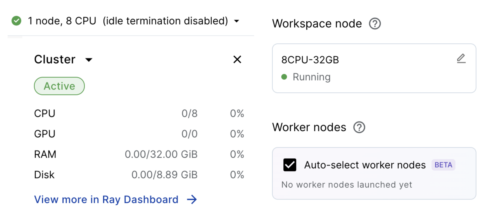

<b style="background-color: orange;">&nbsp;💡 INSIGHT&nbsp;</b>: Because we have `Auto-select worker nodes` enabled, that means that the required worker nodes (ex. GPU workers) will automagically be provisioned based on our workload's needs! They'll spin up, run the workload and then scale back to zero. This allows us to maintain a lean workspace environment (and only pay for compute when we need it) and completely remove the need to manage any infrastructure.

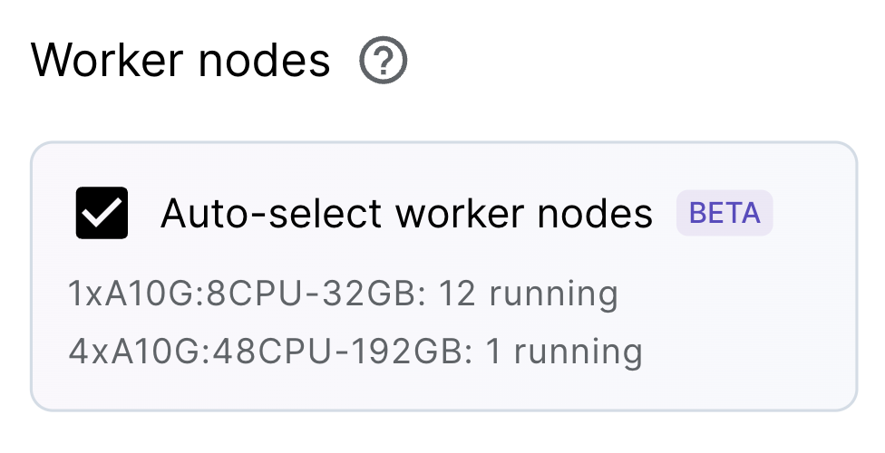

**Note**: we can explore all the metrics (ex. hardware util), logs, dashboards, manage dependencies (ex. images, pip packages, etc.) on the menu bar above.


```python
import os
import ray
import warnings
warnings.filterwarnings("ignore")
%load_ext autoreload
%autoreload 2
```

We'll need a free [Hugging Face token](https://huggingface.co/settings/tokens) to load our base LLMs and tokenizers. And since we are using Llama models, we need to login and accept the terms and conditions [here](https://huggingface.co/meta-llama/Meta-Llama-3-8B-Instruct). 

<b style="background-color: yellow;">&nbsp;🔄 REPLACE&nbsp;</b>: Place your unique HF token below. If you accidentally ran this code block before pasting your HF token, then click the `Restart` button up top to restart the notebook kernel.


```python
# Initialize HF token
os.environ['HF_TOKEN'] = ''  # <-- replace with your token
ray.init(runtime_env={'env_vars': {'HF_TOKEN': os.environ['HF_TOKEN']}})
```

```bash
(autoscaler +15m27s) [autoscaler] Downscaling node i-0267f387d8cf66c2e (node IP: 10.0.21.202) due to node idle termination.
(autoscaler +15m28s) [autoscaler] Cluster resized to {8 CPU, 0 GPU}.
```

## Data Preprocessing

We'll start by preprocessing our data in preparation for fine-tuning our LLM. We'll use batch processing to apply our preprocessing across our dataset at scale.

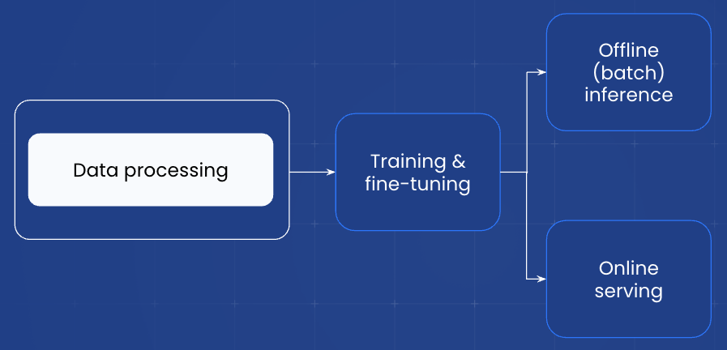

### Dataset

For our task, we'll be using the [Viggo dataset](https://huggingface.co/datasets/GEM/viggo) dataset, where the input (`meaning_representation`) is a structured collection of the overall intent (ex. `inform`) and entities (ex. `release_year`) and the output (`target`) is an unstructured sentence that incorporates all the structured input information. But for our task, we'll **reverse** this task where the input will be the unstructured sentence and the output will be the structured information.

```python
# Input (unstructured sentence):
"Dirt: Showdown from 2012 is a sport racing game for the PlayStation, Xbox, PC rated E 10+ (for Everyone 10 and Older). It's not available on Steam, Linux, or Mac."

# Output (intent + entities): 
"inform(name[Dirt: Showdown], release_year[2012], esrb[E 10+ (for Everyone 10 and Older)], genres[driving/racing, sport], platforms[PlayStation, Xbox, PC], available_on_steam[no], has_linux_release[no], has_mac_release[no])"
```


```python
from datasets import load_dataset
ray.data.set_progress_bars(enabled=False)
```


```python
# Load the VIGGO dataset
dataset = load_dataset("GEM/viggo", trust_remote_code=True)
```


```python
# Data splits
train_set = dataset['train']
val_set = dataset['validation']
test_set = dataset['test']
print (f"train: {len(train_set)}")
print (f"val: {len(val_set)}")
print (f"test: {len(test_set)}")
```

    train: 5103
    val: 714
    test: 1083


```python
# Sample
train_set[0]
```

```json
{
  "gem_id": "viggo-train-0",
  "meaning_representation": "inform(name[Dirt: Showdown], release_year[2012], esrb[E 10+ (for Everyone 10 and Older)], genres[driving/racing, sport], platforms[PlayStation, Xbox, PC], available_on_steam[no], has_linux_release[no], has_mac_release[no])",
  "target": "Dirt: Showdown from 2012 is a sport racing game for the PlayStation, Xbox, PC rated E 10+ (for Everyone 10 and Older). It's not available on Steam, Linux, or Mac.",
  "references": [
    "Dirt: Showdown from 2012 is a sport racing game for the PlayStation, Xbox, PC rated E 10+ (for Everyone 10 and Older). It's not available on Steam, Linux, or Mac."
  ]
}
```


### Data Preprocessing

We'll use [Ray](https://docs.ray.io/) to load our dataset and apply preprocessing to batches of our data at scale.


```python
import re
```


```python
# Load as a Ray Dataset
train_ds = ray.data.from_items(train_set)
train_ds.take(1)
```


```json
[
  {
    "gem_id": "viggo-train-0",
    "meaning_representation": "inform(name[Dirt: Showdown], release_year[2012], esrb[E 10+ (for Everyone 10 and Older)], genres[driving/racing, sport], platforms[PlayStation, Xbox, PC], available_on_steam[no], has_linux_release[no], has_mac_release[no])",
    "target": "Dirt: Showdown from 2012 is a sport racing game for the PlayStation, Xbox, PC rated E 10+ (for Everyone 10 and Older). It's not available on Steam, Linux, or Mac.",
    "references": [
      "Dirt: Showdown from 2012 is a sport racing game for the PlayStation, Xbox, PC rated E 10+ (for Everyone 10 and Older). It's not available on Steam, Linux, or Mac."
    ]
  }
]
```


The preprocessing we'll do involves formatting our dataset into the schema required for fine-tuning (`system`, `user`, `assistant`) conversations.

- `system`: description of the behavior or personality of the model. As a best practice, this should be the same for all examples in the fine-tuning dataset, and should remain the same system prompt when moved to production.
- `user`: user message, or "prompt," that provides a request for the model to respond to.
- `assistant`: stores previous responses but can also contain examples of intended responses for the LLM to return.

```yaml
conversations = [
    {"messages": [
        {'role': 'system', 'content': system_content},
        {'role': 'user', 'content': item['target']},
        {'role': 'assistant', 'content': item['meaning_representation']}]},
    {"messages": [...],}
    ...
]
```


```python
def to_schema(item, system_content):
    messages = [
        {'role': 'system', 'content': system_content},
        {'role': 'user', 'content': item['target']},
        {'role': 'assistant', 'content': item['meaning_representation']}]
    return {'messages': messages}
```

Our `system_content` will guide the LLM on how to behave. Our specific directions involve specifying the list of possible intents and entities to extract.


```python
# System content
system_content = (
    "Given a target sentence construct the underlying meaning representation of the input "
    "sentence as a single function with attributes and attribute values. This function "
    "should describe the target string accurately and the function must be one of the "
    "following ['inform', 'request', 'give_opinion', 'confirm', 'verify_attribute', "
    "'suggest', 'request_explanation', 'recommend', 'request_attribute']. The attributes "
    "must be one of the following: ['name', 'exp_release_date', 'release_year', 'developer', "
    "'esrb', 'rating', 'genres', 'player_perspective', 'has_multiplayer', 'platforms', "
    "'available_on_steam', 'has_linux_release', 'has_mac_release', 'specifier']")

```

To apply our function on our dataset at scale, we can pass it to [ray.data.Dataset.map](https://docs.ray.io/en/latest/data/api/doc/ray.data.Dataset.map.html). Here, we can specify the function to apply to each sample in our data, what compute to use, etc. The diagram below shows how we can read from various data sources (ex. cloud storage) and apply operations at scale across different hardware (CPU, GPU). For our workload, we'll just use the default compute strategy which will use CPUs to scale out our workload.

**Note**: If we want to distribute a workload across `batches` of our data instead of individual samples, we can use [ray.data.Dataset.map_batches](https://docs.ray.io/en/latest/data/api/doc/ray.data.Dataset.map_batches.html). We'll see this in action when we perform batch inference in our evaluation template. There are also many other [distributed operations](https://docs.ray.io/en/latest/data/api/doc/ray.data.Dataset.html) we can perform on our dataset.

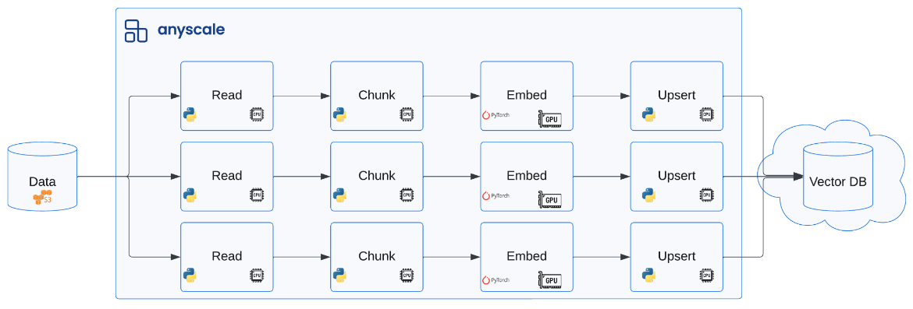


```python
# Distributed preprocessing
ft_train_ds = train_ds.map(to_schema, fn_kwargs={'system_content': system_content})
ft_train_ds.take(1)
```

```json
[
  {
    "messages": [
      {
        "content": "Given a target sentence construct the underlying meaning representation of the input sentence as a single function with attributes and attribute values. This function should describe the target string accurately and the function must be one of the following ['inform', 'request', 'give_opinion', 'confirm', 'verify_attribute', 'suggest', 'request_explanation', 'recommend', 'request_attribute']. The attributes must be one of the following: ['name', 'exp_release_date', 'release_year', 'developer', 'esrb', 'rating', 'genres', 'player_perspective', 'has_multiplayer', 'platforms', 'available_on_steam', 'has_linux_release', 'has_mac_release', 'specifier']",
        "role": "system"
      },
      {
        "content": "Dirt: Showdown from 2012 is a sport racing game for the PlayStation, Xbox, PC rated E 10+ (for Everyone 10 and Older). It's not available on Steam, Linux, or Mac.",
        "role": "user"
      },
      {
        "content": "inform(name[Dirt: Showdown], release_year[2012], esrb[E 10+ (for Everyone 10 and Older)], genres[driving/racing, sport], platforms[PlayStation, Xbox, PC], available_on_steam[no], has_linux_release[no], has_mac_release[no])",
        "role": "assistant"
      }
    ]
  }
]
```


```python
# Repeat the steps for other splits
ft_val_ds = ray.data.from_items(val_set).map(to_schema, fn_kwargs={'system_content': system_content})
ft_test_ds = ray.data.from_items(test_set).map(to_schema, fn_kwargs={'system_content': system_content})
```

### Save and load data

We can save our data locally and/or to remote storage to use later (training, evaluation, etc.). All workspaces come with a default [cloud storage locations and shared storage](https://docs.anyscale.com/workspaces/storage) that we can write to.


```python
os.environ['ANYSCALE_ARTIFACT_STORAGE']
```


    's3://anyscale-test-data-cld-i2w99rzq8b6lbjkke9y94vi5/org_7c1Kalm9WcX2bNIjW53GUT/cld_kvedZWag2qA8i5BjxUevf5i7/artifact_storage'


```python
# Write to cloud storage
ft_train_ds.write_json(f"{os.environ['ANYSCALE_ARTIFACT_STORAGE']}/viggo/train.jsonl")
ft_val_ds.write_json(f"{os.environ['ANYSCALE_ARTIFACT_STORAGE']}/viggo/val.jsonl")
ft_test_ds.write_json(f"{os.environ['ANYSCALE_ARTIFACT_STORAGE']}/viggo/test.jsonl")
```

```python
# Load from cloud storage
ft_train_ds = ray.data.read_json(f"{os.environ['ANYSCALE_ARTIFACT_STORAGE']}/viggo/train.jsonl")
ft_train_ds.take(1)
```

```json
[
  {
    "messages": [
      {
        "content": "Given a target sentence construct the underlying meaning representation of the input sentence as a single function with attributes and attribute values. This function should describe the target string accurately and the function must be one of the following ['inform', 'request', 'give_opinion', 'confirm', 'verify_attribute', 'suggest', 'request_explanation', 'recommend', 'request_attribute']. The attributes must be one of the following: ['name', 'exp_release_date', 'release_year', 'developer', 'esrb', 'rating', 'genres', 'player_perspective', 'has_multiplayer', 'platforms', 'available_on_steam', 'has_linux_release', 'has_mac_release', 'specifier']",
        "role": "system"
      },
      {
        "content": "Dirt: Showdown from 2012 is a sport racing game for the PlayStation, Xbox, PC rated E 10+ (for Everyone 10 and Older). It's not available on Steam, Linux, or Mac.",
        "role": "user"
      },
      {
        "content": "inform(name[Dirt: Showdown], release_year[2012], esrb[E 10+ (for Everyone 10 and Older)], genres[driving/racing, sport], platforms[PlayStation, Xbox, PC], available_on_steam[no], has_linux_release[no], has_mac_release[no])",
        "role": "assistant"
      }
    ]
  }
]
```


## Fine-tuning

In this template, we'll fine-tune a large language model (LLM) using our dataset from the previous data preprocessing template. 

**Note**: We normally would not jump straight to fine-tuning a model. We would first experiment with a base model and evaluate it so that we can have a baseline performance to compare it to.

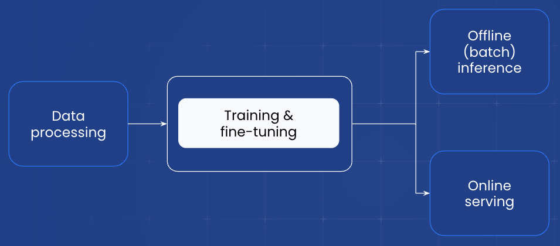

### Configurations

We'll fine-tune our LLM by choosing a set of configurations. We have created recipes for different LLMs in the [`training configs`](configs/training/lora/llama-3-8b.yaml) folder which can be used as is or modified for experiments. These configurations provide flexibility over a broad range of parameters such as model, data paths, compute to use for training, number of training epochs, how often to save checkpoints, padding, loss, etc. We also include several [DeepSpeed](https://github.com/microsoft/DeepSpeed) [configurations](configs/deepspeed/zero_3_offload_optim+param.json) to choose from for further optimizations around data/model parallelism, mixed precision, checkpointing, etc.

We also have recipes for [LoRA](https://arxiv.org/abs/2106.09685) (where we train a set of small low ranked matrices instead of the original attention and feed forward layers) or full parameter fine-tuning. We recommend starting with LoRA as it's less resource intensive and quicker to train.


```python
# View the training (LoRA) configuration for llama-3-8B
!cat configs/training/lora/llama-3-8b.yaml
```

```yaml
model_id: meta-llama/Meta-Llama-3-8B-Instruct # <-- change this to the model you want to fine-tune
train_path: s3://llm-guide/data/viggo/train.jsonl # <-- change this to the path to your training data
valid_path: s3://llm-guide/data/viggo/val.jsonl # <-- change this to the path to your validation data. This is optional
context_length: 512 # <-- change this to the context length you want to use
num_devices: 16 # <-- change this to total number of GPUs that you want to use
num_epochs: 4 # <-- change this to the number of epochs that you want to train for
train_batch_size_per_device: 16
eval_batch_size_per_device: 16
learning_rate: 1e-4
padding: "longest" # This will pad batches to the longest sequence. Use "max_length" when profiling to profile the worst case.
num_checkpoints_to_keep: 1
dataset_size_scaling_factor: 10000
output_dir: /mnt/local_storage
deepspeed:
    config_path: configs/deepspeed/zero_3_offload_optim+param.json
dataset_size_scaling_factor: 10000 # internal flag. No need to change
flash_attention_2: true
trainer_resources:
    memory: 53687091200 # 50 GB memory
worker_resources:
    accelerator_type:A10G: 0.001
lora_config:
    r: 8
    lora_alpha: 16
    lora_dropout: 0.05
    target_modules:
    - q_proj
    - v_proj
    - k_proj
    - o_proj
    - gate_proj
    - up_proj
    - down_proj
    - embed_tokens
    - lm_head
    task_type: "CAUSAL_LM"
    modules_to_save: []
    bias: "none"
    fan_in_fan_out: false
    init_lora_weights: true
```


### Fine-tuning

This Workspace is still running on a small, lean head node. But based on the compute we want to use (ex. `num_devices` and `accelerator_type`) for fine-tuning, the appropriate worker nodes will automatically be initialized and execute the workload. And afterwards, they'll scale back to zero!

<b style="background-color: orange;">&nbsp;💡 INSIGHT&nbsp;</b>: With [Ray](https://docs.ray.io/) we're able to execute a large, compute intensive workload like this using smaller, more available resources (ex. using `A10`s instead of waiting for elusive `A100`s). And Anyscale's smart instance manager will automatically provision the appropriate and available compute for the workload based on what's needed.

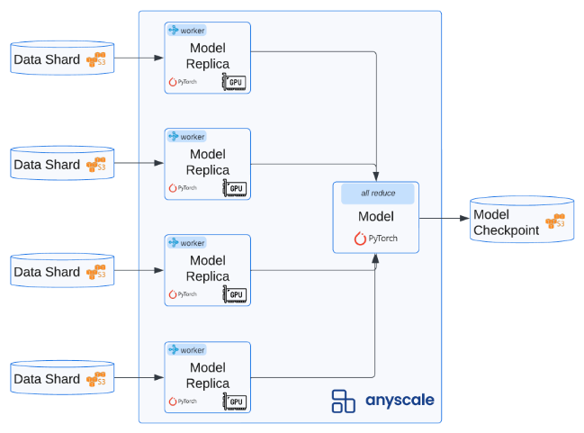

While we could execute `python src/ft.py configs/training/lora/llama-3-8b.yaml` directly inside a Workspace notebook (see this [example](https://console.anyscale.com/v2/template-preview/finetuning_llms_v2)), we'll instead kick off the fine-tuning workload as an isolated job. An [Anyscale Job](https://docs.anyscale.com/jobs/get-started/) is a great way to scale and execute a specific workload. Here, we specify the command that needs to run (ex. `python [COMMAND][ARGS]`) along with the requirements (ex. docker image, additional, pip packages, etc.).

**Note**: Executing an Anyscale Job within a Workspace will ensure that files in the current working directory are available for the Job (unless excluded with `--exclude`). But we can also load files from anywhere (ex. Github repo, S3, etc.) if we want to launch a Job from anywhere.


```python
# View job yaml config
!cat deploy/jobs/ft.yaml
```

```yaml
name: llm-fine-tuning-guide
entrypoint: python src/ft.py configs/training/lora/llama-3-8b.yaml
image_uri: localhost:5555/anyscale/llm-forge:0.4.3.2
requirements: []
max_retries: 0
```


<b style="background-color: orange;">&nbsp;💡 INSIGHT&nbsp;</b>: When defining this [Job config](https://docs.anyscale.com/reference/job-api/), if we don't specify the [compute config](https://docs.anyscale.com/configure/compute-configs/overview/) to use, then Anyscale will autoselect based on the required compute. However, we also have the optionality to specify and even make highly cost effective decisions such as [spot to on-demand fallback](https://docs.anyscale.com/configure/compute-configs/ondemand-to-spot-fallback/) (or vice-versa).

```yaml
# Sample compute config
- name: gpu-worker-a10
  instance_type: g5.2xlarge
  min_workers: 0
  max_workers: 16
  use_spot: true
  fallback_to_ondemand: true
```


```python
# Job submission
!anyscale job submit --config-file deploy/jobs/ft.yaml --exclude assets
```

```bash
Output
(anyscale +0.8s) Submitting job with config JobConfig(name='llm-fine-tuning-guide', image_uri='localhost:5555/anyscale/llm-forge:0.4.3.2', compute_config=None, env_vars=None, py_modules=None).
(anyscale +3.2s) Uploading local dir '.' to cloud storage.
(anyscale +4.8s) Job 'llm-fine-tuning-guide' submitted, ID: 'prodjob_515se1nqf8ski7scytd52vx65e'.
(anyscale +4.8s) View the job in the UI: https://console.anyscale.com/jobs/prodjob_515se1nqf8ski7scytd52vx65e
(anyscale +4.8s) Use `--wait` to wait for the job to run and stream logs.
```

This workload (we set to five epochs) will take ~45 min. to complete. As the job runs, you can monitor logs, metrics, Ray dashboard, etc. by clicking on the generated Job link above (`https://console.anyscale.com/jobs/prodjob_...`)

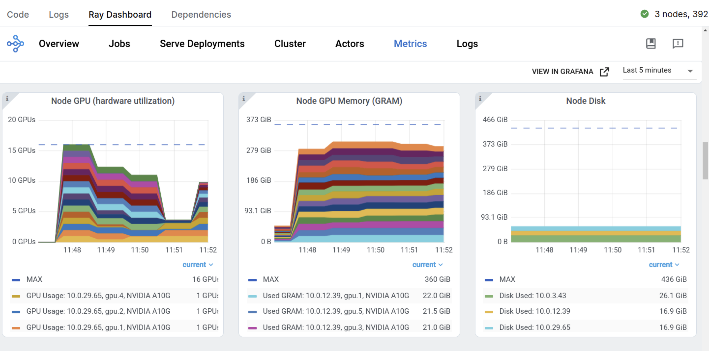

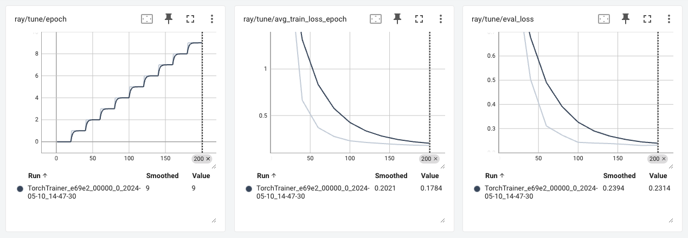

**Note**: If we didn't want to have all this control and flexibility for our fine-tuning workload, there is also a much easier workflow with [Anyscale serverless endpoints](https://docs.anyscale.com/endpoints/fine-tuning/fine-tuning-api/).


```python
# Get your API key from https://console.anyscale.com/credentials
ANYSCALE_API_KEY = "esecret_yourKeyHere"  
ANYSCALE_API_BASE = "https://api.endpoints.anyscale.com/v1"

# Anyscale Endpoints are OpenAI compatible
client = openai.OpenAI(base_url = ANYSCALE_API_BASE, api_key = ANYSCALE_API_KEY)
training_file_id = client.files.create(file=open(train_file_path,'rb'), purpose="fine-tune").id
valid_file_id = client.files.create(file=open(validation_file_path,'rb'), purpose="fine-tune").id

# Create finetuning job. Other parameters like context length will be chosen appropriately based on dataset size
fine_tuning_job_id = client.fine_tuning.jobs.create(
    model="meta-llama/Meta-Llama-3-8B-Instruct",
    hyperparameters={"n_epochs": 4},
    training_file=training_file_id,
    validation_file=valid_file_id).id
```

### Load artifacts

From the very end of the logs, we can also see where our model artifacts are stored. For example: 

```
Successfully copied files to to bucket: anyscale-test-data-cld-i2w99rzq8b6lbjkke9y94vi5 and path: org_7c1Kalm9WcX2bNIjW53GUT/cld_kvedZWag2qA8i5BjxUevf5i7/artifact_storage/lora_fine_tuning/meta-llama/Meta-Llama-3-8B-Instruct:gokum:atyhk
```

We'll load these artifacts from cloud storage to a local [cluster storage](https://docs.anyscale.com/workspaces/storage/#cluster-storage) to use for other workloads.


```python
from src.utils import download_files_from_bucket
```

<b style="background-color: yellow;">&nbsp;🔄 REPLACE&nbsp;</b>: Update the information below for the specific model and artifacts path for our fine-tuned model (retrieved from the logs from the Anyscale Job we launched above).


```python
# Locations
artifacts_dir = '/mnt/cluster_storage'  # storage accessible by head and worker nodes
model = 'meta-llama/Meta-Llama-3-8B-Instruct:gokum:atyhk'  # REPLACE with your model ID (from Job logs)
artifacts_path = f'org_7c1Kalm9WcX2bNIjW53GUT/cld_kvedZWag2qA8i5BjxUevf5i7/artifact_storage/lora_fine_tuning/{model}'
```


```python
# Download artifacts
download_files_from_bucket(
    bucket=os.environ['ANYSCALE_CLOUD_STORAGE_BUCKET'], 
    path=artifacts_path, 
    local_dir=artifacts_dir)

```

    Downloaded org_7c1Kalm9WcX2bNIjW53GUT/cld_kvedZWag2qA8i5BjxUevf5i7/artifact_storage/lora_fine_tuning/meta-llama/Meta-Llama-3-8B-Instruct:gokum:atyhk/README.md to /mnt/cluster_storage/org_7c1Kalm9WcX2bNIjW53GUT/cld_kvedZWag2qA8i5BjxUevf5i7/
    ...
    Downloaded org_7c1Kalm9WcX2bNIjW53GUT/cld_kvedZWag2qA8i5BjxUevf5i7/artifact_storage/lora_fine_tuning/meta-llama/Meta-Llama-3-8B-Instruct:gokum:atyhk/tokenizer_config.json to /mnt/cluster_storage/org_7c1Kalm9WcX2bNIjW53GUT/cld_kvedZWag2qA8i5BjxUevf5i7/artifact_storage/lora_fine_tuning/meta-llama/Meta-Llama-3-8B-Instruct:gokum:atyhk/tokenizer_config.json


## Evaluation

Now we'll evaluate our fine-tuned LLM to see how well it performs on our task. We'll perform offline batch inference where we will use our tuned model to generate the outputs.

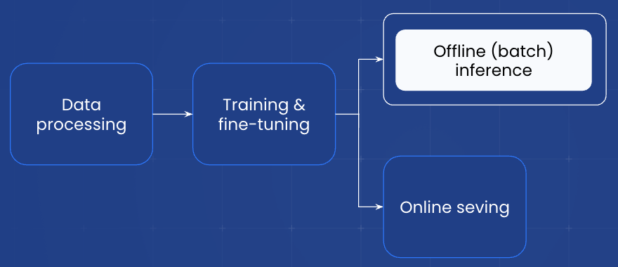

### Load test data


```python
# Load test set for eval
ft_test_ds = ray.data.read_json(f"{os.environ['ANYSCALE_ARTIFACT_STORAGE']}/viggo/test.jsonl")
test_data = ft_test_ds.take_all()
test_data[0]

```

```json
{
  "messages": [
    {
      "content": "Given a target sentence construct the underlying meaning representation of the input sentence as a single function with attributes and attribute values. This function should describe the target string accurately and the function must be one of the following ['inform', 'request', 'give_opinion', 'confirm', 'verify_attribute', 'suggest', 'request_explanation', 'recommend', 'request_attribute']. The attributes must be one of the following: ['name', 'exp_release_date', 'release_year', 'developer', 'esrb', 'rating', 'genres', 'player_perspective', 'has_multiplayer', 'platforms', 'available_on_steam', 'has_linux_release', 'has_mac_release', 'specifier']",
      "role": "system"
    },
    {
      "content": "Have you ever given any games on PC but not on Steam a try, like The Sims?",
      "role": "user"
    },
    {
      "content": "suggest(name[The Sims], platforms[PC], available_on_steam[no])",
      "role": "assistant"
    }
  ]
}
```


```python
# Separate into inputs/outputs
test_inputs = []
test_outputs = []
for item in test_data:
    test_inputs.append([message for message in item['messages'] if message['role'] != 'assistant'])
    test_outputs.append([message for message in item['messages'] if message['role'] == 'assistant'])
```

### Tokenizer

We'll also load the appropriate tokenizer to apply to our input data.


```python
from transformers import AutoTokenizer
```


```python
# Model and tokenizer
HF_MODEL = 'meta-llama/Meta-Llama-3-8B-Instruct'
tokenizer = AutoTokenizer.from_pretrained(HF_MODEL)
```

### Chat template

When we fine-tuned our model, special tokens (ex. beginning/end of text, etc.) were automatically added to our inputs. We want to apply the same special tokens to our inputs prior to generating outputs using our tuned model. Luckily, the chat template to apply to our inputs (and add those tokens) is readily available inside our tuned model's `tokenizer_config.json` file. We can use our tokenizer to apply this template to our inputs.


```python
import json
```


```python
# Extract chat template used during fine-tuning
with open(os.path.join(artifacts_dir, artifacts_path, 'tokenizer_config.json')) as file:
    tokenizer_config = json.load(file)
chat_template = tokenizer_config['chat_template']
print (chat_template)
```

    {{ content }}{{ '<|start_header_id|>assistant<|end_header_id|>
    
    ' }}


```python
# Apply chat template
test_input_prompts = [{'inputs': tokenizer.apply_chat_template(
    conversation=inputs, 
    chat_template=chat_template, 
    add_generation_prompt=True, 
    tokenize=False, 
    return_tensors='np'), 'outputs': outputs} for inputs, outputs in zip(test_inputs, test_outputs)]
test_input_prompts_ds = ray.data.from_items(test_input_prompts)
print (test_input_prompts_ds.take(1))
```

```json
[
  {
    "inputs": "system\n\nGiven a target sentence construct the underlying meaning representation of the input sentence as a single function with attributes and attribute values. This function should describe the target string accurately and the function must be one of the following ['inform', 'request', 'give_opinion', 'confirm', 'verify_attribute', 'suggest', 'request_explanation', 'recommend', 'request_attribute']. The attributes must be one of the following: ['name', 'exp_release_date', 'release_year', 'developer', 'esrb', 'rating', 'genres', 'player_perspective', 'has_multiplayer', 'platforms', 'available_on_steam', 'has_linux_release', 'has_mac_release', 'specifier']user\n\nHave you ever given any games on PC but not on Steam a try, like The Sims?assistant\n\n",
    "outputs": [
      {
        "content": "suggest(name[The Sims], platforms[PC], available_on_steam[no])",
        "role": "assistant"
      }
    ]
  }
]
```


### Batch inference

We will use [vLLM](https://github.com/vllm-project/vllm)'s offline LLM class to load the model and use it for inference. We can easily load our LoRA weights and merge them with the base model (just pass in `lora_path`). And we'll wrap all of this functionality in a class that we can pass to [ray.data.Dataset.map_batches`](https://docs.ray.io/en/latest/data/api/doc/ray.data.Dataset.map_batches.html) to apply batch inference at scale.

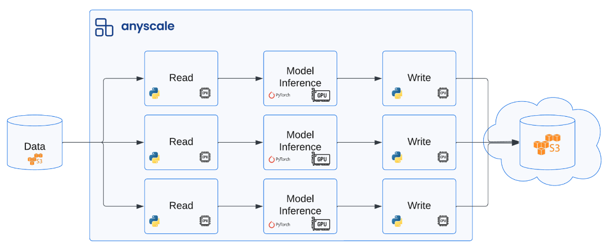


```python
from vllm import LLM, SamplingParams
from vllm.anyscale.lora.utils import LoRARequest
```


```python
class LLMPredictor:
    def __init__(self, hf_model, sampling_params, lora_path=None):
        self.llm = LLM(model=hf_model, enable_lora=bool(lora_path))
        self.sampling_params = sampling_params
        self.lora_path = lora_path

    def __call__(self, batch):
        if not self.lora_path:
            outputs = self.llm.generate(
                prompts=batch['inputs'], 
                sampling_params=self.sampling_params)
        else:
            outputs = self.llm.generate(
                prompts=batch['inputs'], 
                sampling_params=self.sampling_params, 
                lora_request=LoRARequest('lora_adapter', 1, self.lora_path))
        inputs = []
        generated_outputs = []
        for output in outputs:
            inputs.append(output.prompt)
            generated_outputs.append(' '.join([o.text for o in output.outputs]))
        return {
            'prompt': inputs,
            'expected_output': batch['outputs'],
            'generated_text': generated_outputs,
        }
```

During our data preprocessing template, we used the default compute strategy with `map_batches`. But this time we'll specify a custom compute strategy (`concurrency`, `num_gpus`, `batch_size` and `accelerator_type`).


```python
# Fine-tuned model
hf_model = 'meta-llama/Meta-Llama-3-8B-Instruct'
sampling_params = SamplingParams(temperature=0, max_tokens=2048)
ft_pred_ds = test_input_prompts_ds.map_batches(
    LLMPredictor,
    concurrency=4,  # number of LLM instances
    num_gpus=1,  # GPUs per LLM instance
    batch_size=10,  # maximize until OOM, if OOM then decrease batch_size
    fn_constructor_kwargs={
        'hf_model': hf_model,
        'sampling_params': sampling_params,
        'lora_path': os.path.join(artifacts_dir, artifacts_path)},
    accelerator_type='A10G',  # A10G or L4
)
```


```python
# Batch inference will take ~4 minutes
ft_pred = ft_pred_ds.take_all()
ft_pred[3]
```

```bash
(autoscaler +6m32s) Tip: use `ray status` to view detailed cluster status. To disable these messages, set RAY_SCHEDULER_EVENTS=0.
(autoscaler +6m32s) [autoscaler] [4xA10G:48CPU-192GB] Upscaling 1 node(s).
(autoscaler +6m33s) [autoscaler] [4xA10G:48CPU-192GB|g5.12xlarge] [us-west-2a] [on-demand] Launched 1 instances.
(autoscaler +7m46s) [autoscaler] Cluster upscaled to {56 CPU, 4 GPU}.
```

```json
{
  "prompt": "system\n\nGiven a target sentence construct the underlying meaning representation of the input sentence as a single function with attributes and attribute values. This function should describe the target string accurately and the function must be one of the following ['inform', 'request', 'give_opinion', 'confirm', 'verify_attribute', 'suggest', 'request_explanation', 'recommend', 'request_attribute']. The attributes must be one of the following: ['name', 'exp_release_date', 'release_year', 'developer', 'esrb', 'rating', 'genres', 'player_perspective', 'has_multiplayer', 'platforms', 'available_on_steam', 'has_linux_release', 'has_mac_release', 'specifier']user\n\nI like first person games normally, but not even that could make a music game fun for me. In fact in Guitar Hero: Smash Hits, I think the perspective somehow made an already bad game even worse.assistant\n\n",
  "expected_output": [
    {
      "content": "give_opinion(name[Guitar Hero: Smash Hits], rating[poor], genres[music], player_perspective[first person])",
      "role": "assistant"
    }
  ],
  "generated_text": "give_opinion(name[Guitar Hero: Smash Hits], rating[poor], genres[music], player_perspective[first person])assistant\n\n"
}
```


### Evaluation

There are a lot of different ways to perform evaluation. For our task, we can use traditional deterministic metrics (ex. accuracy, precsion, recall, etc.) since we know what the outputs should be (extracted intent and entities). 

However for many generative tasks, the outputs are very unstructured and highly subjective. For these scenarios, we can use [distance/entropy](https://github.com/huggingface/evaluate) based metrics like cosine, bleu, perplexity, etc. But, these metrics are often not very representative of the underlying task. A common strategy here is to use a larger LLM to [judge the quality](https://www.anyscale.com/blog/a-comprehensive-guide-for-building-rag-based-llm-applications-part-1#evaluation) of the generated outputs. We can ask the larger LLM to directly assess the quality of the response (ex. rate between `1-5`) with a set of rules or compare it to a golden / preferred output and rate it against that.


```python
# Exact match (strict!)
matches = 0
mismatches = []
for item in ft_pred:
    if item['expected_output'][0]['content'] == item['generated_text'].split('<|eot_id|>')[0]:
        matches += 1
    else:
        mismatches.append(item)
matches / float(len(ft_pred))
```


    0.9399815327793167


Even our mismatches are not too far off and sometimes it might be worth a closer look because the dataset itself might have a few errors that the model may have identified.


```python
# Inspect a few of the mismatches
mismatches[0:2]
```

```json
[
  {
    "prompt": "system\n\nGiven a target sentence construct the underlying meaning representation of the input sentence as a single function with attributes and attribute values. This function should describe the target string accurately and the function must be one of the following ['inform', 'request', 'give_opinion', 'confirm', 'verify_attribute', 'suggest', 'request_explanation', 'recommend', 'request_attribute']. The attributes must be one of the following: ['name', 'exp_release_date', 'release_year', 'developer', 'esrb', 'rating', 'genres', 'player_perspective', 'has_multiplayer', 'platforms', 'available_on_steam', 'has_linux_release', 'has_mac_release', 'specifier']user\n\nDance Dance Revolution Universe 3 got poor ratings when it came out in 2008. It might have been the worst multiplayer music game for the Xbox.assistant\n\n",
    "expected_output": [
      {
        "content": "inform(name[Dance Dance Revolution Universe 3], release_year[2008], rating[poor], genres[music], has_multiplayer[yes], platforms[Xbox])",
        "role": "assistant"
      }
    ],
    "generated_text": "give_opinion(name[Dance Dance Revolution Universe 3], release_year[2008], rating[poor], has_multiplayer[yes], platforms[Xbox])assistant\n\n"
  },
  {
    "prompt": "system\n\nGiven a target sentence construct the underlying meaning representation of the input sentence as a single function with attributes and attribute values. This function should describe the target string accurately and the function must be one of the following ['inform', 'request', 'give_opinion', 'confirm', 'verify_attribute', 'suggest', 'request_explanation', 'recommend', 'request_attribute']. The attributes must be one of the following: ['name', 'exp_release_date', 'release_year', 'developer', 'esrb', 'rating', 'genres', 'player_perspective', 'has_multiplayer', 'platforms', 'available_on_steam', 'has_linux_release', 'has_mac_release', 'specifier']user\n\nA first person game I recently got on Steam is Assetto Corsa. Have you heard of it?assistant\n\n",
    "expected_output": [
      {
        "content": "recommend(name[Assetto Corsa], player_perspective[first person], available_on_steam[yes])",
        "role": "assistant"
      }
    ],
    "generated_text": "recommend(name[Assetto Corsa], available_on_steam[yes])assistant\n\n"
  }
]

```


## Serving

For model serving, we'll first serve it locally, test it and then launch a production grade service that can autoscale to meet any demand.

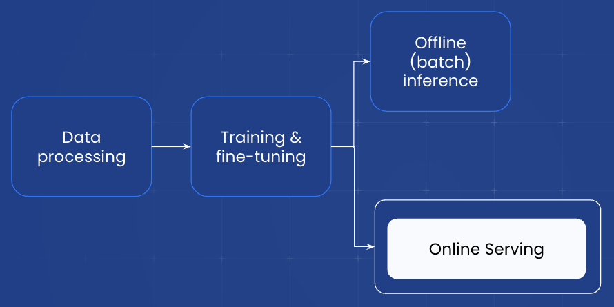

We'll start by generating the configuration for our service. We provide a convenient CLI experience to generate this configuration but you can create one from scratch as well. Here we can specify where our model lives, autoscaling behavior, accelerators to use, lora adapters, etc.

<b style="background-color: orange;">&nbsp;💡 INSIGHT&nbsp;</b>: Ray Serve and Anyscale support [serving multiple LoRA adapters](https://github.com/anyscale/templates/blob/main/templates/endpoints_v2/examples/lora/DeployLora.ipynb) with a common base model in the same request batch which allows you to serve a wide variety of use-cases without increasing hardware spend. In addition, we use Serve multiplexing to reduce the number of swaps for LoRA adapters. There is a slight latency overhead to serving a LoRA model compared to the base model, typically 10-20%.

**LoRA weights storage URI**: `s3://anyscale-test-data-cld-i2w99rzq8b6lbjkke9y94vi5/org_7c1Kalm9WcX2bNIjW53GUT/cld_kvedZWag2qA8i5BjxUevf5i7/artifact_storage/lora_fine_tuning`

**model**: `meta-llama/Meta-Llama-3-8B-Instruct:gokum:atyhk`


We'll start by running the python command below to start the CLI workflow to generate the service yaml configuration:
```bash
cd /home/ray/default/deploy/services
python /home/ray/default/src/generate_serve_config.py 
```

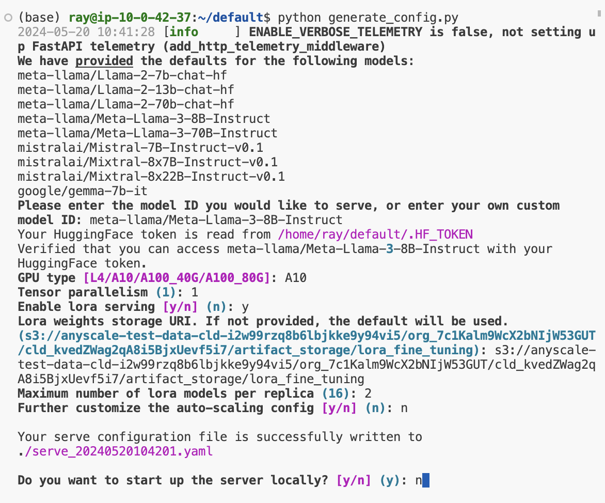

<b style="background-color: yellow;">&nbsp;🔄 REPLACE&nbsp;</b>: Use the serve configuration generated for you.


```python
# Generated service configuration
!cat /home/ray/default/deploy/services/serve_{TIMESTAMP}.yaml
```

```yaml
applications:
- args:
    dynamic_lora_loading_path: s3://anyscale-test-data-cld-i2w99rzq8b6lbjkke9y94vi5/org_7c1Kalm9WcX2bNIjW53GUT/cld_kvedZWag2qA8i5BjxUevf5i7/artifact_storage/lora_fine_tuning
    embedding_models: []
    function_calling_models: []
    models: []
    multiplex_lora_adapters: []
    multiplex_models:
    - ./model_config/model_config_20240516095237.yaml
    vllm_base_models: []
    import_path: aviary_private_endpoints.backend.server.run:router_application
    name: llm-endpoint
    route_prefix: /
```


This also generates a model configuration file that has all the information on auto scaling, inference engine, workers, compute, etc. It will be located under `/home/ray/default/deploy/services/model_config/{MODEL_NAME}-{TIMESTAMP}.yaml`. This configuration also includes the `prompt_format` which seamlessly matches any formatting we did prior to fine-tuning and applies it during inference automatically.

### Local deployment

We can now serve our model locally and query it. Run the follow in the terminal (change to your serve yaml config):
```bash
cd /home/ray/default/deploy/services
serve run serve_{TIMESTAMP}.yaml
```


```python
from openai import OpenAI
```


```python
# Query function to call the running service
def query(base_url: str, api_key: str):
    if not base_url.endswith("/"):
        base_url += "/"

    # List all models
    client = OpenAI(base_url=base_url + "v1", api_key=api_key)
    models = client.models.list()
    print(models)

    # Note: not all arguments are currently supported and will be ignored by the backend
    chat_completions = client.chat.completions.create(
        model=model,  # with your unique model ID
        messages=[
            {"role": "system", "content": "Given a target sentence construct the underlying meaning representation of the input sentence as a single function with attributes and attribute values. This function should describe the target string accurately and the function must be one of the following ['inform', 'request', 'give_opinion', 'confirm', 'verify_attribute', 'suggest', 'request_explanation', 'recommend', 'request_attribute']. The attributes must be one of the following: ['name', 'exp_release_date', 'release_year', 'developer', 'esrb', 'rating', 'genres', 'player_perspective', 'has_multiplayer', 'platforms', 'available_on_steam', 'has_linux_release', 'has_mac_release', 'specifier']"},
            {"role": "user", "content": "I remember you saying you found Little Big Adventure to be average. Are you not usually that into single-player games on PlayStation?"},
        ],
        temperature=0,
        stream=True
    )

    response = ""
    for chat in chat_completions:
        if chat.choices[0].delta.content is not None:
            response += chat.choices[0].delta.content
    return response
```


```python
# Generate response
response = query("http://localhost:8000", "NOT A REAL KEY")
print (response.split('<|eot_id|>')[0])
```


    'verify_attribute(name[Little Big Adventure], rating[average], has_multiplayer[no], platforms[PlayStation])'


### Production service

Now we'll create a production service that can truly scale. We have full control over this Service from autoscaling behavior, monitoring via dashboard, canary rollouts, termination, etc. → [Anyscale Services](https://docs.anyscale.com/examples/intro-services/)

<b style="background-color: orange;">&nbsp;💡 INSIGHT&nbsp;</b>: With Ray Serve and Anyscale, it's extremely easy to define our configuration that can scale to meet any demand but also scale back to zero to create the most efficient service possible. Check out this [guide](https://github.com/anyscale/templates/blob/main/templates/endpoints_v2/examples/OptimizeModels.ipynb) on how to optimize behavior around auto scaling, latency/throughout, etc.

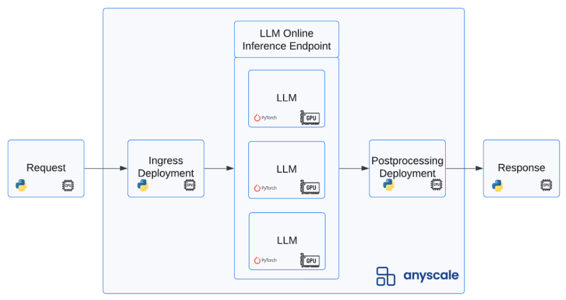

Stop the local service (Control + C) and run the following:
```bash
cd /home/ray/default/deploy/services
anyscale service deploy -f serve_{TIMESTAMP}.yaml
```


Go to `Home` > `Services` (left panel) to view the production service.

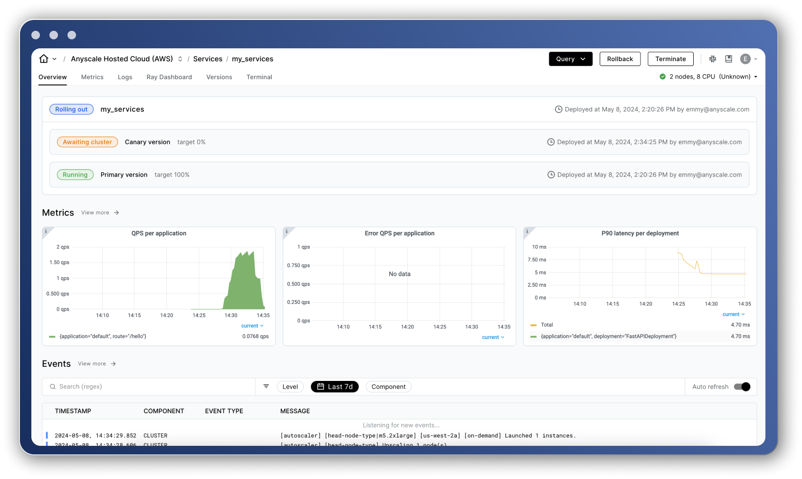

<b style="background-color: yellow;">&nbsp;🔄 REPLACE&nbsp;</b>: the `service_url` and `service_bearer_token` generated for your service (top right corner under the `Query` button on the Service's page).


```python
# Query the remote serve application we just deployed
service_url = "your_api_url"  # REPLACE ME
service_bearer_token = "your_secret_bearer_token"  # REPLACE ME
query(service_url, service_bearer_token)
```


    'verify_attribute(name[Little Big Adventure], rating[average], has_multiplayer[no], platforms[PlayStation])'


**Note**: If we chose to fine-tune our model using the simpler [Anyscale serverless endpoints](https://docs.anyscale.com/endpoints/fine-tuning/fine-tuning-api/) method, then we can serve that model by going to `Endpoints API > Services` on the left panel of the main [console page](https://console.anyscale.com/). Click on the three dots on the right side of your tuned model and follow the instructions to query it.

## Dev → Prod

We've now served our model into production via [Anyscale Services](https://docs.anyscale.com/examples/intro-services/) but we can just easily productionize our other workloads with [Anyscale Jobs](https://docs.anyscale.com/examples/intro-jobs/) (like we did for fine-tuning above) to execute this entire workflow completely programmatically outside of Workspaces.

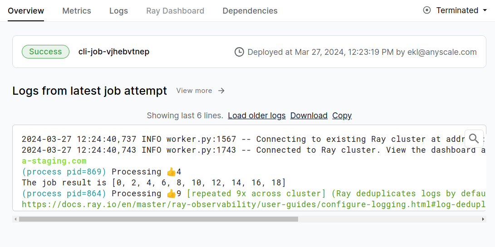

For example, suppose that we want to preprocess batches of new incoming data, fine-tune a model, evaluate it and then compare it to the existing production version. All of this can be productionized by simply launching the workload as a [Job](https://docs.anyscale.com/examples/intro-jobs), which can be triggered manually, periodically (cron) or event-based (via webhooks, etc.). We also provide integrations with your platform/tools to make all of this connect with your existing production workflows.

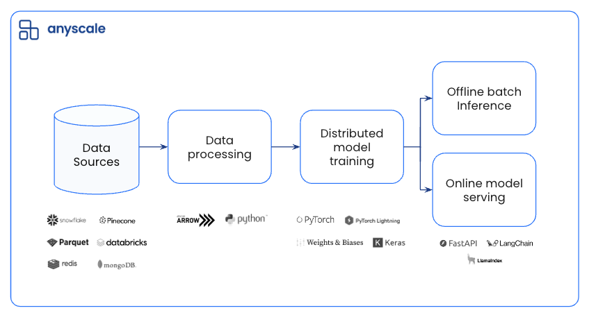

<b style="background-color: orange;">&nbsp;💡 INSIGHT&nbsp;</b>: Most industry ML issues arise from a discrepancy between the development (ex. local laptop) and production (ex. large cloud clusters) environments. With Anyscale, your development and production environments can be exactly the same so there is little to no difference introduced. And with features like smart instance manager, the development environment can stay extremely lean while having the power to scale as needed.

## Clean up


```python
# Clean up
!python src/clear_cell_nums.py
!find . | grep -E ".ipynb_checkpoints" | xargs rm -rf
!find . | grep -E "(__pycache__|\.pyc|\.pyo)" | xargs rm -rf
!rm -rf __pycache__ data .HF_TOKEN deploy/services
```

## Next steps

We have a lot more guides that address more nuanced use cases:

- [Batch text embeddings with Ray data](https://github.com/anyscale/templates/tree/main/templates/text-embeddings)
- [Continued fine-tuning from checkpoint](https://github.com/anyscale/templates/tree/main/templates/fine-tune-llm_v2/cookbooks/continue_from_checkpoint)
- [Serving multiple LoRA adapters with same base model](https://github.com/anyscale/templates/blob/main/templates/endpoints_v2/examples/lora/DeployLora.ipynb) (+ multiplexing)
- [Deploy models for embedding generation](https://github.com/anyscale/templates/blob/main/templates/endpoints_v2/examples/embedding/EmbeddingModels.ipynb)
- Function calling [fine-tuning](https://github.com/anyscale/templates/tree/main/templates/fine-tune-llm_v2/end-to-end-examples/fine-tune-function-calling) and [deployment](https://github.com/anyscale/templates/blob/main/templates/endpoints_v2/examples/function_calling/DeployFunctionCalling.ipynb)
- [Configs to optimize the latency/throughput](https://github.com/anyscale/templates/blob/main/templates/endpoints_v2/examples/OptimizeModels.ipynb)
- [Configs to control optimization parameters and tensor-parallelism](https://github.com/anyscale/templates/blob/main/templates/endpoints_v2/examples/AdvancedModelConfigs.ipynb)
- Stable diffusion [fine-tuning](https://github.com/anyscale/templates/tree/main/templates/fine-tune-stable-diffusion) and [serving](https://github.com/anyscale/templates/tree/main/templates/serve-stable-diffusion)

And if you're interested in using our hosted Anyscale or connecting it to your own cloud, reach out to us at [Anyscale](https://www.anyscale.com/get-started?utm_source=goku). And follow us on [Twitter](https://x.com/anyscalecompute) and [LinkedIn](https://www.linkedin.com/company/joinanyscale/) for more real-time updates on new features!
