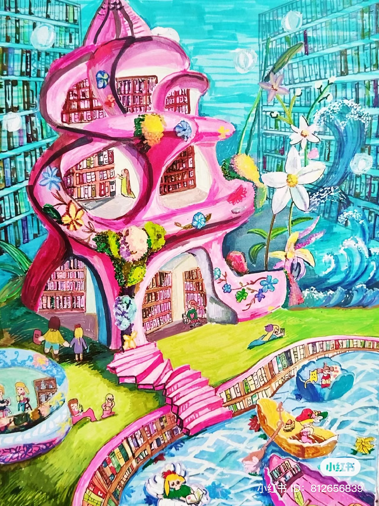
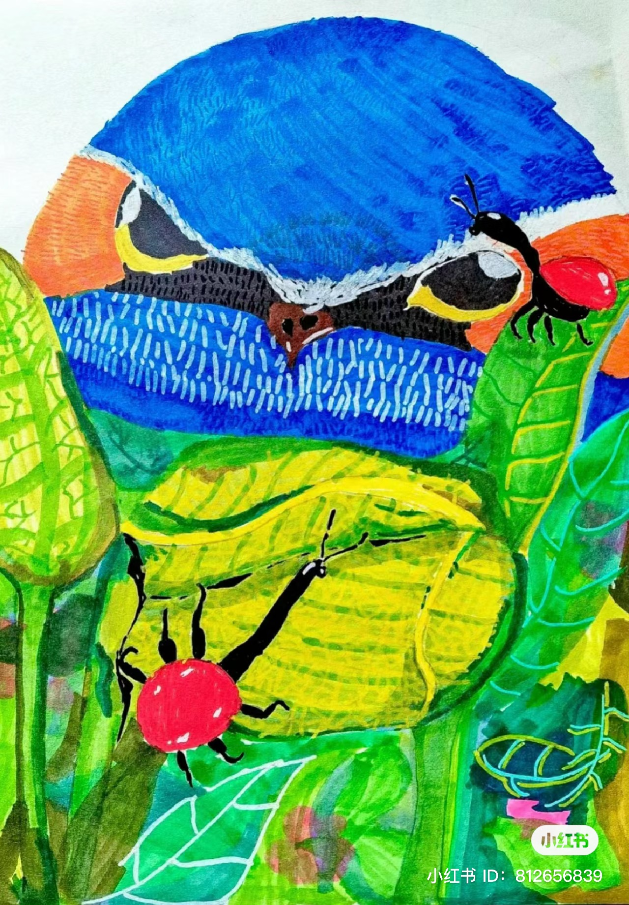
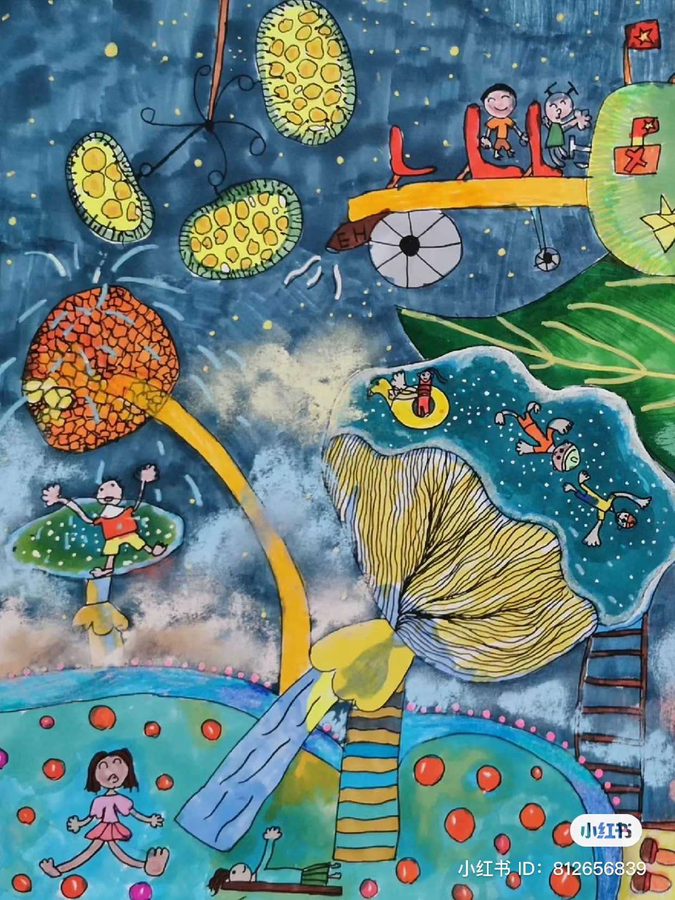
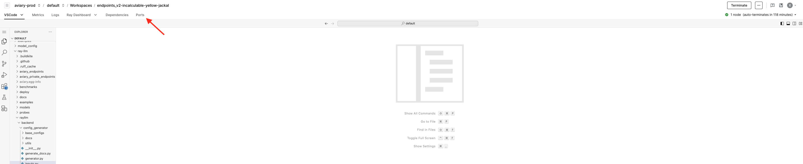
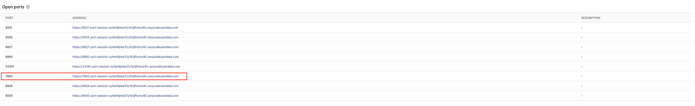
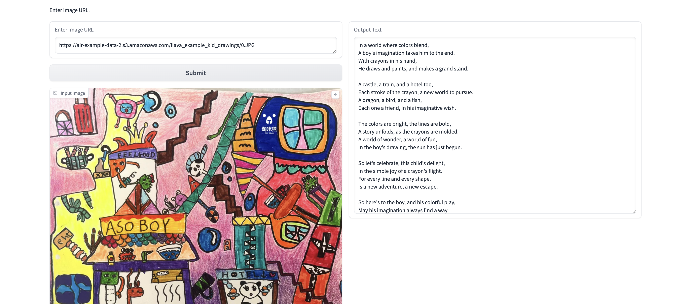

# Vision language model deployment with Ray Serve

**⏱️ Time to complete**: 15 min | **Difficulty**: Intermediate | **Prerequisites**: Understanding of vision-language models, basic ML serving concepts

This template demonstrates deploying vision-language models (VLMs) like LLaVA using Ray Serve for production image-text understanding applications. Learn how to build scalable multimodal AI services.

## Table of Contents

1. [Model Configuration](#step-1-run-the-model-locally-in-the-workspace) (4 min)
2. [Local Development](#step-2-query-the-model-locally) (6 min)
3. [Production Deployment](#step-3-deploy-to-production) (3 min)
4. [Testing and Applications](#step-4-query-the-production-model) (2 min)

## Learning Objectives

By completing this template, you will master:

- **Why vision-language models matter**: Multimodal AI that understands both images and text enables new applications like visual search and content moderation
- **Ray Serve's VLM superpowers**: Deploy large multimodal models with automatic GPU optimization and intelligent batching
- **Production multimodal patterns**: Industry-standard techniques used by OpenAI, Google, and Anthropic for vision-language applications
- **Enterprise AI service design**: Scalable deployment patterns for multimodal models in production environments
- **Application development strategies**: Build interactive applications using Gradio and multimodal AI services

**Note**: This guide extends the main Endpoints v2 documentation by focusing on vision-language model deployment and querying with images.

## Step 1 - Run the model locally in the Workspace

Similarly to the main guide, let's do in the terminal:
```
python generate_config.py
```
And start the serve application using (replace the file name with the generated `serve_` file name):


```python
!serve run serve_TIMESTAMP.yaml
```

## Step 2 - Query the model

Inspect the example kid drawings under `example_images/` folder.

<p align="center">
  
  
  
</p>

For more images, download from the following s3 path.

`s3://air-example-data-2/llava_example_kid_drawings/`

For querying you can use the OpenAI SDK to interact with the models, ensuring an easy integration for your applications.
Specifically for vision language models, images can be passed in using either image url or based64 encoded string.
Notice that both scripts query in a streaming fashion.

**Note:** LLaVA-NeXT supports only single image and single user message for now.


```python
# Query with image url
from openai import OpenAI


def query(base_url: str, api_key: str):

   client = OpenAI(
     base_url=base_url,
     api_key=api_key,
   )
   chat_completions = client.chat.completions.create(
       model="llava-hf/llava-v1.6-mistral-7b-hf",
       messages=[
           {"role": "user", "content": [
               {"type": "text", "text": "Write me a poetry for kid based on this image."},
               {"type": "image_url", "image_url": {
                   "url": "https://air-example-data-2.s3.amazonaws.com/llava_example_kid_drawings/0.JPG"}}]}
       ],
       temperature=0.01,
       stream=True
   )

   for chat in chat_completions:
       if chat.choices[0].delta.content is not None:
           print(chat.choices[0].delta.content, end="")

query("http://localhost:8000/v1", "NOT A REAL KEY")
```


```python
# Query with base64 encoded string

```python
from openai import OpenAI
import base64


def encode_image_to_base64(image_path): 
    with open(image_path, "rb") as image_file:
        return base64.b64encode(image_file.read()).decode('utf-8')

def query(base_url: str, api_key: str):

    client = OpenAI(
      base_url=base_url,
      api_key=api_key,
    )

    path = "/mnt/local_storage/kid_drawings/0.JPG"
    chat_completions = client.chat.completions.create(
        model="llava-hf/llava-v1.6-mistral-7b-hf",
        messages=[
            {"role": "user", "content": [
                {"type": "text", "text": "What is the content of the image?"}, 
                {"type": "image_url", "image_url": {
                    "url": f"data:image/jpeg;base64,{encode_image_to_base64(path)}"}}]}
        ],
        temperature=0.01,
        stream=True
    )

    for chat in chat_completions:
        if chat.choices[0].delta.content is not None:
            print(chat.choices[0].delta.content, end="")

query("http://localhost:8000/v1", "NOT A REAL KEY")
```

## Step 3 - Run the Gradio application!

Now, instead of deploying to production, let's actually build a Gradio application on top of this.

Run the following command to start a Gradio application on port 7860. Notice the script uses non streaming query fashion.


```python
!python gradio_app.py
```

Anyscale workspace has port forwarding conveniently configured. Navigate to the “port” tab and click the corresponding url (the one with port 7680). This will open a local web browser that directly talks to, in our case, the Gradio application that runs on the workspace.

<p align="center">
  
</p>

<p align="center">
  
</p>

Now let’s get ready for some verses and rhymes!

Paste the following url to the input text box and click submit:

https://air-example-data-2.s3.amazonaws.com/llava_example_kid_drawings/0.JPG

<p align="center">
  
</p>

*In a land where books bloom,*  
*A castle of stories, a dreamy room.*  
*Where children explore,*  
*And tales unfold, forevermore.*  

*With steps that lead to the sky,*  
*And a pool that glistens, oh so high.*  
*Where laughter echoes,*  
*And imagination grows,*  
*In this magical place, where stories flow.*  


# Summary

Congrats! You have now served and queried [llava-hf/llava-v1.6-mistral-7b-hf](https://huggingface.co/llava-hf/llava-v1.6-mistral-7b-hf). As a quick recap, here's what we demonstrated in this notebook:
1. Run the model locally in a workspace.
2. Query the model with images.
3. Build a Gradio application on top.

Hope that you enjoy!


