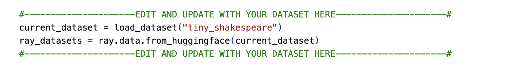

# GPT-J-6B Fine-Tuning on Anyscale with DeepSpeed

In this example, we will showcase how to use Anyscale for **GPT-J fine-tuning**. GPT-J is a GPT-2-like causal language model trained on the Pile dataset. This particular model has 6 billion parameters. For more information on GPT-J, click [here](https://huggingface.co/docs/transformers/model_doc/gptj).

We will use [Anyscale Workspaces](https://docs.anyscale.com/develop/workspaces/get-started) and Ray AIR (with the 🤗 Transformers integration) with a pretrained model from Hugging Face hub. Note that you can easily adapt this example to use other similar models or your own data.

To run this example, we've set up your Anyscale cluster to have access to a head node with one GPU with 16 or more GBs of memory and 15 g4dn.4xlarge instances for the worker node group. This is done by defining a "compute configuration".  Learn more about [Compute Configs here] (https://docs.anyscale.com/configure/compute-configs/overview).  It is easy to change your Compute Config once you launch by clicking "Workspace" and Editing the selection.  

You can follow along in one of two ways:
1. The interactive notebook which will go step by step through the process of loading data, tokenizing and splitting the data, loading the model, and performing fine tuning.  You can follow along in VSCode or Jupyter!


2. By running the training script (saved in a .py file) as an [Anyscale Job](https://docs.anyscale.com/productionize/jobs/get-started).  You can do so by launching this template, opening the "terminal" once started and running the following command:
```
anyscale job submit -- python gptj_deepspeed_fine_tuning.py
```
Note: You can also kick off an Anyscale Job directly in the notebook under the "Submitting an Anyscale Job" section.  Once submitted, you can navigate to the Job page and view the training progress with the Ray Dashboard. 


### Next Steps

#### Training on your own data: Modifying the Script 
Once your cluster is ready and launched you may view the script with VSCode or Jupyter and modify to use your own data!  Read more about loading data with Ray [from your file store or database here](https://docs.ray.io/en/latest/data/loading-data.html).  Make sure the data you use has a similar structure to the [Shakespeare dataset we use.](https://huggingface.co/datasets/tiny_shakespeare)

The lines of code to update look like the following:


Once the code is updated, run the same command as before:
```
anyscale job submit -- python gptj_deepspeed_fine_tuning.py
```


#### Serving your model
The complete script (gptj_deepspeed_fine_tuning.py) saves checkpoints during training in your [default mounted user storage](https://docs.anyscale.com/develop/workspaces/storage#user-storage).  Explore the other tutorials to see how you can now serve this model for production traffic with [Anyscale Production Services](https://docs.anyscale.com/productionize/services/get-started).  

Within 2 minutes you will be fine-tuning GPT-J on a corpus of Shakspeare data!  Let's dive in and explore the power of Anyscale and Ray together.


## Appendix
### Advanced: Build off of this template's cluster environment
#### Option 1: Build a new cluster environment on Anyscale
You'll find a cluster_env.yaml file in the working directory of the template. Feel free to modify this to include more requirements, then follow [this](https://docs.anyscale.com/configure/dependency-management/cluster-environments#creating-a-cluster-environment) guide to use the Anyscale CLI to create a new cluster environment.

Finally, update your workspace's cluster environment to this new one after it's done building.

#### Option 2: Build a new docker image with your own infrastructure
Use the following docker pull command if you want to manually build a new Docker image based off of this one.

```bash
docker pull us-docker.pkg.dev/anyscale-workspace-templates/workspace-templates/fine-tune-gptj:latest
```