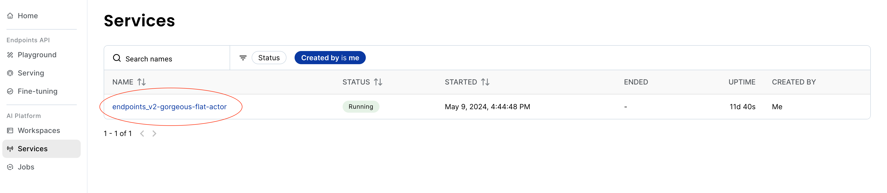
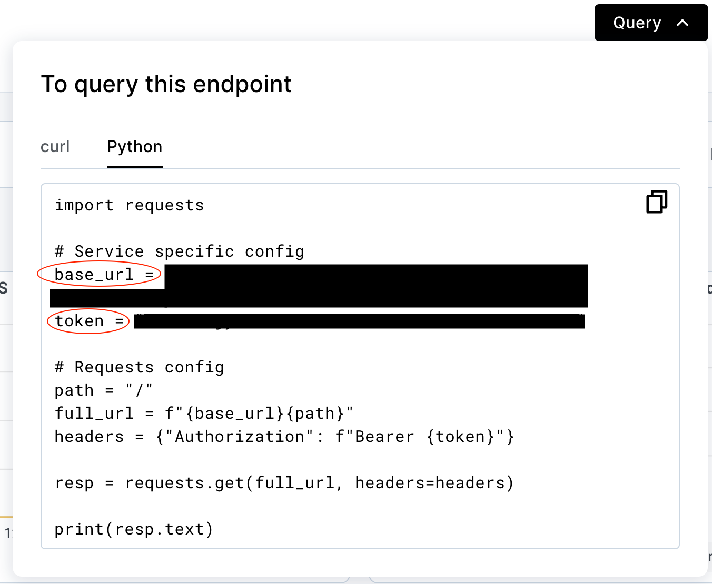
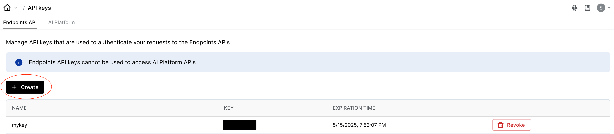
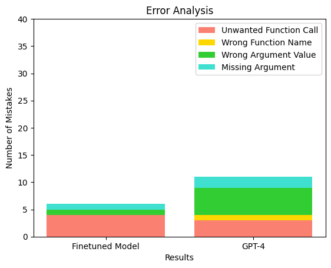

# Fine-tuning for Function calling on custom data.

**⏱️ Time to complete**: 6 hours

Function calling is an important capability of large language models. Connecting your model to external tools is at the heart of many LLM applications. In Anyscale Endpoints, you can use the [function calling API](https://docs.anyscale.com/preview/endpoints/text-generation/function-calling) to enable get a quick access on this feature on a select number of models. This is made possible [through JSON mode](https://www.anyscale.com/blog/anyscale-endpoints-json-mode-and-function-calling-features). However, it is beneficial to have *native* function calling capabilities in your model through fine-tuning on a relevant function calling dataset. JSON-mode-based function calling can only guarantee that the output is in the right schema, and can also be more expensive than a regular chat completion. However, fine-tuning on a function calling dataset can improve the model's capabilities with intent recognition (understanding when to call and when not to call a tool) and function call accuracy (employing the right function with accurate parameters) in addition to structured data formatting (formatting the function call json in the correct schema).  Fine-tuning would also be the only systematic way to improve performance on use-case-specific data. 

In this example, we demonstrate fine-tuning on [Glaive's function calling dataset](https://huggingface.co/datasets/glaiveai/glaive-function-calling-v2?row=0) using Anyscale Endpoints. The goal for this example is to serve as a blue-print for performing data processing, training, and evaluation on open source LLMs for specific tasks like function calling, in the most effective way. The mentioned dataset consists of about 113,000 examples of synthetically generated function calling data. The dataset composition is given below:

<p align="center">
  
</p>


# Table of Contents
1. [Data Preprocessing](#step-1-data-preprocessing): In this section we will cover how we can use Ray Data to clean and format our raw dataset properly and create our train, valid, and test datasets.
2. [Finetuning](#step-2-fine-tuning): This section will cover a few different ways you can fine-tune LLMs via Anyscale.
3. [Serving](#step-3-serving): This section will cover how we can serve the fine-tuned model via Anyscale.
4. [Evaluation](#step-4-evaluation): The section will lay down a blue-print for evaluation and compare performance to that of closed source models like OpenAI's GPT-4.

First, let's make the necessary imports


```python
import datasets
import ray.data 
import openai
```


```python
from fc_utils.data_format import TOOL_CALL_TAGS, TOOL_RESULT_TAGS, TOOL_LIST_TAGS, DatasetFormat
from fc_utils.preprocessing import glaive_to_openai, pprint_example, openai_to_anyscale, save_to_jsonl
from fc_utils.response_parsers import OpenAIResponseParser, AnyscaleResponseParser
from fc_utils.eval_core import evaluate_model, Model
from fc_utils.eval_data_utils import get_evaluation_dataset
from fc_utils.plot_utils import plot_results
```

# Step 1: Data Preprocessing
We'll use Ray Data for scalable data processing. First let's load the dataset from the HuggingFace Hub and inspect a few entries


```python
hf_ds = datasets.load_dataset("glaiveai/glaive-function-calling-v2", split="train").shuffle(seed=21) 
# Sample only 10% of the dataset
hf_ds_subset =  hf_ds.select(range(int(len(hf_ds)*0.10))) 
ray_ds = ray.data.from_huggingface(hf_ds_subset)
first_ex = ray_ds.take(1)[0]
```


```python
pprint_example(first_ex, dataset_format=DatasetFormat.GLAIVE)
```

    System: SYSTEM: You are a helpful assistant with access to the following functions. Use them if required -
    {
        "name": "create_reminder",
        "description": "Create a reminder for a specific date and time",
        "parameters": {
            "type": "object",
            "properties": {
                "reminder_text": {
                    "type": "string",
                    "description": "The content of the reminder"
                },
                "reminder_date": {
                    "type": "string",
                    "format": "date",
                    "description": "The date of the reminder"
                },
                "reminder_time": {
                    "type": "string",
                    "format": "time",
                    "description": "The time of the reminder"
                }
            },
            "required": [
                "reminder_text",
                "reminder_date",
                "reminder_time"
            ]
        }
    }
    
    Chat: USER: I need to set a reminder for my doctor's appointment.
    
    
    ASSISTANT: Sure, I can help with that. Could you please provide me with the date and time of your appointment? <|endoftext|>
    
    
    USER: The appointment is on 2022-09-15 at 10:00 AM.
    
    
    ASSISTANT: <functioncall> {"name": "create_reminder", "arguments": '{"reminder_text": "Doctor's appointment", "reminder_date": "2022-09-15", "reminder_time": "10:00"}'} <|endoftext|>
    
    
    FUNCTION RESPONSE: {"status": "success", "message": "Reminder for 'Doctor's appointment' on 2022-09-15 at 10:00 AM has been created successfully."}
    
    
    ASSISTANT: Your reminder for the doctor's appointment on 2022-09-15 at 10:00 AM has been created successfully. You will be notified at the specified time. <|endoftext|>
    
    
    
    


If you notice, each sample has two entries: system and chat. This dataset is already formatted in specific way (e.g. using USER, \<|endoftext|\> and other tokens). To enable fine-tuning on various open source models we need to convert each row to a more general format like the OpenAI chat format, which is the preferred format for fine-tuning instruction-tuned models on Anyscale ([dataset format guide](https://docs.endpoints.anyscale.com/endpoints/fine-tuning/dataset-prep)). Let's first bring this dataset into the conversation format and inspect how that looks like:


```python
# Initial preprocessing to get to the OpenAI format
openai_fmt_ds = glaive_to_openai(ray_ds)
first_ex = openai_fmt_ds.take(1)[0] 
```


```python
# Inspect one example
pprint_example(first_ex, dataset_format=DatasetFormat.OPENAI) 
```

    Messages: 
    	system: You are a helpful assistant.
    	user: I need to set a reminder for my doctor's appointment.
    	assistant: 
    		content: Sure, I can help with that. Could you please provide me with the date and time of your appointment? 
    		tool_calls: []
    	user: The appointment is on 2022-09-15 at 10:00 AM.
    	assistant: 
    		content: 
    		tool_calls: [{'function': {'arguments': '{"reminder_text": "Doctors appointment", "reminder_date": "2022-09-15", "reminder_time": "10:00"}', 'name': 'create_reminder'}, 'type': 'function'}]
    	tool: {"name": "create_reminder", "content": "{\"status\": \"success\", \"message\": \"Reminder for 'Doctor's appointment' on 2022-09-15 at 10:00 AM has been created successfully.\"}", "tool_call_id": "call_1"}
    	assistant: 
    		content: Your reminder for the doctor's appointment on 2022-09-15 at 10:00 AM has been created successfully. You will be notified at the specified time. 
    		tool_calls: []
    Tools: [{"type": "function", "function": {"name": "create_reminder", "description": "Create a reminder for a specific date and time", "parameters": {"type": "object", "properties": {"reminder_text": {"type": "string", "description": "The content of the reminder"}, "reminder_date": {"type": "string", "format": "date", "description": "The date of the reminder"}, "reminder_time": {"type": "string", "format": "time", "description": "The time of the reminder"}}, "required": ["reminder_text", "reminder_date", "reminder_time"]}}}]
    


If you notice, the tool calls are almost exactly in the OpenAI format, just short of the `id` entry provided by the OpenAI API. For training, we choose to leave the model out of ID generation. Internally, each tool call is kept track by its index in the list of tool calls made. This is used later in the tool response (In the above example, there is only one tool call made and the response has `tool_call_id` "call_1"). 

## Preprocess to the Anyscale format
We'll now further process this conversation format and make it compatible with Anyscale Endpoints. We'll make use of special indicators "\[TOOL_CALLS\]" and "\[/TOOL_CALLS\] to format assistant tool calls into the message "content" field. The role "tool" will be converted to the role "user" with a special indicator to highlight that this is a tool response. Further, the tool list will be included in the system prompt with special indicators. The following code block handles the necessary preprocessing.


```python
# Map to Anyscale format
processed_ds = openai_to_anyscale(openai_fmt_ds)
first_ex = processed_ds.take(1)[0]
```


```python
# Inspect one example
pprint_example(first_ex, dataset_format=DatasetFormat.ANYSCALE) 
```

    Messages: 
    	system: You are a helpful assistant.[TOOL_LIST] [{"type": "function", "function": {"name": "create_reminder", "description": "Create a reminder for a specific date and time", "parameters": {"type": "object", "properties": {"reminder_text": {"type": "string", "description": "The content of the reminder"}, "reminder_date": {"type": "string", "format": "date", "description": "The date of the reminder"}, "reminder_time": {"type": "string", "format": "time", "description": "The time of the reminder"}}, "required": ["reminder_text", "reminder_date", "reminder_time"]}}}] [/TOOL_LIST]
    	user: I need to set a reminder for my doctor's appointment.
    	assistant: Sure, I can help with that. Could you please provide me with the date and time of your appointment? 
    	user: The appointment is on 2022-09-15 at 10:00 AM.
    	assistant: [TOOL_CALLS] [{"function": {"arguments": "{\"reminder_text\": \"Doctors appointment\", \"reminder_date\": \"2022-09-15\", \"reminder_time\": \"10:00\"}", "name": "create_reminder"}, "type": "function"}] [/TOOL_CALLS]
    	user: [TOOL_RESULT] {"name": "create_reminder", "content": "{\"status\": \"success\", \"message\": \"Reminder for 'Doctor's appointment' on 2022-09-15 at 10:00 AM has been created successfully.\"}", "tool_call_id": "call_1"} [/TOOL_RESULT]
    	assistant: Your reminder for the doctor's appointment on 2022-09-15 at 10:00 AM has been created successfully. You will be notified at the specified time. 
    


Let's make a train, validation and test split and save the datasets in the `jsonl` format.


```python
# 80/10/10 split
train_ds, val_ds, test_ds = processed_ds.split_proportionately([0.8, 0.1])
# Restrict to 200 examples for testing
test_ds, _  = test_ds.split_at_indices([200]) 
```


```python
# Inspect final counts
train_ds.count(), val_ds.count(), test_ds.count()
```


    (9012, 1126, 200)


```python
# Set up file save paths. Feel free to change these
train_file_path = "glaiveai-function-calling-v2-train.jsonl"
validation_file_path = "glaiveai-function-calling-v2-val.jsonl"
test_file_path = "glaiveai-function-calling-v2-test.jsonl"
```


```python
# Save the datasets to jsonl format
save_to_jsonl(train_ds, train_file_path)
save_to_jsonl(val_ds,  validation_file_path)
save_to_jsonl(test_ds, test_file_path)
```

# Step 2: Fine-tuning 

For fine-tuning, you have two options with Anyscale:
1. Fine-tuning on the Anyscale Platform through our fine-tuning template 
    - This would be the preferred route for those wishing to get more flexibility in choice of models and hyperparameters, better monitoring, etc.
2. Fine-tuning through Anyscale's serverless endpoints
    - A quick and easy way to fine-tune a model via an OpenAI compatiable SDK.

For this guide, we will use `Llama-3-8B-Instruct` as the base model for fine-tuning.


## Step 2(a): Fine-tuning on the Anyscale Platform

Head over to the Anyscale Platform: https://console.anyscale.com/v2 and spin up the "Fine-tune LLMs" template (under "AI application templates")

<p align="center">
  
</p>


Follow the instructions to run your fine-tuning job.

## Step 2(b): Fine-tuning through serverless endpoints
First, obtain your credentials from the [Anyscale platform](https://console.anyscale.com/credentials) and upload the training and validation files.


```python
# Get your API key from https://console.anyscale.com/credentials
ANYSCALE_API_KEY = "esecret_yourKeyHere"  
ANYSCALE_API_BASE = "https://api.endpoints.anyscale.com/v1"
```


```python
# Anyscale Endpoints are OpenAI compatible
client = openai.OpenAI(
    base_url = ANYSCALE_API_BASE,
    api_key = ANYSCALE_API_KEY
)
```


```python
# Upload the files to Anyscale
training_file_id = client.files.create(
    file=open(train_file_path,'rb'),
    purpose="fine-tune",
).id

valid_file_id = client.files.create(
    file=open(validation_file_path,'rb'),
    purpose="fine-tune",
).id
```

Let's now launch a fine-tuning job for 4 epochs. The expected time for this job is < 3 hours. For instructions on viewing job status, other hyperparameters used, etc, you can refer to our [fine-tuning guide](https://docs.anyscale.com/preview/examples/e2e-finetune-and-serve-example#4-start-the-fine-tuning). 


```python
# Create finetuning job. Other parameters like context length will be chosen appropriately based on dataset size
fine_tuning_job_id = client.fine_tuning.jobs.create(
    model="meta-llama/Meta-Llama-3-8B-Instruct",
    hyperparameters={"n_epochs": 4},
    training_file=training_file_id,
    validation_file=valid_file_id,
).id
```

# Step 3: Serving

## Step 3(a): Finetuned on the Anyscale Platform

Make a note of the final checkpoint after fine-tuning (this should be the last line in the logs). You can now spin up the "Deploy LLMs" template which has all the instructions and required dependencies to serve your finetuned model efficiently. You will find the tutorials on [serving LoRA models](https://github.com/anyscale/templates/blob/main/templates/endpoints_v2/examples/lora/DeployLora.ipynb) (if applicable) and on deploying a [custom model](https://github.com/anyscale/templates/blob/main/templates/endpoints_v2/examples/CustomModels.ipynb) helpful. Once you have set up your fine-tuned model as an Anyscale Service, head over to the "Services" tab in the console and select your deployed service. 
<p align="center">
  
</p>


Click on the "Query" drop down box to get instructions on how to query your deployed model. Note down the base URL and API key and place them here.

<p align="center">
  
</p>


```python
## To be run only if you finetuned on the Anyscale platform
ANYSCALE_API_KEY="service-api-key-here"
# Example api base url: https://endpoints-v2-zzzz.s.anyscaleuserdata.com
ANYSCALE_API_BASE="service-url-here" 
ANYSCALE_API_BASE = f"{ANYSCALE_API_BASE}/v1"
# Enter the model id here. This would be different depending on whether you performed LoRA or full parameter fine-tuning.
# Example: meta-llama/Meta-Llama-3-8B-Instruct:mysuffix:myid 
MODEL_ID = "ModelIdHere"
```

## Step 3(b): Finetuned through serverless endpoints

To serve the fine-tuned model, you just need to navigate to the "Serving" section on the Anyscale Platform. Your fine-tuned model should already be visible in the list of available models! Make sure to note down the model ID here.

<p align="center">
  
</p>


As in the above image, click on the three dots and then click on "Query". This will provide you the starter code to interact with the model via curl, python, etc. Note that the API key here is valid only for one hour. Since our evaluation can take up longer, we will generate a long-lived credential. 

<p align="center">
  
</p>

In the "API Keys" page, click on "Create" and note down the API key.
<p align="center">
  
</p>


```python
## This is only if you finetuned through serverless endpoints
ANYSCALE_API_BASE = "https://api.endpoints.anyscale.com/v1"
ANYSCALE_API_KEY = "esecret_yourKeyHere"
MODEL_ID = "yourModelIdHere"
```

### (Optional) Try out the model via Playground

(For Endpoints users) You can try out your new model in the Playground: https://console.anyscale.com/v2/playground . In the model dropdown, you should be able to see your finetuned model as shown below

<p align="center">
  
</p>

# Step 4: Evaluation

Let's evaluate our trained model with GPT-4 as a baseline. 


## Evaluation strategy

Evaluation of function calling capability is non-trivial, given that we're looking to extract structured data from an inherently unpredictable and unstructured stream of text. We will use the following simple evaluation strategy: The models are evaluated on the accuracy metric and their responses are graded as accurate if their response for each assistant entry in the conversation is correct. An assistant response is graded as correct under the below conditions:
1. In case the ground truth response contains no function call, then the model's response should not have a function call. 
2. In case the ground truth response contains a function call, then the model's response should also have a function call. The assistant function call should further have the correct function name and the correct function arguments. 

The following psuedocode shows the high-level branching conditions considered during evaluation:

```
if(ground_truth has no function call):
    correct = (response has no function call)
else
    if response has no function call: 
        correct = False
    else
          if response.function_name != gt.function_name:
                correct = False
          else
                correct = (response.argument_dict == gt.argument_dict)
```


## Dataset formatting
  
We process our test dataset individually for our finetuned model on Anyscale and for GPT-4:
- For GPT-4, we undo some of the preprocessing previously done to get back the conversation in each example into the OpenAI format. All expected assistant responses in the dataset are processed to have the `"content"` and the `"tool_calls"` field. 
- We follow the same preprocessing as during training for the Anyscale hosted model. However, for the expected assistant response, we process it in the same way as GPT-4 (i.e parse all tool calls and store them in a separate `"tool_calls"` field).


```python
# Preprocess the test dataset for evaluation
eval_ds_openai = get_evaluation_dataset(test_ds, TOOL_CALL_TAGS, TOOL_RESULT_TAGS, TOOL_LIST_TAGS, DatasetFormat.OPENAI)
eval_ds_anyscale = get_evaluation_dataset(test_ds, TOOL_CALL_TAGS, TOOL_RESULT_TAGS, TOOL_LIST_TAGS, DatasetFormat.ANYSCALE)
```


```python
# Inspect one example from the Anyscale format eval dataset
pprint_example(eval_ds_anyscale[1], dataset_format=DatasetFormat.OPENAI)
```

    Messages: 
    	system: You are a helpful assistant.[TOOL_LIST] [{"type": "function", "function": {"name": "get_movie_info", "description": "Get information about a movie", "parameters": {"type": "object", "properties": {"title": {"type": "string", "description": "The title of the movie"}, "year": {"type": "integer", "description": "The release year of the movie"}}, "required": ["title"]}}}, {"type": "function", "function": {"name": "search_recipes", "description": "Search for recipes based on ingredients", "parameters": {"type": "object", "properties": {"ingredients": {"type": "array", "items": {"type": "string"}, "description": "The ingredients to search for"}, "cuisine": {"type": "string", "description": "The cuisine type"}, "dietary_restrictions": {"type": "array", "items": {"type": "string"}, "description": "Any dietary restrictions"}}, "required": ["ingredients"]}}}] [/TOOL_LIST]
    	user: Can you tell me about the movie "Inception"?
    	assistant: 
    		content: None
    		tool_calls: [{'function': {'arguments': {'title': 'Inception'}, 'name': 'get_movie_info'}, 'type': 'function'}]
    	user: [TOOL_RESULT] {"name": "get_movie_info", "content": "{\"title\": \"Inception\", \"year\": 2010, \"director\": \"Christopher Nolan\", \"genre\": [\"Action\", \"Adventure\", \"Sci-Fi\"], \"plot\": \"A thief who steals corporate secrets through the use of dream-sharing technology is given the inverse task of planting an idea into the mind of a CEO.\"}", "tool_call_id": "call_1"} [/TOOL_RESULT]
    	assistant: 
    		content: The movie "Inception" was released in 2010. It was directed by Christopher Nolan and falls under the genres of Action, Adventure, and Sci-Fi. The plot revolves around a thief who steals corporate secrets through the use of dream-sharing technology and is given the inverse task of planting an idea into the mind of a CEO. 
    		tool_calls: None
    	user: What about the movie "The Godfather"?
    	assistant: 
    		content: None
    		tool_calls: [{'function': {'arguments': {'title': 'The Godfather'}, 'name': 'get_movie_info'}, 'type': 'function'}]
    	user: [TOOL_RESULT] {"name": "get_movie_info", "content": "{\"title\": \"The Godfather\", \"year\": 1972, \"director\": \"Francis Ford Coppola\", \"genre\": [\"Crime\", \"Drama\"], \"plot\": \"The aging patriarch of an organized crime dynasty transfers control of his clandestine empire to his reluctant son.\"}", "tool_call_id": "call_1"} [/TOOL_RESULT]
    	assistant: 
    		content: "The Godfather" was released in 1972 and was directed by Francis Ford Coppola. It is a Crime and Drama movie. The plot is about the aging patriarch of an organized crime dynasty who transfers control of his clandestine empire to his reluctant son. 
    		tool_calls: None
    


## Evaluate

For evaluation, we initialise two parsers - one for each model - to handle obtaining chat completions from the respective API and parsing the result. Then, our evaluation logic takes care of matching the assistant response with the expected response and, if the response is incorrect, making note of the type of error (wrong intent, wrong function name, etc). Populate the API keys below and run the below code blocks to get evaluation results:


```python
# Enter your OpenAI key below.
OPENAI_API_KEY = "yourApiKeyHere" 
OPENAI_API_BASE = "https://api.openai.com/v1"
# Enter your Anyscale key below. If you finetuned through Anyscale endpoints, you can get the key here: https://console.anyscale.com/credentials. Otherwise, you should use the key from your Anyscale Service
ANYSCALE_API_KEY = "yourApiKeyHere" 
```


```python
# Initialize parsers
openai_parser = OpenAIResponseParser(api_key=OPENAI_API_KEY, api_base=OPENAI_API_BASE, model="gpt-4", tool_call_tags=TOOL_CALL_TAGS)
anyscale_parser = AnyscaleResponseParser(api_key=ANYSCALE_API_KEY, api_base=ANYSCALE_API_BASE, model=MODEL_ID, tool_call_tags=TOOL_CALL_TAGS) 
```


```python
# Evaluate gpt-4
results_gpt, accuracy_gpt = evaluate_model(eval_ds_openai, openai_parser, Model.GPT)
print("GPT-4 Accuracy: ", accuracy_gpt)
```

    Evaluating Finetuned Model...:   0%|          | 0/5 [1:41:01<?, ?it/s]
    Evaluating GPT4...: 100%|██████████| 200/200 [1:20:43<00:00, 24.22s/it]

    GPT-4 Accuracy:  0.97


    


```python
# Evaluate our finetuned model
results_finetuned, accuracy_finetuned = evaluate_model(eval_ds_anyscale, anyscale_parser, Model.FINETUNED)
print("Fine-tuned Model Accuracy: ", accuracy_finetuned)
```

    Evaluating Finetuned Model...: 100%|██████████| 200/200 [40:59<00:00, 12.30s/it] 

    Fine-tuned Model Accuracy:  0.965


    


```python
# Plot the results
plot_results(results_finetuned, results_gpt)
```

Your final fine-tuned model should be able to rival GPT-4 level performance on this dataset.  Here's how your plot might look like for `Llama-3-8B-Instruct`:

<p align="center">
  
</p>

Note that the difference would be larger in a real-world setting, because our test dataset construction was straightforward and it is very similar to the training dataset.

# Summary

Congrats! You have now fine-tuned an open source model that can rival GPT-4 on function calling. As a quick recap, here's what we demonstrated in this notebook:
1. Preprocessing a function calling dataset into a conversational format
2. Fine-tuning a language model through either the Anyscale Platform or through Anyscale Endpoints
3. Serving the fine-tuned model on Anyscale
4. Evaluating the model against GPT-4 and analysing the results.
