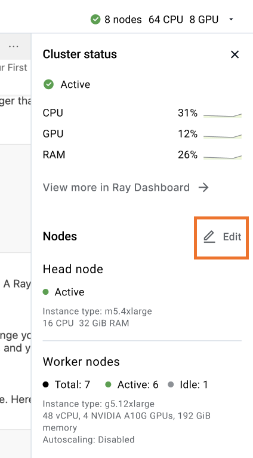

# Fine-tuning Llama-2 models with Deepspeed, Accelerate, and Ray Train
This template shows you how to fine-tune Llama-2 models. 

## Step 1: Fine-tune Llama-2-7B model
- Open a terminal in VS Code (ctl+shift+`). 
- Run the command below to kick off fine-tuning with dummy data, Grade School Math 8k (GSM8K) dataset.

```
# The flag `--as-test` is for demo / testing purposes as it runs through only one forward and backward pass of the model and checkpoints the model. It will take 6-7 mins. Without this flag, it will take ~42 mins (3 epochs for optimal model quality).

python train.py --size=7b --as-test
```

Model checkpoints will be stored under `{user's first name}/ft_llms_with_deepspeed/` in the cloud stroage bucket created for your Anyscale account. The full path will be printed in the output after the training is completed.


## (Optional) Step 2: Switch to a different model size
- Change model size (7b, 13b, or 70b) with the `--size` option in the previous command
- Change the worker node type accordingly to fit the model
    - use g5.12xlarge for 13b
    - use g5.48xlarge for 70b


- Run the command below to kick off fine-tuning with new model size and worker nodes.

```
python train.py --size=13b --as-test
```


## Step 3: Use your custom data
- Replace the contents in `./data/train.jsonl` with your own training data
- (Optional) Replace the contents in `./data/test.jsonl` with your own test data if any.
- (Optional) Add special token in `./data/tokens.json` if any.


------

## What's next.   

Voila! You have fine-tuned your own Llama-2 models. Want more than this? Check out advanced tutorials below 

- [Comprehensive walkthrough](./tutorials/walkthrough.md)
- [Fine-tune Llama-2 with LoRA adatpers](./tutorials/lora.md)