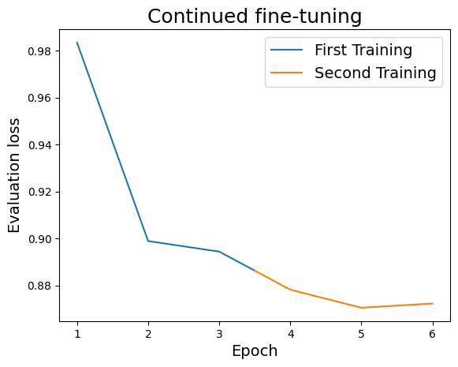
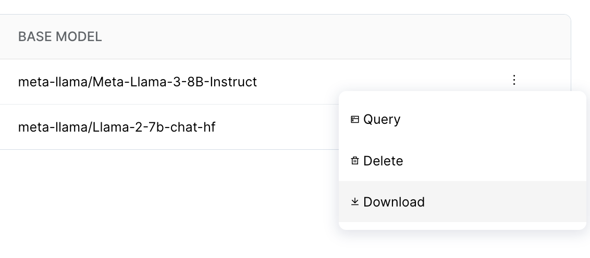

# Continue fine-tuning from a previous checkpointing

**⏱️ Time to complete**: 40 minutes

This guide assumes that you have familiarized yourself with the [main fine-tuning guide](../../README.md) of this template.
In this cookbook tutorial, we showcase how a checkpoint that was created earlier can be used as initialization for another round of fine-tuning.
This allows us to sequentially combine fine-tuning on multiple datasets in order to get performance boost on the final task that we care about. 

We support both Full-parameter checkpoints, and LoRA-adapter checkpoints. However, we recommend not to combine the two by training a full-parameter model followed by a LoRA adaptation. Serving the resulting LoRA adapter will require the base full-parameter checkpoint. Unless you are fine-tuning many such LoRA adaptors for different tasks, this serving architecture does not have the neither the economical benefits of LoRA nor the quality benefits of full-parameter.

## How to fine-tune from a previous checkpointing

To get started, we can run the following illustrative example. Run this command from where `main.py` is located.

```
python main.py cookbooks/continue_from_checkpoint/llama-3-8b.yaml
```

Running the above command will fine-tune on the [GSM8k dataset](https://huggingface.co/datasets/gsm8k). 
In this example, we have splited the dataset into two halves, each consisting of approximately 4,000 samples.
The provided initial checkpoint has been trained on the first half and is already good at solving GSM8k. By running the above command, you continue fine-tuning from the provided checkpoint with the second half.

Note the following evaluation losses. The first three epochs of training where run on the first half of the GSM8k dataset. The second three epochs of training where run on the second half.



Note that on the first iteration of the second training (epoch 4), the evaluation loss starts off much lower than in the first training.


## What and how are we fine-tuning?

The following is a snippet from the `llama-3-8b.yaml` file we use above. 

```yaml
# ...
model_id: meta-llama/Meta-Llama-3-8B-Instruct
# initial_base_model_ckpt_path: ...
initial_adapter_model_ckpt_path: s3://large-dl-models-mirror/finetuning_template/continued_ft_gsm8k_checkpoint
train_path: s3://large-dl-models-mirror/finetuning_template/train_2.jsonl
# ...
```

We fine-tune Llama 3 8B Instruct, but the initial weights of the LoRA adapter are loaded from our s3 mirror.
It makes sense to keep those weights in a bucket so that they can be accessed from all nodes of your cluster.
The train path `(.../train_2.jsonl)` points to the second part of the GSM8k dataset that we fine-tune on.
If we wanted to continue the finetuning of a full-parameter checkpoint, we should configure `initial_base_model_ckpt_path` instead of `initial_adapter_model_ckpt_path`. 

# Things to Notice

When comparing the training and evaluation loss of the second (continued) fine-tuning with the first run, you'll notice that the values are lower.
For instance, the checkpoint in the llama-3-8b.yaml has an evaluation loss of 0.8886.
After continued fine-tuning, we achieve a checkpoint with an evaluation loss of 0.8668.
It's important to note that the significance of such loss values varies greatly depending on the task at hand. A difference of 0.0218 may represent a substantial improvement for some tasks, while it may only be a minor improvement for others.

To determine whether continued fine-tuning is beneficial for your specific task, we recommend monitoring the training and evaluation loss during the fine-tuning process.
This will help you assess the impact of the additional fine-tuning on your model's performance.


## FAQs

### In what order should I fine-tune?

In general: Finish with the dataset that is closest to what you want during inference.
If you are extending the context of the model beyond its native context length, you should start with the smallest context length end with the largest.

### Should I extend the dataset samples or replace them with new ones when I continue fine-tuning?

This depends on your task and how many epochs have already been trained. If in doubt, you can always watch the training and evaluation loss to see if you are overfitting.

### How can I fine-tune a model that I fine-tuned on Anyscale Endpoints?

You have to download the model weights through the `Serving` page, upload them to a bucket of your choice and reference the bucket as an initial checkpoint in the training config yaml.


