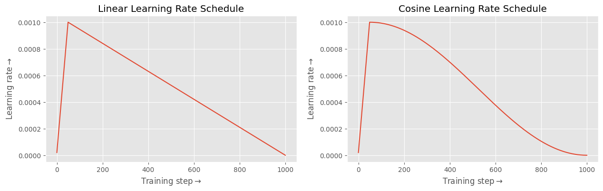

# Modifying hyperparameters

**⏱️ Time to complete**: 15 minutes

This guide will focus on how you can customize your fine-tuning run by modifying the various hyperparameters configurable. Make sure you've read the [basic fine-tuning guide](../../README.md) for better context. 

We provide a number of options to configure via the training YAML. To view the full set of customizable parameters, head over to the [fine-tuning config API reference](https://docs.anyscale.com/reference/finetuning-config-api). Below, we'll take a closer look at some of the important hyperparameters.


## GPU resources

Configuring GPU resources to be used is one of the most important pre-requisities for training. There are two fields in our YAML that are relevant:

```yaml
num_devices: 16 # number of GPUs 
worker_resources:
  accelerator_type:A10G: 0.001 # specifies GPU type available, and a minimum allocation per worker
```

Internally, our fine-tuning code will launch Ray workers with each being allocated one GPU. The cluster will be auto-scaled if needed to meet the requirements. The different GPU types you can specify can depend on the specific Anyscale Cloud. The value you specify for the accelerator type (0.001 here) does not matter much, as long as it is non-zero (so that each worker is allocated a GPU) and less than or equal to 1 (so that the requested number of GPUs is the same as `num_devices`).

## Learning rate

There are two entities of interest here: the actual learning rate value itself and the particular learning rate scheduler you use. The parameters you can control in the YAML are below: 

```yaml
learning_rate: 1e-4
lr_scheduler_type: cosine
num_warmup_steps: 10
```

In the above config, the training run would use a cosine learning rate schedule (the default) with an initial warmup of 10 steps (the default). The peak learning rate would be 1e-4 (the value specified). 

We support both `'linear'` and `'cosine'` schedules. The learning rate schedules have been plotted below with `num_warmup_steps=10` and for 1000 training steps.

<p align="center">

</p>


## Batch size

The batch size for training and validation depends on the below parameters:

```yaml
num_devices: 8
train_batch_size_per_device: 16
eval_batch_size_per_device: 16
```
The effective batch size for training would be `train_batch_size_per_device * num_devices`. For the hardware you specify, the amount you can push `train_batch_size_per_device` or `eval_batch_size_per_device` depends on dataset statistics (average sequence length) and the context length used. For a context length of 512 and the default NVIDIA A10 GPUs, the per-device batch size of 16 is a good default for 7B/8B models. 

## Number of epochs 
The number of epochs is controlled by two parameters:

```yaml
num_epochs: 10
min_update_steps: 100 # default
```

`min_num_update_steps` is used only when `num_epochs` is not provided in the YAML. In such cases, the model is trained for atleast `min_num_update_steps` to ensure model convergence. For example, consider the case where `num_epochs` is not provided and the number of steps in an epoch is 24. If `min_num_update_steps` is set to 100 (the default), then the number of epochs is set to be `ceil(100/24) = 5`. 

# Validation and checkpointing 

Validation loop and checkpointing are always run consecutively (so that we can clearly reason about checkpoint performance). The relevant options are:

```yaml
checkpoint_every_n_epochs: 5 # validation and checkpointing frequency
max_num_checkpoints: 10 # maximum number of validation + checkpointing events to be triggered during training
num_checkpoints_to_keep: 1   # maximum number of checkpoints to keep
```

By default, `checkpoint_every_n_epochs` is `None`, and in this case  `max_num_checkpoints` checkpointing events are triggered. While checkpointing, we keep only `num_checkpoints_to_keep` number of checkpoints, prioritizing those with lower values of validation loss/perplexity.

## LoRA configs
We support all the LoRA parameters you can configure in [🤗PEFT](https://huggingface.co/docs/peft/en/package_reference/lora#peft.LoraConfig):

```yaml
lora_config:
  r: 8
  lora_alpha: 16
  lora_dropout: 0.05
  target_modules:
    - q_proj
    - v_proj
    - k_proj
    - o_proj
    - gate_proj
    - up_proj
    - down_proj
    - embed_tokens
    - lm_head
  task_type: "CAUSAL_LM"
  modules_to_save: []
  bias: "none"
  fan_in_fan_out: false
  init_lora_weights: true
```

For best performance, we recommend that you make sure to include all model layers in `target_modules`. 
