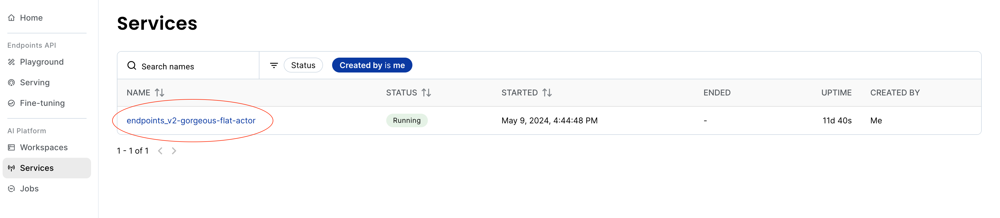

# Fine-tuning for Function calling on custom data.

**⏱️ Time to complete**: 6 hours

Function calling is an important capability of large language models. Connecting your model to external tools is at the heart of many LLM applications. Anyscale's LLM deployment solution offers enabling function calling for all the models via [function calling API](https://docs.anyscale.com/preview/endpoints/text-generation/function-calling). This is made possible [through JSON mode](https://www.anyscale.com/blog/anyscale-endpoints-json-mode-and-function-calling-features). However, it is beneficial to have *native* function calling capabilities in your model through fine-tuning on a relevant function calling dataset. JSON-mode-based function calling can only guarantee that the output is in the right schema, and can also be more expensive than a regular chat completion. However, fine-tuning on a function calling dataset can improve the model's capabilities with intent recognition (understanding when to call and when not to call a tool) and function call accuracy (employing the right function with accurate parameters) in addition to structured data formatting (formatting the function call json in the correct schema).  Fine-tuning would also be the only systematic way to improve performance on use-case-specific data. 

In this example, we demonstrate fine-tuning on [Glaive's function calling dataset](https://huggingface.co/datasets/glaiveai/glaive-function-calling-v2?row=0) using Anyscale platform. The goal for this example is to serve as a blue-print for performing data processing, training, and evaluation on open source LLMs for specific tasks like function calling, in the most effective way.  During this guide we mainly use the [fine-tuning API](https://docs.anyscale.com/endpoints/fine-tuning/fine-tuning-api), but the same blue-print can also be used with [fine-tuning template](https://docs.anyscale.com/examples/finetune-llms). 

The mentioned dataset consists of about 113,000 examples of synthetically generated function calling data. The dataset composition is given below:

<p align="center">
  
</p>


# Table of Contents
1. [Data Preprocessing](#step-1-data-preprocessing): In this section we will cover how we can use Ray Data to clean and format our raw dataset properly and create our train, valid, and test datasets.
2. [Finetuning](#step-2-fine-tuning): This section will cover a few different ways you can fine-tune LLMs via Anyscale.
3. [Serving](#step-3-serving): This section will cover how we can serve the fine-tuned model via Anyscale.
4. [Evaluation](#step-4-evaluation): The section will lay down a blue-print for evaluation and compare performance to that of closed source models like OpenAI's GPT-4.

First, let's make the necessary imports


```python
import os
import yaml
import datasets
import openai

import ray.data
```


```python
from fc_utils.data_format import TOOL_CALL_TAGS, TOOL_RESULT_TAGS, TOOL_LIST_TAGS, DatasetFormat
from fc_utils.preprocessing import glaive_to_openai, openai_to_anyscale, save_to_jsonl
from fc_utils.response_parsers import OpenAIResponseParser, AnyscaleResponseParser
from fc_utils.eval_core import evaluate_model, Model
from fc_utils.eval_data_utils import get_evaluation_dataset
from fc_utils.plot_utils import plot_results
from fc_utils.print_utils import pprint_example
```

# Step 1: Data Preprocessing
Our data processing will occur in 2-stages, as shown in the below figure:

<p align="center">
  
</p>


Glaive's function calling dataset is formatted with specific indicators for roles and special tokens. We'll first map this dataset into the more general OpenAI chat format and then prepare it for fine-tuning with basic-chat template API supported by Anyscale. 

We'll use Ray Data for scalable data processing. First, let's load the dataset from the HuggingFace Hub and inspect it.


```python
hf_ds = datasets.load_dataset("glaiveai/glaive-function-calling-v2", split="train").shuffle(seed=21) 
# Sample only 10% of the dataset
hf_ds_subset =  hf_ds.select(range(int(len(hf_ds)*0.10))) 
ray_ds = ray.data.from_huggingface(hf_ds_subset)
raw_example = ray_ds.take(1)[0]
```


```python
pprint_example(raw_example, dataset_format=DatasetFormat.GLAIVE)
```


<pre><span style="color: cyan;">Chat: </span>USER: I need to set a reminder for my doctor&#x27;s appointment.


ASSISTANT: Sure, I can help with that. Could you please provide me with the date and time of your appointment? &lt;|endoftext|&gt;


USER: The appointment is on 2022-09-15 at 10:00 AM.


ASSISTANT: &lt;functioncall&gt; {&quot;name&quot;: &quot;create_reminder&quot;, &quot;arguments&quot;: &#x27;{&quot;reminder_text&quot;: &quot;Doctor&#x27;s appointment&quot;, &quot;reminder_date&quot;: &quot;2022-09-15&quot;, &quot;reminder_time&quot;: &quot;10:00&quot;}&#x27;} &lt;|endoftext|&gt;


FUNCTION RESPONSE: {&quot;status&quot;: &quot;success&quot;, &quot;message&quot;: &quot;Reminder for &#x27;Doctor&#x27;s appointment&#x27; on 2022-09-15 at 10:00 AM has been created successfully.&quot;}


ASSISTANT: Your reminder for the doctor&#x27;s appointment on 2022-09-15 at 10:00 AM has been created successfully. You will be notified at the specified time. &lt;|endoftext|&gt;


<span style="color: red;">System: </span>SYSTEM: You are a helpful assistant with access to the following functions. Use them if required -
{
    &quot;name&quot;: &quot;create_reminder&quot;,
    &quot;description&quot;: &quot;Create a reminder for a specific date and time&quot;,
    &quot;parameters&quot;: {
        &quot;type&quot;: &quot;object&quot;,
        &quot;properties&quot;: {
            &quot;reminder_text&quot;: {
                &quot;type&quot;: &quot;string&quot;,
                &quot;description&quot;: &quot;The content of the reminder&quot;
            },
            &quot;reminder_date&quot;: {
                &quot;type&quot;: &quot;string&quot;,
                &quot;format&quot;: &quot;date&quot;,
                &quot;description&quot;: &quot;The date of the reminder&quot;
            },
            &quot;reminder_time&quot;: {
                &quot;type&quot;: &quot;string&quot;,
                &quot;format&quot;: &quot;time&quot;,
                &quot;description&quot;: &quot;The time of the reminder&quot;
            }
        },
        &quot;required&quot;: [
            &quot;reminder_text&quot;,
            &quot;reminder_date&quot;,
            &quot;reminder_time&quot;
        ]
    }
}

</pre>


Each sample in the dataset has two entries: system and chat. As mentioned, this dataset is formatted in a specific way (e.g. using USER, \<|endoftext|\> and other tokens). To enable fine-tuning on various open source models we need to convert each row to a more general format like the OpenAI chat format, which is the preferred format for fine-tuning instruction-tuned models on Anyscale ([dataset format guide](https://docs.endpoints.anyscale.com/endpoints/fine-tuning/dataset-prep)). The below code accomplishes the same.


```python
# Initial preprocessing to get to the OpenAI format
openai_fmt_ds = glaive_to_openai(ray_ds)
openai_ex = openai_fmt_ds.take(1)[0] 
```


```python
# Inspect one example
pprint_example(openai_ex, dataset_format=DatasetFormat.OPENAI)
```


<pre><span style="color: cyan;">Messages: </span>
	<span style="color: red;">system: </span>You are a helpful assistant.
	<span style="color: green;">user: </span>I need to set a reminder for my doctor&#x27;s appointment.
	<span style="color: blue;">assistant: 
		content: </span>Sure, I can help with that. Could you please provide me with the date and time of your appointment? 
		<span style="color: blue;">tool_calls: </span>[]
	<span style="color: green;">user: </span>The appointment is on 2022-09-15 at 10:00 AM.
	<span style="color: blue;">assistant: 
		content: </span>
		<span style="color: blue;">tool_calls: </span>[{&#x27;function&#x27;: {&#x27;arguments&#x27;: &#x27;{&quot;reminder_text&quot;: &quot;Doctors appointment&quot;, &quot;reminder_date&quot;: &quot;2022-09-15&quot;, &quot;reminder_time&quot;: &quot;10:00&quot;}&#x27;, &#x27;name&#x27;: &#x27;create_reminder&#x27;}, &#x27;type&#x27;: &#x27;function&#x27;}]
	<span style="color: yellow;">tool: </span>{&quot;name&quot;: &quot;create_reminder&quot;, &quot;content&quot;: &quot;{\&quot;status\&quot;: \&quot;success\&quot;, \&quot;message\&quot;: \&quot;Reminder for &#x27;Doctor&#x27;s appointment&#x27; on 2022-09-15 at 10:00 AM has been created successfully.\&quot;}&quot;, &quot;tool_call_id&quot;: &quot;call_1&quot;}
	<span style="color: blue;">assistant: 
		content: </span>Your reminder for the doctor&#x27;s appointment on 2022-09-15 at 10:00 AM has been created successfully. You will be notified at the specified time. 
		<span style="color: blue;">tool_calls: </span>[]
<span style="color: magenta;">Tools: </span>[{&quot;type&quot;: &quot;function&quot;, &quot;function&quot;: {&quot;name&quot;: &quot;create_reminder&quot;, &quot;description&quot;: &quot;Create a reminder for a specific date and time&quot;, &quot;parameters&quot;: {&quot;type&quot;: &quot;object&quot;, &quot;properties&quot;: {&quot;reminder_text&quot;: {&quot;type&quot;: &quot;string&quot;, &quot;description&quot;: &quot;The content of the reminder&quot;}, &quot;reminder_date&quot;: {&quot;type&quot;: &quot;string&quot;, &quot;format&quot;: &quot;date&quot;, &quot;description&quot;: &quot;The date of the reminder&quot;}, &quot;reminder_time&quot;: {&quot;type&quot;: &quot;string&quot;, &quot;format&quot;: &quot;time&quot;, &quot;description&quot;: &quot;The time of the reminder&quot;}}, &quot;required&quot;: [&quot;reminder_text&quot;, &quot;reminder_date&quot;, &quot;reminder_time&quot;]}}}]
</pre>


If you notice, the tool calls are almost exactly in the OpenAI format, i.e. `assistant` messages can include `tool_calls` and `tool` is also a role just like `user` or `assistant`. The only slight difference is that it is short of the `id` entry provided by the OpenAI API. For training, we choose to leave the model out of ID generation. Internally, each tool call is kept track by its index in the list of tool calls made. This is used later in the tool response (In the above example, there is only one tool call made and the tool response has `tool_call_id` "call_1"). 

## Preprocess to the Anyscale format
We'll now further process this conversation format and make it compatible with Anyscale format. We'll make use of special indicators "\[TOOL_CALLS\]" and "\[/TOOL_CALLS\]" to format assistant tool calls into the message "content" field. The role "tool" will be converted to the role "user" with a special indicator to highlight that this is a tool response. Further, the tool list will be included in the system prompt with special indicators. The following code block handles the necessary preprocessing.


```python
# Map to Anyscale format
processed_ds = openai_to_anyscale(openai_fmt_ds)
anyscale_ex = processed_ds.take(1)[0]
```


```python
# Inspect one example
pprint_example(anyscale_ex, dataset_format=DatasetFormat.ANYSCALE)
```


<pre><span style="color: cyan;">Messages: </span>
	<span style="color: red;">system: </span>You are a helpful assistant.[TOOL_LIST] [{&quot;type&quot;: &quot;function&quot;, &quot;function&quot;: {&quot;name&quot;: &quot;create_reminder&quot;, &quot;description&quot;: &quot;Create a reminder for a specific date and time&quot;, &quot;parameters&quot;: {&quot;type&quot;: &quot;object&quot;, &quot;properties&quot;: {&quot;reminder_text&quot;: {&quot;type&quot;: &quot;string&quot;, &quot;description&quot;: &quot;The content of the reminder&quot;}, &quot;reminder_date&quot;: {&quot;type&quot;: &quot;string&quot;, &quot;format&quot;: &quot;date&quot;, &quot;description&quot;: &quot;The date of the reminder&quot;}, &quot;reminder_time&quot;: {&quot;type&quot;: &quot;string&quot;, &quot;format&quot;: &quot;time&quot;, &quot;description&quot;: &quot;The time of the reminder&quot;}}, &quot;required&quot;: [&quot;reminder_text&quot;, &quot;reminder_date&quot;, &quot;reminder_time&quot;]}}}] [/TOOL_LIST]
	<span style="color: green;">user: </span>I need to set a reminder for my doctor&#x27;s appointment.
	<span style="color: blue;">assistant: </span>Sure, I can help with that. Could you please provide me with the date and time of your appointment? 
	<span style="color: green;">user: </span>The appointment is on 2022-09-15 at 10:00 AM.
	<span style="color: blue;">assistant: </span>[TOOL_CALLS] [{&quot;function&quot;: {&quot;arguments&quot;: &quot;{\&quot;reminder_text\&quot;: \&quot;Doctors appointment\&quot;, \&quot;reminder_date\&quot;: \&quot;2022-09-15\&quot;, \&quot;reminder_time\&quot;: \&quot;10:00\&quot;}&quot;, &quot;name&quot;: &quot;create_reminder&quot;}, &quot;type&quot;: &quot;function&quot;}] [/TOOL_CALLS]
	<span style="color: green;">user: </span>[TOOL_RESULT] {&quot;name&quot;: &quot;create_reminder&quot;, &quot;content&quot;: &quot;{\&quot;status\&quot;: \&quot;success\&quot;, \&quot;message\&quot;: \&quot;Reminder for &#x27;Doctor&#x27;s appointment&#x27; on 2022-09-15 at 10:00 AM has been created successfully.\&quot;}&quot;, &quot;tool_call_id&quot;: &quot;call_1&quot;} [/TOOL_RESULT]
	<span style="color: blue;">assistant: </span>Your reminder for the doctor&#x27;s appointment on 2022-09-15 at 10:00 AM has been created successfully. You will be notified at the specified time. 
</pre>


Let's make a train, validation and test split and save the datasets in the `jsonl` format.


```python
# 80/10/10 split
train_ds, val_ds, test_ds = processed_ds.split_proportionately([0.8, 0.1])
# Restrict to 200 examples for testing
test_ds, _  = test_ds.split_at_indices([200]) 
```


```python
# Inspect final counts
train_ds.count(), val_ds.count(), test_ds.count()
```


    (9012, 1126, 200)


```python
# Set up file save paths. Feel free to change these
train_file_path = "cleaned_data/glaiveai-function-calling-v2-train.jsonl"
validation_file_path = "cleaned_data/glaiveai-function-calling-v2-val.jsonl"
test_file_path = "cleaned_data/glaiveai-function-calling-v2-test.jsonl"
```


```python
# Save the datasets to jsonl format
save_to_jsonl(train_ds, train_file_path)
save_to_jsonl(val_ds,  validation_file_path)
save_to_jsonl(test_ds, test_file_path)
```

# Step 2: Fine-tuning 

For fine-tuning, you can start with the [fine-tuning template](../../README.md). This would be the preferred route for those wishing to get more flexibility in choice of models and hyperparameters, better monitoring, etc.

For this guide, we will use `Llama-3-8B-Instruct` as the base model for fine-tuning.

You can follow similar steps outlined in the [template tutorial](../../README.md). We can first generate the config YAML we would like to use:


```python
# The path where this example code is located (relative to root)
EXAMPLE_DIR = "end-to-end-examples/fine-tune-function-calling"

config = {
    "model_id": "meta-llama/Meta-Llama-3-8B-Instruct",
    "train_path": os.path.join(EXAMPLE_DIR, train_file_path),
    "valid_path": os.path.join(EXAMPLE_DIR, validation_file_path),
    "num_epochs": 4,
    "num_devices": 16, # Run on 16xA10s for 4 epochs
    "learning_rate": 1e-4,
    "deepspeed": {
        "config_path": "deepspeed_configs/zero_3_offload_optim+param.json"
    },
    "trainer_resources": {
        "memory": 50 << 30 # 50 GB memory
    },
    "worker_resources": {
        "accelerator_type:A10G": 0.001
    },
    "lora_config": {
        "r": 8,
        "lora_alpha": 16,
        "lora_dropout": 0.05,
        "target_modules": [
            "q_proj",
            "v_proj",
            "k_proj",
            "o_proj",
            "gate_proj",
            "up_proj",
            "down_proj",
            "embed_tokens",
            "lm_head",
        ],
        "task_type": "CAUSAL_LM",
        "modules_to_save": [],
        "bias": "none",
        "fan_in_fan_out": False,
        "init_lora_weights": True
    },
    "dataset_size_scaling_factor": 1e10, # Very large number
}
```


```python
os.makedirs("./gen_configs", exist_ok=True)
with open("gen_configs/llama-3-8b.yaml", "w") as f:
    yaml.dump(config, f)
```

You can now run the `llmforge` command with this YAML config to start the fine-tuning job from the root directory (not the subfolder with this notebook) and follow the rest of the [template tutorial](../../README.md) for serving the model.

```
llmforge anyscale finetune ./end-to-end-examples/fine-tune-function-calling/gen_configs/llama-3-8b.yaml
```

# Step 3: Serving


Make a note of the final checkpoint after fine-tuning (this should be the last line in the logs). You can now spin up the "Deploy LLMs" template which has all the instructions and required dependencies to serve your finetuned model efficiently. You will find the tutorials on [serving LoRA models](https://github.com/anyscale/templates/blob/main/templates/endpoints_v2/examples/lora/DeployLora.ipynb) (if applicable) and on deploying a [custom model](https://github.com/anyscale/templates/blob/main/templates/endpoints_v2/examples/CustomModels.ipynb) helpful. Once you have set up your fine-tuned model as an Anyscale Service, head over to the "Services" tab in the console and select your deployed service. 
<p align="center">
  
</p>


Click on the "Query" drop down box to get instructions on how to query your deployed model. Note down the base URL and API key and place them here.

<p align="center">
  
</p>


```python
## To be run only if you finetuned on the Anyscale platform
FINETUNED_MODEL_API_KEY="your-service-api-key-here"
# Example api base url: https://endpoints-v2-zzzz.s.anyscaleuserdata.com
FINETUNED_MODEL_API_BASE="your-service-url-here" 
FINETUNED_MODEL_API_BASE = f"{FINETUNED_MODEL_API_BASE}/v1"
# Enter the model id here. This would be different depending on whether you performed LoRA or full parameter fine-tuning.
# Example: meta-llama/Meta-Llama-3-8B-Instruct:mysuffix:myid 
MODEL_ID = "your-model-id-here"
```

# Step 4: Evaluation

Let's evaluate our trained model. Here we'll use two baselines: (1) the base model before finetuning and (2) GPT-4. Note that in a real world setting, you would evaluate your base model *first* before going forward with fine-tuning. 


## Evaluation strategy

Evaluation of function calling capability is non-trivial, given that we're looking to extract structured data from an inherently unpredictable and unstructured stream of text. We will use the following simple evaluation strategy: The models are evaluated on the accuracy metric and their responses are graded as accurate if their response for each assistant entry in the conversation is correct. An assistant response is graded as correct under the below conditions:
1. In case the ground truth response contains no function call, then the model's response should not have a function call. 
2. In case the ground truth response contains a function call, then the model's response should also have a function call. The assistant function call should further have the correct function name and the correct function arguments. 

The following psuedocode shows the high-level branching conditions considered during evaluation:

```
correct = True
if(ground_truth has no function call):
    correct = (response has no function call)
else
    if response has no function call: 
        correct = False
    else
          if response.function_name != ground_truth.function_name:
                correct = False
          else
               for every (param, value) in ground_truth.argument_dict:
                    if (param, value) not in response.argument_dict:
                        correct = False
```


## Dataset formatting
  
We process our test dataset individually for each model as follows:
- For GPT-4, we undo some of the preprocessing previously done to get back the conversations in the OpenAI format. All expected assistant responses in the dataset are processed to have the `"content"` and the `"tool_calls"` field. 
- We follow the same preprocessing as during training for the finetuned model. However, for the expected assistant response, we process it in the same way as GPT-4 (i.e parse all tool calls and store them in a separate `"tool_calls"` field).
- For the base model, we include a special system prompt that instructs it to output the tool calls, if any, in our pre-defined format (enclosing it in special indicators, etc) and further format tool responses in the same way as we did for the fine-tuned model. This lays out an even ground for comparison.


```python
# Preprocess the test dataset for evaluation
eval_ds_base =  get_evaluation_dataset(test_ds, TOOL_CALL_TAGS, TOOL_RESULT_TAGS, TOOL_LIST_TAGS, Model.BASE)
eval_ds_finetuned = get_evaluation_dataset(test_ds, TOOL_CALL_TAGS, TOOL_RESULT_TAGS, TOOL_LIST_TAGS, Model.FINETUNED)
eval_ds_gpt = get_evaluation_dataset(test_ds, TOOL_CALL_TAGS, TOOL_RESULT_TAGS, TOOL_LIST_TAGS, Model.GPT)
```


```python
# Inspect one example from the eval dataset for the finetuned model
pprint_example(eval_ds_finetuned[1], dataset_format=DatasetFormat.OPENAI)
```

## Evaluate

For evaluation, we initialise parsers - one for each model - to handle obtaining chat completions from the respective API and parsing the result. Then, our evaluation logic takes care of matching the assistant response with the expected response and, if the response is incorrect, making note of the type of error (wrong intent, wrong function name, etc). A high-level overview of our evaluation code for the fine-tuned model is given below:


<p align="center">
  
</p>

Internally, evaluation of each example (for the given parser) is handled by the function `parse_and_eval`. We'll use a dataset-level function `evaluate_model` that provides the full results along with model accuracy.

Populate the API keys below (make sure you have already populated the API keys for your finetuned model) and run the below code blocks to get evaluation results:


```python
# Enter your OpenAI key below.
OPENAI_API_KEY = "your-openai-key-here" 
OPENAI_API_BASE = "https://api.openai.com/v1"

# Base model config 
BASE_MODEL_API_BASE = "<Put your service URL here>"
BASE_MODEL_ID="meta-llama/Meta-Llama-3-8B-Instruct"
BASE_MODEL_API_KEY = "ANYTHING" 
```


```python
# Initialize parsers
base_model_parser = AnyscaleResponseParser(api_key=BASE_MODEL_API_KEY, api_base=BASE_MODEL_API_BASE, model=BASE_MODEL_ID, tool_call_tags=TOOL_CALL_TAGS)

finetuned_model_parser = AnyscaleResponseParser(api_key=FINETUNED_MODEL_API_KEY, api_base=FINETUNED_MODEL_API_BASE, model=MODEL_ID, tool_call_tags=TOOL_CALL_TAGS) 

openai_parser = OpenAIResponseParser(api_key=OPENAI_API_KEY, api_base=OPENAI_API_BASE, model="gpt-4", tool_call_tags=TOOL_CALL_TAGS)
```


```python
# Evaluate base model 
results_base, accuracy_base = evaluate_model(eval_ds_base, base_model_parser, Model.BASE)
print("Base Model Accuracy: ", accuracy_base)
```


```python
# Evaluate our finetuned model
results_finetuned, accuracy_finetuned = evaluate_model(eval_ds_finetuned, finetuned_model_parser, Model.FINETUNED)
print("Fine-tuned Model Accuracy: ", accuracy_finetuned)
```


```python
# Evaluate gpt-4
results_gpt, accuracy_gpt = evaluate_model(eval_ds_gpt, openai_parser, Model.GPT)
print("GPT-4 Accuracy: ", accuracy_gpt)
```


```python
# Plot the results
plot_results(results_base, results_finetuned, results_gpt)
```

Here's how your plot might look like for `Llama-3-8B-Instruct`:

<p align="center">
  
</p>

The base model is a lot more trigger happy when tools are available and further makes a number of mistakes in formatting (generating tool calls with the right schema) and providing the right argument values (making accurate tool calls). A number of these issues are eliminated with fine-tuning and the final fine-tuned model rivals GPT-4 level performance on this dataset.  Note that the difference would be larger in a real-world setting, because our test dataset construction was straightforward and it is very similar to the training dataset.

# Summary

Congrats! You have now fine-tuned an open source model that can rival GPT-4 on function calling. As a quick recap, here's what we demonstrated in this notebook:
1. Preprocessing a function calling dataset into a conversational format
2. Fine-tuning a language model through either the Anyscale Platform
3. Serving the fine-tuned model on Anyscale
4. Evaluating the model against GPT-4 and analysing the results.
