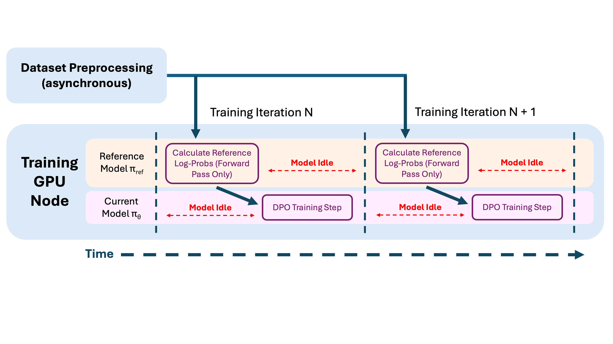
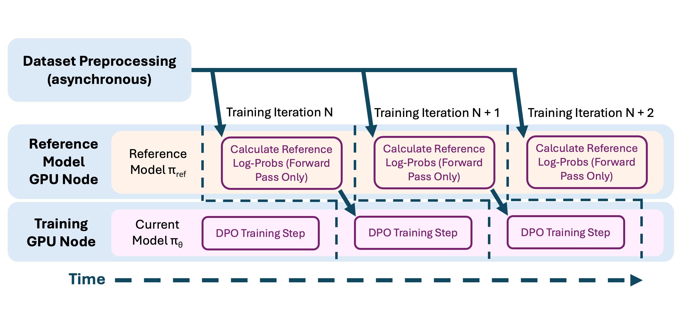

# Preference Tuning for Summarization using Synthetic Data

**⏱️ Time to complete**: 10 hours+

Alignment of LLMs has traditionally been broken down into two post-training stages: Supervised fine-tuning (SFT) followed by preference tuning (aka RLHF). SFT requires high quality data collection where each data sample illustrates behavior which we would like the LLM to imitate exactly. While for some tasks like SQL generation and math reasoning, it is feasible to collect the ground truth data, this approach does not always scale easily to align for subjective use cases (ex. chat, summarization, etc.). 

On the other hand, preference tuning only requires information about whether a given response is preferred to another response. Each data sample consists of a chosen and rejected completion for a given prompt, such that the chosen completion is preferred over the rejected completion. Preference tuning is thus a powerful tool that can optimize LLMs towards complex preferences that cannot be easily captured through supervised fine-tuning. However, manually annotating preferences between model outputs using human raters can be extremely time-consuming and expensive. Instead, synthetic preference data can be generated by scoring responses with large foundation models, allowing for much cheaper and scalable data collection!

Here we'll go through an end-to-end example for preference tuning of an open-source language model with synthetic data, covering scalable methodologies for data preprocessing, fine-tuning and evaluation, using Ray. We will focus on the task of summarization for the [CNN/DailyMail](https://huggingface.co/datasets/abisee/cnn_dailymail) dataset. 


Notebook guide:
- 🔄 REPLACE indicates to replace with your unique values
- 💡 INSIGHT indicates infrastructure insight

# Table of Contents
1. [Data Preprocessing](#step-1-data-preprocessing): In this section we cover how we can prepare preference data for the summarization task using an LLM-as-a-judge. 
    1. [Generate Multiple Choice Questions From Articles](#part-a-generate-multiple-choice-questions-from-articles)
    2. [Generate Summaries and Scores](#part-b-generate-summaries--scores)
    3. [Generate Preference Tuning Data](#part-c-generate-preference-tuning-data)
2. [DPO Finetuning](#step-2-fine-tuning): This section will cover how you can fine-tune an open source model on the preference data on the Anyscale platform.
3. [Evaluation](#step-3-evaluation): The section will lay down a blue-print for evaluation and compare performance to that of closed source models like OpenAI's GPT-4.

**NOTE**: Running the jobs in this notebook requires a HuggingFace token that can access [Llama-3.1-70B-Instruct](https://huggingface.co/meta-llama/Meta-Llama-3.1-70B-Instruct) and [Mistral-7B-Instruct-v0.1](https://huggingface.co/mistralai/Mistral-7B-Instruct-v0.1). For GPT-4o evaluation, you'd also need a valid `OPENAI_API_KEY`.  Make sure to provide `HF_TOKEN` and `OPENAI_API_KEY` by defining it under dependencies in your cluster setup.

<p align="center">
  
</p>

First, let's make the necessary imports


```python
import os
import pprint

import ray.data
import datasets

from src.utils.models import DataSchema
from src.utils.common import print_wrapped

os.environ["PYTHONPATH"] = f"{os.environ.get('PYTHONPATH', '')}:src"
```

# Step 1: Synthetic Data Generation

First, let's inspect the training dataset and look at an example. 


```python
hf_ds = datasets.load_dataset("abisee/cnn_dailymail", "3.0.0", split="train")

raw_example = hf_ds[0]
```


```python
pprint.pprint(raw_example, width=80)
```

    {'article': 'LONDON, England (Reuters) -- Harry Potter star Daniel Radcliffe '
                'gains access to a reported £20 million ($41.1 million) fortune as '
                "he turns 18 on Monday, but he insists the money won't cast a "
                'spell on him. Daniel Radcliffe as Harry Potter in "Harry Potter '
                'and the Order of the Phoenix" To the disappointment of gossip '
                'columnists around the world, the young actor says he has no plans '
                'to fritter his cash away on fast cars, drink and celebrity '
                'parties. "I don\'t plan to be one of those people who, as soon as '
                'they turn 18, suddenly buy themselves a massive sports car '
                'collection or something similar," he told an Australian '
                'interviewer earlier this month. "I don\'t think I\'ll be '
                'particularly extravagant. "The things I like buying are things '
                'that cost about 10 pounds -- books and CDs and DVDs." At 18, '
                'Radcliffe will be able to gamble in a casino, buy a drink in a '
                'pub or see the horror film "Hostel: Part II," currently six '
                'places below his number one movie on the UK box office chart. '
                "Details of how he'll mark his landmark birthday are under wraps. "
                'His agent and publicist had no comment on his plans. "I\'ll '
                'definitely have some sort of party," he said in an interview. '
                '"Hopefully none of you will be reading about it." Radcliffe\'s '
                'earnings from the first five Potter films have been held in a '
                'trust fund which he has not been able to touch. Despite his '
                'growing fame and riches, the actor says he is keeping his feet '
                'firmly on the ground. "People are always looking to say \'kid '
                'star goes off the rails,\'" he told reporters last month. "But I '
                'try very hard not to go that way because it would be too easy for '
                'them." His latest outing as the boy wizard in "Harry Potter and '
                'the Order of the Phoenix" is breaking records on both sides of '
                'the Atlantic and he will reprise the role in the last two films.  '
                "Watch I-Reporter give her review of Potter's latest » . There is "
                'life beyond Potter, however. The Londoner has filmed a TV movie '
                'called "My Boy Jack," about author Rudyard Kipling and his son, '
                'due for release later this year. He will also appear in "December '
                'Boys," an Australian film about four boys who escape an '
                'orphanage. Earlier this year, he made his stage debut playing a '
                'tortured teenager in Peter Shaffer\'s "Equus." Meanwhile, he is '
                "braced for even closer media scrutiny now that he's legally an "
                'adult: "I just think I\'m going to be more sort of fair game," he '
                'told Reuters. E-mail to a friend . Copyright 2007 Reuters. All '
                'rights reserved.This material may not be published, broadcast, '
                'rewritten, or redistributed.',
     'highlights': 'Harry Potter star Daniel Radcliffe gets £20M fortune as he '
                   'turns 18 Monday .\n'
                   'Young actor says he has no plans to fritter his cash away .\n'
                   "Radcliffe's earnings from first five Potter films have been "
                   'held in trust fund .',
     'id': '42c027e4ff9730fbb3de84c1af0d2c506e41c3e4'}


Consider the example article above. Our goal is to train a model to summarize it accurately, with a preference for short summaries, making sure we also preserve important details. In this guide, we will employ a _synthetic_ summary scoring method using another LLM as a judge. We score the correctness of a summary using the following metrics:

**Summary Scoring Metrics**
1. Multiple choice Q&A accuracy:
    - Given the original text, we use an LLM judge to generate 5 multiple choice questions about the text.
    - We then ask the LLM judge to answer the questions using only the summary, and record the number of questions correctly answered.
2. Word count: We simply count the number of words in the summary.

This allows us to construct a simple preference function between two summaries:

**Preference Function**
1. If both summary responses attain more than 3/5 multiple choice questions correct, we will prefer the shorter response. We do not care about Q&A accuracy beyond 3 correct answers, since the summary should not contain all information from the text.
2. Otherwise, we select the response that leads to more correctly answered multiple choice questions.

We consider a subset of 21,000 articles in this example. To generate the preference pairs, we will generate 10 summaries from each article using the model we wish to fine-tune. Then, we will randomly sample pairs of summaries and use our preference function to annotate the preference between them.

For this example, we will use `Mistral-7B-Instruct-v0.1` as the base model to fine-tune and `Llama-3.1-70B-Instruct` as a judge. Note that mistral-instruct is already instruction tuned, so that given a prompt to do summarization it might do a good job, but it may not be aligned with how we want the summarization to look like. We can use preference data to further align the instruct variant towards our specific needs.

We've provided a helpful visualization here:

<p align="center">
  
</p>

Combining all this together, our data pre-processing pipeline is going to look as follows: 


💡 INSIGHT: 
Our synthetic preference data collection looks pretty involved at first glance. The key ideas in plain English are as follows:
- We use a combination of Q&A scoring + word length to indicate like/dislike (our preference function) given a pair of summaries.
- Our ultimate goal is to generate (chosen, rejected) pairs to train our reference model and evaluate it based on this criteria.
- We use another LLM (judge model) to generate said questions for each article. This model is also used in our scoring system. (To see how many questions can be answered from a summary)
- To generate training data, we first sample candidate summaries from the reference model for each article. We then obtain scores for each summary from the judge. Using the scores, we select pairs of summaries and mark our like/dislike to form (chosen, rejected) pairs for the actual training. 


### Part (a): Generate Multiple Choice Questions from Articles

First, we will generate the multiple choice questions and answers for each article using `Llama-3.1-8B-Instruct` (or `70B` if A100/H100s are available). Leveraging vLLM and Ray, we can very easily scale this generation process across multiple GPUs.

>  **_NOTE:_**  We provide two sets of configs: One with an 8B parameter model as the judge, and another with the 70B model. Using the 8B model is recommended, since we make use of highly available A10Gs. For good performance, and to replicate the results in our blog, you should use the 70B judge model which uses A100s (but these are harder to obtain on-demand)

The following command will run the [src/scripts/generate_questions.py](./src/scripts/generate_questions.py) script, which generates the questions and answers and saves them in `.parquet` files.


💡 INSIGHT:  
We are running this script as an anyscale job. The resources required by each step are requested at runtime and provisioned by Anyscale's autoscaler based on availability and quotas. You are free to change the [qa_generation](./configs/qa_generation) config in any way. The important parameters regarding resources are `accelerator_type`, `num_gpus_per_instance`, and `concurrency`. This script will generate 5 multiple choice question and answer pairs per article for 21k examples. According to the [llama_8b](./configs/qa_generation/llama_8b.yaml) config we are requesting 3 replicas of 4xA10G machines processing a batch-size of 128 examples each which saturates the GPUs all the way through.

This step will take ~40 min for 8B running on 12 A10s (~ $10) and ~75 mins for 70B running on 8 A100s (~ $28). 

```bash
anyscale job submit -f configs/jobs/8b_judge/generate_questions_job.yaml
# Optional: use the 70b model for better performance (runs on A100s)
# anyscale job submit -f configs/jobs/70b_judge/generate_questions_job.yaml
```

> **NOTE**: We recommend that you execute all the commands in this notebook in a terminal. Make sure you `cd` into the directory of this notebook (and the `src` files) before executing the commands. 

> **NOTE**: The default configurations provided are not tuned for maximum throughput. Feel free to modify the scaling configs (i.e concurrency, num gpus per instance) etc as needed (and as permitted by availability).

At the end of the job, you should see the remote path to the folder with Q&A in the logs.


<p align="center">
  
</p>

 Make sure to make note to use it for the next steps! 

 🔄 REPLACE the resulting S3 URI here. If you want to skip the prior step, you can continue with the prepared example data below.


```python
# Replace this with the link to the output folder from the previous job
qa_folder = "s3://air-example-data/preference-tuning-summarization-example/qa_generation/qa_annotations_full_train/"
qa_ds = ray.data.read_parquet(qa_folder)
# The dataset is small, we can materalize it
example_rows = qa_ds.materialize().take(3)
```


```python
for row in example_rows:
    print_wrapped("TEXT", row[DataSchema.ARTICLE])
    print_wrapped("QUESTIONS", row[DataSchema.MCQ_QUESTIONS])
    print_wrapped("ANSWERS", str(row[DataSchema.GROUND_TRUTH_MCQ_ANSWERS]))
    pprint.pprint("=" * 80, width=80)
```

    TEXT:
    By . Sean Poulter . PUBLISHED: . 20:04 EST, 10 March 2014 . | . UPDATED: . 04:33
    EST, 11 March 2014 . Advances: The new system will make it easier to move money
    around . Technology to allow direct payments between mobile phones was unveiled
    by the big banks yesterday. The system cuts out the need to remember sort codes
    and bank account details. Instead, you type on your phone the mobile number of
    the person or business you want to pay. The ‘Paym’ transfers, which will be
    password-protected, need your bank account to be linked to your own mobile
    number. Users will simply tap in the number of the recipient on their phone to
    authorise an electronic transfer from one account to another. The industry hopes
    the system will replace cheques, which are expensive to transport and process.
    At the same time it could provide a substitute for cash to make relatively small
    payments to tradesmen, window cleaners or gardeners. The idea is that millions
    of people will have their mobile phone number tied to their bank account – as a
    substitute for the normal account number and sort code. There is a security
    safeguard in that the name of the recipient will appear on the smartphone
    screen, once the number has been tapped in, so confirming the cash is going to
    the right person. Access to the Paym system will be covered by password or code
    protection in an attempt to avoid the risk of the phone being stolen and used to
    raid customers’ accounts. Paym has been devised by the finance industry’s
    Payments Council, which is the trade body responsible for running the electronic
    payments system on behalf of banks and building societies. The council’s chief
    executive, Adrian Kamellard, said: ‘We’re all used to the idea of a ‘mobile
    update’ to improve our apps - Paym is a mobile update for payments that means
    you can pay securely using just a mobile number. ‘Paym will make it easier to
    repay a friend for cinema tickets, split a restaurant bill or settle up for a
    colleague’s birthday collection.’ Changes: The system 'has the potential to link
    up every bank account in the country with a mobile number' He added: ‘Paym is a
    great example of industry-wide collaboration that delivers tangible benefits for
    customers. ‘The service has the potential to link up every bank account in the
    country with a mobile number. ‘Millions of people will be able to use it this
    year and we look forward to expanding Paym even further, so everyone can benefit
    from this easy, secure new way to pay.’ Paym will be integrated into customers’
    existing mobile banking or payment apps as an additional way to pay, making it
    possible to send and receive payments using a mobile number. When it is launched
    in the spring, customers of nine bank and building society brands – Lloyds,
    HSBC, Barclays, Halifax, Santader, TSB, Bank of Scotland, Cumberland Building
    Society, and Danske Bank - will be able to use the new service. The nine launch
    brands will offer their customers the opportunity to register their mobile
    number and select the current account they want payments made into before the
    service goes live. This will immediately make the new system the most wide-
    ranging payment service capable of moving funds directly from account to
    account, without the need for sort codes or account numbers. Paym will expand
    later this year to include First Direct, NatWest, RBS, Clydesdale Bank,
    Yorkshire Bank and Isle of Man Bank. The Nationwide building society is
    committed to joined in early 2015, while the Metro Bank and Ulster Bank are also
    finalising their participation.
    
    QUESTIONS:
    Q1) How will users initiate a payment using the 'Paym' system? A. By typing in
    the recipient's sort code and account number B. By visiting a bank branch C. By
    scanning a QR code D. By using a physical payment card E. By typing in the
    recipient's mobile number  Q2) What is the main purpose of the new 'Paym'
    system? A. To replace credit cards B. To increase the use of cheques C. To
    reduce the use of cash D. To increase bank fees E. To make it easier to move
    money around using mobile phones  Q3) How many bank and building society brands
    will offer the 'Paym' service at launch? A. 9 B. 15 C. 12 D. 20 E. 5  Q4) Which
    of the following is a potential benefit of the 'Paym' system? A. It will make it
    easier to repay a friend for cinema tickets B. It will reduce the security of
    mobile payments C. It will increase bank fees D. It will make it harder to split
    a restaurant bill E. It will increase the use of cheques  Q5) What is the name
    of the trade body responsible for devising the 'Paym' system? A. The Electronic
    Payments Council B. The Banking Association C. The Mobile Payments Association
    D. The Finance Industry Council E. The Payments Council
    
    ANSWERS:
    ['E' 'E' 'A' 'A' 'E']
    
    '================================================================================'
    TEXT:
    Jerusalem (CNN) -- Five Israeli right-wing extremists have been indicted by an
    Israeli court which accused them of attempting to prevent the demolition of
    illegal settlements in the West Bank, organizing a break-in at a military base
    and planning riots. The extremists are also suspected of masterminding an attack
    on an Israel Defense Forces base in the West Bank on December 13. In that
    incident, about 50 extremists infiltrated and attacked the Ephraim Regional
    Division Headquarters. The activists entered the base, damaged property, set
    tires on fire, threw stones and damaged vehicles, according to an IDF statement
    at the time. A commander's car was attacked, and he sustained minor injuries.
    Israeli Prime Minister Benjamin Netanyahu said the incident "crossed all lines."
    And Matan Vilnai, deputy defense minister, called the perpetrators "Jewish
    terrorists" in an interview on army radio. Israeli media reported in December
    that the attack came in response to rumors that Israeli security forces were
    about to demolish two illegal outposts in the West Bank. The indictment alleges
    the extremists operated from an apartment in Jerusalem, where they gathered
    intelligence information through surveillance, lookouts and patrols of Israeli
    troops. The intelligence was aimed at preventing "the evacuation of outposts by
    illegal means" and to prevent IDF operations, said the indictment, which was
    presented in court Sunday. "The indictment exposes the true and ugly face of the
    prosecution that proves once again the blatant discrimination against the
    settlers," said Adi Keidar, an attorney representing three of the five. The
    suspects are also being questioned about "price tag" attacks against
    Palestinians in the West Bank and Jerusalem, according to Israeli police. "Price
    tag" is a term used to describe attacks by Israeli extremists against
    Palestinians and Israeli security forces in retaliation for any action taken
    against settlers.
    
    QUESTIONS:
    Q1) What were the five Israeli right-wing extremists accused of attempting to
    prevent? A. The establishment of a new Israeli government B. The demolition of
    illegal settlements in the West Bank C. The expansion of a military base in the
    West Bank D. The construction of new settlements in the West Bank E. The
    relocation of Israeli troops  Q2) What was the result of the attack on the
    Ephraim Regional Division Headquarters? A. The base was completely destroyed B.
    A commander sustained minor injuries and property was damaged C. No one was
    injured and no property was damaged D. A commander was killed and several
    vehicles were damaged E. Several extremists were injured and no property was
    damaged  Q3) What term is used to describe attacks by Israeli extremists against
    Palestinians and Israeli security forces in retaliation for any action taken
    against settlers? A. West Bank war B. Israeli resistance C. Price tag D.
    Retaliation attack E. Settler strike  Q4) What was the reaction of Israeli Prime
    Minister Benjamin Netanyahu to the attack on the Ephraim Regional Division
    Headquarters? A. He remained silent on the issue B. He said the incident
    "crossed all lines" C. He blamed the Palestinians for the attack D. He called
    the perpetrators "Jewish terrorists" E. He praised the extremists for their
    actions  Q5) Why did the extremists allegedly attack the Ephraim Regional
    Division Headquarters? A. In response to the relocation of Israeli troops B. In
    response to rumors of an impending Israeli military operation C. In response to
    the construction of a new Palestinian settlement D. In response to rumors that
    Israeli security forces were about to demolish two illegal outposts E. In
    response to the establishment of a new Israeli government
    
    ANSWERS:
    ['B' 'B' 'C' 'B' 'D']
    
    '================================================================================'
    TEXT:
    Photos of the police officer performing a sex act in uniform were leaked and an
    investigation was launched by senior police bosses . Police in Puerto Rico have
    suspended a female police officer after photos of her performing a sex act in
    uniform ended up being leaked to fellow officers. According to a police insider,
    the images were taken by a male colleague at the police station and were posted
    onto social media. But not long after, they ended up on the phones of most
    officers in the country and quickly went viral. When senior police officers
    heard about it they launched an investigation to find out if the images were
    genuine, and quickly identified the police officer as being a serving member of
    the force. They said that the young woman, Cynthia Marrero Pomales, 29, was
    serving in Carolina, a town in north-eastern Puerto Rico near the capital San
    Juan. They added that she had been suspended while an investigation was carried
    out over allegations that she had offended the honour of the police force and
    damaged its reputation in public. She has reportedly been interviewed and given
    a statement but no details were given to local media. In one of the pictures the
    young woman also has the flag of the United States draped over part of her body.
    She reportedly uploaded the pictures herself on social media although it is
    understood that she had not intended for them to be shared outside of a small
    private circle of friends. The superintendent of police in Puerto Rico, Jose
    Luis Caldero Lopez, confirmed the authenticity of the images and announced that
    the young policewoman has since been suspended. This is not the first time a sex
    scandal has disgraced police in Puerto Rico. In 2014, photographs of two cops
    performing a sex act inside the presidential palace were shared and published,
    resulting in the officers being expelled from the force. Cynthia Marrero
    Pomales, 29, was serving in  a town  near the capital San Juan when the images
    emerged . She has now been suspended as police chiefs conduct an investigation
    into the pictures . The police station in Carolina, north-eastern Puerto Rico,
    where the incident is alleged to have occurred .
    
    QUESTIONS:
    Q1) What was the reason for the investigation launched by senior police bosses
    in Puerto Rico? A. A police officer was accused of theft B. Photos of a police
    officer performing a sex act in uniform were leaked C. A police officer was
    accused of corruption D. A police officer was involved in a fight E. A police
    officer was involved in a traffic accident  Q2) What was the consequence for the
    police officer, Cynthia Marrero Pomales, after the investigation? A. She was
    fired immediately B. She was given a warning C. She was suspended while an
    investigation was carried out D. She was transferred to a different department
    E. She was promoted to a higher rank  Q3) Where were the photos of the police
    officer performing a sex act in uniform initially taken? A. At a public park B.
    At the police station C. At a private residence D. At a hotel E. At a restaurant
    Q4) Why did the police officer, Cynthia Marrero Pomales, upload the pictures on
    social media? A. To share with the public B. To share with the media C. To share
    with her colleagues D. To share with a small private circle of friends E. To
    share with her family  Q5) What was the reaction of the superintendent of police
    in Puerto Rico, Jose Luis Caldero Lopez, to the incident? A. He denied the
    authenticity of the images B. He resigned from his position C. He launched a
    separate investigation D. He confirmed the authenticity of the images and
    announced the suspension of the police officer E. He ignored the incident
    
    ANSWERS:
    ['B' 'C' 'B' 'D' 'D']
    
    '================================================================================'


### Part (b): Generate Summaries + Scores

Next, we will generate 10 summaries for each article in the training set and score them with our Q&A judging setup. 

The following command will run the [generate_summaries_and_scores.py](src/scripts/generate_summaries_and_scores.py) script, which takes in the folder with generated questions + articles and stores the results to a new folder of `.parquet` files. This script will use the model under training to produce 10 summaries per each example on all of the input data examples. Followed by each summarization, it will also perform summary accuracy measurement, asking the down-stream LLM to answer the questions generated earlier solely based on the summaries generated by the desired model. 

🔄 REPLACE the S3 URI in [`configs/summary_generation/8b_judge/mistral_finetuned_eval.yaml`](configs/summary_generation/8b_judge/mistral_finetuned_eval.yaml) with the path to the folder with generated questions from the previous job


This job will take \~ 320 min for 8B on 14 A10Gs (\~ $76) and for 70B on A100s (\~ $125) given the default configurations.


```bash
anyscale job submit -f configs/jobs/8b_judge/generate_summaries_train_job.yaml 
# Optional: use the 70b model for better performance (runs on A100s)
# anyscale job submit -f configs/jobs/70b_judge/generate_summaries_train_job.yaml
```

💡 INSIGHT: Feel free to modify the `concurrency` argument to increase throughput and reduce overall time taken for job. Note that for high values the job might not acquire the specified resources and this indicates a lack of availability of GPUs. Try decreasing the `concurrency` argument for reference model or the judge.  

🔄 REPLACE the below S3 URI with the link to the generated summaries from the job. You can optionally skip the previous with the example dataset below.


```python
# replace with the link to the generated summaries
summary_folder = "s3://air-example-data/preference-tuning-summarization-example/summary_generation_base/train/"
summary_ds = ray.data.read_parquet(summary_folder)
example_rows = summary_ds.take(1)
```


```python
for row in example_rows:
    print_wrapped("TEXT", row[DataSchema.ARTICLE])
    print_wrapped("QUESTIONS", row[DataSchema.MCQ_QUESTIONS])
    print_wrapped("MODEL GENERATED SUMMARY", row[DataSchema.SUMMARY_GENERATION_RAW_OUTPUT])
    print_wrapped("ANSWERS", str(row[DataSchema.GROUND_TRUTH_MCQ_ANSWERS]))
    print_wrapped("JUDGE ANSWERS FROM SUMMARY", str(row[DataSchema.JUDGE_MCQ_ANSWERS]))
    pprint.pprint("=" * 100, width=80)
```

    TEXT:
    By . Kerry Mcqueeney . UPDATED: . 04:15 EST, 6 March 2012 . The wife of a
    British man facing arms dealing charges in the United States has described a
    judge's decision to remand him in custody ahead of his trial in the United
    States as 'heartbreaking'. Elaine Tappin said it was an 'outrage' that her
    65-year-old husband Christopher was refused bail after he was extradited to the
    United States two weeks ago. Judge Robert Castaneda ruled Tappin must remain in
    custody after US prosecutors told the federal court in El Paso, Texas, he may be
    a 'danger to the community' if released. Accused: An artist's impression of
    Christopher Tappin at his bail hearing in the El Paso Federal Courthouse .
    Heartbroken: Elaine Tappin with her husband Christopher, before he was
    extradited to the U.S. Mrs Tappin, 62, of Orpington, Kent, said: 'This is an
    outrage. God only knows how he'll bear up. It's heartbreaking.' Tappin has spent
    23 hours a day locked in his cell at the Otero County detention centre in New
    Mexico since he was extradited to America. His wife went on: 'I am shocked and
    deeply disappointed. He's a man of his word and is certainly not at risk of
    fleeing - where would he go? 'He doesn't have his passport or access to money.
    Why has the British Government allowed him to be incarcerated in solitary
    confinement for 23 hours a day before he's even been tried? 'Tony Blair helped
    the NatWest Three, why can't David Cameron help Chris?' Denied bail: The prison
    van carrying Christopher Tappin away from the federal courthouse after he was
    remanded in custody . Mrs Tappin added: 'He's not a danger to anyone - he's a
    65-year-old granddad. 'How is he supposed to prepare a proper defence when he's
    only been allowed to communicate with his lawyers from behind a plastic screen?'
    Tappin lost his two-year battle . against extradition to America two weeks ago
    and denies attempting to . sell batteries for surface-to-air missiles which were
    to be shipped from . the US to Tehran via the Netherlands. The . president of
    the Kent Golf Union, who faces up to 35 years in jail if . convicted, was
    escorted into the courtroom on Friday wearing an . orange-red prison jumpsuit,
    with his feet and one hand shackled. Incarcerated: Christopher Tappin is a
    65-year-old grandfather . US marshals allowed the other hand to remain free so
    he could use a cane he needs to walk. Assistant US attorney Greg McDonald asked
    the judge to keep Tappin in jail for the remainder of the proceedings. 'The risk
    is not that he'll punch somebody in the face, but through the use of a computer
    and the knowledge he has, he might pose a danger to the community,' Mr McDonald
    said. Tappin has no ties to the US and failed to disclose to court officials his
    frequent travels to Egypt, the United Arab Emirates and South Africa, he added.
    But Kent Schaffer, representing Tappin, said if released, his client would have
    complied with any restrictions imposed by the court and his family was ready to
    post bail of 50,000 dollars (£31,600). His case fuelled the row over the
    fairness of the extradition treaty between the UK and the US. Attorney General
    Dominic Grieve QC said Tappin's extradition highlighted problems with the treaty
    which were not 'readily curable', warning that many Britons were left uneasy
    when faced with the seemingly harsh and disproportionate sentences in the
    American justice system. Other critics of the 2003 treaty, including Deputy
    Prime Minister Nick Clegg, have described it as 'one-sided', but an independent
    review by retired Court of Appeal judge Sir Scott Baker last year found it was
    both balanced and fair. Tappin's extradition follows an investigation which
    started in 2005 when US agents asked technology providers about buyers who might
    have raised red flags. Those customers were then approached by undercover
    companies set up by government agencies. Caged: Tappin has spent 23 hours a day
    locked in his cell at the Otero County detention centre in New Mexico (pictured)
    since he was extradited to America . Briton Robert Gibson, an associate of
    Tappin who agreed to co-operate, was jailed for 24 months after pleading guilty
    to conspiracy to export defence articles. Gibson provided ICE agents with about
    16,000 computer files and emails indicating that he and Tappin had long-standing
    commercial ties with Iranian customers. American Robert Caldwell was also found
    guilty of aiding and abetting the illegal transport of defence articles and
    served 20 months in prison. In a brief telephone conversation with his wife,
    Tappin told her he was shackled and confined in a cage for five hours before his
    bail hearing on Friday, a family spokeswoman said. The judge agreed that
    measures could be imposed to ensure Tappin is monitored if released, but he said
    a discrepancy in Tappin's financial statement led to him being denied bail.
    Daryl Fields, a spokesman for the US Attorney's office in the western district
    of Texas, said Tappin was denied bail because he 'posed a flight risk'. His
    trial will take place before US District Judge David Briones in El Paso, but no
    date has been set.
    
    QUESTIONS:
    Q1) What is the name of the treaty that has been criticized due to Christopher
    Tappin's extradition? A. The UK-US Treaty of 2003 B. The Extradition Treaty
    between the UK and the US C. The US-UK Extradition Treaty of 2003 D. The UK-US
    Extradition Treaty E. The US-UK Treaty of 2003  Q2) Why was Christopher Tappin
    denied bail in the US? A. Because he posed a physical threat to the community B.
    Because he was a flight risk C. All of the above D. Due to his lack of ties to
    the US and failure to disclose his frequent travels E. Due to a discrepancy in
    his financial statement  Q3) What is the maximum sentence Christopher Tappin
    faces if convicted? A. Life imprisonment B. 20 years in jail C. 50 years in jail
    D. 35 years in jail E. 10 years in jail  Q4) How many hours a day is Christopher
    Tappin currently spending in his cell at the Otero County detention centre? A.
    24 hours B. 12 hours C. 20 hours D. 23 hours E. 18 hours  Q5) What is
    Christopher Tappin accused of in the United States? A. Selling surface-to-air
    missiles to the US military B. Conspiracy to export defence articles C.
    Smuggling goods from the US to the Netherlands D. Aiding and abetting the
    transport of defence articles E. Attempting to sell batteries for surface-to-air
    missiles to be shipped to Tehran
    
    MODEL GENERATED SUMMARY:
    British man Christopher Tappin, 65, has been denied bail and remanded in custody
    in the US ahead of his trial on arms dealing charges. His wife, Elaine Tappin,
    described the decision as 'heartbreaking' and an 'outrage'. Tappin has been in
    solitary confinement for 23 hours a day since his extradition two weeks ago. The
    trial will take place before US District Judge David Briones in El Paso, but no
    date has been set.
    
    ANSWERS:
    ['B' 'C' 'D' 'D' 'E']
    
    JUDGE ANSWERS FROM SUMMARY:
    ['Unsure', 'Unsure', 'Unsure', 'D', 'Unsure']
    
    '===================================================================================================='


### Part (c): Generate Preference Tuning Data

The final step for getting our data ready! We'll now generate (chosen, rejected) summary pairs for each article based on the scores.

The following command will run the [generate_dpo_data.py](src/scripts/generate_dpo_data.py) script, which takes in the folder of summaries and outputs `.jsonl` files for training and validation.

🔄 REPLACE the S3 URI in [`configs/training_data_generation/mistral_8b.yaml`](configs/training_data_generation/mistral_8b.yaml) with the path to the folder with generated summaries from the previous job

Run the following command in the terminal to generate DPO data:
```bash
export PYTHONPATH=$PYTHONPATH:src
python src/scripts/generate_dpo_data.py configs/training_data_generation/mistral_8b.yaml
```


```python
# Inspect the results
# Replace with the link to your validation file
validation_file = "s3://air-example-data/preference-tuning-summarization-example/dpo_training_data/valid.jsonl"

valid_ds = ray.data.read_json(validation_file)
example_rows = valid_ds.take(1)
```


```python
for row in example_rows:
    print_wrapped("PROMPT", row["chosen"][0]["content"])
    print_wrapped("CHOSEN RESPONSE", row["chosen"][1]["content"])
    print_wrapped("REJECTED RESPONSE", row["rejected"][1]["content"])
```

    PROMPT:
    Given the following text, create a very short summary that is at most 2
    sentences.  Text: By . Tamara Cohen, Political Reporter . PUBLISHED: . 18:32
    EST, 27 January 2013 . | . UPDATED: . 08:48 EST, 28 January 2013 . Deputy Prime
    Minister Nick Clegg and his wife Miriam are determined to keep the education of
    their 11-year-old son 'out of politics' Nick Clegg yesterday defended the
    possibility he may send his children to private schools as it emerged he and his
    wife Miriam have not even visited their local state school. He said the
    education of his 11-year-old son Antonio, who starts secondary school this year,
    should not be used as 'a political football' and that the couple would do
    'what's best' for their children although he was braced for criticism. Last week
    the Liberal Democrat leader told listeners to his radio show he would send his
    son to a private school if he failed to find a place in a good comprehensive,
    saying he would use the state system 'if it works out', but that there is 'huge
    competition' for places in London. But Mr Clegg, who attended Westminster public
    school, has apparently not looked around nearby Ark Putney academy in south-west
    London, it was revealed yesterday by its headmaster Mark Phillips. Mr Phillips
    who has turned the school around since he was hired three years ago, said the
    school which was once in special measures but is now lauded by the Government
    for its improvements, could provide an 'exceptional' education for any child and
    that there was no need to pay fees for schooling. Unless the Cleggs had visited
    'under cover' he had not seen them, he said.'I am always very clear that all
    parents living locally are welcome to choose our school and it is important that
    every parent comes with their child and takes an objective look to see whether
    what we offer will meet the needs of their child', he said. 'It wouldn't claim
    to be the answer to every child and every parent. But I hope that if a parent
    does come, and sees an environment their child will thrive in, they will pick
    us...I am confident they will do exceptionally well. I don't believe you have to
    pay for it.' Mr Clegg told the BBC's Andrew Marr Show yesterday that he and his
    wife will do whatever is in the interests of their son . If he chooses to
    educate his children . privately, Mr Clegg is likely to be accused of hypocrisy
    after using a . speech last year to attack 'the great rift in our education
    system' caused by many of the best schools being fee-paying and said it had a .
    'corrosive' effect on society and the economy. In . an interview on BBC1's
    Andrew Marr Show, he said: 'I accept that it's a . dilemma for anyone in public
    life, particularly in politics, how do you . balance that with the fact Miriam
    and I have small children, and the . approach Miriam and I took right from the
    outset was to keep our . children completely out of politics. 'We . never put
    them in front of the camera or to make them or their . education a political
    football. 'I totally accept that when we make a . decision that'll be subject to
    public commentary, criticism and so on, . but in the meantime we want to protect
    the privacy of an 11-year-old boy . and make the decision that we as parents
    think is best for our son.' The deadline for applying for entry to Ark Putney
    for 2013-14 was last October. The school is part of the Ark academy chain, set
    up in 2004, whose chairman is Paul Marshall, one of the Liberal Democrats'
    biggest donors. Last year 62 per cent of pupils gained at least five good GCSEs,
    prompting schools minister Nick Gibb to write to Mr Phillips to congratulate him
    on the 'excellent results' saying the school was in the top 100 best-performing,
    based on sustained improvements every year since 2008. However Michael Gove last
    year approved the sale of five acres of playing fields at the school including
    six tennis courts, a football pitch and a playground, to developers to fund
    refurbishments, after a £40million revamp under the Building Schools for the
    Future programme was cancelled. Alumni of Ark Putney, which used to be Elliott
    School, include actor Pierce Brosnan, and 1960s England bowler Geoff Arnold.
    Former Welsh secretary Peter Hain sent his children to the school, which was the
    scene of the Christmas play in the film Love, Actually. David Cameron has said
    his children will attend state school, but George Osborne has been criticised
    for sending his to the fee-paying preparatory school in Kensington that he
    attended.
    
    CHOSEN RESPONSE:
    Nick Clegg and his wife Miriam are considering sending their 11-year-old son
    Antonio to a private school, despite their previous claims that they would use
    the state system. Clegg has not visited Ark Putney Academy, a nearby state
    school, but its headmaster, Mark Phillips, claims that the school could provide
    an 'exceptional' education for any child and that there is no need to pay fees
    for schooling. The deadline for applying to Ark Putney for 2013-14 was last
    October and the school is part of the Ark academy chain, set up in 2004, whose
    chairman is Paul Marshall, one of the Liberal Democrats' biggest donors.
    
    REJECTED RESPONSE:
    Deputy Prime Minister Nick Clegg has defended the possibility of sending his
    children to private schools, stating that their education should not be used as
    a political football. He and his wife Miriam have not visited their local state
    school, but the headmaster of Ark Putney academy in London, where they were
    invited to attend, said the school could provide an "exceptional" education for
    any child and that parents should come to see it firsthand before making a
    decision.
    


# Step 2: Fine-tuning

Now that we have the pre-processed dataset, we are ready to fine-tune `Mistral-7B-Instruct-v0.1` using DPO. On Anyscale, we've created an easy-to-use interface to do preference-tuning using DPO. We leverage Ray to overlap reference model log-probability calculation with model training to improve GPU utilization. Most implementations compute log probabilities synchronously with model training,



While our implementation using Ray is asynchronous:  




Further, our use of Ray Data also implies that the compute configuration for the reference model can be completely decoupled with the policy model. For example, reference model calculation can run on a different node (with configurable number of GPUs, etc) with zero code changes needed. 

> **NOTE** Make sure you've gove over the [user guides](https://docs.anyscale.com/category/fine-tuning-beta) for fine-tuning to understand the different configurations available

To get started with DPO training, we provide the config for DPO in [configs/mistral_dpo_summarization.yaml](configs/mistral_dpo_summarization.yaml) . You can add your `WANDB_API_KEY` as an environment variable in the dependencies tab if you wish to track progress of your run on WandB.


 🔄 REPLACE the training and validation file paths in the config with the output file paths in the previous step


```python
!cat configs/mistral_dpo_summarization.yaml
```

    model_id: mistralai/Mistral-7B-Instruct-v0.1
    # Example summarization dataset with 10k examples for training with an average of 2.2k tokens per sample.
    # Make sure to replace `train_path` and `valid_path` with the path to the files you generated
    train_path: s3://air-example-data/preference-tuning-summarization/train.jsonl
    valid_path: s3://air-example-data/preference-tuning-summarization/valid.jsonl
    
    task: "preference_tuning"
    context_length: 4096
    # For DPO, it is recommended to set a high `num_data_blocks_per_device` to not bottleneck the logp processor.
    num_data_blocks_per_device: 32
    # Runs training on 12 GPUs
    num_devices: 12
    train_batch_size_per_device: 2
    eval_batch_size_per_device: 2
    learning_rate: 5e-6
    num_epochs: 3
    no_gradient_checkpoint: False
    # Deepspeed configuration, you can provide your own deepspeed setup
    deepspeed:
      config_path: configs/zero_3.json
    worker_resources:
      accelerator_type:A10G: 1
    padding: "longest"
    preference_tuning_config:
      beta: 0.01
      logprob_processor_scaling_config:
        custom_resources:
          accelerator_type:A10G: 1 # custom resource per worker.
        # Runs reference model logp calculation on 4 GPUs
        concurrency: 4
        batch_size: 2
    lora_config:
      r: 8
      lora_alpha: 16
      lora_dropout: 0.05
      target_modules:
        - q_proj
        - k_proj
        - v_proj
        - o_proj
        - gate_proj
        - up_proj
        - down_proj
      modules_to_save: []
      bias: "none"
      fan_in_fan_out: false
      init_lora_weights: true


You can fine-tune the model now by submitting it as an Anyscale job: 

```bash
anyscale job submit configs/jobs/mistral_dpo_job.yaml
```

This should take about 10 hours for the 8B model on 16 A10s (2 nodes with 8xA10), and about 7 hours for the 70B model on 8 A100s (1 node with 8xA100). 

💡 INSIGHT: This fine-tuning job inherits the compute configuration of the current workspace - meaning the job runs on a CPU-only head node with auto-scaling enabled. Sometimes, the nodes you get with auto-scaling can be in-efficient for fine-tuning due to inter-node communication costs (Say you get 2 4xA10 nodes instead of 8xA10s due to availability). You can explicitly set the compute configuration for the job with a set number of worker nodes to avoid this (but this might involve more wait times).
 - More on compute configurations here: https://docs.anyscale.com/configuration/compute-configuration 
 - The complete Anyscale Job API reference: https://docs.anyscale.com/reference/job-api#jobconfig 

# Step 3: Evaluation

Let's evaluate our trained model. Here we'll use two baselines: (1) the base model before finetuning (reference model in DPO) and (2) GPT-4o.

## Evaluation strategy

Our evaluation strategy involves the same Q&A scoring system as used while generating the preference data. 

<p align="center">
  
</p>

We evaluate the baseline model and the trained DPO model on the test set. 

## Obtain summaries on the test set
First, we'll need to obtain the summaries (and scores) for both the models on the given test set. 

For the baseline model, you can simply run the below command:
```bash
anyscale job submit -f configs/jobs/8b_judge/generate_summaries_eval_baseline_job.yaml
# Optional: use the 70b model for better performance (runs on A100s)
# anyscale job submit -f configs/jobs/70b_judge/generate_summaries_eval_baseline_job.yaml 
```

This should take \~ 10 min for the 8B model on 8 A10s ( < $2) and the 70B model on A100s (< $4).

For the fine-tuned DPO model, we provide a dummy config in [configs/summary_generation/8b_judge/mistral_finetuned_eval.yaml](configs/summary_generation/8b_judge/mistral_finetuned_eval.yaml). If you used the default training config provided, the model would be trained using LoRA and you should have a path to the LoRA weights. 


```python
!cat configs/summary_generation/8b_judge/mistral_finetuned_eval.yaml
```

    mode: eval
    input_folder: s3://air-example-data/preference-tuning-summarization-example/qa_generation/qa_annotations_full_test
    inference_type: offline
    model_inference_config:
      # Modify with s3 link to full param weights if you did full-param training
      model_id_or_path: mistralai/Mistral-7B-Instruct-v0.1
    
      # Add path to lora weights here. If you did full param training, you can instead remove this field.
      adapter_id_or_path: s3://large-dl-models-mirror/finetuning_template/mistral_dpo_summarization_lora
    
      temperature: 0
      top_p: 0.95
      scaling_config:
        batch_size: 64
        concurrency: 4
        num_gpus_per_instance: 1
        accelerator_type: A10G
    num_generations: 1
    judge_inference_config:
      model_id_or_path: meta-llama/Meta-Llama-3.1-8B-Instruct
      temperature: 0
      scaling_config:
        batch_size: 64
        concurrency: 3
        num_gpus_per_instance: 2
        accelerator_type: A10G
    num_mcq_questions: 5


 🔄 REPLACE the `adapter_id_or_path` entry in the config with the path to your LoRA weights before proceeding (if you used the fine-tuning defaults). Alternatively, make sure to replace `model_id_or_path` entry (and remove the `adapter_id_or_path` entry) if you did full-param fine-tuning.

We are now ready to evaluate our fine-tuned model: 

```bash
anyscale job submit -f configs/jobs/8b_judge/generate_summaries_eval_finetuned_job.yaml
# Optional: use the 70b model for better performance (runs on A100s)
# anyscale job submit -f configs/jobs/70b_judge/generate_summaries_eval_finetuned_job.yaml
```

In the logs for the above jobs, you should see the final path to the output summaries for both the models. 

Optionally, you can also obtain the summaries and scores for the `gpt-4o` model from OpenAI. Simply run: 

```bash
anyscale job submit -f configs/jobs/8b_judge/generate_summaries_eval_gpt_job.yaml
# Optional: use the 70b model for better performance (runs on A100s)
# anyscale job submit -f configs/jobs/70b_judge/generate_summaries_eval_gpt_job.yaml
```

This should take about \~ 10 min for the 8B model on 8 A10s and the 70B model on 8 A100s. 

## Get Evaluation Statistics

We've provided a convenient script [get_eval_stats.py](src/scripts/get_eval_stats.py) to get evaluation statistics and obtain the "win rate" of the DPO model (the percentage of times the DPO model performs better than the baseline). We've provided an example configuration below. 

🔄 REPLACE the `--outputs-path` field and optionally the `--gpt4o-outputs-path` with the paths you generated from the above jobs.

```bash 
# make sure to substitute --outputs-path with your path
python src/scripts/get_eval_stats.py --outputs-path s3://air-example-data/preference-tuning-summarization-example/summary_generation_dpo_model/test/ --baseline-outputs-path s3://air-example-data/preference-tuning-summarization-example/summary_generation_base/test/  

# (Optional): if you obtained results for GPT-4o, you should uncomment and run the following command instead
# python src/scripts/get_eval_stats.py --outputs-path s3://air-example-data/preference-tuning-summarization-example/summary_generation_dpo_model/test/ --baseline-outputs-path s3://air-example-data/preference-tuning-summarization-example/summary_generation_base/test/  --gpt4o-outputs-path <add-path-to-gpt4o-results>
```

You should see the following results for the 70B model:

```text 
╒═════════════════════════════╤═══════════╤════════════╤═══════════╕
│           Metric            │   Model   │  Baseline  │  GPT-4o   │
╞═════════════════════════════╪═══════════╪════════════╪═══════════╡
│        Accuracy >=3         │ 65.4286 % │ 43.0476 %  │ 37.2381 % │
├─────────────────────────────┼───────────┼────────────┼───────────┤
│        Accuracy >=4         │ 25.7143 % │ 13.5238 %  │ 10.0000 % │
├─────────────────────────────┼───────────┼────────────┼───────────┤
│     Median Compression      │ 11.5794 % │ 12.7316 %  │ 8.0496 %  │
├─────────────────────────────┼───────────┼────────────┼───────────┤
│      Mean Compression       │ 13.0029 % │ 14.3444 %  │ 9.3554 %  │
├─────────────────────────────┼───────────┼────────────┼───────────┤
│      Summary Too Long       │ 0.0000 %  │  0.0000 %  │ 0.0000 %  │
├─────────────────────────────┼───────────┼────────────┼───────────┤
│ Contains Invalid Characters │ 0.0000 %  │  0.0952 %  │ 0.0000 %  │
╘═════════════════════════════╧═══════════╧════════════╧═══════════╛


Model Win Rate against Baseline: 74.0000 %
GPT-4o Win Rate against Baseline: 64.8095 %
```

Our fine-tuned model is able to generate much better summaries, that are more concise (compression ratio is lower) with lesser out-of-distribution characters (gibberish tokens) than the baseline. You can see more details on the same in our blog!

| **NOTE:** The evaluation results will differ if you used the 8B model which is less capable as a LLM-judge (and thus the numbers can be less accurate)

## Summary

Congrats! You have now fine-tuned an open source model on preference data. As a quick recap, here's what we demonstrated in this notebook:
1. Synthetically generating preference data for DPO 
2. DPO fine-tuning of a language model on the Anyscale Platform
4. Evaluating the model against the baseline and GPT-4o, and analysing the results.
