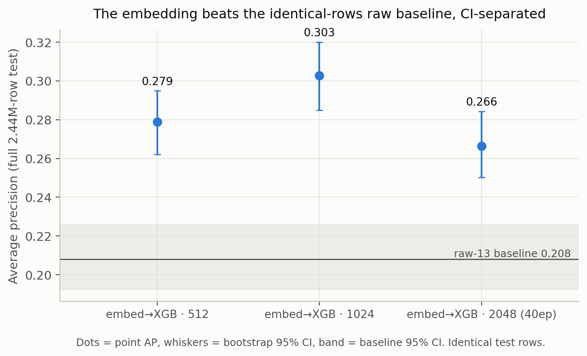
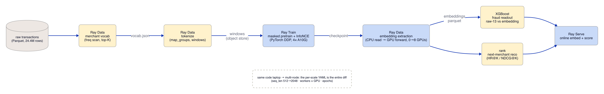
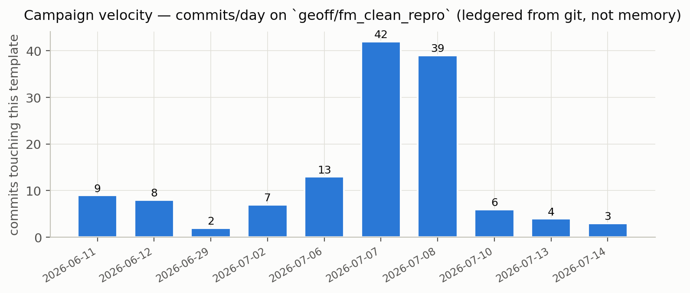
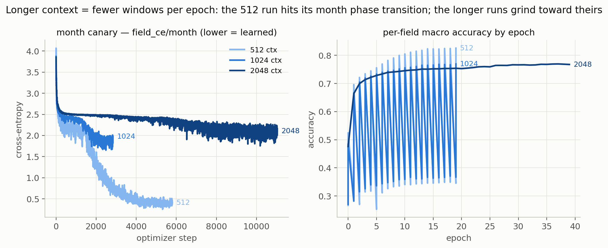
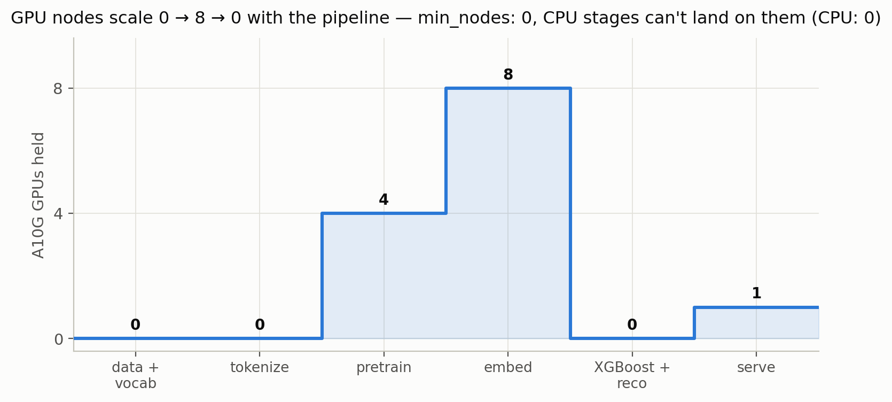
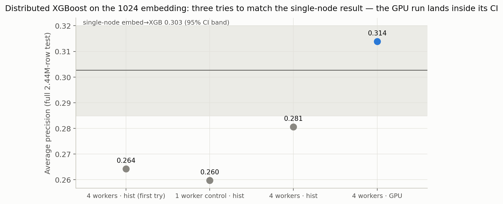

# [DRAFT] Beating a published fraud benchmark in 48 hours: the Ray + Anyscale mechanics

> Status: first full draft. Companion to the personal/results post (BLOG_DRAFT.md)
> — that one argues the *science*; this one shows the *machinery*. Every code
> block below is copied from the template (lightly trimmed), not idealized.
> `<details>` blocks are Geoff-level explainers — keep the good ones, fold the
> rest. Shared blanks with BLOG_ASSETS.md: [B2] architecture graphic,
> [B15] exact $ totals. [TODO] markers inline.

---

Last week we pretrained three transaction foundation models from scratch (512,
1024, and 2048 transactions of context), reproduced NVIDIA's published TabFormer
fraud benchmark to the fourth decimal, built a 2.44M-row upgraded evaluation,
and beat their published fusion headline with our embedding alone — roughly 48
hours of experiments at [B15: ~$15–25] per headline run.



This post is about the part that made that cadence possible. Not "Ray is fast"
— the model is 29M parameters; almost anything is fast. The claim is narrower
and, we think, more useful: **on Ray + Anyscale, the marginal cost of one more
experiment was a YAML file and a job submission.** Three context lengths ran as
three parallel jobs. Upgrading the benchmark to 24x more test rows reused the
trained checkpoints and cost zero retraining. The eval-environment bug that
moved a headline number by 0.05 was caught and controlled with a pinned-image
job. And an AI agent drove most of it through the CLI, overnight, unattended.

Here's the pipeline, stage by stage, with the actual code.



Same program at every scale — the per-scale YAML is the *entire* diff:

| knob | **smoke** | **small** | **full** (headline) | **xl** | **xxl** |
|---|---|---|---|---|---|
| cards sampled | 2,000 | 20,000 | 200,000 | 200,000 | 200,000 |
| context (txns/window) | 32 | 128 | 512 | 1,024 | 2,048 |
| d_model / layers | 64 / 2 | 256 / 4 | 512 / 8 | 512 / 8 | 512 / 8 |
| pretrain epochs | 2 | 15 | 20 | 20 | 20 |
| train workers × GPU | 1 × CPU | 2 × GPU | 4 × GPU | 4 × GPU | 4 × GPU |
| embed workers (job_full overrides to 8) | 8 (CPU) | 4 (GPU) | 4 (GPU) | 4 (GPU) | 4 (GPU) |

## The stage Ray was built for: batch embedding extraction

Once the FM is pretrained, the recurring job is: re-embed every customer.
That's the dataset the downstream XGBoost fraud model trains on — and it's a
heterogeneous workload: CPU-heavy parquet reads and tokenization feeding a
GPU forward pass. In our pipeline it's one streaming Ray Data pass, no
intermediate disk writes:

```python
# src/embed.py — the model loads ONCE per replica, batches stream through
class EmbeddingExtractor:
    def __init__(self, checkpoint_dir: str, pooling: str = "last"):
        self.model = build_model(...)          # loaded once per actor
        self.model.to(self.device).eval()

    def __call__(self, batch: dict) -> dict:
        with torch.inference_mode():
            pooled = self.model.sequence_embedding(tensors, pooling=self.pooling)
        out["embedding"] = [row for row in pooled.cpu().numpy()]
        return out

ds = ds.map_batches(
    EmbeddingExtractor,
    fn_constructor_kwargs={"checkpoint_dir": checkpoint_dir},
    batch_size=batch_size,
    compute=ray.data.ActorPoolStrategy(size=num_workers,
                                       max_tasks_in_flight_per_actor=16),
    num_gpus=gpus_per_worker,   # may be fractional: 0.25–0.5 packs replicas
    num_cpus=0,                 # CPU slots belong to the upstream tokenizer
)
```

Three things to notice:

1. **The input can be lazy.** `extract_embeddings(ds=...)` accepts an
   unmaterialized dataset, so CPU tokenization streams straight into the GPU
   actors through Ray's object store. Tokenize-then-write-then-read never
   happens.
2. **Inference scales independently of training.** Our job config gives this
   stage 8 GPUs while pretraining stays at 4 — inference is embarrassingly
   parallel, so extra GPUs are a free speedup, while the training world size
   stays fixed so training dynamics are comparable across runs.
3. **The GPUs can be fractional.** The FM needs a few hundred MB of VRAM; a
   whole A10G per replica would idle 90% of the card.

<details>
<summary><b>Explainer: what <code>num_gpus=0.5</code> actually does (and how it bit us once)</b></summary>

Ray resources are **logical, not physical**. `num_gpus=0.5` doesn't partition
the GPU (it's not MIG, not MPS) — it's a scheduling claim: "this actor consumes
half a GPU slot." Ray will co-locate two such actors on one physical GPU and
set `CUDA_VISIBLE_DEVICES` so both see the same device. Nothing stops either
actor from allocating the whole card's memory — *you* are asserting they fit.

Why it's worth it: our extractor's weights + activations peak well under 2GB;
an A10G has 24GB. At `num_gpus=1.0` the card is ~90% idle memory-wise and the
bottleneck is feeding it batches. Packing 2–4 replicas per card multiplies
throughput for free — same hardware bill.

How it bit us: early on we set `gpus_per_worker: 0.5` while the per-batch
activation footprint was much larger (long sequences, bigger batches), two
replicas landed on one A10G, and the second one CUDA-OOM'd. The fix was a
one-line config change back to `1.0` for that scale — and that's the real
lesson: fractional GPUs turn "how many models fit on a card" into a **config
knob you can tune per stage and per scale**, instead of an architecture
decision. Size it: `(model + peak activations) × replicas < VRAM`, leave ~20%
headroom, and test at the target sequence length, not the small one.

The companion line matters too: `num_cpus=0` on the GPU actors. Ray schedules
by *both* resources; if GPU actors also claimed CPU slots, they'd compete with
the upstream tokenizer tasks that feed them, and you'd starve your own input
pipeline. Zeroing the CPU claim says "this actor's work happens on the GPU;
leave the cores for the producers."
</details>

<details>
<summary><b>Explainer: job-level checkpointing — resumable batch inference (Anyscale runtime)</b></summary>

The Anyscale runtime adds something OSS Ray doesn't have: **row-level progress
tracking for Ray Data jobs**. We enable it in one block:

```python
# src/embed.py — processed rows are recorded by row_id; a resubmitted job
# resumes mid-dataset instead of re-embedding everything
from ray.data.checkpoint import CheckpointConfig
ray.data.DataContext.get_current().checkpoint_config = CheckpointConfig(
    id_column="row_id",
    checkpoint_path=ckpt,
)
```

Mechanically: as output blocks are written, the runtime records which `row_id`s
completed into a manifest next to the output. If the job dies — spot
reclamation, OOM, a cancelled run — resubmitting the same job skips every
completed row and picks up mid-dataset. It's the batch-inference twin of Ray
Train's epoch checkpoints, and it's what makes spot GPUs safe for the embedding
pass.

One subtlety we hit designing this: the manifest is deleted **on success** by
default, and that's correct for us *on purpose* — a re-run of stage 04 embeds
the *same* row_ids with a *retrained* model, so a persisted manifest would
skip every row and silently emit nothing for the new model. Failure keeps the
manifest, which is exactly when you want resume. If your ids don't change
across model versions, think this through before persisting manifests.
</details>

The encore is the part we're proudest of: when 112 test frauds proved too few
to rank our own models, we didn't shrink the claim — we upgraded the benchmark.
`fulltest_eval.py` tokenizes, embeds, and scores **all 2.44M test-period
transactions (3.5M windows)** against the existing checkpoints, as one job per
scale on a cluster that autoscales 0→8 A10Gs and back to zero. The eval
infrastructure is itself a Ray Data story — and because the pipeline stages are
decoupled (each persists to shared storage), the upgrade cost **zero
retraining**.

## Pretraining: stream once, shuffle locally, mask late

The training loop is plain PyTorch; Ray Train wraps it with DDP, sharding,
checkpointing, and failure handling. The interesting decision is the data
path. Tokenizing 24.4M transactions into windows is expensive; an epoch of a
29M-parameter model is cheap. So the expensive thing runs **once**, and every
source of per-epoch randomness is moved somewhere it costs nothing:

```python
# scripts/run_pipeline.py — tokenize once, shuffle once, pin in the object store
pre = (
    tokenized("pretrain")
    .filter(expr=col("kind") == "pretrain")
    .drop_columns(PRETRAIN_DROP)
    # One global shuffle before caching: the tokenizer emits windows grouped
    # by card, and a fixed card-correlated order hurts MLM convergence. The
    # trainer adds a local shuffle buffer for per-epoch variation on top.
    .random_shuffle(seed=0)
    .materialize()
)
pretrain(train_ds=pre, ...)   # handed to Ray Train — no Parquet round-trip
```

```python
# src/pretrain.py — inside the training function, per epoch
for batch in train_shard.iter_torch_batches(
    batch_size=config["batch_size"],
    prefetch_batches=2,                 # overlap batch prep with compute
    local_shuffle_buffer_size=max(8 * config["batch_size"], 1024),
    local_shuffle_seed=config.get("seed", 0) + epoch,
):
    corrupted, targets, masked = mask_batch(batch, dynamic_fields, mask_prob)
    ...
```

The masking — the actual randomness the MLM objective needs — is drawn fresh
per batch on the torch side, so no two epochs (and no two DDP workers) see the
same corruption, without the dataset ever being rewritten.

<details>
<summary><b>Explainer: the shuffle thing, from fundamentals</b></summary>

**Why shuffle at all?** SGD assumes batches are roughly i.i.d. samples of the
data distribution. Our tokenizer emits windows **grouped by card** (it
processes one card's history at a time — that's what makes it a clean
`map_groups`). If you train on that order, every batch is a few cards'
worth of highly correlated windows: same spending profile, same merchants,
same fraud status. Gradients within a batch stop being independent draws and
start being "whatever these three cards look like," convergence degrades, and
— worse for an MLM — the model can exploit within-batch correlation instead of
learning general structure.

**Why is a global shuffle expensive?** A true random permutation of a
distributed dataset is an **all-to-all**: every input block sends rows to
every output block. That's the most network-intensive operation in data
processing (it's "the shuffle" that dominates Spark tuning folklore). Doing it
once over the tokenized windows is fine. Doing it **every epoch** — the naive
"re-stream the pipeline per epoch" design — would repeat that all-to-all 20
times to train 20 epochs, and the shuffle would dwarf the actual training
compute for a model this small.

**The trick: one global + per-epoch local.** After the single global shuffle,
the order is random but *fixed*. If every epoch replayed the identical order,
the model could weakly overfit the order itself (and batch composition would
never vary). The `local_shuffle_buffer_size` gives you per-epoch variation at
~zero cost: as rows stream to each worker, they enter a buffer of N rows, and
each batch is drawn *randomly from the buffer* while new rows refill it. It's
a sliding-window reshuffle — rows can only move a bounded distance from their
global position, but batch composition changes every epoch. That bounded
movement is exactly why it's cheap (no network, no all-to-all — it's a local
in-memory buffer per worker), and it's *sufficient* because the global pass
already destroyed the card correlation. The two shuffles solve different
problems: global kills **structure**, local adds **variation**.

Note `local_shuffle_seed=seed + epoch`: variation across epochs, determinism
across runs — re-running the job with the same seed reproduces the same batch
sequence, which we relied on for A/B-ing training changes.

**Why not shuffle the masks into the dataset?** Because the third source of
randomness — which fields get masked — is free at batch time. `mask_batch`
draws a fresh Bernoulli mask per field per batch on the GPU-bound tensors.
Baking masks into the stored dataset would (a) fix them across epochs, a known
way to weaken MLM pretraining (the model memorizes *which* positions are
masked), and (b) multiply the stored dataset size. BERT-era pipelines that
pre-generated static masked copies ("10% of the data, 10 duplicates") were
abandoned for exactly this reason; dynamic masking (RoBERTa-style) is strictly
better and costs microseconds per batch.

**The materialize.** `.materialize()` executes the lazy pipeline and pins the
result in the cluster's **object store** (Ray's shared-memory layer, spilling
to disk if needed). Ray Train re-executes its input dataset every epoch — for
a lazy dataset that would mean re-reading parquet (or worse, re-tokenizing)
20 times. Materializing means epochs 2..N iterate memory. And because it's the
object store, the handoff to `TorchTrainer(datasets={"train": pre})` is
zero-copy across processes — no parquet round-trip between "data pipeline"
and "trainer," which is the seam where most homegrown stacks glue two systems
together with a filesystem. One line worth keeping: after training,
`del pre` releases those blocks before the embedding stage claims the memory.

**What `get_dataset_shard` adds:** each DDP worker calls it and receives its
*own partition* of the dataset — Ray Train splits the stream across the world
size, so workers never see duplicate rows within an epoch and no manual
`DistributedSampler` bookkeeping exists anywhere in the code.
</details>

The whole trainer setup — DDP, sharding, fault tolerance, checkpoints — is one
constructor:

```python
# src/pretrain.py
trainer = TorchTrainer(
    train_func,                                   # plain PyTorch inside
    train_loop_config={...},
    scaling_config=ScalingConfig(num_workers=num_workers, use_gpu=use_gpu),
    datasets={"train": ds},
    run_config=RunConfig(
        name=run_name,
        storage_path=storage_path,                # shared storage, multi-node safe
        failure_config=FailureConfig(max_failures=3),   # spot-safe in-place restore
        checkpoint_config=CheckpointConfig(num_to_keep=None),  # keep every epoch
    ),
)
```

CI smoke runs this exact code with `num_workers=1, use_gpu=False` on a laptop-
class node. The headline runs used 4×A10G. Nothing changes but the two
`ScalingConfig` arguments and a scale YAML.

Two of those innocuous-looking `RunConfig` lines did real scientific work:

- `num_to_keep=None` (keep every epoch's checkpoint) is what made the
  **per-epoch probe** possible (score fraud AP at every pretraining epoch) and
  the **20→40 epoch warm-restart continuation** a config change — we resumed
  the 2048 model's run by name and doubled its budget to separate
  "undertrained" from "too much context," a distinction the results post
  leans on heavily.
- `FailureConfig(max_failures=3)` restores in place from the last epoch
  checkpoint when a worker dies — which is what makes spot GPU nodes a
  reasonable default rather than a gamble.

## The cluster is part of the program

Every experiment is a checked-in YAML — nine of them by campaign's end
(`job_full/xl/xxl`, the 40-epoch continuation, the fulltest evals, the pinned
eval, the paired bootstrap, the baseline gate). The compute section is where
several quiet wins live:

```yaml
# job_full.yaml
compute_config:
  head_node:
    instance_type: m5.4xlarge
  worker_nodes:
    - name: gpu-1x
      instance_type: g5.xlarge
      min_nodes: 0          # scale to zero when idle
      max_nodes: 8
      resources:
        CPU: 0    # GPU nodes invisible to CPU-only tasks
    - name: cpu-workers
      instance_type: m5.4xlarge
      min_nodes: 0
      max_nodes: 4
```

<details>
<summary><b>Explainer: the <code>CPU: 0</code> trick, and why heterogeneous clusters need it</b></summary>

The problem: our pipeline has CPU-heavy stages (tokenization: pandas +
pyarrow work across millions of rows) and GPU stages (training, embedding).
Ray's autoscaler adds nodes when tasks can't schedule. A g5.xlarge has 4
vCPUs alongside its A10G — so by default, a burst of CPU-only tokenizer tasks
can *trigger GPU-node scale-up* (the autoscaler sees unschedulable CPU demand
and any node type advertising CPUs is a candidate) and then run on the GPU
boxes — the most expensive vCPUs money can buy — while the actual GPUs idle.

The fix is one line: override the GPU group to advertise `CPU: 0`. Remember,
Ray resources are logical — this doesn't disable the cores, it makes them
*invisible to the scheduler*. CPU-only tasks can no longer land on (or scale
up) GPU nodes; they go to the m5.4xlarge group. GPU actors still schedule
fine because they request `{"GPU": 1, "CPU": 0}` (that's also why the trainer
comment says GPU workers request zero CPUs).

The result is a cluster that *shapes itself to the stage that's running*:
tokenization fans out on cheap CPU nodes while GPU count is zero; training
brings up exactly 4 GPUs; embedding brings up 8; everything returns to zero
at job end (`min_nodes: 0` — you pay for the minutes the stage ran). One more
sizing note from the fulltest job: the *head* node is chosen per job too —
the no-PCA eval holds a 3.55M×512 float matrix in driver memory, so that job's
YAML specifies a 128GB head (`g5.8xlarge`) where the training jobs use an
m5.4xlarge. The cluster is part of the experiment config, versioned with it.
</details>

This is also where **environment pinning stopped being an ops nicety and
became a control variable**. Re-running our eval on a different XGBoost
device/version moved the 1024-context headline point by 0.05 AP while 512
didn't move — on a 112-fraud test set, harness sensitivity is a treatment
effect. The response was `job_eval_pinned.yaml`: `xgboost==3.2.0`, CUDA,
byte-identical environment, re-run everything. Those are the numbers the
results post reports. On Anyscale, "the eval environment" is a pinned image in
a YAML — which means it's *reproducible by construction*, and so is the bug
hunt when two environments disagree.

## Velocity, measured

The commit log tells the story better than adjectives: **~161 commits over 10
days, ~115 of them in the final 48 hours.** The seq-1024 scale went from
"doesn't exist" to "8×A10G job submitted" in under half an hour of commits.
July 7th alone: 52 commits — three overnight training runs, an adversarial
design review, and the teardown doc written the same night. July 8th: 45 —
both remaining context scales evaluated, the full-test-period eval built *and
run* on three scales, a paired-bootstrap ordering analysis, and the
recommendation subplot taken from "loses to a frequency baseline" to "beats
it, with the blind slices quantified."

<!-- TODO: reconcile the counts above with the ledgered figure — git on the
clean branch says 133 total; the 161/115/52/45 stats are from campaign memory
(the research branch) and don't match any checked-in history. -->



The mechanism, stated plainly:

- **Experiments are job submissions.** New question → new YAML → `anyscale
  job submit -f`. No infra edits, no cluster to keep warm — and no special
  hardware carve-out either: these jobs landed in the same Anyscale queue as
  the rest of the team's work, on the same finite pool of cloud quota. The
  velocity came from the scheduler multiplexing capacity that happened to be
  idle — the platform turns "nobody's using the GPUs right now" into
  something one person can actually exploit, without negotiating for a
  reservation. And in a busier production environment the same move still
  works, because the queueing infra already exists: Anyscale job queues take
  a `priority` per job, so a research campaign like this one would submit
  low-priority and soak up whatever the daytime workloads leave idle —
  saturating the fleet overnight and yielding the moment something more
  important shows up. (On reserved capacity, Anyscale's scheduler can go
  further and *preempt* a running low-priority job for a higher-priority
  one.) And getting preempted is a fine outcome here, because the
  checkpointing described above bounds what yielding costs: the embedding
  stage resumes mid-dataset from its row-level manifest — which survives
  failure and cancellation by design — and pretraining picks up from the
  last epoch checkpoint, the same resume plumbing our 20→40-epoch
  continuation exercised on purpose. Preemption costs you minutes of
  recomputation, not the night. Nothing about the campaign's shape would
  change; only one block in the YAML. The three context lengths ran as
  three parallel jobs against the same code.
- **Stages are decoupled through shared storage.** Every stage persists to
  `/mnt/user_storage`; eval-only questions (pinned env, fulltest, per-epoch
  probe, paired bootstrap) never paid for retraining.
- **Every claim carries a job id.** Results live in artifacts on shared
  storage, not in a terminal scrollback — any session (human or agent) can
  resume the campaign from disk.

## The agent in the loop

It would be dishonest to describe that commit cadence without its other
author: the overwhelming majority of the mechanical work was done by **Claude
Code driving the Anyscale CLI** — roughly 680 shell commands, 470 file edits,
and 25 long-running job monitors across the campaign, running unattended
overnight and resumed across four separate sessions.

The division of labor was explicit. The human is the PI: picks the benchmark,
sequences the campaign (reproduce *before* you claim), approves every dollar
of GPU spend, and reads the code before believing a win. Claude is the
research engineer: writes the configs, submits the jobs, watches them, chains
the next run on completion, and drafts the analysis. The pattern that makes
it work overnight is boring and robust — a persistent monitor per job that
polls `anyscale job status`, stays silent until the state changes, and on any
terminal state greps the logs down to exactly the numbers (or the traceback)
that matter, then wakes the agent to submit the chained next job:

```bash
while true; do
  s=$(anyscale job status --id prodjob_XXXX | awk '/^state:/{print $2}')
  [ "$s" != "$prev" ] && echo "state: $s" && prev=$s
  case "$s" in
    SUCCEEDED|FAILED|*ERRORED*|TERMINATED|OUT_OF_RETRIES)
      anyscale job logs --id prodjob_XXXX \
        | grep -E "ROC-AUC|AP|Traceback|out of memory|Unschedulable" | tail -30
      break;;
  esac
  sleep 90
done
```

None of this required an agent framework — it required a platform whose
control surface is a **clean CLI with greppable logs and durable state**,
which is exactly what an agent (or a tired human) needs. The full operating
manual — the monitor patterns, the chaining recipes, the rules we enforce
(never delete artifacts, dump configs verbatim, smoke the entry point
end-to-end before spending GPU money) — ships in the template under
`claude-anyscale/`. [TODO: confirm final path of claude-anyscale/ docs at
publish time — currently on the research branch.]

<details>
<summary><b>Explainer: why "CLI + files" beats "platform API + SDK" for agent-driven research</b></summary>

An agent's two failure modes are stale context and dead context. Everything
about this loop is designed so both are survivable: job state lives in
Anyscale (queryable by id at any time), results live in artifacts on shared
storage (readable by any future session), configs live in git (the job pulls
code from the repo, so the submitted experiment is exactly a commit). A fresh
Claude session — or a fresh human — can reconstruct the entire campaign state
from `anyscale job list`, the artifact tree, and the ledger docs, without any
conversation history. The platform's persistence *is* the agent's memory. The
same properties that make a platform good for a distributed team make it good
for an agent: legible state, idempotent operations, and logs that answer
questions.
</details>

## Observability that produced a finding (not just a dashboard)

Every pretraining run writes per-step TensorBoard curves to shared cluster
storage — each field's masked-prediction loss individually, with the run name
encoding the key hyperparameters and the *entire* config dumped verbatim into
the run's Text tab (a rule we enforce: no renamed keys, no hand-picked
subsets — the run must be self-describing months later).

That instrumentation produced one of the results post's key findings on its
own: the **month canary**. Predicting a masked transaction's month is nearly
free (copy a neighbor's visible month), yet the `field_ce/month` curve showed
the 512-context model acquiring that skill in a late, sharp phase transition —
and the longer-context models never reaching theirs within budget. That single
TensorBoard panel is what motivated the 20→40 epoch continuation, which is
what let us separate undertraining from context dilution — arguably the most
subtle claim in the results post, and it started as "huh, look at that curve."
The lesson we'd generalize: per-field/per-component curves on durable storage
are cheap; write them *before* you need them.





[TODO: screenshot — Ray dashboard during the streaming embed stage.]

## The serving coda

The template also ships the online path — a Ray Serve deployment mirroring the
two-tier pattern production fraud systems use: static card-level embeddings
cached, the transformer running only over the recent dynamic window,
micro-batched, autoscaling 1→4 replicas:

```python
@serve.deployment(
    autoscaling_config={"min_replicas": 1, "max_replicas": 4,
                        "target_ongoing_requests": 24},
)
class TransactionFMService:
    @serve.batch(max_batch_size=32, batch_wait_timeout_s=0.01)
    async def _embed_batch(self, payloads): ...
```

Same model artifact, same repo, no export step between "research checkpoint"
and "service."

## Where the fusion path goes at scale: late vs joint fusion

Everything above is **late fusion**: pretrain the FM once, freeze it, batch-
extract embeddings, and train a cheap tabular model (XGBoost) on embeddings ⊕
raw features. That's NVIDIA's design and ours — and it's worth being explicit
that the *other* design exists, because [Nubank](https://blog.bytebytego.com/p/how-nubank-uses-ai-models-to-analyze)
(the largest published deployment of this pattern, trillions of transactions
across 100M+ users) reports moving to **joint fusion**: the transformer trained end-to-end with a
DCNv2 tabular tower, so the embedding co-adapts to the downstream task instead
of being frozen at whatever the pretext objective left behind.

The infrastructure consequence is the interesting part, and our own job
configs contain the foreshadowing. Late fusion at production scale is a
**data problem**: the recurring batch-embed job, a distributed embedding⊕
tabular join, leak-safe encoders fit on train only — and eventually a
distributed XGBoost, because the driver-resident feature matrix is the first
thing that breaks. Our fulltest job already had to specify a 128GB head node
to hold a 3.55M×512 matrix in driver memory — and removing that wall is not a
rewrite, it's swapping the sink. Distributing the *feature construction*
alone doesn't help (the rows still funnel into one machine's RAM at fit
time); the fix is distributing the trainer itself:

```python
# scripts/distributed_xgb.py — no node ever holds the full matrix
def train_func(config):
    dtrain = shard_matrix("train")   # THIS worker's shard only
    dval = shard_matrix("val")       # replicated — see the war story below
    xgboost.train(config["params"], dtrain, evals=[(dval, "val")],
                  num_boost_round=435, early_stopping_rounds=20,
                  callbacks=[RayTrainReportCallback()])

trainer = XGBoostTrainer(
    train_func,
    scaling_config=ScalingConfig(num_workers=4, use_gpu=True),
    datasets={"train": train_ds, "val": val_ds},
    # shard ONLY train; every worker needs the same global val signal
    dataset_config=ray.train.DataConfig(datasets_to_split=["train"]),
)
```

We ran it, and it measures properly: on the xl (1024-context) fulltest
embeddings, the distributed variant lands at **AP 0.3139 — inside the
single-node run's bootstrap 95% CI [0.2849, 0.3201]** (point 0.3027), on an
m5.4xlarge head. The eval scales with worker count, not driver RAM. It ships
as the scale-out variant alongside the protocol-faithful single-node path
(distributed hist doesn't grow bit-identical trees), and getting to "inside
the CI" took exactly the discipline the harness encodes — two instructive
failures first:

1. **Sharded validation poisons early stopping.** By default Ray Train
   shards *every* dataset; distributed XGBoost averages per-shard eval
   metrics, so each worker early-stopped against a val shard holding as few
   as **12 frauds**. The run "succeeded" at AP 0.264 — the CI verdict, not
   the exit code, is what caught it. The `datasets_to_split=["train"]` line
   above is the fix.
2. **Device is a treatment effect.** With val fixed, CPU-trained runs
   (0.281 distributed, 0.260 single-worker control — distribution
   exonerated) still sat below the CUDA-trained record, reproducing the
   ~0.05-AP CPU/CUDA sensitivity the campaign had already documented at
   this context length. Compare like with like: the CUDA-vs-CUDA run is the
   one that verdicts INSIDE. Joint
fusion at production scale is a **training problem that is also a data
problem**: token sequences and tabular features co-streamed per batch into a
multi-tower torch model on DDP — which is *exactly* the Ray Data →
`get_dataset_shard` → `iter_torch_batches` pattern our pretraining already
uses, with a second input branch and a supervised loss. The pipeline you build
for late fusion is the pipeline you graduate to joint fusion with.

<details>
<summary><b>Explainer: late vs joint fusion — the actual tradeoff</b></summary>

**Late fusion** = frozen embeddings + GBDT. Its superpower is *organizational
decoupling*: one pretrain amortizes across every downstream team (Nubank runs
a centralized model repository for exactly this — embedding-only consumers
never touch the trainer). The embedding is a stable interface; downstream
iteration is a CPU XGBoost retrain measured in minutes; serving is a cached
vector plus a tiny tree model. On rare-label problems (fraud at 0.1%
prevalence) the frozen encoder also can't overfit the labels, because it
never sees them.

Its pathology is the one our results post documents at length: **the
embedding was optimized for a pretext task, not your task, and whatever the
readout throws away is unrecoverable.** Our "readout is where FM signal goes
to die" lesson — mean-pooling, PCA compression, wrong-position extraction —
is a late-fusion disease specifically. The GBDT can't send a gradient back to
say "keep the burst structure, drop the merchant trivia." Nubank's phrasing:
components train separately with limited synergy.

**Joint fusion** = transformer + tabular tower (DCNv2: learned feature
crosses, the recsys workhorse) trained end-to-end on the downstream label.
The task gradient reaches the encoder, which dissolves the readout problem at
the root — the model *learns* what state to expose. The costs are the mirror
image: every task now owns a GPU training loop instead of a CPU fit; the
shared-embedding amortization weakens (teams fine-tune variants instead of
consuming one artifact); serving means running the transformer in the request
path per task, not looking up a cached vector; and with 0.1% positive labels,
an end-to-end model needs care (balanced sampling, frozen-then-unfreeze
schedules, adapters) that a frozen-embedding GBDT simply doesn't.

And one cost that matters specifically for a multi-consumer backbone: **the
task gradient that fixes the readout also specializes the encoder.** Fine-tune
jointly on fraud and the representation reshapes for fraud — the same weights
get *worse* as a recommendation backbone, and vice versa. "One backbone, two
consumers" is a late-fusion property. This is why a shared-repository model
(Nubank's "embedding-only models or blended variants") forks the encoder for
joint-fusion consumers rather than mutating the shared trunk — and why the
in-between options (multi-task joint training with its task-weighting
battles, adapters on a frozen trunk, distilling a joint model's gains back
into the shared embedding) are an active design space rather than a solved
menu.

The pragmatic sequence most shops follow — and the reason the late-fusion
pipeline isn't throwaway work: start late (cheap, decoupled, benchmarkable),
use it to *prove the embedding carries signal* (our campaign, in one clause),
then graduate the highest-value task to joint fusion while everyone else
keeps consuming the frozen embedding. Infrastructure-wise the graduation is
incremental: the batch-embed job keeps running for the late-fusion consumers,
and the joint trainer reuses the same tokenized datasets, the same streaming
pattern, and the same cluster shapes as pretraining. That's the real
argument for building the data layer on one substrate: the fusion strategy
can change without the pipeline changing.
</details>



## What we're *not* claiming

Honesty section, mirroring the results post's ethos. NVIDIA's single-GPU
RAPIDS pipeline is fine at 24M rows — our claim is horizontal scaling plus
streaming into training, not that theirs breaks. We hit real friction and kept
it in the README: shuffle aggregators needed right-sizing for a small cluster,
an object-store fraction needed setting, a driver OOM'd when we asked it to
hold 5M eval windows, and fractional GPUs OOM'd once before we sized them
properly. The difference a platform makes isn't zero friction — it's that
every one of those was a config-line fix, and none of them cost us a day.

## Reproduce it

The template is public: three job submissions take you from raw data to the
headline table ([TODO: template link]). Bring your own transactions — the
context-length sweet spot on your data is a config change, not a research
project.

[CTA block]
