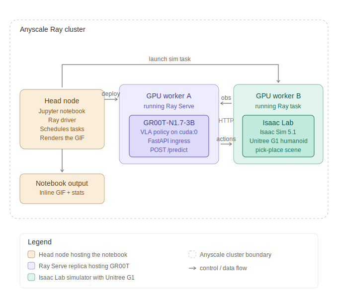

# GR00T humanoid robot, served by Ray Serve on Anyscale

End-to-end demo of NVIDIA's GR00T-N1.7-3B vision-language-action model controlling a Unitree G1 humanoid in NVIDIA Isaac Lab simulation, served at scale via Ray Serve on Anyscale.

## What this shows

Three things, end to end:

1. The GR00T-N1.7-3B foundation model deployed behind an HTTP endpoint with Ray Serve
2. The policy responding to observations with correctly-shaped action chunks at sub-second latency
3. A full Isaac Lab rollout rendered as a GIF, displayed inline in the notebook

## Architecture



The notebook on the head node deploys the GR00T-N1.7-3B policy to a GPU worker via Ray Serve, then launches a separate Ray task on a different GPU worker that runs Isaac Lab and queries the policy over HTTP. The simulator's rendered frames return as a GIF that displays inline.

## Demo rollout

A zero-shot rollout from the GR00T-N1.7-3B base model. The robot is in Isaac Lab's pick-place scene, moving under real policy control.


The motion is exploratory rather than task-completing because:

1. The rollout feeds zeroed joint state to the policy. The policy was trained to read its own arm and hand state. Wiring Isaac Lab's real `robot.data.joint_pos` into the GR00T schema makes the actions far more directed.
2. NVIDIA published `nvidia/GR00T-N1.6-G1-PnPAppleToPlate`, a checkpoint specifically post-trained on this exact pick-place task. Swapping that checkpoint into the same Ray Serve deployment is a one-line change.

The platform stays the same. The model swap is a one-line change.

## Why this is interesting

Anyscale is the platform for running modern AI workloads at scale. Robotics foundation models like GR00T combine three hard things at once:

- **Heavy GPU inference** for a 3B parameter VLA (vision-language-action) model
- **Realtime physics simulation** with NVIDIA Isaac Lab and Isaac Sim
- **Multi-machine orchestration** with the policy and simulator on separate GPUs, communicating over HTTP

Ray Serve handles GR00T inference scaling. Ray tasks fan out the Isaac Lab simulators. Anyscale runs the cluster. The same primitives that scale LLM inference scale cleanly to robotics.

## Repo layout

```
groot_demo.ipynb            The demo notebook. Open this and run top to bottom.
architecture.svg            Architecture diagram embedded in the README.
g1_groot_n17_zeroshot.gif   Pre-recorded rollout displayed in the notebook.

policy_server.py            Ray Serve deployment with FastAPI ingress. Loads
                            GR00T-N1.7-3B onto a GPU, exposes POST /predict.
sim_worker.py               Isaac Lab subprocess launched as a Ray task. Boots
                            the G1 pick-place scene and queries policy_server
                            over HTTP.
g1_env.py                   Isaac Lab G1 environment wrapper. Translates
                            observations into the GR00T schema and the policy's
                            action chunk into Isaac Lab's (1, 28) joint commands.
run_demo.py                 Orchestrator for parallel rollouts.

Dockerfile                  Cluster image: Isaac Sim 5.1 + Isaac Lab + GR00T,
                            plus all runtime patches and pre-cached weights.
setup_workers.sh            Helper that distributes HF_TOKEN to every worker.
```

## Running the notebook

### Cluster requirements

- Anyscale workspace using the cluster image built from `Dockerfile`
- At least 2 GPU workers (A10G or better)
- A Hugging Face token with access to `nvidia/Cosmos-Reason2-2B` (gated; accept terms at https://huggingface.co/nvidia/Cosmos-Reason2-2B)

### Steps

1. Start the cluster with the custom image
2. Open `groot_demo.ipynb` in Anyscale's JupyterLab
3. Set `HF_TOKEN` in the Step 0 cell
4. Run cells top to bottom

Total runtime on a warm cluster: roughly 3 minutes.

## Required runtime patches

Working with current pip versions against pinned model expectations needs four patches. All are baked into `Dockerfile`:

1. **VideoInput shim**: in transformers 4.54+, `VideoInput` was moved from `transformers.image_utils` to `transformers.video_utils`. GR00T's Eagle dynamic processor still imports from the old location.
2. **flash_attention_2 force**: Qwen3 VLM asserts `_attn_implementation == "flash_attention_2"` but `AutoModel.from_config` does not propagate the `attn_implementation` kwarg through. Patched via `_BaseAutoModelClass.from_config`.
3. **HF_TOKEN propagation**: Cosmos-Reason2-2B is gated. Worker subprocesses receive `HF_TOKEN` via Ray Serve's `ray_actor_options={"runtime_env": {"env_vars": {"HF_TOKEN": ...}}}`.
4. **Pinocchio pre-import**: NVIDIA IsaacLab issue #4090. Pinocchio's C++ `std::vector<std::string>` binding gets corrupted after Isaac Lab loads a robot URDF. Workaround: `import pinocchio` before `AppLauncher`.

## Embodiment and obs/action schemas

The repo uses GR00T's `EmbodimentTag.REAL_G1` schema for N1.7-3B.

Obs (nested dict):

- `video.ego_view`: `(B, 2, H, W, 3) uint8` (2-frame stack)
- `state`: 7 keys including `left_wrist_eef_9d` (3 pos + 6-element flattened rotation matrix), arms, hands, waist
- `language.annotation.human.task_description`: `[[str]]`

Action: 40-step chunk with 9 keys (left and right wrist, arms, hands, waist, base height, navigate command).

### Isaac Lab task action mapping

`Isaac-PickPlace-FixedBaseUpperBodyIK-G1-Abs-v0` accepts actions of shape `(1, 28)`. The policy output packs as `left_arm(7) + right_arm(7) + left_hand(7) + right_hand(7) = 28`.

## Going further

### Scale the policy server horizontally

```python
deployment = GR00TPolicyServer.options(num_replicas=4).bind(...)
```

Ray Serve schedules each replica on its own GPU. Sim workers load-balance across them automatically.

### Run many sim rollouts in parallel

```python
results = ray.get([run_sim_rollout.remote(POLICY_URL) for _ in range(100)])
```

Each rollout grabs a GPU worker, queries the shared policy fleet, and saves its own GIF.

### Swap to the published G1 fine-tune

NVIDIA's `nvidia/GR00T-N1.6-G1-PnPAppleToPlate` is post-trained on the apple-to-plate task. Loading it requires GR00T's N1.6 release branch and the `UNITREE_G1` embodiment schema (single-frame video, full-body state, 30-step action chunk). It runs on the same Ray Serve infrastructure.

## Acknowledgments

- NVIDIA Isaac Lab team for the [pinocchio #4090 workaround](https://github.com/isaac-sim/IsaacLab/issues/4090)
- NVIDIA Isaac-GR00T `n1.6-release` and `main` branches
- Anyscale for the cluster
