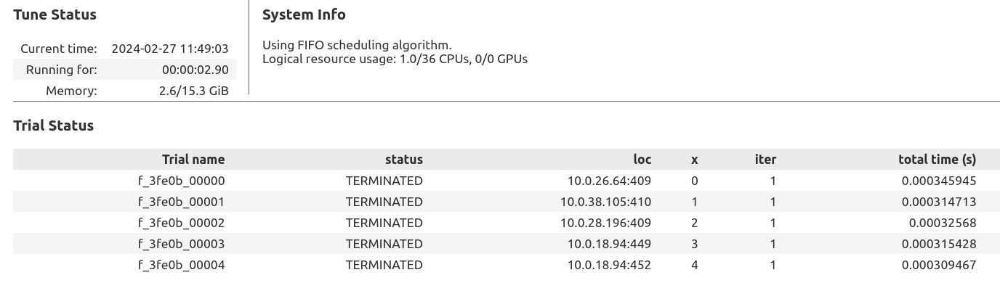
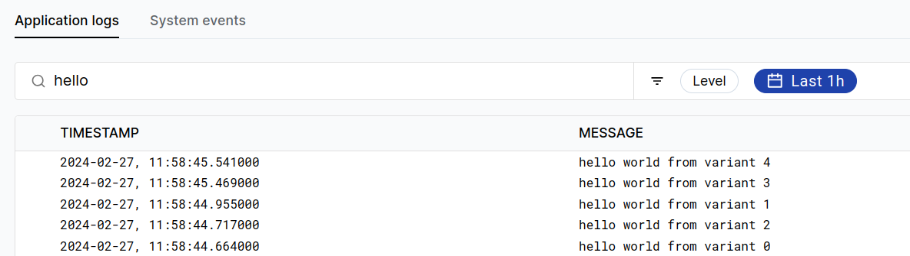
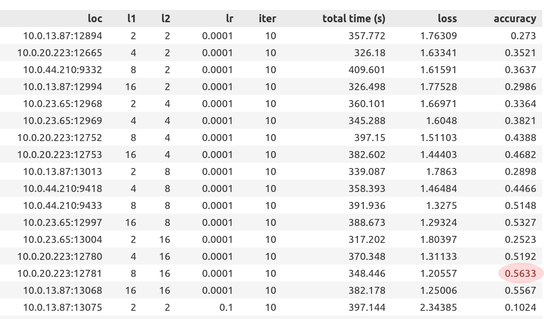
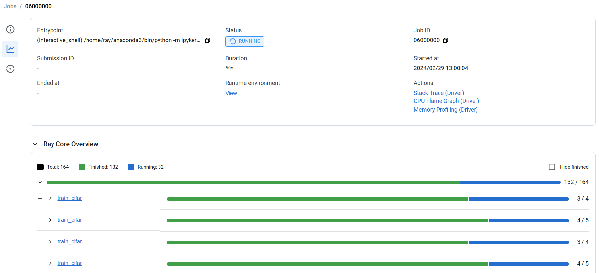

# Running Experiments in Parallel with Tune

**⏱️ Time to complete**: 10 min

Ray Tune lets you easily run experiments in parallel across a cluster.

In this tutorial, you will learn:
1. How to set up a Ray Tune app to run an parallel grid sweep across a cluster.
2. Basic Ray Tune features, including stats reporting and storing results.
3. Monitoring cluster parallelism and execution using the Ray dashboard.

**Note**: This tutorial runs within a workspace. Please overview the ``Introduction to Workspaces`` template first before this tutorial.

## Grid search hello world

Let's start by running a quick "hello world" that runs a few variations of a function call across a cluster. It should take about 10 seconds to run:


```python
from ray import tune

def f(config):
    print("hello world from variant", config["x"])
    return {"my_result_metric": config["x"] ** 2}

tuner = tune.Tuner(f, param_space={"x": tune.grid_search([0, 1, 2, 3, 4])})
results = tuner.fit()
print(results)
```


<div class="tuneStatus">
  <div style="display: flex;flex-direction: row">
    <div style="display: flex;flex-direction: column;">
      <h3>Tune Status</h3>
      <table>
<tbody>
<tr><td>Current time:</td><td>2025-10-01 14:04:49</td></tr>
<tr><td>Running for: </td><td>00:07:55.26        </td></tr>
<tr><td>Memory:      </td><td>12.8/62.8 GiB      </td></tr>
</tbody>
</table>
    </div>
    <div class="vDivider"></div>
    <div class="systemInfo">
      <h3>System Info</h3>
      Using FIFO scheduling algorithm.<br>Logical resource usage: 1.0/16 CPUs, 0/0 GPUs (0.0/9.0 anyscale/provider:azure, 0.0/8.0 anyscale/node-group:2CPU-8GB, 0.0/9.0 anyscale/cpu_only:true, 0.0/9.0 anyscale/region:westus2, 0.0/1.0 anyscale/node-group:head)
    </div>

  </div>
  <div class="hDivider"></div>
  <div class="trialStatus">
    <h3>Trial Status</h3>
    <table>
<thead>
<tr><th>Trial name   </th><th>status    </th><th>loc             </th><th style="text-align: right;">  x</th><th style="text-align: right;">  iter</th><th style="text-align: right;">  total time (s)</th><th style="text-align: right;">  my_result_metric</th></tr>
</thead>
<tbody>
<tr><td>f_28017_00000</td><td>TERMINATED</td><td>10.0.192.214:554</td><td style="text-align: right;">  0</td><td style="text-align: right;">     1</td><td style="text-align: right;">     0.000275612</td><td style="text-align: right;">                 0</td></tr>
<tr><td>f_28017_00001</td><td>TERMINATED</td><td>10.0.192.214:553</td><td style="text-align: right;">  1</td><td style="text-align: right;">     1</td><td style="text-align: right;">     0.000279665</td><td style="text-align: right;">                 1</td></tr>
<tr><td>f_28017_00002</td><td>TERMINATED</td><td>10.0.192.128:543</td><td style="text-align: right;">  2</td><td style="text-align: right;">     1</td><td style="text-align: right;">     0.000340462</td><td style="text-align: right;">                 4</td></tr>
<tr><td>f_28017_00003</td><td>TERMINATED</td><td>10.0.192.149:559</td><td style="text-align: right;">  3</td><td style="text-align: right;">     1</td><td style="text-align: right;">     0.000772953</td><td style="text-align: right;">                 9</td></tr>
<tr><td>f_28017_00004</td><td>TERMINATED</td><td>10.0.192.149:558</td><td style="text-align: right;">  4</td><td style="text-align: right;">     1</td><td style="text-align: right;">     0.000710249</td><td style="text-align: right;">                16</td></tr>
</tbody>
</table>
  </div>
</div>
<style>
.tuneStatus {
  color: var(--jp-ui-font-color1);
}
.tuneStatus .systemInfo {
  display: flex;
  flex-direction: column;
}
.tuneStatus td {
  white-space: nowrap;
}
.tuneStatus .trialStatus {
  display: flex;
  flex-direction: column;
}
.tuneStatus h3 {
  font-weight: bold;
}
.tuneStatus .hDivider {
  border-bottom-width: var(--jp-border-width);
  border-bottom-color: var(--jp-border-color0);
  border-bottom-style: solid;
}
.tuneStatus .vDivider {
  border-left-width: var(--jp-border-width);
  border-left-color: var(--jp-border-color0);
  border-left-style: solid;
  margin: 0.5em 1em 0.5em 1em;
}
</style>


    (autoscaler +8s) Tip: use `ray status` to view detailed cluster status. To disable these messages, set RAY_SCHEDULER_EVENTS=0.
    (autoscaler +8s) [autoscaler] [2CPU-8GB] Attempting to add 3 nodes to the cluster (increasing from 5 to 8).
    (autoscaler +23s) [autoscaler] [2CPU-8GB|2CPU-8GB] [on-demand] Launched 3 instances.
    (autoscaler +1m18s) [autoscaler] Cluster upscaled to {12 CPU, 0 GPU}.
    (autoscaler +2m13s) [autoscaler] Cluster upscaled to {14 CPU, 0 GPU}.
    (autoscaler +2m23s) [autoscaler] Cluster upscaled to {16 CPU, 0 GPU}.
    (f pid=554, ip=10.0.192.214) hello world from variant 0
    (f pid=543, ip=10.0.192.128) hello world from variant 2 [repeated 2x across cluster] (Ray deduplicates logs by default. Set RAY_DEDUP_LOGS=0 to disable log deduplication, or see https://docs.ray.io/en/master/ray-observability/user-guides/configure-logging.html#log-deduplication for more options.)


    2025-10-01 14:04:49,009	INFO tune.py:1009 -- Wrote the latest version of all result files and experiment state to '/home/ray/ray_results/f_2025-10-01_13-56-51' in 0.0034s.
    2025-10-01 14:04:49,012	INFO tune.py:1041 -- Total run time: 476.70 seconds (475.26 seconds for the tuning loop).


    ResultGrid<[
      Result(
        metrics={'my_result_metric': 0},
        path='/home/ray/ray_results/f_2025-10-01_13-56-51/f_28017_00000_0_x=0_2025-10-01_13-56-53',
        filesystem='local',
        checkpoint=None
      ),
      Result(
        metrics={'my_result_metric': 1},
        path='/home/ray/ray_results/f_2025-10-01_13-56-51/f_28017_00001_1_x=1_2025-10-01_13-56-53',
        filesystem='local',
        checkpoint=None
      ),
      Result(
        metrics={'my_result_metric': 4},
        path='/home/ray/ray_results/f_2025-10-01_13-56-51/f_28017_00002_2_x=2_2025-10-01_13-56-53',
        filesystem='local',
        checkpoint=None
      ),
      Result(
        metrics={'my_result_metric': 9},
        path='/home/ray/ray_results/f_2025-10-01_13-56-51/f_28017_00003_3_x=3_2025-10-01_13-56-53',
        filesystem='local',
        checkpoint=None
      ),
      Result(
        metrics={'my_result_metric': 16},
        path='/home/ray/ray_results/f_2025-10-01_13-56-51/f_28017_00004_4_x=4_2025-10-01_13-56-53',
        filesystem='local',
        checkpoint=None
      )
    ]>


    (f pid=558, ip=10.0.192.149) hello world from variant 4
    (autoscaler +9m3s) [autoscaler] Downscaling node k-1d39d0ba254bf0000 (node IP: 10.0.192.214) due to node idle termination.
    (autoscaler +9m3s) [autoscaler] Cluster resized to {14 CPU, 0 GPU}.
    (autoscaler +10m3s) [autoscaler] Downscaling node k-1d39d0ba254bf0001 (node IP: 10.0.192.149) due to node idle termination.
    (autoscaler +10m3s) [autoscaler] Downscaling node k-1d39d0ba254bf0002 (node IP: 10.0.192.128) due to node idle termination.
    (autoscaler +10m3s) [autoscaler] Cluster resized to {10 CPU, 0 GPU}.


### Interpreting the results

You should see during the run a table of the trials created by Tune. One trial is created for each individual value of `x` in the grid sweep. The table shows where the trial was run in the cluster, how long the trial took, and reported metrics:



On completion, it returns a `ResultGrid` object that captures the experiment results. This includes the reported trial metrics, the path where trial results are saved:

```py
ResultGrid<[
  Result(
    metrics={'my_result_metric': 0},
    path='/home/ray/ray_results/f_2024-02-27_11-40-53/f_1e2c4_00000_0_x=0_2024-02-27_11-40-56',
    filesystem='local',
    checkpoint=None
  ),
  ...
```

 Note that the filesystem of the result says "local", which means results are written to the workspace local disk. We'll cover how to configure [Tune storage](https://docs.ray.io/en/latest/tune/tutorials/tune-storage.html) for a distributed run later in this tutorial.

### Viewing trial outputs

To view the stdout and stderr of the trial, use the ``Logs`` tab in the Workspace UI. Navigate to the log page and search for "hello", and you'll be able to see the logs printed for each trial run in the cluster:



Tune also saves a number of input and output metadata files for each trial to storage, you can view them by querying the returned result object:
- ``params.json``: The input parameters of the trial
    - ``params.pkl`` pickle form of the parameters (for non-JSON objects)
- ``result.json``: Log of intermediate and final reported metrics
    - ``progress.csv``: CSV form of the results
    - ``events.out.tfevents``: TensorBoard form of the results


```python
import os

# Print the list of metadata files from trial 0 of the previous run.
os.listdir(results[0].path)
```


    ['params.pkl',
     'events.out.tfevents.1759344301.k-ad158ded256120000',
     'params.json',
     'result.json',
     'progress.csv']


## CIFAR parameter sweep

Next, we'll configure Tune for a larger-scale run on a multi-node cluster. We'll customize the following parameters:
- Resources to request for each trial
- Saving results to cloud storage

We'll also update the function to do something more interesting: train a computer vision model. The following cell defines the training function for CIFAR (adapted from this more [complete example](https://docs.ray.io/en/latest/tune/examples/tune-pytorch-cifar.html)).

Note that validation results are reported for each epoch:


```python
from cifar_utils import load_data, Net

import torch
import torch.nn as nn
import torch.nn.functional as F
import torch.optim as optim
from torch.utils.data import random_split
from ray import train

def train_cifar(config):
    net = Net(config["l1"], config["l2"])

    device = "cpu"
    if torch.cuda.is_available():
        device = "cuda:0"
        if torch.cuda.device_count() > 1:
            net = nn.DataParallel(net)
    net.to(device)

    criterion = nn.CrossEntropyLoss()
    optimizer = optim.SGD(net.parameters(), lr=config["lr"], momentum=0.9)

    trainset, _ = load_data("/mnt/local_storage/cifar_data")

    test_abs = int(len(trainset) * 0.8)
    train_subset, val_subset = random_split(
        trainset, [test_abs, len(trainset) - test_abs])

    trainloader = torch.utils.data.DataLoader(
        train_subset,
        batch_size=int(config["batch_size"]),
        shuffle=True,
        num_workers=0,
    )
    valloader = torch.utils.data.DataLoader(
        val_subset,
        batch_size=int(config["batch_size"]),
        shuffle=True,
        num_workers=0,
    )

    for epoch in range(5):  # loop over the dataset multiple times
        running_loss = 0.0
        epoch_steps = 0
        for i, data in enumerate(trainloader):
            # get the inputs; data is a list of [inputs, labels]
            inputs, labels = data
            inputs, labels = inputs.to(device), labels.to(device)

            # zero the parameter gradients
            optimizer.zero_grad()

            # forward + backward + optimize
            outputs = net(inputs)
            loss = criterion(outputs, labels)
            loss.backward()
            optimizer.step()

            # print statistics
            running_loss += loss.item()
            epoch_steps += 1
            if i % 2000 == 1999:  # print every 2000 mini-batches
                print("[%d, %5d] loss: %.3f" % (epoch + 1, i + 1,
                                                running_loss / epoch_steps))
                running_loss = 0.0

        # Validation loss
        val_loss = 0.0
        val_steps = 0
        total = 0
        correct = 0
        for i, data in enumerate(valloader, 0):
            with torch.no_grad():
                inputs, labels = data
                inputs, labels = inputs.to(device), labels.to(device)

                outputs = net(inputs)
                _, predicted = torch.max(outputs.data, 1)
                total += labels.size(0)
                correct += (predicted == labels).sum().item()

                loss = criterion(outputs, labels)
                val_loss += loss.cpu().numpy()
                val_steps += 1

        train.report(
            {"loss": (val_loss / val_steps), "accuracy": correct / total},
        )
    print("Finished Training")
```

The code below walks through how to parallelize the above training function in Tune. Go ahead and run the cell, it will take 5-10 minutes to complete on a multi-node cluster. While you're waiting, go ahead and proceed to the next section to learn how to monitor the execution.

It will sweep across several choices for "l1", "l2", and "lr" of the net:


```python
from filesystem_utils import get_path_and_fs
from ray import tune
from ray.tune import RunConfig
import os
import pyarrow.fs

# Reload the filesystem_utils module to pick up changes
import importlib
import filesystem_utils
importlib.reload(filesystem_utils)
from filesystem_utils import get_path_and_fs

# Define where results are stored. We'll use the Anyscale artifact storage path to
# save results to cloud storage.
STORAGE_PATH = os.environ["ANYSCALE_ARTIFACT_STORAGE"] + "/tune_results"
storage_path, fs = get_path_and_fs(STORAGE_PATH)

# Debug: Print the storage configuration
print(f"Original STORAGE_PATH: {STORAGE_PATH}")
print(f"Parsed storage_path: {storage_path}")
print(f"Filesystem type: {type(fs)}")
print(f"Filesystem: {fs}")

# Create the tune_results directory in ABFSS storage
if fs is not None:
    try:
        # Ensure the tune_results directory exists
        fs.create_dir(storage_path)
        print(f"✅ Created directory: {storage_path}")
    except Exception as e:
        print(f"Directory might already exist: {e}")

# Define trial sweep parameters across l1, l2, and lr.
trial_space = {
    "l1": tune.grid_search([8, 16, 64]),
    "l2": tune.grid_search([8, 16, 64]),
    "lr": tune.grid_search([5e-4, 1e-3]),
    "batch_size": 4,
}

# Can customize resources per trial, including CPUs and GPUs.
# You can try changing this to {"gpu": 1} to run on GPU.
train_cifar = tune.with_resources(train_cifar, {"cpu": 2})

# Start a Tune run and print the output.
tuner = tune.Tuner(
    train_cifar,
    param_space=trial_space,
    run_config=RunConfig(storage_path=storage_path, storage_filesystem=fs),
)
results = tuner.fit()
print(results)
```


<div class="tuneStatus">
  <div style="display: flex;flex-direction: row">
    <div style="display: flex;flex-direction: column;">
      <h3>Tune Status</h3>
      <table>
<tbody>
<tr><td>Current time:</td><td>2025-10-01 18:03:29</td></tr>
<tr><td>Running for: </td><td>00:29:12.73        </td></tr>
<tr><td>Memory:      </td><td>9.4/62.8 GiB       </td></tr>
</tbody>
</table>
    </div>
    <div class="vDivider"></div>
    <div class="systemInfo">
      <h3>System Info</h3>
      Using FIFO scheduling algorithm.<br>Logical resource usage: 2.0/2 CPUs, 0/0 GPUs (0.0/1.0 anyscale/node-group:head, 0.0/2.0 anyscale/provider:azure, 0.0/2.0 anyscale/region:westus2, 0.0/2.0 anyscale/cpu_only:true, 0.0/1.0 anyscale/node-group:2CPU-8GB)
    </div>
    <div class="vDivider"></div>
<div class="messages">
  <h3>Messages</h3>


  Number of errored trials: 1<br><table>
<thead>
<tr><th>Trial name             </th><th style="text-align: right;">  # failures</th><th>error file                                                                                                                                                                                                   </th></tr>
</thead>
<tbody>
<tr><td>train_cifar_86dca_00014</td><td style="text-align: right;">           1</td><td>/tmp/ray/session_2025-10-01_14-13-32_402944_179/artifacts/2025-10-01_17-34-16/train_cifar_2025-10-01_17-34-15/driver_artifacts/train_cifar_86dca_00014_14_l1=64,l2=16,lr=0.0010_2025-10-01_17-34-16/error.txt</td></tr>
</tbody>
</table>
</div>
<style>
.messages {
  color: var(--jp-ui-font-color1);
  display: flex;
  flex-direction: column;
  padding-left: 1em;
  overflow-y: auto;
}
.messages h3 {
  font-weight: bold;
}
.vDivider {
  border-left-width: var(--jp-border-width);
  border-left-color: var(--jp-border-color0);
  border-left-style: solid;
  margin: 0.5em 1em 0.5em 1em;
}
</style>

  </div>
  <div class="hDivider"></div>
  <div class="trialStatus">
    <h3>Trial Status</h3>
    <table>
<thead>
<tr><th>Trial name             </th><th>status    </th><th>loc             </th><th style="text-align: right;">  l1</th><th style="text-align: right;">  l2</th><th style="text-align: right;">    lr</th><th style="text-align: right;">  iter</th><th style="text-align: right;">  total time (s)</th><th style="text-align: right;">   loss</th><th style="text-align: right;">  accuracy</th></tr>
</thead>
<tbody>
<tr><td>train_cifar_86dca_00000</td><td>TERMINATED</td><td>10.0.192.127:451</td><td style="text-align: right;">   8</td><td style="text-align: right;">   8</td><td style="text-align: right;">0.0005</td><td style="text-align: right;">     5</td><td style="text-align: right;">         180.978</td><td style="text-align: right;">1.23406</td><td style="text-align: right;">    0.561 </td></tr>
<tr><td>train_cifar_86dca_00001</td><td>TERMINATED</td><td>10.0.192.216:454</td><td style="text-align: right;">  16</td><td style="text-align: right;">   8</td><td style="text-align: right;">0.0005</td><td style="text-align: right;">     5</td><td style="text-align: right;">         210.806</td><td style="text-align: right;">1.31688</td><td style="text-align: right;">    0.5419</td></tr>
<tr><td>train_cifar_86dca_00002</td><td>TERMINATED</td><td>10.0.192.221:454</td><td style="text-align: right;">  64</td><td style="text-align: right;">   8</td><td style="text-align: right;">0.0005</td><td style="text-align: right;">     5</td><td style="text-align: right;">         209.659</td><td style="text-align: right;">1.17433</td><td style="text-align: right;">    0.5829</td></tr>
<tr><td>train_cifar_86dca_00003</td><td>TERMINATED</td><td>10.0.192.219:452</td><td style="text-align: right;">   8</td><td style="text-align: right;">  16</td><td style="text-align: right;">0.0005</td><td style="text-align: right;">     5</td><td style="text-align: right;">         211.386</td><td style="text-align: right;">1.21754</td><td style="text-align: right;">    0.5696</td></tr>
<tr><td>train_cifar_86dca_00004</td><td>TERMINATED</td><td>10.0.193.17:459 </td><td style="text-align: right;">  16</td><td style="text-align: right;">  16</td><td style="text-align: right;">0.0005</td><td style="text-align: right;">     5</td><td style="text-align: right;">         260.47 </td><td style="text-align: right;">1.22237</td><td style="text-align: right;">    0.575 </td></tr>
<tr><td>train_cifar_86dca_00005</td><td>TERMINATED</td><td>10.0.193.184:460</td><td style="text-align: right;">  64</td><td style="text-align: right;">  16</td><td style="text-align: right;">0.0005</td><td style="text-align: right;">     5</td><td style="text-align: right;">         270.697</td><td style="text-align: right;">1.19303</td><td style="text-align: right;">    0.5807</td></tr>
<tr><td>train_cifar_86dca_00006</td><td>TERMINATED</td><td>10.0.193.245:458</td><td style="text-align: right;">   8</td><td style="text-align: right;">  64</td><td style="text-align: right;">0.0005</td><td style="text-align: right;">     5</td><td style="text-align: right;">         253.275</td><td style="text-align: right;">1.33068</td><td style="text-align: right;">    0.5158</td></tr>
<tr><td>train_cifar_86dca_00007</td><td>TERMINATED</td><td>10.0.193.25:460 </td><td style="text-align: right;">  16</td><td style="text-align: right;">  64</td><td style="text-align: right;">0.0005</td><td style="text-align: right;">     5</td><td style="text-align: right;">         252.535</td><td style="text-align: right;">1.21064</td><td style="text-align: right;">    0.5691</td></tr>
<tr><td>train_cifar_86dca_00008</td><td>TERMINATED</td><td>10.0.193.164:459</td><td style="text-align: right;">  64</td><td style="text-align: right;">  64</td><td style="text-align: right;">0.0005</td><td style="text-align: right;">     5</td><td style="text-align: right;">         270.074</td><td style="text-align: right;">1.23168</td><td style="text-align: right;">    0.5689</td></tr>
<tr><td>train_cifar_86dca_00009</td><td>TERMINATED</td><td>10.0.193.163:459</td><td style="text-align: right;">   8</td><td style="text-align: right;">   8</td><td style="text-align: right;">0.001 </td><td style="text-align: right;">     5</td><td style="text-align: right;">         257.686</td><td style="text-align: right;">1.36171</td><td style="text-align: right;">    0.5105</td></tr>
<tr><td>train_cifar_86dca_00010</td><td>TERMINATED</td><td>10.0.193.251:459</td><td style="text-align: right;">  16</td><td style="text-align: right;">   8</td><td style="text-align: right;">0.001 </td><td style="text-align: right;">     5</td><td style="text-align: right;">         244.867</td><td style="text-align: right;">1.32816</td><td style="text-align: right;">    0.5377</td></tr>
<tr><td>train_cifar_86dca_00011</td><td>TERMINATED</td><td>10.0.193.16:457 </td><td style="text-align: right;">  64</td><td style="text-align: right;">   8</td><td style="text-align: right;">0.001 </td><td style="text-align: right;">     5</td><td style="text-align: right;">         266.398</td><td style="text-align: right;">1.20827</td><td style="text-align: right;">    0.5902</td></tr>
<tr><td>train_cifar_86dca_00012</td><td>TERMINATED</td><td>10.0.193.177:459</td><td style="text-align: right;">   8</td><td style="text-align: right;">  16</td><td style="text-align: right;">0.001 </td><td style="text-align: right;">     5</td><td style="text-align: right;">         263.324</td><td style="text-align: right;">1.34571</td><td style="text-align: right;">    0.5163</td></tr>
<tr><td>train_cifar_86dca_00013</td><td>TERMINATED</td><td>10.0.193.170:459</td><td style="text-align: right;">  16</td><td style="text-align: right;">  16</td><td style="text-align: right;">0.001 </td><td style="text-align: right;">     5</td><td style="text-align: right;">         263.774</td><td style="text-align: right;">1.28829</td><td style="text-align: right;">    0.5653</td></tr>
<tr><td>train_cifar_86dca_00015</td><td>TERMINATED</td><td>10.0.193.243:459</td><td style="text-align: right;">   8</td><td style="text-align: right;">  64</td><td style="text-align: right;">0.001 </td><td style="text-align: right;">     5</td><td style="text-align: right;">         239.994</td><td style="text-align: right;">1.28449</td><td style="text-align: right;">    0.5532</td></tr>
<tr><td>train_cifar_86dca_00016</td><td>TERMINATED</td><td>10.0.193.255:458</td><td style="text-align: right;">  16</td><td style="text-align: right;">  64</td><td style="text-align: right;">0.001 </td><td style="text-align: right;">     5</td><td style="text-align: right;">         246.981</td><td style="text-align: right;">1.37931</td><td style="text-align: right;">    0.5194</td></tr>
<tr><td>train_cifar_86dca_00017</td><td>TERMINATED</td><td>10.0.193.242:457</td><td style="text-align: right;">  64</td><td style="text-align: right;">  64</td><td style="text-align: right;">0.001 </td><td style="text-align: right;">     5</td><td style="text-align: right;">         245.702</td><td style="text-align: right;">1.20631</td><td style="text-align: right;">    0.5802</td></tr>
<tr><td>train_cifar_86dca_00014</td><td>ERROR     </td><td>10.0.193.27:457 </td><td style="text-align: right;">  64</td><td style="text-align: right;">  16</td><td style="text-align: right;">0.001 </td><td style="text-align: right;">      </td><td style="text-align: right;">                </td><td style="text-align: right;">       </td><td style="text-align: right;">          </td></tr>
</tbody>
</table>
  </div>
</div>
<style>
.tuneStatus {
  color: var(--jp-ui-font-color1);
}
.tuneStatus .systemInfo {
  display: flex;
  flex-direction: column;
}
.tuneStatus td {
  white-space: nowrap;
}
.tuneStatus .trialStatus {
  display: flex;
  flex-direction: column;
}
.tuneStatus h3 {
  font-weight: bold;
}
.tuneStatus .hDivider {
  border-bottom-width: var(--jp-border-width);
  border-bottom-color: var(--jp-border-color0);
  border-bottom-style: solid;
}
.tuneStatus .vDivider {
  border-left-width: var(--jp-border-width);
  border-left-color: var(--jp-border-color0);
  border-left-style: solid;
  margin: 0.5em 1em 0.5em 1em;
}
</style>


    (autoscaler +3h18m30s) [autoscaler] [2CPU-8GB] Attempting to add 18 nodes to the cluster (increasing from 0 to 18).


    2025-10-01 17:35:16,658	WARNING insufficient_resources_manager.py:163 -- Ignore this message if the cluster is autoscaling. No trial is running and no new trial has been started within the last 60 seconds. This could be due to the cluster not having enough resources available. You asked for 2.0 CPUs and 0 GPUs per trial, but the cluster only has 0 CPUs and 0 GPUs available. Stop the tuning and adjust the required resources (e.g. via the `ScalingConfig` or `resources_per_trial`, or `num_workers` for rllib), or add more resources to your cluster.
    2025-10-01 17:36:16,682	WARNING insufficient_resources_manager.py:163 -- Ignore this message if the cluster is autoscaling. No trial is running and no new trial has been started within the last 60 seconds. This could be due to the cluster not having enough resources available. You asked for 2.0 CPUs and 0 GPUs per trial, but the cluster only has 0 CPUs and 0 GPUs available. Stop the tuning and adjust the required resources (e.g. via the `ScalingConfig` or `resources_per_trial`, or `num_workers` for rllib), or add more resources to your cluster.


    (autoscaler +3h20m30s) [autoscaler] [2CPU-8GB|2CPU-8GB] [on-demand] Launched 18 instances.
    (autoscaler +3h20m50s) [autoscaler] Cluster upscaled to {8 CPU, 0 GPU}.


    2025-10-01 17:37:16,733	WARNING insufficient_resources_manager.py:163 -- Ignore this message if the cluster is autoscaling. No trial is running and no new trial has been started within the last 60 seconds. This could be due to the cluster not having enough resources available. You asked for 2.0 CPUs and 0 GPUs per trial, but the cluster only has 0 CPUs and 0 GPUs available. Stop the tuning and adjust the required resources (e.g. via the `ScalingConfig` or `resources_per_trial`, or `num_workers` for rllib), or add more resources to your cluster.
    2025-10-01 17:38:16,830	WARNING insufficient_resources_manager.py:163 -- Ignore this message if the cluster is autoscaling. No trial is running and no new trial has been started within the last 60 seconds. This could be due to the cluster not having enough resources available. You asked for 2.0 CPUs and 0 GPUs per trial, but the cluster only has 0 CPUs and 0 GPUs available. Stop the tuning and adjust the required resources (e.g. via the `ScalingConfig` or `resources_per_trial`, or `num_workers` for rllib), or add more resources to your cluster.
      0%|          | 0.00/170M [00:00<?, ?B/s]) 
      0%|          | 32.8k/170M [00:00<09:37, 295kB/s]
      0%|          | 229k/170M [00:00<02:28, 1.15MB/s]
      1%|          | 885k/170M [00:00<00:51, 3.28MB/s]
      2%|▏         | 3.54M/170M [00:00<00:14, 11.3MB/s]
      6%|▌         | 9.63M/170M [00:00<00:06, 26.4MB/s]
      9%|▉         | 15.8M/170M [00:00<00:04, 35.9MB/s]
     13%|█▎        | 21.9M/170M [00:00<00:03, 41.8MB/s]
     16%|█▋        | 27.8M/170M [00:00<00:03, 46.6MB/s]
     19%|█▉        | 32.5M/170M [00:01<00:03, 45.8MB/s]
     22%|██▏       | 38.1M/170M [00:01<00:02, 48.6MB/s]
     26%|██▌       | 43.9M/170M [00:01<00:02, 51.4MB/s]
     29%|██▉       | 49.1M/170M [00:01<00:02, 50.0MB/s]
     32%|███▏      | 54.2M/170M [00:01<00:02, 50.1MB/s]
     35%|███▌      | 60.2M/170M [00:01<00:02, 52.6MB/s]
     38%|███▊      | 65.5M/170M [00:01<00:02, 51.7MB/s]
     41%|████▏     | 70.7M/170M [00:01<00:01, 50.3MB/s]
     45%|████▍     | 76.3M/170M [00:01<00:01, 51.3MB/s]
     48%|████▊     | 82.4M/170M [00:01<00:01, 53.9MB/s]
     51%|█████▏    | 87.8M/170M [00:02<00:01, 52.3MB/s]
     55%|█████▍    | 93.0M/170M [00:02<00:01, 50.9MB/s]
     58%|█████▊    | 98.5M/170M [00:02<00:01, 52.1MB/s]
     61%|██████    | 104M/170M [00:02<00:01, 53.6MB/s] 
     64%|██████▍   | 110M/170M [00:02<00:01, 52.1MB/s]
     67%|██████▋   | 115M/170M [00:02<00:01, 51.2MB/s]
     71%|███████   | 121M/170M [00:02<00:00, 53.3MB/s]
     74%|███████▍  | 126M/170M [00:02<00:00, 52.9MB/s]
     77%|███████▋  | 131M/170M [00:02<00:00, 51.0MB/s]
     80%|████████  | 137M/170M [00:02<00:00, 52.5MB/s]
     84%|████████▍ | 143M/170M [00:03<00:00, 54.1MB/s]
     87%|████████▋ | 148M/170M [00:03<00:00, 52.2MB/s]
     90%|█████████ | 154M/170M [00:03<00:00, 50.5MB/s]
     94%|█████████▎| 159M/170M [00:03<00:00, 52.6MB/s]
     97%|█████████▋| 165M/170M [00:03<00:00, 53.6MB/s]
    100%|██████████| 170M/170M [00:03<00:00, 46.9MB/s]


    (train_cifar pid=451, ip=10.0.192.127) [1,  2000] loss: 2.285
    (train_cifar pid=451, ip=10.0.192.127) [1,  4000] loss: 1.042
    (autoscaler +3h22m55s) [autoscaler] Cluster upscaled to {22 CPU, 0 GPU}.
    (train_cifar pid=451, ip=10.0.192.127) [1,  6000] loss: 0.626
    (train_cifar pid=451, ip=10.0.192.127) [1,  8000] loss: 0.442
    (train_cifar pid=451, ip=10.0.192.127) [1, 10000] loss: 0.334


    (train_cifar pid=451, ip=10.0.192.127) /home/ray/anaconda3/lib/python3.12/site-packages/ray/train/_internal/session.py:772: RayDeprecationWarning: `ray.train.report` should be switched to `ray.tune.report` when running in a function passed to Ray Tune. This will be an error in the future. See this issue for more context: https://github.com/ray-project/ray/issues/49454
    (train_cifar pid=451, ip=10.0.192.127)   _log_deprecation_warning(


    (train_cifar pid=451, ip=10.0.192.127) [2,  2000] loss: 1.614
    (train_cifar pid=451, ip=10.0.192.127) [2,  4000] loss: 0.788
    (autoscaler +3h23m26s) [autoscaler] Cluster upscaled to {36 CPU, 0 GPU}.
    (train_cifar pid=451, ip=10.0.192.127) [2,  6000] loss: 0.518
    (train_cifar pid=451, ip=10.0.192.127) [2,  8000] loss: 0.376
    (train_cifar pid=451, ip=10.0.192.127) [2, 10000] loss: 0.293
    (train_cifar pid=451, ip=10.0.192.127) [3,  2000] loss: 1.417


      0%|          | 0.00/170M [00:00<?, ?B/s]) 
      0%|          | 32.8k/170M [00:00<10:30, 271kB/s]
      0%|          | 229k/170M [00:00<02:41, 1.05MB/s]
      1%|          | 885k/170M [00:00<00:56, 3.01MB/s]
      2%|▏         | 3.54M/170M [00:00<00:15, 10.9MB/s]
      4%|▍         | 6.85M/170M [00:00<00:12, 12.8MB/s]
      7%|▋         | 12.6M/170M [00:00<00:07, 22.3MB/s]
     10%|▉         | 16.7M/170M [00:00<00:05, 27.1MB/s]
     12%|█▏        | 19.7M/170M [00:01<00:06, 23.5MB/s]


    (train_cifar pid=451, ip=10.0.192.127) [3,  4000] loss: 0.714


     14%|█▍        | 24.0M/170M [00:01<00:05, 28.0MB/s]
     17%|█▋        | 28.1M/170M [00:01<00:04, 31.2MB/s]
     19%|█▉        | 32.5M/170M [00:01<00:04, 34.3MB/s]
     22%|██▏       | 37.0M/170M [00:01<00:03, 37.3MB/s]
     24%|██▍       | 41.0M/170M [00:01<00:03, 38.0MB/s]
     27%|██▋       | 45.6M/170M [00:01<00:03, 40.3MB/s]
     29%|██▉       | 49.8M/170M [00:01<00:02, 40.4MB/s]
     32%|███▏      | 53.9M/170M [00:01<00:02, 40.3MB/s]
     34%|███▍      | 58.1M/170M [00:02<00:02, 40.2MB/s]
     37%|███▋      | 62.3M/170M [00:02<00:02, 40.7MB/s]
     39%|███▉      | 66.7M/170M [00:02<00:02, 41.8MB/s]
     42%|████▏     | 70.9M/170M [00:02<00:02, 40.7MB/s]
     44%|████▍     | 75.2M/170M [00:02<00:02, 41.3MB/s]
     47%|████▋     | 79.4M/170M [00:02<00:02, 39.4MB/s]
     49%|████▉     | 83.4M/170M [00:02<00:02, 37.3MB/s]
     51%|█████▏    | 87.5M/170M [00:02<00:02, 38.2MB/s]
     54%|█████▎    | 91.4M/170M [00:02<00:02, 35.9MB/s]
     56%|█████▌    | 95.0M/170M [00:02<00:02, 35.4MB/s]
     58%|█████▊    | 98.6M/170M [00:03<00:02, 35.1MB/s]
     60%|█████▉    | 102M/170M [00:03<00:02, 33.2MB/s] 
      0%|          | 0.00/170M [00:00<?, ?B/s] [repeated 2x across cluster]
     93%|█████████▎| 159M/170M [00:05<00:00, 33.3MB/s]
      0%|          | 590k/170M [00:00<01:23, 2.04MB/s] [repeated 38x across cluster]
     95%|█████████▌| 163M/170M [00:05<00:00, 35.1MB/s]
     98%|█████████▊| 166M/170M [00:05<00:00, 33.2MB/s]
    100%|██████████| 170M/170M [00:05<00:00, 31.1MB/s]


    (train_cifar pid=451, ip=10.0.192.127) [3,  6000] loss: 0.470


     42%|████▏     | 70.9M/170M [00:04<00:03, 31.5MB/s]
     80%|████████  | 137M/170M [00:06<00:01, 32.2MB/s] [repeated 91x across cluster]
     92%|█████████▏| 157M/170M [00:07<00:00, 33.2MB/s]
     95%|█████████▍| 161M/170M [00:07<00:00, 37.0MB/s]
    100%|██████████| 170M/170M [00:07<00:00, 21.9MB/s]
     92%|█████████▏| 156M/170M [00:06<00:00, 49.2MB/s]
     94%|█████████▍| 161M/170M [00:06<00:00, 46.9MB/s]
     97%|█████████▋| 166M/170M [00:06<00:00, 46.5MB/s]
    100%|██████████| 170M/170M [00:07<00:00, 24.3MB/s]


    (train_cifar pid=451, ip=10.0.192.127) [3,  8000] loss: 0.349
    (train_cifar pid=454, ip=10.0.192.216) [1,  2000] loss: 2.232
    (train_cifar pid=454, ip=10.0.192.221) [1,  2000] loss: 2.158 [repeated 2x across cluster]
    (train_cifar pid=454, ip=10.0.192.221) [1,  4000] loss: 0.928 [repeated 3x across cluster]
    (train_cifar pid=454, ip=10.0.192.221) [1,  6000] loss: 0.576 [repeated 4x across cluster]
    (train_cifar pid=454, ip=10.0.192.221) [1,  8000] loss: 0.416 [repeated 4x across cluster]


    (train_cifar pid=454, ip=10.0.192.216) /home/ray/anaconda3/lib/python3.12/site-packages/ray/train/_internal/session.py:772: RayDeprecationWarning: `ray.train.report` should be switched to `ray.tune.report` when running in a function passed to Ray Tune. This will be an error in the future. See this issue for more context: https://github.com/ray-project/ray/issues/49454
    (train_cifar pid=454, ip=10.0.192.216)   _log_deprecation_warning(
     67%|██████▋   | 114M/170M [00:06<00:02, 24.7MB/s]
     88%|████████▊ | 151M/170M [00:06<00:00, 47.8MB/s] [repeated 19x across cluster]


    (train_cifar pid=454, ip=10.0.192.221) [1, 10000] loss: 0.312 [repeated 4x across cluster]


    (train_cifar pid=454, ip=10.0.192.221) /home/ray/anaconda3/lib/python3.12/site-packages/ray/train/_internal/session.py:772: RayDeprecationWarning: `ray.train.report` should be switched to `ray.tune.report` when running in a function passed to Ray Tune. This will be an error in the future. See this issue for more context: https://github.com/ray-project/ray/issues/49454
    (train_cifar pid=454, ip=10.0.192.221)   _log_deprecation_warning(


    (train_cifar pid=451, ip=10.0.192.127) [4, 10000] loss: 0.268 [repeated 3x across cluster]


    (train_cifar pid=452, ip=10.0.192.219) /home/ray/anaconda3/lib/python3.12/site-packages/ray/train/_internal/session.py:772: RayDeprecationWarning: `ray.train.report` should be switched to `ray.tune.report` when running in a function passed to Ray Tune. This will be an error in the future. See this issue for more context: https://github.com/ray-project/ray/issues/49454
    (train_cifar pid=452, ip=10.0.192.219)   _log_deprecation_warning(


    (train_cifar pid=454, ip=10.0.192.221) [2,  2000] loss: 1.505 [repeated 2x across cluster]
    (train_cifar pid=454, ip=10.0.192.221) [2,  4000] loss: 0.745 [repeated 4x across cluster]
    (train_cifar pid=454, ip=10.0.192.221) [2,  6000] loss: 0.474 [repeated 4x across cluster]
    (train_cifar pid=454, ip=10.0.192.221) [2,  8000] loss: 0.351 [repeated 4x across cluster]
    (train_cifar pid=454, ip=10.0.192.221) [2, 10000] loss: 0.276 [repeated 4x across cluster]
    (train_cifar pid=451, ip=10.0.192.127) Finished Training
    (train_cifar pid=452, ip=10.0.192.219) [2, 10000] loss: 0.282 [repeated 2x across cluster]
    (train_cifar pid=454, ip=10.0.192.221) [3,  2000] loss: 1.319 [repeated 2x across cluster]
    (train_cifar pid=454, ip=10.0.192.221) [3,  4000] loss: 0.670 [repeated 3x across cluster]
    (train_cifar pid=454, ip=10.0.192.221) [3,  6000] loss: 0.435 [repeated 3x across cluster]
    (train_cifar pid=454, ip=10.0.192.221) [3,  8000] loss: 0.320 [repeated 3x across cluster]
    (train_cifar pid=454, ip=10.0.192.221) [3, 10000] loss: 0.259 [repeated 3x across cluster]
    (train_cifar pid=454, ip=10.0.192.216) [4,  2000] loss: 1.317 [repeated 2x across cluster]
    (autoscaler +3h26m15s) [autoscaler] Downscaling node k-942e0f16470c30010 (node IP: 10.0.192.127) due to node idle termination.
    (autoscaler +3h26m15s) [autoscaler] Cluster resized to {34 CPU, 0 GPU}.
    (train_cifar pid=452, ip=10.0.192.219) [4,  2000] loss: 1.300 [repeated 2x across cluster]
    (train_cifar pid=452, ip=10.0.192.219) [4,  4000] loss: 0.643 [repeated 3x across cluster]
    (train_cifar pid=452, ip=10.0.192.219) [4,  6000] loss: 0.429 [repeated 3x across cluster]
    (train_cifar pid=452, ip=10.0.192.219) [4,  8000] loss: 0.318 [repeated 3x across cluster]
    (train_cifar pid=452, ip=10.0.192.219) [4, 10000] loss: 0.257 [repeated 3x across cluster]
    (train_cifar pid=454, ip=10.0.192.216) [5,  2000] loss: 1.265
    (train_cifar pid=454, ip=10.0.192.221) [5,  2000] loss: 1.155
    (train_cifar pid=454, ip=10.0.192.221) [5,  4000] loss: 0.574 [repeated 3x across cluster]
    (train_cifar pid=454, ip=10.0.192.221) [5,  6000] loss: 0.386 [repeated 3x across cluster]
    (train_cifar pid=454, ip=10.0.192.221) [5,  8000] loss: 0.290 [repeated 3x across cluster]
    (train_cifar pid=454, ip=10.0.192.221) [5, 10000] loss: 0.228 [repeated 3x across cluster]
    (train_cifar pid=454, ip=10.0.192.216) Finished Training


    2025-10-01 17:43:30,240	WARNING insufficient_resources_manager.py:163 -- Ignore this message if the cluster is autoscaling. No trial is running and no new trial has been started within the last 60 seconds. This could be due to the cluster not having enough resources available. You asked for 2.0 CPUs and 0 GPUs per trial, but the cluster only has 0 CPUs and 0 GPUs available. Stop the tuning and adjust the required resources (e.g. via the `ScalingConfig` or `resources_per_trial`, or `num_workers` for rllib), or add more resources to your cluster.


    (train_cifar pid=452, ip=10.0.192.219) [5, 10000] loss: 0.251
    (train_cifar pid=452, ip=10.0.192.219) Finished Training [repeated 2x across cluster]
    (autoscaler +3h28m10s) [autoscaler] Downscaling node k-942e0f16470c30000 (node IP: 10.0.192.216) due to node idle termination.
    (autoscaler +3h28m10s) [autoscaler] Downscaling node k-942e0f16470c30001 (node IP: 10.0.192.221) due to node idle termination.
    (autoscaler +3h28m10s) [autoscaler] Cluster resized to {30 CPU, 0 GPU}.
    (autoscaler +3h28m20s) [autoscaler] Downscaling node k-942e0f16470c30011 (node IP: 10.0.192.219) due to node idle termination.
    (autoscaler +3h28m20s) [autoscaler] Cluster resized to {28 CPU, 0 GPU}.


    2025-10-01 17:44:30,292	WARNING insufficient_resources_manager.py:163 -- Ignore this message if the cluster is autoscaling. No trial is running and no new trial has been started within the last 60 seconds. This could be due to the cluster not having enough resources available. You asked for 2.0 CPUs and 0 GPUs per trial, but the cluster only has 0 CPUs and 0 GPUs available. Stop the tuning and adjust the required resources (e.g. via the `ScalingConfig` or `resources_per_trial`, or `num_workers` for rllib), or add more resources to your cluster.
    2025-10-01 17:45:30,341	WARNING insufficient_resources_manager.py:163 -- Ignore this message if the cluster is autoscaling. No trial is running and no new trial has been started within the last 60 seconds. This could be due to the cluster not having enough resources available. You asked for 2.0 CPUs and 0 GPUs per trial, but the cluster only has 0 CPUs and 0 GPUs available. Stop the tuning and adjust the required resources (e.g. via the `ScalingConfig` or `resources_per_trial`, or `num_workers` for rllib), or add more resources to your cluster.
      0%|          | 0.00/170M [00:00<?, ?B/s] 
      0%|          | 32.8k/170M [00:00<09:28, 300kB/s]
      0%|          | 229k/170M [00:00<02:26, 1.16MB/s]
      1%|          | 885k/170M [00:00<00:49, 3.44MB/s]
      2%|▏         | 3.54M/170M [00:00<00:14, 11.7MB/s]
      7%|▋         | 11.2M/170M [00:00<00:07, 20.8MB/s]
      9%|▉         | 15.2M/170M [00:00<00:06, 24.6MB/s]
     11%|█         | 18.1M/170M [00:01<00:09, 16.3MB/s]
     14%|█▍        | 24.2M/170M [00:01<00:05, 24.9MB/s]
     18%|█▊        | 30.4M/170M [00:01<00:04, 32.1MB/s]
     21%|██▏       | 36.6M/170M [00:01<00:03, 37.9MB/s]
     24%|██▍       | 41.1M/170M [00:02<00:06, 20.1MB/s]
     26%|██▌       | 44.6M/170M [00:02<00:05, 22.4MB/s]
     29%|██▉       | 50.0M/170M [00:02<00:04, 27.6MB/s]
     33%|███▎      | 56.3M/170M [00:02<00:03, 33.8MB/s]
     36%|███▌      | 60.7M/170M [00:02<00:04, 26.2MB/s]
     38%|███▊      | 64.3M/170M [00:02<00:03, 27.1MB/s]
     40%|███▉      | 67.7M/170M [00:03<00:04, 21.1MB/s]
     43%|████▎     | 73.1M/170M [00:03<00:03, 26.4MB/s]
     47%|████▋     | 79.3M/170M [00:03<00:02, 32.7MB/s]
     50%|████▉     | 85.0M/170M [00:03<00:02, 38.0MB/s]
     53%|█████▎    | 89.9M/170M [00:03<00:01, 40.6MB/s]
     56%|█████▌    | 95.8M/170M [00:03<00:01, 43.6MB/s]
     60%|█████▉    | 102M/170M [00:03<00:01, 46.9MB/s] 
     63%|██████▎   | 107M/170M [00:03<00:01, 48.6MB/s]
     66%|██████▌   | 113M/170M [00:03<00:01, 48.5MB/s]
     69%|██████▉   | 118M/170M [00:04<00:01, 31.9MB/s]
     71%|███████▏  | 122M/170M [00:04<00:01, 33.8MB/s]
     74%|███████▍  | 126M/170M [00:04<00:01, 36.6MB/s]
     77%|███████▋  | 132M/170M [00:04<00:00, 40.2MB/s]
     80%|███████▉  | 136M/170M [00:04<00:00, 41.8MB/s]
     83%|████████▎ | 141M/170M [00:04<00:01, 22.6MB/s]
     86%|████████▌ | 146M/170M [00:05<00:00, 27.9MB/s]
     89%|████████▊ | 151M/170M [00:05<00:00, 31.9MB/s]
     92%|█████████▏| 156M/170M [00:05<00:00, 36.1MB/s]
     94%|█████████▍| 161M/170M [00:05<00:00, 38.6MB/s]
     97%|█████████▋| 166M/170M [00:05<00:00, 40.6MB/s]
    100%|██████████| 170M/170M [00:05<00:00, 30.5MB/s]
      0%|          | 0.00/170M [00:00<?, ?B/s]) 
      0%|          | 32.8k/170M [00:00<10:09, 280kB/s]
      0%|          | 229k/170M [00:00<02:36, 1.09MB/s]
      1%|          | 918k/170M [00:00<01:50, 1.54MB/s]
      3%|▎         | 5.01M/170M [00:01<00:27, 6.12MB/s]
      7%|▋         | 12.2M/170M [00:01<00:09, 16.0MB/s]
     10%|█         | 17.7M/170M [00:01<00:06, 22.9MB/s]
     13%|█▎        | 22.0M/170M [00:01<00:05, 26.8MB/s]
     16%|█▌        | 27.7M/170M [00:01<00:04, 33.5MB/s]
     19%|█▉        | 32.3M/170M [00:01<00:03, 36.6MB/s]


    (train_cifar pid=459, ip=10.0.193.17) [1,  2000] loss: 2.180


     41%|████      | 69.9M/170M [00:03<00:05, 19.0MB/s]
      0%|          | 0.00/170M [00:00<?, ?B/s] [repeated 2x across cluster]
     43%|████▎     | 73.5M/170M [00:03<00:04, 22.8MB/s] [repeated 65x across cluster]
     92%|█████████▏| 156M/170M [00:07<00:00, 24.9MB/s]
     94%|█████████▍| 161M/170M [00:07<00:00, 28.2MB/s]
     96%|█████████▋| 164M/170M [00:07<00:00, 28.4MB/s]
     98%|█████████▊| 167M/170M [00:07<00:00, 26.2MB/s]
    100%|██████████| 170M/170M [00:07<00:00, 21.8MB/s]
     93%|█████████▎| 158M/170M [00:06<00:00, 41.2MB/s]
     95%|█████████▌| 163M/170M [00:06<00:00, 42.0MB/s]
     98%|█████████▊| 168M/170M [00:07<00:00, 43.8MB/s]
    100%|██████████| 170M/170M [00:07<00:00, 23.8MB/s]
     76%|███████▌  | 129M/170M [00:06<00:01, 22.3MB/s] [repeated 5x across cluster]
     86%|████████▌ | 146M/170M [00:07<00:00, 32.9MB/s] [repeated 61x across cluster]


    (train_cifar pid=459, ip=10.0.193.17) [1,  4000] loss: 0.936


     93%|█████████▎| 159M/170M [00:07<00:00, 32.2MB/s]
     95%|█████████▌| 162M/170M [00:07<00:00, 29.6MB/s]
     97%|█████████▋| 166M/170M [00:07<00:00, 30.3MB/s]
    100%|██████████| 170M/170M [00:07<00:00, 21.8MB/s]
      0%|          | 0.00/170M [00:00<?, ?B/s]) 
      0%|          | 197k/170M [00:00<03:37, 785kB/s] 
     39%|███▉      | 66.5M/170M [00:02<00:02, 45.8MB/s] [repeated 18x across cluster]
     44%|████▍     | 74.8M/170M [00:02<00:03, 28.3MB/s]


    (train_cifar pid=459, ip=10.0.193.17) [1,  6000] loss: 0.570


     88%|████████▊ | 151M/170M [00:05<00:00, 28.2MB/s]
     94%|█████████▎| 160M/170M [00:05<00:00, 31.6MB/s]
     97%|█████████▋| 166M/170M [00:05<00:00, 36.9MB/s]
    100%|██████████| 170M/170M [00:05<00:00, 29.6MB/s]


    (train_cifar pid=458, ip=10.0.193.245) [1,  2000] loss: 2.246 [repeated 2x across cluster]


      0%|          | 0.00/170M [00:00<?, ?B/s]) 
     90%|█████████ | 154M/170M [00:05<00:00, 26.3MB/s] [repeated 16x across cluster]
     39%|███▉      | 66.3M/170M [00:03<00:03, 27.3MB/s]
      0%|          | 0.00/170M [00:00<?, ?B/s]) 
     71%|███████   | 120M/170M [00:05<00:01, 33.0MB/s] [repeated 47x across cluster]
      0%|          | 0.00/170M [00:00<?, ?B/s]) 
     92%|█████████▏| 158M/170M [00:06<00:00, 34.7MB/s]
     96%|█████████▌| 164M/170M [00:06<00:00, 40.0MB/s]


    (train_cifar pid=458, ip=10.0.193.245) [1,  4000] loss: 0.976 [repeated 5x across cluster]


    100%|██████████| 170M/170M [00:06<00:00, 25.4MB/s]
     15%|█▌        | 25.8M/170M [00:01<00:07, 19.8MB/s] [repeated 3x across cluster]
     92%|█████████▏| 157M/170M [00:06<00:00, 27.8MB/s]
     94%|█████████▎| 160M/170M [00:06<00:00, 28.5MB/s]
     95%|█████████▌| 163M/170M [00:06<00:00, 29.2MB/s]
     97%|█████████▋| 166M/170M [00:06<00:00, 16.4MB/s]
    100%|██████████| 170M/170M [00:06<00:00, 24.5MB/s]
     30%|██▉       | 51.0M/170M [00:03<00:08, 14.5MB/s] [repeated 100x across cluster]
      0%|          | 0.00/170M [00:00<?, ?B/s] [repeated 2x across cluster]
    (train_cifar pid=459, ip=10.0.193.17) /home/ray/anaconda3/lib/python3.12/site-packages/ray/train/_internal/session.py:772: RayDeprecationWarning: `ray.train.report` should be switched to `ray.tune.report` when running in a function passed to Ray Tune. This will be an error in the future. See this issue for more context: https://github.com/ray-project/ray/issues/49454
    (train_cifar pid=459, ip=10.0.193.17)   _log_deprecation_warning(
     94%|█████████▍| 160M/170M [00:07<00:00, 15.3MB/s]
     55%|█████▍    | 93.6M/170M [00:04<00:03, 25.0MB/s] [repeated 3x across cluster]
     98%|█████████▊| 167M/170M [00:07<00:00, 16.0MB/s]
    100%|██████████| 170M/170M [00:07<00:00, 21.6MB/s]
     93%|█████████▎| 159M/170M [00:07<00:00, 19.0MB/s]
     97%|█████████▋| 165M/170M [00:07<00:00, 25.4MB/s]
    100%|██████████| 170M/170M [00:07<00:00, 23.4MB/s]


    (train_cifar pid=458, ip=10.0.193.245) [1,  6000] loss: 0.590 [repeated 5x across cluster]


     92%|█████████▏| 157M/170M [00:08<00:00, 37.5MB/s]
     95%|█████████▌| 162M/170M [00:08<00:00, 39.9MB/s]
    100%|██████████| 170M/170M [00:08<00:00, 20.5MB/s]
      0%|          | 590k/170M [00:00<00:58, 2.92MB/s] [repeated 56x across cluster]
      0%|          | 0.00/170M [00:00<?, ?B/s]) 
     13%|█▎        | 22.7M/170M [00:01<00:07, 20.4MB/s]
      0%|          | 0.00/170M [00:00<?, ?B/s]) 


    (train_cifar pid=459, ip=10.0.193.164) [1,  6000] loss: 0.573 [repeated 4x across cluster]


     89%|████████▉ | 152M/170M [00:05<00:00, 30.2MB/s] [repeated 42x across cluster]
     92%|█████████▏| 156M/170M [00:05<00:00, 33.1MB/s]
     94%|█████████▍| 160M/170M [00:05<00:00, 22.5MB/s]
     96%|█████████▌| 163M/170M [00:05<00:00, 25.1MB/s]
     98%|█████████▊| 167M/170M [00:05<00:00, 24.2MB/s]
    100%|██████████| 170M/170M [00:06<00:00, 28.4MB/s]
     17%|█▋        | 28.6M/170M [00:03<00:08, 16.5MB/s]


    (train_cifar pid=460, ip=10.0.193.184) [1, 10000] loss: 0.311 [repeated 5x across cluster]


     83%|████████▎ | 141M/170M [00:06<00:00, 44.9MB/s] [repeated 33x across cluster]
     91%|█████████▏| 156M/170M [00:06<00:00, 40.9MB/s]
     95%|█████████▌| 162M/170M [00:06<00:00, 46.1MB/s]
     98%|█████████▊| 167M/170M [00:06<00:00, 45.0MB/s]
    100%|██████████| 170M/170M [00:07<00:00, 24.2MB/s]
      0%|          | 0.00/170M [00:00<?, ?B/s]) 
      2%|▏         | 2.65M/170M [00:00<00:38, 4.41MB/s] [repeated 5x across cluster]


    (train_cifar pid=459, ip=10.0.193.17) [2,  4000] loss: 0.739 [repeated 8x across cluster]


    (train_cifar pid=460, ip=10.0.193.184) /home/ray/anaconda3/lib/python3.12/site-packages/ray/train/_internal/session.py:772: RayDeprecationWarning: `ray.train.report` should be switched to `ray.tune.report` when running in a function passed to Ray Tune. This will be an error in the future. See this issue for more context: https://github.com/ray-project/ray/issues/49454
    (train_cifar pid=460, ip=10.0.193.184)   _log_deprecation_warning(
     23%|██▎       | 39.7M/170M [00:02<00:09, 13.4MB/s]
     92%|█████████▏| 157M/170M [00:05<00:00, 31.2MB/s]
     89%|████████▉ | 152M/170M [00:05<00:00, 27.4MB/s] [repeated 28x across cluster]
     94%|█████████▍| 161M/170M [00:05<00:00, 20.6MB/s]
     98%|█████████▊| 168M/170M [00:05<00:00, 28.4MB/s]
    100%|██████████| 170M/170M [00:05<00:00, 28.7MB/s]
    (train_cifar pid=460, ip=10.0.193.25) /home/ray/anaconda3/lib/python3.12/site-packages/ray/train/_internal/session.py:772: RayDeprecationWarning: `ray.train.report` should be switched to `ray.tune.report` when running in a function passed to Ray Tune. This will be an error in the future. See this issue for more context: https://github.com/ray-project/ray/issues/49454 [repeated 2x across cluster]
    (train_cifar pid=460, ip=10.0.193.25)   _log_deprecation_warning( [repeated 2x across cluster]


    (train_cifar pid=459, ip=10.0.193.170) [1,  4000] loss: 0.924 [repeated 5x across cluster]
    (train_cifar pid=458, ip=10.0.193.245) [2,  2000] loss: 1.523 [repeated 9x across cluster]


    (train_cifar pid=459, ip=10.0.193.164) /home/ray/anaconda3/lib/python3.12/site-packages/ray/train/_internal/session.py:772: RayDeprecationWarning: `ray.train.report` should be switched to `ray.tune.report` when running in a function passed to Ray Tune. This will be an error in the future. See this issue for more context: https://github.com/ray-project/ray/issues/49454
    (train_cifar pid=459, ip=10.0.193.164)   _log_deprecation_warning(


    (train_cifar pid=457, ip=10.0.193.16) [1,  6000] loss: 0.553 [repeated 7x across cluster]
    (train_cifar pid=460, ip=10.0.193.25) [2,  4000] loss: 0.717 [repeated 7x across cluster]


    (train_cifar pid=459, ip=10.0.193.251) /home/ray/anaconda3/lib/python3.12/site-packages/ray/train/_internal/session.py:772: RayDeprecationWarning: `ray.train.report` should be switched to `ray.tune.report` when running in a function passed to Ray Tune. This will be an error in the future. See this issue for more context: https://github.com/ray-project/ray/issues/49454
    (train_cifar pid=459, ip=10.0.193.251)   _log_deprecation_warning(


    (train_cifar pid=460, ip=10.0.193.184) [2,  6000] loss: 0.480 [repeated 9x across cluster]


    (train_cifar pid=459, ip=10.0.193.163) /home/ray/anaconda3/lib/python3.12/site-packages/ray/train/_internal/session.py:772: RayDeprecationWarning: `ray.train.report` should be switched to `ray.tune.report` when running in a function passed to Ray Tune. This will be an error in the future. See this issue for more context: https://github.com/ray-project/ray/issues/49454
    (train_cifar pid=459, ip=10.0.193.163)   _log_deprecation_warning(


    (train_cifar pid=459, ip=10.0.193.170) [1, 10000] loss: 0.315 [repeated 8x across cluster]


    (train_cifar pid=459, ip=10.0.193.177) /home/ray/anaconda3/lib/python3.12/site-packages/ray/train/_internal/session.py:772: RayDeprecationWarning: `ray.train.report` should be switched to `ray.tune.report` when running in a function passed to Ray Tune. This will be an error in the future. See this issue for more context: https://github.com/ray-project/ray/issues/49454
    (train_cifar pid=459, ip=10.0.193.177)   _log_deprecation_warning(


    (train_cifar pid=459, ip=10.0.193.163) [2,  2000] loss: 1.549 [repeated 6x across cluster]


    (train_cifar pid=457, ip=10.0.193.16) /home/ray/anaconda3/lib/python3.12/site-packages/ray/train/_internal/session.py:772: RayDeprecationWarning: `ray.train.report` should be switched to `ray.tune.report` when running in a function passed to Ray Tune. This will be an error in the future. See this issue for more context: https://github.com/ray-project/ray/issues/49454 [repeated 3x across cluster]
    (train_cifar pid=457, ip=10.0.193.16)   _log_deprecation_warning( [repeated 3x across cluster]


    (train_cifar pid=459, ip=10.0.193.243) [2,  2000] loss: 1.466 [repeated 8x across cluster]


    (train_cifar pid=458, ip=10.0.193.255) /home/ray/anaconda3/lib/python3.12/site-packages/ray/train/_internal/session.py:772: RayDeprecationWarning: `ray.train.report` should be switched to `ray.tune.report` when running in a function passed to Ray Tune. This will be an error in the future. See this issue for more context: https://github.com/ray-project/ray/issues/49454
    (train_cifar pid=458, ip=10.0.193.255)   _log_deprecation_warning(


    (train_cifar pid=457, ip=10.0.193.242) [1, 10000] loss: 0.301 [repeated 9x across cluster]
    (train_cifar pid=459, ip=10.0.193.163) [2,  6000] loss: 0.498 [repeated 4x across cluster]


    (train_cifar pid=457, ip=10.0.193.242) /home/ray/anaconda3/lib/python3.12/site-packages/ray/train/_internal/session.py:772: RayDeprecationWarning: `ray.train.report` should be switched to `ray.tune.report` when running in a function passed to Ray Tune. This will be an error in the future. See this issue for more context: https://github.com/ray-project/ray/issues/49454
    (train_cifar pid=457, ip=10.0.193.242)   _log_deprecation_warning(


    (train_cifar pid=459, ip=10.0.193.177) [2,  6000] loss: 0.492 [repeated 11x across cluster]
    (train_cifar pid=460, ip=10.0.193.25) [3,  4000] loss: 0.642 [repeated 5x across cluster]
    (train_cifar pid=459, ip=10.0.193.163) [2, 10000] loss: 0.295 [repeated 8x across cluster]
    (train_cifar pid=459, ip=10.0.193.243) [2, 10000] loss: 0.280 [repeated 8x across cluster]
    (train_cifar pid=459, ip=10.0.193.170) [2, 10000] loss: 0.285 [repeated 6x across cluster]
    (train_cifar pid=458, ip=10.0.193.255) [2, 10000] loss: 0.276 [repeated 7x across cluster]
    (train_cifar pid=459, ip=10.0.193.177) [3,  2000] loss: 1.414 [repeated 8x across cluster]
    (train_cifar pid=459, ip=10.0.193.17) [4,  4000] loss: 0.624 [repeated 6x across cluster]
    (train_cifar pid=460, ip=10.0.193.25) [4,  2000] loss: 1.228 [repeated 8x across cluster]
    (train_cifar pid=458, ip=10.0.193.255) [3,  4000] loss: 0.661 [repeated 6x across cluster]
    (train_cifar pid=459, ip=10.0.193.170) [3,  6000] loss: 0.451 [repeated 9x across cluster]
    (train_cifar pid=459, ip=10.0.193.177) [3,  8000] loss: 0.350 [repeated 6x across cluster]
    (train_cifar pid=459, ip=10.0.193.243) [3, 10000] loss: 0.267 [repeated 7x across cluster]
    (train_cifar pid=460, ip=10.0.193.184) [4,  6000] loss: 0.403 [repeated 9x across cluster]
    (train_cifar pid=459, ip=10.0.193.164) [4,  4000] loss: 0.604 [repeated 6x across cluster]
    (train_cifar pid=459, ip=10.0.193.17) [5,  2000] loss: 1.186 [repeated 7x across cluster]
    (train_cifar pid=459, ip=10.0.193.243) [4,  4000] loss: 0.653 [repeated 5x across cluster]
    (train_cifar pid=458, ip=10.0.193.245) [5,  2000] loss: 1.267 [repeated 7x across cluster]
    (train_cifar pid=458, ip=10.0.193.255) [4,  4000] loss: 0.634 [repeated 8x across cluster]
    (train_cifar pid=459, ip=10.0.193.243) [4,  8000] loss: 0.329 [repeated 8x across cluster]
    (train_cifar pid=457, ip=10.0.193.16) [4,  6000] loss: 0.416 [repeated 7x across cluster]
    (train_cifar pid=460, ip=10.0.193.184) [5,  4000] loss: 0.564 [repeated 8x across cluster]
    (train_cifar pid=459, ip=10.0.193.164) [5,  2000] loss: 1.104 [repeated 9x across cluster]
    (train_cifar pid=459, ip=10.0.193.17) Finished Training
    (train_cifar pid=457, ip=10.0.193.242) [4,  8000] loss: 0.301 [repeated 6x across cluster]
    (train_cifar pid=459, ip=10.0.193.163) [5,  4000] loss: 0.666 [repeated 6x across cluster]
    (train_cifar pid=458, ip=10.0.193.245) Finished Training
    (train_cifar pid=459, ip=10.0.193.170) [5,  2000] loss: 1.241 [repeated 7x across cluster]
    (train_cifar pid=460, ip=10.0.193.25) Finished Training
    (train_cifar pid=457, ip=10.0.193.16) [5,  2000] loss: 1.135 [repeated 5x across cluster]
    (train_cifar pid=457, ip=10.0.193.242) [5,  2000] loss: 1.142 [repeated 6x across cluster]
    (train_cifar pid=460, ip=10.0.193.184) Finished Training
    (train_cifar pid=459, ip=10.0.193.243) [5, 10000] loss: 0.260 [repeated 6x across cluster]
    (train_cifar pid=459, ip=10.0.193.251) Finished Training
    (train_cifar pid=459, ip=10.0.193.243) Finished Training
    (train_cifar pid=458, ip=10.0.193.255) [5,  8000] loss: 0.311 [repeated 6x across cluster]
    (autoscaler +3h35m20s) [autoscaler] Downscaling node k-942e0f16470c30005 (node IP: 10.0.193.17) due to node idle termination.
    (autoscaler +3h35m20s) [autoscaler] Cluster resized to {26 CPU, 0 GPU}.
    (train_cifar pid=459, ip=10.0.193.163) Finished Training [repeated 2x across cluster]
    (train_cifar pid=459, ip=10.0.193.177) [5, 10000] loss: 0.260 [repeated 6x across cluster]
    (autoscaler +3h35m25s) [autoscaler] Downscaling node k-942e0f16470c30009 (node IP: 10.0.193.245) due to node idle termination.
    (autoscaler +3h35m25s) [autoscaler] Downscaling node k-942e0f16470c30006 (node IP: 10.0.193.25) due to node idle termination.
    (autoscaler +3h35m25s) [autoscaler] Cluster resized to {22 CPU, 0 GPU}.
    (train_cifar pid=458, ip=10.0.193.255) Finished Training
    (train_cifar pid=459, ip=10.0.193.177) Finished Training
    (train_cifar pid=457, ip=10.0.193.16) [5, 10000] loss: 0.239 [repeated 3x across cluster]
    (train_cifar pid=457, ip=10.0.193.242) Finished Training [repeated 3x across cluster]
    (train_cifar pid=457, ip=10.0.193.242) [5, 10000] loss: 0.232
    (autoscaler +3h35m45s) [autoscaler] Downscaling node k-942e0f16470c30007 (node IP: 10.0.193.251) due to node idle termination.
    (autoscaler +3h35m45s) [autoscaler] Downscaling node k-942e0f16470c30002 (node IP: 10.0.193.184) due to node idle termination.
    (autoscaler +3h35m50s) [autoscaler] Cluster resized to {18 CPU, 0 GPU}.
    (autoscaler +3h35m55s) [autoscaler] Downscaling node k-942e0f16470c30008 (node IP: 10.0.193.243) due to node idle termination.
    (autoscaler +3h35m55s) [autoscaler] Cluster resized to {16 CPU, 0 GPU}.
    (autoscaler +3h36m0s) [autoscaler] Downscaling node k-942e0f16470c30013 (node IP: 10.0.193.164) due to node idle termination.
    (autoscaler +3h36m0s) [autoscaler] Downscaling node k-942e0f16470c30015 (node IP: 10.0.193.255) due to node idle termination.
    (autoscaler +3h36m0s) [autoscaler] Downscaling node k-942e0f16470c30003 (node IP: 10.0.193.163) due to node idle termination.
    (autoscaler +3h36m0s) [autoscaler] Cluster resized to {10 CPU, 0 GPU}.
    (autoscaler +3h36m10s) [autoscaler] Downscaling node k-942e0f16470c30012 (node IP: 10.0.193.177) due to node idle termination.
    (autoscaler +3h36m10s) [autoscaler] Downscaling node k-942e0f16470c30014 (node IP: 10.0.193.170) due to node idle termination.
    (autoscaler +3h36m10s) [autoscaler] Downscaling node k-942e0f16470c30004 (node IP: 10.0.193.16) due to node idle termination.
    (autoscaler +3h36m10s) [autoscaler] Cluster resized to {4 CPU, 0 GPU}.
    (autoscaler +3h36m15s) [autoscaler] Downscaling node k-942e0f16470c30016 (node IP: 10.0.193.242) due to node idle termination.
    (autoscaler +3h36m15s) [autoscaler] Cluster resized to {2 CPU, 0 GPU}.


    2025-10-01 18:03:28,535	ERROR tune_controller.py:1331 -- Trial task failed for trial train_cifar_86dca_00014
    Traceback (most recent call last):
      File "/home/ray/anaconda3/lib/python3.12/site-packages/ray/air/execution/_internal/event_manager.py", line 110, in resolve_future
        result = ray.get(future)
                 ^^^^^^^^^^^^^^^
      File "/home/ray/anaconda3/lib/python3.12/site-packages/ray/_private/auto_init_hook.py", line 22, in auto_init_wrapper
        return fn(*args, **kwargs)
               ^^^^^^^^^^^^^^^^^^^
      File "/home/ray/anaconda3/lib/python3.12/site-packages/ray/_private/client_mode_hook.py", line 104, in wrapper
        return func(*args, **kwargs)
               ^^^^^^^^^^^^^^^^^^^^^
      File "/home/ray/anaconda3/lib/python3.12/site-packages/ray/_private/worker.py", line 2882, in get
        values, debugger_breakpoint = worker.get_objects(object_refs, timeout=timeout)
                                      ^^^^^^^^^^^^^^^^^^^^^^^^^^^^^^^^^^^^^^^^^^^^^^^^
      File "/home/ray/anaconda3/lib/python3.12/site-packages/ray/_private/worker.py", line 968, in get_objects
        raise value.as_instanceof_cause()
    ray.exceptions.RayTaskError(RemoteDisconnected): ray::ImplicitFunc.train() (pid=457, ip=10.0.193.27, actor_id=c462d3a3340a38bd605a0c2302000000, repr=train_cifar)
               ^^^^^^^^^^^^^^^^^^^^^^^^^^^^^^^^^^^^
               ^^^^^^^^^^^^^^^^^^^^^^^^^^^^^^^
      File "/home/ray/anaconda3/lib/python3.12/site-packages/ray/tune/trainable/trainable.py", line 331, in train
        raise skipped from exception_cause(skipped)
      File "/home/ray/anaconda3/lib/python3.12/site-packages/ray/air/_internal/util.py", line 107, in run
        self._ret = self._target(*self._args, **self._kwargs)
                    ^^^^^^^^^^^^^^^^^^^^^^^^^^^^^^^^^^^^^^^^^
      File "/home/ray/anaconda3/lib/python3.12/site-packages/ray/tune/trainable/function_trainable.py", line 45, in <lambda>
        training_func=lambda: self._trainable_func(self.config),
                              ^^^^^^^^^^^^^^^^^^^^^^^^^^^^^^^^^
               ^^^^^^^^^^^^^^^^^^^^^^^^^^^^^^^
      File "/home/ray/anaconda3/lib/python3.12/site-packages/ray/tune/trainable/function_trainable.py", line 261, in _trainable_func
        output = fn()
                 ^^^^
      File "/tmp/ipykernel_1770/2242465398.py", line 23, in train_cifar
      File "/tmp/ray/session_2025-10-01_14-13-32_402944_179/runtime_resources/working_dir_files/_ray_pkg_72340487e81a1fbd2678cf48fcf3833f22635f65/cifar_utils.py", line 23, in load_data
        trainset = torchvision.datasets.CIFAR10(
                   ^^^^^^^^^^^^^^^^^^^^^^^^^^^^^
      File "/tmp/ray/session_2025-10-01_14-13-32_402944_179/runtime_resources/pip/5fb30d0b9890d4975d6c7c63ab71fdbd6c487ce7/virtualenv/lib/python3.12/site-packages/torchvision/datasets/cifar.py", line 66, in __init__
        self.download()
      File "/tmp/ray/session_2025-10-01_14-13-32_402944_179/runtime_resources/pip/5fb30d0b9890d4975d6c7c63ab71fdbd6c487ce7/virtualenv/lib/python3.12/site-packages/torchvision/datasets/cifar.py", line 139, in download
        download_and_extract_archive(self.url, self.root, filename=self.filename, md5=self.tgz_md5)
      File "/tmp/ray/session_2025-10-01_14-13-32_402944_179/runtime_resources/pip/5fb30d0b9890d4975d6c7c63ab71fdbd6c487ce7/virtualenv/lib/python3.12/site-packages/torchvision/datasets/utils.py", line 388, in download_and_extract_archive
        download_url(url, download_root, filename, md5)
      File "/tmp/ray/session_2025-10-01_14-13-32_402944_179/runtime_resources/pip/5fb30d0b9890d4975d6c7c63ab71fdbd6c487ce7/virtualenv/lib/python3.12/site-packages/torchvision/datasets/utils.py", line 118, in download_url
        url = _get_redirect_url(url, max_hops=max_redirect_hops)
              ^^^^^^^^^^^^^^^^^^^^^^^^^^^^^^^^^^^^^^^^^^^^^^^^^^
      File "/tmp/ray/session_2025-10-01_14-13-32_402944_179/runtime_resources/pip/5fb30d0b9890d4975d6c7c63ab71fdbd6c487ce7/virtualenv/lib/python3.12/site-packages/torchvision/datasets/utils.py", line 63, in _get_redirect_url
        with urllib.request.urlopen(urllib.request.Request(url, headers=headers)) as response:
             ^^^^^^^^^^^^^^^^^^^^^^^^^^^^^^^^^^^^^^^^^^^^^^^^^^^^^^^^^^^^^^^^^^^^
      File "/home/ray/anaconda3/lib/python3.12/urllib/request.py", line 215, in urlopen
        return opener.open(url, data, timeout)
               ^^^^^^^^^^^^^^^^^^^^^^^^^^^^^^^
      File "/home/ray/anaconda3/lib/python3.12/urllib/request.py", line 515, in open
        response = self._open(req, data)
                   ^^^^^^^^^^^^^^^^^^^^^
      File "/home/ray/anaconda3/lib/python3.12/urllib/request.py", line 532, in _open
        result = self._call_chain(self.handle_open, protocol, protocol +
                 ^^^^^^^^^^^^^^^^^^^^^^^^^^^^^^^^^^^^^^^^^^^^^^^^^^^^^^^
      File "/home/ray/anaconda3/lib/python3.12/urllib/request.py", line 492, in _call_chain
        result = func(*args)
                 ^^^^^^^^^^^
      File "/home/ray/anaconda3/lib/python3.12/urllib/request.py", line 1392, in https_open
        return self.do_open(http.client.HTTPSConnection, req,
               ^^^^^^^^^^^^^^^^^^^^^^^^^^^^^^^^^^^^^^^^^^^^^^
      File "/home/ray/anaconda3/lib/python3.12/urllib/request.py", line 1348, in do_open
        r = h.getresponse()
            ^^^^^^^^^^^^^^^
      File "/home/ray/anaconda3/lib/python3.12/http/client.py", line 1430, in getresponse
        response.begin()
      File "/home/ray/anaconda3/lib/python3.12/http/client.py", line 331, in begin
        version, status, reason = self._read_status()
                                  ^^^^^^^^^^^^^^^^^^^
      File "/home/ray/anaconda3/lib/python3.12/http/client.py", line 300, in _read_status
        raise RemoteDisconnected("Remote end closed connection without"
    http.client.RemoteDisconnected: Remote end closed connection without response
    2025-10-01 18:03:29,100	INFO tune.py:1009 -- Wrote the latest version of all result files and experiment state to 'dataplane-staging-blob/org_7c1Kalm9WcX2bNIjW53GUT/cld_5nnv7pt2jn2312x2e5v72z53n2/artifact_storage/tune_results/train_cifar_2025-10-01_17-34-15' in 0.5619s.
    2025-10-01 18:03:29,107	ERROR tune.py:1037 -- Trials did not complete: [train_cifar_86dca_00014]
    2025-10-01 18:03:29,107	INFO tune.py:1041 -- Total run time: 1752.87 seconds (1752.17 seconds for the tuning loop).


    ResultGrid<[
      Result(
        metrics={'loss': 1.2340553408026695, 'accuracy': 0.561},
        path='dataplane-staging-blob/org_7c1Kalm9WcX2bNIjW53GUT/cld_5nnv7pt2jn2312x2e5v72z53n2/artifact_storage/tune_results/train_cifar_2025-10-01_17-34-15/train_cifar_86dca_00000_0_l1=8,l2=8,lr=0.0005_2025-10-01_17-34-16',
        filesystem='abfs',
        checkpoint=None
      ),
      Result(
        metrics={'loss': 1.3168830237090587, 'accuracy': 0.5419},
        path='dataplane-staging-blob/org_7c1Kalm9WcX2bNIjW53GUT/cld_5nnv7pt2jn2312x2e5v72z53n2/artifact_storage/tune_results/train_cifar_2025-10-01_17-34-15/train_cifar_86dca_00001_1_l1=16,l2=8,lr=0.0005_2025-10-01_17-34-16',
        filesystem='abfs',
        checkpoint=None
      ),
      Result(
        metrics={'loss': 1.1743277086228132, 'accuracy': 0.5829},
        path='dataplane-staging-blob/org_7c1Kalm9WcX2bNIjW53GUT/cld_5nnv7pt2jn2312x2e5v72z53n2/artifact_storage/tune_results/train_cifar_2025-10-01_17-34-15/train_cifar_86dca_00002_2_l1=64,l2=8,lr=0.0005_2025-10-01_17-34-16',
        filesystem='abfs',
        checkpoint=None
      ),
      Result(
        metrics={'loss': 1.2175442781433463, 'accuracy': 0.5696},
        path='dataplane-staging-blob/org_7c1Kalm9WcX2bNIjW53GUT/cld_5nnv7pt2jn2312x2e5v72z53n2/artifact_storage/tune_results/train_cifar_2025-10-01_17-34-15/train_cifar_86dca_00003_3_l1=8,l2=16,lr=0.0005_2025-10-01_17-34-16',
        filesystem='abfs',
        checkpoint=None
      ),
      Result(
        metrics={'loss': 1.2223686927117408, 'accuracy': 0.575},
        path='dataplane-staging-blob/org_7c1Kalm9WcX2bNIjW53GUT/cld_5nnv7pt2jn2312x2e5v72z53n2/artifact_storage/tune_results/train_cifar_2025-10-01_17-34-15/train_cifar_86dca_00004_4_l1=16,l2=16,lr=0.0005_2025-10-01_17-34-16',
        filesystem='abfs',
        checkpoint=None
      ),
      Result(
        metrics={'loss': 1.1930281833618879, 'accuracy': 0.5807},
        path='dataplane-staging-blob/org_7c1Kalm9WcX2bNIjW53GUT/cld_5nnv7pt2jn2312x2e5v72z53n2/artifact_storage/tune_results/train_cifar_2025-10-01_17-34-15/train_cifar_86dca_00005_5_l1=64,l2=16,lr=0.0005_2025-10-01_17-34-16',
        filesystem='abfs',
        checkpoint=None
      ),
      Result(
        metrics={'loss': 1.330676947002113, 'accuracy': 0.5158},
        path='dataplane-staging-blob/org_7c1Kalm9WcX2bNIjW53GUT/cld_5nnv7pt2jn2312x2e5v72z53n2/artifact_storage/tune_results/train_cifar_2025-10-01_17-34-15/train_cifar_86dca_00006_6_l1=8,l2=64,lr=0.0005_2025-10-01_17-34-16',
        filesystem='abfs',
        checkpoint=None
      ),
      Result(
        metrics={'loss': 1.2106381162241102, 'accuracy': 0.5691},
        path='dataplane-staging-blob/org_7c1Kalm9WcX2bNIjW53GUT/cld_5nnv7pt2jn2312x2e5v72z53n2/artifact_storage/tune_results/train_cifar_2025-10-01_17-34-15/train_cifar_86dca_00007_7_l1=16,l2=64,lr=0.0005_2025-10-01_17-34-16',
        filesystem='abfs',
        checkpoint=None
      ),
      Result(
        metrics={'loss': 1.2316835105270147, 'accuracy': 0.5689},
        path='dataplane-staging-blob/org_7c1Kalm9WcX2bNIjW53GUT/cld_5nnv7pt2jn2312x2e5v72z53n2/artifact_storage/tune_results/train_cifar_2025-10-01_17-34-15/train_cifar_86dca_00008_8_l1=64,l2=64,lr=0.0005_2025-10-01_17-34-16',
        filesystem='abfs',
        checkpoint=None
      ),
      Result(
        metrics={'loss': 1.3617064760684967, 'accuracy': 0.5105},
        path='dataplane-staging-blob/org_7c1Kalm9WcX2bNIjW53GUT/cld_5nnv7pt2jn2312x2e5v72z53n2/artifact_storage/tune_results/train_cifar_2025-10-01_17-34-15/train_cifar_86dca_00009_9_l1=8,l2=8,lr=0.0010_2025-10-01_17-34-16',
        filesystem='abfs',
        checkpoint=None
      ),
      Result(
        metrics={'loss': 1.3281561538934707, 'accuracy': 0.5377},
        path='dataplane-staging-blob/org_7c1Kalm9WcX2bNIjW53GUT/cld_5nnv7pt2jn2312x2e5v72z53n2/artifact_storage/tune_results/train_cifar_2025-10-01_17-34-15/train_cifar_86dca_00010_10_l1=16,l2=8,lr=0.0010_2025-10-01_17-34-16',
        filesystem='abfs',
        checkpoint=None
      ),
      Result(
        metrics={'loss': 1.2082741011574865, 'accuracy': 0.5902},
        path='dataplane-staging-blob/org_7c1Kalm9WcX2bNIjW53GUT/cld_5nnv7pt2jn2312x2e5v72z53n2/artifact_storage/tune_results/train_cifar_2025-10-01_17-34-15/train_cifar_86dca_00011_11_l1=64,l2=8,lr=0.0010_2025-10-01_17-34-16',
        filesystem='abfs',
        checkpoint=None
      ),
      Result(
        metrics={'loss': 1.3457072051227092, 'accuracy': 0.5163},
        path='dataplane-staging-blob/org_7c1Kalm9WcX2bNIjW53GUT/cld_5nnv7pt2jn2312x2e5v72z53n2/artifact_storage/tune_results/train_cifar_2025-10-01_17-34-15/train_cifar_86dca_00012_12_l1=8,l2=16,lr=0.0010_2025-10-01_17-34-16',
        filesystem='abfs',
        checkpoint=None
      ),
      Result(
        metrics={'loss': 1.2882851739034056, 'accuracy': 0.5653},
        path='dataplane-staging-blob/org_7c1Kalm9WcX2bNIjW53GUT/cld_5nnv7pt2jn2312x2e5v72z53n2/artifact_storage/tune_results/train_cifar_2025-10-01_17-34-15/train_cifar_86dca_00013_13_l1=16,l2=16,lr=0.0010_2025-10-01_17-34-16',
        filesystem='abfs',
        checkpoint=None
      ),
      Result(
        error='RayTaskError(RemoteDisconnected)',
        metrics={},
        path='dataplane-staging-blob/org_7c1Kalm9WcX2bNIjW53GUT/cld_5nnv7pt2jn2312x2e5v72z53n2/artifact_storage/tune_results/train_cifar_2025-10-01_17-34-15/train_cifar_86dca_00014_14_l1=64,l2=16,lr=0.0010_2025-10-01_17-34-16',
        filesystem='abfs',
        checkpoint=None
      ),
      Result(
        metrics={'loss': 1.2844893167883158, 'accuracy': 0.5532},
        path='dataplane-staging-blob/org_7c1Kalm9WcX2bNIjW53GUT/cld_5nnv7pt2jn2312x2e5v72z53n2/artifact_storage/tune_results/train_cifar_2025-10-01_17-34-15/train_cifar_86dca_00015_15_l1=8,l2=64,lr=0.0010_2025-10-01_17-34-16',
        filesystem='abfs',
        checkpoint=None
      ),
      Result(
        metrics={'loss': 1.3793112900674342, 'accuracy': 0.5194},
        path='dataplane-staging-blob/org_7c1Kalm9WcX2bNIjW53GUT/cld_5nnv7pt2jn2312x2e5v72z53n2/artifact_storage/tune_results/train_cifar_2025-10-01_17-34-15/train_cifar_86dca_00016_16_l1=16,l2=64,lr=0.0010_2025-10-01_17-34-16',
        filesystem='abfs',
        checkpoint=None
      ),
      Result(
        metrics={'loss': 1.2063133532121777, 'accuracy': 0.5802},
        path='dataplane-staging-blob/org_7c1Kalm9WcX2bNIjW53GUT/cld_5nnv7pt2jn2312x2e5v72z53n2/artifact_storage/tune_results/train_cifar_2025-10-01_17-34-15/train_cifar_86dca_00017_17_l1=64,l2=64,lr=0.0010_2025-10-01_17-34-16',
        filesystem='abfs',
        checkpoint=None
      )
    ]>


During and after the execution, Tune reports a table of current trial status and reported accuracy. You can find the configuration that achieves the highest accuracy on the validation set:




### Persisted result storage

Because we set ``storage_path`` to ``$ANYSCALE_ARTIFACT_STORAGE/tune_results``, Tune will upload trial results and artifacts to the specified storage.

We didn't save any checkpoints in the example above, but if [you setup checkpointing](https://docs.ray.io/en/latest/tune/tutorials/tune-trial-checkpoints.html), the checkpoints would also be saved in this location:


```python
# Note: On GCP cloud use `gsutil ls` instead.
# For ABFSS, we list the local storage directory since we're using local fallback
import os
import subprocess

storage_path = os.environ["ANYSCALE_ARTIFACT_STORAGE"]

if storage_path.startswith("s3://"):
    # Use subprocess for AWS S3 command
    result = subprocess.run(["aws", "s3", "ls", f"{storage_path}/tune_results/"], 
                          capture_output=True, text=True)
    print(result.stdout)
    if result.stderr:
        print("Error:", result.stderr)
elif storage_path.startswith("abfss://"):
    # Use PyArrow's native ABFSS support to list results
    import pyarrow.fs as fs
    print(f"Listing ABFSS storage: {storage_path}")
    try:
        # Parse the ABFSS URL to extract account and container info
        # Format: abfss://container@account.dfs.core.windows.net/path
        url_parts = storage_path.replace("abfss://", "").split("/")
        container_account = url_parts[0].split("@")
        if len(container_account) == 2:
            container, account = container_account
            account = account.replace(".dfs.core.windows.net", "")
            path = "/" + "/".join(url_parts[1:]) if len(url_parts) > 1 else "/"
            
            # Create AzureFileSystem instance (container is part of the path, not a parameter)
            azure_fs = fs.AzureFileSystem(account_name=account)
            
            # First, let's see what exists in the base path
            base_path = f"{container}{path.rstrip('/')}"
            print(f"Checking base path: {base_path}")
            
            try:
                # List contents of the base directory first
                base_file_infos = azure_fs.get_file_info(fs.FileSelector(base_path, recursive=False))
                
                if base_file_infos:
                    print("Contents of base directory:")
                    for file_info in base_file_infos:
                        if file_info.type == fs.FileType.Directory:
                            print(f"DIR  {file_info.path}/")
                        else:
                            size_mb = file_info.size / (1024 * 1024)
                            print(f"FILE {file_info.path} ({size_mb:.2f} MB)")
                    
                    # Now look for tune_results specifically
                    tune_results_path = f"{base_path}/tune_results"
                    print(f"\nLooking for tune_results in: {tune_results_path}")
                    
                    try:
                        tune_file_infos = azure_fs.get_file_info(fs.FileSelector(tune_results_path, recursive=True))
                        if tune_file_infos:
                            print("Tune results found:")
                            for file_info in tune_file_infos:
                                if file_info.type == fs.FileType.Directory:
                                    print(f"DIR  {file_info.path}/")
                                else:
                                    size_mb = file_info.size / (1024 * 1024)
                                    print(f"FILE {file_info.path} ({size_mb:.2f} MB)")
                        else:
                            print("No tune_results directory found.")
                    except Exception as tune_error:
                        print(f"Tune results directory not found: {tune_error}")
                else:
                    print("Base directory is empty or doesn't exist.")
            except Exception as base_error:
                print(f"Error accessing base directory: {base_error}")
        else:
            print("Invalid ABFSS URL format. Expected: abfss://container@account.dfs.core.windows.net/path")
    except Exception as e:
        print(f"Error accessing ABFSS storage: {e}")
        # print("Falling back to local storage check...")
        # import tempfile
        # local_storage = os.path.join(tempfile.gettempdir(), "ray_tune_results")
        # print(f"Listing local storage (ABFSS fallback): {local_storage}")
        # if os.path.exists(local_storage):
        #     for item in os.listdir(local_storage):
        #         item_path = os.path.join(local_storage, item)
        #         if os.path.isdir(item_path):
        #             print(f"DIR  {item}/")
        #         else:
        #             size = os.path.getsize(item_path)
        #             print(f"FILE {item} ({size} bytes)")
        # else:
        #     print("Directory does not exist yet.")
else:
    # For GCP or other storage
    print(f"Please use appropriate command for storage type: {storage_path}")
    print("For GCP: use 'gsutil ls' command")
```

    Listing ABFSS storage: abfss://dataplane-staging-blob@anyscalecloudstaging.dfs.core.windows.net/org_7c1Kalm9WcX2bNIjW53GUT/cld_5nnv7pt2jn2312x2e5v72z53n2/artifact_storage
    Checking base path: dataplane-staging-blob/org_7c1Kalm9WcX2bNIjW53GUT/cld_5nnv7pt2jn2312x2e5v72z53n2/artifact_storage
    Contents of base directory:
    DIR  dataplane-staging-blob/org_7c1Kalm9WcX2bNIjW53GUT/cld_5nnv7pt2jn2312x2e5v72z53n2/artifact_storage/checkpoint-final/
    DIR  dataplane-staging-blob/org_7c1Kalm9WcX2bNIjW53GUT/cld_5nnv7pt2jn2312x2e5v72z53n2/artifact_storage/subject_images/
    DIR  dataplane-staging-blob/org_7c1Kalm9WcX2bNIjW53GUT/cld_5nnv7pt2jn2312x2e5v72z53n2/artifact_storage/thenlper/
    DIR  dataplane-staging-blob/org_7c1Kalm9WcX2bNIjW53GUT/cld_5nnv7pt2jn2312x2e5v72z53n2/artifact_storage/triton_model_repository/
    DIR  dataplane-staging-blob/org_7c1Kalm9WcX2bNIjW53GUT/cld_5nnv7pt2jn2312x2e5v72z53n2/artifact_storage/tune_results/
    DIR  dataplane-staging-blob/org_7c1Kalm9WcX2bNIjW53GUT/cld_5nnv7pt2jn2312x2e5v72z53n2/artifact_storage/tune_test_results/
    DIR  dataplane-staging-blob/org_7c1Kalm9WcX2bNIjW53GUT/cld_5nnv7pt2jn2312x2e5v72z53n2/artifact_storage/viggo/
    
    Looking for tune_results in: dataplane-staging-blob/org_7c1Kalm9WcX2bNIjW53GUT/cld_5nnv7pt2jn2312x2e5v72z53n2/artifact_storage/tune_results
    Tune results found:
    DIR  dataplane-staging-blob/org_7c1Kalm9WcX2bNIjW53GUT/cld_5nnv7pt2jn2312x2e5v72z53n2/artifact_storage/tune_results/train_cifar_2025-10-01_17-34-15/
    FILE dataplane-staging-blob/org_7c1Kalm9WcX2bNIjW53GUT/cld_5nnv7pt2jn2312x2e5v72z53n2/artifact_storage/tune_results/train_cifar_2025-10-01_17-34-15/.validate_storage_marker (0.00 MB)
    FILE dataplane-staging-blob/org_7c1Kalm9WcX2bNIjW53GUT/cld_5nnv7pt2jn2312x2e5v72z53n2/artifact_storage/tune_results/train_cifar_2025-10-01_17-34-15/basic-variant-state-2025-10-01_17-34-16.json (0.01 MB)
    FILE dataplane-staging-blob/org_7c1Kalm9WcX2bNIjW53GUT/cld_5nnv7pt2jn2312x2e5v72z53n2/artifact_storage/tune_results/train_cifar_2025-10-01_17-34-15/experiment_state-2025-10-01_17-34-16.json (0.20 MB)
    DIR  dataplane-staging-blob/org_7c1Kalm9WcX2bNIjW53GUT/cld_5nnv7pt2jn2312x2e5v72z53n2/artifact_storage/tune_results/train_cifar_2025-10-01_17-34-15/train_cifar_86dca_00000_0_l1=8,l2=8,lr=0.0005_2025-10-01_17-34-16/
    FILE dataplane-staging-blob/org_7c1Kalm9WcX2bNIjW53GUT/cld_5nnv7pt2jn2312x2e5v72z53n2/artifact_storage/tune_results/train_cifar_2025-10-01_17-34-15/train_cifar_86dca_00000_0_l1=8,l2=8,lr=0.0005_2025-10-01_17-34-16/events.out.tfevents.1759365506.k-60ef8080405ad0000 (0.00 MB)
    FILE dataplane-staging-blob/org_7c1Kalm9WcX2bNIjW53GUT/cld_5nnv7pt2jn2312x2e5v72z53n2/artifact_storage/tune_results/train_cifar_2025-10-01_17-34-15/train_cifar_86dca_00000_0_l1=8,l2=8,lr=0.0005_2025-10-01_17-34-16/params.json (0.00 MB)
    FILE dataplane-staging-blob/org_7c1Kalm9WcX2bNIjW53GUT/cld_5nnv7pt2jn2312x2e5v72z53n2/artifact_storage/tune_results/train_cifar_2025-10-01_17-34-15/train_cifar_86dca_00000_0_l1=8,l2=8,lr=0.0005_2025-10-01_17-34-16/params.pkl (0.00 MB)
    FILE dataplane-staging-blob/org_7c1Kalm9WcX2bNIjW53GUT/cld_5nnv7pt2jn2312x2e5v72z53n2/artifact_storage/tune_results/train_cifar_2025-10-01_17-34-15/train_cifar_86dca_00000_0_l1=8,l2=8,lr=0.0005_2025-10-01_17-34-16/progress.csv (0.00 MB)
    FILE dataplane-staging-blob/org_7c1Kalm9WcX2bNIjW53GUT/cld_5nnv7pt2jn2312x2e5v72z53n2/artifact_storage/tune_results/train_cifar_2025-10-01_17-34-15/train_cifar_86dca_00000_0_l1=8,l2=8,lr=0.0005_2025-10-01_17-34-16/result.json (0.00 MB)
    DIR  dataplane-staging-blob/org_7c1Kalm9WcX2bNIjW53GUT/cld_5nnv7pt2jn2312x2e5v72z53n2/artifact_storage/tune_results/train_cifar_2025-10-01_17-34-15/train_cifar_86dca_00001_1_l1=16,l2=8,lr=0.0005_2025-10-01_17-34-16/
    FILE dataplane-staging-blob/org_7c1Kalm9WcX2bNIjW53GUT/cld_5nnv7pt2jn2312x2e5v72z53n2/artifact_storage/tune_results/train_cifar_2025-10-01_17-34-15/train_cifar_86dca_00001_1_l1=16,l2=8,lr=0.0005_2025-10-01_17-34-16/events.out.tfevents.1759365593.k-60ef8080405ad0000 (0.00 MB)
    FILE dataplane-staging-blob/org_7c1Kalm9WcX2bNIjW53GUT/cld_5nnv7pt2jn2312x2e5v72z53n2/artifact_storage/tune_results/train_cifar_2025-10-01_17-34-15/train_cifar_86dca_00001_1_l1=16,l2=8,lr=0.0005_2025-10-01_17-34-16/params.json (0.00 MB)
    FILE dataplane-staging-blob/org_7c1Kalm9WcX2bNIjW53GUT/cld_5nnv7pt2jn2312x2e5v72z53n2/artifact_storage/tune_results/train_cifar_2025-10-01_17-34-15/train_cifar_86dca_00001_1_l1=16,l2=8,lr=0.0005_2025-10-01_17-34-16/params.pkl (0.00 MB)
    FILE dataplane-staging-blob/org_7c1Kalm9WcX2bNIjW53GUT/cld_5nnv7pt2jn2312x2e5v72z53n2/artifact_storage/tune_results/train_cifar_2025-10-01_17-34-15/train_cifar_86dca_00001_1_l1=16,l2=8,lr=0.0005_2025-10-01_17-34-16/progress.csv (0.00 MB)
    FILE dataplane-staging-blob/org_7c1Kalm9WcX2bNIjW53GUT/cld_5nnv7pt2jn2312x2e5v72z53n2/artifact_storage/tune_results/train_cifar_2025-10-01_17-34-15/train_cifar_86dca_00001_1_l1=16,l2=8,lr=0.0005_2025-10-01_17-34-16/result.json (0.00 MB)
    DIR  dataplane-staging-blob/org_7c1Kalm9WcX2bNIjW53GUT/cld_5nnv7pt2jn2312x2e5v72z53n2/artifact_storage/tune_results/train_cifar_2025-10-01_17-34-15/train_cifar_86dca_00002_2_l1=64,l2=8,lr=0.0005_2025-10-01_17-34-16/
    FILE dataplane-staging-blob/org_7c1Kalm9WcX2bNIjW53GUT/cld_5nnv7pt2jn2312x2e5v72z53n2/artifact_storage/tune_results/train_cifar_2025-10-01_17-34-15/train_cifar_86dca_00002_2_l1=64,l2=8,lr=0.0005_2025-10-01_17-34-16/events.out.tfevents.1759365596.k-60ef8080405ad0000 (0.00 MB)
    FILE dataplane-staging-blob/org_7c1Kalm9WcX2bNIjW53GUT/cld_5nnv7pt2jn2312x2e5v72z53n2/artifact_storage/tune_results/train_cifar_2025-10-01_17-34-15/train_cifar_86dca_00002_2_l1=64,l2=8,lr=0.0005_2025-10-01_17-34-16/params.json (0.00 MB)
    FILE dataplane-staging-blob/org_7c1Kalm9WcX2bNIjW53GUT/cld_5nnv7pt2jn2312x2e5v72z53n2/artifact_storage/tune_results/train_cifar_2025-10-01_17-34-15/train_cifar_86dca_00002_2_l1=64,l2=8,lr=0.0005_2025-10-01_17-34-16/params.pkl (0.00 MB)
    FILE dataplane-staging-blob/org_7c1Kalm9WcX2bNIjW53GUT/cld_5nnv7pt2jn2312x2e5v72z53n2/artifact_storage/tune_results/train_cifar_2025-10-01_17-34-15/train_cifar_86dca_00002_2_l1=64,l2=8,lr=0.0005_2025-10-01_17-34-16/progress.csv (0.00 MB)
    FILE dataplane-staging-blob/org_7c1Kalm9WcX2bNIjW53GUT/cld_5nnv7pt2jn2312x2e5v72z53n2/artifact_storage/tune_results/train_cifar_2025-10-01_17-34-15/train_cifar_86dca_00002_2_l1=64,l2=8,lr=0.0005_2025-10-01_17-34-16/result.json (0.00 MB)
    DIR  dataplane-staging-blob/org_7c1Kalm9WcX2bNIjW53GUT/cld_5nnv7pt2jn2312x2e5v72z53n2/artifact_storage/tune_results/train_cifar_2025-10-01_17-34-15/train_cifar_86dca_00003_3_l1=8,l2=16,lr=0.0005_2025-10-01_17-34-16/
    FILE dataplane-staging-blob/org_7c1Kalm9WcX2bNIjW53GUT/cld_5nnv7pt2jn2312x2e5v72z53n2/artifact_storage/tune_results/train_cifar_2025-10-01_17-34-15/train_cifar_86dca_00003_3_l1=8,l2=16,lr=0.0005_2025-10-01_17-34-16/events.out.tfevents.1759365598.k-60ef8080405ad0000 (0.00 MB)
    FILE dataplane-staging-blob/org_7c1Kalm9WcX2bNIjW53GUT/cld_5nnv7pt2jn2312x2e5v72z53n2/artifact_storage/tune_results/train_cifar_2025-10-01_17-34-15/train_cifar_86dca_00003_3_l1=8,l2=16,lr=0.0005_2025-10-01_17-34-16/params.json (0.00 MB)
    FILE dataplane-staging-blob/org_7c1Kalm9WcX2bNIjW53GUT/cld_5nnv7pt2jn2312x2e5v72z53n2/artifact_storage/tune_results/train_cifar_2025-10-01_17-34-15/train_cifar_86dca_00003_3_l1=8,l2=16,lr=0.0005_2025-10-01_17-34-16/params.pkl (0.00 MB)
    FILE dataplane-staging-blob/org_7c1Kalm9WcX2bNIjW53GUT/cld_5nnv7pt2jn2312x2e5v72z53n2/artifact_storage/tune_results/train_cifar_2025-10-01_17-34-15/train_cifar_86dca_00003_3_l1=8,l2=16,lr=0.0005_2025-10-01_17-34-16/progress.csv (0.00 MB)
    FILE dataplane-staging-blob/org_7c1Kalm9WcX2bNIjW53GUT/cld_5nnv7pt2jn2312x2e5v72z53n2/artifact_storage/tune_results/train_cifar_2025-10-01_17-34-15/train_cifar_86dca_00003_3_l1=8,l2=16,lr=0.0005_2025-10-01_17-34-16/result.json (0.00 MB)
    DIR  dataplane-staging-blob/org_7c1Kalm9WcX2bNIjW53GUT/cld_5nnv7pt2jn2312x2e5v72z53n2/artifact_storage/tune_results/train_cifar_2025-10-01_17-34-15/train_cifar_86dca_00004_4_l1=16,l2=16,lr=0.0005_2025-10-01_17-34-16/
    FILE dataplane-staging-blob/org_7c1Kalm9WcX2bNIjW53GUT/cld_5nnv7pt2jn2312x2e5v72z53n2/artifact_storage/tune_results/train_cifar_2025-10-01_17-34-15/train_cifar_86dca_00004_4_l1=16,l2=16,lr=0.0005_2025-10-01_17-34-16/events.out.tfevents.1759365974.k-60ef8080405ad0000 (0.00 MB)
    FILE dataplane-staging-blob/org_7c1Kalm9WcX2bNIjW53GUT/cld_5nnv7pt2jn2312x2e5v72z53n2/artifact_storage/tune_results/train_cifar_2025-10-01_17-34-15/train_cifar_86dca_00004_4_l1=16,l2=16,lr=0.0005_2025-10-01_17-34-16/params.json (0.00 MB)
    FILE dataplane-staging-blob/org_7c1Kalm9WcX2bNIjW53GUT/cld_5nnv7pt2jn2312x2e5v72z53n2/artifact_storage/tune_results/train_cifar_2025-10-01_17-34-15/train_cifar_86dca_00004_4_l1=16,l2=16,lr=0.0005_2025-10-01_17-34-16/params.pkl (0.00 MB)
    FILE dataplane-staging-blob/org_7c1Kalm9WcX2bNIjW53GUT/cld_5nnv7pt2jn2312x2e5v72z53n2/artifact_storage/tune_results/train_cifar_2025-10-01_17-34-15/train_cifar_86dca_00004_4_l1=16,l2=16,lr=0.0005_2025-10-01_17-34-16/progress.csv (0.00 MB)
    FILE dataplane-staging-blob/org_7c1Kalm9WcX2bNIjW53GUT/cld_5nnv7pt2jn2312x2e5v72z53n2/artifact_storage/tune_results/train_cifar_2025-10-01_17-34-15/train_cifar_86dca_00004_4_l1=16,l2=16,lr=0.0005_2025-10-01_17-34-16/result.json (0.00 MB)
    DIR  dataplane-staging-blob/org_7c1Kalm9WcX2bNIjW53GUT/cld_5nnv7pt2jn2312x2e5v72z53n2/artifact_storage/tune_results/train_cifar_2025-10-01_17-34-15/train_cifar_86dca_00005_5_l1=64,l2=16,lr=0.0005_2025-10-01_17-34-16/
    FILE dataplane-staging-blob/org_7c1Kalm9WcX2bNIjW53GUT/cld_5nnv7pt2jn2312x2e5v72z53n2/artifact_storage/tune_results/train_cifar_2025-10-01_17-34-15/train_cifar_86dca_00005_5_l1=64,l2=16,lr=0.0005_2025-10-01_17-34-16/events.out.tfevents.1759365989.k-60ef8080405ad0000 (0.00 MB)
    FILE dataplane-staging-blob/org_7c1Kalm9WcX2bNIjW53GUT/cld_5nnv7pt2jn2312x2e5v72z53n2/artifact_storage/tune_results/train_cifar_2025-10-01_17-34-15/train_cifar_86dca_00005_5_l1=64,l2=16,lr=0.0005_2025-10-01_17-34-16/params.json (0.00 MB)
    FILE dataplane-staging-blob/org_7c1Kalm9WcX2bNIjW53GUT/cld_5nnv7pt2jn2312x2e5v72z53n2/artifact_storage/tune_results/train_cifar_2025-10-01_17-34-15/train_cifar_86dca_00005_5_l1=64,l2=16,lr=0.0005_2025-10-01_17-34-16/params.pkl (0.00 MB)
    FILE dataplane-staging-blob/org_7c1Kalm9WcX2bNIjW53GUT/cld_5nnv7pt2jn2312x2e5v72z53n2/artifact_storage/tune_results/train_cifar_2025-10-01_17-34-15/train_cifar_86dca_00005_5_l1=64,l2=16,lr=0.0005_2025-10-01_17-34-16/progress.csv (0.00 MB)
    FILE dataplane-staging-blob/org_7c1Kalm9WcX2bNIjW53GUT/cld_5nnv7pt2jn2312x2e5v72z53n2/artifact_storage/tune_results/train_cifar_2025-10-01_17-34-15/train_cifar_86dca_00005_5_l1=64,l2=16,lr=0.0005_2025-10-01_17-34-16/result.json (0.00 MB)
    DIR  dataplane-staging-blob/org_7c1Kalm9WcX2bNIjW53GUT/cld_5nnv7pt2jn2312x2e5v72z53n2/artifact_storage/tune_results/train_cifar_2025-10-01_17-34-15/train_cifar_86dca_00006_6_l1=8,l2=64,lr=0.0005_2025-10-01_17-34-16/
    FILE dataplane-staging-blob/org_7c1Kalm9WcX2bNIjW53GUT/cld_5nnv7pt2jn2312x2e5v72z53n2/artifact_storage/tune_results/train_cifar_2025-10-01_17-34-15/train_cifar_86dca_00006_6_l1=8,l2=64,lr=0.0005_2025-10-01_17-34-16/events.out.tfevents.1759365991.k-60ef8080405ad0000 (0.00 MB)
    FILE dataplane-staging-blob/org_7c1Kalm9WcX2bNIjW53GUT/cld_5nnv7pt2jn2312x2e5v72z53n2/artifact_storage/tune_results/train_cifar_2025-10-01_17-34-15/train_cifar_86dca_00006_6_l1=8,l2=64,lr=0.0005_2025-10-01_17-34-16/params.json (0.00 MB)
    FILE dataplane-staging-blob/org_7c1Kalm9WcX2bNIjW53GUT/cld_5nnv7pt2jn2312x2e5v72z53n2/artifact_storage/tune_results/train_cifar_2025-10-01_17-34-15/train_cifar_86dca_00006_6_l1=8,l2=64,lr=0.0005_2025-10-01_17-34-16/params.pkl (0.00 MB)
    FILE dataplane-staging-blob/org_7c1Kalm9WcX2bNIjW53GUT/cld_5nnv7pt2jn2312x2e5v72z53n2/artifact_storage/tune_results/train_cifar_2025-10-01_17-34-15/train_cifar_86dca_00006_6_l1=8,l2=64,lr=0.0005_2025-10-01_17-34-16/progress.csv (0.00 MB)
    FILE dataplane-staging-blob/org_7c1Kalm9WcX2bNIjW53GUT/cld_5nnv7pt2jn2312x2e5v72z53n2/artifact_storage/tune_results/train_cifar_2025-10-01_17-34-15/train_cifar_86dca_00006_6_l1=8,l2=64,lr=0.0005_2025-10-01_17-34-16/result.json (0.00 MB)
    DIR  dataplane-staging-blob/org_7c1Kalm9WcX2bNIjW53GUT/cld_5nnv7pt2jn2312x2e5v72z53n2/artifact_storage/tune_results/train_cifar_2025-10-01_17-34-15/train_cifar_86dca_00007_7_l1=16,l2=64,lr=0.0005_2025-10-01_17-34-16/
    FILE dataplane-staging-blob/org_7c1Kalm9WcX2bNIjW53GUT/cld_5nnv7pt2jn2312x2e5v72z53n2/artifact_storage/tune_results/train_cifar_2025-10-01_17-34-15/train_cifar_86dca_00007_7_l1=16,l2=64,lr=0.0005_2025-10-01_17-34-16/events.out.tfevents.1759365993.k-60ef8080405ad0000 (0.00 MB)
    FILE dataplane-staging-blob/org_7c1Kalm9WcX2bNIjW53GUT/cld_5nnv7pt2jn2312x2e5v72z53n2/artifact_storage/tune_results/train_cifar_2025-10-01_17-34-15/train_cifar_86dca_00007_7_l1=16,l2=64,lr=0.0005_2025-10-01_17-34-16/params.json (0.00 MB)
    FILE dataplane-staging-blob/org_7c1Kalm9WcX2bNIjW53GUT/cld_5nnv7pt2jn2312x2e5v72z53n2/artifact_storage/tune_results/train_cifar_2025-10-01_17-34-15/train_cifar_86dca_00007_7_l1=16,l2=64,lr=0.0005_2025-10-01_17-34-16/params.pkl (0.00 MB)
    FILE dataplane-staging-blob/org_7c1Kalm9WcX2bNIjW53GUT/cld_5nnv7pt2jn2312x2e5v72z53n2/artifact_storage/tune_results/train_cifar_2025-10-01_17-34-15/train_cifar_86dca_00007_7_l1=16,l2=64,lr=0.0005_2025-10-01_17-34-16/progress.csv (0.00 MB)
    FILE dataplane-staging-blob/org_7c1Kalm9WcX2bNIjW53GUT/cld_5nnv7pt2jn2312x2e5v72z53n2/artifact_storage/tune_results/train_cifar_2025-10-01_17-34-15/train_cifar_86dca_00007_7_l1=16,l2=64,lr=0.0005_2025-10-01_17-34-16/result.json (0.00 MB)
    DIR  dataplane-staging-blob/org_7c1Kalm9WcX2bNIjW53GUT/cld_5nnv7pt2jn2312x2e5v72z53n2/artifact_storage/tune_results/train_cifar_2025-10-01_17-34-15/train_cifar_86dca_00008_8_l1=64,l2=64,lr=0.0005_2025-10-01_17-34-16/
    FILE dataplane-staging-blob/org_7c1Kalm9WcX2bNIjW53GUT/cld_5nnv7pt2jn2312x2e5v72z53n2/artifact_storage/tune_results/train_cifar_2025-10-01_17-34-15/train_cifar_86dca_00008_8_l1=64,l2=64,lr=0.0005_2025-10-01_17-34-16/events.out.tfevents.1759366002.k-60ef8080405ad0000 (0.00 MB)
    FILE dataplane-staging-blob/org_7c1Kalm9WcX2bNIjW53GUT/cld_5nnv7pt2jn2312x2e5v72z53n2/artifact_storage/tune_results/train_cifar_2025-10-01_17-34-15/train_cifar_86dca_00008_8_l1=64,l2=64,lr=0.0005_2025-10-01_17-34-16/params.json (0.00 MB)
    FILE dataplane-staging-blob/org_7c1Kalm9WcX2bNIjW53GUT/cld_5nnv7pt2jn2312x2e5v72z53n2/artifact_storage/tune_results/train_cifar_2025-10-01_17-34-15/train_cifar_86dca_00008_8_l1=64,l2=64,lr=0.0005_2025-10-01_17-34-16/params.pkl (0.00 MB)
    FILE dataplane-staging-blob/org_7c1Kalm9WcX2bNIjW53GUT/cld_5nnv7pt2jn2312x2e5v72z53n2/artifact_storage/tune_results/train_cifar_2025-10-01_17-34-15/train_cifar_86dca_00008_8_l1=64,l2=64,lr=0.0005_2025-10-01_17-34-16/progress.csv (0.00 MB)
    FILE dataplane-staging-blob/org_7c1Kalm9WcX2bNIjW53GUT/cld_5nnv7pt2jn2312x2e5v72z53n2/artifact_storage/tune_results/train_cifar_2025-10-01_17-34-15/train_cifar_86dca_00008_8_l1=64,l2=64,lr=0.0005_2025-10-01_17-34-16/result.json (0.00 MB)
    DIR  dataplane-staging-blob/org_7c1Kalm9WcX2bNIjW53GUT/cld_5nnv7pt2jn2312x2e5v72z53n2/artifact_storage/tune_results/train_cifar_2025-10-01_17-34-15/train_cifar_86dca_00009_9_l1=8,l2=8,lr=0.0010_2025-10-01_17-34-16/
    FILE dataplane-staging-blob/org_7c1Kalm9WcX2bNIjW53GUT/cld_5nnv7pt2jn2312x2e5v72z53n2/artifact_storage/tune_results/train_cifar_2025-10-01_17-34-15/train_cifar_86dca_00009_9_l1=8,l2=8,lr=0.0010_2025-10-01_17-34-16/events.out.tfevents.1759366017.k-60ef8080405ad0000 (0.00 MB)
    FILE dataplane-staging-blob/org_7c1Kalm9WcX2bNIjW53GUT/cld_5nnv7pt2jn2312x2e5v72z53n2/artifact_storage/tune_results/train_cifar_2025-10-01_17-34-15/train_cifar_86dca_00009_9_l1=8,l2=8,lr=0.0010_2025-10-01_17-34-16/params.json (0.00 MB)
    FILE dataplane-staging-blob/org_7c1Kalm9WcX2bNIjW53GUT/cld_5nnv7pt2jn2312x2e5v72z53n2/artifact_storage/tune_results/train_cifar_2025-10-01_17-34-15/train_cifar_86dca_00009_9_l1=8,l2=8,lr=0.0010_2025-10-01_17-34-16/params.pkl (0.00 MB)
    FILE dataplane-staging-blob/org_7c1Kalm9WcX2bNIjW53GUT/cld_5nnv7pt2jn2312x2e5v72z53n2/artifact_storage/tune_results/train_cifar_2025-10-01_17-34-15/train_cifar_86dca_00009_9_l1=8,l2=8,lr=0.0010_2025-10-01_17-34-16/progress.csv (0.00 MB)
    FILE dataplane-staging-blob/org_7c1Kalm9WcX2bNIjW53GUT/cld_5nnv7pt2jn2312x2e5v72z53n2/artifact_storage/tune_results/train_cifar_2025-10-01_17-34-15/train_cifar_86dca_00009_9_l1=8,l2=8,lr=0.0010_2025-10-01_17-34-16/result.json (0.00 MB)
    DIR  dataplane-staging-blob/org_7c1Kalm9WcX2bNIjW53GUT/cld_5nnv7pt2jn2312x2e5v72z53n2/artifact_storage/tune_results/train_cifar_2025-10-01_17-34-15/train_cifar_86dca_00010_10_l1=16,l2=8,lr=0.0010_2025-10-01_17-34-16/
    FILE dataplane-staging-blob/org_7c1Kalm9WcX2bNIjW53GUT/cld_5nnv7pt2jn2312x2e5v72z53n2/artifact_storage/tune_results/train_cifar_2025-10-01_17-34-15/train_cifar_86dca_00010_10_l1=16,l2=8,lr=0.0010_2025-10-01_17-34-16/events.out.tfevents.1759366015.k-60ef8080405ad0000 (0.00 MB)
    FILE dataplane-staging-blob/org_7c1Kalm9WcX2bNIjW53GUT/cld_5nnv7pt2jn2312x2e5v72z53n2/artifact_storage/tune_results/train_cifar_2025-10-01_17-34-15/train_cifar_86dca_00010_10_l1=16,l2=8,lr=0.0010_2025-10-01_17-34-16/params.json (0.00 MB)
    FILE dataplane-staging-blob/org_7c1Kalm9WcX2bNIjW53GUT/cld_5nnv7pt2jn2312x2e5v72z53n2/artifact_storage/tune_results/train_cifar_2025-10-01_17-34-15/train_cifar_86dca_00010_10_l1=16,l2=8,lr=0.0010_2025-10-01_17-34-16/params.pkl (0.00 MB)
    FILE dataplane-staging-blob/org_7c1Kalm9WcX2bNIjW53GUT/cld_5nnv7pt2jn2312x2e5v72z53n2/artifact_storage/tune_results/train_cifar_2025-10-01_17-34-15/train_cifar_86dca_00010_10_l1=16,l2=8,lr=0.0010_2025-10-01_17-34-16/progress.csv (0.00 MB)
    FILE dataplane-staging-blob/org_7c1Kalm9WcX2bNIjW53GUT/cld_5nnv7pt2jn2312x2e5v72z53n2/artifact_storage/tune_results/train_cifar_2025-10-01_17-34-15/train_cifar_86dca_00010_10_l1=16,l2=8,lr=0.0010_2025-10-01_17-34-16/result.json (0.00 MB)
    DIR  dataplane-staging-blob/org_7c1Kalm9WcX2bNIjW53GUT/cld_5nnv7pt2jn2312x2e5v72z53n2/artifact_storage/tune_results/train_cifar_2025-10-01_17-34-15/train_cifar_86dca_00011_11_l1=64,l2=8,lr=0.0010_2025-10-01_17-34-16/
    FILE dataplane-staging-blob/org_7c1Kalm9WcX2bNIjW53GUT/cld_5nnv7pt2jn2312x2e5v72z53n2/artifact_storage/tune_results/train_cifar_2025-10-01_17-34-15/train_cifar_86dca_00011_11_l1=64,l2=8,lr=0.0010_2025-10-01_17-34-16/events.out.tfevents.1759366022.k-60ef8080405ad0000 (0.00 MB)
    FILE dataplane-staging-blob/org_7c1Kalm9WcX2bNIjW53GUT/cld_5nnv7pt2jn2312x2e5v72z53n2/artifact_storage/tune_results/train_cifar_2025-10-01_17-34-15/train_cifar_86dca_00011_11_l1=64,l2=8,lr=0.0010_2025-10-01_17-34-16/params.json (0.00 MB)
    FILE dataplane-staging-blob/org_7c1Kalm9WcX2bNIjW53GUT/cld_5nnv7pt2jn2312x2e5v72z53n2/artifact_storage/tune_results/train_cifar_2025-10-01_17-34-15/train_cifar_86dca_00011_11_l1=64,l2=8,lr=0.0010_2025-10-01_17-34-16/params.pkl (0.00 MB)
    FILE dataplane-staging-blob/org_7c1Kalm9WcX2bNIjW53GUT/cld_5nnv7pt2jn2312x2e5v72z53n2/artifact_storage/tune_results/train_cifar_2025-10-01_17-34-15/train_cifar_86dca_00011_11_l1=64,l2=8,lr=0.0010_2025-10-01_17-34-16/progress.csv (0.00 MB)
    FILE dataplane-staging-blob/org_7c1Kalm9WcX2bNIjW53GUT/cld_5nnv7pt2jn2312x2e5v72z53n2/artifact_storage/tune_results/train_cifar_2025-10-01_17-34-15/train_cifar_86dca_00011_11_l1=64,l2=8,lr=0.0010_2025-10-01_17-34-16/result.json (0.00 MB)
    DIR  dataplane-staging-blob/org_7c1Kalm9WcX2bNIjW53GUT/cld_5nnv7pt2jn2312x2e5v72z53n2/artifact_storage/tune_results/train_cifar_2025-10-01_17-34-15/train_cifar_86dca_00012_12_l1=8,l2=16,lr=0.0010_2025-10-01_17-34-16/
    FILE dataplane-staging-blob/org_7c1Kalm9WcX2bNIjW53GUT/cld_5nnv7pt2jn2312x2e5v72z53n2/artifact_storage/tune_results/train_cifar_2025-10-01_17-34-15/train_cifar_86dca_00012_12_l1=8,l2=16,lr=0.0010_2025-10-01_17-34-16/events.out.tfevents.1759366021.k-60ef8080405ad0000 (0.00 MB)
    FILE dataplane-staging-blob/org_7c1Kalm9WcX2bNIjW53GUT/cld_5nnv7pt2jn2312x2e5v72z53n2/artifact_storage/tune_results/train_cifar_2025-10-01_17-34-15/train_cifar_86dca_00012_12_l1=8,l2=16,lr=0.0010_2025-10-01_17-34-16/params.json (0.00 MB)
    FILE dataplane-staging-blob/org_7c1Kalm9WcX2bNIjW53GUT/cld_5nnv7pt2jn2312x2e5v72z53n2/artifact_storage/tune_results/train_cifar_2025-10-01_17-34-15/train_cifar_86dca_00012_12_l1=8,l2=16,lr=0.0010_2025-10-01_17-34-16/params.pkl (0.00 MB)
    FILE dataplane-staging-blob/org_7c1Kalm9WcX2bNIjW53GUT/cld_5nnv7pt2jn2312x2e5v72z53n2/artifact_storage/tune_results/train_cifar_2025-10-01_17-34-15/train_cifar_86dca_00012_12_l1=8,l2=16,lr=0.0010_2025-10-01_17-34-16/progress.csv (0.00 MB)
    FILE dataplane-staging-blob/org_7c1Kalm9WcX2bNIjW53GUT/cld_5nnv7pt2jn2312x2e5v72z53n2/artifact_storage/tune_results/train_cifar_2025-10-01_17-34-15/train_cifar_86dca_00012_12_l1=8,l2=16,lr=0.0010_2025-10-01_17-34-16/result.json (0.00 MB)
    DIR  dataplane-staging-blob/org_7c1Kalm9WcX2bNIjW53GUT/cld_5nnv7pt2jn2312x2e5v72z53n2/artifact_storage/tune_results/train_cifar_2025-10-01_17-34-15/train_cifar_86dca_00013_13_l1=16,l2=16,lr=0.0010_2025-10-01_17-34-16/
    FILE dataplane-staging-blob/org_7c1Kalm9WcX2bNIjW53GUT/cld_5nnv7pt2jn2312x2e5v72z53n2/artifact_storage/tune_results/train_cifar_2025-10-01_17-34-15/train_cifar_86dca_00013_13_l1=16,l2=16,lr=0.0010_2025-10-01_17-34-16/events.out.tfevents.1759366022.k-60ef8080405ad0000 (0.00 MB)
    FILE dataplane-staging-blob/org_7c1Kalm9WcX2bNIjW53GUT/cld_5nnv7pt2jn2312x2e5v72z53n2/artifact_storage/tune_results/train_cifar_2025-10-01_17-34-15/train_cifar_86dca_00013_13_l1=16,l2=16,lr=0.0010_2025-10-01_17-34-16/params.json (0.00 MB)
    FILE dataplane-staging-blob/org_7c1Kalm9WcX2bNIjW53GUT/cld_5nnv7pt2jn2312x2e5v72z53n2/artifact_storage/tune_results/train_cifar_2025-10-01_17-34-15/train_cifar_86dca_00013_13_l1=16,l2=16,lr=0.0010_2025-10-01_17-34-16/params.pkl (0.00 MB)
    FILE dataplane-staging-blob/org_7c1Kalm9WcX2bNIjW53GUT/cld_5nnv7pt2jn2312x2e5v72z53n2/artifact_storage/tune_results/train_cifar_2025-10-01_17-34-15/train_cifar_86dca_00013_13_l1=16,l2=16,lr=0.0010_2025-10-01_17-34-16/progress.csv (0.00 MB)
    FILE dataplane-staging-blob/org_7c1Kalm9WcX2bNIjW53GUT/cld_5nnv7pt2jn2312x2e5v72z53n2/artifact_storage/tune_results/train_cifar_2025-10-01_17-34-15/train_cifar_86dca_00013_13_l1=16,l2=16,lr=0.0010_2025-10-01_17-34-16/result.json (0.00 MB)
    DIR  dataplane-staging-blob/org_7c1Kalm9WcX2bNIjW53GUT/cld_5nnv7pt2jn2312x2e5v72z53n2/artifact_storage/tune_results/train_cifar_2025-10-01_17-34-15/train_cifar_86dca_00014_14_l1=64,l2=16,lr=0.0010_2025-10-01_17-34-16/
    FILE dataplane-staging-blob/org_7c1Kalm9WcX2bNIjW53GUT/cld_5nnv7pt2jn2312x2e5v72z53n2/artifact_storage/tune_results/train_cifar_2025-10-01_17-34-15/train_cifar_86dca_00014_14_l1=64,l2=16,lr=0.0010_2025-10-01_17-34-16/error.pkl (0.01 MB)
    FILE dataplane-staging-blob/org_7c1Kalm9WcX2bNIjW53GUT/cld_5nnv7pt2jn2312x2e5v72z53n2/artifact_storage/tune_results/train_cifar_2025-10-01_17-34-15/train_cifar_86dca_00014_14_l1=64,l2=16,lr=0.0010_2025-10-01_17-34-16/error.txt (0.00 MB)
    FILE dataplane-staging-blob/org_7c1Kalm9WcX2bNIjW53GUT/cld_5nnv7pt2jn2312x2e5v72z53n2/artifact_storage/tune_results/train_cifar_2025-10-01_17-34-15/train_cifar_86dca_00014_14_l1=64,l2=16,lr=0.0010_2025-10-01_17-34-16/events.out.tfevents.1759366022.k-60ef8080405ad0000 (0.00 MB)
    FILE dataplane-staging-blob/org_7c1Kalm9WcX2bNIjW53GUT/cld_5nnv7pt2jn2312x2e5v72z53n2/artifact_storage/tune_results/train_cifar_2025-10-01_17-34-15/train_cifar_86dca_00014_14_l1=64,l2=16,lr=0.0010_2025-10-01_17-34-16/params.json (0.00 MB)
    FILE dataplane-staging-blob/org_7c1Kalm9WcX2bNIjW53GUT/cld_5nnv7pt2jn2312x2e5v72z53n2/artifact_storage/tune_results/train_cifar_2025-10-01_17-34-15/train_cifar_86dca_00014_14_l1=64,l2=16,lr=0.0010_2025-10-01_17-34-16/params.pkl (0.00 MB)
    FILE dataplane-staging-blob/org_7c1Kalm9WcX2bNIjW53GUT/cld_5nnv7pt2jn2312x2e5v72z53n2/artifact_storage/tune_results/train_cifar_2025-10-01_17-34-15/train_cifar_86dca_00014_14_l1=64,l2=16,lr=0.0010_2025-10-01_17-34-16/result.json (0.00 MB)
    DIR  dataplane-staging-blob/org_7c1Kalm9WcX2bNIjW53GUT/cld_5nnv7pt2jn2312x2e5v72z53n2/artifact_storage/tune_results/train_cifar_2025-10-01_17-34-15/train_cifar_86dca_00015_15_l1=8,l2=64,lr=0.0010_2025-10-01_17-34-16/
    FILE dataplane-staging-blob/org_7c1Kalm9WcX2bNIjW53GUT/cld_5nnv7pt2jn2312x2e5v72z53n2/artifact_storage/tune_results/train_cifar_2025-10-01_17-34-15/train_cifar_86dca_00015_15_l1=8,l2=64,lr=0.0010_2025-10-01_17-34-16/events.out.tfevents.1759366030.k-60ef8080405ad0000 (0.00 MB)
    FILE dataplane-staging-blob/org_7c1Kalm9WcX2bNIjW53GUT/cld_5nnv7pt2jn2312x2e5v72z53n2/artifact_storage/tune_results/train_cifar_2025-10-01_17-34-15/train_cifar_86dca_00015_15_l1=8,l2=64,lr=0.0010_2025-10-01_17-34-16/params.json (0.00 MB)
    FILE dataplane-staging-blob/org_7c1Kalm9WcX2bNIjW53GUT/cld_5nnv7pt2jn2312x2e5v72z53n2/artifact_storage/tune_results/train_cifar_2025-10-01_17-34-15/train_cifar_86dca_00015_15_l1=8,l2=64,lr=0.0010_2025-10-01_17-34-16/params.pkl (0.00 MB)
    FILE dataplane-staging-blob/org_7c1Kalm9WcX2bNIjW53GUT/cld_5nnv7pt2jn2312x2e5v72z53n2/artifact_storage/tune_results/train_cifar_2025-10-01_17-34-15/train_cifar_86dca_00015_15_l1=8,l2=64,lr=0.0010_2025-10-01_17-34-16/progress.csv (0.00 MB)
    FILE dataplane-staging-blob/org_7c1Kalm9WcX2bNIjW53GUT/cld_5nnv7pt2jn2312x2e5v72z53n2/artifact_storage/tune_results/train_cifar_2025-10-01_17-34-15/train_cifar_86dca_00015_15_l1=8,l2=64,lr=0.0010_2025-10-01_17-34-16/result.json (0.00 MB)
    DIR  dataplane-staging-blob/org_7c1Kalm9WcX2bNIjW53GUT/cld_5nnv7pt2jn2312x2e5v72z53n2/artifact_storage/tune_results/train_cifar_2025-10-01_17-34-15/train_cifar_86dca_00016_16_l1=16,l2=64,lr=0.0010_2025-10-01_17-34-16/
    FILE dataplane-staging-blob/org_7c1Kalm9WcX2bNIjW53GUT/cld_5nnv7pt2jn2312x2e5v72z53n2/artifact_storage/tune_results/train_cifar_2025-10-01_17-34-15/train_cifar_86dca_00016_16_l1=16,l2=64,lr=0.0010_2025-10-01_17-34-16/events.out.tfevents.1759366034.k-60ef8080405ad0000 (0.00 MB)
    FILE dataplane-staging-blob/org_7c1Kalm9WcX2bNIjW53GUT/cld_5nnv7pt2jn2312x2e5v72z53n2/artifact_storage/tune_results/train_cifar_2025-10-01_17-34-15/train_cifar_86dca_00016_16_l1=16,l2=64,lr=0.0010_2025-10-01_17-34-16/params.json (0.00 MB)
    FILE dataplane-staging-blob/org_7c1Kalm9WcX2bNIjW53GUT/cld_5nnv7pt2jn2312x2e5v72z53n2/artifact_storage/tune_results/train_cifar_2025-10-01_17-34-15/train_cifar_86dca_00016_16_l1=16,l2=64,lr=0.0010_2025-10-01_17-34-16/params.pkl (0.00 MB)
    FILE dataplane-staging-blob/org_7c1Kalm9WcX2bNIjW53GUT/cld_5nnv7pt2jn2312x2e5v72z53n2/artifact_storage/tune_results/train_cifar_2025-10-01_17-34-15/train_cifar_86dca_00016_16_l1=16,l2=64,lr=0.0010_2025-10-01_17-34-16/progress.csv (0.00 MB)
    FILE dataplane-staging-blob/org_7c1Kalm9WcX2bNIjW53GUT/cld_5nnv7pt2jn2312x2e5v72z53n2/artifact_storage/tune_results/train_cifar_2025-10-01_17-34-15/train_cifar_86dca_00016_16_l1=16,l2=64,lr=0.0010_2025-10-01_17-34-16/result.json (0.00 MB)
    DIR  dataplane-staging-blob/org_7c1Kalm9WcX2bNIjW53GUT/cld_5nnv7pt2jn2312x2e5v72z53n2/artifact_storage/tune_results/train_cifar_2025-10-01_17-34-15/train_cifar_86dca_00017_17_l1=64,l2=64,lr=0.0010_2025-10-01_17-34-16/
    FILE dataplane-staging-blob/org_7c1Kalm9WcX2bNIjW53GUT/cld_5nnv7pt2jn2312x2e5v72z53n2/artifact_storage/tune_results/train_cifar_2025-10-01_17-34-15/train_cifar_86dca_00017_17_l1=64,l2=64,lr=0.0010_2025-10-01_17-34-16/events.out.tfevents.1759366045.k-60ef8080405ad0000 (0.00 MB)
    FILE dataplane-staging-blob/org_7c1Kalm9WcX2bNIjW53GUT/cld_5nnv7pt2jn2312x2e5v72z53n2/artifact_storage/tune_results/train_cifar_2025-10-01_17-34-15/train_cifar_86dca_00017_17_l1=64,l2=64,lr=0.0010_2025-10-01_17-34-16/params.json (0.00 MB)
    FILE dataplane-staging-blob/org_7c1Kalm9WcX2bNIjW53GUT/cld_5nnv7pt2jn2312x2e5v72z53n2/artifact_storage/tune_results/train_cifar_2025-10-01_17-34-15/train_cifar_86dca_00017_17_l1=64,l2=64,lr=0.0010_2025-10-01_17-34-16/params.pkl (0.00 MB)
    FILE dataplane-staging-blob/org_7c1Kalm9WcX2bNIjW53GUT/cld_5nnv7pt2jn2312x2e5v72z53n2/artifact_storage/tune_results/train_cifar_2025-10-01_17-34-15/train_cifar_86dca_00017_17_l1=64,l2=64,lr=0.0010_2025-10-01_17-34-16/progress.csv (0.00 MB)
    FILE dataplane-staging-blob/org_7c1Kalm9WcX2bNIjW53GUT/cld_5nnv7pt2jn2312x2e5v72z53n2/artifact_storage/tune_results/train_cifar_2025-10-01_17-34-15/train_cifar_86dca_00017_17_l1=64,l2=64,lr=0.0010_2025-10-01_17-34-16/result.json (0.00 MB)
    FILE dataplane-staging-blob/org_7c1Kalm9WcX2bNIjW53GUT/cld_5nnv7pt2jn2312x2e5v72z53n2/artifact_storage/tune_results/train_cifar_2025-10-01_17-34-15/tuner.pkl (0.00 MB)


## Monitoring Tune execution in the cluster

Let's observe how the above run executed in the Ray cluster for the workspace. To do this, go to the "Ray Dashboard" tab in the workspace UI.

First, let's view the run in the Jobs sub-tab and click through to into the job view. Here, you can see an overview of the job, and the status of the individual actors Tune has launched to parallelize the job:



You can further click through to the actors sub-page and view the status of individual running actors. Inspect trial logs, CPU profiles, and memory profiles using this page:


Finally, we can observe the holistic execution of the job in the cluster in the Metrics sub-tab. When running the above job on a 36-CPU cluster, we can see that Tune was able to launch ~16 concurrent actors for trial execution, with each actor assigned 2 CPU slots as configured:


That concludes our overview of Ray Tune in Anyscale. To learn more about Ray Tune and how it can improve your experiment management lifecycle, check out the [Ray Tune docs](https://docs.ray.io/en/latest/tune/index.html).

## Summary

This notebook:
- Ran basic parallel experiment grid sweeps in a workspace.
- Showed how to configure Ray Tune's storage and scheduling options.
- Demoed how to use observability tools on a CIFAR experiment run in the cluster.


