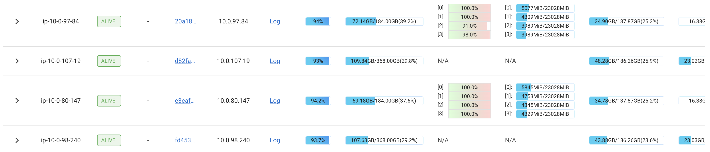
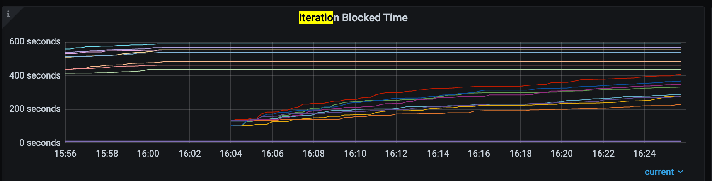
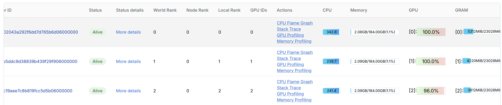
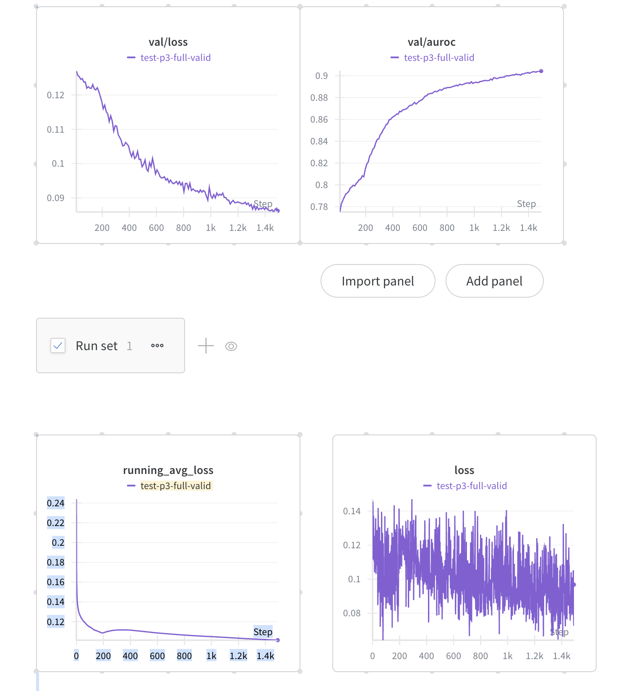
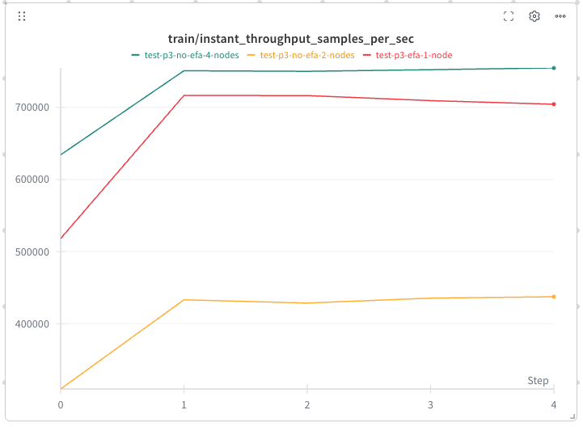
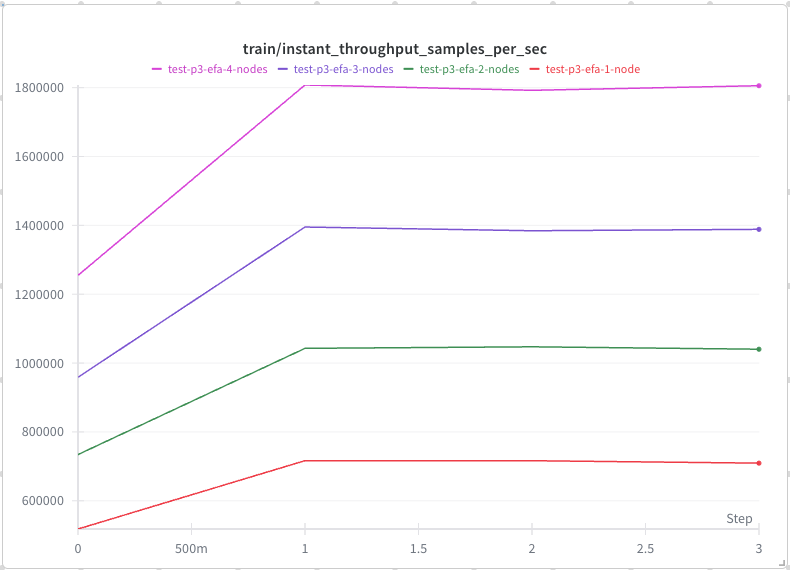

# Ray Train + Ray Data + DLRM + Criteo

This report demonstrates training a DLRM model on the Criteo dataset using Ray Train and Ray Data. Compared to [the baseline](https://github.com/mlcommons/training/blob/master/recommendation_v2/torchrec_dlrm/dlrm_main.py), we achieve several improvements with a straightforward setup:

* Process training data on-the-fly during training
* Enable multi-node distributed training
* Profile the program using Ray Data metrics and GPU profiler
* Implement checkpointing with fault tolerance


## Workspace Requirements

* To demonstrate Ray’s capability to support heterogeneous clusters, we use a setup consisting of two g5.12xlarge nodes and two r7i.12xlarge nodes.

## Import the Configs


```python
# Note: we reduce the embedding table size to make it able to run in A10 GPUs.
from configs import RecsysConfig
import os

recsys_config = RecsysConfig()
# We use 2 g5.12xlarge nodes
recsys_config.num_workers = 8

# Enable Ray Train V2
os.environ['RAY_TRAIN_V2_ENABLED'] = '1'
```

## Ray Data for Criteo Dataset

Instead of processing the training data offline, we process it on-the-fly and overlap with training. This approach includes several steps:

* Load the feature mapping table into the [object store](https://docs.ray.io/en/latest/ray-core/key-concepts.html#objects). The benefit of the object store is that processes on the same node can share memory efficiently.
* Start the Ray Data pipeline, which:
    * Reads the raw training data
    * Fills missing data
    * Looks up the feature mapping table to transform categorical features into feature IDs
    * Concatenates and normalizes the features

#### Lazily Load the Feature Mapping Table into the Object Store


```python
import ray
from typing import Dict
from criteo import read_feature_mapping_table, DEFAULT_CAT_NAMES

def build_categorical_to_feature_mapping_refs() -> Dict[str, ray.ObjectRef]:
    return {
        cat_feature: read_feature_mapping_table.remote(cat_feature) for cat_feature in DEFAULT_CAT_NAMES
    }

# After running this, the task `read_feature_mapping_table` will run in the background.
categorical_to_feature_mapping_refs = build_categorical_to_feature_mapping_refs()

```

#### Build the Ray Data Pipeline


```python
import ray
import pyarrow.csv
from criteo import TRAIN_DATASET_PATH, VAL_DATASET_PATH, DEFAULT_COLUMN_NAMES, fill_missing, map_features_to_indices, concat_and_normalize_dense_features
from typing import Tuple

def get_ray_dataset(path: str) -> ray.data.Dataset:
    categorical_to_feature_mapping_refs = build_categorical_to_feature_mapping_refs()
    dataset_path = path
    ds = ray.data.read_csv(
        dataset_path,
        read_options=pyarrow.csv.ReadOptions(column_names=DEFAULT_COLUMN_NAMES),
        parse_options=pyarrow.csv.ParseOptions(delimiter="\t"),
        ray_remote_args={
            # reading is memory intensive
            'memory': 800 * 1024 * 1024,  # 800 MB
        },
        shuffle=(
            "files"
        ),  # coarse file-level shuffle
    )
    ds = ds.map_batches(fill_missing)
    ds = ds.map_batches(map_features_to_indices, fn_kwargs={"categorical_to_feature_mapping_refs": categorical_to_feature_mapping_refs})
    ds = ds.map_batches(concat_and_normalize_dense_features)
    return ds

train_dataset = get_ray_dataset(TRAIN_DATASET_PATH)
val_dataset = get_ray_dataset(VAL_DATASET_PATH)

```

## Set Up Model and Build Train Function

To integrate the [TorchRec implementation](https://github.com/facebookresearch/dlrm/blob/main/torchrec_dlrm/dlrm_main.py) with Ray Train, minor modifications are required:

* Call `ray.train.get_dataset_shard('train')` to obtain the dataloader
* Use Ray Train APIs to fetch ranks and world sizes

Check [TorchRecWrapper](torchrec_wrapper.py) for implementation details.

Note: We need to initialize TorchRecWrapper inside the training function, where the training worker has completed initialization.

Within the training loop, we enable fault tolerance using checkpoints provided by Ray Train.


```python
from torchrec_wrapper import train_loop

```

## Define TorchTrainer and Start Training

We define the `TorchTrainer` and run `fit()`. Key points to note:

* By configuring `scaling_config.num_workers`, we can easily enable multi-node distributed training. In this notebook, we use 2 g5.12xlarge nodes, providing 8 GPUs in total.
* Setting `{"KINETO_USE_DAEMON": "1", "KINETO_DAEMON_INIT_DELAY_S": "5"}` according to [GPU profiling guidelines](https://docs.anyscale.com/monitoring/workload-debugging/profiling-tools) enables easy profiling of GPU events on any worker.
* The remaining CPUs are allocated for Ray Data processing.


```python
from ray.train.torch import TorchTrainer
from ray.train import ScalingConfig, RunConfig, CheckpointConfig, FailureConfig
import logging

logger = logging.getLogger(__name__)

scaling_config = ScalingConfig(
    num_workers=recsys_config.num_workers,
    # reserve CPUs to the training workers can make the training more stable.
    resources_per_worker={"GPU": 1, "CPU": 5},
    use_gpu=True,
)

config_dict = {}
for attr in dir(recsys_config):
    if not attr.startswith('_'):
        value = getattr(recsys_config, attr)
        if not callable(value):
            config_dict[attr] = value

logger.info(f"Starting Ray training with {recsys_config.num_workers} workers")
logger.info(f"Training configuration: {config_dict}")

# Create TorchTrainer
trainer = TorchTrainer(
    train_loop_per_worker=train_loop,
    train_loop_config=config_dict,
    scaling_config=scaling_config,
    run_config=RunConfig(
        failure_config=FailureConfig(max_failures=2),
        worker_runtime_env={'env_vars': {"KINETO_USE_DAEMON": "1", "KINETO_DAEMON_INIT_DELAY_S": "5"}},
        checkpoint_config=CheckpointConfig(
            num_to_keep=1,
        ),
        storage_path=recsys_config.checkpoint_dir,
    ),
    datasets={
        "train": train_dataset,
        "val": val_dataset,
    },
)

# Run training
logger.info("Starting distributed training...")
result = trainer.fit()

logger.info("Training completed successfully!")
logger.info(f"Final metrics: {result.metrics}")
```

You can see how the workloads are distributed across GPU and CPU machines.



## Ray Data Metrics

Ray Data metrics dashboards provide numerous useful tools for understanding the training pipeline.

For example, `Iteration Blocked Time` is a valuable metric for identifying data loading bottlenecks. If this value consistently increases over time, it indicates that the model is frequently waiting for data, suggesting that the training pipeline is bottlenecked by data loading.



## GPU Profiling

If you set the environment variables `"KINETO_USE_DAEMON": "1", "KINETO_DAEMON_INIT_DELAY_S": "5"`, you can profile GPU metrics with one click.



## Model Quality

We achieve comparable training loss and validation performance to the baseline. The training loss curve appears spiky due to the presence of numerous sparse features in the model.



## Throughput Benchmark

We compare the baseline and Ray Train versions under several conditions:

* Baseline (torchrun), single p4d, processed numpy data took 7 minutes to download locally. Throughput: 1,020k
* Ray Train, single p4d, training data processed on-the-fly: data loading becomes the bottleneck. Throughput: 220k
* Ray Train, single p4d + 1 r7i, throughput: 800k
* Ray Train, single p4d + 2 r7i, throughput: 925k

From the benchmarks, we can observe:

* The task is data-loading bounded, and adding more CPU machines can mitigate this bottleneck. This demonstrates the strength of Ray Train.

## Multi-node Scalability with EFA

By following [Cluster-level EFA configuration](https://docs.anyscale.com/configuration/compute/aws#cluster-level-efa-configuration), we can enable EFA on the Anyscale platform, which is critical for multi-node training.

We conduct two sets of experiments on `p3dn.24xlarge` machines.

### Without EFA

The throughput on 2 nodes is worse than on 1 node.



### With EFA

With EFA enabled, we observe clear scalability as the number of nodes increases.



