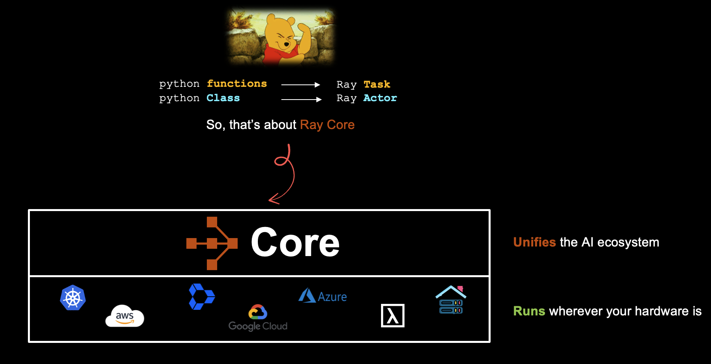

# Module 1: Scaling Python for AI Workloads

**Duration:** 45 minutes

## Overview

Learn Ray's core concepts, including tasks, actors, and the object store. This module covers the fundamental building blocks of Ray that enable you to distribute Python workloads across multiple CPU cores and machines. By the end, you'll understand how to parallelize your code with minimal changes and leverage Ray's distributed computing power.

**Key Topics:**
- Remote task execution with `@ray.remote`
- Asynchronous execution and parallel speedup
- Ray object store and data sharing
- Stateful actors for distributed services
- Patterns: fan-out/fan-in, task pipelines, ActorPool

  

## Notebooks

### 1. [01_Ray_Core_Tasks.ipynb](01_Ray_Core_Tasks.ipynb)

**Introduction to Ray Tasks and the Object Store**

Master the fundamentals of Ray tasks for parallel computing.

**Topics covered:**
- What is Ray and why distributed computing matters
- Defining remote tasks with `@ray.remote`
- Executing tasks asynchronously with `.remote()` and retrieving results with `ray.get()`
- Parallel vs. serial execution
- Ray object store: `ray.put()` and pass-by-reference patterns
- Task chaining and ObjectRef dependencies
- Task retries and fault tolerance
- Runtime environments and resource allocation (`num_cpus`, `num_gpus`, fractional resources)
- Nested tasks (tasks spawning tasks)
- Pipeline data processing with `ray.wait()` for streaming results

### 2. [02_Ray_Core_Actors.ipynb](02_Ray_Core_Actors.ipynb)

**Stateful Distributed Services with Ray Actors**

Build and manage stateful distributed services using Ray actors.

**Topics covered:**
- Actor fundamentals: stateful remote classes with `@ray.remote`
- Creating actor instances and calling methods with `.remote()`
- Actor state management, sequential consistency, and thread safety
- Fault tolerance: `max_restarts`, checkpointing, detached actors
- Multithreaded actors with `max_concurrency`
- Async actors with `asyncio` support and concurrency groups
- `ray.util.ActorPool` for batch processing and load balancing
- Actor resource scheduling

## Extra Learning Material

After the workshop, explore these notebooks in the `extra/` folder for deeper understanding:

| Notebook | Description |
|----------|-------------|
| `00_Ray_Tasks_Fundamentals.ipynb` | Foundational deep dive into Ray tasks: submission, execution, ObjectRef lifecycle, and data serialization patterns |
| `01_Ray_Tasks_Advanced.ipynb` | Advanced task patterns: error handling, retries, runtime environments, resource allocation, and Ray generators |
| `02_Ray_Theory_Deep_Dive.ipynb` | Ray internals: cluster components, task/object lifecycle, distributed scheduling, fault tolerance, and memory model |
| `03_Ray_Actor_Distributed_Training.ipynb` | Distributed training with Ray Actors: worker orchestration, PyTorch DDP process groups, and collective operations |

## Next Steps

After completing this module, continue to [**Module 2**](../Module2/) to learn how to build scalable data pipelines with Ray Data.
