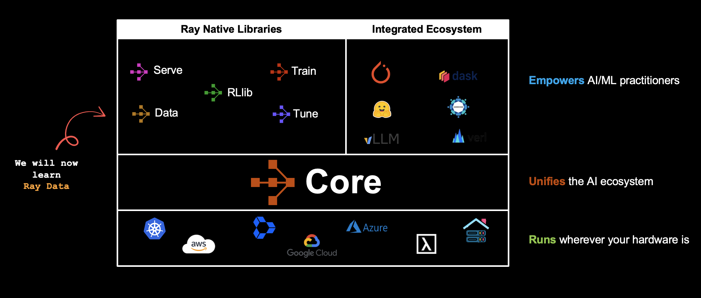

# Module 2: Building Scalable Data Pipelines

**Duration:** 45 minutes

## Overview

Build production-grade data pipelines using Ray Data. This module teaches you to ingest, transform, and process large datasets at scale using Ray's streaming execution engine. You'll work with structured data, perform dataset joins, run GPU-accelerated batch inference, and compose multi-stage pipelines with LLM and image generation models.

**Key Topics:**
- Loading and transforming data with Ray Data
- Streaming execution and lazy evaluation
- Stateful transforms with actor-based processing
- Dataset joins and multi-stage pipeline composition
- GPU-accelerated batch inference with fractional resource scheduling

  

## Notebooks

### 1. [00_Introduction_Ray_Data.ipynb](00_Introduction_Ray_Data.ipynb)

**Getting Started with Ray Data**

Learn Ray Data fundamentals for distributed data processing.

**Topics covered:**
- When to use Ray Data: large datasets, reliable pipelines, hardware utilization
- Three-step workflow: Load, Transform, Consume
- Loading data: `read_parquet()`, `read_csv()`, `read_images()`
- Lazy execution model and blocks as basic units
- Transformations with `map_batches()`
- Ray Data Expressions with `col()` and `@udf`
- Resource specification: `num_cpus`, `num_gpus`, memory
- Materializing datasets and writing to storage (`write_parquet()`, `write_csv()`)

### 2. [01_Multimodal_Data_Processing.ipynb](01_Multimodal_Data_Processing.ipynb)

**End-to-End Multimodal Data Pipeline**

Build a complete production pipeline combining image generation, LLM enhancement, and dataset operations.

**Topics covered:**
- Data preparation and loading CSV datasets with Ray Data
- Stateful batch inference with callable classes (`map_batches()`)
- Image generation at scale using Stable Diffusion XL (`diffusers`)
- Dataset joins with `ray.data.join()`
- LLM-enhanced prompt generation using `transformers`
- Fractional GPU scheduling (`num_gpus=0.6`) for efficient resource utilization
- `ActorPoolStrategy` for controlling parallelism
- Multi-stage pipeline composition with different batch sizes per stage
- Output persistence to Parquet and image files

## Supporting Files

- **`data/`**: Sample datasets (`animals.csv`, `outfits.csv`) used in the multimodal pipeline notebook
- **`code/`**: Helper utility scripts
- **`assets/`**: Diagrams and images referenced in the notebooks
- **`requirements.txt`**: Module-specific dependencies (transformers, diffusers, accelerate)

## Extra Learning Material

After the workshop, explore these notebooks in the `extra/` folder for deeper understanding:

| Notebook | Description |
|----------|-------------|
| `00_Ray_Data_Architecture.ipynb` | Ray Data architecture deep dive: streaming execution, operators, resource management, backpressure, and autoscaling |
| `01_Ray_Data_Patterns_Anti_Patterns.ipynb` | Best practices for Ray Data: column pruning, filter pushdown, materialization strategies, and common pitfalls to avoid |

## Next Steps

After completing this module, continue to [**Module 3**](../Module3/) to learn distributed model training with Ray Train.
