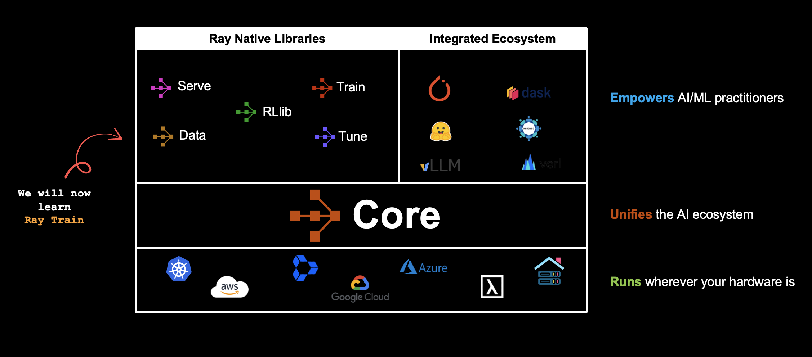

# Module 3: Distributed Training at Scale

**Duration:** 45 minutes

## Overview

Scale machine learning model training from a single GPU to distributed clusters using Ray Train. This module covers converting standard PyTorch training loops to distributed training with DDP, integrating Ray Data for scalable data loading, and using FSDP2 for memory-efficient training of models that exceed single GPU capacity.

**Key Topics:**
- Ray Train fundamentals: TorchTrainer, ScalingConfig, RunConfig
- Converting single-GPU PyTorch to multi-worker distributed training
- Integrating Ray Data for scalable, pipelined data loading
- FSDP2 (Fully Sharded Data Parallel) for large model training
- Checkpointing, mixed precision, and memory optimization

  

## Notebooks

### 1. [01_Distributed_training_with_Ray.ipynb](01_Distributed_training_with_Ray.ipynb)

**From Single-GPU to Distributed Training with Ray Train**

A three-part progression from baseline PyTorch to fully distributed training with Ray Data integration.

**Topics covered:**
- **Part 1: Single-GPU baseline:** Standard PyTorch training loop with a Vision Transformer on CIFAR-10
- **Part 2: Distributed training with Ray Train:**
  - `TorchTrainer` and `ScalingConfig` for multi-worker setup
  - `prepare_model()` (DDP wrapping) and `prepare_data_loader()` (data sharding)
  - Reporting metrics and checkpoints with `ray.train.report()`
- **Part 3: Ray Data integration:**
  - Loading data from S3 Parquet with `ray.data.read_parquet()`
  - `get_dataset_shard()` and `iter_torch_batches()` for distributed data consumption
  - Benefits: separate data scaling from model scaling, pipeline parallelism

### 2. [02_FSDP2_RayTrain_Tutorial.ipynb](02_FSDP2_RayTrain_Tutorial.ipynb)

**Memory-Efficient Training with FSDP2**

Advanced distributed training using PyTorch's Fully Sharded Data Parallel for models larger than single GPU memory.

**Topics covered:**
- DDP vs. FSDP: replication vs. sharding trade-offs
- FSDP2 sharding strategies and auto-wrap policies
- Mixed precision training with `autocast()`
- CPU offloading for memory savings
- Gradient accumulation techniques
- Distributed checkpointing with PyTorch DCP
- Multi-node FSDP training configuration

## Extra Learning Material

After the workshop, explore these notebooks in the `extra/` folder for deeper understanding:

| Notebook | Description |
|----------|-------------|
| `01_Ray_Train_Architecture.ipynb` | Ray Train architecture overview: trainer lifecycle, distributed checkpointing, fault tolerance, and data ingestion patterns |
| `02_Ray_Train_Internals.ipynb` | Deep dive into Ray Train execution: trainer execution flow, checkpoint lifecycle, and Ray Data streaming split internals |
| `03_Finetune_LLMs_with_Ray_Train.ipynb` | End-to-end LLM fine-tuning with Ray Train: dataset preparation, LoRA/PEFT, DeepSpeed integration, and distributed checkpointing |

## Next Steps

After completing this module, continue to [**Module 4**](../Module4/) to learn how to deploy trained models as scalable inference services with Ray Serve.
