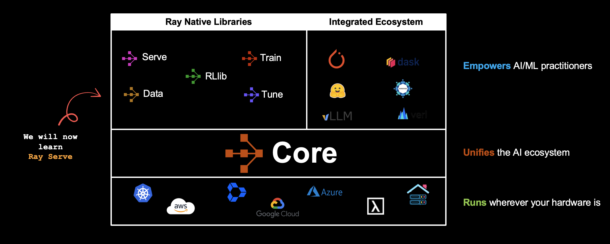

# Module 4: Serving Models in Production

**Duration:** 30 minutes

## Overview

Deploy ML models as scalable inference services using Ray Serve. This module covers building model deployments, composing multiple models into pipelines, integrating with FastAPI for HTTP endpoints, and managing GPU resources with fractional allocation.

**Key Topics:**
- Ray Serve deployments and replicas
- Converting offline inference to online serving
- Multi-deployment model composition with `DeploymentHandle`
- FastAPI integration with `@serve.ingress`
- Fractional GPU resource management

  

## Notebook

### 1. [01_Intro_Serve.ipynb](01_Intro_Serve.ipynb)

**Introduction to Ray Serve: From Offline to Online Inference**

Build scalable model serving applications with Ray Serve, from a simple classifier to a multi-model composition pipeline.

**Topics covered:**
- **Part 1: Basic Image Classification Service:**
  - When to use Ray Serve
  - Converting an offline inference class to a `@serve.deployment`
  - Serving a PyTorch model (MNIST classifier)
  - HTTP request handling and response patterns
  - `serve.run()` and testing with HTTP requests
- **Part 2: Multi-Deployment Model Composition:**
  - Language detection routing (English, German, French)
  - `DeploymentHandle` for inter-deployment communication
  - Sentence embedding models (`sentence-transformers`)
  - FastAPI integration with `@serve.ingress` and Pydantic validation
  - Fractional GPU allocation (`num_gpus=0.25`) for resource efficiency
  - Multi-replica deployment configuration

## Extra Learning Material

After the workshop, explore these notebooks and examples in the `extra/` folder for deeper understanding:

| Notebook | Description |
|----------|-------------|
| `00_Ray_Serve_Architecture.ipynb` | Ray Serve internals: proxy, controller, replicas, request routing, fault tolerance, and load shedding |
| `01_High_Throughput_Serving.ipynb` | Throughput-optimized mode using gRPC for inter-replica communication and payload serialization |
| `01a_Autoscaling.ipynb` | Autoscaling configuration: target ongoing requests, scaling delays, replica startup, and resource budgets |
| `01b_Custom_Autoscaling.ipynb` | Custom autoscaling policies: schedule-based, resource-based, Prometheus-based, and external autoscaling |
| `02_Observability_Guide.ipynb` | Monitoring with Grafana dashboards: metrics, latency analysis, autoscaling debugging, and request batching |
| `03_Ray_Actors_in_Detail.ipynb` | Comprehensive actor guide: creation, scheduling, failure handling, concurrency groups, and resource management |
| `04_Async_Inference_Guide.ipynb` | Asynchronous inference APIs: decoupled submission/retrieval, task consumers, Celery integration |
| `05_Performance_Optimization.ipynb` | Optimization techniques: dynamic request batching, model multiplexing, and request pipelining with streaming |

The `extra/examples/` directory also contains runnable code examples:
- **`autoscaling-load-testing/`**: Load testing with Locust and deployment scripts
- **`custom-autoscaling-experiments/`**: Custom autoscaling policy implementations
- **`dynamic_batching/`**: Dynamic request batching example
- **`by_reference_demo.py`**: Object reference passing patterns

## Resources

- [Ray Serve Documentation](https://docs.ray.io/en/latest/serve/)
- [Ray Serve API Reference](https://docs.ray.io/en/latest/serve/api/)
- [Ray Community Slack](https://ray-project.slack.com/)
