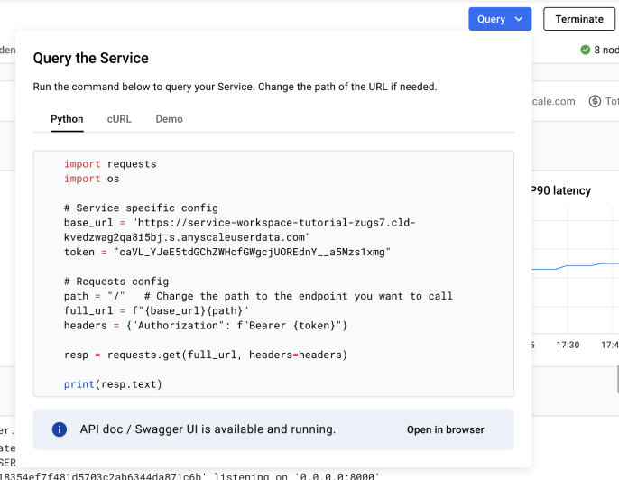

# Serving a Stable Diffusion Model with Ray Serve
This template shows you how to develop and test the model locally and deploy it into production.

## Step 1: Deploy the model locally
Open a terminal in VS Code. Run and test your serve deployment logic locally.
```bash
serve run app:entrypoint
```

## Step 2: Send test requests to the running model
Start a new terminal and send the requests. Make sure your model returns desired output.
```bash
python query.py
```

## Step 3: Deploy the model as an Anyscale Service
Deploy it as an Anyscale Service for staging or production traffic.

```bash
serve run app:entrypoint --publish
```


## Step 4: Query your Anyscale Service
Navigate to Service UI with the URL generated from the previous step, click **Query** butoton to get detailed query instructions and intregate it into your own app.




------

## What's next.   

Vola! You have deployed a Stable Diffusion model. Want more than this? Check out more advanced tutorials below 
- [Comprehensive workthrough](./tutorials/walkthrough.md)