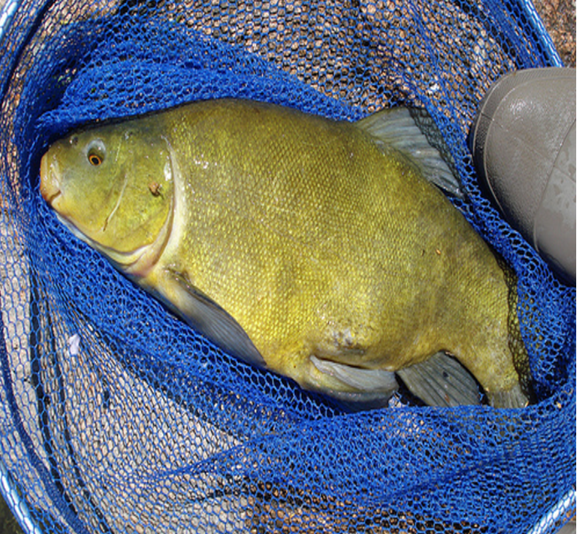
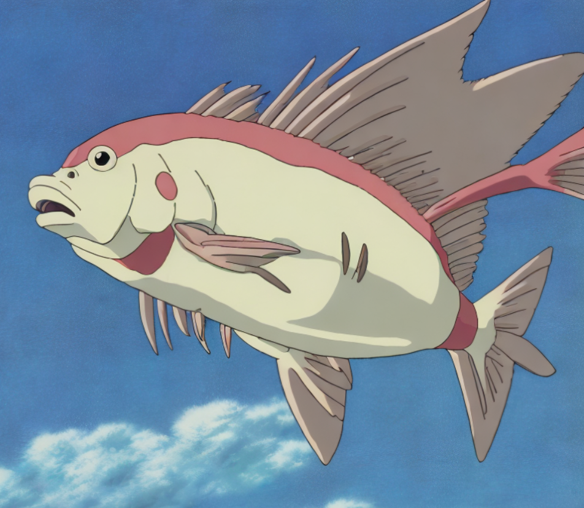

# Stable Diffusion Image-to-Image and Video-to-Video Demo

## Stable Diffusion img2img
Use *StableDiffusionImg2ImgPipeline* from Huggingface diffusers package to perform image to image conversion. Use **Ray Data**'s batch inference feature to process multiple images.  
Here is an example of a picture of a fish converted to ghibli manga style.  

Run the demo in `img2img.ipynb` notebook.    

## Stable Diffusion video2video
Use *OpenCV* to extract frame images from a video and performan image to image conversion, then generate a video with processed images. You will see the generated video at `car_video/output_video.avi` after running the `video2video.ipynb` notebook.  
