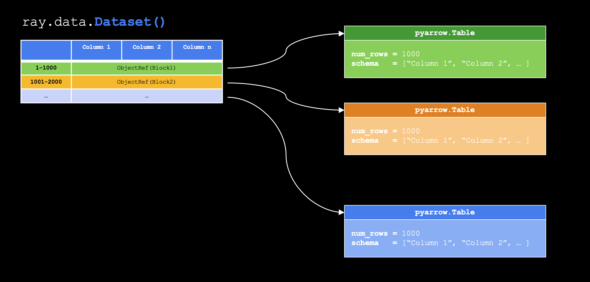

# Building Scalable AI with Ray - Virtual Hands-On Lab

This repository contains materials for the **Live Virtual Hands-On Lab: Building Scalable AI with Ray**, where ML engineers and platform engineers explore how to use Ray for distributed data processing, model training, and real-time inference with the Anyscale Platform.

## What You'll Learn

In this virtual session, you'll learn how to use Ray to:

- **Ingest data at scale** - Load and process large datasets efficiently across distributed systems
- **Transform data using Ray Data pipelines and operators** - Build scalable data transformation workflows
- **Join Ray Datasets and apply transformations to joined columns** - Combine multiple data sources and process them together
- **Run batch inference on GPUs at scale** - Leverage GPU resources for high-throughput ML inference
- **Integrate LLM inference with fractional resource scheduling** - Optimize resource utilization for large language models

This free lab is more than a webinar. You'll leave with a working understanding of Ray, a reusable project you can build on, and a clear view of how Ray and Anyscale work together to accelerate AI development.

## Contents

### Main Lab Notebook: `VHOL.ipynb`

The main hands-on lab notebook (`VHOL.ipynb`) guides you through building a complete scalable AI pipeline. You'll work through:

1. **Introduction to Ray** - Learn core Ray concepts including tasks, actors, and the Ray ecosystem

   

2. **Introduction to Ray Data** - Understand streaming execution, blocks, and distributed data processing

   

   **Traditional Bulk Processing:**  
     
   
   **Streaming Execution**: Ray Data processes large datasets efficiently using a streaming model with blocks as the basic units of data, enabling pipeline parallelism and memory-efficient processing.

     
   - Enables pipeline parallelism, allowing data to flow through multiple processing stages concurrently for increased efficiency.

3. **Building a Scalable AI Pipeline** - Create an end-to-end pipeline that:
   - Ingests image prompts and metadata from CSV files
   - Transforms and enriches prompts using Ray Data operators
   - Joins multiple datasets (animals and clothing details)
   - Generates images at scale using distributed GPU inference
   - Enhances prompts with LLM-based transformations
   - Exports results to storage (Parquet and PNG formats)

**Scenario**: You'll build a pipeline that combines animal prompts with clothing details, enhances them using an LLM, and generates images using a text-to-image model—all orchestrated at scale with Ray Data.

**Key Learning Points**:
- Ray Data's streaming execution model for memory-efficient processing
- Actor-based patterns for stateful operations (like model loading)
- Fractional GPU scheduling for optimal resource utilization
- Dataset joins and transformations in distributed settings
- Parameterization and separation of concerns in ML pipelines

