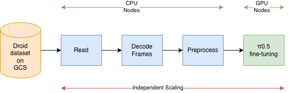

# Distributed Vision-Language-Action (VLA) Model Fine-tuning with Ray

This template implements an end-to-end distributed fine-tuning pipeline for the [PI0.5](https://www.physicalintelligence.company/blog/pi05) Vision-Language-Action (VLA) model on the [Droid v1.0.1](https://droid-dataset.github.io/) robot manipulation dataset using [Ray](https://docs.ray.io/) on [Anyscale](https://anyscale.com).

It leverages Ray's ability to independently scale two distinct compute tiers — CPU nodes for streaming data preprocessing and GPU nodes for distributed training — so that neither side sits idle and GPU stalls waiting for data are eliminated.



For the full walkthrough, open **[vla.ipynb](vla.ipynb)**.

## Setup

### Dependencies

This template uses [uv](https://docs.astral.sh/uv/) for dependency management. Before running the notebook, open a terminal in the workspace and run:

```bash
uv sync
```

When prompted for a Jupyter kernel, select the Python environment named **vla** (`.venv/bin/python`).

### HuggingFace Token

PI0.5 depends on [google/paligemma-3b-pt-224](https://huggingface.co/google/paligemma-3b-pt-224) as a vision backbone. Google requires you to **accept the model license** before the weights can be downloaded.

1. Navigate to the [google/paligemma-3b-pt-224 model page](https://huggingface.co/google/paligemma-3b-pt-224) and accept the license agreement.
2. Generate an access token at [huggingface.co/settings/tokens](https://huggingface.co/settings/tokens).
3. Export the token before running the notebook:

```bash
export HF_TOKEN=hf_...
```

Without both steps, the model download will fail with a 401/403 error.
