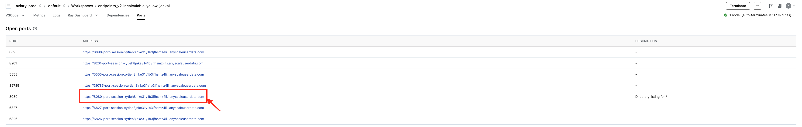

# Deploy, configure, and serve LLMs

**⏱️ Time to complete**: 10 min

Ready for some adventure into multi-modal models? Vision language model support is now added to RayLLM. The current support includes LlaVA-NeXT models with dynamic image resolution. Meta AI’s Chameleon, with its early fusion architecture, will come soon.

In this example, we will use RayLLM to serve [llava-hf/llava-v1.6-mistral-7b-hf](https://huggingface.co/llava-hf/llava-v1.6-mistral-7b-hf). We will build a Gradio application that brings art to life with ekphrasis, specially designed for kids. Imagine turning kid drawings into whimsical verses and delightful rhymes. Now let’s buckle up and dive into the fun! 🎨🚀

**Note**: This guide is hosted within an Anyscale workspace, which provides easy access to compute resources. Check out the `Introduction to Workspaces` template for more details.

## Step 1 - Run the model locally in the Workspace

We provide a starter command to run vision language models via Ray Serve. To generate the configuration file, run the following command directly in your terminal:
```
python generate_config.py
```

**Note:** This command requires interactive inputs and should be executed directly in the terminal, not within a Jupyter notebook cell.

The command will generate 2 files - a model config file (saved in `model_config/`) and a serve config file (`serve_TIMESTAMP.yaml`) that you can reference and re-run in the future.

If you didn't start the serve application in the previous step, you can start it using the following command (replace the file name with the generated `serve_` file name):


```python
!serve run serve_TIMESTAMP.yaml
```

## Step 2 - Query the model

### Example data to query with

Run the following command to download a few example kid drawings.


```python
!bash download.sh
```

**Note:** The download path is under `/mnt/local_storage`, an NVME backed file system configured by Anyscale workspace for fast data access.

To inspect the downloaded images in the workspace, the easiest way is to start a local http server using


```python
!python -m http.server 8080 --directory /mnt/local_storage/kid_drawings/
```

Anyscale workspace has port forwarding conveniently configured. Navigate to the “port” tab and click the corresponding url. This will open a local web browser that directly talks to, in our case, the python http server that serves the example images.

<p align="center">
  
</p>

<p align="center">
  
</p>

Here are some example kid drawings.

<p align="center">
  
  
  
</p>

### Query

You can use the OpenAI SDK to interact with the models, ensuring an easy integration for your applications.
Specifically for vision language models, images can be passed in using either image url or based64 encoded string.
Notice that both scripts query in a streaming fashion.

**Note:** LLaVA-NeXT supports only single image and single user message for now.


```python
# Query with image url
from openai import OpenAI


def query(base_url: str, api_key: str):

   client = OpenAI(
     base_url=base_url,
     api_key=api_key,
   )
   chat_completions = client.chat.completions.create(
       model="llava-hf/llava-v1.6-mistral-7b-hf",
       messages=[
           {"role": "user", "content": [
               {"type": "text", "text": "Write me a poetry for kid based on this image."},
               {"type": "image_url", "image_url": {
                   "url": "https://air-example-data-2.s3.amazonaws.com/llava_example_kid_drawings/0.JPG"}}]}
       ],
       temperature=0.01,
       stream=True
   )

   for chat in chat_completions:
       if chat.choices[0].delta.content is not None:
           print(chat.choices[0].delta.content, end="")

query("http://localhost:8000/v1", "NOT A REAL KEY")
```


```python
# Query with base64 encoded string

```python
from openai import OpenAI
import base64


def encode_image_to_base64(image_path):
    with open(image_path, "rb") as image_file:
        return base64.b64encode(image_file.read()).decode('utf-8')

def query(base_url: str, api_key: str):

    client = OpenAI(
      base_url=base_url,
      api_key=api_key,
    )

    path = "/mnt/local_storage/kid_drawings/0.JPG"
    chat_completions = client.chat.completions.create(
        model="llava-hf/llava-v1.6-mistral-7b-hf",
        messages=[
            {"role": "user", "content": [
                {"type": "text", "text": "Write me a poetry for kid based on this image."},
                {"type": "image_url", "image_url": {
                    "url": f"data:image/jpeg;base64,{encode_image_to_base64(path)}"}}]}
        ],
        temperature=0.01,
        stream=True
    )

    for chat in chat_completions:
        if chat.choices[0].delta.content is not None:
            print(chat.choices[0].delta.content, end="")

query("http://localhost:8000/v1", "NOT A REAL KEY")
```

## Step 3 - Run the Gradio application and let’s rock!

To bootstrap a Gradio application, run the following command to start a Gradio application on port 7860. Notice the script uses non streaming query fashion.


```python
!python gradio_app.py
```

We can apply the same trick with port forwarding. And you can see the following Gradio webUI.

Now let’s get ready for some verses and rhymes!

Paste the following url to the input text box and click submit:

https://air-example-data-2.s3.amazonaws.com/llava_example_kid_drawings/0.JPG

<p align="center">
  
</p>

*In a land where books bloom,* \
*A castle of stories, a dreamy room.* \
*Where children explore,* \
*And tales unfold, forevermore.* \

*With steps that lead to the sky,* \
*And a pool that glistens, oh so high.* \
*Where laughter echoes,* \
*And imagination grows,* \
*In this magical place, where stories flow.* \


# Summary

Congrats! You have now served and queried [llava-hf/llava-v1.6-mistral-7b-hf](https://huggingface.co/llava-hf/llava-v1.6-mistral-7b-hf). As a quick recap, here's what we demonstrated in this notebook:
1. Run the model locally in a workspace.
2. Query the model with images.
3. Build a Gradio application on top.

Hope that you enjoy!
